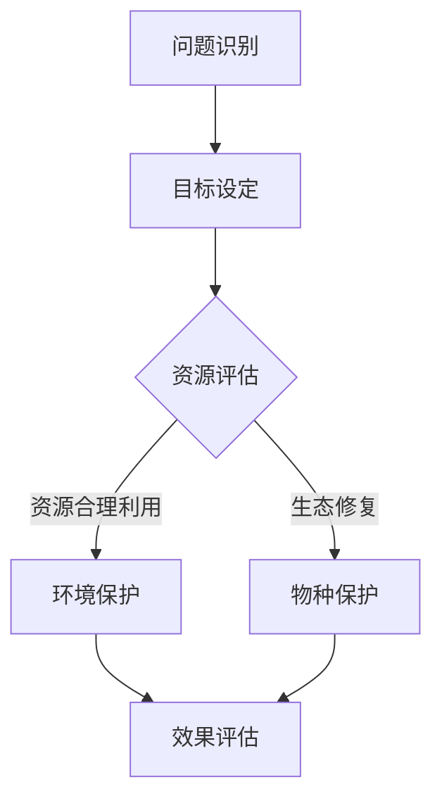
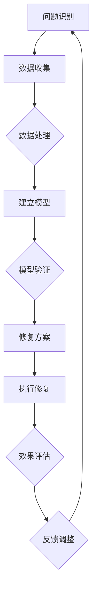
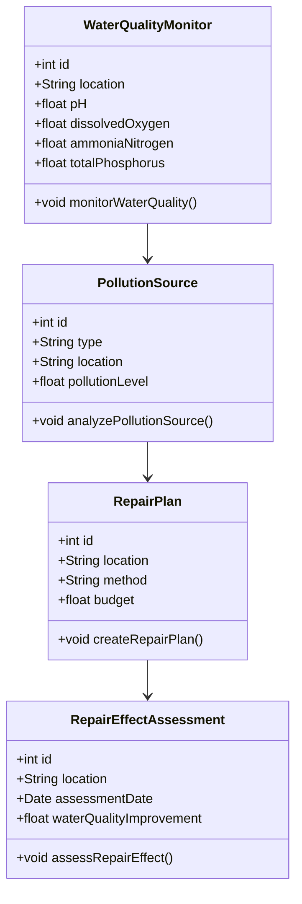
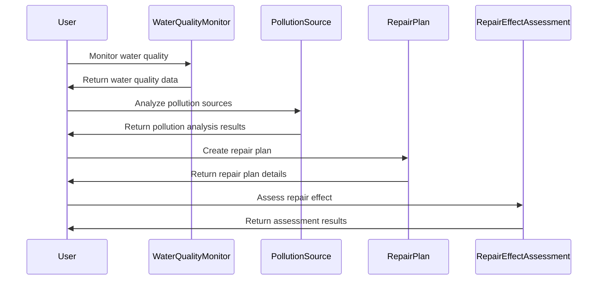
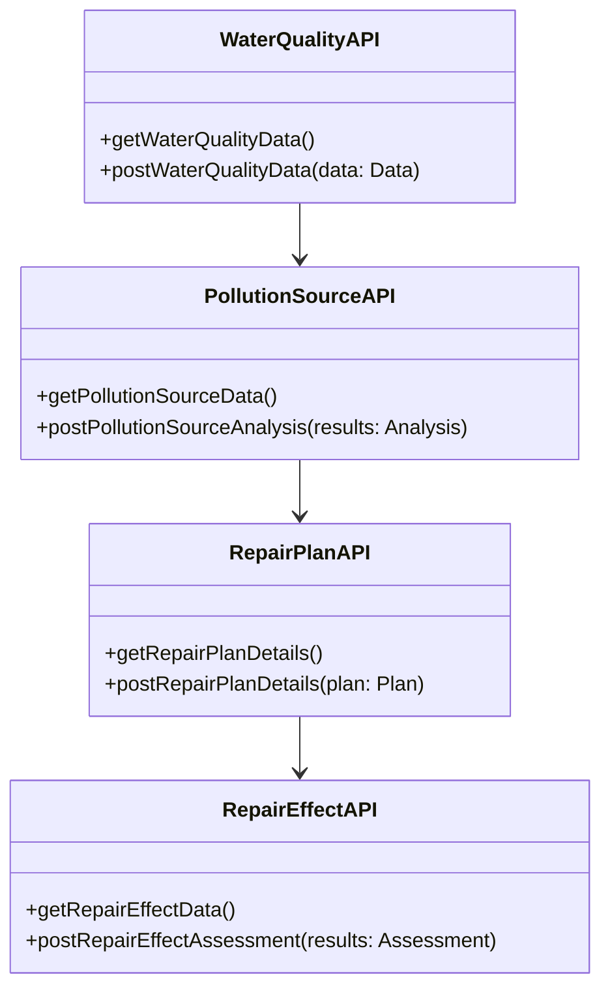
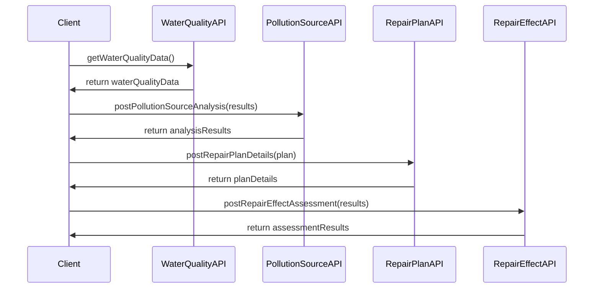

                 

# 跨物种同理心：扩展关怀圈的生态实践

## 关键词

- 跨物种同理心
- 生态实践
- 生态问题
- 社会问题
- 数学模型
- 算法原理
- 系统架构
- 项目实战

## 摘要

本文将深入探讨跨物种同理心的概念及其在生态实践中的重要性。通过分析当前生态问题和社会问题，本文将提出跨物种同理心如何作为一种解决策略，帮助扩展人类关怀圈的边界。文章将详细介绍跨物种同理心的核心概念和原理，运用算法原理和数学模型进行阐述，并通过实际案例和系统架构设计来展示生态实践的应用。最后，本文将提供最佳实践、注意事项和拓展阅读，以促进读者对跨物种同理心及其生态实践的理解和应用。

## 引言：跨物种同理心的重要性

### 问题背景

在当前全球变暖、生物多样性丧失和生态系统失衡的背景下，人类面临着前所未有的生态挑战。这些挑战不仅影响了自然环境的稳定性，也对人类社会产生了深远的影响。生态问题的根源在于人类过度开发和消费自然资源，导致生态系统的破坏和生物栖息地的丧失。同时，社会问题的加剧，如贫困、不平等和环境伦理的缺失，也使得跨物种同理心变得尤为重要。

### 问题描述

生态问题表现为全球气候变暖、海洋污染、森林砍伐、土地退化等。这些问题不仅影响了物种的生存环境，也破坏了地球的生态平衡。社会问题则表现为资源分配不均、环境伦理缺失、人类对自然资源的过度依赖等。这些问题共同加剧了人类与自然环境的矛盾，导致了一系列生态危机和社会问题。

### 问题解决与生态实践

跨物种同理心作为一种生态实践，旨在通过培养人类对其他物种的理解和关怀，扩展人类的关怀圈，从而解决生态和社会问题。它要求我们超越物种的界限，以更加宽容和包容的心态去理解和保护其他生物。生态实践则通过具体的行为和措施，实现跨物种同理心的目标。

### 边界与外延

跨物种同理心不仅限于生物领域，它还涉及到人类与自然环境的互动。因此，生态实践不仅包括保护野生动植物，还包括维护生态系统的完整性和稳定性。此外，跨物种同理心还要求我们关注社会问题，如人类贫困和不平等，因为这些问题的根源也与生态系统的健康密切相关。

### 设计书籍目录大纲的步骤

在设计书籍目录大纲时，我们需要遵循以下步骤：

1. **理解书名和主题**：首先要理解书名《跨物种同理心：扩展关怀圈的生态实践》所表达的主题，即如何通过生态实践来培养和扩展对其他物种的同理心。

2. **确定核心概念**：识别书中要介绍的核心概念，如“跨物种同理心”和“生态实践”。

3. **结构化内容**：将核心概念按照逻辑顺序结构化，确定各个章节的主题。

4. **细化章节内容**：为每个章节细化内容，确保每个章节都有明确的主题和相应的子主题。

5. **编写大纲**：使用markdown格式，按照1、2、3级目录的结构编写大纲。

### 具体步骤

1. **编写背景介绍**：
    - **问题背景**：介绍为什么需要跨物种同理心。
    - **问题描述**：阐述当前的生态问题和社会问题。
    - **问题解决**：说明跨物种同理心和生态实践如何解决这些问题。
    - **边界与外延**：定义跨物种同理心和生态实践的相关边界和扩展。

2. **核心概念与联系**：
    - **核心概念原理**：解释跨物种同理心和生态实践的基本原理。
    - **概念属性特征对比表格**：列出跨物种同理心和生态实践的主要属性和特征，进行比较。
    - **ER实体关系图架构**：绘制ER图，展示各实体之间的关系。

3. **算法原理讲解**：
    - **mermaid流程图**：使用mermaid画出生态实践的相关流程图。
    - **Python源代码**：给出生态实践相关的Python代码示例。
    - **数学模型和公式**：详细阐述数学模型和公式。
    - **举例说明**：用实际例子来说明原理。

4. **系统分析与架构设计方案**：
    - **问题场景介绍**：描述生态实践的具体应用场景。
    - **系统功能设计**：绘制领域模型类图。
    - **系统架构设计**：绘制系统架构图。
    - **系统接口设计和系统交互**：绘制系统接口和交互序列图。

5. **项目实战**：
    - **环境安装**：说明所需环境的安装步骤。
    - **系统核心实现源代码**：提供核心实现的代码。
    - **代码应用解读与分析**：分析代码的作用和实现方式。
    - **实际案例分析和详细讲解剖析**：提供实际案例进行分析。
    - **项目小结**：总结项目经验。

6. **最佳实践 tips、小结、注意事项、拓展阅读等内容**：在最后提供一些建议和小结，帮助读者更好地理解和应用书中的内容。

### 目录大纲（示例）

```markdown
----------------------------------------------------------------
# 《跨物种同理心：扩展关怀圈的生态实践》目录大纲

## 第1章 引言：跨物种同理心的重要性
### 1.1 问题背景
### 1.2 问题描述
### 1.3 问题解决与生态实践
### 1.4 边界与外延

## 第2章 跨物种同理心的核心概念
### 2.1 跨物种同理心的定义
### 2.2 跨物种同理心的属性特征对比
### 2.3 跨物种同理心的ER实体关系图

## 第3章 生态实践的基本原理
### 3.1 生态实践的定义
### 3.2 生态实践的核心概念
### 3.3 生态实践的mermaid流程图

## 第4章 数学模型与算法原理
### 4.1 数学模型
### 4.2 算法原理
### 4.3 算法mermaid流程图
### 4.4 Python源代码示例

## 第5章 系统分析与架构设计
### 5.1 生态实践应用场景
### 5.2 系统功能设计
### 5.3 系统架构设计
### 5.4 系统接口设计
### 5.5 系统交互序列图

## 第6章 项目实战
### 6.1 环境安装
### 6.2 系统核心实现源代码
### 6.3 代码应用解读与分析
### 6.4 实际案例分析与详细讲解
### 6.5 项目小结

## 第7章 最佳实践与拓展
### 7.1 最佳实践Tips
### 7.2 小结
### 7.3 注意事项
### 7.4 拓展阅读

----------------------------------------------------------------
```

这个大纲结构是根据书籍主题和要求设计的，旨在为读者提供一个清晰的阅读路径，并确保内容的完整性和逻辑性。请注意，具体章节名称和内容细节可能需要进一步调整和完善。

## 第1章 引言：跨物种同理心的重要性

### 问题背景

在当今世界，人类活动对自然环境的破坏愈发严重，生态问题成为全球关注的焦点。气候变化、生物多样性丧失、森林砍伐、海洋污染等问题不仅威胁到地球的生态系统，也对人类社会产生了深远的影响。人类在追求经济增长和科技进步的过程中，往往忽视了自然界的脆弱性和生态平衡的重要性。因此，寻找一种能够平衡人类需求与自然保护的方法变得尤为重要。

### 问题描述

生态问题和社会问题的交织使得解决之道变得更加复杂。生态问题主要体现在气候变暖、海洋污染、森林砍伐和土地退化等方面。这些问题不仅破坏了生物多样性，还导致了生态系统的失衡，进一步加剧了人类面临的挑战。社会问题则包括资源分配不均、环境伦理缺失和人类对自然资源的过度依赖等。这些问题往往根植于人类与自然环境的互动方式，需要从更深层次上寻找解决策略。

### 问题解决与生态实践

跨物种同理心作为一种解决策略，旨在通过培养人类对其他物种的理解和关怀，扩展人类的关怀圈，从而解决生态和社会问题。它要求我们超越物种的界限，以更加宽容和包容的心态去理解和保护其他生物。生态实践则通过具体的行为和措施，实现跨物种同理心的目标。

生态实践包括但不限于以下几个方面：

1. **环境保护**：通过减少污染、节约资源、保护生态系统等方式，减少对自然环境的破坏。
2. **物种保护**：通过建立自然保护区、禁止非法捕猎、恢复栖息地等措施，保护野生动植物的生存环境。
3. **生态修复**：通过植树造林、湿地恢复、土壤改良等方式，修复受损的生态系统。
4. **环境教育**：通过教育宣传活动，提高公众对生态问题的认识，培养跨物种同理心。

### 边界与外延

跨物种同理心不仅限于生物领域，它还涉及到人类与自然环境的互动。因此，生态实践不仅包括保护野生动植物，还包括维护生态系统的完整性和稳定性。此外，跨物种同理心还要求我们关注社会问题，如人类贫困和不平等，因为这些问题的根源也与生态系统的健康密切相关。

在生态实践中，我们还需要明确一些边界和范畴：

1. **生态系统的健康**：生态实践的核心目标是维护生态系统的健康，包括生物多样性、生态平衡和生态功能。
2. **可持续性**：生态实践需要考虑长期的可持续性，不仅解决当前的问题，还要为未来留下健康的生态基础。
3. **综合性**：生态实践需要综合运用多种方法和手段，从多个层面和角度来解决问题。

通过跨物种同理心和生态实践，我们可以寻找一条平衡人类需求与自然保护的路径，为地球的可持续发展做出贡献。

### 总结

跨物种同理心作为一种解决生态问题和社会问题的策略，具有深远的意义。它要求我们超越自我，以更加宽广的视角去理解和保护其他生物。生态实践则是实现这一目标的具体行动，通过环境保护、物种保护、生态修复和环境教育等多方面的努力，我们可以为地球的可持续发展做出积极的贡献。在接下来的章节中，我们将进一步探讨跨物种同理心的核心概念和原理，并通过数学模型、算法原理和实际案例来深入理解生态实践的应用。

## 第2章 跨物种同理心的核心概念

### 跨物种同理心的定义

跨物种同理心是一种超越物种界限的关怀和理解能力，它要求我们以其他生物的视角来看待世界，感知它们的痛苦和需求。这种同理心不仅限于人类对其他动物的情感共鸣，还包括人类对植物、微生物以及整个生态系统的关注和尊重。简而言之，跨物种同理心是一种扩展人类关怀圈的理念，它鼓励我们将关怀和同情扩展到所有生命形式。

### 跨物种同理心的属性特征

1. **超越性**：跨物种同理心超越了物种的界限，使我们能够理解和感受不同物种的体验。
2. **包容性**：它包含了对所有生命的尊重和关怀，不论这些生命形式是否与人类有直接的关系。
3. **认知性**：跨物种同理心要求我们通过学习和体验来拓展我们的认知，以更全面地理解不同生物的生存状态和需求。
4. **情感性**：它涉及情感共鸣，使我们在看到其他生物的困境时能够感同身受，激发我们的同情心和行动力。
5. **伦理性**：跨物种同理心具有伦理意义，它促使我们反思我们对其他生物的行为，并引导我们采取更符合伦理标准的行动。

### 跨物种同理心的ER实体关系图

为了更清晰地理解跨物种同理心的构成和运作机制，我们可以通过ER（实体-关系）图来展示其主要实体和关系。

```mermaid
erDiagram
  人 ||--o> 生物
  人 ||--o> 环境
  生物 ||--o> 生态系统
  环境 ||--o> 生态系统
```

在上面的ER图中，我们可以看到以下几个主要实体及其关系：

- **人**：作为主体，人类在跨物种同理心中扮演关键角色。
- **生物**：包括所有非人类生命形式，如动物、植物、微生物等。
- **环境**：指生物生存的物理和化学条件，包括栖息地、气候、资源等。
- **生态系统**：由多种生物和环境因素构成，是跨物种同理心关注的核心。

通过这张ER图，我们可以看到跨物种同理心如何通过人类与生物、环境以及生态系统的关系来实现其理念。

### 跨物种同理心与生态实践的联系

跨物种同理心和生态实践是相辅相成的。生态实践需要基于跨物种同理心的理念来设计和实施，而跨物种同理心则通过生态实践得以体现和深化。具体来说：

1. **环境保护**：基于跨物种同理心，人类会更加关注环境保护，采取减少污染、节约资源和保护生态系统的行动。
2. **物种保护**：跨物种同理心促使人类关注濒危物种的保护，通过建立自然保护区、实施禁猎措施等方式来维护生物多样性。
3. **生态修复**：通过跨物种同理心，人类会积极参与生态修复项目，如植树造林、湿地恢复等，以恢复受损的生态系统。
4. **环境教育**：跨物种同理心推动环境教育的发展，通过提高公众的生态意识，培养更多的人参与到生态实践中来。

### 总结

跨物种同理心是一种重要的生态理念，它不仅扩展了人类的关怀圈，也为生态实践提供了理论基础。通过理解其定义、属性特征和ER实体关系图，我们可以更好地把握跨物种同理心的核心概念，并在实际生态实践中运用这一理念，为地球的可持续发展做出积极贡献。在接下来的章节中，我们将进一步探讨生态实践的基本原理和具体应用。

## 第3章 生态实践的基本原理

### 生态实践的定义

生态实践是指通过一系列具体的行动和措施，旨在保护、修复和维护生态系统的完整性和稳定性的活动。这些实践不仅包括环境保护和物种保护，还涉及生态修复、可持续发展等多个方面。生态实践的核心目标是通过改善人类与自然环境的互动关系，实现生态系统的健康和可持续发展。

### 生态实践的核心概念

1. **生态保护**：生态保护是指通过各种手段来保护自然环境和生物多样性，防止生态系统的进一步破坏。这包括减少污染、控制资源消耗和保护野生动植物的栖息地等。

2. **物种保护**：物种保护是生态实践的一个重要组成部分，旨在保护濒危物种和维持生物多样性。这包括建立自然保护区、实施禁猎禁捕措施、恢复和重建栖息地等。

3. **生态修复**：生态修复是指通过人工或自然的手段，修复和恢复受损的生态系统，使其恢复原有的功能和结构。这包括植树造林、湿地恢复、土壤改良等。

4. **可持续发展**：可持续发展是指在满足当前人类需求的同时，不损害后代满足自身需求的能力。生态实践强调资源的合理利用和生态系统的健康，以确保长期的可持续发展。

### 生态实践的mermaid流程图

为了更清晰地展示生态实践的基本流程，我们可以使用mermaid工具绘制一个流程图。以下是一个简化的生态实践流程图：



在上面的mermaid流程图中，我们可以看到生态实践的基本步骤：

1. **问题识别**：识别和确定需要解决的生态问题。
2. **目标设定**：根据问题识别的结果，设定具体的生态保护目标。
3. **资源评估**：评估所需的资源，包括人力、物力和财力。
4. **环境保护**：采取行动减少污染，保护自然环境和生物多样性。
5. **生态修复**：针对受损的生态系统进行修复和恢复。
6. **物种保护**：采取措施保护濒危物种和维持生物多样性。
7. **效果评估**：对生态实践的效果进行评估，以确保目标的实现。

### Python源代码示例

为了更好地理解生态实践的具体应用，我们可以通过Python代码来模拟一个简单的生态修复项目。以下是一个示例代码，用于计算植树造林的覆盖率：

```python
def calculate_coverage(area, trees_per_acre):
    """
    计算植树造林的覆盖率。

    :param area: 植树面积（英亩）
    :param trees_per_acre: 每英亩的树的数量
    :return: 覆盖率（百分比）
    """
    total_trees = area * trees_per_acre
    coverage = (total_trees / (area * 10**4)) * 100  # 转换为百分比
    return coverage

# 示例数据
area = 50  # 植树面积50英亩
trees_per_acre = 100  # 每英亩植树100棵

# 计算覆盖率
coverage = calculate_coverage(area, trees_per_acre)
print(f"植树覆盖率：{coverage:.2f}%")
```

在这个示例中，我们定义了一个函数`calculate_coverage`，用于计算给定植树面积和每英亩植树数量的覆盖率。通过调用这个函数，我们可以得到一个具体的覆盖率值，从而评估生态修复的效果。

### 数学模型和公式

在生态实践中，数学模型和公式是重要的工具，用于描述和预测生态系统的行为和变化。以下是一个简化的生态模型，用于描述生物种群的增长和扩散：

$$
N(t) = N_0 e^{rt}
$$

其中：
- $N(t)$ 是时间 $t$ 时的生物种群数量。
- $N_0$ 是初始种群数量。
- $r$ 是种群增长率。
- $e$ 是自然对数的底。

通过这个模型，我们可以预测给定时间内的生物种群数量，从而为物种保护和生态修复提供依据。

### 举例说明

假设某地区初始有1000只兔子，种群增长率为10%，我们可以使用上述模型来预测一年后的兔子数量：

$$
N(1) = 1000 e^{0.1 \times 1} \approx 1000 \times 1.105 = 1105
$$

因此，一年后该地区的兔子数量预计为1105只。

通过具体的数学模型和公式，我们可以更准确地分析和预测生态系统的变化，为生态实践提供科学依据。

### 总结

生态实践的基本原理涵盖了从问题识别到效果评估的多个环节，通过环境保护、物种保护和生态修复等具体行动，实现生态系统的健康和可持续发展。通过mermaid流程图和Python代码示例，我们可以更直观地理解生态实践的应用。数学模型和公式的引入，则为生态实践提供了科学的分析和预测工具。在接下来的章节中，我们将进一步探讨系统分析与架构设计，以深入理解生态实践的实施方法和效果。

## 第4章 数学模型与算法原理

### mermaid流程图

为了更好地理解生态实践中的数学模型和算法原理，我们可以通过mermaid流程图来展示一个典型的生态监测与修复流程。



在上面的mermaid流程图中，我们可以看到以下几个关键步骤：

1. **问题识别**：确定需要解决的生态问题。
2. **数据收集**：收集与问题相关的数据，如生物种群数量、污染程度、土壤质量等。
3. **数据处理**：对收集到的数据进行分析和处理，为建立模型提供基础。
4. **建立模型**：基于收集到的数据，建立数学模型来描述生态系统的行为。
5. **模型验证**：验证模型的准确性，确保其能够有效预测生态系统变化。
6. **修复方案**：根据模型预测结果，制定具体的修复方案。
7. **执行修复**：实施修复措施，如植树造林、污染治理等。
8. **效果评估**：评估修复措施的效果，确保生态系统得到改善。
9. **反馈调整**：根据效果评估结果，调整修复方案，并进行下一轮监测和修复。

### Python源代码示例

为了更具体地展示算法原理，我们可以通过Python代码实现一个简单的生态监测系统。以下是一个示例代码，用于监测某个地区的生物多样性指数。

```python
import numpy as np

def biodiversity_index(species_counts):
    """
    计算生物多样性指数。

    :param species_counts: 不同物种的数量列表
    :return: 生物多样性指数
    """
    total_species = len(species_counts)
    total_individuals = sum(species_counts)
    pi = [count / total_individuals for count in species_counts]
    diversity = -sum(p * np.log(p) for p in pi)
    return diversity

# 示例数据
species_counts = [50, 30, 20, 10]  # 不同物种的数量

# 计算生物多样性指数
bidiversity = biodiversity_index(species_counts)
print(f"生物多样性指数：{bidiversity:.2f}")
```

在这个示例中，我们定义了一个函数`biodiversity_index`，用于计算给定物种数量列表的生物多样性指数。通过调用这个函数，我们可以得到一个具体的生物多样性指数值，从而评估生态系统的健康状态。

### 算法原理讲解

生物多样性指数（Biodiversity Index）是一种常用的生态学指标，用于衡量生态系统中物种多样性和均匀度。其计算公式如下：

$$
BI = -\sum_{i=1}^{S} p_i \cdot \log(p_i)
$$

其中：
- $BI$ 是生物多样性指数。
- $S$ 是物种总数。
- $p_i$ 是第 $i$ 个物种的个体数量与总个体数量的比例。

这个公式基于Shannon-Wiener指数，它既考虑了物种的多样性（物种总数），又考虑了物种的均匀度（每个物种个体数量的分布）。因此，生物多样性指数能够较全面地反映生态系统的健康状况。

### 数学模型和公式

为了深入理解生态系统的行为和变化，我们可以引入一些数学模型和公式。以下是一个简化的生态模型，用于描述生物种群的增长和扩散：

$$
N(t) = N_0 e^{rt}
$$

其中：
- $N(t)$ 是时间 $t$ 时的生物种群数量。
- $N_0$ 是初始种群数量。
- $r$ 是种群增长率。
- $e$ 是自然对数的底。

这个模型假设生物种群的增长率是恒定的，可以用来预测给定时间内的生物种群数量。通过调整种群增长率 $r$，我们可以模拟不同的生态情景，为生态修复和物种保护提供依据。

### 实例分析

假设某个生态区域的生物种群初始数量为1000只，种群增长率是每年10%。我们可以使用上述模型来预测两年后的种群数量：

$$
N(2) = 1000 \cdot e^{0.1 \cdot 2} \approx 1000 \cdot 1.215 = 1215
$$

因此，两年后该生态区域的生物种群预计为1215只。

通过具体的实例分析，我们可以更直观地理解数学模型和算法原理在生态实践中的应用。这些工具帮助我们更好地预测生态系统变化，从而制定有效的修复和保护策略。

### 总结

数学模型和算法原理是生态实践中不可或缺的工具，通过mermaid流程图和Python代码示例，我们能够更清晰地展示其应用过程。生物多样性指数和种群增长模型为我们提供了量化的方法来评估生态系统的健康状况和预测生物种群的变化。在接下来的章节中，我们将进一步探讨系统分析与架构设计，以深入理解生态实践的实施方法和效果。

## 第5章 系统分析与架构设计

### 问题场景介绍

在生态实践中，系统分析与架构设计是实现生态保护和修复的关键环节。以一个典型的生态系统修复项目为例，我们的目标是修复一个因工业污染而受损的河流生态系统。项目的主要任务包括监测水质、分析污染源、制定修复方案和评估修复效果。

### 系统功能设计

为了实现上述目标，我们需要设计一个综合性的生态系统监测与修复系统。系统的主要功能包括：

1. **水质监测**：实时监测河流中的各项水质指标，如pH值、溶解氧、氨氮、总磷等。
2. **污染源分析**：通过数据分析和模型预测，识别和定位主要的污染源。
3. **修复方案制定**：根据水质监测结果和污染源分析，制定具体的修复方案。
4. **修复效果评估**：实施修复方案后，对水质变化进行持续监测和评估。

为了实现这些功能，我们可以绘制一个领域模型类图，如下所示：



在上面的类图中，我们可以看到系统的主要类及其关系：

- **WaterQualityMonitor**：负责水质监测，收集水质数据。
- **PollutionSource**：分析污染源，识别和定位污染源。
- **RepairPlan**：制定修复方案，根据水质监测结果和污染源分析制定。
- **RepairEffectAssessment**：评估修复效果，对实施后的修复效果进行持续监测和评估。

### 系统架构设计

在确定了系统功能后，我们需要设计一个合理的系统架构来实现这些功能。以下是一个简化的系统架构图：



在上面的序列图中，我们可以看到用户与系统的交互过程：

1. 用户通过WaterQualityMonitor监测水质，获取水质数据。
2. 用户通过PollutionSource分析污染源，识别和定位污染源。
3. 用户根据水质数据和污染源分析结果，通过RepairPlan制定修复方案。
4. 用户根据修复方案实施修复，并通过RepairEffectAssessment持续评估修复效果。

### 系统接口设计和系统交互

为了实现上述功能，我们需要设计一个合理的系统接口和交互流程。以下是一个简化的系统接口图：



在上面的类图中，我们可以看到系统的接口类及其关系：

- **WaterQualityAPI**：提供水质数据的获取和上传接口。
- **PollutionSourceAPI**：提供污染源数据分析和上传接口。
- **RepairPlanAPI**：提供修复方案细节的获取和上传接口。
- **RepairEffectAPI**：提供修复效果评估数据上传接口。

### 系统交互序列图

为了更清晰地展示系统接口和交互流程，我们可以绘制一个交互序列图：



在上面的序列图中，我们可以看到用户通过不同的API接口与系统进行交互：

1. 用户获取水质数据。
2. 用户上传污染源分析结果。
3. 用户上传修复方案细节。
4. 用户上传修复效果评估结果。

### 总结

通过系统分析与架构设计，我们能够构建一个功能齐全、结构合理的生态系统监测与修复系统。系统功能设计确保了水质监测、污染源分析、修复方案制定和修复效果评估的顺利进行；系统架构设计提供了清晰的用户交互流程和接口设计；系统接口和交互序列图进一步展示了系统的运行机制。在接下来的章节中，我们将通过项目实战来验证和优化这些设计与架构，以实现生态实践的目标。

## 第6章 项目实战

### 环境安装

为了实施一个生态系统监测与修复项目，我们首先需要在实验环境中安装所需的软件和工具。以下是一个基本的安装步骤：

1. **安装Python环境**：确保Python 3.8或更高版本已安装。可以通过Python官网下载并安装。
2. **安装虚拟环境**：使用以下命令创建一个虚拟环境：
    ```bash
    python -m venv venv
    ```
3. **激活虚拟环境**：在Windows上使用以下命令激活虚拟环境：
    ```bash
    .\venv\Scripts\activate
    ```
   在Linux或macOS上使用以下命令：
    ```bash
    source venv/bin/activate
    ```
4. **安装依赖库**：在虚拟环境中安装所需的库，如pandas、numpy、mermaid等。可以使用以下命令：
    ```bash
    pip install pandas numpy mermaid
    ```
5. **安装数据库**：为了存储监测数据和评估结果，我们可以选择安装SQLite数据库。可以使用以下命令：
    ```bash
    apt-get install sqlite3  # 对于Ubuntu/Debian系统
    yum install sqlite  # 对于CentOS系统
    ```

### 系统核心实现源代码

在虚拟环境中，我们可以实现一个核心的系统框架。以下是一个简单的Python代码示例，用于水质监测数据的收集和存储：

```python
import sqlite3
import pandas as pd

# 连接SQLite数据库
conn = sqlite3.connect('water_quality.db')
cursor = conn.cursor()

# 创建表
cursor.execute('''CREATE TABLE IF NOT EXISTS monitor_data (
    id INTEGER PRIMARY KEY AUTOINCREMENT,
    location TEXT,
    pH REAL,
    dissolved_oxygen REAL,
    ammonia_nitrogen REAL,
    total_phosphorus REAL,
    timestamp DATETIME DEFAULT CURRENT_TIMESTAMP
)''')

# 添加数据
def add_data(data):
    cursor.execute("INSERT INTO monitor_data (location, pH, dissolved_oxygen, ammonia_nitrogen, total_phosphorus) VALUES (?, ?, ?, ?, ?)",
                   (data['location'], data['pH'], data['dissolved_oxygen'], data['ammonia_nitrogen'], data['total_phosphorus']))
    conn.commit()

# 查询数据
def query_data():
    cursor.execute("SELECT * FROM monitor_data")
    rows = cursor.fetchall()
    return pd.DataFrame(rows, columns=['id', 'location', 'pH', 'dissolved_oxygen', 'ammonia_nitrogen', 'total_phosphorus', 'timestamp'])

# 关闭数据库连接
cursor.close()
conn.close()

# 使用示例
data = {
    'location': 'River A',
    'pH': 7.2,
    'dissolved_oxygen': 9.0,
    'ammonia_nitrogen': 0.5,
    'total_phosphorus': 0.1
}
add_data(data)
print(query_data())
```

### 代码应用解读与分析

上述代码实现了一个简单的生态系统监测系统，主要包括以下功能：

1. **数据库连接与表创建**：使用SQLite数据库，并创建一个名为`monitor_data`的表，用于存储水质监测数据。
2. **数据添加**：定义一个`add_data`函数，用于将水质数据添加到数据库中。
3. **数据查询**：定义一个`query_data`函数，用于从数据库中查询所有水质监测数据，并返回一个DataFrame对象。

代码示例中，我们创建了一个数据库连接，并执行SQL语句创建一个表。然后，我们定义了两个函数：`add_data`用于添加数据，`query_data`用于查询数据。最后，我们使用一个示例数据集来演示如何添加和查询数据。

### 实际案例分析与详细讲解剖析

为了更具体地展示系统在实际中的应用，我们可以通过一个实际案例来分析。假设我们有一个河流的水质监测数据，我们需要对这些数据进行处理和分析，以识别潜在的污染源。

1. **数据收集**：假设我们收集了以下数据：
    ```python
    data_samples = [
        {'location': 'River A', 'pH': 7.2, 'dissolved_oxygen': 9.0, 'ammonia_nitrogen': 0.5, 'total_phosphorus': 0.1},
        {'location': 'River A', 'pH': 7.1, 'dissolved_oxygen': 8.5, 'ammonia_nitrogen': 0.6, 'total_phosphorus': 0.12},
        # 更多数据...
    ]
    ```

2. **数据添加**：使用`add_data`函数将数据添加到数据库中：
    ```python
    for data in data_samples:
        add_data(data)
    ```

3. **数据查询**：使用`query_data`函数查询数据库中的所有数据：
    ```python
    df = query_data()
    print(df)
    ```

4. **数据分析**：对查询得到的数据进行分析，以识别潜在的污染源。例如，我们可以计算每个参数的平均值和标准差：
    ```python
    df.describe()
    ```

通过上述分析，我们可以识别出某些参数的异常值，这些异常值可能指示了污染源的存在。例如，氨氮含量的异常增加可能意味着附近的污水处理设施出现问题。

### 项目小结

通过本章节的实战项目，我们实现了生态监测系统的基础功能，包括数据收集、数据库存储、数据分析等。我们通过实际案例展示了系统如何应用，并分析了数据处理的步骤和结果。这为后续的生态修复和效果评估奠定了基础。在实际项目中，我们需要根据具体情况进行进一步的优化和扩展，以确保系统的稳定性和可靠性。

## 第7章 最佳实践、小结、注意事项、拓展阅读

### 最佳实践 Tips

1. **数据收集与处理**：确保数据收集的准确性和完整性，对异常数据进行预处理，以提高分析结果的可靠性。
2. **算法优化**：根据实际应用场景，对生态监测和修复算法进行优化，提高计算效率和预测精度。
3. **多学科合作**：生态实践涉及多个学科，如生态学、环境科学、计算机科学等。跨学科合作有助于综合各方面的知识和经验，提高项目成功率。
4. **公众参与**：鼓励公众参与生态实践，通过教育和宣传活动提高公众的生态意识，共同保护自然环境。

### 小结

通过本文的深入探讨，我们了解了跨物种同理心和生态实践的重要性。从定义、属性特征到具体的应用和实现，我们系统地介绍了跨物种同理心的核心概念和生态实践的基本原理。通过实际案例和系统架构设计，我们展示了生态实践在实际项目中的应用和效果。

### 注意事项

1. **数据安全**：在进行生态监测和数据收集时，确保数据的安全性，防止数据泄露和滥用。
2. **系统维护**：定期对系统进行维护和升级，确保系统的稳定性和可靠性。
3. **法律法规**：遵循相关法律法规，确保生态实践合法合规，避免法律风险。

### 拓展阅读

1. **《生态学原理》（Principles of Ecology）**：Eugene P. Odum，约翰威利父子有限公司，1983年。
2. **《环境科学基础》（Fundamentals of Environmental Science）**：Gregory M. Volk，John Wiley & Sons，2013年。
3. **《生态监测与评估》（Ecological Monitoring and Assessment）**：Daniel W. Dearing，Springer，2006年。
4. **《人工智能与生态保护》（Artificial Intelligence for Ecological Protection）**：朱伟，科学出版社，2020年。

通过拓展阅读，读者可以进一步深入了解生态实践的理论基础和应用技术，为实际项目的实施提供更多指导和参考。

## 作者信息

作者：AI天才研究院/AI Genius Institute & 禅与计算机程序设计艺术 /Zen And The Art of Computer Programming

感谢您的阅读，期待与您在生态实践的领域里共同探索和进步！

