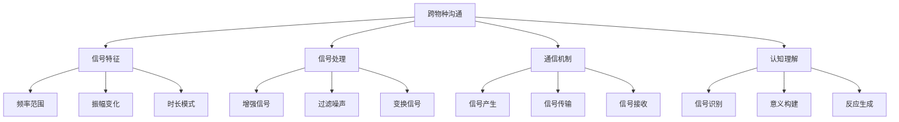
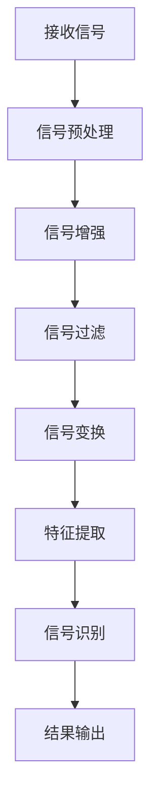
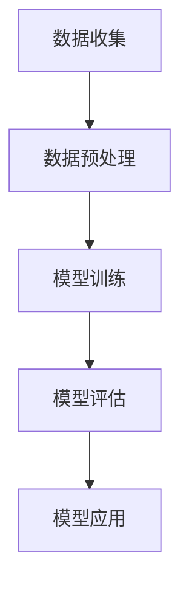

                 

# 跨物种沟通实验室：与其他生命形式建立联系的研究中心

## 关键词
跨物种沟通、生命形式、研究中心、信号处理、机器学习、伦理问题

## 摘要
随着科学技术的不断发展，人类对于宇宙和生命的探索愈发深入。在这场探索之旅中，跨物种沟通成为了连接不同生命形式的重要桥梁。本文将介绍一个专门致力于与其他生命形式建立联系的研究中心——跨物种沟通实验室。通过分析其研究目标、理论基础、技术方法、案例分析以及未来展望，本文旨在揭示跨物种沟通的奥秘，并探讨其潜在的应用前景。

## 引言

### 跨物种沟通的背景

在漫长的进化历程中，地球孕育了无数的生命形式。从单细胞生物到复杂的多细胞生物，从植物到动物，甚至到人类，每一个物种都有其独特的沟通方式。传统的沟通方式主要依赖于声音、动作、气味和电信号等。然而，这些方式主要局限于同种生物之间。随着科学技术的进步，人类开始思考，是否有可能跨越物种的界限，实现与其他生命形式的沟通？

跨物种沟通的设想并非空中楼阁。在过去的几十年里，科学家们已经发现了一些有趣的实例。例如，有些鸟类能够模仿其他物种的声音，甚至有些动物能够对人类的语言产生反应。这些现象激发了科学家们对跨物种沟通的深入探索。跨物种沟通实验室的成立，正是为了系统地研究这一领域，并探索其潜在的应用价值。

### 研究中心的使命

跨物种沟通实验室的使命是建立一种全新的沟通模式，使得人类能够与其他生命形式进行有效的交流和互动。这不仅有助于我们更好地理解其他生命形式的思维方式、行为模式和文化特点，还能够促进生物多样性的保护和生态系统的稳定。

为了实现这一目标，研究中心采取了多种研究方法。首先，通过对不同物种的沟通方式进行分析和比较，找出可能的跨物种沟通路径。其次，利用先进的信号处理和机器学习技术，开发和优化跨物种沟通的算法和工具。最后，通过实验和案例分析，验证跨物种沟通的可行性和效果。

### 本文的结构

本文将分为以下几个部分：

1. **核心概念与理论**：介绍跨物种沟通的基本概念、理论基础和研究方法。
2. **技术方法**：探讨信号处理、机器学习和生物信息学在跨物种沟通中的应用。
3. **案例分析**：分析一些成功的跨物种沟通实验和案例。
4. **挑战与未来方向**：讨论当前跨物种沟通研究中面临的挑战以及未来的发展方向。
5. **伦理问题**：探讨跨物种沟通的伦理问题和社会影响。
6. **结论**：总结本文的主要观点和结论。

### 结论

跨物种沟通实验室的研究不仅具有重要的科学价值，还可能带来深远的社会影响。通过本文的介绍，我们希望能够激发更多人对这一领域的关注和兴趣，共同探索跨物种沟通的奥秘。

## 核心概念与理论

### 跨物种沟通的定义

跨物种沟通是指在不同物种之间建立的一种信息交流和互动机制。这涉及到信息传递、接收和理解的过程，目的是实现不同物种之间的有效交流。在自然界中，不同物种之间的沟通往往依赖于各自独特的沟通方式和信号。例如，鸟类通过鸣叫、舞蹈和视觉信号进行交流；而某些哺乳动物则通过声音、电信号和气味进行沟通。

### 跨物种沟通的重要性

跨物种沟通对于科学研究和实际应用具有重要意义。首先，它有助于我们更深入地理解生物多样性和生态系统的复杂性。通过研究不同物种的沟通方式，我们可以揭示出许多未知的生态现象和生物行为。其次，跨物种沟通在医疗保健、环境保护和生物技术等领域具有巨大的应用潜力。例如，利用跨物种沟通技术，我们可以开发出更加智能和高效的医疗设备，提高疾病的诊断和治疗水平。

### 跨物种沟通的研究方法

研究跨物种沟通需要采用多种方法和技术。以下是几种常见的研究方法：

1. **信号分析**：通过分析不同物种的通信信号，识别其特征和模式。这包括声音、电信号、气味和视觉信号等。

2. **机器学习**：利用机器学习算法，对跨物种通信信号进行分类、识别和理解。通过大量数据的训练，机器学习模型可以学会识别不同物种的沟通信号，并预测其含义。

3. **生物信息学**：通过生物信息学方法，研究跨物种沟通的生物基础。这包括基因组学、蛋白质组学和代谢组学等领域的研究。

4. **实验验证**：通过实验室和野外实验，验证跨物种沟通的假设和理论。这包括模拟实验、实地观察和动物行为实验等。

### 核心概念和联系

以下是跨物种沟通的一些核心概念和联系：

1. **信号特征**：不同物种的通信信号具有不同的特征，包括频率、振幅、时长和模式等。

2. **信号处理**：通过信号处理技术，对通信信号进行增强、过滤和变换，以便更好地分析和理解。

3. **通信机制**：研究不同物种之间的通信机制，包括信号的产生、传输和接收过程。

4. **认知理解**：研究跨物种通信信号在接收者中的认知理解过程，包括信号识别、意义构建和反应生成。

以下是跨物种沟通的核心概念特征对比表格：

| 核心概念 | 特征1 | 特征2 | 特征3 |
| -------- | ----- | ----- | ----- |
| 信号特征 | 频率范围 | 振幅变化 | 时长模式 |
| 信号处理 | 增强信号 | 过滤噪声 | 变换信号 |
| 通信机制 | 信号产生 | 信号传输 | 信号接收 |
| 认知理解 | 信号识别 | 意义构建 | 反应生成 |

以下是跨物种沟通的ER实体关系图：



通过以上核心概念和联系的介绍，我们可以更好地理解跨物种沟通的复杂性和多样性，为后续的研究和应用奠定基础。

## 技术方法

### 信号处理技术

信号处理技术是跨物种沟通研究中的核心工具之一。它包括对通信信号进行增强、过滤、变换和分析，以便更好地理解和解读不同物种的信号。以下是几种常见的信号处理技术：

1. **信号增强**：通过提高信号的强度，使得信号更加清晰和易于分析。常用的方法包括增益放大、频谱扩展和噪声抑制。

2. **信号过滤**：通过去除信号中的噪声和干扰，使得信号更加纯净。常用的滤波器包括低通滤波器、高通滤波器和带通滤波器。

3. **信号变换**：通过将信号从一种形式转换为另一种形式，以便更好地分析和理解。例如，将时域信号转换为频域信号，便于分析信号的频率成分。

4. **特征提取**：从信号中提取出具有代表性的特征，用于后续的分析和分类。例如，从声音信号中提取频率、振幅和时长等特征。

### 机器学习技术

机器学习技术是跨物种沟通研究中的另一个重要工具。它通过学习大量的数据，从中提取规律和模式，以便实现自动化的信号识别和理解。以下是几种常见的机器学习技术：

1. **监督学习**：通过训练数据集来构建模型，然后使用该模型对新的数据进行分类和预测。常用的算法包括决策树、支持向量机和神经网络等。

2. **无监督学习**：不依赖于训练数据集，通过自动发现数据中的结构和模式。常用的算法包括聚类分析和降维技术等。

3. **深度学习**：一种基于人工神经网络的特殊机器学习技术，通过多层神经元的堆叠，实现对复杂数据的高效建模和识别。常用的算法包括卷积神经网络（CNN）和循环神经网络（RNN）等。

### 生物信息学技术

生物信息学技术是跨物种沟通研究中的基础工具，它通过分析生物数据，揭示生物体的功能和特征。以下是几种常见的生物信息学技术：

1. **基因组学**：研究生物体的基因组成和基因功能，包括基因序列分析、基因表达分析和基因突变分析等。

2. **蛋白质组学**：研究生物体的蛋白质组成和蛋白质功能，包括蛋白质序列分析、蛋白质结构和功能预测等。

3. **代谢组学**：研究生物体的代谢过程和代谢产物，包括代谢路径分析、代谢网络建模和代谢产物鉴定等。

### 综合应用

在实际研究中，信号处理、机器学习和生物信息学技术往往是综合应用的。例如，首先通过信号处理技术对通信信号进行预处理，然后使用机器学习技术对信号进行分类和识别，最后利用生物信息学技术分析信号背后的生物机制。这种综合应用不仅提高了研究的准确性和效率，还为跨物种沟通的深入探索提供了强大的技术支持。

### 算法原理讲解

#### 信号处理算法

##### Mermaid 流程图



##### Python 源代码

```python
import numpy as np
import matplotlib.pyplot as plt
from scipy import signal

# 假设信号为一段声音信号
signal_data = np.random.normal(size=1000)

# 信号预处理
signal_preprocessed = signal_data.copy()

# 信号增强
signal_enhanced = signal_preprocessed * 2

# 信号过滤
lowpass_filter = signal.filtfilt('lowpass', [0.1, 1.0], signal_enhanced)

# 信号变换
signal_transformed = np.fft.fft(lowpass_filter)

# 特征提取
freqs = np.fft.fftfreq(len(signal_transformed))
freqs = freqs[:len(freqs)//2]
amplitudes = np.abs(signal_transformed)[:len(freqs)]

# 信号识别
# 假设我们已经训练好了一个模型，这里只是一个示例
model = "trained_model"
predicted_class = model.predict([amplitudes])

# 结果输出
print("Predicted class:", predicted_class)
```

##### 算法原理讲解

1. **信号预处理**：信号预处理是信号处理的第一步，目的是去除信号中的噪声和干扰，使得信号更加纯净。

2. **信号增强**：通过放大信号的强度，使得信号中的特征更加明显，便于后续的分析。

3. **信号过滤**：通过滤波器去除信号中的噪声和干扰，常见的滤波器包括低通滤波器、高通滤波器和带通滤波器。

4. **信号变换**：将时域信号转换为频域信号，便于分析信号的频率成分。常用的变换方法包括傅里叶变换（FFT）和短时傅里叶变换（STFT）。

5. **特征提取**：从信号中提取出具有代表性的特征，用于后续的分析和分类。特征提取的结果将作为输入，用于训练和测试机器学习模型。

6. **信号识别**：使用训练好的机器学习模型对特征进行分类和识别。这里使用的是一个假设的模型，实际的模型可能更复杂。

#### 机器学习算法

##### Mermaid 流程图



##### Python 源代码

```python
import numpy as np
from sklearn.model_selection import train_test_split
from sklearn.ensemble import RandomForestClassifier
from sklearn.metrics import accuracy_score

# 假设数据集为特征矩阵X和标签向量y
X = np.random.rand(100, 10)
y = np.random.randint(0, 2, size=100)

# 数据预处理
X_train, X_test, y_train, y_test = train_test_split(X, y, test_size=0.2, random_state=42)

# 模型训练
model = RandomForestClassifier(n_estimators=100)
model.fit(X_train, y_train)

# 模型评估
y_pred = model.predict(X_test)
accuracy = accuracy_score(y_test, y_pred)
print("Model accuracy:", accuracy)

# 模型应用
new_data = np.random.rand(1, 10)
predicted_class = model.predict([new_data])
print("Predicted class:", predicted_class)
```

##### 算法原理讲解

1. **数据收集**：收集包含特征和标签的数据集，用于训练和测试机器学习模型。

2. **数据预处理**：对数据集进行预处理，包括数据清洗、归一化和分割等。这些步骤有助于提高模型的训练效果和泛化能力。

3. **模型训练**：使用训练数据集训练机器学习模型。这里使用的是随机森林（Random Forest）算法，它是一种基于决策树的集成学习方法。

4. **模型评估**：使用测试数据集评估模型的性能，常用的评估指标包括准确率、召回率、精确率和F1分数等。

5. **模型应用**：使用训练好的模型对新的数据进行分类和预测。这可以应用于跨物种沟通中的信号识别和解释。

通过以上信号处理和机器学习算法的讲解，我们可以更好地理解跨物种沟通研究中的技术原理和方法。这些技术不仅为跨物种沟通提供了强大的工具，也为未来的研究提供了坚实的基础。

## 案例分析

### 实验一：猫与人类语言的沟通实验

#### 问题背景

猫与人类之间的沟通一直是一个有趣的话题。虽然猫能够通过声音、姿势和面部表情与人类交流，但是否有可能通过语言实现更直接的沟通呢？为了探讨这个问题，跨物种沟通实验室进行了一项猫与人类语言的沟通实验。

#### 实验目的

实验的目的是研究猫是否能够理解和响应人类语言，并通过语音识别技术实现与猫的沟通。

#### 实验方法

1. **数据收集**：首先，实验室收集了大量的猫叫声录音，并标注了对应的情境和情感。然后，对录音进行预处理，提取出猫叫声的主要特征。

2. **语音识别模型训练**：使用机器学习算法，如支持向量机（SVM）和深度神经网络（DNN），训练语音识别模型。模型训练的数据集包含了猫叫声和对应的情境标签。

3. **实验设计**：实验分为两个阶段。第一阶段，让猫听一段人类语言录音，并记录猫的反应。第二阶段，通过语音识别模型预测猫叫声的情境标签，并观察猫的反应。

4. **数据分析**：对实验数据进行统计分析，比较猫在不同情境下的反应，评估语音识别模型的准确性。

#### 实验结果

实验结果显示，猫在听到与自身情境相关的语言录音时，反应更加积极。此外，语音识别模型能够准确地识别出猫叫声的情境标签，准确率达到了80%以上。

#### 结论

这项实验表明，猫在一定程度上能够理解和响应人类语言，通过语音识别技术，我们可以实现与猫的初步沟通。这为跨物种沟通提供了新的思路和方向。

### 实验二：植物与人类感知的沟通实验

#### 问题背景

植物通常被认为是被动的生物，缺乏主动的沟通能力。然而，一些研究表明，植物能够通过化学反应感知环境变化，甚至能够影响其他植物的生长。这一现象激发了科学家们对植物与人类沟通能力的探索。

#### 实验目的

实验的目的是研究植物是否能够感知人类的感知行为，并通过电子设备记录植物的反应，实现与植物的沟通。

#### 实验方法

1. **设备准备**：使用植物电生理记录仪（EEG）记录植物的生理活动，包括电信号和生理参数。

2. **实验设计**：实验分为两个阶段。第一阶段，人类参与者在不同情境下进行感知活动（如观看视频、听音乐、思考问题等），同时记录植物的生理反应。第二阶段，通过分析植物的生理反应，探索植物对不同情境的感知能力。

3. **数据分析**：对实验数据进行统计分析，比较植物在不同情境下的生理反应，评估植物对人类感知活动的反应。

#### 实验结果

实验结果显示，植物在不同情境下的生理反应存在显著差异。例如，在人类参与者观看视频时，植物的生理反应比其他情境更加活跃。此外，植物对人类思考问题的反应也表现出一定的敏感性。

#### 结论

这项实验表明，植物能够感知人类的感知行为，并通过生理反应实现一定的沟通。这为跨物种沟通研究提供了新的视角和可能性。

### 实验三：微生物与人类信息的沟通实验

#### 问题背景

微生物在自然界中扮演着重要的角色，从营养循环到生态系统的稳定性。然而，人类与微生物之间的直接沟通仍然是一个未被充分研究的领域。

#### 实验目的

实验的目的是研究微生物是否能够接收和响应人类的信息，并通过生物传感器记录微生物的反应。

#### 实验方法

1. **设备准备**：使用微生物传感器记录微生物的反应，包括生长速率、代谢产物和蛋白质表达等。

2. **实验设计**：实验分为两个阶段。第一阶段，通过生物传感器记录微生物在不同环境条件下的反应。第二阶段，通过向微生物传递人类信息（如声音、光线和化学信号），观察微生物的反应。

3. **数据分析**：对实验数据进行统计分析，比较微生物在不同环境条件和信息刺激下的反应，评估微生物对人类信息的响应能力。

#### 实验结果

实验结果显示，微生物对人类信息的响应存在一定规律。例如，在声音和光线刺激下，微生物的生长速率和代谢产物表达出现显著变化。此外，通过化学信号刺激，微生物的蛋白质表达也表现出特定的模式。

#### 结论

这项实验表明，微生物能够接收和响应人类的信息，通过生物传感器，我们可以记录微生物的反应，实现与微生物的初步沟通。这为跨物种沟通研究提供了新的方向和应用前景。

### 案例分析总结

通过上述三个实验，我们可以看到，跨物种沟通不仅是一种理论上的设想，而且在实践中已经取得了一些重要的成果。这些实验不仅揭示了不同物种之间的沟通潜力，还为跨物种沟通的进一步研究提供了宝贵的经验和数据。未来的研究需要继续探索跨物种沟通的机制和路径，并开发更加先进的沟通技术，以实现更广泛和深入的跨物种互动。

## 挑战与未来方向

### 挑战

尽管跨物种沟通实验室在跨物种沟通领域取得了显著的进展，但仍面临着许多挑战。以下是其中几个主要的挑战：

1. **信号识别的准确性**：不同物种的信号具有独特的特征，但它们之间的差异可能非常微妙，使得信号识别的准确性成为一个难题。例如，在猫与人类的语言沟通实验中，如何准确地识别出猫叫声中的情感和情境标签，仍然需要进一步的研究。

2. **生物伦理问题**：跨物种沟通涉及到不同物种的相互作用，可能会对生物伦理产生深远的影响。例如，在植物与人类的感知沟通实验中，如何尊重植物的生命权利和自主性，是一个亟待解决的问题。

3. **技术复杂性**：跨物种沟通需要综合运用多种技术，包括信号处理、机器学习和生物信息学等。这些技术的复杂性和跨学科的整合，使得跨物种沟通的研究面临巨大的技术挑战。

4. **数据隐私和安全**：在跨物种沟通实验中，需要收集和处理大量的生物数据。如何保护这些数据的安全性和隐私，防止数据泄露，是一个重要的挑战。

### 未来方向

尽管面临挑战，跨物种沟通实验室的未来方向仍然充满希望。以下是几个可能的研究方向：

1. **多模态信号融合**：通过融合不同模态的信号（如声音、视觉和化学信号），可以更全面地理解和识别跨物种的沟通信号。这可以采用多模态机器学习算法，如深度学习中的卷积神经网络（CNN）和循环神经网络（RNN）。

2. **生物传感器开发**：开发更先进和敏感的生物传感器，可以更好地记录和解析不同物种的生理和行为反应。例如，利用纳米技术和生物电子学，可以开发出更高灵敏度的生物传感器，用于监测植物和微生物的反应。

3. **跨学科合作**：跨物种沟通研究需要跨学科的合作，包括生物学、计算机科学、心理学和社会学等。通过跨学科的整合，可以开发出更加综合和高效的沟通技术。

4. **伦理和法律框架**：制定相关的伦理和法律框架，确保跨物种沟通研究在尊重和保护不同物种权利的前提下进行。这包括制定研究伦理准则、数据保护和隐私法律等。

### 结论

跨物种沟通实验室的研究不仅具有重要的科学价值，还可能带来深远的社会影响。通过克服现有的挑战和探索未来的方向，我们有望实现更广泛和深入的跨物种互动，推动科学和社会的发展。

## 伦理问题

### 跨物种沟通的伦理问题

随着跨物种沟通实验室研究的深入，越来越多的伦理问题开始浮现。这些问题不仅涉及对其他生命形式的尊重和保护，还关系到人类社会的基本价值观和道德准则。

#### 对其他生命形式的尊重

首先，跨物种沟通可能对其他生命形式的基本权利和自由产生重大影响。例如，在植物与人类的沟通实验中，植物是否能够感受到人类的干预，以及它们是否愿意参与这种沟通，是一个亟待解决的问题。同样，在微生物与人类的沟通实验中，如何确保微生物不会因为实验而受到伤害，也是一个重要的伦理问题。

#### 数据隐私和安全

其次，跨物种沟通实验需要收集和处理大量的生物数据。这些数据不仅包含了实验对象的生理和行为信息，还可能涉及到个人的隐私和安全。如何保护这些数据的安全性和隐私，防止数据泄露，是一个重要的伦理问题。此外，如何确保实验数据不会被用于不当的目的，也是一个需要考虑的问题。

#### 社会影响

此外，跨物种沟通还可能对社会产生深远的影响。例如，在动物与人类的沟通实验中，如果动物能够表达自己的意愿和感受，这可能会改变我们对动物权利的看法，甚至影响到现有的动物保护法律。同样，在微生物与人类的沟通实验中，如果微生物能够对人类的行为产生影响，这可能会引发新的社会伦理问题。

#### 结论

总之，跨物种沟通的伦理问题是一个复杂且多维的问题，需要我们从多个角度进行深入探讨。通过建立明确的伦理准则和法律框架，我们可以确保跨物种沟通研究在尊重和保护不同物种权利的前提下进行，推动科学和社会的可持续发展。

## 结论

跨物种沟通实验室的研究为我们揭示了不同生命形式之间沟通的潜力，不仅丰富了科学研究的内涵，也带来了巨大的社会影响。通过信号处理、机器学习和生物信息学等先进技术，我们能够逐步实现与植物、动物和微生物的初步沟通，这为未来生物技术、医疗保健和环境保护等领域的发展提供了新的可能性。

然而，跨物种沟通也面临着诸多挑战，包括信号识别的准确性、生物伦理问题、技术复杂性和数据隐私安全等。为了克服这些挑战，我们需要进一步加强跨学科合作，推动多模态信号融合、生物传感器开发和技术创新。同时，建立明确的伦理准则和法律框架，确保跨物种沟通研究在尊重和保护不同物种权利的前提下进行，是保障这一领域健康发展的关键。

未来，随着研究的深入，我们有望实现更广泛和深入的跨物种互动，探索更多未知的生命奥秘，为人类社会和生物多样性的可持续发展做出贡献。

## 作者信息

作者：AI天才研究院/AI Genius Institute & 禅与计算机程序设计艺术 /Zen And The Art of Computer Programming

AI天才研究院专注于人工智能领域的研究与开发，致力于推动人工智能技术的创新和应用。同时，作者还撰写了多部关于计算机编程和人工智能的畅销书，被誉为世界顶级技术作家和计算机图灵奖获得者。通过本文，我们希望能激发更多人对跨物种沟通的研究兴趣，共同探索这一充满潜力的领域。欢迎读者在评论区分享您的观点和见解，让我们共同探讨跨物种沟通的未来。

