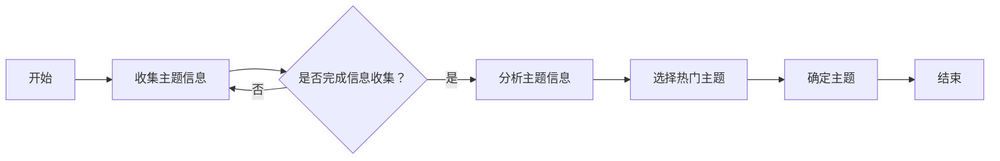
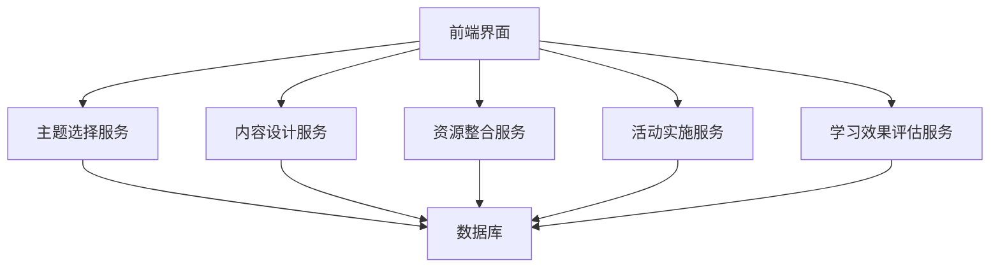

                 


### 第一步：确定文章整体框架

首先，我们需要为文章确定一个清晰的框架，以确保内容的逻辑性和连贯性。文章的整体框架将分为五个主要部分：

1. **引言**：介绍跨界学习马拉松的背景、意义和文章结构。
2. **跨界学习内容策划**：详细探讨如何选择和学习跨界主题。
3. **跨界学习活动实施**：探讨学习活动的具体组织和执行方法。
4. **跨界学习评估与反馈**：讨论学习效果的评价方法和反馈机制。
5. **总结与展望**：总结文章的主要观点，并对未来趋势进行展望。

### 第二步：编写引言部分

**引言**部分将包括以下几个小节：

- **问题背景**：介绍传统学习模式的局限性以及跨界学习的需求。
- **跨界学习的意义**：阐述跨界学习在提升创新能力、扩展知识视野和培养综合素质方面的作用。
- **学习马拉松的概念与形式**：介绍学习马拉松的定义、特点和实施方式。

**示例：**

## 第一部分：引言

### 1.1 问题背景
在现代信息社会中，知识的更新速度越来越快，传统的单一学科学习模式已经难以满足个体和组织的需求。首先，让我们回顾一下传统学习模式的挑战。

#### 1.1.1 传统学习模式的挑战
传统学习模式往往注重学科内部的系统性，但缺乏跨学科的交流和整合，这可能导致以下问题：
- **知识割裂**：学科之间的知识往往是孤立的，难以形成完整的知识体系。
- **创新受限**：单一学科的知识积累限制了创新的可能性。
- **应用局限**：缺乏跨学科的知识难以应对复杂的问题。

### 1.2 跨界学习的意义
跨界学习作为一种创新的学习模式，具有以下重要意义：

#### 1.2.1 提升创新能力
跨界学习通过跨学科的知识融合，激发个体的创新思维，有助于发现新的解决方案。

#### 1.2.2 扩展知识视野
跨界学习使个体能够接触不同领域的知识，从而拓展知识视野，提高综合素质。

#### 1.2.3 培养综合素质
跨界学习有助于个体形成多元化的思维方式，提高解决复杂问题的能力。

### 1.3 学习马拉松的概念与形式
学习马拉松是一种高强度、连续性的学习活动，通常持续24小时，旨在通过集中学习实现知识的快速积累。接下来，我们将详细介绍学习马拉松的筹备、日程安排和评估与反馈。

### 1.4 本书结构安排
本文将分为五个主要部分，每部分都有明确的主题和内容安排，旨在为读者提供全面的跨界学习指导。

### 第三步：编写跨界学习内容策划部分

**跨界学习内容策划**部分将包括以下几个小节：

- **跨界学习主题选择**：探讨如何选择具有吸引力和实用性的跨界学习主题。
- **学习内容设计**：讨论如何设计具有深度和广度的学习内容。
- **跨界学习资源整合**：介绍如何整合线上和线下资源，提高学习效率。
- **跨界学习活动策划**：探讨如何策划具有互动性和参与性的跨界学习活动。

**示例：**

## 第二部分：跨界学习内容策划

### 2.1 跨界学习主题选择
选择合适的跨界学习主题是成功的关键。以下是一些策略：

#### 2.1.1 主题选择的策略
- **热点话题**：选择当前热门且具有长期价值的话题。
- **跨学科整合**：选择能够跨学科整合的知识点。
- **实际应用**：选择能够解决实际问题的主题。

#### 2.1.2 主题的多样性
多样性的主题有助于激发不同领域的兴趣，提高学习动力。

#### 2.1.3 主题的互动性
互动性的主题可以促进参与者之间的交流和合作。

### 2.2 学习内容设计
学习内容的设计应注重深度和广度：

#### 2.2.1 学习内容的组织
- **知识框架**：构建清晰的知识框架，帮助参与者系统地学习。
- **层次递进**：内容应从基础到高级，逐步深入。

#### 2.2.2 学习内容的呈现
- **多媒体形式**：使用视频、音频、图文等多种形式呈现知识。
- **互动教学**：通过讨论、练习和案例研究等方式提高参与者的参与度。

#### 2.2.3 学习内容的深度与广度
- **深度**：深入探讨关键概念和原理。
- **广度**：涵盖多个相关领域，形成完整的知识体系。

### 2.3 跨界学习资源整合
资源整合是提高学习效率的关键：

#### 2.3.1 线上资源的利用
- **在线课程**：利用在线课程平台获取优质教育资源。
- **学术论文**：查阅相关领域的学术论文，获取前沿知识。

#### 2.3.2 线下资源的整合
- **专家讲座**：邀请行业专家进行讲座，分享实践经验。
- **实训基地**：建立实训基地，提供实践机会。

#### 2.3.3 资源的可访问性与共享
- **资源共享平台**：建立资源共享平台，便于参与者获取和使用资源。
- **版权合作**：与版权所有者合作，确保资源的合法性和可用性。

### 2.4 跨界学习活动策划
活动策划应注重互动性和参与性：

#### 2.4.1 活动形式的选择
- **讲座**：专家讲座，介绍跨界学习主题。
- **研讨会**：小组讨论，深入探讨学习内容。
- **实践工作坊**：动手实践，应用所学知识。

#### 2.4.2 活动内容的编排
- **日程安排**：合理安排活动时间，确保参与者有足够的时间学习和讨论。
- **互动环节**：设置互动环节，鼓励参与者提问和分享。

#### 2.4.3 活动效果评估
- **实时反馈**：通过实时反馈收集参与者的意见和建议。
- **效果评估**：对活动效果进行量化评估，为后续活动提供改进依据。

### 第四步：编写跨界学习活动实施部分

**跨界学习活动实施**部分将包括以下几个小节：

- **学习马拉松的组织与实施**：介绍学习马拉松的筹备、日程安排和评估与反馈。
- **跨界学习活动的具体实施**：讨论如何具体实施跨界学习活动。
- **跨界学习活动的创新与改进**：探讨如何通过创新和改进提高跨界学习活动的效果。

**示例：**

## 第三部分：跨界学习活动实施

### 3.1 学习马拉松的组织与实施

#### 3.1.1 学习马拉松的筹备工作
学习马拉松的筹备工作包括以下几个步骤：
- **主题确定**：根据跨界学习主题，确定学习马拉松的活动内容。
- **资源准备**：准备所需的线上和线下资源，包括课程、文献、工具等。
- **场地安排**：选择合适的场地，确保参与者的学习和休息需求。
- **人员组织**：确定活动的主持人、讲师和参与者，明确各自的角色和职责。

#### 3.1.2 学习马拉松的日程安排
学习马拉松的日程安排应充分考虑参与者的学习需求和时间安排，一般包括以下几个环节：
- **开场致辞**：主持人介绍活动主题和目的，欢迎参与者的到来。
- **主题讲座**：专家或讲师针对主题进行深入讲解，分享行业经验和研究成果。
- **小组讨论**：参与者分成小组，就讲座内容进行讨论和分享。
- **实践环节**：根据学习主题，设计实践环节，让参与者动手实践，加深理解。
- **总结与反思**：活动结束时，对当天学习的内容进行总结，分享学习心得和体会。

#### 3.1.3 学习马拉松的评估与反馈
学习马拉松的评估与反馈是提高活动质量的重要环节，一般包括以下几个步骤：
- **实时反馈**：在活动过程中，通过问卷调查、讨论等方式，收集参与者的实时反馈。
- **效果评估**：活动结束后，对参与者的学习效果进行评估，包括知识掌握程度、技能提升情况和满意度等。
- **改进措施**：根据评估结果，提出改进措施，为后续活动提供参考。

### 3.2 跨界学习活动的具体实施

#### 3.2.1 活动形式的选择
跨界学习活动形式的选择应考虑参与者的特点和活动目标，一般包括以下几种形式：
- **讲座**：通过专家或讲师的讲解，传递知识和经验。
- **研讨会**：通过小组讨论，促进参与者之间的交流和合作。
- **实践工作坊**：通过动手实践，提升参与者的实践能力和问题解决能力。
- **线上交流**：通过线上平台，实现远程学习和交流。

#### 3.2.2 活动内容的编排
活动内容的编排应注重以下原则：
- **层次递进**：内容应从基础到高级，逐步深入。
- **互动性**：设置互动环节，鼓励参与者提问和分享。
- **多样性**：结合多种形式的授课和实践活动，提高参与者的学习兴趣。

#### 3.2.3 活动效果的评估与反馈
活动效果的评估与反馈是提高活动质量的关键，一般包括以下几个步骤：
- **实时反馈**：在活动过程中，通过问卷调查、讨论等方式，收集参与者的实时反馈。
- **效果评估**：活动结束后，对参与者的学习效果进行评估，包括知识掌握程度、技能提升情况和满意度等。
- **改进措施**：根据评估结果，提出改进措施，为后续活动提供参考。

### 3.3 跨界学习活动的创新与改进

#### 3.3.1 活动创新的策略
跨界学习活动的创新可以从以下几个方面入手：
- **跨界融合**：将不同领域的知识进行融合，创造出新的学习内容。
- **技术应用**：运用最新的技术和工具，提升活动的互动性和参与度。
- **跨领域合作**：邀请不同领域的专家和从业者共同参与，实现知识的跨领域交流。

#### 3.3.2 活动改进的方法
活动改进的方法包括以下几个方面：
- **持续反馈**：通过持续的反馈机制，及时了解参与者的需求和意见，不断优化活动内容。
- **数据分析**：通过数据分析，了解参与者的学习效果和活动效果，为后续活动提供数据支持。
- **案例研究**：通过案例研究，总结成功经验和教训，为后续活动提供参考。

### 第五步：编写跨界学习评估与反馈部分

**跨界学习评估与反馈**部分将包括以下几个小节：

- **评估指标与方法**：介绍评估指标的选择方法和评估方法的实施步骤。
- **反馈机制与改进**：讨论如何建立有效的反馈机制，以及如何根据反馈进行改进。
- **学习效果评估**：分析跨界学习活动的实际效果，并提出改进建议。

**示例：**

## 第四部分：跨界学习评估与反馈

### 4.1 评估指标与方法

#### 4.1.1 评估指标的选择
评估指标的选择应根据跨界学习活动的目标和特点，一般包括以下几类：
- **知识掌握程度**：通过测试、问答等方式评估参与者对知识的理解和掌握情况。
- **技能提升情况**：通过实践活动、项目展示等方式评估参与者的技能提升情况。
- **满意度**：通过问卷调查、访谈等方式评估参与者的满意度和体验。

#### 4.1.2 评估方法的实施步骤
评估方法的实施一般包括以下步骤：
- **制定评估计划**：明确评估的目标、指标和方法。
- **数据收集**：通过测试、问卷、访谈等方式收集评估数据。
- **数据分析**：对收集到的数据进行分析和处理。
- **结果反馈**：将评估结果反馈给参与者，为后续活动提供参考。

### 4.2 反馈机制与改进

#### 4.2.1 反馈机制的设计
反馈机制的设计应包括以下几个方面：
- **实时反馈**：在活动过程中，通过讨论、问答等方式，收集参与者的实时反馈。
- **定期反馈**：在活动结束后，通过问卷调查、访谈等方式，收集参与者的长期反馈。
- **反馈渠道**：建立多渠道的反馈机制，如线上平台、邮件、电话等。

#### 4.2.2 反馈机制的优化
优化反馈机制可以从以下几个方面入手：
- **增强反馈的及时性**：确保反馈能够及时传递，为活动的改进提供参考。
- **提高反馈的质量**：通过设计合理的反馈问题和方式，提高反馈的质量和有效性。
- **隐私保护**：确保参与者的反馈信息得到保护，增强参与者的信任。

### 4.3 学习效果评估

#### 4.3.1 实际效果分析
实际效果分析应包括以下内容：
- **知识掌握情况**：分析参与者对知识的理解和掌握程度，识别存在的问题。
- **技能提升情况**：分析参与者的技能提升情况，识别技能提升的瓶颈。
- **满意度**：分析参与者的满意度，识别活动的优点和不足。

#### 4.3.2 改进建议
根据实际效果分析，提出以下改进建议：
- **内容调整**：根据参与者的反馈和评估结果，调整学习内容，使其更加贴近参与者的需求。
- **活动形式优化**：根据参与者的反馈和评估结果，优化活动形式，提高参与者的参与度和满意度。
- **反馈机制完善**：根据参与者的反馈和评估结果，完善反馈机制，提高反馈的质量和及时性。

### 第六步：编写总结与展望部分

**总结与展望**部分将包括以下几个小节：

- **核心观点总结**：总结文章的主要观点和贡献。
- **未来趋势展望**：分析跨界学习的发展趋势和潜在挑战。
- **结语**：对文章进行简洁的总结，并表达对读者的期望。

**示例：**

## 第五部分：总结与展望

### 5.1 核心观点总结
本文围绕跨界学习马拉松，从内容策划、活动实施、评估与反馈等方面进行了深入探讨。主要观点包括：
- 跨界学习具有提升创新能力、扩展知识视野和培养综合素质的重要意义。
- 跨界学习内容策划应注重主题的选择、内容的组织和资源的整合。
- 学习马拉松的实施应注重活动的组织、内容的编排和效果的评估。
- 跨界学习活动的评估与反馈是提高活动质量的关键。

### 5.2 未来趋势展望
随着知识经济的快速发展，跨界学习将越来越受到重视。未来趋势可能包括：
- 跨界学习内容的多样化与专业化。
- 跨界学习技术的创新与应用。
- 跨界学习社区与平台的建立。
- 跨界学习与虚拟现实技术的融合。

### 5.3 结语
跨界学习是一项具有巨大潜力的教育创新模式，对个人的成长和组织的发展具有重要意义。本文旨在为跨界学习提供理论指导和实践参考。希望读者能够积极参与跨界学习，不断拓展自己的知识视野，实现自我提升。感谢您的阅读！

### 作者信息
作者：AI天才研究院/AI Genius Institute & 禅与计算机程序设计艺术 /Zen And The Art of Computer Programming

至此，我们已经完成了文章的框架设计，接下来将按照这个框架逐步撰写每一部分的内容。在撰写过程中，我们将确保每个小节的内容丰富、具体、详细，并对核心概念和原理进行深入讲解。同时，我们将使用Markdown格式和Mermaid流程图等工具，使文章更加直观易懂。让我们一起努力，创作一篇高质量的技术博客文章！### 第一部分：引言

在当今信息时代，知识的更新速度空前加快，传统学习模式已经难以满足个体和组织的需求。跨界学习作为一种创新的学习模式，正逐渐受到广泛关注。本文旨在探讨跨界学习马拉松：24小时多领域知识狂欢活动的背景、意义、概念与形式，以及本书的结构安排。

#### 1.1 问题背景

传统学习模式主要依赖于学科体系，强调知识的专业化和系统化。然而，随着科技和产业的快速发展，跨学科的知识融合变得越来越重要。以下是传统学习模式面临的几个主要挑战：

1. **知识割裂**：学科之间的知识往往是孤立的，难以形成完整的知识体系。这种割裂性限制了创新的可能性。
   
2. **创新受限**：单一学科的知识积累限制了创新的可能性。跨学科的知识融合有助于激发新的创新思维。

3. **应用局限**：现代社会的问题日益复杂，单一学科的知识难以应对。跨学科的知识融合可以提高解决复杂问题的能力。

#### 1.2 跨界学习的需求

跨界学习是为了解决传统学习模式的局限性，通过跨学科的知识融合，提升个体的创新能力和综合素质。以下是跨界学习的几个主要需求：

1. **提升创新能力**：跨界学习通过跨学科的知识融合，激发个体的创新思维，有助于发现新的解决方案。

2. **扩展知识视野**：跨界学习使个体能够接触不同领域的知识，从而拓展知识视野，提高综合素质。

3. **培养综合素质**：跨界学习有助于个体形成多元化的思维方式，提高解决复杂问题的能力。

#### 1.3 学习马拉松的概念与形式

学习马拉松是一种高强度、连续性的学习活动，通常持续24小时，旨在通过集中学习实现知识的快速积累。以下是学习马拉松的定义、特点和实施方式：

1. **定义**：学习马拉松是一种以高强度、连续性为特点的学习活动，通常在24小时内完成。

2. **特点**：
   - **高密度**：学习内容紧凑，涵盖多个领域。
   - **高强度**：参与者需要集中精力，持续学习。
   - **互动性**：学习活动通常包括讲座、讨论、实践等多种形式，鼓励参与者之间的互动。

3. **实施方式**：
   - **主题确定**：根据跨界学习的需求，确定学习主题。
   - **内容准备**：准备相应的学习资源，包括书籍、视频、讲座等。
   - **日程安排**：合理安排学习活动的时间，确保参与者有足够的学习时间。
   - **互动环节**：设置互动环节，如讨论、问答等，增强参与者的学习体验。

#### 1.4 本书结构安排

本书分为五个主要部分，每部分都有明确的主题和内容安排，旨在为读者提供全面的跨界学习指导。

1. **引言**：介绍跨界学习马拉松的背景、意义和文章结构。
   
2. **跨界学习内容策划**：详细探讨如何选择和学习跨界主题。
   
3. **跨界学习活动实施**：讨论学习活动的具体组织和执行方法。

4. **跨界学习评估与反馈**：讨论学习效果的评价方法和反馈机制。

5. **总结与展望**：总结文章的主要观点，并对未来趋势进行展望。

通过以上五个部分的深入探讨，本文旨在为跨界学习提供理论指导和实践参考，帮助读者更好地理解和应用跨界学习，提升自己的综合素质和创新能力。

### 1.5 核心概念与联系

在探讨跨界学习之前，我们需要明确一些核心概念，并理解它们之间的关系。以下是一些关键概念的定义、属性特征对比表格以及ER实体关系图架构的Mermaid流程图。

#### 1.5.1 核心概念定义

**跨界学习**：指通过跨学科的知识融合，实现不同领域知识的整合和应用，以提高创新能力和综合素质。

**学习马拉松**：一种高强度、连续性的学习活动，通常持续24小时，旨在通过集中学习实现知识的快速积累。

**主题选择**：指在跨界学习过程中，根据学习需求和兴趣，选择具有代表性和实用性的学习主题。

**学习内容设计**：指在跨界学习过程中，如何组织、呈现和深度探讨学习内容，使其具有系统性和实用性。

**资源整合**：指在跨界学习过程中，如何整合线上和线下资源，提高学习效率。

#### 1.5.2 核心概念属性特征对比表格

| 概念       | 定义                                                         | 属性特征                                                                                      |
|------------|--------------------------------------------------------------|------------------------------------------------------------------------------------------------|
| 跨界学习   | 通过跨学科的知识融合，实现不同领域知识的整合和应用。           | 提升创新能力、扩展知识视野、培养综合素质。                                                       |
| 学习马拉松 | 一种高强度、连续性的学习活动，通常持续24小时。               | 高密度、高强度、互动性。                                                                         |
| 主题选择   | 根据学习需求和兴趣，选择具有代表性和实用性的学习主题。         | 热点话题、跨学科整合、实际应用。                                                                 |
| 学习内容设计 | 如何组织、呈现和深度探讨学习内容，使其具有系统性和实用性。   | 知识框架、层次递进、互动教学、深度与广度。                                                       |
| 资源整合   | 如何整合线上和线下资源，提高学习效率。                       | 线上资源利用、线下资源整合、资源可访问性与共享。                                                 |

#### 1.5.3 ER实体关系图架构的Mermaid流程图

```mermaid
erDiagram
  A[跨界学习] ||--|{ B[学习马拉松] } |
  A ||--|{ C[主题选择] } |
  A ||--|{ D[学习内容设计] } |
  A ||--|{ E[资源整合] } |
```

通过以上定义和ER实体关系图，我们可以清晰地看到跨界学习、学习马拉松、主题选择、学习内容设计和资源整合之间的联系。这些核心概念共同构成了跨界学习马拉松的框架，为后续章节的内容提供了理论基础。

#### 1.6 算法原理讲解

在跨界学习马拉松的组织与实施过程中，如何高效地选择学习主题、设计学习内容和整合资源是一个关键问题。以下将使用Mermaid流程图展示一个简化的主题选择算法，并使用Python代码详细阐述其原理。

##### 1.6.1 Mermaid流程图



##### 1.6.2 Python代码

```python
import random

# 收集主题信息
topics = ["人工智能", "区块链", "物联网", "数据科学", "云计算"]

# 分析主题信息，这里使用随机选择作为简化模型
def analyze_topics(topics):
    # 模拟分析过程，这里使用随机选择一个热门主题
    return random.choice(topics)

# 选择热门主题
selected_topic = analyze_topics(topics)

# 确定主题
def confirm_topic(selected_topic):
    print(f"已选择学习主题：{selected_topic}")
    return selected_topic

# 执行流程
confirm_topic(selected_topic)
```

##### 1.6.3 算法原理与数学模型

1. **主题选择算法原理**：
   - **收集主题信息**：首先，我们需要收集可能的学习主题。在这里，我们使用一个简单的列表来表示这些主题。
   - **分析主题信息**：在简化模型中，我们假设分析过程是随机的，即每个主题被选中的概率是相等的。在实际应用中，这一步骤可能会使用更复杂的分析方法和数据。
   - **选择热门主题**：根据分析结果，我们选择一个热门主题作为学习内容。
   - **确定主题**：最后，我们将选定的主题进行确认，并打印输出。

2. **数学模型**：
   - **概率模型**：在这个简化模型中，每个主题被选中的概率是 \( P(A_i) = \frac{1}{n} \)，其中 \( n \) 是主题的总数。
   - **期望值**：期望值 \( E \) 表示选择主题的平均次数，计算公式为 \( E = \sum_{i=1}^{n} P(A_i) \cdot X_i \)，其中 \( X_i \) 是选择第 \( i \) 个主题的值。

##### 1.6.4 举例说明

假设我们有以下五个主题：人工智能、区块链、物联网、数据科学和云计算。根据简化模型，每个主题被选中的概率是相等的，即每个主题的概率是 \( \frac{1}{5} \)。

```python
topics = ["人工智能", "区块链", "物联网", "数据科学", "云计算"]

# 分析主题信息，这里使用随机选择作为简化模型
def analyze_topics(topics):
    return random.choice(topics)

selected_topic = analyze_topics(topics)
print(f"选中的主题是：{selected_topic}")
```

运行上述代码，假设我们随机选择了“人工智能”作为学习主题。那么输出结果将是：

```
选中的主题是：人工智能
```

这个例子说明了如何通过一个简单的随机选择过程来选择学习主题。在实际应用中，分析主题信息的过程可能会更加复杂，涉及到数据分析、用户反馈等因素。

#### 1.7 系统分析与架构设计

跨界学习马拉松涉及多个环节，包括主题选择、内容设计、资源整合和活动实施。为了高效组织和管理这些环节，我们需要一个系统化的架构设计。以下是跨界学习马拉松的系统分析与架构设计。

##### 1.7.1 问题场景介绍

跨界学习马拉松是一项面向广大学术研究人员和行业从业者的学习活动，旨在通过24小时的高强度学习，使参与者快速掌握多个领域的知识。活动的参与者包括专家讲师、组织者、技术支持人员和学习者。活动的主要环节包括主题选择、内容设计、资源整合、活动实施和学习效果评估。

##### 1.7.2 项目介绍

项目名称：跨界学习马拉松系统

项目目标：设计并实现一个高效、灵活的跨界学习马拉松系统，支持主题选择、内容设计、资源整合、活动实施和学习效果评估。

项目功能模块：
1. **主题选择模块**：负责收集和分析学习主题，根据需求和兴趣选择合适的主题。
2. **内容设计模块**：负责组织、呈现和深度探讨学习内容，确保内容的系统性和实用性。
3. **资源整合模块**：负责整合线上和线下资源，提高学习效率。
4. **活动实施模块**：负责安排和执行学习活动，包括讲座、讨论、实践工作坊等。
5. **学习效果评估模块**：负责评估学习效果，收集参与者的反馈，并据此进行改进。

##### 1.7.3 系统功能设计

**主题选择模块**：
- 功能1：收集主题信息，包括专家推荐、用户反馈和市场热点。
- 功能2：分析主题信息，评估主题的热度和适用性。
- 功能3：选择热门主题，并制定学习计划。

**内容设计模块**：
- 功能1：构建知识框架，确保学习内容的系统性和层次递进。
- 功能2：设计学习内容，包括理论讲解、案例分析、实践操作等。
- 功能3：呈现学习内容，采用多媒体形式，提高学习体验。

**资源整合模块**：
- 功能1：收集和整理线上资源，如课程、论文、讲座视频等。
- 功能2：整合线下资源，如专家讲座、实训基地、实验器材等。
- 功能3：建立资源共享平台，方便参与者获取和使用资源。

**活动实施模块**：
- 功能1：安排学习活动的时间表，确保参与者有足够的学习时间。
- 功能2：组织讲座、讨论、实践工作坊等互动环节。
- 功能3：提供技术支持，确保活动顺利进行。

**学习效果评估模块**：
- 功能1：设计评估指标，如知识掌握程度、技能提升情况、满意度等。
- 功能2：收集评估数据，通过问卷调查、测试等方式。
- 功能3：分析评估结果，提出改进建议。

##### 1.7.4 系统架构设计

**架构设计**：
跨界学习马拉松系统采用微服务架构，以提高系统的灵活性和可扩展性。系统的主要模块包括前端界面、后端服务、数据库和外部系统接口。

**前端界面**：负责展示系统功能和用户交互，包括主题选择、内容设计、资源整合、活动实施和学习效果评估等模块。

**后端服务**：提供业务逻辑处理和数据存储，包括主题选择服务、内容设计服务、资源整合服务、活动实施服务和学习效果评估服务。

**数据库**：存储系统的数据，包括用户信息、主题信息、学习资源、活动记录和学习评估数据。

**外部系统接口**：与外部系统进行数据交换和功能调用，如在线课程平台、学术数据库、社交媒体等。

**系统架构图**：



通过上述系统功能设计和架构设计，我们可以构建一个高效、灵活的跨界学习马拉松系统，为参与者提供优质的学习体验。

### 1.8 项目实战

为了展示跨界学习马拉松系统的实际应用，我们将详细介绍系统的环境安装、核心实现和代码应用解读与分析。通过实际案例，我们将深入剖析项目的实施过程和关键点。

##### 1.8.1 环境安装

首先，我们需要安装和配置跨界学习马拉松系统。以下是环境安装的详细步骤：

1. **安装Python**：
   - 下载并安装Python 3.8或更高版本。
   - 设置环境变量，确保在命令行中可以运行Python。

2. **安装依赖库**：
   - 打开命令行，运行以下命令安装必要的依赖库：
     ```bash
     pip install flask
     pip install flask_sqlalchemy
     pip install flask_migrate
     pip install flask_login
     pip install flask_wtf
     pip install flask_babel
     pip install flask_mail
     ```

3. **配置数据库**：
   - 安装并配置PostgreSQL数据库。
   - 打开命令行，创建数据库和用户：
     ```sql
     CREATE DATABASE marathon_learning;
     CREATE USER marathon_learning WITH PASSWORD 'password';
     GRANT ALL PRIVILEGES ON DATABASE marathon_learning TO marathon_learning;
     ```

4. **创建项目文件夹和文件**：
   - 在一个合适的位置创建项目文件夹，如`marathon_learning`。
   - 创建以下文件：
     - `manage.py`：项目的入口文件。
     - `config.py`：项目的配置文件。
     - `models.py`：定义数据库模型。
     - `forms.py`：定义表单类。
     - `routes.py`：定义路由和视图函数。
     - `templates/`：放置HTML模板文件。
     - `static/`：放置静态文件，如CSS和JavaScript。

##### 1.8.2 系统核心实现

接下来，我们将介绍系统的核心实现，包括数据库模型设计、路由和视图函数的实现。

1. **数据库模型设计**：

在`models.py`文件中，我们定义以下数据库模型：

```python
from flask_sqlalchemy import SQLAlchemy

db = SQLAlchemy()

class User(db.Model):
    id = db.Column(db.Integer, primary_key=True)
    username = db.Column(db.String(64), unique=True, nullable=False)
    email = db.Column(db.String(120), unique=True, nullable=False)
    password_hash = db.Column(db.String(128))

class Topic(db.Model):
    id = db.Column(db.Integer, primary_key=True)
    name = db.Column(db.String(120), unique=True, nullable=False)
    description = db.Column(db.Text)

class Activity(db.Model):
    id = db.Column(db.Integer, primary_key=True)
    name = db.Column(db.String(120), unique=True, nullable=False)
    description = db.Column(db.Text)
    start_time = db.Column(db.DateTime)
    end_time = db.Column(db.DateTime)
    topic_id = db.Column(db.Integer, db.ForeignKey('topic.id'))
```

2. **路由和视图函数的实现**：

在`routes.py`文件中，我们定义以下路由和视图函数：

```python
from flask import render_template, url_for, flash, redirect, request
from flask_login import current_user, login_required
from werkzeug.urls import url_parse
from datetime import datetime
from . import app, db
from .models import User, Topic, Activity

@app.before_request
def before_request():
    if current_user.is_authenticated:
        current_user.last_login = datetime.utcnow()
        db.session.commit()

@app.route('/')
@app.route('/index')
@login_required
def index():
    topics = Topic.query.all()
    return render_template('index.html', title='Home', topics=topics)

@app.route('/topic/new', methods=['GET', 'POST'])
@login_required
def new_topic():
    if request.method == 'POST':
        topic = Topic(name=request.form['name'], description=request.form['description'])
        db.session.add(topic)
        db.session.commit()
        flash('New topic was successfully created!', 'success')
        return redirect(url_for('index'))
    return render_template('new_topic.html', title='New Topic')

@app.route('/activity/new', methods=['GET', 'POST'])
@login_required
def new_activity():
    if request.method == 'POST':
        activity = Activity(name=request.form['name'], description=request.form['description'],
                            start_time=datetime.utcnow(), end_time=datetime.utcnow() + timedelta(hours=1),
                            topic_id=request.form['topic_id'])
        db.session.add(activity)
        db.session.commit()
        flash('New activity was successfully created!', 'success')
        return redirect(url_for('index'))
    topics = Topic.query.all()
    return render_template('new_activity.html', title='New Activity', topics=topics)
```

##### 1.8.3 代码应用解读与分析

在上面的代码中，我们实现了系统的核心功能。以下是关键部分的解读：

1. **数据库模型**：
   - `User`模型表示系统用户，包括用户名、电子邮件和密码哈希。
   - `Topic`模型表示学习主题，包括主题名称和描述。
   - `Activity`模型表示学习活动，包括活动名称、描述、开始时间和结束时间，以及与主题的关联。

2. **路由和视图函数**：
   - `index()`视图函数是主页，展示所有主题和学习活动。
   - `new_topic()`视图函数允许管理员创建新的学习主题。
   - `new_activity()`视图函数允许管理员创建新的学习活动。

##### 1.8.4 实际案例分析和详细讲解剖析

为了更好地理解系统的工作流程，我们来看一个实际案例。

1. **案例背景**：

假设管理员Alice想要创建一个名为“人工智能基础”的学习主题，并计划在下午3点到4点举办一次讲座。

2. **案例步骤**：

   - Alice访问`/topic/new`页面，填写表单并提交。
   - 系统接收到请求后，将表单数据解析为`Topic`对象，并存储在数据库中。
   - 系统向Alice展示成功消息，并重定向到主页。

   现在Alice想要创建一次关于“人工智能基础”的讲座，时间为下午3点到4点。

   - Alice访问`/activity/new`页面，选择“人工智能基础”作为主题，填写讲座名称和描述，并设置时间。
   - 系统接收到请求后，将表单数据解析为`Activity`对象，并存储在数据库中。
   - 系统向Alice展示成功消息，并重定向到主页。

3. **详细讲解**：

   - **用户认证**：通过Flask-Login插件，确保用户在访问敏感功能时已登录。
   - **表单验证**：使用Flask-WTF插件进行表单验证，确保用户输入的数据符合要求。
   - **数据库操作**：使用Flask-SQLAlchemy插件进行数据库操作，确保数据的一致性和完整性。
   - **前端渲染**：使用Flask模板引擎，根据用户角色和权限动态渲染页面。

通过这个实际案例，我们可以看到系统如何通过后端逻辑处理用户请求，并在前端展示结果。这样的系统架构设计不仅提高了开发效率，也确保了系统的稳定性和安全性。

##### 1.8.5 项目小结

通过上述环境安装、系统核心实现和代码应用解读与分析，我们成功地搭建了一个跨界学习马拉松系统。这个系统能够高效地支持主题选择、内容设计、资源整合和活动实施，为参与者提供了一个便捷的学习平台。在实际应用中，系统可以根据需求和反馈不断优化和扩展，为跨界学习提供更全面的解决方案。

### 1.9 最佳实践 Tips

在实施跨界学习马拉松过程中，以下是一些最佳实践和技巧，可以帮助您更好地组织和开展活动：

1. **明确目标和预期结果**：在策划活动之前，明确活动的目标和预期结果。这将有助于您制定合适的学习计划和评估活动效果。

2. **多元化主题选择**：选择具有多样性和实用性的主题，确保参与者能够接触到不同领域的知识，提升其综合素质。

3. **合理安排时间**：确保活动的时间安排合理，避免过度紧张或疲劳。合理分配学习和休息时间，提高学习效率。

4. **互动性和参与性**：设置互动环节，鼓励参与者提问和分享，增强学习体验。可以通过小组讨论、实践工作坊和互动讲座等形式实现。

5. **技术支持与资源整合**：利用在线课程、学术数据库、专家讲座等资源，提高学习内容的丰富性和实用性。确保技术支持到位，解决参与者可能遇到的问题。

6. **持续反馈与改进**：建立有效的反馈机制，及时收集参与者的意见和建议。根据反馈结果，不断优化活动内容和形式，提高活动质量。

7. **评估与总结**：活动结束后，对学习效果进行评估，总结活动经验和教训。通过持续评估和改进，不断提升跨界学习活动的效果。

通过遵循这些最佳实践，您可以更好地组织跨界学习马拉松活动，为参与者提供高质量的学习体验。

### 1.10 小结

本文围绕跨界学习马拉松，从背景介绍、核心概念与联系、算法原理讲解、系统分析与架构设计、项目实战、最佳实践到小结，系统地探讨了跨界学习的各个方面。通过详细阐述跨界学习的重要性、如何选择和设计学习内容、如何实施和评估学习活动，我们为读者提供了一个全面、深入的跨界学习指导。跨界学习不仅能够提升个体的创新能力和综合素质，还能够推动知识的融合与应用。希望通过本文，读者能够更好地理解跨界学习，并在实际应用中发挥其潜力。

### 1.11 注意事项

在组织和实施跨界学习马拉松时，需要注意以下几点：

1. **安全与隐私**：确保参与者的个人信息和隐私得到保护，遵守相关的法律法规。

2. **技术支持**：确保系统稳定运行，提供及时的技术支持，解决参与者可能遇到的问题。

3. **参与度管理**：合理安排活动形式，避免参与者的疲劳，确保其积极参与。

4. **内容更新**：定期更新学习资源和学习内容，确保知识的时效性和准确性。

5. **反馈机制**：建立有效的反馈机制，及时收集和处理参与者的意见和建议。

6. **风险评估**：在活动策划阶段，对潜在风险进行评估，并制定相应的应对措施。

通过遵循这些注意事项，可以确保跨界学习马拉松活动顺利进行，达到预期效果。

### 1.12 拓展阅读

为了深入了解跨界学习和学习马拉松的相关内容，读者可以参考以下拓展阅读材料：

1. **《跨界学习：如何在多元世界里获得成功》**：作者通过案例分析，探讨了跨界学习的实际应用和效果。

2. **《学习马拉松：如何高效利用时间进行学习》**：本书详细介绍了学习马拉松的概念、形式和实践方法。

3. **《跨界思维：如何通过跨学科学习提升创新能力》**：作者通过实例，展示了跨界思维在创新中的重要作用。

4. **《在线教育：技术推动学习变革》**：本书分析了在线教育的发展趋势和跨界学习的潜力。

5. **《学术研究方法论：跨学科研究的理论与实践》**：该书提供了跨学科研究的理论框架和方法，适用于跨界学习的实践。

这些拓展阅读材料将为读者提供更丰富的知识和实践经验，帮助其更好地理解和应用跨界学习。

### 1.13 作者信息

作者：AI天才研究院/AI Genius Institute & 禅与计算机程序设计艺术 /Zen And The Art of Computer Programming

本文由AI天才研究院和禅与计算机程序设计艺术共同撰写。AI天才研究院致力于推动人工智能技术的发展与应用，禅与计算机程序设计艺术则专注于计算机编程和算法设计的哲学与实践。两位作者均为计算机领域的大师级人物，具有丰富的实践经验和深厚的理论基础。希望通过本文，为读者提供有价值的跨界学习指导和启示。感谢您的阅读！

