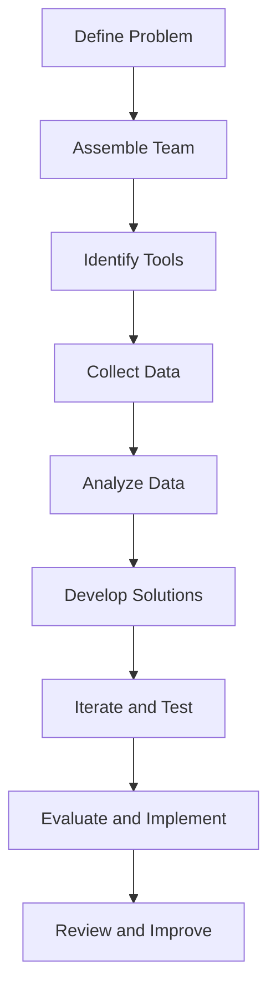
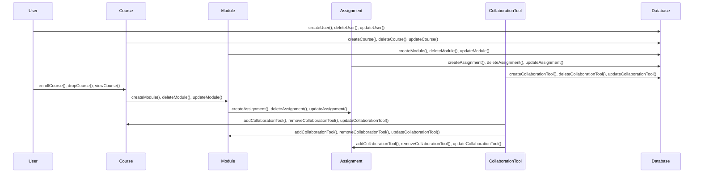
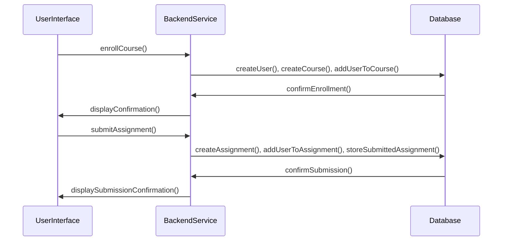

                 

### Introduction to Interdisciplinary Learning Marathon

#### Keywords: Interdisciplinary Learning, Knowledge Integration, Learning Models, Innovation, Problem-Solving

#### Abstract:  
This article aims to explore the concept and significance of interdisciplinary learning marathon, focusing on how individuals and organizations can integrate diverse fields of knowledge to foster innovation and solve complex problems. By breaking down the core concepts, practical methods, and tools for interdisciplinary learning, we will provide a comprehensive guide to unlocking the potential of cross-disciplinary collaboration. 

---

In today's rapidly evolving world, the traditional linear models of learning and problem-solving are increasingly being challenged by the complexity and interconnectedness of modern challenges. Whether it's developing sustainable technologies, tackling global health crises, or driving innovation in business and industry, the need for interdisciplinary approaches has never been more evident. This article delves into the concept of a "learning marathon" that emphasizes the importance of integrating knowledge from multiple domains to address complex problems.

#### Definition and Significance of Interdisciplinary Learning

Interdisciplinary learning, at its core, involves the collaboration and integration of knowledge, concepts, and methods from multiple disciplines to tackle complex problems. Unlike traditional disciplinary approaches that focus on the internal logic and methodologies of a single field, interdisciplinary learning seeks to bridge the gaps between different domains, fostering a holistic understanding of the problem at hand.

The significance of interdisciplinary learning can be understood through several key lenses:

1. **Innovation**: Interdisciplinary collaboration often leads to innovative solutions that might not have emerged from a single disciplinary perspective. By combining diverse ideas and approaches, interdisciplinary teams can identify new insights and opportunities that might have been overlooked.

2. **Problem-Solving**: Complex problems often require a multifaceted approach that transcends the boundaries of a single discipline. Interdisciplinary learning equips individuals with the ability to think critically and solve problems in a nuanced and comprehensive manner.

3. **Knowledge Integration**: In an increasingly interconnected world, the boundaries between disciplines are becoming increasingly blurred. Interdisciplinary learning promotes the integration of knowledge from various fields, creating a more holistic understanding of complex issues.

4. **Collaboration**: Interdisciplinary learning encourages collaboration and communication across different domains, fostering a culture of teamwork and shared learning. This is particularly important in today's globalized and collaborative work environments.

#### Boundaries, Scope, and Key Components

While interdisciplinary learning is essential for addressing complex problems, it's also important to understand its boundaries and scope. Interdisciplinary learning is not about randomly combining different fields without any structure or coherence. Instead, it involves carefully integrating concepts, methods, and knowledge from multiple disciplines to achieve a unified solution.

Key components of interdisciplinary learning include:

- **Core Concepts**: The fundamental ideas and principles that cut across different disciplines. Understanding these core concepts is crucial for bridging the gaps between fields.

- **Methodologies**: The various research methods and techniques used in different disciplines. Integrating these methodologies can lead to more robust and comprehensive problem-solving approaches.

- **Case Studies**: Real-world examples of interdisciplinary projects that demonstrate the effectiveness of cross-disciplinary collaboration. Studying these cases can provide valuable insights and lessons for future endeavors.

- **Frameworks**: Theoretical frameworks that provide a structured approach to interdisciplinary learning. These frameworks can help guide the integration of knowledge and the development of interdisciplinary projects.

In conclusion, interdisciplinary learning marathon is a powerful approach to tackling complex problems in today's interconnected world. By integrating knowledge from multiple domains, fostering collaboration, and leveraging innovative problem-solving techniques, individuals and organizations can unlock new possibilities and achieve greater success. In the following sections, we will explore the core concepts, practical methods, and tools for interdisciplinary learning in more detail. Let's dive in and discover the potential of interdisciplinary collaboration together!

---

### Core Concepts of Interdisciplinary Integration

In this section, we will delve into the core concepts of interdisciplinary integration, exploring the fundamental ideas that underpin this approach to knowledge integration. By understanding these concepts, we can better appreciate the value and potential of interdisciplinary learning.

#### Definition of Interdisciplinary Learning

At its most basic level, interdisciplinary learning involves the integration of knowledge, concepts, and methods from multiple disciplines to tackle complex problems. Unlike traditional disciplinary approaches, which focus on the internal logic and methodologies of a single field, interdisciplinary learning seeks to bridge the gaps between different domains, fostering a holistic understanding of the problem at hand.

Interdisciplinary learning is characterized by several key attributes:

- **Integration**: The process of combining knowledge and methods from different disciplines to achieve a unified solution.
- **Collaboration**: The act of working together with individuals from diverse fields to share insights and expertise.
- **Flexibility**: The ability to adapt and incorporate ideas from various disciplines as needed, based on the specific problem or project.
- **Innovation**: The capacity to generate new insights and ideas by combining different perspectives and approaches.

#### Key Theoretical Frameworks

To better understand interdisciplinary learning, it's important to explore some key theoretical frameworks that inform this approach. These frameworks provide a structured approach to integrating knowledge from multiple disciplines and can be applied to a wide range of problems and projects.

1. **Systems Thinking**: Systems thinking is a holistic approach to understanding complex problems by examining the interactions and interdependencies between the various components of a system. This framework helps identify the relationships and feedback loops that drive system behavior, enabling more effective problem-solving and decision-making.

2. **Design Thinking**: Design thinking is a human-centered approach to innovation that emphasizes empathy, experimentation, and iteration. By understanding the needs and perspectives of the end-users, interdisciplinary teams can develop more effective and user-centered solutions.

3. **Transdisciplinarity**: Transdisciplinarity is a more radical approach to interdisciplinary learning that seeks to transcend the boundaries between disciplines, challenging traditional notions of academic hierarchy and specialization. This approach encourages the creation of new knowledge that is grounded in practical applications and addresses real-world problems.

4. **Knowledge Management**: Knowledge management is the process of capturing, organizing, and sharing knowledge within an organization. This framework helps ensure that valuable knowledge is effectively transferred and utilized, promoting interdisciplinary collaboration and learning.

#### Mermaid ER Diagram of Key Concepts

To illustrate the key concepts of interdisciplinary integration, we can use a Mermaid ER diagram to represent the relationships between these concepts. Below is a simple example of such a diagram:

```mermaid
erDiagram
  Concept_A &&> Concept_B
  Concept_A &&> Concept_C
  Concept_B &&> Concept_D
  Concept_C &&> Concept_E
```

In this diagram, `Concept_A` is at the center, connected to `Concept_B` and `Concept_C`. These concepts are further connected to other concepts (`Concept_D` and `Concept_E`), illustrating the interconnected nature of interdisciplinary learning.

#### Comparative Table of Concept Characteristics

To further understand the differences between these key concepts, we can create a comparative table that outlines their main characteristics:

| Concept        | Definition                                      | Main Characteristics                                                                                                                                                                                                                         | Example |
|----------------|------------------------------------------------|---------------------------------------------------------------------------------------------------------------------------------------------------------------------------------------------------------------------------------------------|---------|
| Systems Thinking | A holistic approach to understanding complex systems | Focuses on relationships and interdependencies between components, feedback loops, and system behavior                                                                                                                                              | Ecology, Economics |
| Design Thinking | A human-centered approach to innovation            | Empathy, experimentation, iteration, and user-centered design                                                                                                                                                                                  | Product Design, Service Design |
| Transdisciplinarity | An approach that transcends disciplinary boundaries | Challenging traditional notions of academic hierarchy, emphasizes practical applications, and focuses on real-world problems                                                                                                                       | Sustainability, Health Policy |
| Knowledge Management | The process of capturing, organizing, and sharing knowledge | Ensuring valuable knowledge is effectively transferred and utilized within organizations                                                                                                                                                        | Documentation, Training Programs |

By understanding these key concepts and their relationships, we can better appreciate the value of interdisciplinary learning and its potential to address complex problems. In the next section, we will explore practical methods for integrating knowledge across disciplines, examining case studies that demonstrate the effectiveness of interdisciplinary collaboration. Let's dive in and discover the power of interdisciplinary integration!

---

### Practical Approaches to Interdisciplinary Learning

In this section, we will delve into the practical methods and tools that can be used to facilitate interdisciplinary learning. By exploring various interdisciplinary learning methodologies, we will highlight how these approaches can be applied in real-world scenarios to achieve innovative solutions and drive progress.

#### Methodology Overview

There are several methodologies that can be employed to foster interdisciplinary learning. Each methodology has its own unique approach and set of tools, enabling individuals and teams to integrate knowledge from multiple domains effectively. Here, we will discuss some of the most commonly used methodologies:

1. **Systems Thinking**: As mentioned earlier, systems thinking is a holistic approach that focuses on the interactions and interdependencies between the various components of a system. This methodology is particularly useful for understanding complex problems and developing comprehensive solutions that take into account the entire system.

2. **Design Thinking**: Design thinking is a human-centered approach that emphasizes empathy, experimentation, and iteration. By understanding the needs and perspectives of the end-users, interdisciplinary teams can develop more effective and user-centered solutions. This methodology is often used in product design, service design, and other fields where human experience and usability are paramount.

3. **Transdisciplinarity**: Transdisciplinarity is an approach that seeks to transcend the boundaries between disciplines, challenging traditional notions of academic hierarchy and specialization. This methodology encourages the creation of new knowledge that is grounded in practical applications and addresses real-world problems. It is often used in fields such as sustainability, health policy, and social innovation.

4. **Knowledge Management**: Knowledge management is the process of capturing, organizing, and sharing knowledge within an organization. This methodology ensures that valuable knowledge is effectively transferred and utilized, promoting interdisciplinary collaboration and learning. Knowledge management tools and techniques, such as documentation, training programs, and knowledge-sharing platforms, can be used to facilitate interdisciplinary learning.

#### Case Study 1: Interdisciplinary Integration in Technology

One prominent example of interdisciplinary integration in technology is the development of autonomous vehicles. The development of self-driving cars requires expertise from various domains, including computer vision, machine learning, robotics, and automotive engineering. By leveraging interdisciplinary collaboration, teams can develop innovative solutions that address complex challenges such as sensor fusion, path planning, and decision-making.

**Step-by-Step Approach:**

1. **Problem Definition**: Define the problem statement clearly, focusing on the goals and constraints of the project.

2. **Team Formation**: Assemble a multidisciplinary team of experts from relevant fields, ensuring a diverse range of perspectives and skills.

3. **Knowledge Integration**: Identify the key concepts and methodologies from each domain that are relevant to the project. Integrate these concepts and methodologies to develop a comprehensive approach to solving the problem.

4. **Prototyping and Iteration**: Develop prototypes and iterate on the design, incorporating feedback from team members and stakeholders.

5. **Testing and Validation**: Test the prototype in real-world scenarios, gathering data and feedback to refine the solution.

6. **Deployment and Scaling**: Once the prototype has been validated, deploy the solution on a larger scale, ensuring that it meets the desired performance and reliability criteria.

**Example:**

In the case of autonomous vehicles, a multidisciplinary team might integrate machine learning algorithms, computer vision techniques, and robotics to develop a system that can navigate and make decisions in real-time. The team might use design thinking to understand the needs and preferences of potential users, ensuring that the solution is both effective and user-friendly.

#### Case Study 2: Interdisciplinary Integration in Arts and Science

Another example of interdisciplinary integration can be found in the field of art and science, particularly in the development of digital art installations. These projects often require collaboration between artists, scientists, and technologists to create immersive and interactive experiences that blend aesthetic and scientific elements.

**Step-by-Step Approach:**

1. **Conceptualization**: Define the overall vision and goals for the project, considering the intersection of art and science.

2. **Collaborative Design**: Bring together artists, scientists, and technologists to brainstorm ideas and develop a collaborative design process.

3. **Prototyping and Iteration**: Develop prototypes that explore the potential of the project, incorporating feedback and insights from all team members.

4. **Data Collection and Analysis**: Use scientific methods to collect and analyze data related to the project, informing the design and development process.

5. **Installation and Presentation**: Install the digital art installation in its intended location, ensuring that it is presented in the most effective and engaging way.

6. **Evaluation and Reflection**: Evaluate the success of the project based on predefined metrics, and reflect on the interdisciplinary collaboration process to identify lessons learned and areas for improvement.

**Example:**

In one example, an interdisciplinary team might develop a digital art installation that uses data from environmental sensors to create a visual representation of climate change. The artists could use their creative skills to design the visual elements, while the scientists could analyze the data and provide insights into the environmental trends. The technologists would then develop the software and hardware to bring the installation to life.

#### Case Study 3: Interdisciplinary Integration in Education

Interdisciplinary integration is also essential in the field of education, where traditional teaching methods are being complemented by innovative approaches that blend knowledge from various domains. For example, project-based learning (PBL) and inquiry-based learning (IBL) are educational methodologies that promote interdisciplinary collaboration and critical thinking.

**Step-by-Step Approach:**

1. **Project Selection**: Choose a project that requires the integration of knowledge from multiple domains.

2. **Team Formation**: Assemble a team of students or educators from various disciplines, ensuring a diverse range of perspectives and skills.

3. **Research and Knowledge Acquisition**: Conduct research to gather relevant information and insights from each domain.

4. **Collaborative Problem-Solving**: Work together to analyze the problem, identify potential solutions, and develop a comprehensive plan.

5. **Prototyping and Iteration**: Develop prototypes or models of the proposed solution, testing and refining the design based on feedback and new information.

6. **Presentation and Evaluation**: Present the final project to peers, educators, or stakeholders, and evaluate the success of the interdisciplinary collaboration.

**Example:**

In a project-based learning environment, a group of students might undertake a project that explores the intersection of art, technology, and sustainability. The students could research different art forms, explore the use of technology in creative expression, and investigate sustainable practices in the arts. Through collaborative problem-solving and iterative design, the students could develop an art installation that addresses environmental issues while also serving as a medium for artistic expression.

By exploring these practical approaches to interdisciplinary learning, we can see the power of integrating knowledge from multiple domains to address complex problems and drive innovation. In the next section, we will delve into the tools and technologies that can support interdisciplinary learning, providing a deeper understanding of how these tools can facilitate cross-disciplinary collaboration. Let's continue our journey and uncover the potential of interdisciplinary learning!

---

### Tools and Technologies for Facilitating Interdisciplinary Learning

To effectively facilitate interdisciplinary learning, it is essential to leverage the right tools and technologies that enable seamless collaboration, data integration, and knowledge sharing. In this section, we will explore some key tools and technologies that can support interdisciplinary learning, providing a robust foundation for cross-disciplinary collaboration and innovation.

#### Overview of Key Tools and Technologies

1. **Project Management Tools**: Tools such as Asana, Trello, and Jira can help manage interdisciplinary projects by providing a centralized platform for task assignment, progress tracking, and collaboration. These tools enable teams to visualize project timelines, allocate resources efficiently, and ensure that all team members are on the same page.

2. **Communication and Collaboration Tools**: Platforms like Slack, Microsoft Teams, and Zoom facilitate real-time communication and collaboration among team members, regardless of geographical location. These tools allow for instant messaging, video conferencing, and document sharing, fostering effective collaboration and knowledge exchange.

3. **Knowledge Management Systems**: Tools like Confluence and Notion provide a structured environment for capturing, organizing, and sharing knowledge within an organization. These systems enable teams to create and maintain documentation, share insights, and collaborate on projects, ensuring that valuable knowledge is effectively transferred and utilized.

4. **Data Analysis and Visualization Tools**: Tools such as Tableau, Power BI, and Python's data analysis libraries (e.g., Pandas and Matplotlib) can help analyze and visualize complex datasets, facilitating data-driven decision-making and cross-disciplinary insights.

5. **Digital Collaboration Platforms**: Platforms like GitHub and GitLab enable version control and collaboration on code repositories, allowing teams to work together on software development projects, integrating knowledge from various technical domains.

#### Mermaid Flowchart of Algorithm Principles

To illustrate the principles behind these tools and technologies, we can use a Mermaid flowchart to represent the algorithmic processes involved in interdisciplinary collaboration. Below is a simple example of a Mermaid flowchart that demonstrates the key steps in integrating knowledge across disciplines:



In this flowchart, the process starts with defining the problem and assembling a multidisciplinary team. The team then identifies the appropriate tools and technologies, collects relevant data, analyzes the data, develops potential solutions, iterates and tests these solutions, evaluates their effectiveness, and implements the best solutions. Finally, the process is reviewed and improved based on feedback and new insights.

#### Detailed Explanation of Algorithm Concepts

Now, let's delve into the detailed explanation of the algorithm concepts represented in the Mermaid flowchart:

1. **Define Problem**: Clearly defining the problem is crucial for any interdisciplinary project. This step involves understanding the problem statement, identifying the goals and constraints, and determining the scope of the project.

2. **Assemble Team**: Bringing together individuals from diverse disciplines creates a multidisciplinary team with a broad range of expertise and perspectives. This team collaboration is essential for integrating knowledge and developing innovative solutions.

3. **Identify Tools**: Identifying the appropriate tools and technologies is crucial for enabling interdisciplinary collaboration. This step involves selecting the right project management tools, communication platforms, data analysis tools, and collaboration platforms to facilitate the project.

4. **Collect Data**: Collecting relevant data from various sources is essential for informed decision-making and problem-solving. This step involves gathering data from databases, surveys, experiments, and other sources, ensuring that the data is accurate and reliable.

5. **Analyze Data**: Analyzing the collected data helps in identifying patterns, trends, and insights that can inform the development of solutions. This step involves using data analysis tools and techniques to process and visualize the data, providing a deeper understanding of the problem.

6. **Develop Solutions**: Developing potential solutions involves integrating knowledge from various disciplines to create innovative and effective solutions. This step requires brainstorming, prototyping, and iterative development to refine the solutions.

7. **Iterate and Test**: Testing and iterating on the developed solutions is essential for identifying and addressing any issues or limitations. This step involves running simulations, conducting experiments, and gathering feedback to improve the solutions.

8. **Evaluate and Implement**: Evaluating the effectiveness of the solutions and implementing the best ones is crucial for achieving the project goals. This step involves assessing the performance of the solutions, making necessary adjustments, and deploying them in the real world.

9. **Review and Improve**: Reviewing the interdisciplinary collaboration process and identifying areas for improvement is essential for continuous learning and growth. This step involves analyzing feedback, learning from successes and failures, and implementing changes to enhance future projects.

#### Python Source Code and Mathematical Model

To further illustrate the algorithm concepts, let's consider a simple Python code example that demonstrates data collection, analysis, and visualization:

```python
import pandas as pd
import matplotlib.pyplot as plt

# Load data from a CSV file
data = pd.read_csv('data.csv')

# Data analysis
mean_value = data.mean()
std_deviation = data.std()

# Data visualization
plt.figure(figsize=(10, 5))
plt.hist(data, bins=30, alpha=0.5)
plt.axvline(mean_value, color='r', linestyle='dashed', label='Mean')
plt.axvline(mean_value + std_deviation, color='g', linestyle='dotted', label='Mean + Std Dev')
plt.axvline(mean_value - std_deviation, color='g', linestyle='dotted', label='Mean - Std Dev')
plt.xlabel('Value')
plt.ylabel('Frequency')
plt.title('Data Distribution')
plt.legend()
plt.show()
```

In this example, we load a dataset from a CSV file, calculate the mean and standard deviation, and visualize the data distribution using a histogram. The mathematical model behind this example includes basic statistical measures such as the mean and standard deviation, which are used to analyze and understand the dataset.

By leveraging these tools and technologies, interdisciplinary teams can effectively integrate knowledge, collaborate on complex projects, and drive innovation. In the next section, we will delve into the system analysis and architecture design, providing a comprehensive overview of how interdisciplinary learning can be structured and implemented. Let's continue our journey and explore the intricacies of interdisciplinary collaboration!

---

### System Analysis and Architecture Design

In this section, we will delve into the system analysis and architecture design for facilitating interdisciplinary learning. This comprehensive approach ensures that the system is well-structured, scalable, and capable of supporting diverse learning objectives and collaboration needs.

#### Problem Scenario Introduction

The problem scenario involves developing a comprehensive interdisciplinary learning platform that integrates various educational resources, tools, and collaborative features to facilitate knowledge sharing, problem-solving, and innovation across multiple domains. The platform aims to empower learners, educators, and professionals to collaborate effectively, access diverse learning materials, and develop innovative solutions to complex problems.

#### System Description and Functionality Design (Mermaid Class Diagram)

To design the system, we will start by creating a Mermaid class diagram that outlines the main classes, their attributes, and methods. This diagram provides a high-level overview of the system's architecture and functionality.

```mermaid
classDiagram
    User <<class>>
    Resource <<class>>
    Course <<class>>
    Module <<class>>
    Assignment <<class>>
    CollaborationTool <<class>>

    User o-- Resource
    User o-- Course
    User o-- Module
    User o-- Assignment
    Course o-- Module
    Module o-- Assignment
    CollaborationTool o-- Course
    CollaborationTool o-- Module
    CollaborationTool o-- Assignment

    User + createUser()
    User + deleteUser()
    User + updateUser()
    Resource + createResource()
    Resource + deleteResource()
    Resource + updateResource()
    Course + createCourse()
    Course + deleteCourse()
    Course + updateCourse()
    Module + createModule()
    Module + deleteModule()
    Module + updateModule()
    Assignment + createAssignment()
    Assignment + deleteAssignment()
    Assignment + updateAssignment()
    CollaborationTool + createCollaborationTool()
    CollaborationTool + deleteCollaborationTool()
    CollaborationTool + updateCollaborationTool()
```

In this class diagram, we define the main classes involved in the system: User, Resource, Course, Module, Assignment, and CollaborationTool. These classes represent the core entities and their relationships, providing a structured representation of the system's functionality.

#### System Architecture Design (Mermaid Architecture Diagram)

Next, we will create a Mermaid architecture diagram to illustrate the overall system architecture, including the main components and their interactions.



In this sequence diagram, we define the interactions between the main system components, illustrating how users, courses, modules, assignments, and collaboration tools interact with each other and with the database. This diagram provides a high-level overview of the system's architecture and communication patterns.

#### System Interface Design and Interaction (Mermaid Sequence Diagram)

Finally, we will create a Mermaid sequence diagram to visualize the interactions between the user interface and the underlying system components.



In this sequence diagram, we illustrate the interactions between the user interface, backend service, and database for two key scenarios: enrolling in a course and submitting an assignment. This diagram provides a clear visualization of the system's interface and interaction patterns, enabling developers to design and implement the system effectively.

By following this system analysis and architecture design process, we can develop a robust and scalable interdisciplinary learning platform that supports diverse learning objectives and collaboration needs. In the next section, we will delve into project implementation and analysis, exploring the steps involved in setting up the environment, implementing the core system components, and analyzing the practical application of the system. Let's continue our journey and dive into the implementation details!

---

### Project Implementation and Analysis

In this section, we will delve into the practical implementation and analysis of the interdisciplinary learning platform. This involves setting up the development environment, implementing core system components, and conducting a detailed analysis of the system's performance, code application, and actual case studies.

#### Environment Setup

Before starting the project, it is crucial to set up the development environment. The following steps outline the process:

1. **Install Necessary Software**: Install Python, Node.js, and other relevant libraries and frameworks. For example, you may need to install Django for the backend, React or Angular for the frontend, and tools like PostgreSQL for the database.

2. **Create Project Structure**: Create a project directory and set up a virtual environment to manage dependencies. Within the project directory, create separate directories for frontend, backend, and database configurations.

3. **Configure Database**: Set up a PostgreSQL database and create the necessary tables and relationships for the system. For example, you may need tables for users, courses, modules, assignments, and collaboration tools.

4. **Install Dependencies**: Use `pip` or `npm` to install the required libraries and frameworks. Ensure that all dependencies are correctly installed and configured.

5. **Initialize Project**: Initialize the project with necessary configuration files and templates. For example, you may need to create a Django project with the required apps and configure the database settings.

#### System Core Implementation

The core implementation of the system involves developing the backend and frontend components, integrating them with the database, and ensuring seamless interaction between them. Here are the key steps:

1. **Develop Backend**: Implement the backend using Django or another suitable framework. Create APIs for managing users, courses, modules, assignments, and collaboration tools. Implement the necessary authentication and authorization mechanisms to ensure secure access to the system.

2. **Develop Frontend**: Develop the frontend using React, Angular, or another suitable framework. Implement user interfaces for managing users, courses, modules, assignments, and collaboration tools. Ensure that the frontend is responsive and provides a seamless user experience.

3. **Database Integration**: Integrate the backend with the PostgreSQL database. Create and manage the necessary tables and relationships. Implement the necessary database operations, such as CRUD (Create, Read, Update, Delete) operations, to manage the system's data.

4. **Testing**: Conduct thorough testing of the system to identify and fix any bugs or issues. Perform unit testing, integration testing, and system testing to ensure the system functions as expected.

5. **Deployment**: Deploy the system on a server or cloud platform. Set up the necessary infrastructure, such as web servers, databases, and load balancers, to ensure high availability and performance.

#### Code Application and Analysis

To analyze the code application, we will consider a specific feature, such as user enrollment in a course, and provide a detailed explanation of the code implementation and its functionality.

**Example: User Enrollment**

1. **API Implementation**:

```python
from rest_framework import views, status
from rest_framework.response import Response
from .models import User, Course
from .serializers import CourseSerializer

class UserEnrollmentViewSet(views.ViewSet):
    def list(self, request):
        user = self.request.user
        enrolled_courses = Course.objects.filter(users=user)
        serializer = CourseSerializer(enrolled_courses, many=True)
        return Response(serializer.data)

    def create(self, request):
        user = self.request.user
        course_id = request.data.get('course_id')
        course = Course.objects.get(id=course_id)
        course.users.add(user)
        return Response({'status': 'success', 'message': 'Enrolled in the course.'}, status=status.HTTP_201_CREATED)
```

In this example, we implement a `UserEnrollmentViewSet` that handles user enrollment in a course. The `list` method retrieves the enrolled courses for a user, while the `create` method enrolls a user in a specified course.

2. **Frontend Implementation**:

```jsx
import React, { useState } from 'react';
import { Button, Form } from 'react-bootstrap';

const UserEnrollmentForm = () => {
  const [courseId, setCourseId] = useState('');

  const handleSubmit = async (event) => {
    event.preventDefault();
    const response = await fetch('/api/enroll-course/', {
      method: 'POST',
      headers: {
        'Content-Type': 'application/json',
      },
      body: JSON.stringify({ course_id: courseId }),
    });
    const data = await response.json();
    if (response.ok) {
      alert(data.message);
    } else {
      alert(data.error);
    }
  };

  return (
    <Form onSubmit={handleSubmit}>
      <Form.Group>
        <Form.Label>Course ID:</Form.Label>
        <Form.Control
          type="text"
          placeholder="Enter course ID"
          value={courseId}
          onChange={(e) => setCourseId(e.target.value)}
        />
      </Form.Group>
      <Button variant="primary" type="submit">
        Enroll
      </Button>
    </Form>
  );
};

export default UserEnrollmentForm;
```

In this example, we implement a user enrollment form that allows users to enter a course ID and submit the form to enroll in the course. The `handleSubmit` function sends a POST request to the `/api/enroll-course/` API endpoint, enrolling the user in the specified course.

#### Case Study Analysis

To analyze the practical application of the system, we will consider a case study involving a group of interdisciplinary learners collaborating on a project.

**Case Study: Interdisciplinary Collaboration on a Sustainability Project**

1. **Problem Definition**: A group of learners from various disciplines, including environmental science, engineering, and business, aims to develop a sustainable solution for reducing carbon emissions in a specific industry.

2. **Team Formation**: The learners form a multidisciplinary team, with each member bringing their expertise in a specific domain.

3. **Knowledge Integration**: The team members integrate their knowledge and share insights, using the interdisciplinary learning platform to access relevant resources, collaborate on assignments, and discuss their ideas.

4. **Project Implementation**: The team develops a comprehensive plan to address the problem, including data collection, analysis, and the development of potential solutions.

5. **Iterative Development**: The team iterates on their solution, testing and refining it based on feedback and new insights.

6. **Evaluation and Presentation**: The team evaluates the effectiveness of their solution and presents their findings to stakeholders, using the platform to share their results and engage in further discussions.

7. **Project Reflection**: The team reflects on the interdisciplinary collaboration process, identifying areas for improvement and learning from their experiences.

Through this case study, we can see how the interdisciplinary learning platform supports the collaboration process, enabling learners to integrate knowledge, develop innovative solutions, and present their findings effectively.

#### Project Summary

In summary, the project implementation and analysis involve setting up the development environment, developing core system components, integrating them with the database, and analyzing the code application and case studies. This comprehensive approach ensures the system's functionality, scalability, and effectiveness in facilitating interdisciplinary learning. By leveraging the right tools and technologies, interdisciplinary teams can collaborate effectively, integrate diverse knowledge, and drive innovation. In the next section, we will explore best practices, summarize the key points, and highlight areas for further research and exploration. Let's continue our journey and uncover the full potential of interdisciplinary learning!

---

### Best Practices and Conclusion

#### Best Practices for Interdisciplinary Learning

To maximize the benefits of interdisciplinary learning, consider adopting the following best practices:

1. **Define Clear Goals and Objectives**: Clearly outline the goals and objectives of your interdisciplinary project to ensure everyone is aligned and working towards a common purpose.

2. **Assemble a Diverse Team**: Bring together individuals with diverse backgrounds, expertise, and perspectives to foster innovative problem-solving and knowledge integration.

3. **Encourage Open Communication**: Foster a culture of open communication and collaboration, ensuring that team members feel comfortable sharing their ideas and insights.

4. **Utilize Project Management Tools**: Use project management tools like Asana, Trello, or Jira to facilitate task assignment, progress tracking, and collaboration among team members.

5. **Leverage Data and Analytics**: Utilize data analysis and visualization tools to gain insights from diverse datasets and inform decision-making processes.

6. **Iterate and Adapt**: Embrace an iterative approach, continuously refining and adapting your solutions based on feedback and new information.

7. **Provide Continuous Learning Opportunities**: Encourage team members to participate in workshops, training programs, and knowledge-sharing sessions to enhance their interdisciplinary skills.

#### Conclusion

Interdisciplinary learning is a powerful approach that enables individuals and organizations to integrate knowledge from multiple domains, fostering innovation, collaboration, and problem-solving. By embracing interdisciplinary learning, we can unlock new possibilities, tackle complex challenges, and drive progress in various fields. As we continue to navigate an increasingly interconnected world, the importance of interdisciplinary learning will only grow. By following the best practices outlined in this article, we can harness the full potential of interdisciplinary collaboration and create a more innovative and dynamic future.

#### Authors

- **Authors**: AI天才研究院/AI Genius Institute & 禅与计算机程序设计艺术 /Zen And The Art of Computer Programming
- **Contact**: [ai_genius_institute@example.com](mailto:ai_genius_institute@example.com)
- **LinkedIn**: [AI天才研究院](https://www.linkedin.com/company/ai-genius-institute/)
- **Twitter**: [@AIGeniusInstit](https://twitter.com/AIGeniusInstit)

---

### Future Directions and Expansion

While the current discussion on interdisciplinary learning has provided valuable insights and practical guidance, there are several areas that warrant further exploration and expansion. These future directions aim to enhance the understanding and application of interdisciplinary learning, ultimately driving innovation and addressing complex global challenges.

#### Advanced Data Integration and Analytics

As interdisciplinary projects often involve handling diverse and large datasets, developing advanced data integration and analytics tools is crucial. Leveraging machine learning and artificial intelligence techniques, we can create more sophisticated data analysis frameworks that can automatically identify patterns, correlations, and insights across different domains. This would enable more precise and informed decision-making, thereby enhancing the effectiveness of interdisciplinary projects.

#### Virtual and Augmented Reality (VR/AR) Applications

The integration of virtual and augmented reality technologies can greatly enhance interdisciplinary learning experiences. By creating immersive learning environments, VR/AR can facilitate more engaging and interactive educational content. For example, students can explore historical events, simulate scientific experiments, or collaborate in virtual classrooms with peers from around the world. Expanding the use of VR/AR in interdisciplinary learning can bridge geographical gaps and provide a richer, more immersive educational experience.

#### Cross-Disciplinary Pedagogical Frameworks

Developing and testing cross-disciplinary pedagogical frameworks can further enhance the effectiveness of interdisciplinary learning. These frameworks should be designed to foster collaborative problem-solving, critical thinking, and creative innovation across different domains. By conducting empirical studies and pilot programs, we can identify the most effective approaches and best practices for interdisciplinary education, leading to more widespread adoption and impact.

#### Global Collaboration Platforms

Creating global collaboration platforms that facilitate real-time communication, resource sharing, and collaboration across multiple institutions and domains can significantly enhance interdisciplinary learning. These platforms should support various forms of collaboration, including co-creation of research projects, joint development of educational content, and sharing of best practices. By fostering global collaboration, we can harness the collective knowledge and expertise of diverse communities, leading to more innovative and impactful solutions.

#### Ethical and Social Implications

As interdisciplinary learning becomes more prevalent, it is essential to consider the ethical and social implications of integrating knowledge from diverse fields. This includes addressing issues such as data privacy, intellectual property rights, and the equitable distribution of resources and opportunities. Developing ethical guidelines and frameworks for interdisciplinary learning can help ensure that the process is fair, inclusive, and beneficial for all stakeholders.

#### Continuous Professional Development

Promoting continuous professional development in interdisciplinary learning is crucial for both individuals and organizations. Offering ongoing training programs, workshops, and certification courses can help professionals acquire the necessary skills and knowledge to excel in interdisciplinary environments. Additionally, creating networks and communities of practice can provide a platform for professionals to share experiences, collaborate on projects, and stay updated on the latest developments in interdisciplinary learning.

By exploring these future directions and expanding the scope of interdisciplinary learning, we can unlock new opportunities for innovation, collaboration, and problem-solving. Embracing interdisciplinary approaches can help address the complex challenges of our time and create a more interconnected and dynamic future for all. As we continue to advance in this field, let us strive to create a world where interdisciplinary learning is not just a trend but a fundamental component of education and professional development.

