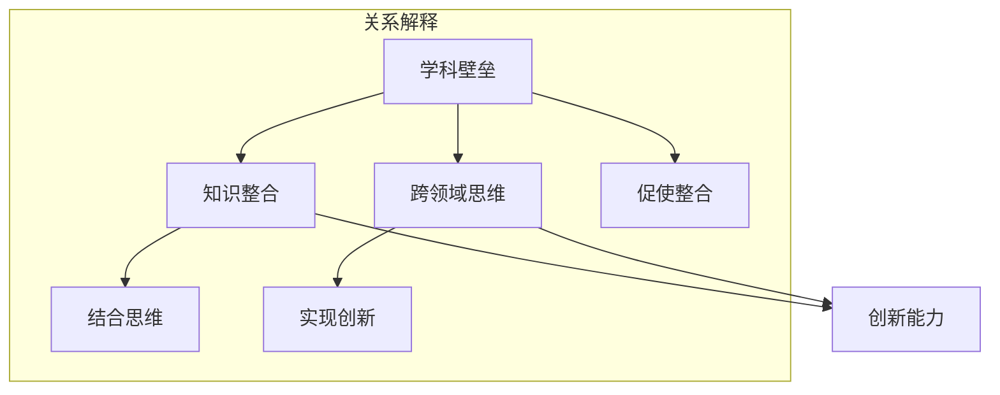
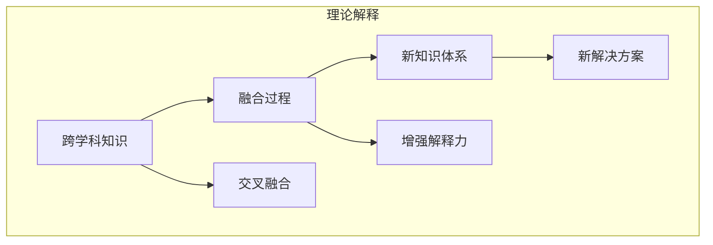
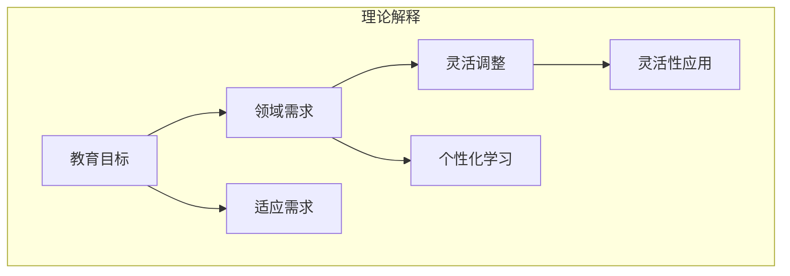
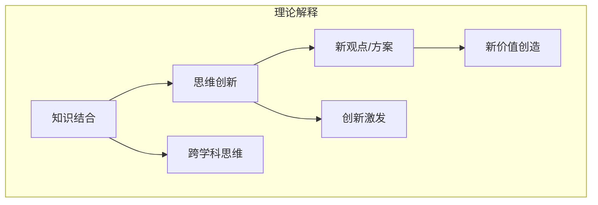
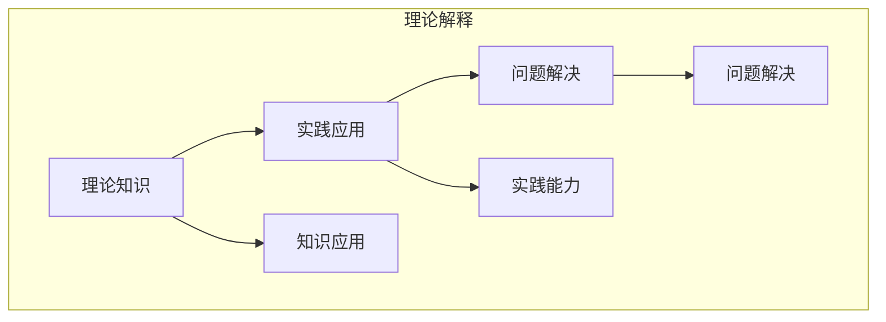

                 

### 文章标题

# 跨界学习：打破知识壁垒寻找综合意义

### 文章关键词

- 跨界学习
- 知识整合
- 综合意义
- 知识壁垒
- 教育创新

### 文章摘要

本文探讨了跨界学习在当今知识经济时代的重要性。通过打破传统学科界限，跨界学习不仅有助于解决知识碎片化的问题，还能培养学生的综合素质和创新能力。文章首先介绍了跨界学习的定义和特点，然后探讨了其理论基础和实际应用。通过案例分析和最佳实践，文章强调了跨界学习对于个人和社会发展的重要意义，并提出了未来研究方向和挑战。通过本文的讨论，读者可以更好地理解跨界学习，并运用其原则和方法，在各自的领域中实现知识的整合和创新。

### 引言

#### 背景和问题陈述

在信息化和全球化快速发展的今天，知识更新速度显著加快，学科交叉融合日益普遍。然而，传统的学科教育体系往往强调知识的分门别类，学生接受的教育往往局限于特定的学科领域，导致知识体系碎片化。这种教育模式不仅限制了学生的视野，也难以满足现代社会对复合型人才的需求。跨界学习作为一种新兴的教育理念，旨在打破学科间的壁垒，实现知识的深度融合和整合，从而培养具有创新能力、综合思维和跨领域适应能力的现代人才。

#### 跨界学习的定义与特点

跨界学习，又称跨学科学习，是指在不同学科领域之间进行知识、方法和思维的相互借鉴与整合。它不仅涉及知识的跨越，更强调技能和思维的融合。跨界学习的特点主要包括：

1. **综合性**：跨界学习不是简单地将不同学科的知识堆砌在一起，而是通过整合各学科的核心概念和方法，形成一种全新的、综合的知识体系。
2. **灵活性**：跨界学习不拘泥于传统的学科框架，允许学生在不同领域间自由探索和跨学科应用。
3. **创新性**：跨界学习鼓励学生提出新的观点和解决方案，通过跨学科的思维方式激发创新。
4. **应用性**：跨界学习注重将理论知识与实际应用相结合，提高学生的实践能力和问题解决能力。

#### 跨界学习的意义

跨界学习在当前社会中的重要性不言而喻。首先，它有助于培养学生的综合素质和跨领域适应能力，使学生能够在复杂多变的社会环境中应对各种挑战。其次，跨界学习能够促进学科间的知识融合，推动科学技术和社会发展的创新。最后，跨界学习有助于解决传统学科教育中存在的知识碎片化问题，提高教育的整体质量和效率。

#### 跨界学习的边界与外延

虽然跨界学习具有广泛的应用前景，但其应用边界也需要明确。首先，跨界学习并非意味着完全摒弃传统学科体系，而是在传统学科基础上进行扩展和整合。其次，跨界学习需要根据具体的教育目标和领域需求进行有针对性的设计和实施，不能简单地追求形式上的“跨界”。最后，跨界学习需要强调不同学科之间的内在联系和逻辑关系，避免盲目和低效的整合。

#### 核心概念与联系

为了更好地理解跨界学习，我们需要对其核心概念进行定义和解释，并分析这些概念之间的联系。

**核心概念：**

1. **学科壁垒**：指不同学科之间由于知识体系、研究方法、思维方式等方面的差异所形成的障碍。
2. **知识整合**：指将不同学科的知识和方法融合在一起，形成新的综合性知识体系。
3. **跨领域思维**：指在不同领域间进行思考和创新的能力，包括跨领域的知识迁移和思维创新。
4. **创新能力**：指在知识整合和跨领域思维的基础上，提出新的观点、解决方案或产品的能力。

**核心概念关系：**

- **学科壁垒**是跨界学习的起点和动力，它促使学生寻求新的知识和思维方法。
- **知识整合**是跨界学习的关键步骤，通过整合不同学科的知识，形成新的综合性知识体系。
- **跨领域思维**是实现跨界学习的重要手段，它帮助学生将不同领域的知识进行有机结合。
- **创新能力**是跨界学习的最终目标，通过知识整合和跨领域思维，学生能够提出新的观点和解决方案。

下面是一个Mermaid流程图，展示跨界学习的核心概念和关系：

通过上述定义和关系分析，我们可以更清晰地理解跨界学习的概念和内涵，为后续的讨论和分析奠定基础。

### 跨界学习的核心概念和理论原理

在理解了跨界学习的基本定义和特点后，我们接下来将深入探讨其核心概念和理论基础。跨界学习的成功实施离不开对其核心理论和原则的深刻理解，以下是几个关键概念及其理论原理：

#### 综合性

**定义**：综合性是指将不同学科的知识、方法和思维方式融合在一起，形成一种全新的、综合性知识体系。

**特点**：综合性不仅仅是知识的简单叠加，而是通过对不同学科核心概念的深度融合，形成具有更强解释力和应用价值的新知识体系。

**理论依据**：综合性基于跨学科理论，认为知识之间的交叉和融合能够产生新的思维方式和解决方案。例如，计算机科学与心理学结合，可以产生认知计算这一新兴领域。

**Mermaid流程图**：

#### 灵活性

**定义**：灵活性是指跨界学习在实践过程中能够根据不同的教育目标和领域需求，灵活调整学习内容和方法。

**特点**：灵活性使得跨界学习能够适应不同学生的兴趣和能力，以及不同教育场景的具体需求。

**理论依据**：灵活性基于建构主义理论，认为学习是一个主动建构的过程，学生需要根据自身经验和需求，灵活选择和整合知识。

**Mermaid流程图**：

#### 创新性

**定义**：创新性是指通过跨界学习，学生能够提出新的观点、解决方案或产品，具有创造新价值的能力。

**特点**：创新性强调在跨界学习的框架下，通过跨学科的思维方式，实现知识、方法和思想的创新。

**理论依据**：创新性基于跨学科理论和创新理论，认为不同领域的知识和思维的结合能够激发新的创新点和创造力。

**Mermaid流程图**：

#### 应用性

**定义**：应用性是指跨界学习强调将理论知识与实际应用相结合，提高学生的实践能力和问题解决能力。

**特点**：应用性不仅关注知识的理论层面，更注重知识的实践应用，使学生能够在实际工作中灵活运用所学知识。

**理论依据**：应用性基于实践性学习理论，认为知识的价值在于其应用，通过实践应用能够加深对知识的理解和掌握。

**Mermaid流程图**：

通过上述对跨界学习核心概念和理论原理的讨论，我们可以更好地理解跨界学习的本质和其在教育中的应用价值。在接下来的章节中，我们将通过具体的案例分析和实际应用，进一步探讨跨界学习的具体实施方法和效果。

### 跨界学习的历史发展

跨界学习作为一种新兴的教育理念，其起源可以追溯到20世纪初期。以下是跨界学习在不同时期的发展和重要事件：

#### 20世纪初期：萌芽阶段

20世纪初，随着工业革命的发展，传统学科体系的局限逐渐显现。一些教育家开始思考如何通过跨学科的方法来提高教育质量。例如，瑞士教育家约翰·赫尔特（Johan Huizenga）提出了“教育即生长”的理念，强调学生应在自由的环境中探索和发现知识，这一思想为跨界学习提供了理论依据。

#### 20世纪中期：理论形成阶段

在20世纪中期，随着信息技术的迅速发展，知识更新速度加快，学科交叉融合的需求日益迫切。此时，一些重要的理论开始出现，如美国教育家约翰·杜威（John Dewey）的“体验学习”理论，强调学生在实践中学习的重要性。这些理论为跨界学习提供了更加坚实的理论基础。

#### 20世纪末期至21世纪初：实践探索阶段

20世纪末期，随着全球化和信息化的发展，跨界学习的理念开始得到广泛认可。美国的一些高校，如加州理工学院和麻省理工学院，率先尝试在课程设置和教育方法中引入跨界学习。例如，加州理工学院的“交叉科学”项目，通过跨学科的团队研究和项目实践，培养学生的跨学科思维和创新能力。

#### 21世纪：全面发展阶段

进入21世纪，跨界学习已经成为全球教育改革的重要方向。各国政府和教育机构纷纷出台政策，推动跨界学习在基础教育、高等教育和职业教育中的广泛应用。例如，欧盟的“学习层次架构”（European Qualifications Framework）强调跨学科的能力培养。在中国，教育部也多次强调要加强跨学科教育和创新创业教育。

#### 影响人物和运动

1. **约翰·杜威**：美国教育家和哲学家，提出“体验学习”理论，对跨界学习的发展具有重要影响。
2. **约翰·赫尔特**：瑞士教育家，提出“教育即生长”理念，为跨界学习提供理论基础。
3. **欧洲创新教育运动**：20世纪末至21世纪初，欧洲一些国家发起了创新教育运动，推动跨界学习和跨学科教育的实践。
4. **全球创新教育联盟**：由各国教育机构和专家组成的联盟，致力于推动全球跨界学习的发展和实践。

通过回顾跨界学习的历史发展，我们可以看到，跨界学习作为一种教育理念，经历了从萌芽到理论形成，再到实践探索和全面发展的过程。这一过程中，许多重要人物和运动对跨界学习的发展起到了关键作用，推动了其在全球范围内的广泛应用和深入发展。

### 跨界学习的具体方法和策略

跨界学习不仅是一种理念，更需要在实践中具体实施和落实。以下是一些跨界学习的具体方法和策略，帮助我们在教育中有效应用这一理念：

#### 1. 跨学科课程设计

**定义**：跨学科课程设计是指将不同学科的知识、方法和思维方式整合到同一课程中，形成综合性课程。

**优点**：跨学科课程设计有助于培养学生的综合思维能力和创新能力，提高学生的知识整合能力。

**实施步骤**：
- **需求分析**：分析学生和教学目标的需求，确定需要整合的学科和内容。
- **内容整合**：选择不同学科的核心内容，进行整合和设计，确保课程内容的全面性和连贯性。
- **教学方法**：采用案例教学、项目式学习和团队合作等方法，增强学生的实践能力和跨学科思维。

**示例**：一个跨学科课程可以是“科技与社会”，涵盖物理学、计算机科学、社会学和心理学等多个领域，通过研究科技对社会的影响，培养学生的综合思维能力。

#### 2. 跨领域项目实践

**定义**：跨领域项目实践是指在不同领域间进行项目合作和实践，通过实际操作培养跨领域的能力。

**优点**：跨领域项目实践能够将理论知识与实际应用结合起来，提高学生的实践能力和问题解决能力。

**实施步骤**：
- **项目选择**：选择具有跨领域特征的实际问题或项目，确保项目涵盖多个学科领域。
- **团队组建**：组建跨领域的团队，确保每个成员在项目中都有明确的角色和任务。
- **过程管理**：通过项目管理工具和方法，如Gantt图和时间表，对项目进行有效管理。
- **结果评估**：对项目结果进行评估，总结经验和教训，为后续项目提供参考。

**示例**：一个跨领域项目可以是“智能交通系统开发”，涉及计算机科学、交通工程、统计学等多个领域，通过团队协作完成一个智能交通系统的设计和实现。

#### 3. 跨学科团队合作

**定义**：跨学科团队合作是指不同学科背景的团队成员共同协作，解决复杂问题和完成项目。

**优点**：跨学科团队合作能够充分利用团队成员的专业知识和技能，提高问题解决效率和创新能力。

**实施步骤**：
- **团队组建**：根据项目需求，组建包含不同学科背景的团队。
- **角色分工**：明确每个团队成员的角色和任务，确保分工合理。
- **沟通协调**：建立有效的沟通机制，定期召开团队会议，确保信息畅通。
- **知识共享**：鼓励团队成员之间分享知识和经验，促进跨学科知识的整合。

**示例**：一个跨学科团队合作项目可以是“智慧医疗系统开发”，涉及医学、计算机科学、生物信息学等多个领域，通过团队成员的协作，实现医疗数据的智能分析和处理。

#### 4. 创新实验室和研究中心

**定义**：创新实验室和研究中心是指为学生和教师提供实验和研究平台，鼓励跨学科探索和创新。

**优点**：创新实验室和研究中心能够为学生提供实践机会，培养创新精神和解决问题的能力。

**实施步骤**：
- **平台搭建**：建立跨学科的实验室和研究中心，配备必要的设备和资源。
- **课题研究**：鼓励学生和教师提出跨学科的研究课题，进行探索性研究。
- **成果展示**：定期举办成果展示会，让学生和教师展示研究成果，促进交流和合作。

**示例**：一个创新实验室可以是“人工智能与可持续发展研究中心”，通过跨学科的课题研究，探讨人工智能在可持续发展中的应用。

通过以上方法和策略，我们可以有效地在教育和实践中实施跨界学习，培养学生的跨学科思维和创新能力，为未来的发展奠定坚实基础。

### 跨界学习的成功案例

在探索跨界学习的具体实施方法和策略时，实际案例的分析无疑能够提供宝贵的经验和启示。以下是一些跨界学习的成功案例，通过这些案例我们可以更好地理解跨界学习的实际应用及其带来的成果。

#### 案例1：MIT的“媒体实验室”

麻省理工学院（MIT）的“媒体实验室”（Media Lab）是一个典型的跨界学习成功案例。该实验室汇集了计算机科学、电子工程、人工智能、人机交互、生物医学工程等多个领域的顶尖学者和学生，致力于通过跨学科的探索和创新解决实际问题。

**实施步骤**：
- **跨学科团队**：实验室通过跨学科团队的形式，将不同领域的专家和研究者组织在一起，共同探讨和解决复杂问题。
- **项目资助**：实验室提供大量的资金和资源支持，鼓励学生和教师进行跨学科的探索性研究。
- **成果转化**：研究成果通过专利申请、创业公司等形式进行商业化转化，推动科技进步和社会发展。

**成果**：
- **人工智能与艺术**：实验室的一项研究项目通过人工智能算法生成音乐和视觉艺术，探索人机合作的创新形式。
- **医疗设备创新**：通过跨学科的合作，研发出基于人工智能的疾病诊断设备，提高了医疗诊断的准确性和效率。

**启示**：
- 跨学科团队合作能够充分利用不同领域的专业知识和技能，提高创新效率。
- 提供充足的资源和支持是跨界学习成功的关键。

#### 案例2：斯坦福大学“设计思维”课程

斯坦福大学设计学院开设的“设计思维”课程，通过将设计思维与工程、商业、心理学等领域相结合，培养了学生的创新能力和综合素质。

**实施步骤**：
- **课程设计**：课程融合了设计思维的方法论，通过实际项目让学生进行跨学科的探索和实践。
- **项目驱动**：学生需要选择实际问题进行解决，通过团队协作完成项目。
- **跨学科资源**：课程邀请了来自工程、商业、心理学等领域的专家进行授课和指导，提供跨学科的知识和资源。

**成果**：
- **创新产品**：学生团队设计并开发了一系列创新产品，如智能健身设备、医疗诊断工具等。
- **创业机会**：许多学生在课程结束后创立了自己的公司，推出创新产品和服务。

**启示**：
- 项目驱动的方法能够激发学生的创新潜力，培养实践能力。
- 跨学科的师资力量是课程成功的重要保障。

#### 案例3：哈佛大学“跨学科研究项目”

哈佛大学的一项跨学科研究项目，通过将物理学、计算机科学、社会学等多个学科的知识和工具整合，探讨气候变化对社会和经济的影响。

**实施步骤**：
- **跨学科团队**：项目由来自不同学科的专家和学生组成，共同进行跨学科的研究。
- **数据整合**：项目通过整合多种数据源，包括气候数据、经济数据、社会数据等，进行综合分析。
- **成果分享**：研究团队定期发布研究成果，与学术界、政府、企业等各方进行分享和讨论。

**成果**：
- **政策建议**：研究团队提出了一系列针对气候变化的政策建议，得到了政府和企业的关注和应用。
- **学术贡献**：项目成果发表在顶级学术期刊上，为气候变化研究提供了新的视角和方法。

**启示**：
- 跨学科的整合能够提供更全面的视角，提高研究的深度和广度。
- 研究成果的分享和应用能够实现知识的最大化价值。

通过以上案例，我们可以看到，跨界学习在实践中的应用不仅有效提升了学生的跨学科能力和创新能力，也为社会和学术界带来了重要贡献。这些成功案例为我们提供了宝贵的经验和启示，进一步推动了跨界学习在全球范围内的应用和发展。

### 跨界学习的挑战与未来方向

尽管跨界学习在培养创新人才和推动科学技术发展方面展现出巨大潜力，但其实施过程中仍面临诸多挑战。以下是跨界学习所面临的主要挑战及未来研究方向：

#### 挑战1：知识体系整合难度

跨界学习要求不同学科的知识和理论进行整合，然而，学科间的知识体系和方法论存在显著差异，这使得整合难度较大。例如，自然科学和社会科学在研究方法、数据分析和理论框架上存在明显差异，整合这些知识体系需要深入的研究和跨学科的沟通。

**解决方案**：建立跨学科的知识共享平台，促进不同学科间的知识交流。同时，通过跨学科研讨会、工作坊等形式，加强不同学科专家的交流和合作，共同探讨知识整合的方法和策略。

#### 挑战2：教育资源和师资短缺

跨界学习需要丰富的教育资源和具备跨学科背景的师资力量。然而，许多教育机构和学校在资源和师资方面存在不足，限制了跨界学习的发展。

**解决方案**：政府和企业应加大对教育资源的投入，特别是支持跨学科实验室和研究中心的建设。同时，鼓励高校通过引进人才、合作培养等方式，提升师资队伍的跨学科能力和水平。

#### 挑战3：教育评价体系的适应性问题

跨界学习强调学生的综合能力和创新能力，然而，现有的教育评价体系往往侧重于单一学科的知识掌握程度，难以全面评估学生的跨界学习能力。

**解决方案**：改革教育评价体系，引入多元化评价方法，如项目评估、案例分析、创新能力考核等，更全面地评估学生的跨界学习能力和综合素质。

#### 未来方向1：技术创新推动跨界学习

随着人工智能、大数据、区块链等新兴技术的快速发展，跨界学习在未来将更加依赖于技术创新。通过这些技术，可以实现知识自动化整合、智能教学和个性化学习，提高跨界学习的效果和效率。

**研究方向**：探索如何利用人工智能技术进行知识图谱构建和智能推荐，实现跨学科知识的自动化整合和个性化学习。同时，研究如何通过大数据分析，优化教育资源和教学策略，提升跨界学习的质量和效果。

#### 未来方向2：教育政策支持与推广

跨界学习的发展离不开政策支持和推广。政府应出台相关政策，鼓励和支持教育机构和学校进行跨界教育的实践探索。

**研究方向**：研究如何制定和实施跨界教育的政策框架，推动跨界学习在全球范围内的普及和应用。同时，通过国际合作和交流，借鉴全球先进经验，提升跨界教育的发展水平。

#### 未来方向3：跨学科师资队伍建设

跨界学习的发展离不开具备跨学科背景的师资力量。未来应重点加强跨学科师资队伍建设，提升教师的跨学科能力和教学水平。

**研究方向**：研究如何通过跨学科培训、国际交流、合作研究等方式，提升教师的跨学科素养和教学能力。同时，探索跨学科师资队伍的建设模式和激励机制，确保跨界教育的可持续发展。

总之，跨界学习作为一种重要的教育理念，虽然在实施过程中面临诸多挑战，但通过技术创新、政策支持和师资队伍建设，未来有望实现更加全面和深入的跨界教育，为社会培养出更多具备跨学科能力和创新精神的复合型人才。

### 结论

跨界学习作为一种创新的教育理念，通过打破传统学科界限，实现了知识的深度融合和整合，为学生提供了更广阔的学习空间和发展机会。本文从跨界学习的定义和特点出发，探讨了其核心概念和理论原理，回顾了其历史发展，并分析了具体方法和成功案例。同时，也提出了跨界学习面临的挑战和未来研究方向。通过这些探讨，我们可以看到，跨界学习不仅有助于培养学生的跨学科思维和创新能力，还能够推动科学技术和社会发展。因此，跨界学习在当前和未来的教育中具有不可忽视的重要性和广泛的应用前景。

### 最佳实践 tips

1. **跨学科项目设计**：在设计跨学科项目时，确保项目的目标明确，涵盖多个学科领域，并通过团队合作实现知识整合。
2. **灵活运用教育技术**：利用人工智能、大数据等新兴技术，实现知识的自动化整合和个性化学习，提高学习效果。
3. **定期评估和反馈**：对跨界学习的实施效果进行定期评估，收集学生和教师的反馈，持续优化教学方法和策略。
4. **跨学科师资培训**：定期组织跨学科师资培训，提升教师的跨学科素养和教学能力，确保跨界教育的质量。

### 小结

跨界学习通过知识整合和创新思维，为学生提供了全面发展的机会，有助于培养复合型人才。在跨界学习的过程中，教师和学生需要克服学科壁垒，积极进行跨学科合作和实践。跨界学习不仅是教育理念的创新，也是推动社会进步的重要力量。

### 注意事项

1. 跨界学习需要根据具体的教育目标和领域需求进行有针对性的设计和实施。
2. 跨界学习强调理论与实践的结合，不能仅停留在知识层面。
3. 需要提供充足的教育资源和师资支持，确保跨界教育的可持续发展。

### 拓展阅读

1. "Cross-Disciplinary Learning: Theory and Practice" by John Seely Brown and Douglas Thomas.
2. "The Nature of Technology: What It Is and How It Evolves" by W. Brian Arthur.
3. "Design Thinking for Educators: Strategies for Innovation and Implementation" by Michael Gibson and Jon P. Price.

### 作者信息

作者：AI天才研究院/AI Genius Institute & 禅与计算机程序设计艺术 /Zen And The Art of Computer Programming

