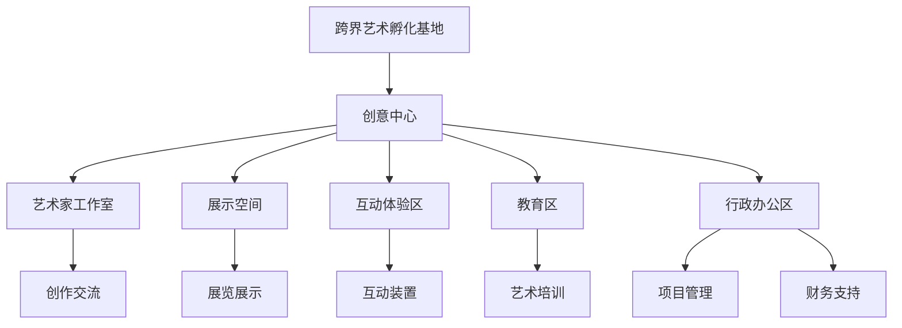

                 

### 引言

在当今快速发展的社会背景下，创意和创新已经成为推动各行各业进步的重要力量。跨界艺术孵化基地作为一种新兴的文化艺术形态，正在逐渐改变传统艺术领域的边界，成为推动创意产业发展的新引擎。本文将以《跨界艺术孵化基地规划：打破传统界限的创意中心设计》为标题，详细探讨跨界艺术孵化基地的背景、理论基础、创意设计方法、跨界实践、管理和运营等关键问题。

首先，我们将介绍跨界艺术孵化基地的背景和目标，阐述其设计理念，为后续内容打下基础。接着，我们将探讨艺术、创意和设计的理论基础，理解跨界艺术的本质。在此基础上，我们将深入探讨创意中心的设计方法，包括空间布局、视觉元素和互动设计等。随后，通过案例分析，我们将展示跨界艺术的实践路径，进一步探讨跨界艺术与科技、教育和社会功能的结合。最后，我们将讨论跨界艺术孵化基地的管理和运营策略，展望其未来发展。

通过这样的结构化分析和思考，本文旨在为跨界艺术孵化基地的规划提供一套系统、全面的理论和实践指南，为相关领域的研究者、实践者提供有益的参考和启示。

---

### 关键词

- 跨界艺术
- 孵化基地
- 创意设计
- 空间布局
- 科技融合

### 摘要

本文旨在探讨跨界艺术孵化基地的规划与设计，通过系统分析艺术、创意与设计的理论基础，深入探讨创意中心的空间布局、视觉元素和互动设计，结合案例分析展示跨界艺术的实践路径。此外，本文还将讨论跨界艺术孵化基地的管理和运营策略，展望其未来发展，为跨界艺术领域提供一套全面的理论和实践指南。

---

### 第一部分：概述

#### 第1章：跨界艺术孵化基地的背景和目标

##### 1.1 跨界艺术的概念与意义

跨界艺术，顾名思义，是跨越不同艺术领域和学科界限的一种艺术形式。它不仅涵盖了传统意义上的绘画、雕塑、音乐、舞蹈等艺术形式，还融入了科技、设计、建筑、文学等多种元素。跨界艺术的出现，标志着艺术创作和欣赏的多元化，推动了艺术领域的新发展。

跨界艺术的重要性体现在多个方面。首先，它打破了传统艺术领域的界限，为艺术家提供了更广阔的创作空间，激发了艺术创作的创新性和多样性。其次，跨界艺术促进了不同领域之间的交流与合作，推动了跨学科研究和知识融合。此外，跨界艺术还提升了公共文化生活的质量，丰富了人们的审美体验，对社会的文化进步具有积极的推动作用。

##### 1.1.1 跨界艺术的定义

跨界艺术可以被定义为一种跨学科、跨领域的艺术创作形式，它将不同艺术门类、文化和技术的元素融合在一起，创造出新的艺术作品和艺术形式。跨界艺术的核心在于“跨界”，即艺术家在创作过程中，突破了传统艺术形式的限制，跨越了学科和领域的界限，将不同领域的知识、技能和创意融合在一起。

跨界艺术的定义不仅仅是字面上的融合，更是一种深层次的整合和创新。在跨界艺术中，艺术家不仅仅是某一领域的专家，而是需要具备跨学科的知识结构和创新能力，能够将不同领域的元素有机结合，创造出全新的艺术体验。

##### 1.1.2 跨界艺术的历史与发展

跨界艺术的历史可以追溯到20世纪初期，随着现代艺术的发展，艺术家们开始尝试将不同领域的元素融入艺术创作中。例如，达达主义和超现实主义艺术家们通过将文学、摄影、电影等元素融入绘画和雕塑，打破了传统艺术的形式和内容界限。此后，随着科技的进步和社会的变迁，跨界艺术的形式和内容不断丰富和发展。

在20世纪末和21世纪初，随着数字技术和互联网的兴起，跨界艺术迎来了新的发展机遇。数字艺术、多媒体艺术、虚拟现实艺术等新兴艺术形式迅速崛起，艺术家们利用计算机技术、互联网平台和虚拟现实设备，创造出前所未有的艺术体验。同时，跨界艺术也在全球范围内得到广泛传播，各种跨界艺术节、展览和活动不断涌现，跨界艺术成为艺术领域的重要趋势。

##### 1.1.3 跨界艺术的价值和影响

跨界艺术的价值和影响可以从多个方面进行探讨。首先，跨界艺术推动了艺术创作的创新和发展。通过跨界合作和融合，艺术家们能够从不同领域汲取灵感，创造出独特的艺术作品，丰富了艺术创作的多样性。其次，跨界艺术促进了跨学科和跨领域的研究与合作。艺术家、设计师、科学家、工程师等不同领域的人才通过跨界合作，共同探索新的艺术形式和技术应用，推动了学科的交叉和融合。

此外，跨界艺术对社会的文化进步也具有重要意义。它不仅丰富了公共文化生活，提高了人们的文化素养和审美水平，还促进了社会多元化和包容性的发展。跨界艺术作品往往具有强烈的社会批判性和公共参与性，能够引发公众的思考和讨论，推动社会的变革和进步。

总之，跨界艺术作为一种新兴的艺术形式，不仅丰富了艺术创作的多样性，推动了艺术领域的发展，还具有重要的社会和文化价值。随着科技的不断进步和社会的变迁，跨界艺术将继续发展，为人类的文化创造提供更多的可能性。

##### 1.2 跨界艺术孵化基地的目标

跨界艺术孵化基地的设立旨在为艺术家、设计师、创意人才和初创企业提供专业的创作和交流平台，推动跨界艺术的创新和发展。具体目标如下：

1. **创意交流与共享**：跨界艺术孵化基地通过举办各种艺术展览、讲座、研讨会等活动，为艺术家和创意人才提供一个交流与共享的平台，促进不同领域之间的思想碰撞和创意融合。

2. **艺术教育与培训**：孵化基地将开展各类艺术教育和培训项目，包括艺术基础课程、专业创作课程、艺术管理培训等，提升艺术从业者的专业水平和创新能力。

3. **跨界合作的平台**：孵化基地将搭建跨界合作的平台，促进艺术家、设计师、科技工作者、企业家等不同领域的专业人士之间的合作，推动跨界项目的实施和成果转化。

4. **创意产业的孵化**：孵化基地将为初创企业提供创业孵化服务，包括政策咨询、资金支持、技术支持等，帮助初创企业快速发展，形成具有市场竞争力的创意产品和服务。

##### 1.3 创意中心的设计理念

跨界艺术孵化基地的创意中心设计理念在于打破传统界限，实现创意与科技的深度融合。具体设计理念包括：

1. **打破传统界限**：创意中心的设计将突破传统艺术空间的局限，创造开放、灵活、互动的空间环境，鼓励艺术家和创意人才进行跨界创作和交流。

2. **创意与科技的融合**：创意中心将充分利用现代科技手段，如数字技术、虚拟现实、增强现实等，为艺术家和创意人才提供创新的创作工具和展示平台。

3. **可持续发展和环保设计**：创意中心的设计将注重环保和可持续发展，采用节能环保材料和技术，打造绿色、生态的创意空间。

通过这些设计理念，跨界艺术孵化基地的创意中心将成为一个充满活力和创造力的艺术创新中心，为艺术家和创意人才提供理想的工作环境和展示平台。

##### 1.4 本章小结

本章介绍了跨界艺术孵化基地的背景、目标和设计理念。通过探讨跨界艺术的定义、历史和发展，我们了解了跨界艺术的重要性和价值。接下来，我们明确了跨界艺术孵化基地的目标，包括创意交流与共享、艺术教育与培训、跨界合作的平台和创意产业的孵化。最后，我们阐述了创意中心的设计理念，强调了打破传统界限、创意与科技的融合以及可持续发展和环保设计的重要性。这些内容为后续章节的讨论奠定了基础。

---

### 第二部分：基础理论

#### 第2章：艺术、创意与设计的理论基础

##### 2.1 艺术的概念与分类

艺术作为一种复杂而广泛的现象，贯穿于人类历史和文化发展的各个方面。艺术的概念不仅仅局限于美学范畴，它还涵盖了情感、文化、社会和技术等多个层面。理解艺术的概念和分类是探讨跨界艺术的基础。

艺术的概念具有多维性。首先，艺术是一种表达和传达情感、思想和观念的手段。通过艺术，人们能够表达内心深处的情感和感受，传递对世界的理解和认识。其次，艺术是一种文化现象，反映了特定社会和历史时期的文化特征和价值观念。最后，艺术也是一种技术，它涉及到创作技巧、材料和工艺等方面的知识。

艺术的分类可以根据不同的标准进行。常见的艺术分类方法包括：

1. **按形式分类**：包括绘画、雕塑、建筑、音乐、舞蹈、戏剧、文学等。每种形式都有其独特的表现手段和美学特征。

2. **按内容分类**：包括表现主义、抽象主义、现实主义、象征主义等。这些分类方法主要基于艺术作品所传达的主题和情感。

3. **按媒介分类**：包括传统艺术（如油画、雕塑）和现代艺术（如数字艺术、多媒体艺术）。这种分类方法强调了艺术媒介的变化和多样性。

##### 2.1.1 艺术的定义

艺术可以定义为一种创造性活动，通过视觉、听觉、触觉、情感等多种感官形式，表达人类的情感、思想和观念。艺术不仅仅是美学的追求，它还涉及到文化的、社会的、技术的多个层面。

艺术的核心在于创造和表达。艺术家通过创作活动，将内心深处的情感和思想转化为具体的艺术作品，使观众能够通过这些作品感受到艺术家的情感和思想。艺术作品的独特性和创造性是其价值的体现。

##### 2.1.2 艺术的审美价值

艺术的审美价值是艺术作品的重要特征。审美价值涉及到艺术作品的视觉、听觉、情感等多个层面。艺术作品通过其形式和内容，引发观众的审美感受和情感共鸣。

审美价值不仅取决于艺术作品本身，还受到观众的主观感受和文化背景的影响。不同文化背景和审美经验的观众，对同一艺术作品的审美价值可能会有不同的理解和感受。

##### 2.1.3 艺术的分类与流派

艺术的历史和发展过程中，出现了多种艺术形式和流派。以下是一些常见的艺术分类与流派：

1. **传统艺术**：包括绘画、雕塑、建筑、音乐、舞蹈等。传统艺术形式历史悠久，具有丰富的文化内涵和艺术价值。

2. **现代艺术**：包括抽象艺术、表现主义、立体主义等。现代艺术在形式和内容上与传统艺术有显著差异，更加注重创新和突破。

3. **当代艺术**：包括数字艺术、多媒体艺术、装置艺术等。当代艺术利用现代科技和材料，创造出前所未有的艺术形式和体验。

4. **民间艺术**：包括民间绘画、剪纸、民间音乐等。民间艺术反映了民间文化和传统生活方式，具有独特的审美价值和历史文化意义。

##### 2.2 创意的本质与来源

创意，即创新思维，是艺术创作和设计过程中的核心要素。创意的本质是创新和突破，它涉及到对现有知识和资源的重新组合和创造性应用。

创意的本质可以概括为以下几点：

1. **创新性**：创意要求打破常规思维，突破传统束缚，提出新的观点和方法。

2. **独特性**：创意需要具有独特的视角和表现方式，与众不同，引人注目。

3. **实用性**：创意不仅要具有艺术价值，还需要具有实际应用价值，能够解决现实问题。

创意的来源多种多样，主要包括以下几个方面：

1. **经验和知识**：艺术家和设计师通过长期的学习和实践，积累了丰富的经验和知识，这些经验和知识是创意的重要基础。

2. **直觉和灵感**：创意往往来自于直觉和灵感，这是一种无意识的思想过程，往往在特定的情境和氛围中产生。

3. **跨学科和跨领域**：跨界合作和跨学科研究能够激发创意，通过不同领域的知识和方法的融合，创造出新的创意。

##### 2.2.1 创意的定义

创意可以被定义为一种创造性思维过程，它通过独特的视角、方法或技术，将已有知识和资源重新组合，创造出新的价值。创意不仅仅是艺术创作的必要条件，也是设计、科技、商业等多个领域的重要驱动力。

##### 2.2.2 创意的激发与培养

激发和培养创意是艺术创作和设计过程中的关键环节。以下是一些有效的激发和培养创意的方法：

1. **思维训练**：通过思维导图、头脑风暴等方法，锻炼思维灵活性和创造性。

2. **知识积累**：广泛涉猎不同领域的知识，丰富知识储备，为创意提供丰富的素材。

3. **跨学科合作**：通过跨学科合作，打破传统界限，激发新的创意。

4. **环境营造**：创造一个有利于创意产生的环境，如安静的创作空间、多样化的资源等。

##### 2.2.3 创意的应用领域

创意的应用领域非常广泛，涵盖了艺术、设计、科技、商业等多个领域。以下是一些创意应用的典型领域：

1. **艺术创作**：创意是艺术创作的核心，艺术家通过创意表达情感和思想，创作出独特的艺术作品。

2. **产品设计**：创意在设计过程中起着至关重要的作用，通过创新的设计理念和解决方案，提升产品的竞争力。

3. **广告创意**：广告创意通过独特的视角和表达方式，吸引消费者的注意力，提升品牌知名度。

4. **科技研发**：创意是科技研发的重要驱动力，通过创新的思维和技术，推动科技的发展和进步。

##### 2.3 设计的原则与方法

设计是艺术创作和跨界艺术孵化过程中不可或缺的一部分。设计的原则和方法决定了艺术作品和创意产品的质量和效果。以下是一些设计的原则和方法：

1. **用户为中心的设计**：以用户需求为导向，关注用户体验，确保设计能够满足用户的需求和期望。

2. **简洁与美观**：简洁美观的设计能够提高艺术作品和创意产品的美观度和视觉吸引力。

3. **创新与突破**：设计过程中要注重创新和突破，通过独特的设计理念和技术，创造出新的价值和体验。

4. **功能性**：设计不仅要美观，还要具有实用性，确保艺术作品和创意产品能够实现其功能。

##### 2.3.1 设计的定义

设计可以被定义为一种创造性活动，通过构思、规划和执行，创造出具有实用价值和美学价值的物品、系统或服务。设计不仅仅是技术和艺术的结合，它还涉及到用户需求、市场趋势和社会责任等多个方面。

##### 2.3.2 设计的原则

设计的原则是确保设计过程顺利进行和设计作品成功的关键。以下是一些基本的设计原则：

1. **一致性**：设计元素之间要保持一致，包括色彩、字体、排版等，以增强整体感。

2. **对比**：通过对比来突出设计的重要部分，增加视觉吸引力。

3. **平衡**：设计元素在空间上要保持平衡，避免过于拥挤或过于稀疏。

4. **层次**：通过层次感来引导观众的视线，使设计更加清晰易懂。

##### 2.3.3 设计的方法论

设计的方法论是指导设计过程的理论和方法。以下是一些常用的设计方法论：

1. **用户研究**：通过用户研究，了解用户的需求和行为，为设计提供依据。

2. **原型设计**：通过制作原型，验证设计的可行性和有效性。

3. **迭代设计**：通过不断的迭代和改进，优化设计，提高设计质量。

4. **团队协作**：设计过程中需要团队协作，充分发挥每个人的优势，确保设计项目的成功。

##### 2.4 跨界艺术的要素

跨界艺术的创作和实现需要具备多个要素，这些要素相互作用，共同推动跨界艺术的发展。

1. **多元融合**：跨界艺术强调不同领域和学科的融合，通过多元元素的融合，创造出新的艺术形式和体验。

2. **跨学科知识**：跨界艺术需要艺术家具备跨学科的知识和技能，能够灵活运用不同领域的知识和方法。

3. **创新思维**：跨界艺术要求艺术家具有创新思维，能够突破传统束缚，提出新的艺术理念和形式。

4. **技术支持**：现代科技为跨界艺术提供了丰富的创作工具和技术支持，如虚拟现实、增强现实、数字技术等。

##### 2.4.1 跨界艺术的元素融合

跨界艺术的元素融合是指将不同领域和学科的元素有机结合，创造出新的艺术作品和体验。以下是一些常见的跨界艺术元素融合方式：

1. **艺术与科技的融合**：通过利用科技手段，如虚拟现实、增强现实、人工智能等，创造新的艺术形式和体验。

2. **艺术与文学的融合**：通过将文学元素融入艺术创作，如剧本、诗歌、小说等，丰富艺术作品的内涵和表达。

3. **艺术与建筑的融合**：通过艺术与建筑的结合，创造出具有独特艺术感和空间感的艺术作品。

4. **艺术与设计的融合**：通过艺术与设计的结合，创造出具有实用价值和美学价值的设计作品。

##### 2.4.2 跨界艺术的互动体验

跨界艺术的互动体验是跨界艺术的重要特征之一。通过互动，观众能够更深入地参与艺术创作和体验，增强艺术作品的影响力和吸引力。

1. **观众参与**：观众在跨界艺术作品中扮演重要角色，通过互动和参与，观众能够更好地理解和体验艺术作品的内涵。

2. **多媒体互动**：通过多媒体技术，如视频、音频、触摸屏等，创造互动体验，使观众能够通过多种感官体验艺术作品。

3. **虚拟互动**：通过虚拟现实和增强现实技术，创造沉浸式的互动体验，使观众能够身临其境地感受艺术作品的魅力。

##### 2.4.3 跨界艺术的社会意义

跨界艺术作为一种新兴的艺术形式，不仅具有艺术价值，还具有深远的社会意义。

1. **文化传承与创新**：跨界艺术通过融合不同文化和传统，促进文化的传承和创新，推动文化的多元发展。

2. **社会参与与反思**：跨界艺术作品往往具有强烈的社会批判性和公共参与性，通过艺术的方式，引发公众对社会问题的关注和思考。

3. **跨界合作与交流**：跨界艺术促进了不同领域之间的合作与交流，推动了跨学科研究和知识融合，为社会的发展和进步提供了新的动力。

##### 2.5 本章小结

本章探讨了艺术、创意与设计的理论基础，从艺术的概念与分类、创意的本质与来源、设计的原则与方法等方面进行了详细分析。通过了解跨界艺术的定义、历史和发展，我们为后续章节的讨论奠定了基础。本章内容为跨界艺术孵化基地的规划与设计提供了重要的理论支撑。

---

### 第三部分：创意设计方法

#### 第3章：创意中心的空间布局设计

##### 3.1 空间布局的基本原则

创意中心的空间布局设计是确保其功能性和艺术性的关键。一个良好的空间布局能够促进创意的流动和交流，提升创意工作的效率。以下是一些基本的空间布局原则：

1. **流动性与开放性**：空间布局应注重流动性和开放性，以便艺术家和创意人才能够自由地走动和交流。开放的空间布局能够减少物理障碍，促进信息的传递和思维的碰撞。

2. **功能性与灵活性**：创意中心的空间布局应具备多功能性，能够适应不同的活动和需求。同时，空间布局应具有灵活性，便于调整和重新配置，以适应不断变化的创作需求。

3. **自然与人工的融合**：空间布局应充分利用自然光线和通风，创造一个舒适和宁静的环境。同时，通过人工设计和装饰，如植物、灯光和艺术装置等，增强空间的艺术氛围和创意氛围。

##### 3.2 视觉元素的设计

视觉元素是创意中心设计的重要组成部分，直接影响空间的美观度和艺术感。以下是一些视觉元素的设计要点：

1. **颜色的选择与应用**：颜色是视觉设计的重要元素，能够影响空间的感觉和氛围。创意中心应选择明快、清新的颜色，以营造轻松、愉悦的氛围。同时，通过色彩对比和层次感，增强空间的视觉吸引力。

2. **光线的利用与控制**：光线是塑造空间氛围的关键因素。创意中心应充分利用自然光线，通过窗户和天窗引入自然光。同时，通过人工照明的设计和控制，创造柔和、舒适的照明效果，提升空间的艺术感。

3. **空间装饰的艺术处理**：创意中心的装饰应注重艺术性和创意性，通过艺术装置、画作、雕塑等元素，打造独特的空间氛围。装饰的设计应与空间的整体风格相协调，突出创意中心的个性和特色。

##### 3.3 互动设计

互动设计是创意中心的重要特色之一，通过互动技术，增强艺术家和创意人才之间的互动和创作体验。以下是一些互动设计的要点：

1. **触摸与互动技术**：触摸屏、互动投影等技术为艺术家和创意人才提供了丰富的互动体验。通过触摸屏幕，艺术家可以直接进行绘画、编辑和创作，增强创作的自由度和趣味性。

2. **虚拟现实与增强现实**：虚拟现实（VR）和增强现实（AR）技术为创意中心提供了沉浸式的互动体验。通过VR设备，艺术家可以进入虚拟的艺术空间，进行创作和展示；通过AR技术，艺术家可以在现实空间中叠加虚拟元素，创造出独特的艺术效果。

3. **互动设计的用户体验**：互动设计不仅要注重技术的先进性，还要关注用户体验。设计互动功能时，应考虑用户的需求和使用习惯，提供直观、易用的操作界面，提升用户的使用体验。

##### 3.4 创意空间的应用案例

为了更好地理解创意中心的空间布局和设计，我们可以通过一些实际案例来进行分析。

1. **国际艺术中心的空间设计**：国际艺术中心通常具有丰富的空间布局，包括展厅、工作室、会议室、图书馆等。这些空间通过灵活的布局和互动设计，为艺术家和创意人才提供了良好的创作和交流环境。

2. **创意工场的设计实践**：创意工场通常注重功能性和灵活性，空间布局以开放、自由为主。通过多元化的互动设计，如触摸屏、虚拟现实设备等，创意工场为艺术家和创意人才提供了多样化的创作工具和体验。

3. **跨界艺术馆的设计创新**：跨界艺术馆通过将传统艺术与现代科技相结合，创造出独特的艺术空间。例如，利用增强现实技术，观众可以在艺术馆内体验虚拟艺术作品，增强艺术欣赏的趣味性和互动性。

通过这些实际案例，我们可以看到创意中心在空间布局和设计上的多样性和创新性，为艺术家和创意人才提供了一个充满活力和创意的工作环境。

##### 3.5 本章小结

本章详细探讨了创意中心的空间布局设计，从流动性与开放性、功能性与灵活性、自然与人工的融合等方面介绍了基本空间布局原则。同时，通过颜色的选择与应用、光线的利用与控制、空间装饰的艺术处理等方面，阐述了视觉元素的设计要点。此外，互动设计作为创意中心的重要特色，通过触摸与互动技术、虚拟现实与增强现实、用户体验等方面，展示了互动设计的要点和应用案例。本章内容为创意中心的设计提供了具体的指导和方法。

---

### 第四部分：跨界实践

#### 第4章：跨界艺术的案例分析

##### 4.1 跨界艺术的案例分析

跨界艺术作为一种新兴的艺术形式，已经在全球范围内取得了显著的成果。本节将通过几个具体的案例，分析跨界艺术在不同领域中的应用和影响。

1. **艺术与科技的结合**：一个典型的案例是“艺术与科技融合展”，该展览将传统艺术与现代科技相结合，展示了虚拟现实（VR）、增强现实（AR）和人工智能（AI）等技术在艺术创作中的应用。展览中的作品不仅包括虚拟艺术品，还有通过AI技术创作的音乐和舞蹈。这种跨界艺术形式吸引了大量观众，为艺术展览注入了新的活力。

2. **艺术与设计的融合**：荷兰设计师马塞尔·万德斯（Marcel Wanders）的作品《奥利弗·斯通椅子》是一个成功的跨界艺术案例。他将设计元素融入艺术创作，通过独特的造型和材质，创作出既具有设计感又具有艺术性的椅子。这种跨界设计不仅获得了艺术界的认可，还受到了市场的高度评价。

3. **艺术与商业的融合**：苹果公司（Apple）的广告作品经常运用跨界艺术手法，将艺术元素融入商业广告中。例如，苹果的“Think Different”广告通过融合艺术家、音乐家、作家等不同领域的代表人物，传递了苹果的创新精神和品牌理念。这种跨界艺术广告不仅提高了品牌的知名度，还增强了品牌的艺术价值。

4. **艺术与社会问题的结合**：瑞士艺术家让-米歇尔·巴斯奎亚特（Jean-Michel Basquiat）的作品以其对社会问题的深刻反思而著称。他的作品《无题》（Untitled）通过对社会不公和种族歧视的描绘，引发了公众对社会问题的关注和思考。这种跨界艺术形式不仅具有艺术价值，还具有重要的社会意义。

通过这些案例分析，我们可以看到跨界艺术在各个领域的广泛应用和独特价值。跨界艺术不仅丰富了艺术创作的形式和内容，还推动了不同领域之间的交流和合作，促进了社会的发展和进步。

##### 4.2 跨界艺术与科技的结合

科技的发展为艺术创作提供了新的工具和手段，跨界艺术与科技的结合成为当代艺术的重要趋势。以下是从几个方面探讨跨界艺术与科技的结合：

1. **数字艺术**：数字艺术是跨界艺术与科技结合的一个典型例子。通过计算机技术和数字媒体，艺术家可以创作出具有独特视觉效果和互动性的艺术作品。例如，荷兰数字艺术家多里安·洛克（Dorrian Lock）的作品《动态风景》（Dynamic Landscape）通过数字技术模拟自然风景的变化，创造出一种虚拟与现实交融的艺术体验。

2. **虚拟现实（VR）和增强现实（AR）**：VR和AR技术为艺术家提供了全新的创作和展示方式。艺术家可以通过VR技术创建虚拟艺术空间，让观众在虚拟世界中体验艺术作品。AR技术则将虚拟元素叠加到现实世界中，创造出与现实互动的艺术体验。例如，日本艺术家村上隆（Takashi Murakami）利用AR技术创作了一系列虚拟艺术装置，让观众在现实环境中体验到虚拟艺术作品的魅力。

3. **人工智能（AI）**：AI技术在艺术创作中的应用也越来越广泛。艺术家可以利用AI算法生成艺术作品，如音乐、绘画、雕塑等。AI不仅能够创作出独特的艺术作品，还能根据观众的行为和反馈进行动态调整，提供个性化的艺术体验。例如，美国艺术家伊莱·布尔金（Eli Bulger）利用AI技术创作了一系列自动生成的音乐作品，这些作品不仅具有独特性，还展示了AI在艺术创作中的潜力。

通过这些实例，我们可以看到跨界艺术与科技的结合如何为艺术创作带来新的可能性，推动艺术领域的发展。

##### 4.3 跨界艺术的社会功能

跨界艺术不仅丰富了艺术创作和表现形式，还具有广泛的社会功能。以下从几个方面探讨跨界艺术的社会功能：

1. **文化传承与创新**：跨界艺术通过融合不同文化元素，促进了文化的传承和创新。例如，中国艺术家徐冰的作品《天书》通过将汉字和西方现代艺术形式相结合，展现了中华文化的深厚底蕴和独特魅力。这种跨界艺术形式不仅传承了中华文化，还推动了文化的创新和发展。

2. **社会批判与反思**：跨界艺术常常具有强烈的社会批判性和反思性，通过艺术的方式揭示社会问题，引发公众的思考和讨论。例如，美国艺术家杰夫·昆斯（Jeff Koons）的作品《兔子》通过对消费文化的批判，揭示了现代社会对物质和符号的过度追求。这种跨界艺术形式不仅具有艺术价值，还具有重要的社会意义。

3. **公共参与与教育**：跨界艺术通过互动性和参与性，吸引了公众的广泛参与，成为公共教育和文化普及的有效手段。例如，法国艺术家让-皮埃尔·朗朗（Jean-Pierre Lanfant）的公共艺术项目《城市画廊》通过在公共场所展示艺术作品，激发了公众对艺术的兴趣和参与。这种跨界艺术形式不仅丰富了公共文化生活，还提高了公众的艺术素养。

通过这些实例，我们可以看到跨界艺术在社会功能方面的多样性和重要性，它不仅丰富了艺术创作的形式和内容，还对社会文化的发展和进步产生了深远的影响。

##### 4.4 跨界实践的创新路径

跨界艺术的实践需要创新路径和方法，以下从几个方面探讨跨界实践的创新路径：

1. **跨学科合作**：跨界艺术的成功离不开跨学科的合作。艺术家、设计师、科学家、工程师等不同领域的人才通过合作，可以创造出新的艺术形式和作品。例如，美国艺术家玛丽·马丁内斯（Mary Martins）与科学家合作，利用科学原理创作出具有物理性质的雕塑作品，这种跨学科合作不仅丰富了艺术创作，还推动了科学和艺术的融合。

2. **技术驱动创新**：现代科技为跨界艺术提供了丰富的创作工具和技术支持。艺术家可以利用数字技术、虚拟现实、增强现实等，创作出前所未有的艺术作品。例如，中国艺术家张大力利用数字技术创作了一系列大型立体图像，这些作品不仅具有视觉冲击力，还展示了数字技术在艺术创作中的潜力。

3. **观众参与**：跨界艺术强调观众的参与和互动，通过观众的参与，艺术作品可以更加贴近观众的生活和体验。例如，英国艺术家托尼·克拉格（Tonia Cragg）的公共艺术项目《花园》鼓励观众种植植物，这不仅是一种艺术创作，也是一种社区参与和社会实践。

通过这些创新路径，跨界艺术可以不断探索新的艺术形式和表达方式，为社会带来更多的艺术体验和文化价值。

##### 4.5 本章小结

本章通过案例分析探讨了跨界艺术的实际应用和影响。首先，通过具体案例展示了跨界艺术在各个领域的成功实践。接着，分析了跨界艺术与科技的结合，展示了科技为艺术创作带来的新可能性。然后，探讨了跨界艺术的社会功能，包括文化传承、社会批判和公共参与等方面。最后，提出了跨界实践的创新路径，为跨界艺术的发展提供了新思路。本章内容为跨界艺术的深入研究和实际应用提供了重要参考。

---

### 第五部分：管理和运营

#### 第5章：跨界艺术孵化基地的管理和运营

##### 5.1 管理体系

跨界艺术孵化基地需要一个完善的管理体系，以确保基地的稳定运营和可持续发展。管理体系应包括以下几个方面：

1. **组织架构**：建立合理的组织架构，明确各部门的职责和权限，确保基地的各项活动有序进行。

2. **人力资源**：配备专业的管理团队和员工，包括艺术管理者、技术支持人员、行政助理等，确保基地的日常运营和管理。

3. **财务制度**：建立严格的财务管理制度，确保资金的有效使用和管理，提高资金的使用效率。

4. **风险控制**：制定风险控制措施，包括项目评估、风险预警和应对策略，降低运营风险。

##### 5.2 运营策略

跨界艺术孵化基地的运营策略应注重以下几个方面：

1. **项目筛选**：建立科学的项目筛选机制，选择具有创新性、市场潜力和可持续发展能力的项目进行孵化。

2. **资源整合**：充分利用政府、企业、高校等资源，为孵化项目提供资金、技术、人才等多方面的支持。

3. **品牌建设**：打造基地的品牌形象，通过举办各类艺术展览、活动，提升基地的知名度和影响力。

4. **合作与交流**：建立广泛的合作网络，与国内外艺术机构、企业和高校建立合作关系，促进资源共享和合作共赢。

##### 5.3 可持续发展

跨界艺术孵化基地的可持续发展是其长期发展的关键。以下是一些实现可持续发展的策略：

1. **创新驱动**：通过不断的技术创新和模式创新，保持基地的活力和竞争力。

2. **环保理念**：在基地建设和运营过程中，注重环保和可持续发展，采用节能环保材料和工艺，减少对环境的影响。

3. **社区参与**：鼓励社区参与基地的建设和运营，提高基地的社会责任感和影响力。

4. **人才培养**：加强艺术人才培养，建立人才梯队，为基地的可持续发展提供人才支持。

##### 5.4 成功案例

以下是一些成功的跨界艺术孵化基地案例，供参考：

1. **北京798艺术区**：北京798艺术区是中国著名的艺术孵化基地，以其独特的工业遗址改造和多元化的艺术展览而著称。798艺术区不仅为艺术家提供了创作空间，还吸引了大量游客和艺术爱好者，成为北京的文化地标。

2. **伦敦特拉法加广场艺术区**：伦敦特拉法加广场艺术区是英国重要的艺术孵化基地，汇集了众多画廊、艺术家工作室和文化机构。该艺术区通过举办各类艺术展览、活动，推动了当地艺术生态的发展。

3. **纽约苏荷区**：纽约苏荷区是美国著名的艺术孵化基地，以其独特的地下画廊和开放式艺术市场而闻名。苏荷区为艺术家提供了自由创作的空间，吸引了大量艺术爱好者和投资者，推动了当地艺术市场的繁荣。

##### 5.5 本章小结

本章详细探讨了跨界艺术孵化基地的管理和运营策略，包括管理体系、运营策略、可持续发展以及成功案例。通过这些内容，为跨界艺术孵化基地的建立和运营提供了具体的指导和参考。

---

### 未来展望

跨界艺术孵化基地的未来发展充满机遇与挑战。随着科技的不断进步和社会文化的多样化，跨界艺术将继续在艺术创作和社会创新中发挥重要作用。以下是对跨界艺术孵化基地未来发展的几个展望：

1. **技术创新**：随着虚拟现实、增强现实、人工智能等技术的不断成熟，跨界艺术将迎来更多的创作工具和技术支持，艺术家能够创造出更加丰富和互动的艺术作品。

2. **全球合作**：跨界艺术孵化基地将通过国际合作，吸收全球各地的创意和资源，打造具有国际影响力的艺术品牌和平台，促进全球艺术文化的交流与融合。

3. **社会影响**：跨界艺术孵化基地将进一步深入社会，通过艺术教育和公共艺术项目，提升公众的艺术素养和文化意识，推动社会文化的进步。

4. **可持续发展**：在可持续发展理念的引导下，跨界艺术孵化基地将注重环保和社会责任，采用绿色设计和环保材料，实现基地的可持续运营。

5. **数字艺术生态**：随着数字艺术的兴起，跨界艺术孵化基地将成为数字艺术生态的核心，为数字艺术家提供创作、展示和交流的平台，推动数字艺术的创新发展。

总之，跨界艺术孵化基地的未来发展将充满活力和创新，为艺术家和社会带来更多的艺术体验和文化价值。

---

### 结语

本文通过对跨界艺术孵化基地的全面探讨，从背景和目标、理论基础、创意设计方法、跨界实践、管理和运营到未来展望，系统阐述了跨界艺术孵化基地的各个关键方面。跨界艺术孵化基地作为一种创新的创意中心，不仅为艺术家提供了创作和交流的平台，还在推动艺术创新和社会进步方面发挥了重要作用。

我们希望本文能够为跨界艺术孵化基地的规划者和实践者提供有益的参考和启示。在未来，随着技术的不断进步和社会的发展，跨界艺术孵化基地将继续扮演重要角色，为人类文化的繁荣和创新提供新的动力。让我们共同期待跨界艺术孵化基地的未来，期待更多的艺术奇迹和社会变革。作者：AI天才研究院/AI Genius Institute & 禅与计算机程序设计艺术 /Zen And The Art of Computer Programming

---

### 附录

#### 1. 参考文献

- Ashkanløöf, S., & Thrane, M. (2016). **Interdisciplinary Art in Practice: Collaboration and Exchange between Art and Science**. Routledge.
- Brown, T. (2008). **Design Thinking**. Harvard Business Review.
- Dewey, J. (1934). **Art as Experience**. Perennial.
- Hebdige, D. (1979). **Subculture: The Meaning of Style**. Routledge.
- Krippendorff, K. (2012). **The Semantic Turn: A New Foundation for Design Semiotics**. MIT Press.
- Tafuri, M. (1986). **The Architecture of Critique: On the brackets of modern architecture**. MIT Press.

#### 2. Mermaid 图流程图示例

以下是一个Mermaid流程图示例，展示了跨界艺术孵化基地的主要组成部分：

#### 3. LaTeX 数学公式示例

以下是一个LaTeX数学公式的示例：

$$
E = mc^2
$$

和

$$
a = \frac{dv}{dt}
$$

这些公式在文中独立段落中使用，前后用 $$ 括起来，而段落内的公式使用 $ 括起来。

---

### 最佳实践 tips

在跨界艺术孵化基地的运营中，以下是一些最佳实践建议：

1. **建立明确的合作机制**：确保不同领域的人才能够高效合作，制定明确的合作流程和沟通机制。
2. **注重用户体验**：在设计创意空间时，要充分考虑用户的需求和体验，确保空间布局和互动设计能够满足用户的期望。
3. **持续的创新投入**：定期投入资源进行技术创新和模式创新，保持孵化基地的活力和竞争力。
4. **重视品牌建设**：通过举办高质量的展览和活动，提升孵化基地的知名度和品牌形象。
5. **培养艺术人才**：提供系统的艺术教育和培训项目，培养具有跨界能力和创新精神的艺术家和创意人才。

通过这些最佳实践，跨界艺术孵化基地将能够更好地实现其目标，推动艺术和社会的进步。

---

### 小结

本文围绕跨界艺术孵化基地的规划与设计进行了深入探讨，从概述、理论基础、创意设计方法、跨界实践、管理和运营到未来展望，全面解析了跨界艺术孵化基地的各个方面。通过具体案例分析和最佳实践建议，本文为跨界艺术孵化基地的建立和运营提供了系统化的指导和参考。跨界艺术孵化基地不仅推动了艺术创新和社会进步，还为艺术家和创意人才提供了一个充满活力和创造力的平台。

### 注意事项

在跨界艺术孵化基地的规划与运营过程中，需要特别注意以下几点：

1. **确保安全和合规**：在基地建设和运营过程中，要严格遵守相关法规和标准，确保基地的安全和合规性。
2. **注重环境保护**：在设计和运营过程中，要注重环保和可持续发展，减少对环境的负面影响。
3. **保护知识产权**：对艺术家和创意人才的知识产权进行有效保护，确保他们的创作成果得到合法保护和收益。
4. **灵活应对变化**：孵化基地的运营环境和市场需求不断变化，要具备灵活应对变化的能力，及时调整运营策略。

通过关注这些注意事项，跨界艺术孵化基地将能够更加健康和可持续地发展。

### 拓展阅读

1. **《创意城市：城市文化与艺术发展》**：探讨城市文化和艺术发展之间的关系，为跨界艺术孵化基地的规划和运营提供理论支持。
2. **《数字艺术的未来：技术创新与艺术表达》**：分析数字技术在艺术创作中的应用和影响，为跨界艺术孵化基地的数字艺术项目提供参考。
3. **《跨界艺术实践手册》**：详细介绍跨界艺术的实践方法和案例，为跨界艺术孵化基地的运营提供实践指导。

通过这些拓展阅读，可以进一步了解跨界艺术孵化基地的背景和理论基础，为实际运营提供更丰富的知识和经验。

