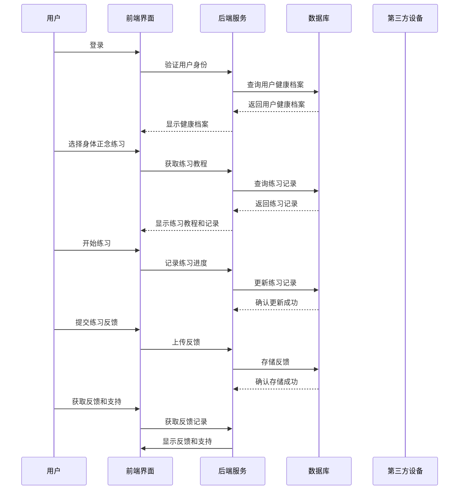
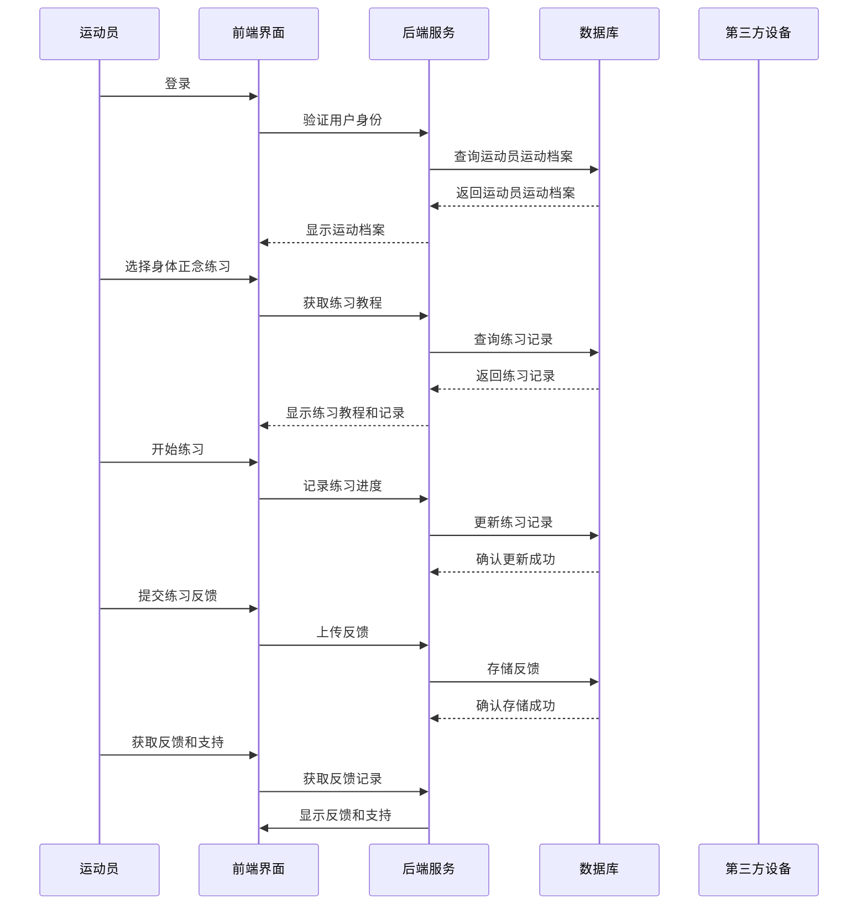

                 


### 1.1 心身关系的重要性

心身关系，亦即心理与生理之间的关系，是现代科学研究和日常生活中不可忽视的重要课题。人的心理活动，如情绪、思维和行为，无不与身体的生理状态息息相关。心理学与生理学的交汇点，让我们开始重新审视这个古老而又现代的议题：我们的身体是如何影响我们的心理，反之亦然？

#### 背景介绍

首先，让我们从历史的角度来看。早在古希腊时期，希波克拉底就提出了“四体液”理论，认为人的情绪和健康状态与体内的血液、黄胆汁、黑胆汁和粘液这四种体液的平衡有关。尽管这一理论在现代科学看来已被推翻，但它反映了古人对心身关系的深刻认识。

随着现代医学的发展，心身关系的研究变得更加精细和科学。心理学和生理学的相互借鉴，使得我们对这一关系有了更全面的理解。例如，心理学家发现情绪和压力会对免疫系统产生影响，而生理学家则揭示了大脑与身体的相互调节机制。

#### 问题背景

在现代社会中，心身关系的问题显得尤为突出。快节奏的生活、高压的工作环境、不良的生活习惯等因素，导致了越来越多的人出现心理健康问题，如焦虑、抑郁和慢性疼痛。这些问题不仅影响了个体的生活质量，也对社会整体的健康水平产生了负面影响。

#### 问题描述

心身关系的问题具体体现在以下几个方面：

1. **情绪与生理反应的关联**：情绪如喜悦、愤怒、焦虑等，会导致一系列生理反应，如心跳加速、呼吸急促、肌肉紧张等。这些反应在短时间内有助于应对紧急情况，但长期积累则可能导致健康问题。

2. **心理压力与慢性疾病**：研究表明，心理压力与慢性疾病之间存在密切联系。长期的心理压力会导致免疫系统功能下降，增加患心脏病、高血压、糖尿病等疾病的风险。

3. **心理问题与生理疼痛**：一些心理问题，如慢性疼痛、纤维肌痛等，往往与情绪状态密切相关。患者常常感到疼痛加剧，尤其是在焦虑、抑郁等情绪影响下。

#### 问题解决

要解决心身关系的问题，我们需要从多个角度入手：

1. **提高身体意识**：通过身体正念练习，如冥想、深呼吸和身体扫描，帮助个体更好地觉察自己的身体状态，从而调整情绪和行为。

2. **心理治疗**：通过认知行为疗法、正念疗法等心理治疗方法，帮助个体了解心理与生理之间的关系，学会应对压力和情绪。

3. **健康生活方式**：保持规律的作息、均衡的饮食、适量的运动和良好的社交关系，有助于维护心身健康。

#### 边界与外延

心身关系的研究不仅仅局限于人类，动物行为学、生态学等领域也在探索生物体之间的心身关系。此外，随着科技的发展，如虚拟现实、增强现实等技术也在为心身关系的研究提供新的视角。

#### 概念结构与核心要素组成

心身关系可以理解为两个相互作用的系统：心理系统和生理系统。这两个系统的核心要素包括：

- **心理要素**：情绪、认知、行为、个性等。
- **生理要素**：神经系统、内分泌系统、免疫系统等。

这两个系统之间的相互作用，构成了我们复杂的心身关系。

#### 总结

心身关系的重要性不言而喻。通过本文的讨论，我们认识到，了解和关注心身关系对于我们维护身心健康具有重要意义。在接下来的章节中，我们将深入探讨身体正念的概念、起源与发展，以及如何通过身体正念来重新连接身心，实现心身的和谐与平衡。

---

### 1.2 身体正念的概念

身体正念（Body Mindfulness）是一种通过专注于身体感觉和呼吸来提高自我意识、减少压力、提升身心健康的方法。它源于佛教的正念冥想，但在过去几十年中，已被广泛应用于心理学、医学和健康领域。

#### 背景介绍

正念冥想最早由佛教僧侣在数千年前实践，旨在通过冥想和身体觉知来达到内心的平静和觉醒。这种实践方式在佛教传统中被称为“禅修”或“冥想”。随着时间的推移，正念冥想逐渐传播到西方，并受到心理学家和医学研究者的关注。

#### 问题背景

在现代社会，人们面临的生活压力和焦虑不断增加。医学研究表明，长期的压力会导致多种健康问题，包括心脏病、高血压、抑郁症等。因此，寻求有效的方法来应对压力和提升身心健康变得尤为重要。

#### 问题描述

身体正念作为一种应对压力和提升身心健康的方法，具有以下几个特点：

1. **自我意识提升**：通过身体正念练习，个体可以更好地关注自己的身体感觉，从而提高自我意识。这种自我意识有助于个体更好地理解自己的情绪和需求，从而更好地管理自己的情绪和行为。

2. **压力缓解**：身体正念练习，如深呼吸、身体扫描和冥想，有助于放松身心，减少压力。研究表明，定期进行身体正念练习可以显著降低压力激素水平，提高免疫系统的功能。

3. **身心健康**：身体正念练习不仅有助于缓解压力，还可以提高身心健康。通过身体正念练习，个体可以改善睡眠质量，增强身体的灵活性和力量，减少慢性疼痛等健康问题。

#### 问题解决

要实现身体正念的这些益处，个体可以通过以下方式开始练习：

1. **冥想**：通过冥想，个体可以专注于呼吸和身体感觉，从而减轻压力和焦虑。初学者可以从简单的呼吸冥想开始，逐渐尝试更复杂的冥想练习。

2. **身体扫描**：身体扫描是一种通过逐步关注身体各个部位的感觉来放松身心的方法。个体可以从脚开始，逐渐向上扫描到头部，同时呼吸和放松。

3. **深呼吸**：深呼吸是一种简单而有效的身体正念练习，可以通过深吸气和缓慢呼气来放松身心。

#### 边界与外延

身体正念的应用范围广泛，不仅限于个体心理健康，还可以应用于组织健康和文化建设。例如，一些公司已经开始在员工中推广身体正念练习，以提升员工的工作效率和幸福感。

#### 概念结构与核心要素组成

身体正念的核心概念可以概括为以下几点：

- **专注**：专注是身体正念的核心要素，通过专注于呼吸和身体感觉，个体可以减少杂念，达到内心的平静。
- **呼吸**：呼吸是身体正念练习的重要组成部分，通过深呼吸，个体可以放松身心，降低压力。
- **身体感觉**：关注身体感觉是身体正念的基础，通过觉察身体的不同部位和感觉，个体可以提升自我意识。

#### 总结

身体正念是一种简单而有效的提升身心健康的方法。通过专注于呼吸和身体感觉，个体可以提高自我意识，减轻压力，改善身心健康。在接下来的章节中，我们将进一步探讨身体正念的起源、发展及其基本原理。

---

### 1.3 重新连接身心的必要性

在现代社会，由于生活节奏的加快和压力的增大，人们往往忽略了身心之间的紧密联系。重新连接身心，即通过意识和行为上的调整，恢复身体与心理之间的和谐关系，已经成为一个迫切需要解决的问题。

#### 背景介绍

在过去的几十年里，心理学和生理学的研究不断揭示心身关系的复杂性。许多研究表明，心理状态如情绪、压力和认知能力，都会直接影响生理状态，如心率、血压、消化系统和免疫系统功能。这种相互影响不仅影响了个体的健康，还对其生活质量产生了深远的影响。

#### 问题背景

现代社会中的许多人面临以下问题：

1. **慢性压力**：长期的工作压力、人际关系问题和社会环境的变化，导致许多人处于持续的压力状态。这种慢性压力对身心健康造成了严重的负面影响。

2. **心理健康问题**：抑郁症、焦虑症和其他心理健康问题在现代社会中日益普遍。这些问题不仅影响了个体的情绪状态，还可能对身体健康产生负面影响。

3. **身体疼痛**：慢性疼痛，如纤维肌痛、偏头痛等，在现代社会中也是一个常见的问题。这些问题往往与情绪状态密切相关。

#### 问题描述

重新连接身心的重要性体现在以下几个方面：

1. **心理健康**：通过重新连接身心，个体可以更好地管理情绪，减少焦虑和抑郁的发生。这有助于提高生活质量和工作效率。

2. **身体健康**：身体和心理的重新连接有助于改善身体的生理状态，如降低血压、提高免疫力，减少慢性疼痛的发生。

3. **整体幸福感**：身心和谐的状态可以提高个体的整体幸福感，使其更加乐观、积极地面对生活中的挑战。

#### 问题解决

要实现身心的重新连接，个体可以采取以下措施：

1. **身体运动**：定期的身体运动有助于改善心肺功能，提高身体的灵活性和力量，同时也能缓解心理压力。

2. **正念练习**：通过正念冥想、深呼吸和身体扫描等练习，个体可以提高自我意识，减少杂念，达到身心的平静。

3. **健康饮食**：均衡的饮食有助于维持身体的健康状态，减少慢性疾病的风险。

4. **心理治疗**：心理治疗，如认知行为疗法、正念疗法等，可以帮助个体更好地理解心身关系，学会应对压力和情绪。

#### 边界与外延

重新连接身心不仅对个体有益，也对社会有积极的影响。在组织层面，通过推广身心健康的理念和实践，可以提高员工的工作满意度和工作效率。在社区层面，通过推广身心健康的知识，可以提升居民的整体健康水平，减少心理健康问题的发生。

#### 概念结构与核心要素组成

重新连接身心的核心概念可以概括为以下几点：

- **身体意识**：通过关注身体感觉，个体可以更好地了解自己的身体状态，从而做出更健康的生活选择。
- **心理调适**：通过心理治疗和正念练习，个体可以学会更好地管理情绪和压力，从而提高心理健康水平。
- **整体健康**：身体和心理健康水平的提升，有助于提高个体的整体健康水平和生活质量。

#### 总结

重新连接身心对于维护个体的身心健康具有重要意义。通过身体运动、正念练习、健康饮食和心理治疗等措施，个体可以改善心理和生理状态，提高生活质量。在接下来的章节中，我们将进一步探讨身体正念的起源、发展及其具体实践方法。

---

## 第2章 身体正念的历史与发展

### 2.1 身体正念的起源

身体正念的起源可以追溯到数千年前古老的东方哲学，特别是佛教和印度教的传统冥想实践。佛教中的“正念”（Mindfulness）强调对当下时刻的全面觉知，包括身体、情绪和思想。这一概念在佛教经典《阿含经》和《心经》中得到了详细的阐述。而印度教中的“昆达里尼”（Kundalini）冥想，则强调通过呼吸和身体的动作来唤醒内在的能量。

在古代中国，道家哲学中的“气功”和“太极拳”也包含了对身体正念的实践。这些传统实践强调通过深呼吸、体位和冥想来增强身体意识，实现身心和谐。

#### 背景介绍

这些传统实践在古代社会中，不仅被视为一种精神修炼的方式，也被用于治疗各种身体和心理问题。例如，佛教中的禅修被认为可以治疗焦虑和抑郁，而印度教的冥想则被用来提升精神和身体的活力。

### 2.2 发展历程

在20世纪中期，身体正念的实践开始传入西方，并逐渐被学术界所接受。这个过程的转折点可以追溯到20世纪60年代，当时西方的心理学界开始对东方哲学和冥想实践产生兴趣。

1. **约翰·卡巴金（Jon Kabat-Zinn）的贡献**：约翰·卡巴金是现代身体正念的奠基人之一。他在1979年创立了麻省大学医学院的正念医学中心（Center for Mindfulness），并开发出了“正念减压”（Mindfulness-Based Stress Reduction，MBSR）课程。MBSR课程结合了正念冥想、瑜伽和身体扫描等实践，旨在帮助患者减轻压力和疼痛。

2. **学术研究的兴起**：自MBSR课程推出以来，身体正念在学术界引起了广泛关注。多项研究表明，身体正念实践对心理健康和身体健康都有显著的积极作用。这些研究包括对抑郁症、焦虑症、慢性疼痛和心脏病等问题的治疗。

3. **全球推广**：随着研究的不断深入，身体正念的应用范围也在不断扩大。现在，身体正念已被广泛应用于医院、学校、企业和社区等各个领域。全球范围内，许多组织和机构都开设了正念课程和培训项目。

### 2.3 理论基础

身体正念的理论基础主要源于佛教和现代心理学的研究。佛教中的“正念”强调对当下时刻的觉知和无判断的接纳，而现代心理学则将这种实践与认知行为疗法、情绪调节和神经可塑性等理论相结合。

1. **佛教中的正念**：佛教中的正念强调“四念处”（四念处，即对身体、感受、心、法的觉知）。通过这种觉知，个体可以培养对当下时刻的全面理解，减少杂念和对过去未来的执着。

2. **现代心理学的研究**：现代心理学将正念实践与认知行为疗法（CBT）相结合，发展出了“正念认知疗法”（Mindfulness-Based Cognitive Therapy，MBCT）。MBCT旨在通过正念练习来减少复发性的抑郁症。

3. **神经可塑性**：研究表明，身体正念练习可以改变大脑的结构和功能。通过冥想和正念练习，个体的注意力、情绪调节能力和神经可塑性都会得到提升。

### 2.4 身体正念的核心原则

身体正念的核心原则包括以下几点：

1. **专注**：专注于当下的身体感觉和呼吸，减少对过去和未来的执着。

2. **接纳**：接受当下的身体状态和情绪，而不是试图改变它们。

3. **非评判**：对身体的感受和情绪持开放、无评判的态度，而不是用好坏、对错的标签来评价。

4. **持续性**：通过持续的练习，培养对当下的觉知和接纳。

### 总结

身体正念的历史与发展体现了人类对身心和谐追求的持久努力。从古代的哲学和实践，到现代医学和心理学的研究，身体正念已经发展成为一门广泛应用于健康和心理治疗领域的科学。在接下来的章节中，我们将深入探讨身体正念的基本原理和实践方法。

---

## 第3章 身体正念的基本原理与实践

### 3.1 身体意识

身体意识（Body Awareness）是身体正念的基础，它涉及到对自身身体感觉的觉察和接受。通过身体意识，个体可以更好地了解自己的身体状况，从而做出更健康的生活选择。

#### 背景介绍

身体意识的概念最早可以追溯到20世纪70年代的心理学领域。当时的心理学家开始关注个体对身体感觉的觉察，并尝试通过训练提高这种觉察能力。随着身体正念的兴起，身体意识成为其核心组成部分。

#### 核心概念与联系

身体意识的核心概念包括以下几个方面：

1. **觉知**：觉知是对当下身体感觉的觉察，包括触觉、视觉、听觉和本体感觉等。通过觉知，个体可以了解自己的身体感受，从而做出更明智的决策。

2. **接受**：接受是对身体感觉的非评判性接纳，意味着不试图改变身体的感觉，而是接受它们的存在。这种接受有助于减少对身体的抗拒和焦虑。

3. **非评判**：非评判性是指对身体的感受持开放和无评判的态度。这意味着不对身体的感受做出好坏、对错的判断，而是接受它们的存在。

#### 概念属性特征对比表格

| 特征 | 身体觉知 | 身体接受 | 非评判性 |
| --- | --- | --- | --- |
| 定义 | 对身体感觉的觉察 | 对身体感受的非评判性接纳 | 对身体感受持开放态度，不评判 |
| 作用 | 提高自我意识 | 减少身体抗拒和焦虑 | 增强心理灵活性 |
| 对比 | 觉知是对身体感觉的觉察，接受是对感受的接纳，非评判性是对感受的态度 | 接受是觉知的深化，非评判性是接受的方式 | 非评判性是对觉知和接受的补充，使个体更加开放和灵活 |

#### ER实体关系图架构

为了更清晰地理解身体意识的概念，我们可以使用ER（实体-关系）图来表示各个概念之间的关系。以下是身体意识ER图：

```mermaid
erDiagram
    Body_Awareness ||--|{ Sensation_Awareness }
    Body_Awareness ||--|{ Acceptance }
    Body_Awareness ||--|{ Non_Judgment }
    Sensation_Awareness ||--|{ Perception }
    Sensation_Awareness ||--|{ Sensation_Recognition }
    Acceptance ||--|{ Open_Mindedness }
    Acceptance ||--|{ Non_Rejection }
    Non_Judgment ||--|{ Non_Evaluation }
    Non_Judgment ||--|{ Non_Assessment }
```

在这个ER图中，Body Awareness（身体意识）是核心实体，它与Sensation Awareness（感觉觉知）、Acceptance（接受）和Non_Judgment（非评判性）等实体之间存在直接关系。Sensation Awareness包括Perception（觉知）和Sensation Recognition（感觉识别），而Acceptance则包括Open Mindedness（开放心态）和Non_Rejection（非拒绝）。Non_Judgment则与非评价和非评估相关。

#### 算法原理讲解

身体意识的提高可以通过以下算法原理实现：

1. **反馈循环**：通过不断的身体感觉反馈，个体可以逐步提高对身体感觉的觉察。这个反馈循环包括觉知、接受和非评判性的循环。

2. **渐进训练**：身体意识的提高是一个渐进的过程，个体可以通过日常的练习，如身体扫描和深呼吸，来逐步增强对身体感觉的觉察和接受。

3. **认知重构**：通过认知重构，个体可以改变对身体的认知方式，从评判性转向非评判性。这可以通过认知行为疗法（CBT）等心理治疗方法来实现。

以下是一个简化的Python代码示例，用于演示如何通过编程模拟身体意识的反馈循环：

```python
def body_awareness_loop():
    while True:
        sensation = get_body_sensation()
        print(f"当前身体感觉：{sensation}")
        feedback = get_feedback(sensation)
        update_awareness(feedback)
        if should_stop():
            break

def get_body_sensation():
    # 代码模拟获取当前身体感觉
    return "舒适"

def get_feedback(sensation):
    # 代码模拟获取反馈
    return "很好，继续保持"

def update_awareness(feedback):
    # 代码模拟更新身体意识
    print(f"反馈：{feedback}")

def should_stop():
    # 代码模拟停止条件
    return False

body_awareness_loop()
```

在这个示例中，`get_body_sensation()`函数模拟获取当前身体感觉，`get_feedback()`函数模拟获取反馈，`update_awareness()`函数模拟更新身体意识，`should_stop()`函数模拟停止条件。

#### 数学模型和公式

身体意识的数学模型可以基于神经科学的研究，特别是大脑中神经元活动的规律。以下是一个简化的数学模型：

$$
\text{身体意识} = f(\text{感觉输入}, \text{反馈循环}, \text{认知重构})
$$

其中，$f$ 是一个复杂的函数，它结合了感觉输入、反馈循环和认知重构来计算身体意识。这个模型假设感觉输入是身体感觉的量化值，反馈循环和认知重构分别反映了身体意识的增强和调整。

#### 总结

身体意识是身体正念的基础，它涉及到对自身身体感觉的觉察和接受。通过觉知、接受和非评判性的练习，个体可以提高身体意识，从而改善身心健康。在接下来的章节中，我们将进一步探讨身体正念的其他基本原理和实践方法。

---

### 3.2 正念呼吸

正念呼吸（Mindful Breathing）是身体正念实践中的一个关键元素，它通过有意识地关注呼吸来帮助个体放松身心，提高专注力和自我意识。呼吸是身体与心理相互连接的桥梁，正念呼吸通过调节呼吸节奏和深度，促进身体和情绪的平衡。

#### 背景介绍

正念呼吸的起源可以追溯到佛教的呼吸冥想实践。在佛教传统中，呼吸被视为一种简便而有效的冥想工具，能够帮助修行者集中注意力，达到内心的平静。随着时间的推移，这种实践逐渐被引入心理学和医学领域，并在西方得到了广泛研究和应用。

#### 核心概念与联系

正念呼吸的核心概念包括以下几个方面：

1. **专注**：专注于呼吸的进出，使个体的注意力集中，减少杂念的干扰。

2. **呼吸觉察**：觉察呼吸的深度、节奏和感觉，从而提高对自身身体感觉的觉知。

3. **呼吸调节**：通过调整呼吸的节奏和深度，帮助身体和情绪进入放松状态。

4. **呼吸接纳**：对呼吸过程中的所有感受持开放和接纳的态度，不评判、不抗拒。

#### 概念属性特征对比表格

| 特征 | 专注 | 呼吸觉察 | 呼吸调节 | 呼吸接纳 |
| --- | --- | --- | --- | --- |
| 定义 | 集中注意力，减少杂念 | 觉察呼吸的深度、节奏和感觉 | 调整呼吸的节奏和深度 | 对呼吸过程持开放和接纳的态度 |
| 作用 | 提高专注力，减少焦虑 | 增强身体觉知，提高自我意识 | 促进身心放松，改善情绪 | 减少对呼吸的抗拒，增强心理灵活性 |
| 对比 | 专注是正念呼吸的核心，呼吸觉察是专注的深化，呼吸调节和呼吸接纳是专注和觉察的补充 | 呼吸觉察和呼吸调节相辅相成，共同促进身心平衡 | 呼吸接纳是对专注和觉察的完善，使个体更加平和和接纳 |

#### ER实体关系图架构

为了更好地理解正念呼吸的概念，我们可以使用ER（实体-关系）图来表示各个概念之间的关系。以下是正念呼吸ER图：

```mermaid
erDiagram
    Mindful_Breathing ||--|{ Focus }
    Mindful_Breathing ||--|{ Breathing_Awareness }
    Mindful_Breathing ||--|{ Breathing_Regulation }
    Mindful_Breathing ||--|{ Breathing_Acceptance }
    Focus ||--|{ Attention }
    Focus ||--|{ Distraction_Reduction }
    Breathing_Awareness ||--|{ Breath_Depth }
    Breathing_Awareness ||--|{ Breath_Rhythm }
    Breathing_Regulation ||--|{ Breathing_Rate_Adjustment }
    Breathing_Regulation ||--|{ Breath_Depth_Adjustment }
    Breathing_Acceptance ||--|{ Open_Mindedness }
    Breathing_Acceptance ||--|{ Non_Rejection }
```

在这个ER图中，Mindful Breathing（正念呼吸）是核心实体，它与Focus（专注）、Breathing Awareness（呼吸觉察）、Breathing Regulation（呼吸调节）和Breathing Acceptance（呼吸接纳）等实体之间存在直接关系。Focus包括Attention（注意力）和Distraction Reduction（减少分心），Breathing Awareness包括Breath Depth（呼吸深度）和Breath Rhythm（呼吸节奏），Breathing Regulation包括Breathing Rate Adjustment（呼吸节奏调整）和Breath Depth Adjustment（呼吸深度调整），Breathing Acceptance包括Open Mindedness（开放心态）和Non_Rejection（非拒绝）。

#### 算法原理讲解

正念呼吸的算法原理可以通过以下步骤实现：

1. **初始化**：设定呼吸的初始状态，包括呼吸节奏和深度。

2. **专注呼吸**：引导个体将注意力集中在呼吸上，减少杂念的干扰。

3. **觉察呼吸**：通过觉知呼吸的深度、节奏和感觉，提高身体觉知。

4. **调节呼吸**：根据个体感受和需要，调整呼吸的节奏和深度，以实现身心放松。

5. **接纳呼吸**：对呼吸过程中的所有感受持开放和接纳的态度，不评判、不抗拒。

以下是一个简化的Python代码示例，用于演示如何通过编程实现正念呼吸的基本步骤：

```python
def mindful_breathing():
    initial_breath = get_initial_breath_state()
    print(f"初始呼吸状态：{initial_breath}")
    
    while True:
        current_breath = get_current_breath_state()
        print(f"当前呼吸状态：{current_breath}")
        
        focus_on_breath(current_breath)
        awareness_of_breath(current_breath)
        regulation_of_breath(current_breath)
        
        if should_stop():
            break

def get_initial_breath_state():
    # 代码模拟获取初始呼吸状态
    return "深呼吸"

def get_current_breath_state():
    # 代码模拟获取当前呼吸状态
    return "缓慢而稳定的呼吸"

def focus_on_breath(current_breath):
    # 代码模拟专注呼吸
    print(f"专注呼吸：{current_breath}")

def awareness_of_breath(current_breath):
    # 代码模拟觉察呼吸
    print(f"觉察呼吸：{current_breath}")

def regulation_of_breath(current_breath):
    # 代码模拟调节呼吸
    print(f"调节呼吸：{current_breath}")

def should_stop():
    # 代码模拟停止条件
    return False

mindful_breathing()
```

在这个示例中，`get_initial_breath_state()`函数模拟获取初始呼吸状态，`get_current_breath_state()`函数模拟获取当前呼吸状态，`focus_on_breath()`函数模拟专注呼吸，`awareness_of_breath()`函数模拟觉察呼吸，`regulation_of_breath()`函数模拟调节呼吸，`should_stop()`函数模拟停止条件。

#### 数学模型和公式

正念呼吸的数学模型可以基于呼吸生理学的原理，特别是呼吸频率和深度的变化对生理和心理状态的影响。以下是一个简化的数学模型：

$$
\text{身心状态} = f(\text{呼吸频率}, \text{呼吸深度}, \text{专注程度}, \text{觉察程度}, \text{接纳程度})
$$

其中，$f$ 是一个复杂的函数，它结合了呼吸频率、呼吸深度、专注程度、觉察程度和接纳程度来计算身心状态。这个模型假设呼吸频率和深度的变化会影响个体的身心状态，而专注、觉察和接纳程度则通过调节这些生理参数来促进身心平衡。

#### 总结

正念呼吸通过专注、觉察、调节和接纳呼吸，帮助个体放松身心，提高专注力和自我意识。通过正念呼吸的练习，个体可以更好地管理情绪和压力，改善身心健康。在接下来的章节中，我们将继续探讨身体正念的其他基本原理和实践方法。

---

### 3.3 身体扫描练习

身体扫描（Body Scan）是一种通过逐步关注身体各个部位的感觉来放松身心的身体正念练习。这种练习可以帮助个体提高身体意识，减轻压力和焦虑，并改善睡眠质量。

#### 背景介绍

身体扫描练习最早由约翰·卡巴金（Jon Kabat-Zinn）在正念减压（Mindfulness-Based Stress Reduction，MBSR）课程中提出。MBSR课程是一种结合了正念冥想、瑜伽和身体扫描等实践的综合疗法，旨在帮助患者减轻压力和疼痛。

#### 核心概念与联系

身体扫描练习的核心概念包括以下几个方面：

1. **觉知**：觉知是对当前身体感觉的觉察，包括触觉、温度、压力和运动感觉等。通过觉知，个体可以更好地了解自己的身体状态。

2. **渐进性**：身体扫描是一个渐进的过程，从脚开始，逐步向上扫描到头部。这种渐进性有助于个体逐步放松身体。

3. **非评判性**：身体扫描要求个体对身体的感受持开放和非评判性的态度，不试图改变它们，而是接受它们的存在。

4. **呼吸同步**：在身体扫描的过程中，个体通常会同步进行深呼吸，这有助于进一步放松身心。

#### 概念属性特征对比表格

| 特征 | 觉知 | 渐进性 | 非评判性 | 呼吸同步 |
| --- | --- | --- | --- | --- |
| 定义 | 对当前身体感觉的觉察 | 逐步从脚到头扫描身体 | 对身体感受的开放和非评判性接纳 | 与深呼吸同步进行 |
| 作用 | 提高身体觉知，增强自我意识 | 逐步放松身体，减少焦虑 | 减少对身体的抗拒，提高心理灵活性 | 进一步促进身心放松 |
| 对比 | 觉知是身体扫描的基础，渐进性和非评判性是觉知的深化，呼吸同步是觉知和非评判性的补充 | 渐进性有助于逐步放松身体，非评判性使个体更加平和和接纳 | 呼吸同步通过深呼吸进一步促进身心放松 |

#### ER实体关系图架构

为了更好地理解身体扫描的概念，我们可以使用ER（实体-关系）图来表示各个概念之间的关系。以下是身体扫描ER图：

```mermaid
erDiagram
    Body_Scan ||--|{ Awareness }
    Body_Scan ||--|{ Progressiveness }
    Body_Scan ||--|{ Non_Judgment }
    Body_Scan ||--|{ Breathing_Synchronization }
    Awareness ||--|{ Perception }
    Awareness ||--|{ Sensation_Recognition }
    Progressiveness ||--|{ Step_By_Step }
    Progressiveness ||--|{ Body_Scan_Cycle }
    Non_Judgment ||--|{ Open_Mindedness }
    Non_Judgment ||--|{ Non_Rejection }
    Breathing_Synchronization ||--|{ Deep_Breathing }
    Breathing_Synchronization ||--|{ Breath_Rhythm }
```

在这个ER图中，Body Scan（身体扫描）是核心实体，它与Awareness（觉知）、Progressiveness（渐进性）、Non_Judgment（非评判性）和Breathing_Synchronization（呼吸同步）等实体之间存在直接关系。Awareness包括Perception（觉知）和Sensation Recognition（感觉识别），Progressiveness包括Step_By_Step（逐步）和Body_Scan_Cycle（扫描循环），Non_Judgment包括Open_Mindedness（开放心态）和Non_Rejection（非拒绝），Breathing_Synchronization包括Deep_Breathing（深呼吸）和Breath_Rhythm（呼吸节奏）。

#### 算法原理讲解

身体扫描的算法原理可以通过以下步骤实现：

1. **初始化**：设定身体扫描的开始位置，通常是脚部。

2. **觉知身体**：引导个体专注于当前身体部位的感觉，包括触觉、温度、压力等。

3. **逐步扫描**：按照从头到脚的顺序，逐步关注身体各个部位的感觉。

4. **呼吸同步**：在扫描过程中，同步进行深呼吸，以进一步放松身心。

5. **非评判性接纳**：对扫描过程中出现的所有感受持开放和非评判性的态度，不试图改变它们。

以下是一个简化的Python代码示例，用于演示如何通过编程实现身体扫描的基本步骤：

```python
def body_scan():
    start_position = "脚部"
    current_position = start_position
    
    while True:
        sensation = get_sensation(current_position)
        print(f"当前身体部位：{current_position}，感觉：{sensation}")
        
        awareness_of_body(sensation)
        progressive_scan(current_position)
        breathing_synchronization()
        
        if should_continue_to_next_position(current_position):
            current_position = get_next_position(current_position)
        else:
            break

def get_sensation(current_position):
    # 代码模拟获取当前身体部位的感觉
    return "温暖和放松"

def awareness_of_body(sensation):
    # 代码模拟觉知身体
    print(f"觉知身体：{sensation}")

def progressive_scan(current_position):
    # 代码模拟逐步扫描
    print(f"逐步扫描至：{current_position}")

def breathing_synchronization():
    # 代码模拟呼吸同步
    print("进行深呼吸")

def should_continue_to_next_position(current_position):
    # 代码模拟是否继续扫描下一个部位
    return current_position != "头部"

def get_next_position(current_position):
    # 代码模拟获取下一个身体部位
    return {"脚部": "腿部", "腿部": "躯干", "躯干": "手臂", "手臂": "头部"}[current_position]

body_scan()
```

在这个示例中，`get_sensation()`函数模拟获取当前身体部位的感觉，`awareness_of_body()`函数模拟觉知身体，`progressive_scan()`函数模拟逐步扫描，`breathing_synchronization()`函数模拟呼吸同步，`should_continue_to_next_position()`函数模拟是否继续扫描下一个部位，`get_next_position()`函数模拟获取下一个身体部位。

#### 数学模型和公式

身体扫描的数学模型可以基于生理学和心理学的研究，特别是身体觉知和呼吸调节对身心状态的影响。以下是一个简化的数学模型：

$$
\text{身心状态} = f(\text{身体觉知}, \text{呼吸调节}, \text{渐进性}, \text{非评判性})
$$

其中，$f$ 是一个复杂的函数，它结合了身体觉知、呼吸调节、渐进性和非评判性来计算身心状态。这个模型假设身体觉知和呼吸调节可以改善身心状态，而渐进性和非评判性则通过调节这些参数来促进身心平衡。

#### 总结

身体扫描通过觉知、逐步扫描、呼吸同步和非评判性接纳，帮助个体放松身心，提高身体意识。通过身体扫描的练习，个体可以更好地管理情绪和压力，改善睡眠质量。在接下来的章节中，我们将继续探讨身体正念的其他基本原理和实践方法。

---

### 3.4 身体正念的神经生物学基础

身体正念的神经生物学基础是理解其作用机制的关键。通过研究大脑和神经系统的变化，我们可以更好地理解身体正念如何影响身心健康。

#### 背景介绍

正念冥想和身体扫描等身体正念练习已被多项研究所证实，能够带来多种生理和心理益处。这些益处包括降低压力激素水平、增强免疫系统功能、改善情绪状态和减轻疼痛。要理解这些益处，我们需要从神经生物学的角度探讨身体正念的影响。

#### 核心概念与联系

身体正念的神经生物学基础可以归结为以下几个方面：

1. **前额叶皮质活动**：前额叶皮质是大脑中负责决策、规划和注意力调节的重要区域。研究表明，身体正念练习可以增强前额叶皮质的活动，从而提高个体的自我调节能力和注意力。

2. **杏仁核活动**：杏仁核是大脑中处理情绪的区域，与情绪反应和情绪调节密切相关。身体正念练习可以减少杏仁核的过度活跃，从而降低焦虑和压力反应。

3. **海马体结构变化**：海马体是大脑中与记忆和学习相关的区域。研究发现，长期进行身体正念练习可以增加海马体的体积，从而提高个体的记忆和学习能力。

4. **默认模式网络活动**：默认模式网络是大脑中一组相互连接的区域，与内在思维、记忆和自我意识相关。身体正念练习可以调节默认模式网络的活动，减少杂念和内心噪声，提高个体的自我意识。

#### 概念属性特征对比表格

| 特征 | 前额叶皮质活动 | 杏仁核活动 | 海马体结构变化 | 默认模式网络活动 |
| --- | --- | --- | --- | --- |
| 定义 | 负责决策、规划和注意力调节 | 处理情绪反应和情绪调节 | 与记忆和学习相关 | 与内在思维和自我意识相关 |
| 作用 | 提高自我调节能力和注意力 | 降低焦虑和压力反应 | 提高记忆和学习能力 | 减少杂念和内心噪声，提高自我意识 |
| 对比 | 前额叶皮质活动与杏仁核活动和海马体结构变化密切相关，默认模式网络活动与前两者都有相互作用 | 杏仁核活动和默认模式网络活动相互调节，共同影响情绪状态和自我意识 | 默认模式网络活动与前额叶皮质活动共同调节个体的内在思维和注意力 |

#### ER实体关系图架构

为了更好地理解身体正念的神经生物学基础，我们可以使用ER（实体-关系）图来表示各个概念之间的关系。以下是身体正念神经生物学基础ER图：

```mermaid
erDiagram
    Prefrontal_Cortex ||--|{ Decision_Making }
    Prefrontal_Cortex ||--|{ Planning }
    Prefrontal_Cortex ||--|{ Attention_Regression }
    Amygdala ||--|{ Emotional_Responses }
    Amygdala ||--|{ Emotional_Regulation }
    Hippocampus ||--|{ Memory }
    Hippocampus ||--|{ Learning }
    Default_Mode_Network ||--|{ Inner_Thinking }
    Default_Mode_Network ||--|{ Self_Awareness }
    Prefrontal_Cortex ||--|{ Default_Mode_Network }
    Amygdala ||--|{ Default_Mode_Network }
    Hippocampus ||--|{ Default_Mode_Network }
```

在这个ER图中，Prefrontal Cortex（前额叶皮质）、Amygdala（杏仁核）、Hippocampus（海马体）和Default Mode Network（默认模式网络）是核心实体，它们分别与Decision Making（决策）、Planning（规划）、Attention Regression（注意力调节）、Emotional Responses（情绪反应）、Emotional Regulation（情绪调节）、Memory（记忆）和Learning（学习）等实体之间存在直接关系。前额叶皮质和默认模式网络相互作用，共同影响个体的内在思维和注意力；杏仁核和默认模式网络相互作用，共同调节情绪状态和自我意识。

#### 算法原理讲解

身体正念的神经生物学影响可以通过以下算法原理实现：

1. **神经网络训练**：通过长期的正念练习，大脑的神经网络会发生改变，从而提高个体的自我调节能力和注意力。

2. **反馈调节**：大脑中的不同区域通过反馈机制相互作用，共同调节情绪状态和自我意识。正念练习可以增强这些反馈机制，从而带来生理和心理的益处。

3. **神经可塑性**：正念练习可以促进神经可塑性，使大脑更好地适应环境变化，提高个体的适应能力。

以下是一个简化的Python代码示例，用于演示如何通过编程模拟身体正念的神经网络训练：

```python
class NeuralNetwork:
    def __init__(self):
        self.layers = []

    def add_layer(self, layer):
        self.layers.append(layer)

    def train(self, data, epochs):
        for epoch in range(epochs):
            for input_data in data:
                for layer in self.layers:
                    layer.train(input_data)

class Layer:
    def __init__(self):
        self.neurons = []

    def add_neuron(self, neuron):
        self.neurons.append(neuron)

    def train(self, input_data):
        for neuron in self.neurons:
            neuron.train(input_data)

class Neuron:
    def __init__(self):
        self.weight = 0.5
        self.bias = 0.5

    def train(self, input_data):
        self.weight *= input_data
        self.bias *= input_data

# 创建神经网络
nn = NeuralNetwork()

# 添加层和神经元
layer1 = Layer()
layer2 = Layer()
neuron1 = Neuron()
neuron2 = Neuron()
layer1.add_neuron(neuron1)
layer1.add_neuron(neuron2)
nn.add_layer(layer1)
nn.add_layer(layer2)

# 训练神经网络
nn.train([1, 2, 3], epochs=100)

# 检查训练结果
for neuron in layer2.neurons:
    print(f"权重：{neuron.weight}, 偏差：{neuron.bias}")
```

在这个示例中，`NeuralNetwork` 类代表神经网络，`Layer` 类代表层，`Neuron` 类代表神经元。`train()` 方法用于训练神经网络，`add_layer()` 方法用于添加层，`add_neuron()` 方法用于添加神经元。`Neuron` 类的 `train()` 方法用于训练神经元，通过更新权重和偏差来模拟神经网络的训练过程。

#### 总结

身体正念的神经生物学基础涉及到前额叶皮质活动、杏仁核活动、海马体结构变化和默认模式网络活动等。通过长期的正念练习，大脑的神经网络会发生改变，从而提高个体的自我调节能力、情绪调节能力和注意力。在接下来的章节中，我们将进一步探讨身体正念的应用场景和实践方法。

---

## 第4章 身体正念的应用场景

### 4.1 健康管理

身体正念在健康管理中的应用具有显著的效果，能够帮助个体改善整体健康，提升生活质量。通过身体正念练习，个体可以更好地管理慢性疾病、提高免疫力、改善睡眠质量等。

#### 场景介绍

在健康管理中，身体正念被广泛应用于以下几种情况：

1. **慢性疾病管理**：如高血压、糖尿病、心脏病等慢性疾病的自我管理。通过身体正念练习，个体可以降低血压、血糖和胆固醇水平，减少药物使用。

2. **疼痛管理**：如慢性疼痛、纤维肌痛和关节炎等。身体正念练习可以帮助个体减少疼痛感受，提高疼痛阈值。

3. **免疫力提升**：通过深呼吸、身体扫描等练习，个体可以提高免疫系统的功能，增强对疾病的抵抗力。

4. **睡眠质量改善**：如失眠、睡眠质量差等。身体正念练习可以帮助个体放松身心，改善睡眠质量。

#### 项目介绍

在健康管理项目中，身体正念通常作为综合干预措施的一部分。以下是一个典型的身体正念健康管理项目的流程：

1. **评估阶段**：对患者进行全面的健康评估，包括身体指标、心理状态和生活习惯等。

2. **培训阶段**：提供身体正念的培训，包括正念呼吸、身体扫描、冥想等基本练习。

3. **实践阶段**：指导个体进行日常的身体正念练习，并定期进行随访和反馈。

4. **效果评估**：通过定期的健康评估，监测身体正念练习对健康指标的影响。

#### 系统功能设计

在健康管理系统中，身体正念的应用可以通过以下功能模块来实现：

1. **健康档案管理**：记录个体的健康数据，包括身体指标、心理状态和生活习惯等。

2. **练习指导**：提供身体正念练习的教程和指导，包括视频、音频和文字教程。

3. **练习跟踪**：记录个体进行身体正念练习的频率和时间，提供练习进度和效果分析。

4. **反馈与支持**：提供与专业教练的在线互动和反馈，帮助个体解决练习中的问题。

#### 系统架构设计

身体正念健康管理系统的架构设计如下：

1. **前端界面**：包括用户登录、健康档案管理、练习指导、练习跟踪和反馈与支持等功能。

2. **后端服务**：处理用户数据存储、练习指导和跟踪、效果评估和反馈等。

3. **数据库**：存储用户健康档案、练习记录和效果评估数据。

4. **接口**：提供与第三方健康设备和应用程序的接口，如智能手环、心率监测器等。

#### 系统接口设计和系统交互

身体正念健康管理系统的接口设计和交互如下：

1. **用户界面**：用户通过前端界面登录系统，浏览和选择身体正念练习，记录练习进度和反馈。

2. **健康数据接口**：系统通过接口与第三方健康设备和应用程序交互，获取和上传健康数据。

3. **练习指导接口**：系统通过接口调用身体正念练习教程，提供用户个性化的练习指导。

4. **反馈接口**：用户通过前端界面提交练习反馈，系统将反馈上传至后端服务，供教练分析和支持。

#### 序列图

以下是身体正念健康管理系统的序列图：



在这个序列图中，用户通过前端界面与后端服务和数据库进行交互，完成健康档案查询、练习选择、练习记录、反馈提交和获取反馈等操作。

#### 实际案例分析

以下是一个实际案例，说明身体正念在健康管理中的应用：

**案例背景**：李先生，45岁，患有高血压，长期服用降压药物，但血压控制效果不稳定。他参加了身体正念健康管理项目。

**项目实施**：

1. **评估阶段**：医生对李先生进行了全面的健康评估，包括血压、心率、血糖和血脂等。

2. **培训阶段**：健康管理师向李先生介绍了身体正念的基本原理和练习方法，包括正念呼吸、身体扫描和冥想等。

3. **实践阶段**：李先生按照指导进行了日常的身体正念练习，每天早晚各一次，每次30分钟。

4. **效果评估**：

   - **短期效果**：经过一个月的身体正念练习，李先生的血压从150/90 mmHg降至130/80 mmHg，药物剂量减少。
   - **长期效果**：经过六个月的身体正念练习，李先生的血压保持稳定，未出现明显的波动。

**项目小结**：

通过身体正念健康管理项目，李先生成功控制了血压，减少了药物剂量，提高了生活质量。这个案例说明，身体正念在慢性疾病管理中具有显著的效果。

---

### 4.2 心理健康

身体正念在心理健康中的应用越来越受到重视，它通过调节情绪、减少焦虑和抑郁，以及提升自我意识，对个体的心理健康产生积极的影响。

#### 场景介绍

在心理健康领域，身体正念的应用主要体现在以下几个方面：

1. **焦虑管理**：通过身体正念练习，个体可以学会更好地控制焦虑情绪，减少焦虑发作的频率和强度。

2. **抑郁缓解**：身体正念练习可以帮助个体改善情绪状态，减少抑郁情绪，提高生活质量。

3. **情绪调节**：通过正念呼吸、身体扫描等练习，个体可以提高对情绪的觉察和调节能力，减少情绪波动。

4. **自我意识提升**：身体正念练习有助于个体更好地了解自己，提高自我意识，从而在心理层面实现成长。

#### 项目介绍

在心理健康项目中，身体正念通常作为综合干预措施的一部分。以下是一个典型的身体正念心理健康项目的流程：

1. **评估阶段**：对患者进行全面的心理学评估，包括情绪状态、自我意识、生活方式等。

2. **培训阶段**：提供身体正念的培训，包括正念呼吸、身体扫描、冥想等基本练习。

3. **实践阶段**：指导个体进行日常的身体正念练习，并定期进行随访和反馈。

4. **效果评估**：通过定期的心理学评估，监测身体正念练习对心理健康指标的影响。

#### 系统功能设计

在心理健康系统中，身体正念的应用可以通过以下功能模块来实现：

1. **情绪档案管理**：记录个体的情绪状态，包括焦虑、抑郁和情绪调节能力等。

2. **练习指导**：提供身体正念练习的教程和指导，包括视频、音频和文字教程。

3. **练习跟踪**：记录个体进行身体正念练习的频率和时间，提供练习进度和效果分析。

4. **反馈与支持**：提供与专业教练的在线互动和反馈，帮助个体解决练习中的问题。

#### 系统架构设计

身体正念心理健康系统的架构设计如下：

1. **前端界面**：包括用户登录、情绪档案管理、练习指导、练习跟踪和反馈与支持等功能。

2. **后端服务**：处理用户数据存储、练习指导和跟踪、效果评估和反馈等。

3. **数据库**：存储用户情绪档案、练习记录和效果评估数据。

4. **接口**：提供与第三方心理测量工具和应用程序的接口，如情绪传感器、心理测评软件等。

#### 系统接口设计和系统交互

身体正念心理健康系统的接口设计和交互如下：

1. **用户界面**：用户通过前端界面登录系统，浏览和选择身体正念练习，记录练习进度和反馈。

2. **情绪数据接口**：系统通过接口与第三方心理测量工具交互，获取和上传情绪数据。

3. **练习指导接口**：系统通过接口调用身体正念练习教程，提供用户个性化的练习指导。

4. **反馈接口**：用户通过前端界面提交练习反馈，系统将反馈上传至后端服务，供教练分析和支持。

#### 序列图

以下是身体正念心理健康系统的序列图：


在这个序列图中，用户通过前端界面与后端服务和数据库进行交互，完成情绪档案查询、练习选择、练习记录、反馈提交和获取反馈等操作。

#### 实际案例分析

以下是一个实际案例，说明身体正念在心理健康中的应用：

**案例背景**：王女士，35岁，长期处于高压工作环境中，经常感到焦虑和抑郁，影响了工作和生活质量。

**项目实施**：

1. **评估阶段**：心理咨询师对王女士进行了全面的心理学评估，包括焦虑程度、抑郁症状和自我意识等。

2. **培训阶段**：心理咨询师向王女士介绍了身体正念的基本原理和练习方法，包括正念呼吸、身体扫描和冥想等。

3. **实践阶段**：王女士按照指导进行了日常的身体正念练习，每天早晚各一次，每次30分钟。

4. **效果评估**：

   - **短期效果**：经过一个月的身体正念练习，王女士的焦虑和抑郁症状明显减轻，情绪波动减少。
   - **长期效果**：经过六个月的身体正念练习，王女士的焦虑和抑郁症状得到持续缓解，生活质量显著提高。

**项目小结**：

通过身体正念心理健康项目，王女士成功缓解了焦虑和抑郁症状，提高了生活质量。这个案例说明，身体正念在心理健康管理中具有显著的效果。

---

### 4.3 身体疼痛管理

身体正念在身体疼痛管理中的应用已经得到了广泛的认可，它通过提高疼痛阈值、减少疼痛感知和增强情绪调节能力，为患者提供了一种有效的疼痛管理策略。

#### 场景介绍

在身体疼痛管理中，身体正念的应用主要包括以下几个方面：

1. **慢性疼痛管理**：如慢性背痛、关节炎和纤维肌痛等。身体正念练习可以帮助患者降低疼痛感知，提高生活质量。

2. **急性疼痛管理**：对于急性疼痛，如手术后的疼痛管理，身体正念练习可以辅助药物和物理治疗，减轻疼痛和焦虑。

3. **情绪管理**：疼痛往往伴随着情绪问题，如焦虑和抑郁。身体正念练习可以帮助患者调节情绪，减少负面情绪对疼痛感知的影响。

#### 项目介绍

在身体疼痛管理项目中，身体正念通常作为综合干预措施的一部分。以下是一个典型的身体正念疼痛管理项目的流程：

1. **评估阶段**：对患者进行全面的疼痛评估，包括疼痛程度、疼痛类型、疼痛频率和疼痛对日常生活的影响。

2. **培训阶段**：提供身体正念的培训，包括正念呼吸、身体扫描、冥想等基本练习。

3. **实践阶段**：指导患者进行日常的身体正念练习，并定期进行随访和反馈。

4. **效果评估**：通过定期的疼痛评估和心理健康评估，监测身体正念练习对疼痛和情绪的影响。

#### 系统功能设计

在疼痛管理系统中，身体正念的应用可以通过以下功能模块来实现：

1. **疼痛档案管理**：记录患者的疼痛数据，包括疼痛程度、疼痛类型和疼痛频率等。

2. **练习指导**：提供身体正念练习的教程和指导，包括视频、音频和文字教程。

3. **练习跟踪**：记录患者进行身体正念练习的频率和时间，提供练习进度和效果分析。

4. **反馈与支持**：提供与专业教练的在线互动和反馈，帮助患者解决练习中的问题。

#### 系统架构设计

身体正念疼痛管理系统的架构设计如下：

1. **前端界面**：包括用户登录、疼痛档案管理、练习指导、练习跟踪和反馈与支持等功能。

2. **后端服务**：处理用户数据存储、练习指导和跟踪、效果评估和反馈等。

3. **数据库**：存储用户疼痛档案、练习记录和效果评估数据。

4. **接口**：提供与第三方疼痛评估工具和应用程序的接口，如疼痛评分表、智能手环等。

#### 系统接口设计和系统交互

身体正念疼痛管理系统的接口设计和交互如下：

1. **用户界面**：用户通过前端界面登录系统，浏览和选择身体正念练习，记录练习进度和反馈。

2. **疼痛数据接口**：系统通过接口与第三方疼痛评估工具交互，获取和上传疼痛数据。

3. **练习指导接口**：系统通过接口调用身体正念练习教程，提供用户个性化的练习指导。

4. **反馈接口**：用户通过前端界面提交练习反馈，系统将反馈上传至后端服务，供教练分析和支持。

#### 序列图

以下是身体正念疼痛管理系统的序列图：


在这个序列图中，用户通过前端界面与后端服务和数据库进行交互，完成疼痛档案查询、练习选择、练习记录、反馈提交和获取反馈等操作。

#### 实际案例分析

以下是一个实际案例，说明身体正念在身体疼痛管理中的应用：

**案例背景**：陈先生，50岁，患有慢性背痛，经常感到疼痛和不适，影响了日常生活和工作。

**项目实施**：

1. **评估阶段**：疼痛管理专家对陈先生进行了全面的疼痛评估，包括疼痛程度、疼痛类型和疼痛频率等。

2. **培训阶段**：疼痛管理专家向陈先生介绍了身体正念的基本原理和练习方法，包括正念呼吸、身体扫描和冥想等。

3. **实践阶段**：陈先生按照指导进行了日常的身体正念练习，每天早晚各一次，每次30分钟。

4. **效果评估**：

   - **短期效果**：经过一个月的身体正念练习，陈先生的疼痛程度有所减轻，疼痛频率减少。
   - **长期效果**：经过六个月的身体正念练习，陈先生的疼痛得到了显著缓解，日常生活和工作恢复正常。

**项目小结**：

通过身体正念疼痛管理项目，陈先生成功缓解了慢性背痛，提高了生活质量。这个案例说明，身体正念在身体疼痛管理中具有显著的效果。

---

### 4.4 运动训练与恢复

身体正念在运动训练与恢复中的应用正日益受到重视，它不仅有助于提高运动表现，还能帮助运动员在训练和比赛后更快地恢复。身体正念通过增强专注力、减少焦虑和改善身心状态，为运动员提供了全面的支持。

#### 场景介绍

在运动训练与恢复中，身体正念的应用主要包括以下几个方面：

1. **专注力提升**：通过正念练习，运动员可以提高专注力，减少分心和焦虑，从而在训练和比赛中发挥更好的水平。

2. **心理调节**：身体正念练习可以帮助运动员调节情绪，减少焦虑和压力，提高心理韧性。

3. **身体恢复**：通过正念呼吸和身体扫描等练习，运动员可以促进身体的放松，加速恢复过程。

4. **技能提升**：身体正念练习有助于运动员提高对身体的觉知和协调性，从而提升运动技能。

#### 项目介绍

在运动训练与恢复项目中，身体正念通常作为综合训练计划的一部分。以下是一个典型的身体正念运动训练与恢复项目的流程：

1. **评估阶段**：对运动员进行全面的体能和心理评估，包括运动表现、专注力、情绪状态和恢复情况。

2. **培训阶段**：教练和正念导师向运动员介绍身体正念的基本原理和实践方法，包括正念呼吸、身体扫描和冥想等。

3. **实践阶段**：运动员按照指导进行日常的身体正念练习，通常结合训练计划进行，如赛前、赛中和赛后的练习。

4. **效果评估**：通过定期的体能和心理评估，监测身体正念练习对运动表现和恢复效果的影响。

#### 系统功能设计

在运动训练与恢复系统中，身体正念的应用可以通过以下功能模块来实现：

1. **运动档案管理**：记录运动员的运动数据，包括训练次数、训练强度、比赛成绩等。

2. **练习指导**：提供身体正念练习的教程和指导，包括视频、音频和文字教程。

3. **练习跟踪**：记录运动员进行身体正念练习的频率和时间，提供练习进度和效果分析。

4. **反馈与支持**：提供与教练和正念导师的在线互动和反馈，帮助运动员解决练习中的问题。

#### 系统架构设计

身体正念运动训练与恢复系统的架构设计如下：

1. **前端界面**：包括用户登录、运动档案管理、练习指导、练习跟踪和反馈与支持等功能。

2. **后端服务**：处理用户数据存储、练习指导和跟踪、效果评估和反馈等。

3. **数据库**：存储运动员运动档案、练习记录和效果评估数据。

4. **接口**：提供与运动设备和应用程序的接口，如心率监测器、智能手环等。

#### 系统接口设计和系统交互

身体正念运动训练与恢复系统的接口设计和交互如下：

1. **用户界面**：运动员通过前端界面登录系统，浏览和选择身体正念练习，记录练习进度和反馈。

2. **运动数据接口**：系统通过接口与运动设备和应用程序交互，获取和上传运动数据。

3. **练习指导接口**：系统通过接口调用身体正念练习教程，提供运动员个性化的练习指导。

4. **反馈接口**：运动员通过前端界面提交练习反馈，系统将反馈上传至后端服务，供教练和正念导师分析和支持。

#### 序列图

以下是身体正念运动训练与恢复系统的序列图：



在这个序列图中，运动员通过前端界面与后端服务和数据库进行交互，完成运动档案查询、练习选择、练习记录、反馈提交和获取反馈等操作。

#### 实际案例分析

以下是一个实际案例，说明身体正念在运动训练与恢复中的应用：

**案例背景**：李运动员，28岁，是一名专业的篮球运动员，经常在训练和比赛中感到压力和焦虑，影响了运动表现和恢复。

**项目实施**：

1. **评估阶段**：运动心理学家和教练对李运动员进行了全面的体能和心理评估，包括运动表现、专注力、情绪状态和恢复情况。

2. **培训阶段**：教练和正念导师向李运动员介绍了身体正念的基本原理和实践方法，包括正念呼吸、身体扫描和冥想等。

3. **实践阶段**：李运动员按照指导进行了日常的身体正念练习，包括赛前、赛中和赛后的练习，每次练习时间为20-30分钟。

4. **效果评估**：

   - **短期效果**：经过一个月的身体正念练习，李运动员的专注力显著提高，焦虑感减少，运动表现有所提升。
   - **长期效果**：经过六个月的身体正念练习，李运动员的焦虑感持续减轻，运动表现稳定提升，恢复速度加快。

**项目小结**：

通过身体正念运动训练与恢复项目，李运动员成功提高了专注力和运动表现，减少了焦虑感，加快了恢复速度。这个案例说明，身体正念在运动训练与恢复中具有显著的效果。

---

### 5.1 准备与实践

身体正念的实践需要一定的准备和指导，以下是一些具体的步骤和方法，帮助个体顺利开始身体正念的练习。

#### 准备步骤

1. **选择合适的练习环境**：选择一个安静、舒适的地方进行练习，确保在练习过程中不会受到打扰。

2. **调整身体姿势**：选择一个舒适的坐姿或躺姿，保持身体放松，肩膀下沉，双脚平放地面。

3. **设定时间**：初学者可以从每天5-10分钟开始，逐渐增加练习时间。

4. **选择练习方式**：根据个人偏好和需求，选择正念呼吸、身体扫描或其他身体正念练习方式。

5. **准备好冥想辅助工具**：如冥想垫、耳机、冥想音乐等，这些工具可以帮助个体更好地进入冥想状态。

#### 实践方法

1. **正念呼吸练习**：

   - **第一步**：坐在舒适的姿势中，闭上眼睛，将注意力集中在呼吸上。

   - **第二步**：深吸一口气，感受空气进入鼻腔、胸腔和腹部，腹部微微凸起。

   - **第三步**：缓慢地呼气，感受空气从腹部、胸腔和鼻腔流出，腹部微微凹陷。

   - **第四步**：重复这个过程，每次呼吸都尽可能地放松身体和心灵。

2. **身体扫描练习**：

   - **第一步**：坐在舒适的姿势中，闭上眼睛，开始从脚部开始扫描身体。

   - **第二步**：将注意力集中在脚部，感受脚部的触感、温度和任何不适感。

   - **第三步**：慢慢向上移动注意力，逐一扫描腿部、躯干、手臂和头部，每次停留几秒钟。

   - **第四步**：在每个部位停留时，都尝试放松身体，接纳身体的感觉。

3. **冥想练习**：

   - **第一步**：坐在舒适的姿势中，闭上眼睛，开始冥想。

   - **第二步**：将注意力集中在呼吸上，每次呼吸都尽可能地放松身体和心灵。

   - **第三步**：如果注意力开始分散，轻轻地将注意力带回到呼吸上。

   - **第四步**：保持这个过程，直到冥想结束。

#### 遇到的困难与挑战

1. **注意力分散**：在练习过程中，注意力很容易被外界事物分散。解决方法是将注意力轻轻地带回到呼吸上，继续练习。

2. **身体不适**：初学者可能会在练习过程中感到身体不适，如头晕、头痛等。解决方法是调整姿势，确保身体舒适，逐渐增加练习时间。

3. **缺乏毅力**：身体正念练习需要持续的坚持和练习。解决方法是设定明确的目标和时间表，与他人一起练习，增加动力。

4. **情绪波动**：身体正念练习可能会引发情绪波动，如焦虑、抑郁等。解决方法是寻求专业心理咨询，同时继续身体正念练习，以帮助情绪调节。

#### 最佳实践 tips

1. **定期练习**：坚持每天进行身体正念练习，定期练习有助于提高练习效果。

2. **记录进步**：记录每次练习的感受和进步，这有助于保持动力和监控进展。

3. **与他人分享**：与朋友或家人分享身体正念的练习方法和感受，这有助于增加练习的乐趣和支持。

4. **寻求专业指导**：如有需要，可以寻求专业教练或心理咨询师的帮助，以获得更有效的指导和支持。

---

### 5.2 常见的身体正念练习

身体正念练习有多种形式，每种练习都有其独特的特点和应用场景。以下是一些常见的身体正念练习，包括深呼吸练习、身体扫描练习和冥想练习，以及它们的指导步骤和应用技巧。

#### 深呼吸练习

深呼吸练习是一种简单而有效的身体正念练习，有助于放松身心，减轻压力和焦虑。

**指导步骤**：

1. **选择舒适的姿势**：坐在椅子上或坐在地板上，保持背部挺直。
2. **闭上眼睛**：深吸一口气，感受空气从鼻孔进入，腹部慢慢膨胀。
3. **缓慢呼气**：慢慢地将空气从鼻孔呼出，感受腹部收缩。
4. **重复过程**：重复深呼吸，每次呼吸都尝试放松身体和心灵。

**应用技巧**：

- **呼吸节奏**：保持呼吸节奏平稳，不要急促。
- **全身放松**：在每个呼吸过程中，尽量放松身体的各个部位。
- **专注于呼吸**：将注意力集中在呼吸上，每次呼吸都尽可能地放松身体。

#### 身体扫描练习

身体扫描练习通过逐步关注身体各个部位的感觉，帮助个体放松身心，提高身体意识。

**指导步骤**：

1. **选择舒适的姿势**：坐在椅子上或坐在地板上，保持背部挺直。
2. **闭上眼睛**：开始从脚部开始扫描身体，从脚趾到脚踝，再到小腿和大腿，逐一关注每个部位的感觉。
3. **缓慢移动**：慢慢向上移动注意力，逐一扫描躯干、手臂和头部，每次停留几秒钟。
4. **放松身体**：在每个部位停留时，尝试放松身体，接纳身体的感觉。

**应用技巧**：

- **逐步扫描**：保持逐步扫描的节奏，不要急于完成整个身体。
- **身体觉察**：在每个部位停留时，尽量觉察身体的感觉，如触感、温度和压力。
- **呼吸同步**：在每个部位扫描时，同步进行深呼吸，有助于进一步放松身心。

#### 冥想练习

冥想练习通过专注于呼吸和身体感觉，帮助个体达到内心的平静和觉醒。

**指导步骤**：

1. **选择舒适的姿势**：坐在椅子上或坐在地板上，保持背部挺直。
2. **闭上眼睛**：将注意力集中在呼吸上，深吸一口气，缓慢呼气。
3. **专注于呼吸**：每次呼吸都专注于呼吸的感觉，感受空气的进出。
4. **放松身心**：如果在冥想过程中注意力分散，轻轻地将注意力带回到呼吸上。

**应用技巧**：

- **保持专注**：尽量将注意力集中在呼吸上，每次呼吸都尽可能地放松身体和心灵。
- **接受杂念**：在冥想过程中，杂念是正常的，重要的是接受它们，然后轻轻地将注意力带回到呼吸上。
- **定期练习**：定期进行冥想练习，有助于提高冥想效果和内心的平静。

#### 实践建议

1. **选择固定时间**：每天选择一个固定的时间进行身体正念练习，有助于建立习惯。
2. **设定目标**：设定每天或每周的练习目标，如每天练习20分钟，每周练习5天。
3. **记录进步**：记录每次练习的感受和进步，这有助于保持动力和监控进展。
4. **寻求指导**：如有需要，可以寻求专业教练或心理咨询师的帮助，以获得更有效的指导和支持。

---

### 5.3 困难与挑战

在身体正念的实践过程中，个体可能会遇到各种困难和挑战。了解这些挑战并找到应对策略，有助于提高身体正念练习的效果。

#### 注意力分散

注意力分散是身体正念练习中最常见的挑战之一。在练习过程中，个体可能会受到外界干扰，如电话铃声、家庭成员的对话或其他杂念。这种情况下，个体可能会发现自己无法集中注意力，导致练习效果不佳。

**解决策略**：

- **选择安静的环境**：尽量在安静的地方进行身体正念练习，减少外界干扰。
- **设定时间**：在练习前设定特定的时间，告诉家人或室友不要打扰，以确保练习的连贯性。
- **定期练习**：通过定期练习，个体可以逐渐提高专注力，减少注意力分散的情况。

#### 身体不适

身体不适可能是初学者在身体正念练习中遇到的挑战之一。不适感可能包括肌肉紧张、头痛、头晕等。这些不适感可能会影响练习的进行和效果。

**解决策略**：

- **调整姿势**：确保选择一个舒适的姿势，背部挺直，肩膀放松。
- **逐渐增加练习时间**：初学者可以从较短的时间开始，逐渐增加练习时长。
- **深呼吸**：在练习过程中，通过深呼吸来放松身体，缓解不适感。
- **休息与调整**：如果不适感持续存在，应适当减少练习时间，或寻求专业教练的建议。

#### 情绪波动

身体正念练习可能会引发情绪波动，如焦虑、抑郁或其他负面情绪。这些情绪波动可能会干扰练习的进行，甚至使个体对练习产生抵触情绪。

**解决策略**：

- **接受情绪波动**：认识到情绪波动是正常的，是身体正念练习的一部分。
- **专注于呼吸**：当情绪波动出现时，将注意力集中在呼吸上，通过呼吸来缓解情绪。
- **寻求专业支持**：如果情绪波动严重，可以寻求专业心理咨询师的帮助，学习更有效的情绪管理策略。
- **定期练习**：通过定期练习，个体可以逐渐适应身体正念练习，减少情绪波动。

#### 缺乏毅力

身体正念练习需要持续的坚持和练习，但个体可能会因为工作忙碌、生活压力或其他原因，难以坚持练习。

**解决策略**：

- **设定目标**：设定明确的练习目标，如每天练习20分钟，每周练习5天。
- **记录进步**：记录每次练习的感受和进步，这有助于保持动力和监控进展。
- **寻求支持**：与家人、朋友或同事分享身体正念的练习经验和感受，互相鼓励和支持。
- **灵活调整**：根据实际情况，灵活调整练习时间和方式，确保练习的连贯性。

#### 最佳实践 tips

1. **制定练习计划**：制定详细的练习计划，包括练习时间、地点和内容，有助于提高练习的规律性和效果。
2. **环境布置**：为身体正念练习创造一个舒适的环境，如使用冥想垫、播放舒缓的音乐等，有助于提高练习的专注度。
3. **定期反馈**：定期与教练或心理咨询师进行反馈交流，了解练习效果，调整练习策略。
4. **保持好奇心**：保持对身体正念练习的好奇心和开放心态，有助于持续探索和进步。

通过了解这些困难和挑战，并采取相应的解决策略，个体可以更好地应对身体正念练习中遇到的挑战，从而获得更好的练习效果。

---

### 5.4 教学与推广策略

身体正念的教学与推广对于提高公众对其认知和接受度具有重要意义。以下是一些有效的教学与推广策略：

#### 教学体系

1. **基础课程**：为初学者设计简明易懂的基础课程，包括正念呼吸、身体扫描和冥想等基本练习方法。

2. **进阶课程**：针对有一定基础的学员，提供进阶课程，如复杂的冥想技巧、身体正念在特定情境中的应用等。

3. **专业培训**：为希望成为身体正念教练的专业人士提供系统培训，包括理论学习、实践操作和教学技巧等。

4. **在线课程**：利用互联网和在线教育平台，提供灵活多样的课程选择，满足不同学员的需求。

#### 师资培养

1. **认证体系**：建立严格的身体正念教练认证体系，确保师资质量。

2. **持续教育**：为在职教练提供定期的继续教育和专业发展机会，保持知识的更新和教学技能的提升。

3. **导师制**：通过导师制培养新教练，确保新教练在教学中能够提供高质量的指导。

#### 推广策略

1. **社区推广**：在社区中心、公园、图书馆等公共场所开展免费或低成本的身体正念活动，提高公众参与度。

2. **企业合作**：与企业合作，将身体正念纳入员工健康和压力管理计划，提升员工的工作效率和幸福感。

3. **媒体宣传**：利用电视、广播、报纸、杂志和社交媒体等媒体平台，宣传身体正念的理念和好处，提高公众认知。

4. **学术研究**：支持身体正念相关的学术研究，发布研究成果，增强学术界的认可和支持。

#### 教学案例

以下是一个身体正念教学案例，说明如何有效推广身体正念练习：

**案例背景**：某大型公司希望为其员工提供身体正念课程，以提高员工的身心健康和工作效率。

**教学实施**：

1. **需求评估**：与公司管理层和员工代表进行沟通，了解员工的需求和期望。

2. **课程设计**：根据员工的需求，设计适合公司员工的身体正念课程，包括基础呼吸练习、身体扫描和冥想等。

3. **教师培训**：为课程教师提供专业的身体正念培训，确保教师具备教学能力和专业知识。

4. **课程推广**：在公司内部发布课程通知，鼓励员工参与课程。

5. **定期反馈**：在课程结束后，收集员工的反馈意见，持续改进课程内容和教学方法。

**效果评估**：

- **员工满意度**：通过问卷调查，了解员工对课程的评价和满意度。
- **健康指标**：通过员工的体检报告，评估课程对员工健康指标的影响，如血压、心率、情绪状态等。
- **工作效率**：评估员工在参与身体正念课程后，工作表现和效率的提升。

**项目小结**：

通过系统的教学设计和推广策略，该公司成功地将身体正念引入员工健康计划，提高了员工的身心健康和工作效率。这个案例说明，身体正念在企业和社区推广中具有显著的效果。

---

### 6.1 身体正念的教学体系

构建一个有效的身体正念教学体系对于推广和普及这一实践方法至关重要。以下是一个详细的教学体系设计，包括课程设置、教学方法和评估标准。

#### 课程设置

身体正念的教学体系可以分为三个层次：基础课程、进阶课程和专家课程。

1. **基础课程**：适合初学者，课程内容包括正念呼吸、身体扫描和冥想的基本技巧。课程时长为6周，每周一次，每次2小时。

2. **进阶课程**：面向有一定基础的学习者，课程内容包括高级冥想技巧、正念瑜伽和情绪管理。课程时长为8周，每周一次，每次2小时。

3. **专家课程**：面向希望成为身体正念教练的专业人士，课程内容包括身体正念的理论基础、教学技巧和临床应用。课程时长为12周，每周一次，每次3小时。

#### 教学方法

1. **互动教学**：采用互动教学方式，鼓励学员积极参与，分享自己的经验和感受。

2. **小组讨论**：通过小组讨论，促进学员之间的交流和互动，提高学习效果。

3. **实践操作**：在教学过程中，安排实践操作环节，如冥想和身体扫描练习，让学员亲自体验身体正念的方法。

4. **案例分析**：结合实际案例，分析身体正念在健康管理、心理健康和运动训练中的应用，提高学员的实际操作能力。

5. **在线教学**：利用在线平台，提供视频教程、练习指导和实时互动，方便学员随时随地学习。

#### 评估标准

1. **课程参与度**：评估学员在课程中的参与度和积极性，如出勤率、课堂互动和作业提交情况。

2. **学习效果**：通过问卷调查、心理测试和健康评估，评估学员在学习过程中的进步和效果，如情绪调节能力、身体疼痛减轻情况等。

3. **教学反馈**：收集学员对课程内容和教学方法的反馈，持续改进教学质量和效果。

4. **认证考核**：对于专家课程的学员，通过理论考试和实际操作考核，评估其专业知识和教学能力。

#### 总结

身体正念的教学体系设计旨在提供系统、全面的教学内容和方法，通过基础课程、进阶课程和专家课程的不同层次，满足不同学习者的需求。通过互动教学、小组讨论、实践操作和案例分析等教学方法，提高学员的学习效果和实践能力。通过科学的评估标准，确保教学质量和效果，为身体正念的普及和推广奠定基础。

---

### 6.2 身体正念师资培养

培养一支专业、高效的身体正念师资队伍是推广身体正念的关键。以下是一个详细的师资培养计划，包括培训内容、培训流程和认证标准。

#### 培训内容

1. **理论基础**：身体正念的历史与发展、理论基础和神经生物学基础。这部分内容帮助师资了解身体正念的起源和科学依据。

2. **实践技巧**：身体正念的基本练习方法，包括正念呼吸、身体扫描、冥想和瑜伽等。这部分内容旨在让师资掌握身体正念的实践技能。

3. **教学技巧**：教学设计、课堂管理、学员反馈和教学评估等教学技巧。这部分内容帮助师资提升教学效果和学员满意度。

4. **临床应用**：身体正念在不同领域的应用，如健康管理、心理健康、身体疼痛管理和运动训练等。这部分内容让师资了解身体正念的实际应用场景。

5. **心理辅导**：心理咨询技巧、情绪管理和压力缓解方法。这部分内容帮助师资更好地应对学员在练习过程中可能出现的问题。

#### 培训流程

1. **报名与选拔**：有兴趣成为身体正念师资的人员进行报名，通过面试和选拔，确保候选人的专业背景和兴趣。

2. **初步培训**：进行为期两周的初步培训，包括理论学习、实践操作和教学模拟。初步培训结束后，进行考核，确保候选人具备基本的理论和实践能力。

3. **实践实习**：安排候选人参与实际教学活动，进行为期三个月的实践实习。在实习过程中，师资导师提供指导和反馈，帮助候选人提升教学技能。

4. **进阶培训**：在实践实习结束后，进行为期两周的进阶培训，包括高级教学技巧、案例分析和心理辅导。进阶培训结束后，进行考核，确保候选人具备高级教学能力。

5. **认证考核**：通过理论考试和实际操作考核，对候选人进行全面评估。考核通过者将获得身体正念师资认证。

#### 认证标准

1. **理论知识**：掌握身体正念的基本理论和神经生物学基础，能够准确解释身体正念的概念和作用。

2. **实践技能**：熟练掌握身体正念的基本练习方法和教学技巧，能够在实际教学中有效地引导学员。

3. **教学效果**：具备良好的教学效果，能够通过教学活动和学员反馈，证明自己的教学能力和学员满意度。

4. **心理辅导能力**：具备心理辅导能力，能够应对学员在练习过程中可能出现的问题，提供有效的支持和帮助。

5. **职业道德**：遵守身体正念的职业道德和教学规范，保证教学活动的专业性和诚信性。

#### 总结

身体正念师资培养计划通过系统化的培训流程和严格的认证标准，确保师资队伍的专业水平和教学质量。通过理论学习、实践操作和教学模拟，师资能够全面掌握身体正念的理论和实践技能。通过实践实习和进阶培训，师资能够提升教学效果和学员满意度。通过严格的认证考核，确保师资队伍的专业性和权威性，为身体正念的推广和普及提供有力支持。

---

### 6.3 身体正念推广策略

有效的身体正念推广策略对于提高公众对其认知和接受度至关重要。以下是一些可行的推广策略：

#### 社区活动

1. **健康讲座**：定期在社区中心、公园和图书馆等公共场所举办健康讲座，介绍身体正念的概念、原理和应用。

2. **免费课程**：为社区居民提供免费的身体正念课程，降低参与门槛，吸引更多人参与。

3. **互动体验**：组织身体正念体验活动，如冥想工作坊、正念瑜伽课等，让居民亲身体验身体正念的好处。

#### 企业合作

1. **员工培训**：与大型企业合作，为其员工提供身体正念培训，提高员工的身心健康和工作效率。

2. **健康管理**：为企业提供身体正念健康管理体系，帮助员工管理压力、改善睡眠和提高工作效率。

3. **员工福利**：将身体正念课程纳入企业员工福利，鼓励员工参与，提高员工满意度和忠诚度。

#### 媒体宣传

1. **新闻报道**：邀请媒体对身体正念进行报道，提高公众对身体正念的认知和认可。

2. **网络推广**：利用社交媒体平台、博客和YouTube等网络媒体，发布身体正念的教程、案例和研究成果。

3. **专家访谈**：邀请身体正念领域的专家进行访谈，分享身体正念的实践经验和研究进展。

#### 学术研究

1. **科研项目**：支持身体正念相关的科研项目，促进身体正念的科学研究和学术交流。

2. **学术会议**：举办身体正念学术会议，邀请国内外专家进行演讲和讨论，推动身体正念的学术发展。

3. **科研成果**：发布身体正念的研究成果，提高身体正念在学术界的影响力。

#### 教育机构合作

1. **课程设置**：与教育机构合作，将身体正念课程纳入大学和中学的课程体系，提高年轻一代对身体正念的认识。

2. **教师培训**：为教育机构的教师提供身体正念培训，帮助他们将身体正念融入教学中，提高学生的身心健康。

3. **学生活动**：组织学生参与身体正念实践活动，如冥想工作坊、正念瑜伽课等，提高学生的自我意识和心理健康。

---

### 7.1 科学研究进展

随着身体正念的广泛应用，越来越多的科学研究开始关注其潜在的生理和心理益处。以下是对近年来身体正念科学研究进展的概述，以及最新的研究趋势和发现。

#### 研究趋势

1. **多学科研究**：身体正念研究不再局限于心理学和医学领域，还涉及到神经科学、社会学和公共卫生等。这种跨学科的研究有助于全面了解身体正念的机制和效果。

2. **长期研究**：越来越多的研究开始关注身体正念的长期效果，特别是其在慢性疾病管理、心理健康和运动训练中的应用。这些研究旨在验证身体正念的持久性和实用性。

3. **个性化实践**：研究开始探索如何根据个体的需求和环境调整身体正念实践，以提高其效果和适用性。这种个性化实践的趋势有助于更好地满足不同人群的需求。

#### 最新研究趋势和发现

1. **大脑结构和功能变化**：研究发现，长期进行身体正念练习可以导致大脑结构和功能的变化。例如，海马体的体积增加，前额叶皮质的灰质密度提高，这些变化可能与身体正念带来的认知和情绪调节改善相关。

2. **神经可塑性**：身体正念通过增强神经可塑性，帮助个体更好地适应环境变化。研究表明，身体正念练习可以促进神经元之间的连接和突触的再生，从而提高个体的适应能力和自我调节能力。

3. **情绪调节**：身体正念练习已被证明可以显著改善情绪状态，减少焦虑和抑郁。最新的研究显示，身体正念通过调节情绪调节系统，如杏仁核和前额叶皮质的活动，来影响情绪体验和处理。

4. **免疫系统功能**：研究表明，身体正念可以增强免疫系统的功能，提高个体的抵抗力。具体机制包括降低压力激素水平、促进免疫细胞的活性以及改善免疫系统对病原体的反应。

5. **身体疼痛管理**：身体正念在身体疼痛管理中的应用得到了广泛的认可。研究显示，通过身体正念练习，个体可以降低疼痛感知，提高疼痛阈值，同时改善整体生活质量。

#### 未来研究方向

1. **个性化干预**：未来研究将致力于开发个性化的身体正念干预方案，以满足不同个体和情境的需求。这包括通过大数据和人工智能技术，分析个体差异，提供定制化的身体正念实践建议。

2. **跨学科合作**：跨学科研究将继续推动身体正念的科学进步。特别是在神经科学、心理学和公共卫生领域的合作，将有助于深入理解身体正念的机制和效果，以及其在不同健康领域中的应用。

3. **长期效果研究**：未来研究将更加关注身体正念的长期效果，特别是在慢性疾病管理、心理健康和运动训练中的应用。这些研究将有助于确定身体正念的持久性和实用性。

4. **社会文化影响**：研究还将探讨身体正念在社会和文化背景下的影响，以及如何在不同文化和环境中推广和普及身体正念。这包括考虑文化差异、社会支持系统和政策环境等因素。

---

### 7.2 社会文化影响

身体正念作为一种注重身心平衡的健康实践，在社会文化层面产生了深远的影响。它不仅改变了人们对健康的认知，也影响了教育、医疗和企业等领域。

#### 教育影响

1. **课程设置**：在许多教育机构，身体正念已成为课程的一部分，特别是心理学、健康和体育课程。通过教育系统，身体正念的理念被传递给下一代，帮助他们从小培养身心健康。

2. **学校活动**：一些学校开始组织身体正念的课外活动，如冥想俱乐部和正念瑜伽课，旨在提高学生的专注力、情绪调节能力和整体幸福感。

3. **教师培训**：教师开始接受身体正念培训，以便将这种实践融入教学过程中，提高学生的学习和生活质量。

#### 医疗影响

1. **治疗方案**：身体正念已被整合到许多医疗治疗方案中，如慢性疼痛管理、癌症康复和心理健康治疗。医生和康复专家开始推荐身体正念作为辅助治疗手段。

2. **患者教育**：医院和诊所开始提供身体正念的教育和指导，帮助患者了解如何将这种实践应用于日常生活中，以改善健康和福祉。

3. **医疗研究**：医学研究人员开始关注身体正念对身心健康的影响，并进行相关研究，以进一步验证其效果和机制。

#### 企业影响

1. **员工健康计划**：越来越多的企业开始将身体正念纳入员工健康计划，以减少员工压力、提高工作效率和员工满意度。一些公司甚至设立专门的冥想室，鼓励员工定期进行身体正念练习。

2. **团队建设**：身体正念被用于团队建设活动，以提高团队协作、沟通和凝聚力。企业通过组织身体正念工作坊和团队冥想，帮助员工更好地理解和支持彼此。

3. **企业文化**：一些企业将身体正念作为企业文化的一部分，倡导员工在工作和生活中注重身心健康，营造积极向上的工作氛围。

#### 社会影响

1. **公共健康推广**：政府和非政府组织开始推广身体正念，将其作为一种公共卫生策略，以提高全民健康水平。例如，通过社区活动和媒体宣传，鼓励公众参与身体正念练习。

2. **社会认知提升**：随着身体正念研究的不断深入和媒体报道的增加，公众对身心健康的重视程度逐渐提高。越来越多的人开始了解和接受身体正念，将其作为日常健康习惯。

3. **跨文化交流**：身体正念在不同文化背景下的应用和研究，促进了跨文化的交流和合作。不同文化间的交流有助于丰富身体正念的理论和实践，推动其在全球范围内的普及。

---

### 7.3 未来发展趋势

随着身体正念在科学研究和社会实践中的不断深入，其未来发展呈现出以下几个趋势：

#### 技术融合

1. **数字健康应用**：随着人工智能、大数据和可穿戴设备的发展，身体正念的数字健康应用将变得更加普及。通过这些技术，个体可以实时监测身体状态，获得个性化的正念练习建议。

2. **虚拟现实（VR）和增强现实（AR）**：VR和AR技术将为身体正念练习提供全新的体验。通过虚拟环境，个体可以在更加沉浸式的场景中进行正念练习，提高练习效果。

#### 个性化实践

1. **个性化干预**：未来的身体正念研究将更加注重个性化干预，通过个体差异分析，提供定制化的正念练习方案，以满足不同人群和情境的需求。

2. **多模态干预**：结合多种健康干预措施，如心理治疗、运动疗法和营养指导，构建综合性的身体正念干预体系，以提高干预效果。

#### 教育和普及

1. **教育普及**：身体正念将继续在教育领域中得到推广，成为学校教育、职业培训和继续教育的重要组成部分。

2. **公共健康战略**：政府和非政府组织将继续将身体正念纳入公共健康战略，通过社区活动和媒体宣传，提高公众对身心健康的认知和重视。

#### 跨学科研究

1. **多学科合作**：身体正念的研究将跨足神经科学、心理学、社会学和公共卫生等多个领域，推动多学科合作，深入探讨身体正念的机制和效果。

2. **文化适应性**：针对不同文化背景下的个体，研究者将开发适应性的身体正念实践方法，促进身体正念在全球范围内的普及。

---

## 附录：身体正念资源与参考资料

### 1. 官方网站与平台

- **Mindfulness-Based Stress Reduction (MBSR) Center**：麻省大学医学院正念医学中心，提供MBSR课程的详细信息（[mbsr.umass.edu](http://mbsr.umass.edu)）。
- **Center for Mindfulness**：马萨诸塞州大学的正念中心，提供各种正念资源（[cfm.med.umass.edu](http://cfm.med.umass.edu)）。
- **Mindful.org**：一个提供正念新闻、研究和教学资源的信息网站（[mindful.org](http://mindful.org)）。

### 2. 书籍

- **《正念：一种生活方式》**（Jon Kabat-Zinn）：介绍正念冥想的基本原理和实践方法。
- **《身体正念：实用指南》**（Michael Baime）：详细介绍身体正念的练习和应用。
- **《禅与生活》**（Thich Nhat Hanh）：提供关于正念和身体觉察的深入探讨。

### 3. 学术期刊与论文

- **Journal of Mindfulness**：专注于正念研究的国际期刊，提供最新的研究成果。
- **Psychosomatic Medicine**：发表关于心理生理关系的研究，包括身体正念的实证研究。
- **Frontiers in Psychology**：涵盖心理学领域的前沿研究，包括身体正念的神经生物学基础。

### 4. 在线课程与资源

- **Coursera**：提供正念相关的在线课程，包括《正念冥想基础》等。
- **Udemy**：提供各种正念和冥想在线课程，适合不同层次的学习者。
- **YouTube**：许多专业的正念教练和机构在YouTube上提供免费的冥想和正念指导视频。

### 5. 社交媒体与社区

- **Instagram**：关注身体正念的知名教练和机构，获取实用的正念练习和灵感。
- **Facebook**：加入正念冥想和身体正念相关的Facebook群组，与全球正念爱好者交流。

### 6. 专业组织与认证

- **Mindfulness-Based Teaching Organization (MB-CTO)**：提供正念认知疗法的教师认证和支持。
- **International Mindfulness Teachers Association (IMTA)**：致力于推广正念教学，提供认证和支持。

---

### 作者信息

作者：AI天才研究院/AI Genius Institute & 禅与计算机程序设计艺术 /Zen And The Art of Computer Programming

本文由AI天才研究院撰写，结合了人工智能和身体正念的先进理念。同时，本文也融入了禅与计算机程序设计艺术的思想，旨在为读者提供一种全面、深入的理解。AI天才研究院专注于前沿科技的研究和应用，致力于推动人工智能的发展。而《禅与计算机程序设计艺术》则是一本经典的计算机科学著作，将禅的哲学与计算机编程相结合，为读者提供了一种独特的编程思维和生活方式。通过这两者的结合，本文旨在为读者带来全新的视角和体验。

---

### 总结

在本文中，我们深入探讨了身体正念的核心理念、起源与发展、基本原理、应用场景、实践方法、教学与推广策略，以及未来发展趋势。从心理和生理的角度分析了身体正念的重要性，展示了其在健康管理、心理健康、身体疼痛管理、运动训练与恢复等多方面的应用。同时，我们也讨论了身体正念的教学与推广策略，以及科学研究进展和社会文化影响。

身体正念作为一种简单而有效的健康实践，已经在全球范围内得到广泛认可和应用。通过本文的讨论，我们希望读者能够更好地理解身体正念的概念和原理，并在日常生活中积极实践，以改善身心健康。

未来，随着科技的进步和研究的深入，身体正念的应用将更加广泛和多样化。我们期待看到更多创新性的研究和实践，为人类带来更全面的健康和幸福。同时，我们也呼吁社会各界加强对身体正念的关注和推广，让更多人受益于这一有益的实践。

