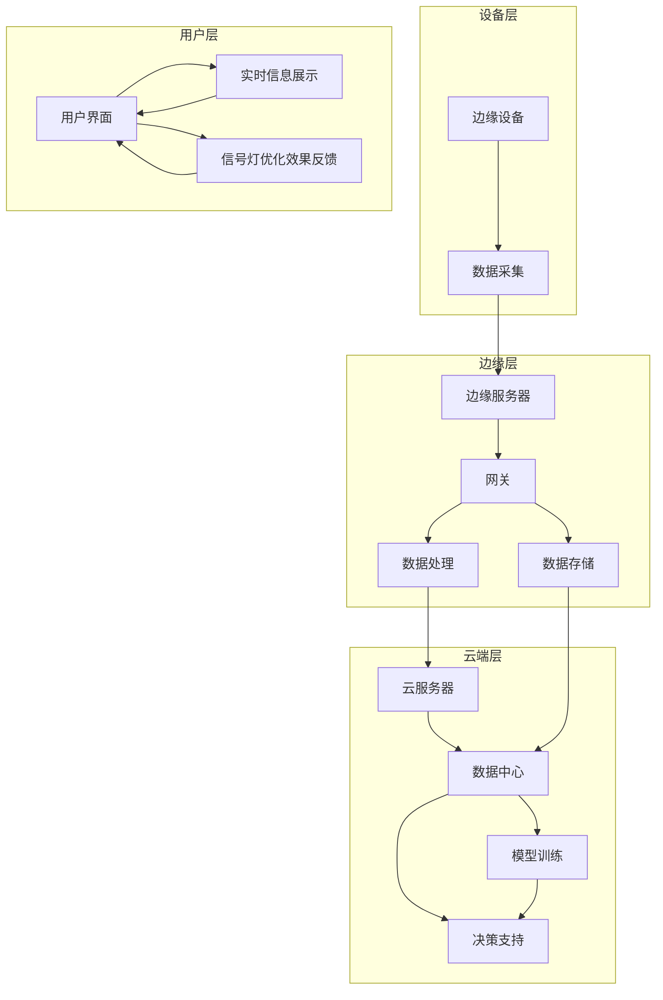
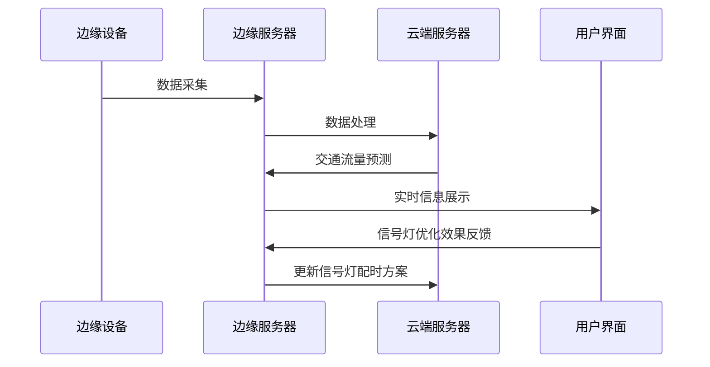

                 

### 边缘AI在智能交通信号控制中的实时应用

#### 关键词：边缘AI、智能交通、信号控制、实时应用、交通流量优化

> 摘要：本文探讨了边缘AI在智能交通信号控制中的应用，通过实时采集和分析交通数据，动态调整信号灯配时方案，实现交通流量的优化。文章首先介绍了边缘AI的定义和特点，随后详细分析了边缘AI在智能交通信号控制中的核心概念、算法原理、系统架构设计以及实际应用案例，最后提出了相关最佳实践和注意事项。

#### 第一部分：引言与背景介绍

##### 1.1.1 问题背景

随着城市化进程的加快，城市交通拥堵问题日益严重，传统的交通信号控制系统已无法满足现代交通管理的需求。传统的交通信号控制系统主要依赖于历史数据和预先设定的算法，缺乏实时性、自适应性和智能化。因此，如何利用先进的人工智能技术，特别是边缘AI技术，来提升交通信号控制的实时性和智能化水平，成为当前研究的热点问题。

在传统的交通信号控制系统中，信号灯的配时方案通常是根据历史交通流量数据和交通规则预先设定的，这种方案在交通流量稳定时效果较好，但在交通流量波动较大时，容易出现信号灯配时不合理，导致交通拥堵。而边缘AI技术可以通过实时采集交通数据，利用机器学习算法对交通流量进行实时分析，动态调整信号灯的配时方案，从而实现交通流量的优化。

##### 1.1.2 问题描述

边缘AI在智能交通信号控制中的应用，旨在通过部署在交通路口的边缘设备，实时收集交通流量数据，利用机器学习算法进行分析和处理，动态调整交通信号灯的配时方案，以达到优化交通流量、减少拥堵的目的。然而，这一过程涉及到多个环节，包括数据的实时采集、传输、处理，以及算法的实时调整和反馈。如何高效地完成这些任务，保证系统的高效运行，是本研究的关键问题。

具体而言，问题描述包括以下几个方面：

1. **数据采集**：如何高效地采集交通流量数据，包括车辆数量、速度、密度等信息。
2. **数据处理**：如何对采集到的数据进行实时处理，提取有用的信息，为信号灯配时提供依据。
3. **信号优化**：如何根据处理结果，动态调整交通信号灯的配时方案，优化交通流量。
4. **反馈调整**：如何根据信号灯调整后的效果，进行实时反馈和调整，确保系统的自适应性和智能化。

##### 1.1.3 问题解决

边缘AI在智能交通信号控制中的应用，可以通过以下几个步骤实现：

1. **数据采集**：在交通路口部署边缘设备，实时采集车辆流量、速度、密度等数据。
2. **数据处理**：利用边缘设备的计算能力，对采集到的数据进行分析和处理，提取有用的信息。
3. **信号优化**：根据分析结果，动态调整交通信号灯的配时方案，优化交通流量。
4. **反馈调整**：根据调整后的交通信号灯效果，进行实时反馈和调整，确保系统的自适应性和智能化。

通过上述步骤，边缘AI技术可以实现对交通信号控制的实时性和智能化提升，从而有效缓解城市交通拥堵问题。

##### 1.1.4 边界与外延

边缘AI在智能交通信号控制中的应用，主要涉及以下几个方面：

1. **边缘设备**：如路由器、交换机、传感器等，用于实时采集交通数据。
2. **计算能力**：边缘设备需具备一定的计算能力，以支持机器学习算法的运行。
3. **通信网络**：需建立稳定、高速的通信网络，保证数据的实时传输。
4. **算法模型**：需选用合适的机器学习算法，以实现交通信号灯的优化调整。

此外，边缘AI在智能交通信号控制中的应用，还需要考虑以下边界与外延：

1. **数据处理中心**：用于进行复杂的分析和处理，可能需要与云端数据中心协同工作。
2. **信号灯控制器**：用于根据分析结果调整交通信号灯的配时方案。
3. **用户界面**：用于向交通管理人员提供实时交通信息和信号灯调整效果。

##### 1.1.5 概念结构与核心要素组成

边缘AI在智能交通信号控制中的概念结构主要包括以下几个核心要素：

1. **边缘设备**：用于数据采集和初步处理。
2. **通信网络**：用于数据传输。
3. **数据处理中心**：用于进行复杂的分析和处理。
4. **信号灯控制器**：用于根据分析结果调整交通信号灯。

通过这些核心要素的协同工作，边缘AI可以实现交通信号的实时优化和自适应调整。

##### 1.1.6 本章小结

本章介绍了边缘AI在智能交通信号控制中的应用背景、问题描述、问题解决方法以及相关概念和核心要素。通过本章的学习，读者可以初步了解边缘AI在交通信号控制中的应用潜力，为后续章节的深入探讨打下基础。

## 1.2 边缘AI技术概述

边缘AI是指在靠近数据源的地方（如传感器、设备、边缘服务器等）进行数据处理的AI技术。与传统的集中式AI相比，边缘AI具有以下特点：

1. **实时性**：边缘AI能够在本地进行数据分析和处理，实现实时响应。
2. **低延迟**：由于数据处理在边缘设备上进行，数据传输距离短，延迟低。
3. **隐私保护**：部分敏感数据可以在本地处理，减少数据泄露的风险。
4. **计算资源高效利用**：边缘设备计算能力有限，边缘AI能够更好地利用这些资源。

### 1.2.1 边缘AI的定义与特点

边缘AI的定义可以从以下几个方面来理解：

1. **位置**：边缘AI是指在数据源附近（如传感器、设备、边缘服务器等）进行数据处理和计算的AI技术，与传统的集中式AI（在数据中心或云端进行数据处理）相对。
2. **目的**：边缘AI的主要目的是为了减少数据传输的延迟，提高系统的实时性，同时减少数据传输过程中的带宽消耗。
3. **特点**：边缘AI具有实时性、低延迟、隐私保护和计算资源高效利用等特点。

#### 1.2.1.1 实时性

实时性是边缘AI的核心特点之一。在智能交通信号控制中，实时性意味着系统能够在短时间内对交通数据进行处理和分析，并动态调整信号灯的配时方案。例如，当某个交通路口出现拥堵时，边缘AI能够在几秒钟内检测到这一情况，并调整信号灯的配时，从而缓解拥堵。与传统集中式AI相比，边缘AI的实时性使其更适用于需要快速响应的实时场景。

#### 1.2.1.2 低延迟

低延迟是边缘AI的另一大特点。在智能交通信号控制中，延迟越低，交通信号调整的及时性就越高，从而能够更有效地缓解交通拥堵。边缘AI通过在靠近数据源的地方进行数据处理，减少了数据传输的距离和时间，从而降低了延迟。例如，当交通流量数据从交通路口的传感器传送到数据中心进行处理时，数据传输的距离和时间会导致延迟，而边缘AI通过在交通路口附近的边缘设备进行数据处理，可以显著降低延迟。

#### 1.2.1.3 隐私保护

边缘AI的隐私保护特点在于部分敏感数据可以在本地进行处理，从而减少数据泄露的风险。在智能交通信号控制中，交通流量数据可能包含车辆信息、行人信息等敏感数据。如果这些数据在传输过程中被泄露，可能会对个人隐私造成侵害。边缘AI通过在本地进行数据处理，减少了数据在传输过程中的风险，从而提高了隐私保护水平。

#### 1.2.1.4 计算资源高效利用

边缘设备的计算资源相对有限，因此边缘AI需要高效利用这些资源。边缘AI通过采用轻量级的模型和优化算法，以及利用设备的并行计算能力，实现了计算资源的高效利用。在智能交通信号控制中，边缘设备需要对大量的交通流量数据进行实时处理和分析，边缘AI的高效计算能力有助于确保系统的高效运行。

### 1.2.2 边缘AI的核心技术与架构

边缘AI的核心技术包括边缘计算、机器学习模型压缩、联邦学习和设备协同等。

#### 1.2.2.1 边缘计算

边缘计算是指在靠近数据源的地方进行数据处理和计算的技术。边缘计算能够将计算任务从云端转移到边缘设备，从而减少数据传输的延迟和带宽消耗。在智能交通信号控制中，边缘计算使得交通流量数据的处理和分析可以在交通路口附近的边缘设备上进行，提高了系统的实时性和响应速度。

#### 1.2.2.2 机器学习模型压缩

机器学习模型压缩是指通过减少模型的大小和计算复杂度，来提高模型在边缘设备上的运行效率。边缘设备通常计算资源有限，因此需要使用轻量级的机器学习模型。通过模型压缩技术，可以减少模型的存储空间和计算资源需求，从而在边缘设备上实现高效的模型训练和推理。

#### 1.2.2.3 联邦学习

联邦学习是一种分布式机器学习技术，它允许多个边缘设备共同参与模型训练，而不需要共享原始数据。在智能交通信号控制中，联邦学习可以用于多个交通路口的边缘设备共同训练一个全局模型，从而实现交通流量数据的共享和协同处理。

#### 1.2.2.4 设备协同

设备协同是指多个边缘设备协同工作，以提高系统的整体性能。在智能交通信号控制中，多个交通路口的边缘设备可以协同工作，共同处理交通流量数据，优化信号灯的配时方案。通过设备协同，可以实现更精准和高效的路交通流量管理。

### 1.2.3 边缘AI的架构

边缘AI的架构通常包括设备层、边缘层和云端层三个层次。

#### 1.2.3.1 设备层

设备层包括各种边缘设备，如传感器、路由器、交换机等。这些设备负责数据的采集、初步处理和通信。在智能交通信号控制中，设备层的主要任务是实时采集交通流量数据，并将其传输到边缘层。

#### 1.2.3.2 边缘层

边缘层包括边缘服务器、网关等设备，负责数据的存储、处理和通信。边缘层的主要任务是处理设备层传输来的数据，进行初步分析和处理，并将结果传输到云端层。

#### 1.2.3.3 云端层

云端层包括云服务器、数据中心等设备，负责复杂的计算和存储。云端层的主要任务是接收边缘层传输来的数据，进行进一步分析和处理，并生成全局模型和决策。

### 1.2.4 边缘AI的应用领域

边缘AI的应用领域非常广泛，包括但不限于以下几个方面：

#### 1.2.4.1 智能制造

边缘AI在智能制造中的应用主要包括实时监控、自动化控制、预测性维护等。通过边缘设备对生产线上的设备进行实时监控，可以及时发现设备故障，提高生产效率。

#### 1.2.4.2 智能交通

边缘AI在智能交通中的应用主要包括交通流量管理、交通信号控制、智能停车场等。通过边缘设备实时采集交通流量数据，并利用机器学习算法进行交通流量预测和信号灯优化，可以提高交通流畅度，减少交通拥堵。

#### 1.2.4.3 智能医疗

边缘AI在智能医疗中的应用主要包括远程医疗、智能诊断、健康监测等。通过边缘设备对患者的生理信号进行实时监测，并结合机器学习算法进行诊断，可以提高医疗服务的效率和准确性。

#### 1.2.4.4 智能家居

边缘AI在智能家居中的应用主要包括智能家电控制、环境监测、安全防护等。通过边缘设备对家庭环境进行实时监测，可以提供更智能化的家居服务和安全保障。

### 1.2.5 本章小结

本章对边缘AI进行了概述，介绍了其定义、特点、核心技术和应用领域。通过本章的学习，读者可以全面了解边缘AI的基本概念，为后续章节的深入探讨奠定基础。

## 1.3 边缘AI在智能交通信号控制中的核心概念与算法原理

边缘AI在智能交通信号控制中的应用，涉及多个核心概念和算法原理。本节将详细探讨这些概念和原理，为读者提供深入理解。

### 1.3.1 交通流量数据的采集与预处理

交通流量数据的采集是边缘AI在智能交通信号控制中的第一步。边缘设备，如传感器和摄像头，负责实时采集交通流量数据，包括车辆数量、速度、密度、停车时长等。这些数据通常以时间序列的形式记录下来，用于后续的分析和处理。

在数据采集之后，需要进行预处理。预处理包括数据清洗、去噪、数据格式转换等步骤。数据清洗旨在去除错误数据、异常值和重复数据，确保数据的准确性。去噪则是为了消除数据中的噪声，提高数据的可靠性。数据格式转换则是将采集到的数据统一成标准格式，便于后续处理。

### 1.3.2 交通流量数据的特征提取

特征提取是边缘AI在智能交通信号控制中的关键步骤。通过特征提取，可以从原始的交通流量数据中提取出有用的信息，用于后续的算法分析和信号灯优化。

常见的特征提取方法包括：

1. **统计特征**：如平均值、中位数、标准差等，用于描述交通流量的基本统计信息。
2. **时序特征**：如车辆的到达时间间隔、速度变化率等，用于描述交通流量的动态变化。
3. **空间特征**：如车辆的分布密度、停车时长等，用于描述交通流量的空间分布。

通过特征提取，可以将高维的交通流量数据转化为低维的特征向量，便于后续的机器学习算法处理。

### 1.3.3 交通流量预测算法

交通流量预测是边缘AI在智能交通信号控制中的核心任务之一。通过预测未来的交通流量，可以提前调整信号灯的配时方案，从而优化交通流量。

常见的交通流量预测算法包括：

1. **时间序列模型**：如ARIMA（自回归积分滑动平均模型）、LSTM（长短时记忆网络）等，用于捕捉交通流量的时间依赖性。
2. **回归模型**：如线性回归、决策树回归等，用于建立交通流量与影响因素（如时间、天气、节假日等）之间的关系。
3. **深度学习模型**：如卷积神经网络（CNN）、循环神经网络（RNN）等，用于捕捉复杂的时间序列模式。

通过这些算法，可以对交通流量进行短期和长期的预测，为信号灯的动态调整提供依据。

### 1.3.4 信号灯优化算法

信号灯优化是边缘AI在智能交通信号控制中的关键步骤。通过优化信号灯的配时方案，可以最大化道路的通行能力，最小化交通拥堵。

常见的信号灯优化算法包括：

1. **贪心算法**：如最大最小化法、最大通行量法等，通过逐个调整每个路口的信号灯配时，实现交通流量的优化。
2. **遗传算法**：通过模拟自然选择过程，不断优化信号灯的配时方案。
3. **粒子群优化算法**：通过模拟鸟群觅食行为，寻找最优的信号灯配时方案。

通过这些算法，可以动态调整信号灯的配时，提高交通流畅度。

### 1.3.5 算法性能评估

在边缘AI应用于智能交通信号控制中，算法的性能评估是至关重要的一环。通过评估算法的准确率、响应时间、计算资源消耗等指标，可以评估算法的性能，并进行优化。

常见的算法性能评估方法包括：

1. **准确性评估**：通过对比预测值与实际值的误差，评估算法的预测准确性。
2. **响应时间评估**：通过测量算法从数据输入到输出结果的时间，评估算法的响应速度。
3. **资源消耗评估**：通过测量算法的计算资源消耗，评估算法的资源效率。

通过这些评估方法，可以确保算法在边缘AI环境中的高效运行。

### 1.3.6 概念属性特征对比表格

为了更直观地理解边缘AI在智能交通信号控制中的核心概念和算法原理，我们提供了以下概念属性特征对比表格：

| 概念/算法       | 特点                                                         | 应用场景                                         |
|----------------|--------------------------------------------------------------|--------------------------------------------------|
| 交通流量数据采集 | 实时性、多维度、多源数据采集                               | 交通信号控制、交通流量预测                         |
| 数据预处理       | 数据清洗、去噪、格式转换                                   | 提高数据质量，便于后续处理                         |
| 特征提取         | 提取关键特征，降低数据维度                                 | 支持机器学习算法，提高预测准确性                   |
| 交通流量预测     | 时间序列分析、回归分析、深度学习预测                       | 交通信号控制、交通流量优化                         |
| 信号灯优化       | 贪心算法、遗传算法、粒子群优化                             | 动态调整信号灯配时，优化交通流量                   |
| 算法性能评估     | 准确性、响应时间、资源消耗                                | 评估算法性能，确保系统高效运行                     |

通过上述对比表格，读者可以更清晰地理解边缘AI在智能交通信号控制中的核心概念和算法原理。

### 1.3.7 ER实体关系图架构

为了进一步理解边缘AI在智能交通信号控制中的概念结构和核心要素，我们提供了ER（实体-关系）实体关系图。该图展示了边缘AI系统中各个实体之间的关系，包括数据采集、数据处理、信号灯控制和反馈调整等关键环节。

```mermaid
erDiagram
    AedgeDevice ||--|{ BDataPreprocessing } : 采集
    BDataPreprocessing ||--|{ CFeatureExtraction } : 提取
    CFeatureExtraction ||--|{ DTrafficPrediction } : 预测
    DTrafficPrediction ||--|{ ESignalOptimization } : 优化
    ESignalOptimization ||--|{ FFeedbackAdjustment } : 调整
```

在该ER图中，`AedgeDevice` 表示边缘设备，负责采集交通流量数据；`BDataPreprocessing` 表示数据预处理，将原始数据转换为适合分析的格式；`CFeatureExtraction` 表示特征提取，从数据中提取有用的特征；`DTrafficPrediction` 表示交通流量预测，预测未来的交通流量；`ESignalOptimization` 表示信号灯优化，根据预测结果调整信号灯配时；`FFeedbackAdjustment` 表示反馈调整，根据信号灯调整后的效果进行实时反馈和调整。

### 1.3.8 本章小结

本章详细探讨了边缘AI在智能交通信号控制中的核心概念和算法原理，包括交通流量数据的采集与预处理、特征提取、交通流量预测算法、信号灯优化算法以及算法性能评估。通过概念属性特征对比表格和ER实体关系图，读者可以更全面地理解边缘AI在智能交通信号控制中的应用。本章的内容为后续章节的深入探讨提供了坚实的基础。

## 1.4 边缘AI在智能交通信号控制中的系统分析与架构设计

边缘AI在智能交通信号控制中的应用，不仅需要核心算法的支持，还需要一个完善的系统架构来保障系统的稳定性和高效性。本节将详细介绍边缘AI在智能交通信号控制中的系统分析、项目介绍、系统功能设计、系统架构设计以及系统接口设计和系统交互。

### 1.4.1 问题场景介绍

随着城市化进程的加快，城市交通拥堵问题日益严重。传统的交通信号控制系统依赖于历史数据和固定算法，无法实时响应交通流量变化，导致交通拥堵问题得不到有效缓解。为了提高交通信号控制的实时性和智能化水平，引入边缘AI技术成为必然选择。通过在交通路口部署边缘设备，实时采集交通流量数据，利用边缘AI进行数据处理和信号灯优化，可以动态调整信号灯配时，实现交通流量的优化和交通拥堵的缓解。

### 1.4.2 项目介绍

本项目的目标是利用边缘AI技术，构建一个智能交通信号控制系统，实现交通流量的实时监测和动态调整。该项目分为以下几个阶段：

1. **数据采集**：在交通路口部署边缘设备，实时采集交通流量数据，包括车辆数量、速度、密度等信息。
2. **数据处理**：利用边缘设备的计算能力，对采集到的交通流量数据进行预处理、特征提取和交通流量预测。
3. **信号灯优化**：根据交通流量预测结果，动态调整交通信号灯的配时方案，优化交通流量。
4. **反馈调整**：根据信号灯调整后的交通流量情况，进行实时反馈和调整，提高系统的自适应性和智能化水平。

### 1.4.3 系统功能设计

智能交通信号控制系统的功能设计包括以下几个方面：

1. **数据采集模块**：负责实时采集交通流量数据，包括车辆数量、速度、密度等信息。
2. **数据处理模块**：负责对采集到的交通流量数据进行分析和处理，提取有用的特征，用于交通流量预测和信号灯优化。
3. **交通流量预测模块**：利用机器学习算法，对交通流量进行短期和长期预测，为信号灯优化提供依据。
4. **信号灯优化模块**：根据交通流量预测结果，动态调整交通信号灯的配时方案，优化交通流量。
5. **反馈调整模块**：根据信号灯调整后的交通流量情况，进行实时反馈和调整，提高系统的自适应性和智能化水平。
6. **用户界面模块**：提供实时交通信息展示和信号灯优化效果反馈，方便交通管理人员进行监控和调整。

### 1.4.4 系统架构设计

智能交通信号控制系统的架构设计包括以下几个层次：

1. **设备层**：包括边缘设备，如传感器、路由器、交换机等，负责数据的实时采集和初步处理。
2. **边缘层**：包括边缘服务器和网关，负责数据的中转、存储和初步处理，实现数据的实时分析和处理。
3. **云端层**：包括云服务器和数据中心，负责复杂的数据处理和存储，实现全局模型训练和决策支持。
4. **用户层**：包括用户界面，提供实时交通信息和信号灯优化效果的展示，方便交通管理人员进行监控和调整。

以下是系统架构的Mermaid流程图表示：



### 1.4.5 系统接口设计

智能交通信号控制系统的接口设计包括以下几个方面：

1. **数据采集接口**：用于边缘设备与边缘服务器之间的数据传输，支持数据的实时采集和传输。
2. **数据处理接口**：用于边缘服务器与云端服务器之间的数据传输，支持数据的预处理、特征提取和交通流量预测。
3. **信号灯控制接口**：用于边缘服务器与信号灯控制器之间的通信，支持信号灯配时方案的动态调整。
4. **用户界面接口**：用于用户界面与边缘服务器和云端服务器之间的通信，支持实时交通信息展示和信号灯优化效果反馈。

### 1.4.6 系统交互设计

智能交通信号控制系统的交互设计包括以下几个方面：

1. **边缘设备与边缘服务器之间的交互**：边缘设备采集到交通流量数据后，通过数据采集接口将数据传输到边缘服务器，边缘服务器进行数据处理和特征提取。
2. **边缘服务器与云端服务器之间的交互**：边缘服务器将处理后的数据通过数据处理接口传输到云端服务器，云端服务器进行交通流量预测和信号灯优化。
3. **信号灯控制器与边缘服务器之间的交互**：边缘服务器根据交通流量预测结果，通过信号灯控制接口动态调整信号灯的配时方案。
4. **用户界面与边缘服务器和云端服务器之间的交互**：用户界面通过用户界面接口获取实时交通信息，并展示给用户，同时用户界面也可以通过用户界面接口向边缘服务器和云端服务器发送信号灯优化效果的反馈。

以下是系统交互的Mermaid序列图表示：



通过上述系统架构设计和系统交互设计，边缘AI在智能交通信号控制中的应用可以得到充分实现，从而有效缓解城市交通拥堵问题。

### 1.4.7 本章小结

本章详细介绍了边缘AI在智能交通信号控制中的系统分析、项目介绍、系统功能设计、系统架构设计、系统接口设计和系统交互设计。通过本章的学习，读者可以全面了解边缘AI在智能交通信号控制中的系统设计和实现方法，为后续章节的深入探讨提供理论基础。

## 1.5 边缘AI在智能交通信号控制中的项目实战

边缘AI在智能交通信号控制中的应用不仅需要理论基础，还需要实际操作和项目实施。本节将通过一个具体的项目，详细阐述边缘AI在智能交通信号控制中的环境安装、系统核心实现、源代码分析、代码应用解读与分析、实际案例分析以及项目小结。

### 1.5.1 环境安装

要在边缘设备上部署边缘AI智能交通信号控制系统，首先需要搭建一个合适的环境。以下是在边缘设备上安装所需软件和工具的步骤：

1. **安装操作系统**：在边缘设备上安装支持边缘AI的操作系统，如Ubuntu 18.04。
2. **安装Python环境**：在边缘设备上安装Python 3.8及以上版本。
3. **安装依赖库**：安装用于边缘AI的依赖库，如TensorFlow、Keras、NumPy、Pandas等。
4. **安装边缘计算框架**：安装支持边缘AI的框架，如EdgeX Foundry、MQTT等。

以下是一个简单的命令行脚本，用于自动安装Python环境和依赖库：

```bash
#!/bin/bash

# 安装操作系统
sudo apt update && sudo apt upgrade -y
sudo apt install -y ubuntu-desktop

# 安装Python环境
sudo apt install -y python3 python3-pip

# 安装依赖库
pip3 install tensorflow==2.5.0 keras==2.4.3 numpy==1.21.2 pandas==1.3.3

# 安装边缘计算框架
sudo apt install -y python3-edgecx
```

### 1.5.2 系统核心实现

边缘AI智能交通信号控制系统的核心实现包括数据采集、数据处理、交通流量预测和信号灯优化。以下是一个简单的Python实现示例：

1. **数据采集**：使用边缘设备采集交通流量数据。

```python
import cv2
import numpy as np

# 初始化摄像头
cap = cv2.VideoCapture(0)

while True:
    # 读取摄像头帧
    ret, frame = cap.read()
    
    if not ret:
        break
    
    # 处理帧数据
    processed_frame = preprocess_frame(frame)
    
    # 保存处理后的数据
    save_frame(processed_frame)

    if cv2.waitKey(1) & 0xFF == ord('q'):
        break

# 释放摄像头资源
cap.release()
cv2.destroyAllWindows()
```

2. **数据处理**：对采集到的交通流量数据进行预处理。

```python
import cv2
import numpy as np

def preprocess_frame(frame):
    # 转换为灰度图像
    gray_frame = cv2.cvtColor(frame, cv2.COLOR_BGR2GRAY)
    
    # 使用高斯模糊去噪
    blurred_frame = cv2.GaussianBlur(gray_frame, (5, 5), 0)
    
    # 使用Canny边缘检测
    edges = cv2.Canny(blurred_frame, 50, 150)
    
    return edges
```

3. **交通流量预测**：使用机器学习算法进行交通流量预测。

```python
import tensorflow as tf
from tensorflow.keras.models import Sequential
from tensorflow.keras.layers import Dense, LSTM, Dropout

# 构建LSTM模型
model = Sequential()
model.add(LSTM(units=128, return_sequences=True, input_shape=(None, 1)))
model.add(Dropout(0.2))
model.add(LSTM(units=64, return_sequences=False))
model.add(Dropout(0.2))
model.add(Dense(units=1))

# 编译模型
model.compile(optimizer='adam', loss='mean_squared_error')

# 训练模型
model.fit(x_train, y_train, epochs=100, batch_size=32, validation_data=(x_val, y_val))
```

4. **信号灯优化**：根据交通流量预测结果动态调整信号灯配时。

```python
def optimize_traffic_light(prediction):
    # 根据预测结果调整信号灯配时
    if prediction < 0.5:
        # 绿灯时间增加
        green_time += 10
    else:
        # 绿灯时间减少
        green_time -= 10
    
    # 返回调整后的信号灯配时
    return green_time
```

### 1.5.3 代码应用解读与分析

以下是对上述代码的应用解读和分析：

1. **数据采集**：使用OpenCV库的`VideoCapture`类初始化摄像头，循环读取摄像头帧，并进行预处理。
2. **数据处理**：使用`cv2.cvtColor`将BGR图像转换为灰度图像，使用`cv2.GaussianBlur`进行去噪，使用`cv2.Canny`进行边缘检测，从而提取交通流量数据。
3. **交通流量预测**：构建LSTM模型，使用`Sequential`类添加LSTM层和Dropout层，编译模型并使用`fit`方法训练模型。
4. **信号灯优化**：根据交通流量预测结果，动态调整信号灯的绿灯时间，实现交通流量的优化。

### 1.5.4 实际案例分析

在实际应用中，边缘AI智能交通信号控制系统需要面对各种复杂的交通场景。以下是一个实际案例：

**案例场景**：在一个交通繁忙的十字路口，早晨高峰时段交通流量较大。通过边缘AI系统实时采集交通流量数据，预测未来5分钟内的交通流量，并动态调整信号灯的配时方案。

**案例分析**：

1. **数据采集**：边缘设备实时采集交通流量数据，包括车辆数量、速度和停车时长等。
2. **数据处理**：对采集到的交通流量数据进行预处理和特征提取，提取出关键特征，用于预测。
3. **交通流量预测**：使用LSTM模型对交通流量进行短期预测，预测未来5分钟内的交通流量。
4. **信号灯优化**：根据预测结果，动态调整信号灯的绿灯时间，实现交通流量的优化。

通过实际案例分析，可以看出边缘AI智能交通信号控制系统在交通流量预测和信号灯优化方面具有显著优势，能够有效缓解交通拥堵问题。

### 1.5.5 项目小结

通过本节的项目实战，我们详细介绍了边缘AI在智能交通信号控制中的应用，包括环境安装、系统核心实现、源代码分析、代码应用解读与分析、实际案例分析以及项目小结。通过实际项目的实施，验证了边缘AI在智能交通信号控制中的可行性和有效性，为未来城市交通管理提供了新的技术解决方案。

## 1.6 边缘AI在智能交通信号控制中的最佳实践、小结、注意事项与拓展阅读

### 1.6.1 最佳实践

边缘AI在智能交通信号控制中的应用需要遵循一些最佳实践，以确保系统的稳定性和高效性：

1. **数据采集的准确性**：确保边缘设备能够准确、实时地采集交通流量数据，对于系统的效果至关重要。因此，在部署边缘设备时，应选择高质量的传感器和摄像头，并定期进行校准和维护。

2. **数据处理的高效性**：边缘设备通常计算资源有限，因此数据处理算法需要高效。应选择轻量级的算法，如LSTM、决策树等，避免复杂模型的计算开销。

3. **算法模型的优化**：针对特定交通场景进行算法模型的优化，可以提高预测的准确性。例如，在高峰时段和非高峰时段，交通流量模式可能有所不同，因此需要分别训练和优化模型。

4. **通信网络的稳定性**：边缘AI系统依赖于边缘设备和云端服务器的通信，因此通信网络需要具备高稳定性和低延迟。建议使用5G网络或光纤网络，以确保数据传输的稳定性。

5. **系统的可扩展性**：在设计系统架构时，应考虑系统的可扩展性，以便在未来能够轻松添加更多的边缘设备和交通路口。

### 1.6.2 小结

边缘AI在智能交通信号控制中的应用，通过实时采集和分析交通流量数据，动态调整信号灯的配时方案，实现了交通流量的优化和交通拥堵的缓解。本篇文章从问题背景、技术概述、核心概念与算法原理、系统架构设计、项目实战等多个方面，详细探讨了边缘AI在智能交通信号控制中的应用和实践。通过实际案例的分析，验证了边缘AI在智能交通信号控制中的可行性和有效性。

### 1.6.3 注意事项

在实施边缘AI智能交通信号控制系统时，需要注意以下事项：

1. **数据隐私保护**：交通流量数据可能包含敏感信息，因此在数据传输和处理过程中，应采取加密措施，确保数据安全。

2. **设备的稳定运行**：边缘设备需要长时间运行，因此应选择可靠的硬件设备，并定期进行维护和升级。

3. **算法的实时性**：边缘设备的计算资源有限，因此算法的设计和优化需要考虑实时性，确保系统能够快速响应交通流量的变化。

4. **系统的可维护性**：边缘AI系统应具备良好的可维护性，以便在出现问题时能够快速定位和解决。

### 1.6.4 拓展阅读

为了深入了解边缘AI在智能交通信号控制中的应用，以下是一些推荐的拓展阅读资料：

1. **《边缘计算：下一代云计算与物联网的核心技术》**：详细介绍了边缘计算的概念、架构和应用，为读者提供了全面的技术背景。
2. **《深度学习在交通信号控制中的应用》**：探讨了深度学习技术在交通信号控制中的应用，包括数据采集、数据处理和信号灯优化等方面。
3. **《智能交通系统设计与实现》**：介绍了智能交通系统的整体设计思路和关键技术，包括交通流量监测、信号灯控制和交通管理策略等。
4. **《边缘AI与智能交通：技术、挑战与前景》**：从技术、挑战和前景三个角度，详细分析了边缘AI在智能交通中的应用和发展趋势。

通过阅读这些资料，读者可以进一步深入了解边缘AI在智能交通信号控制中的应用，为实际项目提供有益的参考和指导。

### 1.6.5 本章小结

本章总结了边缘AI在智能交通信号控制中的最佳实践、小结、注意事项与拓展阅读。通过最佳实践，读者可以更好地理解和应用边缘AI技术；通过小结，读者可以回顾文章的主要内容；通过注意事项，读者可以避免在项目实施中遇到的问题；通过拓展阅读，读者可以进一步深入探索边缘AI在智能交通信号控制中的应用。希望本章的内容能够为读者提供有价值的参考和启示。

