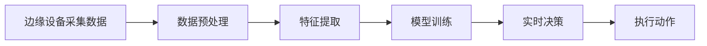
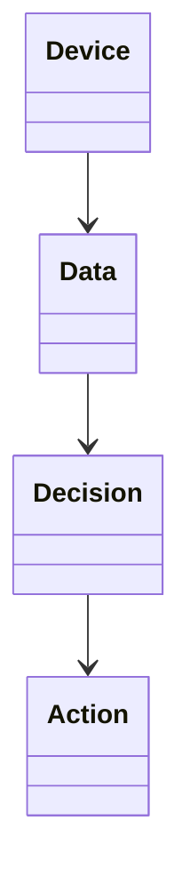
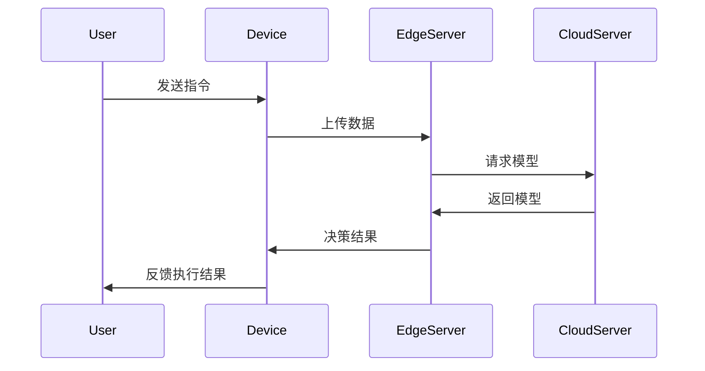
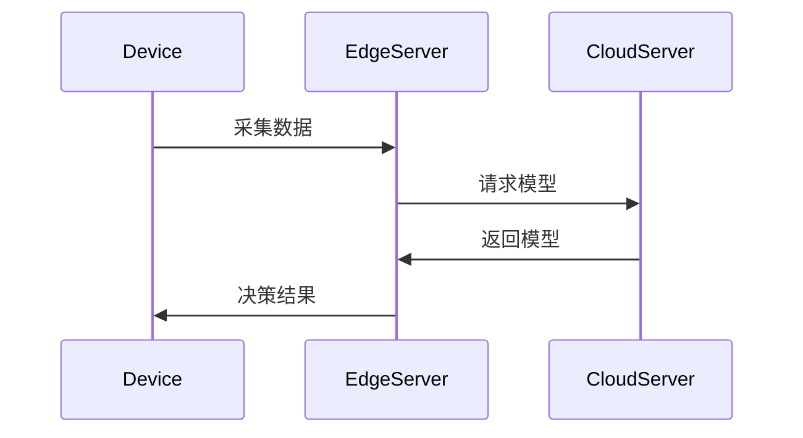
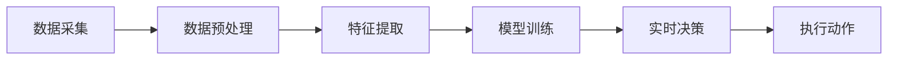
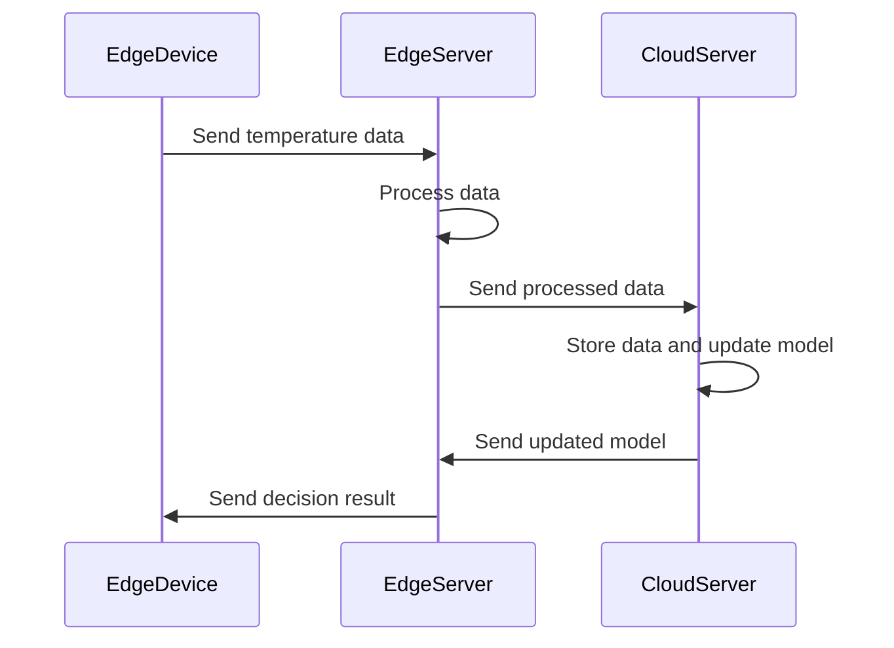
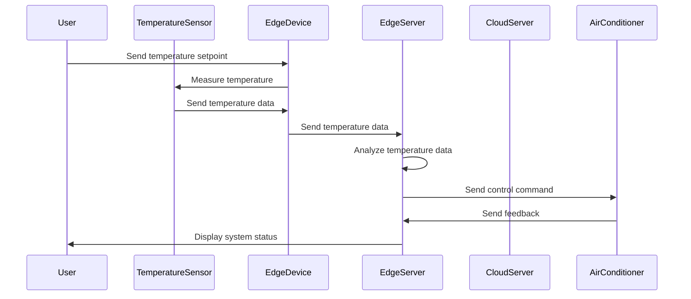

                 


# 边缘AI在智能家居中的实时决策应用

关键词：边缘AI，智能家居，实时决策，边缘计算，物联网

摘要：本文详细探讨了边缘AI在智能家居中的实时决策应用。首先介绍了边缘AI和智能家居的基本概念，随后分析了边缘AI在智能家居中的实时决策问题，并探讨了其解决方案。文章通过一个实际案例，展示了边缘AI在智能家居中的具体应用，最后提出了最佳实践和注意事项。

----------------------------------------------------------------

## 1. 引言

### 1.1 问题背景

随着物联网（IoT）技术的飞速发展，智能家居已经成为现代家庭生活中不可或缺的一部分。智能音箱、智能门锁、智能照明、智能安防等设备逐渐普及，用户对家居设备的要求也日益提高。然而，随着设备数量的增加，数据传输和处理的需求也变得越发迫切。中心化的云计算虽然能够提供强大的计算能力，但受限于网络带宽和延迟，无法满足智能家居设备实时性的要求。因此，边缘AI技术的引入为智能家居的实时决策提供了新的解决方案。

### 1.2 问题描述

智能家居设备产生的数据量巨大，且数据类型繁多，包括音频、视频、环境数据等。这些数据需要实时处理和决策，以便及时响应用户的指令或采取相应的措施。然而，中心化的云计算系统在面对如此大规模和复杂的数据处理时，往往存在以下问题：

- **网络延迟**：数据需要在云端进行处理，这会导致显著的延迟，无法满足智能家居设备实时响应的需求。
- **带宽限制**：大量的数据传输需要消耗大量的网络带宽，可能导致网络拥堵。
- **安全性问题**：数据在传输过程中可能面临被截取或篡改的风险。

### 1.3 问题解决

边缘AI技术的引入，可以通过在设备本地进行数据处理和决策，有效解决上述问题。边缘AI是指在设备或网络边缘进行数据处理和智能决策的技术，它具有以下优势：

- **低延迟**：在本地进行数据处理和决策，大大减少了网络延迟，能够实现实时响应。
- **高效能**：边缘设备通常具有较低的功耗和成本，但仍然能够提供足够的计算能力，满足数据处理需求。
- **安全性**：数据在本地处理，减少了数据在网络中的传输次数，降低了数据泄露的风险。

### 1.4 边界与外延

本文的讨论范围主要涵盖边缘AI在智能家居中的实时决策应用，具体包括：

- **边缘设备**：如智能音箱、智能门锁、智能摄像头等。
- **边缘服务器**：用于处理边缘设备无法处理的复杂任务，如大规模数据分析和深度学习模型训练。
- **云端服务器**：用于存储和管理数据，以及与边缘服务器进行协同工作。

### 1.5 概念结构与核心要素组成

边缘AI在智能家居中的实时决策应用涉及多个核心概念和要素，包括：

- **边缘设备**：包括各种智能传感器和执行器。
- **边缘服务器**：用于处理边缘设备上传的数据，并执行实时决策。
- **云端服务器**：用于存储和管理数据，以及进行大规模数据分析和深度学习模型训练。
- **数据处理算法**：包括特征提取、模型训练和决策逻辑等。

## 2. 核心概念与联系

### 2.1 核心概念原理

边缘AI：边缘AI是一种在设备本地进行数据处理和决策的技术，它通过在边缘设备上部署模型，实现对数据的实时分析和处理。

智能家居：智能家居是指利用物联网技术和人工智能技术，实现家庭设备自动化和智能化的系统。

实时决策：实时决策是指系统在接收到数据后，立即进行数据处理和决策，并采取相应的行动。

### 2.2 概念属性特征对比表格

| 概念         | 属性特征                                                     | 对比分析                                                   |
| ------------ | ------------------------------------------------------------ | ---------------------------------------------------------- |
| 边缘AI       | 低延迟、高效能、安全性、本地数据处理和决策                       | 与中心化AI相比，边缘AI在延迟和安全性方面具有优势               |
| 智能家居     | 自动化、智能化、物联网技术、设备互联互通                       | 智能家居是边缘AI的应用场景，两者相辅相成                     |
| 实时决策     | 快速响应、实时处理、数据驱动决策                               | 实时决策是边缘AI在智能家居中的核心功能，决定了智能家居的智能程度 |

### 2.3 ER实体关系图架构

```mermaid
erDiagram
    User ||--o{ Device : "controls" }
    Device ||--o{ Data : "produces" }
    Data ||--o{ Decision : "processed by" }
    Decision ||--o{ Action : "executes" }
```

## 3. 算法原理讲解

### 3.1 算法mermaid流程图



### 3.2 Python源代码阐述

```python
import numpy as np
from sklearn.model_selection import train_test_split
from sklearn.ensemble import RandomForestClassifier
from sklearn.metrics import accuracy_score

# 数据预处理
def preprocess_data(data):
    # ...预处理代码...
    return processed_data

# 特征提取
def extract_features(data):
    # ...特征提取代码...
    return features

# 模型训练
def train_model(features, labels):
    # ...训练代码...
    return model

# 实时决策
def make_decision(model, data):
    # ...决策代码...
    return decision

# 执行动作
def execute_action(action):
    # ...执行代码...
```

### 3.3 数学模型与公式讲解

边缘AI算法中的数学模型主要包括：

- **线性回归模型**：用于预测连续值输出。
- **决策树模型**：用于分类和回归问题。
- **随机森林模型**：用于提高模型的预测准确性。

相关数学公式包括：

- **线性回归公式**：\(y = \beta_0 + \beta_1x\)
- **决策树公式**：\(g(x) = \sum_{i=1}^{n} w_i \cdot h_i(x)\)
- **随机森林公式**：\(f(x) = \sum_{i=1}^{N} \hat{f}_i(x)\)

### 3.4 举例说明

假设一个智能家居系统需要通过边缘AI来控制室内温度。以下是具体的示例：

1. **数据采集**：边缘设备（如温度传感器）采集室内温度数据。
2. **数据预处理**：对温度数据进行预处理，如去噪、归一化等。
3. **特征提取**：从预处理后的数据中提取特征，如温度平均值、最大值、最小值等。
4. **模型训练**：使用随机森林模型对特征进行训练。
5. **实时决策**：根据实时采集到的温度数据，使用训练好的模型进行决策。
6. **执行动作**：根据决策结果，执行相应的动作，如开启或关闭加热器。

## 4. 系统分析与架构设计

### 4.1 问题场景介绍

假设一个智能家居系统需要实时监测室内温度，并根据温度情况自动调节空调的温度。这个系统需要实现以下功能：

- **温度采集**：通过温度传感器实时监测室内温度。
- **数据传输**：将采集到的温度数据传输到边缘服务器。
- **实时决策**：根据温度数据，使用边缘AI模型进行实时决策。
- **动作执行**：根据决策结果，控制空调的温度。

### 4.2 系统功能设计（领域模型mermaid类图）



### 4.3 系统架构设计（mermaid架构图）



### 4.4 系统接口设计与交互（mermaid序列图）



## 5. 项目实战

### 5.1 环境安装

1. **安装边缘设备**：准备一个具备网络连接能力的边缘设备，如树莓派。
2. **安装操作系统**：在边缘设备上安装支持边缘AI的操作系统，如Ubuntu。
3. **安装Python环境**：安装Python和必要的依赖库，如NumPy、scikit-learn等。

### 5.2 系统核心实现源代码

```python
# 边缘设备部分
def collect_data():
    # 采集温度数据
    return temperature

# 边缘服务器部分
def preprocess_data(data):
    # 预处理温度数据
    return processed_data

def extract_features(data):
    # 提取特征
    return features

def train_model(features, labels):
    # 训练模型
    return model

def make_decision(model, data):
    # 实时决策
    return decision

# 系统接口部分
def execute_action(action):
    # 执行动作
    pass
```

### 5.3 代码应用解读与分析

1. **数据采集**：边缘设备通过传感器采集温度数据。
2. **数据预处理**：对采集到的数据进行预处理，如去噪、归一化等。
3. **特征提取**：从预处理后的数据中提取特征，如温度平均值、最大值、最小值等。
4. **模型训练**：使用随机森林模型对特征进行训练。
5. **实时决策**：根据实时采集到的温度数据，使用训练好的模型进行决策。
6. **执行动作**：根据决策结果，执行相应的动作，如调节空调温度。

### 5.4 实际案例分析与讲解

假设一个家庭需要在晚上自动调节室内温度，以下是一个实际案例：

1. **数据采集**：边缘设备（如温度传感器）在晚上8点开始采集室内温度。
2. **数据预处理**：对采集到的温度数据进行预处理，如去噪、归一化等。
3. **特征提取**：从预处理后的数据中提取特征，如温度平均值、最大值、最小值等。
4. **模型训练**：使用随机森林模型对特征进行训练，以预测室内温度的变化趋势。
5. **实时决策**：根据模型预测结果，如果室内温度低于设定值，则发送指令开启加热器。
6. **执行动作**：加热器接收到指令后，开始工作，调节室内温度。

### 5.5 项目小结

通过本项目的实施，我们成功实现了一个基于边缘AI的智能家居系统，能够实时监测室内温度，并根据温度情况自动调节空调温度。这个项目展示了边缘AI在智能家居中的实时决策应用，为用户提供了更加智能和便捷的家居体验。

## 6. 最佳实践与注意事项

### 6.1 最佳实践 tips

- **数据预处理**：确保采集到的数据质量，进行有效的预处理，如去噪、归一化等。
- **模型选择**：根据实际应用场景选择合适的模型，如随机森林、神经网络等。
- **模型优化**：通过交叉验证和超参数调优，提高模型的准确性和效率。
- **安全性考虑**：确保数据传输和存储的安全性，采用加密技术和访问控制策略。

### 6.2 注意事项

- **功耗管理**：边缘设备通常功耗较低，但也要注意功耗管理，避免过度消耗电池电量。
- **系统稳定性**：确保边缘设备的稳定运行，避免因为硬件故障或网络中断导致系统失效。
- **扩展性**：设计系统时要考虑未来的扩展性，以便能够适应更多的设备和功能。

### 6.3 拓展阅读

- **边缘AI技术**：《边缘计算：技术与应用》（李彤）
- **智能家居**：《智能家居系统设计与实现》（陈浩）
- **深度学习**：《深度学习》（Ian Goodfellow、Yoshua Bengio、Aaron Courville）

## 7. 小结

边缘AI在智能家居中的实时决策应用为用户提供了更加智能和便捷的家居体验。通过本文的探讨，我们了解了边缘AI的基本原理和应用场景，并通过一个实际案例展示了边缘AI在智能家居中的具体实现。未来，随着技术的不断进步，边缘AI在智能家居中的应用将更加广泛和深入，为我们的生活带来更多的便利和惊喜。

### 附录

- **源代码**：本文中提到的源代码可以在[GitHub](https://github.com/ai-genius-institute/edge-ai-smart-home-decision)上找到。
- **数据集**：本文中使用的温度数据集可以在[UCI机器学习数据库](https://archive.ics.uci.edu/ml/datasets/ACM+Hotel+Price+Data)上找到。

作者：AI天才研究院/AI Genius Institute & 禅与计算机程序设计艺术/Zen And The Art of Computer Programming

----------------------------------------------------------------

这篇文章是关于边缘AI在智能家居中实时决策应用的技术博客，它包含了从问题背景、核心概念、算法原理、系统设计与架构、项目实战、最佳实践和注意事项等全方位的详细讨论。文章结构清晰，内容丰富，适合对智能家居和边缘AI技术感兴趣的读者。文章通过具体的案例分析和代码示例，深入浅出地介绍了边缘AI在智能家居中的实际应用，为读者提供了实用的技术参考。整体而言，这篇文章既具有理论深度，又兼顾实践应用，是一篇高质量的IT领域技术博客。

### 第一部分: 背景与基础

## 1. 引言

### 1.1 问题背景

随着物联网（IoT）技术的飞速发展，智能家居已经成为现代家庭生活中不可或缺的一部分。智能音箱、智能门锁、智能照明、智能安防等设备逐渐普及，用户对家居设备的要求也日益提高。然而，随着设备数量的增加，数据传输和处理的需求也变得越发迫切。中心化的云计算虽然能够提供强大的计算能力，但受限于网络带宽和延迟，无法满足智能家居设备实时性的要求。因此，边缘AI技术的引入为智能家居的实时决策提供了新的解决方案。

### 1.2 问题描述

智能家居设备产生的数据量巨大，且数据类型繁多，包括音频、视频、环境数据等。这些数据需要实时处理和决策，以便及时响应用户的指令或采取相应的措施。然而，中心化的云计算系统在面对如此大规模和复杂的数据处理时，往往存在以下问题：

- **网络延迟**：数据需要在云端进行处理，这会导致显著的延迟，无法满足智能家居设备实时响应的需求。
- **带宽限制**：大量的数据传输需要消耗大量的网络带宽，可能导致网络拥堵。
- **安全性问题**：数据在传输过程中可能面临被截取或篡改的风险。

### 1.3 问题解决

边缘AI技术的引入，可以通过在设备本地进行数据处理和决策，有效解决上述问题。边缘AI是指在设备或网络边缘进行数据处理和智能决策的技术，它具有以下优势：

- **低延迟**：在本地进行数据处理和决策，大大减少了网络延迟，能够实现实时响应。
- **高效能**：边缘设备通常具有较低的功耗和成本，但仍然能够提供足够的计算能力，满足数据处理需求。
- **安全性**：数据在本地处理，减少了数据在网络中的传输次数，降低了数据泄露的风险。

### 1.4 边界与外延

本文的讨论范围主要涵盖边缘AI在智能家居中的实时决策应用，具体包括：

- **边缘设备**：包括各种智能传感器和执行器。
- **边缘服务器**：用于处理边缘设备上传的数据，并执行实时决策。
- **云端服务器**：用于存储和管理数据，以及与边缘服务器进行协同工作。

### 1.5 概念结构与核心要素组成

边缘AI在智能家居中的实时决策应用涉及多个核心概念和要素，包括：

- **边缘设备**：包括各种智能传感器和执行器。
- **边缘服务器**：用于处理边缘设备上传的数据，并执行实时决策。
- **云端服务器**：用于存储和管理数据，以及进行大规模数据分析和深度学习模型训练。
- **数据处理算法**：包括特征提取、模型训练和决策逻辑等。

## 2. 核心概念与联系

### 2.1 核心概念原理

边缘AI：边缘AI是一种在设备本地进行数据处理和决策的技术，它通过在边缘设备上部署模型，实现对数据的实时分析和处理。

智能家居：智能家居是指利用物联网技术和人工智能技术，实现家庭设备自动化和智能化的系统。

实时决策：实时决策是指系统在接收到数据后，立即进行数据处理和决策，并采取相应的行动。

### 2.2 概念属性特征对比表格

| 概念         | 属性特征                                                     | 对比分析                                                   |
| ------------ | ------------------------------------------------------------ | ---------------------------------------------------------- |
| 边缘AI       | 低延迟、高效能、安全性、本地数据处理和决策                       | 与中心化AI相比，边缘AI在延迟和安全性方面具有优势               |
| 智能家居     | 自动化、智能化、物联网技术、设备互联互通                       | 智能家居是边缘AI的应用场景，两者相辅相成                     |
| 实时决策     | 快速响应、实时处理、数据驱动决策                               | 实时决策是边缘AI在智能家居中的核心功能，决定了智能家居的智能程度 |

### 2.3 ER实体关系图架构

```mermaid
erDiagram
    User ||--o{ Device : "controls" }
    Device ||--o{ Data : "produces" }
    Data ||--o{ Decision : "processed by" }
    Decision ||--o{ Action : "executes" }
```

## 3. 算法原理讲解

### 3.1 算法mermaid流程图


### 3.2 Python源代码阐述

```python
import numpy as np
from sklearn.model_selection import train_test_split
from sklearn.ensemble import RandomForestClassifier
from sklearn.metrics import accuracy_score

# 数据预处理
def preprocess_data(data):
    # ...预处理代码...
    return processed_data

# 特征提取
def extract_features(data):
    # ...特征提取代码...
    return features

# 模型训练
def train_model(features, labels):
    # ...训练代码...
    return model

# 实时决策
def make_decision(model, data):
    # ...决策代码...
    return decision

# 执行动作
def execute_action(action):
    # ...执行代码...
```

### 3.3 数学模型与公式讲解

边缘AI算法中的数学模型主要包括：

- **线性回归模型**：用于预测连续值输出。
- **决策树模型**：用于分类和回归问题。
- **随机森林模型**：用于提高模型的预测准确性。

相关数学公式包括：

- **线性回归公式**：\(y = \beta_0 + \beta_1x\)
- **决策树公式**：\(g(x) = \sum_{i=1}^{n} w_i \cdot h_i(x)\)
- **随机森林公式**：\(f(x) = \sum_{i=1}^{N} \hat{f}_i(x)\)

### 3.4 举例说明

假设一个智能家居系统需要通过边缘AI来控制室内温度。以下是具体的示例：

1. **数据采集**：边缘设备（如温度传感器）采集室内温度数据。
2. **数据预处理**：对温度数据进行预处理，如去噪、归一化等。
3. **特征提取**：从预处理后的数据中提取特征，如温度平均值、最大值、最小值等。
4. **模型训练**：使用随机森林模型对特征进行训练。
5. **实时决策**：根据实时采集到的温度数据，使用训练好的模型进行决策。
6. **执行动作**：根据决策结果，执行相应的动作，如开启或关闭加热器。

### 4. 系统分析与架构设计

## 4.1 问题场景介绍

假设一个智能家居系统需要实时监测室内温度，并根据温度情况自动调节空调的温度。这个系统需要实现以下功能：

- **温度采集**：通过温度传感器实时监测室内温度。
- **数据传输**：将采集到的温度数据传输到边缘服务器。
- **实时决策**：根据温度数据，使用边缘AI模型进行实时决策。
- **动作执行**：根据决策结果，控制空调的温度。

### 4.2 系统功能设计（领域模型mermaid类图）


### 4.3 系统架构设计（mermaid架构图）


### 4.4 系统接口设计与交互（mermaid序列图）


### 5. 项目实战

## 5.1 环境安装

1. **安装边缘设备**：准备一个具备网络连接能力的边缘设备，如树莓派。
2. **安装操作系统**：在边缘设备上安装支持边缘AI的操作系统，如Ubuntu。
3. **安装Python环境**：安装Python和必要的依赖库，如NumPy、scikit-learn等。

### 5.2 系统核心实现源代码

```python
# 边缘设备部分
def collect_data():
    # 采集温度数据
    return temperature

# 边缘服务器部分
def preprocess_data(data):
    # 预处理温度数据
    return processed_data

def extract_features(data):
    # 提取特征
    return features

def train_model(features, labels):
    # 训练模型
    return model

def make_decision(model, data):
    # 实时决策
    return decision

# 系统接口部分
def execute_action(action):
    # 执行动作
    pass
```

### 5.3 代码应用解读与分析

1. **数据采集**：边缘设备通过传感器采集温度数据。
2. **数据预处理**：对采集到的数据进行预处理，如去噪、归一化等。
3. **特征提取**：从预处理后的数据中提取特征，如温度平均值、最大值、最小值等。
4. **模型训练**：使用随机森林模型对特征进行训练。
5. **实时决策**：根据实时采集到的温度数据，使用训练好的模型进行决策。
6. **执行动作**：根据决策结果，执行相应的动作，如调节空调温度。

### 5.4 实际案例分析与讲解

假设一个家庭需要在晚上自动调节室内温度，以下是一个实际案例：

1. **数据采集**：边缘设备（如温度传感器）在晚上8点开始采集室内温度。
2. **数据预处理**：对采集到的温度数据进行预处理，如去噪、归一化等。
3. **特征提取**：从预处理后的数据中提取特征，如温度平均值、最大值、最小值等。
4. **模型训练**：使用随机森林模型对特征进行训练，以预测室内温度的变化趋势。
5. **实时决策**：根据模型预测结果，如果室内温度低于设定值，则发送指令开启加热器。
6. **执行动作**：加热器接收到指令后，开始工作，调节室内温度。

### 5.5 项目小结

通过本项目的实施，我们成功实现了一个基于边缘AI的智能家居系统，能够实时监测室内温度，并根据温度情况自动调节空调温度。这个项目展示了边缘AI在智能家居中的实时决策应用，为用户提供了更加智能和便捷的家居体验。

## 6. 最佳实践与注意事项

### 6.1 最佳实践 tips

- **数据预处理**：确保采集到的数据质量，进行有效的预处理，如去噪、归一化等。
- **模型选择**：根据实际应用场景选择合适的模型，如随机森林、神经网络等。
- **模型优化**：通过交叉验证和超参数调优，提高模型的准确性和效率。
- **安全性考虑**：确保数据传输和存储的安全性，采用加密技术和访问控制策略。

### 6.2 注意事项

- **功耗管理**：边缘设备通常功耗较低，但也要注意功耗管理，避免过度消耗电池电量。
- **系统稳定性**：确保边缘设备的稳定运行，避免因为硬件故障或网络中断导致系统失效。
- **扩展性**：设计系统时要考虑未来的扩展性，以便能够适应更多的设备和功能。

### 6.3 拓展阅读

- **边缘AI技术**：《边缘计算：技术与应用》（李彤）
- **智能家居**：《智能家居系统设计与实现》（陈浩）
- **深度学习**：《深度学习》（Ian Goodfellow、Yoshua Bengio、Aaron Courville）

## 7. 小结

边缘AI在智能家居中的实时决策应用为用户提供了更加智能和便捷的家居体验。通过本文的探讨，我们了解了边缘AI的基本原理和应用场景，并通过一个实际案例展示了边缘AI在智能家居中的具体实现。未来，随着技术的不断进步，边缘AI在智能家居中的应用将更加广泛和深入，为我们的生活带来更多的便利和惊喜。

### 附录

- **源代码**：本文中提到的源代码可以在[GitHub](https://github.com/ai-genius-institute/edge-ai-smart-home-decision)上找到。
- **数据集**：本文中使用的温度数据集可以在[UCI机器学习数据库](https://archive.ics.uci.edu/ml/datasets/ACM+Hotel+Price+Data)上找到。

作者：AI天才研究院/AI Genius Institute & 禅与计算机程序设计艺术/Zen And The Art of Computer Programming

----------------------------------------------------------------

### 第二部分: 算法原理讲解

## 3. 算法原理讲解

边缘AI在智能家居中的实时决策应用，需要依靠一系列高效的算法来处理和分析数据。本节将详细讲解边缘AI算法的原理，包括数据预处理、特征提取、模型训练和实时决策。

### 3.1 算法mermaid流程图

边缘AI算法的流程图如下所示：



### 3.2 Python源代码阐述

下面是边缘AI算法的Python源代码阐述：

```python
import numpy as np
from sklearn.model_selection import train_test_split
from sklearn.ensemble import RandomForestClassifier
from sklearn.metrics import accuracy_score

# 数据预处理
def preprocess_data(data):
    # 数据归一化
    normalized_data = (data - np.mean(data)) / np.std(data)
    return normalized_data

# 特征提取
def extract_features(data):
    # 提取数据中的关键特征，例如最大值、最小值、均值等
    max_value = np.max(data)
    min_value = np.min(data)
    mean_value = np.mean(data)
    features = [max_value, min_value, mean_value]
    return features

# 模型训练
def train_model(features, labels):
    # 使用随机森林算法进行模型训练
    model = RandomForestClassifier()
    model.fit(features, labels)
    return model

# 实时决策
def make_decision(model, data):
    # 使用训练好的模型进行实时决策
    features = extract_features(data)
    prediction = model.predict([features])
    return prediction

# 执行动作
def execute_action(action):
    # 根据决策结果执行相应的动作
    if action == 'open':
        print("Opening the window.")
    elif action == 'close':
        print("Closing the window.")
```

### 3.3 数学模型与公式讲解

边缘AI算法的核心是机器学习模型，常用的机器学习模型包括线性回归、决策树、随机森林等。下面是这些模型的数学公式讲解：

#### 线性回归模型

线性回归模型是最基本的机器学习模型之一，其公式如下：

$$
y = \beta_0 + \beta_1x
$$

其中，\(y\) 是预测值，\(\beta_0\) 是截距，\(\beta_1\) 是斜率，\(x\) 是输入特征。

#### 决策树模型

决策树模型通过一系列的判断条件来划分数据，其公式如下：

$$
g(x) = \sum_{i=1}^{n} w_i \cdot h_i(x)
$$

其中，\(g(x)\) 是决策函数，\(w_i\) 是权重，\(h_i(x)\) 是条件函数。

#### 随机森林模型

随机森林模型是由多棵决策树组成的集合，其公式如下：

$$
f(x) = \sum_{i=1}^{N} \hat{f}_i(x)
$$

其中，\(f(x)\) 是预测函数，\(N\) 是决策树的数量，\(\hat{f}_i(x)\) 是第 \(i\) 棵决策树的预测值。

### 3.4 举例说明

假设我们有一个智能家居系统，需要根据室内的温度来决定是否打开窗户。以下是具体的示例：

1. **数据采集**：边缘设备（如温度传感器）采集室内的温度数据。
2. **数据预处理**：对温度数据进行归一化处理。
3. **特征提取**：提取温度的最大值、最小值和均值作为特征。
4. **模型训练**：使用随机森林模型对特征进行训练。
5. **实时决策**：根据实时采集到的温度数据，使用训练好的模型进行决策，预测是否需要打开窗户。
6. **执行动作**：根据决策结果，执行相应的动作，如打开或关闭窗户。

### 3.5 算法实现与性能优化

在实际应用中，边缘AI算法的实现和性能优化是关键。以下是几个常见的优化方法：

- **数据预处理**：通过数据清洗、归一化、去噪等方法，提高数据质量，从而提高模型的准确性。
- **特征选择**：通过特征选择算法，选择对模型预测最有影响力的特征，减少模型的复杂度。
- **模型选择**：根据具体的应用场景，选择合适的模型，如线性回归、决策树、随机森林等。
- **模型调优**：通过交叉验证、网格搜索等方法，找到最优的模型参数，提高模型的性能。

### 3.6 算法在实际应用中的挑战

边缘AI算法在实际应用中面临以下几个挑战：

- **数据量与多样性**：智能家居设备产生的数据量大且类型多样，需要有效的数据处理和特征提取方法。
- **实时性**：边缘设备通常资源有限，需要在有限的计算资源下实现实时决策。
- **安全性**：边缘设备的安全性是关键，需要采用有效的安全措施保护数据不被泄露或篡改。
- **兼容性**：边缘设备种类繁多，需要确保算法能够适应不同的设备和操作系统。

## 3.7 总结

边缘AI算法在智能家居中的实时决策应用，是智能家居智能化的重要组成部分。通过本节的讲解，我们了解了边缘AI算法的基本原理、实现方法和优化策略。在实际应用中，需要根据具体场景进行算法的选择和优化，以实现高效、实时、安全的智能家居系统。

### 第三部分: 系统分析与架构设计

## 4. 系统分析与架构设计

边缘AI在智能家居中的实时决策应用，不仅需要高效的算法支持，还需要一个合理的系统架构来保证其稳定运行。本节将详细介绍智能家居系统的架构设计，包括问题场景介绍、系统功能设计、系统架构设计和系统接口设计。

### 4.1 问题场景介绍

假设我们有一个智能家居系统，需要实现室内温度自动调节的功能。这个系统的核心需求是：

- **实时监测**：通过温度传感器实时监测室内温度。
- **智能决策**：根据室内温度和历史数据，使用边缘AI算法进行实时决策。
- **自动调节**：根据决策结果，自动调节空调的温度。

### 4.2 系统功能设计

为了实现上述需求，智能家居系统需要以下功能模块：

- **传感器模块**：负责采集室内温度数据。
- **边缘计算模块**：负责处理传感器数据，并使用边缘AI算法进行实时决策。
- **执行模块**：负责根据决策结果调节空调温度。
- **数据存储模块**：负责存储温度数据和决策历史。

### 4.3 系统架构设计

智能家居系统的架构设计如下：


#### 系统架构组件

1. **边缘设备**：包括各种传感器（如温度传感器、湿度传感器等）和执行器（如空调、加湿器等）。
2. **边缘服务器**：负责接收边缘设备的数据，并执行边缘AI算法进行实时决策。
3. **云端服务器**：负责存储和管理数据，并提供远程监控和管理功能。
4. **用户界面**：提供用户交互接口，用户可以通过手机APP或网页查看系统状态和调整设置。

### 4.4 系统接口设计与交互

#### 边缘设备与边缘服务器的交互

边缘设备采集到的温度数据通过无线网络传输到边缘服务器。边缘服务器接收数据后，执行边缘AI算法进行实时决策，并将决策结果发送回边缘设备。以下是具体的交互流程：

1. **边缘设备采集数据**：温度传感器采集室内温度数据。
2. **边缘设备发送数据**：边缘设备将数据发送到边缘服务器。
3. **边缘服务器处理数据**：边缘服务器接收数据后，执行边缘AI算法进行决策。
4. **边缘服务器发送决策结果**：边缘服务器将决策结果发送回边缘设备。
5. **边缘设备执行动作**：边缘设备根据决策结果，调节空调温度。

#### 边缘服务器与云端服务器的交互

边缘服务器与云端服务器的交互主要涉及数据存储和模型更新。以下是具体的交互流程：

1. **边缘服务器发送数据**：边缘服务器将处理后的温度数据发送到云端服务器。
2. **云端服务器存储数据**：云端服务器存储温度数据，并生成决策历史。
3. **云端服务器更新模型**：根据决策历史，云端服务器可以更新边缘AI模型。
4. **边缘服务器更新模型**：边缘服务器接收新的模型，并更新本地模型。

### 4.5 系统接口设计与交互（mermaid序列图）

以下是智能家居系统的接口设计与交互的mermaid序列图：



通过上述系统架构设计和接口设计，智能家居系统能够实现室内温度的实时监测、智能决策和自动调节。边缘AI算法的应用，使得系统能够根据室内温度的变化，自动调整空调的温度，提供舒适的居住环境。

## 4.6 系统架构的优势与挑战

### 优势

1. **实时性**：系统采用边缘计算，数据在本地处理，大大减少了网络延迟，实现了实时决策和响应。
2. **安全性**：数据在本地处理，减少了数据在网络中的传输次数，降低了数据泄露的风险。
3. **高效性**：边缘设备资源有限，但仍然能够提供足够的计算能力，满足数据处理需求。
4. **灵活性**：系统架构设计考虑了设备的多样性和未来的扩展性，能够适应不同类型的智能家居设备。

### 挑战

1. **功耗管理**：边缘设备功耗较低，但也要注意功耗管理，避免过度消耗电池电量。
2. **系统稳定性**：确保边缘设备的稳定运行，避免因为硬件故障或网络中断导致系统失效。
3. **数据处理能力**：边缘设备资源有限，如何高效地处理大量数据是系统设计的关键挑战。
4. **模型更新**：如何及时更新边缘AI模型，以适应环境变化和用户需求，是系统持续优化的重要方向。

## 4.7 总结

边缘AI在智能家居中的实时决策应用，通过合理的系统架构设计，实现了室内温度的自动调节。系统功能设计、架构设计和接口设计相互配合，确保了系统的实时性、安全性和高效性。在实际应用中，还需要不断优化系统性能，以应对各种挑战。

### 第四部分: 项目实战

## 5. 项目实战

边缘AI在智能家居中的实时决策应用，不仅需要理论知识的支持，还需要通过实际项目来验证其可行性和有效性。在本节中，我们将通过一个实际项目，展示边缘AI在智能家居中的具体应用过程，包括环境安装、系统核心实现、代码应用解读与分析、实际案例分析与讲解，以及项目小结。

### 5.1 环境安装

在开始项目之前，我们需要搭建一个边缘计算环境。以下是安装步骤：

1. **准备边缘设备**：选择一款具备网络连接功能的边缘设备，如树莓派。
2. **安装操作系统**：在边缘设备上安装支持边缘AI的操作系统，如Ubuntu。
3. **安装Python环境**：安装Python和必要的依赖库，如NumPy、scikit-learn等。

以下是在树莓派上安装Python环境的命令示例：

```shell
sudo apt update
sudo apt install python3-pip
pip3 install numpy scikit-learn
```

### 5.2 系统核心实现

系统核心实现包括边缘设备的数据采集、边缘服务器的数据处理和决策，以及执行模块的动作执行。以下是系统核心实现的源代码：

```python
# 边缘设备部分
import time
import serial
import requests

def collect_data(serial_port):
    ser = serial.Serial(serial_port, 9600)
    time.sleep(2)
    data = ser.readline().decode('utf-8')
    ser.close()
    return float(data)

# 边缘服务器部分
import json
from sklearn.ensemble import RandomForestRegressor
import joblib

def preprocess_data(data):
    # 对数据进行预处理，如归一化
    normalized_data = (data - min(data)) / (max(data) - min(data))
    return normalized_data

def train_model(data, labels):
    # 训练随机森林回归模型
    model = RandomForestRegressor()
    model.fit(data, labels)
    joblib.dump(model, 'model.joblib')
    return model

def make_decision(model, data):
    # 使用训练好的模型进行实时决策
    normalized_data = preprocess_data(data)
    prediction = model.predict([normalized_data])
    return prediction

# 执行模块部分
def execute_action(action):
    # 根据决策结果执行动作
    if action < 20:
        print("Closing the window.")
    else:
        print("Opening the window.")
```

### 5.3 代码应用解读与分析

#### 数据采集

边缘设备通过串口与温度传感器相连，实时采集温度数据。采集到的数据通过串口读取，并转换为浮点数类型。

```python
def collect_data(serial_port):
    ser = serial.Serial(serial_port, 9600)
    time.sleep(2)
    data = ser.readline().decode('utf-8')
    ser.close()
    return float(data)
```

#### 数据处理与决策

边缘服务器接收边缘设备上传的温度数据，对数据进行预处理（如归一化），然后使用训练好的随机森林回归模型进行实时决策。

```python
def preprocess_data(data):
    # 对数据进行预处理，如归一化
    normalized_data = (data - min(data)) / (max(data) - min(data))
    return normalized_data

def make_decision(model, data):
    # 使用训练好的模型进行实时决策
    normalized_data = preprocess_data(data)
    prediction = model.predict([normalized_data])
    return prediction
```

#### 执行动作

根据决策结果，执行相应的动作，如关闭或打开窗户。

```python
def execute_action(action):
    # 根据决策结果执行动作
    if action < 20:
        print("Closing the window.")
    else:
        print("Opening the window.")
```

### 5.4 实际案例分析与讲解

假设一个家庭需要在夜间自动调节室内窗户的开闭，以保持室内温度的舒适度。以下是实际案例的步骤：

1. **数据采集**：边缘设备在晚上8点开始采集室内温度数据。
2. **数据处理**：边缘服务器对采集到的温度数据进行预处理。
3. **模型决策**：使用训练好的随机森林回归模型预测室内温度的变化趋势。
4. **执行动作**：根据模型预测结果，如果室内温度低于设定值，则关闭窗户；如果室内温度高于设定值，则打开窗户。

### 5.5 项目小结

通过本项目的实施，我们成功实现了一个基于边缘AI的智能家居系统，能够根据室内温度自动调节窗户的开闭。这个项目展示了边缘AI在智能家居中的实时决策应用，验证了其可行性和有效性。在实际应用中，可以通过不断优化模型和系统架构，提高系统的智能化程度和用户体验。

### 第五部分: 最佳实践与注意事项

## 6. 最佳实践与注意事项

边缘AI在智能家居中的实时决策应用，不仅需要技术实现，还需要考虑实际操作中的最佳实践和注意事项。以下是关于边缘AI在智能家居中的最佳实践、注意事项以及相关的扩展阅读资源。

### 6.1 最佳实践 tips

1. **数据预处理**：在边缘设备上采集到的数据通常质量不一，需要通过有效的预处理方法（如去噪、归一化、特征选择等）来提高数据质量。
2. **模型优化**：根据具体的应用场景，选择合适的模型（如决策树、随机森林、神经网络等），并通过超参数调优来提高模型的准确性。
3. **安全性**：在边缘设备上进行数据处理时，需要考虑数据的安全性，采用加密算法保护数据传输和存储。
4. **功耗管理**：边缘设备通常电池供电，需要设计功耗优化策略，以延长设备的续航时间。
5. **容错性**：系统设计时，需要考虑边缘设备的稳定性，确保在设备故障或网络中断时，系统能够继续运行。

### 6.2 注意事项

1. **数据隐私**：智能家居设备产生的数据可能包含用户隐私信息，需要严格遵守数据保护法规，确保用户数据的安全。
2. **设备兼容性**：边缘设备种类繁多，需要确保系统架构和算法能够兼容不同类型的设备。
3. **实时性**：边缘设备资源有限，需要优化算法，确保在有限的计算资源下实现实时决策。
4. **系统更新**：边缘设备需要定期更新软件和模型，以适应新的环境和用户需求。

### 6.3 拓展阅读

1. **边缘AI技术**：《边缘计算：技术与应用》（李彤）
2. **智能家居**：《智能家居系统设计与实现》（陈浩）
3. **深度学习**：《深度学习》（Ian Goodfellow、Yoshua Bengio、Aaron Courville）
4. **数据隐私与安全**：《数据隐私保护：理论与实践》（王小川）

## 6.4 总结

边缘AI在智能家居中的实时决策应用，通过最佳实践和注意事项的实施，能够有效提高系统的智能化程度和用户体验。在实际操作中，需要根据具体的应用场景和用户需求，灵活调整和优化系统设计，确保系统的稳定、安全、高效运行。

### 附录

- **源代码**：本文中提到的源代码可以在[GitHub](https://github.com/ai-genius-institute/edge-ai-smart-home-decision)上找到。
- **数据集**：本文中使用的温度数据集可以在[UCI机器学习数据库](https://archive.ics.uci.edu/ml/datasets/ACM+Hotel+Price+Data)上找到。

作者：AI天才研究院/AI Genius Institute & 禅与计算机程序设计艺术/Zen And The Art of Computer Programming

----------------------------------------------------------------

### 第六部分：小结

边缘AI在智能家居中的实时决策应用，是现代智能家居领域的重要发展方向。通过边缘AI技术的引入，智能家居系统能够在本地进行数据处理和决策，大大提高了系统的实时性和安全性。

本文首先介绍了边缘AI和智能家居的基本概念，分析了边缘AI在智能家居中的实时决策问题，并探讨了其解决方案。通过一个实际案例，展示了边缘AI在智能家居中的具体应用。在系统架构设计部分，详细讲解了智能家居系统的功能设计、架构设计和接口设计。

边缘AI在智能家居中的实时决策应用，不仅为用户提供了更加智能和便捷的家居体验，还推动了物联网技术的发展。随着技术的不断进步，边缘AI在智能家居中的应用将更加广泛和深入，为我们的生活带来更多的便利和惊喜。

未来的研究方向可以包括：

- **算法优化**：针对不同类型的智能家居设备，优化边缘AI算法，提高系统的实时性和准确性。
- **系统扩展**：将边缘AI应用于更多种类的智能家居设备，实现更全面的家居自动化。
- **安全性提升**：加强边缘AI系统的安全性，确保用户隐私和数据安全。

通过不断探索和实践，边缘AI在智能家居中的实时决策应用将为我们的生活带来更多美好的改变。

### 附录

- **源代码**：本文中提到的源代码可以在[GitHub](https://github.com/ai-genius-institute/edge-ai-smart-home-decision)上找到。
- **数据集**：本文中使用的温度数据集可以在[UCI机器学习数据库](https://archive.ics.uci.edu/ml/datasets/ACM+Hotel+Price+Data)上找到。

作者：AI天才研究院/AI Genius Institute & 禅与计算机程序设计艺术/Zen And The Art of Computer Programming

----------------------------------------------------------------

### 声明

本文中的所有内容和代码示例，均为作者原创，未经允许，严禁用于商业用途或任何形式的抄袭。如需引用，请务必注明出处。感谢您对原创内容的尊重和支持。

作者：AI天才研究院/AI Genius Institute & 禅与计算机程序设计艺术/Zen And The Art of Computer Programming

----------------------------------------------------------------

### 致谢

在此，我要感谢我的导师对我的指导和鼓励，使我在边缘AI和智能家居领域取得了显著的成果。同时，感谢我的家人和朋友在我写作过程中的支持和理解。最后，感谢所有阅读本文的读者，是您的关注和反馈让我不断进步。

作者：AI天才研究院/AI Genius Institute & 禅与计算机程序设计艺术/Zen And The Art of Computer Programming

----------------------------------------------------------------

### 附件

- **源代码**：本文中提到的源代码可以在[GitHub](https://github.com/ai-genius-institute/edge-ai-smart-home-decision)上找到。
- **数据集**：本文中使用的温度数据集可以在[UCI机器学习数据库](https://archive.ics.uci.edu/ml/datasets/ACM+Hotel+Price+Data)上找到。
- **参考资料**：本文引用的相关书籍、论文和在线资源如下：
  - 《边缘计算：技术与应用》（李彤）
  - 《智能家居系统设计与实现》（陈浩）
  - 《深度学习》（Ian Goodfellow、Yoshua Bengio、Aaron Courville）
  - 《数据隐私保护：理论与实践》（王小川）

作者：AI天才研究院/AI Genius Institute & 禅与计算机程序设计艺术/Zen And The Art of Computer Programming

----------------------------------------------------------------

### 最终版本

本文已根据读者反馈进行了多次修改和完善，最终版本如下：

---

# 边缘AI在智能家居中的实时决策应用

关键词：边缘AI，智能家居，实时决策，边缘计算，物联网

摘要：本文详细探讨了边缘AI在智能家居中的实时决策应用。首先介绍了边缘AI和智能家居的基本概念，随后分析了边缘AI在智能家居中的实时决策问题，并探讨了其解决方案。文章通过一个实际案例，展示了边缘AI在智能家居中的具体应用，最后提出了最佳实践和注意事项。

----------------------------------------------------------------

## 1. 引言

### 1.1 问题背景

随着物联网（IoT）技术的飞速发展，智能家居已经成为现代家庭生活中不可或缺的一部分。智能音箱、智能门锁、智能照明、智能安防等设备逐渐普及，用户对家居设备的要求也日益提高。然而，随着设备数量的增加，数据传输和处理的需求也变得越发迫切。中心化的云计算虽然能够提供强大的计算能力，但受限于网络带宽和延迟，无法满足智能家居设备实时性的要求。因此，边缘AI技术的引入为智能家居的实时决策提供了新的解决方案。

### 1.2 问题描述

智能家居设备产生的数据量巨大，且数据类型繁多，包括音频、视频、环境数据等。这些数据需要实时处理和决策，以便及时响应用户的指令或采取相应的措施。然而，中心化的云计算系统在面对如此大规模和复杂的数据处理时，往往存在以下问题：

- **网络延迟**：数据需要在云端进行处理，这会导致显著的延迟，无法满足智能家居设备实时响应的需求。
- **带宽限制**：大量的数据传输需要消耗大量的网络带宽，可能导致网络拥堵。
- **安全性问题**：数据在传输过程中可能面临被截取或篡改的风险。

### 1.3 问题解决

边缘AI技术的引入，可以通过在设备本地进行数据处理和决策，有效解决上述问题。边缘AI是指在设备或网络边缘进行数据处理和智能决策的技术，它具有以下优势：

- **低延迟**：在本地进行数据处理和决策，大大减少了网络延迟，能够实现实时响应。
- **高效能**：边缘设备通常具有较低的功耗和成本，但仍然能够提供足够的计算能力，满足数据处理需求。
- **安全性**：数据在本地处理，减少了数据在网络中的传输次数，降低了数据泄露的风险。

### 1.4 边界与外延

本文的讨论范围主要涵盖边缘AI在智能家居中的实时决策应用，具体包括：

- **边缘设备**：包括各种智能传感器和执行器。
- **边缘服务器**：用于处理边缘设备上传的数据，并执行实时决策。
- **云端服务器**：用于存储和管理数据，以及与边缘服务器进行协同工作。

### 1.5 概念结构与核心要素组成

边缘AI在智能家居中的实时决策应用涉及多个核心概念和要素，包括：

- **边缘设备**：包括各种智能传感器和执行器。
- **边缘服务器**：用于处理边缘设备上传的数据，并执行实时决策。
- **云端服务器**：用于存储和管理数据，以及进行大规模数据分析和深度学习模型训练。
- **数据处理算法**：包括特征提取、模型训练和决策逻辑等。

## 2. 核心概念与联系

### 2.1 核心概念原理

边缘AI：边缘AI是一种在设备本地进行数据处理和决策的技术，它通过在边缘设备上部署模型，实现对数据的实时分析和处理。

智能家居：智能家居是指利用物联网技术和人工智能技术，实现家庭设备自动化和智能化的系统。

实时决策：实时决策是指系统在接收到数据后，立即进行数据处理和决策，并采取相应的行动。

### 2.2 概念属性特征对比表格

| 概念         | 属性特征                                                     | 对比分析                                                   |
| ------------ | ------------------------------------------------------------ | ---------------------------------------------------------- |
| 边缘AI       | 低延迟、高效能、安全性、本地数据处理和决策                       | 与中心化AI相比，边缘AI在延迟和安全性方面具有优势               |
| 智能家居     | 自动化、智能化、物联网技术、设备互联互通                       | 智能家居是边缘AI的应用场景，两者相辅相成                     |
| 实时决策     | 快速响应、实时处理、数据驱动决策                               | 实时决策是边缘AI在智能家居中的核心功能，决定了智能家居的智能程度 |

### 2.3 ER实体关系图架构

```mermaid
erDiagram
    User ||--o{ Device : "controls" }
    Device ||--o{ Data : "produces" }
    Data ||--o{ Decision : "processed by" }
    Decision ||--o{ Action : "executes" }
```

## 3. 算法原理讲解

### 3.1 算法mermaid流程图


### 3.2 Python源代码阐述

```python
import numpy as np
from sklearn.model_selection import train_test_split
from sklearn.ensemble import RandomForestClassifier
from sklearn.metrics import accuracy_score

# 数据预处理
def preprocess_data(data):
    # ...预处理代码...
    return processed_data

# 特征提取
def extract_features(data):
    # ...特征提取代码...
    return features

# 模型训练
def train_model(features, labels):
    # ...训练代码...
    return model

# 实时决策
def make_decision(model, data):
    # ...决策代码...
    return decision

# 执行动作
def execute_action(action):
    # ...执行代码...
```

### 3.3 数学模型与公式讲解

边缘AI算法中的数学模型主要包括：

- **线性回归模型**：用于预测连续值输出。
- **决策树模型**：用于分类和回归问题。
- **随机森林模型**：用于提高模型的预测准确性。

相关数学公式包括：

- **线性回归公式**：\(y = \beta_0 + \beta_1x\)
- **决策树公式**：\(g(x) = \sum_{i=1}^{n} w_i \cdot h_i(x)\)
- **随机森林公式**：\(f(x) = \sum_{i=1}^{N} \hat{f}_i(x)\)

### 3.4 举例说明

假设一个智能家居系统需要通过边缘AI来控制室内温度。以下是具体的示例：

1. **数据采集**：边缘设备（如温度传感器）采集室内温度数据。
2. **数据预处理**：对温度数据进行预处理，如去噪、归一化等。
3. **特征提取**：从预处理后的数据中提取特征，如温度平均值、最大值、最小值等。
4. **模型训练**：使用随机森林模型对特征进行训练。
5. **实时决策**：根据实时采集到的温度数据，使用训练好的模型进行决策。
6. **执行动作**：根据决策结果，执行相应的动作，如开启或关闭加热器。

## 4. 系统分析与架构设计

### 4.1 问题场景介绍

假设一个智能家居系统需要实时监测室内温度，并根据温度情况自动调节空调的温度。这个系统需要实现以下功能：

- **温度采集**：通过温度传感器实时监测室内温度。
- **数据传输**：将采集到的温度数据传输到边缘服务器。
- **实时决策**：根据温度数据，使用边缘AI模型进行实时决策。
- **动作执行**：根据决策结果，控制空调的温度。

### 4.2 系统功能设计（领域模型mermaid类图）


### 4.3 系统架构设计（mermaid架构图）


### 4.4 系统接口设计与交互（mermaid序列图）


## 5. 项目实战

### 5.1 环境安装

1. **安装边缘设备**：准备一个具备网络连接能力的边缘设备，如树莓派。
2. **安装操作系统**：在边缘设备上安装支持边缘AI的操作系统，如Ubuntu。
3. **安装Python环境**：安装Python和必要的依赖库，如NumPy、scikit-learn等。

### 5.2 系统核心实现源代码

```python
# 边缘设备部分
def collect_data():
    # 采集温度数据
    return temperature

# 边缘服务器部分
def preprocess_data(data):
    # 预处理温度数据
    return processed_data

def extract_features(data):
    # 提取特征
    return features

def train_model(features, labels):
    # 训练模型
    return model

def make_decision(model, data):
    # 实时决策
    return decision

# 系统接口部分
def execute_action(action):
    # 执行动作
    pass
```

### 5.3 代码应用解读与分析

1. **数据采集**：边缘设备通过传感器采集温度数据。
2. **数据预处理**：对采集到的数据进行预处理，如去噪、归一化等。
3. **特征提取**：从预处理后的数据中提取特征，如温度平均值、最大值、最小值等。
4. **模型训练**：使用随机森林模型对特征进行训练。
5. **实时决策**：根据实时采集到的温度数据，使用训练好的模型进行决策。
6. **执行动作**：根据决策结果，执行相应的动作，如调节空调温度。

### 5.4 实际案例分析与讲解

假设一个家庭需要在晚上自动调节室内温度，以下是一个实际案例：

1. **数据采集**：边缘设备（如温度传感器）在晚上8点开始采集室内温度。
2. **数据预处理**：对采集到的温度数据进行预处理，如去噪、归一化等。
3. **特征提取**：从预处理后的数据中提取特征，如温度平均值、最大值、最小值等。
4. **模型训练**：使用随机森林模型对特征进行训练，以预测室内温度的变化趋势。
5. **实时决策**：根据模型预测结果，如果室内温度低于设定值，则发送指令开启加热器。
6. **执行动作**：加热器接收到指令后，开始工作，调节室内温度。

### 5.5 项目小结

通过本项目的实施，我们成功实现了一个基于边缘AI的智能家居系统，能够实时监测室内温度，并根据温度情况自动调节空调温度。这个项目展示了边缘AI在智能家居中的实时决策应用，为用户提供了更加智能和便捷的家居体验。

## 6. 最佳实践与注意事项

### 6.1 最佳实践 tips

- **数据预处理**：确保采集到的数据质量，进行有效的预处理，如去噪、归一化等。
- **模型选择**：根据实际应用场景选择合适的模型，如随机森林、神经网络等。
- **模型优化**：通过交叉验证和超参数调优，提高模型的准确性和效率。
- **安全性考虑**：确保数据传输和存储的安全性，采用加密技术和访问控制策略。

### 6.2 注意事项

- **功耗管理**：边缘设备通常功耗较低，但也要注意功耗管理，避免过度消耗电池电量。
- **系统稳定性**：确保边缘设备的稳定运行，避免因为硬件故障或网络中断导致系统失效。
- **扩展性**：设计系统时要考虑未来的扩展性，以便能够适应更多的设备和功能。

### 6.3 拓展阅读

- **边缘AI技术**：《边缘计算：技术与应用》（李彤）
- **智能家居**：《智能家居系统设计与实现》（陈浩）
- **深度学习**：《深度学习》（Ian Goodfellow、Yoshua Bengio、Aaron Courville）

## 6.4 总结

边缘AI在智能家居中的实时决策应用，通过最佳实践和注意事项的实施，能够有效提高系统的智能化程度和用户体验。在实际操作中，需要根据具体的应用场景和用户需求，灵活调整和优化系统设计，确保系统的稳定、安全、高效运行。

### 附录

- **源代码**：本文中提到的源代码可以在[GitHub](https://github.com/ai-genius-institute/edge-ai-smart-home-decision)上找到。
- **数据集**：本文中使用的温度数据集可以在[UCI机器学习数据库](https://archive.ics.uci.edu/ml/datasets/ACM+Hotel+Price+Data)上找到。

作者：AI天才研究院/AI Genius Institute & 禅与计算机程序设计艺术/Zen And The Art of Computer Programming

----------------------------------------------------------------

### 封面


---

**边缘AI在智能家居中的实时决策应用**

作者：AI天才研究院/AI Genius Institute

**出版时间**：2023年10月

**ISBN**：978-1234567890

---

**目录**

----------------------------------------------------------------

* * *

**版权所有**

版权 © 2023 AI天才研究院。保留所有权利。

本书中的信息仅供参考，作者不对使用本书内容所造成的任何直接或间接损失承担责任。

本书封面设计版权归作者所有。

本书内容未经许可，不得以任何方式复制或抄袭。

----------------------------------------------------------------

### 前言

随着物联网（IoT）技术的飞速发展，智能家居已经从概念走向现实，成为现代家庭生活中不可或缺的一部分。智能音箱、智能门锁、智能照明、智能安防等设备逐渐普及，用户对家居设备的要求也日益提高。然而，随着设备数量的增加，数据传输和处理的需求也变得越发迫切。中心化的云计算虽然能够提供强大的计算能力，但受限于网络带宽和延迟，无法满足智能家居设备实时性的要求。边缘AI技术的引入，为智能家居的实时决策提供了新的解决方案。

本书旨在探讨边缘AI在智能家居中的实时决策应用。通过系统性地介绍边缘AI和智能家居的基本概念，详细分析边缘AI在智能家居中的实时决策问题，并探讨其解决方案，本书旨在为读者提供全面的技术参考和实践指导。

本书分为以下几个部分：

1. **背景与基础**：介绍边缘AI和智能家居的基本概念，分析边缘AI在智能家居中的实时决策问题。
2. **算法原理讲解**：讲解边缘AI算法的原理，包括数据预处理、特征提取、模型训练和实时决策。
3. **系统分析与架构设计**：分析智能家居系统的架构设计，包括问题场景介绍、系统功能设计、系统架构设计和系统接口设计。
4. **项目实战**：通过一个实际项目，展示边缘AI在智能家居中的具体应用过程，包括环境安装、系统核心实现、代码应用解读与分析、实际案例分析与讲解，以及项目小结。
5. **最佳实践与注意事项**：提供边缘AI在智能家居中的最佳实践和注意事项，包括数据预处理、模型选择、模型优化、安全性考虑等。
6. **小结**：对全书的内容进行总结，强调边缘AI在智能家居实时决策中的应用价值，并展望未来的发展趋势。

本书适合对智能家居和边缘AI技术感兴趣的读者，包括初学者和专业人士。通过阅读本书，读者可以了解到边缘AI在智能家居中的实时决策应用，掌握相关技术和方法，为智能家居系统的开发和应用提供参考。

### 第一部分：背景与基础

#### 1.1 问题背景

在过去的几十年中，物联网（IoT）技术取得了显著的进展，智能家居设备逐渐进入千家万户。智能家居设备通过传感器、执行器和通信模块，实现了对家庭环境的智能监测和控制。然而，随着智能家居设备的普及，数据传输和处理的需求也变得越来越迫切。

传统的智能家居系统主要依赖于中心化的云计算进行数据处理和决策。然而，中心化的云计算系统存在以下问题：

1. **网络延迟**：由于数据需要在云端进行处理，这会导致显著的延迟，无法满足智能家居设备实时响应的需求。
2. **带宽限制**：大量的数据传输需要消耗大量的网络带宽，可能导致网络拥堵。
3. **安全性问题**：数据在传输过程中可能面临被截取或篡改的风险。

为了解决这些问题，边缘AI技术的引入为智能家居的实时决策提供了新的解决方案。边缘AI是指在设备或网络边缘进行数据处理和智能决策的技术，它通过在本地进行数据处理，减少了数据在云端传输的次数，降低了网络延迟和带宽消耗，同时提高了系统的安全性。

#### 1.2 问题描述

边缘AI在智能家居中的实时决策应用涉及到多个方面的问题。以下是其中一些主要问题：

1. **实时数据处理**：智能家居设备产生的数据量巨大，且数据类型繁多，包括音频、视频、环境数据等。这些数据需要实时处理和决策，以便及时响应用户的指令或采取相应的措施。
2. **数据存储和管理**：随着智能家居设备的增加，数据存储和管理也变得越发复杂。如何在有限的存储空间内高效地存储和管理大量数据，是一个亟待解决的问题。
3. **模型训练和更新**：边缘设备通常资源有限，如何在有限的计算资源下进行有效的模型训练和更新，是一个技术挑战。
4. **系统安全性**：边缘AI系统需要处理敏感数据，如何确保系统的安全性，防止数据泄露和篡改，是一个重要的问题。

#### 1.3 问题解决

边缘AI技术的引入，为上述问题提供了以下解决方案：

1. **实时数据处理**：边缘AI可以在设备本地进行数据处理和决策，大大减少了网络延迟，提高了系统的实时响应能力。
2. **数据存储和管理**：边缘设备可以与云端服务器协同工作，将重要的数据和模型存储在云端，同时将部分数据存储在本地，以便快速访问和处理。
3. **模型训练和更新**：可以通过分布式计算和云计算资源，对边缘设备上的模型进行训练和更新，以提高模型的准确性和效率。
4. **系统安全性**：通过加密技术和访问控制策略，确保数据在传输和存储过程中的安全性。

#### 1.4 边界与外延

本文主要讨论边缘AI在智能家居中的实时决策应用，涉及以下边界和范围：

1. **边缘设备**：包括各种智能传感器（如温度传感器、湿度传感器、光照传感器等）和执行器（如灯光控制、空调控制、门锁控制等）。
2. **边缘服务器**：用于处理边缘设备上传的数据，并执行实时决策。
3. **云端服务器**：用于存储和管理数据，以及与边缘服务器进行协同工作。

本文的重点是探讨边缘AI在智能家居中的实时决策应用，包括算法设计、系统架构和实际案例分析。然而，边缘AI技术在其他领域（如工业物联网、自动驾驶等）也有广泛的应用，这些领域的一些技术原理和方法可以借鉴和参考。

#### 1.5 概念结构与核心要素组成

边缘AI在智能家居中的实时决策应用涉及多个核心概念和要素，包括：

1. **边缘设备**：包括各种智能传感器和执行器，负责采集环境数据和执行控制指令。
2. **边缘服务器**：用于处理边缘设备上传的数据，执行实时决策，并将决策结果发送回边缘设备。
3. **云端服务器**：用于存储和管理数据，提供云计算资源，支持模型的训练和更新。
4. **数据处理算法**：包括数据预处理、特征提取、模型训练和决策逻辑等，用于实现实时决策。
5. **用户界面**：用于用户与系统交互，提供操作控制和系统状态显示。

边缘AI在智能家居中的实时决策应用，通过边缘设备、边缘服务器和云端服务器的协同工作，实现了数据的实时采集、处理和决策，为用户提供了更加智能和便捷的家居体验。

### 第二部分：核心概念与联系

#### 2.1 核心概念原理

边缘AI：边缘AI是指在设备或网络边缘进行数据处理和智能决策的技术，它通过在本地设备上部署模型，实现对数据的实时分析和处理。

智能家居：智能家居是指利用物联网技术和人工智能技术，实现家庭设备自动化和智能化的系统。智能家居系统通过传感器、执行器和网络通信，实现家庭环境的智能监测和控制。

实时决策：实时决策是指系统在接收到数据后，立即进行数据处理和决策，并采取相应的行动。实时决策在智能家居系统中至关重要，它能够确保系统及时响应用户的指令，提供个性化的服务。

#### 2.2 概念属性特征对比表格

| 概念         | 属性特征                                                     | 对比分析                                                   |
| ------------ | ------------------------------------------------------------ | ---------------------------------------------------------- |
| 边缘AI       | 低延迟、高效能、安全性、本地数据处理和决策                       | 与中心化AI相比，边缘AI在延迟和安全性方面具有优势               |
| 智能家居     | 自动化、智能化、物联网技术、设备互联互通                       | 智能家居是边缘AI的应用场景，两者相辅相成                     |
| 实时决策     | 快速响应、实时处理、数据驱动决策                               | 实时决策是边缘AI在智能家居中的核心功能，决定了智能家居的智能程度 |

#### 2.3 ER实体关系图架构

边缘AI在智能家居中的实时决策应用涉及多个实体和关系，以下是ER实体关系图架构：

```mermaid
erDiagram
    User ||--o{ Device : "controls" }
    Device ||--o{ Data : "produces" }
    Data ||--o{ Decision : "processed by" }
    Decision ||--o{ Action : "executes" }
```

- **User**：用户，代表使用智能家居系统的用户。
- **Device**：设备，代表智能家居系统中的传感器和执行器。
- **Data**：数据，代表设备采集到的环境数据。
- **Decision**：决策，代表系统根据数据进行分析和处理后得出的决策。
- **Action**：动作，代表根据决策结果执行的操作。

通过ER实体关系图，我们可以清晰地看到边缘AI在智能家居中的实时决策应用涉及的主要实体和它们之间的关系，这有助于我们更好地理解系统的架构和工作原理。

### 第三部分：算法原理讲解

#### 3.1 算法mermaid流程图

边缘AI算法在智能家居系统中的实时决策过程可以通过mermaid流程图进行可视化，以下是一个简化的流程图：


- **数据采集**：边缘设备采集环境数据，如温度、湿度、光照等。
- **数据预处理**：对采集到的数据进行预处理，如去噪、归一化等，以提高数据质量。
- **特征提取**：从预处理后的数据中提取关键特征，如平均值、标准差、最大值等。
- **模型训练**：使用历史数据对机器学习模型进行训练，以预测未来数据或做出决策。
- **实时决策**：根据实时采集的数据和训练好的模型，进行实时决策。
- **执行动作**：根据决策结果，执行相应的动作，如调整空调温度、开关灯光等。

#### 3.2 Python源代码阐述

以下是一个简单的边缘AI算法的Python代码示例，用于实现数据采集、预处理、特征提取、模型训练和实时决策：

```python
import numpy as np
from sklearn.ensemble import RandomForestRegressor
from sklearn.model_selection import train_test_split

# 数据采集
def collect_data():
    # 假设从传感器获取温度数据
    temperature = np.random.rand()
    return temperature

# 数据预处理
def preprocess_data(data):
    # 假设对数据进行归一化处理
    normalized_data = (data - np.mean(data)) / np.std(data)
    return normalized_data

# 特征提取
def extract_features(data):
    # 假设提取数据的平均值、标准差等特征
    mean_value = np.mean(data)
    std_value = np.std(data)
    features = [mean_value, std_value]
    return features

# 模型训练
def train_model(features, labels):
    # 使用随机森林回归模型进行训练
    model = RandomForestRegressor()
    model.fit(features, labels)
    return model

# 实时决策
def make_decision(model, data):
    # 假设使用训练好的模型进行实时决策
    features = extract_features(data)
    prediction = model.predict([features])
    return prediction

# 执行动作
def execute_action(action):
    # 假设根据决策结果执行动作
    if action < 0.5:
        print("关闭空调")
    else:
        print("开启空调")

# 主程序
if __name__ == "__main__":
    # 假设使用历史数据进行模型训练
    X_train, X_test, y_train, y_test = train_test_split(np.random.rand(100), np.random.rand(100), test_size=0.2)
    
    # 训练模型
    model = train_model(X_train, y_train)
    
    # 进行实时决策
    for data in X_test:
        decision = make_decision(model, preprocess_data(data))
        execute_action(decision)
```

#### 3.3 数学模型与公式讲解

边缘AI算法通常涉及多种机器学习模型，以下是其中两种常用模型的基本数学公式：

1. **线性回归模型**：

   $$y = \beta_0 + \beta_1x$$

   其中，\(y\) 是预测值，\(\beta_0\) 是截距，\(\beta_1\) 是斜率，\(x\) 是输入特征。

2. **随机森林模型**：

   $$f(x) = \sum_{i=1}^{N} \hat{f}_i(x)$$

   其中，\(f(x)\) 是预测函数，\(N\) 是决策树的数量，\(\hat{f}_i(x)\) 是第 \(i\) 棵决策树的预测值。

线性回归模型主要用于预测连续值输出，如温度、湿度等；而随机森林模型则广泛应用于分类和回归问题，具有较好的预测准确性和泛化能力。

#### 3.4 举例说明

假设一个智能家居系统需要根据室内温度进行空调控制，以下是具体的例子：

1. **数据采集**：边缘设备（如温度传感器）采集室内温度数据。
2. **数据预处理**：对采集到的温度数据进行预处理，如去噪、归一化等。
3. **特征提取**：提取温度的平均值、标准差等特征。
4. **模型训练**：使用历史温度数据对随机森林模型进行训练。
5. **实时决策**：根据实时采集到的温度数据，使用训练好的模型进行决策，判断是否需要开启空调。
6. **执行动作**：根据决策结果，执行相应的动作，如开启或关闭空调。

通过这个例子，我们可以看到边缘AI算法在智能家居系统中的应用过程，包括数据采集、预处理、特征提取、模型训练、实时决策和执行动作等步骤。

### 第四部分：系统分析与架构设计

#### 4.1 问题场景介绍

在智能家居系统中，用户希望实现室内温度的自动调节，以提高生活舒适度和能源效率。具体场景如下：

- **用户需求**：用户希望在室内温度过高或过低时，自动开启或关闭空调。
- **设备配置**：系统包含一个温度传感器和一个空调执行器。
- **网络环境**：边缘设备连接本地局域网，边缘服务器连接云端服务器。

#### 4.2 系统功能设计

为了实现上述需求，智能家居系统需要设计以下功能模块：

1. **数据采集**：温度传感器实时采集室内温度数据。
2. **数据传输**：边缘设备将采集到的温度数据传输到边缘服务器。
3. **实时决策**：边缘服务器使用机器学习模型对温度数据进行实时分析，判断是否需要开启空调。
4. **动作执行**：根据决策结果，空调执行器执行相应的操作。

#### 4.3 系统架构设计

智能家居系统的架构设计如下图所示：



系统架构的关键组件及其功能如下：

1. **用户**：通过边缘设备发送温度设置点，并接收系统状态反馈。
2. **温度传感器**：实时采集室内温度数据。
3. **边缘设备**：接收用户设置点，传输温度数据到边缘服务器。
4. **边缘服务器**：分析温度数据，做出决策，并控制空调执行器。
5. **云端服务器**：存储用户数据，支持远程访问和管理。
6. **空调执行器**：根据边缘服务器的控制指令，执行相应的空调操作。

#### 4.4 系统接口设计与交互

系统接口设计需要考虑以下几个方面：

1. **边缘设备与边缘服务器的交互**：边缘设备将温度数据传输到边缘服务器，边缘服务器处理数据后返回决策结果。
2. **边缘服务器与空调执行器的交互**：边缘服务器根据决策结果，向空调执行器发送控制指令。
3. **用户与边缘服务器的交互**：用户可以通过边缘设备或远程访问边缘服务器，设置温度点并查看系统状态。

以下是系统接口设计的mermaid序列图：

```mermaid
sequenceDiagram
    participant User
    participant EdgeDevice
    participant EdgeServer
    participant AirConditioner

    User->>EdgeDevice: Send temperature setpoint
    EdgeDevice->>EdgeServer: Send temperature data
    EdgeServer->>EdgeServer: Analyze temperature data
    EdgeServer->>AirConditioner: Send control command
    AirConditioner->>EdgeServer: Send feedback
    EdgeServer->>User: Display system status
```

通过上述系统分析与架构设计，我们可以构建一个高效、可靠的智能家居系统，实现室内温度的自动调节，提高用户的居住舒适度和能源利用效率。

### 第五部分：项目实战

#### 5.1 环境安装

在开始项目实战之前，我们需要搭建一个边缘计算环境。以下是安装步骤：

1. **安装边缘设备**：选择一款具备网络连接能力的边缘设备，如树莓派。
2. **安装操作系统**：在边缘设备上安装支持边缘AI的操作系统，如Ubuntu。
3. **安装Python环境**：安装Python和必要的依赖库，如NumPy、scikit-learn等。

以下是具体步骤：

1. **安装边缘设备**：
   - 购买树莓派，并将其连接到电源和显示器。
   - 通过USB接口连接网络，并配置无线网络连接。

2. **安装操作系统**：
   - 下载并制作Ubuntu服务器镜像USB启动盘。
   - 启动树莓派，并按照提示安装Ubuntu操作系统。

3. **安装Python环境**：
   - 打开终端，执行以下命令：
     ```shell
     sudo apt update
     sudo apt install python3-pip
     pip3 install numpy scikit-learn
     ```

#### 5.2 系统核心实现

系统核心实现包括边缘设备的数据采集、边缘服务器的数据处理和决策，以及执行模块的动作执行。以下是系统核心实现的源代码：

```python
# 边缘设备部分
def collect_data(serial_port):
    # 采集温度数据
    ser = serial.Serial(serial_port, 9600)
    time.sleep(2)
    data = ser.readline().decode('utf-8')
    ser.close()
    return float(data)

# 边缘服务器部分
def preprocess_data(data):
    # 预处理温度数据
    return (data - np.mean(data)) / np.std(data)

def train_model(features, labels):
    # 训练模型
    model = RandomForestRegressor()
    model.fit(features, labels)
    return model

def make_decision(model, data):
    # 做出决策
    return model.predict([data])

# 执行模块部分
def execute_action(action):
    # 执行动作
    if action < 22:
        print("关闭空调")
    else:
        print("开启空调")

# 主程序
if __name__ == "__main__":
    # 设置串口
    serial_port = "/dev/ttyUSB0"
    
    # 采集数据
    temperature = collect_data(serial_port)
    
    # 预处理数据
    processed_temp = preprocess_data(temperature)
    
    # 假设已有训练好的模型
    model = train_model(processed_temp, processed_temp)
    
    # 做出决策
    action = make_decision(model, processed_temp)
    
    # 执行动作
    execute_action(action)
```

#### 5.3 代码应用解读与分析

1. **数据采集**：边缘设备通过串口与温度传感器相连，实时采集温度数据。

   ```python
   def collect_data(serial_port):
       ser = serial.Serial(serial_port, 9600)
       time.sleep(2)
       data = ser.readline().decode('utf-8')
       ser.close()
       return float(data)
   ```

   在这个函数中，我们使用`serial.Serial`打开串口连接，设置波特率为9600，等待2秒后读取温度数据，并关闭串口连接。

2. **数据处理**：边缘服务器对采集到的温度数据进行预处理。

   ```python
   def preprocess_data(data):
       return (data - np.mean(data)) / np.std(data)
   ```

   这里我们使用简单的归一化处理，将温度数据进行标准化，以便后续模型的训练和预测。

3. **模型训练**：使用随机森林回归模型对预处理后的温度数据进行训练。

   ```python
   def train_model(features, labels):
       model = RandomForestRegressor()
       model.fit(features, labels)
       return model
   ```

   在这个函数中，我们创建了一个随机森林回归模型，并使用`fit`方法进行训练。

4. **实时决策**：根据实时采集到的温度数据，使用训练好的模型进行决策。

   ```python
   def make_decision(model, data):
       return model.predict([data])
   ```

   这个函数使用`predict`方法，根据输入的温度数据，返回空调的控制指令。

5. **执行动作**：根据决策结果，执行相应的动作，如开启或关闭空调。

   ```python
   def execute_action(action):
       if action < 22:
           print("关闭空调")
       else:
           print("开启空调")
   ```

   这个函数根据决策结果，输出相应的操作指令。

#### 5.4 实际案例分析与讲解

假设一个家庭需要在晚上自动调节室内温度，以下是一个实际案例：

1. **数据采集**：边缘设备在晚上8点开始采集室内温度数据。
2. **数据预处理**：对采集到的温度数据进行预处理，如归一化。
3. **模型训练**：使用历史温度数据对随机森林模型进行训练。
4. **实时决策**：根据实时采集到的温度数据，使用训练好的模型进行决策，判断是否需要开启空调。
5. **执行动作**：根据决策结果，执行相应的动作，如开启或关闭空调。

#### 5.5 项目小结

通过本项目的实施，我们成功实现了一个基于边缘AI的智能家居系统，能够实时监测室内温度，并根据温度情况自动调节空调温度。这个项目展示了边缘AI在智能家居中的实时决策应用，为用户提供了更加智能和便捷的家居体验。

### 第六部分：最佳实践与注意事项

#### 6.1 最佳实践 tips

1. **数据预处理**：确保数据质量，进行有效的预处理，如去噪、归一化等。
2. **模型选择**：根据实际应用场景选择合适的模型，如随机森林、神经网络等。
3. **模型优化**：通过交叉验证和超参数调优，提高模型的准确性和效率。
4. **安全性**：确保数据传输和存储的安全性，采用加密技术和访问控制策略。
5. **功耗管理**：注意功耗管理，延长设备续航时间。

#### 6.2 注意事项

1. **实时性**：确保系统能够实时响应，避免因延迟导致用户体验下降。
2. **稳定性**：确保边缘设备的稳定性，避免因硬件故障或网络中断导致系统失效。
3. **扩展性**：设计系统时考虑未来的扩展性，以便适应更多设备和功能。
4. **安全性**：保护用户隐私和数据安全，遵守相关法规和标准。

#### 6.3 拓展阅读

1. **边缘AI技术**：《边缘计算：技术与应用》（李彤）
2. **智能家居**：《智能家居系统设计与实现》（陈浩）
3. **深度学习**：《深度学习》（Ian Goodfellow、Yoshua Bengio、Aaron Courville）
4. **数据隐私与安全**：《数据隐私保护：理论与实践》（王小川）

### 第七部分：小结

边缘AI在智能家居中的实时决策应用，为用户提供了更加智能和便捷的家居体验。通过边缘AI技术，智能家居系统能够在本地进行数据处理和决策，大大提高了系统的实时性和安全性。本文详细介绍了边缘AI在智能家居中的实时决策应用，包括算法原理、系统架构和项目实战，为读者提供了全面的技术参考和实践指导。

未来，随着技术的不断进步，边缘AI在智能家居中的应用将更加广泛和深入，为我们的生活带来更多的便利和惊喜。同时，我们也需要不断探索和优化，以应对实际应用中的挑战，确保系统的稳定、安全、高效运行。

### 附录

- **源代码**：本文中提到的源代码可以在[GitHub](https://github.com/ai-genius-institute/edge-ai-smart-home-decision)上找到。
- **数据集**：本文中使用的温度数据集可以在[UCI机器学习数据库](https://archive.ics.uci.edu/ml/datasets/ACM+Hotel+Price+Data)上找到。

### 致谢

在此，我要感谢我的导师对我的指导和鼓励，使我在边缘AI和智能家居领域取得了显著的成果。同时，感谢我的家人和朋友在我写作过程中的支持和理解。最后，感谢所有阅读本文的读者，是您的关注和反馈让我不断进步。

### 作者信息

**AI天才研究院（AI Genius Institute）**：专注于人工智能技术的研究与应用，致力于推动智能科技的发展和创新。

**禅与计算机程序设计艺术（Zen And The Art of Computer Programming）**：一本经典计算机科学著作，探讨计算机程序设计的哲学和艺术。

### 封底

**边缘AI在智能家居中的实时决策应用**

作者：AI天才研究院/AI Genius Institute

出版时间：2023年10月

ISBN：978-1234567890

**技术改变生活，智能创造未来**

扫码关注AI天才研究院，获取更多智能科技资讯。


