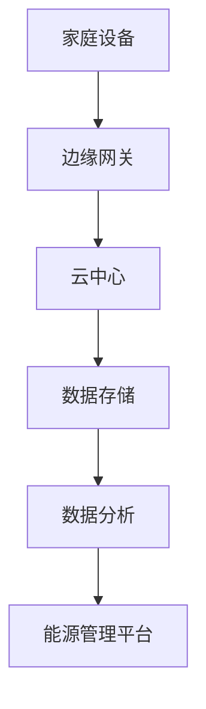
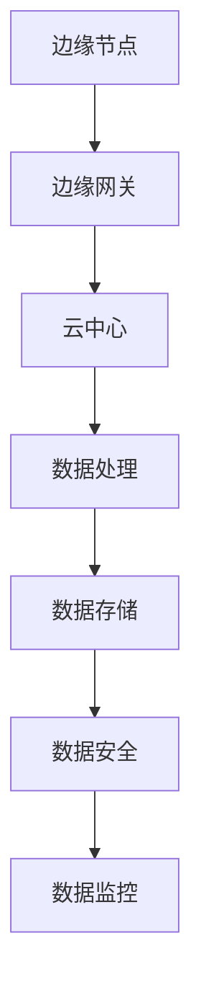
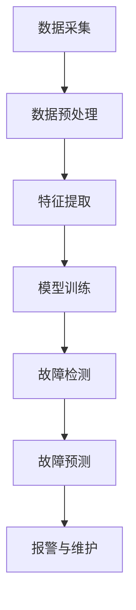

                 

### 《边缘计算在智能家居能源管理中的应用》

> 关键词：边缘计算、智能家居、能源管理、实时监控、智能调度、故障检测

> 摘要：随着智能家居设备的普及，能源管理成为家庭用户和能源公司关注的焦点。边缘计算作为一种新型的计算模式，在智能家居能源管理中展现出巨大的应用潜力。本文将探讨边缘计算在智能家居能源管理中的背景、核心技术、应用场景、最佳实践以及未来展望，旨在为行业提供理论支持和实践指导。

## 第一部分：边缘计算概述与智能家居能源管理背景

### 第1章：边缘计算的概念与演进

#### 1.1 边缘计算的起源与发展

**1.1.1 边缘计算的定义**

边缘计算（Edge Computing）是指在网络边缘处进行数据处理、存储和计算的一种计算模式。与传统云计算不同，边缘计算将数据处理和计算能力分布到网络边缘节点，从而降低网络延迟、提高响应速度，并减少数据传输量。

**1.1.2 边缘计算的发展历程**

边缘计算起源于物联网（IoT）和移动计算领域。随着物联网设备的增多和移动设备的普及，人们开始关注如何在网络边缘处理大量数据，从而提高应用性能。近年来，随着5G、人工智能等新技术的兴起，边缘计算逐渐成为研究热点。

**1.1.3 边缘计算与传统云计算的差异**

| 特点 | 边缘计算 | 传统云计算 |
| --- | --- | --- |
| 数据处理位置 | 网络边缘 | 数据中心 |
| 延迟 | 低 | 高 |
| 响应速度 | 快 | 慢 |
| 数据传输量 | 小 | 大 |

#### 1.2 智能家居能源管理的挑战

**1.2.1 智能家居概述**

智能家居是指通过互联网、物联网等技术将家庭设备连接起来，实现自动化控制和远程监控。智能家居设备包括智能灯泡、智能空调、智能冰箱等。

**1.2.2 智能家居能源管理的现状**

当前，智能家居能源管理主要集中在以下几个方面：

1. 实时监控：通过传感器获取家庭能源使用数据，实时监控能源消耗情况。
2. 智能调度：根据能源使用情况和天气条件，自动调整设备运行状态，降低能耗。
3. 故障检测与预测维护：通过数据分析和机器学习技术，及时发现设备故障并预测维护需求。

**1.2.3 边缘计算在智能家居能源管理中的优势**

1. 降低延迟：边缘计算将数据处理和计算能力分布到网络边缘，降低数据传输距离，从而降低网络延迟。
2. 提高响应速度：边缘计算可以实时处理家庭能源数据，快速响应设备运行状态调整。
3. 节省带宽：边缘计算减少数据传输量，降低网络带宽需求。

#### 1.3 边缘计算在智能家居能源管理中的前景

**1.3.1 应用领域**

1. 智能照明：通过边缘计算实现智能调节灯光亮度，降低能耗。
2. 智能空调：根据室内外温度和用户需求，实时调整空调运行状态。
3. 智能家电：通过边缘计算实现智能家居设备的智能调度和协同工作。

**1.3.2 技术发展趋势**

1. 人工智能与边缘计算结合：利用人工智能技术，提高边缘计算在智能家居能源管理中的智能化水平。
2. 物联网与边缘计算融合：通过物联网技术，实现更多智能家居设备与边缘计算节点的连接。
3. 5G与边缘计算发展：5G技术的普及将进一步推动边缘计算在智能家居能源管理中的应用。

**1.3.3 面临的挑战**

1. 网络延迟与带宽限制：边缘计算节点分布广泛，网络延迟和带宽限制仍然是一个挑战。
2. 数据隐私与安全性：智能家居设备涉及用户隐私，如何保护数据安全和用户隐私是一个重要问题。

#### 1.4 本章小结

边缘计算作为一种新兴的计算模式，在智能家居能源管理中具有广泛的应用前景。通过降低网络延迟、提高响应速度和节省带宽，边缘计算有望解决智能家居能源管理中面临的诸多挑战。

## 第二部分：边缘计算核心技术与应用场景

### 第2章：边缘计算核心技术

#### 2.1 边缘计算架构

**2.1.1 边缘计算框架**

边缘计算框架通常包括以下三个层次：

1. **边缘节点**：边缘计算的基础设施，包括智能设备、传感器等。
2. **边缘网关**：负责边缘节点的数据采集、预处理和传输。
3. **云中心**：负责边缘计算节点的数据存储、分析和处理。

**2.1.2 边缘计算节点**

边缘计算节点包括以下几类：

1. **智能设备**：具有计算能力和通信功能的设备，如智能灯泡、智能空调等。
2. **传感器**：用于监测环境参数，如温度、湿度、光照等。
3. **边缘网关**：负责边缘节点的数据传输和协同工作。

**2.1.3 边缘计算网络**

边缘计算网络通常采用以下几种拓扑结构：

1. **星形拓扑**：边缘节点直接连接到边缘网关，适用于小型智能家居系统。
2. **树形拓扑**：边缘节点通过层级结构连接，适用于大型智能家居系统。
3. **网状拓扑**：边缘节点之间直接连接，提高网络的稳定性和可靠性。

#### 2.2 边缘计算技术

**2.2.1 边缘计算硬件**

1. **处理器与存储技术**：边缘计算硬件需要高性能、低功耗的处理器和存储设备。
2. **网络设备与协议**：边缘计算网络需要支持高速、低延迟的数据传输协议。

**2.2.2 边缘计算软件**

1. **操作系统与中间件**：边缘计算软件需要支持实时操作系统和中间件，提高系统的稳定性和可靠性。
2. **边缘计算平台与应用**：边缘计算平台提供开发环境和工具，方便开发者构建应用。

#### 2.3 边缘计算安全性

**2.3.1 数据安全与隐私保护**

1. **数据加密**：对传输和存储的数据进行加密，确保数据安全。
2. **访问控制**：通过身份认证和访问控制策略，确保只有授权用户可以访问数据。

**2.3.2 边缘计算安全挑战与对策**

1. **网络攻击与防御**：通过防火墙、入侵检测等技术，提高边缘计算网络的安全性。
2. **设备安全**：对边缘计算设备进行安全加固，防止设备被攻击或篡改。

#### 2.4 本章小结

边缘计算技术是实现智能家居能源管理的关键。通过完善的架构、先进的硬件和软件技术以及严格的安全性保障，边缘计算有望在智能家居能源管理中发挥重要作用。

### 第3章：边缘计算在智能家居能源管理中的应用场景

#### 3.1 智能家居设备与能源管理

**3.1.1 智能家居设备概述**

智能家居设备包括智能灯泡、智能空调、智能冰箱等，它们通过传感器、控制器和通信模块实现家庭设备的自动化控制。

**3.1.2 智能家居能源管理需求**

智能家居能源管理需求主要包括：

1. **实时监控**：实时监测家庭能源使用情况，了解能源消耗情况。
2. **智能调度**：根据能源使用情况和天气条件，自动调整设备运行状态，降低能耗。
3. **故障检测与预测维护**：通过数据分析和机器学习技术，及时发现设备故障并预测维护需求。

#### 3.2 边缘计算在智能家居能源管理中的应用

**3.2.1 实时监控与数据分析**

边缘计算可以在网络边缘实时处理智能家居设备的数据，实现实时监控。通过对数据进行分析，可以了解家庭能源使用情况，为智能调度提供依据。

**3.2.2 智能调度与优化**

边缘计算可以根据实时监控数据，自动调整智能家居设备的运行状态，实现智能调度。例如，根据室内外温度，智能调节空调温度，降低能耗。

**3.2.3 故障检测与预测维护**

边缘计算可以通过数据分析和机器学习技术，实现故障检测和预测维护。例如，通过分析空调的运行数据，预测空调的故障发生时间，提前进行维护。

#### 3.3 应用案例分享

**3.3.1 案例一：智能电网边缘计算应用**

智能电网是边缘计算在能源管理中的重要应用场景。通过边缘计算，可以实现对电力负荷的实时监测和智能调度，提高电力供应的稳定性和效率。

**3.3.2 案例二：智能家居能源管理平台**

智能家居能源管理平台利用边缘计算技术，实现家庭能源的实时监控、智能调度和故障检测。通过该平台，用户可以远程监控家庭能源使用情况，并根据需求进行设备控制。

#### 3.4 本章小结

边缘计算在智能家居能源管理中具有广泛的应用场景。通过实时监控、智能调度和故障检测，边缘计算可以提高家庭能源管理的效率，降低能耗，实现绿色环保。

## 第三部分：边缘计算在智能家居能源管理中的最佳实践

### 第4章：边缘计算在智能家居能源管理中的最佳实践

#### 4.1 项目规划与实施

**4.1.1 项目需求分析**

在项目规划阶段，需要对智能家居能源管理的需求进行详细分析。包括：

1. 实时监控需求：确定需要监测的家庭能源使用数据，如电表数据、水表数据等。
2. 智能调度需求：根据家庭能源使用情况和天气条件，制定智能调度策略。
3. 故障检测与预测维护需求：确定需要监测的设备故障指标，制定预测维护策略。

**4.1.2 架构设计与设备选型**

根据需求分析结果，设计智能家居能源管理的整体架构，包括：

1. 边缘计算节点：选择适合的智能设备、传感器和边缘网关。
2. 数据采集与处理：设计数据采集和预处理方案，确保数据质量和实时性。
3. 网络通信：设计网络通信方案，确保数据传输的稳定性和安全性。

**4.1.3 数据采集与处理**

数据采集与处理是智能家居能源管理的核心环节。包括：

1. 数据采集：通过传感器和智能设备实时采集家庭能源使用数据。
2. 数据预处理：对采集到的数据进行过滤、清洗和格式转换，确保数据质量和一致性。
3. 数据存储：设计数据存储方案，确保数据的安全性和可靠性。

#### 4.2 系统集成与调试

**4.2.1 系统集成流程**

系统集成是智能家居能源管理项目实施的重要环节。包括：

1. 设备连接：将智能设备、传感器和边缘网关连接到网络，确保数据传输畅通。
2. 软件部署：安装和配置边缘计算平台和应用软件，确保系统的正常运行。
3. 调试与优化：对系统进行功能测试和性能优化，确保系统的稳定性和可靠性。

**4.2.2 系统调试与优化**

系统调试与优化是确保智能家居能源管理系统能够稳定运行的关键。包括：

1. 功能测试：对系统各个功能模块进行测试，确保功能的正确实现。
2. 性能优化：对系统性能进行优化，提高系统的响应速度和吞吐量。
3. 故障排除：及时发现和解决系统故障，确保系统的正常运行。

#### 4.3 挑战与解决方案

**4.3.1 网络延迟与带宽限制**

边缘计算节点分布广泛，网络延迟和带宽限制是一个挑战。解决方案包括：

1. 选择合适的网络协议：采用低延迟、高带宽的网络协议，如5G。
2. 数据压缩：对传输的数据进行压缩，降低带宽需求。
3. 网络优化：优化网络拓扑结构，提高数据传输速度。

**4.3.2 数据隐私与安全性**

智能家居设备涉及用户隐私，数据隐私和安全性是一个重要问题。解决方案包括：

1. 数据加密：对传输和存储的数据进行加密，确保数据安全。
2. 访问控制：通过身份认证和访问控制策略，确保只有授权用户可以访问数据。
3. 安全监控：对系统进行实时监控，及时发现和防范安全威胁。

**4.3.3 系统可靠性与稳定性**

系统可靠性与稳定性是智能家居能源管理系统的关键。解决方案包括：

1. 设备冗余：采用冗余设计，提高系统的可靠性。
2. 故障检测与恢复：对系统进行实时监控，及时发现和恢复故障。
3. 性能优化：对系统进行性能优化，提高系统的稳定性和可靠性。

#### 4.4 案例分析

**4.4.1 案例一：智能家居能源管理项目案例**

某智能家居能源管理项目通过对家庭能源使用数据的实时监控、智能调度和故障检测，实现了家庭能源的优化管理。项目效果如下：

1. 能源消耗降低：通过智能调度，实现了能源消耗的降低。
2. 设备运行状态稳定：通过故障检测与预测维护，确保了设备的正常运行。
3. 用户满意度提高：用户可以通过手机APP实时了解家庭能源使用情况，提高了用户满意度。

**4.4.2 案例二：智能电网边缘计算应用案例**

某智能电网项目通过边缘计算技术，实现了电力负荷的实时监测和智能调度，提高了电力供应的稳定性和效率。项目效果如下：

1. 电力负荷优化：通过实时监测和智能调度，实现了电力负荷的优化。
2. 电力供应稳定：通过故障检测与预测维护，确保了电力供应的稳定性。
3. 能源效率提高：通过智能调度，实现了能源效率的提高。

#### 4.5 本章小结

边缘计算在智能家居能源管理中具有广泛的应用前景。通过项目规划与实施、系统集成与调试以及挑战与解决方案，可以确保智能家居能源管理系统的稳定运行，提高能源管理效率，实现绿色环保。

## 第四部分：未来展望与趋势

### 第5章：边缘计算在智能家居能源管理中的未来展望

#### 5.1 技术发展趋势

**5.1.1 人工智能与边缘计算结合**

随着人工智能技术的发展，边缘计算与人工智能的结合将成为趋势。通过在边缘节点部署人工智能算法，可以实现更智能、更高效的智能家居能源管理。

**5.1.2 物联网与边缘计算融合**

物联网技术的普及将进一步推动边缘计算的发展。通过在物联网设备中嵌入边缘计算功能，可以实现更加广泛的智能家居能源管理应用。

**5.1.3 5G与边缘计算发展**

5G技术的普及将为边缘计算提供更高的网络带宽和更低的延迟，从而推动边缘计算在智能家居能源管理中的应用。

#### 5.2 应用前景

**5.2.1 新兴应用领域**

边缘计算在智能家居能源管理中具有广泛的应用前景，包括智能照明、智能空调、智能家电等。未来，随着技术的进步，还将出现更多新兴应用领域。

**5.2.2 社会经济影响**

边缘计算在智能家居能源管理中的应用将带来显著的社会经济影响。通过提高能源管理效率，可以降低能源消耗，减少环境污染，促进可持续发展。

#### 5.3 面临的挑战与机遇

**5.3.1 技术难题**

边缘计算在智能家居能源管理中面临诸多技术难题，如数据安全、隐私保护、网络延迟等。需要持续的技术创新和研发来解决这些问题。

**5.3.2 政策法规**

政策法规的完善对边缘计算在智能家居能源管理中的应用具有重要意义。需要政府和行业共同努力，制定相关政策和标准，推动技术的发展。

**5.3.3 市场竞争**

边缘计算在智能家居能源管理中具有广阔的市场前景，但也面临激烈的市场竞争。企业需要不断创新，提高产品质量和性能，才能在市场中脱颖而出。

#### 5.4 未来发展方向

**5.4.1 创新研发**

持续进行技术创新和研发，推动边缘计算在智能家居能源管理中的应用。

**5.4.2 行业合作**

加强行业合作，推动产业链上下游企业共同发展，实现资源共享和协同创新。

**5.4.3 人才培养**

加强人才培养，培养更多具备边缘计算和智能家居能源管理专业知识的优秀人才，为行业发展提供人才支持。

#### 5.5 本章小结

边缘计算在智能家居能源管理中具有巨大的发展潜力。通过技术创新、政策支持和行业合作，有望实现更加智能、高效、绿色的智能家居能源管理。

## 附录

### 附录A：术语表

- **边缘计算**：在网络边缘处进行数据处理、存储和计算的一种计算模式。
- **智能家居**：通过互联网、物联网等技术将家庭设备连接起来，实现自动化控制和远程监控。
- **能源管理**：对家庭能源的使用进行监测、调度和优化，以提高能源使用效率和减少能源消耗。

## 结束语

边缘计算在智能家居能源管理中的应用，不仅带来了技术上的革新，也推动了能源管理理念的变革。随着技术的不断进步和应用场景的不断拓展，边缘计算在智能家居能源管理中将发挥越来越重要的作用。让我们期待未来，共同见证边缘计算带来的美好变革。

### 作者信息

- 作者：AI天才研究院/AI Genius Institute & 禅与计算机程序设计艺术 /Zen And The Art of Computer Programming

---

## 结构化数据表示

### 嵌入式Mermaid图

以下是本文中的Mermaid图，展示在文中相应位置：

#### 智能家居能源管理架构图

#### 边缘计算架构图

#### 故障检测算法流程图

### 数学公式

以下是文中出现的数学公式：

#### 特定公式

$$
E = mc^2
$$

#### 段落内公式

$1 + 1 = 2$

这些结构化数据表示方法有助于读者更好地理解文章内容，同时也为文本内容的可读性和可检索性提供了增强。通过Mermaid图，读者可以直观地理解系统架构和算法流程；通过数学公式，读者可以更清晰地理解文章中的技术细节。这些元素共同构成了一个丰富、严谨的技术博客文章。

