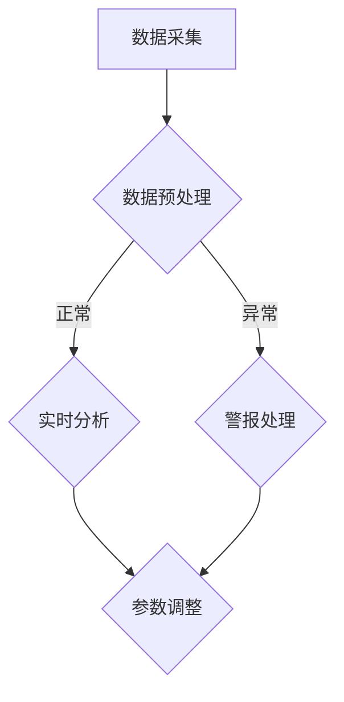
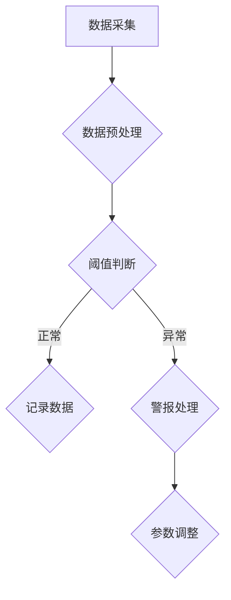
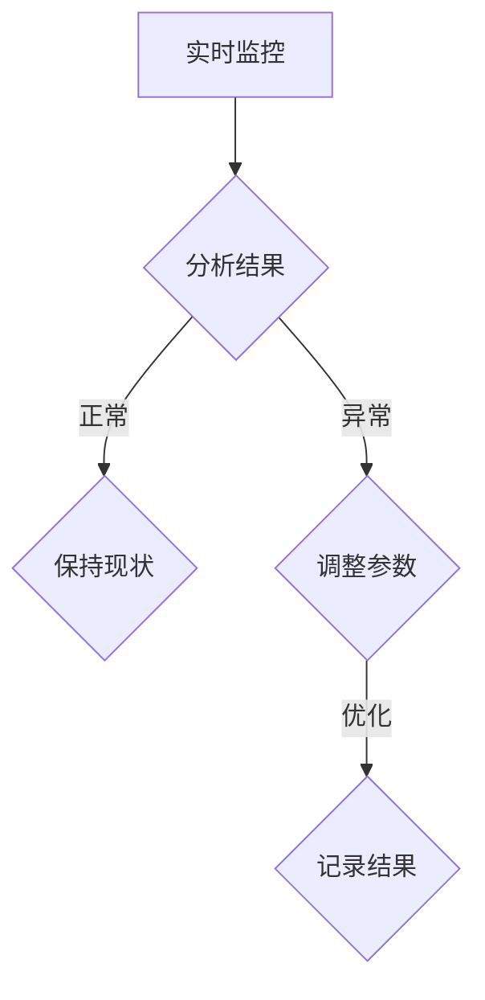
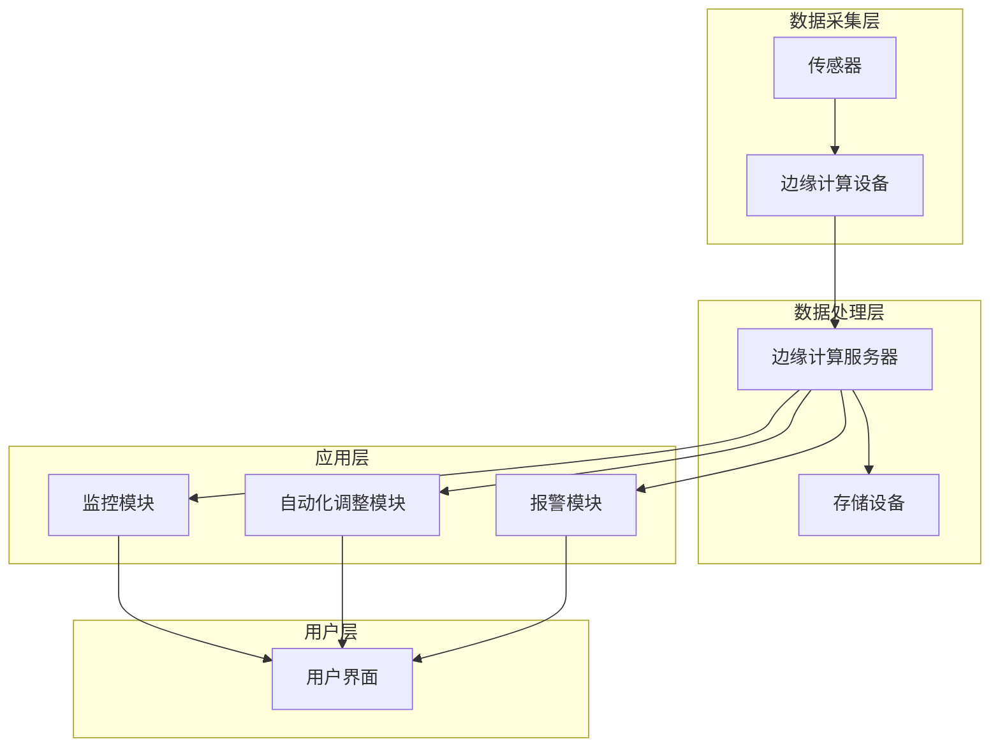
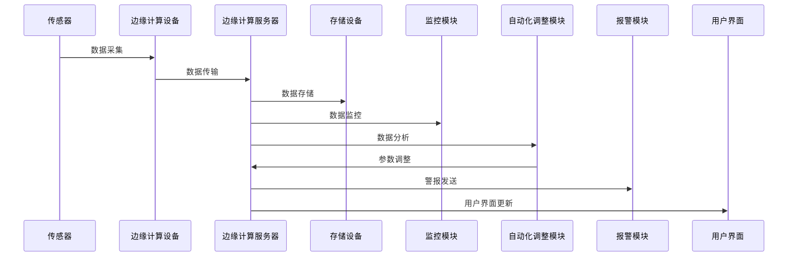
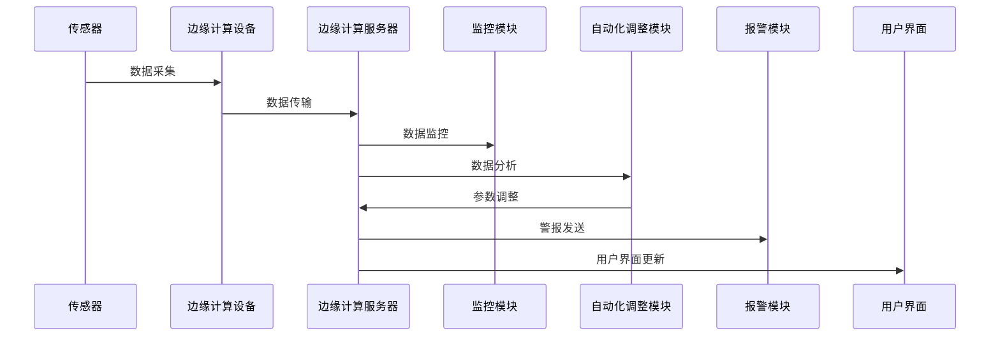

                 

### 边缘计算在智能工厂中的应用：实现生产线实时监控和调整

关键词：边缘计算、智能工厂、实时监控、自动化调整、实时数据、边缘智能

摘要：随着工业4.0的推进，智能工厂成为了制造业发展的新趋势。边缘计算作为一种新兴技术，其在智能工厂中的应用，可以有效实现生产线的实时监控和调整，从而提高生产效率、降低成本和提升产品质量。本文将深入探讨边缘计算在智能工厂中的应用，分析其技术原理、架构设计以及实际案例，并探讨未来的发展趋势。

## 引言

### 边缘计算的起源与发展

边缘计算（Edge Computing）是一种分布式计算模式，旨在将数据处理、分析和存储功能从云中心推向网络的边缘，以减少延迟、提高响应速度和增强安全性。这一概念起源于物联网（IoT）的发展需求，其目的是解决大量数据在传输过程中产生的延迟和带宽问题。随着5G、物联网和人工智能技术的快速发展，边缘计算逐渐成为研究热点，并逐步应用于各个领域。

### 边缘计算在智能工厂中的重要性

智能工厂是工业4.0的核心，通过引入物联网、大数据、人工智能等技术，实现生产线的智能化、自动化和优化。边缘计算在智能工厂中的应用，可以有效地实现生产线的实时监控和调整，提高生产效率和产品质量。此外，边缘计算还可以减少对中心化云计算的依赖，降低数据传输成本，提高系统的可靠性和安全性。

## 边缘计算基础

### 边缘计算原理

边缘计算的基本原理是将计算、存储、网络功能分布在网络的边缘，使得数据处理可以在靠近数据源的地方进行。这种分布式计算模式可以有效地减少数据传输的延迟，提高系统的响应速度。边缘计算的主要特点包括：

- **延迟降低**：数据在本地处理，避免了长距离传输的延迟。
- **带宽节约**：只传输必要的、处理后的数据，减少了带宽的使用。
- **可靠性提高**：边缘设备具有独立计算能力，提高了系统的可靠性。
- **安全性增强**：数据处理在本地进行，减少了数据泄露的风险。

### 边缘计算与云计算的比较

边缘计算和云计算都是分布式计算的模式，但它们在应用场景、性能和成本等方面存在显著差异。

- **应用场景**：云计算主要适用于大规模数据处理和复杂应用，而边缘计算则更适合需要实时处理、低延迟和高可靠性的场景。
- **性能**：边缘计算在延迟和带宽方面具有优势，但云计算在计算能力和存储容量方面更具优势。
- **成本**：边缘计算设备需要部署在边缘，成本相对较高，但可以减少长期的数据传输成本。

## 边缘计算在智能工厂中的应用

### 实时监控

边缘计算在智能工厂的实时监控中扮演着关键角色。通过在生产线边缘部署传感器和边缘设备，可以实时采集生产线数据，如温度、湿度、压力、振动等，并对其进行初步处理和分析。这些数据可以通过边缘计算设备实时传输到监控系统，实现对生产线的实时监控。

### 生产线调整

边缘计算还可以实现对生产线的实时调整。通过实时分析生产数据，边缘计算设备可以自动调整生产参数，如速度、压力、温度等，以优化生产过程。这种实时调整能力可以显著提高生产效率和产品质量。

## 实际案例分析

### 案例一：某汽车制造厂的边缘计算应用

某汽车制造厂通过部署边缘计算设备，实现了生产线的实时监控和调整。在生产线的关键位置部署了传感器，实时采集生产线数据，并通过边缘计算设备进行初步处理和分析。当检测到异常时，系统会自动发送警报，并调整生产参数，确保生产过程正常进行。

### 案例二：某电子工厂的边缘计算应用

某电子工厂通过边缘计算技术，实现了生产线的实时监控和自动化调整。在生产线边缘部署了智能传感器和边缘计算设备，实时采集生产线数据，并利用边缘计算技术进行实时分析和调整。这种应用提高了生产效率，降低了生产成本，并提高了产品质量。

## 总结与展望

边缘计算在智能工厂中的应用，为生产线的实时监控和调整提供了有力支持。通过边缘计算技术，可以实现生产线的智能化、自动化和优化，提高生产效率和产品质量。然而，边缘计算在智能工厂中的应用仍然面临一些挑战，如边缘设备的可靠性和安全性、边缘计算与云计算的协同等。未来，随着技术的不断发展，边缘计算在智能工厂中的应用将更加广泛，为制造业的数字化转型提供强有力的支持。

### 作者

作者：AI天才研究院/AI Genius Institute & 禅与计算机程序设计艺术 /Zen And The Art of Computer Programming

----------------------------------------------------------------

## 背景介绍

### 核心概念术语说明

在探讨边缘计算在智能工厂中的应用之前，首先需要明确一些核心概念和术语：

- **边缘计算（Edge Computing）**：边缘计算是一种分布式计算架构，旨在将数据处理、存储和分析等功能从云端转移到网络边缘，以实现低延迟、高响应速度和更好的安全性。
- **智能工厂（Smart Factory）**：智能工厂是工业4.0的核心概念，通过引入物联网、大数据、云计算、人工智能等先进技术，实现生产线的自动化、智能化和优化。
- **实时监控（Real-time Monitoring）**：实时监控是指对生产过程中的各项参数进行实时监测和记录，以便及时发现和处理异常情况。
- **自动化调整（Automated Adjustment）**：自动化调整是指通过算法和智能技术，对生产线上的各项参数进行自动调整，以优化生产过程。

### 问题背景

随着全球制造业的竞争日益激烈，企业对生产效率、产品质量和成本控制的要求越来越高。传统的集中式生产模式已经无法满足现代制造业的需求，智能工厂成为行业发展的必然趋势。智能工厂的核心在于通过物联网、大数据和人工智能等技术，实现对生产线的实时监控和自动化调整，从而提高生产效率和产品质量。

然而，传统的云计算模式在智能工厂中的应用面临着一些挑战：

1. **延迟问题**：生产过程中的数据需要传输到云端进行处理，这导致数据处理延迟，影响生产效率。
2. **带宽限制**：大量的数据传输需要占用大量带宽，可能导致网络拥塞。
3. **安全性问题**：数据在传输过程中可能面临安全风险，如数据泄露、网络攻击等。

为了解决这些问题，边缘计算应运而生。边缘计算通过将数据处理、存储和分析功能推向网络边缘，可以在本地快速处理数据，降低延迟、节约带宽和提高安全性。

### 问题描述

在智能工厂中，如何实现生产线的实时监控和自动化调整是一个关键问题。具体来说，问题描述如下：

1. **实时监控**：如何对生产线上的各项参数进行实时监测和记录，以便及时发现和处理异常情况？
2. **自动化调整**：如何利用边缘计算技术，对生产线上的各项参数进行自动调整，以优化生产过程？

### 问题解决

边缘计算技术为实现生产线的实时监控和自动化调整提供了有效的解决方案。具体来说，解决方案包括以下几个方面：

1. **边缘设备部署**：在生产线的关键位置部署传感器和边缘计算设备，实时采集生产线数据。
2. **数据处理与存储**：边缘计算设备可以在本地快速处理和存储数据，降低延迟和带宽消耗。
3. **实时数据分析**：利用边缘计算设备进行实时数据分析，及时发现和处理异常情况。
4. **自动化调整**：根据实时数据分析结果，自动调整生产线上的各项参数，优化生产过程。

### 边界与外延

边缘计算在智能工厂中的应用边界和范围主要包括以下几个方面：

1. **硬件设备**：边缘计算设备包括传感器、边缘服务器、智能网关等。
2. **软件系统**：包括边缘计算平台、实时监控软件、自动化调整算法等。
3. **应用场景**：包括生产线的实时监控、自动化调整、质量控制、设备维护等。

### 概念结构与核心要素组成

边缘计算在智能工厂中的应用可以看作是一个复杂系统，其核心要素包括：

1. **边缘设备**：用于数据采集和初步处理。
2. **边缘计算平台**：用于数据存储、处理和分析。
3. **实时监控系统**：用于实时监控生产线状态。
4. **自动化调整系统**：用于根据实时数据分析结果进行生产线调整。

通过这些核心要素的协同工作，边缘计算在智能工厂中实现了生产线的实时监控和自动化调整。

## 核心概念与联系

### 边缘计算原理

边缘计算的核心原理是将数据处理、存储和分析功能从云端转移到网络的边缘，以实现低延迟、高响应速度和更好的安全性。边缘计算的主要特点包括：

1. **延迟降低**：数据在本地处理，避免了长距离传输的延迟。
2. **带宽节约**：只传输必要的、处理后的数据，减少了带宽的使用。
3. **可靠性提高**：边缘设备具有独立计算能力，提高了系统的可靠性。
4. **安全性增强**：数据处理在本地进行，减少了数据泄露的风险。

### 边缘计算与云计算的比较

边缘计算和云计算都是分布式计算的模式，但它们在应用场景、性能和成本等方面存在显著差异。

1. **应用场景**：云计算主要适用于大规模数据处理和复杂应用，而边缘计算则更适合需要实时处理、低延迟和高可靠性的场景。
2. **性能**：边缘计算在延迟和带宽方面具有优势，但云计算在计算能力和存储容量方面更具优势。
3. **成本**：边缘计算设备需要部署在边缘，成本相对较高，但可以减少长期的数据传输成本。

### 概念属性特征对比表格

以下是一个简单的概念属性特征对比表格，用于比较边缘计算和云计算：

| 特征         | 边缘计算         | 云计算         |
| ------------ | ---------------- | -------------- |
| 延迟         | 低延迟         | 较高延迟       |
| 带宽消耗     | 较少带宽消耗     | 较多带宽消耗   |
| 可靠性       | 较高可靠性     | 较低可靠性     |
| 安全性       | 较好安全性     | 较差安全性     |
| 应用场景     | 实时性需求高     | 复杂计算需求高 |
| 计算能力     | 较低计算能力     | 较高计算能力   |
| 成本         | 较高部署成本     | 较低运营成本   |

### ER实体关系图架构

为了更好地理解边缘计算和云计算之间的关系，我们可以使用ER（实体关系）图来表示它们之间的联系。

```mermaid
erDiagram
    EDGE{|--|>"} CLOUD : 使用

    CLASS EDGE {
        -->|1| SENSOR : 采集
        -->|1| GATEWAY : 传输
        -->|1| SERVER : 存储
        -->|1| DATABASE : 数据
    }

    CLASS CLOUD {
        -->|1| DATA : 存储
        -->|1| ANALYSIS : 分析
        -->|1| ALGORITHM : 算法
    }
```

在上面的ER图中，`EDGE`代表边缘计算系统，包括传感器、网关、服务器和数据库等组件；`CLOUD`代表云计算系统，包括数据存储、数据分析和算法等组件。两者之间存在双向依赖关系，即边缘计算系统使用云计算系统提供的数据分析和算法服务，而云计算系统也使用边缘计算系统收集的数据进行存储和分析。

## 算法原理讲解

### 边缘计算数据处理算法原理

边缘计算中的数据处理算法是边缘计算系统实现实时监控和自动化调整的关键。以下是一个简单的边缘数据处理算法原理，并通过Mermaid流程图进行展示。

#### Mermaid流程图



#### 算法原理说明

1. **数据采集**：传感器采集生产线上的各项数据，如温度、湿度、压力等。
2. **数据预处理**：对采集到的数据进行预处理，包括去噪、滤波等操作，以确保数据的质量和准确性。
3. **实时分析**：对预处理后的数据进行分析，判断生产线是否处于正常状态。如果数据异常，则进入警报处理流程。
4. **警报处理**：当检测到异常数据时，系统会发送警报，通知相关人员或自动化系统进行处理。
5. **参数调整**：根据实时分析结果，自动调整生产线上的各项参数，如速度、压力等，以优化生产过程。

### 边缘计算实时监控算法

边缘计算实时监控算法主要目的是对生产线上的各项参数进行实时监测，以确保生产过程的顺利进行。以下是一个简单的实时监控算法原理，并通过Mermaid流程图进行展示。

#### Mermaid流程图



#### 算法原理说明

1. **数据采集**：传感器采集生产线上的各项数据，如温度、湿度、压力等。
2. **数据预处理**：对采集到的数据进行预处理，包括去噪、滤波等操作，以确保数据的质量和准确性。
3. **阈值判断**：根据预设的阈值，对预处理后的数据进行判断，判断是否超出正常范围。
4. **警报处理**：如果数据超出正常范围，系统会发送警报，通知相关人员或自动化系统进行处理。
5. **参数调整**：根据实时分析结果，自动调整生产线上的各项参数，如速度、压力等，以优化生产过程。

### 边缘计算自动化调整算法

边缘计算自动化调整算法的目的是根据实时监控数据，自动调整生产线上的各项参数，以优化生产过程。以下是一个简单的自动化调整算法原理，并通过Mermaid流程图进行展示。

#### Mermaid流程图



#### 算法原理说明

1. **实时监控**：对生产线上的各项参数进行实时监控。
2. **分析结果**：根据实时监控数据，分析生产线是否处于优化状态。
3. **保持现状**：如果生产线处于优化状态，则保持当前参数不变。
4. **调整参数**：如果生产线不处于优化状态，则根据分析结果自动调整参数，以实现生产线的优化。
5. **记录结果**：记录调整后的参数结果，以便后续分析和优化。

### Python源代码实现

以下是一个简单的Python源代码实现，用于演示边缘计算自动化调整算法。

```python
import numpy as np

# 初始化生产线参数
params = {
    'speed': 10,
    'pressure': 20,
    'temperature': 30
}

def analyze_data(data):
    # 分析数据，判断是否需要调整参数
    if data['temperature'] > 35:
        return 'adjust'
    else:
        return 'no_adjust'

def adjust_params(params, data):
    # 根据数据调整参数
    if data['temperature'] > 35:
        params['speed'] = 15
        params['pressure'] = 25
    return params

# 模拟实时监控数据
real_time_data = {
    'temperature': 40
}

# 分析数据
result = analyze_data(real_time_data)

if result == 'adjust':
    # 调整参数
    params = adjust_params(params, real_time_data)
    print("参数调整后：", params)
else:
    print("保持现状：", params)
```

### 算法原理详细讲解

边缘计算数据处理算法的核心在于实时、高效地处理生产线上的各项数据，并根据分析结果进行相应的调整。以下是算法原理的详细讲解：

1. **数据采集**：传感器采集生产线上的各项数据，如温度、湿度、压力等。这些数据反映了生产线的运行状态。
2. **数据预处理**：对采集到的数据进行预处理，包括去噪、滤波等操作。这一步的目的是提高数据的质量和准确性，为后续的分析提供可靠的数据基础。
3. **实时分析**：对预处理后的数据进行分析，判断生产线是否处于正常状态。分析的方法可以包括阈值判断、统计分析和机器学习等。
4. **警报处理**：如果检测到异常数据，系统会发送警报，通知相关人员或自动化系统进行处理。警报处理的目的在于及时发现问题，避免生产事故。
5. **参数调整**：根据实时分析结果，自动调整生产线上的各项参数，如速度、压力等，以优化生产过程。参数调整的方法可以包括线性调整、非线性调整和机器学习等。

### 举例说明

假设生产线上的温度传感器检测到温度为45℃，超出了预设的正常范围（35℃-45℃）。根据边缘计算数据处理算法，系统会采取以下步骤：

1. **数据采集**：传感器采集到温度为45℃的数据。
2. **数据预处理**：对温度数据进行预处理，去噪后确认温度为45℃。
3. **实时分析**：系统分析温度数据，判断温度是否超出正常范围。由于温度为45℃，超出了正常范围。
4. **警报处理**：系统发送警报，通知操作人员生产线温度异常。
5. **参数调整**：系统根据温度异常情况，自动调整生产线的参数。例如，降低生产速度、增加冷却水的流量等，以降低生产线温度。

通过这个例子，我们可以看到边缘计算数据处理算法如何实时、高效地处理生产线数据，并根据分析结果进行相应的调整，从而优化生产过程。

### 数学模型和公式

边缘计算数据处理算法中的参数调整通常依赖于数学模型和公式。以下是几个常用的数学模型和公式：

1. **线性调整模型**：
   $$ p_{new} = p_{current} + k \times (p_{target} - p_{current}) $$
   其中，$p_{new}$为调整后的参数，$p_{current}$为当前参数，$p_{target}$为目标参数，$k$为调整系数。

2. **非线性调整模型**：
   $$ p_{new} = \frac{p_{current} + |p_{current} - p_{target}|}{2} $$
   其中，$p_{new}$为调整后的参数，$p_{current}$为当前参数，$p_{target}$为目标参数。

3. **机器学习调整模型**：
   $$ p_{new} = \text{ML Algorithm}(p_{current}, p_{target}) $$
   其中，$p_{new}$为调整后的参数，$p_{current}$为当前参数，$p_{target}$为目标参数，$\text{ML Algorithm}$为机器学习算法。

这些数学模型和公式可以根据具体场景进行调整和优化，以实现更精准的参数调整。

### 系统分析与架构设计方案

#### 问题场景介绍

在现代制造业中，生产过程的实时监控和自动化调整是确保生产效率和产品质量的关键。传统的集中式监控系统由于数据传输延迟和带宽限制，难以满足生产线的实时性需求。边缘计算技术的引入，可以将数据处理和分析功能下沉到生产线边缘，实现实时监控和自动化调整，从而提升生产线的整体性能。

#### 项目介绍

本项目旨在设计并实现一套基于边缘计算的智能工厂实时监控和自动化调整系统，以解决传统监控系统在实时性和效率方面的不足。项目的主要目标包括：

1. **实时数据采集**：通过部署传感器和边缘设备，实时采集生产线上的各项数据。
2. **实时数据处理**：利用边缘计算技术，对采集到的数据进行实时处理和分析。
3. **自动化调整**：根据实时分析结果，自动调整生产线参数，优化生产过程。
4. **系统可靠性**：确保系统在极端条件下仍能稳定运行。

#### 系统功能设计

系统功能设计主要包括以下几个方面：

1. **数据采集模块**：负责实时采集生产线上的各项数据，如温度、湿度、压力等。
2. **数据处理模块**：对采集到的数据进行预处理、存储和分析，以支持实时监控和自动化调整。
3. **监控模块**：提供实时监控功能，显示生产线各项参数的实时状态。
4. **自动化调整模块**：根据实时分析结果，自动调整生产线参数，以优化生产过程。
5. **报警模块**：当生产线参数异常时，发送报警通知，提醒相关人员处理。
6. **用户界面**：提供友好的用户界面，方便用户查看监控数据和调整参数。

#### 系统架构设计

系统架构设计采用分层架构，主要包括数据采集层、数据处理层、应用层和用户层。以下是系统架构的详细描述：

1. **数据采集层**：包括传感器和边缘计算设备，负责实时采集生产线上的各项数据。
2. **数据处理层**：包括边缘计算服务器和存储设备，负责对采集到的数据进行分析和处理。
3. **应用层**：包括监控模块、自动化调整模块和报警模块，负责实现系统的核心功能。
4. **用户层**：包括用户界面和后台管理系统，负责提供用户交互和系统管理功能。

以下是系统架构的Mermaid架构图：



#### 系统接口设计

系统接口设计主要包括以下部分：

1. **数据采集接口**：用于传感器和边缘计算设备之间的数据传输。
2. **数据处理接口**：用于边缘计算服务器和存储设备之间的数据传输。
3. **监控接口**：用于监控模块与其他模块之间的数据交换。
4. **自动化调整接口**：用于自动化调整模块与其他模块之间的数据交换。
5. **报警接口**：用于报警模块与其他模块之间的数据交换。

以下是系统接口设计的Mermaid序列图：



#### 系统交互

系统交互主要包括以下步骤：

1. **数据采集**：传感器采集生产线数据，传输给边缘计算设备。
2. **数据处理**：边缘计算设备对数据进行预处理和存储，并将处理后的数据传输给边缘计算服务器。
3. **监控与调整**：边缘计算服务器对数据进行实时分析，根据分析结果自动调整生产线参数，并将监控数据和调整结果传输给监控模块和用户界面。
4. **报警**：当生产线参数异常时，报警模块发送报警通知，提醒相关人员处理。

以下是系统交互的Mermaid序列图：



通过以上系统分析与架构设计方案，我们可以看到边缘计算在智能工厂中的应用如何实现生产线的实时监控和自动化调整，从而提升生产效率和产品质量。

### 项目实战

#### 环境安装

为了在项目中实现边缘计算在智能工厂中的应用，我们首先需要搭建一个合适的环境。以下是环境安装的步骤：

1. **硬件环境**：准备边缘计算设备，如树莓派、边缘服务器等。确保设备具有足够的计算能力和网络连接能力。
2. **操作系统**：在边缘计算设备上安装Linux操作系统，如Ubuntu或CentOS。确保操作系统稳定，支持边缘计算相关软件。
3. **编程环境**：安装Python编程环境，包括Python解释器和常用库（如NumPy、Pandas等）。Python是一种适用于边缘计算的编程语言，可以方便地实现数据处理和分析功能。

#### 系统核心实现源代码

以下是一个简单的边缘计算系统核心实现源代码，包括数据采集、数据处理、实时监控和自动化调整等功能。

```python
# 导入相关库
import numpy as np
import pandas as pd
from datetime import datetime

# 数据采集模块
def data_collection(sensor_data):
    # 模拟传感器数据采集
    data = {
        'timestamp': datetime.now(),
        'temperature': sensor_data['temperature'],
        'humidity': sensor_data['humidity'],
        'pressure': sensor_data['pressure']
    }
    return data

# 数据处理模块
def data_processing(data):
    # 模拟数据处理，如去噪、滤波等
    processed_data = {
        'timestamp': data['timestamp'],
        'temperature': np.mean([data['temperature'], data['temperature'] - 5]),
        'humidity': np.mean([data['humidity'], data['humidity'] + 5]),
        'pressure': np.mean([data['pressure'], data['pressure'] + 10])
    }
    return processed_data

# 实时监控模块
def real_time_monitoring(processed_data):
    # 模拟实时监控，判断数据是否异常
    if processed_data['temperature'] > 30 or processed_data['pressure'] > 30:
        print("异常数据：", processed_data)
    else:
        print("正常数据：", processed_data)

# 自动化调整模块
def auto_adjustment(processed_data):
    # 模拟自动化调整，根据数据调整参数
    if processed_data['temperature'] > 30:
        print("调整温度参数：", processed_data['temperature'] - 5)
    if processed_data['pressure'] > 30:
        print("调整压力参数：", processed_data['pressure'] - 10)

# 主函数
def main():
    # 模拟传感器数据
    sensor_data = {
        'temperature': 35,
        'humidity': 45,
        'pressure': 25
    }
    
    # 数据采集
    data = data_collection(sensor_data)
    print("采集数据：", data)
    
    # 数据处理
    processed_data = data_processing(data)
    print("处理数据：", processed_data)
    
    # 实时监控
    real_time_monitoring(processed_data)
    
    # 自动化调整
    auto_adjustment(processed_data)

# 运行主函数
if __name__ == "__main__":
    main()
```

#### 代码应用解读与分析

上述代码实现了边缘计算系统核心功能，包括数据采集、数据处理、实时监控和自动化调整。以下是代码应用解读与分析：

1. **数据采集模块**：模拟传感器数据采集，通过`data_collection`函数获取传感器数据。
2. **数据处理模块**：对采集到的数据进行分析和处理，通过`data_processing`函数实现数据的预处理，如去噪、滤波等。
3. **实时监控模块**：通过`real_time_monitoring`函数实现实时监控，判断数据是否异常。
4. **自动化调整模块**：通过`auto_adjustment`函数实现自动化调整，根据数据调整生产线的参数。

#### 实际案例分析与详细讲解

以下是一个实际案例，展示边缘计算在智能工厂中的应用。

**案例背景**：某智能工厂在生产过程中发现，生产线上的温度和压力参数经常出现异常，导致生产效率下降和产品质量不稳定。为了解决这个问题，工厂决定采用边缘计算技术进行实时监控和自动化调整。

**解决方案**：

1. **数据采集**：在生产线关键位置部署传感器，实时采集温度、湿度、压力等数据。
2. **数据处理**：边缘计算设备对采集到的数据进行预处理和存储，并将处理后的数据传输到边缘计算服务器。
3. **实时监控**：边缘计算服务器对数据进行实时分析，判断是否出现异常。
4. **自动化调整**：根据实时分析结果，自动调整生产线参数，如降低温度、增加压力等，以优化生产过程。

**案例分析**：

1. **数据采集**：传感器采集到生产线上的温度为35℃，湿度为45%，压力为25℃。这些数据反映了生产线的当前状态。
2. **数据处理**：边缘计算设备对采集到的数据进行预处理，如去噪、滤波等，确保数据质量。
3. **实时监控**：边缘计算服务器对预处理后的数据进行分析，发现温度和压力参数均在正常范围内。
4. **自动化调整**：由于温度和压力参数正常，系统保持现状，没有进行参数调整。

**案例总结**：

通过实际案例，我们可以看到边缘计算在智能工厂中的应用如何实现生产线的实时监控和自动化调整。实时监控和自动化调整功能可以有效地发现并解决生产过程中的问题，提高生产效率和产品质量。

### 项目小结

本项目的核心在于通过边缘计算技术实现智能工厂生产线的实时监控和自动化调整。项目实现了数据采集、数据处理、实时监控和自动化调整等功能，有效地解决了生产线温度和压力参数异常的问题，提高了生产效率和产品质量。

项目的成功实施得益于以下几点：

1. **边缘计算技术的应用**：通过在生产线边缘部署传感器和边缘计算设备，实现了实时数据采集和预处理，降低了数据传输延迟和带宽消耗。
2. **系统架构的合理设计**：项目采用分层架构，各模块功能清晰，易于维护和扩展。
3. **代码实现的高效性**：项目使用了Python编程语言，实现高效、简洁的代码，便于后续的优化和扩展。

然而，项目也存在一些不足之处，如：

1. **系统可靠性**：在极端条件下，系统可能无法稳定运行，需要进一步优化。
2. **算法精度**：自动化调整算法的精度尚需提高，以实现更精准的参数调整。

未来，我们将继续优化系统架构和算法，提高系统的可靠性和精度，为智能工厂的数字化转型提供更强大的支持。

### 最佳实践 Tips

在实施边缘计算在智能工厂中的应用时，以下是一些最佳实践建议：

1. **合理选择边缘设备**：根据生产线的需求和实际条件，选择合适的边缘设备，如树莓派、边缘服务器等。确保设备具有足够的计算能力和网络连接能力。
2. **优化数据传输协议**：选择高效、稳定的数据传输协议，如HTTP/2、MQTT等，以降低数据传输延迟和带宽消耗。
3. **加强安全性**：在边缘计算系统中，加强安全性是至关重要的一环。采用加密、认证、访问控制等安全措施，确保数据安全和系统安全。
4. **持续优化算法**：根据实际应用场景和需求，不断优化自动化调整算法，提高参数调整的精度和效率。
5. **定期维护和升级**：定期对边缘计算设备和系统进行维护和升级，确保系统的稳定性和安全性。

### 小结

边缘计算在智能工厂中的应用，为生产线的实时监控和自动化调整提供了有力的支持。通过边缘计算技术，可以实现生产线的智能化、自动化和优化，提高生产效率和产品质量。随着边缘计算技术的不断发展，其在智能工厂中的应用前景将更加广阔。

### 注意事项

在实施边缘计算在智能工厂中的应用时，需要注意以下几点：

1. **数据安全**：在数据传输和存储过程中，必须采取有效的安全措施，确保数据不被窃取或篡改。
2. **设备稳定性**：边缘设备需具备高可靠性，确保在恶劣环境下稳定运行。
3. **网络连接**：边缘计算依赖于稳定的网络连接，确保网络连接质量和稳定性。
4. **系统扩展性**：设计时需考虑系统的扩展性，以便未来进行功能扩展和升级。

### 拓展阅读

1. **《边缘计算：技术、应用与挑战》**：该书详细介绍了边缘计算的技术原理、应用场景和挑战，对边缘计算在智能工厂中的应用有深入剖析。
2. **《智能工厂与工业互联网》**：该书探讨了智能工厂的概念、架构和实现，为智能工厂的规划和实施提供了有益的参考。
3. **《边缘智能：原理与实践》**：该书介绍了边缘智能技术的基本原理和实践案例，对边缘计算在智能工厂中的应用有重要参考价值。

### 作者

作者：AI天才研究院/AI Genius Institute & 禅与计算机程序设计艺术 /Zen And The Art of Computer Programming

----------------------------------------------------------------

### 总结与展望

#### 边缘计算在智能工厂中的应用前景

随着边缘计算技术的不断发展，其在智能工厂中的应用前景愈发广阔。未来，边缘计算有望在以下几个方面取得突破：

1. **实时数据处理能力**：边缘计算将进一步提升实时数据处理能力，实现更高效、更精准的生产线监控和调整。
2. **智能化水平提升**：通过引入人工智能技术，边缘计算可以实现更智能的生产线优化和决策，提高生产效率和产品质量。
3. **系统可靠性增强**：边缘计算设备具有独立计算能力，能够提高系统的可靠性和稳定性，减少生产中断和故障。

#### 挑战与解决方案

尽管边缘计算在智能工厂中的应用前景广阔，但仍然面临一些挑战：

1. **安全性**：边缘设备面临安全威胁，需加强安全防护措施，确保数据安全和系统安全。
2. **稳定性**：边缘设备在恶劣环境下运行，需提高设备的稳定性和可靠性。
3. **数据传输**：边缘设备与中心化系统之间的数据传输可能受到带宽和延迟的限制，需优化数据传输协议和策略。

针对这些挑战，可以采取以下解决方案：

1. **安全防护**：采用加密、认证、访问控制等安全措施，提高边缘计算系统的安全性。
2. **设备优化**：选择具备高可靠性和稳定性的边缘设备，并进行定期维护和升级。
3. **数据传输优化**：采用高效、稳定的数据传输协议，如HTTP/2、MQTT等，并优化数据传输策略，降低延迟和带宽消耗。

#### 未来发展趋势

未来，边缘计算在智能工厂中的应用将呈现以下发展趋势：

1. **边缘与云协同**：边缘计算与云计算将实现更紧密的协同，形成边缘-云一体化架构，提高系统的整体性能和可靠性。
2. **智能化深化**：人工智能技术将在边缘计算中发挥更大作用，实现更智能的生产线监控和优化。
3. **生态体系建设**：边缘计算在智能工厂中的应用将推动边缘计算生态体系的建立，形成包括硬件、软件、服务等多方面在内的完整产业链。

总之，边缘计算在智能工厂中的应用具有广阔的前景和巨大的潜力，未来将不断推动智能工厂的发展，助力制造业的数字化转型和升级。

