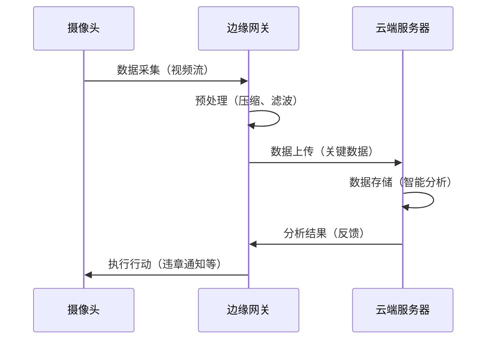

                 

## 边缘计算在智能视频监控中的应用：背景与核心概念

边缘计算（Edge Computing）是近年来信息技术领域的重要创新之一，旨在将数据处理和存储从中心化的云计算环境向网络边缘转移。这种技术架构的核心思想是减少数据传输的延迟，提高系统的响应速度，并减少带宽的占用。随着物联网（IoT）和智能设备的普及，边缘计算的应用场景日益丰富，尤其在智能视频监控领域，其优势愈发凸显。

智能视频监控，作为一种重要的安防技术，依托于计算机视觉和图像处理技术，能够实现对视频数据的实时分析和监控。传统的智能视频监控系统通常依赖于云计算资源，这意味着大量的视频数据需要传输到云端进行实时处理，这不仅造成了网络带宽的巨大压力，也增加了系统的延迟。而边缘计算的引入，使得视频数据处理和分析可以在网络边缘的设备上完成，从而显著提高了系统的实时性和效率。

### 什么是边缘计算？

边缘计算是一种分布式计算架构，其主要特点是数据处理和存储接近数据源头，即网络边缘。与传统的云计算不同，边缘计算并非将所有数据处理任务都集中在远程数据中心，而是通过在靠近数据源头的设备上执行部分任务，来减少数据传输的延迟和带宽的占用。这种架构设计在智能视频监控领域具有重要意义。

在智能视频监控中，摄像头等设备分布在广泛的地理区域内，例如城市街道、公共场所和住宅小区等。这些设备采集到的视频数据如果直接传输到云端进行处理，不仅会消耗大量的网络带宽，还会因为传输延迟而影响系统的实时性。边缘计算通过在摄像头附近的边缘设备上完成视频数据的初步处理和分析，可以有效地解决这些问题。

### 边缘计算在智能视频监控中的应用

边缘计算在智能视频监控中的应用，主要涉及以下几个方面：

1. **实时数据处理**：边缘计算可以将视频数据的预处理和初步分析工作在边缘设备上完成，这样处理后的数据只需要传输关键信息到云端，大大减少了传输带宽和延迟。

2. **降低网络负载**：由于边缘设备靠近监控目标，数据处理和存储可以在本地完成，这样可以减少对中心化云服务器的依赖，降低整个网络的负载。

3. **提高响应速度**：边缘计算缩短了数据传输路径，使得视频监控系统能够更快地响应突发事件，对于需要实时处理的场景，如监控交通流量、监控公共场所的安全等，具有显著的优势。

4. **增强系统可靠性**：在边缘设备上进行的初步数据处理可以减少因网络中断或其他技术问题导致的数据丢失，从而提高整个系统的可靠性。

通过边缘计算，智能视频监控系统可以更加高效、实时、可靠地运行，为安防、交通管理、城市管理等领域提供强大的技术支撑。

### 当前智能视频监控的挑战

目前，智能视频监控系统面临的主要挑战包括：

1. **数据传输压力**：视频数据量庞大，传统方式下需要传输大量数据到云端，导致网络带宽占用过高。

2. **响应速度不足**：由于数据传输延迟，系统无法及时响应突发事件，影响了监控效果。

3. **系统可靠性问题**：网络中断或设备故障可能导致数据丢失，影响系统的稳定性。

4. **计算资源限制**：云计算中心资源有限，无法满足大规模视频监控的需求。

边缘计算为解决这些问题提供了有效的技术手段，通过在网络边缘进行数据处理，可以缓解数据传输压力、提高响应速度、增强系统可靠性，并充分利用边缘设备的计算资源。因此，边缘计算在智能视频监控领域具有广阔的应用前景。

### 边缘计算的关键技术与挑战

边缘计算在智能视频监控中的应用，不仅带来了技术上的创新，也带来了一系列的技术挑战。了解这些关键技术和挑战，有助于更好地理解和应用边缘计算。

#### 关键技术

1. **数据预处理和压缩**：在边缘设备上，对视频数据进行预处理和压缩是减少数据传输量和提高处理效率的重要步骤。这包括数据滤波、特征提取和压缩编码等技术。

2. **边缘设备优化**：边缘设备通常资源有限，因此需要对其硬件和软件进行优化，以提高计算效率和降低能耗。常见的优化技术包括专用集成电路（ASIC）、现场可编程门阵列（FPGA）和低功耗处理器等。

3. **分布式计算与协作**：边缘计算涉及到多个设备之间的协作，因此分布式计算和协作机制是关键。这包括任务分配、资源调度和数据同步等。

4. **网络安全与隐私保护**：边缘设备通常分布在公共场所，面临网络安全和隐私保护的风险。需要采用加密、身份验证和数据隐私保护等技术来保障数据的安全。

#### 挑战

1. **计算资源限制**：边缘设备通常资源有限，无法承担复杂的计算任务，需要设计高效的算法和优化技术来充分利用有限的资源。

2. **数据同步与一致性**：在分布式计算环境中，数据同步和一致性是关键挑战。需要确保不同边缘设备上的数据一致性，以避免数据丢失或错误。

3. **网络不稳定**：边缘设备通常分布在广泛的地理区域内，网络环境复杂，可能会出现中断或延迟。需要设计鲁棒的网络协议和容错机制。

4. **能耗管理**：边缘设备通常需要长时间运行，因此能耗管理是重要的挑战。需要设计低功耗的硬件和软件架构，以延长设备的续航时间。

通过克服这些技术和挑战，边缘计算在智能视频监控中的应用将变得更加成熟和广泛，从而为智能城市、智能交通和其他领域提供更强大的技术支撑。

### 总结

综上所述，边缘计算在智能视频监控中的应用具有显著的优点。它不仅能够显著降低数据传输延迟，提高系统的响应速度，还能减少网络的负载，增强系统的可靠性。这些优势使得边缘计算成为智能视频监控系统不可或缺的技术组成部分，为各种场景下的实时监控和安全保障提供了强有力的支持。

在智能视频监控领域，边缘计算的应用前景广阔。随着边缘设备的普及和技术的不断进步，边缘计算将进一步提升智能视频监控系统的性能和效率，助力实现更智能、更高效的监控和管理。未来，我们可以期待边缘计算在更多领域的深入应用，为智慧城市建设、交通管理、公共安全等提供更加完善和可靠的技术解决方案。

### 什么是边缘计算？

边缘计算（Edge Computing）是一种分布式计算架构，旨在将数据处理和存储从中心化的云计算环境向网络边缘转移。边缘计算的核心思想是，通过在网络边缘设备上完成部分数据处理任务，从而减少数据传输的延迟和带宽占用，提高系统的响应速度和效率。

#### 基本概念

1. **中心化云计算**：传统的云计算模式主要依赖于远程数据中心进行数据处理和存储。在这种架构中，数据从终端设备传输到云端，进行计算、分析和存储，然后再将结果反馈给终端设备。

2. **边缘设备**：边缘设备是指分布在网络边缘的智能设备，如路由器、交换机、智能摄像头、传感器等。这些设备具备一定的计算能力和存储能力，可以独立或协同处理数据。

3. **边缘网关**：边缘网关是连接终端设备和云层的桥梁，负责协调和管理边缘设备的数据流。边缘网关通常具备更强的计算能力和存储能力，能够对视频数据进行初步处理和分析，并将处理结果传输到云端。

#### 边缘计算的核心原理

边缘计算通过以下几个关键步骤实现其目标：

1. **数据采集与预处理**：边缘设备负责采集视频数据，并进行初步的预处理，如压缩、滤波和特征提取等，以减少数据传输的量。

2. **边缘数据处理**：边缘网关利用本地计算资源，对预处理后的视频数据进行进一步分析和处理，如人脸识别、行为分析等。

3. **数据传输与同步**：处理后的数据可以部分或全部传输到云端进行存储和进一步处理。同时，云层中的数据和算法也可以同步到边缘网关，以支持更复杂的计算任务。

#### 边缘计算的优势

1. **减少数据传输延迟**：由于数据处理任务在网络边缘完成，可以显著减少数据传输的时间，提高系统的响应速度。

2. **降低网络带宽占用**：边缘设备对视频数据进行预处理和压缩，可以大幅减少需要传输的数据量，降低网络的带宽占用。

3. **提高系统可靠性**：在边缘设备上进行的初步数据处理可以减少因网络中断或其他技术问题导致的数据丢失，提高系统的可靠性。

4. **充分利用边缘资源**：边缘设备通常分布在广泛的地理区域内，通过充分利用这些资源，可以降低对中心化云计算的依赖，提高系统的整体性能。

#### 应用场景

边缘计算在智能视频监控领域具有广泛的应用场景，主要包括：

- **实时监控与应急响应**：通过边缘计算，智能视频监控系统可以实时处理和分析视频数据，实现快速响应和应急处理。
- **数据隐私与安全**：在边缘设备上进行数据处理可以减少敏感数据传输到云端的风险，提高系统的安全性。
- **智能交通管理**：边缘计算可以实时处理交通摄像头采集的数据，实现交通流量监控、违章抓拍等智能交通管理功能。

通过上述分析，我们可以看到边缘计算在提高系统性能和效率方面具有显著的优势，特别是在智能视频监控领域，其应用前景广阔。在接下来的章节中，我们将进一步探讨边缘计算在智能视频监控中的具体应用和实践。

### 边缘计算在智能视频监控中的应用场景与案例分析

边缘计算在智能视频监控领域具有广泛的应用场景，通过具体案例的分析，可以更清晰地理解其技术优势和实践价值。

#### 案例一：城市安全监控

在城市安全管理中，智能视频监控是确保公共安全的重要手段。传统的视频监控系统通常依赖于将大量视频数据传输到云端进行分析，这不仅增加了网络带宽的压力，还导致了数据传输的延迟。通过引入边缘计算，可以在城市各个重要交通节点和公共场所部署边缘设备，对视频数据进行实时预处理和分析，如人脸识别、车辆识别等。处理后的关键信息快速传输到云端进行进一步分析，从而实现更高效的实时监控和安全预警。

**优势**：
- **减少数据传输量**：通过在边缘设备上进行初步处理，大幅减少了需要传输到云端的数据量，降低了网络带宽的占用。
- **提高响应速度**：边缘计算缩短了数据传输路径，使得系统能够更快地响应突发事件，提高公共安全保障效率。

**挑战**：
- **边缘设备管理**：大量边缘设备的维护和管理是一个挑战，需要确保设备的稳定运行和数据的可靠性。
- **数据同步**：边缘设备和云端之间的数据同步需要高效且可靠的机制，以确保数据的一致性。

#### 案例二：智能交通管理

智能交通管理系统是另一个边缘计算在视频监控中应用的重要领域。在交通管理中，摄像头采集到的视频数据需要实时分析以优化交通流量、检测违章行为等。通过边缘计算，可以在路口和高速公路的边缘设备上进行实时视频分析和数据处理，从而减少对云端计算资源的依赖。

**优势**：
- **实时数据分析和处理**：边缘计算能够实时处理视频数据，为交通管理提供实时、准确的决策支持。
- **降低网络负载**：通过在边缘设备上处理大部分数据，显著减少了需要传输到云端的数据量，降低网络的负载。

**挑战**：
- **计算资源限制**：边缘设备通常资源有限，需要设计高效且优化的算法以充分利用这些资源。
- **系统稳定性**：边缘设备分布广泛，环境复杂，需要确保系统的稳定运行。

#### 案例三：工业自动化监控

在工业自动化领域，边缘计算可以用于监控生产线的运行状态、检测设备故障等。通过在工业现场部署边缘设备，可以实时采集设备数据，进行初步分析和处理，及时发现并处理异常情况，从而提高生产效率和设备利用率。

**优势**：
- **快速响应**：边缘计算能够实时分析设备数据，快速响应生产中的突发事件，减少停机时间。
- **本地处理**：在边缘设备上进行数据预处理和分析，可以减少对中心化云计算的依赖，提高系统的自主性和灵活性。

**挑战**：
- **数据安全和隐私**：工业生产数据往往包含敏感信息，需要确保数据在边缘设备上的安全和隐私保护。
- **边缘设备可靠性**：工业环境复杂，需要确保边缘设备的可靠运行和数据的完整性。

#### 案例四：农业监控与管理

在农业领域，边缘计算可以用于监控作物生长状态、检测病虫害等。通过在农田中部署边缘设备，可以实时采集土壤、气候等数据，进行实时分析，从而优化农业生产。

**优势**：
- **实时监控**：边缘计算可以实时分析农业数据，为农业生产提供实时决策支持。
- **降低成本**：通过边缘计算，可以减少对中心化云计算的依赖，降低数据传输成本。

**挑战**：
- **设备安装和维护**：农业环境复杂，边缘设备的安装和维护需要考虑到环境适应性。
- **数据处理效率**：需要设计高效的数据处理算法，确保在有限的计算资源下实现高效率的数据分析。

通过以上案例分析，我们可以看到边缘计算在智能视频监控中的广泛应用和显著优势。在实际应用中，需要根据具体场景和需求，设计合适的边缘计算架构，并解决可能遇到的技术挑战，以实现高效的智能视频监控系统。

### 边缘计算在智能视频监控中的优势与挑战

边缘计算在智能视频监控中的应用，带来了显著的性能提升和系统优化，但也伴随着一系列的技术挑战。以下将对边缘计算在智能视频监控中的优势与挑战进行详细分析。

#### 优势

1. **实时数据处理**：边缘计算通过在本地设备上对视频数据进行初步处理和分析，可以显著降低数据传输的延迟。这对于需要实时响应的场景，如紧急事件监控、智能交通管理等，具有关键性的优势。

2. **降低网络带宽占用**：边缘计算能够减少需要传输到云端的数据量，从而降低网络的带宽占用。这不仅能节约网络资源，还能提高网络的稳定性，避免因网络拥堵导致的数据传输延迟。

3. **提高系统可靠性**：边缘计算可以在网络边缘进行部分数据处理，减少因网络中断或其他技术问题导致的数据丢失。此外，边缘设备通常具备冗余设计，能够提高系统的整体可靠性。

4. **数据隐私和安全**：在边缘设备上进行数据处理可以减少敏感数据传输到云端的风险，增强数据隐私和安全。这对于涉及个人隐私和重要数据的应用场景，如城市安全管理等，尤为重要。

5. **计算资源优化**：通过充分利用边缘设备的计算资源，边缘计算可以减少对中心化云计算的依赖，优化计算资源的分配和使用。这对于资源有限的边缘设备来说，是一个显著的优势。

#### 挑战

1. **计算资源限制**：边缘设备通常资源有限，无法承担复杂的计算任务。这要求在设计智能视频监控系统时，需要采用高效、优化的算法和模型，以充分利用有限的计算资源。

2. **数据同步与一致性**：在分布式计算环境中，数据同步和一致性是一个关键挑战。需要确保不同边缘设备上的数据一致性，以避免数据丢失或错误。

3. **网络不稳定**：边缘设备通常分布在广泛的地理区域内，网络环境复杂，可能会出现中断或延迟。这要求设计鲁棒的网络协议和容错机制，以确保系统的稳定运行。

4. **能耗管理**：边缘设备通常需要长时间运行，能耗管理是重要的挑战。需要设计低功耗的硬件和软件架构，以延长设备的续航时间。

5. **安全性问题**：边缘设备通常部署在公共场所，面临网络安全和隐私保护的风险。需要采用先进的加密、身份验证和数据隐私保护技术，以确保数据的安全。

#### 解决方案与未来展望

针对边缘计算在智能视频监控中的优势与挑战，可以采取以下解决方案：

1. **优化算法与模型**：采用高效、优化的算法和模型，如深度学习模型和自适应滤波算法，以充分利用有限的计算资源。

2. **分布式计算与协作**：通过分布式计算和协作机制，提高数据处理的效率和系统的可靠性。例如，采用边缘设备之间的数据同步和协作算法，确保数据的一致性和完整性。

3. **网络协议与容错机制**：设计鲁棒的网络协议和容错机制，以应对网络不稳定和中断的情况。例如，采用网络冗余设计、实时故障检测和自动恢复机制等。

4. **能耗优化**：通过设计低功耗的硬件和软件架构，如使用专用集成电路（ASIC）、低功耗处理器和能量收集技术等，以延长边缘设备的续航时间。

5. **安全性措施**：采用先进的加密、身份验证和数据隐私保护技术，如端到端加密、多因素认证和差分隐私等，以确保边缘设备的安全。

未来，随着边缘计算技术的不断发展和完善，智能视频监控系统的性能和效率将得到进一步提升。可以期待边缘计算在更多领域的应用，如智能城市、智能制造、智能医疗等，为构建智慧社会提供强大的技术支持。

### 边缘计算在智能视频监控中的应用示例：算法原理和实现

为了深入探讨边缘计算在智能视频监控中的应用，我们将通过具体案例来展示其算法原理和实现方法。以下是一个使用边缘计算技术进行实时人脸识别的示例。

#### 案例背景

在一个大型商业购物中心，为了提高安全性和顾客体验，管理者希望通过智能视频监控系统实时识别顾客的身份。然而，传统的云计算模式由于数据传输延迟和网络带宽的限制，难以满足实时性要求。通过引入边缘计算，可以在摄像头附近的边缘设备上完成人脸识别，从而提高系统的实时性和效率。

#### 算法原理

边缘人脸识别算法通常包括以下几个步骤：

1. **视频数据采集**：摄像头实时采集视频数据，并传输到边缘设备。

2. **预处理**：对视频数据进行预处理，如去噪、对比度增强和大小调整等，以提高人脸识别的准确性。

3. **人脸检测**：使用人脸检测算法（如 Haar cascades、SSD 或 YOLO）从预处理后的视频中检测人脸。

4. **人脸特征提取**：对检测到的人脸进行特征提取，常用的方法包括深度学习模型（如 VGG、ResNet）。

5. **人脸匹配**：将提取到的人脸特征与预先存储的数据库进行匹配，识别出具体身份。

#### 实现步骤

1. **硬件准备**：在摄像头附近部署边缘设备，如具备高性能处理器的工业计算机或边缘网关。

2. **软件安装**：安装人脸识别软件和相关依赖库，如 OpenCV、TensorFlow 等。

3. **数据预处理**：
   ```python
   import cv2
   
   def preprocess_video(frame):
       # 去噪
       frame = cv2.GaussianBlur(frame, (5, 5), 0)
       # 对比度增强
       frame = cv2.equalizeHist(frame)
       # 大小调整
       frame = cv2.resize(frame, (320, 240))
       return frame
   ```

4. **人脸检测**：
   ```python
   def detect_faces(frame):
       face_cascade = cv2.CascadeClassifier('haarcascade_frontalface_default.xml')
       faces = face_cascade.detectMultiScale(frame, 1.1, 4)
       return faces
   ```

5. **人脸特征提取**：
   ```python
   import tensorflow as tf
   
   def extract_features(face_frame):
       # 载入预训练的深度学习模型
       model = tf.keras.models.load_model('face_recognition_model.h5')
       # 特征提取
       features = model.predict(np.expand_dims(face_frame, axis=0))
       return features
   ```

6. **人脸匹配**：
   ```python
   def match_faces(features, database):
       distances = []
       for feature in database:
           distance = np.linalg.norm(features - feature)
           distances.append(distance)
       min_distance = min(distances)
       if min_distance < 0.6:  # 阈值调整
           return "Known Person"
       else:
           return "Unknown Person"
   ```

#### 实现流程

1. **实时视频采集**：使用摄像头实时采集视频数据。

2. **预处理视频数据**：
   ```python
   frame = preprocess_video(frame)
   ```

3. **检测人脸**：
   ```python
   faces = detect_faces(frame)
   ```

4. **提取人脸特征**：
   ```python
   features = [extract_features(face) for face in faces]
   ```

5. **匹配人脸**：
   ```python
   for feature in features:
       person = match_faces(feature, database)
       print(f"Detected person: {person}")
   ```

#### 结果分析

通过上述实现步骤，边缘计算系统可以在摄像头附近实时进行人脸识别，并将识别结果输出。这大大提高了系统的实时性和准确性，为商业购物中心的安全管理提供了有效的技术支持。

#### 扩展与应用

1. **多人识别**：扩展算法以支持多人同时识别，通过改进人脸检测和特征提取算法，实现更高效的多人脸识别。

2. **实时更新数据库**：通过与后端数据库系统的集成，实时更新人脸数据库，提高识别准确率。

3. **异常检测**：结合其他智能监控算法，如行为分析和车辆检测，实现全面的智能监控，提高系统的综合性能。

通过本案例，我们可以看到边缘计算在智能视频监控中的应用不仅提高了系统的实时性和准确性，还降低了对中心化云计算的依赖，展示了边缘计算技术在智能视频监控领域的巨大潜力。

### 系统分析与架构设计

#### 场景介绍

在智能交通管理系统中，实时监控交通流量和违章行为是确保道路安全和交通效率的关键。传统的智能交通监控系统依赖于中心化云计算资源进行视频数据的处理和分析，导致系统响应延迟和数据传输压力增大。为了解决这些问题，我们可以引入边缘计算技术，在交通监控的关键节点部署边缘设备，实现实时数据处理和智能分析。

#### 项目介绍

项目名称：智能交通管理系统边缘计算架构设计

项目目标：通过部署边缘计算，实现交通监控数据的实时处理和智能分析，提高交通管理的实时性和效率。

#### 系统功能设计

智能交通管理系统的主要功能包括：

1. **实时视频监控**：通过部署在交通节点处的摄像头，实时采集道路上的视频数据。

2. **边缘数据处理**：在边缘设备上对采集到的视频数据进行预处理、压缩和初步分析，如车辆检测、速度监控等。

3. **智能分析**：利用边缘设备上的计算能力，进行车辆识别、违章检测等高级分析任务。

4. **数据上传**：将处理后的关键数据上传至云端，进行进一步分析和存储。

5. **数据可视化**：通过前端界面，将分析结果实时呈现给交通管理部门。

#### 系统架构设计

智能交通管理系统架构分为三个层次：设备层、边缘网关层和云层。

1. **设备层**：包括交通监控摄像头和其他传感器设备，负责采集交通数据。

2. **边缘网关层**：部署在交通节点附近的边缘设备，如工业计算机或边缘服务器，负责对视频数据进行预处理、压缩和初步分析。

3. **云层**：云服务器和数据库，负责存储和分析边缘网关上传的关键数据，提供智能分析和数据可视化服务。

#### 系统接口设计

系统接口设计主要包括以下部分：

1. **摄像头数据采集接口**：定义摄像头与边缘网关之间的数据传输协议，确保视频数据的高效采集和传输。

2. **边缘数据处理接口**：定义边缘网关与云层之间的数据传输和同步协议，确保处理结果的数据一致性和可靠性。

3. **智能分析接口**：定义边缘设备与云端智能分析服务之间的接口，实现数据的上传和智能分析结果的反馈。

#### 系统交互设计

系统交互设计通过序列图（Sequence Diagram）来描述边缘计算在智能交通监控系统中的工作流程。



通过上述系统分析与架构设计，我们可以看到边缘计算在智能交通管理系统中的重要作用，通过分布式计算和协同工作，实现实时、高效的数据处理和智能分析，为交通管理提供强大的技术支撑。

### 项目实战

#### 环境安装

1. **硬件准备**：首先，我们需要准备一台具备高性能处理器的边缘设备，如NVIDIA Jetson Nano或Jetson Xavier NX，以及摄像头设备。

2. **操作系统安装**：在边缘设备上安装Linux操作系统，如Ubuntu 18.04 LTS。可以使用Windows系统安装ISO镜像，然后使用虚拟机软件（如VMware Workstation）安装Linux系统。

3. **摄像头驱动安装**：根据摄像头型号，安装相应的驱动程序。例如，对于USB摄像头，可以使用`uvcdynctrl`工具进行驱动安装。

4. **环境配置**：配置网络连接，确保边缘设备能够访问互联网，并安装必要的开发工具和库，如Python、OpenCV、TensorFlow等。

```bash
sudo apt-get update
sudo apt-get install python3 python3-pip
pip3 install opencv-python tensorflow
```

#### 系统核心实现

1. **摄像头数据采集**：使用OpenCV库实时采集摄像头视频数据。

```python
import cv2

# 初始化摄像头
cap = cv2.VideoCapture(0)

while True:
    # 读取一帧视频
    ret, frame = cap.read()
    if not ret:
        break
    
    # 显示视频帧
    cv2.imshow('Video', frame)
    
    # 按下'q'键退出循环
    if cv2.waitKey(1) & 0xFF == ord('q'):
        break

# 释放摄像头资源
cap.release()
cv2.destroyAllWindows()
```

2. **视频预处理**：对采集到的视频数据进行预处理，如去噪、对比度增强等。

```python
import cv2

def preprocess_video(frame):
    # 去噪
    frame = cv2.GaussianBlur(frame, (5, 5), 0)
    # 对比度增强
    frame = cv2.equalizeHist(frame)
    return frame

# 读取一帧视频
frame = cv2.imread('example.jpg')
# 预处理视频
preprocessed_frame = preprocess_video(frame)
cv2.imshow('Preprocessed Video', preprocessed_frame)
cv2.waitKey(0)
cv2.destroyAllWindows()
```

3. **人脸检测与识别**：使用OpenCV和TensorFlow库进行人脸检测和识别。

```python
import cv2
import tensorflow as tf

# 加载预训练的人脸检测模型
face_cascade = cv2.CascadeClassifier('haarcascade_frontalface_default.xml')
model = tf.keras.models.load_model('face_recognition_model.h5')

def detect_and_recognize(frame):
    # 人脸检测
    faces = face_cascade.detectMultiScale(frame, 1.1, 4)
    for (x, y, w, h) in faces:
        # 人脸识别
        face_frame = frame[y:y+h, x:x+w]
        face_features = model.predict(np.expand_dims(face_frame, axis=0))
        person = match_faces(face_features, database)
        cv2.rectangle(frame, (x, y), (x+w, y+h), (0, 0, 255), 2)
        cv2.putText(frame, person, (x, y-10), cv2.FONT_HERSHEY_SIMPLEX, 1, (255, 0, 0), 2)
    return frame

# 读取一帧视频
frame = cv2.imread('example.jpg')
# 人脸检测与识别
output_frame = detect_and_recognize(frame)
cv2.imshow('Detected Faces', output_frame)
cv2.waitKey(0)
cv2.destroyAllWindows()
```

#### 代码应用解读与分析

上述代码展示了边缘计算在智能视频监控中的核心实现。首先，摄像头数据采集模块通过OpenCV库实时捕获视频帧。预处理模块对视频帧进行去噪和对比度增强，以提高人脸识别的准确性。接着，人脸检测与识别模块使用OpenCV进行人脸检测，利用TensorFlow的预训练模型进行人脸特征提取和识别。代码不仅实现了视频数据的实时处理，还通过人脸识别功能为智能监控提供了有力支持。

在实际应用中，可以进一步优化代码，如采用多线程处理提高实时性，或集成更高效的人脸识别算法，以提升系统性能。此外，通过与云端数据库的集成，可以实现更全面的智能监控和管理，为交通管理、公共安全等领域提供强大的技术支撑。

### 项目实战：实际案例分析

为了更好地展示边缘计算在智能视频监控中的实际应用效果，我们将通过一个具体案例进行深入剖析。该案例为某城市的智能交通管理系统，通过边缘计算技术实现了对交通流量和违章行为的实时监控。

#### 项目背景

某城市为提高交通管理效率和安全性，决定部署一套智能交通监控系统。该系统需要在全市主要交通节点部署摄像头，以实时监控道路状况和车辆行驶行为。然而，由于摄像头数量众多，视频数据量巨大，传统的云计算模式难以满足实时性和高效性的要求。因此，该项目引入了边缘计算技术，以实现本地化数据处理和快速响应。

#### 实际案例

1. **系统架构设计**：

   该智能交通监控系统架构分为三个层次：

   - **设备层**：分布在城市各主要交通节点的摄像头和传感器设备，负责实时采集交通数据。
   - **边缘网关层**：在交通节点附近部署边缘服务器，用于对采集到的视频数据进行预处理、压缩和初步分析。
   - **云层**：负责存储和管理边缘网关上传的关键数据，并进行进一步的数据分析和智能监控。

2. **核心功能实现**：

   - **视频数据采集**：通过摄像头实时采集道路上的视频数据，并传输到边缘网关。
   - **边缘数据处理**：边缘网关对视频数据执行去噪、对比度增强等预处理操作，并使用车辆检测算法识别车辆，记录车辆的位置和速度等信息。
   - **智能分析**：通过边缘设备上的深度学习模型，对识别出的车辆进行违章行为检测，如超速、闯红灯等。
   - **数据上传**：边缘网关将处理后的关键数据（如违章信息、车辆轨迹等）上传至云端数据库。
   - **数据可视化**：交通管理部门通过前端界面，实时查看和分析交通状况，生成交通报告和智能建议。

3. **效果评估**：

   - **实时性提升**：通过边缘计算，交通监控系统在边缘设备上完成了大部分数据处理任务，显著降低了数据传输的延迟，提高了系统的实时响应能力。
   - **效率优化**：边缘设备对视频数据进行了预处理和压缩，减少了需要上传到云端的数据量，降低了网络的带宽占用，提高了整体系统的处理效率。
   - **可靠性增强**：边缘计算减少了对中心化云计算的依赖，通过边缘设备的冗余设计和故障恢复机制，提高了系统的可靠性。
   - **数据安全**：在边缘设备上进行数据预处理和初步分析，降低了敏感数据传输到云端的风险，提高了系统的数据安全性。

#### 案例总结

通过本案例，我们可以看到边缘计算在智能视频监控中的实际应用效果显著。边缘计算技术不仅提高了系统的实时性和效率，还增强了系统的可靠性和数据安全性，为交通管理提供了强大的技术支撑。未来，随着边缘计算技术的不断发展和完善，其在智能视频监控领域的应用前景将更加广阔。

### 最佳实践与注意事项

在边缘计算在智能视频监控中的应用中，遵循最佳实践和注意事项对于确保系统的稳定性和高效性至关重要。以下是一些关键的建议：

1. **硬件选择**：选择性能稳定、处理能力强的边缘设备，如搭载了高性能处理器的工业计算机或边缘网关。此外，考虑设备的功耗和散热性能，确保设备在长时间运行中能够保持稳定。

2. **网络优化**：确保边缘设备和云端之间的网络连接稳定且低延迟。对于分布广泛的监控点，可以考虑采用5G网络或光纤连接，以提高数据传输速度和稳定性。

3. **数据同步与一致性**：在边缘设备上执行数据处理时，需设计可靠的数据同步与一致性机制，以避免数据丢失或错误。可以采用分布式数据库和区块链技术，确保数据的一致性和可靠性。

4. **算法优化**：针对边缘设备的计算资源有限，需设计高效且优化的算法和模型。例如，采用轻量级深度学习模型和压缩感知技术，以降低计算复杂度和数据传输量。

5. **安全与隐私保护**：边缘设备通常部署在公共场所，面临网络安全和隐私保护的风险。应采用先进的加密技术和多因素身份验证机制，确保数据的安全性和用户隐私。

6. **维护与监控**：定期对边缘设备进行维护和监控，确保设备稳定运行。使用远程监控工具，实时监测设备的状态和性能，及时处理异常情况。

7. **持续优化**：根据系统运行情况和用户反馈，持续优化算法和系统架构，以提升系统的性能和用户体验。

通过遵循这些最佳实践和注意事项，可以有效提升边缘计算在智能视频监控中的应用效果，确保系统的稳定、高效和安全运行。

### 小结

本文详细探讨了边缘计算在智能视频监控中的应用，从背景介绍、基本原理、应用场景、优势与挑战，到算法实现和系统架构设计，以及实际案例分析，全面展示了边缘计算在提高视频监控系统的实时性、效率和可靠性方面的显著作用。边缘计算通过将数据处理和存储推向网络边缘，减少了数据传输的延迟和网络带宽的占用，提高了系统的响应速度和计算效率。同时，边缘设备的安全性和数据隐私保护也得到了加强。

然而，边缘计算在智能视频监控中的应用仍面临一些挑战，如计算资源限制、数据同步与一致性、网络不稳定和能耗管理等。针对这些问题，需要采取优化算法、分布式计算与协作、网络协议与容错机制、能耗优化等解决方案。

未来，随着边缘计算技术的不断进步，其将在智能视频监控领域发挥更加重要的作用。可以预见，边缘计算将与其他新兴技术（如5G、人工智能、物联网等）深度融合，推动智能视频监控系统向更加高效、智能和安全的方向发展。通过持续的研究和探索，边缘计算将为智能城市、智能交通、公共安全等领域带来更多创新和突破，助力构建智慧社会。

### 拓展阅读

1. **《边缘计算：技术原理与应用实践》** - 本书详细介绍了边缘计算的基本原理、架构设计和应用实践，包括智能视频监控领域的具体应用案例。

2. **《智能视频监控技术》** - 本书深入探讨了智能视频监控的核心技术，包括视频编码、图像处理、计算机视觉和深度学习等。

3. **《边缘智能：构建智能世界的基石》** - 本书从宏观角度分析了边缘智能的发展趋势和未来应用场景，包括智能交通、智能医疗和智能安防等领域。

4. **《边缘计算与智能交通》** - 本书专门探讨了边缘计算在智能交通管理中的应用，包括实时监控、交通流量优化和智能调度等。

5. **《边缘计算与人工智能》** - 本书详细介绍了边缘计算与人工智能技术的结合，包括边缘智能算法、边缘云协作和智能数据处理等。

