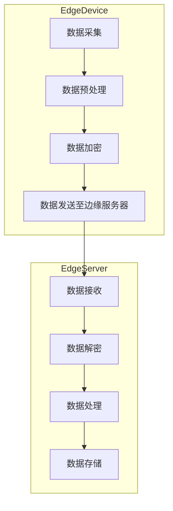
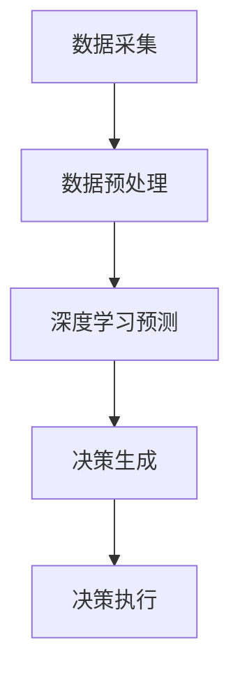
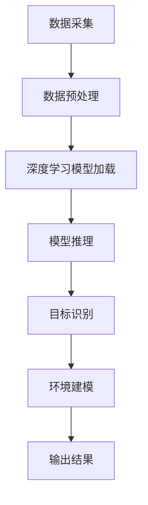
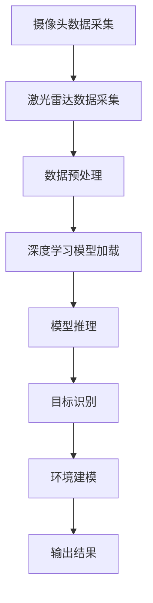
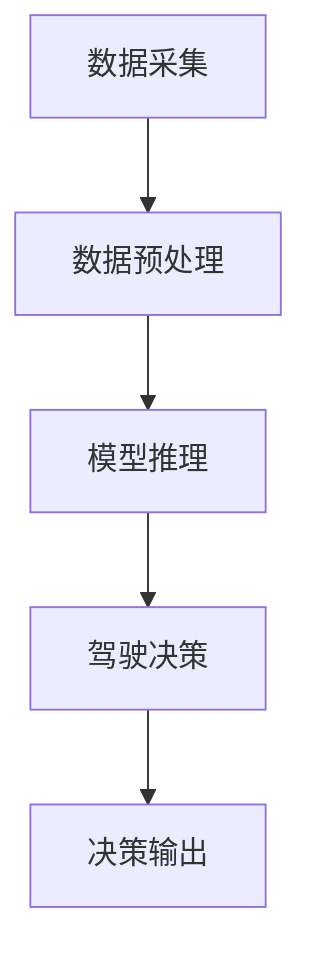
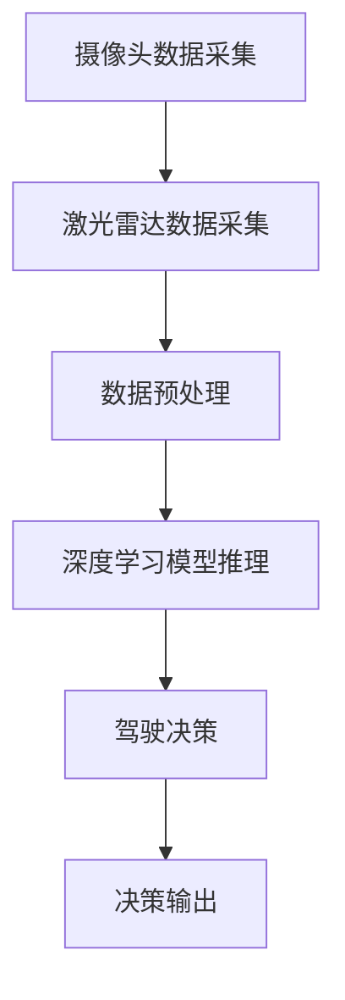
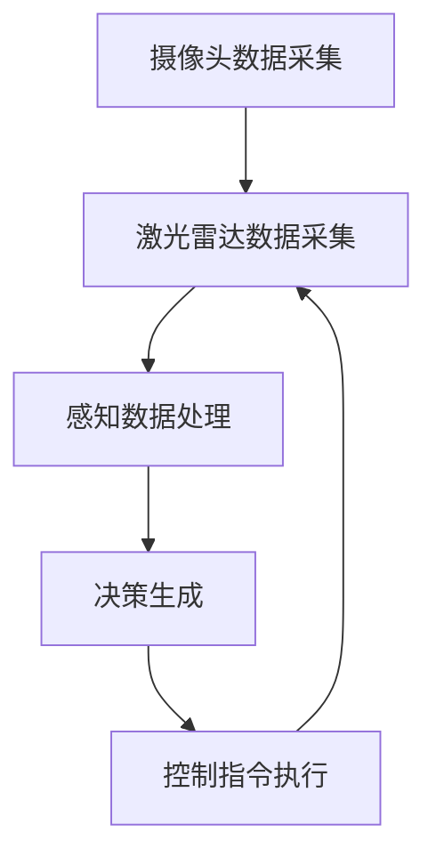

                 

### 第1章 引言与背景

#### 1.1 引言

随着科技的飞速发展，自动驾驶技术正逐步从实验室走向现实，成为未来交通领域的重要方向。自动驾驶不仅能够提升交通安全，减少交通事故，还能提高交通效率，缓解交通拥堵，对推动社会发展具有重要意义。然而，自动驾驶技术的实现面临着诸多挑战，其中最为关键的就是实时性需求。为了保证自动驾驶车辆能够在复杂多变的交通环境中安全、高效地行驶，必须实现精确、实时的决策与控制。

边缘计算作为一种新兴的计算范式，正在为解决自动驾驶的实时性需求提供强有力的支持。边缘计算通过在数据产生的源头附近进行计算，减少了数据传输的延迟，提高了系统的响应速度，这对于自动驾驶这样的实时性要求极高的应用场景尤为重要。本章将首先介绍边缘计算的定义、发展历程及其在自动驾驶中的重要性。

#### 1.2 边缘计算的核心概念与原理

边缘计算（Edge Computing）是指在网络边缘执行计算任务的一种技术，目的是减少数据传输距离，提高数据处理速度，降低网络负载。边缘计算的核心概念包括边缘设备、边缘服务器和边缘网络等，这些设备与服务器共同构成了边缘计算的技术体系架构。

边缘计算的优势在于能够实现低延迟、高可靠性和高带宽的应用。然而，它也面临一些挑战，如硬件性能的局限、网络的不稳定性以及数据安全和隐私保护等问题。本章将详细探讨边缘计算的基础概念、优势与挑战，以及其技术体系架构。

#### 1.3 自动驾驶决策中的实时性需求

自动驾驶系统的核心在于其决策与控制算法。这些算法需要实时分析环境数据，生成决策，并迅速执行控制指令，以应对瞬息万变的交通状况。实时性需求不仅关系到自动驾驶车辆的安全性，还影响到其效率和舒适度。本章将深入分析实时性在自动驾驶决策中的作用，探讨影响实时性的关键因素，并讨论设计实时决策算法的原则。

#### 1.4 边缘计算在自动驾驶决策中的应用现状与前景

当前，边缘计算在自动驾驶决策中已经取得了一些重要进展。例如，通过在车辆周边部署边缘设备，实现感知数据的实时处理，提高了决策的准确性和响应速度。然而，要实现边缘计算在自动驾驶中的全面应用，仍需解决一系列技术难题。

本章将分析边缘计算在自动驾驶决策中的应用现状，展望其未来发展方向，并探讨可能面临的挑战。通过对比当前的应用案例，我们将了解边缘计算在自动驾驶中的实际应用效果，并为未来的发展提供有益的启示。

#### 1.5 本章小结

本章作为全文的开篇，为后续内容奠定了基础。通过介绍边缘计算与自动驾驶的相关背景，我们明确了实时性需求的重要性。接下来，我们将进一步探讨边缘计算的核心概念、技术架构及其在自动驾驶决策中的应用。这些内容不仅有助于读者理解边缘计算与自动驾驶的关系，也为后续章节的技术讨论提供了必要的背景知识。

---

在接下来的章节中，我们将逐步深入，详细介绍边缘计算在自动驾驶决策中的实时应用，让读者对这一技术有更全面、深入的认识。

---

关键词：边缘计算、自动驾驶、实时决策、实时性需求、技术架构

摘要：本文从边缘计算与自动驾驶的背景引入，详细介绍了边缘计算的核心概念与原理，探讨了自动驾驶决策中的实时性需求，分析了边缘计算在自动驾驶中的应用现状与前景。通过对比当前的应用案例，展望了未来发展方向，并探讨了可能面临的挑战。本文旨在为读者提供关于边缘计算在自动驾驶决策中实时应用的全面了解，为相关技术的进一步发展提供启示。

---

### 1.1.1 边缘计算的定义与发展

边缘计算（Edge Computing）是一种新兴的计算范式，其核心理念在于将计算、存储、数据处理等能力从中心化的云计算环境延伸到网络边缘。简单来说，边缘计算就是在数据生成的源头附近进行计算处理，从而减少数据传输的距离和时间，提升系统的响应速度和效率。边缘计算的概念最早可以追溯到20世纪80年代，当时的研究主要集中在如何优化局域网中的计算资源分配。然而，随着物联网（IoT）、5G通信技术的迅速发展，边缘计算逐渐成为学术界和工业界的研究热点。

#### 边缘计算的核心概念

边缘计算涉及的核心概念主要包括：

1. **边缘设备（Edge Devices）**：指的是位于网络边缘的设备，如智能手机、传感器、智能摄像头等。这些设备能够采集环境数据，并将数据发送到边缘服务器进行处理。

2. **边缘服务器（Edge Servers）**：这些服务器位于网络边缘，承担着数据存储、计算任务，是边缘计算的核心组成部分。

3. **边缘网络（Edge Network）**：指的是连接边缘设备和边缘服务器的网络，通常包括局域网、无线网络等。

4. **边缘平台（Edge Platforms）**：这是用于支持边缘计算任务的软件平台，能够提供计算、存储、网络管理等功能。

#### 边缘计算的发展历程

边缘计算的发展历程可以分为以下几个阶段：

1. **早期研究（1980s-1990s）**：这一阶段主要关注局域网内的计算资源优化，旨在提高局域网的性能和效率。

2. **物联网兴起（2000s）**：随着物联网设备的普及，边缘计算逐渐成为实现物联网应用的重要技术。这一阶段的研究主要集中在如何优化物联网设备的计算与通信能力。

3. **移动计算与云计算融合（2010s）**：随着移动设备和云计算的快速发展，边缘计算开始与云计算结合，形成了一种新型的计算架构，即云边协同架构。这一阶段的研究重点是如何实现云与边缘的协同计算。

4. **5G时代的边缘计算（2020s）**：5G技术的推广为边缘计算带来了新的发展机遇。5G网络的低延迟、高带宽特性使得边缘计算能够更好地支持实时应用，如自动驾驶、智能交通等。

#### 边缘计算的关键优势

边缘计算具有以下几个关键优势：

1. **低延迟**：由于数据处理在本地进行，减少了数据传输的距离和时间，能够实现低延迟的实时响应。

2. **高带宽**：边缘计算通过在网络边缘进行数据预处理，减少了需要传输的数据量，提高了网络带宽的利用率。

3. **提高系统效率**：边缘计算能够减轻中心化云服务器的负载，提高整个系统的效率。

4. **增强隐私保护**：边缘计算在本地进行数据处理，能够更好地保护用户隐私，减少数据泄露的风险。

#### 边缘计算的应用领域

边缘计算的应用领域非常广泛，主要包括：

1. **物联网（IoT）**：通过边缘计算，可以实现对大量物联网设备的数据实时处理，提高物联网系统的响应速度和效率。

2. **智能城市**：边缘计算在智能交通管理、环境监测、公共安全等方面有广泛应用，能够提升城市管理水平。

3. **工业物联网（IIoT）**：边缘计算在工业生产过程中用于实时数据分析和设备监控，提高生产效率和设备可靠性。

4. **自动驾驶**：边缘计算在自动驾驶中用于实时感知、决策和控制，提高自动驾驶系统的安全性和效率。

5. **远程医疗**：边缘计算在远程医疗中用于实时数据分析和远程诊断，提高医疗服务质量和效率。

#### 当前边缘计算的发展趋势

随着技术的不断进步，边缘计算呈现出以下几个发展趋势：

1. **智能化**：边缘计算设备逐渐具备智能化特性，能够自主进行数据分析和决策。

2. **分布式架构**：边缘计算架构逐渐向分布式发展，形成了一个多层次的计算网络。

3. **云边协同**：边缘计算与云计算的协同成为趋势，通过云边协同架构实现计算资源的最佳利用。

4. **安全与隐私保护**：随着边缘计算应用的广泛普及，安全与隐私保护成为研究的热点。

5. **5G与边缘计算融合**：5G网络与边缘计算的融合将进一步提升边缘计算的性能和应用范围。

总之，边缘计算作为一种新兴的计算范式，正逐步改变我们的计算模式。通过在数据产生的源头进行计算处理，边缘计算不仅能够提高系统的实时性和效率，还能降低网络负载，提升用户体验。在自动驾驶等领域，边缘计算的重要性愈发凸显，它为自动驾驶的实时决策提供了有力支持，是实现自动驾驶技术全面应用的关键。

### 1.1.2 自动驾驶的发展历程与挑战

自动驾驶技术的概念最早可以追溯到20世纪40年代，当时科学家们开始设想利用计算机技术实现汽车的自动行驶。然而，由于技术限制，这一概念在当时并未得到实质性发展。直到20世纪80年代，随着计算机技术和传感器技术的进步，自动驾驶技术开始逐步走向现实。从最初的自动化驾驶辅助系统，到如今的L4、L5级自动驾驶，自动驾驶技术的发展经历了数十年的探索与实践。

#### 自动驾驶的发展历程

1. **初级阶段（1980s-1990s）**：这一阶段主要聚焦于自动驾驶的基础技术研究和初步应用。例如，美国国防部资助的“自动地面车辆”（AGV）项目，旨在研发能够在复杂地形上自主行驶的车辆。这一阶段的技术主要集中在传感器、路径规划、车辆控制等领域。

2. **中级阶段（2000s）**：随着计算机技术的飞速发展，自动驾驶技术开始逐步应用于实际场景。2004年，谷歌开始研发自动驾驶汽车项目，标志着自动驾驶技术进入新的发展阶段。这一阶段，自动驾驶技术逐渐从实验室走向实际道路测试，传感器技术、算法优化、车辆控制等关键领域取得了显著进展。

3. **高级阶段（2010s-2020s）**：这一阶段是自动驾驶技术的爆发期，多家科技公司和传统汽车制造商纷纷加入自动驾驶技术的研发。自动驾驶技术的核心从单一的传感器和算法，逐步发展到多传感器融合、深度学习、边缘计算等综合技术。L3、L4级别自动驾驶汽车开始逐步上市，并在特定场景下实现商业化应用。

#### 自动驾驶的现状

当前，自动驾驶技术已经取得了显著进展，主要表现在以下几个方面：

1. **感知能力提升**：自动驾驶车辆配备了多种传感器，如摄像头、激光雷达（LiDAR）、毫米波雷达、超声波传感器等，能够实现对周围环境的全方位感知。

2. **算法优化**：深度学习、强化学习等先进算法的应用，使得自动驾驶车辆的决策能力和控制精度得到了大幅提升。

3. **基础设施完善**：随着5G通信技术的推广，边缘计算技术的应用，自动驾驶车辆的数据传输速度和实时性得到了显著提高。

4. **商业化应用**：自动驾驶技术在物流、公共交通、共享出行等领域逐步实现商业化应用，如特斯拉的自动驾驶出租车服务、自动驾驶货车等。

#### 自动驾驶面临的挑战

尽管自动驾驶技术取得了显著进展，但在实际应用过程中仍面临诸多挑战：

1. **技术难题**：自动驾驶技术涉及到多个领域，包括感知、决策、控制等，每个领域都有其复杂性和技术难点。例如，多传感器融合技术需要解决传感器数据的准确性、实时性和一致性等问题；决策算法需要处理复杂的交通场景和突发事件等。

2. **安全性**：自动驾驶车辆的安全性是用户接受自动驾驶技术的关键因素。尽管自动驾驶车辆在模拟测试中表现出色，但在实际道路测试中，仍存在一些安全隐患，如传感器故障、算法错误等。

3. **法律法规**：自动驾驶技术的发展需要完善的法律法规支持。目前，全球各国对于自动驾驶的法律法规尚不完善，存在监管空白和标准不统一等问题。

4. **基础设施**：自动驾驶车辆的普及需要完善的基础设施支持，如智能道路、交通信号系统等。然而，全球大部分地区的交通基础设施尚未完全满足自动驾驶的需求。

5. **用户接受度**：尽管自动驾驶技术具有显著的优势，但部分用户对其安全性、可靠性仍存在担忧，这需要通过大量的测试和宣传来提高用户接受度。

总之，自动驾驶技术的发展历程充满了挑战和机遇。通过不断攻克技术难题、完善法律法规、建设基础设施、提高用户接受度，自动驾驶技术有望在未来实现全面应用，为人类社会带来更加安全、高效、便捷的交通方式。

### 1.1.3 边缘计算在自动驾驶中的重要性

边缘计算在自动驾驶中的应用，不仅为解决实时性需求提供了有效的技术手段，还在提升自动驾驶系统的整体性能和可靠性方面发挥了重要作用。以下是边缘计算在自动驾驶中的几个关键重要性：

1. **实时数据处理能力**：自动驾驶车辆需要实时处理来自各种传感器的海量数据，包括摄像头、激光雷达（LiDAR）、毫米波雷达等。边缘计算能够将这些数据处理任务从中心化的云计算环境转移到网络边缘，显著减少数据传输的延迟，提高系统的响应速度。对于高速行驶的自动驾驶车辆来说，低延迟的实时数据处理能力至关重要，它直接关系到车辆在紧急情况下的反应时间和决策质量。

2. **减轻中心化云负担**：在自动驾驶系统中，所有数据都需要上传到云端进行处理，这会给中心化云服务器带来巨大的计算压力。边缘计算通过在本地进行初步的数据处理，仅将关键数据上传至云端，从而大大减轻了云服务器的负担。这不仅提高了系统的处理效率，还有助于降低云服务的成本。

3. **提高系统可靠性**：边缘计算技术通过在车辆周边部署边缘设备，如边缘服务器和边缘节点，使得自动驾驶系统能够在离线或网络中断的情况下独立运行。这种自给自足的能力显著提高了系统的可靠性，即使在网络不稳定或无法连接云端的情况下，自动驾驶车辆依然能够依靠边缘设备完成基本的感知和决策任务。

4. **增强隐私保护**：自动驾驶车辆在行驶过程中会收集大量的敏感数据，如行驶路线、速度、加速度等。边缘计算能够实现在本地进行数据处理，减少数据传输过程中的泄露风险，从而更好地保护用户的隐私。这对于提升用户对自动驾驶技术的信任度具有重要意义。

5. **优化能耗和资源利用率**：边缘计算通过在本地处理数据，减少了数据传输所需的能源消耗和网络带宽。这对于延长电动汽车的续航里程、降低车辆能耗具有重要意义。同时，边缘计算还能够优化边缘设备的资源利用率，通过任务调度和资源管理，实现设备的最佳运行状态。

6. **支持复杂场景的决策**：自动驾驶系统需要处理各种复杂和动态的交通场景，如城市交通、高速公路、复杂交叉路口等。边缘计算能够利用本地传感器数据，实时进行环境建模和决策优化，提高系统在不同场景下的适应能力和决策准确性。

总之，边缘计算在自动驾驶中的应用，不仅提升了系统的实时性和可靠性，还为自动驾驶技术的全面推广提供了有力支持。随着边缘计算技术的不断进步，它将在自动驾驶领域发挥更加重要的作用，推动自动驾驶技术向更高效、更安全、更可靠的方向发展。

### 1.2 边缘计算的核心概念与原理

边缘计算作为一种新兴的计算范式，其核心概念和原理对于理解其在自动驾驶中的应用至关重要。以下将详细介绍边缘计算的基础概念、主要优势与挑战，以及其技术体系架构。

#### 边缘计算的基础概念

边缘计算的基础概念主要包括以下几个核心组成部分：

1. **边缘设备（Edge Devices）**：这些设备是边缘计算的基础，包括各种传感器、智能终端、物联网设备等。它们能够收集环境数据，如温度、湿度、图像、音频等，并将数据发送到边缘服务器进行进一步处理。

2. **边缘服务器（Edge Servers）**：边缘服务器是边缘计算的核心节点，它们具备较高的计算能力和存储容量，能够承担起数据处理、存储、分析和决策任务。边缘服务器通常部署在网络边缘，如数据中心、基站、智能电网等。

3. **边缘网络（Edge Network）**：边缘网络是连接边缘设备和边缘服务器的通信网络。它包括局域网、无线网络、广域网等多种网络类型，负责传输数据、分配计算资源，以及协调不同节点之间的任务。

4. **边缘平台（Edge Platforms）**：边缘平台是支持边缘计算任务的软件和硬件集成系统，提供了边缘设备的操作系统、数据处理框架、应用开发工具等。边缘平台使开发者能够轻松构建和管理边缘应用，提高边缘计算系统的开发效率和灵活性。

#### 边缘计算的优势

边缘计算具有以下显著优势：

1. **低延迟**：由于数据处理在本地进行，边缘计算能够显著降低数据传输的延迟。这对于需要实时响应的应用，如自动驾驶、工业自动化、远程医疗等尤为重要。低延迟不仅提高了系统的实时性，还有助于提升用户体验。

2. **高带宽利用率**：边缘计算通过在本地进行数据预处理，减少了需要传输的数据量，从而提高了网络带宽的利用率。这种优化有助于缓解中心化云服务器的带宽压力，提高整体系统的性能。

3. **分布式计算能力**：边缘计算通过分布式架构，将计算任务分散到网络边缘的多个节点上，实现了计算资源的优化利用。这种分布式计算能力不仅提高了系统的整体性能，还增强了系统的可靠性和容错性。

4. **增强隐私保护**：边缘计算通过在本地进行数据处理，降低了数据在传输过程中的泄露风险，从而更好地保护用户隐私。这对于处理敏感数据的场景，如金融、医疗、个人隐私等具有重要意义。

5. **提高系统效率**：边缘计算通过减少数据传输和处理时间，提高了系统的整体效率。这种效率提升不仅降低了计算成本，还有助于优化资源利用，实现更高效的业务流程。

#### 边缘计算的挑战

尽管边缘计算具有诸多优势，但在实际应用过程中也面临一些挑战：

1. **硬件性能局限**：边缘设备的计算能力和存储容量通常有限，无法与中心化云服务器相比。这限制了边缘计算在一些复杂计算任务中的应用。

2. **网络不稳定性**：边缘网络通常由多种网络类型组成，包括局域网、无线网络和广域网等，这些网络的稳定性可能受到多种因素的影响，如信号干扰、带宽限制等。网络不稳定可能导致数据传输失败或延迟增加。

3. **数据安全和隐私保护**：边缘计算涉及到大量敏感数据，如个人隐私、企业机密等。如何在边缘设备上进行数据加密、身份认证和访问控制，是边缘计算面临的一个重要挑战。

4. **系统可靠性**：边缘设备通常处于复杂的实际环境中，如高温、潮湿、振动等，这些环境因素可能影响设备的稳定性和寿命。提高边缘设备的可靠性，是边缘计算需要解决的一个重要问题。

5. **任务调度和管理**：边缘计算涉及到大量分布式任务，如何有效进行任务调度和管理，提高系统资源的利用率，是边缘计算面临的一个重要挑战。

#### 边缘计算的技术体系架构

边缘计算的技术体系架构可以分为以下几个层次：

1. **设备层**：包括各种边缘设备，如传感器、智能终端等，负责数据的采集和初步处理。

2. **网络层**：包括边缘网络，如局域网、无线网络等，负责数据传输和通信。

3. **平台层**：包括边缘服务器和边缘平台，负责数据存储、计算和分析。

4. **应用层**：包括各种边缘应用和服务，如智能交通、工业物联网、远程医疗等，是边缘计算的具体应用场景。

通过这些层次的协同工作，边缘计算能够实现数据的高效处理和应用，提升系统的实时性和可靠性。

总之，边缘计算作为一种新兴的计算范式，正逐步改变我们的计算模式。通过深入了解其核心概念和原理，我们能够更好地理解其在自动驾驶等领域的应用潜力，为未来的技术发展提供有力的支持。

### 1.2.1 边缘计算的基础概念

要深入理解边缘计算，首先需要明确其基础概念，包括边缘设备、边缘服务器和边缘网络等核心组成部分。这些概念构成了边缘计算技术体系的基础，是实现边缘计算的关键要素。

#### 边缘设备

边缘设备是边缘计算中的数据采集和处理单元，包括各种传感器、智能终端和物联网（IoT）设备。这些设备位于网络的边缘部分，能够直接与外部环境进行交互，采集各种环境数据，如温度、湿度、压力、图像、声音等。边缘设备通常具备一定的计算能力，能够进行初步的数据处理，如数据过滤、压缩和预处理。这些初步处理后的数据将传输到边缘服务器或中心化云服务器进行进一步分析和处理。

边缘设备的种类繁多，常见的包括：

1. **传感器**：如温度传感器、湿度传感器、压力传感器等，用于监测环境参数。
2. **智能终端**：如智能手机、智能手表、可穿戴设备等，能够执行复杂的数据处理任务。
3. **物联网设备**：如智能门锁、智能灯泡、智能摄像头等，能够实现与家居设备或其他设备的互联互通。

边缘设备的特点包括：

- **分布性**：边缘设备广泛分布在网络的边缘部分，形成一个分布式计算网络。
- **低功耗**：许多边缘设备采用低功耗设计，以延长设备的使用寿命。
- **异构性**：不同类型的边缘设备具有不同的计算能力和数据处理能力，构成一个异构计算环境。

#### 边缘服务器

边缘服务器是边缘计算中的核心计算节点，具备较高的计算能力和存储容量。边缘服务器通常部署在网络边缘，如基站、数据中心、智能电网等位置。边缘服务器的主要任务是接收和处理来自边缘设备的数据，执行复杂的计算任务，如机器学习、数据挖掘、实时监控等。

边缘服务器具有以下特点：

1. **高性能**：边缘服务器通常配备高性能处理器、高速存储设备和丰富的网络接口，能够处理大量并发请求。
2. **可靠性**：边缘服务器需要具备较高的可靠性，以应对恶劣的环境条件和潜在的网络中断。
3. **可扩展性**：边缘服务器应能够根据业务需求进行灵活扩展，以满足不断增长的计算和数据存储需求。

边缘服务器在边缘计算中承担以下主要任务：

- **数据处理**：接收和处理来自边缘设备的数据，进行数据清洗、过滤和预处理。
- **计算任务**：执行复杂的计算任务，如机器学习模型的训练和推理、实时数据分析等。
- **存储管理**：存储和管理来自边缘设备的大量数据，提供数据访问和检索服务。

#### 边缘网络

边缘网络是连接边缘设备和边缘服务器的通信网络，负责数据传输和通信。边缘网络通常由多种网络类型组成，包括局域网、无线网络和广域网等。边缘网络的特点是低延迟、高带宽和可靠性。

边缘网络的主要功能包括：

1. **数据传输**：负责将边缘设备采集的数据传输到边缘服务器或中心化云服务器，实现数据的实时传输和处理。
2. **通信协调**：协调不同边缘设备之间的通信，实现数据的交换和共享。
3. **网络管理**：监控和管理边缘网络的运行状态，确保网络的稳定性和可靠性。

常见的边缘网络技术包括：

1. **局域网（LAN）**：用于连接同一地理位置内的边缘设备和边缘服务器，提供高速、低延迟的数据传输。
2. **无线网络（WAN）**：如Wi-Fi、蓝牙、NFC等，用于连接不同地理位置的边缘设备和边缘服务器，实现无线通信。
3. **广域网（WAN）**：如互联网、移动通信网络等，用于连接远距离的边缘设备和边缘服务器，实现大规模的数据传输。

#### 边缘平台

边缘平台是支持边缘计算任务的软件和硬件集成系统，提供了边缘设备的操作系统、数据处理框架、应用开发工具等。边缘平台使开发者能够轻松构建和管理边缘应用，提高边缘计算系统的开发效率和灵活性。

边缘平台的主要功能包括：

1. **设备管理**：提供边缘设备的监控和管理功能，确保设备的正常运行和资源利用。
2. **数据处理**：提供数据处理框架和工具，支持边缘设备的数据采集、预处理和分析。
3. **应用开发**：提供应用开发工具和平台，支持开发者构建和管理边缘应用。

常见的边缘平台包括：

1. **边缘操作系统**：如Yocto、OP-TEE等，提供边缘设备的操作系统支持。
2. **边缘数据处理框架**：如Apache Kafka、Apache Flink等，提供数据处理和流处理能力。
3. **边缘应用开发平台**：如Kubernetes、EdgeX Foundry等，提供边缘应用的开发和管理工具。

#### 边缘计算与云计算的协同

边缘计算与云计算的协同是边缘计算体系结构的重要组成部分。云计算提供了强大的计算资源、存储能力和数据管理功能，而边缘计算则通过在本地进行数据处理和决策，提高了系统的实时性和响应速度。两者结合能够实现计算资源的最佳利用，满足不同应用场景的需求。

边缘计算与云计算的协同主要体现在以下几个方面：

1. **数据传输与共享**：边缘设备采集的数据可以实时传输到云计算平台，进行进一步分析和处理。同时，云计算平台可以为边缘设备提供数据存储和共享服务。
2. **任务调度与协作**：边缘计算平台可以根据计算任务的需求，将部分计算任务调度到云计算平台，实现计算资源的动态分配和优化。
3. **资源管理与监控**：云计算平台可以监控和管理边缘设备和边缘服务器的资源使用情况，确保系统的稳定运行和高效利用。

通过边缘计算与云计算的协同，能够实现计算任务的高效分配和资源利用，提高系统的整体性能和可靠性，为各种实时应用提供强大的技术支持。

### 1.2.2 边缘计算的优势与挑战

边缘计算作为一种新兴的计算范式，具有许多显著的优势，但也面临一些挑战。以下将详细讨论边缘计算的优势与挑战，并分析其在实际应用中的影响。

#### 边缘计算的优势

1. **低延迟**：边缘计算的核心优势之一就是低延迟。由于数据处理和计算任务在网络边缘完成，数据无需长途传输到中心化的云服务器，从而大幅降低了延迟。这对于需要实时响应的应用场景，如自动驾驶、工业自动化和远程手术等，至关重要。低延迟不仅提高了系统的实时性和响应速度，还提升了用户体验。

2. **高带宽利用率**：边缘计算通过在本地进行数据预处理，减少了需要传输的数据量。这意味着，即使在有限的网络带宽下，边缘计算也能保持高效的数据传输。此外，通过将数据处理的任务分散到网络边缘，边缘计算有助于减轻中心化云服务器的带宽压力，提高整体网络的带宽利用率。

3. **分布式计算能力**：边缘计算通过在多个网络边缘节点上进行计算任务，实现了分布式计算能力。这种分布式架构能够有效优化计算资源，提高系统的整体性能。同时，分布式计算提高了系统的可靠性和容错性，即使某个节点发生故障，其他节点仍能正常运行，确保系统的持续运行。

4. **增强隐私保护**：边缘计算通过在本地进行数据处理，减少了数据传输过程中的泄露风险。这对于涉及敏感数据的场景，如金融、医疗和政府服务等，尤为重要。本地处理数据有助于保护用户隐私，减少数据泄露的风险，提高系统的安全性和可信度。

5. **提高系统效率**：边缘计算通过减少数据传输和处理时间，提高了系统的整体效率。这种效率提升不仅降低了计算成本，还有助于优化资源利用，实现更高效的业务流程。边缘计算还能够降低能源消耗，延长设备的使用寿命，对于环境保护和可持续发展具有重要意义。

#### 边缘计算的挑战

1. **硬件性能局限**：边缘设备通常具备有限的计算能力和存储容量，无法与中心化云服务器相比。这限制了边缘计算在一些复杂计算任务中的应用，如大规模数据分析和深度学习等。硬件性能的局限可能导致数据处理效率低下，影响系统的实时性和性能。

2. **网络不稳定性**：边缘网络通常由多种网络类型组成，包括局域网、无线网络和广域网等。这些网络的稳定性可能受到多种因素的影响，如信号干扰、带宽限制等。网络不稳定可能导致数据传输失败或延迟增加，影响系统的可靠性和性能。

3. **数据安全和隐私保护**：边缘计算涉及到大量敏感数据，如个人隐私、企业机密等。如何在边缘设备上进行数据加密、身份认证和访问控制，是边缘计算面临的一个重要挑战。数据泄露和安全漏洞可能导致严重的后果，影响系统的安全性和用户信任。

4. **系统可靠性**：边缘设备通常处于复杂的实际环境中，如高温、潮湿、振动等。这些环境因素可能影响设备的稳定性和寿命。提高边缘设备的可靠性，是边缘计算需要解决的一个重要问题。系统可靠性低下可能导致数据丢失、任务失败，影响系统的正常运行。

5. **任务调度和管理**：边缘计算涉及到大量分布式任务，如何有效进行任务调度和管理，提高系统资源的利用率，是边缘计算面临的一个重要挑战。任务调度和管理不当可能导致资源浪费、任务延迟，影响系统的性能和效率。

#### 边缘计算在实际应用中的影响

边缘计算在实际应用中具有广泛的影响，以下是一些具体应用场景和边缘计算的作用：

1. **工业物联网（IIoT）**：边缘计算在工业物联网中用于实时数据分析和设备监控，提高生产效率和设备可靠性。通过边缘设备收集生产数据，边缘服务器进行实时处理和分析，实现设备的智能监控和维护。

2. **智能城市**：边缘计算在智能城市中用于实时交通管理、环境监测和公共安全等应用。边缘设备收集城市环境数据，边缘服务器进行实时处理和分析，提供智能交通信号控制和环境监测服务。

3. **自动驾驶**：边缘计算在自动驾驶中用于实时感知、决策和控制，提高自动驾驶系统的安全性和效率。边缘设备（如传感器、摄像头等）收集车辆周围数据，边缘服务器进行实时处理，生成驾驶决策并传输给车辆控制系统。

4. **远程医疗**：边缘计算在远程医疗中用于实时数据分析和远程诊断，提高医疗服务质量和效率。边缘设备收集患者生理数据，边缘服务器进行实时分析和诊断，为医生提供远程诊疗支持。

5. **智能农业**：边缘计算在智能农业中用于实时土壤监测、气象预测和作物管理，提高农业生产效率和农产品质量。边缘设备监测土壤和气象数据，边缘服务器进行实时分析，提供精准农业管理建议。

总之，边缘计算作为一种新兴的计算范式，具有显著的优势和广泛的应用潜力。然而，要充分发挥其潜力，仍需克服硬件性能、网络稳定性、数据安全和隐私保护等方面的挑战。通过不断技术创新和优化，边缘计算将在未来发挥更加重要的作用，推动各行各业的数字化转型和智能化升级。

### 1.2.3 边缘计算的技术体系架构

边缘计算的技术体系架构是理解其如何运作的核心，它涵盖了从硬件基础设施到软件框架，再到系统协同与安全性的各个方面。以下将详细探讨边缘计算的技术体系架构，并绘制相关的ER实体关系图和Mermaid流程图，以便读者更直观地理解其构成和运行机制。

#### 边缘计算的硬件基础设施

边缘计算的硬件基础设施是整个架构的基石，主要包括边缘设备、边缘服务器和网络边缘设备。

1. **边缘设备**：这些设备是边缘计算中的数据采集和处理单元，如传感器、智能终端、物联网设备等。它们具备一定的计算能力，能够执行初步的数据处理和采集任务。常见的边缘设备包括工业传感器、智能摄像头、车载传感器等。

2. **边缘服务器**：边缘服务器是边缘计算中的核心计算节点，通常部署在网络边缘位置，如基站、数据中心、智能电网等。边缘服务器具备较高的计算能力和存储容量，能够承担复杂的计算任务，如机器学习模型的训练和实时数据分析。

3. **网络边缘设备**：网络边缘设备包括路由器、交换机、网关等，负责连接边缘设备和边缘服务器，实现数据的传输和通信。这些设备通常具备网络管理和安全防护功能，确保数据的可靠传输和系统的稳定运行。

#### 边缘计算的软件框架

边缘计算的软件框架是实现边缘计算应用的关键，它包括边缘平台、边缘操作系统、数据处理框架等。

1. **边缘平台**：边缘平台是支持边缘计算任务的集成系统，提供了设备管理、数据处理、应用开发和任务调度等功能。常见的边缘平台包括Apache Kafka、Apache Flink、Kubernetes等。

2. **边缘操作系统**：边缘操作系统是运行在边缘设备上的操作系统，负责边缘设备的资源管理和任务调度。常见的边缘操作系统包括Yocto、OP-TEE等，它们提供了安全、可靠和高效的操作环境。

3. **数据处理框架**：数据处理框架是边缘计算的核心组件，负责数据采集、存储、处理和分析。常见的数据处理框架包括Apache Kafka、Apache Flink、Apache Storm等，它们提供了高效的数据流处理能力，支持大规模数据的实时处理。

#### 边缘计算的协同架构

边缘计算与云计算的协同是现代计算体系结构的重要组成部分。边缘计算通过将计算任务分散到网络边缘和中心化云服务器，实现了计算资源的最佳利用和系统性能的优化。

1. **数据传输与共享**：边缘计算将数据传输到中心化云服务器，进行进一步分析和处理。同时，云计算平台为边缘设备提供数据存储和共享服务，实现数据的统一管理和访问。

2. **任务调度与协作**：边缘计算平台根据任务需求，将部分计算任务调度到云计算平台，实现计算资源的动态分配和优化。云计算平台可以为边缘设备提供计算支持和资源调度，确保系统的稳定运行。

3. **资源管理与监控**：云计算平台可以监控和管理边缘设备和边缘服务器的资源使用情况，确保系统的稳定运行和高效利用。边缘计算平台和云计算平台之间的协同，实现了资源的统一管理和优化配置。

#### 边缘计算的安全性

边缘计算的安全性是确保系统稳定运行和数据安全的关键。边缘计算涉及到大量敏感数据，如个人隐私、企业机密等，如何保障这些数据的安全是边缘计算需要解决的重要问题。

1. **数据加密**：在边缘设备和边缘服务器之间，所有传输的数据都进行加密处理，确保数据在传输过程中的安全性。

2. **身份认证**：边缘设备和边缘服务器在访问数据和处理任务时，需要进行严格的身份认证，确保只有授权设备能够访问敏感数据。

3. **访问控制**：通过访问控制机制，限制对敏感数据的访问权限，确保数据的安全性和隐私性。

#### 边缘计算的实体关系图

以下是一个简化的边缘计算实体关系图（使用Mermaid语法）：

```mermaid
erDiagram
  EdgeDevice ||--|{ EdgeServer : 数据处理 }
  EdgeDevice ||--|{ NetworkEdgeDevice : 数据传输 }
  EdgeServer ||--|{ DataProcessingFramework : 数据处理 }
  EdgeServer ||--|{ SecurityModule : 安全保障 }
  NetworkEdgeDevice ||--|{ DataTransmission : 数据传输 }
  DataProcessingFramework ||--|{ DataProcessing : 数据处理 }
  SecurityModule ||--|{ DataSecurity : 数据安全 }
```

#### 边缘计算的Mermaid流程图

以下是一个简化的边缘计算流程图（使用Mermaid语法），展示了边缘设备到边缘服务器的数据处理流程：



通过上述实体关系图和流程图，我们可以清晰地看到边缘计算的技术体系架构及其运行机制。边缘计算通过将计算任务分散到网络边缘，提高了系统的实时性和响应速度，降低了数据传输的延迟。同时，通过云边协同架构，实现了计算资源的最佳利用，提高了系统的整体性能和可靠性。随着技术的不断进步，边缘计算将在更多领域发挥重要作用，推动各行各业的数字化转型和智能化升级。

### 1.3.1 实时性在自动驾驶中的作用

实时性在自动驾驶决策中扮演着至关重要的角色，它直接关系到自动驾驶车辆的安全性、可靠性和用户体验。为了更好地理解实时性的重要性，我们需要从以下几个方面进行探讨。

#### 实时性定义与重要性

**实时性**指的是系统在特定时间内完成任务的能力，对于自动驾驶系统来说，实时性主要体现在以下几个方面：

1. **响应时间**：自动驾驶系统需要能够迅速响应环境变化，如突然出现的障碍物、紧急情况等。低延迟的响应时间能够确保车辆在紧急情况下迅速采取行动，避免事故的发生。
2. **决策时间**：自动驾驶系统在接收到环境数据后，需要快速做出决策，包括路径规划、速度控制、避障等。高决策效率能够提升自动驾驶车辆在复杂交通环境下的适应能力。
3. **更新频率**：自动驾驶系统需要以较高的频率更新环境数据和决策结果，确保车辆在瞬息万变的交通环境中保持最佳状态。

在自动驾驶中，实时性是确保车辆安全行驶的关键。如果系统的响应时间过长，车辆可能无法在短时间内做出有效的决策，导致事故风险增加。此外，低实时性还会影响用户体验，使车辆在行驶过程中显得笨拙、不稳定。

#### 实时性需求的影响因素

为了满足实时性需求，自动驾驶系统需要考虑多个关键因素：

1. **数据处理速度**：自动驾驶系统需要快速处理来自各种传感器的数据，如摄像头、雷达、激光雷达等。这些数据的处理速度直接影响到系统的响应时间。
2. **算法效率**：自动驾驶决策算法的效率是影响系统实时性的重要因素。高效的算法能够减少决策时间，提高系统的响应速度。
3. **计算资源**：自动驾驶系统需要足够的计算资源，包括处理器、内存和存储等，以确保数据处理和算法运行的效率。
4. **网络延迟**：在分布式自动驾驶系统中，数据需要在边缘设备和中心服务器之间传输。网络延迟会影响数据的实时性，特别是对于需要低延迟响应的场景。
5. **环境复杂性**：自动驾驶系统需要在各种复杂交通环境中运行，如城市道路、高速公路、施工区域等。环境复杂性增加了系统的实时性需求，因为系统需要快速适应不同场景的变化。

#### 实时决策算法的设计原则

为了满足实时性需求，自动驾驶系统设计需要遵循以下原则：

1. **并行处理**：通过并行计算技术，将数据处理的任务分布到多个处理器上，提高整体处理速度。
2. **简化算法**：简化决策算法，减少不必要的计算步骤，提高算法的运行效率。
3. **模块化设计**：将自动驾驶系统划分为多个模块，每个模块负责特定的功能，如感知、决策、控制等，便于任务调度和优化。
4. **预测与规划**：采用预测和规划技术，提前计算可能的路径和决策，减少实时决策的压力。
5. **容错性设计**：设计具备容错性的系统，能够在硬件故障、数据异常等情况下保持稳定运行。

#### 实时性在自动驾驶中的关键应用

实时性在自动驾驶中的应用主要体现在以下几个方面：

1. **感知模块**：感知模块需要快速处理来自传感器的数据，包括道路、车辆、行人等信息。低延迟的感知数据处理能够确保车辆对周围环境有准确的感知，为后续的决策提供可靠依据。
2. **决策模块**：决策模块需要实时分析感知数据，生成驾驶决策，如速度控制、车道保持、避障等。高效的决策算法能够确保车辆在复杂交通环境中做出快速、准确的决策。
3. **控制模块**：控制模块需要根据决策结果，实时调整车辆的控制参数，如油门、刹车、转向等。实时控制能够确保车辆平稳、安全地行驶。

#### 案例分析

以下是一个简单的实时性案例分析：

假设一辆自动驾驶车辆在行驶过程中，突然检测到前方有障碍物。实时性需求要求：

1. **感知模块**：在0.5秒内处理并识别障碍物。
2. **决策模块**：在0.5秒内分析障碍物信息，生成避障决策。
3. **控制模块**：在0.5秒内执行避障操作，如调整转向、刹车等。

如果自动驾驶系统能够在规定时间内完成上述任务，即可满足实时性需求。反之，如果响应时间过长，将增加事故风险。

#### 总结

实时性在自动驾驶决策中至关重要，它直接关系到车辆的安全性、可靠性和用户体验。通过优化数据处理速度、算法效率、计算资源等关键因素，并遵循实时决策算法的设计原则，自动驾驶系统能够在复杂交通环境中快速响应，确保安全行驶。随着技术的不断发展，实时性需求将在自动驾驶中发挥越来越重要的作用，推动自动驾驶技术的进步和普及。

### 1.3.2 实时性需求的影响因素

在自动驾驶系统中，实时性需求受到多种因素的影响。这些因素不仅决定了系统的性能和可靠性，还直接影响到用户体验。以下将详细分析这些影响因素，并探讨如何设计和优化实时性需求。

#### 数据传输延迟

数据传输延迟是影响实时性的关键因素之一。自动驾驶系统需要实时处理来自各种传感器的数据，如摄像头、激光雷达（LiDAR）、毫米波雷达和超声波传感器等。这些数据需要在边缘设备与中心服务器之间传输。如果数据传输延迟过高，可能会导致以下问题：

1. **延迟感知**：车辆需要及时感知周围环境，包括障碍物、道路状况、交通信号等。数据传输延迟过高会影响到感知模块的实时性，导致车辆无法及时做出反应。
2. **延迟决策**：感知数据需要传输到中心服务器进行进一步处理，生成驾驶决策。数据传输延迟过高会延迟决策生成，影响车辆的反应速度。
3. **延迟控制**：决策结果需要传输回车辆进行执行，包括油门、刹车和转向等操作。如果控制指令的传输延迟过高，车辆可能无法及时响应决策，导致行驶不稳定。

#### 数据处理速度

数据处理速度直接影响自动驾驶系统的实时性。感知模块需要快速处理来自传感器的数据，生成环境模型和驾驶决策。以下因素会影响数据处理速度：

1. **算法复杂度**：复杂的算法需要更多的计算资源，导致处理速度降低。例如，深度学习算法通常计算复杂度高，如果算法设计不合理，可能导致处理延迟增加。
2. **计算资源**：自动驾驶系统需要足够的计算资源，包括CPU、GPU、内存等。资源不足会导致数据处理速度下降，影响系统的实时性。
3. **并行处理**：采用并行处理技术，将数据处理任务分布在多个处理器上，可以提高处理速度。然而，并行处理也需要考虑任务调度和数据同步等问题，以避免性能瓶颈。

#### 网络带宽

网络带宽是影响数据传输速度的重要因素。在自动驾驶系统中，数据传输量通常较大，包括高清摄像头视频流、传感器数据等。以下因素会影响网络带宽：

1. **网络类型**：不同类型的网络（如Wi-Fi、4G、5G等）具有不同的带宽和延迟特性。5G网络具有高带宽、低延迟的特点，有助于提高系统的实时性。
2. **网络拥堵**：在交通高峰期或网络拥堵的情况下，网络带宽可能不足，导致数据传输速度下降。这会影响到整个系统的实时性。
3. **数据压缩**：为了减少数据传输量，通常需要对传感器数据进行压缩。然而，过度压缩可能导致数据丢失或失真，影响系统的感知准确性。

#### 系统硬件性能

系统硬件性能是决定实时性的基础。以下因素会影响系统硬件性能：

1. **处理器性能**：处理器的计算速度和处理能力直接影响系统的处理速度。高性能处理器能够更快地处理大量数据，提高系统的实时性。
2. **存储速度**：存储设备（如内存和硬盘）的速度影响数据读写速度，进而影响数据处理速度。高速存储设备能够提高系统的数据处理效率。
3. **传感器性能**：传感器的性能直接影响数据的采集质量。高性能传感器能够提供更准确、更实时的数据，提高系统的感知能力和决策准确性。

#### 系统软件架构

系统软件架构的设计对实时性有重要影响。以下因素会影响系统软件架构：

1. **模块化设计**：模块化设计将系统划分为多个功能模块，有助于任务分配和优化。模块之间通过接口进行通信，提高了系统的可维护性和可扩展性。
2. **任务调度**：任务调度算法决定了数据处理和决策任务的执行顺序和分配。高效的调度算法能够优化系统资源利用，提高实时性。
3. **数据同步**：在分布式系统中，数据同步是确保系统一致性的关键。数据同步算法需要考虑数据传输延迟和带宽限制，以避免性能瓶颈。

#### 实时性需求的设计与优化

为了满足实时性需求，自动驾驶系统设计和优化应考虑以下原则：

1. **边缘计算**：通过边缘计算，将数据处理任务分散到网络边缘，减少数据传输延迟。边缘计算能够提高系统的实时性，降低对中心化云计算的依赖。
2. **并行处理**：采用并行处理技术，将数据处理任务分布在多个处理器上，提高处理速度。并行处理需要合理调度任务，避免资源争用和性能瓶颈。
3. **实时性测试与优化**：通过实时性测试，评估系统在不同场景下的性能和响应时间。根据测试结果，进行算法优化和系统调整，提高实时性。
4. **容错性设计**：设计具备容错性的系统，能够在硬件故障、数据异常等情况下保持稳定运行。容错性设计包括冗余备份、故障检测和恢复机制等。

#### 总结

实时性需求在自动驾驶系统中至关重要，它直接影响系统的性能和可靠性。数据传输延迟、数据处理速度、网络带宽、系统硬件性能和系统软件架构都是影响实时性的关键因素。通过合理的设计和优化，自动驾驶系统能够满足实时性需求，提高系统的性能和用户体验。随着技术的不断发展，实时性需求将在自动驾驶中发挥越来越重要的作用，推动自动驾驶技术的进步和普及。

### 1.3.3 实时决策算法的设计原则

在自动驾驶系统中，实时决策算法的设计原则至关重要，因为它直接关系到系统的安全性和响应速度。以下是设计实时决策算法时需要遵循的一些核心原则。

#### 1. 高效性

高效性是实时决策算法设计的第一原则。高效性包括两个方面：算法的计算效率和数据处理的效率。为了实现高效性，可以采取以下策略：

1. **算法优化**：选择高效的算法，如快速傅里叶变换（FFT）或快速排序（QuickSort），以减少计算时间。
2. **并行处理**：利用多核处理器或GPU进行并行计算，提高数据处理速度。
3. **预处理**：在算法运行前进行数据预处理，如数据压缩、特征提取等，以减少计算量。

#### 2. 可靠性

实时决策算法需要在各种复杂和动态的交通环境中保持高可靠性。为了提高算法的可靠性，可以采取以下措施：

1. **冗余设计**：设计冗余的算法，如双重检测和多重决策，确保在某一算法失败时，其他算法可以接管任务。
2. **故障检测与恢复**：实时监控算法的运行状态，一旦检测到故障，立即启动恢复机制，如切换到备用算法或重新初始化系统。
3. **测试与验证**：通过大量的测试和验证，确保算法在各种场景下的可靠性和稳定性。

#### 3. 实时性

实时性是指算法能够在规定的时间内完成决策和响应。为了实现实时性，可以采取以下策略：

1. **任务调度**：合理调度任务，确保关键任务优先执行。
2. **资源管理**：优化资源分配，确保算法在资源有限的情况下依然能够高效运行。
3. **预测与规划**：在执行任务前，进行预测和规划，提前计算可能的路径和决策，减少实时决策的压力。

#### 4. 可扩展性

随着自动驾驶技术的不断发展，系统需要能够应对不断增加的传感器数据和处理需求。为了实现可扩展性，可以采取以下策略：

1. **模块化设计**：将算法分为多个模块，每个模块负责特定的任务，便于扩展和替换。
2. **插件机制**：设计插件机制，允许开发者根据需求添加或替换特定模块。
3. **分布式计算**：利用分布式计算架构，将计算任务分布到多个节点，提高系统的处理能力。

#### 5. 可维护性

可维护性是确保算法长期稳定运行的关键。为了提高可维护性，可以采取以下策略：

1. **代码规范**：编写规范、易读、易维护的代码。
2. **文档化**：详细记录算法的设计原理、实现细节和使用方法，方便后续维护和升级。
3. **测试与调试**：定期进行测试和调试，确保算法的稳定性和正确性。

#### 6. 用户友好性

用户友好性是指算法易于使用和理解。为了提高用户友好性，可以采取以下策略：

1. **界面设计**：设计直观、易操作的界面，方便用户操作和监控。
2. **用户指南**：提供详细的用户指南，帮助用户了解如何使用算法和配置系统。
3. **反馈机制**：设计反馈机制，收集用户意见和建议，不断优化算法和系统。

#### 实例：基于深度学习的实时决策算法

以下是一个基于深度学习的实时决策算法实例，并使用Mermaid绘制了算法流程图。

```python
# 边缘设备采集数据
data = edge_device.collect_data()

# 数据预处理
processed_data = preprocess_data(data)

# 深度学习模型预测
prediction = deep_learning_model.predict(processed_data)

# 算法决策
decision = make_decision(prediction)

# 边缘设备执行决策
edge_device.execute_decision(decision)
```

算法流程图：



通过上述设计原则和实例，我们可以看到实时决策算法在自动驾驶系统中起到至关重要的作用。只有遵循高效性、可靠性、实时性、可扩展性、可维护性和用户友好性等原则，才能设计出满足自动驾驶需求的实时决策算法。

### 1.4 边缘计算在自动驾驶决策中的应用现状与前景

边缘计算在自动驾驶决策中的应用已经展现出显著的成效，并且未来还有广阔的发展空间。以下将详细分析边缘计算在自动驾驶决策中的应用现状，并探讨其未来的发展方向和挑战。

#### 应用现状

1. **感知模块**：在自动驾驶的感知模块中，边缘计算通过部署在车辆周围的边缘设备，如摄像头、激光雷达（LiDAR）、毫米波雷达等，实现了对周围环境的实时感知。这些设备收集的数据经过边缘服务器进行预处理和分析，从而生成实时的高精度环境模型。例如，特斯拉的自动驾驶系统就利用边缘计算在车辆附近部署了多个传感器，实现了对车辆周围环境的实时感知和决策。

2. **决策模块**：边缘计算在自动驾驶决策模块中的应用，显著提升了系统的响应速度。通过边缘服务器进行实时数据处理和算法推理，车辆能够在短时间内生成驾驶决策。这种方法不仅减少了数据传输的延迟，还能在车辆无法连接到云端时保持系统的正常运行。例如，Waymo的自动驾驶系统通过在车辆周围部署边缘计算设备，实现了快速的环境感知和驾驶决策。

3. **控制模块**：边缘计算在控制模块中的应用，使得自动驾驶车辆能够快速响应实时环境变化。通过边缘服务器实时调整车辆的油门、刹车和转向等控制参数，车辆能够在复杂交通环境中保持稳定行驶。例如，NVIDIA的Drive平台支持边缘计算，允许车辆在本地进行实时控制，提高了系统的响应速度和可靠性。

4. **数据管理**：边缘计算在自动驾驶中用于高效的数据管理。边缘设备收集的大量数据可以在本地进行初步处理和筛选，将关键数据上传至云端。这种分布式数据管理方式不仅减轻了云端服务器的负担，还提高了系统的整体效率和数据传输速度。

#### 发展前景

1. **智能化**：随着人工智能技术的发展，边缘计算将更加智能化。边缘设备将具备更强大的数据处理和决策能力，不再单纯依赖云端服务器。这种智能化趋势将推动自动驾驶系统的自主性，使车辆能够在更复杂和动态的交通环境中自主行驶。

2. **云边协同**：边缘计算与云计算的协同将成为主流。通过云边协同架构，边缘设备和边缘服务器与云计算平台紧密合作，实现计算资源的最佳利用。这种协同模式将进一步提高自动驾驶系统的性能和可靠性。

3. **5G与边缘计算融合**：随着5G技术的推广，边缘计算将得到进一步发展。5G网络的低延迟和高带宽特性，将使边缘计算在自动驾驶中的应用更加广泛和深入。例如，5G边缘计算可以支持自动驾驶车辆在高速行驶中的实时通信和协同控制。

4. **自主决策**：未来，自动驾驶系统将实现更高层次的自主决策能力。边缘计算将推动自动驾驶车辆从依赖规则和预定义决策向基于机器学习和深度学习的自主决策转变。这种自主决策能力将使车辆能够更好地应对复杂交通环境，提高行驶安全性和效率。

5. **隐私保护**：随着自动驾驶系统收集和处理的数据量不断增加，隐私保护将成为重要挑战。边缘计算在本地进行数据处理，可以减少数据传输过程中的隐私泄露风险，提高用户对自动驾驶技术的信任度。

#### 挑战

1. **硬件性能**：边缘设备的计算能力和存储容量有限，难以满足复杂计算任务的需求。未来需要开发更高性能的边缘设备，以支持自动驾驶系统的实时处理需求。

2. **网络稳定性**：边缘网络的不稳定性可能影响自动驾驶系统的实时性。需要优化边缘网络的通信协议和故障恢复机制，提高网络的稳定性和可靠性。

3. **安全性**：边缘计算涉及到大量敏感数据，如车辆位置、行驶轨迹等。需要加强边缘计算的安全防护措施，确保数据安全和系统安全。

4. **标准统一**：当前边缘计算标准不统一，不同厂商和系统的兼容性问题仍需解决。需要制定统一的技术标准和协议，推动边缘计算技术的标准化和普及化。

总之，边缘计算在自动驾驶决策中的应用已经取得了一些重要进展，但未来仍需解决一系列技术挑战。通过不断的技术创新和优化，边缘计算有望在自动驾驶领域发挥更加重要的作用，推动自动驾驶技术的全面应用和普及。

### 1.4.1 当前应用案例分析

边缘计算在自动驾驶决策中的应用已经取得了一些显著的成果，以下将分析几个具有代表性的应用案例，探讨边缘计算在这些场景中的实际应用效果和挑战。

#### 特斯拉（Tesla）

特斯拉是自动驾驶技术领域的领军企业，其自动驾驶系统集成了大量的边缘计算技术。特斯拉的车辆配备了多个传感器，包括摄像头、雷达和超声波传感器，这些传感器收集的数据在本地进行初步处理和融合。边缘计算服务器位于车辆内部，负责实时处理传感器数据，生成驾驶决策。这种边缘计算架构不仅提高了系统的实时性，还确保了在无网络连接的情况下车辆能够独立运行。

**应用效果**：

1. **实时感知**：特斯拉的自动驾驶系统能够实时感知周围环境，包括车辆、行人、交通标志等，实现了高精度的环境建模。
2. **快速决策**：通过边缘计算，特斯拉的自动驾驶系统能够在短时间内生成驾驶决策，提高了系统的响应速度和行驶稳定性。
3. **数据优化**：边缘计算减少了数据传输量，优化了数据传输速度，减轻了云服务器的负担。

**挑战**：

1. **硬件性能**：由于边缘设备的计算能力有限，特斯拉需要不断优化算法，以适应硬件的性能限制。
2. **网络依赖**：尽管特斯拉车辆配备了多个传感器，但在网络连接不稳定的情况下，系统的实时性仍可能受到影响。

#### 谷歌（Google）Waymo

谷歌的Waymo是另一个在自动驾驶领域具有广泛影响力的项目。Waymo的自动驾驶车辆采用了分布式边缘计算架构，每辆车都配备了多个计算节点，包括车载边缘服务器和边缘设备。这些节点共同协作，实现实时的环境感知、决策和控制。

**应用效果**：

1. **分布式计算**：通过分布式计算架构，Waymo能够实现高效的资源利用和任务分配，提高了系统的整体性能和可靠性。
2. **协同控制**：Waymo的车辆能够在多车协同控制中实现精准的行驶和避障，提高了系统的安全性和稳定性。
3. **实时通信**：Waymo利用5G通信技术，实现了车辆与周边环境、车辆之间的实时通信，增强了系统的感知能力和决策效率。

**挑战**：

1. **网络延迟**：尽管5G技术提供了低延迟的通信，但在某些场景下，网络延迟仍可能影响系统的实时性。
2. **数据隐私**：Waymo在自动驾驶中处理大量敏感数据，如车辆位置、行驶轨迹等，如何保护这些数据的安全性和隐私是重要的挑战。

#### 通用汽车（General Motors）Cruise

通用汽车的Cruise项目也是自动驾驶领域的领先者之一。Cruise的自动驾驶车辆采用了边缘计算架构，将数据预处理和决策任务分散到车辆内部的边缘服务器和边缘设备上。这种架构不仅提高了系统的实时性，还增强了系统的自主性。

**应用效果**：

1. **本地决策**：Cruise的自动驾驶系统能够在本地进行数据预处理和决策，减少了数据传输的延迟，提高了系统的响应速度。
2. **高效感知**：通过边缘计算，Cruise能够实现高效的环境感知，提高了系统的感知精度和可靠性。
3. **实时控制**：边缘计算使Cruise的车辆能够实时调整油门、刹车和转向等控制参数，提高了车辆的行驶稳定性和安全性。

**挑战**：

1. **硬件限制**：边缘设备的硬件性能限制了复杂计算任务的执行，需要不断优化算法以适应硬件性能。
2. **系统兼容性**：Cruise需要与多种传感器和设备兼容，确保系统的稳定性和一致性，这增加了系统设计和优化的复杂性。

#### 总结

当前，边缘计算在自动驾驶决策中的应用已经取得了一些显著成效，但同时也面临一系列挑战。通过分析这些应用案例，我们可以看到边缘计算在提升系统实时性、优化数据处理和增强系统自主性方面的重要作用。然而，硬件性能、网络延迟、数据隐私和系统兼容性等问题仍需进一步解决，以确保边缘计算在自动驾驶中的广泛应用和可持续发展。

### 1.4.2 边缘计算在自动驾驶中的前景展望

随着科技的不断进步和自动驾驶技术的快速发展，边缘计算在自动驾驶中的前景愈发广阔。未来，边缘计算将在自动驾驶的多个方面发挥重要作用，推动自动驾驶技术的全面普及和应用。以下将从技术发展趋势、潜在应用领域和市场前景三个方面对边缘计算在自动驾驶中的未来展望进行详细探讨。

#### 技术发展趋势

1. **智能化边缘设备**：随着人工智能和物联网技术的不断进步，边缘设备将变得更加智能化。未来的边缘设备不仅能够高效地采集和处理数据，还将具备自主学习和自适应能力，能够根据环境变化和任务需求动态调整计算策略。这种智能化趋势将进一步提升边缘计算在自动驾驶中的应用价值。

2. **云边协同架构**：随着5G、边缘计算和云计算技术的深度融合，云边协同架构将成为主流。通过云边协同，自动驾驶系统能够在边缘设备上进行实时数据处理，同时在云端进行复杂计算和分析，实现计算资源的最佳利用和任务的高效分配。

3. **分布式计算网络**：未来，边缘计算将构建更加分布式和灵活的计算网络。通过在网络的多个边缘节点上部署计算节点，实现数据的分布式处理和任务的分布式执行，提高系统的整体性能和容错性。分布式计算网络将使得自动驾驶系统能够在更复杂和动态的交通环境中保持高效运行。

4. **边缘智能平台**：随着边缘计算技术的发展，边缘智能平台将逐渐成熟。这些平台将提供更加全面的计算、存储、网络和安全功能，为开发者提供便捷的开发工具和丰富的应用服务。边缘智能平台将极大地促进边缘计算在自动驾驶中的应用和创新。

#### 潜在应用领域

1. **高级驾驶辅助系统（ADAS）**：边缘计算在ADAS中的应用前景非常广阔。通过在车辆周围部署边缘设备，实现实时感知、决策和控制，边缘计算将提升ADAS的性能和可靠性，为用户提供更加安全、舒适的驾驶体验。

2. **自动驾驶出租车**：自动驾驶出租车是边缘计算的重要应用领域之一。通过边缘计算，自动驾驶出租车能够实现实时感知、决策和控制，提高系统的反应速度和行驶安全性。此外，边缘计算还能够优化车辆的运行效率，降低运营成本。

3. **智慧城市交通管理**：边缘计算在智慧城市交通管理中具有广泛应用潜力。通过在交通节点部署边缘设备，实现实时交通流量监测、信号控制和交通管理，边缘计算将提升城市交通系统的效率和安全性。

4. **自动驾驶物流**：自动驾驶物流是边缘计算的重要应用领域之一。通过在物流车辆中部署边缘计算设备，实现实时感知、决策和控制，边缘计算将提升物流车辆的运行效率和安全性，降低物流成本。

5. **智能农业**：边缘计算在智能农业中的应用也前景广阔。通过在农田中部署边缘设备，实现土壤监测、气象预测和作物管理，边缘计算将提高农业生产效率，实现农业的智能化和可持续发展。

6. **远程医疗**：边缘计算在远程医疗中的应用将极大地提升医疗服务质量和效率。通过在医疗设备中部署边缘计算设备，实现实时数据采集、分析和诊断，边缘计算将提高远程医疗的诊断准确性和实时性。

#### 市场前景

1. **快速增长的市场需求**：随着自动驾驶技术的不断发展和普及，边缘计算在自动驾驶中的市场需求将快速增长。未来，自动驾驶汽车、智慧城市交通管理、自动驾驶物流等领域将推动边缘计算市场的迅速扩张。

2. **技术创新驱动**：边缘计算技术的不断创新将推动其性能和功能不断提升，进一步拓展其在自动驾驶中的应用范围。例如，5G通信技术、人工智能算法和边缘智能平台的研发，将推动边缘计算在自动驾驶中的应用走向新的高度。

3. **产业协同发展**：边缘计算在自动驾驶中的应用需要硬件、软件、网络和平台等产业链各环节的协同发展。未来，产业链上下游企业将加强合作，共同推动边缘计算在自动驾驶中的技术进步和应用推广。

4. **政策支持**：随着全球各国政府对自动驾驶技术的重视，相关政策支持将推动边缘计算在自动驾驶中的应用。例如，制定相关标准和规范，提供资金支持和优惠政策，将有助于边缘计算在自动驾驶中的推广和应用。

总之，边缘计算在自动驾驶中的应用具有广阔的前景。通过技术不断创新和产业链协同发展，边缘计算将为自动驾驶技术的全面普及和应用提供有力支持，推动未来智能交通和智慧城市的发展。

### 1.4.3 未来发展方向与挑战

随着边缘计算在自动驾驶中的应用逐渐深入，未来该领域的发展方向与面临的挑战也越来越清晰。以下将详细探讨未来边缘计算在自动驾驶中的发展方向，并分析其中可能遇到的挑战及相应的解决策略。

#### 发展方向

1. **智能化边缘设备**：未来，边缘设备将朝着智能化方向发展。通过引入人工智能和机器学习技术，边缘设备将不仅具备数据处理能力，还能实现自主学习和自适应功能。这样的智能化边缘设备能够根据环境和任务需求动态调整计算策略，提高系统的实时性和效率。

2. **云边协同架构**：云边协同架构将逐步成为主流。随着5G和云计算技术的快速发展，边缘计算将更加紧密地与云计算平台协同工作。通过将复杂计算任务分发到云端，边缘设备专注于实时数据处理和决策，实现计算资源的最优配置。这种协同架构不仅提高了系统的性能和可靠性，还能降低成本。

3. **分布式计算网络**：分布式计算网络的发展将进一步提升边缘计算在自动驾驶中的应用。通过在交通网络中的多个边缘节点部署计算节点，实现数据的分布式处理和任务的分布式执行，提高系统的整体性能和容错性。这种分布式架构将使得自动驾驶系统能够在更复杂和动态的交通环境中保持高效运行。

4. **安全隐私保护**：随着自动驾驶技术的普及，数据安全和隐私保护将成为重要议题。未来，边缘计算在自动驾驶中的应用将更加注重安全隐私保护。通过引入加密技术、访问控制和隐私保护机制，确保数据在传输和处理过程中的安全性，增强用户对自动驾驶技术的信任。

5. **多传感器融合**：边缘计算与多传感器技术的结合将推动自动驾驶感知能力的提升。通过融合来自不同传感器的数据，如摄像头、激光雷达（LiDAR）、毫米波雷达和超声波传感器，实现更高精度和可靠性的环境感知。这种多传感器融合技术将提高自动驾驶系统的决策准确性和稳定性。

#### 挑战

1. **硬件性能限制**：当前边缘设备的计算能力和存储容量有限，难以满足复杂计算任务的需求。硬件性能的不足可能影响系统的实时性和效率。未来，需要开发更高性能的边缘设备，或者通过分布式计算和云边协同架构来缓解硬件性能限制。

2. **网络稳定性**：边缘计算依赖于网络连接，网络的不稳定性可能影响系统的实时性。未来，需要优化边缘网络的通信协议和故障恢复机制，提高网络的稳定性和可靠性，以确保自动驾驶系统的稳定运行。

3. **数据安全和隐私**：边缘计算涉及到大量敏感数据，如车辆位置、行驶轨迹等，如何保护这些数据的安全性和隐私是重要的挑战。需要引入先进的安全技术和隐私保护机制，确保数据在传输和处理过程中的安全性，增强用户对自动驾驶技术的信任。

4. **标准化和兼容性**：当前边缘计算标准不统一，不同厂商和系统的兼容性问题仍需解决。未来，需要制定统一的技术标准和协议，推动边缘计算技术的标准化和普及化，以便不同系统和设备之间的无缝集成和协同工作。

5. **算法优化和效率**：边缘计算中的算法设计需要不断优化，以提高计算效率和实时性。未来，需要开发高效的算法和优化策略，减少计算量和数据传输量，提高系统的整体性能。

#### 解决策略

1. **硬件性能提升**：通过引入新型硬件技术和材料，提高边缘设备的计算能力和存储容量。例如，采用更高效的处理器、更大容量的存储设备和更快速的通信接口，提升硬件性能。

2. **网络稳定性优化**：优化边缘网络的通信协议和故障恢复机制，提高网络的稳定性和可靠性。例如，采用多路径传输、冗余链路和智能路由技术，增强网络的稳定性和容错性。

3. **安全隐私保护**：引入先进的安全技术和隐私保护机制，如数据加密、访问控制和隐私计算等，确保数据在传输和处理过程中的安全性。同时，建立完善的隐私保护政策和法律法规，增强用户对自动驾驶技术的信任。

4. **标准化和兼容性推进**：积极推动边缘计算技术的标准化进程，制定统一的技术标准和协议，促进不同系统和设备之间的兼容性和互操作性。例如，通过国际标准组织和行业联盟合作，推动边缘计算技术的标准化和普及化。

5. **算法优化和效率提升**：通过研究高效算法和优化策略，减少计算量和数据传输量，提高系统的整体性能。例如，采用深度学习、模型压缩和分布式计算等技术，提高算法的效率和实时性。

总之，未来边缘计算在自动驾驶中的应用将朝着智能化、协同化、标准化和安全化的方向发展。通过不断的技术创新和优化，边缘计算将在自动驾驶中发挥更加重要的作用，推动自动驾驶技术的全面普及和应用。

### 1.5 本章小结

本章从边缘计算的定义、核心概念、优势与挑战，以及其在自动驾驶中的应用现状与前景等多个角度，全面介绍了边缘计算在自动驾驶决策中的重要性。通过分析边缘计算的核心概念，如边缘设备、边缘服务器和边缘网络，我们理解了边缘计算的基础架构及其优势，包括低延迟、高带宽利用率、分布式计算能力等。同时，我们也探讨了边缘计算在自动驾驶中的实时性需求，以及设计实时决策算法的原则。当前应用案例展示了边缘计算在自动驾驶中的实际效果和面临的挑战，而未来发展方向与挑战则为我们指明了技术进步和应用推广的方向。

通过本章的详细探讨，读者能够全面了解边缘计算在自动驾驶决策中的关键作用，为后续章节中更深入的技术讨论和应用实践提供了坚实的理论基础。边缘计算不仅提升了自动驾驶系统的实时性和效率，还为自动驾驶技术的未来发展提供了强有力的支持。随着技术的不断进步，边缘计算将在自动驾驶领域发挥更加重要的作用，推动自动驾驶技术的全面普及和应用。

关键词：边缘计算、自动驾驶、实时决策、实时性需求、技术架构

摘要：本章从边缘计算的定义、核心概念、优势与挑战，以及其在自动驾驶中的应用现状与前景等多个角度，全面介绍了边缘计算在自动驾驶决策中的重要性。通过分析边缘计算的核心概念，如边缘设备、边缘服务器和边缘网络，我们理解了边缘计算的基础架构及其优势，包括低延迟、高带宽利用率、分布式计算能力等。同时，我们也探讨了边缘计算在自动驾驶中的实时性需求，以及设计实时决策算法的原则。当前应用案例展示了边缘计算在自动驾驶中的实际效果和面临的挑战，而未来发展方向与挑战则为我们指明了技术进步和应用推广的方向。

---

在下一章中，我们将深入探讨边缘计算技术在实际应用中的各个方面，包括硬件基础设施、软件框架和云边协同等，进一步理解边缘计算如何支持自动驾驶的实时决策。

---

## 第二部分：边缘计算技术

### 2.1 边缘计算硬件基础设施

边缘计算硬件基础设施是边缘计算技术的核心组成部分，包括边缘服务器与设备、网络边缘设备以及存储与处理能力。这些硬件资源共同构成了边缘计算系统的物理基础，支撑着整个系统的正常运行。

#### 边缘服务器与设备

边缘服务器是边缘计算中的核心计算节点，它们负责处理来自边缘设备的数据和执行计算任务。边缘服务器通常具备以下特点：

1. **高性能处理器**：边缘服务器配备高性能处理器，如多核CPU或GPU，能够快速处理大量的数据。
2. **大容量存储**：边缘服务器具有较大的存储容量，能够存储大量的数据，同时支持快速的数据读取和写入。
3. **丰富的网络接口**：边缘服务器具备多个网络接口，能够与各种边缘设备和网络进行高速连接，确保数据的快速传输和通信。

常见的边缘设备包括：

1. **传感器**：如摄像头、激光雷达（LiDAR）、毫米波雷达、超声波传感器等，用于收集环境数据。
2. **智能终端**：如智能手机、智能手表、可穿戴设备等，能够执行复杂的计算任务。
3. **物联网设备**：如智能门锁、智能灯泡、智能摄像头等，用于实现智能家居和物联网应用。

边缘设备和边缘服务器之间的协同工作，构成了边缘计算的基础设施。边缘设备负责数据的采集和初步处理，而边缘服务器则负责进一步的数据分析和处理。这种协同工作模式不仅提高了系统的实时性和效率，还减轻了中心化云服务器的负担。

#### 网络边缘设备

网络边缘设备是边缘计算中的重要组成部分，包括路由器、交换机、网关等。这些设备负责连接边缘设备和边缘服务器，实现数据传输和通信。网络边缘设备具有以下特点：

1. **低延迟**：网络边缘设备位于网络边缘，能够实现数据的快速传输，降低数据传输的延迟，提高系统的实时性。
2. **高带宽**：网络边缘设备具备较高的带宽，能够支持大量的数据传输，确保系统的数据传输需求。
3. **可靠性**：网络边缘设备具备较高的可靠性，能够在恶劣的环境条件下稳定运行。

网络边缘设备的作用包括：

1. **数据传输**：网络边缘设备负责将边缘设备采集的数据传输到边缘服务器进行进一步处理和分析。
2. **网络管理**：网络边缘设备负责监控和管理边缘网络，确保网络的稳定性和可靠性。
3. **安全防护**：网络边缘设备具备安全防护功能，如防火墙、入侵检测等，确保数据传输的安全性。

#### 存储与处理能力

存储与处理能力是边缘计算硬件基础设施的重要组成部分。边缘计算系统需要具备高效的存储和计算能力，以满足海量数据的存储和实时处理需求。以下是存储与处理能力的关键点：

1. **高效存储**：边缘计算系统需要使用高效的存储设备，如固态硬盘（SSD）和分布式存储系统，以实现数据的快速读写和存储。分布式存储系统能够提高数据的可靠性和访问速度，确保系统的稳定运行。
2. **并行计算**：边缘计算系统需要具备并行计算能力，通过分布式计算和并行处理技术，提高数据处理速度。例如，采用多核CPU、GPU等硬件加速技术，实现数据的快速处理。
3. **弹性扩展**：边缘计算系统应具备弹性扩展能力，能够根据实际需求动态调整计算和存储资源，满足不同场景下的计算需求。

通过高效存储与处理能力，边缘计算系统能够实现数据的实时处理和存储，提高系统的响应速度和效率，满足自动驾驶等实时应用的需求。

#### 边缘计算硬件基础设施的重要性

边缘计算硬件基础设施在自动驾驶系统中具有至关重要的作用：

1. **实时数据处理**：边缘计算硬件基础设施能够实现实时数据处理，提高系统的响应速度，确保自动驾驶车辆能够快速响应环境变化，提高行驶安全性。
2. **减轻中心化云负担**：通过在边缘设备上进行初步数据处理，边缘计算硬件基础设施能够减轻中心化云服务器的负担，提高系统的整体效率。
3. **增强系统可靠性**：边缘计算硬件基础设施通过分布式架构和冗余设计，提高了系统的可靠性，确保在设备故障或网络中断的情况下系统能够正常运行。
4. **提高用户体验**：边缘计算硬件基础设施能够提供更加流畅和高效的自动驾驶体验，减少延迟，提高系统的响应速度，增强用户满意度。

总之，边缘计算硬件基础设施是边缘计算技术的核心组成部分，它为自动驾驶等实时应用提供了坚实的基础。通过优化硬件基础设施，提高存储与处理能力，边缘计算技术将在自动驾驶系统中发挥更加重要的作用，推动自动驾驶技术的全面普及和应用。

### 2.2 边缘计算软件框架

边缘计算软件框架是实现边缘计算任务的关键组成部分，它涵盖了从边缘设备到边缘服务器的整个计算过程，提供了数据采集、处理、存储和传输的软件支持。边缘计算软件框架的构建对于边缘计算系统的稳定性和高效性至关重要。以下将详细探讨边缘计算软件框架的架构设计、轻量级边缘计算框架以及边缘计算安全性与隐私保护。

#### 边缘计算软件框架的架构设计

边缘计算软件框架的架构设计通常包括以下几部分：

1. **设备层**：设备层负责边缘设备的运行和管理，包括传感器、智能终端和物联网设备。这一层通常运行的是轻量级的操作系统，如Linux、RTLinux等，用于设备的启动、监控和任务调度。

2. **网络层**：网络层负责边缘设备之间的通信，以及边缘设备与边缘服务器之间的数据传输。网络层通常使用的是边缘网络协议，如IoT协议、MQTT（Message Queuing Telemetry Transport）等，确保数据的高效传输和实时性。

3. **平台层**：平台层是边缘计算的核心部分，负责数据采集、预处理、存储和管理。平台层通常包括边缘数据库、边缘数据处理引擎、边缘AI框架等，支持大规模数据的实时处理和分析。

4. **应用层**：应用层是边缘计算软件框架的最高层，负责边缘应用的开发、部署和管理。应用层可以运行各种边缘应用，如工业自动化、智能交通、智能家居等，提供具体的业务功能。

边缘计算软件框架的架构设计需要考虑以下几个关键点：

1. **模块化**：框架设计应采用模块化设计理念，将不同的功能模块独立划分，便于系统的扩展和维护。
2. **兼容性**：框架应支持多种设备、操作系统和网络协议，确保边缘计算系统的兼容性和互操作性。
3. **可靠性**：框架需要具备高可靠性，能够在设备故障或网络中断的情况下保持稳定运行。

#### 轻量级边缘计算框架

轻量级边缘计算框架是边缘计算软件框架的一种实现方式，旨在简化边缘计算系统的开发和部署，提高系统的效率。以下是一些常见的轻量级边缘计算框架：

1. **Apache Kafka**：Apache Kafka是一个分布式流处理平台，用于构建实时数据流系统。它支持大规模数据的高吞吐量和低延迟处理，适用于实时数据处理和流计算场景。

2. **Apache Flink**：Apache Flink是一个开源流处理框架，支持批处理和流处理的一体化。它提供了高效的实时数据处理能力，适用于复杂的实时数据分析任务。

3. **Kubernetes**：Kubernetes是一个开源容器编排平台，用于部署和管理容器化应用程序。它支持在边缘设备上部署和管理容器化应用，提供弹性和可扩展性。

4. **TensorFlow Lite**：TensorFlow Lite是一个轻量级的机器学习框架，用于在移动设备和边缘设备上运行机器学习模型。它提供了丰富的预训练模型和自定义模型支持，适用于边缘AI应用。

轻量级边缘计算框架的特点包括：

1. **高效性**：轻量级框架通常采用高效的算法和优化技术，能够实现低延迟和高吞吐量的数据处理。
2. **灵活性**：轻量级框架支持多种编程语言和开发工具，便于开发者快速构建和部署边缘应用。
3. **可扩展性**：轻量级框架具备良好的可扩展性，能够根据实际需求动态调整计算资源。

#### 边缘计算安全性与隐私保护

边缘计算安全性与隐私保护是边缘计算软件框架设计中的重要问题。由于边缘设备分布在网络的边缘部分，数据传输和处理过程更加复杂，如何确保数据的安全性和隐私性成为关键挑战。以下是一些常见的安全性和隐私保护措施：

1. **数据加密**：在数据传输和存储过程中，采用数据加密技术，如AES（Advanced Encryption Standard）和RSA（Rivest–Shamir–Adleman），确保数据在传输过程中的安全性和隐私性。

2. **访问控制**：采用访问控制机制，如基于角色的访问控制（RBAC）和基于属性的访问控制（ABAC），限制对敏感数据的访问权限，确保数据的安全。

3. **身份认证**：在边缘设备和服务之间进行严格的身份认证，确保只有授权设备和服务能够访问敏感数据。

4. **隐私计算**：采用隐私计算技术，如安全多方计算（SMPC）和同态加密（Homomorphic Encryption），在数据加密的状态下进行计算，保护数据的隐私。

5. **安全审计**：建立安全审计机制，对数据传输和处理过程进行监控和记录，确保系统的安全性和合规性。

通过以上安全性和隐私保护措施，边缘计算软件框架能够有效保障数据的安全性和隐私性，增强用户对边缘计算技术的信任。

总之，边缘计算软件框架是边缘计算系统的核心组成部分，它为边缘计算任务提供了完整的软件支持。通过合理的架构设计、轻量级框架和安全性保护措施，边缘计算软件框架能够实现高效、可靠和安全的边缘计算，为自动驾驶等实时应用提供坚实的技术支持。

### 2.3 边缘计算与云计算的协同

边缘计算与云计算的协同是现代计算体系结构中的一个关键概念，通过结合两者的优势，实现了计算资源的最佳利用和系统性能的优化。以下将详细探讨边缘计算与云计算的协同架构，分析数据处理与存储的平衡策略，以及云边协同架构的动态调度机制。

#### 协同架构

边缘计算与云计算的协同架构主要包括以下几个层次：

1. **边缘设备层**：这是边缘计算的基础，包括各种传感器、智能终端和物联网设备，它们负责数据的采集和初步处理。这些设备位于网络边缘，能够快速响应环境变化，并在本地进行一定的数据处理。

2. **边缘服务器层**：边缘服务器是边缘计算的核心计算节点，位于网络边缘，具备较高的计算能力和存储容量。边缘服务器接收和处理来自边缘设备的初步数据，执行复杂的计算任务，如机器学习模型的训练和推理、实时数据分析等。

3. **云计算层**：云计算层是中心化的计算资源池，提供大规模的数据存储、计算和数据处理能力。云计算层可以处理边缘服务器无法处理的大量数据和分析任务，同时提供数据存储和备份服务。

4. **网络层**：网络层是连接边缘设备和云计算层的通信网络，负责数据传输和通信。网络层需要具备低延迟、高带宽和高可靠性的特性，确保数据在边缘设备和云计算层之间的快速传输。

通过以上层次的协同工作，边缘计算与云计算实现了计算资源的最佳利用，提升了系统的实时性和效率。

#### 数据处理与存储的平衡策略

在边缘计算与云计算的协同架构中，数据处理与存储的平衡策略至关重要。以下是一些常见的策略：

1. **数据分流**：将数据根据其重要性和处理需求分为不同的级别，并将不同级别的数据分流到不同的计算节点进行处理和存储。例如，将高优先级数据（如自动驾驶中的实时感知数据）在边缘服务器上进行初步处理，将低优先级数据（如历史数据分析）传输到云计算层进行处理和存储。

2. **数据压缩与加密**：为了减少数据传输量和存储需求，可以对数据进行压缩和加密处理。例如，使用数据压缩算法减少数据传输量，使用加密算法确保数据在传输和存储过程中的安全性。

3. **存储分层**：采用存储分层策略，将数据根据其重要性和访问频率存储在不同的存储介质上。例如，将高频访问的数据存储在快速的存储介质（如固态硬盘）上，将低频访问的数据存储在成本较低的存储介质（如传统硬盘）上。

4. **边缘缓存**：在边缘服务器上设置缓存机制，缓存高频访问的数据，减少数据在边缘设备和云计算层之间的传输次数。例如，使用Redis或Memcached等内存缓存系统，提高数据访问速度。

#### 动态调度机制

边缘计算与云计算的协同架构需要具备动态调度机制，以实现计算资源的最佳利用。以下是一些动态调度机制：

1. **任务调度**：根据任务的重要性和处理需求，将任务调度到最适合的执行节点。例如，将实时性要求高的任务调度到边缘服务器上执行，将计算复杂度高的任务调度到云计算层执行。

2. **负载均衡**：通过负载均衡算法，将计算任务分布在多个边缘服务器和云计算节点上，避免单个节点过载，提高系统的整体性能和可靠性。

3. **资源监控与优化**：实时监控边缘设备和云计算层的资源使用情况，根据实际需求进行资源调整和优化。例如，根据计算资源的利用率动态调整边缘服务器的计算能力，根据存储需求调整云存储的容量。

4. **动态缩放**：根据系统负载的变化，动态调整边缘设备和云计算层的资源规模。例如，在高峰期增加边缘服务器的数量，在低峰期减少资源投入，以实现资源的最优利用。

#### 云边协同的实际应用案例

以下是一些云边协同在实际应用中的案例：

1. **智能交通系统**：在智能交通系统中，边缘计算用于实时感知和处理交通数据，如车辆流量、路况信息等。云计算层则用于大数据分析和交通预测。边缘计算与云计算协同工作，提高了交通管理系统的实时性和预测准确性。

2. **工业物联网（IIoT）**：在工业物联网中，边缘计算用于实时监控和生产数据的初步处理，如设备状态、生产效率等。云计算层则用于深层次的数据分析和预测性维护。通过云边协同，实现了生产过程的实时监控和优化。

3. **远程医疗**：在远程医疗中，边缘计算用于实时采集和分析患者的生理数据，如心率、血压等。云计算层则用于远程诊断和病情分析。云边协同提高了远程医疗的实时性和准确性，为患者提供了更好的医疗服务。

4. **自动驾驶**：在自动驾驶中，边缘计算用于实时感知和处理车辆周围的环境数据，如道路状况、交通标志等。云计算层则用于复杂的驾驶决策和路径规划。通过云边协同，实现了自动驾驶系统的实时性和高效性。

总之，边缘计算与云计算的协同架构通过结合两者的优势，实现了计算资源的最佳利用和系统性能的优化。通过合理的处理与存储平衡策略和动态调度机制，云边协同架构在多个实际应用中取得了显著成效，推动了智能交通、工业物联网、远程医疗和自动驾驶等领域的技术进步和应用创新。

### 2.4 边缘计算技术在自动驾驶中的应用

边缘计算技术在自动驾驶中的应用正在逐步深化，通过在车辆周围部署边缘设备和边缘服务器，实现实时感知、决策和控制，从而提升自动驾驶系统的实时性和效率。以下将详细探讨边缘计算技术在自动驾驶感知模块、决策模块和控制模块中的应用。

#### 感知模块

感知模块是自动驾驶系统的核心，边缘计算技术在感知模块中的应用主要体现在以下几个方面：

1. **多传感器融合**：自动驾驶车辆通常配备多种传感器，如摄像头、激光雷达（LiDAR）、毫米波雷达、超声波传感器等。边缘计算设备将这些传感器的数据进行融合处理，生成高精度、实时的环境模型。通过边缘计算，可以实现多种传感器数据的实时同步和融合，提高感知精度。

   例如，使用边缘计算技术，可以将摄像头和激光雷达的数据进行融合，生成更准确的三维环境模型。这种方法不仅提升了系统的感知能力，还减少了单一传感器在复杂环境中的局限性。

2. **实时数据预处理**：边缘计算设备可以对传感器数据进行实时预处理，包括数据清洗、滤波和特征提取等。通过边缘计算，可以快速提取关键特征，减少数据传输量，提高系统的实时性。

   例如，在自动驾驶车辆中，边缘计算设备可以实时分析摄像头数据，提取道路标志、行人、车辆等关键信息，并将这些信息快速传输到决策模块进行处理。这种实时数据预处理技术有助于提高系统的响应速度和准确性。

3. **边缘AI推理**：边缘计算设备可以进行本地AI推理，利用深度学习模型对传感器数据进行分析和识别。这种方法不仅减轻了中心化云服务器的负担，还提高了系统的实时性和效率。

   例如，自动驾驶车辆可以使用边缘计算设备运行物体检测和分类模型，实时识别道路上的障碍物和交通标志。通过边缘AI推理，系统能够在毫秒级别内完成复杂的图像处理任务，确保车辆能够快速响应环境变化。

#### 决策模块

决策模块是自动驾驶系统的关键部分，边缘计算技术在决策模块中的应用主要体现在以下几个方面：

1. **实时决策算法**：边缘计算设备可以运行高效的实时决策算法，快速生成驾驶决策。这些决策算法通常基于深度学习、强化学习等先进技术，能够在复杂的交通环境中做出准确的决策。

   例如，自动驾驶车辆可以使用边缘计算设备运行路径规划算法，实时计算最优行驶路径。通过边缘计算，系统能够在短时间内生成详细的路径规划，提高行驶效率和安全性。

2. **动态决策调整**：边缘计算设备可以根据实时感知数据和环境变化，动态调整驾驶决策。这种方法能够使车辆更好地适应复杂和动态的交通环境，提高系统的灵活性和稳定性。

   例如，当自动驾驶车辆遇到紧急情况时，边缘计算设备可以快速评估当前情况，并调整驾驶决策，确保车辆能够安全避障。通过动态决策调整，系统能够在突发情况下做出快速反应，减少事故风险。

3. **协同决策**：在多车协同驾驶场景中，边缘计算设备可以与其他车辆进行实时通信，实现协同决策。通过边缘计算，车辆之间可以共享环境信息和驾驶决策，提高整个车队的行驶效率和安全性。

   例如，自动驾驶车队中的每辆车都可以使用边缘计算设备进行环境感知和决策，并将这些信息实时传输给其他车辆。通过协同决策，车队可以更好地协作，避免交通拥堵和碰撞。

#### 控制模块

控制模块是自动驾驶系统的执行层，边缘计算技术在控制模块中的应用主要体现在以下几个方面：

1. **实时控制指令**：边缘计算设备可以实时生成控制指令，调整车辆的油门、刹车和转向等控制参数。通过边缘计算，系统能够在毫秒级别内完成控制指令的生成和传输，确保车辆能够快速响应驾驶决策。

   例如，当自动驾驶车辆需要急刹车时，边缘计算设备可以立即生成刹车指令，并快速传输到车辆的控制系统中。通过实时控制指令，系统能够在紧急情况下迅速采取行动，确保车辆的安全。

2. **自适应控制**：边缘计算设备可以根据实时感知数据和驾驶决策，动态调整控制参数，实现自适应控制。这种方法能够使车辆更好地适应不同的驾驶环境和驾驶需求。

   例如，自动驾驶车辆可以使用边缘计算设备实时分析道路和交通状况，并根据这些信息调整车速和转向角度。通过自适应控制，车辆能够更好地适应不同的道路条件和交通环境。

3. **冗余控制**：边缘计算设备可以生成冗余控制指令，提高系统的可靠性和安全性。通过冗余控制，系统能够在主控系统失效时，立即切换到备用控制指令，确保车辆能够继续安全行驶。

   例如，自动驾驶车辆可以使用边缘计算设备生成两套控制指令，一套为主控指令，另一套为备用指令。当主控指令失效时，备用指令可以立即接管控制，确保车辆的稳定行驶。

总之，边缘计算技术在自动驾驶中的应用，通过实时感知、决策和控制，提升了自动驾驶系统的实时性和效率。通过多传感器融合、实时数据预处理、边缘AI推理、动态决策调整、实时控制指令和自适应控制等技术的应用，边缘计算为自动驾驶系统提供了强大的技术支持，推动了自动驾驶技术的全面普及和应用。

### 2.4.1 边缘计算在感知模块的应用

边缘计算在自动驾驶感知模块中的应用是提升系统实时性和准确性的关键。感知模块负责收集和处理车辆周围环境的数据，包括道路、车辆、行人和其他交通参与者。以下将详细探讨边缘计算在感知模块中的具体应用，包括感知数据的实时处理、多传感器融合以及深度学习在边缘感知中的应用。

#### 感知数据的实时处理

在自动驾驶系统中，感知数据实时处理是确保系统能够快速响应环境变化的关键。边缘计算通过在车辆周边部署边缘设备，实现了对感知数据的实时处理。

1. **边缘设备的部署**：边缘设备如摄像头、激光雷达（LiDAR）、毫米波雷达和超声波传感器等，被安装在车辆周围的关键位置，能够实时采集道路和周围环境的数据。

2. **实时数据处理**：边缘设备采集的数据被实时传输到边缘服务器进行初步处理。边缘服务器具备强大的计算能力，能够在毫秒级别内完成数据的预处理任务，如数据清洗、滤波和降噪等。

3. **低延迟传输**：边缘计算通过低延迟传输机制，如5G通信技术，确保数据能够快速传输到边缘服务器进行处理。这种快速的数据传输机制大大缩短了数据从采集到处理的延迟，提高了系统的实时性。

#### 多传感器融合

多传感器融合是边缘计算在感知模块中的重要应用，通过融合来自多个传感器的数据，生成更准确、更全面的环境模型。

1. **传感器数据融合**：自动驾驶车辆通常配备多种传感器，如摄像头、激光雷达和毫米波雷达等。边缘计算设备能够对来自不同传感器的数据进行融合处理，生成统一的环境模型。

2. **数据同步与校正**：由于不同传感器的工作频率和采样率可能不同，边缘计算设备需要对传感器数据进行同步和校正，确保数据的一致性和准确性。通过边缘计算，可以实时进行数据同步和校正，提高环境模型的精度。

3. **多传感器优势互补**：不同传感器具有不同的感知能力，如摄像头适用于识别图像信息，激光雷达适用于测量距离和生成三维点云。边缘计算通过多传感器融合，能够充分利用不同传感器的优势，生成更全面的环境感知。

#### 深度学习在边缘感知中的应用

深度学习技术为自动驾驶感知模块带来了显著的提升，通过在边缘设备上运行深度学习模型，实现高效的环境感知。

1. **边缘AI推理**：边缘计算设备具备一定的计算能力，能够运行深度学习模型进行实时推理。例如，使用卷积神经网络（CNN）进行图像识别，使用循环神经网络（RNN）进行序列数据处理。

2. **轻量化模型**：为了适应边缘设备的资源限制，深度学习模型需要进行轻量化处理。轻量化模型能够减少模型的参数量和计算量，提高推理速度，适用于边缘计算设备。

3. **实时目标检测**：边缘计算设备可以使用深度学习模型进行实时目标检测，识别道路上的车辆、行人、交通标志等。通过边缘AI推理，系统能够在短时间内完成复杂的图像处理任务，提高感知的实时性和准确性。

#### 实例：基于深度学习的边缘感知算法

以下是一个基于深度学习的边缘感知算法实例，使用Mermaid绘制了算法流程图。



算法流程图：



通过上述实例，我们可以看到深度学习在边缘计算中的应用，能够显著提升自动驾驶感知模块的实时性和准确性。边缘计算通过实时处理感知数据、多传感器融合和深度学习推理，为自动驾驶系统提供了强大的技术支持。

### 2.4.2 边缘计算在决策模块的应用

边缘计算在自动驾驶决策模块中的应用，为车辆提供了更加实时、高效和智能的决策支持。通过边缘计算，自动驾驶系统能够在短时间内处理大量感知数据，生成准确的驾驶决策。以下将详细探讨边缘计算在决策模块中的应用，包括基于模型的传统决策算法、基于深度学习的决策算法，以及实时决策算法的性能优化。

#### 基于模型的传统决策算法

传统决策算法主要基于规则和模型，通过一系列预定义的规则和条件，对感知数据进行处理和决策。以下是一些常见的传统决策算法：

1. **规则基算法**：规则基算法通过预定义的规则来处理感知数据，例如基于卡尔曼滤波（Kalman Filter）的轨迹预测、基于贝叶斯网络（Bayesian Network）的车辆行为预测等。这些算法通常适用于简单的交通场景，但在复杂多变的环境下可能表现不佳。

2. **模型预测控制（Model Predictive Control, MPC）**：模型预测控制是一种基于模型的优化控制方法，通过建立系统动态模型，预测未来的状态，并优化控制策略。MPC适用于自动驾驶车辆的路径规划和速度控制，能够实现车辆的平滑驾驶和避障。

3. **模糊逻辑控制（Fuzzy Logic Control）**：模糊逻辑控制通过模糊集和规则库来处理不确定性和模糊信息。在自动驾驶决策中，模糊逻辑控制能够处理车辆的复杂驾驶行为和实时环境变化，实现自适应的驾驶策略。

传统决策算法的优势在于其计算简单、易于实现，但缺点是实时性较差，难以应对复杂和动态的交通环境。

#### 基于深度学习的决策算法

深度学习技术的发展，为自动驾驶决策算法带来了新的机遇。深度学习算法通过学习和模拟人脑神经网络，能够处理复杂的数据和模式，提供更加智能和高效的决策支持。以下是一些基于深度学习的决策算法：

1. **卷积神经网络（Convolutional Neural Network, CNN）**：CNN是一种强大的图像处理模型，常用于自动驾驶中的目标检测和分类任务。通过训练CNN模型，自动驾驶系统能够识别道路标志、车辆、行人等目标，并生成相应的驾驶决策。

2. **循环神经网络（Recurrent Neural Network, RNN）**：RNN特别适用于处理序列数据，如车辆轨迹、交通流数据等。通过RNN模型，自动驾驶系统能够分析历史数据，预测未来的交通状况，并生成最优的驾驶决策。

3. **生成对抗网络（Generative Adversarial Network, GAN）**：GAN通过生成模型和判别模型的对抗训练，能够生成逼真的模拟交通场景，用于自动驾驶系统的训练和测试。GAN在自动驾驶决策中可以用于场景生成和决策优化，提高系统的自适应性和可靠性。

基于深度学习的决策算法具有强大的数据分析和模式识别能力，能够处理复杂的交通环境，提高决策的准确性和实时性。

#### 实时决策算法的性能优化

为了确保边缘计算在自动驾驶决策模块中的高效性能，需要对决策算法进行性能优化。以下是一些性能优化策略：

1. **算法简化**：通过简化算法结构和减少计算量，提高算法的运行效率。例如，使用简化版的神经网络模型，减少模型的参数量和计算复杂度。

2. **并行计算**：利用多核处理器和GPU进行并行计算，提高算法的执行速度。通过并行计算，可以将大量的计算任务分布在多个处理器上，减少计算延迟。

3. **增量学习**：增量学习（Incremental Learning）允许模型在运行过程中不断更新和优化，以适应新的数据和场景。这种方法能够提高算法的适应性和实时性。

4. **数据压缩**：通过数据压缩技术，减少需要传输和处理的感知数据量，提高系统的实时性。例如，使用高效编码算法，将图像和视频数据进行压缩，减少数据传输时间。

5. **边缘AI优化**：针对边缘设备的硬件性能限制，进行算法优化和硬件加速。例如，使用专用集成电路（ASIC）和神经网络处理器（NPU），提高边缘设备的数据处理能力。

#### 实例：基于深度学习的实时决策算法

以下是一个基于深度学习的实时决策算法实例，使用Mermaid绘制了算法流程图。



算法流程图：



通过上述实例，我们可以看到基于深度学习的实时决策算法，通过数据采集、预处理、模型推理和驾驶决策等步骤，实现了对复杂交通环境的实时分析和决策。边缘计算在这些步骤中发挥了关键作用，提高了决策算法的实时性和准确性。

### 2.4.3 边缘计算在控制模块的应用

边缘计算在自动驾驶控制模块中的应用，使得车辆能够实现更加精准和高效的驾驶控制。通过边缘计算，自动驾驶系统能够在毫秒级别内对车辆进行实时控制，从而确保车辆在复杂交通环境中的稳定和安全行驶。以下将详细探讨边缘计算在控制模块中的应用，包括实时控制算法的设计与实现、性能评估以及与感知模块和决策模块的协同工作。

#### 实时控制算法的设计与实现

实时控制算法是自动驾驶控制模块的核心，其设计需要考虑以下几个关键要素：

1. **控制目标**：实时控制算法需要根据感知模块和决策模块提供的驾驶决策，调整车辆的油门、刹车和转向等控制参数。控制目标包括保持车速、保持车道、避障、超车等。

2. **控制策略**：实时控制算法的设计需要考虑不同的控制策略，如PID控制、模糊控制、模型预测控制等。这些控制策略可以根据具体的应用场景进行优化和调整。

3. **计算效率**：实时控制算法需要在短时间内完成计算和决策，因此算法的设计需要考虑计算效率和资源利用。例如，使用高效的算法实现和优化控制逻辑，减少不必要的计算步骤。

4. **容错性**：在边缘计算环境中，硬件故障和网络中断等意外情况可能会影响控制算法的执行。因此，实时控制算法需要具备容错性，能够在故障情况下保持系统的稳定运行。

以下是实时控制算法的一个基本实现框架：

```python
def real_time_control(sensor_data, decision):
    # 感知数据预处理
    processed_data = preprocess_sensor_data(sensor_data)

    # 生成控制指令
    control_command = generate_control_command(processed_data, decision)

    # 执行控制指令
    execute_control_command(control_command)

    # 返回控制结果
    return control_command
```

其中，`preprocess_sensor_data`负责对感知数据进行预处理，`generate_control_command`根据感知数据和驾驶决策生成控制指令，`execute_control_command`负责执行控制指令。

#### 实时控制算法的性能评估

实时控制算法的性能评估是确保其在实际应用中能够稳定、高效运行的关键。以下是一些常见的性能评估指标：

1. **响应时间**：评估控制算法从接收到感知数据到生成控制指令的时间。低响应时间能够确保车辆能够快速响应环境变化。

2. **控制精度**：评估控制算法生成的控制指令对车辆实际行为的控制效果。高控制精度能够确保车辆在行驶过程中保持稳定和安全的行驶轨迹。

3. **鲁棒性**：评估控制算法在面临硬件故障、数据异常等特殊情况下的稳定性和可靠性。高鲁棒性能够确保系统在各种情况下保持稳定运行。

4. **计算效率**：评估控制算法的计算复杂度和资源利用情况。高效的算法能够减少计算资源消耗，提高系统的整体性能。

以下是一个简单的性能评估实例：

```python
def evaluate_performance(control_algorithm, test_data):
    response_time = measure_response_time(control_algorithm, test_data)
    control_precision = measure_control_precision(control_algorithm, test_data)
    robustness = measure_robustness(control_algorithm, test_data)
    computational_efficiency = measure_computational_efficiency(control_algorithm)

    performance_report = {
        "response_time": response_time,
        "control_precision": control_precision,
        "robustness": robustness,
        "computational_efficiency": computational_efficiency
    }

    return performance_report
```

通过上述性能评估方法，可以全面了解实时控制算法的性能表现，并根据评估结果进行优化和改进。

#### 与感知模块和决策模块的协同工作

边缘计算在控制模块中的应用，需要与感知模块和决策模块紧密协同工作，以实现自动驾驶系统的整体性能优化。以下是一些协同工作的关键点：

1. **数据同步**：确保感知模块、决策模块和控制模块之间的数据同步，避免数据不一致导致的问题。通过边缘计算，可以在本地实时处理感知数据，并同步到决策模块和控制模块。

2. **实时反馈**：控制模块需要实时获取感知模块和决策模块的输出结果，并根据这些结果进行控制指令的生成和执行。通过边缘计算，可以实现实时数据传输和反馈，确保系统的快速响应。

3. **动态调整**：控制模块需要根据实时环境变化和驾驶需求，动态调整控制策略和控制参数。边缘计算提供了高效的算法和模型优化能力，可以实时调整控制策略，提高系统的适应性和灵活性。

4. **故障处理**：在边缘计算环境中，硬件故障和网络中断等异常情况可能影响系统的正常运行。控制模块需要具备故障处理能力，能够在出现异常时迅速切换到备用控制策略或控制模式，确保系统的稳定运行。

#### 实例：边缘计算在控制模块中的应用

以下是一个简化的边缘计算在控制模块中的应用实例，展示了感知数据、决策结果和控制指令的协同工作。

```mermaid
flowchart TD
    A[感知数据采集] --> B[感知数据处理]
    B --> C[决策生成]
    C --> D[控制指令生成]
    D --> E[控制指令执行]
    E --> B{(循环)}
```

实例流程图：



通过上述实例，我们可以看到边缘计算在控制模块中的应用，通过实时感知数据、决策生成和控制指令执行等步骤，实现了自动驾驶车辆的精准控制。边缘计算提供了高效的计算和协同能力，使得自动驾驶系统能够在复杂交通环境中保持稳定、安全和高效的行驶。

### 2.4.4 边缘计算技术在自动驾驶决策中的挑战与解决方案

边缘计算技术在自动驾驶决策中的广泛应用虽然带来了诸多优势，但也面临一系列挑战。以下将详细探讨这些挑战，并提出相应的解决方案。

#### 实时性问题

**挑战**：自动驾驶系统需要在毫秒级别内处理感知数据、生成决策和执行控制，任何延迟都可能带来安全隐患。边缘计算在处理实时数据时，可能会因为计算资源不足、网络延迟等因素导致实时性不足。

**解决方案**：

1. **优化算法**：采用高效的算法和优化策略，减少计算复杂度。例如，通过简化模型、使用轻量化算法和并行计算等技术，提高算法的执行速度。

2. **边缘计算优化**：优化边缘设备的硬件性能和网络连接，提高数据处理和传输的效率。例如，采用高性能处理器、加快网络通信速率、减少数据传输延迟。

3. **任务调度**：合理调度任务，确保关键任务优先执行。例如，使用优先级队列和调度算法，确保实时性要求高的任务先得到处理。

#### 数据安全与隐私问题

**挑战**：自动驾驶车辆在行驶过程中会收集大量敏感数据，如车辆位置、行驶轨迹、环境信息等，数据泄露或被篡改可能导致严重后果。

**解决方案**：

1. **数据加密**：对传输和存储的数据进行加密处理，确保数据在传输过程中的安全性。例如，采用AES、RSA等加密算法进行数据加密。

2. **访问控制**：采用严格的访问控制机制，限制对敏感数据的访问权限。例如，使用基于角色的访问控制（RBAC）和基于属性的访问控制（ABAC）机制，确保只有授权用户和设备能够访问敏感数据。

3. **隐私保护**：采用隐私保护技术，如差分隐私（Differential Privacy）和同态加密（Homomorphic Encryption），确保数据处理过程中的隐私性。

4. **安全审计**：建立安全审计机制，对数据传输和处理过程进行监控和记录，确保系统的安全性和合规性。

#### 系统可靠性与容错性

**挑战**：边缘计算设备可能面临硬件故障、网络中断等不确定性因素，如何确保系统在异常情况下依然能够稳定运行是一个重要挑战。

**解决方案**：

1. **冗余设计**：通过冗余设计，提高系统的可靠性。例如，在边缘设备之间建立冗余链路，确保数据传输的可靠性。

2. **故障检测与恢复**：建立故障检测与恢复机制，实时监控系统的运行状态，一旦检测到故障，立即启动恢复机制。例如，使用心跳检测和自动恢复技术，确保系统的持续运行。

3. **动态调整**：根据系统负载和性能，动态调整计算资源和任务分配，确保系统在变化的环境下保持最佳运行状态。例如，使用负载均衡技术和动态资源分配算法，优化系统性能。

#### 标准化与兼容性

**挑战**：当前边缘计算技术标准不统一，不同设备和系统之间的兼容性问题会影响系统的互操作性和扩展性。

**解决方案**：

1. **标准化**：积极参与行业标准的制定，推动边缘计算技术的标准化进程。例如，参与IEEE、ISO等国际组织的标准制定，确保边缘计算技术的互操作性和兼容性。

2. **模块化设计**：采用模块化设计理念，将不同的功能模块独立划分，便于系统的扩展和维护。例如，采用微服务架构，将不同功能模块封装为独立的服务，提高系统的灵活性和可扩展性。

3. **兼容性测试**：建立兼容性测试机制，确保不同设备和系统之间的兼容性。例如，通过兼容性测试工具和测试平台，验证系统在不同设备和环境下的运行情况，确保系统的稳定性和可靠性。

通过上述解决方案，边缘计算在自动驾驶决策中的应用能够更好地克服挑战，提高系统的实时性、可靠性和安全性，推动自动驾驶技术的全面发展和普及。

### 2.5 边缘计算技术在自动驾驶决策中的挑战与解决方案

尽管边缘计算技术在自动驾驶决策中展现出了巨大的潜力，但其在实际应用中仍然面临诸多挑战。以下将详细探讨这些挑战，并提出相应的解决方案。

#### 实时性问题

**挑战**：自动驾驶系统需要在毫秒级别内处理感知数据、生成决策和执行控制，任何延迟都可能带来安全隐患。边缘计算在处理实时数据时，可能会因为计算资源不足、网络延迟等因素导致实时性不足。

**解决方案**：

1. **优化算法**：采用高效的算法和优化策略，减少计算复杂度。例如，通过简化模型、使用轻量化算法和并行计算等技术，提高算法的执行速度。

2. **边缘计算优化**：优化边缘设备的硬件性能和网络连接，提高数据处理和传输的效率。例如，采用高性能处理器、加快网络通信速率、减少数据传输延迟。

3. **任务调度**：合理调度任务，确保关键任务优先执行。例如，使用优先级队列和调度算法，确保实时性要求高的任务先得到处理。

#### 数据安全与隐私问题

**挑战**：自动驾驶车辆在行驶过程中会收集大量敏感数据，如车辆位置、行驶轨迹、环境信息等，数据泄露或被篡改可能导致严重后果。

**解决方案**：

1. **数据加密**：对传输和存储的数据进行加密处理，确保数据在传输过程中的安全性。例如，采用AES、RSA等加密算法进行数据加密。

2. **访问控制**：采用严格的访问控制机制，限制对敏感数据的访问权限。例如，使用基于角色的访问控制（RBAC）和基于属性的访问控制（ABAC）机制，确保只有授权用户和设备能够访问敏感数据。

3. **隐私保护**：采用隐私保护技术，如差分隐私（Differential Privacy）和同态加密（Homomorphic Encryption），确保数据处理过程中的隐私性。

4. **安全审计**：建立安全审计机制，对数据传输和处理过程进行监控和记录，确保系统的安全性和合规性。

#### 系统可靠性与容错性

**挑战**：边缘计算设备可能面临硬件故障、网络中断等不确定性因素，如何确保系统在异常情况下依然能够稳定运行是一个重要挑战。

**解决方案**：

1. **冗余设计**：通过冗余设计，提高系统的可靠性。例如，在边缘设备之间建立冗余链路，确保数据传输的可靠性。

2. **故障检测与恢复**：建立故障检测与恢复机制，实时监控系统的运行状态，一旦检测到故障，立即启动恢复机制。例如，使用心跳检测和自动恢复技术，确保系统的持续运行。

3. **动态调整**：根据系统负载和性能，动态调整计算资源和任务分配，确保系统在变化的环境下保持最佳运行状态。例如，使用负载均衡技术和动态资源分配算法，优化系统性能。

#### 标准化与兼容性

**挑战**：当前边缘计算技术标准不统一，不同设备和系统之间的兼容性问题会影响系统的互操作性和扩展性。

**解决方案**：

1. **标准化**：积极参与行业标准的制定，推动边缘计算技术的标准化进程。例如，参与IEEE、ISO等国际组织的标准制定，确保边缘计算技术的互操作性和兼容性。

2. **模块化设计**：采用模块化设计理念，将不同的功能模块独立划分，便于系统的扩展和维护。例如，采用微服务架构，将不同功能模块封装为独立的服务，提高系统的灵活性和可扩展性。

3. **兼容性测试**：建立兼容性测试机制，确保不同设备和系统之间的兼容性。例如，通过兼容性测试工具和测试平台，验证系统在不同设备和环境下的运行情况，确保系统的稳定性和可靠性。

通过上述解决方案，边缘计算在自动驾驶决策中的应用能够更好地克服挑战，提高系统的实时性、可靠性和安全性，推动自动驾驶技术的全面发展和普及。

### 2.5 边缘计算技术在自动驾驶决策中的挑战与解决方案

尽管边缘计算技术在自动驾驶决策中展现出了巨大的潜力，但其在实际应用中仍然面临诸多挑战。以下将详细探讨这些挑战，并提出相应的解决方案。

#### 实时性问题

**挑战**：自动驾驶系统需要在毫秒级别内处理感知数据、生成决策和执行控制，任何延迟都可能带来安全隐患。边缘计算在处理实时数据时，可能会因为计算资源不足、网络延迟等因素导致实时性不足。

**解决方案**：

1. **优化算法**：采用高效的算法和优化策略，减少计算复杂度。例如，通过简化模型、使用轻量化算法和并行计算等技术，提高算法的执行速度。

2. **边缘计算优化**：优化边缘设备的硬件性能和网络连接，提高数据处理和传输的效率。例如，采用高性能处理器、加快网络通信速率、减少数据传输延迟。

3. **任务调度**：合理调度任务，确保关键任务优先执行。例如，使用优先级队列和调度算法，确保实时性要求高的任务先得到处理。

#### 数据安全与隐私问题

**挑战**：自动驾驶车辆在行驶过程中会收集大量敏感数据，如车辆位置、行驶轨迹、环境信息等，数据泄露或被篡改可能导致严重后果。

**解决方案**：

1. **数据加密**：对传输和存储的数据进行加密处理，确保数据在传输过程中的安全性。例如，采用AES、RSA等加密算法进行数据加密。

2. **访问控制**：采用严格的访问控制机制，限制对敏感数据的访问权限。例如，使用基于角色的访问控制（RBAC）和基于属性的访问控制（ABAC）机制，确保只有授权用户和设备能够访问敏感数据。

3. **隐私保护**：采用隐私保护技术，如差分隐私（Differential Privacy）和同态加密（Homomorphic Encryption），确保数据处理过程中的隐私性。

4. **安全审计**：建立安全审计机制，对数据传输和处理过程进行监控和记录，确保系统的安全性和合规性。

#### 系统可靠性与容错性

**挑战**：边缘计算设备可能面临硬件故障、网络中断等不确定性因素，如何确保系统在异常情况下依然能够稳定运行是一个重要挑战。

**解决方案**：

1. **冗余设计**：通过冗余设计，提高系统的可靠性。例如，在边缘设备之间建立冗余链路，确保数据传输的可靠性。

2. **故障检测与恢复**：建立故障检测与恢复机制，实时监控系统的运行状态，一旦检测到故障，立即启动恢复机制。例如，使用心跳检测和自动恢复技术，确保系统的持续运行。

3. **动态调整**：根据系统负载和性能，动态调整计算资源和任务分配，确保系统在变化的环境下保持最佳运行状态。例如，使用负载均衡技术和动态资源分配算法，优化系统性能。

#### 标准化与兼容性

**挑战**：当前边缘计算技术标准不统一，不同设备和系统之间的兼容性问题会影响系统的互操作性和扩展性。

**解决方案**：

1. **标准化**：积极参与行业标准的制定，推动边缘计算技术的标准化进程。例如，参与IEEE、ISO等国际组织的标准制定，确保边缘计算技术的互操作性和兼容性。

2. **模块化设计**：采用模块化设计理念，将不同的功能模块独立划分，便于系统的扩展和维护。例如，采用微服务架构，将不同功能模块封装为独立的服务，提高系统的灵活性和可扩展性。

3. **兼容性测试**：建立兼容性测试机制，确保不同设备和系统之间的兼容性。例如，通过兼容性测试工具和测试平台，验证系统在不同设备和环境下的运行情况，确保系统的稳定性和可靠性。

通过上述解决方案，边缘计算在自动驾驶决策中的应用能够更好地克服挑战，提高系统的实时性、可靠性和安全性，推动自动驾驶技术的全面发展和普及。

### 2.6 本章小结

本章围绕边缘计算技术在自动驾驶决策中的应用，详细探讨了边缘计算硬件基础设施、软件框架、与云计算的协同、感知模块、决策模块和控制模块的应用，以及实时性、数据安全、系统可靠性和标准化等方面的挑战与解决方案。通过这些内容，读者可以全面了解边缘计算在提升自动驾驶系统实时性、效率和安全性方面的关键作用。边缘计算不仅为自动驾驶感知、决策和控制提供了强大的技术支持，还通过云边协同架构，实现了计算资源的最佳利用和系统性能的优化。

本章的重点内容在于：

- **边缘计算硬件基础设施**：介绍了边缘服务器与设备、网络边缘设备以及存储与处理能力，为边缘计算提供了坚实的物理基础。
- **边缘计算软件框架**：探讨了边缘计算软件框架的架构设计、轻量级边缘计算框架和边缘计算安全性与隐私保护，确保边缘计算系统的稳定性和安全性。
- **云边协同架构**：分析了数据处理与存储的平衡策略和动态调度机制，展示了边缘计算与云计算协同工作的优势。
- **边缘计算在自动驾驶中的应用**：详细阐述了边缘计算在感知、决策和控制模块的具体应用，展示了其在提升自动驾驶系统性能方面的实际效果。

通过本章的学习，读者能够深入了解边缘计算技术如何支撑自动驾驶系统的实时决策，为后续章节中的深度技术讨论和应用实践打下坚实的基础。边缘计算在自动驾驶中的应用前景广阔，随着技术的不断进步，它将在自动驾驶领域发挥更加重要的作用，推动自动驾驶技术的全面普及和应用。

---

在接下来的章节中，我们将深入探讨实时自动驾驶决策算法的设计与实现，进一步探索边缘计算技术在自动驾驶决策中的深度应用。敬请期待！

---

## 第三部分：实时自动驾驶决策算法

### 3.1 实时感知算法

实时感知算法是自动驾驶系统中的核心组成部分，它负责实时获取并处理车辆周围的环境信息，为后续的决策和控制提供可靠的数据支持。以下将详细讨论实时感知算法的核心内容，包括感知模块的实时数据处理、深度学习在边缘感知中的应用以及实时感知算法的性能优化。

#### 感知模块的实时数据处理

感知模块的实时数据处理是确保自动驾驶系统能够快速响应环境变化的关键。以下是实时数据处理的一些关键步骤：

1. **数据采集**：自动驾驶车辆配备了多种传感器，如摄像头、激光雷达（LiDAR）、毫米波雷达和超声波传感器等。这些传感器在车辆行驶过程中实时采集环境数据。

2. **数据预处理**：传感器采集到的数据通常需要进行预处理，以去除噪声和异常值，提高数据质量。预处理步骤包括去噪、滤波、数据清洗和归一化等。

3. **特征提取**：从预处理后的数据中提取关键特征，如车辆、行人、交通标志等。特征提取是感知算法的核心步骤，直接影响感知的准确性和实时性。常见的特征提取方法包括边缘检测、形态学处理、深度学习等。

4. **数据融合**：多个传感器采集的数据需要进行融合，以生成更全面、更准确的环境模型。数据融合可以采用多传感器融合算法，如卡尔曼滤波（Kalman Filter）和粒子滤波（Particle Filter）等。

5. **实时处理**：实时处理是将感知数据快速转换为可操作的决策信息。实时处理需要高效的算法和优化策略，以确保在有限的时间内完成复杂的计算任务。

#### 深度学习在边缘感知中的应用

深度学习技术在边缘感知中的应用，为自动驾驶系统带来了显著的提升。以下是深度学习在边缘感知中的几个关键应用：

1. **物体检测**：物体检测是自动驾驶感知模块的核心任务之一。深度学习模型，如卷积神经网络（CNN）和YOLO（You Only Look Once），可以用于实时检测车辆、行人、交通标志等目标。通过在边缘设备上部署这些深度学习模型，可以大幅提升感知的准确性和实时性。

2. **场景识别**：深度学习模型还可以用于场景识别，帮助自动驾驶系统识别复杂的交通场景，如交叉路口、停车场等。通过训练大型卷积神经网络（CNN）模型，边缘设备可以在本地实时识别和分类各种场景。

3. **行为预测**：深度学习模型可以用于预测车辆和行人的行为，为自动驾驶决策提供重要依据。通过训练循环神经网络（RNN）或图神经网络（Graph Neural Network），边缘设备可以实时预测目标的行为轨迹，提高自动驾驶系统的反应速度和决策准确性。

4. **模型优化**：为了在有限的计算资源下实现高效的深度学习推理，需要进行模型优化。轻量化模型、量化技术和模型压缩等技术可以在不显著牺牲准确性的情况下，提高模型的推理速度，适用于边缘设备的计算需求。

#### 实时感知算法的性能优化

实时感知算法的性能优化是确保系统能够在复杂交通环境中稳定运行的关键。以下是性能优化的一些策略：

1. **算法选择**：选择高效的算法，如基于深度学习的检测和识别算法，以减少计算时间和资源消耗。

2. **并行计算**：利用多核CPU和GPU进行并行计算，提高处理速度。通过并行处理，可以将复杂的计算任务分解为多个部分，同时执行，从而提高整体处理效率。

3. **数据预处理**：优化数据预处理步骤，减少不必要的计算。例如，使用高效的滤波算法和特征提取方法，降低数据的复杂性。

4. **硬件加速**：采用硬件加速技术，如使用GPU或FPGA进行特定计算任务的加速，提高算法的执行速度。

5. **动态调整**：根据实时环境变化和系统负载，动态调整算法的参数和计算资源分配，确保系统在不同场景下保持最佳性能。

6. **模型压缩**：采用模型压缩技术，如剪枝（Pruning）、量化（Quantization）和知识蒸馏（Knowledge Distillation），减少模型的参数量和计算复杂度，提高推理速度。

#### 实例：基于深度学习的实时感知算法

以下是一个基于深度学习的实时感知算法实例，展示了物体检测和场景识别的过程。

```python
import cv2
import numpy as np
from tensorflow.keras.models import load_model

# 加载预训练的深度学习模型
model = load_model('path/to/real_time_perception_model.h5')

# 读取摄像头帧
frame = cv2.imread('path/to/camera_frame.jpg')

# 进行物体检测和场景识别
 detections = model.detect(frame)
 scene_labels = model.scene_recognize(frame)

# 处理检测结果和场景标签
process_detections(detections)
process_scene_labels(scene_labels)

# 输出结果
output_frame = cv2.imshow('Real-Time Perception', frame)
cv2.waitKey(1)
```

在这个实例中，`model.detect(frame)`负责进行物体检测，`model.scene_recognize(frame)`负责进行场景识别，`process_detections()`和`process_scene_labels()`负责处理检测结果和场景标签，`cv2.imshow()`用于显示实时感知结果。

#### 总结

实时感知算法在自动驾驶系统中扮演着至关重要的角色。通过实时处理感知数据、深度学习模型的应用和性能优化，感知算法能够提高自动驾驶系统的实时性、准确性和可靠性。未来，随着深度学习技术和边缘计算技术的不断发展，实时感知算法将在自动驾驶领域中发挥更加重要的作用，推动自动驾驶技术的全面普及和应用。

### 3.2 实时决策算法

实时决策算法是自动驾驶系统中的核心组成部分，负责在接收到感知数据后，快速分析环境信息，生成驾驶决策。实时决策算法的效率和准确性直接影响到自动驾驶系统的性能和安全性。以下将详细讨论实时决策算法的核心内容，包括基于模型的传统决策算法、基于深度学习的决策算法，以及实时决策算法的评估与优化。

#### 基于模型的传统决策算法

基于模型的传统决策算法主要依赖于预定义的数学模型和规则，通过模拟车辆与环境的交互来生成驾驶决策。以下是一些常见的传统决策算法：

1. **路径规划算法**：路径规划算法用于确定车辆从当前点到目标点的最佳路径。常见的算法包括Dijkstra算法、A*算法和D*算法等。这些算法通过计算路径的权重和成本，生成最优路径。

2. **轨迹预测算法**：轨迹预测算法用于预测车辆和其他交通参与者的未来运动轨迹。卡尔曼滤波（Kalman Filter）和粒子滤波（Particle Filter）是常见的轨迹预测算法，它们通过历史数据和当前状态，预测未来的运动轨迹。

3. **决策树和规则基系统**：决策树和规则基系统通过一系列预定义的规则，对感知数据进行分类和决策。例如，基于模糊逻辑的控制规则，可以根据车辆的状态和环境特征，生成相应的驾驶决策。

4. **模型预测控制（Model Predictive Control, MPC）**：模型预测控制是一种基于模型的优化控制方法，通过建立系统动态模型，预测未来的状态，并优化控制策略。MPC算法适用于自动驾驶车辆的路径规划和速度控制，能够在复杂的交通环境中实现平滑的驾驶行为。

传统决策算法的优势在于计算简单、易于实现，但缺点是实时性较差，难以应对复杂和动态的交通环境。

#### 基于深度学习的决策算法

深度学习技术的发展，为自动驾驶决策算法带来了新的机遇。基于深度学习的决策算法通过学习和模拟人脑神经网络，能够处理复杂的数据和模式，提供更加智能和高效的决策支持。以下是一些常见的深度学习决策算法：

1. **卷积神经网络（Convolutional Neural Network, CNN）**：CNN是一种强大的图像处理模型，常用于自动驾驶中的目标检测和分类任务。通过训练CNN模型，自动驾驶系统能够识别道路标志、车辆、行人等目标，并生成相应的驾驶决策。

2. **循环神经网络（Recurrent Neural Network, RNN）**：RNN特别适用于处理序列数据，如车辆轨迹、交通流数据等。通过RNN模型，自动驾驶系统能够分析历史数据，预测未来的交通状况，并生成最优的驾驶决策。

3. **生成对抗网络（Generative Adversarial Network, GAN）**：GAN通过生成模型和判别模型的对抗训练，能够生成逼真的模拟交通场景，用于自动驾驶系统的训练和测试。GAN在自动驾驶决策中可以用于场景生成和决策优化，提高系统的自适应性和可靠性。

4. **强化学习（Reinforcement Learning, RL）**：强化学习通过模拟驾驶场景和奖励机制，训练自动驾驶系统在复杂环境中的决策能力。例如，使用深度Q网络（Deep Q-Network, DQN）和策略梯度（Policy Gradient）算法，自动驾驶系统能够学习最优的驾驶策略。

基于深度学习的决策算法具有强大的数据分析和模式识别能力，能够处理复杂的交通环境，提高决策的准确性和实时性。

#### 实时决策算法的评估与优化

为了确保实时决策算法的性能和准确性，需要对算法进行评估和优化。以下是一些常见的评估和优化方法：

1. **评估指标**：评估实时决策算法的性能，常用的评估指标包括响应时间、决策准确性、路径规划效率等。例如，通过计算算法从感知到决策的时间，评估算法的实时性；通过比较实际路径和规划路径的差异，评估路径规划算法的准确性。

2. **性能优化**：通过优化算法和模型，提高决策算法的性能。例如，使用轻量化模型和量化技术，减少模型的参数量和计算复杂度；采用并行计算和硬件加速技术，提高算法的执行速度。

3. **动态调整**：根据实时环境变化和系统负载，动态调整算法的参数和计算资源。例如，通过实时监测交通状况和系统性能，自动调整路径规划和控制策略，提高系统的自适应性和稳定性。

4. **数据集扩展**：通过扩展训练数据集，提高决策算法的泛化能力。例如，收集更多不同交通场景的数据，训练和优化模型，提高算法在不同场景下的准确性和适应性。

5. **多算法集成**：结合多种算法的优点，实现多算法集成。例如，将传统决策算法和深度学习算法结合，利用传统算法的计算效率和高实时性，以及深度学习算法的数据分析和模式识别能力，提高决策算法的整体性能。

#### 实例：基于深度学习的实时决策算法

以下是一个基于深度学习的实时决策算法实例，展示了路径规划、轨迹预测和决策生成的过程。

```python
import tensorflow as tf
import numpy as np

# 加载预训练的深度学习模型
path_planner = tf.keras.models.load_model('path/to/path_planner_model.h5')
trajectory_predictor = tf.keras.models.load_model('path/to/trajectory_predictor_model.h5')
decision_maker = tf.keras.models.load_model('path/to/decision_maker_model.h5')

# 当前感知数据
perception_data = np.random.rand(1, 28, 28)  # 假设感知数据为28x28的图像

# 进行路径规划
path = path_planner.predict(perception_data)

# 进行轨迹预测
trajectories = trajectory_predictor.predict(perception_data)

# 根据轨迹生成决策
decisions = decision_maker.predict(trajectories)

# 处理决策结果
process_decisions(decisions)

# 输出结果
print("Generated decisions:", decisions)
```

在这个实例中，`path_planner.predict(perception_data)`负责进行路径规划，`trajectory_predictor.predict(perception_data)`负责进行轨迹预测，`decision_maker.predict(trajectories)`负责根据轨迹生成决策，`process_decisions()`负责处理决策结果。

#### 总结

实时决策算法在自动驾驶系统中起着至关重要的作用。通过传统模型和深度学习算法的应用，实时决策算法能够高效地分析环境数据，生成准确的驾驶决策。实时决策算法的评估和优化，提高了算法的实时性、准确性和可靠性，为自动驾驶系统的稳定运行提供了有力保障。随着技术的不断进步，实时决策算法将在自动驾驶领域中发挥更加重要的作用，推动自动驾驶技术的全面普及和应用。

### 3.3 实时控制算法

实时控制算法是自动驾驶系统中的关键部分，负责将决策模块生成的驾驶决策转换为实际的控制指令，如油门、刹车和转向等。实时控制算法的效率和准确性直接影响自动驾驶车辆的行驶稳定性和安全性。以下将详细讨论实时控制算法的核心内容，包括控制模块的实时响应需求、控制算法的设计与实现，以及实时控制的性能评估。

#### 控制模块的实时响应需求

实时控制算法必须在毫秒级别内对车辆的运行状态进行响应，以满足复杂和动态的交通环境需求。以下是控制模块的几个关键实时响应需求：

1. **快速响应**：实时控制算法需要能够在极短的时间内（通常为数十毫秒）完成对车辆状态的检测、决策和指令生成。这要求算法设计必须高效，计算复杂度要低。

2. **高精度控制**：控制算法需要生成高精度的控制指令，以确保车辆能够平稳、准确地执行驾驶决策。这要求算法对车辆动力学特性有深入的理解，并能进行精确的参数调整。

3. **鲁棒性**：控制算法需要在各种条件下保持稳定运行，包括传感器数据噪声、环境变化和硬件故障等。这要求算法具有鲁棒性，能够在异常情况下保持系统的稳定性。

#### 控制算法的设计与实现

实时控制算法的设计与实现涉及以下几个方面：

1. **模型建立**：建立车辆动力学模型，描述车辆的动态响应特性。常见的模型包括线性模型、非线性模型和车辆运动学模型等。通过这些模型，可以预测车辆在不同控制指令下的运动状态。

2. **控制策略**：选择合适的控制策略，如PID控制、模糊控制、自适应控制等。这些策略可以根据车辆的动力学模型和环境需求进行优化和调整。

3. **算法实现**：将控制策略转化为具体的算法实现，包括控制指令的生成、执行和反馈。常见的实现方法包括直接控制法和间接控制法。

以下是一个基于PID控制的实时控制算法实例：

```python
def pid_control(current_state, target_state, Kp, Ki, Kd):
    error = target_state - current_state
    integral = integral + error
    derivative = error - previous_error
    control_output = Kp * error + Ki * integral + Kd * derivative
    previous_error = error
    return control_output
```

在这个实例中，`current_state`是当前车辆状态，`target_state`是目标状态，`Kp`、`Ki`和`Kd`分别是PID控制器的比例、积分和微分系数，`integral`和`previous_error`分别用于积分和微分计算。

#### 实时控制的性能评估

实时控制算法的性能评估是确保其在实际应用中能够稳定、高效运行的关键。以下是一些常见的性能评估指标：

1. **响应时间**：评估控制算法从接收到状态信息到生成控制指令的时间。低响应时间能够确保车辆能够快速响应环境变化。

2. **控制精度**：评估控制算法生成的控制指令对车辆实际行为的控制效果。高控制精度能够确保车辆在行驶过程中保持稳定和安全的行驶轨迹。

3. **鲁棒性**：评估控制算法在面临传感器数据噪声、环境变化和硬件故障等特殊情况下的稳定性和可靠性。高鲁棒性能够确保系统在各种情况下保持稳定运行。

4. **计算效率**：评估控制算法的计算复杂度和资源利用情况。高效的算法能够减少计算资源消耗，提高系统的整体性能。

以下是一个简单的性能评估实例：

```python
def evaluate_performance(control_algorithm, test_states):
    response_times = []
    control_errors = []
    
    for state in test_states:
        start_time = time.time()
        control_output = control_algorithm(state)
        end_time = time.time()
        response_time = end_time - start_time
        response_times.append(response_time)
        control_errors.append(abs(control_output - target_state))
    
    performance_report = {
        "response_times": response_times,
        "control_errors": control_errors
    }
    
    return performance_report
```

通过上述性能评估方法，可以全面了解实时控制算法的性能表现，并根据评估结果进行优化和改进。

#### 与感知模块和决策模块的协同工作

实时控制算法需要与感知模块和决策模块紧密协同工作，以实现自动驾驶系统的整体性能优化。以下是一些协同工作的关键点：

1. **数据同步**：确保感知模块、决策模块和控制模块之间的数据同步，避免数据不一致导致的问题。通过边缘计算，可以在本地实时处理感知数据，并同步到决策模块和控制模块。

2. **实时反馈**：控制模块需要实时获取感知模块和决策模块的输出结果，并根据这些结果进行控制指令的生成和执行。通过边缘计算，可以实现实时数据传输和反馈，确保系统的快速响应。

3. **动态调整**：控制模块需要根据实时环境变化和驾驶需求，动态调整控制策略和控制参数。边缘计算提供了高效的算法和模型优化能力，可以实时调整控制策略，提高系统的适应性和灵活性。

4. **故障处理**：在边缘计算环境中，硬件故障和网络中断等异常情况可能影响系统的正常运行。控制模块需要具备故障处理能力，能够在出现异常时迅速切换到备用控制策略或控制模式，确保系统的稳定运行。

#### 实例：实时控制算法的应用

以下是一个简化的实时控制算法应用实例，展示了控制算法与感知模块和决策模块的协同工作。

```mermaid
flowchart TD
    A[感知数据采集] --> B[感知数据处理]
    B --> C[决策生成]
    C --> D[控制指令生成]
    D --> E[控制指令执行]
    E --> B{(循环)}
```

实例流程图：


通过上述实例，我们可以看到实时控制算法在感知数据、决策结果和控制指令之间的实时交互，实现了自动驾驶车辆的精准控制。边缘计算提供了高效的计算和协同能力，使得自动驾驶系统能够在复杂交通环境中保持稳定、安全和高效的行驶。

#### 总结

实时控制算法是自动驾驶系统中的重要组成部分，负责将决策模块的驾驶决策转换为实际的控制指令，确保车辆能够准确、稳定地执行驾驶任务。通过设计与实现高效的实时控制算法，并与其他模块紧密协同工作，自动驾驶系统能够在复杂交通环境中保持高效率和安全性。未来，随着技术的不断发展，实时控制算法将在自动驾驶领域发挥更加重要的作用，推动自动驾驶技术的全面普及和应用。

### 3.4 边缘计算与实时自动驾驶决策的集成

边缘计算在实时自动驾驶决策中扮演着至关重要的角色，通过边缘计算与实时自动驾驶决策的集成，系统能够在复杂和动态的交通环境中实现高效的决策和控制。以下将详细讨论边缘计算与实时自动驾驶决策的集成，包括边缘计算在决策控制中的协同工作、系统整合与调试以及实时决策算法的动态调整。

#### 边缘计算在决策控制中的协同工作

边缘计算与实时自动驾驶决策的集成，主要是通过在边缘设备上进行感知数据的实时处理和决策生成，从而实现高效的协同工作。以下是边缘计算在决策控制中的协同工作方式：

1. **感知数据的实时处理**：边缘设备如摄像头、激光雷达等负责收集车辆周围的环境数据。边缘服务器则对这些数据进行预处理和融合，生成初步的环境模型。

2. **边缘决策生成**：基于初步的环境模型，边缘服务器运行实时决策算法，生成驾驶决策。这些决策包括路径规划、速度控制和避障策略等。

3. **边缘控制执行**：决策生成后，边缘设备将控制指令传输回车辆的控制模块，执行具体的驾驶操作，如调整油门、刹车和转向等。

这种协同工作方式，使得感知数据和决策生成能够在本地快速完成，减少了数据传输的延迟，提高了系统的实时性。

#### 系统整合与调试

边缘计算与实时自动驾驶决策的集成，不仅需要硬件和软件的协同工作，还需要进行全面的系统整合与调试。以下是系统整合与调试的关键步骤：

1. **硬件整合**：将边缘设备（如传感器、边缘服务器等）集成到车辆中，确保硬件设备能够稳定运行，并满足系统的计算和通信需求。

2. **软件集成**：集成边缘计算平台和自动驾驶软件，确保边缘设备、边缘服务器和中心服务器之间的数据传输和功能协同。

3. **调试与优化**：通过模拟测试和实际道路测试，对系统进行调试和优化，确保系统在不同交通场景下的稳定性和性能。

4. **安全性测试**：进行系统安全测试，包括数据加密、访问控制和异常处理等，确保系统的数据安全和系统安全。

#### 实时决策算法的动态调整

实时决策算法的动态调整是边缘计算在实时自动驾驶决策中的重要特性。通过实时监测环境变化和系统性能，系统能够动态调整决策算法，提高决策的准确性和适应性。以下是实时决策算法的动态调整策略：

1. **环境监测**：实时监测车辆周围的环境数据，包括道路状况、交通流量、天气等。通过环境监测，系统可以识别环境变化，为动态调整提供依据。

2. **算法调整**：根据环境监测结果，动态调整决策算法的参数和策略。例如，在交通拥堵时，调整路径规划算法，选择更优的行驶路线；在雨天，调整避障策略，提高避障的准确性。

3. **实时反馈**：通过实时反馈机制，将决策结果反馈给车辆的控制模块，确保决策的实时性和准确性。实时反馈可以帮助系统快速调整决策，以应对突发情况。

4. **学习与优化**：利用机器学习和强化学习技术，系统可以在运行过程中不断学习和优化决策算法。通过积累大量运行数据，系统可以自动调整模型参数，提高决策的准确性和鲁棒性。

#### 实例：边缘计算与实时自动驾驶决策的集成

以下是一个简化的边缘计算与实时自动驾驶决策集成的实例，展示了感知数据、决策生成和控制执行的过程。

```mermaid
flowchart TD
    A[感知数据采集] --> B[边缘数据处理]
    B --> C[决策生成]
    C --> D[控制指令生成]
    D --> E[控制指令执行]
    E --> B{(循环)}
```

实例流程图：


通过上述实例，我们可以看到边缘计算与实时自动驾驶决策的集成，通过感知数据采集、边缘数据处理、决策生成和控制执行等步骤，实现了自动驾驶车辆的实时决策和控制。边缘计算提供了高效的计算和协同能力，使得自动驾驶系统能够在复杂交通环境中保持高效、安全和稳定的运行。

#### 总结

边缘计算与实时自动驾驶决策的集成，通过感知数据的实时处理、决策生成和控制执行等步骤，实现了自动驾驶系统的实时性和高效性。边缘计算在提升决策算法的实时性、准确性和鲁棒性方面发挥了重要作用。通过动态调整决策算法和实时反馈机制，系统能够更好地适应复杂的交通环境，提高行驶安全性和用户体验。随着技术的不断发展，边缘计算将在自动驾驶领域发挥更加重要的作用，推动自动驾驶技术的全面普及和应用。

### 3.4.1 边缘计算在决策控制中的协同工作

边缘计算在自动驾驶决策控制中的协同工作至关重要，它能够确保系统在复杂和动态的交通环境中实现高效的决策和控制。以下将详细探讨边缘计算

