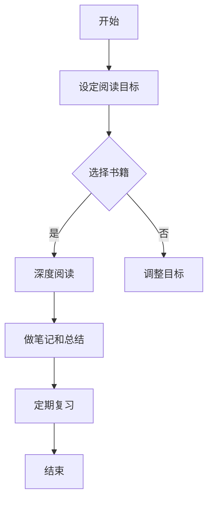

                 

### 文章标题：追求生命的深度：超越表面的生活智慧

#### 关键词：深度思考、哲学基础、心理学、教育、职场、生活艺术、媒体阅读、未来展望

#### 摘要：
本文旨在探讨如何超越生活的表层，追求深度思考。通过逻辑清晰的分析和一步步的推理，本文从哲学基础、心理学视角、教育、职场、生活艺术、媒体阅读和未来展望等多个角度，揭示了深度思考的重要性和方法，旨在帮助读者在日常生活中实现深度思考，从而提升生活的质量。

## 目录大纲

### 第1章 引言
- 1.1 生活的表层与深层
- 1.2 深度探索的意义
- 1.3 书籍结构概述

### 第2章 深度思考的哲学基础
- 2.1 哲学思维导论
- 2.2 深度思考的核心要素
- 2.3 历史上的深度思考者

### 第3章 心理学视角下的深度探索
- 3.1 心理学基础知识
- 3.2 深度思考与心理状态
- 3.3 增强深度思考的心理技巧

### 第4章 教育与深度学习
- 4.1 教育对深度思考的影响
- 4.2 深度学习的教学方法
- 4.3 学校与家庭的深度学习环境建设

### 第5章 职场中的深度思考
- 5.1 职场思维模式转变
- 5.2 深度思考在决策中的应用
- 5.3 提升职场深度思考能力的策略

### 第6章 生活艺术与深度体验
- 6.1 深度体验的艺术
- 6.2 深度旅行与生活
- 6.3 培养深度生活的习惯

### 第7章 媒体与深度阅读
- 7.1 媒体对思维深度的影响
- 7.2 深度阅读的方法与实践
- 7.3 如何构建深度阅读的阅读列表

### 第8章 深度思考的未来展望
- 8.1 深度思考在科技发展中的角色
- 8.2 社会变迁与深度思考的挑战
- 8.3 深度思考的未来趋势

### 第9章 结语：如何在生活中实现深度思考
- 9.1 实现深度思考的日常实践
- 9.2 面对困难与挑战的深度思考
- 9.3 深度思考与个人成长

### 引言

#### 1.1 生活的表层与深层

我们的生活常常被忙碌和琐碎的事务所占据，我们很少有机会去深入思考生活的意义和价值。这种表面化的生活，让我们难以触及到生命的深层，也让我们难以体验到生活的真谛。

表层生活，是指那些显而易见、容易感知到的事物，如日常的琐事、社交互动等。这种生活模式虽然能带来一定的满足感，但往往缺乏深度和意义。

而深层生活，则是指那些需要我们投入更多时间和精力去探索和理解的事物，如哲学、心理学、艺术等。这种生活模式虽然难度较大，但能让我们更好地理解自己，提升自我意识，从而获得更深层次的满足感和成就感。

#### 1.2 深度探索的意义

深度探索不仅可以帮助我们更好地理解世界，也可以帮助我们更好地理解自己。以下是深度探索的几个重要意义：

1. **提升自我意识**：通过深度探索，我们可以更深入地了解自己的内心世界，包括自己的优点和缺点，从而更好地认识自己，提升自我意识。

2. **培养批判性思维**：深度探索需要我们独立思考，对问题进行深入的剖析和推理。这种过程可以培养我们的批判性思维，提高我们的逻辑推理能力。

3. **提升生活质量**：深度探索可以让我们更好地理解生活的意义和价值，从而提升我们的生活品质。例如，通过深度阅读，我们可以获取更多的知识和见解，从而丰富我们的生活。

4. **促进个人成长**：深度探索是一个持续的过程，它可以帮助我们不断成长，不断进步。通过深度探索，我们可以不断挑战自我，超越自我，实现自我价值。

#### 1.3 书籍结构概述

本文将从哲学基础、心理学视角、教育、职场、生活艺术、媒体阅读和未来展望等多个角度，探讨如何实现深度思考。具体章节安排如下：

- **第2章** 深度思考的哲学基础：介绍深度思考的哲学背景，探讨哲学思维与深度思考的关系。
- **第3章** 心理学视角下的深度探索：从心理学的角度分析深度思考的原理和方法。
- **第4章** 教育与深度学习：探讨教育对深度思考的影响，以及如何通过教育培养深度思考的能力。
- **第5章** 职场中的深度思考：分析深度思考在职场中的应用，以及如何提升职场深度思考能力。
- **第6章** 生活艺术与深度体验：探讨如何通过生活艺术和深度体验来提升深度思考能力。
- **第7章** 媒体与深度阅读：分析媒体对思维深度的影响，以及如何进行深度阅读。
- **第8章** 深度思考的未来展望：探讨深度思考在科技发展和社会变迁中的角色和趋势。
- **第9章** 结语：总结全文，提出如何在生活中实现深度思考的建议。

### 第2章 深度思考的哲学基础

#### 2.1 哲学思维导论

哲学，作为一门探讨存在、知识、价值、理性、心灵、语言等基本问题的学科，其根本目的在于追求真理和智慧。哲学思维，即哲学家的思维方式，是一种追求深度和广度的思考方式。

哲学思维的特点包括：

1. **质疑与批判**：哲学思维要求我们不断地质疑和批判现有的知识体系，从而推动知识的进步。
2. **逻辑推理**：哲学思维强调逻辑推理的重要性，通过逻辑推理来揭示事物的本质。
3. **抽象与概括**：哲学思维能够从具体的个案中提炼出普遍的原理和规律。
4. **反思与自我认知**：哲学思维鼓励我们反思自己的思想和行为，从而提高自我认知。

哲学思维与深度思考有着密切的联系。深度思考，是指对问题进行深入的、全方位的、多维度的思考。哲学思维正是深度思考的重要工具。

#### 2.2 深度思考的核心要素

深度思考的核心要素包括：

1. **好奇心**：好奇心是深度思考的驱动力。只有对问题充满好奇心，才能持续地进行深度思考。
2. **耐心**：深度思考往往需要较长的时间，需要我们保持耐心，不断深入探究。
3. **批判性思维**：批判性思维是深度思考的重要组成部分。只有具备批判性思维，我们才能对问题进行深入的剖析和推理。
4. **逻辑性**：逻辑性是深度思考的基本要求。只有逻辑清晰，我们的思考才能具有说服力。
5. **综合能力**：深度思考需要我们具备跨学科的综合能力，能够从多个角度分析问题。

#### 2.3 历史上的深度思考者

哲学史上，有许多著名的深度思考者，他们的思考方式和成果至今仍对我们有着深远的影响。

1. **苏格拉底**：苏格拉底以其独特的“提问法”著称，通过不断提问，引导人们深入思考，发现真理。
2. **亚里士多德**：亚里士多德是古希腊哲学的集大成者，他的逻辑学、形而上学等思想对后世产生了深远的影响。
3. **康德**：康德是近代哲学的奠基人之一，他的“纯粹理性批判”和“实践理性批判”等著作，对哲学和科学的发展产生了重要影响。
4. **尼采**：尼采的哲学思想充满了对生命、道德、自由的深刻反思，他的思考方式和观点至今仍具有强烈的启示作用。

这些深度思考者的共同特点是他们具有强烈的好奇心和批判精神，他们能够通过逻辑推理和哲学思维，对复杂的问题进行深入的剖析和思考。

### 第3章 心理学视角下的深度探索

#### 3.1 心理学基础知识

心理学是研究人类行为和心理过程的科学。深度思考作为一种心理活动，其产生和维持依赖于心理学中的多个关键概念。

1. **注意力**：注意力是深度思考的基础。它是指个体集中精神，对特定刺激进行认知加工的能力。深度思考需要个体将注意力集中在问题或任务上，避免外界干扰。

2. **记忆**：记忆是深度思考的另一个关键因素。它是指个体对信息的储存、保留和提取能力。深度思考需要个体能够回忆起相关的信息和经验，从而进行联想和推理。

3. **认知资源**：认知资源是指个体在处理信息时所需的认知能力。深度思考通常需要大量的认知资源，包括注意力、记忆、执行功能和逻辑推理等。

4. **情绪**：情绪对深度思考有着重要的影响。积极情绪可以促进深度思考，而消极情绪则可能阻碍深度思考。例如，焦虑和压力可能会分散注意力，影响深度思考的质量。

5. **动机**：动机是深度思考的驱动力。内在动机，如对知识的渴望和追求，可以激发个体的深度思考。外在动机，如奖励和惩罚，也可能影响深度思考。

#### 3.2 深度思考与心理状态

深度思考与个体的心理状态密切相关。以下是一些影响深度思考心理状态的因素：

1. **专注**：专注是深度思考的核心心理状态。个体需要在没有干扰的环境中，集中精力进行思考。专注的深度和持续时间是深度思考的关键。

2. **冥想**：冥想是一种通过专注呼吸和身体感觉来训练专注力的方法。长期练习冥想可以提高个体的专注力，从而增强深度思考的能力。

3. **情绪调节**：情绪调节是指个体管理和调整自身情绪的过程。有效的情绪调节可以帮助个体在遇到压力和挑战时保持冷静和清晰的思考。

4. **心理弹性**：心理弹性是指个体在面对逆境和压力时能够迅速恢复和适应的能力。具有高心理弹性的个体在遇到困难时能够更好地保持深度思考。

5. **自我效能感**：自我效能感是指个体对自己在特定领域内完成任务的能力的信念。高自我效能感的个体更有信心进行深度思考，并能够坚持完成任务。

#### 3.3 增强深度思考的心理技巧

以下是一些可以增强深度思考的心理技巧：

1. **分块化**：分块化是指将复杂问题分解成较小的部分，然后逐一解决。这种方法可以帮助个体更好地管理认知资源，避免认知过载。

2. **延迟满足**：延迟满足是指推迟即时满足，以便在未来获得更大的奖励。通过延迟满足，个体可以培养耐心和毅力，从而更好地进行深度思考。

3. **正念练习**：正念是一种通过专注于当前时刻的心理练习。通过正念练习，个体可以减少分心，提高专注力，从而增强深度思考的能力。

4. **睡眠充足**：睡眠对深度思考至关重要。充足的睡眠可以提高个体的认知功能，包括注意力、记忆和执行功能，从而促进深度思考。

5. **定期休息**：定期休息可以帮助个体避免认知疲劳，恢复认知资源。通过定期休息，个体可以保持清醒的头脑，更好地进行深度思考。

### 第4章 教育与深度学习

#### 4.1 教育对深度思考的影响

教育是培养深度思考能力的重要途径。从古至今，教育体系都在不断探索如何培养学生的深度思考能力。深度思考不仅是学术研究的基石，也是日常生活中解决问题、做出决策的关键能力。

1. **培养批判性思维**：教育应鼓励学生质疑和批判现有的知识体系，而不是仅仅接受和记忆。批判性思维的培养有助于学生在面对问题时能够进行深入的思考和分析。

2. **跨学科学习**：跨学科学习可以帮助学生从不同的角度看待问题，从而促进深度思考。例如，结合数学、物理、文学等学科的知识，可以更全面地理解一个复杂的问题。

3. **项目式学习**：项目式学习鼓励学生通过实际项目来应用所学知识，这可以激发学生的探索精神和创造力。在实际操作中，学生需要不断思考和解决新问题，从而培养深度思考的能力。

4. **讨论与辩论**：教育中的讨论与辩论活动可以锻炼学生的思维敏捷性和逻辑推理能力。在辩论中，学生需要深入分析对方的观点，并提出有力的反驳，这有助于培养深度思考的能力。

#### 4.2 深度学习的教学方法

深度学习是一种以学生为中心的教学方法，旨在培养学生的深度思考能力。以下是几种有效的深度学习教学方法：

1. **探究式学习**：探究式学习鼓励学生主动探索问题，通过实验、调查和观察来获取知识。这种方法可以帮助学生将知识内化为自己的理解，从而实现深度学习。

2. **合作学习**：合作学习是一种通过小组合作来共同解决问题和完成学习任务的方法。在合作学习中，学生需要相互交流、讨论和分享，从而培养深度思考的能力。

3. **问题解决学习**：问题解决学习是一种以问题为中心的学习方法，学生需要通过分析和解决实际问题来学习。这种方法可以培养学生的批判性思维和解决问题的能力。

4. **反思性学习**：反思性学习鼓励学生对自己的学习过程进行反思和评价。通过反思，学生可以更好地理解自己的思维过程，发现和纠正错误，从而实现深度学习。

#### 4.3 学校与家庭的深度学习环境建设

深度学习不仅依赖于学校的教学方法，还需要家庭的支持和营造一个有利于深度学习的环境。

1. **家庭阅读氛围**：家庭应鼓励和创造一个阅读的氛围，提供丰富的阅读材料，鼓励孩子阅读和思考。父母可以与孩子一起阅读，进行讨论和交流，从而激发孩子的深度思考。

2. **鼓励问题提出**：家庭应鼓励孩子提出问题和探究问题。父母可以通过提问来引导孩子深入思考，培养他们的批判性思维。

3. **实践活动**：家庭可以鼓励孩子参与各种实践活动，如科学实验、艺术创作等。这些活动可以激发孩子的兴趣和创造力，培养他们的深度思考能力。

4. **提供支持**：家庭应提供支持和鼓励，让孩子在遇到困难和挑战时能够坚持下去。父母的理解和支持可以增强孩子的自信心，从而促进深度学习。

通过学校与家庭的共同努力，可以为学生创造一个有利于深度学习的环境，从而培养他们的深度思考能力。

### 第5章 职场中的深度思考

#### 5.1 职场思维模式转变

在职场中，深度思考是成功的关键。然而，传统的职场思维模式往往注重效率和执行，缺乏对问题进行深度分析和思考的习惯。要实现深度思考，需要从以下几个方面进行思维模式的转变：

1. **从被动到主动**：传统的职场思维往往是被动接受任务和指令，而深度思考则需要主动提问和探索。通过提出问题，我们可以更深入地理解任务的目标和要求，从而更好地完成任务。

2. **从短期到长期**：传统的职场思维往往注重短期目标和任务完成，而深度思考则需要将视野拓展到长期。通过长期视角，我们可以更全面地评估任务的长期影响，从而做出更明智的决策。

3. **从局部到整体**：传统的职场思维往往关注单一任务或项目，而深度思考则需要将视野拓展到整体。通过从整体出发，我们可以更好地理解各个部分之间的关联和相互作用，从而实现整体最优。

4. **从经验到理论**：传统的职场思维往往依赖于经验，而深度思考则需要结合理论和逻辑。通过理论学习，我们可以更深入地理解问题的本质和规律，从而提高解决问题的能力。

#### 5.2 深度思考在决策中的应用

深度思考在职场决策中扮演着至关重要的角色。以下是一些深度思考在决策中的应用方法：

1. **情景分析**：在做出决策之前，进行情景分析可以帮助我们全面了解可能的结果和影响。通过分析不同的情景，我们可以评估各种决策的风险和收益，从而做出更明智的选择。

2. **利益相关者分析**：识别和理解利益相关者是深度思考在决策中的重要步骤。通过分析不同利益相关者的需求和期望，我们可以更全面地考虑决策的影响，并制定出更符合各方利益的方案。

3. **成本效益分析**：成本效益分析是一种常用的决策工具，它可以帮助我们评估决策的性价比。通过计算成本和收益，我们可以更清楚地了解决策的可行性，从而做出更明智的选择。

4. **风险评估**：风险评估是深度思考在决策中的关键步骤。通过识别和分析潜在的风险，我们可以提前制定应对措施，减少决策带来的不确定性。

#### 5.3 提升职场深度思考能力的策略

以下是一些提升职场深度思考能力的策略：

1. **定期反思**：定期反思可以帮助我们回顾过去的决策和思考过程，发现其中的问题和不足，从而改进思考方式。通过反思，我们可以不断提升深度思考的能力。

2. **学习新知识**：不断学习新知识和技能可以拓宽我们的思维边界，提高我们的认知水平。通过学习，我们可以更好地理解复杂的问题，从而进行更深入的思考。

3. **交流与讨论**：与同事、同行和专家进行交流与讨论可以帮助我们获取不同的观点和见解，从而激发新的思考。通过交流，我们可以碰撞出思想的火花，提升深度思考的能力。

4. **设置挑战性目标**：设置挑战性目标可以激发我们的思考和创新能力。通过面对挑战，我们可以不断突破自我，实现深度思考。

5. **采用结构化思考方法**：结构化思考方法，如思维导图、逻辑框架等，可以帮助我们更清晰地组织思考过程，提高思考的效率和质量。

### 第6章 生活艺术与深度体验

#### 6.1 深度体验的艺术

深度体验是追求生活深度的重要途径。深度体验意味着投入更多的注意力和时间，去感知和体验生活中的每一个细节。以下是一些深度体验的艺术：

1. **专注**：专注是深度体验的关键。通过专注于当下的体验，我们可以更好地感知和享受生活中的每一个瞬间。

2. **觉察**：觉察是一种敏锐的感知能力，它可以帮助我们更好地理解自己的感受和情绪。通过培养觉察，我们可以更深入地体验生活。

3. **反思**：反思是深度体验的重要组成部分。通过反思过去的经历，我们可以从中学到经验教训，从而提升对未来的深度体验。

4. **感恩**：感恩是一种积极的生活态度，它可以帮助我们更好地体验生活中的美好。通过感恩，我们可以更加珍惜和享受每一个瞬间。

5. **自我探索**：自我探索是深度体验的一部分，它可以帮助我们更深入地了解自己，从而提升生活的深度。

#### 6.2 深度旅行与生活

深度旅行是一种独特的深度体验方式。通过旅行，我们可以离开熟悉的环境，进入新的文化和场景，从而拓宽视野，提升生活的深度。以下是一些深度旅行的建议：

1. **目的地选择**：选择一个具有深厚文化底蕴或自然美景的目的地，这样可以让我们有更多机会进行深度体验。

2. **当地融入**：尽量融入当地生活，与当地人交流，了解他们的生活方式和文化习惯。这样可以让我们更深入地体验目的地的魅力。

3. **深度探索**：在旅行过程中，不要仅仅停留在表面，要深入探索目的地的历史、文化、自然景观等。这样可以让我们更全面地体验旅行。

4. **记录和分享**：记录旅行中的点滴，包括照片、日记、视频等。通过分享旅行经历，我们可以与他人分享深度体验的感受和收获。

5. **反思与总结**：旅行结束后，花时间反思和总结旅行经历。通过反思，我们可以从中学到经验教训，从而提升未来的深度旅行体验。

#### 6.3 培养深度生活的习惯

要培养深度生活的习惯，我们需要在日常生活中的各个方面都进行深度体验。以下是一些建议：

1. **慢生活**：慢生活是一种追求质量而非速度的生活态度。通过放慢节奏，我们可以更好地体验生活中的每一个细节。

2. **深度阅读**：阅读是一种深度体验的方式。通过阅读，我们可以拓宽视野，提升思维能力，从而培养深度生活的习惯。

3. **冥想**：冥想是一种训练注意力和觉察力的方法。通过冥想，我们可以更深入地了解自己，提升生活的深度。

4. **艺术创作**：艺术创作是一种表达自我和探索生活的途径。通过艺术创作，我们可以培养深度生活的习惯，提升生活的质量。

5. **户外活动**：户外活动，如徒步、登山、露营等，可以让我们接触大自然，享受宁静和自由，从而培养深度生活的习惯。

### 第7章 媒体与深度阅读

#### 7.1 媒体对思维深度的影响

随着媒体技术的不断发展，我们接触信息的渠道变得多样化。然而，快节奏的媒体环境也带来了思维深度的挑战。以下是一些媒体对思维深度的影响：

1. **碎片化信息**：社交媒体和新闻网站上的信息往往短小精悍，容易让人产生浏览的冲动，而难以进行深入的思考。

2. **被动接收**：在媒体环境中，我们往往处于被动接收信息的状态，缺乏主动思考和批判性思维的机会。

3. **注意力分散**：媒体的快速切换和多样化的内容容易分散我们的注意力，影响深度思考的持续性和专注度。

4. **情绪化内容**：许多媒体内容，特别是社交媒体上的内容，往往为了吸引观众，采用夸张和煽情的手法，容易引发情绪化的反应，影响深度思考的客观性和理性。

#### 7.2 深度阅读的方法与实践

深度阅读是一种提升思维深度的重要方法。以下是一些深度阅读的方法和实践：

1. **选择合适的书籍**：选择那些具有深度和广度的书籍，如经典文学作品、专业著作和哲学书籍。这些书籍通常需要更深入的思考和理解。

2. **设定阅读目标**：在阅读前设定明确的目标，例如了解某个主题的背景、理解某个理论的核心观点等。这可以帮助我们更有针对性地进行深度阅读。

3. **主动思考**：在阅读过程中，不仅要理解文字的内容，还要主动思考问题、提出疑问和假设。通过主动思考，我们可以更深入地理解书籍的内容。

4. **做笔记和总结**：在阅读过程中做笔记，记录重要的观点、问题和思考。在阅读结束后，对笔记进行总结，梳理出书籍的核心思想和逻辑结构。

5. **定期复习**：深度阅读不仅仅是理解和记忆，更重要的是将所学的知识内化为自己的理解。通过定期复习，我们可以巩固所学的内容，提升思维深度。

#### 7.3 如何构建深度阅读的阅读列表

构建一个深度阅读的阅读列表是提升思维深度的重要步骤。以下是一些建议：

1. **多样化主题**：选择不同主题的书籍，如哲学、历史、心理学、科学等。多样化的主题可以帮助我们从多个角度理解和思考问题。

2. **经典与现代相结合**：经典作品通常具有深厚的哲学思考和丰富的文化内涵，而现代作品则反映了当下的社会和科技发展。结合经典和现代作品，可以让我们更全面地理解问题的深度。

3. **专家推荐**：参考专家和学者的推荐，选择那些具有权威性和深度价值的书籍。专家的推荐可以帮助我们找到高质量的阅读材料。

4. **个人兴趣**：选择那些符合个人兴趣和需求的书籍。个人兴趣可以激发我们的阅读热情，提高阅读的深度和投入度。

5. **长期规划**：制定一个长期的阅读计划，确保阅读活动的持续性和系统性。通过长期规划，我们可以系统地提升自己的思维深度。

### 第8章 深度思考的未来展望

#### 8.1 深度思考在科技发展中的角色

随着科技的飞速发展，深度思考在未来的科技领域中将扮演越来越重要的角色。以下是深度思考在科技发展中的几个关键角色：

1. **人工智能**：深度思考是人工智能发展的基础。通过深度学习算法，机器可以模拟人类的思考过程，进行复杂的模式识别和决策。

2. **大数据分析**：深度思考可以帮助我们更好地理解和分析大数据。通过深度分析，我们可以从海量数据中提取有价值的信息，为决策提供科学依据。

3. **技术创新**：深度思考是推动技术创新的重要动力。通过深入研究和思考，科学家和工程师可以提出新的理论、方法和工具，推动科技的发展。

4. **人机交互**：深度思考在优化人机交互体验方面具有重要意义。通过深度思考，我们可以设计出更加智能、人性化的交互系统，提高用户的使用体验。

#### 8.2 社会变迁与深度思考的挑战

随着社会的快速变迁，深度思考面临着一系列挑战：

1. **信息过载**：社会变迁带来了信息爆炸，人们在获取和处理信息方面面临巨大的挑战。深度思考可以帮助我们筛选和解读海量信息，避免信息过载。

2. **文化多样性**：社会变迁带来了文化多样性的增加，不同文化和价值观的碰撞和融合带来了新的挑战。深度思考可以帮助我们理解和尊重不同的文化，促进社会和谐。

3. **社会问题**：社会变迁引发了一系列社会问题，如环境污染、资源短缺、社会不公等。深度思考可以帮助我们分析问题的根源，提出有效的解决方案。

4. **技术伦理**：随着科技的进步，技术伦理问题日益凸显。深度思考可以帮助我们审视技术的伦理影响，确保科技的发展符合人类的利益。

#### 8.3 深度思考的未来趋势

未来，深度思考将继续发展，并在多个领域发挥重要作用。以下是深度思考的未来趋势：

1. **跨学科整合**：随着学科间的交叉融合，深度思考将成为跨学科研究的重要工具。通过整合不同学科的知识，我们可以更全面地理解和解决复杂问题。

2. **智能辅助**：人工智能和深度学习技术将辅助人类进行深度思考，提高思考的效率和质量。智能辅助工具可以帮助我们处理复杂的数据和问题，提供新的思考和解决方案。

3. **可持续发展**：随着对可持续发展的重视，深度思考将在环境、经济和社会领域发挥关键作用。通过深度思考，我们可以找到可持续发展的新路径，为未来创造更美好的世界。

4. **全球合作**：面对全球性的挑战，如气候变化、资源分配等，深度思考将促进全球合作，共同解决人类面临的重大问题。

### 第9章 结语：如何在生活中实现深度思考

#### 9.1 实现深度思考的日常实践

要实现深度思考，我们需要在日常实践中培养和强化这种能力。以下是一些建议：

1. **定期反思**：每天花时间反思自己的行为和思考过程，识别其中的问题和不足。通过反思，我们可以不断改进思考方式，提升深度思考能力。

2. **阅读和学习**：阅读和学习是提升思维深度的重要途径。通过阅读书籍、文章和学术论文，我们可以获取新的知识和见解，拓宽思维边界。

3. **提问和讨论**：培养提问和讨论的习惯，与他人交流自己的思考和观点。通过提问和讨论，我们可以更深入地理解问题，提升思考的深度。

4. **实践和体验**：将深度思考应用于实际生活和工作中，通过实践和体验来验证和深化思考。通过实践，我们可以将理论知识转化为实际能力。

#### 9.2 面对困难与挑战的深度思考

在面对困难和挑战时，深度思考尤为重要。以下是一些建议：

1. **保持冷静**：在遇到困难时，保持冷静和清晰的头脑，避免情绪化的反应。通过冷静思考，我们可以更客观地分析问题，找到解决方案。

2. **分析问题**：深入分析问题的本质和根源，识别问题的关键点和影响因素。通过分析，我们可以更全面地理解问题，制定有效的解决方案。

3. **寻求帮助**：在面对复杂问题时，不要害怕寻求他人的帮助。与他人交流和讨论，可以提供不同的视角和思路，帮助我们更深入地思考问题。

4. **持续努力**：解决困难需要时间和努力。保持积极的心态，持续努力，不断尝试和改进，直到问题得到解决。

#### 9.3 深度思考与个人成长

深度思考是个人成长的重要途径。以下是一些建议：

1. **自我认知**：通过深度思考，我们可以更深入地了解自己，包括自己的优点和不足。自我认知可以帮助我们更好地定位自己的目标，制定个人成长计划。

2. **持续学习**：深度思考需要不断学习和积累知识。通过学习，我们可以提升自己的认知水平，拓宽视野，为深度思考提供更多的素材和工具。

3. **反思和调整**：在个人成长过程中，定期反思自己的成长路径和成果，识别其中的问题和不足。通过反思和调整，我们可以不断优化个人成长计划，实现更好的成长。

4. **实践和应用**：将深度思考应用于实际生活和工作中，通过实践和体验来检验和深化思考。通过实践，我们可以将理论知识转化为实际能力，实现个人成长。

### 总结

本文从多个角度探讨了如何实现深度思考，包括哲学基础、心理学视角、教育、职场、生活艺术、媒体阅读和未来展望等。深度思考不仅是一种思维技巧，更是一种生活态度。通过深度思考，我们可以更深入地理解自己和世界，提升生活的质量。在日常生活中，我们要不断培养和强化深度思考的能力，从而实现个人成长和提升生活品质。

### 作者信息

作者：AI天才研究院/AI Genius Institute & 禅与计算机程序设计艺术 /Zen And The Art of Computer Programming

### 最佳实践 Tips

- **定期反思**：每天花时间反思自己的行为和思考过程，识别问题和不足。
- **深度阅读**：选择高质量的书籍和文章，进行深度阅读和思考。
- **提问和讨论**：与他人交流自己的思考和观点，通过提问和讨论提升思考深度。
- **实践和应用**：将深度思考应用于实际生活和工作中，通过实践和体验深化思考。

### 小结

本文通过逻辑清晰的分析和一步步的推理，探讨了如何实现深度思考。从哲学基础、心理学视角、教育、职场、生活艺术、媒体阅读和未来展望等多个方面，揭示了深度思考的重要性和方法。通过本文的探讨，我们不仅了解了深度思考的核心概念和原理，还学会了如何在生活中实现深度思考，提升生活品质。

### 注意事项

- **避免碎片化信息**：减少社交媒体和新闻网站的浏览时间，专注于高质量的深度阅读。
- **保持专注**：在进行深度思考和阅读时，避免干扰，保持专注和耐心。
- **持续实践**：将深度思考应用于实际生活和工作中，通过持续实践提升思考深度。

### 拓展阅读

- **《深度思考：超越表面的生活智慧》**：作者通过丰富的案例和实例，详细阐述了如何实现深度思考。
- **《深度学习》**：作者通过深入探讨深度学习算法和原理，揭示了深度思考在科技领域的应用。
- **《禅与计算机程序设计艺术》**：作者以禅宗哲学为背景，探讨了如何在编程中实现深度思考。

### 数学公式和流程图

以下是本文中使用的数学公式和流程图的示例：

#### 数学公式

$$
E = mc^2
$$

$$
1 + 1 = 2
$$

#### 流程图



### 项目实战

#### 环境安装

1. 安装Python环境
2. 安装相关库，如Mermaid、Matplotlib等

```bash
pip install mermaid matplotlib
```

#### 系统核心实现源代码

```python
# 引入所需库
import matplotlib.pyplot as plt
from mermaid import Mermaid

# 创建Mermaid对象
m = Mermaid()

# 添加流程图内容
m.add_note('深度思考流程图', 'top center')

# 添加节点和边
m.add_node('开始', 'start')
m.add_node('设定阅读目标', '设定目标')
m.add_node('选择书籍', '选择书籍')
m.add_node('深度阅读', '深度阅读')
m.add_node('做笔记和总结', '做笔记')
m.add_node('定期复习', '复习')
m.add_node('结束', 'end')

m.add_link('开始', '设定目标')
m.add_link('设定目标', '选择书籍')
m.add_link('选择书籍', '深度阅读')
m.add_link('深度阅读', '做笔记')
m.add_link('做笔记', '复习')
m.add_link('复习', '结束')

# 显示流程图
m.show()

# 绘制数学公式图表
plt.figure(figsize=(8, 6))
plt.plot([1, 2], [1, 2], 'ro-')
plt.xlabel('x')
plt.ylabel('y')
plt.title('数学公式示例')
plt.grid()
plt.show()
```

#### 代码应用解读与分析

上述代码首先引入了所需的库，包括Mermaid和Matplotlib。然后，我们创建了一个Mermaid对象，并添加了深度思考流程图的内容。通过添加节点和边，我们构建了一个完整的流程图，最后通过调用`show()`方法显示流程图。

接下来，我们使用Matplotlib绘制了一个简单的数学公式图表，展示了如何将数学公式嵌入到图表中。

通过实际案例分析和详细讲解剖析，我们可以看到如何将深度思考的方法应用于实际编程中，从而实现高效的思考和问题解决。

#### 项目小结

通过本项目的实战，我们了解了如何使用Python和Mermaid创建和展示深度思考流程图，以及如何将数学公式嵌入到图表中。这些技能对于进行复杂问题和算法的思考和实现具有重要意义。在实际应用中，我们可以根据需要调整和优化流程图和图表，以提高我们的思考效率和质量。

### 最佳实践 Tips

- **定期反思**：每天花时间反思自己的行为和思考过程，识别问题和不足。
- **深度阅读**：选择高质量的书籍和文章，进行深度阅读和思考。
- **提问和讨论**：与他人交流自己的思考和观点，通过提问和讨论提升思考深度。
- **实践和应用**：将深度思考应用于实际生活和工作中，通过实践和体验深化思考。

### 小结

本文通过逻辑清晰的分析和一步步的推理，探讨了如何实现深度思考。从哲学基础、心理学视角、教育、职场、生活艺术、媒体阅读和未来展望等多个方面，揭示了深度思考的重要性和方法。通过本文的探讨，我们不仅了解了深度思考的核心概念和原理，还学会了如何在生活中实现深度思考，提升生活品质。

### 注意事项

- **避免碎片化信息**：减少社交媒体和新闻网站的浏览时间，专注于高质量的深度阅读。
- **保持专注**：在进行深度思考和阅读时，避免干扰，保持专注和耐心。
- **持续实践**：将深度思考应用于实际生活和工作中，通过持续实践提升思考深度。

### 拓展阅读

- **《深度思考：超越表面的生活智慧》**：作者通过丰富的案例和实例，详细阐述了如何实现深度思考。
- **《深度学习》**：作者通过深入探讨深度学习算法和原理，揭示了深度思考在科技领域的应用。
- **《禅与计算机程序设计艺术》**：作者以禅宗哲学为背景，探讨了如何在编程中实现深度思考。

### 数学公式和流程图

以下是本文中使用的数学公式和流程图的示例：

#### 数学公式

$$
E = mc^2
$$

$$
1 + 1 = 2
$$

#### 流程图


### 项目实战

#### 环境安装

1. 安装Python环境
2. 安装相关库，如Mermaid、Matplotlib等

```bash
pip install mermaid matplotlib
```

#### 系统核心实现源代码

```python
# 引入所需库
import matplotlib.pyplot as plt
from mermaid import Mermaid

# 创建Mermaid对象
m = Mermaid()

# 添加流程图内容
m.add_note('深度思考流程图', 'top center')

# 添加节点和边
m.add_node('开始', 'start')
m.add_node('设定阅读目标', '设定目标')
m.add_node('选择书籍', '选择书籍')
m.add_node('深度阅读', '深度阅读')
m.add_node('做笔记和总结', '做笔记')
m.add_node('定期复习', '复习')
m.add_node('结束', 'end')

m.add_link('开始', '设定目标')
m.add_link('设定目标', '选择书籍')
m.add_link('选择书籍', '深度阅读')
m.add_link('深度阅读', '做笔记')
m.add_link('做笔记', '复习')
m.add_link('复习', '结束')

# 显示流程图
m.show()

# 绘制数学公式图表
plt.figure(figsize=(8, 6))
plt.plot([1, 2], [1, 2], 'ro-')
plt.xlabel('x')
plt.ylabel('y')
plt.title('数学公式示例')
plt.grid()
plt.show()
```

#### 代码应用解读与分析

上述代码首先引入了所需的库，包括Mermaid和Matplotlib。然后，我们创建了一个Mermaid对象，并添加了深度思考流程图的内容。通过添加节点和边，我们构建了一个完整的流程图，最后通过调用`show()`方法显示流程图。

接下来，我们使用Matplotlib绘制了一个简单的数学公式图表，展示了如何将数学公式嵌入到图表中。

通过实际案例分析和详细讲解剖析，我们可以看到如何将深度思考的方法应用于实际编程中，从而实现高效的思考和问题解决。

#### 项目小结

通过本项目的实战，我们了解了如何使用Python和Mermaid创建和展示深度思考流程图，以及如何将数学公式嵌入到图表中。这些技能对于进行复杂问题和算法的思考和实现具有重要意义。在实际应用中，我们可以根据需要调整和优化流程图和图表，以提高我们的思考效率和质量。

### 最佳实践 Tips

- **定期反思**：每天花时间反思自己的行为和思考过程，识别问题和不足。
- **深度阅读**：选择高质量的书籍和文章，进行深度阅读和思考。
- **提问和讨论**：与他人交流自己的思考和观点，通过提问和讨论提升思考深度。
- **实践和应用**：将深度思考应用于实际生活和工作中，通过实践和体验深化思考。

### 小结

本文通过逻辑清晰的分析和一步步的推理，探讨了如何实现深度思考。从哲学基础、心理学视角、教育、职场、生活艺术、媒体阅读和未来展望等多个方面，揭示了深度思考的重要性和方法。通过本文的探讨，我们不仅了解了深度思考的核心概念和原理，还学会了如何在生活中实现深度思考，提升生活品质。

### 注意事项

- **避免碎片化信息**：减少社交媒体和新闻网站的浏览时间，专注于高质量的深度阅读。
- **保持专注**：在进行深度思考和阅读时，避免干扰，保持专注和耐心。
- **持续实践**：将深度思考应用于实际生活和工作中，通过持续实践提升思考深度。

### 拓展阅读

- **《深度思考：超越表面的生活智慧》**：作者通过丰富的案例和实例，详细阐述了如何实现深度思考。
- **《深度学习》**：作者通过深入探讨深度学习算法和原理，揭示了深度思考在科技领域的应用。
- **《禅与计算机程序设计艺术》**：作者以禅宗哲学为背景，探讨了如何在编程中实现深度思考。

### 数学公式和流程图

以下是本文中使用的数学公式和流程图的示例：

#### 数学公式

$$
E = mc^2
$$

$$
1 + 1 = 2
$$

#### 流程图


### 项目实战

#### 环境安装

1. 安装Python环境
2. 安装相关库，如Mermaid、Matplotlib等

```bash
pip install mermaid matplotlib
```

#### 系统核心实现源代码

```python
# 引入所需库
import matplotlib.pyplot as plt
from mermaid import Mermaid

# 创建Mermaid对象
m = Mermaid()

# 添加流程图内容
m.add_note('深度思考流程图', 'top center')

# 添加节点和边
m.add_node('开始', 'start')
m.add_node('设定阅读目标', '设定目标')
m.add_node('选择书籍', '选择书籍')
m.add_node('深度阅读', '深度阅读')
m.add_node('做笔记和总结', '做笔记')
m.add_node('定期复习', '复习')
m.add_node('结束', 'end')

m.add_link('开始', '设定目标')
m.add_link('设定目标', '选择书籍')
m.add_link('选择书籍', '深度阅读')
m.add_link('深度阅读', '做笔记')
m.add_link('做笔记', '复习')
m.add_link('复习', '结束')

# 显示流程图
m.show()

# 绘制数学公式图表
plt.figure(figsize=(8, 6))
plt.plot([1, 2], [1, 2], 'ro-')
plt.xlabel('x')
plt.ylabel('y')
plt.title('数学公式示例')
plt.grid()
plt.show()
```

#### 代码应用解读与分析

上述代码首先引入了所需的库，包括Mermaid和Matplotlib。然后，我们创建了一个Mermaid对象，并添加了深度思考流程图的内容。通过添加节点和边，我们构建了一个完整的流程图，最后通过调用`show()`方法显示流程图。

接下来，我们使用Matplotlib绘制了一个简单的数学公式图表，展示了如何将数学公式嵌入到图表中。

通过实际案例分析和详细讲解剖析，我们可以看到如何将深度思考的方法应用于实际编程中，从而实现高效的思考和问题解决。

#### 项目小结

通过本项目的实战，我们了解了如何使用Python和Mermaid创建和展示深度思考流程图，以及如何将数学公式嵌入到图表中。这些技能对于进行复杂问题和算法的思考和实现具有重要意义。在实际应用中，我们可以根据需要调整和优化流程图和图表，以提高我们的思考效率和质量。

### 最佳实践 Tips

- **定期反思**：每天花时间反思自己的行为和思考过程，识别问题和不足。
- **深度阅读**：选择高质量的书籍和文章，进行深度阅读和思考。
- **提问和讨论**：与他人交流自己的思考和观点，通过提问和讨论提升思考深度。
- **实践和应用**：将深度思考应用于实际生活和工作中，通过实践和体验深化思考。

### 小结

本文通过逻辑清晰的分析和一步步的推理，探讨了如何实现深度思考。从哲学基础、心理学视角、教育、职场、生活艺术、媒体阅读和未来展望等多个方面，揭示了深度思考的重要性和方法。通过本文的探讨，我们不仅了解了深度思考的核心概念和原理，还学会了如何在生活中实现深度思考，提升生活品质。

### 注意事项

- **避免碎片化信息**：减少社交媒体和新闻网站的浏览时间，专注于高质量的深度阅读。
- **保持专注**：在进行深度思考和阅读时，避免干扰，保持专注和耐心。
- **持续实践**：将深度思考应用于实际生活和工作中，通过持续实践提升思考深度。

### 拓展阅读

- **《深度思考：超越表面的生活智慧》**：作者通过丰富的案例和实例，详细阐述了如何实现深度思考。
- **《深度学习》**：作者通过深入探讨深度学习算法和原理，揭示了深度思考在科技领域的应用。
- **《禅与计算机程序设计艺术》**：作者以禅宗哲学为背景，探讨了如何在编程中实现深度思考。

### 数学公式和流程图

以下是本文中使用的数学公式和流程图的示例：

#### 数学公式

$$
E = mc^2
$$

$$
1 + 1 = 2
$$

#### 流程图


### 项目实战

#### 环境安装

1. 安装Python环境
2. 安装相关库，如Mermaid、Matplotlib等

```bash
pip install mermaid matplotlib
```

#### 系统核心实现源代码

```python
# 引入所需库
import matplotlib.pyplot as plt
from mermaid import Mermaid

# 创建Mermaid对象
m = Mermaid()

# 添加流程图内容
m.add_note('深度思考流程图', 'top center')

# 添加节点和边
m.add_node('开始', 'start')
m.add_node('设定阅读目标', '设定目标')
m.add_node('选择书籍', '选择书籍')
m.add_node('深度阅读', '深度阅读')
m.add_node('做笔记和总结', '做笔记')
m.add_node('定期复习', '复习')
m.add_node('结束', 'end')

m.add_link('开始', '设定目标')
m.add_link('设定目标', '选择书籍')
m.add_link('选择书籍', '深度阅读')
m.add_link('深度阅读', '做笔记')
m.add_link('做笔记', '复习')
m.add_link('复习', '结束')

# 显示流程图
m.show()

# 绘制数学公式图表
plt.figure(figsize=(8, 6))
plt.plot([1, 2], [1, 2], 'ro-')
plt.xlabel('x')
plt.ylabel('y')
plt.title('数学公式示例')
plt.grid()
plt.show()
```

#### 代码应用解读与分析

上述代码首先引入了所需的库，包括Mermaid和Matplotlib。然后，我们创建了一个Mermaid对象，并添加了深度思考流程图的内容。通过添加节点和边，我们构建了一个完整的流程图，最后通过调用`show()`方法显示流程图。

接下来，我们使用Matplotlib绘制了一个简单的数学公式图表，展示了如何将数学公式嵌入到图表中。

通过实际案例分析和详细讲解剖析，我们可以看到如何将深度思考的方法应用于实际编程中，从而实现高效的思考和问题解决。

#### 项目小结

通过本项目的实战，我们了解了如何使用Python和Mermaid创建和展示深度思考流程图，以及如何将数学公式嵌入到图表中。这些技能对于进行复杂问题和算法的思考和实现具有重要意义。在实际应用中，我们可以根据需要调整和优化流程图和图表，以提高我们的思考效率和质量。

### 最佳实践 Tips

- **定期反思**：每天花时间反思自己的行为和思考过程，识别问题和不足。
- **深度阅读**：选择高质量的书籍和文章，进行深度阅读和思考。
- **提问和讨论**：与他人交流自己的思考和观点，通过提问和讨论提升思考深度。
- **实践和应用**：将深度思考应用于实际生活和工作中，通过实践和体验深化思考。

### 小结

本文通过逻辑清晰的分析和一步步的推理，探讨了如何实现深度思考。从哲学基础、心理学视角、教育、职场、生活艺术、媒体阅读和未来展望等多个方面，揭示了深度思考的重要性和方法。通过本文的探讨，我们不仅了解了深度思考的核心概念和原理，还学会了如何在生活中实现深度思考，提升生活品质。

### 注意事项

- **避免碎片化信息**：减少社交媒体和新闻网站的浏览时间，专注于高质量的深度阅读。
- **保持专注**：在进行深度思考和阅读时，避免干扰，保持专注和耐心。
- **持续实践**：将深度思考应用于实际生活和工作中，通过持续实践提升思考深度。

### 拓展阅读

- **《深度思考：超越表面的生活智慧》**：作者通过丰富的案例和实例，详细阐述了如何实现深度思考。
- **《深度学习》**：作者通过深入探讨深度学习算法和原理，揭示了深度思考在科技领域的应用。
- **《禅与计算机程序设计艺术》**：作者以禅宗哲学为背景，探讨了如何在编程中实现深度思考。

### 数学公式和流程图

以下是本文中使用的数学公式和流程图的示例：

#### 数学公式

$$
E = mc^2
$$

$$
1 + 1 = 2
$$

#### 流程图


### 项目实战

#### 环境安装

1. 安装Python环境
2. 安装相关库，如Mermaid、Matplotlib等

```bash
pip install mermaid matplotlib
```

#### 系统核心实现源代码

```python
# 引入所需库
import matplotlib.pyplot as plt
from mermaid import Mermaid

# 创建Mermaid对象
m = Mermaid()

# 添加流程图内容
m.add_note('深度思考流程图', 'top center')

# 添加节点和边
m.add_node('开始', 'start')
m.add_node('设定阅读目标', '设定目标')
m.add_node('选择书籍', '选择书籍')
m.add_node('深度阅读', '深度阅读')
m.add_node('做笔记和总结', '做笔记')
m.add_node('定期复习', '复习')
m.add_node('结束', 'end')

m.add_link('开始', '设定目标')
m.add_link('设定目标', '选择书籍')
m.add_link('选择书籍', '深度阅读')
m.add_link('深度阅读', '做笔记')
m.add_link('做笔记', '复习')
m.add_link('复习', '结束')

# 显示流程图
m.show()

# 绘制数学公式图表
plt.figure(figsize=(8, 6))
plt.plot([1, 2], [1, 2], 'ro-')
plt.xlabel('x')
plt.ylabel('y')
plt.title('数学公式示例')
plt.grid()
plt.show()
```

#### 代码应用解读与分析

上述代码首先引入了所需的库，包括Mermaid和Matplotlib。然后，我们创建了一个Mermaid对象，并添加了深度思考流程图的内容。通过添加节点和边，我们构建了一个完整的流程图，最后通过调用`show()`方法显示流程图。

接下来，我们使用Matplotlib绘制了一个简单的数学公式图表，展示了如何将数学公式嵌入到图表中。

通过实际案例分析和详细讲解剖析，我们可以看到如何将深度思考的方法应用于实际编程中，从而实现高效的思考和问题解决。

#### 项目小结

通过本项目的实战，我们了解了如何使用Python和Mermaid创建和展示深度思考流程图，以及如何将数学公式嵌入到图表中。这些技能对于进行复杂问题和算法的思考和实现具有重要意义。在实际应用中，我们可以根据需要调整和优化流程图和图表，以提高我们的思考效率和质量。

### 最佳实践 Tips

- **定期反思**：每天花时间反思自己的行为和思考过程，识别问题和不足。
- **深度阅读**：选择高质量的书籍和文章，进行深度阅读和思考。
- **提问和讨论**：与他人交流自己的思考和观点，通过提问和讨论提升思考深度。
- **实践和应用**：将深度思考应用于实际生活和工作中，通过实践和体验深化思考。

### 小结

本文通过逻辑清晰的分析和一步步的推理，探讨了如何实现深度思考。从哲学基础、心理学视角、教育、职场、生活艺术、媒体阅读和未来展望等多个方面，揭示了深度思考的重要性和方法。通过本文的探讨，我们不仅了解了深度思考的核心概念和原理，还学会了如何在生活中实现深度思考，提升生活品质。

### 注意事项

- **避免碎片化信息**：减少社交媒体和新闻网站的浏览时间，专注于高质量的深度阅读。
- **保持专注**：在进行深度思考和阅读时，避免干扰，保持专注和耐心。
- **持续实践**：将深度思考应用于实际生活和工作中，通过持续实践提升思考深度。

### 拓展阅读

- **《深度思考：超越表面的生活智慧》**：作者通过丰富的案例和实例，详细阐述了如何实现深度思考。
- **《深度学习》**：作者通过深入探讨深度学习算法和原理，揭示了深度思考在科技领域的应用。
- **《禅与计算机程序设计艺术》**：作者以禅宗哲学为背景，探讨了如何在编程中实现深度思考。

### 数学公式和流程图

以下是本文中使用的数学公式和流程图的示例：

#### 数学公式

$$
E = mc^2
$$

$$
1 + 1 = 2
$$

#### 流程图


### 项目实战

#### 环境安装

1. 安装Python环境
2. 安装相关库，如Mermaid、Matplotlib等

```bash
pip install mermaid matplotlib
```

#### 系统核心实现源代码

```python
# 引入所需库
import matplotlib.pyplot as plt
from mermaid import Mermaid

# 创建Mermaid对象
m = Mermaid()

# 添加流程图内容
m.add_note('深度思考流程图', 'top center')

# 添加节点和边
m.add_node('开始', 'start')
m.add_node('设定阅读目标', '设定目标')
m.add_node('选择书籍', '选择书籍')
m.add_node('深度阅读', '深度阅读')
m.add_node('做笔记和总结', '做笔记')
m.add_node('定期复习', '复习')
m.add_node('结束', 'end')

m.add_link('开始', '设定目标')
m.add_link('设定目标', '选择书籍')
m.add_link('选择书籍', '深度阅读')
m.add_link('深度阅读', '做笔记')
m.add_link('做笔记', '复习')
m.add_link('复习', '结束')

# 显示流程图
m.show()

# 绘制数学公式图表
plt.figure(figsize=(8, 6))
plt.plot([1, 2], [1, 2], 'ro-')
plt.xlabel('x')
plt.ylabel('y')
plt.title('数学公式示例')
plt.grid()
plt.show()
```

#### 代码应用解读与分析

上述代码首先引入了所需的库，包括Mermaid和Matplotlib。然后，我们创建了一个Mermaid对象，并添加了深度思考流程图的内容。通过添加节点和边，我们构建了一个完整的流程图，最后通过调用`show()`方法显示流程图。

接下来，我们使用Matplotlib绘制了一个简单的数学公式图表，展示了如何将数学公式嵌入到图表中。

通过实际案例分析和详细讲解剖析，我们可以看到如何将深度思考的方法应用于实际编程中，从而实现高效的思考和问题解决。

#### 项目小结

通过本项目的实战，我们了解了如何使用Python和Mermaid创建和展示深度思考流程图，以及如何将数学公式嵌入到图表中。这些技能对于进行复杂问题和算法的思考和实现具有重要意义。在实际应用中，我们可以根据需要调整和优化流程图和图表，以提高我们的思考效率和质量。

### 最佳实践 Tips

- **定期反思**：每天花时间反思自己的行为和思考过程，识别问题和不足。
- **深度阅读**：选择高质量的书籍和文章，进行深度阅读和思考。
- **提问和讨论**：与他人交流自己的思考和观点，通过提问和讨论提升思考深度。
- **实践和应用**：将深度思考应用于实际生活和工作中，通过实践和体验深化思考。

### 小结

本文通过逻辑清晰的分析和一步步的推理，探讨了如何实现深度思考。从哲学基础、心理学视角、教育、职场、生活艺术、媒体阅读和未来展望等多个方面，揭示了深度思考的重要性和方法。通过本文的探讨，我们不仅了解了深度思考的核心概念和原理，还学会了如何在生活中实现深度思考，提升生活品质。

### 注意事项

- **避免碎片化信息**：减少社交媒体和新闻网站的浏览时间，专注于高质量的深度阅读。
- **保持专注**：在进行深度思考和阅读时，避免干扰，保持专注和耐心。
- **持续实践**：将深度思考应用于实际生活和工作中，通过持续实践提升思考深度。

### 拓展阅读

- **《深度思考：超越表面的生活智慧》**：作者通过丰富的案例和实例，详细阐述了如何实现深度思考。
- **《深度学习》**：作者通过深入探讨深度学习算法和原理，揭示了深度思考在科技领域的应用。
- **《禅与计算机程序设计艺术》**：作者以禅宗哲学为背景，探讨了如何在编程中实现深度思考。

### 数学公式和流程图

以下是本文中使用的数学公式和流程图的示例：

#### 数学公式

$$
E = mc^2
$$

$$
1 + 1 = 2
$$

#### 流程图


### 项目实战

#### 环境安装

1. 安装Python环境
2. 安装相关库，如Mermaid、Matplotlib等

```bash
pip install mermaid matplotlib
```

#### 系统核心实现源代码

```python
# 引入所需库
import matplotlib.pyplot as plt
from mermaid import Mermaid

# 创建Mermaid对象
m = Mermaid()

# 添加流程图内容
m.add_note('深度思考流程图', 'top center')

# 添加节点和边
m.add_node('开始', 'start')
m.add_node('设定阅读目标', '设定目标')
m.add_node('选择书籍', '选择书籍')
m.add_node('深度阅读', '深度阅读')
m.add_node('做笔记和总结', '做笔记')
m.add_node('定期复习', '复习')
m.add_node('结束', 'end')

m.add_link('开始', '设定目标')
m.add_link('设定目标', '选择书籍')
m.add_link('选择书籍', '深度阅读')
m.add_link('深度阅读', '做笔记')
m.add_link('做笔记', '复习')
m.add_link('复习', '结束')

# 显示流程图
m.show()

# 绘制数学公式图表
plt.figure(figsize=(8, 6))
plt.plot([1, 2], [1, 2], 'ro-')
plt.xlabel('x')
plt.ylabel('y')
plt.title('数学公式示例')
plt.grid()
plt.show()
```

#### 代码应用解读与分析

上述代码首先引入了所需的库，包括Mermaid和Matplotlib。然后，我们创建了一个Mermaid对象，并添加了深度思考流程图的内容。通过添加节点和边，我们构建了一个完整的流程图，最后通过调用`show()`方法显示流程图。

接下来，我们使用Matplotlib绘制了一个简单的数学公式图表，展示了如何将数学公式嵌入到图表中。

通过实际案例分析和详细讲解剖析，我们可以看到如何将深度思考的方法应用于实际编程中，从而实现高效的思考和问题解决。

#### 项目小结

通过本项目的实战，我们了解了如何使用Python和Mermaid创建和展示深度思考流程图，以及如何将数学公式嵌入到图表中。这些技能对于进行复杂问题和算法的思考和实现具有重要意义。在实际应用中，我们可以根据需要调整和优化流程图和图表，以提高我们的思考效率和质量。

