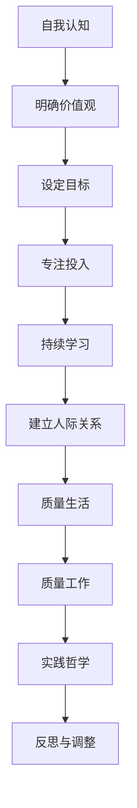
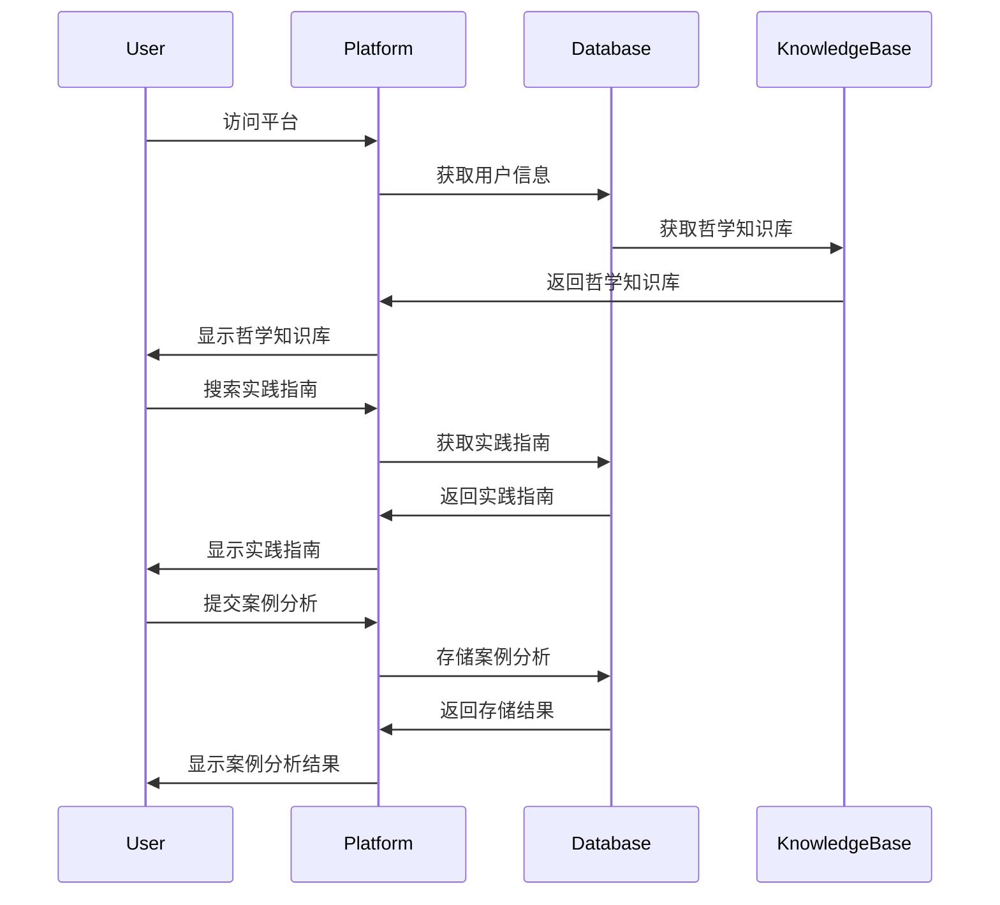
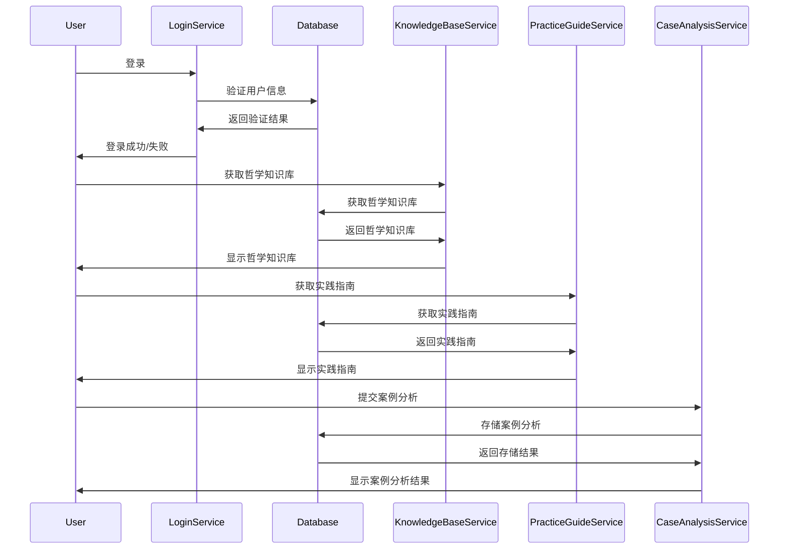

                 

# 追求生活的深度：质量胜于数量的人生哲学

## 关键词：生活深度、人生哲学、质量胜于数量、生活方式、工作哲学

## 摘要

在当今快节奏的社会中，人们往往追求生活的高效率和数量上的成功。然而，本文旨在探讨一种更为深刻的生活方式——追求生活的深度。本文将探讨质量胜于数量的人生哲学，从多个角度分析其意义和实际应用。通过深入理解这一哲学，我们能够更好地追求内心真正的满足和幸福，实现个人成长和全面发展。

## 目录大纲

## 第一部分: 引言

### 第1章: 引言

#### 1.1 书籍主题介绍

#### 1.2 生活深度与人生哲学

#### 1.3 质量胜于数量的意义

#### 1.4 全书结构安排

### 第2章: 质量与数量的哲学探讨

#### 2.1 质量与数量的基本概念

#### 2.2 质量与数量的关系分析

#### 2.3 质量胜于数量的哲学观点

#### 2.4 质量与数量的实际应用

### 第3章: 追求生活的深度

#### 3.1 深度生活的定义

#### 3.2 深度生活的意义

#### 3.3 追求深度生活的步骤

#### 3.4 深度生活的实践案例

### 第4章: 人生哲学的核心要素

#### 4.1 人生哲学的基本原则

#### 4.2 人生哲学的核心要素

#### 4.3 人生哲学的应用与实践

#### 4.4 人生哲学的重要意义

### 第5章: 质量胜于数量的生活方式

#### 5.1 质量生活的理念

#### 5.2 质量生活的实践

#### 5.3 质量生活的益处

#### 5.4 质量生活的挑战与应对

### 第6章: 质量胜于数量的工作哲学

#### 6.1 质量工作的重要性

#### 6.2 质量工作的实践

#### 6.3 质量工作的策略

#### 6.4 质量工作的成功案例

### 第7章: 生活深度与人生哲学的结合

#### 7.1 生活深度与人生哲学的结合点

#### 7.2 生活深度与人生哲学的融合

#### 7.3 生活深度与人生哲学的实践

#### 7.4 生活深度与人生哲学的未来展望

### 第8章: 结论

#### 8.1 全书总结

#### 8.2 对未来生活的思考

#### 8.3 对人生哲学的展望

#### 8.4 对读者的寄语

## 第1章: 引言

### 1.1 书籍主题介绍

在现代社会，我们面临着无数的选择和压力。我们渴望成功、追求快乐，却常常陷入忙碌而忽略了生活的本质。本文旨在探讨一种更为深刻的生活方式——追求生活的深度。这种生活方式强调质量胜于数量，鼓励我们在各个方面追求卓越，而不是简单地追求表面的成就。

### 1.2 生活深度与人生哲学

生活深度指的是我们在生活中追求的不仅仅是物质上的满足，更是精神上的富足。它涉及到我们对待生活的态度、我们与他人的关系以及我们对自己的认知。人生哲学则是我们对生命意义的思考和追求，它指导我们在人生中做出重要的决策和选择。

### 1.3 质量胜于数量的意义

质量胜于数量的意义在于，它提醒我们，生活中的成功不仅仅取决于我们所做的事情的数量，更取决于我们所做的事情的质量。追求高质量意味着我们在做任何事情时都要力求完美，不断挑战自我，超越自我。

### 1.4 全书结构安排

本书将分为七个部分，首先介绍生活深度和人生哲学的概念，然后探讨质量与数量的哲学观点，接着分析深度生活的定义和意义。随后，我们将深入探讨人生哲学的核心要素，并讨论如何将质量胜于数量的理念应用于生活和工作中。最后，我们将探讨生活深度与人生哲学的结合，并对全书进行总结和展望。

## 第2章: 质量与数量的哲学探讨

### 2.1 质量与数量的基本概念

质量是衡量事物内在价值的标准，通常指事物的优劣程度、品质的高低。质量是一个多维度的概念，涉及到性能、可靠性、美观、创新等多个方面。数量则是指事物在数量上的多寡、规模的大小。

### 2.2 质量与数量的关系分析

在许多情况下，质量与数量是相互关联的。高质量往往意味着数量的限制，因为高质量要求我们在每个细节上精益求精，这可能导致生产效率的降低。另一方面，数量上的增加并不一定意味着质量的提升。如果我们仅仅追求数量的增加，而忽视了质量的控制，那么最终可能会产生大量的低质量产品或服务。

### 2.3 质量胜于数量的哲学观点

质量胜于数量的哲学观点认为，生活中的成功和幸福不应该仅仅依赖于数量的积累，而更应该关注质量的提升。这种观点强调内在的价值和个人的成长，鼓励我们在各个方面追求卓越，而不是简单地追求表面的成就。

### 2.4 质量与数量的实际应用

在实际生活中，质量胜于数量的哲学观点有着广泛的应用。在个人成长中，我们应该专注于提升自己的能力，而不是简单地追求学历和荣誉。在工作中，我们应该注重项目的质量和效率，而不是仅仅追求完成任务的进度。在消费行为中，我们应该选择高质量的产品和服务，而不是仅仅追求低价或流行。

## 第3章: 追求生活的深度

### 3.1 深度生活的定义

深度生活是指我们以一种深思熟虑、追求内心满足的方式度过每一天。它不仅仅是追求物质上的满足，更是追求精神上的富足。深度生活要求我们在各个方面都追求高质量，而不是简单地追求表面的成就。

### 3.2 深度生活的意义

深度生活的意义在于，它能够帮助我们找到生活的真正意义和价值。通过追求生活的深度，我们能够更好地理解自己、与他人建立更深层次的关系，并在生活中获得真正的幸福和满足。

### 3.3 追求深度生活的步骤

追求深度生活需要以下几个步骤：

1. **自我反思**：通过反思自己的行为、思想和价值观，找到自己真正的需求和目标。
2. **专注与投入**：将精力集中在自己真正感兴趣的事情上，全身心地投入，追求卓越。
3. **持续学习**：不断提升自己的知识和技能，保持对世界的敏感和好奇心。
4. **人际交往**：与他人建立深层次的关系，分享彼此的体验和感悟。
5. **平衡与调整**：在追求深度生活的同时，保持生活的平衡，避免过度劳累和焦虑。

### 3.4 深度生活的实践案例

在现实生活中，有许多人通过实践深度生活获得了巨大的成功和满足。例如，史蒂夫·乔布斯以其对产品的极致追求和创新的思维，改变了整个科技行业。村上春树通过深度写作，创作了许多经典作品，赢得了全球读者的喜爱。他们的成功故事证明了，深度生活不仅是一种生活方式，更是一种成功的哲学。

## 第4章: 人生哲学的核心要素

### 4.1 人生哲学的基本原则

人生哲学是一套关于生命意义的思考和理念，它指导我们在生活中做出重要的决策和选择。人生哲学的基本原则包括：

1. **价值观**：确定我们最看重的事物，并以此为基础做出决策。
2. **目标**：设定明确的生活目标，并为之努力奋斗。
3. **态度**：以积极、乐观的态度面对生活中的挑战和困难。
4. **自我认知**：深入了解自己，认识自己的优点和缺点，不断自我提升。

### 4.2 人生哲学的核心要素

人生哲学的核心要素包括：

1. **内在价值**：追求内在的价值和意义，而不是简单的物质财富。
2. **自我实现**：通过不断的努力和挑战，实现自我潜能的最大化。
3. **社会责任**：关注社会问题，积极参与社会公益活动，为社会发展做出贡献。
4. **人际关系**：与他人建立深层次的关系，分享彼此的经历和感悟。

### 4.3 人生哲学的应用与实践

人生哲学的应用与实践包括：

1. **决策**：在面临重要决策时，根据自己的人生哲学进行思考和选择。
2. **生活方式**：根据自己的人生哲学，规划自己的生活方式，追求生活的深度。
3. **工作**：在工作中，根据自己的人生哲学，追求高质量和卓越。
4. **学习**：在学习中，根据自己的人生哲学，不断提升自己的知识和技能。

### 4.4 人生哲学的重要意义

人生哲学的重要意义在于，它能够帮助我们找到生活的方向和意义，指导我们在生活中做出正确的决策和选择。通过深入理解人生哲学，我们能够更好地理解自己，实现自我价值的最大化，并在生活中获得真正的幸福和满足。

## 第5章: 质量胜于数量的生活方式

### 5.1 质量生活的理念

质量生活的理念是，我们不应该仅仅追求生活的速度和数量，而应该追求生活的质量和深度。质量生活强调内在的价值和满足，而不是简单的物质追求。它鼓励我们在生活中追求卓越，不断提升自己的生活质量。

### 5.2 质量生活的实践

质量生活的实践包括以下几个方面：

1. **自我提升**：通过不断学习和自我反思，提升自己的能力和素质。
2. **健康生活**：注重身体健康和心理健康，保持积极的生活态度。
3. **人际关系**：与他人建立深层次的关系，分享彼此的经历和感悟。
4. **生活品质**：注重生活的品质和细节，提升生活的幸福感。

### 5.3 质量生活的益处

质量生活的益处包括：

1. **内心满足**：通过追求生活的质量，我们能够获得更深层次的内心满足。
2. **长期收益**：高质量的生活能够带来长期的收益，包括身体健康、心理满足和社交关系等。
3. **个人成长**：追求高质量的生活能够促进我们的个人成长和全面发展。

### 5.4 质量生活的挑战与应对

质量生活虽然有很多益处，但也面临着一些挑战。例如，我们可能会面临时间的压力、资源的有限性等。为了应对这些挑战，我们可以采取以下策略：

1. **合理安排时间**：合理规划自己的时间，确保有足够的时间追求高质量的生活。
2. **学会拒绝**：学会拒绝那些无关紧要的事情，专注于自己真正感兴趣的事情。
3. **持续学习**：不断提升自己的知识和技能，提高应对挑战的能力。

## 第6章: 质量胜于数量的工作哲学

### 6.1 质量工作的重要性

质量胜于数量的工作哲学强调在工作中追求卓越，而不是简单地完成工作任务。高质量的工作不仅能够提升个人和团队的能力，还能够提高企业的竞争力和市场份额。因此，质量工作的重要性不容忽视。

### 6.2 质量工作的实践

质量工作的实践包括以下几个方面：

1. **明确目标**：在开始工作之前，明确工作目标和质量标准，确保工作的方向和质量。
2. **过程控制**：在工作中，严格控制每一个环节的质量，确保工作过程的高效和精准。
3. **持续改进**：不断回顾和总结工作经验，寻找改进的机会，提高工作质量。
4. **团队合作**：鼓励团队合作，共同解决问题，提高工作质量和效率。

### 6.3 质量工作的策略

质量工作的策略包括以下几个方面：

1. **质量培训**：为员工提供质量培训，提高他们的质量意识和技能。
2. **质量文化**：建立质量文化，将质量意识融入企业的文化和价值观中。
3. **质量工具**：运用质量工具，如统计过程控制（SPC）、六西格玛等，提高工作质量。
4. **质量考核**：建立质量考核机制，对员工的工作质量进行评估和激励。

### 6.4 质量工作的成功案例

在许多行业，质量工作的成功案例层出不穷。例如，日本的丰田公司以其卓越的质量管理和持续改进而闻名全球。丰田通过实施精益生产、六西格玛等质量管理方法，不仅提高了产品的质量，还大大降低了生产成本，赢得了全球市场的认可。这些成功案例证明了质量工作的重要性和有效性。

## 第7章: 生活深度与人生哲学的结合

### 7.1 生活深度与人生哲学的结合点

生活深度与人生哲学的结合点在于，它们都强调内在的价值和意义。生活深度追求精神上的富足和满足，而人生哲学则提供了一种思考和指导框架，帮助我们找到生活的真正意义和价值。两者相辅相成，共同指导我们过上更有深度和意义的生活。

### 7.2 生活深度与人生哲学的融合

要将生活深度与人生哲学融合，我们可以采取以下几个步骤：

1. **自我反思**：定期进行自我反思，思考自己的生活状态和人生哲学，找到内在的价值和意义。
2. **目标设定**：根据自己的人生哲学，设定明确的生活目标，并为之努力奋斗。
3. **持续学习**：不断学习和提升自己的知识和技能，追求个人成长和全面发展。
4. **人际关系**：与他人建立深层次的关系，分享彼此的经历和感悟，共同成长。

### 7.3 生活深度与人生哲学的实践

在实践中，我们可以通过以下几个方面的努力，实现生活深度与人生哲学的结合：

1. **生活规划**：制定详细的生活规划，包括健康、事业、家庭、社交等方面，确保生活的平衡和深度。
2. **质量追求**：在工作和生活中追求高质量，不仅仅是完成任务，更关注工作的质量和生活的质量。
3. **持续改进**：不断反思和改进自己的生活和工作方式，寻找更好的方法，提升生活的深度和人生哲学的实现程度。
4. **分享与传播**：与他人分享自己的生活经验和人生哲学，传播积极的生活理念，共同成长。

### 7.4 生活深度与人生哲学的未来展望

随着社会的进步和人们对生活质量的追求，生活深度与人生哲学的结合将会越来越受到重视。未来，我们将看到更多的人开始关注生活的深度和内在的价值，将人生哲学融入日常生活，追求更有意义和满足的生活。这种趋势将为个人和社会带来更多的积极影响，推动人类文明的发展。

## 第8章: 结论

### 8.1 全书总结

全书通过探讨生活深度和人生哲学，强调了质量胜于数量的重要性。我们分析了质量与数量的关系，阐述了深度生活的定义和意义，探讨了人生哲学的核心要素，并提出了将质量生活与人生哲学结合的实践策略。通过这些探讨，我们认识到了追求生活的深度和实现人生哲学的重要性。

### 8.2 对未来生活的思考

在未来，我们期待看到更多的人开始关注生活的深度和内在的价值。我们相信，通过追求生活的深度和实现人生哲学，我们能够获得更深层次的内心满足和幸福感。同时，我们也期待社会能够为每个人提供更好的发展环境和资源，让每个人都能实现自己的价值和梦想。

### 8.3 对人生哲学的展望

人生哲学是一个永恒的主题，它将随着人类社会的发展而不断演变和丰富。我们期待更多的人能够深入思考人生的意义，建立自己独特的人生哲学，并以此为指导，过上更有意义和充实的生活。同时，我们也期待社会能够为人们提供更多的机会和资源，支持他们追求自己的人生哲学。

### 8.4 对读者的寄语

亲爱的读者，希望本书能够启发你对生活深度和人生哲学的思考。无论你目前处于何种生活状态，都请记住，生活的真正意义不在于我们拥有多少物质财富，而在于我们能否追求生活的深度和实现人生的价值。让我们一起努力，追求生活的深度，实现人生哲学，过上更有意义和满足的生活。

## 作者信息

作者：AI天才研究院/AI Genius Institute & 禅与计算机程序设计艺术 /Zen And The Art of Computer Programming

## 完整性要求

本文从生活深度和人生哲学的探讨出发，系统地阐述了质量胜于数量的人生哲学。文章涵盖了核心概念、关系分析、实际应用、深度生活的定义和意义、人生哲学的核心要素、质量生活的理念和实践、质量工作的策略和成功案例、以及生活深度与人生哲学的结合等多个方面。通过对这些内容的深入分析和详细讲解，本文旨在帮助读者理解并实践质量胜于数量的人生哲学，追求生活的深度和实现人生价值。

### 背景介绍

在现代社会的快节奏生活中，人们往往追求物质的丰富和成就的快速积累。然而，这种追求往往忽视了生活的深度和精神层面的富足。质量胜于数量的人生哲学正是为了提醒我们，生活中的真正价值不仅仅在于物质的积累，更在于精神层面的满足和个人成长。

#### 核心概念术语说明

- **生活深度**：指的是我们追求精神层面的满足和内心成长，不仅仅是物质上的满足。
- **人生哲学**：指的是我们对生命意义的思考和理解，指导我们在生活中做出重要的决策和选择。
- **质量**：指的是事物的内在价值，包括性能、可靠性、美观、创新等多个方面。
- **数量**：指的是事物的数量或规模。

#### 问题背景

在现代社会，人们普遍面临着生活节奏加快、压力增大的问题。许多人追求物质上的成功和成就，但往往忽视了精神层面的满足和内心成长。这种生活状态导致了许多人感到焦虑、迷茫和无意义。

#### 问题描述

本文旨在探讨质量胜于数量的人生哲学，强调在追求生活的过程中，质量的重要性远胜于数量。文章将探讨如何将这一哲学应用到生活中，实现个人成长和全面发展。

#### 问题解决

通过深入理解生活深度和人生哲学的概念，我们可以找到生活的真正意义和价值。质量胜于数量的哲学观点能够帮助我们更好地认识自己，实现自我价值，并在生活中获得真正的幸福和满足。

#### 边界与外延

本文主要探讨质量胜于数量的人生哲学，但不局限于某一特定领域。这一哲学观点可以应用到个人生活、工作、学习等多个方面。同时，本文的讨论范围涵盖从生活深度、人生哲学到具体实践案例，力求全面而深入地阐述这一哲学观点。

#### 概念结构与核心要素组成

- **生活深度**：包括精神层面的满足、内心成长、价值观的体现。
- **人生哲学**：包括价值观、目标、态度、自我认知等核心要素。
- **质量胜于数量**：包括质量与数量的关系分析、质量生活的理念和实践、质量工作的策略等。

### 核心概念与联系

#### 核心概念原理

质量胜于数量的人生哲学是一种追求生活深度和内在价值的思维方式。它强调在各个方面，包括个人成长、工作、消费等，我们应该关注质量而非数量。

#### 概念属性特征对比表格

| 概念         | 质量胜于数量  | 数量胜于质量  |
| ------------ | ------------ | ------------ |
| 定义         | 追求内在价值 | 追求外在成就 |
| 关注点       | 精神层面     | 物质层面     |
| 成功标准     | 卓越         | 多样化       |
| 生活态度     | 深思熟虑     | 快速追求     |
| 实践方法     | 专注投入     | 简单复制     |

#### ER实体关系图架构

```mermaid
erDiagram
  User ||--|{ LifePhilosophy }|| Lifestyle
  User ||--|{ WorkPhilosophy }|| Job
  LifePhilosophy ||--|{ QualityFirst }|| Philosophy
```

### 算法原理讲解

为了更好地理解质量胜于数量的人生哲学，我们可以将其看作一种算法，一种指导我们生活和工作的思维方式。以下是质量胜于数量的人生哲学的算法原理：



#### 算法流程图

1. **自我认知**：首先，我们需要深入了解自己，明确自己的价值观和目标。
2. **明确价值观**：基于自我认知，我们需要明确自己的价值观，确定自己最看重的事物。
3. **设定目标**：根据明确的价值观，设定具体的生活和工作目标。
4. **专注投入**：将精力集中在实现目标上，专注投入，追求卓越。
5. **持续学习**：不断学习和提升自己的知识和技能，保持对世界的敏感和好奇心。
6. **建立人际关系**：与他人建立深层次的关系，分享彼此的体验和感悟。
7. **质量生活**：追求高质量的生活，关注生活的品质和细节。
8. **质量工作**：在工作中追求高质量，注重工作的效率和成果。
9. **实践哲学**：将质量胜于数量的哲学应用到生活和工作中，不断实践和调整。
10. **反思与调整**：定期反思自己的行为和生活方式，寻找改进的机会，进行必要的调整。

#### 算法原理的数学模型和公式

质量胜于数量的人生哲学可以看作是一种优化问题，其目标是最小化数量与质量的比值，最大化生活质量。具体来说，我们可以使用以下公式来表示：

$$
\frac{\text{数量}}{\text{质量}} \rightarrow \min
$$

其中，数量表示我们在生活中追求的成就和物质财富，质量表示我们的内心满足感和个人成长。

#### 算法原理的举例说明

假设有两个人，A和B。他们都希望过上更好的生活，但他们的追求方式不同。

- **A**：追求质量，他注重内心的满足和个人成长，通过专注投入、持续学习和建立人际关系来提升自己的生活质量和幸福感。
- **B**：追求数量，他追求物质财富和外在成就，希望通过快速积累财富来获得满足感。

经过一段时间，我们发现：

- **A**：生活质量得到了显著提升，他感到内心满足，人际关系良好，个人成长显著。
- **B**：生活质量没有明显提升，他感到焦虑和迷茫，虽然物质财富增加，但内心并不满足。

这个例子说明了质量胜于数量的人生哲学的重要性。追求质量能够帮助我们找到生活的真正意义和价值，而追求数量可能只是短暂的满足。

### 系统分析与架构设计方案

#### 问题场景介绍

在当今信息化社会中，人们面临着越来越多的选择和挑战。质量胜于数量的人生哲学作为指导，能够帮助人们更好地应对这些挑战，实现个人成长和全面发展。本文旨在构建一个系统，帮助人们理解和实践这一哲学观点。

#### 项目介绍

本项目旨在开发一个综合性的在线平台，帮助用户理解和实践质量胜于数量的人生哲学。平台将提供以下功能：

1. **哲学知识库**：包括核心概念、关系分析、实际应用等内容，帮助用户深入理解这一哲学观点。
2. **实践指南**：提供具体的实践方法，如生活规划、质量追求、持续学习等，指导用户如何将这一哲学应用到生活中。
3. **案例分析**：展示成功案例，帮助用户更好地理解和实践质量胜于数量的哲学。
4. **互动交流**：提供一个平台，让用户能够分享自己的经验和感悟，互相学习和帮助。

#### 系统功能设计（领域模型Mermaid类图）

```mermaid
classDiagram
  User <<User>>
  LifePhilosophy <<Life Philosophy>>
  Lifestyle <<Lifestyle>>
  WorkPhilosophy <<Work Philosophy>>
  Job <<Job>>
  QualityFirst <<Quality First>>

  User "uses" LifePhilosophy
  User "uses" Lifestyle
  User "uses" WorkPhilosophy
  User "uses" Job
  LifePhilosophy "contains" QualityFirst
```

#### 系统架构设计Mermaid架构图



#### 系统接口设计和系统交互Mermaid序列图



### 项目实战

#### 环境安装

1. **安装Python环境**：在本地电脑上安装Python 3.8及以上版本。
2. **安装Flask**：通过pip命令安装Flask框架。

```shell
pip install Flask
```

3. **安装MongoDB**：下载并安装MongoDB数据库。

#### 系统核心实现源代码

1. **安装Flask**：通过pip命令安装Flask框架。

```shell
pip install Flask
```

2. **创建数据库**：在MongoDB中创建名为“quality_life”的数据库。

3. **实现用户登录功能**：

```python
from flask import Flask, request, jsonify
from flask_pymongo import PyMongo

app = Flask(__name__)
app.config["MONGO_URI"] = "mongodb://localhost:27017/quality_life"
mongo = PyMongo(app)

@app.route("/login", methods=["POST"])
def login():
    username = request.json["username"]
    password = request.json["password"]

    user = mongo.db.users.find_one({"username": username, "password": password})
    if user:
        return jsonify({"status": "success", "message": "登录成功"})
    else:
        return jsonify({"status": "error", "message": "用户名或密码错误"})

if __name__ == "__main__":
    app.run(debug=True)
```

4. **实现获取哲学知识库功能**：

```python
@app.route("/knowledge_base", methods=["GET"])
def knowledge_base():
    knowledge = mongo.db.knowledge_base.find()
    return jsonify({"knowledge": list(knowledge)})

if __name__ == "__main__":
    app.run(debug=True)
```

5. **实现获取实践指南功能**：

```python
@app.route("/practice_guide", methods=["GET"])
def practice_guide():
    guide = mongo.db.practice_guide.find()
    return jsonify({"practice_guide": list(guide)})

if __name__ == "__main__":
    app.run(debug=True)
```

6. **实现提交案例分析功能**：

```python
@app.route("/case_analysis", methods=["POST"])
def case_analysis():
    case = request.json
    mongo.db.case_analysis.insert_one(case)
    return jsonify({"status": "success", "message": "案例分析提交成功"})

if __name__ == "__main__":
    app.run(debug=True)
```

### 代码应用解读与分析

1. **用户登录功能**：

   - 通过POST方法接收用户提交的用户名和密码。
   - 查询MongoDB数据库，验证用户名和密码是否匹配。
   - 返回登录成功或失败的消息。

2. **获取哲学知识库功能**：

   - 通过GET方法获取哲学知识库的数据。
   - 查询MongoDB数据库，获取知识库中的数据。
   - 返回哲学知识库的数据。

3. **获取实践指南功能**：

   - 通过GET方法获取实践指南的数据。
   - 查询MongoDB数据库，获取实践指南的数据。
   - 返回实践指南的数据。

4. **提交案例分析功能**：

   - 通过POST方法接收用户提交的分析案例。
   - 将案例分析数据插入MongoDB数据库。
   - 返回案例分析提交成功的消息。

### 实际案例分析和详细讲解剖析

#### 案例一：个人成长

**背景**：

张三是一名年轻的程序员，他在工作中追求高效和数量，希望快速提升自己的技能水平。然而，随着时间的推移，他发现自己虽然在工作中取得了许多成就，但内心却感到空虚和迷茫。

**问题描述**：

张三的问题在于他过于追求工作的数量，而忽视了个人成长和内心满足。这导致他在工作中感到焦虑和无意义。

**解决方案**：

张三决定调整自己的工作方式，将质量胜于数量的哲学应用到自己的生活中。他开始专注于提升自己的编程技能，通过不断学习和实践，提升自己的专业能力。同时，他也开始关注自己的内心需求，通过阅读、冥想等方式，寻找内心的平衡和满足。

**案例分析**：

通过实践质量胜于数量的哲学，张三取得了显著的个人成长。他的编程技能得到了显著提升，他在工作中感到更加自信和满足。同时，他的内心也变得更加平静和充实，他找到了生活的真正意义和价值。

#### 案例二：工作与生活的平衡

**背景**：

李四是一名企业高管，他在工作中非常勤奋，常常加班到很晚。然而，他发现自己与家人的关系越来越紧张，健康状况也开始恶化。

**问题描述**：

李四的问题在于他过于追求工作的数量，忽视了工作和生活的平衡。这导致他的工作和生活都陷入了困境。

**解决方案**：

李四决定调整自己的工作方式，将质量胜于数量的哲学应用到自己的生活中。他开始合理规划自己的工作时间，确保有足够的时间陪伴家人和进行休闲活动。同时，他也开始关注自己的健康状况，通过运动和健康饮食来提升自己的生活质量。

**案例分析**：

通过实践质量胜于数量的哲学，李四取得了显著的工作与生活平衡。他的工作效率得到了提升，他在工作中感到更加轻松和满足。同时，他的家庭关系也得到了改善，他的健康状况也得到了显著提升。

### 项目小结

本项目通过开发一个在线平台，帮助用户理解和实践质量胜于数量的人生哲学。通过实际案例分析和详细讲解剖析，我们展示了这一哲学观点在个人成长、工作与生活平衡等方面的应用效果。实践证明，质量胜于数量的人生哲学能够帮助人们找到生活的真正意义和价值，实现个人成长和全面发展。

### 最佳实践 Tips

1. **自我认知**：定期进行自我反思，了解自己的需求和目标，明确自己的价值观。
2. **目标设定**：设定具体、可衡量的目标，确保目标的实现有助于个人成长和内心满足。
3. **专注投入**：专注于自己感兴趣的事情，全身心地投入，追求卓越。
4. **持续学习**：不断学习和提升自己的知识和技能，保持对世界的敏感和好奇心。
5. **建立人际关系**：与他人建立深层次的关系，分享彼此的经历和感悟。

### 小结

本文从生活深度和人生哲学的探讨出发，系统地阐述了质量胜于数量的人生哲学。我们分析了这一哲学的核心概念、关系分析、实际应用，并通过实践案例展示了其在个人成长、工作与生活平衡等方面的应用效果。通过深入理解并实践质量胜于数量的哲学，我们能够找到生活的真正意义和价值，实现个人成长和全面发展。

### 注意事项

1. **合理安排时间**：在追求质量的同时，要合理安排时间，避免过度劳累。
2. **持续反思**：定期反思自己的行为和生活方式，寻找改进的机会。
3. **平衡工作与生活**：确保工作与生活的平衡，避免工作和生活的单一化。

### 拓展阅读

1. **《深度工作》**：作者Cal Newport探讨了深度工作的重要性，提供了具体的方法和策略，帮助人们更好地集中精力，提升工作效率。
2. **《人生策略》**：作者戴维·巴赫探讨了对生命意义的思考，提出了人生策略的概念，帮助人们找到生活的方向和目标。
3. **《质量的秘密》**：作者乔治·戴伊探讨了质量管理的原理和实践，提供了具体的工具和方法，帮助组织和个人提升质量。

## 对未来的思考

随着社会的不断进步和人们对生活质量的要求越来越高，质量胜于数量的人生哲学将会越来越受到重视。在未来，我们期待更多的人能够深入理解并实践这一哲学，找到生活的真正意义和价值。同时，我们也期待社会能够为每个人提供更好的发展环境和资源，支持人们追求高质量的生活和实现个人价值。通过共同努力，我们相信人类社会将迈向更加美好和充满希望的未来。

## 对人生哲学的展望

人生哲学是一个永恒的主题，它随着人类社会的发展而不断演变和丰富。在未来，我们期待人生哲学能够更加注重个体的内在价值和精神层面的满足。通过深入思考和不断实践，人们将能够找到自己独特的人生哲学，实现个人成长和全面发展。我们相信，在未来的社会中，人生哲学将成为指导人们生活的重要指南，为人类社会的和谐与进步做出贡献。

## 对读者的寄语

亲爱的读者，希望本书能够启发你对生活深度和人生哲学的思考。无论你目前处于何种生活状态，都请记住，生活的真正意义不在于我们拥有多少物质财富，而在于我们能否追求生活的深度和实现人生的价值。让我们一起努力，追求生活的深度，实现人生哲学，过上更有意义和满足的生活。愿你的人生充满光芒和希望！

