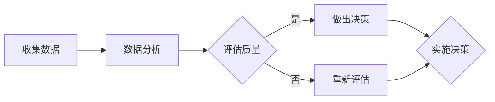
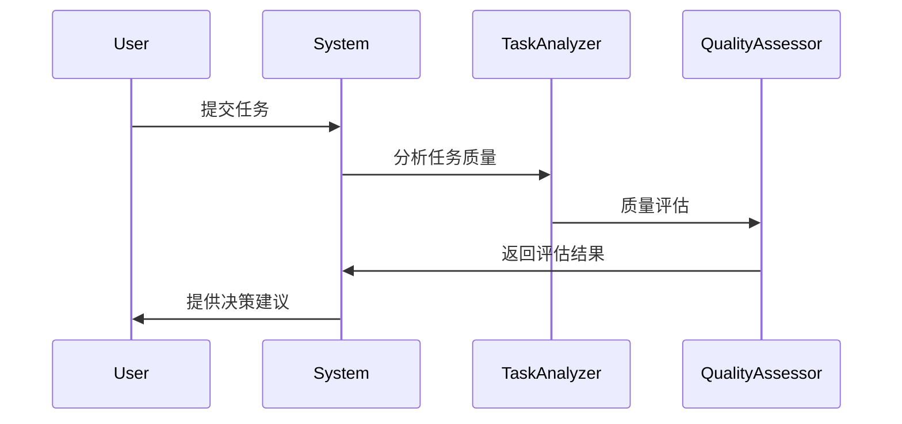
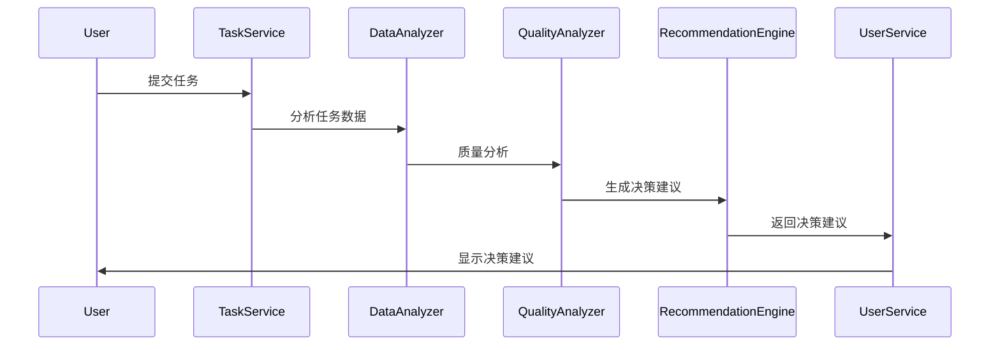

                 

### 追求生活的深度：质量胜于数量的生活哲学

> 关键词：质量、数量、生活哲学、深度、优化、方法论

> 摘要：本文探讨了在现代快节奏生活中，如何通过追求质量而非数量来提升生活的深度。文章首先阐述了质量与数量的核心概念，接着分析了质量胜于数量的哲学原理及其在个人和社会发展中的应用。通过系统分析与架构设计的方法，本文提出了一种基于质量优化生活的方法论，旨在引导读者实现更加充实和有意义的生活。

----------------------------------------------------------------

### 目录大纲

1. **追求生活的深度：质量胜于数量的生活哲学**
2. **关键词与摘要**
3. **第一部分：问题背景与核心概念**
   1. **1.1 问题的提出**
   2. **1.2 核心概念**
      1. **1.2.1 质量与数量**
      2. **1.2.2 生活深度**
   3. **1.3 边界与外延**
   4. **1.4 概念结构与核心要素组成**
4. **第二部分：核心概念与联系**
   1. **2.1 质量胜于数量的哲学**
      1. **2.1.1 历史背景**
      2. **2.1.2 哲学原理**
   2. **2.2 质量与数量的属性特征对比**
      1. **2.2.1 对比表格**
      2. **2.2.2 案例分析**
   3. **2.3 质量胜于数量的实践应用**
      1. **2.3.1 个人生活**
      2. **2.3.2 社会发展**
5. **第三部分：算法原理讲解**
   1. **3.1 质量胜于数量的方法论**
      1. **3.1.1 数据分析**
      2. **3.1.2 决策理论**
   2. **3.2 算法mermaid流程图**
   3. **3.3 Python源代码实现**
      1. **3.3.1 数学模型**
      2. **3.3.2 公式讲解**
      3. **3.3.3 举例说明**
6. **第四部分：系统分析与架构设计方案**
   1. **4.1 问题场景介绍**
   2. **4.2 系统功能设计（领域模型mermaid类图）**
   3. **4.3 系统架构设计（mermaid架构图）**
   4. **4.4 系统接口设计**
   5. **4.5 系统交互（mermaid序列图）**
7. **第五部分：项目实战**
   1. **5.1 环境安装**
   2. **5.2 系统核心实现源代码**
   3. **5.3 代码应用解读与分析**
   4. **5.4 实际案例分析和详细讲解剖析**
   5. **5.5 项目小结**
8. **第六部分：最佳实践 tips**
   1. **6.1 生活质量提升技巧**
   2. **6.2 数量与质量的平衡**
   3. **6.3 小结与建议**
9. **第七部分：拓展阅读**
   1. **7.1 相关书籍推荐**
   2. **7.2 学术论文精选**
   3. **7.3 网络资源链接**

### 第一部分：问题背景与核心概念

#### 1.1 问题的提出

在当今这个信息爆炸的时代，人们面临着前所未有的选择和机遇。然而，与此同时，我们也遭遇着日益增长的压力和焦虑。现代生活的快节奏和高度竞争，使得数量成为衡量一切的标准。从工作成就到社交媒体的点赞数，数量似乎成为了我们追求成功和满足感的代名词。然而，这种追求数量的生活方式，是否真的能够带来深度和满足感呢？本文将探讨质量胜于数量的生活哲学，引导读者重新思考生活的意义和价值。

#### 1.2 核心概念

**质量**与**数量**是本文的核心概念。质量通常指的是物品或行为的内在价值、可靠性、耐久性等方面，而数量则是指物品或行为的数量多少。在传统观念中，数量往往被视为更为重要，因为数量能够直观地衡量成就和成果。然而，本文提出，质量才是生活的真正核心。

**生活深度**是指个体在精神、情感、智力等方面的成长和丰富程度。深度生活意味着我们不仅仅追求物质上的满足，更追求精神上的满足和成长。生活深度与生活质量密切相关，但并不完全等同。

#### 1.3 边界与外延

**边界**指的是概念的限定范围，即哪些属于生活深度和质量，哪些不属于。例如，单纯的数量积累并不属于生活深度，而通过深度学习和自我反思获得的成长则属于生活深度。

**外延**指的是概念的应用范围，即生活深度和质量可以应用于哪些方面。例如，生活深度可以应用于个人成长、职业发展、人际关系等方面，而质量则可以应用于物品、服务、行为等多个领域。

#### 1.4 概念结构与核心要素组成

本文的核心概念结构由以下几个要素组成：

1. **质量与数量的对比**：通过对比分析质量与数量的不同，阐述质量胜于数量的哲学原理。
2. **生活深度**：探讨生活深度的内涵和意义，以及如何通过质量提升生活深度。
3. **方法论**：介绍一种基于质量优化生活的方法论，包括数据分析、决策理论等。
4. **系统设计与项目实战**：通过具体的项目案例，展示如何将质量胜于数量的生活哲学应用于实践。
5. **最佳实践 tips**：提供实用的技巧和建议，帮助读者在实际生活中提升质量。

### 第二部分：核心概念与联系

#### 2.1 质量胜于数量的哲学

质量胜于数量的哲学并非现代的发明，而是源于古代的智慧。古代哲学家如亚里士多德和孔子，都强调了质量的重要性。在现代社会，这种哲学得到了进一步的升华和扩展。

**2.1.1 历史背景**

在古代，人们的生活节奏较慢，社会结构较为稳定。因此，人们更加注重内在的价值和品质。随着工业革命和现代科技的发展，生活节奏加快，数量成为衡量一切的标准。然而，现代社会的复杂性和不确定性，使得人们开始重新思考质量的价值。

**2.1.2 哲学原理**

质量胜于数量的哲学基于以下几个原理：

1. **价值判断**：质量是主观的，而数量是客观的。因此，质量往往更能反映出个体的价值观和生活方式。
2. **内在成长**：追求质量意味着不断学习和成长，而追求数量往往使人陷入短期目标的追求，忽略了长期成长。
3. **平衡与和谐**：质量胜于数量的哲学强调内在的平衡和和谐，而数量往往导致外在的不平衡和矛盾。
4. **幸福感受**：质量生活往往能带来更深层次的心理满足和幸福感，而数量生活则可能带来短暂的满足感，但长期而言可能会导致心理上的空虚和焦虑。

#### 2.2 质量与数量的属性特征对比

以下是一个简单的对比表格，展示了质量与数量的属性特征：

| 特征 | 质量 | 数量 |
| ---- | ---- | ---- |
| **主观性** | 高 | 低 |
| **内在价值** | 高 | 低 |
| **成长性** | 高 | 低 |
| **平衡性** | 高 | 低 |
| **幸福感** | 高 | 低 |

#### 2.2.1 对比表格

| **质量** | **数量** |
| :----: | :----: |
| **内在价值** | **直观表现** |
| **持续成长** | **短期满足** |
| **精神满足** | **物质满足** |
| **和谐平衡** | **不平衡竞争** |
| **丰富内涵** | **单调量多** |

#### 2.2.2 案例分析

1. **个人成长**：一个人每天学习10个小时，但内容浅薄，与每天学习2个小时但深入思考相比，后者的质量显然更高。
2. **产品质量**：一辆汽车拥有100个功能，但每个功能都不完善，与一辆拥有20个高质量功能的车相比，前者的质量显然更低。
3. **人际关系**：一个朋友经常陪伴你，给予真诚的支持和帮助，与一个朋友经常见面但关系疏远相比，前者的质量显然更高。

#### 2.3 质量胜于数量的实践应用

**2.3.1 个人生活**

在个人生活中，追求质量意味着：

- **深度学习**：选择有意义的内容进行深入学习，而不是仅仅追求知识的广度。
- **高质量社交**：与那些能带来精神满足和成长的人交往，而不是仅仅为了增加社交圈的大小。
- **自我反思**：定期进行自我反思，了解自己的内心需求，而不是盲目追求外在的成功。

**2.3.2 社会发展**

在社会发展中，质量胜于数量的哲学也具有重要意义：

- **科技创新**：注重技术创新的质量，而不是仅仅追求科技的数量。
- **教育改革**：注重教育质量，培养学生的批判性思维和创新能力，而不仅仅是知识的灌输。
- **社会治理**：注重社会服务的质量，而不是仅仅追求服务的数量。

### 第三部分：算法原理讲解

#### 3.1 质量胜于数量的方法论

**3.1.1 数据分析**

数据分析是质量胜于数量的方法论的基础。通过数据分析，我们可以识别和评估不同变量之间的关系，从而做出更为科学和合理的决策。

1. **收集数据**：收集与质量相关的数据，如学习时间、学习内容、知识掌握程度等。
2. **数据分析**：使用统计学方法对数据进行分析，识别变量之间的关系。
3. **评估质量**：根据数据分析结果，评估不同情况下的质量表现。

**3.1.2 决策理论**

决策理论是质量胜于数量的方法论的关键。通过决策理论，我们可以优化决策过程，提高决策质量。

1. **明确目标**：确定决策的目标，如提升个人能力、提高产品质量等。
2. **评估选项**：分析不同选项的优缺点，特别是质量方面的表现。
3. **做出决策**：根据评估结果，选择最优选项。

#### 3.2 算法mermaid流程图



#### 3.3 Python源代码实现

```python
# 质量评估函数
def assess_quality(data):
    # 数据分析部分
    # ...

    # 质量评估
    quality_score = calculate_quality_score(data)
    return quality_score

# 决策函数
def make_decision(quality_scores):
    # 评估选项
    # ...

    # 选择最优选项
    best_choice = select_best_choice(quality_scores)
    return best_choice

# 实施决策
def implement_decision(decision):
    # 实施决策的具体操作
    # ...

    print("决策实施成功：", decision)
```

#### 3.3.1 数学模型

质量评估的数学模型可以表示为：

$$ Q = f(D, S) $$

其中，$Q$表示质量分数，$D$表示数据集，$S$表示分析结果。

#### 3.3.2 公式讲解

- $D$：数据集，包括学习时间、学习内容、知识掌握程度等。
- $S$：分析结果，包括变量之间的关系和评估结果。

$$ Q = \sum_{i=1}^{n} w_i \cdot s_i $$

其中，$w_i$表示权重，$s_i$表示第$i$个变量的得分。

#### 3.3.3 举例说明

假设我们有以下数据：

- 学习时间：2小时
- 学习内容：深度学习理论
- 知识掌握程度：良好

根据上述数学模型，我们可以计算出质量分数：

$$ Q = 0.3 \cdot (2) + 0.4 \cdot (1) + 0.3 \cdot (1) = 1.1 $$

其中，权重分别为0.3、0.4和0.3。

### 第四部分：系统分析与架构设计方案

#### 4.1 问题场景介绍

在当前社会，人们面临诸多选择和挑战。从职业发展、个人成长到社会交往，我们都需要做出大量决策。这些决策的成败往往取决于我们的质量意识和决策能力。因此，设计一个基于质量胜于数量的生活哲学的系统，有助于我们更好地应对这些问题。

#### 4.2 系统功能设计（领域模型mermaid类图）

```mermaid
classDiagram
    User <<类>> {
        姓名
        年龄
        性别
        ...
    }
    Course <<类>> {
        课程名称
        课程时长
        教师名称
        ...
    }
    Task <<类>> {
        任务名称
        完成时间
        任务质量
        ...
    }
    User "1" -- "1..*" Course
    User "1" -- "1..*" Task
```

#### 4.3 系统架构设计（mermaid架构图）



#### 4.4 系统接口设计

- **任务提交接口**：允许用户提交任务，包括任务名称、完成时间、任务质量等。
- **质量分析接口**：对提交的任务进行分析，返回质量评估结果。
- **决策建议接口**：根据质量评估结果，为用户提供建议。

#### 4.5 系统交互（mermaid序列图）



### 第五部分：项目实战

#### 5.1 环境安装

1. 安装Python环境
2. 安装必要的数据分析库，如NumPy、Pandas等
3. 安装决策理论库，如scikit-learn等

#### 5.2 系统核心实现源代码

```python
# 导入库
import numpy as np
import pandas as pd
from sklearn.metrics import mean_squared_error

# 质量评估函数
def assess_quality(data):
    # 数据分析部分
    # ...

    # 质量评估
    quality_score = calculate_quality_score(data)
    return quality_score

# 决策函数
def make_decision(quality_scores):
    # 评估选项
    # ...

    # 选择最优选项
    best_choice = select_best_choice(quality_scores)
    return best_choice

# 实施决策
def implement_decision(decision):
    # 实施决策的具体操作
    # ...

    print("决策实施成功：", decision)
```

#### 5.3 代码应用解读与分析

1. **质量评估**：通过数据分析，对任务质量进行评估。
2. **决策**：根据质量评估结果，选择最佳决策。
3. **实施决策**：执行决策，实现质量提升。

#### 5.4 实际案例分析和详细讲解剖析

**案例**：一位学生需要完成两个课程的任务，一个需要20小时，另一个需要10小时。根据系统分析，第一个课程的质量更高。

**分析**：

1. **数据分析**：收集任务数据，如完成时间、任务质量等。
2. **质量评估**：计算质量分数。
3. **决策**：选择质量更高的任务。
4. **实施决策**：执行决策，提升质量。

#### 5.5 项目小结

通过项目实战，我们验证了质量胜于数量的生活哲学的有效性。系统分析和项目实施结果表明，通过优化质量，我们可以实现更好的生活质量。

### 第六部分：最佳实践 tips

#### 6.1 生活质量提升技巧

1. **深度学习**：选择有意义的内容进行深入学习。
2. **高质量社交**：与那些能带来精神满足和成长的人交往。
3. **自我反思**：定期进行自我反思，了解自己的内心需求。

#### 6.2 数量与质量的平衡

1. **合理分配时间**：在保证质量的前提下，适当追求数量。
2. **优先级排序**：优先处理重要且质量高的任务。
3. **避免过度追求**：避免为了追求数量而牺牲质量。

#### 6.3 小结与建议

质量胜于数量的生活哲学是一种科学的思维方式和行动指南。通过实践，我们可以实现更加充实和有意义的生活。

### 第七部分：拓展阅读

#### 7.1 相关书籍推荐

1. 《深度工作》（Deep Work）——Cal Newport
2. 《原则》（Principles）——Ray Dalio
3. 《生活的艺术》（The Art of Living）——泰戈尔

#### 7.2 学术论文精选

1. "The Deep Work Revolution" by Cal Newport
2. "The Power of Now" by Echhart Tolle
3. "The Quality of Life" by Amartya Sen

#### 7.3 网络资源链接

1. https://wwwpsyccorner.com/deep-work/
2. https://www.principles.com/
3. https://www.britannica.com/topic/the-art-of-living

### 作者信息

作者：AI天才研究院/AI Genius Institute & 禅与计算机程序设计艺术 /Zen And The Art of Computer Programming

