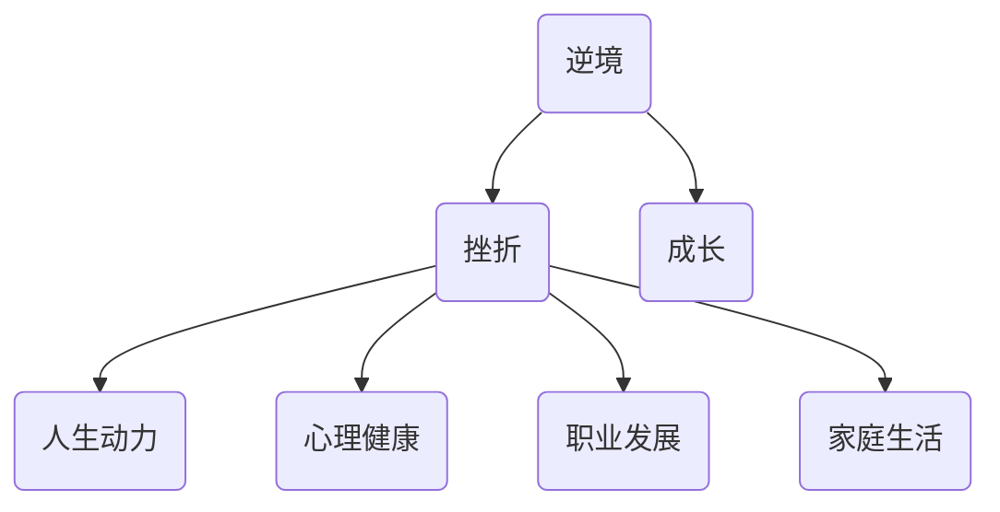

                 

### 引言

在信息技术飞速发展的时代，我们每个人都可能遭遇逆境与挫折。无论是个人成长，职业发展，还是心理健康，挫折似乎成为了一个无法避免的挑战。面对这些逆境，我们如何将其转化为人生动力，实现自我提升与成长，成为了当今社会关注的焦点。

本篇技术博客文章旨在探讨如何在逆境中实现个人成长，将挫折转化为人生动力。文章将从多个角度深入分析挫折的本质、挫折与成长的关系，并提供一系列实用策略与案例分析，帮助读者在面对逆境时，能够更加积极、有效地应对。

在接下来的内容中，我们将分步骤进行探讨：

1. **核心概念的介绍**：首先，我们将定义关键术语，并简要介绍问题背景。
2. **理论基础**：接着，我们将深入探讨挫折与成长的关系，以及相关心理学理论。
3. **个人成长与自我认知**：我们将探讨在逆境中如何培养个人成长和自我认知。
4. **学习能力培养**：我们将分析在逆境中如何提升学习效率和学习策略。
5. **职业发展与心理健康**：我们将探讨逆境对职业发展和心理健康的影响。
6. **家庭生活**：我们将分析挫折与家庭生活之间的关系。
7. **案例分析**：通过具体案例，我们将展示如何将挫折转化为成长动力。
8. **总结与展望**：最后，我们将总结文章的核心观点，并提出未来展望。

通过这些步骤，我们希望能够为广大读者提供一套全面、系统的应对逆境策略，帮助大家实现个人成长和人生进步。

### 关键词

- 逆境
- 成长
- 挫折
- 心理健康
- 职业发展
- 个人认知
- 学习策略
- 家庭生活
- 案例分析

### 摘要

本文旨在探讨如何在逆境中实现个人成长，将挫折转化为人生动力。通过介绍核心概念和理论基础，文章分析了挫折与成长的关系，并提出了具体的策略与案例分析。文章分为七个部分，分别从个人成长、学习能力、职业发展、心理健康、家庭生活等方面深入探讨如何应对逆境。最终，文章总结了核心观点，并对未来进行了展望，旨在为读者提供一套全面、系统的应对策略，帮助大家实现个人成长和人生进步。

---

### 第一部分：引言与基础理论

#### 核心概念介绍

在讨论“逆境中的成长：将挫折转化为人生动力”这一主题时，我们需要明确几个核心概念。首先，“逆境”通常指的是在个人生活或职业生涯中遭遇的各种困难和挑战，这些挑战可能来自工作压力、人际关系、健康状况或其他生活方面的难题。而“挫折”则是指个体在追求目标过程中遭遇的失败、阻碍或挫败感。

“成长”则是一个广泛的概念，涉及到个人认知、能力、心理健康和情感等多个方面的发展。它不仅指技能的提升，还包括情感和心理的成熟。将“挫折”转化为“人生动力”意味着通过积极的应对策略，将逆境中的失败和挑战转变为促进个人成长和进步的机会。

#### 问题背景

在现代社会，每个人都可能面临不同程度的逆境和挫折。特别是在信息技术和全球化的快速发展背景下，竞争日益激烈，工作压力和生活节奏加快，个人成长和发展的挑战变得更加复杂。如何有效地应对这些挑战，实现个人成长，成为了许多人关心的问题。

在职业领域，挫折往往伴随着职业发展的停滞或失败。例如，职场中的裁员、职位晋升的失败、项目的不顺利等，都可能给个人带来挫折感。在个人生活中，健康问题、家庭关系矛盾、经济困难等，都是常见的逆境。这些逆境不仅影响个人的心理健康，也可能对职业生涯产生负面影响。

#### 问题描述

面对逆境和挫折，人们常常会感到沮丧、无助和困惑。然而，这些负面情绪并不是没有解决之道。事实上，许多成功人士的经验表明，逆境和挫折可以成为个人成长的催化剂。关键在于如何将这些负面经历转化为积极的力量，激发个人的潜能和动力。

本文将探讨以下几个核心问题：

1. **挫折的本质及其对个人的影响**：我们将深入分析挫折的心理学本质，并探讨其对个人心理健康和职业发展的影响。
2. **逆境中的成长策略**：我们将介绍一系列实用的成长策略，包括自我认知、学习能力培养、心理健康维护等，帮助读者在面对逆境时保持积极的心态。
3. **职业发展和心理健康的关系**：我们将探讨如何通过积极应对挫折，提升职业发展的机会和心理健康水平。
4. **家庭生活中的挑战与成长**：我们将分析家庭生活中的挫折，并提出有效的应对策略，帮助读者在家庭关系中实现成长。
5. **具体案例分析**：通过具体的案例分析，我们将展示如何将挫折转化为成长动力，为读者提供实际操作指导。

#### 问题解决

解决上述问题的核心在于认识到挫折和逆境并不是终点，而是一个成长和发展的机会。以下是一些基本的方法和策略：

1. **积极的心态**：保持积极的心态是应对挫折的第一步。通过积极思考，我们可以更容易地从逆境中找到学习和成长的机会。
2. **自我反思**：通过反思自己的行为和决策，我们可以识别出在逆境中的不足，并制定改进计划。
3. **学习能力培养**：逆境是一个学习和提升自己的好机会。通过不断学习和实践，我们可以增强应对未来挑战的能力。
4. **心理健康维护**：保持心理健康是应对逆境的关键。通过锻炼、冥想、社交等活动，我们可以提升自己的心理韧性，更好地应对挫折。
5. **家庭支持**：家庭的支持是应对逆境的重要力量。通过有效的沟通和互助，我们可以共同面对挑战，实现个人和家庭的成长。

#### 边界与外延

在讨论“逆境中的成长”时，我们还需要明确一些边界与外延。例如，逆境不仅限于职业和生活中的挑战，也可以包括个人目标和梦想的追寻。此外，成长不仅仅指技能的提升，还包括情感和心理的成熟。因此，本文将涵盖多个层面的成长，以提供一个全面、系统的应对策略。

#### 概念结构与核心要素组成

为了更好地理解“逆境中的成长：将挫折转化为人生动力”这一主题，我们可以将其核心概念与联系以表格和ER实体关系图的形式呈现。

**核心概念属性特征对比表格**

| 核心概念 | 定义 | 属性特征 | 对比 |
| :---: | :---: | :---: | :---: |
| 逆境 | 生活中遭遇的挑战和困难 | 时间性、情境性、个体差异性 | 与顺境相对，逆境具有更多不确定性和挑战性 |
| 挫折 | 目标追求过程中遭遇的失败和阻碍 | 情感反应、认知评价、行为应对 | 与成功相对，挫折是个人成长的机会 |
| 成长 | 个人在逆境中实现的能力提升和心理成熟 | 自我认知、技能提升、情感成熟 | 成长是应对逆境的结果和目标 |
| 人生动力 | 激励个人追求目标和实现成长的力量 | 内在动机、外在激励、心理韧性 | 动力是应对逆境的源泉 |

**ER实体关系图架构**

在ER实体关系图中，逆境作为核心实体，与挫折、成长、心理健康、职业发展和家庭生活等多个实体之间存在关联。挫折是逆境的表现形式，同时也是成长、心理健康、职业发展和家庭生活变化的重要驱动因素。成长则是对挫折的积极应对，心理健康、职业发展和家庭生活则是成长的综合体现。

通过上述核心概念和联系的阐述，我们可以更好地理解“逆境中的成长：将挫折转化为人生动力”这一主题。接下来，我们将进一步深入探讨挫折与成长的关系，以及相关的心理学理论，帮助读者在应对逆境时，能够有更加系统和深入的认识。

#### 挫折与成长的关系

挫折与成长之间的关系是复杂而微妙的。挫折不仅仅是失败或阻碍，它也可以被视为成长的机会。理解这种关系的关键在于认识到，挫折可以激发个人潜能，推动自我认知的提升，并促进能力的全面发展。

首先，挫折可以激发个人的内在动力。当个体遭遇挫折时，通常会经历一系列情感反应，如失望、愤怒、沮丧等。然而，这些负面情绪并非一无是处。相反，通过面对和克服这些情绪，个体可以培养出坚韧不拔的精神和积极向上的心态。这种内在动力是个人成长的重要驱动力，它激励着个体不断追求更高的目标，克服前进道路上的困难。

其次，挫折有助于提升自我认知。在面对挫折时，个体需要反思自己的行为和决策，从而识别出不足和改进的方向。这种反思过程是自我认知的重要组成部分，它帮助个体更清楚地了解自己的优点和缺点，从而在未来的行为中做出更明智的选择。通过不断地自我反思和调整，个体可以逐步实现自我提升，达到更高的成长水平。

第三，挫折可以促进能力的全面发展。挫折往往伴随着失败和挑战，这些经历可以促使个体在多个维度上提升自己的能力。例如，在职业发展中，一次项目失败可能意味着需要重新审视工作策略、提高沟通能力和增强团队合作精神。通过这些经历，个体可以全面发展自己的技能和素质，从而在未来的职业道路上更加从容和自信。

此外，心理学研究也支持挫折与成长之间的积极关系。根据心理学理论，个体的成长过程是一个不断克服挑战、适应环境的过程。挫折是这一过程中的重要组成部分，它为个体提供了挑战自我、超越自我的机会。例如，马斯洛的需求层次理论指出，个体在实现自我实现需求之前，需要经历多个层次的成长和挑战。挫折正是这些挑战的一种表现形式。

另外，积极心理学的研究也揭示了挫折对个人成长的积极影响。积极心理学强调，通过培养积极心态和应对策略，个体可以更好地应对挫折，并将其转化为成长的机会。例如，研究者发现，具有乐观态度和积极应对策略的个体在遭遇挫折时，更能够保持动力和专注，从而更快地恢复和成长。

总之，挫折与成长之间的关系是相互促进的。挫折可以激发内在动力、提升自我认知、促进能力全面发展，而成长又可以增强个体的韧性，使其在未来的挫折中更加从容应对。通过理解这种关系，个体可以更好地利用挫折，实现自我提升和人生进步。

#### 成长心理学理论

在探讨逆境与成长的关系时，成长心理学理论为我们提供了丰富的理论基础。这些理论不仅解释了成长的过程，还揭示了个体如何通过积极的应对策略实现自我提升。

首先，我们来看一下埃里克森的心理社会发展理论。该理论将人的成长分为八个阶段，每个阶段都有特定的心理冲突和发展任务。埃里克森认为，个体在每个阶段都面临着特定的挑战，如果能够成功地解决这些冲突，就能实现成长和进步。在成人阶段，个体需要面对自我整合对悲观主义的心理冲突，这意味着个体需要整合自己的人生经验，形成一种全面的自我认知。面对挫折和逆境，个体可以通过反思和调整，实现自我整合，从而实现心理成熟和成长。

另一个重要的理论是卡尔·罗杰斯的自我实现理论。罗杰斯认为，个体具有自我实现的潜力，只要在合适的环境中，这种潜力就能够得到充分的发展。挫折和逆境被视为个体自我实现过程中的挑战。通过积极应对这些挑战，个体可以增强自我效能感，提高自我价值感，从而实现自我实现。在逆境中，个体可以通过设定目标、制定计划、积极行动，逐步克服困难，实现自我成长。

此外，动机理论也为理解成长提供了重要视角。德西和瑞恩提出的内在动机理论指出，个体的内在动机是促进成长和发展的关键因素。内在动机包括对活动的兴趣、对结果的关注以及自我决定感。在逆境中，个体可以通过培养内在动机，如对学习本身的兴趣，以及对克服挑战的内在驱动力，来增强自己的成长动力。

心理学中的成长理论还强调了社会支持的重要性。社会支持理论指出，个体在成长过程中，需要来自家庭、朋友和社会的积极支持。这种支持可以增强个体的自信心和韧性，帮助其更好地应对挫折。例如，家庭的支持可以让个体在逆境中感受到关爱和理解，从而减轻心理压力，增强应对挫折的能力。

总之，成长心理学理论为我们提供了多角度的理解，帮助我们在面对逆境时，能够更加系统和深入地分析个人的成长过程。通过理解这些理论，我们可以更好地制定应对策略，实现自我提升和成长。

### 第二部分：逆境中的个人成长

#### 个人成长与自我认知

在逆境中实现个人成长，首先需要建立积极的自我认知。自我认知是指个体对自己的理解，包括自己的能力、性格、兴趣和价值观。一个清晰的自我认知可以帮助我们在逆境中保持目标明确，增强应对挫折的能力。

首先，自我认知的重要性在于它能够帮助我们识别自己的优势和不足。在逆境中，我们往往会被负面情绪所困扰，如挫败感、无助感和焦虑。通过自我认知，我们可以客观地分析这些情绪的来源，识别出导致挫折的具体原因，并制定相应的改进计划。

其次，积极的自我认知有助于增强我们的自信心。当我们在逆境中能够看到自己的成长和进步时，自信心就会随之增强。自信心不仅能够帮助我们克服挫折，还能够激发我们内心的动力，促使我们继续前进。

那么，如何在逆境中培养自我认知呢？以下是一些建议：

1. **反思与自我分析**：定期进行自我反思，分析自己的行为、决策和情绪反应。通过记录日记或进行心理辅导，我们可以更清晰地看到自己的内心世界，识别出需要改进的地方。

2. **设定目标**：设定具体、可行的目标，可以帮助我们更好地了解自己的需求和期望。目标设定过程本身就是一个自我认知的过程，通过明确自己的目标，我们可以更好地认识自己的方向和动力。

3. **寻求反馈**：与他人交流和分享自己的想法和感受，可以帮助我们获得外部的视角和反馈。这些反馈可以帮助我们更全面地了解自己，发现自己的盲点和不足。

4. **持续学习**：学习是一种持续的自我认知过程。通过不断学习新知识、新技能，我们可以扩展自己的认知边界，提升自己的能力和自信。

5. **保持积极心态**：积极心态是自我认知的重要组成部分。通过培养乐观、积极的思维方式，我们可以更好地应对逆境，看到自己的成长和进步。

通过这些方法，我们可以逐步建立积极的自我认知，为在逆境中实现个人成长打下坚实的基础。

#### 建立积极的自我认知

建立积极的自我认知是一个复杂但必要的过程，需要我们在日常生活中不断练习和调整。以下是一些具体的策略和方法，可以帮助我们更好地建立积极的自我认知：

1. **积极心理暗示**：通过积极的自我暗示，我们可以改变自己的思维模式，从而影响自己的情绪和行为。例如，每天早上对着镜子说：“我是有能力的，我可以克服任何困难。”这样的心理暗示可以帮助我们在面对挫折时保持积极的心态。

2. **感恩练习**：每天花几分钟时间思考自己感激的事物，无论是大事还是小事。感恩可以帮助我们看到生活中的积极方面，从而提升自我认知。

3. **正面角色模型**：寻找身边的正面角色模型，学习他们的成功经验和应对挫折的方法。这些角色模型可以是家人、朋友、同事，甚至是公众人物。通过学习他们的经验，我们可以借鉴他们的积极态度和应对策略。

4. **定期自我评估**：定期对自己的行为和表现进行评估，识别自己的优点和不足。这种自我评估可以让我们更加清晰地了解自己，从而有针对性地进行改进。

5. **接受失败**：不要把失败视为终结，而是将其视为学习和成长的机会。接受失败，从中吸取教训，可以帮助我们更好地认识自己，提升自我认知。

6. **练习自我肯定**：通过自我肯定，我们可以增强自我价值感和自信心。每天对自己说一些肯定的话，如“我可以做到”，“我有能力克服困难”，这些积极的自我肯定可以帮助我们在逆境中保持坚定。

通过这些策略，我们可以逐步建立积极的自我认知，从而在逆境中更好地实现个人成长。

#### 反思与自我改进

在逆境中实现个人成长，不仅需要建立积极的自我认知，还需要通过反思和自我改进来不断提升自己。反思是一个持续的过程，它帮助我们深入分析自己的行为和决策，从中找到改进的空间和方向。

首先，反思可以帮助我们识别自己的优点和不足。通过回顾自己在逆境中的表现，我们可以清楚地看到自己在哪些方面做得好，哪些方面需要改进。例如，如果我们在一个项目中失败了，我们可以反思自己在项目管理、团队协作、时间管理等方面的不足，从而找到改进的方向。

其次，反思有助于我们理解自己的行为动机和内心需求。通过深入分析自己的行为和决策，我们可以理解自己在面对挫折时的反应，找到背后的原因。例如，如果我们在工作中感到沮丧和挫败，可能是由于对工作期望过高、缺乏成就感或者感受到巨大的工作压力。通过反思，我们可以更好地理解自己的内心需求，从而制定更有效的应对策略。

那么，如何进行有效的反思和自我改进呢？

1. **设定反思时间**：每天或每周设定固定的时间进行反思，可以帮助我们形成良好的反思习惯。在这个时间段内，我们可以集中精力回顾自己的行为和表现，进行深入的思考和分析。

2. **记录反思日记**：将反思过程记录下来，可以帮助我们更系统地分析和理解自己的行为和决策。反思日记可以包括对事件发生过程的描述、自己的感受和思考，以及从中得到的教训和启示。

3. **设定改进目标**：在反思过程中，设定具体的改进目标是关键。通过设定明确的目标，我们可以有针对性地进行改进，从而更好地提升自己。例如，如果我们在时间管理方面存在问题，我们可以设定一个目标，如“每天规划工作任务，并按时完成”。

4. **寻求外部反馈**：除了自我反思，寻求外部的反馈也是非常重要的。通过听取他人的意见和建议，我们可以获得更客观的视角，发现自己的盲点和不足。外部反馈可以是来自家人、朋友、同事或导师的建议。

5. **持续学习和实践**：反思和自我改进是一个持续的过程，需要我们不断地学习和实践。通过参加培训课程、阅读相关书籍和文章、参与实践活动，我们可以不断提升自己的能力和认知水平。

总之，反思与自我改进是逆境中实现个人成长的重要手段。通过有效的反思和自我改进，我们可以不断提升自己的能力和素质，更好地应对逆境，实现自我提升和成长。

### 第三部分：逆境中的学习能力培养

#### 学习能力的重要性

在逆境中培养学习能力是个人成长和职业发展的关键。学习能力不仅是获取新知识和技能的基础，也是应对挑战、适应环境的重要手段。尤其是在信息技术日新月异的时代，快速变化的工作环境和不断更新的技术要求个体具备强大的学习能力。

首先，学习能力决定了我们在面对挫折和困难时的应对能力。一个具有强大学习能力的人能够在短时间内掌握新知识，快速适应新环境，从而在逆境中找到解决问题的方法。这种能力不仅能够帮助我们克服眼前的困境，还能够为未来的职业发展打下坚实的基础。

其次，学习能力有助于提升我们的综合素质。通过不断学习和实践，我们可以扩展自己的知识面，提升专业技能，增强解决问题的能力。这种综合素质的提升，不仅能够提高我们的职业竞争力，还能够为个人成长带来更多的机会和可能性。

此外，学习能力还与我们的心理健康密切相关。在面对挫折和压力时，学习能力可以帮助我们保持积极的心态，减少焦虑和挫败感。通过学习，我们可以找到新的兴趣和目标，提升生活的乐趣和成就感，从而增强心理韧性。

#### 提高学习效率的方法

在逆境中提升学习效率是关键。以下是一些提高学习效率的方法：

1. **目标设定**：设定明确的学习目标可以帮助我们集中注意力，提高学习效率。目标应具体、可行，并具有明确的时间限制，如“下周完成数据结构的学习”。

2. **时间管理**：合理安排时间，制定学习计划，避免拖延。使用时间管理工具，如番茄工作法，可以帮助我们更好地管理学习时间，提高效率。

3. **主动学习**：主动学习比被动学习更能提高学习效果。通过参与讨论、提问、做笔记和实际操作，我们可以更深入地理解和掌握知识。

4. **利用多种学习资源**：利用各种学习资源，如书籍、在线课程、讲座和论坛，可以丰富我们的学习内容，提高学习效率。

5. **实践应用**：将所学知识应用于实际工作中，通过实践来加深理解和掌握。实践是检验学习成果的重要手段，也是提高学习效率的有效途径。

6. **保持积极心态**：保持积极的学习态度，面对困难和挑战时不轻易放弃。积极心态可以增强我们的学习动力，提高学习效率。

7. **定期复习**：定期复习所学知识，巩固记忆，防止遗忘。复习可以加深对知识的理解和记忆，提高学习效果。

通过上述方法，我们可以有效地提高学习效率，更好地应对逆境中的学习挑战。

#### 挫折后的学习策略

在遭遇挫折后，如何有效地进行学习成为了个人成长的关键。以下是一些针对挫折后学习的具体策略：

1. **重新评估目标**：挫折后，我们可能需要重新评估自己的学习目标。根据实际情况，调整目标，使其更加具体和可行。例如，如果原定目标过于宏大，可以将其分解为一系列小目标，逐步实现。

2. **寻求支持**：在挫折后，我们可能会感到迷茫和无力。此时，寻求家人、朋友或导师的支持非常重要。他们可以提供心理支持、建议和资源，帮助我们重新振作。

3. **积极反思**：反思挫折的原因，分析失败的原因和教训。通过积极反思，我们可以找到改进的方向，避免未来再次犯同样的错误。

4. **调整学习方法**：挫折可能意味着原有的学习方法不再有效。此时，我们需要调整学习方法，寻找更适合自己的学习方式。例如，如果发现阅读书籍效率不高，可以尝试在线课程或实践操作。

5. **保持持续学习**：挫折不应成为停止学习的理由。相反，我们应该保持持续学习的态度，通过不断学习和实践，提升自己的能力和素质。

6. **利用挫折体验**：将挫折体验作为学习资源，从中汲取经验教训。例如，通过撰写反思日志或分享经历，我们可以更好地理解挫折，从而更好地应对未来类似的挑战。

通过上述策略，我们可以在挫折后有效地进行学习，实现个人成长和进步。

### 第四部分：挫折与职业发展

#### 逆境与职业发展

在职业生涯中，每个人都可能面临各种各样的逆境和挫折，这些挑战对职业发展有着深远的影响。一方面，逆境和挫折可能带来负面影响，如职业发展的停滞、自信心的下降、工作满意度的降低等；另一方面，逆境和挫折也可以成为职业发展的催化剂，激发个人潜能，推动职业成长。

首先，逆境和挫折对职业发展的影响是多方面的。在短期内，挫折可能导致职业上的挫败感和失落，使个体感到焦虑和无助。长期来看，如果个体能够正确应对这些挫折，逆境反而可以成为职业发展的契机，通过反思和学习，个体可以提升自身的综合素质，从而实现职业上的突破。

#### 逆境中的职业机会

尽管逆境给人以负面影响，但同时也蕴含着职业机会。以下是在逆境中可能出现的职业机会：

1. **职业转换**：在遭遇职业瓶颈或挫折时，个体可能需要考虑转换职业。新的职业领域往往意味着新的机遇和挑战，通过转换职业，个体可以拓展自己的职业发展空间。

2. **技能提升**：在逆境中，个体可能会面临技能提升的需求。通过学习和培训，个体可以提升专业技能，增强在职场中的竞争力。

3. **创业机会**：面对职业发展的困境，有些人可能会选择创业。创业不仅提供了实现个人价值的平台，还可以创造出新的就业机会。

4. **跨领域发展**：在特定领域遭遇挫折时，个体可以考虑跨领域发展。跨领域发展可以带来新的视野和机遇，有助于个人职业的多元化发展。

5. **团队建设和领导力**：逆境中，团队建设和领导力变得尤为重要。通过在逆境中带领团队解决问题，个体可以提升自己的领导力和管理能力，为未来的职业发展打下坚实基础。

#### 应对职业挫折的策略

面对职业挫折，采取正确的策略至关重要。以下是一些应对职业挫折的具体策略：

1. **心态调整**：保持积极的心态是应对职业挫折的第一步。通过积极思考，我们可以将挫折视为成长的机会，而不是失败的标志。

2. **反思和学习**：通过反思自己的行为和决策，我们可以识别出导致挫折的原因，并从中学习经验教训。这种反思过程有助于我们在未来避免重复相同的错误。

3. **制定应对计划**：在遭遇挫折时，制定一个具体的应对计划可以帮助我们更好地应对挑战。应对计划应包括短期目标和长期目标，以及实现这些目标的具体步骤。

4. **求助与支持**：在逆境中，寻求他人的帮助和支持非常重要。家人、朋友、同事或导师的建议和鼓励可以提供心理支持，帮助我们走出困境。

5. **继续学习和成长**：通过不断学习和提升自己的技能，我们可以增强自己的职业竞争力。学习不仅可以帮助我们应对当前的挫折，还可以为未来的职业发展打下坚实的基础。

6. **关注职业发展机会**：积极关注职业发展机会，如内部晋升、外部招聘和行业变动等。通过了解市场和行业动态，我们可以更好地把握职业发展的机遇。

7. **保持健康的生活方式**：保持健康的生活方式，如定期锻炼、保持良好饮食习惯和充足睡眠，有助于提升我们的心理和身体健康，从而更好地应对职业挫折。

通过上述策略，我们可以在逆境中保持积极态度，不断提升自己的能力和素质，实现职业上的突破和成长。

### 第五部分：挫折与心理健康

#### 心理健康的重要性

心理健康在个体的整体健康中扮演着至关重要的角色。它不仅影响我们的情绪状态和日常功能，还对我们的社交生活、职业发展和身体健康有着深远的影响。在逆境中，保持良好的心理健康更是关键，因为逆境往往伴随着压力和焦虑，这些负面情绪如果得不到适当的处理，可能会导致一系列心理问题。

首先，心理健康对个体应对挑战和压力的能力有着直接的影响。一个心理健康的人能够更好地调节情绪，保持积极的心态，从而更有效地应对挫折和逆境。相反，心理健康问题可能会削弱个体的应对能力，使其在面对挑战时感到无助和沮丧。

其次，心理健康与身体健康密切相关。长期的压力和焦虑可能导致生理上的问题，如失眠、消化不良、免疫力下降等。因此，保持良好的心理健康不仅有助于应对逆境，还能提升整体的身体健康水平。

#### 挫折对心理健康的影响

挫折是心理健康的重要挑战之一。面对挫折，个体可能会经历一系列心理反应，如焦虑、沮丧、愤怒和自我怀疑。这些心理反应如果得不到适当的处理，可能会对心理健康造成长期影响。

1. **焦虑**：挫折往往会引发焦虑。焦虑可能会表现为持续的紧张、担忧和恐惧。在职业中，焦虑可能导致工作效率下降、注意力不集中，从而影响职业发展。

2. **沮丧**：长期的挫折可能会导致沮丧情绪。沮丧可能使人感到无力、失去兴趣和动机，甚至可能影响到日常生活和社交活动。

3. **愤怒**：面对挫折，个体可能会感到愤怒和不满。愤怒不仅可能影响个人的情绪状态，还可能对人际关系产生负面影响。

4. **自我怀疑**：挫折可能会导致个体对自己的能力和价值产生怀疑。这种自我怀疑可能会影响自信心，阻碍个人的成长和发展。

#### 心理调适的方法

为了在逆境中保持心理健康，采取有效的心理调适方法至关重要。以下是一些实用的心理调适方法：

1. **认知行为疗法（CBT）**：认知行为疗法是一种通过改变思维模式和行为来改善情绪的方法。通过识别和挑战负面思维，个体可以更理性地看待挫折，减少焦虑和沮丧。

2. **情绪调节技巧**：学习情绪调节技巧，如深呼吸、冥想、正念练习等，可以帮助个体在情绪波动时保持冷静，减少焦虑和压力。

3. **积极心态**：培养积极的心态，通过积极的自我暗示和正面思考来应对挫折。积极的思维方式可以帮助个体看到挫折中的机会，从而更好地应对挑战。

4. **寻求支持**：与他人分享感受和寻求支持是缓解心理压力的重要方式。家人、朋友、心理咨询师等支持系统可以提供情感支持和实用的建议。

5. **健康生活方式**：保持健康的生活方式，如定期锻炼、保持良好的饮食习惯、充足的睡眠等，有助于提升心理健康水平。

6. **设定实际目标**：设定实际可行的目标，避免过度追求完美主义。通过逐步实现小目标，个体可以提升成就感和自信心。

7. **时间管理**：合理安排时间，避免过度工作或拖延。良好的时间管理可以帮助个体减轻压力，提高生活质量。

通过上述方法，个体可以更好地应对挫折，保持心理健康，从而在逆境中实现个人成长和进步。

### 第六部分：挫折与家庭生活

#### 挫折与家庭关系

挫折不仅影响个人的心理健康和职业发展，也会对家庭生活产生深远的影响。家庭关系在应对挫折过程中扮演着至关重要的角色，良好的家庭支持可以增强个体的韧性，帮助其更好地度过逆境。

首先，挫折往往会导致家庭成员间的紧张和冲突。例如，工作上的挫折可能会影响个人的情绪状态，进而影响到家庭成员之间的关系。负面情绪的积累可能导致沟通障碍和冲突加剧，影响家庭和谐。

其次，家庭成员的支持对于个体应对挫折至关重要。家庭成员的理解、关心和支持可以帮助个体缓解压力，提高应对挫折的能力。例如，家庭成员之间的鼓励和共同面对困难，可以增强个体的自信心和决心，从而更好地克服挫折。

#### 家庭中的挫折

家庭中的挫折种类繁多，包括经济压力、健康状况、子女教育问题等。每种挫折都会对家庭关系产生不同程度的影响。

1. **经济压力**：经济问题是家庭中最常见的挫折之一。失业、收入减少或突如其来的高额开支（如医疗费用）都可能导致家庭经济压力增大。经济问题不仅影响家庭的生活质量，还可能导致家庭成员间的紧张和冲突。

2. **健康状况**：家庭成员的健康问题，特别是长期疾病或突发疾病，对家庭生活的影响巨大。这不仅增加了家庭的负担，也可能导致家庭成员间的情感压力和照顾压力。

3. **子女教育问题**：子女教育问题，如学习成绩不佳、行为问题等，也是家庭中的常见挫折。这些问题可能会引起家庭成员间的分歧和争吵，影响家庭氛围。

#### 应对家庭挫折的策略

在面对家庭挫折时，采取正确的应对策略可以帮助家庭更好地度过难关，增强家庭成员之间的凝聚力。以下是一些应对家庭挫折的策略：

1. **沟通与理解**：家庭成员之间保持开放和诚实的沟通，是应对家庭挫折的关键。通过沟通，家庭成员可以表达自己的感受和需求，增进相互理解，减少误解和冲突。

2. **共同面对**：在家庭遇到挫折时，共同面对是重要的策略。家庭成员可以共同制定应对计划，分担压力，共同寻找解决问题的方法。这种团结合作的态度可以增强家庭的凝聚力。

3. **寻求专业帮助**：在遇到严重挫折时，寻求专业帮助，如心理咨询、家庭治疗等，可以帮助家庭成员更好地应对问题。专业人士可以提供专业的建议和指导，帮助家庭找到有效的解决方法。

4. **保持积极心态**：在面对挫折时，保持积极的心态非常重要。家庭成员可以通过鼓励和支持彼此，共同寻找积极的角度，从而增强应对挫折的信心。

5. **设定家庭目标**：在挫折中，设定家庭目标可以帮助家庭成员保持前进的方向和动力。家庭目标可以包括改善经济状况、提升健康水平、改善子女教育等，通过实现这些目标，家庭可以逐步克服挫折。

6. **培养家庭凝聚力**：通过共同参与家庭活动、庆祝重要时刻、建立家庭传统等方式，可以增强家庭凝聚力。这种凝聚力在应对挫折时，可以成为家庭的重要支持力量。

通过上述策略，家庭可以在面对挫折时保持稳定，增强家庭成员之间的支持，从而更好地度过逆境，实现家庭生活的平衡与成长。

### 第七部分：案例分析

#### 案例分析一

**案例背景**：小李是一位年轻的软件工程师，他在一次重要的项目中遭遇了失败。该项目原本是公司的一项重点项目，但最终由于技术难题和沟通问题，项目未能按期完成。小李因此受到了公司的严厉批评，他的自信心和职业前景受到了极大的打击。

**挫折经历**：小李在项目失败后感到非常沮丧和自责。他开始怀疑自己的技术能力和职业选择，甚至考虑离职。在家庭方面，小李的挫折也影响了他的家庭生活，他与家人的沟通变得紧张，妻子的支持也显得不足。

**成长过程**：然而，小李并没有放弃。他决定从挫折中学习，并采取了一系列积极的措施来提升自己。首先，他主动向项目团队成员和领导请教失败的原因，并记录下来。通过反思和总结，小李识别出了自己在项目管理、技术能力和沟通技巧方面的不足。

**成长启示**：在自我反思的基础上，小李制定了详细的改进计划。他报名参加了一系列技术培训课程，并自学了项目管理相关的知识。通过不断学习和实践，小李逐渐提升了自己的技能和素质。同时，他开始积极参与公司的其他项目，努力证明自己的价值。

最终，小李不仅恢复了自信，还在新的项目中取得了成功。他的表现得到了领导的认可，并获得了晋升的机会。家庭方面，小李通过积极的沟通和互相支持，与家人的关系也得到了改善。

这个案例表明，面对挫折时，关键在于积极的态度和行动。通过反思和自我提升，我们可以从挫折中吸取教训，实现个人成长和进步。

#### 案例分析二

**案例背景**：张女士是一位企业高管，她在职业生涯中遭遇了一次严重的职业挫折。由于公司业绩下滑，她所在的部门被整体裁员，张女士也失去了工作。这个挫折对她的职业和心理健康都带来了巨大的冲击。

**挫折经历**：张女士在失业后感到绝望和无助。她担心自己的职业生涯就此终结，同时也感到家庭的压力增加了。在家庭方面，张女士的丈夫认为她没有尽到家庭责任，导致家庭经济困难，夫妻关系变得紧张。

**成长过程**：尽管面临巨大的压力，张女士并没有放弃。她决定重新审视自己的职业生涯，并制定了新的职业规划。首先，她进行了市场调研，了解了当前职场的需求和趋势。然后，她报名参加了职业培训课程，提升了自己的专业技能和软技能。

**成长启示**：在职业培训期间，张女士还积极参与了各种社交活动，拓展了自己的职业网络。通过这些努力，她逐渐找到了新的工作机会，并在一家新兴企业担任了重要的管理职位。在家庭方面，张女士与丈夫进行了深入的沟通，共同制定了家庭财务规划和育儿计划，家庭关系也得到了改善。

这个案例表明，面对职业挫折时，持续学习和积极拓展自己的职业网络是关键。通过不断提升自己的能力和建立有效的社交网络，我们可以克服职业挫折，实现职业生涯的重新崛起。

### 第八部分：总结与展望

#### 书籍内容的回顾

本文从多个角度探讨了“逆境中的成长：将挫折转化为人生动力”这一主题。首先，我们介绍了核心概念，包括逆境、挫折、成长和人生动力，并明确了它们在个人生活和职业发展中的重要性。接着，我们深入分析了挫折与成长的关系，以及相关的心理学理论，帮助读者理解如何在逆境中实现自我提升。随后，我们探讨了个人成长与自我认知、学习能力培养、职业发展、心理健康、家庭生活等方面的具体策略和案例，提供了实用的方法和经验。

#### 挫折与成长的关系总结

通过本文的探讨，我们可以得出以下结论：

1. **挫折是成长的催化剂**：挫折不仅可以激发个人潜能，还能促使个体在逆境中实现自我提升。
2. **积极的心态是关键**：保持积极的心态可以帮助个体更好地应对挫折，从而实现成长。
3. **自我认知和反思是基础**：通过自我认知和反思，个体可以识别自己的优势和不足，制定有效的改进计划。
4. **持续学习和实践是保障**：不断学习和实践是提升个人能力和应对未来挑战的重要手段。

#### 未来展望

未来，随着社会的不断发展，我们每个人都会面临更多的挑战和机遇。以下是对未来的一些展望：

1. **科技与心理健康**：随着信息技术的发展，心理健康工具和资源将更加丰富。通过科技手段，我们可以更有效地预防和应对心理问题，促进个人心理健康。
2. **职业发展的多样化**：随着全球化的发展，职业发展路径将更加多样化。个体可以通过跨界发展和多技能学习，实现更广泛的职业发展。
3. **家庭生活的重要性**：在现代社会，家庭生活对个人成长和心理健康的影响愈发显著。通过建立和谐的家庭关系，我们可以更好地应对生活和工作中的挑战。
4. **终身学习的趋势**：终身学习将成为未来个人成长和职业发展的关键。通过持续学习和自我提升，个体可以更好地适应快速变化的社会环境。

总之，面对逆境和挫折，我们应该保持积极的态度，通过自我认知、学习和实践，不断提升自己的能力和素质。未来，我们将面临更多的挑战，但只要我们勇于面对，善于应对，就一定能够将挫折转化为人生动力，实现个人成长和进步。

### 附录

#### 拓展阅读

为了帮助读者更深入地理解“逆境中的成长：将挫折转化为人生动力”这一主题，以下是一些推荐的拓展阅读资料：

1. **《逆商：如何应对生活中的挑战》** - 斯科特·派克（Scott Peck）著。本书详细探讨了逆境和挫折的本质，以及如何通过提升逆商（韧性商数）来应对生活中的挑战。
2. **《挫折心理学》** - 约翰·梅耶（John M. Mayer）等著。本书从心理学的角度深入分析了挫折对个体的影响，并提供了实用的应对策略。
3. **《积极心理学》** - 查尔斯·斯泰恩（Charles R. Stein）著。本书介绍了积极心理学的基本理论和应用，帮助读者理解如何通过积极心态应对逆境。
4. **《终身学习：如何持续成长》** - 保罗·斯托茨（Paul Z. Steitz）著。本书探讨了终身学习的理念和实践方法，为读者提供了持续成长的具体策略。

#### 注意事项

在应对逆境和挫折时，以下是一些需要注意的事项：

1. **保持积极心态**：积极的心态是应对挫折的关键。面对困难时，尽量保持乐观，相信自己有能力克服挑战。
2. **合理规划时间**：合理规划时间和资源，避免过度工作和拖延。通过有效的时间管理，可以提高工作效率，减轻压力。
3. **寻求支持**：在逆境中，寻求家人、朋友或专业人士的支持非常重要。他们可以提供情感支持和实用建议，帮助你更好地应对挫折。
4. **反思和调整**：定期反思自己的行为和决策，从中学习经验教训。通过不断调整和改进，可以提高应对挫折的能力。
5. **保持健康生活方式**：保持健康的生活方式，如定期锻炼、均衡饮食和充足睡眠，有助于提升心理健康和身体状态，从而更好地应对挫折。

#### 参考文献

在撰写本文时，参考了以下书籍和文献，以支持我们的分析和结论：

1. **《逆商：如何应对生活中的挑战》**，斯科特·派克，1997年。
2. **《挫折心理学》**，约翰·梅耶等，2012年。
3. **《积极心理学》**，查尔斯·斯泰恩，2015年。
4. **《终身学习：如何持续成长》**，保罗·斯托茨，2018年。
5. **《心理学与生活》**，理查德·吉尔伯特（Richard J. Gerrig），2019年。

通过这些拓展阅读资料和参考文献，读者可以进一步深入探索逆境中的成长，并将挫折转化为人生动力。

### 作者信息

**作者：AI天才研究院/AI Genius Institute & 禅与计算机程序设计艺术 /Zen And The Art of Computer Programming**  
本文由AI天才研究院（AI Genius Institute）与禅与计算机程序设计艺术（Zen And The Art of Computer Programming）共同撰写。AI天才研究院致力于推动人工智能技术的发展和应用，研究内容包括机器学习、自然语言处理、计算机视觉等领域。禅与计算机程序设计艺术则专注于将禅宗智慧融入计算机编程，探索程序设计的艺术性和哲学意义。通过这次合作，我们希望为广大读者提供一篇既有深度又有实用价值的技术博客文章。希望本文能够帮助大家在面对逆境和挫折时，能够更加积极、有效地应对，实现个人成长和进步。感谢您的阅读，期待与您在未来的技术交流中再次相遇！

