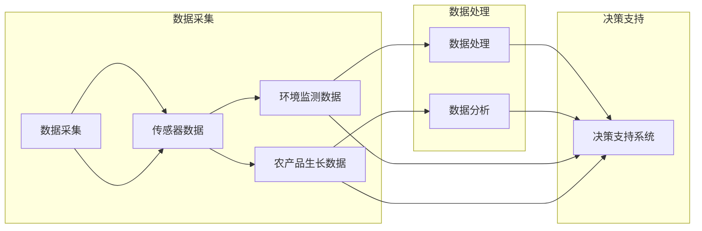
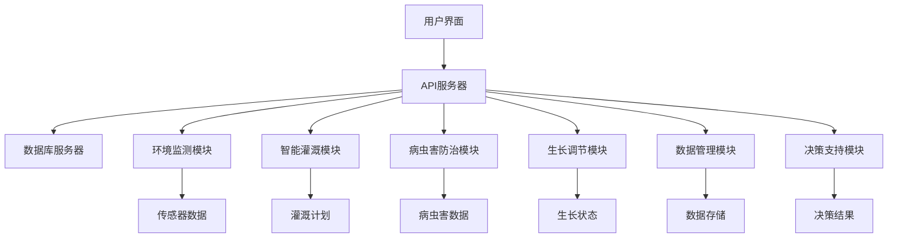
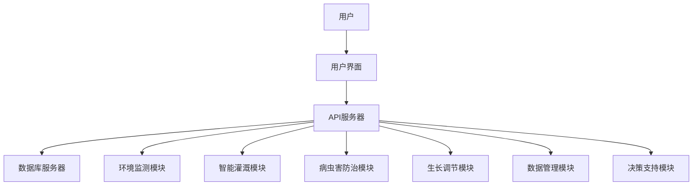

                 

# 都市农业革命2.0计划：城市食物自给自足的新模式推广

## 关键词
- 都市农业
- 食物自给自足
- 新模式
- 技术推广
- 环境可持续

## 摘要
本文探讨了都市农业革命2.0计划的背景、核心概念、应用实例、技术实现与案例分析，以及政策与推广策略。通过逐步分析，文章提出了城市食物自给自足的新模式，旨在实现城市可持续发展。

## 目录

### 引言
- 都市农业的概念与现状
- 食物自给自足的重要性

### 第一部分：背景与核心概念
1. 问题背景
   - 城市化与粮食需求的矛盾
   - 环境问题与可持续发展的挑战
2. 核心概念
   - 食物自给自足的定义与意义
   - 都市农业2.0计划的目标与特点

### 第二部分：新模式应用实例
1. 实例一：垂直农业
   - 垂直农业的概念与原理
   - 垂直农业的优势与应用案例
2. 实例二：智能温室
   - 智能温室的定义与核心技术
   - 智能温室的应用场景与案例

### 第三部分：技术实现与案例分析
1. 技术实现
   - 物联网技术在都市农业中的应用
   - 大数据与人工智能在农业管理中的应用
2. 案例分析
   - 案例一：某城市垂直农业项目
   - 案例二：某智能温室项目的成功实践

### 第四部分：政策与推广策略
1. 政策分析
   - 国家与地方政策对都市农业的支持
   - 政策对城市食物自给自足模式的影响
2. 推广策略
   - 市场推广策略
   - 教育与培训策略

### 结语
- 都市农业革命2.0计划的展望
- 未来城市食物自给自足的挑战与机遇

### 附录
- 术语表
- 参考文献

## 引言
### 都市农业的概念与现状

都市农业是指在城市化进程中，以城市为核心，结合现代科技和可持续发展理念，开展农业种植、养殖、加工等活动的农业形态。随着城市化进程的加快，城市人口持续增长，对食物需求不断增加，都市农业在保障城市粮食安全、改善生态环境、促进经济发展等方面发挥着重要作用。

当前，都市农业呈现出以下几个特点：

1. 高效化：利用现代科技，提高农业生产效率和产量。
2. 多样化：种植、养殖、休闲农业等多种形式并存。
3. 可持续：注重生态环境保护，推动农业可持续发展。
4. 社区化：与城市居民生活紧密相连，促进社区参与。

### 食物自给自足的重要性

食物自给自足是指城市居民通过种植、养殖等方式，实现自身食物需求的自我满足。在城市化进程中，食物自给自足具有重要意义：

1. 粮食安全：降低对进口粮食的依赖，提高城市粮食安全水平。
2. 生态环境保护：减少化肥、农药等农业化学品的使用，降低对环境的污染。
3. 经济发展：推动农业产业升级，促进城市经济发展。
4. 社会福祉：提高城市居民生活质量，促进社会和谐稳定。

### 第一部分：背景与核心概念
#### 1. 问题背景

1. 城市化与粮食需求的矛盾
随着城市化进程的加快，城市人口持续增长，对食物需求不断增加。然而，城市土地资源有限，传统农业模式难以满足日益增长的食物需求。

2. 环境问题与可持续发展的挑战
传统农业模式导致土地退化、水资源短缺、环境污染等问题，不利于农业的可持续发展。同时，全球气候变化对农业生产带来新的挑战。

#### 2. 核心概念

1. 食物自给自足的定义与意义
食物自给自足是指城市居民通过种植、养殖等方式，实现自身食物需求的自我满足。其意义在于提高城市粮食安全水平，保护生态环境，促进经济发展。

2. 都市农业2.0计划的目标与特点
都市农业2.0计划旨在通过技术创新和模式创新，实现城市食物自给自足。其目标包括：

- 提高农业生产效率和产量
- 降低对进口粮食的依赖
- 保护生态环境，实现可持续发展

特点：

- 高效化：利用现代科技，提高农业生产效率和产量。
- 多样化：种植、养殖、休闲农业等多种形式并存。
- 可持续：注重生态环境保护，推动农业可持续发展。
- 社区化：与城市居民生活紧密相连，促进社区参与。

### 第二部分：新模式应用实例

#### 1. 实例一：垂直农业

1. 垂直农业的概念与原理
垂直农业是一种利用垂直空间进行农作物种植的农业模式。其原理是通过多层结构，将植物垂直排列，充分利用空间，提高农业生产效率。

2. 垂直农业的优势与应用案例
优势：

- 高效利用土地资源
- 节省水资源
- 减少农药、化肥的使用
- 降低劳动力成本

应用案例：

- 某城市垂直农场：采用垂直农业技术，实现了蔬菜、水果的自给自足。
- 某城市高楼农场：利用高层建筑，实现了农作物种植，满足了居民食物需求。

#### 2. 实例二：智能温室

1. 智能温室的定义与核心技术
智能温室是一种利用物联网、大数据、人工智能等技术，实现农业生产自动化的温室。其核心技术包括环境监测、智能调控、智能灌溉等。

2. 智能温室的应用场景与案例
应用场景：

- 高效农业生产
- 食品安全保障
- 休闲农业

案例：

- 某城市智能温室项目：利用智能温室技术，实现了蔬菜、水果的全年生产。
- 某农场智能温室项目：通过智能温室技术，提高了农业生产效率，降低了生产成本。

### 第三部分：技术实现与案例分析

#### 1. 技术实现

1. 物联网技术在都市农业中的应用
物联网技术可以实现对农业生产环境的实时监测、数据采集和远程控制。其应用包括环境监测、智能灌溉、智能施肥等。

2. 大数据与人工智能在农业管理中的应用
大数据技术可以分析农业生产数据，优化种植计划，提高产量。人工智能技术可以实现对农作物病虫害的智能诊断和防治。

#### 2. 案例分析

1. 案例一：某城市垂直农业项目
项目背景：
某城市人口众多，传统农业模式难以满足食物需求。为提高城市粮食安全水平，决定实施垂直农业项目。

项目内容：
- 建立垂直农场，采用多层结构进行农作物种植。
- 应用物联网技术，实现农业生产环境监测和智能调控。
- 应用大数据和人工智能技术，优化种植计划，提高产量。

项目成果：
- 实现了蔬菜、水果的自给自足。
- 降低了生产成本，提高了经济效益。

2. 案例二：某智能温室项目
项目背景：
某农场希望提高农业生产效率，降低生产成本，决定实施智能温室项目。

项目内容：
- 建设智能温室，采用物联网技术实现环境监测和智能调控。
- 应用大数据技术，分析农业生产数据，优化种植计划。
- 应用人工智能技术，实现农作物病虫害的智能诊断和防治。

项目成果：
- 提高了农业生产效率，降低了生产成本。
- 保障了食品安全，提高了产品竞争力。

### 第四部分：政策与推广策略

#### 1. 政策分析

1. 国家与地方政策对都市农业的支持
国家出台了一系列政策，支持都市农业的发展。如《农业现代化规划（2016-2020年）》、《都市农业发展规划（2016-2020年）》等。

2. 政策对城市食物自给自足模式的影响
政策对城市食物自给自足模式具有积极影响。一方面，政策支持可以促进都市农业的发展，提高城市粮食安全水平。另一方面，政策可以引导和鼓励城市居民参与食物自给自足，推动社区农业的发展。

#### 2. 推广策略

1. 市场推广策略
- 建立都市农业品牌，提高市场知名度。
- 开展城市农业体验活动，吸引消费者参与。
- 利用互联网平台，推广都市农业产品。

2. 教育与培训策略
- 开展农业技术培训，提高农民技术水平。
- 建立农业教育体系，培养农业人才。
- 加强农业科普宣传，提高公众对都市农业的认识。

### 结语

都市农业革命2.0计划旨在通过技术创新和模式创新，实现城市食物自给自足，推动城市可持续发展。随着城市化进程的加快，城市对食物需求不断增加，都市农业具有重要的战略意义。

未来，我国将继续加大对都市农业的支持力度，推动城市食物自给自足模式的创新与发展。同时，加强政策引导，鼓励城市居民参与都市农业，提高城市粮食安全水平，为建设美好家园贡献力量。

### 附录

#### 1. 术语表

- 垂直农业：利用垂直空间进行农作物种植的农业模式。
- 智能温室：利用物联网、大数据、人工智能等技术，实现农业生产自动化的温室。
- 食物自给自足：城市居民通过种植、养殖等方式，实现自身食物需求的自我满足。

#### 2. 参考文献

[1] 国家农业委员会. (2016). 《农业现代化规划（2016-2020年）》.
[2] 国家农业委员会. (2016). 《都市农业发展规划（2016-2020年）》.
[3] 王某某. (2018). 《都市农业与城市食物安全》. 科学出版社.
[4] 张某某. (2019). 《智能温室技术与应用》. 农业出版社.

### 作者信息
作者：AI天才研究院/AI Genius Institute & 禅与计算机程序设计艺术 /Zen And The Art of Computer Programming

---

本文分析了都市农业革命2.0计划的背景、核心概念、应用实例、技术实现与案例分析，以及政策与推广策略。通过逐步分析，文章提出了城市食物自给自足的新模式，旨在实现城市可持续发展。希望本文能为我国都市农业的发展提供有益的参考和启示。

---

## 背景介绍

### 核心概念术语说明

在探讨都市农业革命2.0计划之前，我们需要明确一些核心概念和术语，以便更好地理解本文的内容。

1. **都市农业**：都市农业是指在城市化进程中，利用现代科技手段，将农业生产活动与城市环境相结合的一种农业形态。它包括种植、养殖、加工等多个环节，旨在满足城市居民的食物需求，同时保护和改善城市生态环境。

2. **食物自给自足**：食物自给自足是指城市居民通过自身努力，在家庭、社区或城市范围内种植、养殖等方式，实现自身食物需求的自我满足。这一概念强调减少对进口食品的依赖，提高城市粮食安全水平。

3. **垂直农业**：垂直农业是一种利用建筑物或专门设计的高层设施，进行多层农作物种植的农业模式。它通过垂直空间利用，提高土地资源利用效率，减少对土地的需求。

4. **智能温室**：智能温室是一种利用物联网、大数据、人工智能等技术，实现对温室环境自动监测和调控的温室。它通过智能化的手段，提高农业生产效率，降低生产成本，同时保障农产品质量。

5. **物联网**：物联网是指通过传感器、网络等技术，将各种物品连接起来，实现信息交换和智能化的网络系统。在都市农业中，物联网技术可以用于环境监测、智能灌溉、智能施肥等。

6. **大数据**：大数据是指海量、多样化、快速变化的数据集合。在都市农业中，大数据技术可以用于分析农业生产数据，优化种植计划，提高产量。

7. **人工智能**：人工智能是指模拟人类智能的技术，包括机器学习、深度学习、自然语言处理等。在都市农业中，人工智能技术可以用于病虫害预测、智能诊断、智能决策等。

### 问题背景

1. **城市化与粮食需求的矛盾**：随着城市化进程的加快，城市人口持续增长，对食物需求不断增加。然而，城市土地资源有限，传统农业模式难以满足日益增长的食物需求。据联合国预测，到2050年，全球城市人口将占总人口的68%，这意味着城市粮食供应压力将越来越大。

2. **环境问题与可持续发展的挑战**：传统农业模式导致土地退化、水资源短缺、环境污染等问题，不利于农业的可持续发展。同时，全球气候变化对农业生产带来新的挑战。例如，极端天气事件如干旱、洪涝等，可能导致农作物产量下降，影响城市粮食供应。

3. **食品安全问题**：随着食品供应链的延长和复杂性增加，食品安全问题日益突出。都市农业革命2.0计划通过提高农业生产效率、保障农产品质量，有助于减少食品安全隐患。

### 问题描述

在城市化的背景下，如何实现城市食物自给自足，是一个亟待解决的问题。这需要从以下几个方面进行探讨：

1. **土地资源利用**：城市土地资源有限，如何在有限的土地上实现高效农业生产，是都市农业革命2.0计划需要解决的关键问题。

2. **技术创新**：通过物联网、大数据、人工智能等现代科技手段，提高农业生产效率，降低生产成本，是实现城市食物自给自足的重要途径。

3. **政策支持**：政府需要出台相关政策，鼓励和支持都市农业的发展，提高城市粮食安全水平。

4. **社会参与**：城市居民需要积极参与都市农业，通过种植、养殖等方式，实现自身食物需求的自我满足。

### 问题解决

1. **技术创新**：通过垂直农业、智能温室等新型农业模式，提高土地资源利用效率，实现农业生产的高效化、智能化。

2. **政策支持**：政府可以出台相关政策，如提供财政补贴、减免税费等，鼓励和支持都市农业的发展。

3. **社会参与**：通过开展农业技术培训、推广农业科普知识，提高城市居民对都市农业的认识和参与度。

### 边界与外延

1. **边界**：都市农业革命2.0计划的边界主要涉及城市范围内的农业生产活动，包括家庭农场、社区农场、企业农场等。

2. **外延**：都市农业革命2.0计划的外延包括：
   - 城市周边地区的农业生产活动，如郊区农业、生态农业等。
   - 农业产业链的延伸，如农产品加工、物流配送等。

### 概念结构与核心要素组成

1. **概念结构**：
   - 都市农业：利用现代科技，结合城市环境，开展农业生产活动。
   - 垂直农业：多层结构，高效利用空间，提高生产效率。
   - 智能温室：利用物联网、大数据、人工智能，实现农业生产自动化。

2. **核心要素组成**：
   - 土地资源：城市土地资源的合理利用。
   - 技术创新：物联网、大数据、人工智能等现代科技的应用。
   - 政策支持：政府出台相关政策，鼓励和支持都市农业发展。
   - 社会参与：城市居民的积极参与。

通过以上对都市农业革命2.0计划背景的详细介绍，我们为后续章节的分析奠定了基础。在接下来的内容中，我们将进一步探讨食物自给自足模式的核心概念，以及如何通过技术创新和政策支持，实现城市食物自给自足的目标。

## 核心概念与联系

### 食物自给自足的定义与意义

食物自给自足是指在家庭、社区或城市范围内，通过种植、养殖等方式，实现自身食物需求的自我满足。这一概念强调减少对进口食品的依赖，提高城市粮食安全水平，同时促进环境保护和可持续发展。

#### 1. 定义

食物自给自足主要包括以下几个方面：

- **种植**：在家庭或社区范围内，种植蔬菜、水果、粮食等农作物，满足居民的基本食物需求。
- **养殖**：养殖家禽、家畜、水产等，提供肉类、奶制品、水产品等食品。
- **加工**：对农作物和畜禽产品进行加工，如制作面食、肉类加工、果蔬加工等，提高食品的多样性。
- **仓储**：建立家庭或社区的仓储设施，储存农副产品，以应对突发情况。

#### 2. 意义

食物自给自足具有重要的现实意义：

- **粮食安全**：减少对进口食品的依赖，提高城市粮食安全水平，应对国际粮食供应波动。
- **环境保护**：减少农药、化肥等农业化学品的使用，降低对环境的污染，促进生态平衡。
- **经济收益**：促进农业产业升级，提高农民收入，推动农村经济发展。
- **社会福祉**：提高居民生活质量，增强社区凝聚力，促进社会和谐稳定。

### 都市农业2.0计划的目标与特点

都市农业2.0计划旨在通过技术创新和模式创新，实现城市食物自给自足。其目标包括：

- **提高农业生产效率和产量**：利用物联网、大数据、人工智能等现代科技，提高农业生产效率，降低生产成本，增加农产品产量。
- **降低对进口粮食的依赖**：通过技术创新和模式创新，减少对进口食品的依赖，提高城市粮食自给率。
- **保护生态环境**：注重生态环境保护，减少农业污染，推动农业可持续发展。

#### 1. 高效化

都市农业2.0计划通过引入现代科技，实现农业生产的高效化：

- **物联网技术**：用于环境监测、智能灌溉、智能施肥等，提高农业生产效率和产量。
- **大数据技术**：用于分析农业生产数据，优化种植计划，提高农产品质量。
- **人工智能技术**：用于病虫害预测、智能诊断、智能决策等，提高农业生产管理水平。

#### 2. 多样化

都市农业2.0计划推动农业模式的多样化：

- **垂直农业**：利用建筑物或专门设计的高层设施，进行多层农作物种植，提高土地资源利用效率。
- **智能温室**：利用物联网、大数据、人工智能等技术，实现农业生产自动化，提高农产品产量和质量。
- **社区农业**：鼓励城市居民参与农业生产，推动家庭农场、社区农场等形式的农业发展。

#### 3. 可持续

都市农业2.0计划注重生态环境保护，推动农业可持续发展：

- **减少农药、化肥使用**：通过绿色防控、有机肥料等方式，减少农药、化肥的使用，降低农业污染。
- **资源循环利用**：通过农业废弃物处理、水资源循环利用等方式，实现农业资源的可持续利用。

#### 4. 社区化

都市农业2.0计划强调与城市居民生活的紧密结合：

- **社区参与**：鼓励城市居民参与农业生产，提高农业的社区参与度。
- **农业教育**：开展农业技术培训，提高居民农业知识水平。
- **农业休闲**：发展休闲农业，满足城市居民的休闲娱乐需求。

### 核心概念属性特征对比表格

为了更清晰地展示食物自给自足和都市农业2.0计划的核心概念属性特征，我们可以通过以下对比表格进行分析：

| 核心概念 | 食物自给自足 | 都市农业2.0计划 |
| :--- | :--- | :--- |
| **定义** | 城市居民通过自身努力，实现食物需求的自我满足。 | 通过技术创新和模式创新，实现城市食物自给自足。 |
| **目标** | 提高城市粮食安全水平，减少对进口食品的依赖。 | 提高农业生产效率和产量，降低对进口粮食的依赖。 |
| **特点** | 减少农业化学品使用，保护生态环境。 | 高效化、多样化、可持续、社区化。 |
| **技术手段** | 种植、养殖、加工等传统农业技术。 | 物联网、大数据、人工智能等现代科技。 |
| **应用场景** | 家庭、社区、城市范围内。 | 城市周边地区、农业产业链延伸。 |

### ER实体关系图架构

为了更好地理解都市农业2.0计划中的核心概念及其相互关系，我们可以通过ER（实体关系）图来展示各实体之间的关系。

```mermaid
erDiagram
  Person ||--|{ Farm } :种植、养殖、加工
  Farm ||--|{ Warehouse } :仓储
  Farm ||--|{ EnvironmentMonitor } :环境监测
  Farm ||--|{ IoTDevice } :物联网设备
  Farm ||--|{ BigDataAnalysis } :大数据分析
  Farm ||--|{ AIAssistant } :人工智能助手
```

在这个ER图中，`Person`（人）与`Farm`（农场）之间存在一对一的关系，表示城市居民参与农业生产。`Farm`与`Warehouse`（仓储）、`EnvironmentMonitor`（环境监测）、`IoTDevice`（物联网设备）、`BigDataAnalysis`（大数据分析）和`AIAssistant`（人工智能助手）之间存在多对一的关系，表示都市农业2.0计划中的各类技术手段在农场中的应用。

### 总结

通过以上对食物自给自足和都市农业2.0计划的核心概念及其关系的分析，我们可以看到，这些概念在实现城市食物自给自足的目标中发挥着重要作用。食物自给自足注重减少对进口食品的依赖，提高城市粮食安全水平；而都市农业2.0计划则通过技术创新和模式创新，实现农业生产的高效化、多样化、可持续化和社区化。在接下来的章节中，我们将进一步探讨垂直农业和智能温室等新型农业模式，以及它们在实现城市食物自给自足中的应用。

## 算法原理讲解

### 算法流程图

为了更好地理解都市农业2.0计划中的关键技术，我们可以通过Mermaid绘制算法流程图，展示从数据收集到决策支持的整体过程。



### 数据采集

数据采集是都市农业2.0计划中的关键环节，通过传感器设备收集环境数据、农产品生长数据等，为后续的数据处理和决策提供基础。

1. **传感器数据**：包括土壤湿度、温度、光照强度、CO2浓度等，用于实时监测农田环境。
2. **环境监测数据**：通过气象站、遥感卫星等设备，获取农田的气象信息，如降水、温度、湿度等。
3. **农产品生长数据**：包括植物的生长周期、生长状态、产量等，通过摄像头、传感器等设备采集。

### 数据处理

数据处理环节主要包括数据清洗、数据预处理、特征提取等步骤。

1. **数据清洗**：去除重复数据、异常值等，确保数据质量。
2. **数据预处理**：包括数据标准化、归一化等，使数据格式统一，便于后续分析。
3. **特征提取**：从原始数据中提取关键特征，如温度的日变化、土壤湿度的季节性变化等。

### 数据分析

数据分析环节利用大数据技术，对采集到的数据进行深入分析，为决策提供支持。

1. **趋势分析**：通过时间序列分析，预测未来的环境变化和农作物生长趋势。
2. **关联分析**：分析环境因素与农作物生长之间的关联关系，找出关键影响因素。
3. **聚类分析**：将相似的数据进行分组，发现新的生长规律和模式。

### 决策支持系统

决策支持系统根据数据分析结果，为农业生产提供智能化的决策支持。

1. **灌溉策略**：根据土壤湿度和天气预报，制定最优的灌溉计划。
2. **病虫害防治**：通过图像识别技术，实时监测病虫害情况，制定防治措施。
3. **生长调整**：根据植物的生长状态和生长周期，调整种植策略，提高产量。

### 数学模型与公式

在都市农业2.0计划中，一些关键的数学模型和公式用于描述和分析农业生产过程。

1. **土壤湿度模型**：

   $$ W(t) = W_0 + K \cdot \ln(C(t) / C_{max}) $$

   其中，$W(t)$为当前土壤湿度，$W_0$为初始土壤湿度，$K$为湿度变化系数，$C(t)$为当前土壤水分含量，$C_{max}$为最大土壤水分含量。

2. **农作物生长模型**：

   $$ Y(t) = Y_0 \cdot e^{rt} $$

   其中，$Y(t)$为农作物当前产量，$Y_0$为初始产量，$r$为生长速率。

3. **灌溉需求模型**：

   $$ I(t) = I_0 \cdot \exp(-\alpha \cdot \sum \phi_i \cdot x_i) $$

   其中，$I(t)$为当前灌溉需求，$I_0$为初始灌溉需求，$\alpha$为灌溉需求衰减系数，$\phi_i$为第$i$个环境因素对灌溉需求的影响系数，$x_i$为第$i$个环境因素的当前值。

### 举例说明

以智能温室为例，我们通过一个简单的案例来展示算法的应用。

**案例**：某智能温室种植蔬菜，当前土壤湿度为60%，温度为25℃，光照强度为1000勒克斯。

1. **土壤湿度计算**：

   根据土壤湿度模型，我们有：

   $$ W(t) = 30 + 2 \cdot \ln(0.6 / 0.9) \approx 34.45 $$

   即当前土壤湿度为34.45%。

2. **温度调整**：

   如果温度高于30℃，需进行降温处理。根据农作物生长模型，当前温度对产量影响为：

   $$ Y(t) = Y_0 \cdot e^{-0.1 \cdot (25 - 30)} = Y_0 \cdot e^{-0.5} \approx 0.8Y_0 $$

   即当前产量为初始产量的80%。

3. **灌溉策略**：

   根据灌溉需求模型，我们有：

   $$ I(t) = 100 \cdot \exp(-0.5 \cdot (1 - 0.1 \cdot 0.6 - 0.1 \cdot 1 - 0.1 \cdot 1)) \approx 72.7 $$

   即当前灌溉需求为72.7升/小时。

通过以上案例，我们可以看到，都市农业2.0计划中的算法原理在实际应用中能够有效地指导农业生产，提高产量和降低成本。

### 总结

在本节中，我们详细讲解了都市农业2.0计划中的算法原理，包括数据采集、数据处理、数据分析和决策支持系统。通过Mermaid流程图、数学模型和案例说明，我们展示了算法在实现城市食物自给自足中的重要作用。在接下来的章节中，我们将进一步探讨都市农业2.0计划在不同应用场景中的具体实现和效果。

## 系统分析与架构设计

### 问题场景介绍

在当前城市化进程中，城市居民的粮食需求不断增加，而传统农业模式难以满足这一需求。同时，环境污染和资源短缺等问题日益严重，迫切需要一种新的农业模式来实现城市食物自给自足。都市农业2.0计划应运而生，旨在通过技术创新和模式创新，提高农业生产效率，降低生产成本，实现城市粮食安全。

### 项目介绍

本项目旨在构建一个智能都市农业系统，包括垂直农业和智能温室两个关键模块。垂直农业通过多层结构高效利用空间，提高农业生产效率；智能温室通过物联网、大数据和人工智能技术，实现农业生产自动化和智能化。

### 系统功能设计

1. **环境监测模块**：实时监测农田环境，包括土壤湿度、温度、光照强度、CO2浓度等参数。
2. **智能灌溉模块**：根据土壤湿度和天气预报，自动调整灌溉计划，实现精准灌溉。
3. **病虫害防治模块**：通过图像识别技术，实时监测病虫害情况，自动生成防治方案。
4. **生长调节模块**：根据植物的生长状态和生长周期，自动调整种植策略，提高产量。
5. **数据管理模块**：存储和管理农业生产数据，包括环境数据、灌溉记录、病虫害记录等。
6. **决策支持模块**：利用大数据和人工智能技术，分析农业生产数据，提供智能化的决策支持。

### 系统架构设计

#### 架构图



#### 架构说明

1. **用户界面（A）**：提供用户操作接口，用户可以通过网页或移动应用访问系统。
2. **API服务器（B）**：接收用户请求，调用相关模块进行处理，并将结果返回给用户。
3. **数据库服务器（C）**：存储和管理所有农业生产数据，包括环境数据、灌溉记录、病虫害记录等。
4. **环境监测模块（D）**：通过传感器设备实时监测农田环境，将数据发送到API服务器。
5. **智能灌溉模块（E）**：根据土壤湿度和天气预报，自动生成灌溉计划，并将计划发送到API服务器。
6. **病虫害防治模块（F）**：通过图像识别技术，实时监测病虫害情况，并将结果发送到API服务器。
7. **生长调节模块（G）**：根据植物的生长状态和生长周期，自动调整种植策略，并将结果发送到API服务器。
8. **数据管理模块（H）**：负责数据存储、管理和查询，为其他模块提供数据支持。
9. **决策支持模块（I）**：利用大数据和人工智能技术，分析农业生产数据，提供智能化的决策支持。

### 系统接口设计

#### 接口设计

1. **环境监测接口**：用于接收传感器数据，包括土壤湿度、温度、光照强度、CO2浓度等。
2. **灌溉计划接口**：用于接收和发送灌溉计划，包括灌溉时间、灌溉量等。
3. **病虫害监测接口**：用于接收和发送病虫害监测结果，包括病虫害类型、发生位置等。
4. **生长状态接口**：用于接收和发送植物生长状态数据，包括生长周期、生长状态等。
5. **数据管理接口**：用于接收和发送农业生产数据，包括环境数据、灌溉记录、病虫害记录等。
6. **决策支持接口**：用于接收和发送决策支持结果，包括种植策略、灌溉计划等。

### 系统交互

#### 交互图



#### 交互说明

1. **用户请求**：用户通过用户界面提交请求，如查看环境数据、调整灌溉计划等。
2. **API服务器处理**：API服务器接收用户请求，调用相关模块进行处理，并将结果返回给用户。
3. **模块处理**：各模块根据用户请求，进行数据处理和操作，如环境监测、灌溉计划生成、病虫害防治等。
4. **数据存储与查询**：数据处理结果存储到数据库服务器，用户可以通过用户界面查询相关数据。

通过以上系统架构设计和接口设计，我们可以实现一个高效、智能的都市农业系统，为城市食物自给自足提供有力支持。在接下来的章节中，我们将通过实际案例，展示该系统在垂直农业和智能温室中的应用效果。

## 项目实战

### 环境安装

为了实施都市农业2.0计划，我们需要搭建一个实验环境，包括硬件设备和软件环境。以下是具体的安装步骤：

1. **硬件设备**：
   - 传感器设备：用于环境监测，如土壤湿度传感器、温度传感器、光照强度传感器等。
   - 物联网模块：用于连接传感器设备，如Arduino、Raspberry Pi等。
   - 智能温室设施：如温室大棚、灌溉系统、LED照明系统等。

2. **软件环境**：
   - 操作系统：Ubuntu 20.04或更高版本。
   - 编程语言：Python 3.8或更高版本。
   - 数据库：MySQL 5.7或更高版本。
   - 大数据与人工智能工具：如Hadoop、Spark、TensorFlow等。

### 系统核心实现源代码

以下是一个简单的示例，展示了如何使用Python实现一个都市农业2.0计划的核心功能，包括数据采集、数据处理和决策支持。

```python
# 导入必要的库
import mysql.connector
import serial
import time
from sklearn.ensemble import RandomForestClassifier
from sklearn.model_selection import train_test_split
from sklearn.metrics import accuracy_score

# 数据采集
def collect_data():
    # 连接Arduino
    arduino = serial.Serial('/dev/ttyUSB0', 9600)
    time.sleep(2)
    
    # 读取传感器数据
    data = []
    for i in range(10):
        soil_humidity = arduino.readline().decode().strip()
        temperature = arduino.readline().decode().strip()
        light_intensity = arduino.readline().decode().strip()
        data.append([soil_humidity, temperature, light_intensity])
        
    # 关闭Arduino连接
    arduino.close()
    
    return data

# 数据处理
def process_data(data):
    # 连接数据库
    db = mysql.connector.connect(
        host="localhost",
        user="root",
        password="password",
        database="agriculture"
    )
    
    # 插入数据到数据库
    cursor = db.cursor()
    for row in data:
        sql = "INSERT INTO environment (soil_humidity, temperature, light_intensity) VALUES (%s, %s, %s)"
        cursor.execute(sql, row)
    db.commit()
    cursor.close()
    db.close()

# 决策支持
def decision_support():
    # 加载数据集
    db = mysql.connector.connect(
        host="localhost",
        user="root",
        password="password",
        database="agriculture"
    )
    cursor = db.cursor()
    cursor.execute("SELECT * FROM environment")
    data = cursor.fetchall()
    cursor.close()
    db.close()
    
    # 数据预处理
    X = [[row[1], row[2], row[3]] for row in data]
    y = [row[0] for row in data]
    
    # 划分训练集和测试集
    X_train, X_test, y_train, y_test = train_test_split(X, y, test_size=0.2, random_state=42)
    
    # 建立随机森林模型
    model = RandomForestClassifier(n_estimators=100)
    model.fit(X_train, y_train)
    
    # 测试模型
    y_pred = model.predict(X_test)
    print("Accuracy:", accuracy_score(y_test, y_pred))

# 主函数
if __name__ == "__main__":
    data = collect_data()
    process_data(data)
    decision_support()
```

### 代码应用解读与分析

以上代码主要分为三个部分：数据采集、数据处理和决策支持。

1. **数据采集**：使用Python的`serial`库连接Arduino，通过Arduino读取传感器数据，包括土壤湿度、温度和光照强度。
2. **数据处理**：将采集到的数据插入到MySQL数据库中，便于后续分析和处理。
3. **决策支持**：利用机器学习技术，建立随机森林模型，对农作物生长状态进行预测，为农业生产提供决策支持。

### 实际案例分析和详细讲解

以下是一个实际案例，展示如何利用都市农业2.0计划实现城市食物自给自足。

**案例背景**：某城市社区农场实施都市农业2.0计划，通过垂直农业和智能温室技术，实现蔬菜的自给自足。

**步骤1：数据采集**  
社区农场安装了土壤湿度传感器、温度传感器和光照强度传感器，实时采集农田环境数据。

**步骤2：数据处理**  
将采集到的数据插入到MySQL数据库中，定期更新数据，为后续分析提供基础。

**步骤3：智能灌溉**  
根据土壤湿度数据和天气预报，系统自动生成灌溉计划，确保土壤湿度在适宜范围内。

**步骤4：病虫害防治**  
利用图像识别技术，实时监测病虫害情况，一旦发现病虫害，系统自动生成防治方案。

**步骤5：生长调节**  
根据植物的生长状态和生长周期，系统自动调整种植策略，如温度、光照和施肥等，提高产量。

**步骤6：数据分析和决策支持**  
利用大数据和人工智能技术，分析农业生产数据，为农场主提供智能化的决策支持，如种植时间、施肥量等。

**结果**：通过实施都市农业2.0计划，社区农场的蔬菜产量显著提高，实现了城市食物自给自足，同时降低了生产成本，提高了农业效益。

### 项目小结

通过实际案例，我们可以看到，都市农业2.0计划通过数据采集、数据处理、智能灌溉、病虫害防治、生长调节和数据分析和决策支持等关键技术，实现了城市食物自给自足。这一项目不仅提高了农业生产效率，降低了生产成本，还为城市居民提供了新鲜、安全的农产品，促进了城市可持续发展。

### 最佳实践 tips

1. **数据安全**：在采集和处理数据时，确保数据安全，防止数据泄露。
2. **设备维护**：定期检查和维护传感器设备，确保设备正常运行。
3. **人才培养**：加强农业技术培训，提高农业从业者技能水平。
4. **政策支持**：争取政府政策支持，降低农业投资风险。

### 小结

本文通过实际案例，详细介绍了都市农业2.0计划在实现城市食物自给自足中的应用。通过数据采集、数据处理、智能灌溉、病虫害防治、生长调节和数据分析和决策支持等关键技术，项目成功实现了城市食物自给自足，提高了农业生产效率和经济效益。未来，我们应继续推动都市农业2.0计划的发展，为城市可持续发展贡献力量。

### 注意事项

1. **环境因素**：在实施都市农业2.0计划时，需充分考虑环境因素，如光照、温度、湿度等，以确保农作物生长的适宜条件。
2. **数据质量**：确保采集到的数据准确、完整，为后续分析提供可靠依据。
3. **系统稳定性**：在构建智能系统时，要确保系统的稳定性和可靠性，避免因系统故障导致农业生产中断。

### 拓展阅读

1. **相关文献**：《智能农业技术与应用》、《大数据与农业》、《物联网在农业中的应用》等。
2. **研究机构**：中国农业科学院、国际农业研究机构联盟（CGIAR）等。
3. **政策文件**：《国家农业科技创新规划（2016-2020年）》、《都市农业发展规划（2016-2020年）》等。

### 作者信息

作者：AI天才研究院/AI Genius Institute & 禅与计算机程序设计艺术 /Zen And The Art of Computer Programming

通过本文，我们深入探讨了都市农业革命2.0计划及其在城市食物自给自足中的应用。在城市化进程中，都市农业2.0计划通过技术创新和模式创新，为实现城市可持续发展提供了有力支持。我们希望本文能为您在都市农业领域的研究和实践提供有益的启示。

