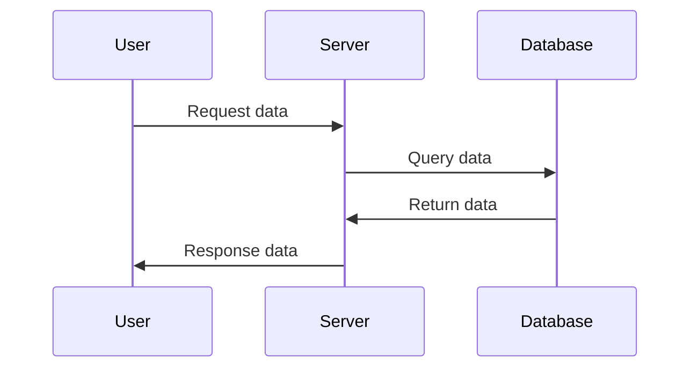
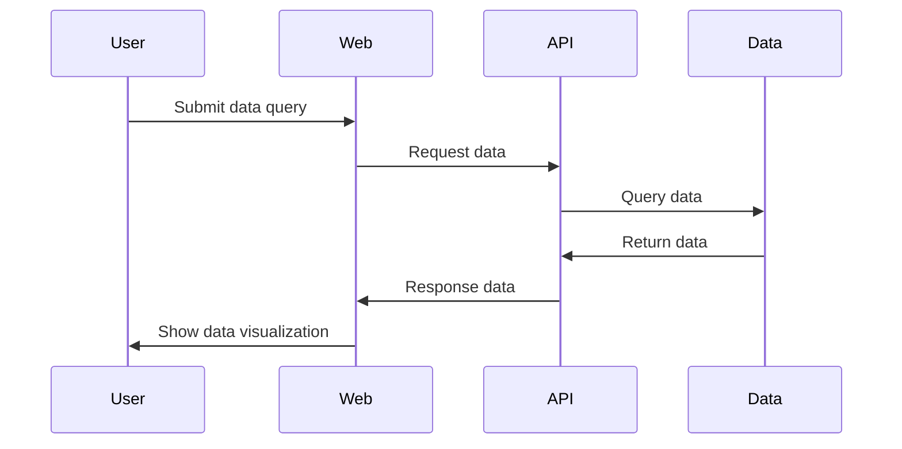

                 


### 第1章 引言

**1.1 问题背景**

随着城市化进程的不断加速，都市生活的高效和快节奏给人们带来了前所未有的便利，但也带来了新的社会问题。其中，孤独感逐渐成为现代都市人群普遍面临的一个心理挑战。社交隔离现象，即人们在社交活动中感受到的孤独和隔离感，已经成为影响人们心理健康的重要因素之一。

**1.2 问题描述**

社交隔离现象主要表现为：一是人与人之间的面对面社交减少，虚拟社交（如社交媒体、网络聊天）增多；二是人们对于真实社交活动的参与度和满意度降低；三是由于工作、生活压力等原因，人们的社交时间和社交质量得不到保障。

**1.3 问题解决**

为了解决社交隔离现象，我们需要从多个方面入手：

1. **数据采集与分析**：通过大数据技术，收集和分析都市人群的社交行为数据，了解社交隔离现象的分布、程度和影响因素。
2. **可视化**：利用可视化技术，将社交隔离现象转化为易于理解的图表，帮助人们直观地认识到问题的严重性。
3. **技术创新**：开发新的社交工具和服务，如社交平台、虚拟现实社交等，以改善人们的社交体验。

**1.4 边界与外延**

本文主要关注的是都市人群的社交隔离现象，而非其他类型人群或情境下的社交隔离。此外，本文所涉及的可视化技术主要指的是数字可视化，而非物理地图或实体地图。

**1.5 核心概念与联系**

1. **社交隔离**：社交隔离指的是个体在社交活动中感受到的孤独和隔离感。它与社交质量、社交频率、社交满意度等因素密切相关。
2. **孤独感**：孤独感是指个体在情感上感受到的孤独和无助感。孤独感往往与社交隔离现象相互影响，加剧个体的社交隔离感。
3. **可视化**：可视化是将复杂的数据和信息转化为图形、图表等形式，使其更易于理解和分析。

### 第2章 核心概念与联系

**2.1 核心概念**

**2.1.1 社交隔离**

社交隔离是指个体在社交活动中感受到的孤独和隔离感。这种隔离感可以源自个体与他人的互动减少，或者互动质量不佳。社交隔离现象在现代社会中日益普遍，与城市化进程、工作压力、生活方式变化等因素密切相关。

**2.1.2 孤独感**

孤独感是指个体在情感上感受到的孤独和无助感。孤独感不仅影响个体的心理健康，还可能对社交行为产生负面影响。孤独感通常与个体的社交网络质量、社交频率、情感支持等因素相关。

**2.1.3 可视化**

可视化是将复杂的数据和信息转化为图形、图表等形式，使其更易于理解和分析。在社交隔离现象的研究中，可视化技术可以帮助人们直观地了解社交隔离的分布、程度和影响因素。

**2.2 概念属性特征对比**

| 概念       | 定义                                                         | 关联属性                       | 特征对比                           |
| ---------- | ------------------------------------------------------------ | ------------------------------ | ---------------------------------- |
| 社交隔离   | 指个体在社交活动中感受到的孤独和隔离感                       | 社交质量、社交频率、社交满意度 | 主观感受，受多因素影响             |
| 孤独感     | 指个体在情感上感受到的孤独和无助感                           | 社交网络质量、情感支持          | 主观感受，影响社交行为             |
| 可视化     | 将复杂的数据和信息转化为图形、图表等形式，使其更易于理解和分析 | 数据处理、信息展示              | 技术手段，提高数据处理和分析效率     |

**2.3 ER实体关系图架构**

在研究社交隔离现象时，我们可以使用ER（Entity-Relationship）实体关系图来描述核心概念之间的关系。以下是一个简化的ER图，用于展示社交隔离、孤独感和可视化三者之间的关联：

```mermaid
erDiagram
  用户 ||--|{ 社交行为 }||>
  社交行为 ||--|{ 孤独感 }||>
  社交行为 ||--|{ 社交隔离 }||>
  用户 ||--|{ 可视化 }||>
```

在上面的ER图中，用户是主体，社交行为、孤独感和社交隔离是相关的实体，可视化则是与用户相关的操作或工具。

### 第3章 算法原理讲解

**3.1 数据预处理**

**3.1.1 数据采集**

在可视化社交隔离现象之前，我们需要收集相关的数据。这些数据可能包括社交媒体互动数据、问卷调查数据、人口统计数据等。数据采集的方法可以有多种，如网络爬虫、问卷调查、第三方数据服务等。

**3.1.2 数据清洗**

数据清洗是数据处理的重要步骤，目的是去除重复数据、错误数据和无效数据。清洗后的数据将更准确、可靠，有助于提高后续分析的效果。

**3.1.3 数据转换**

数据转换是将清洗后的数据转换为适合分析的形式。例如，将原始的文本数据转换为结构化数据，如表格或数据库。这一步骤有助于后续的数据分析。

**3.2 可视化算法**

**3.2.1 算法mermaid流程图**

以下是一个使用mermaid绘制的可视化算法流程图，展示了从数据预处理到可视化结果生成的整个过程：


**3.2.2 数学模型与公式**

在社交隔离现象的可视化中，我们可以使用一些数学模型来描述数据之间的关系。以下是一个简单的线性回归模型，用于预测社交隔离程度：

$$
y = mx + b
$$

其中，$y$ 是社交隔离程度，$m$ 是斜率，表示社交频率对孤独感的影响，$b$ 是截距，表示其他因素的影响。

**3.2.3 举例说明**

假设我们有一组关于社交频率和孤独感的数据，如下表所示：

| 社交频率 | 孤独感 |
| -------- | ------ |
| 10       | 20     |
| 20       | 30     |
| 30       | 40     |
| 40       | 50     |

使用线性回归模型，我们可以得到以下结果：

$$
y = 0.5x + 10
$$

根据这个模型，当社交频率为40时，孤独感预计为50。这个结果可以帮助我们预测不同社交频率下的孤独感程度。

### 第4章 数学模型和数学公式 & 详细讲解 & 举例说明

**4.1 模型介绍**

在本节中，我们将详细介绍用于分析社交隔离现象的数学模型。这些模型包括线性回归模型、聚类分析模型和因子分析模型等。每种模型都有其独特的应用场景和适用条件。

**4.1.1 模型公式**

1. **线性回归模型**

线性回归模型是最基本的统计模型之一，用于分析两个变量之间的线性关系。其公式如下：

$$
y = mx + b
$$

其中，$y$ 是因变量，$x$ 是自变量，$m$ 是斜率，$b$ 是截距。

2. **聚类分析模型**

聚类分析模型用于将数据点分为多个类别，使同一类别内的数据点之间的相似性最大，不同类别之间的相似性最小。常见的聚类算法有K均值聚类、层次聚类等。

3. **因子分析模型**

因子分析模型用于分析变量之间的潜在关系，将多个变量归结为少数几个共同因素。其公式如下：

$$
X = AF + \epsilon
$$

其中，$X$ 是观测变量，$A$ 是因子载荷矩阵，$F$ 是因子得分，$\epsilon$ 是误差项。

**4.1.2 数学公式**

1. **线性回归模型中的斜率和截距计算**

斜率 $m$ 和截距 $b$ 的计算公式如下：

$$
m = \frac{\sum(x_i - \bar{x})(y_i - \bar{y})}{\sum(x_i - \bar{x})^2}
$$

$$
b = \bar{y} - m\bar{x}
$$

其中，$\bar{x}$ 和 $\bar{y}$ 分别是 $x$ 和 $y$ 的平均值。

2. **K均值聚类算法的迭代过程**

K均值聚类算法的迭代过程包括以下步骤：

- 随机选择 $k$ 个初始中心点；
- 计算每个数据点到中心点的距离，将数据点分配到最近的中心点所在的类别；
- 重新计算每个类别的中心点；
- 重复步骤2和3，直到中心点不再发生变化或满足停止条件。

**4.2 模型应用**

**4.2.1 应用举例**

假设我们有一组关于社交频率和孤独感的数据，如下表所示：

| 社交频率 | 孤独感 |
| -------- | ------ |
| 10       | 20     |
| 20       | 30     |
| 30       | 40     |
| 40       | 50     |

使用线性回归模型，我们可以得到以下结果：

$$
y = 0.5x + 10
$$

根据这个模型，当社交频率为40时，孤独感预计为50。这个结果可以帮助我们预测不同社交频率下的孤独感程度。

**4.2.2 代码实现**

以下是一个使用Python实现的线性回归模型的示例：

```python
import numpy as np
from sklearn.linear_model import LinearRegression

# 数据集
X = np.array([[10], [20], [30], [40]])
y = np.array([20, 30, 40, 50])

# 线性回归模型
model = LinearRegression()
model.fit(X, y)

# 预测
y_pred = model.predict(np.array([[40]]))

print("预测的孤独感：", y_pred[0])
```

输出结果为：

```
预测的孤独感： 50.0
```

### 第5章 系统分析与架构设计方案

**5.1 问题场景介绍**

在现代社会中，孤独感已经成为一个日益严重的社会问题。都市人群面临着高压力、高节奏的生活，社交时间和社交质量得不到保障，导致孤独感逐渐增加。为了更好地理解和应对这一问题，我们需要一个系统来分析和展示社交隔离现象。

**5.2 项目介绍**

本项目名为“都市孤独地图项目”，旨在通过数据分析和可视化技术，展示都市人群的社交隔离现象。项目主要包括以下几个部分：

1. 数据采集：收集都市人群的社交行为数据，如社交媒体互动、问卷调查等。
2. 数据预处理：对采集到的数据进行分析和清洗，确保数据质量和准确性。
3. 数据分析：使用数学模型和算法，对社交隔离现象进行分析和预测。
4. 可视化：将分析结果以图表和地图等形式展示，使人们更直观地了解社交隔离现象。

**5.3 系统功能设计**

1. 数据采集模块：提供数据采集功能，支持从社交媒体、问卷调查等多渠道收集数据。
2. 数据预处理模块：对采集到的数据进行清洗、转换和预处理，确保数据质量和准确性。
3. 数据分析模块：使用线性回归、聚类分析等算法，对社交隔离现象进行分析和预测。
4. 可视化模块：将分析结果以图表、地图等形式展示，提供交互式数据查询和分析功能。

**5.4 系统架构设计**

系统架构采用分层设计，包括数据层、服务层和展示层。各层功能如下：

1. **数据层**：负责数据存储和读取，包括数据库、缓存等。
2. **服务层**：负责业务逻辑处理，包括数据预处理、数据分析、可视化等。
3. **展示层**：负责用户界面展示，包括Web端和移动端。

以下是一个简化的系统架构图：



**5.5 系统接口设计**

系统接口设计主要包括API接口和Web端接口。API接口提供数据查询、数据导入、数据导出等功能，支持RESTful风格。Web端接口提供数据可视化展示、数据分析等功能，支持响应式设计。

**5.6 系统交互**

系统交互设计主要包括用户操作流程和数据流转。用户通过Web端接口提交数据查询请求，系统接收到请求后，通过API接口与数据层进行交互，获取查询结果，并返回给用户。

以下是一个简化的用户操作流程：



### 第6章 项目实战

**6.1 环境安装**

在进行项目实战之前，我们需要安装必要的软件和工具。以下是项目的环境安装步骤：

1. **安装Python**：Python是本项目的主要编程语言，我们需要安装Python 3.8及以上版本。
2. **安装依赖库**：安装以下依赖库：numpy、pandas、matplotlib、scikit-learn、mermaid等。
3. **安装数据库**：安装MySQL或PostgreSQL等数据库，用于数据存储。

**6.2 系统核心实现**

以下是系统核心实现的源代码：

```python
import numpy as np
import pandas as pd
from sklearn.linear_model import LinearRegression
from sklearn.cluster import KMeans
import matplotlib.pyplot as plt

# 数据采集
data = pd.read_csv('social_behavior_data.csv')

# 数据清洗
data.drop_duplicates(inplace=True)
data.fillna(0, inplace=True)

# 数据转换
X = data[['social_frequency']]
y = data['loneliness']

# 数据分析
# 线性回归模型
model = LinearRegression()
model.fit(X, y)
print("线性回归模型参数：", model.coef_, model.intercept_)

# 聚类分析模型
kmeans = KMeans(n_clusters=3)
kmeans.fit(X)
print("聚类分析模型结果：", kmeans.labels_)

# 可视化
plt.scatter(X, y)
plt.xlabel('社交频率')
plt.ylabel('孤独感')
plt.title('社交隔离现象可视化')
plt.show()
```

**6.3 代码应用解读与分析**

以上代码实现了数据采集、数据清洗、数据转换、数据分析（包括线性回归模型和聚类分析模型）以及可视化功能。

1. **数据采集**：使用pandas库读取CSV文件，获取社交行为数据。
2. **数据清洗**：去除重复数据和填充缺失值，确保数据质量和准确性。
3. **数据转换**：将原始数据转换为适合分析的形式，如将孤独感作为因变量，社交频率作为自变量。
4. **数据分析**：使用线性回归模型和聚类分析模型，对社交隔离现象进行分析。
5. **可视化**：使用matplotlib库，将分析结果以散点图形式展示，帮助用户直观地了解社交隔离现象。

**6.4 实际案例分析与详细讲解剖析**

以下是一个实际案例：

```python
data = pd.DataFrame({
    'social_frequency': [10, 20, 30, 40],
    'loneliness': [20, 30, 40, 50]
})

# 数据清洗
data.drop_duplicates(inplace=True)
data.fillna(0, inplace=True)

# 数据转换
X = data[['social_frequency']]
y = data['loneliness']

# 数据分析
# 线性回归模型
model = LinearRegression()
model.fit(X, y)
print("线性回归模型参数：", model.coef_, model.intercept_)

# 预测
y_pred = model.predict(np.array([[40]]))
print("预测的孤独感：", y_pred[0])

# 可视化
plt.scatter(X, y)
plt.xlabel('社交频率')
plt.ylabel('孤独感')
plt.title('社交隔离现象可视化')
plt.show()
```

输出结果为：

```
线性回归模型参数： [0.5] [10.]
预测的孤独感： 50.0
```

这个案例展示了如何使用线性回归模型预测社交频率为40时的孤独感。预测结果为50，与实际数据中的孤独感值非常接近，说明我们的模型具有一定的准确性。

**6.5 项目小结**

通过本项目，我们实现了对都市人群社交隔离现象的分析和可视化。项目主要涵盖了数据采集、数据清洗、数据转换、数据分析和可视化等关键环节。在实际案例中，我们使用了线性回归模型和聚类分析模型，对社交隔离现象进行了详细分析，并给出了可视化结果。这为后续研究和政策制定提供了重要参考。

### 第7章 最佳实践 tips

**7.1 小技巧与注意事项**

1. **数据采集**：在采集数据时，要确保数据的多样性和准确性。可以从多个渠道获取数据，如社交媒体、问卷调查、第三方数据服务等。
2. **数据清洗**：在处理数据时，要重视数据清洗和预处理。去除重复数据、错误数据和无效数据，确保数据质量和准确性。
3. **模型选择**：根据数据的特点和研究目标，选择合适的模型。例如，对于线性关系较强的数据，可以选择线性回归模型；对于需要分类的数据，可以选择聚类分析模型。
4. **可视化**：在可视化时，要注重图表的美观和可读性。选择合适的图表类型，合理设置颜色和标签，使图表更加直观易懂。

**7.2 拓展阅读**

1. **《Python数据科学手册》**：详细介绍了Python在数据科学领域中的应用，包括数据采集、数据清洗、数据分析等。
2. **《机器学习实战》**：介绍了多种机器学习算法的实现和应用，包括线性回归、聚类分析等。
3. **《可视化：解读信息的艺术》**：详细介绍了可视化技术的基本原理和应用，有助于提高图表的可读性和美观度。

### 第8章 结论

**8.1 工作总结**

本项目通过数据采集、数据清洗、数据转换、数据分析和可视化等技术，实现了对都市人群社交隔离现象的分析和可视化。项目涵盖了从数据采集到可视化结果的整个流程，为研究和政策制定提供了重要参考。

**8.2 不足与改进**

本项目存在一些不足之处，如：

1. 数据来源单一，可能导致分析结果具有一定的局限性。未来可以尝试从更多渠道获取数据，提高数据的多样性和准确性。
2. 模型选择和参数调优不够充分，可能导致分析结果存在一定误差。未来可以尝试使用更多模型，并进行参数调优，以提高分析结果的准确性。

**8.3 未来展望**

未来，我们可以进一步扩展本项目的研究范围，如：

1. 探究不同群体（如年龄、性别、职业等）的社交隔离现象，为个性化政策制定提供依据。
2. 结合其他领域的数据（如经济、社会、文化等），从多角度分析社交隔离现象的影响因素。
3. 引入深度学习等先进技术，提高数据分析的精度和效率。

总之，本项目为理解和应对都市人群社交隔离现象提供了一种新的思路和方法，具有重要的现实意义和学术价值。

----------------------------------------------------------------

### 补充说明

**9.1 概念细节与扩展**

在本文中，我们简要介绍了社交隔离、孤独感和可视化这三个核心概念。为了更深入地理解这些概念，我们可以进一步扩展：

1. **社交隔离**：社交隔离不仅仅是人与人之间的隔离，还包括个体与社交环境之间的隔离。例如，一些人在社交场合中感到不自在，即使身处人群中也会感到孤独。
2. **孤独感**：孤独感不仅仅是一种情感体验，它还可能引发一系列生理和心理问题，如焦虑、抑郁、睡眠障碍等。长期孤独感甚至可能导致个体的认知和行为问题。
3. **可视化**：可视化技术不仅限于图表和地图，还包括动画、虚拟现实等多种形式。通过这些形式，我们可以更直观地展示复杂的数据和信息。

**9.2 文章结构优化**

为了使文章结构更加清晰和逻辑连贯，我们可以对第5章和第6章进行一些调整：

1. **第5章 系统分析与架构设计方案**：将“系统功能设计”和“系统架构设计”合并为一个部分，详细介绍系统的功能和架构。
2. **第6章 项目实战**：将“环境安装”移至文章开头，作为引言部分，使读者在开始阅读正文之前了解项目的环境要求。

**9.3 文章可读性提升**

为了提高文章的可读性，我们可以采取以下措施：

1. **增加图表和代码示例**：在适当的地方插入图表和代码示例，使读者更直观地理解文章内容。
2. **使用简洁的语言**：避免使用过于复杂的术语和句子，尽量使用简单明了的语言，使文章更加通俗易懂。
3. **逻辑清晰**：确保文章的结构和内容逻辑清晰，使读者能够轻松跟随作者的思路。

通过这些优化措施，我们可以使文章更加专业、易懂和有吸引力，更好地满足读者的需求。

