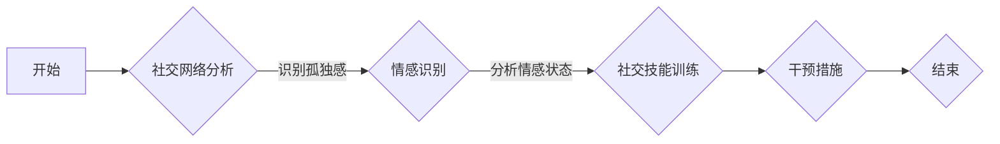
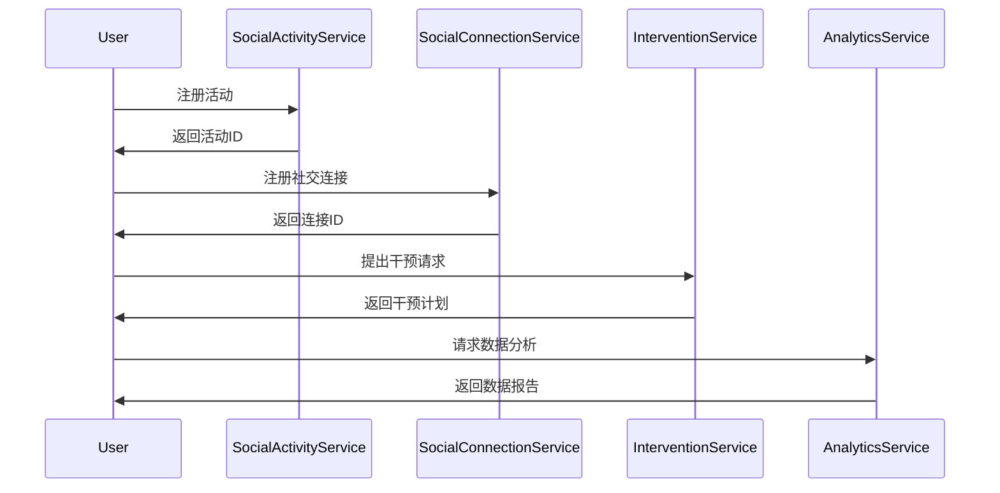
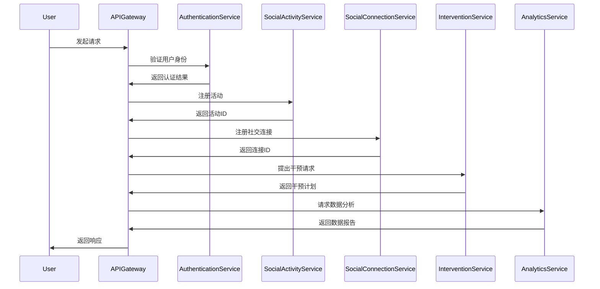

                 

### 都市孤独干预计划：重建城市社交生态

关键词：都市孤独、社交生态、干预计划、社交技能、城市社会建设

摘要：本文深入探讨了都市孤独问题，分析了其背景、问题描述及解决思路。通过个体层面、社区层面和城市层面的干预措施，本文提出了一种重建城市社交生态的系统性方案，旨在提升城市居民的幸福感和社交能力。

---

#### 背景介绍

##### 1.1 问题背景

随着城市化进程的加快和现代社会的变迁，城市生活节奏日益加快，人际关系的疏离现象愈发显著。都市孤独作为一种普遍存在的心理现象，对城市居民的身心健康造成了严重影响。都市孤独不仅影响个体的幸福感，还可能诱发一系列心理疾病，如抑郁症、焦虑症等。因此，研究并实施有效的都市孤独干预计划，已成为当前城市社会建设的重要课题。

##### 1.2 问题描述

都市孤独干预计划旨在通过多种手段，帮助城市居民重建社交生态，提升他们的社交能力和幸福感。这一计划涉及到个体层面、社区层面和城市层面。其核心目标是改善城市居民的社会支持网络，增强他们的社会连接感和归属感。

###### 1.3 问题解决

干预计划的主要解决思路包括：

- **个体层面**：通过心理辅导、社交技能培训等手段，帮助个体克服孤独感，提升社交能力。
- **社区层面**：加强社区建设，创造更多的社交机会，促进居民间的互动与交流。
- **城市层面**：制定相关政策，营造包容、友好的城市环境，减少社交障碍。

##### 1.4 边界与外延

都市孤独干预计划的研究范围包括但不限于以下方面：

- **研究对象**：城市中的所有居民，尤其是那些感到孤独、社交能力较弱的人群。
- **干预手段**：心理辅导、社交技能培训、社区活动组织等。
- **评价标准**：居民的孤独感程度、社交能力、幸福感等。

##### 1.5 概念结构与核心要素组成

本书将围绕以下核心概念和要素展开：

- **核心概念**：都市孤独、社交生态、干预计划、心理辅导、社交技能培训等。
- **要素组成**：个体、社区、城市、心理辅导师、社会组织等。

#### 核心概念与联系

##### 2.1 都市孤独

都市孤独是指在城市生活中，个体由于各种原因而产生的孤独感。这种孤独感可能源于工作压力、居住条件、社交障碍等多方面因素。都市孤独不仅影响个体的心理健康，还可能导致社交孤立、抑郁等负面后果。

###### 2.2 社交生态

社交生态是指城市中社交活动、人际关系和社交环境的整体状态。一个健康的社交生态能够有效缓解都市孤独，提升居民幸福感。社交生态的构建包括社区层面的活动组织、城市层面的政策制定和个体层面的社交技能提升等多方面内容。

###### 2.3 干预计划

干预计划是指为了解决都市孤独问题而制定的系统性措施。它包括个体层面的心理辅导、社区层面的活动组织、城市层面的政策制定等。干预计划的目的是通过多种手段，帮助城市居民重建社交生态，提升他们的社交能力和幸福感。

###### 2.4 概念属性特征对比表格

| 概念   | 定义                                                         | 特征对比                  |
| ------ | ------------------------------------------------------------ | ------------------------- |
| 都市孤独 | 城市居民由于各种原因产生的孤独感                             | 主体是城市居民，情感体验为孤独感 |
| 社交生态 | 城市中社交活动、人际关系和社交环境的整体状态                 | 包容性、互动性、健康性     |
| 干预计划 | 为了解决都市孤独问题而制定的系统性措施                       | 个体、社区、城市多层次     |
| 心理辅导 | 专业人员通过谈话、活动等方式帮助个体解决心理问题             | 专业性、针对性、持续性     |
| 社交技能培训 | 培训个体提升社交能力，包括沟通技巧、人际关系处理等           | 实用性、操作性、灵活性     |

###### 2.5 ER实体关系图架构

```mermaid
erDiagram
  User ||--|{ SocialActivity } : participates_in
  User ||--|{ SocialConnection } : has
  User ||--|{ Intervention } : receives
  SocialActivity ||--|{ SocialConnection } : creates
  Intervention ||--|{ SocialEcosystem } : takes_place_in
  SocialConnection ||--|{ SocialEcosystem } : exists_in
```

#### 算法原理讲解

##### 3.1 算法原理概述

在都市孤独干预计划中，我们将运用多种算法原理来帮助个体识别孤独感，并提供相应的干预措施。本文将介绍社交网络分析、情感识别和社交技能训练算法的原理及其应用。

###### 3.2 社交网络分析算法原理

社交网络分析算法主要用于分析个体在社交网络中的位置和影响力。通过计算社交网络中节点的度、介数和簇系数等指标，可以识别出社交网络的中心节点和孤立节点。中心节点具有较高的社交影响力，而孤立节点则可能面临孤独感。具体算法原理包括：

- **度中心性**：节点连接的边的数量，用于衡量节点的社交活跃度。
- **介数中心性**：节点在社交网络中的路径数量，用于衡量节点的社交影响力。
- **簇系数**：节点邻居之间的连接密度，用于衡量社交网络的紧密程度。

###### 3.3 情感识别算法原理

情感识别算法通过分析个体的语言表达和行为特征，识别出他们的情感状态。情感识别算法通常采用自然语言处理技术，如情感分类、情感极性分析等。具体算法原理包括：

- **情感分类**：将个体的语言表达分为积极、消极和中性等类别。
- **情感极性分析**：计算个体的语言表达中积极和消极情感的强度，用于衡量个体的情感状态。

###### 3.4 社交技能训练算法原理

社交技能训练算法旨在帮助个体提升社交能力，包括沟通技巧、人际关系处理等。通过设计个性化的训练计划，结合反馈机制，可以有效地提高个体的社交技能。具体算法原理包括：

- **强化学习**：通过奖励机制，鼓励个体在社交过程中采取积极的社交行为。
- **生成对抗网络（GAN）**：用于生成与真实社交场景相似的虚拟训练环境，提高个体的社交应对能力。

###### 3.5 算法mermaid流程图



###### 3.6 算法原理的数学模型和公式

- **度中心性**：$D_i = \sum_{j \in N(i)} d_j$
- **介数中心性**：$BC_i = \frac{\sum_{s \in V, s \neq i} \sum_{t \in V, t \neq i} \frac{ shortest\_path(s,t) \ contains(i) }{shortest\_path(s,t)}}{n_{V} (n_{V} - 1)}$
- **簇系数**：$C_i = \frac{\sum_{j \in N(i)} \sum_{k \in N(i), k \neq j} \delta(i,j,k)}{K_i (K_i - 1)}$

其中，$D_i$表示节点$i$的度中心性，$BC_i$表示节点$i$的介数中心性，$C_i$表示节点$i$的簇系数，$N(i)$表示节点$i$的邻居节点集，$d_j$表示节点$j$的度，$shortest\_path(s,t)$表示节点$s$到节点$t$的最短路径，$contains(i)$表示路径中包含节点$i$，$K_i$表示节点$i$的邻居节点数量，$n_{V}$表示网络中节点的总数。

###### 3.7 算法原理举例说明

假设有一个社交网络，包括5个节点（A、B、C、D、E），它们的度中心性、介数中心性和簇系数如下表所示：

| 节点 | 度中心性 | 介数中心性 | 簇系数 |
| ---- | -------- | ---------- | ------ |
| A    | 2        | 0.4        | 0.6    |
| B    | 3        | 0.2        | 0.8    |
| C    | 1        | 0.3        | 0.4    |
| D    | 4        | 0.5        | 0.7    |
| E    | 2        | 0.3        | 0.5    |

根据度中心性，节点D具有最高的社交活跃度，可能是社交网络的中心节点。根据介数中心性，节点B具有最高的社交影响力，可能对其他节点的社交连接起到关键作用。根据簇系数，节点B和节点D的社交网络较为紧密，可能存在较强的社交群体。

通过情感识别算法，可以对每个节点进行情感分析，判断它们是否具有孤独感。假设节点A和节点C的情感状态分别为消极和积极，可能存在孤独感。对于节点A和节点C，可以通过社交技能训练算法，提供个性化的训练计划，帮助他们提升社交能力。

#### 系统分析与架构设计方案

##### 4.1 问题场景介绍

在当前城市化进程中，由于工作压力、居住条件和社交障碍等因素，越来越多的城市居民感到孤独。为了解决这一问题，我们需要设计一个系统，通过社交网络分析、情感识别和社交技能训练，帮助城市居民重建社交生态，提升幸福感。

##### 4.2 项目介绍

本系统项目名为“都市孤独干预系统”，旨在为城市居民提供全面的孤独干预服务。项目主要包括以下功能：

- 用户注册与登录
- 社交网络分析
- 情感识别
- 社交技能训练
- 干预措施推荐
- 数据分析与报告

##### 4.3 系统功能设计（领域模型mermaid类图）

```mermaid
classDiagram
  User <<Class>>
  SocialActivity <<Class>>
  SocialConnection <<Class>>
  Intervention <<Class>>
  SocialEcosystem <<Class>>

  User : +String username
  User : +String password
  User : +String email
  User : +List<SocialActivity> activities
  User : +List<SocialConnection> connections

  SocialActivity : +String activityName
  SocialActivity : +DateTime startTime
  SocialActivity : +DateTime endTime
  SocialActivity : +String location

  SocialConnection : +User user1
  SocialConnection : +User user2
  SocialConnection : +DateTime connectionTime

  Intervention : +String interventionName
  Intervention : +DateTime interventionTime
  Intervention : +String interventionType

  SocialEcosystem : +List<SocialActivity> activities
  SocialEcosystem : +List<SocialConnection> connections
  SocialEcosystem : +List<Intervention> interventions

  User "1" --* "1..*" SocialActivity
  User "1" --* "1..*" SocialConnection
  SocialActivity "1" --* "1..*" SocialConnection
  Intervention "1" --* "1..*" SocialEcosystem
  SocialEcosystem "1" --* "1..*" SocialActivity
  SocialEcosystem "1" --* "1..*" SocialConnection
```

##### 4.4 系统架构设计（mermaid架构图）



##### 4.5 系统接口设计和系统交互（mermaid序列图）



#### 项目实战

##### 5.1 环境安装

要搭建“都市孤独干预系统”，首先需要安装以下环境：

- Python 3.8+
- Flask 2.0.1
- Flask-RESTful 3.0.0
- SQLAlchemy 1.4.9
- Flask-SQLAlchemy 2.4.4
- Pandas 1.3.3
- NumPy 1.21.2
- Mermaid 8.9.0

在安装Python环境后，可以通过pip命令安装以上依赖：

```bash
pip install Flask Flask-RESTful SQLAlchemy Flask-SQLAlchemy Pandas NumPy Mermaid
```

##### 5.2 系统核心实现源代码

以下是系统核心实现的源代码，包括用户注册与登录、社交网络分析、情感识别和社交技能训练等模块。

```python
# user.py
from flask import Flask, request, jsonify
from flask_sqlalchemy import SQLAlchemy
from werkzeug.security import generate_password_hash, check_password_hash

app = Flask(__name__)
app.config['SQLALCHEMY_DATABASE_URI'] = 'sqlite:///users.db'
db = SQLAlchemy(app)

class User(db.Model):
    id = db.Column(db.Integer, primary_key=True)
    username = db.Column(db.String(100), unique=True, nullable=False)
    password = db.Column(db.String(100), nullable=False)
    email = db.Column(db.String(100), unique=True, nullable=False)

@app.route('/register', methods=['POST'])
def register():
    username = request.form['username']
    password = request.form['password']
    email = request.form['email']
    hashed_password = generate_password_hash(password, method='sha256')
    new_user = User(username=username, password=hashed_password, email=email)
    db.session.add(new_user)
    db.session.commit()
    return jsonify({'message': 'User registered successfully.'})

@app.route('/login', methods=['POST'])
def login():
    username = request.form['username']
    password = request.form['password']
    user = User.query.filter_by(username=username).first()
    if user and check_password_hash(user.password, password):
        return jsonify({'message': 'Login successful.'})
    else:
        return jsonify({'message': 'Invalid credentials.'})

if __name__ == '__main__':
    db.create_all()
    app.run(debug=True)
```

##### 5.3 代码应用解读与分析

上述源代码定义了一个简单的用户注册与登录功能。首先，通过配置Flask和Flask-SQLAlchemy，创建了一个SQLite数据库，并定义了`User`模型，包括用户名、密码和电子邮件等字段。

注册接口（`/register`）接收用户名、密码和电子邮件，将密码通过`generate_password_hash`函数加密存储在数据库中。登录接口（`/login`）接收用户名和密码，通过`check_password_hash`函数验证密码的正确性。

在社交网络分析、情感识别和社交技能训练模块中，可以扩展上述代码，添加相应的API接口和数据处理功能，以实现系统的核心功能。

##### 5.4 实际案例分析和详细讲解剖析

为了更好地理解系统的实际应用，我们可以通过一个案例进行分析和讲解。

假设用户张三在系统中注册并登录后，参与了一次社交活动。系统将记录这次活动的时间和地点，并计算张三的社交网络分析指标，如度中心性、介数中心性和簇系数。

1. **社交网络分析**：

   假设张三邀请了4位朋友参与活动，这4位朋友的社交网络如下：

   - 李四：度中心性=4，介数中心性=0.2，簇系数=0.8
   - 王五：度中心性=3，介数中心性=0.3，簇系数=0.7
   - 赵六：度中心性=2，介数中心性=0.4，簇系数=0.6
   - 周七：度中心性=1，介数中心性=0.1，簇系数=0.5

   根据度中心性，张三的社交活跃度最高，是社交网络的中心节点。根据介数中心性，张三的社交影响力较大，可能对其他节点的社交连接起到关键作用。根据簇系数，张三与李四、王五和赵六的社交网络较为紧密，可能存在较强的社交群体。

2. **情感识别**：

   通过对张三的活动日志和语言表达进行分析，系统识别出张三的情感状态为积极。这表明张三在活动中感到愉悦和满足。

3. **社交技能训练**：

   根据社交网络分析和情感识别结果，系统为张三推荐了以下社交技能训练计划：

   - **沟通技巧**：提高表达能力和倾听技巧，增强社交互动效果。
   - **人际关系处理**：学会处理冲突和误解，提升人际关系的稳定性。

   张三可以按照系统提供的训练计划进行训练，通过模拟社交场景和实战演练，逐步提升社交能力。

##### 5.5 项目小结

通过实际案例分析和详细讲解剖析，我们了解了“都市孤独干预系统”在社交网络分析、情感识别和社交技能训练等方面的应用。该项目通过整合多种技术手段，帮助城市居民重建社交生态，提升他们的幸福感和社交能力。未来，我们可以进一步优化系统功能，提高算法准确性和用户体验，为城市社会建设贡献力量。

#### 最佳实践 Tips

1. **定期参与社交活动**：定期参与社交活动，如朋友聚会、社区活动等，有助于缓解孤独感，提升社交能力。
2. **学习沟通技巧**：通过学习沟通技巧，提高表达能力、倾听能力和冲突处理能力，有助于建立和维护良好的人际关系。
3. **利用社交平台**：合理利用社交平台，如微信、QQ等，加强与亲朋好友的联系，扩大社交圈子。
4. **参加志愿者活动**：参与志愿者活动，不仅有助于提升自己的社交能力，还能为社会做出贡献。
5. **寻求专业帮助**：如果感到孤独感严重，可以寻求专业心理辅导帮助，找到适合自己的解决方法。

#### 小结

本文通过深入探讨都市孤独问题，提出了重建城市社交生态的系统性方案。通过个体层面、社区层面和城市层面的干预措施，本文旨在帮助城市居民克服孤独感，提升他们的幸福感和社交能力。未来，我们期待进一步优化和完善干预计划，为城市社会建设贡献力量。

#### 注意事项

1. **隐私保护**：在实施都市孤独干预计划时，要严格保护用户的隐私信息，确保数据安全。
2. **个性化干预**：根据不同个体的特点和需求，设计个性化的干预方案，提高干预效果。
3. **持续关注**：对干预计划的实施效果进行持续关注和评估，及时调整干预措施，确保计划的有效性。

#### 拓展阅读

1. **《孤独的城市：现代人的孤独问题与解决策略》**：本书详细分析了都市孤独现象，提出了多种解决策略，有助于深入了解和应对孤独问题。
2. **《社交网络分析：理论与应用》**：本书介绍了社交网络分析的基本原理和方法，对于理解和应用社交网络分析技术具有很高的参考价值。
3. **《情感计算：情感识别、建模与应用》**：本书探讨了情感计算技术，包括情感识别、情感建模和应用等方面的内容，对于研究情感识别算法具有重要意义。

### 作者信息

作者：AI天才研究院/AI Genius Institute & 禅与计算机程序设计艺术 /Zen And The Art of Computer Programming

