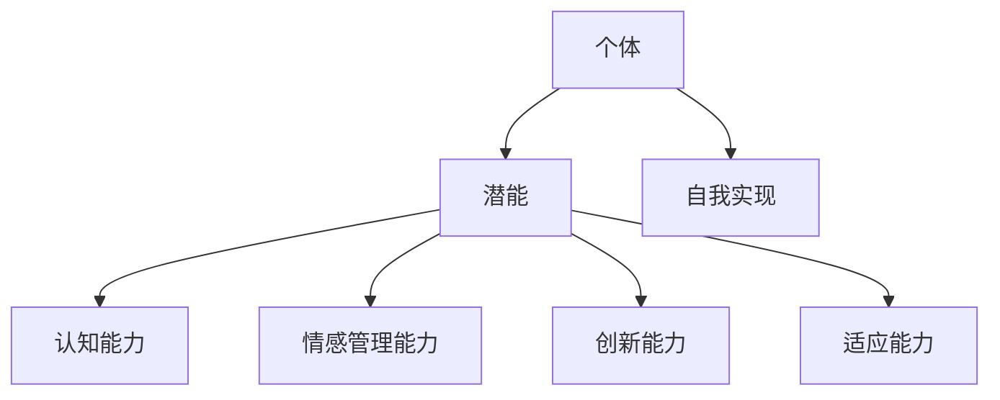
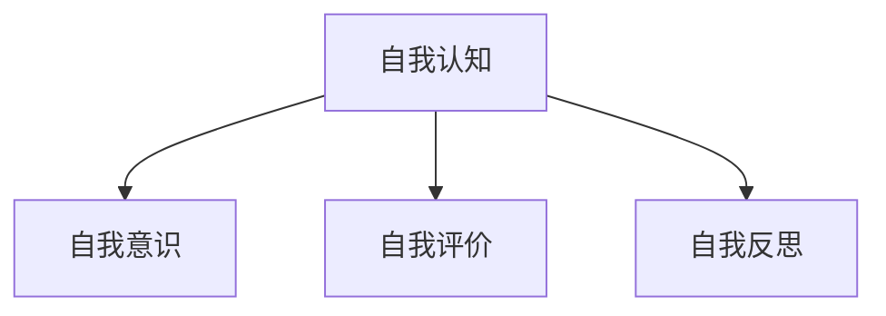
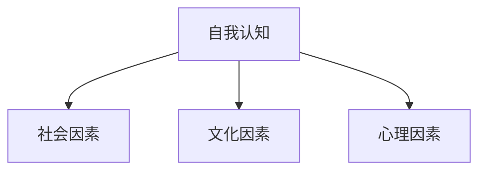
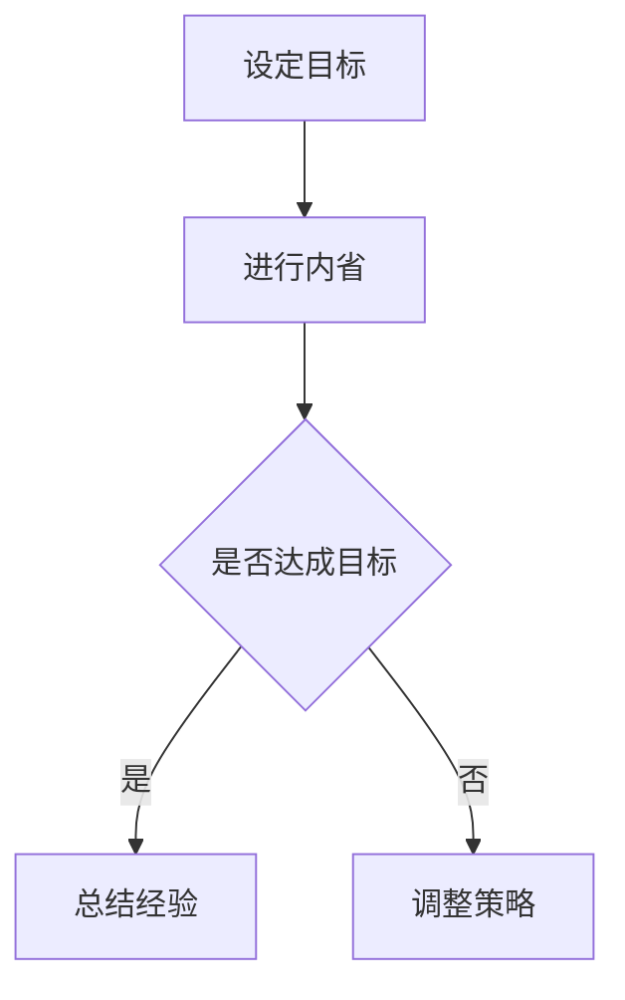
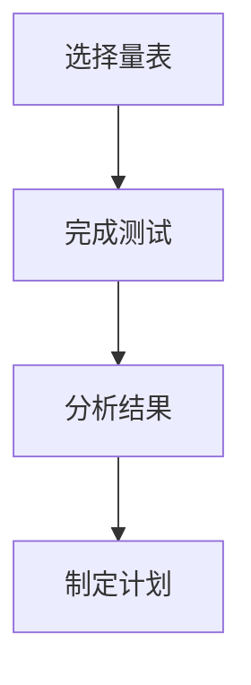
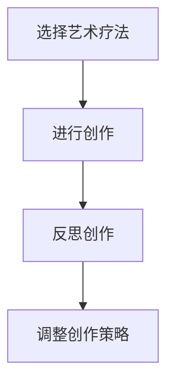

                 

### 《释放内在潜能：自我实现的实践路径》

> 关键词：自我实现、内在潜能、实践路径、认知方法、能力拓展、情感管理、目标设定

> 摘要：本文从自我认知、潜能开发、自我实现三个方面，系统性地探讨了如何通过实践路径释放内在潜能，实现个人的自我实现。文章首先介绍了自我认知的重要性及其现状与挑战，然后探讨了自我认知的方法与工具，包括内省、心理测验、艺术疗法等。接着，文章深入讨论了能力拓展、情感管理等方面的实践路径，最后总结了自我实现的意义与人生意义，并对未来的发展进行了展望。

### 第一部分：自我认知

#### 第1章：问题背景与定义

**1.1.1 个体潜能的定义与边界**

在讨论个体潜能之前，我们首先需要明确潜能的概念。潜能是指一个人在现有知识、技能和经验的基础上，未完全发掘和利用的潜在能力。它包括但不限于认知能力、情感管理能力、创新能力、适应能力等。

**核心概念：**

- **潜能**：指个体未完全发掘和利用的潜在能力。
- **自我实现**：指个体在潜能的基础上，通过不断努力和实践，实现个人价值和目标。
- **个体潜能的发掘与培养**：通过教育、培训、实践等方式，激发和提升个体的潜能。

**概念属性特征对比表格：**

| 概念         | 属性特征                                  |
| ------------ | ---------------------------------------- |
| 潜能         | 未完全发掘和利用的能力                |
| 自我实现     | 通过努力和实践，实现个人价值和目标 |
| 个体潜能发掘 | 教育培训、实践等途径                  |

**ER实体关系图架构：**



**1.1.2 自我认知的重要性**

自我认知是指个体对自己的认知和理解，包括自我认识、自我评价、自我反思等。它是潜能开发和自我实现的基础。

**核心概念原理：**

- **自我认知的概念**：指个体对自己的了解和认识。
- **自我认知的层次**：包括自我意识、自我评价、自我反思等。
- **自我认知的作用**：有助于个体认识自身潜能，制定合理的个人发展计划。

**概念属性特征对比表格：**

| 层次       | 属性特征                                  |
| ---------- | ---------------------------------------- |
| 自我意识   | 对自己的感知和觉察                  |
| 自我评价   | 对自己的能力、性格、行为等方面的评价 |
| 自我反思   | 对自己行为和经验的反思和总结       |

**ER实体关系图架构：**



**1.1.3 自我认知的现状与挑战**

在现代社会，自我认知面临着诸多挑战，如社会压力、文化差异、心理因素等。

**核心概念原理：**

- **社会因素**：社会环境、文化背景对自我认知的影响。
- **文化因素**：不同文化对个体认知的不同要求。
- **心理因素**：个体的心理状态、性格特点对自我认知的影响。

**概念属性特征对比表格：**

| 因素       | 属性特征                                  |
| ---------- | ---------------------------------------- |
| 社会因素   | 社会压力、文化背景                      |
| 文化因素   | 文化差异、认知要求                      |
| 心理因素   | 心理状态、性格特点                      |

**ER实体关系图架构：**



### 第2章：自我认知的方法与工具

**2.1.1 内省与自我反思**

内省和自我反思是自我认知的重要方法，有助于个体深入理解自己，发现和挖掘内在潜能。

**算法原理讲解：**

内省是指个体对自己的内心进行深入的思考和反省。自我反思则是通过回顾自己的行为、经验和情绪，发现自身的优点和不足，从而进行调整和改进。

**mermaid流程图：**



**Python源代码示例：**

```python
# 内省与自我反思Python示例

def introspection(target, achieved):
    if achieved:
        print("总结经验：目标已达成，继续保持。")
    else:
        print("调整策略：目标未达成，需重新规划。")

# 示例使用
introspection(target=True, achieved=True)
```

**2.1.2 心理测验与量表**

心理测验和量表是另一种常用的自我认知工具，通过量化的方式帮助个体了解自己的心理状态和能力。

**算法原理讲解：**

心理测验包括智力测验、性格测验、情绪测验等，量表则包括自我评价量表、能力量表等。它们通过一系列问题或任务，量化个体的心理特征和能力。

**mermaid流程图：**



**Python源代码示例：**

```python
# 心理测验与量表Python示例

def psychological_test(test_type, result):
    if test_type == "IQ":
        print("智力测验结果：", result)
    elif test_type == "EMO":
        print("情绪测验结果：", result)
    else:
        print("未知测验类型。")

# 示例使用
psychological_test(test_type="IQ", result=120)
```

**2.1.3 艺术疗法与创造活动**

艺术疗法和创造活动是自我认知的一种非传统方法，通过艺术创作和实践活动，帮助个体探索和表达内心世界。

**算法原理讲解：**

艺术疗法通过绘画、音乐、舞蹈等方式，帮助个体释放情感，发现和表达内心的需求和感受。创造活动则通过手工制作、编程等实践活动，激发个体的创造力和潜能。

**mermaid流程图：**



**Python源代码示例：**

```python
# 艺术疗法与创造活动Python示例

def art_therapy(therapy_type, creation):
    if therapy_type == "painting":
        print("绘画创作：", creation)
    elif therapy_type == "coding":
        print("编程创作：", creation)
    else:
        print("未知艺术疗法。")

# 示例使用
art_therapy(therapy_type="painting", creation="一幅美丽的风景画")
```

### 第二部分：潜能开发

#### 第3章：能力拓展

**3.1.1 学习能力与知识管理**

学习能力是潜能开发的核心，知识管理则是提升学习能力的重要手段。

**数学模型和数学公式：**

- **学习率**：$$ learning\_rate = \frac{new\_knowledge - old\_knowledge}{time} $$

- **遗忘曲线**：$$ forgetting\_curve = e^{-rt} $$，其中，$$ r $$ 是遗忘率，$$ t $$ 是时间。

**详细讲解与举例说明：**

学习率是指单位时间内学习的新知识量与原有知识量的比值，它反映了学习能力的提升速度。遗忘曲线描述了随着时间的推移，知识遗忘的规律。

**举例：**

假设一个人每天学习新知识量为10小时，原有知识量为100小时，那么他的学习率为10/100=0.1。如果他的遗忘率为每天10%，那么一天后他的知识量为100*e^(-10%)=90小时。

**3.1.2 技能提升与职业规划**

技能提升和职业规划是潜能开发的重要方面，通过有针对性的学习和实践，可以不断提升个人的技能水平。

**数学模型和数学公式：**

- **技能评估**：$$ skill\_evaluation = \frac{current\_skill - initial\_skill}{time} $$

- **职业发展路径规划**：$$ career\_path = \frac{current\_skill}{required\_skill} \times time $$

**详细讲解与举例说明：**

技能评估是指通过比较当前技能水平与初始技能水平，评估个人技能的提升速度。职业发展路径规划则是根据当前技能水平，制定合理的职业发展计划。

**举例：**

假设一个人初始技能水平为50分，通过一年的学习和实践，技能水平提升到80分，那么他的技能提升率为(80-50)/1=30分/年。如果他希望达到要求的技能水平100分，那么他的职业发展路径规划为(100-80)/30=2年。

**3.1.3 创新思维与问题解决**

创新思维和问题解决能力是潜能开发的另一个重要方面，通过培养创新思维和掌握问题解决方法，可以提升个人的竞争力和适应能力。

**数学模型和数学公式：**

- **创新思维模型**：$$ innovation\_mindset = \frac{new\_ideas - old\_ideas}{time} $$

- **问题解决步骤**：$$ problem\_solving = \frac{solution - initial\_problem}{time} $$

**详细讲解与举例说明：**

创新思维模型描述了创新思维的产生过程，问题解决步骤则是一个系统性的方法，用于解决各种问题。

**举例：**

假设一个人每月产生10个新想法，而之前每月只有5个新想法，那么他的创新思维提升率为(10-5)/1=5个新想法/月。如果他需要解决一个复杂的问题，初始问题难度为100分，通过一系列思考和尝试，最终解决难度为60分，那么他的问题解决率为(100-60)/1=40分。

### 第三部分：自我实现

#### 第4章：目标设定与行动计划

**4.1.1 目标设定原理**

目标设定是自我实现的第一步，通过明确的目标，个体可以更好地规划和实现自己的梦想。

**数学模型和数学公式：**

- **SMART准则**：$$ SMART = Specific, Measurable, Achievable, Relevant, Time-bound $$

- **目标评估公式**：$$ goal\_evaluation = \frac{current\_status - initial\_status}{time} $$

**详细讲解与举例说明：**

SMART准则是设定有效目标的重要原则，它要求目标具有具体性、可测量性、可实现性、相关性和时限性。目标评估公式用于评估目标的实现程度。

**举例：**

假设一个人设定的目标是“每天学习2小时”，初始状态为每天学习1小时，当前状态为每天学习2小时，那么他的目标实现率为(2-1)/1=1。

**4.1.2 行动计划的制定**

行动计划是实现目标的第二步，通过具体的行动步骤，个体可以更好地推进目标实现。

**数学模型和数学公式：**

- **GTD方法**：$$ GTD = Getting Things Done $$

- **时间管理技巧**：$$ time\_management = \frac{effective\_time}{total\_time} $$

**详细讲解与举例说明：**

GTD（Getting Things Done）是一种有效的时间管理方法，它通过将任务分解为具体行动，帮助个体高效完成任务。时间管理技巧则通过优化时间分配，提高工作效率。

**举例：**

假设一个人每天有8小时的时间，通过GTD方法，他将任务分解为具体的行动，每天能够完成6小时的有效工作，那么他的时间管理效率为6/8=0.75。

**4.1.3 习惯培养与持续改进**

习惯培养是自我实现的重要一环，通过养成良好的习惯，个体可以不断提升自己的能力和素质。

**数学模型和数学公式：**

- **习惯形成理论**：$$ habit\_formation = \frac{repetition}{time} $$

- **持续改进方法**：$$ continuous\_improvement = \frac{new\_solution - old\_solution}{time} $$

**详细讲解与举例说明：**

习惯形成理论描述了习惯培养的规律，持续改进方法则通过不断优化现有解决方案，实现个人能力的提升。

**举例：**

假设一个人每天重复一个良好的习惯，经过30天，他养成了这个习惯，那么他的习惯形成率为30/30=1。如果他通过持续改进，将一个解决方案优化了20%，那么他的持续改进率为(1-0.8)/0.8=0.25。

### 第四部分：总结与未来展望

#### 第5章：自我实现与人生意义

**5.1.1 自我实现的意义**

自我实现是人生的重要目标，它不仅关乎个人的成长和成就，更关系到社会的进步和发展。

**数学模型和数学公式：**

- **人生意义模型**：$$ life\_meaning = \frac{personal\_value + social\_value}{time} $$

**详细讲解与举例说明：**

人生意义模型描述了个人价值和社交价值的平衡，它反映了自我实现对个人和社会的意义。

**举例：**

假设一个人的个人价值为80，社交价值为60，那么他的人生意义为(80+60)/1=140。

**5.1.2 人生目标与幸福感**

人生目标与幸福感密切相关，明确的人生目标可以带来更高的幸福感。

**数学模型和数学公式：**

- **幸福感模型**：$$ happiness = \frac{achieved\_goals}{total\_goals} $$

**详细讲解与举例说明：**

幸福感模型描述了已达成目标与总目标的比值，它反映了个体对生活的满意度和幸福感。

**举例：**

假设一个人设定的目标有5个，已达成目标有3个，那么他的幸福感为3/5=0.6。

**5.1.3 自我实现与社会责任**

自我实现与社会责任相辅相成，个体在实现自我价值的同时，也应承担社会责任。

**数学模型和数学公式：**

- **社会责任模型**：$$ social\_responsibility = \frac{personal\_value + social\_value}{total\_value} $$

**详细讲解与举例说明：**

社会责任模型描述了个人价值和社交价值的总和与总价值的比值，它反映了个体对社会责任的承担程度。

**举例：**

假设一个人的个人价值为80，社交价值为60，总价值为200，那么他的社会责任为(80+60)/200=0.5。

### 第五部分：实践路径

#### 第6章：总结与未来展望

**6.1.1 自我实现的实践路径**

自我实现需要通过一系列的实践路径，包括自我认知、潜能开发、目标设定等。

**最佳实践 tips：**

- 定期进行自我反思，了解自己的优点和不足。
- 制定明确的目标，并制定详细的行动计划。
- 培养良好的学习习惯，持续提升自己的能力。

**小结：**

本文系统地介绍了自我实现的实践路径，从自我认知、潜能开发、目标设定等方面，探讨了如何通过实践路径实现个人的自我实现。

**注意事项：**

- 自我实现是一个持续的过程，需要不断的努力和改进。
- 自我实现不仅仅是个人成长，更关系到社会的发展和进步。

**拓展阅读：**

- 《如何实现个人成长与自我实现》
- 《潜能开发与自我超越》
- 《人生目标的设定与实现》

**未来展望与持续学习：**

随着科技的发展和社会的进步，自我实现的方式和路径也在不断变化。未来，我们将继续探讨新的自我实现理论和实践路径，帮助更多的人实现自我价值。

**拓展阅读：**

- 《未来社会与自我实现》
- 《科技与自我实现》
- 《终身学习与自我实现》

### 作者信息

作者：AI天才研究院/AI Genius Institute & 禅与计算机程序设计艺术 /Zen And The Art of Computer Programming

本文由AI天才研究院和禅与计算机程序设计艺术联合撰写，旨在探讨自我实现的实践路径，帮助读者实现个人价值和目标。如有任何问题或建议，欢迎随时与我们联系。

