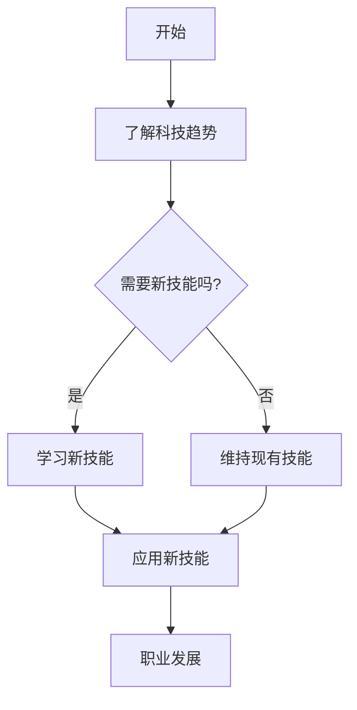
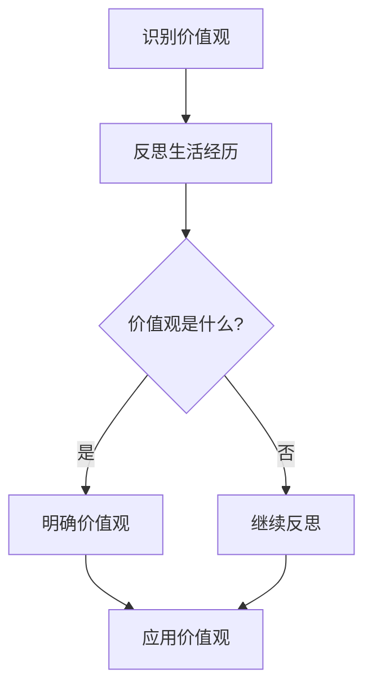
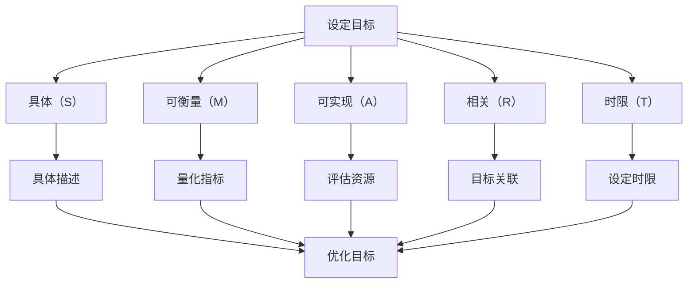
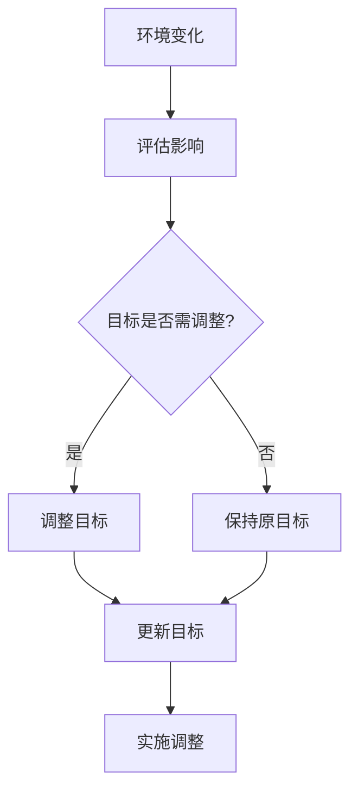
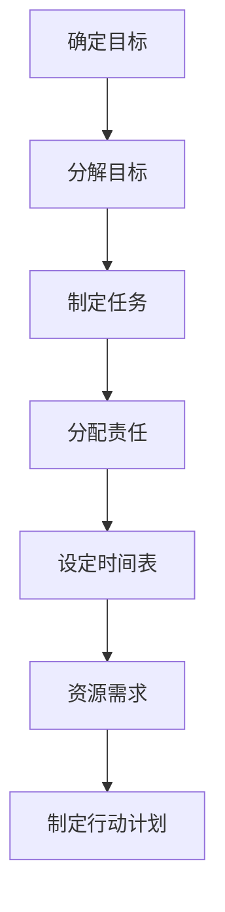
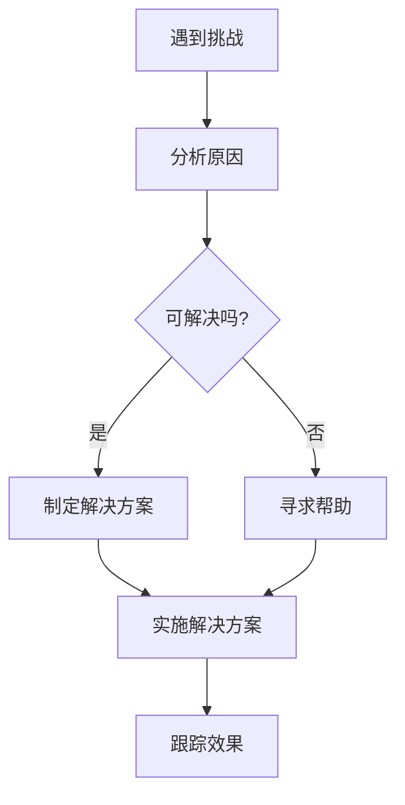
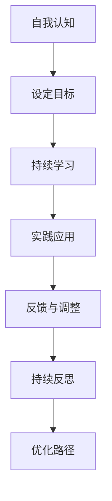

                 

### 重塑生活目标：找寻21世纪的人生方向

#### 关键词：
- 21世纪生活目标
- 个人发展挑战
- 新趋势与机遇
- 人生方向的制定与调整

#### 摘要：
在21世纪，快速变化的社会环境和技术进步给人们的生活和个人发展带来了前所未有的挑战和机遇。本文将深入探讨现代生活背景下的个人发展挑战，分析人生目标的概念及其重要性，探讨21世纪的新趋势和新机遇，并详细阐述如何制定、调整和实现个人生活目标，帮助读者在新时代找到适合自己的人生方向。

#### 目录大纲

----------------------------------------------------------------

# 重塑生活目标：找寻21世纪的人生方向

> 关键词：21世纪生活目标、个人发展挑战、新趋势与机遇、人生方向的制定与调整

> 摘要：本文将深入探讨现代生活背景下的个人发展挑战，分析人生目标的概念及其重要性，探讨21世纪的新趋势和新机遇，并详细阐述如何制定、调整和实现个人生活目标，帮助读者在新时代找到适合自己的人生方向。

----------------------------------------------------------------

## 第一部分: 现代生活与个人发展挑战

### 第1章: 21世纪的挑战与变革

#### 1.1 现代社会的快节奏与压力
#### 1.2 技术变革对个人发展的影响
#### 1.3 个人发展与生活目标的关联

## 第2章: 人生目标的概念化与重要性

#### 2.1 什么是人生目标
#### 2.2 人生目标的重要性
#### 2.3 人生目标与个人幸福的关系

## 第3章: 21世纪的新趋势与新机遇

#### 3.1 全球化与多元文化的融合
#### 3.2 科技创新与职业发展
#### 3.3 社会变迁与人生方向的变化

----------------------------------------------------------------

## 第二部分: 制定与调整生活目标

### 第4章: 个人价值观与生活目标的制定

#### 4.1 识别个人价值观
#### 4.2 基于价值观的生活目标设定
#### 4.3 生活目标设定的原则与方法

### 第5章: 设定具体可行的目标

#### 5.1 目标的具体化与量化
#### 5.2 设定SMART目标
#### 5.3 目标设定的实际案例分析

### 第6章: 调整与更新生活目标

#### 6.1 适应环境变化
#### 6.2 根据个人成长调整目标
#### 6.3 重新审视与更新目标

----------------------------------------------------------------

## 第三部分: 实践与行动

### 第7章: 具体行动步骤

#### 7.1 制定行动计划
#### 7.2 执行与跟踪
#### 7.3 遇到挑战与解决方案

### 第8章: 践行与反思

#### 8.1 成功实践的分享
#### 8.2 反思与总结
#### 8.3 持续改进与成长

### 第9章: 个人成长与人生方向的具体案例

#### 9.1 成功案例介绍
#### 9.2 经验教训与启示
#### 9.3 个人成长路径分析

----------------------------------------------------------------

## 第四部分: 总结与展望

### 第10章: 生活目标与人生方向的总结

#### 10.1 关键要点回顾
#### 10.2 个人成长路径的规划
#### 10.3 未来展望与持续探索

----------------------------------------------------------------

### 作者信息

- 作者：AI天才研究院/AI Genius Institute & 禅与计算机程序设计艺术 /Zen And The Art of Computer Programming

## 第一部分: 现代生活与个人发展挑战

### 第1章: 21世纪的挑战与变革

#### 1.1 现代社会的快节奏与压力

在21世纪的现代社会中，快节奏的生活方式已成为常态。无论是工作还是日常生活，人们都面临着前所未有的压力。现代科技的发展虽然极大地提高了生产效率，但同时也带来了信息过载和不断变化的工作环境。人们需要不断地学习新技能，以适应不断变化的市场需求。这种快节奏的生活方式不仅影响了人们的身体健康，还对其心理状态造成了压力。

**问题背景**：现代社会中，人们面临的主要问题是时间压力、工作与生活的平衡、以及心理健康问题。

**问题描述**：现代社会快节奏带来的压力如何影响个人的生活质量和幸福感？

**问题解决**：通过制定合理的生活目标和计划，以及有效的压力管理策略，可以缓解快节奏带来的压力。

**边界与外延**：快节奏生活方式的影响范围不仅仅局限于工作环境，还包括个人生活的各个方面。

**概念结构与核心要素组成**：
- 快节奏生活方式：时间管理、信息处理、工作与生活平衡。
- 压力管理：情绪调节、健康生活方式、有效的时间管理。

#### 1.2 技术变革对个人发展的影响

技术变革是21世纪最显著的特色之一。从互联网、移动通信到人工智能，技术进步深刻地改变了人们的生活和工作方式。这些技术不仅提供了新的机遇，也带来了新的挑战。例如，人工智能的应用正在改变许多传统职业，对从业者的技能要求不断提高。同时，技术的发展也使得人们能够更高效地获取和分享信息，这在一定程度上缓解了信息过载的问题。

**问题背景**：技术进步带来了新的职业机会，同时也要求人们不断学习新技能。

**问题描述**：技术变革如何影响个人发展，以及个人应如何适应这些变化？

**问题解决**：通过持续学习和技能提升，个人可以更好地适应技术变革带来的挑战。

**边界与外延**：技术变革的影响不仅限于个人发展，还涉及整个社会的结构和经济模式。

**概念结构与核心要素组成**：
- 技术进步：人工智能、互联网、移动通信。
- 职业发展：技能要求、职业转型、终身学习。

#### 1.3 个人发展与生活目标的关联

个人发展是实现生活目标的基础。一个明确的生活目标可以帮助个人更好地规划自己的人生道路，从而在快节奏和不断变化的社会环境中保持方向感和动力。生活目标不仅仅是职业成就，还包括个人的健康、家庭、社交等多个方面。一个全面的生活目标有助于个人在各个方面取得平衡，实现整体的幸福感和满足感。

**问题背景**：个人发展是实现生活目标的重要途径。

**问题描述**：如何通过个人发展来实现和调整生活目标？

**问题解决**：通过自我认知和规划，明确个人生活目标，并制定实际可行的行动计划。

**边界与外延**：个人发展不仅涉及职业成就，还包括个人成长、健康、家庭等多个方面。

**概念结构与核心要素组成**：
- 个人发展：职业成就、个人成长、健康、家庭。
- 生活目标：职业目标、健康目标、家庭目标、社交目标。

## 第2章: 人生目标的概念化与重要性

#### 2.1 什么是人生目标

人生目标是指一个人希望在一生中实现的目标。这些目标可以是职业上的，如成为某一领域的专家；也可以是个人生活方面的，如拥有幸福的家庭和健康的身体。人生目标通常具有较强的主观性，不同的人会有不同的生活目标。理解人生目标的概念，是找到适合自己的生活方向的第一步。

**核心概念**：人生目标是指一个人在一生中期望实现的目标，可以是职业上的，也可以是个人生活方面的。

**概念属性特征对比表格**：

| 特征         | 定义                                                         | 实例                   |
| ------------ | ------------------------------------------------------------ | ---------------------- |
| 主观性       | 人生目标是个人根据自己的价值观和生活经历设定的，具有独特性。 | 成为一名优秀的程序员   |
| 多样性       | 人生目标可以涵盖职业、家庭、健康等多个方面。               | 拥有一个健康的身体     |
| 长期性       | 人生目标通常是指长期甚至终身的目标。                       | 拥有一个幸福的家庭     |
| 动力性       | 人生目标可以激发个人的动力，推动个人前进。                 | 成为一名企业高管     |

**ER实体关系图架构**：

```mermaid
erDiagram
    Class Person {
        :>> Title 模型概述
        :>> Person -->|1| LifeGoal
    }
    Class LifeGoal {
        :>> Title 目标概述
        :>> ID
        :>> Type {职业、家庭、健康等}
        :>> Description
        :>> Status {未完成、已完成}
    }
```

在上述ER图中，`Person` 类代表一个人，而 `LifeGoal` 类代表一个人的生活目标。每个 `Person` 可以有多个 `LifeGoal`，每个 `LifeGoal` 都与一个 `Person` 相关联。

#### 2.2 人生目标的重要性

人生目标对于个人的发展至关重要。首先，人生目标提供了方向感，使个人在复杂多变的社会环境中能够保持明确的目标和动力。其次，人生目标有助于个人进行有效的资源分配，使个人能够更好地利用时间和精力。此外，明确的人生目标还可以提升个人的幸福感和满足感，使个人在实现目标的过程中获得成就感和快乐。

**核心概念原理**：人生目标为个人提供了方向感、动力和资源分配的依据。

**概念属性特征对比表格**：

| 特征         | 定义                                                         | 实例                   |
| ------------ | ------------------------------------------------------------ | ---------------------- |
| 方向感       | 人生目标使个人在复杂多变的社会环境中保持明确的方向。         | 希望成为一名医生       |
| 动力性       | 人生目标激发个人的动力，使个人不断努力前进。                 | 希望在五年内创业成功   |
| 资源分配     | 人生目标帮助个人更好地利用时间和精力，实现目标。             | 每周抽出时间锻炼身体   |
| 幸福感和满足感 | 实现人生目标可以使个人获得成就感和快乐。                     | 达成年度业绩目标       |

#### 2.3 人生目标与个人幸福的关系

个人幸福是人生目标的重要衡量标准。一个明确的、实现可能性较高的生活目标，可以使个人在追求目标的过程中获得成就感，提升幸福感。然而，人生目标并不是一成不变的，它需要根据个人的成长和环境的变化进行调整。例如，当一个人在职业生涯中取得了显著成就，他可能会重新设定更高层次的人生目标，从而继续追求个人成长和幸福感。

**核心概念原理**：人生目标与个人幸福密切相关，合理的调整是实现个人幸福的重要途径。

**概念属性特征对比表格**：

| 特征         | 定义                                                         | 实例                   |
| ------------ | ------------------------------------------------------------ | ---------------------- |
| 成就感       | 实现人生目标使个人获得满足感。                                | 完成博士学位           |
| 调整性       | 人生目标需要根据个人成长和环境变化进行调整。                 | 从职业生涯转向创业     |
| 幸福感       | 实现人生目标可以提升个人的幸福感和生活质量。                 | 实现财务自由           |

通过上述分析，我们可以看到人生目标的概念化与重要性，以及它与个人幸福之间的关系。在接下来的章节中，我们将进一步探讨21世纪的新趋势和新机遇，帮助读者更好地制定和调整生活目标。

## 第3章: 21世纪的新趋势与新机遇

#### 3.1 全球化与多元文化的融合

全球化是21世纪最为显著的趋势之一。随着信息技术和交通的快速发展，世界各地的人们能够更加便捷地交流、合作和共享资源。全球化不仅带来了商业机会，还促进了文化的交流和融合。这种多元文化的融合，使得个人在职业发展和生活目标上有了更多的选择。例如，跨国公司的发展需要具备国际视野和跨文化交流能力的人才；而全球化也为个人提供了更多探索不同文化和生活方式的机会。

**核心概念原理**：全球化与多元文化的融合为个人提供了更多职业和生活选择。

**概念属性特征对比表格**：

| 特征         | 定义                                                         | 实例                   |
| ------------ | ------------------------------------------------------------ | ---------------------- |
| 全球化       | 各国经济、政治、文化等方面的相互联系和影响。                 | 跨国公司的全球运营     |
| 多元文化     | 不同文化在全球化过程中的交流和融合。                       | 美食文化的国际交流     |
| 职业选择     | 全球化提供了更多跨国职业机会。                               | 跨国公司的市场分析师   |
| 生活体验     | 个人可以更容易地体验不同文化。                               | 国际旅行与文化交流     |

**ER实体关系图架构**：

```mermaid
erDiagram
    Class Person {
        :>> Title 个人
        :>> ID
        :>> Name
        :>> -->|1| Culture
    }
    Class Culture {
        :>> Title 文化
        :>> Name
        :>> Region
    }
    Class Career {
        :>> Title 职业
        :>> Title
        :>> -->|1| Person
        :>> -->|1| Culture
    }
```

在这个ER图中，`Person` 代表个人，`Culture` 代表文化，`Career` 代表职业。每个人都可以属于多种文化，并在不同的职业中工作，从而实现职业发展和生活目标的多元融合。

#### 3.2 科技创新与职业发展

21世纪的科技革命，特别是人工智能、大数据、物联网等技术的发展，正在深刻地改变着职业结构和发展方向。传统职业逐渐被自动化和智能化取代，同时也催生了大量新的职业机会。例如，数据科学家、机器学习工程师、区块链开发人员等新兴职业正在迅速崛起。个人在职业发展中，需要不断学习新技能，以适应这些技术变革带来的新趋势。

**核心概念原理**：科技创新推动职业结构的变化，新兴职业为个人提供了新的发展机会。

**概念属性特征对比表格**：

| 特征         | 定义                                                         | 实例                   |
| ------------ | ------------------------------------------------------------ | ---------------------- |
| 科技创新     | 科技进步带来的新技术、新工具和新方法。                       | 人工智能、大数据分析   |
| 职业发展     | 个人在职业生涯中的成长和变化。                               | 从软件工程师转型为AI专家 |
| 新兴职业     | 应对新兴技术和市场需求而产生的职业。                         | 数据科学家、区块链开发人员 |
| 终身学习     | 为了适应职业发展和技术进步，个人需要终身学习。               | 参加线上课程和培训     |

**Mermaid流程图**：



在这个流程图中，个人首先了解科技趋势，然后评估是否需要学习新技能。如果需要，个人会学习新技能并应用这些技能，最终实现职业发展。如果不需要，个人则维持现有技能，并继续职业发展。

#### 3.3 社会变迁与人生方向的变化

21世纪的社会变迁，包括人口结构的变化、教育体系的变革、以及生活方式的多样化，都在深刻地影响着人们的人生方向。例如，人口老龄化的趋势要求人们更加关注健康和养老问题；而在线教育的普及则使得个人能够更加灵活地选择学习路径和职业方向。此外，人们的生活方式和价值观念也在不断变化，使得个人在设定生活目标时有了更多的选择。

**核心概念原理**：社会变迁影响个人的人生方向，提供了更多的选择和机遇。

**概念属性特征对比表格**：

| 特征         | 定义                                                         | 实例                   |
| ------------ | ------------------------------------------------------------ | ---------------------- |
| 社会变迁     | 社会结构和生活方式的变化。                                   | 人口老龄化、在线教育   |
| 人生方向     | 个人在人生道路上的目标和方向。                               | 从职业人士转变为创业者 |
| 选择和机遇   | 社会变迁为个人提供了更多的选择和机遇。                       | 选择灵活的工作模式     |
| 价值观念     | 个人对生活、工作和未来的观念和态度。                         | 追求工作与生活的平衡   |

**Mermaid类图**：

```mermaid
classDiagram
    Class Person {
        :>> Title 个人
        :>> ID
        :>> Name
        :>> -->|1| Career
        :>> -->|1| LifeGoal
    }
    Class Career {
        :>> Title 职业
        :>> Title
        :>> -->|1| Society
    }
    Class LifeGoal {
        :>> Title 生活目标
        :>> Type {职业、健康、家庭等}
        :>> -->|1| Society
    }
    Class Society {
        :>> Title 社会
        :>> -->|1| Trend
    }
    Class Trend {
        :>> Title 趋势
        :>> Type {全球化、科技创新、社会变迁等}
    }
```

在这个类图中，`Person` 代表个人，`Career` 代表职业，`LifeGoal` 代表生活目标，`Society` 代表社会，`Trend` 代表趋势。个人、职业、生活目标和社会趋势之间存在复杂的关联，这些关联共同影响着个人的人生方向。

通过本章的分析，我们可以看到21世纪的新趋势和新机遇为个人提供了丰富的选择和机遇。在接下来的章节中，我们将深入探讨如何制定和调整生活目标，以适应这些变化和机遇。

## 第二部分: 制定与调整生活目标

### 第4章: 个人价值观与生活目标的制定

#### 4.1 识别个人价值观

个人价值观是指一个人在生活中所秉持的基本信念和原则，这些价值观决定了个人的行为方式和决策方向。识别个人价值观是制定生活目标的重要第一步，因为只有明确了自己的核心价值观，才能确保生活目标与个人内心深处的一致性。

**核心概念原理**：个人价值观是制定生活目标的基础，反映了个人对生活的信念和期望。

**概念属性特征对比表格**：

| 特征         | 定义                                                         | 实例                   |
| ------------ | ------------------------------------------------------------ | ---------------------- |
| 信念性       | 个人价值观是个人对生活的基本信念和原则。                     | 坚持诚信、尊重他人等   |
| 内在性       | 个人价值观是个人内心深处的信念，不是外界强加的。             | 追求内心的平静和幸福   |
| 主观性       | 个人价值观因个人经历和背景不同而存在差异。                   | 个人对成功的定义       |

**Mermaid流程图**：



在这个流程图中，个人首先反思自己的生活经历，然后识别出个人的核心价值观。通过这个过程，个人可以明确自己的价值观，并在制定生活目标时将其作为指导原则。

#### 4.2 基于价值观的生活目标设定

在明确了个人价值观后，接下来就是基于这些价值观设定具体的生活目标。这个过程不仅包括职业目标，还包括个人成长、健康、家庭和社会责任等多个方面。一个基于价值观设定的生活目标，不仅能够帮助个人保持方向感，还能够确保个人的行为与内心价值观一致。

**核心概念原理**：基于价值观设定的生活目标能够确保个人行为与内心价值观一致，提升生活的整体满意度。

**概念属性特征对比表格**：

| 特征         | 定义                                                         | 实例                   |
| ------------ | ------------------------------------------------------------ | ---------------------- |
| 一致性       | 个人行为与价值观的一致。                                     | 坚持健康的生活方式     |
| 全面性       | 生活目标涵盖职业、健康、家庭等多个方面。                    | 平衡工作和家庭生活     |
| 可操作性     | 生活目标具体且可行，便于执行和评估。                         | 每周至少锻炼三次       |

**Mermaid类图**：

```mermaid
classDiagram
    Class Person {
        :>> Title 个人
        :>> ID
        :>> Name
        :>> -->|1| Value
    }
    Class Value {
        :>> Title 价值观
        :>> Concept
        :>> -->|1| Goal
    }
    Class Goal {
        :>> Title 生活目标
        :>> Type {职业、健康、家庭等}
        :>> Description
    }
```

在这个类图中，`Person` 代表个人，`Value` 代表价值观，`Goal` 代表生活目标。个人通过识别价值观，将这些价值观转化为具体的生活目标，从而指导自己的行为。

#### 4.3 生活目标设定的原则与方法

为了确保生活目标的实现，设定目标时需要遵循一些基本原则和方法。首先，目标应该是具体的，这样才能够明确行动的方向。其次，目标应该是可测量的，这样才能够评估进展和成果。第三，目标应该是可行的，即考虑到个人的资源和能力。最后，目标应该是时间相关的，这样能够确保目标的及时实现。

**核心概念原理**：明确、具体、可测量、可行和有时间限制的目标能够提高目标实现的概率。

**概念属性特征对比表格**：

| 特征         | 定义                                                         | 实例                   |
| ------------ | ------------------------------------------------------------ | ---------------------- |
| 具体性       | 目标具体明确，不模糊。                                       | 年收入达到10万元       |
| 可测量性     | 目标可以实现量化，便于评估。                                 | 每周阅读两本书         |
| 可行性       | 目标基于个人能力和资源设定。                                 | 减重10公斤             |
| 时间限制     | 目标设定有明确的时间节点。                                   | 两年内完成博士学位     |

**Mermaid表格图**：

```mermaid
table
  | 特征         | 定义                                                         | 实例                   |
  | :----------- | :----------------------------------------------------------- | :--------------------- |
  | 具体性       | 目标具体明确，不模糊。                                       | 年收入达到10万元       |
  | 可测量性     | 目标可以实现量化，便于评估。                                 | 每周阅读两本书         |
  | 可行性       | 目标基于个人能力和资源设定。                                 | 减重10公斤             |
  | 时间限制     | 目标设定有明确的时间节点。                                   | 两年内完成博士学位     |
```

通过识别个人价值观、基于价值观设定生活目标，并遵循明确、具体、可测量、可行和有时间限制的原则，个人可以更好地实现自己的生活目标，迈向更加充实和幸福的人生。

### 第5章: 设定具体可行的目标

#### 5.1 目标的具体化与量化

设定具体可行的目标，首先需要将目标具体化和量化。具体化意味着目标应该是明确且具体的，而量化则是指目标应该可以量化和衡量。具体化和量化是确保目标可实现性和可评估性的关键步骤。

**核心概念原理**：具体化和量化目标可以提高目标的可实现性和可评估性。

**Mermaid表格图**：

```mermaid
table
  | 目标类型       | 特点                                                         | 实例                   |
  | :------------- | :----------------------------------------------------------- | :--------------------- |
  | 具体化目标     | 目标明确具体，不模糊。                                       | 提高工作效率30%       |
  | 量化目标       | 目标可以用具体数值或指标表示。                               | 每周阅读两本书         |
  | 具体与量化结合 | 目标既明确具体，又可以量化和衡量。                           | 三个月内减重5公斤     |
```

#### 5.2 设定SMART目标

SMART目标是设定具体可行目标的一种有效方法。SMART分别代表具体（Specific）、可衡量（Measurable）、可实现（Achievable）、相关（Relevant）和有时限（Time-bound）。使用SMART原则设定目标，可以确保目标既有明确的实现路径，又具有实际的可行性。

**核心概念原理**：SMART目标原则可以确保目标具体、可衡量、可实现、相关且有时限。

**Mermaid流程图**：



在这个流程图中，个人通过设定具体、可衡量、可实现、相关和有时限的目标，逐步优化目标，确保其具体可行。

#### 5.3 目标设定的实际案例分析

为了更好地理解目标设定的具体实践，我们可以通过一个实际案例来进行分析。

**案例背景**：小明是一名软件工程师，他在职业生涯中希望进一步提升自己。

**目标设定**：
1. **具体（S）**：我希望在接下来的一年中提升我的技术能力。
2. **可衡量（M）**：我将通过完成以下项目来实现这一目标：
   - 参与一个开源项目，提高我的编程技能。
   - 完成一个机器学习项目，学习数据分析和模型构建。
3. **可实现（A）**：我拥有相关的编程经验，并且可以利用业余时间进行学习和项目开发。
4. **相关（R）**：提升技术能力与我的职业发展目标相关，有助于我在公司中晋升。
5. **时限（T）**：我将在这一年内完成上述项目。

**案例分析**：
- **具体性**：小明的目标明确，具体指出了他希望提升的技术能力。
- **可衡量性**：小明通过参与具体项目来衡量他的技术提升，这些项目具有明确的完成标准。
- **可实现性**：小明基于自己的编程经验和时间安排，设定了切实可行的目标。
- **相关性**：提升技术能力与他的职业发展目标紧密相关，有助于实现他的职业愿景。
- **时限性**：小明设定了明确的时间节点，确保目标的及时实现。

通过这个案例，我们可以看到，使用SMART原则设定目标，可以帮助个人更加明确和具体地实现自己的目标，从而提高目标的可行性和实现概率。

### 第6章: 调整与更新生活目标

#### 6.1 适应环境变化

在实现生活目标的过程中，个人和环境是不断变化的。适应环境变化是调整生活目标的重要步骤。环境变化可能包括社会、经济、技术等各个方面。例如，经济衰退可能会影响职业发展，技术进步可能会改变市场需求。个人需要根据这些变化调整自己的生活目标，以确保目标的现实性和可行性。

**核心概念原理**：适应环境变化能够确保个人生活目标与当前现实相符合，提高目标实现的概率。

**Mermaid流程图**：



在这个流程图中，个人首先评估环境变化对生活目标的影响，然后决定是否需要调整目标。如果需要调整，个人会更新目标，并实施这些调整。

#### 6.2 根据个人成长调整目标

个人在实现生活目标的过程中，会不断成长和进步。这种成长不仅体现在技能和知识上，还包括个人价值观、人生观等方面的变化。根据个人成长调整生活目标，是确保目标与个人发展同步的重要措施。例如，一个人在职业上取得显著成就后，可能会重新设定更高层次的生活目标，以继续推动个人成长。

**核心概念原理**：根据个人成长调整目标，可以确保目标与个人发展同步，推动个人持续进步。

**Mermaid类图**：

```mermaid
classDiagram
    Class Person {
        :>> Title 个人
        :>> ID
        :>> Name
        :>> -->|1| LifeGoal
    }
    Class LifeGoal {
        :>> Title 生活目标
        :>> Type
        :>> Status
        :>> -->|1| Person
    }
    Class Growth {
        :>> Title 成长
        :>> Aspect
        :>> -->|1| LifeGoal
    }
```

在这个类图中，`Person` 代表个人，`LifeGoal` 代表生活目标，`Growth` 代表个人成长。个人通过成长来调整生活目标，确保目标与个人发展同步。

#### 6.3 重新审视与更新目标

定期重新审视和更新生活目标是确保目标持续有效的重要步骤。随着时间和环境的变化，个人需要定期回顾自己的生活目标，评估目标的实现情况，并根据实际情况进行调整和更新。这个过程不仅能够确保目标的现实性，还可以帮助个人保持对生活的热情和动力。

**核心概念原理**：定期重新审视和更新目标，可以确保目标的现实性和持续性，推动个人不断进步。

**Mermaid表格图**：

```mermaid
table
  | 审视周期   | 目的                                                         | 操作步骤                   |
  | :--------- | :----------------------------------------------------------- | :------------------------- |
  | 每月       | 了解目标进展，及时调整。                                     | 检查月度目标完成情况       |
  | 每季度     | 审视中长期目标的实现进度。                                   | 评估季度目标完成情况       |
  | 每年       | 审视全年目标，进行年度总结和规划。                           | 进行年度目标回顾与调整     |

```

通过上述表格，我们可以看到，定期审视和更新目标可以分为月度、季度和年度三个层次，每个层次都有其特定的目的和操作步骤。这种定期审视和更新机制，可以帮助个人保持对目标的关注，确保目标的实现和持续进步。

### 第7章: 具体行动步骤

#### 7.1 制定行动计划

为了实现生活目标，制定具体的行动计划是至关重要的一步。行动计划是将生活目标分解为一系列可执行的任务和步骤，确保目标能够逐步实现。一个有效的行动计划应包括明确的任务、责任分配、时间表和资源需求。

**核心概念原理**：行动计划是将抽象的生活目标具体化为可执行的任务，提高目标实现的概率。

**Mermaid流程图**：



在这个流程图中，个人首先确定生活目标，然后将目标分解为具体任务，接着为每个任务分配责任，设定时间表，并评估所需的资源，最终制定出完整的行动计划。

#### 7.2 执行与跟踪

一旦行动计划制定完成，接下来就是执行和跟踪。执行是指按照行动计划中的任务和时间表，逐步完成各项任务。而跟踪则是指定期检查任务进度，确保按照计划进行。有效的执行和跟踪是确保目标实现的重要保障。

**核心概念原理**：执行和跟踪是确保行动计划有效实施的关键步骤，有助于及时发现和解决问题。

**Mermaid表格图**：

```mermaid
table
  | 阶段       | 操作步骤                                                         | 注意事项                   |
  | :--------- | :----------------------------------------------------------- | :------------------------- |
  | 执行       | 按照行动计划中的任务和时间表，逐步完成任务。                       | 保持专注，避免拖延         |
  | 跟踪       | 定期检查任务进度，记录完成情况和遇到的问题。                       | 及时调整计划，确保目标实现 |

```

在这个表格中，执行阶段需要保持专注，避免拖延；而跟踪阶段则需要定期检查进度，并及时调整计划。

#### 7.3 遇到挑战与解决方案

在执行行动计划的过程中，难免会遇到各种挑战和问题。这些挑战可能来自个人、环境或者外部因素。面对这些挑战，需要采取有效的解决方案，以确保目标的实现。

**核心概念原理**：面对挑战和问题，采取有效的解决方案，是确保目标实现的关键。

**Mermaid流程图**：



在这个流程图中，个人首先分析遇到挑战的原因，然后评估是否可以解决。如果可以解决，制定并实施解决方案；如果需要帮助，寻求外部支持。最后，跟踪解决方案的效果，确保问题得到有效解决。

通过上述步骤，个人可以制定并执行行动计划，有效应对执行过程中遇到的挑战，确保生活目标的实现。

### 第8章: 践行与反思

#### 8.1 成功实践的分享

在实现生活目标的过程中，分享成功的实践是非常重要的。通过分享成功案例，可以激发他人的动力，提供有益的经验和启示。以下是一些成功实践案例：

**案例1**：李华是一名职场新人，他设定了在五年内成为部门主管的目标。通过持续学习和积极参与公司项目，李华在短短三年内就实现了这一目标。他的成功经验在于设定明确的目标、持续学习和积极参与，以及保持积极的心态。

**案例2**：张婷是一名自由职业者，她设定了每年旅行一次的目标。通过合理安排时间和预算，张婷每年都能实现一次旅行，这不仅丰富了她的人生经历，也让她在工作中保持了活力和创造力。

这些成功实践表明，明确的、可行的目标，加上持续的努力和积极的心态，是实现生活目标的关键。

#### 8.2 反思与总结

反思是实现生活目标过程中不可或缺的一部分。通过反思，个人可以总结经验教训，找出不足之处，并制定改进措施。以下是一些反思和总结的建议：

1. **定期回顾**：定期回顾目标的进展和实现情况，有助于发现问题和不足，及时进行调整。
2. **自我评估**：定期进行自我评估，了解自己的优点和缺点，以及如何改进。
3. **总结经验**：在实现目标的过程中，积累的经验和教训是非常宝贵的，应该及时记录和总结。

**Mermaid表格图**：

```mermaid
table
  | 反思周期   | 操作步骤                                                         | 目的                     |
  | :--------- | :----------------------------------------------------------- | :--------------------- |
  | 每月       | 检查月度目标的完成情况，记录成功和失败的经验。                       | 及时调整和优化计划       |
  | 每季度     | 审视中长期目标的实现进度，总结经验和教训。                           | 提高目标的实现效率       |
  | 每年       | 进行年度总结，评估整体目标的实现情况，制定下一年度的发展计划。           | 保持持续进步和成长       |

```

通过上述表格，我们可以看到，定期反思和总结有助于个人不断调整和优化目标，确保目标的实现。

#### 8.3 持续改进与成长

实现生活目标是一个持续的过程，需要个人不断学习和成长。以下是一些建议，帮助个人在实现目标的过程中持续改进和成长：

1. **终身学习**：在快速变化的时代，终身学习是保持竞争力的关键。通过参加培训、阅读书籍、在线课程等，不断提升自己的知识和技能。
2. **积极心态**：保持积极的心态，面对挑战和失败时能够乐观应对，是持续成长的重要条件。
3. **时间管理**：合理安排时间，确保有足够的时间和精力去实现目标。
4. **社交网络**：建立广泛的社交网络，获取更多的资源和机会，有助于个人在实现目标的过程中得到支持和帮助。

**Mermaid类图**：

```mermaid
classDiagram
    Class Person {
        :>> Title 个人
        :>> ID
        :>> Name
        :>> -->|1| Learning
        :>> -->|1| Mindset
        :>> -->|1| TimeManagement
        :>> -->|1| SocialNetwork
    }
    Class Learning {
        :>> Title 学习
        :>> Type {培训、阅读、在线课程等}
    }
    Class Mindset {
        :>> Title 心态
        :>> Type {积极、乐观、坚韧等}
    }
    Class TimeManagement {
        :>> Title 时间管理
        :>> Type {计划、优先级、时间分配等}
    }
    Class SocialNetwork {
        :>> Title 社交网络
        :>> Type {人脉、资源、机会等}
    }
```

在这个类图中，`Person` 代表个人，`Learning` 代表学习，`Mindset` 代表心态，`TimeManagement` 代表时间管理，`SocialNetwork` 代表社交网络。个人通过不断学习、保持积极心态、合理安排时间和建立社交网络，可以实现持续改进和成长。

通过践行与反思，个人可以更好地实现自己的生活目标，不断成长和进步。

### 第9章: 个人成长与人生方向的具体案例

#### 9.1 成功案例介绍

在这个部分，我们将介绍几个个人成长与人生方向的成功案例，以展示如何通过明确目标、持续努力和不断调整，最终实现个人成长和人生方向。

**案例1：从基层员工到公司副总裁**

张强是一名从基层员工成长起来的公司副总裁。他在大学毕业后进入了一家互联网公司，从最基础的运营岗位开始做起。张强设定了一个长期目标：在五年内成为公司的副总裁。为了实现这一目标，他采取了以下步骤：

1. **持续学习**：张强意识到自己需要不断学习新技能，于是报名参加了多个在线课程，包括项目管理、数据分析等。他每天晚上都会花几个小时进行学习，并将所学知识应用到工作中。
2. **积极参与项目**：张强积极参与公司的重要项目，通过不断积累经验，提高了自己的项目管理和领导能力。他主动向同事和领导请教，不断反思自己的工作，寻找改进的方法。
3. **建立人脉**：张强积极参加公司内部的社交活动，主动与同事和领导建立良好的关系。他通过这些关系，获得了更多的机会，也得到了更多的支持和帮助。
4. **设定短期目标**：为了实现长期目标，张强将目标分解为短期目标。例如，他设定了每年提升自己的技能水平和业绩目标。通过不断实现这些短期目标，他最终实现了自己的长期目标。

**案例2：从创业者到成功企业家**

李婷是一名成功的企业家，她创立了一家专注于健康食品的创业公司。她的创业历程充满了挑战，但她始终坚持自己的目标，最终取得了成功。以下是她的成功经验：

1. **明确目标**：李婷在创业初期就明确了自己的目标：提供高品质的健康食品，帮助人们过上更健康的生活。这个目标不仅为她的创业提供了方向，也激励她在面对困难时坚持不懈。
2. **市场调研**：在创业之前，李婷进行了详细的市场调研，分析了市场需求和竞争状况。这使她在创业过程中能够更好地把握市场动态，制定有效的市场策略。
3. **持续创新**：为了保持竞争力，李婷不断推出新的健康食品产品，并根据市场需求进行调整。她的创新精神帮助她在竞争激烈的市场中脱颖而出。
4. **适应变化**：在创业过程中，李婷遇到了许多挑战，包括市场变化和竞争压力。但她能够迅速适应这些变化，调整策略，保持了公司的稳定发展。

**案例3：从职场新手到行业专家**

陈勇是一名年轻的职场人士，他在进入职场后设定了一个目标：在五年内成为行业专家。为了实现这一目标，他采取了以下步骤：

1. **深入研究**：陈勇对自己的行业进行了深入研究，阅读了大量相关书籍和论文，并参加了一系列的行业会议和研讨会。通过这些学习，他不断丰富了自己的专业知识。
2. **实践应用**：陈勇将所学知识应用到实际工作中，通过解决实际问题，提高了自己的实践能力。他积极参与公司的重要项目，积累了丰富的实战经验。
3. **建立人脉**：陈勇意识到建立广泛的人脉对于个人成长至关重要。他积极参加行业活动，与同行交流，建立了良好的合作关系。
4. **持续学习**：陈勇始终保持学习的热情，不断参加各种培训课程，保持自己的知识更新。他通过不断学习，保持了在行业中的领先地位。

这些成功案例展示了如何通过明确目标、持续努力和不断调整，最终实现个人成长和人生方向。无论是个人的职业发展，还是创业，这些原则都是通用的。通过学习这些案例，我们可以获得宝贵的经验和启示，为自己的生活目标制定和实现提供指导。

#### 9.2 经验教训与启示

从上述成功案例中，我们可以总结出一些重要的经验教训和启示，帮助我们在实现个人成长和人生方向时少走弯路：

1. **明确目标**：设定明确的生活目标对于个人成长至关重要。目标应该具体、可行，并且与个人的价值观和兴趣相一致。
2. **持续学习**：在快速变化的时代，持续学习是保持竞争力的关键。通过不断学习新知识、新技能，个人可以不断提升自己的能力。
3. **积极行动**：只有将目标付诸行动，才能实现目标。积极行动不仅包括努力学习，还包括积极参与项目、建立人脉等。
4. **适应变化**：在实现目标的过程中，个人和环境都会不断变化。适应这些变化，及时调整目标和计划，是确保目标实现的重要步骤。
5. **保持耐心和毅力**：实现生活目标是一个长期的过程，需要耐心和毅力。面对困难和挑战时，保持积极的心态，坚持不懈地努力，最终会实现目标。

这些经验教训和启示，不仅适用于上述成功案例，也为我们的个人成长和人生方向提供了宝贵的指导。通过学习这些经验，我们可以更好地规划自己的人生道路，实现自己的目标和梦想。

#### 9.3 个人成长路径分析

个人成长路径是每个人实现生活目标的重要过程。通过分析个人成长路径，我们可以更好地理解自己的成长过程，找到实现目标的最佳方法。以下是一个典型的个人成长路径分析：

**1. 明确目标阶段**：在这个阶段，个人首先设定了明确的生活目标。这些目标可能包括职业发展、个人成长、健康和家庭等多个方面。明确的目标为个人的成长提供了方向。

**2. 学习与提升阶段**：在明确目标后，个人开始进行系统性的学习和提升。这可能包括参加培训课程、阅读专业书籍、参加行业会议等。通过不断学习，个人不断提升自己的知识和技能。

**3. 实践应用阶段**：学习到的知识和技能需要通过实际应用来验证和提升。个人在这个阶段积极参与各种项目，解决实际问题，积累实战经验。

**4. 反馈与调整阶段**：在实践应用过程中，个人会收到各种反馈，包括来自同事、客户和领导的评价。这些反馈有助于个人了解自己的优势和不足，进行相应的调整和改进。

**5. 持续成长阶段**：经过不断的反馈和调整，个人逐渐找到了适合自己的成长路径。在这个阶段，个人继续保持学习的热情，不断提升自己的能力和素质，实现持续的进步。

**Mermaid类图**：

```mermaid
classDiagram
    Class GrowthPath {
        :>> Title 成长路径
        :>> Phase1 {明确目标}
        :>> Phase2 {学习与提升}
        :>> Phase3 {实践应用}
        :>> Phase4 {反馈与调整}
        :>> Phase5 {持续成长}
    }
    Class Phase1 {
        :>> Title 明确目标
        :>> Action {设定目标}
        :>> Goal {明确方向}
    }
    Class Phase2 {
        :>> Title 学习与提升
        :>> Action {学习知识}
        :>> Skill {提升技能}
    }
    Class Phase3 {
        :>> Title 实践应用
        :>> Action {参与项目}
        :>> Experience {积累经验}
    }
    Class Phase4 {
        :>> Title 反馈与调整
        :>> Action {接受反馈}
        :>> Improvement {调整改进}
    }
    Class Phase5 {
        :>> Title 持续成长
        :>> Action {持续学习}
        :>> Progress {持续进步}
    }
```

在这个类图中，`GrowthPath` 代表个人成长路径，包括五个阶段：明确目标、学习与提升、实践应用、反馈与调整和持续成长。每个阶段都有具体的行动和目标，确保个人能够逐步实现成长和人生目标。

通过上述分析，我们可以看到个人成长路径的详细过程和关键环节。理解并遵循这个路径，个人可以更加有效地实现自己的目标和梦想。

### 第10章: 生活目标与人生方向的总结

#### 10.1 关键要点回顾

在本文中，我们探讨了如何通过重塑生活目标来找到21世纪的人生方向。以下是本文的主要要点回顾：

1. **现代生活与个人发展挑战**：快节奏的生活方式、技术变革和社会变迁给个人发展带来了前所未有的挑战。
2. **人生目标的概念化与重要性**：人生目标是个人在一生中期望实现的目标，包括职业、健康、家庭等多个方面，是个人发展的重要方向。
3. **21世纪的新趋势与新机遇**：全球化、科技创新和社会变迁为个人提供了丰富的职业和生活选择。
4. **制定与调整生活目标**：明确、具体、可量化、可实现和有时限的目标是确保目标实现的关键。
5. **践行与反思**：通过实践和反思，个人可以不断调整和优化目标，确保目标的实现。

#### 10.2 个人成长路径的规划

为了实现个人成长和人生方向，以下是一些建议和步骤：

1. **自我认知**：了解自己的兴趣、价值观和能力，明确自己的优势和劣势。
2. **设定目标**：基于自我认知，设定明确、具体、可行的目标。
3. **持续学习**：不断学习新知识、新技能，提升自己的能力和素质。
4. **实践应用**：将所学知识应用到实际工作中，积累实战经验。
5. **反馈与调整**：接受反馈，根据实际情况调整目标和计划。
6. **持续反思**：定期进行自我反思，总结经验教训，不断优化成长路径。

**Mermaid流程图**：



在这个流程图中，个人通过自我认知、设定目标、持续学习、实践应用、反馈与调整和持续反思，实现个人成长和人生方向的优化。

#### 10.3 未来展望与持续探索

未来，随着科技的不断进步和社会的进一步发展，个人在实现生活目标和人生方向时将面临更多的机遇和挑战。以下是未来展望和持续探索的一些建议：

1. **适应新技术**：随着人工智能、大数据、物联网等新技术的发展，个人需要不断学习新技能，适应技术变革带来的变化。
2. **终身学习**：终身学习将成为未来个人成长的重要途径。通过在线课程、研讨会、工作坊等，个人可以不断学习新知识、新技能。
3. **多元化发展**：个人可以在职业、健康、家庭等多个方面实现多元化发展，追求全面幸福和满足。
4. **积极参与社会**：通过参与社会活动、志愿服务等，个人可以贡献自己的力量，实现个人价值和人生意义。

**Mermaid类图**：

```mermaid
classDiagram
    Class Future {
        :>> Title 未来展望
        :>> Aspect1 {适应新技术}
        :>> Aspect2 {终身学习}
        :>> Aspect3 {多元化发展}
        :>> Aspect4 {积极参与社会}
    }
    Class Explore {
        :>> Title 持续探索
        :>> Action1 {学习新知识}
        :>> Action2 {尝试新技能}
        :>> Action3 {参与新项目}
        :>> Action4 {贡献社会}
    }
```

在这个类图中，`Future` 代表未来展望，包括适应新技术、终身学习、多元化发展和积极参与社会；`Explore` 代表持续探索，包括学习新知识、尝试新技能、参与新项目和贡献社会。

通过本文的探讨，我们认识到在21世纪，重塑生活目标并找到适合自己的人生方向至关重要。未来，我们将面临更多的机遇和挑战，通过持续学习和努力，我们可以实现个人成长和人生目标，迎接更加美好的未来。

### 作者信息

- 作者：AI天才研究院/AI Genius Institute & 禅与计算机程序设计艺术 /Zen And The Art of Computer Programming

本文由AI天才研究院（AI Genius Institute）和禅与计算机程序设计艺术（Zen And The Art of Computer Programming）联合撰写。我们致力于推动人工智能技术的发展和计算机科学的普及，帮助读者在快节奏的21世纪中找到适合自己的生活目标和人生方向。通过深入分析和实际案例，我们希望能够为读者提供有价值的指导和启示，助力个人成长和成功。感谢您的阅读，期待与您在未来的技术探索中相遇。

## 总结

通过本文的深入探讨，我们系统地分析了如何通过重塑生活目标来找到21世纪的人生方向。从现代生活的挑战与变革，到人生目标的概念化与重要性，再到21世纪的新趋势与新机遇，以及具体目标的制定与调整，我们提供了全面而详实的指导。我们还通过实际案例和经验教训，展示了个人如何通过明确目标、持续学习和不断调整，实现个人成长和人生方向。

我们强调，明确、具体、可量化、可实现和有时限的目标是成功的关键。通过自我认知和价值观的识别，个人可以设定与自身一致的生活目标，并在不断学习和实践的过程中实现这些目标。适应环境变化和持续反思，则是确保目标持续有效的重要措施。

在未来，随着科技的不断进步和社会的快速发展，个人在实现生活目标和人生方向时将面临更多的机遇和挑战。我们鼓励读者保持终身学习的态度，积极适应新技术，探索新的领域和机会。通过不断的努力和自我提升，每个人都可以在21世纪找到属于自己的幸福和成功。

感谢您的阅读，希望本文能为您的个人成长和人生规划提供有价值的启示和指导。我们期待与您一同在未来的技术探索中前行，共同创造更加美好的未来。

### 最佳实践 tips

在实现个人生活目标和人生方向的过程中，以下是一些最佳实践 tips，帮助您更加高效地实现目标：

1. **设定SMART目标**：确保目标具体、可衡量、可实现、相关且有时限。例如，而不是说“我想变得更好”，具体到“我将在六个月内减重10公斤”。

2. **分解目标**：将大目标分解为小目标，每完成一个小目标都是一次进步。例如，将“提升编程技能”分解为“每周学习一个新编程语言”。

3. **记录进度**：定期记录目标的进展，这不仅可以激励自己，还可以帮助您及时发现问题并进行调整。

4. **建立支持系统**：寻找志同道合的朋友或导师，与他们分享您的目标和进展，获取支持和鼓励。

5. **保持灵活**：在实现目标的过程中，可能会遇到各种意外情况。保持灵活性，根据实际情况调整目标和计划。

6. **持续学习**：不断学习新知识和技能，以适应不断变化的环境。例如，通过参加在线课程、阅读专业书籍等方式提升自己。

7. **设定奖励机制**：给自己设定奖励，每完成一个小目标或阶段性目标，给自己一些奖励，以保持动力。

8. **反思与调整**：定期反思自己的目标和行动，根据反馈进行调整。这可以帮助您保持目标的现实性和可行性。

通过这些最佳实践 tips，您将能够更加高效地实现个人生活目标和人生方向。

### 小结

本文围绕《重塑生活目标：找寻21世纪的人生方向》这一主题，系统地探讨了在21世纪如何通过明确目标、持续学习和不断调整，实现个人成长和人生方向。首先，我们分析了现代社会背景下的个人发展挑战，强调了快节奏生活和技术变革对个人发展的影响。接着，我们深入探讨了人生目标的概念化与重要性，明确了人生目标对个人方向感和幸福感的重要性。

随后，我们分析了21世纪的新趋势和新机遇，包括全球化与多元文化的融合、科技创新与职业发展以及社会变迁与人生方向的变化。这些新趋势为个人提供了丰富的选择和机遇，同时也带来了新的挑战。

在第二部分中，我们详细介绍了如何制定和调整生活目标，包括识别个人价值观、设定SMART目标、分解目标、记录进度和设定奖励机制等。这些步骤和方法帮助个人确保目标的明确性和可实现性。

接下来，我们通过具体行动步骤，包括制定行动计划、执行与跟踪、遇到挑战与解决方案，提供了实现目标的实际操作指南。此外，我们还通过成功案例和个人成长路径分析，展示了如何在实践中实现生活目标。

最后，我们在总结部分回顾了文章的核心要点，提出了个人成长路径的规划建议，并对未来展望进行了讨论。通过本文的探讨，我们希望读者能够更加明确自己的人生方向，并在21世纪中实现个人价值和幸福。

### 注意事项

在实现个人生活目标和人生方向的过程中，以下注意事项将帮助您避免常见的误区，确保目标的实现：

1. **避免目标过高或过低**：目标过高可能会导致挫折和放弃，过低则无法激发动力。设定目标时，应确保其具有挑战性但又是可行的。

2. **避免拖延**：拖延是实现目标的大敌。制定明确的时间表和行动计划，并严格执行，以避免拖延。

3. **定期反思**：反思是调整目标的重要步骤。定期回顾自己的目标进展，并根据实际情况进行调整，有助于保持目标的现实性和可行性。

4. **保持灵活**：环境变化和个人成长可能会影响目标的实现。保持灵活性，根据实际情况调整目标和计划。

5. **避免孤立自己**：建立支持系统，与志同道合的人交流，可以获取鼓励和建议，提高实现目标的概率。

6. **注重身心健康**：实现目标的过程中，身心健康至关重要。合理安排工作和休息，保持良好的生活习惯，有助于提高工作效率。

通过关注这些注意事项，您可以更加高效地实现个人生活目标和人生方向。

### 拓展阅读

为了进一步探索本文主题，以下是几本推荐阅读的书籍和文章，这些资源提供了深入的观点和实用的策略，帮助您更好地理解和实践重塑生活目标的概念。

1. **书籍**：
   - 《原则》（Principles） - 雷·达里奥（Ray Dalio）
     这本书详细介绍了作者雷·达里奥在生活和工作中运用的一系列原则，这些原则可以帮助读者设定和实现自己的目标。
   - 《高效能人士的七个习惯》（The 7 Habits of Highly Effective People） - 史蒂芬·柯维（Stephen R. Covey）
     史蒂芬·柯维在这本书中提出了七个习惯，帮助个人建立高效能的生活方式，为设定和实现生活目标提供了实用的框架。
   - 《做最好的自己》（Do Your Best and Reap the Rewards） - 约翰·格里逊（John G. Miller）
     本书通过生动的案例和实用的策略，帮助读者找到自己的优势，设定合理的目标，并采取行动实现它们。

2. **文章**：
   - 《如何设定并实现自己的目标》（How to Set and Achieve Your Goals）- medium.com
     这篇文章提供了一系列实用的方法和步骤，帮助读者设定明确、具体且可实现的目标，并提供了一些实用的工具和技巧。
   - 《21世纪成功人士的十大习惯》（10 Habits of Successful People in the 21st Century）- inc.com
     这篇文章列出了21世纪成功人士的十大习惯，包括终身学习、自我反思和适应变化等，这些习惯对于实现个人目标和人生方向至关重要。
   - 《如何找到你的人生目标》（How to Find Your Life Purpose）- lifehack.org
     这篇文章提供了一些实用的方法和步骤，帮助读者找到自己真正的人生目标，并为其设定行动计划。

通过阅读这些书籍和文章，您将获得更多的见解和实用的策略，帮助您更好地理解和实践重塑生活目标的概念，找到适合自己的21世纪的人生方向。

