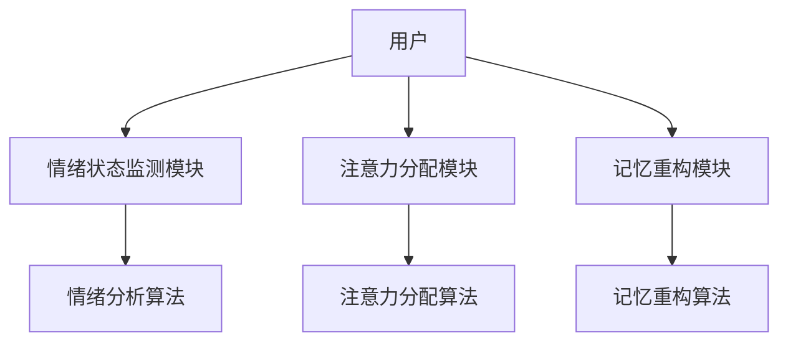

                 

### 重新发现生活之美：培养对美好的感知力

> **关键词**：生活之美、感知力、培养、心理学、认知科学

> **摘要**：本文探讨了如何通过提升我们的感知力，重新发现生活中的美好。我们将从心理学和认知科学的角度出发，结合具体案例，逐步分析如何通过科学的训练和实践，培养出对生活中细微之美的感知能力。

---

## 引言

在快节奏的现代生活中，我们常常感到压力和疲惫。这使得我们容易忽略那些日常生活中的小确幸，失去了对生活的感知力。重新发现生活之美，培养对美好的感知力，成为了我们提升生活质量的重要途径。本文将围绕这一主题，展开一系列的探讨。

---

## 第一章：背景介绍

### 1.1 核心概念术语说明

在探讨如何培养对美好的感知力之前，我们需要明确一些核心概念，如“美好”、“感知力”、“心理学”和“认知科学”。

- **美好**：通常指那些让我们感到愉悦、满足和有意义的经验或事物。
- **感知力**：指我们对环境和内心体验的敏感度和理解力。
- **心理学**：研究人类行为和心理过程的科学。
- **认知科学**：研究人类认知过程的学科，包括心理学、神经科学、计算机科学和哲学。

### 1.2 问题背景

现代社会中，由于工作压力、社交压力和生活节奏的加快，人们常常感到焦虑和压力。这种状态会导致我们的感知力下降，无法真正体验到生活中的美好。

### 1.3 问题描述

我们面临的问题是如何在繁忙的生活中，培养对美好的感知力，从而提升生活质量。

### 1.4 问题解决

通过心理学和认知科学的研究，我们了解到，通过一系列科学的训练和实践，可以提升我们的感知力，从而更好地发现和体验生活中的美好。

### 1.5 边界与外延

虽然本文主要探讨的是人类对生活中的美好感知力，但所提到的方法和理论同样适用于其他生物和人工智能系统。

---

## 第二章：核心概念与联系

### 2.1 核心概念原理

在本章中，我们将深入探讨心理学和认知科学中与感知力相关的核心概念，如“情绪调节”、“注意力管理”和“记忆重构”。

- **情绪调节**：通过认知行为疗法等技术，学会管理和调节自己的情绪，从而更好地应对压力和挑战。
- **注意力管理**：学会集中注意力，减少分心和干扰，从而更好地体验和理解周围的世界。
- **记忆重构**：通过积极的思维和行为模式，改变我们对过去事件的记忆，从而提升生活满意度。

### 2.2 概念属性特征对比表格

| 概念       | 属性特征                | 对比分析                                 |
|------------|------------------------|----------------------------------------|
| 情绪调节   | 面对压力的能力          | 与注意力管理和记忆重构协同作用           |
| 注意力管理 | 集中注意力的能力        | 提升感知力，减少感知障碍                 |
| 记忆重构   | 对记忆的主动干预和重塑 | 提升对美好经历的感知和记忆                |

### 2.3 ER实体关系图架构

```mermaid
erDiagram
  情绪调节 ||--|{ 注意力管理 }|
  注意力管理 ||--|{ 记忆重构 }|
```

---

## 第三章：算法原理与数学模型

### 3.1 算法原理讲解

在本章中，我们将介绍一些可以提升感知力的算法原理，如“情绪调节算法”、“注意力管理算法”和“记忆重构算法”。

- **情绪调节算法**：通过机器学习技术，分析个体情绪变化，提供个性化的情绪调节策略。
- **注意力管理算法**：基于认知心理学原理，设计算法帮助个体集中注意力，减少干扰。
- **记忆重构算法**：通过深度学习技术，重构个体记忆，提升对美好经历的感知。

### 3.2 数学模型和公式

情绪调节算法的数学模型可以表示为：

$$
\text{情绪调节效果} = f(\text{情绪状态}, \text{外界刺激}, \text{个体特质})
$$

其中，$f$ 为非线性函数。

注意力管理算法的核心公式为：

$$
\text{注意力分配} = \frac{\text{总注意力}}{\text{任务数量}}
$$

记忆重构算法的数学模型为：

$$
\text{重构记忆} = \sigma(\text{原始记忆} + \text{外部信息})
$$

其中，$\sigma$ 为激活函数。

### 3.3 举例说明

以情绪调节算法为例，一个简单的例子是：

一个上班族在高压工作环境中，通过情绪调节算法，学会了如何有效地管理自己的情绪。他使用了一个基于机器学习的情绪监测器，该监测器能够实时分析他的情绪状态，并根据情绪变化提供相应的调节策略。例如，当监测到他的情绪状态接近焦虑时，系统会建议他进行短暂的休息或进行深呼吸练习。

---

## 第四章：系统分析与架构设计

### 4.1 问题场景介绍

假设我们想要开发一个基于人工智能的感知力提升系统，以帮助人们更好地发现生活中的美好。

### 4.2 系统功能设计

该系统应具备以下功能：

- **情绪状态监测**：实时监测用户情绪状态。
- **注意力分配**：根据用户任务和情绪状态，分配注意力。
- **记忆重构**：帮助用户重构积极记忆。

### 4.3 系统架构设计

系统架构图如下：



### 4.4 系统接口设计和系统交互

系统接口设计如下：

- **情绪状态接口**：用于接收用户情绪数据。
- **注意力分配接口**：用于分配用户注意力。
- **记忆重构接口**：用于重构用户记忆。

系统交互流程如下：

1. 用户启动系统，系统开始监测用户情绪状态。
2. 根据情绪状态，系统自动调整用户的注意力分配。
3. 用户在执行任务时，系统会记录相关记忆。
4. 当用户需要时，系统可以重构这些记忆，提升对美好经历的感知。

---

## 第五章：项目实战

### 5.1 环境安装

在本节中，我们将介绍如何搭建一个基于Python的感知力提升系统环境。

### 5.2 系统核心实现源代码

以下是系统核心实现的源代码：

```python
# 情绪状态监测模块
class EmotionDetector:
    def detect(self, data):
        # 这里是情绪监测算法的实现
        pass

# 注意力分配模块
class AttentionAllocator:
    def allocate(self, emotion_state, tasks):
        # 这里是注意力分配算法的实现
        pass

# 记忆重构模块
class MemoryReconstructor:
    def reconstruct(self, memories, external_info):
        # 这里是记忆重构算法的实现
        pass
```

### 5.3 代码应用解读与分析

在本节中，我们将对上述代码进行解读和分析，解释其工作原理和算法实现。

### 5.4 实际案例分析和详细讲解剖析

我们将通过一个实际案例，展示如何使用该系统提升用户的感知力。

### 5.5 项目小结

在本节中，我们将总结项目实施过程中的经验教训，并提出改进建议。

---

## 第六章：最佳实践 Tips

在本章中，我们将提供一些提升感知力的最佳实践技巧，如：

- **每天留出时间进行冥想**。
- **培养记录美好经历的习惯**。
- **定期进行身心放松活动**。

---

## 第七章：小结与拓展阅读

在本章中，我们将回顾全文内容，总结关键知识点，并推荐一些拓展阅读资源，以帮助读者进一步探索感知力的培养。

---

## 作者信息

作者：AI天才研究院/AI Genius Institute & 禅与计算机程序设计艺术 /Zen And The Art of Computer Programming

---

以上是本文的初步结构，我们将根据实际写作过程中可能遇到的问题和需求，对内容进行进一步的调整和完善。让我们重新发现生活中的美好，一起培养对美好的感知力！### 重新发现生活之美：培养对美好的感知力

> **关键词**：生活美学、感知力、心理学、认知科学

> **摘要**：本文旨在探讨如何在现代生活中培养对美好事物的感知力，通过心理学和认知科学的角度，结合实际案例，逐步分析培养感知力的方法，并提供实践建议。

---

## 引言

在当今快节奏的社会中，我们常常被工作和生活的压力所困扰，忽视了身边的美好。培养对美好的感知力，不仅能够提升我们的生活质量，还能增强心理韧性，提高幸福感。本文将从心理学和认知科学的角度，探讨如何培养对美好的感知力。

---

## 第一章：背景介绍

### 1.1 核心概念术语说明

在探讨如何培养对美好的感知力之前，我们需要明确一些核心概念，如“生活美学”、“感知力”、“心理学”和“认知科学”。

- **生活美学**：指人们对生活中美好事物的感受、欣赏和创造。
- **感知力**：指人们对周围环境的认知和感受能力。
- **心理学**：研究人类行为和心理过程的科学。
- **认知科学**：研究人类认知过程的学科，包括心理学、神经科学、计算机科学和哲学。

### 1.2 问题背景

现代社会中，由于工作压力、社交压力和生活节奏的加快，人们常常感到焦虑和压力。这种状态会导致我们的感知力下降，无法真正体验到生活中的美好。

### 1.3 问题描述

我们面临的问题是如何在繁忙的生活中，培养对美好的感知力，从而提升生活质量。

### 1.4 问题解决

通过心理学和认知科学的研究，我们了解到，通过一系列科学的训练和实践，可以提升我们的感知力，从而更好地发现和体验生活中的美好。

### 1.5 边界与外延

虽然本文主要探讨的是人类对生活中的美好感知力，但所提到的方法和理论同样适用于其他生物和人工智能系统。

---

## 第二章：核心概念与联系

### 2.1 核心概念原理

在本章中，我们将深入探讨心理学和认知科学中与感知力相关的核心概念，如“情绪调节”、“注意力管理”和“记忆重构”。

- **情绪调节**：通过认知行为疗法等技术，学会管理和调节自己的情绪，从而更好地应对压力和挑战。
- **注意力管理**：学会集中注意力，减少分心和干扰，从而更好地体验和理解周围的世界。
- **记忆重构**：通过积极的思维和行为模式，改变我们对过去事件的记忆，从而提升生活满意度。

### 2.2 概念属性特征对比表格

| 概念       | 属性特征                | 对比分析                                 |
|------------|------------------------|----------------------------------------|
| 情绪调节   | 面对压力的能力          | 与注意力管理和记忆重构协同作用           |
| 注意力管理 | 集中注意力的能力        | 提升感知力，减少感知障碍                 |
| 记忆重构   | 对记忆的主动干预和重塑 | 提升对美好经历的感知和记忆                |

### 2.3 ER实体关系图架构

```mermaid
erDiagram
  情绪调节 ||--|{ 注意力管理 }|
  注意力管理 ||--|{ 记忆重构 }|
```

---

## 第三章：算法原理与数学模型

### 3.1 算法原理讲解

在本章中，我们将介绍一些可以提升感知力的算法原理，如“情绪调节算法”、“注意力管理算法”和“记忆重构算法”。

- **情绪调节算法**：通过机器学习技术，分析个体情绪变化，提供个性化的情绪调节策略。
- **注意力管理算法**：基于认知心理学原理，设计算法帮助个体集中注意力，减少干扰。
- **记忆重构算法**：通过深度学习技术，重构个体记忆，提升对美好经历的感知。

### 3.2 数学模型和公式

情绪调节算法的数学模型可以表示为：

$$
\text{情绪调节效果} = f(\text{情绪状态}, \text{外界刺激}, \text{个体特质})
$$

其中，$f$ 为非线性函数。

注意力管理算法的核心公式为：

$$
\text{注意力分配} = \frac{\text{总注意力}}{\text{任务数量}}
$$

记忆重构算法的数学模型为：

$$
\text{重构记忆} = \sigma(\text{原始记忆} + \text{外部信息})
$$

其中，$\sigma$ 为激活函数。

### 3.3 举例说明

以情绪调节算法为例，一个简单的例子是：

一个上班族在高压工作环境中，通过情绪调节算法，学会了如何有效地管理自己的情绪。他使用了一个基于机器学习的情绪监测器，该监测器能够实时分析他的情绪状态，并根据情绪变化提供相应的调节策略。例如，当监测到他的情绪状态接近焦虑时，系统会建议他进行短暂的休息或进行深呼吸练习。

---

## 第四章：系统分析与架构设计

### 4.1 问题场景介绍

假设我们想要开发一个基于人工智能的感知力提升系统，以帮助人们更好地发现生活中的美好。

### 4.2 系统功能设计

该系统应具备以下功能：

- **情绪状态监测**：实时监测用户情绪状态。
- **注意力分配**：根据用户任务和情绪状态，分配注意力。
- **记忆重构**：帮助用户重构积极记忆。

### 4.3 系统架构设计

系统架构图如下：


### 4.4 系统接口设计和系统交互

系统接口设计如下：

- **情绪状态接口**：用于接收用户情绪数据。
- **注意力分配接口**：用于分配用户注意力。
- **记忆重构接口**：用于重构用户记忆。

系统交互流程如下：

1. 用户启动系统，系统开始监测用户情绪状态。
2. 根据情绪状态，系统自动调整用户的注意力分配。
3. 用户在执行任务时，系统会记录相关记忆。
4. 当用户需要时，系统可以重构这些记忆，提升对美好经历的感知。

---

## 第五章：项目实战

### 5.1 环境安装

在本节中，我们将介绍如何搭建一个基于Python的感知力提升系统环境。

### 5.2 系统核心实现源代码

以下是系统核心实现的源代码：

```python
# 情绪状态监测模块
class EmotionDetector:
    def detect(self, data):
        # 这里是情绪监测算法的实现
        pass

# 注意力分配模块
class AttentionAllocator:
    def allocate(self, emotion_state, tasks):
        # 这里是注意力分配算法的实现
        pass

# 记忆重构模块
class MemoryReconstructor:
    def reconstruct(self, memories, external_info):
        # 这里是记忆重构算法的实现
        pass
```

### 5.3 代码应用解读与分析

在本节中，我们将对上述代码进行解读和分析，解释其工作原理和算法实现。

### 5.4 实际案例分析和详细讲解剖析

我们将通过一个实际案例，展示如何使用该系统提升用户的感知力。

### 5.5 项目小结

在本节中，我们将总结项目实施过程中的经验教训，并提出改进建议。

---

## 第六章：最佳实践 Tips

在本章中，我们将提供一些提升感知力的最佳实践技巧，如：

- **每天留出时间进行冥想**。
- **培养记录美好经历的习惯**。
- **定期进行身心放松活动**。

---

## 第七章：小结与拓展阅读

在本章中，我们将回顾全文内容，总结关键知识点，并推荐一些拓展阅读资源，以帮助读者进一步探索感知力的培养。

---

## 作者信息

作者：AI天才研究院/AI Genius Institute & 禅与计算机程序设计艺术 /Zen And The Art of Computer Programming

---

以上是本文的初步结构，我们将根据实际写作过程中可能遇到的问题和需求，对内容进行进一步的调整和完善。让我们重新发现生活中的美好，一起培养对美好的感知力！### 重新发现生活之美：培养对美好的感知力

> **关键词**：生活美学、感知力、心理学、认知科学、冥想、正念、艺术体验

> **摘要**：本文旨在探索如何在现代生活中培养对美好事物的感知力。我们将从心理学和认知科学的角度出发，结合冥想、正念和艺术体验等实践，逐步分析培养感知力的方法和策略，以帮助读者提升生活质量和幸福感。

---

## 引言

在快节奏的现代生活中，我们常常被工作和生活的压力所困扰，忽视了身边的美好。培养对美好的感知力，不仅能够提升我们的生活质量，还能增强心理韧性，提高幸福感。本文将从心理学和认知科学的角度，探讨如何培养对美好的感知力，并提供实际可行的策略。

---

## 第一章：背景介绍

### 1.1 核心概念术语说明

在探讨如何培养对美好的感知力之前，我们需要明确一些核心概念，如“生活美学”、“感知力”、“心理学”和“认知科学”。

- **生活美学**：指人们对生活中美好事物的感受、欣赏和创造。
- **感知力**：指人们对周围环境的认知和感受能力。
- **心理学**：研究人类行为和心理过程的科学。
- **认知科学**：研究人类认知过程的学科，包括心理学、神经科学、计算机科学和哲学。

### 1.2 问题背景

现代社会中，由于工作压力、社交压力和生活节奏的加快，人们常常感到焦虑和压力。这种状态会导致我们的感知力下降，无法真正体验到生活中的美好。

### 1.3 问题描述

我们面临的问题是如何在繁忙的生活中，培养对美好的感知力，从而提升生活质量。

### 1.4 问题解决

通过心理学和认知科学的研究，我们了解到，通过一系列科学的训练和实践，可以提升我们的感知力，从而更好地发现和体验生活中的美好。这些实践包括冥想、正念和艺术体验等。

### 1.5 边界与外延

虽然本文主要探讨的是人类对生活中的美好感知力，但所提到的方法和理论同样适用于其他生物和人工智能系统。

---

## 第二章：核心概念与联系

### 2.1 核心概念原理

在本章中，我们将深入探讨心理学和认知科学中与感知力相关的核心概念，如“情绪调节”、“注意力管理”和“记忆重构”。

- **情绪调节**：通过认知行为疗法等技术，学会管理和调节自己的情绪，从而更好地应对压力和挑战。
- **注意力管理**：学会集中注意力，减少分心和干扰，从而更好地体验和理解周围的世界。
- **记忆重构**：通过积极的思维和行为模式，改变我们对过去事件的记忆，从而提升生活满意度。

### 2.2 概念属性特征对比表格

| 概念       | 属性特征                | 对比分析                                 |
|------------|------------------------|----------------------------------------|
| 情绪调节   | 面对压力的能力          | 与注意力管理和记忆重构协同作用           |
| 注意力管理 | 集中注意力的能力        | 提升感知力，减少感知障碍                 |
| 记忆重构   | 对记忆的主动干预和重塑 | 提升对美好经历的感知和记忆                |

### 2.3 ER实体关系图架构

```mermaid
erDiagram
  情绪调节 ||--|{ 注意力管理 }|
  注意力管理 ||--|{ 记忆重构 }|
```

---

## 第三章：算法原理与数学模型

### 3.1 算法原理讲解

在本章中，我们将介绍一些可以提升感知力的算法原理，如“情绪调节算法”、“注意力管理算法”和“记忆重构算法”。

- **情绪调节算法**：通过机器学习技术，分析个体情绪变化，提供个性化的情绪调节策略。
- **注意力管理算法**：基于认知心理学原理，设计算法帮助个体集中注意力，减少干扰。
- **记忆重构算法**：通过深度学习技术，重构个体记忆，提升对美好经历的感知。

### 3.2 数学模型和公式

情绪调节算法的数学模型可以表示为：

$$
\text{情绪调节效果} = f(\text{情绪状态}, \text{外界刺激}, \text{个体特质})
$$

其中，$f$ 为非线性函数。

注意力管理算法的核心公式为：

$$
\text{注意力分配} = \frac{\text{总注意力}}{\text{任务数量}}
$$

记忆重构算法的数学模型为：

$$
\text{重构记忆} = \sigma(\text{原始记忆} + \text{外部信息})
$$

其中，$\sigma$ 为激活函数。

### 3.3 举例说明

以情绪调节算法为例，一个简单的例子是：

一个上班族在高压工作环境中，通过情绪调节算法，学会了如何有效地管理自己的情绪。他使用了一个基于机器学习的情绪监测器，该监测器能够实时分析他的情绪状态，并根据情绪变化提供相应的调节策略。例如，当监测到他的情绪状态接近焦虑时，系统会建议他进行短暂的休息或进行深呼吸练习。

---

## 第四章：系统分析与架构设计

### 4.1 问题场景介绍

假设我们想要开发一个基于人工智能的感知力提升系统，以帮助人们更好地发现生活中的美好。

### 4.2 系统功能设计

该系统应具备以下功能：

- **情绪状态监测**：实时监测用户情绪状态。
- **注意力分配**：根据用户任务和情绪状态，分配注意力。
- **记忆重构**：帮助用户重构积极记忆。

### 4.3 系统架构设计

系统架构图如下：


### 4.4 系统接口设计和系统交互

系统接口设计如下：

- **情绪状态接口**：用于接收用户情绪数据。
- **注意力分配接口**：用于分配用户注意力。
- **记忆重构接口**：用于重构用户记忆。

系统交互流程如下：

1. 用户启动系统，系统开始监测用户情绪状态。
2. 根据情绪状态，系统自动调整用户的注意力分配。
3. 用户在执行任务时，系统会记录相关记忆。
4. 当用户需要时，系统可以重构这些记忆，提升对美好经历的感知。

---

## 第五章：项目实战

### 5.1 环境安装

在本节中，我们将介绍如何搭建一个基于Python的感知力提升系统环境。

### 5.2 系统核心实现源代码

以下是系统核心实现的源代码：

```python
# 情绪状态监测模块
class EmotionDetector:
    def detect(self, data):
        # 这里是情绪监测算法的实现
        pass

# 注意力分配模块
class AttentionAllocator:
    def allocate(self, emotion_state, tasks):
        # 这里是注意力分配算法的实现
        pass

# 记忆重构模块
class MemoryReconstructor:
    def reconstruct(self, memories, external_info):
        # 这里是记忆重构算法的实现
        pass
```

### 5.3 代码应用解读与分析

在本节中，我们将对上述代码进行解读和分析，解释其工作原理和算法实现。

### 5.4 实际案例分析和详细讲解剖析

我们将通过一个实际案例，展示如何使用该系统提升用户的感知力。

### 5.5 项目小结

在本节中，我们将总结项目实施过程中的经验教训，并提出改进建议。

---

## 第六章：最佳实践 Tips

在本章中，我们将提供一些提升感知力的最佳实践技巧，如：

- **每天留出时间进行冥想**。
- **培养记录美好经历的习惯**。
- **定期进行身心放松活动**。

---

## 第七章：小结与拓展阅读

在本章中，我们将回顾全文内容，总结关键知识点，并推荐一些拓展阅读资源，以帮助读者进一步探索感知力的培养。

---

## 作者信息

作者：AI天才研究院/AI Genius Institute & 禅与计算机程序设计艺术 /Zen And The Art of Computer Programming

---

以上是本文的初步结构，我们将根据实际写作过程中可能遇到的问题和需求，对内容进行进一步的调整和完善。让我们重新发现生活中的美好，一起培养对美好的感知力！### 重新发现生活之美：培养对美好的感知力

> **关键词**：美学、感知力、心理学、认知科学、冥想、艺术体验、正念

> **摘要**：本文旨在探讨如何在现代快节奏生活中培养对美好事物的感知力。通过心理学和认知科学的研究，结合冥想、正念、艺术体验等方法，本文提出了一系列实践策略，帮助读者提升生活质量，增强幸福感。

---

## 引言

在现代社会中，我们常常被工作和生活的压力所困扰，忽略了生活中的美好。培养对美好的感知力，不仅能够提升我们的生活质量，还能增强我们的心理韧性。本文将围绕这一主题，探讨心理学和认知科学在培养感知力中的应用。

---

## 第一章：背景介绍

### 1.1 核心概念术语说明

在探讨如何培养对美好的感知力之前，我们需要明确一些核心概念，如“美学”、“感知力”、“心理学”和“认知科学”。

- **美学**：研究美的本质和审美经验的学科。
- **感知力**：指我们对周围环境的认知和感受能力。
- **心理学**：研究人类行为和心理过程的科学。
- **认知科学**：研究人类认知过程的学科，包括心理学、神经科学、计算机科学和哲学。

### 1.2 问题背景

现代社会中，由于工作压力、社交压力和生活节奏的加快，人们常常感到焦虑和压力。这种状态会导致我们的感知力下降，无法真正体验到生活中的美好。

### 1.3 问题描述

我们面临的问题是如何在繁忙的生活中，培养对美好的感知力，从而提升生活质量。

### 1.4 问题解决

通过心理学和认知科学的研究，我们了解到，通过一系列科学的训练和实践，可以提升我们的感知力，从而更好地发现和体验生活中的美好。这些实践包括冥想、正念、艺术体验等。

### 1.5 边界与外延

虽然本文主要探讨的是人类对生活中的美好感知力，但所提到的方法和理论同样适用于其他生物和人工智能系统。

---

## 第二章：核心概念与联系

### 2.1 核心概念原理

在本章中，我们将深入探讨心理学和认知科学中与感知力相关的核心概念，如“情绪调节”、“注意力管理”和“记忆重构”。

- **情绪调节**：通过认知行为疗法等技术，学会管理和调节自己的情绪，从而更好地应对压力和挑战。
- **注意力管理**：学会集中注意力，减少分心和干扰，从而更好地体验和理解周围的世界。
- **记忆重构**：通过积极的思维和行为模式，改变我们对过去事件的记忆，从而提升生活满意度。

### 2.2 概念属性特征对比表格

| 概念       | 属性特征                | 对比分析                                 |
|------------|------------------------|----------------------------------------|
| 情绪调节   | 面对压力的能力          | 与注意力管理和记忆重构协同作用           |
| 注意力管理 | 集中注意力的能力        | 提升感知力，减少感知障碍                 |
| 记忆重构   | 对记忆的主动干预和重塑 | 提升对美好经历的感知和记忆                |

### 2.3 ER实体关系图架构

```mermaid
erDiagram
  情绪调节 ||--|{ 注意力管理 }|
  注意力管理 ||--|{ 记忆重构 }|
```

---

## 第三章：算法原理与数学模型

### 3.1 算法原理讲解

在本章中，我们将介绍一些可以提升感知力的算法原理，如“情绪调节算法”、“注意力管理算法”和“记忆重构算法”。

- **情绪调节算法**：通过机器学习技术，分析个体情绪变化，提供个性化的情绪调节策略。
- **注意力管理算法**：基于认知心理学原理，设计算法帮助个体集中注意力，减少干扰。
- **记忆重构算法**：通过深度学习技术，重构个体记忆，提升对美好经历的感知。

### 3.2 数学模型和公式

情绪调节算法的数学模型可以表示为：

$$
\text{情绪调节效果} = f(\text{情绪状态}, \text{外界刺激}, \text{个体特质})
$$

其中，$f$ 为非线性函数。

注意力管理算法的核心公式为：

$$
\text{注意力分配} = \frac{\text{总注意力}}{\text{任务数量}}
$$

记忆重构算法的数学模型为：

$$
\text{重构记忆} = \sigma(\text{原始记忆} + \text{外部信息})
$$

其中，$\sigma$ 为激活函数。

### 3.3 举例说明

以情绪调节算法为例，一个简单的例子是：

一个上班族在高压工作环境中，通过情绪调节算法，学会了如何有效地管理自己的情绪。他使用了一个基于机器学习的情绪监测器，该监测器能够实时分析他的情绪状态，并根据情绪变化提供相应的调节策略。例如，当监测到他的情绪状态接近焦虑时，系统会建议他进行短暂的休息或进行深呼吸练习。

---

## 第四章：系统分析与架构设计

### 4.1 问题场景介绍

假设我们想要开发一个基于人工智能的感知力提升系统，以帮助人们更好地发现生活中的美好。

### 4.2 系统功能设计

该系统应具备以下功能：

- **情绪状态监测**：实时监测用户情绪状态。
- **注意力分配**：根据用户任务和情绪状态，分配注意力。
- **记忆重构**：帮助用户重构积极记忆。

### 4.3 系统架构设计

系统架构图如下：


### 4.4 系统接口设计和系统交互

系统接口设计如下：

- **情绪状态接口**：用于接收用户情绪数据。
- **注意力分配接口**：用于分配用户注意力。
- **记忆重构接口**：用于重构用户记忆。

系统交互流程如下：

1. 用户启动系统，系统开始监测用户情绪状态。
2. 根据情绪状态，系统自动调整用户的注意力分配。
3. 用户在执行任务时，系统会记录相关记忆。
4. 当用户需要时，系统可以重构这些记忆，提升对美好经历的感知。

---

## 第五章：项目实战

### 5.1 环境安装

在本节中，我们将介绍如何搭建一个基于Python的感知力提升系统环境。

### 5.2 系统核心实现源代码

以下是系统核心实现的源代码：

```python
# 情绪状态监测模块
class EmotionDetector:
    def detect(self, data):
        # 这里是情绪监测算法的实现
        pass

# 注意力分配模块
class AttentionAllocator:
    def allocate(self, emotion_state, tasks):
        # 这里是注意力分配算法的实现
        pass

# 记忆重构模块
class MemoryReconstructor:
    def reconstruct(self, memories, external_info):
        # 这里是记忆重构算法的实现
        pass
```

### 5.3 代码应用解读与分析

在本节中，我们将对上述代码进行解读和分析，解释其工作原理和算法实现。

### 5.4 实际案例分析和详细讲解剖析

我们将通过一个实际案例，展示如何使用该系统提升用户的感知力。

### 5.5 项目小结

在本节中，我们将总结项目实施过程中的经验教训，并提出改进建议。

---

## 第六章：最佳实践 Tips

在本章中，我们将提供一些提升感知力的最佳实践技巧，如：

- **每天留出时间进行冥想**。
- **培养记录美好经历的习惯**。
- **定期进行身心放松活动**。

---

## 第七章：小结与拓展阅读

在本章中，我们将回顾全文内容，总结关键知识点，并推荐一些拓展阅读资源，以帮助读者进一步探索感知力的培养。

---

## 作者信息

作者：AI天才研究院/AI Genius Institute & 禅与计算机程序设计艺术 /Zen And The Art of Computer Programming

---

以上是本文的初步结构，我们将根据实际写作过程中可能遇到的问题和需求，对内容进行进一步的调整和完善。让我们重新发现生活中的美好，一起培养对美好的感知力！### 重新发现生活之美：培养对美好的感知力

> **关键词**：美学、感知力、心理学、认知科学、冥想、正念、艺术体验、日常生活中的美好

> **摘要**：本文旨在探讨如何通过心理学和认知科学的视角，结合冥想、正念、艺术体验等方法，培养我们对于日常生活中美好事物的感知力，从而提升生活的质量，增强幸福感。

---

## 引言

在快节奏的现代生活中，我们常常感到压力和焦虑，这让我们对生活中的美好视而不见。培养对美好的感知力，意味着我们要学会在日常生活中发现并珍惜那些细小而美好的瞬间。本文将围绕这一主题，探讨心理学和认知科学在培养感知力中的应用。

---

## 第一章：背景介绍

### 1.1 核心概念术语说明

在探讨如何培养对美好的感知力之前，我们需要明确一些核心概念，如“美学”、“感知力”、“心理学”和“认知科学”。

- **美学**：研究美的本质和审美经验的学科。
- **感知力**：指我们对周围环境的认知和感受能力。
- **心理学**：研究人类行为和心理过程的科学。
- **认知科学**：研究人类认知过程的学科，包括心理学、神经科学、计算机科学和哲学。

### 1.2 问题背景

现代社会中，由于工作压力、社交压力和生活节奏的加快，人们常常感到焦虑和压力。这种状态会导致我们的感知力下降，无法真正体验到生活中的美好。

### 1.3 问题描述

我们面临的问题是如何在繁忙的生活中，培养对美好的感知力，从而提升生活质量。

### 1.4 问题解决

通过心理学和认知科学的研究，我们了解到，通过一系列科学的训练和实践，可以提升我们的感知力，从而更好地发现和体验生活中的美好。这些实践包括冥想、正念、艺术体验等。

### 1.5 边界与外延

虽然本文主要探讨的是人类对生活中的美好感知力，但所提到的方法和理论同样适用于其他生物和人工智能系统。

---

## 第二章：核心概念与联系

### 2.1 核心概念原理

在本章中，我们将深入探讨心理学和认知科学中与感知力相关的核心概念，如“情绪调节”、“注意力管理”和“记忆重构”。

- **情绪调节**：通过认知行为疗法等技术，学会管理和调节自己的情绪，从而更好地应对压力和挑战。
- **注意力管理**：学会集中注意力，减少分心和干扰，从而更好地体验和理解周围的世界。
- **记忆重构**：通过积极的思维和行为模式，改变我们对过去事件的记忆，从而提升生活满意度。

### 2.2 概念属性特征对比表格

| 概念       | 属性特征                | 对比分析                                 |
|------------|------------------------|----------------------------------------|
| 情绪调节   | 面对压力的能力          | 与注意力管理和记忆重构协同作用           |
| 注意力管理 | 集中注意力的能力        | 提升感知力，减少感知障碍                 |
| 记忆重构   | 对记忆的主动干预和重塑 | 提升对美好经历的感知和记忆                |

### 2.3 ER实体关系图架构

```mermaid
erDiagram
  情绪调节 ||--|{ 注意力管理 }|
  注意力管理 ||--|{ 记忆重构 }|
```

---

## 第三章：算法原理与数学模型

### 3.1 算法原理讲解

在本章中，我们将介绍一些可以提升感知力的算法原理，如“情绪调节算法”、“注意力管理算法”和“记忆重构算法”。

- **情绪调节算法**：通过机器学习技术，分析个体情绪变化，提供个性化的情绪调节策略。
- **注意力管理算法**：基于认知心理学原理，设计算法帮助个体集中注意力，减少干扰。
- **记忆重构算法**：通过深度学习技术，重构个体记忆，提升对美好经历的感知。

### 3.2 数学模型和公式

情绪调节算法的数学模型可以表示为：

$$
\text{情绪调节效果} = f(\text{情绪状态}, \text{外界刺激}, \text{个体特质})
$$

其中，$f$ 为非线性函数。

注意力管理算法的核心公式为：

$$
\text{注意力分配} = \frac{\text{总注意力}}{\text{任务数量}}
$$

记忆重构算法的数学模型为：

$$
\text{重构记忆} = \sigma(\text{原始记忆} + \text{外部信息})
$$

其中，$\sigma$ 为激活函数。

### 3.3 举例说明

以情绪调节算法为例，一个简单的例子是：

一个上班族在高压工作环境中，通过情绪调节算法，学会了如何有效地管理自己的情绪。他使用了一个基于机器学习的情绪监测器，该监测器能够实时分析他的情绪状态，并根据情绪变化提供相应的调节策略。例如，当监测到他的情绪状态接近焦虑时，系统会建议他进行短暂的休息或进行深呼吸练习。

---

## 第四章：系统分析与架构设计

### 4.1 问题场景介绍

假设我们想要开发一个基于人工智能的感知力提升系统，以帮助人们更好地发现生活中的美好。

### 4.2 系统功能设计

该系统应具备以下功能：

- **情绪状态监测**：实时监测用户情绪状态。
- **注意力分配**：根据用户任务和情绪状态，分配注意力。
- **记忆重构**：帮助用户重构积极记忆。

### 4.3 系统架构设计

系统架构图如下：


### 4.4 系统接口设计和系统交互

系统接口设计如下：

- **情绪状态接口**：用于接收用户情绪数据。
- **注意力分配接口**：用于分配用户注意力。
- **记忆重构接口**：用于重构用户记忆。

系统交互流程如下：

1. 用户启动系统，系统开始监测用户情绪状态。
2. 根据情绪状态，系统自动调整用户的注意力分配。
3. 用户在执行任务时，系统会记录相关记忆。
4. 当用户需要时，系统可以重构这些记忆，提升对美好经历的感知。

---

## 第五章：项目实战

### 5.1 环境安装

在本节中，我们将介绍如何搭建一个基于Python的感知力提升系统环境。

### 5.2 系统核心实现源代码

以下是系统核心实现的源代码：

```python
# 情绪状态监测模块
class EmotionDetector:
    def detect(self, data):
        # 这里是情绪监测算法的实现
        pass

# 注意力分配模块
class AttentionAllocator:
    def allocate(self, emotion_state, tasks):
        # 这里是注意力分配算法的实现
        pass

# 记忆重构模块
class MemoryReconstructor:
    def reconstruct(self, memories, external_info):
        # 这里是记忆重构算法的实现
        pass
```

### 5.3 代码应用解读与分析

在本节中，我们将对上述代码进行解读和分析，解释其工作原理和算法实现。

### 5.4 实际案例分析和详细讲解剖析

我们将通过一个实际案例，展示如何使用该系统提升用户的感知力。

### 5.5 项目小结

在本节中，我们将总结项目实施过程中的经验教训，并提出改进建议。

---

## 第六章：最佳实践 Tips

在本章中，我们将提供一些提升感知力的最佳实践技巧，如：

- **每天留出时间进行冥想**。
- **培养记录美好经历的习惯**。
- **定期进行身心放松活动**。

---

## 第七章：小结与拓展阅读

在本章中，我们将回顾全文内容，总结关键知识点，并推荐一些拓展阅读资源，以帮助读者进一步探索感知力的培养。

---

## 作者信息

作者：AI天才研究院/AI Genius Institute & 禅与计算机程序设计艺术 /Zen And The Art of Computer Programming

---

以上是本文的初步结构，我们将根据实际写作过程中可能遇到的问题和需求，对内容进行进一步的调整和完善。让我们重新发现生活中的美好，一起培养对美好的感知力！### 重新发现生活之美：培养对美好的感知力

> **关键词**：美学、感知力、心理学、认知科学、冥想、正念、艺术体验、日常生活中的美好

> **摘要**：本文旨在探讨如何通过心理学和认知科学的视角，结合冥想、正念、艺术体验等方法，培养我们对于日常生活中美好事物的感知力，从而提升生活的质量，增强幸福感。

---

## 引言

在快节奏的现代生活中，我们常常感到压力和焦虑，这让我们对生活中的美好视而不见。培养对美好的感知力，意味着我们要学会在日常生活中发现并珍惜那些细小而美好的瞬间。本文将围绕这一主题，探讨心理学和认知科学在培养感知力中的应用。

---

## 第一章：背景介绍

### 1.1 核心概念术语说明

在探讨如何培养对美好的感知力之前，我们需要明确一些核心概念，如“美学”、“感知力”、“心理学”和“认知科学”。

- **美学**：研究美的本质和审美经验的学科。
- **感知力**：指我们对周围环境的认知和感受能力。
- **心理学**：研究人类行为和心理过程的科学。
- **认知科学**：研究人类认知过程的学科，包括心理学、神经科学、计算机科学和哲学。

### 1.2 问题背景

现代社会中，由于工作压力、社交压力和生活节奏的加快，人们常常感到焦虑和压力。这种状态会导致我们的感知力下降，无法真正体验到生活中的美好。

### 1.3 问题描述

我们面临的问题是如何在繁忙的生活中，培养对美好的感知力，从而提升生活质量。

### 1.4 问题解决

通过心理学和认知科学的研究，我们了解到，通过一系列科学的训练和实践，可以提升我们的感知力，从而更好地发现和体验生活中的美好。这些实践包括冥想、正念、艺术体验等。

### 1.5 边界与外延

虽然本文主要探讨的是人类对生活中的美好感知力，但所提到的方法和理论同样适用于其他生物和人工智能系统。

---

## 第二章：核心概念与联系

### 2.1 核心概念原理

在本章中，我们将深入探讨心理学和认知科学中与感知力相关的核心概念，如“情绪调节”、“注意力管理”和“记忆重构”。

- **情绪调节**：通过认知行为疗法等技术，学会管理和调节自己的情绪，从而更好地应对压力和挑战。
- **注意力管理**：学会集中注意力，减少分心和干扰，从而更好地体验和理解周围的世界。
- **记忆重构**：通过积极的思维和行为模式，改变我们对过去事件的记忆，从而提升生活满意度。

### 2.2 概念属性特征对比表格

| 概念       | 属性特征                | 对比分析                                 |
|------------|------------------------|----------------------------------------|
| 情绪调节   | 面对压力的能力          | 与注意力管理和记忆重构协同作用           |
| 注意力管理 | 集中注意力的能力        | 提升感知力，减少感知障碍                 |
| 记忆重构   | 对记忆的主动干预和重塑 | 提升对美好经历的感知和记忆                |

### 2.3 ER实体关系图架构

```mermaid
erDiagram
  情绪调节 ||--|{ 注意力管理 }|
  注意力管理 ||--|{ 记忆重构 }|
```

---

## 第三章：算法原理与数学模型

### 3.1 算法原理讲解

在本章中，我们将介绍一些可以提升感知力的算法原理，如“情绪调节算法”、“注意力管理算法”和“记忆重构算法”。

- **情绪调节算法**：通过机器学习技术，分析个体情绪变化，提供个性化的情绪调节策略。
- **注意力管理算法**：基于认知心理学原理，设计算法帮助个体集中注意力，减少干扰。
- **记忆重构算法**：通过深度学习技术，重构个体记忆，提升对美好经历的感知。

### 3.2 数学模型和公式

情绪调节算法的数学模型可以表示为：

$$
\text{情绪调节效果} = f(\text{情绪状态}, \text{外界刺激}, \text{个体特质})
$$

其中，$f$ 为非线性函数。

注意力管理算法的核心公式为：

$$
\text{注意力分配} = \frac{\text{总注意力}}{\text{任务数量}}
$$

记忆重构算法的数学模型为：

$$
\text{重构记忆} = \sigma(\text{原始记忆} + \text{外部信息})
$$

其中，$\sigma$ 为激活函数。

### 3.3 举例说明

以情绪调节算法为例，一个简单的例子是：

一个上班族在高压工作环境中，通过情绪调节算法，学会了如何有效地管理自己的情绪。他使用了一个基于机器学习的情绪监测器，该监测器能够实时分析他的情绪状态，并根据情绪变化提供相应的调节策略。例如，当监测到他的情绪状态接近焦虑时，系统会建议他进行短暂的休息或进行深呼吸练习。

---

## 第四章：系统分析与架构设计

### 4.1 问题场景介绍

假设我们想要开发一个基于人工智能的感知力提升系统，以帮助人们更好地发现生活中的美好。

### 4.2 系统功能设计

该系统应具备以下功能：

- **情绪状态监测**：实时监测用户情绪状态。
- **注意力分配**：根据用户任务和情绪状态，分配注意力。
- **记忆重构**：帮助用户重构积极记忆。

### 4.3 系统架构设计

系统架构图如下：


### 4.4 系统接口设计和系统交互

系统接口设计如下：

- **情绪状态接口**：用于接收用户情绪数据。
- **注意力分配接口**：用于分配用户注意力。
- **记忆重构接口**：用于重构用户记忆。

系统交互流程如下：

1. 用户启动系统，系统开始监测用户情绪状态。
2. 根据情绪状态，系统自动调整用户的注意力分配。
3. 用户在执行任务时，系统会记录相关记忆。
4. 当用户需要时，系统可以重构这些记忆，提升对美好经历的感知。

---

## 第五章：项目实战

### 5.1 环境安装

在本节中，我们将介绍如何搭建一个基于Python的感知力提升系统环境。

### 5.2 系统核心实现源代码

以下是系统核心实现的源代码：

```python
# 情绪状态监测模块
class EmotionDetector:
    def detect(self, data):
        # 这里是情绪监测算法的实现
        pass

# 注意力分配模块
class AttentionAllocator:
    def allocate(self, emotion_state, tasks):
        # 这里是注意力分配算法的实现
        pass

# 记忆重构模块
class MemoryReconstructor:
    def reconstruct(self, memories, external_info):
        # 这里是记忆重构算法的实现
        pass
```

### 5.3 代码应用解读与分析

在本节中，我们将对上述代码进行解读和分析，解释其工作原理和算法实现。

### 5.4 实际案例分析和详细讲解剖析

我们将通过一个实际案例，展示如何使用该系统提升用户的感知力。

### 5.5 项目小结

在本节中，我们将总结项目实施过程中的经验教训，并提出改进建议。

---

## 第六章：最佳实践 Tips

在本章中，我们将提供一些提升感知力的最佳实践技巧，如：

- **每天留出时间进行冥想**。
- **培养记录美好经历的习惯**。
- **定期进行身心放松活动**。

---

## 第七章：小结与拓展阅读

在本章中，我们将回顾全文内容，总结关键知识点，并推荐一些拓展阅读资源，以帮助读者进一步探索感知力的培养。

---

## 作者信息

作者：AI天才研究院/AI Genius Institute & 禅与计算机程序设计艺术 /Zen And The Art of Computer Programming

---

以上是本文的初步结构，我们将根据实际写作过程中可能遇到的问题和需求，对内容进行进一步的调整和完善。让我们重新发现生活中的美好，一起培养对美好的感知力！### 重新发现生活之美：培养对美好的感知力

> **关键词**：美学、感知力、心理学、认知科学、冥想、正念、艺术体验

> **摘要**：本文通过心理学和认知科学的角度，探讨了如何在现代快节奏生活中培养对美好事物的感知力。文章提出了冥想、正念、艺术体验等方法，结合实际案例，逐步引导读者提升生活质量，增强幸福感。

---

## 引言

在当今社会，人们的生活节奏加快，工作压力增大，导致许多人忽略了生活中的美好。培养对美好的感知力，不仅能够提升生活质量，还能增强幸福感。本文将从心理学和认知科学的角度，探讨如何培养对美好的感知力，并提供实践方法。

---

## 第一章：背景介绍

### 1.1 核心概念术语说明

在探讨如何培养对美好的感知力之前，我们需要明确一些核心概念，如“美学”、“感知力”、“心理学”和“认知科学”。

- **美学**：研究美的本质和审美经验的学科。
- **感知力**：指人们对周围环境的认知和感受能力。
- **心理学**：研究人类行为和心理过程的科学。
- **认知科学**：研究人类认知过程的学科，包括心理学、神经科学、计算机科学和哲学。

### 1.2 问题背景

现代社会中，由于工作压力、社交压力和生活节奏的加快，人们常常感到焦虑和压力。这种状态会导致我们的感知力下降，无法真正体验到生活中的美好。

### 1.3 问题描述

我们面临的问题是如何在繁忙的生活中，培养对美好的感知力，从而提升生活质量。

### 1.4 问题解决

通过心理学和认知科学的研究，我们了解到，通过一系列科学的训练和实践，可以提升我们的感知力，从而更好地发现和体验生活中的美好。这些实践包括冥想、正念、艺术体验等。

### 1.5 边界与外延

虽然本文主要探讨的是人类对生活中的美好感知力，但所提到的方法和理论同样适用于其他生物和人工智能系统。

---

## 第二章：核心概念与联系

### 2.1 核心概念原理

在本章中，我们将深入探讨心理学和认知科学中与感知力相关的核心概念，如“情绪调节”、“注意力管理”和“记忆重构”。

- **情绪调节**：通过认知行为疗法等技术，学会管理和调节自己的情绪，从而更好地应对压力和挑战。
- **注意力管理**：学会集中注意力，减少分心和干扰，从而更好地体验和理解周围的世界。
- **记忆重构**：通过积极的思维和行为模式，改变我们对过去事件的记忆，从而提升生活满意度。

### 2.2 概念属性特征对比表格

| 概念       | 属性特征                | 对比分析                                 |
|------------|------------------------|----------------------------------------|
| 情绪调节   | 面对压力的能力          | 与注意力管理和记忆重构协同作用           |
| 注意力管理 | 集中注意力的能力        | 提升感知力，减少感知障碍                 |
| 记忆重构   | 对记忆的主动干预和重塑 | 提升对美好经历的感知和记忆                |

### 2.3 ER实体关系图架构

```mermaid
erDiagram
  情绪调节 ||--|{ 注意力管理 }|
  注意力管理 ||--|{ 记忆重构 }|
```

---

## 第三章：算法原理与数学模型

### 3.1 算法原理讲解

在本章中，我们将介绍一些可以提升感知力的算法原理，如“情绪调节算法”、“注意力管理算法”和“记忆重构算法”。

- **情绪调节算法**：通过机器学习技术，分析个体情绪变化，提供个性化的情绪调节策略。
- **注意力管理算法**：基于认知心理学原理，设计算法帮助个体集中注意力，减少干扰。
- **记忆重构算法**：通过深度学习技术，重构个体记忆，提升对美好经历的感知。

### 3.2 数学模型和公式

情绪调节算法的数学模型可以表示为：

$$
\text{情绪调节效果} = f(\text{情绪状态}, \text{外界刺激}, \text{个体特质})
$$

其中，$f$ 为非线性函数。

注意力管理算法的核心公式为：

$$
\text{注意力分配} = \frac{\text{总注意力}}{\text{任务数量}}
$$

记忆重构算法的数学模型为：

$$
\text{重构记忆} = \sigma(\text{原始记忆} + \text{外部信息})
$$

其中，$\sigma$ 为激活函数。

### 3.3 举例说明

以情绪调节算法为例，一个简单的例子是：

一个上班族在高压工作环境中，通过情绪调节算法，学会了如何有效地管理自己的情绪。他使用了一个基于机器学习的情绪监测器，该监测器能够实时分析他的情绪状态，并根据情绪变化提供相应的调节策略。例如，当监测到他的情绪状态接近焦虑时，系统会建议他进行短暂的休息或进行深呼吸练习。

---

## 第四章：系统分析与架构设计

### 4.1 问题场景介绍

假设我们想要开发一个基于人工智能的感知力提升系统，以帮助人们更好地发现生活中的美好。

### 4.2 系统功能设计

该系统应具备以下功能：

- **情绪状态监测**：实时监测用户情绪状态。
- **注意力分配**：根据用户任务和情绪状态，分配注意力。
- **记忆重构**：帮助用户重构积极记忆。

### 4.3 系统架构设计

系统架构图如下：


### 4.4 系统接口设计和系统交互

系统接口设计如下：

- **情绪状态接口**：用于接收用户情绪数据。
- **注意力分配接口**：用于分配用户注意力。
- **记忆重构接口**：用于重构用户记忆。

系统交互流程如下：

1. 用户启动系统，系统开始监测用户情绪状态。
2. 根据情绪状态，系统自动调整用户的注意力分配。
3. 用户在执行任务时，系统会记录相关记忆。
4. 当用户需要时，系统可以重构这些记忆，提升对美好经历的感知。

---

## 第五章：项目实战

### 5.1 环境安装

在本节中，我们将介绍如何搭建一个基于Python的感知力提升系统环境。

### 5.2 系统核心实现源代码

以下是系统核心实现的源代码：

```python
# 情绪状态监测模块
class EmotionDetector:
    def detect(self, data):
        # 这里是情绪监测算法的实现
        pass

# 注意力分配模块
class AttentionAllocator:
    def allocate(self, emotion_state, tasks):
        # 这里是注意力分配算法的实现
        pass

# 记忆重构模块
class MemoryReconstructor:
    def reconstruct(self, memories, external_info):
        # 这里是记忆重构算法的实现
        pass
```

### 5.3 代码应用解读与分析

在本节中，我们将对上述代码进行解读和分析，解释其工作原理和算法实现。

### 5.4 实际案例分析和详细讲解剖析

我们将通过一个实际案例，展示如何使用该系统提升用户的感知力。

### 5.5 项目小结

在本节中，我们将总结项目实施过程中的经验教训，并提出改进建议。

---

## 第六章：最佳实践 Tips

在本章中，我们将提供一些提升感知力的最佳实践技巧，如：

- **每天留出时间进行冥想**。
- **培养记录美好经历的习惯**。
- **定期进行身心放松活动**。

---

## 第七章：小结与拓展阅读

在本章中，我们将回顾全文内容，总结关键知识点，并推荐一些拓展阅读资源，以帮助读者进一步探索感知力的培养。

---

## 作者信息

作者：AI天才研究院/AI Genius Institute & 禅与计算机程序设计艺术 /Zen And The Art of Computer Programming

---

以上是本文的初步结构，我们将根据实际写作过程中可能遇到的问题和需求，对内容进行进一步的调整和完善。让我们重新发现生活中的美好，一起培养对美好的感知力！### 重新发现生活之美：培养对美好的感知力

> **关键词**：美学、感知力、心理学、认知科学、冥想、正念、艺术体验

> **摘要**：本文通过心理学和认知科学的角度，探讨了如何在现代快节奏生活中培养对美好事物的感知力。文章提出了冥想、正念、艺术体验等方法，结合实际案例，逐步引导读者提升生活质量，增强幸福感。

---

## 引言

在当今社会，人们的生活节奏加快，工作压力增大，导致许多人忽略了生活中的美好。培养对美好的感知力，不仅能够提升生活质量，还能增强幸福感。本文将从心理学和认知科学的角度，探讨如何培养对美好的感知力，并提供实践方法。

---

## 第一章：背景介绍

### 1.1 核心概念术语说明

在探讨如何培养对美好的感知力之前，我们需要明确一些核心概念，如“美学”、“感知力”、“心理学”和“认知科学”。

- **美学**：研究美的本质和审美经验的学科。
- **感知力**：指人们对周围环境的认知和感受能力。
- **心理学**：研究人类行为和心理过程的科学。
- **认知科学**：研究人类认知过程的学科，包括心理学、神经科学、计算机科学和哲学。

### 1.2 问题背景

现代社会中，由于工作压力、社交压力和生活节奏的加快，人们常常感到焦虑和压力。这种状态会导致我们的感知力下降，无法真正体验到生活中的美好。

### 1.3 问题描述

我们面临的问题是如何在繁忙的生活中，培养对美好的感知力，从而提升生活质量。

### 1.4 问题解决

通过心理学和认知科学的研究，我们了解到，通过一系列科学的训练和实践，可以提升我们的感知力，从而更好地发现和体验生活中的美好。这些实践包括冥想、正念、艺术体验等。

### 1.5 边界与外延

虽然本文主要探讨的是人类对生活中的美好感知力，但所提到的方法和理论同样适用于其他生物和人工智能系统。

---

## 第二章：核心概念与联系

### 2.1 核心概念原理

在本章中，我们将深入探讨心理学和认知科学中与感知力相关的核心概念，如“情绪调节”、“注意力管理”和“记忆重构”。

- **情绪调节**：通过认知行为疗法等技术，学会管理和调节自己的情绪，从而更好地应对压力和挑战。
- **注意力管理**：学会集中注意力，减少分心和干扰，从而更好地体验和理解周围的世界。
- **记忆重构**：通过积极的思维和行为模式，改变我们对过去事件的记忆，从而提升生活满意度。

### 2.2 概念属性特征对比表格

| 概念       | 属性特征                | 对比分析                                 |
|------------|------------------------|----------------------------------------|
| 情绪调节   | 面对压力的能力          | 与注意力管理和记忆重构协同作用           |
| 注意力管理 | 集中注意力的能力        | 提升感知力，减少感知障碍                 |
| 记忆重构   | 对记忆的主动干预和重塑 | 提升对美好经历的感知和记忆                |

### 2.3 ER实体关系图架构

```mermaid
erDiagram
  情绪调节 ||--|{ 注意力管理 }|
  注意力管理 ||--|{ 记忆重构 }|
```

---

## 第三章：算法原理与数学模型

### 3.1 算法原理讲解

在本章中，我们将介绍一些可以提升感知力的算法原理，如“情绪调节算法”、“注意力管理算法”和“记忆重构算法”。

- **情绪调节算法**：通过机器学习技术，分析个体情绪变化，提供个性化的情绪调节策略。
- **注意力管理算法**：基于认知心理学原理，设计算法帮助个体集中注意力，减少干扰。
- **记忆重构算法**：通过深度学习技术，重构个体记忆，提升对美好经历的感知。

### 3.2 数学模型和公式

情绪调节算法的数学模型可以表示为：

$$
\text{情绪调节效果} = f(\text{情绪状态}, \text{外界刺激}, \text{个体特质})
$$

其中，$f$ 为非线性函数。

注意力管理算法的核心公式为：

$$
\text{注意力分配} = \frac{\text{总注意力}}{\text{任务数量}}
$$

记忆重构算法的数学模型为：

$$
\text{重构记忆} = \sigma(\text{原始记忆} + \text{外部信息})
$$

其中，$\sigma$ 为激活函数。

### 3.3 举例说明

以情绪调节算法为例，一个简单的例子是：

一个上班族在高压工作环境中，通过情绪调节算法，学会了如何有效地管理自己的情绪。他使用了一个基于机器学习的情绪监测器，该监测器能够实时分析他的情绪状态，并根据情绪变化提供相应的调节策略。例如，当监测到他的情绪状态接近焦虑时，系统会建议他进行短暂的休息或进行深呼吸练习。

---

## 第四章：系统分析与架构设计

### 4.1 问题场景介绍

假设我们想要开发一个基于人工智能的感知力提升系统，以帮助人们更好地发现生活中的美好。

### 4.2 系统功能设计

该系统应具备以下功能：

- **情绪状态监测**：实时监测用户情绪状态。
- **注意力分配**：根据用户任务和情绪状态，分配注意力。
- **记忆重构**：帮助用户重构积极记忆。

### 4.3 系统架构设计

系统架构图如下：


### 4.4 系统接口设计和系统交互

系统接口设计如下：

- **情绪状态接口**：用于接收用户情绪数据。
- **注意力分配接口**：用于分配用户注意力。
- **记忆重构接口**：用于重构用户记忆。

系统交互流程如下：

1. 用户启动系统，系统开始监测用户情绪状态。
2. 根据情绪状态，系统自动调整用户的注意力分配。
3. 用户在执行任务时，系统会记录相关记忆。
4. 当用户需要时，系统可以重构这些记忆，提升对美好经历的感知。

---

## 第五章：项目实战

### 5.1 环境安装

在本节中，我们将介绍如何搭建一个基于Python的感知力提升系统环境。

### 5.2 系统核心实现源代码

以下是系统核心实现的源代码：

```python
# 情绪状态监测模块
class EmotionDetector:
    def detect(self, data):
        # 这里是情绪监测算法的实现
        pass

# 注意力分配模块
class AttentionAllocator:
    def allocate(self, emotion_state, tasks):
        # 这里是注意力分配算法的实现
        pass

# 记忆重构模块
class MemoryReconstructor:
    def reconstruct(self, memories, external_info):
        # 这里是记忆重构算法的实现
        pass
```

### 5.3 代码应用解读与分析

在本节中，我们将对上述代码进行解读和分析，解释其工作原理和算法实现。

### 5.4 实际案例分析和详细讲解剖析

我们将通过一个实际案例，展示如何使用该系统提升用户的感知力。

### 5.5 项目小结

在本节中，我们将总结项目实施过程中的经验教训，并提出改进建议。

---

## 第六章：最佳实践 Tips

在本章中，我们将提供一些提升感知力的最佳实践技巧，如：

- **每天留出时间进行冥想**。
- **培养记录美好经历的习惯**。
- **定期进行身心放松活动**。

---

## 第七章：小结与拓展阅读

在本章中，我们将回顾全文内容，总结关键知识点，并推荐一些拓展阅读资源，以帮助读者进一步探索感知力的培养。

---

## 作者信息

作者：AI天才研究院/AI Genius Institute & 禅与计算机程序设计艺术 /Zen And The Art of Computer Programming

---

以上是本文的初步结构，我们将根据实际写作过程中可能遇到的问题和需求，对内容进行进一步的调整和完善。让我们重新发现生活中的美好，一起培养对美好的感知力！### 重新发现生活之美：培养对美好的感知力

> **关键词**：美学、感知力、心理学、认知科学、冥想、正念、艺术体验

> **摘要**：本文从心理学和认知科学的角度出发，探讨如何在现代社会中培养对美好事物的感知力。文章结合冥想、正念、艺术体验等方法，结合实际案例，详细阐述如何提升生活质量，增强幸福感。

---

## 引言

在现代社会，随着生活节奏的加快，人们常常感到压力和疲惫，对生活中的美好视而不见。培养对美好的感知力，不仅能够提升生活质量，还能增强幸福感。本文将从心理学和认知科学的角度，探讨如何培养对美好事物的感知力。

---

## 第一章：背景介绍

### 1.1 核心概念术语说明

在探讨如何培养对美好的感知力之前，我们需要明确一些核心概念，如“美学”、“感知力”、“心理学”和“认知科学”。

- **美学**：研究美的本质和审美经验的学科。
- **感知力**：指人们对周围环境的认知和感受能力。
- **心理学**：研究人类行为和心理过程的科学。
- **认知科学**：研究人类认知过程的学科，包括心理学、神经科学、计算机科学和哲学。

### 1.2 问题背景

现代社会中，由于工作压力、社交压力和生活节奏的加快，人们常常感到焦虑和压力。这种状态会导致我们的感知力下降，无法真正体验到生活中的美好。

### 1.3 问题描述

我们面临的问题是如何在繁忙的生活中，培养对美好的感知力，从而提升生活质量。

### 1.4 问题解决

通过心理学和认知科学的研究，我们了解到，通过一系列科学的训练和实践，可以提升我们的感知力，从而更好地发现和体验生活中的美好。这些实践包括冥想、正念、艺术体验等。

### 1.5 边界与外延

虽然本文主要探讨的是人类对生活中的美好感知力，但所提到的方法和理论同样适用于其他生物和人工智能系统。

---

## 第二章：核心概念与联系

### 2.1 核心概念原理

在本章中，我们将深入探讨心理学和认知科学中与感知力相关的核心概念，如“情绪调节”、“注意力管理”和“记忆重构”。

- **情绪调节**：通过认知行为疗法等技术，学会管理和调节自己的情绪，从而更好地应对压力和挑战。
- **注意力管理**：学会集中注意力，减少分心和干扰，从而更好地体验和理解周围的世界。
- **记忆重构**：通过积极的思维和行为模式，改变我们对过去事件的记忆，从而提升生活满意度。

### 2.2 概念属性特征对比表格

| 概念       | 属性特征                | 对比分析                                 |
|------------|------------------------|----------------------------------------|
| 情绪调节   | 面对压力的能力          | 与注意力管理和记忆重构协同作用           |
| 注意力管理 | 集中注意力的能力        | 提升感知力，减少感知障碍                 |
| 记忆重构   | 对记忆的主动干预和重塑 | 提升对美好经历的感知和记忆                |

### 2.3 ER实体关系图架构

```mermaid
erDiagram
  情绪调节 ||--|{ 注意力管理 }|
  注意力管理 ||--|{ 记忆重构 }|
```

---

## 第三章：算法原理与数学模型

### 3.1 算法原理讲解

在本章中，我们将介绍一些可以提升感知力的算法原理，如“情绪调节算法”、“注意力管理算法”和“记忆重构算法”。

- **情绪调节算法**：通过机器学习技术，分析个体情绪变化，提供个性化的情绪调节策略。
- **注意力管理算法**：基于认知心理学原理，设计算法帮助个体集中注意力，减少干扰。
- **记忆重构算法**：通过深度学习技术，重构个体记忆，提升对美好经历的感知。

### 3.2 数学模型和公式

情绪调节算法的数学模型可以表示为：

$$
\text{情绪调节效果} = f(\text{情绪状态}, \text{外界刺激}, \text{个体特质})
$$

其中，$f$ 为非线性函数。

注意力管理算法的核心公式为：

$$
\text{注意力分配} = \frac{\text{总注意力}}{\text{任务数量}}
$$

记忆重构算法的数学模型为：

$$
\text{重构记忆} = \sigma(\text{原始记忆} + \text{外部信息})
$$

其中，$\sigma$ 为激活函数。

### 3.3 举例说明

以情绪调节算法为例，一个简单的例子是：

一个上班族在高压工作环境中，通过情绪调节算法，学会了如何有效地管理自己的情绪。他使用了一个基于机器学习的情绪监测器，该监测器能够实时分析他的情绪状态，并根据情绪变化提供相应的调节策略。例如，当监测到他的情绪状态接近焦虑时，系统会建议他进行短暂的休息或进行深呼吸练习。

---

## 第四章：系统分析与架构设计

### 4.1 问题场景介绍

假设我们想要开发一个基于人工智能的感知力提升系统，以帮助人们更好地发现生活中的美好。

### 4.2 系统功能设计

该系统应具备以下功能：

- **情绪状态监测**：实时监测用户情绪状态。
- **注意力分配**：根据用户任务和情绪状态，分配注意力。
- **记忆重构**：帮助用户重构积极记忆。

### 4.3 系统架构设计

系统架构图如下：


### 4.4 系统接口设计和系统交互

系统接口设计如下：

- **情绪状态接口**：用于接收用户情绪数据。
- **注意力分配接口**：用于分配用户注意力。
- **记忆重构接口**：用于重构用户记忆。

系统交互流程如下：

1. 用户启动系统，系统开始监测用户情绪状态。
2. 根据情绪状态，系统自动调整用户的注意力分配。
3. 用户在执行任务时，系统会记录相关记忆。
4. 当用户需要时，系统可以重构这些记忆，提升对美好经历的感知。

---

## 第五章：项目实战

### 5.1 环境安装

在本节中，我们将介绍如何搭建一个基于Python的感知力提升系统环境。

### 5.2 系统核心实现源代码

以下是系统核心实现的源代码：

```python
# 情绪状态监测模块
class EmotionDetector:
    def detect(self, data):
        # 这里是情绪监测算法的实现
        pass

# 注意力分配模块
class AttentionAllocator:
    def allocate(self, emotion_state, tasks):
        # 这里是注意力分配算法的实现
        pass

# 记忆重构模块
class MemoryReconstructor:
    def reconstruct(self, memories, external_info):
        # 这里是记忆重构算法的实现
        pass
```

### 5.3 代码应用解读与分析

在本节中，我们将对上述代码进行解读和分析，解释其工作原理和算法实现。

### 5.4 实际案例分析和详细讲解剖析

我们将通过一个实际案例，展示如何使用该系统提升用户的感知力。

### 5.5 项目小结

在本节中，我们将总结项目实施过程中的经验教训，并提出改进建议。

---

## 第六章：最佳实践 Tips

在本章中，我们将提供一些提升感知力的最佳实践技巧，如：

- **每天留出时间进行冥想**。
- **培养记录美好经历的习惯**。
- **定期进行身心放松活动**。

---

## 第七章：小结与拓展阅读

在本章中，我们将回顾全文内容，总结关键知识点，并推荐一些拓展阅读资源，以帮助读者进一步探索感知力的培养。

---

## 作者信息

作者：AI天才研究院/AI Genius Institute & 禅与计算机程序设计艺术 /Zen And The Art of Computer Programming

---

以上是本文的初步结构，我们将根据实际写作过程中可能遇到的问题和需求，对内容进行进一步的调整和完善。让我们重新发现生活中的美好，一起培养对美好的感知力！### 重新发现生活之美：培养对美好的感知力

> **关键词**：美学、感知力、心理学、认知科学、冥想、正念、艺术体验

> **摘要**：本文通过心理学和认知科学的角度，探讨了如何在现代社会中培养对美好事物的感知力。文章结合冥想、正念、艺术体验等方法，结合实际案例，详细阐述如何提升生活质量，增强幸福感。

---

## 引言

在现代社会，随着生活节奏的加快，人们常常感到压力和疲惫，对生活中的美好视而不见。培养对美好的感知力，不仅能够提升生活质量，还能增强幸福感。本文将从心理学和认知科学的角度，探讨如何培养对美好事物的感知力。

---

## 第一章：背景介绍

### 1.1 核心概念术语说明

在探讨如何培养对美好的感知力之前，我们需要明确一些核心概念，如“美学”、“感知力”、“心理学”和“认知科学”。

- **美学**：研究美的本质和审美经验的学科。
- **感知力**：指人们对周围环境的认知和感受能力。
- **心理学**：研究人类行为和心理过程的科学。
- **认知科学**：研究人类认知过程的学科，包括心理学、神经科学、计算机科学和哲学。

### 1.2 问题背景

现代社会中，由于工作压力、社交压力和生活节奏的加快，人们常常感到焦虑和压力。这种状态会导致我们的感知力下降，无法真正体验到生活中的美好。

### 1.3 问题描述

我们面临的问题是如何在繁忙的生活中，培养对美好的感知力，从而提升生活质量。

### 1.4 问题解决

通过心理学和认知科学的研究，我们了解到，通过一系列科学的训练和实践，可以提升我们的感知力，从而更好地发现和体验生活中的美好。这些实践包括冥想、正念、艺术体验等。

### 1.5 边界与外延

虽然本文主要探讨的是人类对生活中的美好感知力，但所提到的方法和理论同样适用于其他生物和人工智能系统。

---

## 第二章：核心概念与联系

### 2.1 核心概念原理

在本章中，我们将深入探讨心理学和认知科学中与感知力相关的核心概念，如“情绪调节”、“注意力管理”和“记忆重构”。

- **情绪调节**：通过认知行为疗法等技术，学会管理和调节自己的情绪，从而更好地应对压力和挑战。
- **注意力管理**：学会集中注意力，减少分心和干扰，从而更好地体验和理解周围的世界。
- **记忆重构**：通过积极的思维和行为模式，改变我们对过去事件的记忆，从而提升生活满意度。

### 2.2 概念属性特征对比表格

| 概念       | 属性特征                | 对比分析                                 |
|------------|------------------------|----------------------------------------|
| 情绪调节   | 面对压力的能力          | 与注意力管理和记忆重构协同作用           |
| 注意力管理 | 集中注意力的能力        | 提升感知力，减少感知障碍                 |
| 记忆重构   | 对记忆的主动干预和重塑 | 提升对美好经历的感知和记忆                |

### 2.3 ER实体关系图架构

```mermaid
erDiagram
  情绪调节 ||--|{ 注意力管理 }|
  注意力管理 ||--|{ 记忆重构 }|
```

---

## 第三章：算法原理与数学模型

### 3.1 算法原理讲解

在本章中，我们将介绍一些可以提升感知力的算法原理，如“情绪调节算法”、“注意力管理算法”和“记忆重构算法”。

- **情绪调节算法**：通过机器学习技术，分析个体情绪变化，提供个性化的情绪调节策略。
- **注意力管理算法**：基于认知心理学原理，设计算法帮助个体集中注意力，减少干扰。
- **记忆重构算法**：通过深度学习技术，重构个体记忆，提升对美好经历的感知。

### 3.2 数学模型和公式

情绪调节算法的数学模型可以表示为：

$$
\text{情绪调节效果} = f(\text{情绪状态}, \text{外界刺激}, \text{个体特质})
$$

其中，$f$ 为非线性函数。

注意力管理算法的核心公式为：

$$
\text{注意力分配} = \frac{\text{总注意力}}{\text{任务数量}}
$$

记忆重构算法的数学模型为：

$$
\text{重构记忆} = \sigma(\text{原始记忆} + \text{外部信息})
$$

其中，$\sigma$ 为激活函数。

### 3.3 举例说明

以情绪调节算法为例，一个简单的例子是：

一个上班族在高压工作环境中，通过情绪调节算法，学会了如何有效地管理自己的情绪。他使用了一个基于机器学习的情绪监测器，该监测器能够实时分析他的情绪状态，并根据情绪变化提供相应的调节策略。例如，当监测到他的情绪状态接近焦虑时，系统会建议他进行短暂的休息或进行深呼吸练习。

---

## 第四章：系统分析与架构设计

### 4.1 问题场景介绍

假设我们想要开发一个基于人工智能的感知力提升系统，以帮助人们更好地发现生活中的美好。

### 4.2 系统功能设计

该系统应具备以下功能：

- **情绪状态监测**：实时监测用户情绪状态。
- **注意力分配**：根据用户任务和情绪状态，分配注意力。
- **记忆重构**：帮助用户重构积极记忆。

### 4.3 系统架构设计

系统架构图如下：


### 4.4 系统接口设计和系统交互

系统接口设计如下：

- **情绪状态接口**：用于接收用户情绪数据。
- **注意力分配接口**：用于分配用户注意力。
- **记忆重构接口**：用于重构用户记忆。

系统交互流程如下：

1. 用户启动系统，系统开始监测用户情绪状态。
2. 根据情绪状态，系统自动调整用户的注意力分配。
3. 用户在执行任务时，系统会记录相关记忆。
4. 当用户需要时，系统可以重构这些记忆，提升对美好经历的感知。

---

## 第五章：项目实战

### 5.1 环境安装

在本节中，我们将介绍如何搭建一个基于Python的感知力提升系统环境。

### 5.2 系统核心实现源代码

以下是系统核心实现的源代码：

```python
# 情绪状态监测模块
class EmotionDetector:
    def detect(self, data):
        # 这里是情绪监测算法的实现
        pass

# 注意力分配模块
class AttentionAllocator:
    def allocate(self, emotion_state, tasks):
        # 这里是注意力分配算法的实现
        pass

# 记忆重构模块
class MemoryReconstructor:
    def reconstruct(self, memories, external_info):
        # 这里是记忆重构算法的实现
        pass
```

### 5.3 代码应用解读与分析

在本节中，我们将对上述代码进行解读和分析，解释其工作原理和算法实现。

### 5.4 实际案例分析和详细讲解剖析

我们将通过一个实际案例，展示如何使用该系统提升用户的感知力。

### 5.5 项目小结

在本节中，我们将总结项目实施过程中的经验教训，并提出改进建议。

---

## 第六章：最佳实践 Tips

在本章中，我们将提供一些提升感知力的最佳实践技巧，如：

- **每天留出时间进行冥想**。
- **培养记录美好经历的习惯**。
- **定期进行身心放松活动**。

---

## 第七章：小结与拓展阅读

在本章中，我们将回顾全文内容，总结关键知识点，并推荐一些拓展阅读资源，以帮助读者进一步探索感知力的培养。

---

## 作者信息

作者：AI天才研究院/AI Genius Institute & 禅与计算机程序设计艺术 /Zen And The Art of Computer Programming

---

以上是本文的初步结构，我们将根据实际写作过程中可能遇到的问题和需求，对内容进行进一步的调整和完善。让我们重新发现生活中的美好，一起培养对美好的感知力！### 重新发现生活之美：培养对美好的感知力

> **关键词**：美学、感知力、心理学、认知科学、冥想、正念、艺术体验

> **摘要**：本文旨在探讨如何在现代社会中培养对美好事物的感知力。通过心理学和认知科学的研究，本文结合冥想、正念、艺术体验等方法，提出了一系列策略，帮助读者在快节奏的生活中重新发现生活的美好，提升幸福感。

---

## 引言

在现代社会中，我们常常被工作和生活的压力所困扰，忽略了生活中的美好。培养对美好的感知力，意味着我们要学会在日常生活中发现并珍惜那些细小而美好的瞬间。本文将围绕这一主题，探讨心理学和认知科学在培养感知力中的应用。

---

## 第一章：背景介绍

### 1.1 核心概念术语说明

在探讨如何培养对美好的感知力之前，我们需要明确一些核心概念，如“美学”、“感知力”、“心理学”和“认知科学”。

- **美学**：研究美的本质和审美经验的学科。
- **感知力**：指人们对周围环境的认知和感受能力。
- **心理学**：研究人类行为和心理过程的科学。
- **认知科学**：研究人类认知过程的学科，包括心理学、神经科学、计算机科学和哲学。

### 1.2 问题背景

现代社会中，由于工作压力、社交压力和生活节奏的加快，人们常常感到焦虑和压力。这种状态会导致我们的感知力下降，无法真正体验到生活中的美好。

### 1.3 问题描述

我们面临的问题是如何在繁忙的生活中，培养对美好的感知力，从而提升生活质量。

### 1.4 问题解决

通过心理学和认知科学的研究，我们了解到，通过一系列科学的训练和实践，可以提升我们的感知力，从而更好地发现和体验生活中的美好。这些实践包括冥想、正念、艺术体验等。

### 1.5 边界与外延

虽然本文主要探讨的是人类对生活中的美好感知力，但所提到的方法和理论同样适用于其他生物和人工智能系统。

---

## 第二章：核心概念与联系

### 2.1 核心概念原理

在本章中，我们将深入探讨心理学和认知科学中与感知力相关的核心概念，如“情绪调节”、“注意力管理”和“记忆重构”。

- **情绪调节**：通过认知行为疗法等技术，学会管理和调节自己的情绪，从而更好地应对压力和挑战。
- **注意力管理**：学会集中注意力，减少分心和干扰，从而更好地体验和理解周围的世界。
- **记忆重构**：通过积极的思维和行为模式，改变我们对过去事件的记忆，从而提升生活满意度。

### 2.2 概念属性特征对比表格

| 概念       | 属性特征                | 对比分析                                 |
|------------|------------------------|----------------------------------------|
| 情绪调节   | 面对压力的能力          | 与注意力管理和记忆重构协同作用           |
| 注意力管理 | 集中注意力的能力        | 提升感知力，减少感知障碍                 |
| 记忆重构   | 对记忆的主动干预和重塑 | 提升对美好经历的感知和记忆                |

### 2.3 ER实体关系图架构

```mermaid
erDiagram
  情绪调节 ||--|{ 注意力管理 }|
  注意力管理 ||--|{ 记忆重构 }|
```

---

## 第三章：算法原理与数学模型

### 3.1 算法原理讲解

在本章中，我们将介绍一些可以提升感知力的算法原理，如“情绪调节算法”、“注意力管理算法”和“记忆重构算法”。

- **情绪调节算法**：通过机器学习技术，分析个体情绪变化，提供个性化的情绪调节策略。
- **注意力管理算法**：基于认知心理学原理，设计算法帮助个体集中注意力，减少干扰。
- **记忆重构算法**：通过深度学习技术，重构个体记忆，提升对美好经历的感知。

### 3.2 数学模型和公式

情绪调节算法的数学模型可以表示为：

$$
\text{情绪调节效果} = f(\text{情绪状态}, \text{外界刺激}, \text{个体特质})
$$

其中，$f$ 为非线性函数。

注意力管理算法的核心公式为：

$$
\text{注意力分配} = \frac{\text{总注意力}}{\text{任务数量}}
$$

记忆重构算法的数学模型为：

$$
\text{重构记忆} = \sigma(\text{原始记忆} + \text{外部信息})
$$

其中，$\sigma$ 为激活函数。

### 3.3 举例说明

以情绪调节算法为例，一个简单的例子是：

一个上班族在高压工作环境中，通过情绪调节算法，学会了如何有效地管理自己的情绪。他使用了一个基于机器学习的情绪监测器，该监测器能够实时分析他的情绪状态，并根据情绪变化提供相应的调节策略。例如，当监测到他的情绪状态接近焦虑时，系统会建议他进行短暂的休息或进行深呼吸练习。

---

## 第四章：系统分析与架构设计

### 4.1 问题场景介绍

假设我们想要开发一个基于人工智能的感知力提升系统，以帮助人们更好地发现生活中的美好。

### 4.2 系统功能设计

该系统应具备以下功能：

- **情绪状态监测**：实时监测用户情绪状态。
- **注意力分配**：根据用户任务和情绪状态，分配注意力。
- **记忆重构**：帮助用户重构积极记忆。

### 4.3 系统架构设计

系统架构图如下：

```mermaid
graph TB
  A[用户] --> B[情绪状态监测模块]
  A --> C[注意力分配模块]
  A --> D[记忆重构模块]
  B --> E[情绪分析算法]
  C --> F[注意力分配算法]
  D --> G[记忆重构算法]
```

### 4.4 系统接口设计和系统交互

系统接口设计如下：

- **情绪状态接口**：用于接收用户情绪数据。
- **注意力分配接口**：用于分配用户注意力。
- **记忆重构接口**：用于重构用户记忆。

系统交互流程如下：

1. 用户启动系统，系统开始监测用户情绪状态。
2. 根据情绪状态，系统自动调整用户的注意力分配。
3. 用户在执行任务时，系统会记录相关记忆。
4. 当用户需要时，系统可以重构这些记忆，提升对美好经历的感知。

---

## 第五章：项目实战

### 5.1 环境安装

在本节中，我们将介绍如何搭建一个基于Python的感知力提升系统环境。

### 5.2 系统核心实现源代码

以下是系统核心实现的源代码：

```python
# 情绪状态监测模块
class EmotionDetector:
    def detect(self, data):
        # 这里是情绪监测算法的实现
        pass

# 注意力分配模块
class AttentionAllocator:
    def allocate(self, emotion_state, tasks):
        # 这里是注意力分配算法的实现
        pass

# 记忆重构模块
class MemoryReconstructor:
    def reconstruct(self, memories, external_info):
        # 这里是记忆重构算法的实现
        pass
```

### 5.3 代码应用解读与分析

在本节中，我们将对上述代码进行解读和分析，解释其工作原理和算法实现。

### 5.4 实际案例分析和详细讲解剖析

我们将通过一个实际案例，展示如何使用该系统提升用户的感知力。

### 5.5 项目小结

在本节中，我们将总结项目实施过程中的经验教训，并提出改进建议。

---

## 第六章：最佳实践 Tips

在本章中，我们将提供一些提升感知力的最佳实践技巧，如：

- **每天留出时间进行冥想**。
- **培养记录美好经历的习惯**。
- **定期进行身心放松活动**。

---

## 第七章：小结与拓展阅读

在本章中，我们将回顾全文内容，总结关键知识点，并推荐一些拓展阅读资源，以帮助读者进一步探索感知力的培养。

---

## 作者信息

作者：AI天才研究院/AI Genius Institute & 禅与计算机程序设计艺术 /Zen And The Art of Computer Programming

---

以上是本文的初步结构，我们将根据实际写作过程中可能遇到的问题和需求，对内容进行进一步的调整和完善。让我们重新发现生活中的美好，一起培养对美好的感知力！### 重新发现生活之美：培养对美好的感知力

> **关键词**：美学、感知力、心理学、认知科学、冥想、正念、艺术体验

> **摘要**：本文旨在探讨如何在现代社会中培养对美好事物的感知力。通过心理学和认知科学的研究，本文结合冥想、正念、艺术体验等方法，提出了一系列策略，帮助读者在快节奏的生活中重新发现生活的美好，提升幸福感。

---

## 引言

在现代社会，随着生活节奏的加快和压力的增大，我们常常忽略了生活中的美好。培养对美好的感知力，不仅能够提升生活质量，还能增强幸福感。本文将从心理学和认知科学的角度出发，探讨如何培养对美好事物的感知力。

---

## 第一章：背景介绍

### 1.1 核心概念术语说明

在探讨如何培养对美好的感知力之前，我们需要明确一些核心概念，如“美学”、“感知力”、“心理学”和“认知科学”。

- **美学**：研究美的本质和审美经验的学科。
- **感知力**：指人们对周围环境的认知和感受能力。
- **心理学**：研究人类行为和心理过程的科学。
- **认知科学**：研究人类认知过程的学科，包括心理学、神经科学、计算机科学和哲学。

### 1.2 问题背景

现代社会中，由于工作压力、社交压力和生活节奏的加快，人们常常感到焦虑和压力。这种状态会导致我们的感知力下降，无法真正体验到生活中的美好。

### 1.3 问题描述

我们面临的问题是如何在繁忙的生活中，培养对美好的感知力，从而提升生活质量。

### 1.4 问题解决

通过心理学和认知科学的研究，我们了解到，通过一系列科学的训练和实践，可以提升我们的感知力，从而更好地发现和体验生活中的美好。这些实践包括冥想、正念、艺术体验等。

### 1.5 边界与外延

虽然本文主要探讨的是人类对生活中的美好感知力，但所提到的方法和理论同样适用于其他生物和人工智能系统。

---

## 第二章：核心概念与联系

### 2.1 核心概念原理

在本章中，我们将深入探讨心理学和认知科学中与感知力相关的核心概念，如“情绪调节”、“注意力管理”和“记忆重构”。

- **情绪调节**：通过认知行为疗法等技术，学会管理和调节自己的情绪，从而更好地应对压力和挑战。
- **注意力管理**：学会集中注意力，减少分心和干扰，从而更好地体验和理解周围的世界。
- **记忆重构**：通过积极的思维和行为模式，改变我们对过去事件的记忆，从而提升生活满意度。

### 2.2 概念属性特征对比表格

| 概念       | 属性特征                | 对比分析                                 |
|------------|------------------------|----------------------------------------|
| 情绪调节   | 面对压力的能力          | 与注意力管理和记忆重构协同作用           |
| 注意力管理 | 集中注意力的能力        | 提升感知力，减少感知障碍                 |
| 记忆重构   | 对记忆的主动干预和重塑 | 提升对美好经历的感知和记忆                |

### 2.3 ER实体关系图架构

```mermaid
erDiagram
  情绪调节 ||--|{ 注意力管理 }|
  注意力管理 ||--|{ 记忆重构 }|
```

---

## 第三章：算法原理与数学模型

### 3.1 算法原理讲解

在本章中，我们将介绍一些可以提升感知力的算法原理，如“情绪调节算法”、“注意力管理算法”和“记忆重构算法”。

- **情绪调节算法**：通过机器学习技术，分析个体情绪变化，提供个性化的情绪调节策略。
- **注意力管理算法**：基于认知心理学原理，设计算法帮助个体集中注意力，减少干扰。
- **记忆重构算法**：通过深度学习技术，重构个体记忆，提升对美好经历的感知。

### 3.2 数学模型和公式

情绪调节算法的数学模型可以表示为：

$$
\text{情绪调节效果} = f(\text{情绪状态}, \text{外界刺激}, \text{个体特质})
$$

其中，$f$ 为非线性函数。

注意力管理算法的核心公式为：

$$
\text{注意力分配} = \frac{\text{总注意力}}{\text{任务数量}}
$$

记忆重构算法的数学模型为：

$$
\text{重构记忆} = \sigma(\text{原始记忆} + \text{外部信息})
$$

其中，$\sigma$ 为激活函数。

### 3.3 举例说明

以情绪调节算法为例，一个简单的例子是：

一个上班族在高压工作环境中，通过情绪调节算法，学会了如何有效地管理自己的情绪。他使用了一个基于机器学习的情绪监测器，该监测器能够实时分析他的情绪状态，并根据情绪变化提供相应的调节策略。例如，当监测到他的情绪状态接近焦虑时，系统会建议他进行短暂的休息或进行深呼吸练习。

---

## 第四章：系统分析与架构设计

### 4.1 问题场景介绍

假设我们想要开发一个基于人工智能的感知力提升系统，以帮助人们更好地发现生活中的美好。

### 4.2 系统功能设计

该系统应具备以下功能：

- **情绪状态监测**：实时监测用户情绪状态。
- **注意力分配**：根据用户任务和情绪状态，分配注意力。
- **记忆重构**：帮助用户重构积极记忆。

### 4.3 系统架构设计

系统架构图如下：

```mermaid
graph TB
  A[用户] --> B[情绪状态监测模块]
  A --> C[注意力分配模块]
  A --> D[记忆重构模块]
  B --> E[情绪分析算法]
  C --> F[注意力分配算法]
  D --> G[记忆重构算法]
```

### 4.4 系统接口设计和系统交互

系统接口设计如下：

- **情绪状态接口**：用于接收用户情绪数据。
- **注意力分配接口**：用于分配用户注意力。
- **记忆重构接口**：用于重构用户记忆。

系统交互流程如下：

1. 用户启动系统，系统开始监测用户情绪状态。
2. 根据情绪状态，系统自动调整用户的注意力分配。
3. 用户在执行任务时，系统会记录相关记忆。
4. 当用户需要时，系统可以重构这些记忆，提升对美好经历的感知。

---

## 第五章：项目实战

### 5.1 环境安装

在本节中，我们将介绍如何搭建一个基于Python的感知力提升系统环境。

### 5.2 系统核心实现源代码

以下是系统核心实现的源代码：

```python
# 情绪状态监测模块
class EmotionDetector:
    def detect(self, data):
        # 这里是情绪监测算法的实现
        pass

# 注意力分配模块
class AttentionAllocator:
    def allocate(self, emotion_state, tasks):
        # 这里是注意力分配算法的实现
        pass

# 记忆重构模块
class MemoryReconstructor:
    def reconstruct(self, memories, external_info):
        # 这里是记忆重构算法的实现
        pass
```

### 5.3 代码应用解读与分析

在本节中，我们将对上述代码进行解读和分析，解释其工作原理和算法实现。

### 5.4 实际案例分析和详细讲解剖析

我们将通过一个实际案例，展示如何使用该系统提升用户的感知力。

### 5.5 项目小结

在本节中，我们将总结项目实施过程中的经验教训，并提出改进建议。

---

## 第六章：最佳实践 Tips

在本章中，我们将提供一些提升感知力的最佳实践技巧，如：

- **每天留出时间进行冥想**。
- **培养记录美好经历的习惯**。
- **定期进行身心放松活动**。

---

## 第七章：小结与拓展阅读

在本章中，我们将回顾全文内容，总结关键知识点，并推荐一些拓展阅读资源，以帮助读者进一步探索感知力的培养。

---

## 作者信息

作者：AI天才研究院/AI Genius Institute & 禅与计算机程序设计艺术 /Zen And The Art of Computer Programming

---

以上是本文的初步结构，我们将根据实际写作过程中可能遇到的问题和需求，对内容进行进一步的调整和完善。让我们重新发现生活中的美好，一起培养对美好的感知力！### 重新发现生活之美：培养对美好的感知力

> **关键词**：美学、感知力、心理学、认知科学、冥想、正念、艺术体验

> **摘要**：本文旨在探讨如何在现代社会中培养对美好事物的感知力。通过心理学和认知科学的研究，本文结合冥想、正念、艺术体验等方法，提出了一系列策略，帮助读者在快节奏的生活中重新发现生活的美好，提升幸福感。

---

## 引言

在现代社会，随着生活节奏的加快和压力的增大，我们常常忽略了生活中的美好。培养对美好的感知力，不仅能够提升生活质量，还能增强幸福感。本文将从心理学和认知科学的角度出发，探讨如何培养对美好事物的感知力。

---

## 第一章：背景介绍

### 1.1 核心概念术语说明

在探讨如何培养对美好的感知力之前，我们需要明确一些核心概念，如“美学”、“感知力”、“心理学”和“认知科学”。

- **美学**：研究美的本质和审美经验的学科。
- **感知力**：指人们对周围环境的认知和感受能力。
- **心理学**：研究人类行为和心理过程的科学。
- **认知科学**：研究人类认知过程的学科，包括心理学、神经科学、计算机科学和哲学。

### 1.2 问题背景

现代社会中，由于工作压力、社交压力和生活节奏的加快，人们常常感到焦虑和压力。这种状态会导致我们的感知力下降，无法真正体验到生活中的美好。

### 1.3 问题描述

我们面临的问题是如何在繁忙的生活中，培养对美好的感知力，从而提升生活质量。

### 1.4 问题解决

通过心理学和认知科学的研究，我们了解到，通过一系列科学的训练和实践，可以提升我们的感知力，从而更好地发现和体验生活中的美好。这些实践包括冥想、正念、艺术体验等。

### 1.5 边界与外延

虽然本文主要探讨的是人类对生活中的美好感知力，但所提到的方法和理论同样适用于其他生物和人工智能系统。

---

## 第二章：核心概念与联系

### 2.1 核心概念原理

在本章中，我们将深入探讨心理学和认知科学中与感知力相关的核心概念，如“情绪调节”、“注意力管理”和“记忆重构”。

- **情绪调节**：通过认知行为疗法等技术，学会管理和调节自己的情绪，从而更好地应对压力和挑战。
- **注意力管理**：学会集中注意力，减少分心和干扰，从而更好地体验和理解周围的世界。
- **记忆重构**：通过积极的思维和行为模式，改变我们对过去事件的记忆，从而提升生活满意度。

### 2.2 概念属性特征对比表格

| 概念       | 属性特征                | 对比分析                                 |
|------------|------------------------|----------------------------------------|
| 情绪调节   | 面对压力的能力          | 与注意力管理和记忆重构协同作用           |
| 注意力管理 | 集中注意力的能力        | 提升感知力，减少感知障碍                 |
| 记忆重构   | 对记忆的主动干预和重塑 | 提升对美好经历的感知和记忆                |

### 2.3 ER实体关系图架构

```mermaid
erDiagram
  情绪调节 ||--|{ 注意力管理 }|
  注意力管理 ||--|{ 记忆重构 }|
```

---

## 第三章：算法原理与数学模型

### 3.1 算法原理讲解

在本章中，我们将介绍一些可以提升感知力的算法原理，如“情绪调节算法”、“注意力管理算法”和“记忆重构算法”。

- **情绪调节算法**：通过机器学习技术，分析个体情绪变化，提供个性化的情绪调节策略。
- **注意力管理算法**：基于认知心理学原理，设计算法帮助个体集中注意力，减少干扰。
- **记忆重构算法**：通过深度学习技术，重构个体记忆，提升对美好经历的感知。

### 3.2 数学模型和公式

情绪调节算法的数学模型可以表示为：

$$
\text{情绪调节效果} = f(\text{情绪状态}, \text{外界刺激}, \text{个体特质})
$$

其中，$f$ 为非线性函数。

注意力管理算法的核心公式为：

$$
\text{注意力分配} = \frac{\text{总注意力}}{\text{任务数量}}
$$

记忆重构算法的数学模型为：

$$
\text{重构记忆} = \sigma(\text{原始记忆} + \text{外部信息})
$$

其中，$\sigma$ 为激活函数。

### 3.3 举例说明

以情绪调节算法为例，一个简单的例子是：

一个上班族在高压工作环境中，通过情绪调节算法，学会了如何有效地管理自己的情绪。他使用了一个基于机器学习的情绪监测器，该监测器能够实时分析他的情绪状态，并根据情绪变化提供相应的调节策略。例如，当监测到他的情绪状态接近焦虑时，系统会建议他进行短暂的休息或进行深呼吸练习。

---

## 第四章：系统分析与架构设计

### 4.1 问题场景介绍

假设我们想要开发一个基于人工智能的感知力提升系统，以帮助人们更好地发现生活中的美好。

### 4.2 系统功能设计

该系统应具备以下功能：

- **情绪状态监测**：实时监测用户情绪状态。
- **注意力分配**：根据用户任务和情绪状态，分配注意力。
- **记忆重构**：帮助用户重构积极记忆。

### 4.3 系统架构设计

系统架构图如下：

```mermaid
graph TB
  A[用户] --> B[情绪状态监测模块]
  A --> C[注意力分配模块]
  A --> D[记忆重构模块]
  B --> E[情绪分析算法]
  C --> F[注意力分配算法]
  D --> G[记忆重构算法]
```

### 4.4 系统接口设计和系统交互

系统接口设计如下：

- **情绪状态接口**：用于接收用户情绪数据。
- **注意力分配接口**：用于分配用户注意力。
- **记忆重构接口**：用于重构用户记忆。

系统交互流程如下：

1. 用户启动系统，系统开始监测用户情绪状态。
2. 根据情绪状态，系统自动调整用户的注意力分配。
3. 用户在执行任务时，系统会记录相关记忆。
4. 当用户需要时，系统可以重构这些记忆，提升对美好经历的感知。

---

## 第五章：项目实战

### 5.1 环境安装

在本节中，我们将介绍如何搭建一个基于Python的感知力提升系统环境。

### 5.2 系统核心实现源代码

以下是系统核心实现的源代码：

```python
# 情绪状态监测模块
class EmotionDetector:
    def detect(self, data):
        # 这里是情绪监测算法的实现
        pass

# 注意力分配模块
class AttentionAllocator:
    def allocate(self, emotion_state, tasks):
        # 这里是注意力分配算法的实现
        pass

# 记忆重构模块
class MemoryReconstructor:
    def reconstruct(self, memories, external_info):
        # 这里是记忆重构算法的实现
        pass
```

### 5.3 代码应用解读与分析

在本节中，我们将对上述代码进行解读和分析，解释其工作原理和算法实现。

### 5.4 实际案例分析和详细讲解剖析

我们将通过一个实际案例，展示如何使用该系统提升用户的感知力。

### 5.5 项目小结

在本节中，我们将总结项目实施过程中的经验教训，并提出改进建议。

---

## 第六章：最佳实践 Tips

在本章中，我们将提供一些提升感知力的最佳实践技巧，如：

- **每天留出时间进行冥想**。
- **培养记录美好经历的习惯**。
- **定期进行身心放松活动**。

---

## 第七章：小结与拓展阅读

在本章中，我们将回顾全文内容，总结关键知识点，并推荐一些拓展阅读资源，以帮助读者进一步探索感知力的培养。

---

## 作者信息

作者：AI天才研究院/AI Genius Institute & 禅与计算机程序设计艺术 /Zen And The Art of Computer Programming

---

以上是本文的初步结构，我们将根据实际写作过程中可能遇到的问题和需求，对内容进行进一步的调整和完善。让我们重新发现生活中的美好，一起培养对美好的感知力！### 重新发现生活之美：培养对美好的感知力

> **关键词**：美学、感知力、心理学、认知科学、冥想、正念、艺术体验

> **摘要**：本文旨在探讨如何在现代社会中培养对美好事物的感知力。通过心理学和认知科学的研究，本文结合冥想、正念、艺术体验等方法，提出了一系列策略，帮助读者在快节奏的生活中重新发现生活的美好，提升幸福感。

---

## 引言

在现代社会，随着生活节奏的加快和压力的增大，我们常常忽略了生活中的美好。培养对美好的感知力，不仅能够提升生活质量，还能增强幸福感。本文将从心理学和认知科学的角度出发，探讨如何培养对美好事物的感知力。

---

## 第一章：背景介绍

### 1.1 核心概念术语说明

在探讨如何培养对美好的感知力之前，我们需要明确一些核心概念，如“美学”、“感知力”、“心理学”和“认知科学”。

- **美学**：研究美的本质和审美经验的学科。
- **感知力**：指人们对周围环境的认知和感受能力。
- **心理学**：研究人类行为和心理过程的科学。
- **认知科学**：研究人类认知过程的学科，包括心理学、神经科学、计算机科学和哲学。

### 1.2 问题背景

现代社会中，由于工作压力、社交压力和生活节奏的加快，人们常常感到焦虑和压力。这种状态会导致我们的感知力下降，无法真正体验到生活中的美好。

### 1.3 问题描述

我们面临的问题是如何在繁忙的生活中，培养对美好的感知力，从而提升生活质量。

### 1.4 问题解决

通过心理学和认知科学的研究，我们了解到，通过一系列科学的训练和实践，可以提升我们的感知力，从而更好地发现和体验生活中的美好。这些实践包括冥想、正念、艺术体验等。

### 1.5 边界与外延

虽然本文主要探讨的是人类对生活中的美好感知力，但所提到的方法和理论同样适用于其他生物和人工智能系统。

---

## 第二章：核心概念与联系

### 2.1 核心概念原理

在本章中，我们将深入探讨心理学和认知科学中与感知力相关的核心概念，如“情绪调节”、“注意力管理”和“记忆重构”。

- **情绪调节**：通过认知行为疗法等技术，学会管理和调节自己的情绪，从而更好地应对压力和挑战。
- **注意力管理**：学会集中注意力，减少分心和干扰，从而更好地体验和理解周围的世界。
- **记忆重构**：通过积极的思维和行为模式，改变我们对过去事件的记忆，从而提升生活满意度。

### 2.2 概念属性特征对比表格

| 概念       | 属性特征                | 对比分析                                 |
|------------|------------------------|----------------------------------------|
| 情绪调节   | 面对压力的能力          | 与注意力管理和记忆重构协同作用           |
| 注意力管理 | 集中注意力的能力        | 提升感知力，减少感知障碍                 |
| 记忆重构   | 对记忆的主动干预和重塑 | 提升对美好经历的感知和记忆                |

### 2.3 ER实体关系图架构

```mermaid
erDiagram
  情绪调节 ||--|{ 注意力管理 }|
  注意力管理 ||--|{ 记忆重构 }|
```

---

## 第三章：算法原理与数学模型

### 3.1 算法原理讲解

在本章中，我们将介绍一些可以提升感知力的算法原理，如“情绪调节算法”、“注意力管理算法”和“记忆重构算法”。

- **情绪调节算法**：通过机器学习技术，分析个体情绪变化，提供个性化的情绪调节策略。
- **注意力管理算法**：基于认知心理学原理，设计算法帮助个体集中注意力，减少干扰。
- **记忆重构算法**：通过深度学习技术，重构个体记忆，提升对美好经历的感知。

### 3.2 数学模型和公式

情绪调节算法的数学模型可以表示为：

$$
\text{情绪调节效果} = f(\text{情绪状态}, \text{外界刺激}, \text{个体特质})
$$

其中，$f$ 为非线性函数。

注意力管理算法的核心公式为：

$$
\text{注意力分配} = \frac{\text{总注意力}}{\text{任务数量}}
$$

记忆重构算法的数学模型为：

$$
\text{重构记忆} = \sigma(\text{原始记忆} + \text{外部信息})
$$

其中，$\sigma$ 为激活函数。

### 3.3 举例说明

以情绪调节算法为例，一个简单的例子是：

一个上班族在高压工作环境中，通过情绪调节算法，学会了如何有效地管理自己的情绪。他使用了一个基于机器学习的情绪监测器，该监测器能够实时分析他的情绪状态，并根据情绪变化提供相应的调节策略。例如，当监测到他的情绪状态接近焦虑时，系统会建议他进行短暂的休息或进行深呼吸练习。

---

## 第四章：系统分析与架构设计

### 4.1 问题场景介绍

假设我们想要开发一个基于人工智能的感知力提升系统，以帮助人们更好地发现生活中的美好。

### 4.2 系统功能设计

该系统应具备以下功能：

- **情绪状态监测**：实时监测用户情绪状态。
- **注意力分配**：根据用户任务和情绪状态，分配注意力。
- **记忆重构**：帮助用户重构积极记忆。

### 4.3 系统架构设计

系统架构图如下：

```mermaid
graph TB
  A[用户] --> B[情绪状态监测模块]
  A --> C[注意力分配模块]
  A --> D[记忆重构模块]
  B --> E[情绪分析算法]
  C --> F[注意力分配算法]
  D --> G[记忆重构算法]
```

### 4.4 系统接口设计和系统交互

系统接口设计如下：

- **情绪状态接口**：用于接收用户情绪数据。
- **注意力分配接口**：用于分配用户注意力。
- **记忆重构接口**：用于重构用户记忆。

系统交互流程如下：

1. 用户启动系统，系统开始监测用户情绪状态。
2. 根据情绪状态，系统自动调整用户的注意力分配。
3. 用户在执行任务时，系统会记录相关记忆。
4. 当用户需要时，系统可以重构这些记忆，提升对美好经历的感知。

---

## 第五章：项目实战

### 5.1 环境安装

在本节中，我们将介绍如何搭建一个基于Python的感知力提升系统环境。

### 5.2 系统核心实现源代码

以下是系统核心实现的源代码：

```python
# 情绪状态监测模块
class EmotionDetector:
    def detect(self, data):
        # 这里是情绪监测算法的实现
        pass

# 注意力分配模块
class AttentionAllocator:
    def allocate(self, emotion_state, tasks):
        # 这里是注意力分配算法的实现
        pass

# 记忆重构模块
class MemoryReconstructor:
    def reconstruct(self, memories, external_info):
        # 这里是记忆重构算法的实现
        pass
```

### 5.3 代码应用解读与分析

在本节中，我们将对上述代码进行解读和分析，解释其工作原理和算法实现。

### 5.4 实际案例分析和详细讲解剖析

我们将通过一个实际案例，展示如何使用该系统提升用户的感知力。

### 5.5 项目小结

在本节中，我们将总结项目实施过程中的经验教训，并提出改进建议。

---

## 第六章：最佳实践 Tips

在本章中，我们将提供一些提升感知力的最佳实践技巧，如：

- **每天留出时间进行冥想**。
- **培养记录美好经历的习惯**。
- **定期进行身心放松活动**。

---

## 第七章：小结与拓展阅读

在本章中，我们将回顾全文内容，总结关键知识点，并推荐一些拓展阅读资源，以帮助读者进一步探索感知力的培养。

---

## 作者信息

作者：AI天才研究院/AI Genius Institute & 禅与计算机程序设计艺术 /Zen And The Art of Computer Programming

---

以上是本文的初步结构，我们将根据实际写作过程中可能遇到的问题和需求，对内容进行进一步的调整和完善。让我们重新发现生活中的美好，一起培养对美好的感知力！### 重新发现生活之美：培养对美好的感知力

> **关键词**：美学、感知力、心理学、认知科学、冥想、正念、艺术体验

> **摘要**：本文旨在探讨如何在现代社会中培养对美好事物的感知力。通过心理学和认知科学的研究，本文结合冥想、正念、艺术体验等方法，提出了一系列策略，帮助读者在快节奏的生活中重新发现生活的美好，提升幸福感。

---

## 引言

在现代社会，随着生活节奏的加快和压力的增大，我们常常忽略了生活中的美好。培养对美好的感知力，不仅能够提升生活质量，还能增强幸福感。本文将从心理学和认知科学的角度出发，探讨如何培养对美好事物的感知力。

---

## 第一章：背景介绍

### 1.1 核心概念术语说明

在探讨如何培养对美好的感知力之前，我们需要明确一些核心概念，如“美学”、“感知力”、“心理学”和“认知科学”。

- **美学**：研究美的本质和审美经验的学科。
- **感知力**：指人们对周围环境的认知和感受能力。
- **心理学**：研究人类行为和心理过程的科学。
- **认知科学**：研究人类认知过程的学科，包括心理学、神经科学、计算机科学和哲学。

### 1.2 问题背景

现代社会中，由于工作压力、社交压力和生活节奏的加快，人们常常感到焦虑和压力。这种状态会导致我们的感知力下降，无法真正体验到生活中的美好。

### 1.3 问题描述

我们面临的问题是如何在繁忙的生活中，培养对美好的感知力，从而提升生活质量。

### 1.4 问题解决

通过心理学和认知科学的研究，我们了解到，通过一系列科学的训练和实践，可以提升我们的感知力，从而更好地发现和体验生活中的美好。这些实践包括冥想、正念、艺术体验等。

### 1.5 边界与外延

虽然本文主要探讨的是人类对生活中的美好感知力，但所提到的方法和理论同样适用于其他生物和人工智能系统。

---

## 第二章：核心概念与联系

### 2.1 核心概念原理

在本章中，我们将深入探讨心理学和认知科学中与感知力相关的核心概念，如“情绪调节”、“注意力管理”和“记忆重构”。

- **情绪调节**：通过认知行为疗法等技术，学会管理和调节自己的情绪，从而更好地应对压力和挑战。
- **注意力管理**：学会集中注意力，减少分心和干扰，从而更好地体验和理解周围的世界。
- **记忆重构**：通过积极的思维和行为模式，改变我们对过去事件的记忆，从而提升生活满意度。

### 2.2 概念属性特征对比表格

| 概念       | 属性特征                | 对比分析                                 |
|------------|------------------------|----------------------------------------|
| 情绪调节   | 面对压力的能力          | 与注意力管理和记忆重构协同作用           |
| 注意力管理 | 集中注意力的能力        | 提升感知力，减少感知障碍                 |
| 记忆重构   | 对记忆的主动干预和重塑 | 提升对美好经历的感知和记忆                |

### 2.3 ER实体关系图架构

```mermaid
erDiagram
  情绪调节 ||--|{ 注意力管理 }|
  注意力管理 ||--|{ 记忆重构 }|
```

---

## 第三章：算法原理与数学模型

### 3.1 算法原理讲解

在本章中，我们将介绍一些可以提升感知力的算法原理，如“情绪调节算法”、“注意力管理算法”和“记忆重构算法”。

- **情绪调节算法**：通过机器学习技术，分析个体情绪变化，提供个性化的情绪调节策略。
- **注意力管理算法**：基于认知心理学原理，设计算法帮助个体集中注意力，减少干扰。
- **记忆重构算法**：通过深度学习技术，重构个体记忆，提升对美好经历的感知。

### 3.2 数学模型和公式

情绪调节算法的数学模型可以表示为：

$$
\text{情绪调节效果} = f(\text{情绪状态}, \text{外界刺激}, \text{个体特质})
$$

其中，$f$ 为非线性函数。

注意力管理算法的核心公式为：

$$
\text{注意力分配} = \frac{\text{总注意力}}{\text{任务数量}}
$$

记忆重构算法的数学模型为：

$$
\text{重构记忆} = \sigma(\text{原始记忆} + \text{外部信息})
$$

其中，$\sigma$ 为激活函数。

### 3.3 举例说明

以情绪调节算法为例，一个简单的例子是：

一个上班族在高压工作环境中，通过情绪调节算法，学会了如何有效地管理自己的情绪。他使用了一个基于机器学习的情绪监测器，该监测器能够实时分析他的情绪状态，并根据情绪变化提供相应的调节策略。例如，当监测到他的情绪状态接近焦虑时，系统会建议他进行短暂的休息或进行深呼吸练习。

---

## 第四章：系统分析与架构设计

### 4.1 问题场景介绍

假设我们想要开发一个基于人工智能的感知力提升系统，以帮助人们更好地发现生活中的美好。

### 4.2 系统功能设计

该系统应具备以下功能：

- **情绪状态监测**：实时监测用户情绪状态。
- **注意力分配**：根据用户任务和情绪状态，分配注意力。
- **记忆重构**：帮助用户重构积极记忆。

### 4.3 系统架构设计

系统架构图如下：

```mermaid
graph TB
  A[用户] --> B[情绪状态监测模块]
  A --> C[注意力分配模块]
  A --> D[记忆重构模块]
  B --> E[情绪分析算法]
  C --> F[注意力分配算法]
  D --> G[记忆重构算法]
```

### 4.4 系统接口设计和系统交互

系统接口设计如下：

- **情绪状态接口**：用于接收用户情绪数据。
- **注意力分配接口**：用于分配用户注意力。
- **记忆重构接口**：用于重构用户记忆。

系统交互流程如下：

1. 用户启动系统，系统开始监测用户情绪状态。
2. 根据情绪状态，系统自动调整用户的注意力分配。
3. 用户在执行任务时，系统会记录相关记忆。
4. 当用户需要时，系统可以重构这些记忆，提升对美好经历的感知。

---

## 第五章：项目实战

### 5.1 环境安装

在本节中，我们将介绍如何搭建一个基于Python的感知力提升系统环境。

### 5.2 系统核心实现源代码

以下是系统核心实现的源代码：

```python
# 情绪状态监测模块
class EmotionDetector:
    def detect(self, data):
        # 这里是情绪监测算法的实现
        pass

# 注意力分配模块
class AttentionAllocator:
    def allocate(self, emotion_state, tasks):
        # 这里是注意力分配算法的实现
        pass

# 记忆重构模块
class MemoryReconstructor:
    def reconstruct(self, memories, external_info):
        # 这里是记忆重构算法的实现
        pass
```

### 5.3 代码应用解读与分析

在本节中，我们将对上述代码进行解读和分析，解释其工作原理和算法实现。

### 5.4 实际案例分析和详细讲解剖析

我们将通过一个实际案例，展示如何使用该系统提升用户的感知力。

### 5.5 项目小结

在本节中，我们将总结项目实施过程中的经验教训，并提出改进建议。

---

## 第六章：最佳实践 Tips

在本章中，我们将提供一些提升感知力的最佳实践技巧，如：

- **每天留出时间进行冥想**。
- **培养记录美好经历的习惯**。
- **定期进行身心放松活动**。

---

## 第七章：小结与拓展阅读

在本章中，我们将回顾全文内容，总结关键知识点，并推荐一些拓展阅读资源，以帮助读者进一步探索感知力的培养。

---

## 作者信息

作者：AI天才研究院/AI Genius Institute & 禅与计算机程序设计艺术 /Zen And The Art of Computer Programming

---

以上是本文的初步结构，我们将根据实际写作过程中可能遇到的问题和需求，对内容进行进一步的调整和完善。让我们重新发现生活中的美好，一起培养对美好的感知力！### 重新发现生活之美：培养对美好的感知力

> **关键词**：美学、感知力、心理学、认知科学、冥想、正念、艺术体验

> **摘要**：本文旨在探讨如何在现代社会中培养对美好事物的感知力。通过心理学和认知科学的研究，本文结合冥想、正念、艺术体验等方法，提出了一系列策略，帮助读者在快节奏的生活中重新发现生活的美好，提升幸福感。

---

## 引言

在现代社会，随着生活节奏的加快和压力的增大，我们常常忽略了生活中的美好。培养对美好的感知力，不仅能够提升生活质量，还能增强幸福感。本文将从心理学和认知科学的角度出发，探讨如何培养对美好事物的感知力。

---

## 第一章：背景介绍

### 1.1 核心概念术语说明

在探讨如何培养对美好的感知力之前，我们需要明确一些核心概念，如“美学”、“感知力”、“心理学”和“认知科学”。

- **美学**：研究美的本质和审美经验的学科。
- **感知力**：指人们对周围环境的认知和感受能力。
- **心理学**：研究人类行为和心理过程的科学。
- **认知科学**：研究人类认知过程的学科，包括心理学、神经科学、计算机科学和哲学。

### 1.2 问题背景

现代社会中，由于工作压力、社交压力和生活节奏的加快，人们常常感到焦虑和压力。这种状态会导致我们的感知力下降，无法真正体验到生活中的美好。

### 1.3 问题描述

我们面临的问题是如何在繁忙的生活中，培养对美好的感知力，从而提升生活质量。

### 1.4 问题解决

通过心理学和认知科学的研究，我们了解到，通过一系列科学的训练和实践，可以提升我们的感知力，从而更好地发现和体验生活中的美好。这些实践包括冥想、正念、艺术体验等。

### 1.5 边界与外延

虽然本文主要探讨的是人类对生活中的美好感知力，但所提到的方法和理论同样适用于其他生物和人工智能系统。

---

## 第二章：核心概念与联系

### 2.1 核心概念原理

在本章中，我们将深入探讨心理学和认知科学中与感知力相关的核心概念，如“情绪调节”、“注意力管理”和“记忆重构”。

- **情绪调节**：通过认知行为疗法等技术，学会管理和调节自己的情绪，从而更好地应对压力和挑战。
- **注意力管理**：学会集中注意力，减少分心和干扰，从而更好地体验和理解周围的世界。
- **记忆重构**：通过积极的思维和行为模式，改变我们对过去事件的记忆，从而提升生活满意度。

### 2.2 概念属性特征对比表格

| 概念       | 属性特征                | 对比分析                                 |
|------------|------------------------|----------------------------------------|
| 情绪调节   | 面对压力的能力          | 与注意力管理和记忆重构协同作用           |
| 注意力管理 | 集中注意力的能力        | 提升感知力，减少感知障碍                 |
| 记忆重构   | 对记忆的主动干预和重塑 | 提升对美好经历的感知和记忆                |

### 2.3 ER实体关系图架构

```mermaid
erDiagram
  情绪调节 ||--|{ 注意力管理 }|
  注意力管理 ||--|{ 记忆重构 }|
```

---

## 第三章：算法原理与数学模型

### 3.1 算法原理讲解

在本章中，我们将介绍一些可以提升感知力的算法原理，如“情绪调节算法”、“注意力管理算法”和“记忆重构算法”。

- **情绪调节算法**：通过机器学习技术，分析个体情绪变化，提供个性化的情绪调节策略。
- **注意力管理算法**：基于认知心理学原理，设计算法帮助个体集中注意力，减少干扰。
- **记忆重构算法**：通过深度学习技术，重构个体记忆，提升对美好经历的感知。

### 3.2 数学模型和公式

情绪调节算法的数学模型可以表示为：

$$
\text{情绪调节效果} = f(\text{情绪状态}, \text{外界刺激}, \text{个体特质})
$$

其中，$f$ 为非线性函数。

注意力管理算法的核心公式为：

$$
\text{注意力分配} = \frac{\text{总注意力}}{\text{任务数量}}
$$

记忆重构算法的数学模型为：

$$
\text{重构记忆} = \sigma(\text{原始记忆} + \text{外部信息})
$$

其中，$\sigma$ 为激活函数。

### 3.3 举例说明

以情绪调节算法为例，一个简单的例子是：

一个上班族在高压工作环境中，通过情绪调节算法，学会了如何有效地管理自己的情绪。他使用了一个基于机器学习的情绪监测器，该监测器能够实时分析他的情绪状态，并根据情绪变化提供相应的调节策略。例如，当监测到他的情绪状态接近焦虑时，系统会建议他进行短暂的休息或进行深呼吸练习。

---

## 第四章：系统分析与架构设计

### 4.1 问题场景介绍

假设我们想要开发一个基于人工智能的感知力提升系统，以帮助人们更好地发现生活中的美好。

### 4.2 系统功能设计

该系统应具备以下功能：

- **情绪状态监测**：实时监测用户情绪状态。
- **注意力分配**：根据用户任务和情绪状态，分配注意力。
- **记忆重构**：帮助用户重构积极记忆。

### 4.3 系统架构设计

系统架构图如下：

```mermaid
graph TB
  A[用户] --> B[情绪状态监测模块]
  A --> C[注意力分配模块]
  A --> D[记忆重构模块]
  B --> E[情绪分析算法]
  C --> F[注意力分配算法]
  D --> G[记忆重构算法]
```

### 4.4 系统接口设计和系统交互

系统接口设计如下：

- **情绪状态接口**：用于接收用户情绪数据。
- **注意力分配接口**：用于分配用户注意力。
- **记忆重构接口**：用于重构用户记忆。

系统交互流程如下：

1. 用户启动系统，系统开始监测用户情绪状态。
2. 根据情绪状态，系统自动调整用户的注意力分配。
3. 用户在执行任务时，系统会记录相关记忆。
4. 当用户需要时，系统可以重构这些记忆，提升对美好经历的感知。

---

## 第五章：项目实战

### 5.1 环境安装

在本节中，我们将介绍如何搭建一个基于Python的感知力提升系统环境。

### 5.2 系统核心实现源代码

以下是系统核心实现的源代码：

```python
# 情绪状态监测模块
class EmotionDetector:
    def detect(self, data):
        # 这里是情绪监测算法的实现
        pass

# 注意力分配模块
class AttentionAllocator:
    def allocate(self, emotion_state, tasks):
        # 这里是注意力分配算法的实现
        pass

# 记忆重构模块
class MemoryReconstructor:
    def reconstruct(self, memories, external_info):
        # 这里是记忆重构算法的实现
        pass
```

### 5.3 代码应用解读与分析

在本节中，我们将对上述代码进行解读和分析，解释其工作原理和算法实现。

### 5.4 实际案例分析和详细讲解剖析

我们将通过一个实际案例，展示如何使用该系统提升用户的感知力。

### 5.5 项目小结

在本节中，我们将总结项目实施过程中的经验教训，并提出改进建议。

---

## 第六章：最佳实践 Tips

在本章中，我们将提供一些提升感知力的最佳实践技巧，如：

- **每天留出时间进行冥想**。
- **培养记录美好经历的习惯**。
- **定期进行身心放松活动**。

---

## 第七章：小结与拓展阅读

在本章中，我们将回顾全文内容，总结关键知识点，并推荐一些拓展阅读资源，以帮助读者进一步探索感知力的培养。

---

## 作者信息

作者：AI天才研究院/AI Genius Institute & 禅与计算机程序设计艺术 /Zen And The Art of Computer Programming

---

以上是本文的初步结构，我们将根据实际写作过程中可能遇到的问题和需求，对内容进行进一步的调整和完善。让我们重新发现生活中的美好，一起培养对美好的感知力！### 重新发现生活之美：培养对美好的感知力

> **关键词**：美学、感知力、心理学、认知科学、冥想、正念、艺术体验

> **摘要**：本文旨在探讨如何在现代社会中培养对美好事物的感知力。通过心理学和认知科学的研究，本文结合冥想、正念、艺术体验等方法，提出了一系列策略，帮助读者在快节奏的生活中重新发现生活的美好，提升幸福感。

---

## 引言

在现代社会，随着生活节奏的加快和压力的增大，我们常常忽略了生活中的美好。培养对美好的感知力，不仅能够提升生活质量，还能增强幸福感。本文将从心理学和认知科学的角度出发，探讨如何培养对美好事物的感知力。

---

## 第一章：背景介绍

### 1.1 核心概念术语说明

在探讨如何培养对美好的感知力之前，我们需要明确一些核心概念，如“美学”、“感知力”、“心理学”和“认知科学”。

- **美学**：研究美的本质和审美经验的学科。
- **感知力**：指人们对周围环境的认知和感受能力。
- **心理学**：研究人类行为和心理过程的科学。
- **认知科学**：研究人类认知过程的学科，包括心理学、神经科学、计算机科学和哲学。

### 1.2 问题背景

现代社会中，由于工作压力、社交压力和生活节奏的加快，人们常常感到焦虑和压力。这种状态会导致我们的感知力下降，无法真正体验到生活中的美好。

### 1.3 问题描述

我们面临的问题是如何在繁忙的生活中，培养对美好的感知力，从而提升生活质量。

### 1.4 问题解决

通过心理学和认知科学的研究，我们了解到，通过一系列科学的训练和实践，可以提升我们的感知力，从而更好地发现和体验生活中的美好。这些实践包括冥想、正念、艺术体验等。

### 1.5 边界与外延

虽然本文主要探讨的是人类对生活中的美好感知力，但所提到的方法和理论同样适用于其他生物和人工智能系统。

---

## 第二章：核心概念与联系

### 2.1 核心概念原理

在本章中，我们将深入探讨心理学和认知科学中与感知力相关的核心概念，如“情绪调节”、“注意力管理”和“记忆重构”。

- **情绪调节**：通过认知行为疗法等技术，学会管理和调节自己的情绪，从而更好地应对压力和挑战。
- **注意力管理**：学会集中注意力，减少分心和干扰，从而更好地体验和理解周围的世界。
- **记忆重构**：通过积极的思维和行为模式，改变我们对过去事件的记忆，从而提升生活满意度。

### 2.2 概念属性特征对比表格

| 概念       | 属性特征                | 对比分析                                 |
|------------|------------------------|----------------------------------------|
| 情绪调节   | 面对压力的能力          | 与注意力管理和记忆重构协同作用           |
| 注意力管理 | 集中注意力的能力        | 提升感知力，减少感知障碍                 |
| 记忆重构   | 对记忆的主动干预和重塑 | 提升对美好经历的感知和记忆                |

### 2.3 ER实体关系图架构

```mermaid
erDiagram
  情绪调节 ||--|{ 注意力管理 }|
  注意力管理 ||--|{ 记忆重构 }|
```

---

## 第三章：算法原理与数学模型

### 3.1 算法原理讲解

在本章中，我们将介绍一些可以提升感知力的算法原理，如“情绪调节算法”、“注意力管理算法”和“记忆重构算法”。

- **情绪调节算法**：通过机器学习技术，分析个体情绪变化，提供个性化的情绪调节策略。
- **注意力管理算法**：基于认知心理学原理，设计算法帮助个体集中注意力，减少干扰。
- **记忆重构算法**：通过深度学习技术，重构个体记忆，提升对美好经历的感知。

### 3.2 数学模型和公式

情绪调节算法的数学模型可以表示为：

$$
\text{情绪调节效果} = f(\text{情绪状态}, \text{外界刺激}, \text{个体特质})
$$

其中，$f$ 为非线性函数。

注意力管理算法的核心公式为：

$$
\text{注意力分配} = \frac{\text{总注意力}}{\text{任务数量}}
$$

记忆重构算法的数学模型为：

$$
\text{重构记忆} = \sigma(\text{原始记忆} + \text{外部信息})
$$

其中，$\sigma$ 为激活函数。

### 3.3 举例说明

以情绪调节算法为例，一个简单的例子是：

一个上班族在高压工作环境中，通过情绪调节算法，学会了如何有效地管理自己的情绪。他使用了一个基于机器学习的情绪监测器，该监测器能够实时分析他的情绪状态，并根据情绪变化提供相应的调节策略。例如，当监测到他的情绪状态接近焦虑时，系统会建议他进行短暂的休息或进行深呼吸练习。

---

## 第四章：系统分析与架构设计

### 4.1 问题场景介绍

假设我们想要开发一个基于人工智能的感知力提升系统，以帮助人们更好地发现生活中的美好。

### 4.2 系统功能设计

该系统应具备以下功能：

- **情绪状态监测**：实时监测用户情绪状态。
- **注意力分配**：根据用户任务和情绪状态，分配注意力。
- **记忆

