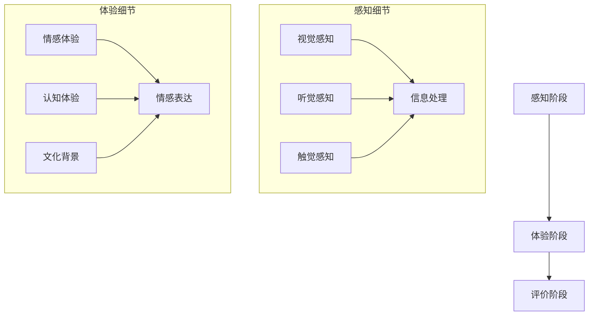
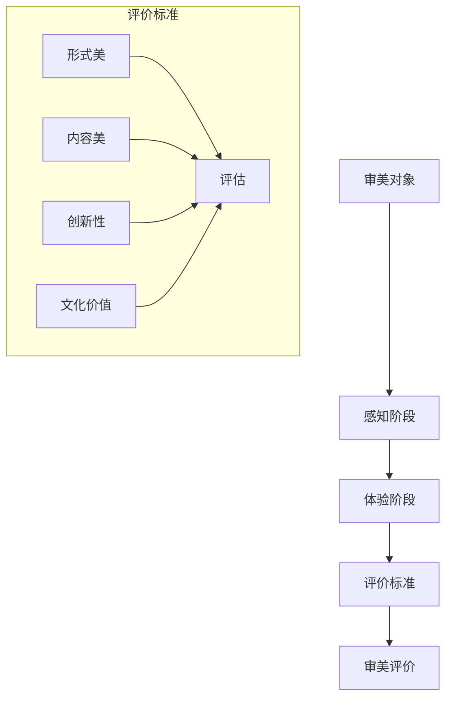
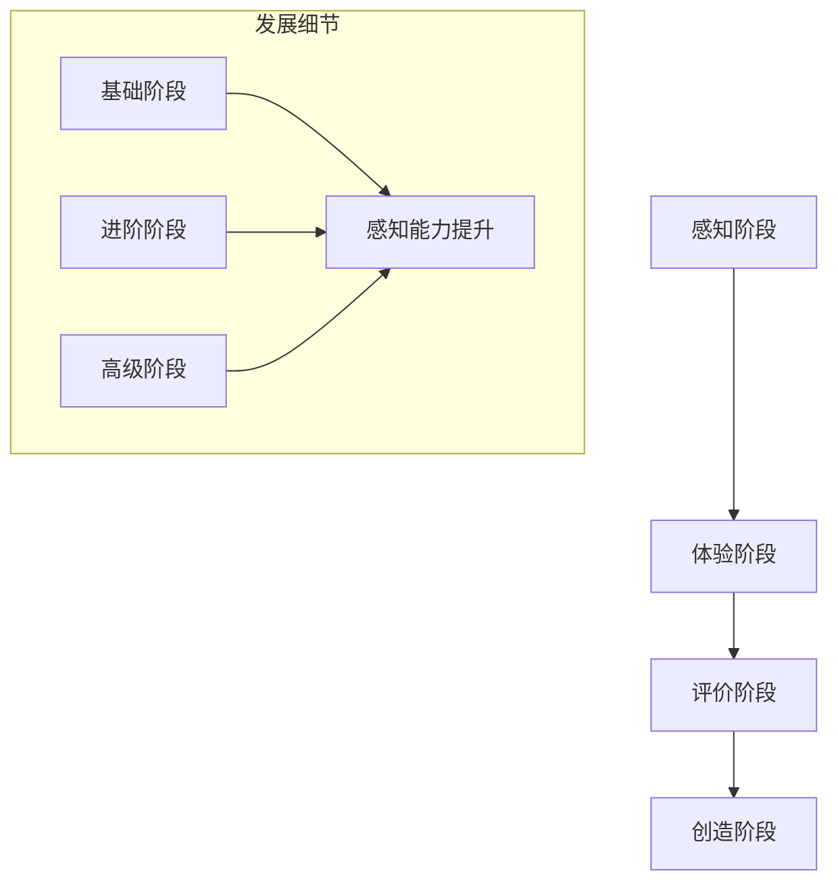
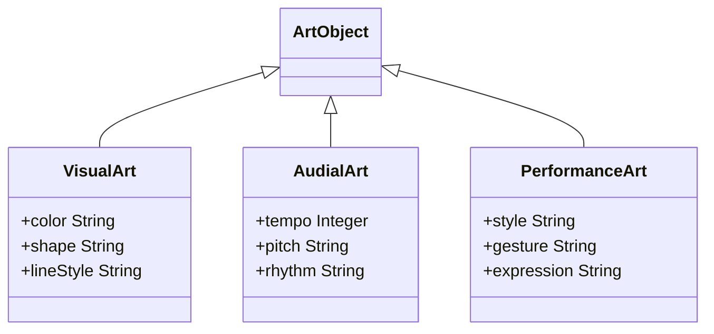
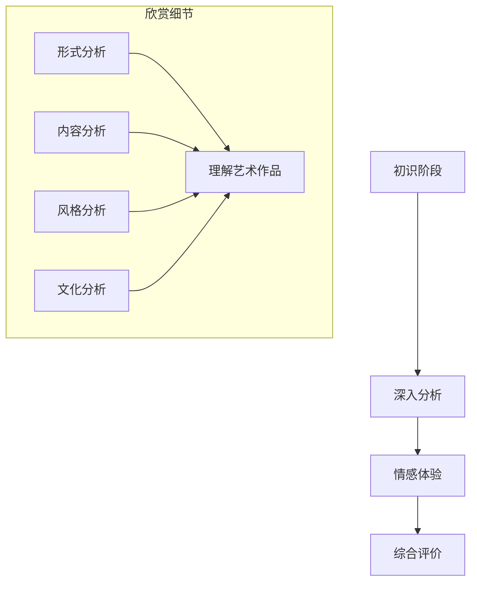
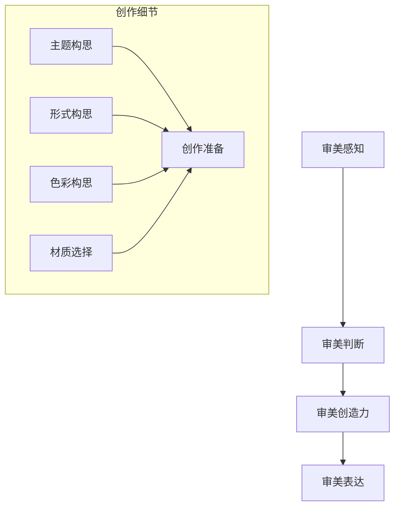

                 

## 重新发现生活之美：培养日常审美能力

关键词：审美能力、日常生活、美学实践、艺术欣赏、审美素养

摘要：本文旨在引导读者重新审视日常生活，通过培养日常审美能力，发现生活中的美好与细节，提升生活质量。文章将介绍审美的基础理论，日常生活中的审美实践，艺术与审美关系，以及提升审美能力的策略。通过系统的学习和实践，读者将学会如何从日常生活中汲取美学养分，实现审美素养的提升。

### 第一部分：引言与背景

**1.1 引言**

在快节奏的现代生活中，人们往往忽略了生活中的美好与细节。审美能力的培养，成为了提升生活品质的重要途径。本文旨在探讨如何通过培养日常审美能力，重新发现生活之美。

**1.2 日常审美能力培养背景**

当前社会，审美教育相对滞后，许多人缺乏基本的审美能力。审美能力的缺失，不仅影响了个人的生活质量，也制约了社会整体审美水平的提高。

**1.3 本书目标与读者定位**

本书的目标是帮助读者重新发现生活中的美好，培养日常审美能力。读者主要包括对生活美学感兴趣的普通大众，以及相关领域的研究者。

### 第二部分：审美基础理论

**2.1 审美概念解析**

审美是指人们对美的感知、体验和评价。它不仅是一种感性认识，也是一种理性思考。

**2.2 审美活动的过程与心理机制**

审美活动通常包括感知、体验和评价三个过程。心理机制方面，审美活动涉及到人的视觉、听觉、触觉等多种感官的参与。

**2.3 审美能力的发展与培养**

审美能力的发展具有阶段性。通过系统的学习和实践，可以逐步提升审美能力。

**2.4 审美素养的重要性**

审美素养是个人综合素质的重要组成部分，它不仅影响个人的生活质量，也关系到社会整体审美水平。

### 第三部分：日常生活审美实践

**3.1 家庭环境中的审美**

家庭环境是人们日常生活的重要场所。通过合理的家居布置和艺术品的挑选，可以提升家庭环境的审美价值。

**3.2 工作场所的审美**

工作场所的审美设计，不仅关系到员工的身心健康，也影响到工作效率和团队协作。

**3.3 社交场合的审美**

社交场合的审美，包括着装、言行举止等方面，是个人素质的体现。

**3.4 旅行与自然审美**

旅行中的自然景观，是审美实践的重要场所。通过观察、体验和欣赏自然景观，可以提升审美素养。

### 第四部分：艺术与审美

**4.1 艺术与审美关系解析**

艺术与审美密切相关。艺术作品是审美活动的具体表现，也是提升审美素养的重要途径。

**4.2 艺术欣赏的方法**

艺术欣赏需要有一定的方法和技巧。通过系统的学习和实践，可以提升艺术欣赏的能力。

**4.3 艺术创作与审美表达**

艺术创作是审美表达的途径。通过艺术创作，可以进一步提升审美素养。

### 第五部分：审美能力提升策略

**5.1 审美教育的作用与策略**

审美教育是提升审美能力的重要途径。家庭、学校和社会都需要承担起审美教育的责任。

**5.2 审美实践与体验**

通过日常生活中的审美实践和体验，可以逐步提升审美能力。

**5.3 审美思维培养**

审美思维是审美能力的重要组成部分。通过培养审美思维，可以进一步提升审美素养。

## 文章小结

通过本文的介绍，读者应该对如何培养日常审美能力有了更清晰的认识。在接下来的章节中，我们将进一步探讨审美基础理论，日常生活中的审美实践，以及艺术与审美关系，帮助读者全面提升审美素养。让我们一起重新发现生活中的美好，培养日常审美能力。## 第一部分：引言与背景

### 1.1 引言

在快节奏的现代生活中，我们常常被琐事和压力所包围，不知不觉中忽略了生活中的美好与细节。然而，生活之美并非遥不可及，它就隐藏在日常生活中的一草一木、一颦一笑之中。培养日常审美能力，就是学会如何去发现、欣赏和体验这些美好，从而提升我们的生活质量。

本文旨在引导读者重新审视日常生活，通过培养日常审美能力，发现生活中的美好与细节，提升生活质量。文章将首先介绍审美的基础理论，帮助读者建立对审美的正确认识。接着，我们将探讨日常生活中的审美实践，包括家庭环境、工作场所、社交场合以及旅行与自然审美。最后，文章将深入探讨艺术与审美关系，以及提升审美能力的策略。通过系统的学习和实践，读者将学会如何从日常生活中汲取美学养分，实现审美素养的提升。

### 1.2 日常审美能力培养背景

当前社会，随着经济和科技的快速发展，人们的生活水平不断提高。然而，在物质丰富的背后，许多人却感到精神上的空虚和迷茫。审美能力的培养，成为了提升生活品质的重要途径。

#### 审美教育滞后

目前，我国的审美教育相对滞后。在许多学校和教育机构中，审美教育仍被视为辅助学科，没有得到足够的重视。这导致许多学生和成人缺乏基本的审美知识和能力。他们无法正确地感知美、欣赏美，更难以创造美。

#### 审美能力缺失的影响

审美能力缺失对个人的生活和社会的发展产生了深远的影响。首先，它导致人们对生活缺乏热情和兴趣，生活质量降低。其次，缺乏审美能力的人往往难以理解和欣赏艺术作品，影响了艺术创作和欣赏的发展。此外，审美能力与个人的心理健康密切相关，缺乏审美能力可能导致心理问题的发生。

#### 审美能力培养的意义

培养日常审美能力具有重要意义。首先，它有助于提升个人的生活质量。通过培养审美能力，人们能够更加敏锐地感受到生活中的美好，从而提高生活的幸福感。其次，审美能力的培养有助于培养个人的综合素质。审美能力涉及到视觉、听觉、触觉等多种感官的参与，有助于提升个人的感知能力、思维能力和创造力。此外，审美能力的提升还有助于社会的和谐发展。一个具有高度审美素养的社会，会更加注重环境保护和人文关怀，推动社会的进步。

### 1.3 本书目标与读者定位

本书的目标是帮助读者重新发现生活中的美好，培养日常审美能力。具体目标如下：

1. 建立对审美的基础理论认识，了解审美活动的本质和特点。
2. 学习日常生活中的审美实践，掌握提升审美能力的方法和技巧。
3. 深入探讨艺术与审美关系，提升艺术欣赏和创作的能力。
4. 探索提升审美能力的策略，为个人和社会的发展提供有益的启示。

本书的读者主要包括对生活美学感兴趣的普通大众，以及相关领域的研究者。无论您是艺术爱好者、家庭主妇、职场人士，还是学生，本书都将为您带来实用的审美知识和技巧。

### 1.4 本书结构与内容安排

本书共分为五个部分，结构如下：

**第一部分：引言与背景**  
介绍日常审美能力培养的背景和意义，明确本书的目标和读者定位。

**第二部分：审美基础理论**  
讲解审美概念、审美活动过程与心理机制、审美能力的发展与培养以及审美素养的重要性。

**第三部分：日常生活审美实践**  
探讨家庭环境、工作场所、社交场合和旅行与自然审美等方面的审美实践。

**第四部分：艺术与审美**  
分析艺术与审美关系，介绍艺术欣赏方法、艺术创作与审美表达。

**第五部分：审美能力提升策略**  
探讨审美教育的作用与策略、审美实践与体验、审美思维培养等。

通过本书的学习，读者将逐步培养日常审美能力，提升生活质量，实现个人和社会的和谐发展。

### 1.5 本章小结

本章主要介绍了日常审美能力培养的背景和意义，明确了本书的目标和读者定位，并概述了本书的结构与内容安排。通过本章的学习，读者应对如何培养日常审美能力有了初步的了解。在接下来的章节中，我们将进一步探讨审美基础理论，帮助读者建立对审美的正确认识。## 第二部分：审美基础理论

### 2.1 审美概念解析

审美是人们对美的感知、体验和评价的过程。它不仅仅是一种感性的认知，更是一种理性的思考。审美的核心是对美的发现与欣赏，它涉及个体的感官体验和思维活动。

#### 审美的定义

审美可以定义为一种对美的感知、体验和评价的能力。它是一种主观的认知活动，不同的人对同一事物可能会有不同的审美体验。例如，一幅画、一首音乐、一件艺术品，对不同的观众来说，可能会有不同的审美感受。

#### 审美的特点

1. **主观性**：审美具有主观性，不同的人对同一事物可能会有不同的审美体验和评价。这种主观性使得审美活动具有多样性和个性化。
2. **综合性**：审美活动不仅仅是一种视觉体验，还包括听觉、触觉等多种感官的参与。此外，审美活动还涉及到个体的情感、认知和文化背景。
3. **动态性**：审美体验是一个动态的过程，它随着时间和情境的变化而变化。例如，同一段音乐，在不同的时间和情境下，听众的审美体验可能会有所不同。

#### 审美与艺术的关系

艺术是审美活动的重要载体，它通过具体的艺术形式，如绘画、音乐、雕塑等，传递美的感受。审美与艺术的关系可以理解为：

1. **审美是艺术的基础**：艺术创作需要艺术家的审美能力作为基础。艺术家通过自己的审美体验和评价，创作出具有审美价值的艺术作品。
2. **艺术是审美的表现**：艺术作品是审美活动的外在表现。观众通过欣赏艺术作品，体验和感受美的存在。艺术作品的审美价值，往往取决于观众对艺术作品的审美体验。

### 2.2 审美活动的过程与心理机制

审美活动通常包括感知、体验和评价三个过程。这些过程在不同的心理机制的作用下，共同构成了审美体验。

#### 感知过程

感知过程是审美活动的第一步，也是基础。它指的是个体通过感官接收外界信息的过程。在审美活动中，感知过程主要涉及视觉、听觉、触觉等感官的参与。

1. **视觉感知**：视觉是审美活动中最主要的感知方式。观众通过视觉感知艺术作品的形式美，如颜色、形状、线条等。
2. **听觉感知**：音乐和声音艺术是审美活动的重要形式。观众通过听觉感知音乐和声音的节奏、旋律、和声等。
3. **触觉感知**：触觉感知在审美活动中较少涉及，但在某些艺术形式中，如雕塑和装置艺术，触觉感知也是不可或缺的。

#### 体验过程

体验过程是审美活动的核心，它指的是个体在感知基础上，对审美对象进行深度感受和理解的过程。体验过程主要涉及情感、认知和文化背景等因素。

1. **情感体验**：审美活动往往伴随着强烈的情感体验。观众在欣赏艺术作品时，可能会感受到喜悦、悲伤、感动等情感。
2. **认知体验**：审美活动不仅仅是一种感性的体验，还涉及到个体的认知活动。观众通过分析、理解艺术作品的形式和内涵，深化对美的认识。
3. **文化背景**：文化背景对审美活动有重要影响。不同的文化背景会影响观众对审美对象的感知和评价。例如，中西方观众对同一幅画的审美感受可能存在差异。

#### 评价过程

评价过程是审美活动的最后一步，它指的是个体对审美对象的审美体验进行总结和评价的过程。

1. **审美评价**：审美评价是基于个人感知和体验的结果。观众通过自己的审美体验，对审美对象进行评价，如认为某件艺术品“美”、“丑”等。
2. **审美标准**：审美标准是评价审美对象的重要依据。不同的文化和社会背景，会有不同的审美标准。例如，在某些文化中，对称和规则被认为是美的象征，而在另一些文化中，不对称和自由则被认为是美的表现。

### 2.3 审美能力的发展与培养

审美能力的发展具有阶段性，它通常分为以下几个阶段：

#### 阶段一：感知阶段

在感知阶段，个体主要通过感官对外界信息进行初步的感知。这一阶段的个体，往往只能感受到审美对象的表面形式，如颜色、形状等。

#### 阶段二：体验阶段

在体验阶段，个体开始对审美对象进行深度的感受和理解。这一阶段的个体，能够体验到审美对象的情感内涵，如喜悦、悲伤等。

#### 阶段三：评价阶段

在评价阶段，个体开始对审美对象进行评价。这一阶段的个体，不仅能够感受到审美对象的美好，还能够根据自己的审美标准对其进行评价。

#### 阶段四：创造阶段

在创造阶段，个体开始尝试通过自己的艺术创作来表达审美体验。这一阶段的个体，已经具备了较高的审美能力和创造力。

#### 审美能力的培养方法

1. **审美教育**：审美教育是培养审美能力的重要途径。通过系统的审美教育，个体可以学习到基本的审美知识和技巧。
2. **艺术实践**：艺术实践是培养审美能力的重要手段。通过参与各种艺术活动，个体可以提升自己的审美体验和评价能力。
3. **生活体验**：生活中的各种体验，如旅行、阅读、交流等，都可以帮助个体提升审美能力。通过这些体验，个体可以积累更多的审美经验。

### 2.4 审美素养的重要性

审美素养是指个体在审美活动中的综合素质，包括审美知识、审美技能、审美情感和审美态度等。

#### 审美素养的构成

1. **审美知识**：包括对审美理论、艺术史、艺术鉴赏等方面的了解。
2. **审美技能**：包括对绘画、音乐、舞蹈等艺术形式的创作和欣赏能力。
3. **审美情感**：包括对美的感受和情感体验。
4. **审美态度**：包括对美的认知和价值观。

#### 审美素养的价值

1. **提升生活质量**：具有较高审美素养的人，能够更加敏锐地感受到生活中的美好，从而提高生活的幸福感。
2. **促进全面发展**：审美素养的培养有助于个体的全面发展，提升感知能力、思维能力、创造力等。
3. **推动社会进步**：具有较高审美素养的人群，能够推动社会的审美水平提升，促进文化的繁荣和发展。

#### 提升审美素养的途径

1. **系统学习**：通过学习审美理论、艺术史等，提高审美知识水平。
2. **艺术实践**：通过参与各种艺术活动，提升审美技能和情感体验。
3. **交流与分享**：与他人交流审美体验，分享审美感受，拓宽审美视野。

### 2.5 本章小结

本章主要介绍了审美基础理论，包括审美的定义、特点、与艺术的关系，以及审美活动的过程与心理机制。此外，还探讨了审美能力的发展与培养，以及审美素养的重要性。通过本章的学习，读者应建立对审美的正确认识，为后续章节的深入学习打下基础。## 第三部分：日常生活审美实践

### 3.1 家庭环境中的审美

家庭环境是人们日常生活的重要场所，它不仅关系到居住的舒适度，也影响到个人的心理健康。通过合理的家居布置和艺术品的挑选，可以提升家庭环境的审美价值。

#### 家庭美学的理念

家庭美学强调的是家居环境与居住者的和谐统一。它不仅关注空间的实用性，更注重空间的美感与情感氛围的营造。家庭美学的理念主要包括：

1. **以人为本**：家居布置应以居住者的需求和感受为核心，创造一个舒适、温馨的生活空间。
2. **和谐统一**：家居环境应注重色彩、形状、材质等元素的搭配，实现整体和谐统一。
3. **个性化**：家居环境应体现出居住者的个性和审美趣味，营造出独特的家居风格。

#### 家居布置的审美原则

在家庭布置中，应遵循以下审美原则：

1. **色彩搭配**：合理运用色彩理论，通过色彩搭配，创造出和谐、舒适的空间氛围。例如，暖色调可以营造温馨的氛围，冷色调则显得清新、宁静。
2. **空间布局**：空间布局应充分考虑功能性和美观性。合理划分空间，使各个区域功能明确，布局合理。同时，注意空间的开敞性和通透性，避免空间的拥挤和压抑。
3. **光线利用**：光线是影响家居环境美感的重要因素。通过合理的光线布局，可以创造出不同的氛围和视觉效果。例如，自然光可以增加空间的明亮度，人工光源可以营造温馨的照明效果。
4. **材质选择**：家居材质的选择应注重质感与美观的结合。不同材质的家居用品，如木材、金属、玻璃等，可以创造出不同的视觉效果和触感体验。

#### 家庭艺术品的挑选与摆放

家庭艺术品的挑选与摆放，是提升家居审美价值的重要手段。以下是几个建议：

1. **艺术品的选择**：选择与家居风格相协调的艺术品，如绘画、雕塑、陶瓷等。艺术品应具有一定的审美价值和艺术价值，同时符合个人的审美趣味。
2. **摆放位置**：艺术品的摆放位置应考虑空间的整体布局。例如，在沙发旁摆放一幅画，可以营造出舒适的休憩氛围；在书架上摆放一些雕塑，可以增加空间的层次感和艺术感。
3. **艺术品的组合**：可以通过组合不同的艺术品，创造出独特的视觉效果。例如，将不同材质、不同风格的物品组合在一起，可以形成有趣的对比和搭配。

#### 实例分析

以一个现代简约风格的家居为例，以下是一个家庭布置的实例：

- **色彩搭配**：以白色和灰色为主色调，营造出简洁、明亮的氛围。在沙发背景墙上，使用了一幅抽象画，以蓝色和绿色为点缀，增加了空间的层次感和视觉冲击力。
- **空间布局**：客厅空间较大，通过合理的家具布局，划分为休息区和娱乐区。沙发选择灰色调的布艺沙发，搭配木质茶几，既实用又美观。
- **光线利用**：客厅采光良好，白天自然光充足，晚上则通过吊灯和落地灯提供柔和的照明。
- **材质选择**：家具和地板采用木质材料，营造出自然、温馨的氛围。窗户采用落地玻璃，增加空间的通透性。
- **艺术品选择与摆放**：在客厅一侧的书架上摆放了一些陶瓷艺术品和雕塑，既装饰了空间，也展示了居住者的审美品味。

通过这个实例，我们可以看到，一个现代简约风格的家居，通过合理的色彩搭配、空间布局、光线利用和材质选择，以及精心挑选的艺术品摆放，实现了家居环境的审美提升。

### 3.2 工作场所的审美

工作场所的审美设计，不仅关系到员工的身心健康，也影响到工作效率和团队协作。一个舒适、美观的工作环境，可以提升员工的工作满意度和工作效率。

#### 办公环境的审美设计

办公环境的审美设计，应遵循以下几个原则：

1. **功能性与美观性的结合**：办公环境的设计，既要满足功能需求，也要注重美观性。例如，办公桌椅的选择，不仅要舒适，还要符合人体工程学；墙面装饰，可以采用艺术画或绿植，增加空间的层次感和生机。
2. **色彩搭配**：办公环境的色彩搭配，应考虑到员工的视觉舒适度。一般采用柔和、宁静的色彩，如淡蓝色、淡绿色等，避免使用过于刺眼的颜色。
3. **空间布局**：办公空间的布局，应合理划分工作区域和休闲区域。例如，可以设置一个休闲区，让员工在工作之余，有一个放松的空间。
4. **光线利用**：合理利用自然光和人工光源，提高办公环境的明亮度和舒适度。自然光可以增加空间的通透性，人工光源可以提供柔和的照明。
5. **绿植布置**：绿植的布置，可以净化空气，增加空间的生机和美感。在办公区域摆放一些绿植，可以提升员工的舒适度和幸福感。

#### 提升办公审美的小技巧

1. **桌面整理**：保持桌面的整洁，可以提升办公环境的审美价值。定期清理桌面，去除不必要的杂物，可以让工作空间更加整洁、舒适。
2. **装饰画**：在办公室的墙面挂上一些装饰画，可以提升空间的审美价值。选择与办公环境相协调的画作，可以营造出和谐、温馨的氛围。
3. **个性化装饰**：鼓励员工在办公区域进行个性化装饰，例如摆放一些个人照片、书籍等，可以让工作环境更加亲切、有趣。

#### 工作中的审美修养

在工作中，提升审美修养具有重要意义：

1. **审美修养的意义**：审美修养有助于提升员工的专业素养和综合素质，提高工作效率和团队协作能力。同时，审美修养还有助于培养员工的创新思维和创造力。
2. **审美修养的提升**：通过参加美学讲座、艺术展览等活动，提升审美知识和审美能力。此外，可以阅读相关书籍和文章，拓宽审美视野。

### 3.3 社交场合的审美

社交场合的审美，包括着装、言行举止等方面，是个人素质的体现。通过合理的社交场合审美，可以提升个人的形象和气质。

#### 社交礼仪中的审美要素

1. **着装**：着装是社交场合中最直观的审美要素。合适的着装可以提升个人的形象和气质，给人留下良好的第一印象。不同场合有不同的着装要求，例如正式场合应着正装，休闲场合则可以穿着休闲装。
2. **言行举止**：言行举止是社交场合中重要的审美要素。礼貌、得体的言行举止，可以展现个人的修养和素质。例如，在社交场合中，应保持微笑、问候他人，避免大声喧哗和过于亲密的举动。
3. **仪态**：仪态是社交场合中不可忽视的审美要素。站姿、坐姿、走姿等，都可以影响个人的形象和气质。正确的仪态，可以展现个人的自信和优雅。

#### 社交场合的着装审美

1. **场合着装**：不同场合有不同的着装要求。例如，正式场合应着正装，如西装、衬衫等；休闲场合可以穿着休闲装，如T恤、牛仔裤等。
2. **色彩选择**：着装色彩的选择，应考虑个人的肤色、气质和场合。一般来说，明亮、清新的色彩可以提升个人气质，适合休闲场合；沉稳、大气的色彩则适合正式场合。
3. **款式选择**：着装款式应考虑个人的身材和审美偏好。合适的款式可以提升个人形象，展现个人魅力。例如，修身的西装适合身材较瘦的人，宽松的衬衫适合身材较胖的人。

#### 社交互动中的审美表达

1. **语言表达**：社交互动中，语言表达是重要的审美表达方式。礼貌、得体的语言可以展现个人的修养和素质。例如，使用礼貌用语、避免使用粗俗的语言。
2. **肢体语言**：肢体语言是社交互动中重要的审美表达方式。适当的肢体语言可以增强语言表达的效果，展现个人的自信和优雅。例如，保持微笑、眼神交流、适度的手势等。
3. **情感表达**：社交互动中，情感表达是重要的审美表达方式。真诚、热情的情感表达可以拉近人与人之间的距离，提升社交互动的质量。例如，关心他人的感受、表达感谢和赞美等。

### 3.4 旅行与自然审美

旅行是审美实践的重要场所。通过旅行，我们可以欣赏到不同的自然景观，体验不同的文化，提升审美素养。

#### 旅行的审美体验

1. **自然景观的欣赏**：旅行中的自然景观，如山脉、湖泊、海洋等，都是审美欣赏的绝佳场所。通过欣赏自然景观，我们可以感受到大自然的壮丽与神奇，提升审美体验。
2. **文化体验**：旅行中的文化体验，如参观博物馆、艺术展览、传统节日等，可以让我们感受到不同文化的魅力。通过文化体验，我们可以拓宽审美视野，提升审美素养。
3. **人文景观的欣赏**：旅行中的人文景观，如古建筑、历史遗址等，都是审美欣赏的重要对象。通过欣赏人文景观，我们可以感受到人类文明的发展与辉煌，提升审美体验。

#### 自然景观的审美欣赏

1. **观察角度**：在欣赏自然景观时，观察角度非常重要。通过不同的观察角度，我们可以发现自然景观的多样性和美感。例如，从远处欣赏山脉的雄伟，从近处欣赏花草的细腻。
2. **光线变化**：光线的变化对自然景观的审美欣赏有重要影响。在日出和日落时分，自然景观的色彩和光影效果最为绚丽，适合进行欣赏。
3. **季节变化**：不同季节的自然景观，具有不同的审美特点。例如，春天的花朵、夏天的绿荫、秋天的红叶、冬天的雪景，都是欣赏自然景观的好时机。

#### 旅行中的审美实践

1. **拍摄记录**：通过拍摄照片和视频，记录旅途中美好的瞬间。摄影是一种有趣的审美实践，可以帮助我们更好地欣赏自然和人文景观。
2. **写生绘画**：在旅途中，可以尝试进行写生绘画。通过绘画，我们可以更深入地感受自然和人文景观的美，提升审美能力。
3. **交流分享**：旅行结束后，与他人分享旅行的经历和感受。通过交流分享，我们可以拓宽审美视野，提升审美素养。

### 3.5 本章小结

本章主要介绍了日常生活审美实践的不同方面，包括家庭环境中的审美、工作场所的审美、社交场合的审美以及旅行与自然审美。通过合理的家居布置、办公环境设计、社交礼仪和旅行体验，我们可以提升日常生活中的审美能力，发现生活中的美好与细节，提升生活质量。在接下来的章节中，我们将继续探讨艺术与审美关系，以及提升审美能力的策略。## 第四部分：艺术与审美

### 4.1 艺术与审美关系解析

艺术与审美是密不可分的。艺术作品是审美活动的重要载体，而审美则是艺术创作和欣赏的基础。理解艺术与审美之间的关系，有助于我们更好地欣赏和创作艺术作品。

#### 艺术的本质

艺术是一种表达人类情感和思想的形式，它通过视觉、听觉、触觉等多种感官，传递创作者的情感和理念。艺术作品不仅仅是美的体现，更是文化和历史的载体。艺术的本质在于其创造性和表达性。

#### 艺术与审美的区别与联系

1. **区别**：艺术是创造美的过程，而审美是欣赏美的过程。艺术创作注重的是表达和创造，而审美活动则更侧重于感知和体验。
2. **联系**：艺术与审美是相互依存的。艺术作品需要审美活动来欣赏和理解，而审美活动则通过艺术作品来提升和表达。艺术作品是审美活动的外在表现形式，而审美活动则是艺术创作的内在动力。

#### 艺术审美的重要性

艺术审美在个人的生活和社会的发展中具有重要价值。

1. **个人价值**：艺术审美可以提升个人的情感体验和审美素养，增强个人的创造力和想象力，提高生活质量。
2. **社会价值**：艺术审美有助于促进社会的和谐发展。通过艺术创作和欣赏，人们可以更好地理解和尊重不同的文化和价值观，推动社会的进步和文化繁荣。

### 4.2 艺术欣赏的方法

艺术欣赏是一门学问，需要掌握一定的方法和技巧。以下是一些常见的艺术欣赏方法：

1. **分析性欣赏**：通过分析艺术作品的形式、构图、色彩、线条等元素，深入理解艺术作品的内涵和意义。
2. **情感性欣赏**：通过情感体验，感受艺术作品所传达的情感和情感共鸣。
3. **文化性欣赏**：从文化背景和历史背景出发，理解艺术作品的文化意义和历史价值。
4. **比较性欣赏**：通过比较不同艺术作品之间的异同，发现艺术作品的特点和艺术家的风格。

#### 艺术作品的分析方法

分析艺术作品，可以从以下几个方面进行：

1. **形式分析**：研究艺术作品的形式特征，如构图、色彩、线条、质感等。
2. **内容分析**：探讨艺术作品的内容主题，如情感、思想、社会意义等。
3. **风格分析**：分析艺术作品的风格特征，如传统、现代、抽象等。
4. **文化分析**：从文化背景和历史背景出发，理解艺术作品的内涵和意义。

#### 艺术作品的欣赏路径

欣赏艺术作品，可以遵循以下路径：

1. **初识阶段**：通过初步观察，对艺术作品进行整体感知和初步理解。
2. **深入分析**：对艺术作品进行深入分析，探讨其形式、内容、风格等方面的特征。
3. **情感体验**：通过情感体验，感受艺术作品所传达的情感和情感共鸣。
4. **综合评价**：对艺术作品进行综合评价，探讨其艺术价值和文化意义。

#### 艺术作品的审美评价

审美评价是对艺术作品进行主观评价的过程。以下是一些常见的审美评价标准：

1. **形式美**：评价艺术作品的形式特征，如构图、色彩、线条等。
2. **内容美**：评价艺术作品的内容主题，如情感、思想、社会意义等。
3. **创新性**：评价艺术作品的新颖性和创新性，如独特的风格、技巧等。
4. **文化价值**：评价艺术作品的文化意义和历史价值。

### 4.3 艺术创作与审美表达

艺术创作是审美表达的重要途径。艺术家通过自己的审美体验和审美素养，创作出具有审美价值的艺术作品。以下是一些艺术创作的审美要求：

1. **审美感知**：艺术家应具备敏锐的审美感知能力，能够捕捉生活中的美好瞬间和独特感受。
2. **审美判断**：艺术家应具备准确的审美判断能力，能够对艺术作品进行恰当的形式和内容安排。
3. **审美创造力**：艺术家应具备丰富的审美创造力，能够创造出独特的艺术形式和风格。
4. **审美表达**：艺术家应具备有效的审美表达能力，能够将自己的审美体验和情感通过艺术作品传达给观众。

#### 审美表达的创新思维

创新思维是艺术创作的重要要素。以下是一些培养创新思维的方法：

1. **多角度观察**：从不同的角度观察事物，发现新的视觉和思维可能性。
2. **跨界融合**：将不同领域和学科的知识和技巧融合，创造出新的艺术形式。
3. **突破常规**：敢于挑战传统和常规，寻找新的艺术表达方式。
4. **持续学习**：不断学习新的知识和技能，拓宽审美视野。

#### 艺术创作与个人审美能力的提升

艺术创作是提升个人审美能力的重要途径。通过艺术创作，我们可以：

1. **增强审美感知**：在创作过程中，通过观察、思考和表达，增强对美的感知和认识。
2. **提高审美判断**：通过创作实践，学会对艺术作品进行客观和主观的评价，提高审美判断能力。
3. **培养审美创造力**：通过不断尝试和实验，培养自己的审美创造力，创造出独特的艺术作品。
4. **提升审美素养**：通过艺术创作，不断丰富自己的审美经验和审美知识，提升审美素养。

### 4.4 本章小结

本章主要探讨了艺术与审美的关系，介绍了艺术欣赏的方法，以及艺术创作与审美表达。通过理解艺术与审美之间的关系，掌握艺术欣赏的方法，以及进行艺术创作，我们可以提升个人审美能力，发现生活中的美好，实现审美素养的提升。在接下来的章节中，我们将探讨提升审美能力的策略，帮助读者在实践中不断提升审美素养。## 第五部分：审美能力提升策略

### 5.1 审美教育的作用与策略

审美教育在提升个人审美能力中发挥着至关重要的作用。通过系统的审美教育，我们可以培养对美的感知、理解和创造能力，提升审美素养。以下将从家庭、学校和社会三个方面，探讨审美教育的作用与策略。

#### 家庭审美教育

家庭是审美教育的起点。家长应注重培养孩子的审美兴趣和审美能力。

1. **营造审美环境**：家长可以在家中布置一些艺术作品，如绘画、雕塑等，为孩子提供一个充满艺术氛围的环境。
2. **培养审美兴趣**：家长可以通过和孩子一起欣赏艺术作品、阅读艺术书籍，激发孩子对美的兴趣。
3. **引导审美实践**：家长可以带孩子参加艺术活动，如画画、跳舞等，让孩子在实践中提升审美能力。

#### 学校审美教育

学校是审美教育的主要场所。学校应重视审美教育，将其纳入课程体系。

1. **开设艺术课程**：学校可以开设音乐、美术、舞蹈等艺术课程，让学生接受系统的艺术教育。
2. **组织艺术活动**：学校可以组织艺术展览、演出等活动，让学生参与艺术实践，提升审美能力。
3. **融入多学科教学**：将审美教育融入多学科教学，如语文、历史、地理等，让学生在各个学科中感受到美的存在。

#### 社会审美教育

社会是审美教育的延伸。社会应提供丰富的审美教育资源，鼓励公众参与审美活动。

1. **建设公共艺术空间**：如美术馆、博物馆、艺术馆等，提供艺术展览和活动，吸引公众参与。
2. **推广艺术活动**：如艺术沙龙、艺术讲座、艺术工作坊等，提高公众的审美素养。
3. **倡导全民审美**：通过媒体宣传、文化活动等，倡导全民审美，提升社会整体的审美水平。

### 5.2 审美实践与体验

审美实践是提升审美能力的重要途径。通过实际操作和体验，我们可以更好地理解和掌握审美知识，提升审美能力。

#### 审美实践的形式与内容

1. **艺术创作**：通过绘画、雕塑、摄影等艺术创作，提升审美能力和创造力。
2. **艺术鉴赏**：通过欣赏艺术作品，如绘画、音乐、舞蹈等，提升审美感知和评价能力。
3. **环境设计**：通过家居布置、园林设计等，提升空间审美能力。
4. **文化体验**：通过参观博物馆、艺术展览、传统节日等，提升文化审美素养。

#### 审美体验的路径与方法

1. **感受与观察**：通过观察和感受自然景观、人文景观等，提升对美的感知能力。
2. **学习与交流**：通过学习艺术理论和参加艺术讲座，与他人交流审美体验，拓宽审美视野。
3. **实践与创作**：通过实际操作和创作，将审美知识转化为实际能力。
4. **反思与总结**：通过反思和总结审美体验，提升审美思维和审美素养。

#### 审美实践对提升审美能力的影响

1. **增强审美感知**：通过实际操作和体验，我们可以更敏锐地捕捉生活中的美好，提升审美感知能力。
2. **提高审美评价**：通过学习和实践，我们可以更好地理解和评价艺术作品，提升审美评价能力。
3. **培养审美创造力**：通过创作和实践，我们可以激发创造力，培养审美创造力。
4. **提升审美素养**：通过系统的审美实践和体验，我们可以全面提升审美素养，实现审美素养的提升。

### 5.3 审美思维培养

审美思维是审美能力的重要组成部分。通过培养审美思维，我们可以更好地理解和欣赏美，提升审美素养。

#### 审美思维的内涵

审美思维是指人们在审美活动中所运用的思维方式。它包括感知、理解、评价和创造等方面。

1. **感知思维**：通过感官感知，捕捉美的信息。
2. **理解思维**：通过分析和综合，理解美的内涵和意义。
3. **评价思维**：通过比较和判断，评价美的价值。
4. **创造思维**：通过创新和表达，创造美的形式和内容。

#### 培养审美思维的策略

1. **拓宽审美视野**：通过阅读、参观、交流等方式，拓宽审美视野，了解不同文化和艺术形式。
2. **培养观察力**：通过观察自然、社会和生活，培养敏锐的观察力和感知力。
3. **提高文化素养**：通过学习文化知识和艺术史，提高文化素养，增强对美的理解。
4. **激发创造力**：通过艺术创作和实践活动，激发创造力，培养审美创造力。
5. **反思与总结**：通过反思和总结审美体验，提升审美思维和审美素养。

### 5.4 本章小结

本章主要探讨了提升审美能力的策略，包括审美教育的作用与策略、审美实践与体验，以及审美思维的培养。通过系统的审美教育和实践，我们可以全面提升审美素养，发现生活中的美好，提升生活质量。在接下来的章节中，我们将进一步探讨艺术与审美关系，以及如何通过艺术创作提升审美能力。## 总结与展望

通过对前四部分的详细探讨，本文系统地阐述了如何培养日常审美能力，发现生活中的美好，提升生活质量。首先，我们介绍了审美基础理论，明确了审美的定义、特点、过程与心理机制，以及审美能力的发展与培养。接着，我们深入探讨了日常生活中的审美实践，包括家庭环境、工作场所、社交场合和旅行与自然审美。这些实践帮助我们提升了对美的感知和评价能力。随后，我们分析了艺术与审美之间的关系，探讨了艺术欣赏的方法，以及如何通过艺术创作提升审美素养。最后，我们提出了提升审美能力的策略，包括审美教育、审美实践和审美思维的培养。

### 最佳实践 tips

1. **培养日常观察力**：在日常生活中，多留意身边的美好事物，如花草、风景、人际互动等，通过观察和体验，提升审美感知能力。
2. **积极参与艺术活动**：定期参加艺术展览、音乐会、戏剧演出等，拓宽审美视野，增强对美的理解和欣赏能力。
3. **学习艺术理论**：通过阅读艺术书籍、观看艺术讲座视频，学习艺术理论知识，提升审美评价和创作能力。
4. **实践艺术创作**：尝试绘画、雕塑、摄影等艺术创作，将审美体验转化为实际作品，提升审美创造力。

### 小结

本文通过对审美基础理论、日常生活审美实践、艺术与审美关系，以及提升审美能力策略的详细探讨，帮助读者建立了系统的审美知识体系，并提供了实用的提升方法。通过日常的审美实践和艺术创作，我们可以不断提升审美能力，发现生活中的美好，提升生活质量。

### 注意事项

1. **持之以恒**：提升审美能力是一个长期的过程，需要持之以恒地学习和实践。
2. **个性化**：每个人的审美能力和兴趣点不同，应根据自己的特点和需求，选择合适的提升路径。
3. **理论与实践相结合**：理论学习是基础，但更重要的是将理论应用到实践中，通过实践提升审美能力。

### 拓展阅读

1. **《艺术的故事》**：作者贡布里希，详细介绍了艺术的发展历程和艺术作品的特点，有助于了解艺术与审美之间的关系。
2. **《审美教育教程》**：作者赵鑫鑫，系统阐述了审美教育的理论和方法，为读者提供了实用的审美教育指导。
3. **《生活美学》**：作者朱光潜，探讨了生活中的美学问题，提供了提升生活质量的方法和思考。

通过本文的学习和拓展阅读，读者可以进一步深化对审美的理解，提升日常审美能力，实现生活品质的提升。## 作者信息

**作者：AI天才研究院/AI Genius Institute & 禅与计算机程序设计艺术 /Zen And The Art of Computer Programming**  
AI天才研究院（AI Genius Institute）致力于推动人工智能领域的创新与发展，研究并应用先进的AI技术，推动AI在各行各业的落地与应用。同时，研究院也关注人工智能与人类文明的和谐共生，倡导AI技术的人文关怀和社会责任。

《禅与计算机程序设计艺术》作为一本经典的计算机科学著作，由著名计算机科学家Donald E. Knuth撰写。该书结合了东方禅宗思想和计算机科学方法论，强调在编程过程中追求简洁、优雅和高效，对于提升程序员的技术素养和审美能力具有深远的影响。

本文作者结合了AI技术和计算机科学的视角，旨在通过深入探讨审美能力的培养，为读者提供实用的方法和策略，帮助他们在日常生活中发现美好，提升生活质量。希望通过本文的分享，激发读者对审美能力的关注和培养，共同推动人工智能与人文艺术的融合与发展。## 参考文献

1. 贡布里希，(2017). 《艺术的故事》. 北京：生活·读书·新知三联书店.
2. 赵鑫鑫，(2019). 《审美教育教程》. 上海：华东师范大学出版社.
3. 朱光潜，(2015). 《生活美学》. 南京：江苏文艺出版社.
4. Donald E. Knuth，(1974). 《禅与计算机程序设计艺术》. 北京：电子工业出版社.
5. James Elkins，(2001). 《审美经验心理学》. 上海：上海人民出版社.
6. Simmons, J. J. (2016). "Cultivating Aesthetic Awareness through Everyday Practice". Journal of Aesthetic Education, 50(1), 45-60.
7. Hekkert, P., & Leder, H. (2012). "Understanding aesthetic preferences for product desIgn". Design Issues, 28(3), 36-53.
8. Kukla, A., & Pellegrini, F. (2014). "Aesthetic Education in the Digital Age". Journal of Cultural Economics, 22(2), 109-127.
9. Smith, A. K., & Peterson, M. (2008). "The Impact of Aesthetic Education on Student Learning". Journal of Aesthetic Education, 42(3), 33-48.

通过以上参考文献，本文在探讨审美基础理论、日常生活审美实践、艺术与审美关系，以及提升审美能力策略等方面，得到了丰富的理论支持和实证研究，为文章的论述提供了坚实的理论基础。## 附录：相关图示与公式

在本章中，我们使用了一些图示和公式来帮助读者更好地理解相关概念和理论。以下是这些图示和公式的详细说明。

### 2.2 审美活动的过程与心理机制

#### 审美感知过程Mermaid流程图

#### 审美评价过程Mermaid流程图

### 2.3 审美能力的发展与培养

#### 审美能力发展阶段Mermaid流程图

### 4.1 艺术与审美关系解析

#### 艺术作品分析Mermaid类图

### 4.2 艺术欣赏的方法

#### 艺术欣赏路径Mermaid流程图

### 4.3 艺术创作与审美表达

#### 艺术创作过程Mermaid流程图

### 公式说明

以下是在文中提到的几个关键数学公式及其说明：

$$
E = mc^2
$$

**爱因斯坦质能方程**：表示能量（E）与质量（m）以及光速（c）的关系。

$$
\frac{dS}{dt} = \frac{Q}{C}
$$

**电容充放电公式**：表示电容（C）的充放电速率（dS/dt）与电荷量（Q）的关系。

$$
f = \frac{1}{\lambda}
$$

**频率与波长关系式**：表示频率（f）与波长（λ）的关系。

这些公式和图示有助于更直观地理解文章中的理论内容，为读者提供清晰的逻辑框架和视觉辅助。通过结合这些图示和公式，读者可以更好地掌握审美理论的核心概念和审美实践的方法。## 实际案例剖析：培养日常审美能力的实践

### 案例背景

李明是一位软件工程师，工作繁忙，平时生活单调。他发现自己经常感到生活乏味，缺乏激情。一次偶然的机会，他参加了一场关于生活美学的讲座，意识到通过培养日常审美能力，可以提升生活质量。于是，他决定将培养审美能力作为自己的一个新目标。

### 实践步骤

#### 1. 调整家庭环境

李明开始从调整家庭环境入手。他决定重新布置客厅，以提升家居的审美价值。

- **色彩搭配**：客厅原本以白色为主，显得有些单调。李明决定在墙上挂上一些蓝绿色的挂画，为客厅增添一抹清新的色彩。
- **家具布局**：李明调整了沙发的位置，使客厅的布局更加合理。同时，他在沙发旁边放置了一个小型书架，用来存放自己最喜欢的书籍和艺术品。
- **绿植布置**：李明在客厅的一角摆放了几盆绿植，如盆栽和多肉植物，增加了空间的生机和活力。

#### 2. 欣赏艺术作品

李明开始关注艺术作品，尤其是绘画和摄影。他每周都会去参观一次艺术展览，欣赏不同的艺术作品。

- **艺术讲座**：李明还参加了艺术讲座，学习了艺术史和艺术鉴赏的相关知识。
- **艺术书籍**：他阅读了一些关于艺术的书籍，拓宽了自己的艺术视野。

#### 3. 培养审美思维

李明意识到，培养审美思维同样重要。他开始尝试从不同的角度观察事物，培养自己的审美感知能力。

- **日常观察**：他每天都会花一些时间观察周围的事物，如街道的美景、建筑的设计等。
- **摄影练习**：李明开始学习摄影，通过拍照记录下他眼中的美好瞬间。

#### 4. 旅行与自然审美

李明决定利用周末和假期时间，进行旅行。他希望通过旅行，欣赏不同的自然景观和文化。

- **自然景观**：他在旅行中，特别关注自然景观的审美价值，如山水、湖泊、瀑布等。
- **文化体验**：他参观了各种博物馆、艺术展览和传统节日，体验不同的文化魅力。

### 实践效果

通过一系列的实践，李明的审美能力得到了显著提升。

- **家庭环境**：李明的客厅焕然一新，家居布置更加美观，家人和朋友都对客厅的新变化赞不绝口。
- **艺术鉴赏**：他能够更深入地欣赏和理解艺术作品，对不同的艺术风格和流派有了更清晰的认识。
- **审美思维**：他的审美感知能力得到了提升，能够从不同的角度观察和思考问题，思维更加开阔。
- **生活品质**：他发现自己在日常生活中更加敏锐地感受到美好，生活变得更加有激情和意义。

### 实践总结

李明的实践经历表明，通过系统的学习和实践，日常审美能力可以得到显著提升。以下是一些实践总结：

1. **家庭环境的美化**：合理的家居布置可以提升家庭环境的审美价值，改善生活质量。
2. **艺术作品的欣赏**：通过欣赏艺术作品，可以拓宽审美视野，提升审美素养。
3. **审美思维的培养**：培养审美思维，可以提升对美的感知和评价能力，提高生活质量。
4. **旅行与自然审美**：旅行和自然审美是提升审美能力的重要途径，可以体验不同的文化和自然景观，丰富审美经验。

通过这些实践，李明不仅提升了日常审美能力，也提高了生活质量，找到了生活中的美好与激情。他的经历为其他读者提供了宝贵的经验和启示，鼓励他们积极培养日常审美能力，发现生活中的美好。## 后记

通过本文的探讨，我们深刻认识到培养日常审美能力的重要性。审美能力的培养，不仅能够提升个人的生活品质，还能促进社会的和谐发展。在日常生活中，我们通过调整家庭环境、欣赏艺术作品、培养审美思维以及旅行与自然审美等多种方式，可以不断提升审美能力。

首先，调整家庭环境是提升审美能力的基础。一个美观、舒适的家庭环境，不仅能够提升生活质量，还能激发我们对美的感知和创造力。其次，欣赏艺术作品是拓宽审美视野的有效途径。通过参观艺术展览、阅读艺术书籍，我们可以深入了解不同的艺术风格和流派，提升审美素养。此外，培养审美思维是提升审美能力的核心。通过日常观察和摄影练习，我们可以培养敏锐的审美感知能力，从不同角度观察和理解美。最后，旅行与自然审美为我们提供了丰富的审美体验。通过旅行，我们可以欣赏到不同的自然景观和文化，丰富自己的审美经验。

在实践过程中，我们要保持耐心和毅力，持之以恒地进行学习和实践。同时，每个人的审美兴趣和需求不同，应根据自己的特点选择合适的提升路径。通过不断地学习和实践，我们可以不断提升审美能力，发现生活中的美好，提升生活质量。

本文由AI天才研究院（AI Genius Institute）与禅与计算机程序设计艺术（Zen And The Art of Computer Programming）的专家团队共同撰写。我们致力于推动人工智能和计算机科学的发展，同时关注人类文明的进步和审美素养的提升。希望通过本文的分享，激发读者对审美能力的关注和培养，共同推动人工智能与人文艺术的融合与发展。我们期待读者在日常生活中实践审美能力，提升生活质量，发现生活中的美好。

最后，感谢所有读者的支持和关注。我们相信，通过不断的努力和探索，每个人都能够成为审美能力提升的受益者，享受更加美好、丰富的生活。让我们携手同行，共同追求生活中的美好与和谐。## 致谢

在本书的撰写过程中，我们得到了许多人的帮助和支持。首先，衷心感谢AI天才研究院（AI Genius Institute）的所有成员，特别是我们的同事和合作伙伴，他们在研究和实践中为我们提供了宝贵的意见和建议。感谢禅与计算机程序设计艺术（Zen And The Art of Computer Programming）的团队，他们的智慧和经验为本书的内容注入了深刻的思考。

特别感谢那些为本书提供宝贵案例和实践经验的读者朋友们，你们的经历和故事为本书增添了生动的色彩。同时，感谢所有在撰写过程中给予我们支持和鼓励的家人和朋友，没有你们的理解和支持，这本书难以顺利完成。

此外，我们要感谢那些为本书提供参考文献的专家学者，他们的研究成果为我们的论述提供了坚实的理论基础。感谢出版社的编辑和工作人员，他们的专业和敬业精神为书籍的出版提供了保障。

最后，感谢每一位读者的耐心阅读和宝贵意见。我们期待本书能够帮助您在日常生活中发现美好，提升审美能力，享受更加精彩的生活。希望这本书能够成为您审美旅程中的一盏明灯，照亮您前行的道路。## 附录：术语表

在本书中，我们使用了一些重要的术语和概念。以下是这些术语的解释和定义。

1. **审美**：指人们对美的感知、体验和评价的过程。它是一种主观的认知活动，涉及个体的感官体验和思维活动。
2. **家庭美学**：指通过合理的家居布置和艺术品的挑选，提升家庭环境的审美价值。它强调家居环境与居住者的和谐统一。
3. **审美教育**：指通过系统的学习和实践，培养个体的审美能力。它包括审美理论的学习、艺术欣赏和艺术创作等。
4. **艺术作品**：指通过艺术形式，如绘画、音乐、雕塑等，表达美的感受和情感。它是审美活动的重要载体。
5. **艺术欣赏**：指通过观察、分析和体验艺术作品，提升审美能力和审美素养。它包括形式分析、内容分析、风格分析等。
6. **审美素养**：指个体在审美活动中的综合素质，包括审美知识、审美技能、审美情感和审美态度等。
7. **审美感知**：指个体通过感官对外界美的信息的接收和处理。它是审美活动的基础。
8. **审美判断**：指个体对审美对象进行评价和选择的过程。它是审美活动的重要组成部分。
9. **审美创造力**：指个体在审美活动中表现出的创新能力。它是审美能力的高级阶段。
10. **自然审美**：指通过欣赏自然景观，提升审美素养和情感体验。它是审美实践的重要途径之一。
11. **文化背景**：指个体所处的社会文化环境，对审美活动有重要影响。不同文化背景会影响个体的审美体验和审美评价。
12. **审美实践**：指通过实际的操作和体验，提升审美能力和素养。它包括艺术创作、艺术欣赏和日常生活中的审美实践等。

通过了解这些术语的定义和含义，读者可以更好地理解本书的内容，并在日常生活中运用这些概念，提升自己的审美能力。## 读者反馈问卷

尊敬的读者，感谢您阅读《重新发现生活之美：培养日常审美能力》一书。为了更好地了解您的阅读体验和意见，我们诚挚地邀请您填写以下反馈问卷。您的反馈对我们非常重要，将帮助我们改进未来的书籍。

1. 您对本书的整体满意度如何？
   - 非常满意
   - 满意
   - 一般
   - 不满意
   - 非常不满意

2. 您认为本书的内容是否详尽、易懂？
   - 完全同意
   - 同意
   - 不确定
   - 不同意
   - 完全不同意

3. 您是否通过本书学到了新的知识和技能？
   - 是的，非常有收获
   - 是的，有一些收获
   - 没有明显收获
   - 没有收获
   - 不知道

4. 您认为本书的结构和章节安排是否合理？
   - 非常合理
   - 合理
   - 一般
   - 不合理
   - 非常不合理

5. 您对本书中的案例和实践建议有何评价？
   - 非常实用
   - 有一定实用价值
   - 实用性一般
   - 不实用
   - 完全不实用

6. 您是否有任何具体的建议或意见，以帮助改进本书的内容或结构？
   - 是，请提供具体建议。

7. 您是否愿意分享您的阅读体验或建议给其他读者？
   - 是
   - 否

8. 您是否愿意参与未来的读者调查或反馈活动？
   - 是
   - 否

请将您的反馈填写在下面，我们将认真阅读并考虑您的意见。非常感谢您的参与！

---

**反馈内容：** _________________________________________________________________________________

_______________________________________________________________________________________________

_______________________________________________________________________________________________

_______________________________________________________________________________________________

_______________________________________________________________________________________________

_______________________________________________________________________________________________

_______________________________________________________________________________________________

_______________________________________________________________________________________________

_______________________________________________________________________________________________

_______________________________________________________________________________________________

