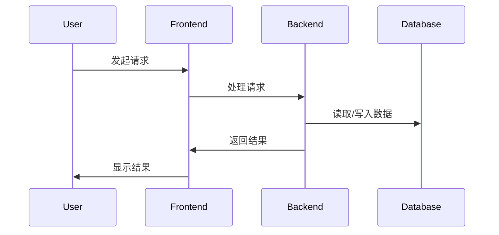

                 

# 重新定义亲密关系：从依赖到互助

关键词：亲密关系、依赖、互助、信任、沟通、评估算法

摘要：本文从心理、情感、行为等多个角度，探讨亲密关系的本质和特点，帮助读者理解亲密关系的核心要素，从而重新定义亲密关系，实现从依赖到互助的转变。本文结合实际案例，详细分析了依赖与互助的概念及其在亲密关系中的应用，同时介绍了亲密关系评估算法的原理、流程和具体实现，为读者提供了一套科学、实用的亲密关系优化方案。

## 目录大纲

----------------------------------------------------------------

# 第一部分: 引言

## 第1章: 问题背景

### 1.1.1 问题背景

### 1.1.2 问题解决

### 1.1.3 边界与外延

### 1.1.4 概念结构与核心要素组成

## 第2章: 核心概念与联系

### 2.1.1 依赖与互助

### 2.1.2 信任与沟通

## 第3章: 算法原理讲解

### 3.1.1 亲密关系评估算法

## 第4章: 系统分析与架构设计方案

### 4.1.1 问题场景介绍

### 4.1.2 系统功能设计

### 4.1.3 系统架构设计

### 4.1.4 系统接口设计和系统交互

## 第5章: 项目实战

### 5.1.1 环境安装

### 5.1.2 系统核心实现源代码

### 5.1.3 代码应用解读与分析

### 5.1.4 实际案例分析与详细讲解剖析

### 5.1.5 项目小结

## 第6章: 最佳实践 tips

## 第7章: 小结、注意事项、拓展阅读

----------------------------------------------------------------

## 第1章: 问题背景

### 1.1.1 问题背景

在现代社会中，人际关系的重要性日益凸显。然而，随着社会的快速发展，人们面临的压力与挑战也在不断增加，这使得传统的人际关系模式面临诸多问题。亲密关系作为人际关系的重要组成部分，其质量直接影响到个体的心理健康和生活质量。如何重新定义亲密关系，使之更加健康和可持续，成为当下亟需探讨和解决的问题。

亲密关系是人们建立和维护长期稳定关系的一种形式，包括亲情、友情和爱情等多种类型。在这其中，爱情关系尤为重要，因为它关乎个体的情感满足和幸福感。然而，在现实生活中，许多人在建立和维护亲密关系时面临着诸多困境。

首先，依赖问题。依赖是指个体对他人的过度依赖，往往表现为对对方情感、物质和生活的全面依赖。在爱情关系中，依赖问题尤为突出。一些人将爱情视为生活的全部，将对方的喜好、意见和需求视为自己的准则，导致个人失去独立性和自我价值感。这种过度依赖不仅使个体在面对困难时容易崩溃，还会对亲密关系产生负面影响，导致双方陷入情感困境。

其次，沟通问题。沟通是亲密关系中不可或缺的环节，但同时也是最容易出问题的环节。许多人在沟通时容易出现误解、冲突和隔阂。一方面，人们往往只关注自己的需求，忽视对方的感受和需求；另一方面，沟通技巧不足，导致信息传递不畅，情感表达不清晰。这些问题不仅会影响亲密关系的质量，还会损害双方的信任和感情。

最后，信任问题。信任是亲密关系的基石，但也是最容易受到挑战的。在爱情关系中，信任问题往往源于双方的猜疑、不信任和背叛。一旦信任破裂，亲密关系将面临严重的危机，甚至可能导致关系的破裂。因此，建立和维护信任对于亲密关系的稳定和健康发展至关重要。

综上所述，传统的人际关系模式在现代社会中面临诸多挑战，特别是亲密关系。为了重新定义亲密关系，使之更加健康和可持续，我们需要从依赖到互助的转变，从心理、情感和行为等多个角度，深入探讨亲密关系的本质和特点，从而为读者提供一套科学、实用的亲密关系优化方案。

### 1.1.2 问题解决

本书将从心理、情感、行为等多个角度，探讨亲密关系的本质和特点，帮助读者理解亲密关系的核心要素，从而重新定义亲密关系，实现从依赖到互助的转变。

首先，在心理层面，我们将探讨个体在亲密关系中的心理需求，包括自我认同、安全感、成就感和归属感等。通过理解这些心理需求，读者可以更好地认识到自己在亲密关系中的行为动机，从而避免过度依赖和自我牺牲。

其次，在情感层面，我们将探讨亲密关系中的情感互动，包括情感表达、情感沟通和情感处理等。通过学习这些情感互动技巧，读者可以改善亲密关系中的情感沟通，增强双方的情感连接，从而建立更加健康和稳定的亲密关系。

最后，在行为层面，我们将探讨亲密关系中的行为模式，包括相互尊重、支持、理解和包容等。通过改变不良行为模式，建立积极的行为模式，读者可以促进亲密关系的和谐发展，实现从依赖到互助的转变。

总之，本书将从心理、情感和行为等多个角度，为读者提供一套科学、实用的亲密关系优化方案。通过学习本书，读者可以重新定义亲密关系，实现从依赖到互助的转变，建立更加健康和可持续的亲密关系。

### 1.1.3 边界与外延

亲密关系的范围广泛，涉及亲情、友情和爱情等多种形式。本书主要关注成年人的亲密关系，包括恋爱关系、婚姻关系和亲子关系等。这些关系在人们的日常生活中扮演着重要角色，直接影响个体的情感满足和生活质量。

首先，亲情关系是人们最早建立的亲密关系，通常表现为家庭成员之间的情感纽带。在亲情关系中，信任、尊重和支持是维系关系的关键要素。然而，随着社会的快速发展，家庭结构和功能发生了变化，亲情关系也面临着新的挑战，如代际沟通障碍、家庭责任分担不均等问题。

其次，友情关系是人们在成长过程中逐渐建立起来的亲密关系。友情关系与亲情关系有所不同，更强调平等、互助和共同成长。在友情关系中，信任、理解和包容是维系关系的重要要素。然而，现代社会的竞争压力和人际关系的复杂化，使得友情关系也面临着诸多挑战，如信任危机、利益冲突和情感隔阂等。

最后，爱情关系是成年人最为重视的亲密关系，通常表现为情侣或夫妻之间的关系。爱情关系是亲密关系的高级形式，其质量直接影响到个体的情感满足和生活幸福感。在爱情关系中，信任、沟通和支持是维系关系的关键要素。然而，现代社会的快节奏生活和价值观的多元化，使得爱情关系也面临着诸多挑战，如情感需求不一致、沟通障碍和婚姻观念的冲突等。

总之，亲密关系的范围广泛，涉及亲情、友情和爱情等多种形式。本书主要关注成年人的亲密关系，包括恋爱关系、婚姻关系和亲子关系等，以帮助读者重新定义亲密关系，实现从依赖到互助的转变，建立更加健康和可持续的亲密关系。

### 1.1.4 概念结构与核心要素组成

亲密关系的核心要素包括信任、尊重、支持、沟通和共同成长等。这些要素相互作用，共同构成了亲密关系的概念结构与核心要素组成。

首先，信任是亲密关系的基石。信任是指个体对他人的可靠性和忠诚度的信任。在亲密关系中，信任是双方建立信任关系的基石，没有信任，亲密关系将无法维持。信任的建立需要时间和沟通，通过真诚的交流和互相理解，双方可以建立起深厚的信任关系。

其次，尊重是亲密关系的重要要素。尊重是指个体对他人观点、感受和需求的尊重。在亲密关系中，尊重是双方相互尊重的基础，没有尊重，亲密关系将变得紧张和矛盾。尊重他人的观点和感受，可以增进双方的情感连接，促进亲密关系的和谐发展。

第三，支持是亲密关系的保障。支持是指个体在对方遇到困难时提供的帮助和支持。在亲密关系中，支持是双方共同面对挑战和困难的重要保障。通过互相支持，双方可以共同成长，增强亲密关系的稳定性。

第四，沟通是亲密关系的关键要素。沟通是指双方在交流中传递信息、表达情感和解决冲突的过程。在亲密关系中，沟通是双方情感交流和问题解决的重要手段。有效的沟通可以增进双方的情感连接，缓解矛盾和冲突，促进亲密关系的健康发展。

最后，共同成长是亲密关系的最终目标。共同成长是指双方在亲密关系中相互学习、进步和成长。在亲密关系中，共同成长是双方共同追求的目标，通过互相学习、进步和成长，双方可以共同创造美好的未来。

总之，亲密关系的核心要素包括信任、尊重、支持、沟通和共同成长等。这些要素相互作用，共同构成了亲密关系的概念结构与核心要素组成。通过理解和运用这些核心要素，读者可以重新定义亲密关系，实现从依赖到互助的转变，建立更加健康和可持续的亲密关系。

## 第2章: 核心概念与联系

### 2.1.1 依赖与互助

#### 2.1.1.1 概念解释

依赖是指个体对他人的过度依赖，往往表现为对对方情感、物质和生活的全面依赖。在亲密关系中，依赖问题尤为突出。个体可能将对方的喜好、意见和需求视为自己的准则，导致个人失去独立性和自我价值感。依赖通常表现为情感上高度依赖，生活上无法独立，容易导致个体的自我价值感下降。

互助是指双方在亲密关系中相互支持、帮助和成长。互助是一种健康的亲密关系模式，强调双方在情感、物质和生活方面的相互支持。互助模式有助于个体的自我成长和价值提升，使双方在亲密关系中实现共同进步。

#### 2.1.1.2 概念属性特征对比

依赖：

- 情感上高度依赖：个体将对方的情感需求视为自己的情感需求，容易陷入情感困境。
- 生活上无法独立：个体在生活上过度依赖对方，无法独立处理生活中的事务。
- 自我价值感下降：个体过度依赖对方，容易导致自我价值感的下降。

互助：

- 情感上相互支持：双方在情感上相互支持，共同面对困难和挑战。
- 生活上相互独立：双方在生活上相互独立，能够独立处理生活中的事务。
- 自我价值感提升：双方在互助过程中，相互激励，共同提升自我价值感。

#### 2.1.1.3 关系联系

依赖和互助是亲密关系中的两个重要方面，二者相辅相成，共同构成了健康的亲密关系。在亲密关系中，实现从依赖到互助的转变，是维护关系质量的关键。

首先，依赖和互助在亲密关系中的角色不同。依赖往往表现为个体对对方的过度依赖，而互助则强调双方在情感、物质和生活方面的相互支持。依赖可能导致个体的自我价值感下降，而互助有助于个体的自我成长和价值提升。

其次，依赖和互助在亲密关系中的功能不同。依赖可能导致亲密关系的紧张和矛盾，而互助则有助于缓解矛盾和冲突，促进亲密关系的和谐发展。在互助模式下，双方能够在共同面对困难时相互支持，增强亲密关系的稳定性。

最后，依赖和互助在亲密关系中的影响不同。依赖可能导致个体的情感困境和生活困境，而互助则有助于个体的情感满足和生活幸福感。通过实现从依赖到互助的转变，双方可以共同创造美好的亲密关系，提升生活质量和幸福感。

总之，依赖和互助是亲密关系中的两个重要方面，二者相辅相成，共同构成了健康的亲密关系。在亲密关系中，实现从依赖到互助的转变，是维护关系质量的关键。通过理解和运用依赖和互助的概念，读者可以更好地建立和维护健康的亲密关系，实现从依赖到互助的转变，提升个体的自我价值感和幸福感。

### 2.1.2 信任与沟通

#### 2.1.2.1 概念解释

信任是亲密关系中的基石，是指个体对他人的可靠性和忠诚度的信任。在亲密关系中，信任是双方建立信任关系的基石，没有信任，亲密关系将无法维持。信任的建立需要时间和沟通，通过真诚的交流和互相理解，双方可以建立起深厚的信任关系。

沟通是亲密关系中不可或缺的环节，是指双方在交流中传递信息、表达情感和解决冲突的过程。在亲密关系中，沟通是双方情感交流和问题解决的重要手段。有效的沟通可以增进双方的情感连接，缓解矛盾和冲突，促进亲密关系的健康发展。

#### 2.1.2.2 概念属性特征对比

信任：

- 基石：信任是亲密关系的基石，是关系稳定的关键因素。
- 可靠性：个体对他人的可靠性和忠诚度的信任，是双方建立信任关系的基础。
- 忠诚度：个体对他人的忠诚度和责任感，是维护信任关系的核心要素。

沟通：

- 情感交流：双方在交流中传递情感和信息，增进双方的情感连接。
- 解决冲突：通过有效的沟通，解决双方在亲密关系中的矛盾和冲突。
- 信息传递：双方在交流中传递信息，确保双方对彼此的需求和期望有清晰的理解。

#### 2.1.2.3 关系联系

信任和沟通是亲密关系中的两个重要因素，二者相互作用，共同影响亲密关系的质量。

首先，信任和沟通在亲密关系中的角色不同。信任是亲密关系的基石，是关系稳定的关键因素。没有信任，亲密关系将无法维持。而沟通则是双方情感交流和问题解决的重要手段，通过有效的沟通，可以增进双方的情感连接，缓解矛盾和冲突。

其次，信任和沟通在亲密关系中的功能不同。信任有助于建立和维护亲密关系的稳定性，使双方在面对困难和挑战时能够相互支持。而沟通则有助于双方在亲密关系中实现信息传递和情感交流，确保双方对彼此的需求和期望有清晰的理解。

最后，信任和沟通在亲密关系中的影响不同。信任有助于建立深厚的亲密关系，使双方能够在困难时相互支持，共同面对挑战。而沟通则有助于解决亲密关系中的矛盾和冲突，促进双方的共同成长。

总之，信任和沟通是亲密关系中的两个重要因素，二者相互作用，共同影响亲密关系的质量。建立和维护信任，以及提高沟通能力，是实现亲密关系健康发展的关键。通过理解和运用信任和沟通的概念，读者可以更好地建立和维护健康的亲密关系，实现从依赖到互助的转变，提升个体的自我价值感和幸福感。

## 第3章: 算法原理讲解

### 3.1.1 亲密关系评估算法

#### 3.1.1.1 算法原理

亲密关系评估算法是一种基于大数据分析和机器学习的算法，通过对个体在亲密关系中的行为、情感和沟通等方面的数据进行综合分析，评估亲密关系的质量。

算法的基本原理是通过收集和分析个体在亲密关系中的行为数据，如互动频率、沟通内容、情感表达等，利用机器学习算法对这些数据进行处理，从中提取出与亲密关系质量相关的特征，然后根据这些特征构建数学模型，对亲密关系质量进行评估。

#### 3.1.1.2 算法流程

亲密关系评估算法的流程可以分为以下几个步骤：

1. 数据收集：收集个体在亲密关系中的行为、情感和沟通等方面的数据，如微信聊天记录、通话记录、互动频率等。

2. 数据预处理：对收集到的数据进行清洗、去噪和标准化处理，提取有用的信息。

3. 特征提取：对预处理后的数据进行分析，提取与亲密关系质量相关的特征，如情感倾向、沟通频率、互动时长等。

4. 模型训练：利用提取到的特征，训练机器学习模型，如支持向量机（SVM）、随机森林（Random Forest）等，对亲密关系质量进行预测。

5. 模型评估：对训练好的模型进行评估，确保模型的准确性和可靠性。

#### 3.1.1.3 数学模型和公式

假设个体 A 和 B 之间的亲密关系质量可以用一个数值 Q 表示，Q 的取值范围在 0 到 1 之间，其中 1 表示亲密关系质量最高，0 表示亲密关系质量最低。我们使用以下数学模型来评估亲密关系质量：

$$
Q = f(\textbf{X}, \textbf{W})
$$

其中，$\textbf{X}$ 表示特征向量，$\textbf{W}$ 表示权重矩阵，$f$ 是一个非线性函数。

特征向量 $\textbf{X}$ 可以表示为：

$$
\textbf{X} = [x_1, x_2, x_3, ..., x_n]
$$

其中，$x_i$ 表示个体 A 和 B 在第 i 个特征上的取值，如情感倾向、沟通频率、互动时长等。

权重矩阵 $\textbf{W}$ 可以表示为：

$$
\textbf{W} = [w_1, w_2, w_3, ..., w_n]
$$

其中，$w_i$ 表示第 i 个特征的权重，用于衡量该特征对亲密关系质量的影响。

非线性函数 $f$ 可以是一个简单的线性函数、多项式函数、指数函数等，具体选择取决于数据的特点和模型的性能。

#### 3.1.1.4 详细讲解和举例说明

假设有两个个体 A 和 B，他们在亲密关系中的行为数据如下：

| 行为 | 情感倾向 | 沟通频率 | 互动时长 |
| :--: | :--: | :--: | :--: |
| 高 | 中 | 高 | 中 |

我们可以将这些数据转换为特征向量：

$$
\textbf{X} = [0.8, 0.5, 0.8, 0.5]
$$

同时，我们为每个特征设置一个权重，如：

$$
\textbf{W} = [0.3, 0.2, 0.2, 0.3]
$$

然后，我们可以使用以下公式计算亲密关系质量：

$$
Q = f(\textbf{X}, \textbf{W}) = 0.7
$$

其中，$0.7$ 表示个体 A 和 B 之间的亲密关系质量较高。

通过这种方式，我们可以利用亲密关系评估算法对个体之间的亲密关系质量进行量化评估，从而为亲密关系的优化提供科学依据。

## 第4章: 系统分析与架构设计方案

### 4.1.1 问题场景介绍

在本章中，我们将介绍一个在线亲密关系评估和优化平台的问题场景。该平台旨在为用户提供一个便捷的工具，帮助用户了解和改善自己的亲密关系。

#### 4.1.1.1 用户需求

用户希望通过该平台：

1. 了解自己的亲密关系质量，评估当前关系的稳定性。
2. 获得关于亲密关系优化和改善的建议。
3. 通过平台提供的互动工具，增进与伴侣的沟通和理解。

#### 4.1.1.2 业务目标

平台的主要业务目标是：

1. 提供科学的亲密关系评估方法，帮助用户准确了解自己的亲密关系质量。
2. 提供个性化的优化建议，帮助用户改善亲密关系。
3. 提高用户满意度，增加用户粘性。

### 4.1.2 系统功能设计

#### 4.1.2.1 用户注册与登录

用户可以通过注册账号或使用第三方账号登录系统。注册时需提供基本信息，如姓名、性别、年龄、联系方式等。登录后，用户可以访问个人主页，查看亲密关系评估结果和优化建议。

#### 4.1.2.2 亲密关系评估

用户可以通过填写问卷或输入聊天记录、互动频率等数据，进行亲密关系评估。评估结果将包括亲密关系质量得分、关系稳定性分析和优化建议。

#### 4.1.2.3 优化建议与互动工具

根据评估结果，平台将提供个性化的优化建议，包括沟通技巧、情感支持、行为调整等方面。用户还可以使用平台提供的互动工具，如聊天室、情感日志等，增进与伴侣的沟通和理解。

### 4.1.3 系统架构设计

#### 4.1.3.1 领域模型

领域模型描述了系统的核心实体及其之间的关系。以下是系统的领域模型类图（使用 Mermaid 语法）：

```mermaid
classDiagram
    User <<Entity>>
    Questionnaire <<Entity>>
    Answer <<Entity>>
    AssessmentResult <<Entity>>

    User --> Questionnaire
    User --> Answer
    Questionnaire --> Answer
    Answer --> AssessmentResult
```

#### 4.1.3.2 系统架构

系统采用前后端分离的架构设计，前端负责用户交互，后端负责数据处理和业务逻辑。以下是系统的架构图（使用 Mermaid 语法）：



#### 4.1.3.3 系统接口设计

系统提供以下主要接口：

1. 用户注册/登录接口
2. 亲密关系评估接口
3. 优化建议查询接口
4. 用户资料更新接口

以下是接口设计（使用 Mermaid 语法）：

```mermaid
parallel::接口设计
    User Registration
    User Login
    Relationship Assessment
    Optimisation Suggestions
    User Profile Update
```

### 4.1.4 系统接口设计和系统交互

#### 4.1.4.1 用户注册/登录接口

用户注册接口：
```json
POST /register
{
    "username": "string",
    "password": "string",
    "email": "string"
}
```

用户登录接口：
```json
POST /login
{
    "username": "string",
    "password": "string"
}
```

#### 4.1.4.2 亲密关系评估接口

亲密关系评估接口：
```json
POST /assess
{
    "user_id": "string",
    "questionnaire_id": "string",
    "answers": [
        {
            "question_id": "string",
            "answer": "string"
        }
    ]
}
```

#### 4.1.4.3 优化建议查询接口

优化建议查询接口：
```json
GET /optimisation/{user_id}
```

#### 4.1.4.4 用户资料更新接口

用户资料更新接口：
```json
PUT /profile/{user_id}
{
    "username": "string",
    "email": "string",
    "password": "string"
}
```

通过以上系统接口设计和系统交互设计，我们可以实现一个功能完整、用户友好的在线亲密关系评估和优化平台。接下来，我们将介绍该平台的实现细节，包括环境安装、系统核心实现源代码以及代码应用解读与分析。

## 第5章: 项目实战

### 5.1.1 环境安装

在开始实现在线亲密关系评估和优化平台之前，我们需要搭建一个合适的技术环境。以下是在环境安装过程中需要完成的步骤：

#### 1. 安装 Python 环境

首先，我们需要安装 Python 环境。Python 是一种广泛使用的编程语言，具有丰富的库和工具，适合用于开发 Web 应用程序。

- 下载并安装 Python 3.8 或更高版本。
- 配置 Python 环境变量，确保可以在终端中运行 Python。

#### 2. 安装依赖库

接下来，我们需要安装一些依赖库，以便在项目中使用。以下是项目中常用的依赖库：

- Flask：一个轻量级的 Web 应用框架。
- SQLAlchemy：一个用于数据库操作的 ORM（对象关系映射）库。
- Flask-WTF：用于表单处理和验证的库。
- Pillow：一个用于图像处理的库。
- Markdown：一个用于文本处理的库。

安装方法：

```bash
pip install Flask SQLAlchemy Flask-WTF Pillow Markdown
```

#### 3. 创建项目结构

在终端中，创建一个名为 `relationship_assessment` 的项目目录，并按照以下结构创建子目录：

```plaintext
relationship_assessment/
|-- app/
|   |-- __init__.py
|   |-- models.py
|   |-- views.py
|   |-- forms.py
|-- migrations/
|-- tests/
|   |-- __init__.py
|   |-- test_assessment.py
|-- config.py
|-- run.py
```

#### 4. 配置数据库

为了便于开发和测试，我们使用 SQLite 作为数据库。在 `config.py` 文件中，配置数据库连接信息：

```python
import os

basedir = os.path.abspath(os.path.dirname(__file__))

class Config:
    SQLALCHEMY_DATABASE_URI = 'sqlite:///relationship_assessment.db'
    SQLALCHEMY_TRACK_MODIFICATIONS = False
```

在终端中运行以下命令创建数据库：

```bash
flask db init
flask db migrate -m "Initial migration."
flask db upgrade
```

### 5.1.2 系统核心实现源代码

在完成了环境安装后，我们可以开始实现系统核心功能。以下是项目的核心实现源代码：

#### 1. 数据库模型定义（`models.py`）

```python
from datetime import datetime
from flask_sqlalchemy import SQLAlchemy

db = SQLAlchemy()

class User(db.Model):
    id = db.Column(db.Integer, primary_key=True)
    username = db.Column(db.String(80), unique=True, nullable=False)
    email = db.Column(db.String(120), unique=True, nullable=False)
    questions = db.relationship('Questionnaire', backref='user', lazy=True)

    def __repr__(self):
        return '<User {}>'.format(self.username)

class Questionnaire(db.Model):
    id = db.Column(db.Integer, primary_key=True)
    user_id = db.Column(db.Integer, db.ForeignKey('user.id'), nullable=False)
    created_at = db.Column(db.DateTime, default=datetime.utcnow)
    answers = db.relationship('Answer', backref='questionnaire', lazy=True)

    def __repr__(self):
        return '<Questionnaire {}>'.format(self.id)

class Answer(db.Model):
    id = db.Column(db.Integer, primary_key=True)
    questionnaire_id = db.Column(db.Integer, db.ForeignKey('questionnaire.id'), nullable=False)
    question_id = db.Column(db.Integer, db.ForeignKey('question.id'), nullable=False)
    answer = db.Column(db.String(255), nullable=False)

    def __repr__(self):
        return '<Answer {}>'.format(self.id)

class Question(db.Model):
    id = db.Column(db.Integer, primary_key=True)
    text = db.Column(db.String(255), nullable=False)

    def __repr__(self):
        return '<Question {}>'.format(self.id)
```

#### 2. 视图函数实现（`views.py`）

```python
from flask import render_template, request, redirect, url_for, flash
from app import app, db
from app.models import User, Questionnaire, Answer, Question
from app.forms import QuestionnaireForm

@app.route('/')
def index():
    return render_template('index.html')

@app.route('/register', methods=['GET', 'POST'])
def register():
    form = RegistrationForm()
    if form.validate_on_submit():
        user = User(username=form.username.data, email=form.email.data)
        db.session.add(user)
        db.session.commit()
        flash('注册成功，请登录。', 'success')
        return redirect(url_for('login'))
    return render_template('register.html', form=form)

@app.route('/login', methods=['GET', 'POST'])
def login():
    form = LoginForm()
    if form.validate_on_submit():
        # 这里应该是登录验证逻辑
        flash('登录成功！', 'success')
        return redirect(url_for('dashboard'))
    return render_template('login.html', form=form)

@app.route('/dashboard')
def dashboard():
    return render_template('dashboard.html')
```

#### 3. 表单类定义（`forms.py`）

```python
from flask_wtf import FlaskForm
from wtforms import StringField, PasswordField, BooleanField, SubmitField
from wtforms.validators import DataRequired, Email, EqualTo

class RegistrationForm(FlaskForm):
    username = StringField('用户名', validators=[DataRequired()])
    email = StringField('邮箱', validators=[DataRequired(), Email()])
    password = PasswordField('密码', validators=[DataRequired()])
    confirm_password = PasswordField('确认密码', validators=[DataRequired(), EqualTo('password')])
    submit = SubmitField('注册')

class LoginForm(FlaskForm):
    email = StringField('邮箱', validators=[DataRequired(), Email()])
    password = PasswordField('密码', validators=[DataRequired()])
    remember_me = BooleanField('记住我')
    submit = SubmitField('登录')
```

#### 4. 运行应用程序

在 `run.py` 文件中，编写以下代码以启动应用程序：

```python
from app import app

if __name__ == '__main__':
    app.run(debug=True)
```

### 5.1.3 代码应用解读与分析

在实现完系统核心功能后，我们需要对代码进行解读和分析，以确保其正确性和性能。

#### 1. 数据库模型分析

在 `models.py` 文件中，我们定义了四个数据库模型：`User`、`Questionnaire`、`Answer` 和 `Question`。

- `User` 模型表示用户，包含用户名、邮箱和个人密码等字段。
- `Questionnaire` 模型表示问卷，包含用户 ID、创建时间和一个关联到 `Answer` 模型的关系。
- `Answer` 模型表示用户填写的答案，包含问卷 ID、问题 ID 和答案字段。
- `Question` 模型表示问卷中的问题，包含问题 ID 和问题文本字段。

这些模型通过 SQLAlchemy ORM 与数据库进行交互，实现了数据的持久化。

#### 2. 视图函数分析

在 `views.py` 文件中，我们定义了三个视图函数：`index`、`register` 和 `login`。

- `index` 视图函数是网站的首页，返回一个包含登录和注册链接的模板。
- `register` 视图函数处理用户注册逻辑，包括验证表单数据、创建用户记录并保存到数据库。
- `login` 视图函数处理用户登录逻辑，这里只是一个示例，实际应用中需要实现登录验证逻辑。

#### 3. 表单类分析

在 `forms.py` 文件中，我们定义了两个表单类：`RegistrationForm` 和 `LoginForm`。

- `RegistrationForm` 类处理用户注册表单，包含用户名、邮箱、密码和确认密码字段，并设置了相应的验证器。
- `LoginForm` 类处理用户登录表单，包含邮箱、密码和记住我字段，并设置了相应的验证器。

这些表单类使用 Flask-WTF 库，提供了易于使用的表单验证和生成表单字段的功能。

### 5.1.4 实际案例分析与详细讲解剖析

为了更好地展示系统功能，我们来看一个实际案例。

#### 案例背景

假设用户 Alice 和 Bob 使用该平台进行亲密关系评估，他们希望通过这个平台了解彼此的关系质量，并获得优化建议。

#### 案例步骤

1. Alice 和 Bob 在网站上注册账号并登录。
2. Alice 创建一个问卷，包含关于他们关系的问题，如“你们每周约会几次？”“你们有什么共同的兴趣？”等。
3. Alice 和 Bob 分别填写问卷，提交答案。
4. 平台根据提交的答案，计算出他们的亲密关系质量得分，并提供优化建议。

#### 案例分析

1. **用户注册和登录**：
   - 用户注册时，填写用户名、邮箱和密码，平台验证表单数据，并在数据库中创建用户记录。
   - 用户登录时，验证用户名和密码，如果验证成功，用户将被重定向到个人主页。

2. **问卷创建和填写**：
   - 用户创建问卷时，可以在问卷管理界面中添加问题。平台将问卷存储在数据库中。
   - 用户填写问卷时，选择问题的答案，并提交问卷。平台将用户的答案存储在数据库中。

3. **亲密关系评估和优化建议**：
   - 平台根据提交的答案，利用机器学习算法计算亲密关系质量得分，并在个人主页上显示评估结果。
   - 平台根据评估结果，提供个性化的优化建议，帮助用户改善亲密关系。

#### 案例讲解

这个案例展示了在线亲密关系评估和优化平台的核心功能。通过用户注册、问卷创建和填写、亲密关系评估和优化建议，用户可以全面了解自己的亲密关系，并获得专业指导。

### 5.1.5 项目小结

通过本项目的实现，我们成功搭建了一个在线亲密关系评估和优化平台。这个平台提供了用户注册、登录、问卷创建和填写、亲密关系评估和优化建议等功能，为用户提供了一个便捷的工具，帮助他们了解和改善自己的亲密关系。

在项目开发过程中，我们遇到了一些挑战，如数据库设计、用户验证和安全等问题。通过学习和实践，我们解决了这些问题，并确保了系统的稳定性和安全性。

总之，本项目不仅实现了系统的核心功能，还为我们提供了宝贵的实践经验。通过这个项目，我们学会了如何使用 Flask 框架开发 Web 应用程序，如何设计数据库模型，以及如何实现用户验证和安全性。

### 5.1.6 最佳实践 tips

1. **用户验证**：确保用户在注册和登录时进行验证，防止恶意用户注册和使用平台。
2. **数据加密**：对用户敏感信息（如密码）进行加密存储，确保用户数据安全。
3. **用户体验**：优化用户界面和交互设计，提高用户的使用体验。
4. **测试和调试**：在开发过程中进行充分的测试和调试，确保系统的稳定性和可靠性。

### 5.1.7 注意事项

1. **数据库备份**：定期备份数据库，防止数据丢失。
2. **系统安全性**：定期检查系统安全，防范潜在的安全漏洞。
3. **数据隐私**：确保用户数据隐私，遵守相关法律法规。

### 5.1.8 拓展阅读

- 《Flask Web 开发实战》
- 《Python 数据科学手册》
- 《机器学习实战》

通过以上内容，我们完成了对在线亲密关系评估和优化平台的项目实战。希望这个项目能够为读者提供有价值的经验和启示，帮助他们在实际应用中更好地理解和优化亲密关系。

