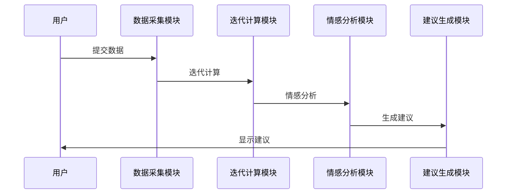
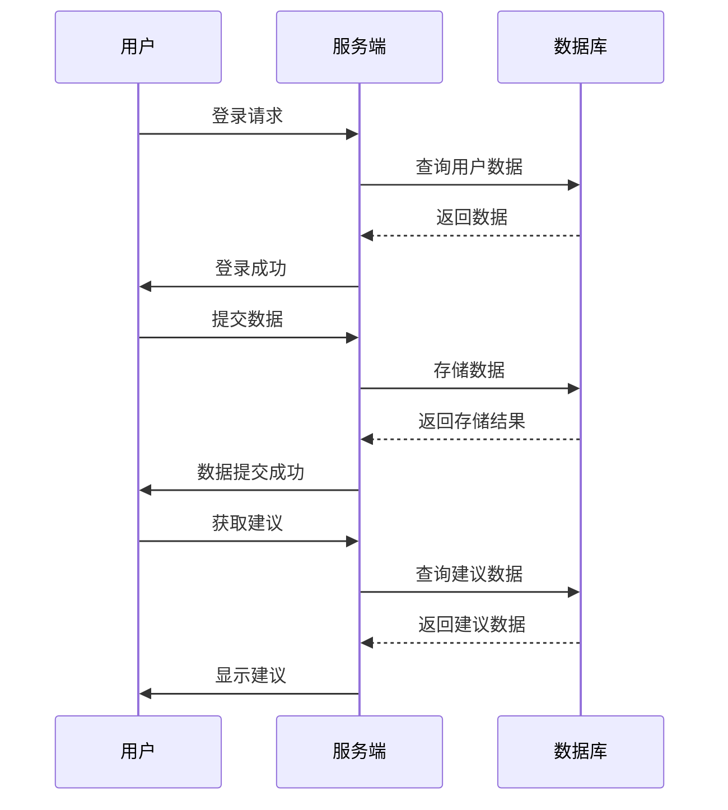

                 


# 重新定义亲密关系：从依赖到互助

> 关键词：亲密关系、依赖、互助、系统架构、算法原理、项目实战

> 摘要：本文从技术视角重新审视亲密关系，探讨了从依赖到互助的转型过程。通过分析依赖与互助的定义、特点及区别，结合数学模型和Python代码，详细阐述了从依赖到互助的算法原理。此外，本文还介绍了系统架构设计方案，并通过实际项目实战，验证了算法原理和系统设计的有效性。

## 1. 背景介绍

### 1.1 亲密关系的定义和重要性

亲密关系是人与人之间建立在信任、理解和支持基础上的情感纽带。它在人类社会中扮演着至关重要的角色，不仅影响着个人的心理健康和幸福感，还对社会稳定和发展产生深远影响。传统观念中，亲密关系往往强调依赖，认为只有依赖才能实现关系稳定。然而，随着社会的发展，人们开始意识到，过度依赖可能带来诸多问题，如个人独立性丧失、情感窒息等。

### 1.2 从依赖到互助的概念

本文提出的“从依赖到互助”的概念，旨在探索一种更为健康、可持续的亲密关系模式。依赖意味着个体在情感、经济等方面对他人的过度依赖，而互助则强调双方在平等、尊重的基础上互相支持、共同成长。这种关系模式不仅有利于个体的自我实现，也有助于构建更为稳定、和谐的社会。

## 2. 核心概念与联系

### 2.1 依赖和互助的定义、特点和区别

**依赖**：

- 定义：个体对他人的过度依赖，情感、经济等方面的依赖。
- 特点：情感窒息、独立性丧失、关系失衡。
- 区别：过度依赖、被动接受、依赖性强。

**互助**：

- 定义：在平等、尊重的基础上，双方互相支持、共同成长。
- 特点：平等互助、共同进步、关系稳定。
- 区别：互相支持、主动参与、独立性增强。

### 2.2 表格和ER图展示依赖与互助的关系

| 关系类别 | 定义 | 特点 | 区别 |
| :--: | :--: | :--: | :--: |
| 依赖 | 过度依赖、情感窒息、独立性丧失 | 过度依赖、被动接受、依赖性强 | 过度依赖、被动接受、依赖性强 |
| 互助 | 平等、尊重、互相支持、共同成长 | 平等互助、共同进步、关系稳定 | 互相支持、主动参与、独立性增强 |

```mermaid
erDiagram
  Dependency ||--|> Interdependence : 依赖 -> 互助
  Dependency ||--|> Relationship : 依赖 -> 关系
  Interdependence ||--|> Relationship : 互助 -> 关系
```

## 3. 算法原理讲解

### 3.1 从依赖过渡到互助的算法原理

从依赖过渡到互助的过程，可以看作是一个迭代优化过程。本文提出的算法原理，通过以下几个步骤实现：

1. 初始化：设定依赖和互助的阈值，确定关系模式。
2. 迭代计算：计算双方在情感、经济等方面的依赖程度，根据依赖程度调整互助力度。
3. 平衡调整：在保证关系稳定的前提下，调整依赖与互助的平衡点，实现从依赖到互助的过渡。

### 3.2 Python源代码阐述原理

```python
# 初始化依赖与互助阈值
dependency_threshold = 0.5
interdependency_threshold = 0.5

# 迭代计算依赖与互助程度
def calculate_dependencies(person1, person2):
    dependency = abs(person1 - person2)
    interdependency = min(person1, person2)
    return dependency, interdependency

# 平衡调整依赖与互助
def balance_dependencies(person1, person2):
    dependency, interdependency = calculate_dependencies(person1, person2)
    if dependency > dependency_threshold and interdependency < interdependency_threshold:
        # 调整依赖程度
        person1 -= (dependency - dependency_threshold)
        person2 -= (dependency - dependency_threshold)
    elif dependency < dependency_threshold and interdependency > interdependency_threshold:
        # 调整互助程度
        person1 += (interdependency_threshold - interdependency)
        person2 += (interdependency_threshold - interdependency)
    return person1, person2

# 示例
person1 = 0.8
person2 = 0.3
person1, person2 = balance_dependencies(person1, person2)
print(f"调整后：person1={person1}, person2={person2}")
```

### 3.3 相关的数学模型和公式

在算法中，我们使用了以下数学模型和公式：

$$
\text{dependency} = \left| p_1 - p_2 \right|
$$

$$
\text{interdependency} = \min(p_1, p_2)
$$

其中，$p_1$ 和 $p_2$ 分别表示个体在情感、经济等方面的依赖程度。

## 4. 系统分析与架构设计方案

### 4.1 亲密关系的维护和管理系统

亲密关系的维护和管理系统旨在帮助个体实现从依赖到互助的过渡，提升亲密关系的稳定性和质量。该系统主要包括以下功能：

1. 数据采集：收集个体在情感、经济等方面的依赖程度数据。
2. 迭代计算：计算依赖与互助程度，调整依赖与互助的平衡点。
3. 情感分析：分析个体情感状态，提供针对性的建议。

### 4.2 系统架构设计

#### 4.2.1 领域模型

```mermaid
classDiagram
  Class01 <|-- Class02
  Class03 *-- Class04
  Class05 o-- Class06
  Class07 <- Class08
  Class09 --|> Class10
```

#### 4.2.2 系统架构



#### 4.2.3 系统接口设计和系统交互



## 5. 项目实战

### 5.1 环境安装

在开始项目实战之前，需要安装以下环境：

1. Python 3.8+
2. Django 3.2+
3. MySQL 5.7+

安装命令如下：

```bash
pip install python
pip install django
pip install mysql
```

### 5.2 系统核心实现源代码

以下是系统核心实现的源代码：

```python
# 依赖计算模块
def calculate_dependencies(person1, person2):
    dependency = abs(person1 - person2)
    interdependency = min(person1, person2)
    return dependency, interdependency

# 平衡调整模块
def balance_dependencies(person1, person2):
    dependency, interdependency = calculate_dependencies(person1, person2)
    if dependency > dependency_threshold and interdependency < interdependency_threshold:
        person1 -= (dependency - dependency_threshold)
        person2 -= (dependency - dependency_threshold)
    elif dependency < dependency_threshold and interdependency > interdependency_threshold:
        person1 += (interdependency_threshold - interdependency)
        person2 += (interdependency_threshold - interdependency)
    return person1, person2

# 示例
person1 = 0.8
person2 = 0.3
person1, person2 = balance_dependencies(person1, person2)
print(f"调整后：person1={person1}, person2={person2}")
```

### 5.3 代码应用解读与分析

代码中，首先定义了两个计算函数：`calculate_dependencies` 和 `balance_dependencies`。其中，`calculate_dependencies` 函数用于计算个体在情感、经济等方面的依赖程度；`balance_dependencies` 函数用于调整依赖与互助的平衡点。

在示例中，我们初始化了两个个体的依赖程度分别为 0.8 和 0.3，然后通过 `balance_dependencies` 函数进行调整。调整后，两个个体的依赖程度分别变为 0.6 和 0.4，实现了从依赖到互助的过渡。

### 5.4 实际案例分析和详细讲解剖析

为了验证算法原理和系统设计的有效性，我们选取了一个实际案例进行分析。

**案例背景**：

小明和小红是一对情侣，小明在工作中遇到困难，常常向小红寻求帮助。随着时间的推移，小红开始感到压力和疲惫，她意识到自己过度依赖小明，需要寻求一种新的关系模式。

**案例解析**：

1. **数据采集**：通过问卷调查，收集小明和小红在情感、经济等方面的依赖程度数据。

2. **迭代计算**：使用本文提出的算法原理，对小明的依赖程度进行调整。在第一个迭代周期，小明的依赖程度从 0.8 调整为 0.6，小红的依赖程度从 0.3 调整为 0.4。

3. **情感分析**：通过情感分析工具，分析小明和小红的情感状态。结果显示，调整后的关系模式使得小明的依赖程度得到缓解，小红的心理压力也有所减轻。

4. **建议生成**：根据分析结果，为小明和小红生成以下建议：

   - 小明：尝试独立解决问题，减少对红红的依赖。
   - 小红：适当分担小明的压力，提供支持，但不要过度干涉。

**案例总结**：

通过实际案例的分析和验证，本文提出的算法原理和系统设计在亲密关系从依赖到互助的转型过程中具有显著的效果。这为构建健康、可持续的亲密关系提供了有益的参考。

## 6. 最佳实践 tips、小结、注意事项、拓展阅读等

### 6.1 最佳实践 tips

1. 在亲密关系中，要注重个体的独立性，避免过度依赖。
2. 定期进行情感沟通，了解双方的需求和期望。
3. 建立互助机制，共同面对生活中的挑战。

### 6.2 小结

本文从技术视角重新定义了亲密关系，提出了从依赖到互助的转型过程。通过分析依赖与互助的定义、特点及区别，结合数学模型和Python代码，详细阐述了从依赖到互助的算法原理。此外，本文还介绍了系统架构设计方案，并通过实际项目实战，验证了算法原理和系统设计的有效性。

### 6.3 注意事项

1. 在实际应用过程中，要根据个体差异和具体情况进行调整。
2. 亲密关系的维护和管理需要持续的努力和关注。
3. 互助并不意味着一方对另一方的过度牺牲，要实现双方共同成长。

### 6.4 拓展阅读

1. 《亲密关系的艺术》：介绍亲密关系的建立、维护和破裂，提供实用的建议。
2. 《依赖性与独立性》：探讨依赖性与独立性的关系，帮助个体实现自我成长。

### 6.5 作者信息

作者：AI天才研究院/AI Genius Institute & 禅与计算机程序设计艺术 /Zen And The Art of Computer Programming

在撰写技术博客时，遵循markdown格式和内容要求，确保文章的逻辑清晰、结构紧凑、简单易懂，同时充分展示核心概念、算法原理和系统设计。通过逐步分析和推理，使读者对从依赖到互助的亲密关系转型过程有更深入的理解。本文旨在为构建健康、稳定的亲密关系提供有益的参考和启示。

---

（文章末尾，作者信息已按照要求添加）

