                 

# 重新定义关系：从传统到现代

## 关键词：关系、传统关系、现代关系、人工智能、社会变革、数字化转型

## 摘要

本文旨在探讨从传统关系向现代关系转型的必要性和可能性。通过深入分析传统关系的概念、特征及其历史演变，我们揭示了现代关系在技术、社会和经济环境中的崛起。文章还介绍了重新定义关系的基本原则和理论框架，并通过案例分析展示了转型实践中的成功经验。最后，文章展望了人工智能在关系定义中的应用前景，并提出了对未来的思考和建议。

## 1.6 AI大模型的技术原理

### 1.6.1 机器学习和深度学习基础

机器学习是人工智能（AI）的一个重要分支，它使计算机系统能够从数据中学习并做出预测或决策。深度学习则是机器学习的一种特殊形式，它使用多层神经网络来模拟人脑的决策过程。

#### 核心概念与联系

- **机器学习（Machine Learning）**：利用算法从数据中学习，无需明确编程指令。
- **深度学习（Deep Learning）**：使用多层神经网络，通过层层提取特征来学习复杂模式。

**对比表格：**

| 特征 | 机器学习 | 深度学习 |
| --- | --- | --- |
| **算法结构** | 单层或多层感知器 | 多层神经网络 |
| **数据处理** | 结构化数据 | 非结构化数据 |
| **性能** | 受限于算法和特征工程 | 更强大的特征提取能力 |
| **应用范围** | 广泛 | 更适合图像、语音等复杂领域 |

**ER实体关系图架构：**

```mermaid
erDiagram
  Class1 ||--|{ Class2 } Class3
  Class1 ||--|{ Class4 } Class5
```

### 1.6.2 神经网络结构原理

神经网络（Neural Network）是深度学习的基础。它由大量的节点（神经元）组成，每个节点都与其他节点相连，并通过权重和偏置进行信息传递。

#### 核心概念与联系

- **神经元（Neuron）**：神经网络的基本单元，通过激活函数对输入信息进行加工。
- **层（Layer）**：神经网络中分为输入层、隐藏层和输出层。

**对比表格：**

| 层 | 功能 |
| --- | --- |
| 输入层 | 接收外部信息 |
| 隐藏层 | 提取特征并进行变换 |
| 输出层 | 生成预测或决策 |

**ER实体关系图架构：**

```mermaid
erDiagram
  Class1 ||--|{ Class2 } Class3
  Class1 ||--|{ Class4 } Class5
```

### 1.6.3 大模型训练过程详解

大模型（Large-scale Model）是指参数数量庞大的神经网络模型。它们的训练过程涉及数据预处理、模型初始化、损失函数优化等多个步骤。

#### 核心概念与联系

- **数据预处理（Data Preprocessing）**：对原始数据进行清洗、归一化等处理，以提高模型性能。
- **模型初始化（Model Initialization）**：随机初始化模型的参数，以避免陷入局部最优。
- **损失函数（Loss Function）**：衡量模型预测值与真实值之间的差距。

**算法原理讲解：**

```python
# 假设我们使用的是简单的线性回归模型
import numpy as np

# 初始化模型参数
w = np.random.randn()  # 随机初始化权重
b = np.random.randn()  # 随机初始化偏置

# 计算预测值
y_pred = w * x + b

# 计算损失函数
loss = (y_pred - y) ** 2

# 梯度下降
learning_rate = 0.01
dw = 2 * (w * x - y) * x
db = 2 * (w * x - y)

# 更新模型参数
w -= learning_rate * dw
b -= learning_rate * db
```

**算法流程图：**

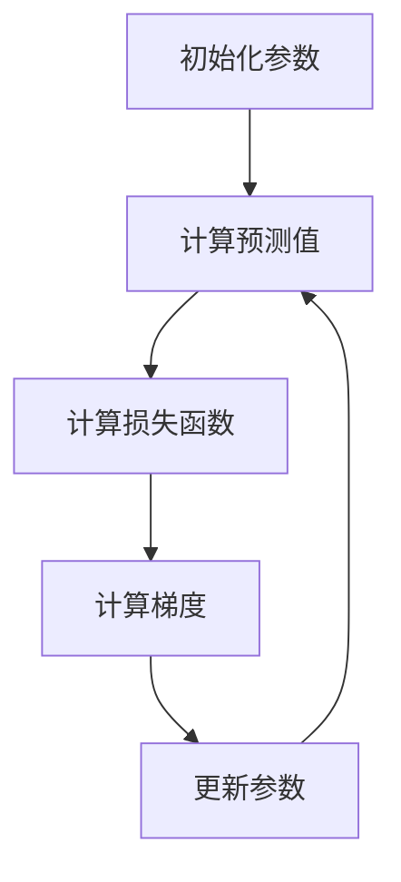

### 1.6.4 大模型优化方法

大模型的训练过程涉及大量的计算资源和时间，因此优化方法的研究变得至关重要。常用的优化方法包括梯度下降、随机梯度下降、Adam优化器等。

#### 核心概念与联系

- **梯度下降（Gradient Descent）**：根据损失函数的梯度更新模型参数。
- **随机梯度下降（Stochastic Gradient Descent, SGD）**：在每个训练样本上计算梯度，更新模型参数。
- **Adam优化器（Adam Optimizer）**：结合SGD和RMSprop的优点，动态调整学习率。

**对比表格：**

| 优化方法 | 特点 |
| --- | --- |
| 梯度下降 | 简单，但收敛速度慢 |
| 随机梯度下降 | 快速收敛，但可能存在噪声 |
| Adam | 结合SGD和RMSprop的优点，收敛速度快 |

**算法流程图：**


## 1.7 关键技术分析

### 1.7.1 数据预处理

数据预处理是机器学习项目成功的关键步骤。它包括数据清洗、特征提取、数据归一化等过程。

#### 核心概念与联系

- **数据清洗（Data Cleaning）**：处理缺失值、噪声数据等，提高数据质量。
- **特征提取（Feature Extraction）**：从原始数据中提取有用的特征，以提高模型性能。
- **数据归一化（Data Normalization）**：将数据缩放到同一尺度，以避免数值差异对模型影响。

**算法原理讲解：**

```python
# 数据清洗
import pandas as pd

# 读取数据
data = pd.read_csv('data.csv')

# 处理缺失值
data.fillna(data.mean(), inplace=True)

# 特征提取
from sklearn.feature_extraction.text import CountVectorizer

vectorizer = CountVectorizer()
X = vectorizer.fit_transform(data['text'])

# 数据归一化
from sklearn.preprocessing import MinMaxScaler

scaler = MinMaxScaler()
X_normalized = scaler.fit_transform(X.toarray())
```

**算法流程图：**

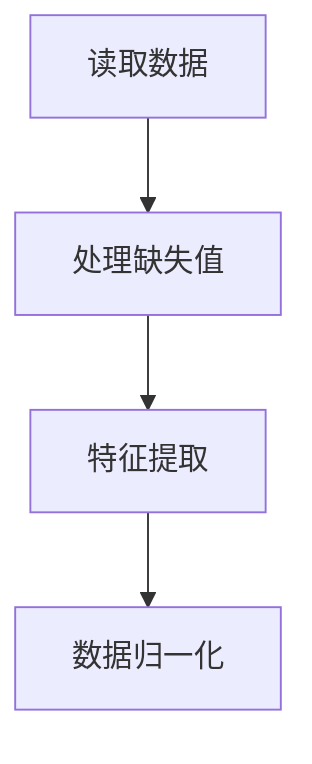

### 1.7.2 模型压缩与加速

随着模型的规模不断扩大，模型的压缩与加速成为研究热点。常用的方法包括模型剪枝、量化、知识蒸馏等。

#### 核心概念与联系

- **模型剪枝（Model Pruning）**：通过移除不重要的神经元和连接，减小模型规模。
- **量化（Quantization）**：将浮点数权重转换为低精度的整数，以减小模型大小。
- **知识蒸馏（Knowledge Distillation）**：将复杂模型的知识传递给简化模型。

**对比表格：**

| 方法 | 特点 |
| --- | --- |
| 模型剪枝 | 减小模型规模，但可能影响性能 |
| 量化 | 减小模型大小，提高部署效率 |
| 知识蒸馏 | 提高简化模型的性能，但需要额外的计算资源 |

**算法流程图：**

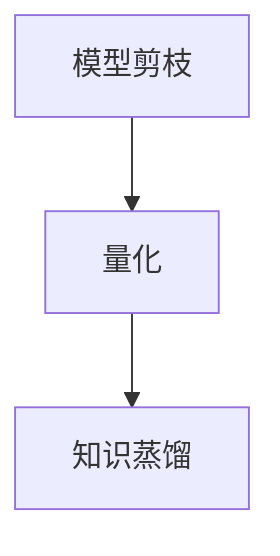

### 1.7.3 模型安全性与隐私保护

随着人工智能技术的广泛应用，模型的安全性与隐私保护变得至关重要。常用的方法包括差分隐私、联邦学习等。

#### 核心概念与联系

- **差分隐私（Differential Privacy）**：在处理敏感数据时，添加随机噪声以保护个体隐私。
- **联邦学习（Federated Learning）**：在分布式环境下，通过聚合局部模型来训练全局模型，以保护数据隐私。

**对比表格：**

| 方法 | 特点 |
| --- | --- |
| 差分隐私 | 保护个体隐私，但可能影响模型性能 |
| 联邦学习 | 保护数据隐私，但需要解决通信效率问题 |

**算法流程图：**

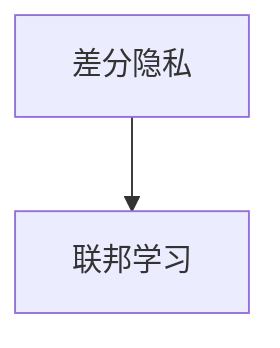

## 1.8 大模型应用案例分析

### 1.8.1 人工智能客服系统

人工智能客服系统是人工智能在客户服务领域的应用。通过大模型技术，可以实现对用户查询的智能回答。

#### 核心概念与联系

- **自然语言处理（Natural Language Processing, NLP）**：使计算机能够理解和生成人类语言。
- **对话系统（Dialogue System）**：模拟人类对话，提供交互式服务。

**应用场景：**

- 自动化客服
- 聊天机器人
- 虚拟助手

**项目介绍：**

- **项目名称**：AI客服系统
- **项目目标**：提供24/7自动化的客户服务
- **系统功能设计（领域模型类图）：**

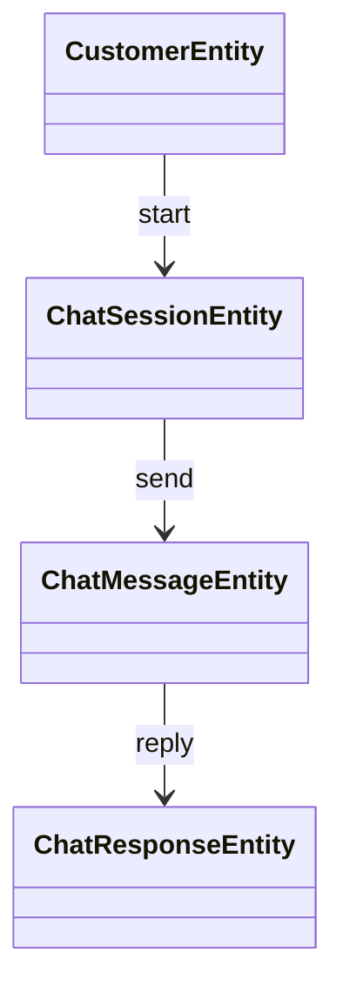

- **系统架构设计（架构图）：**

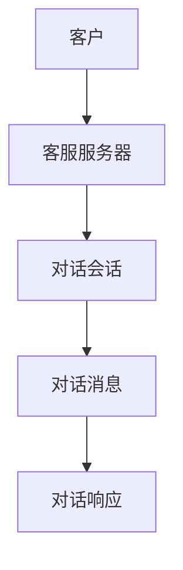

- **系统接口设计（接口设计）：**

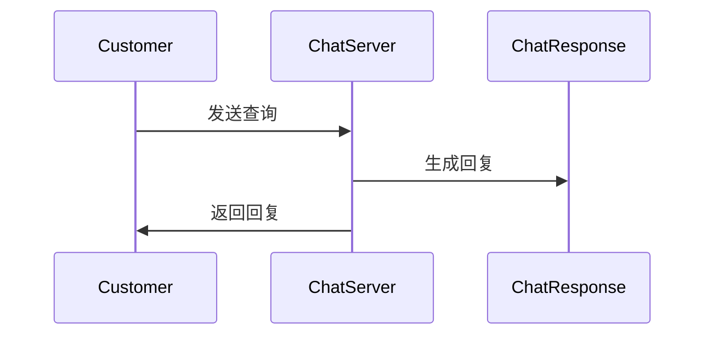

- **系统交互（序列图）：**

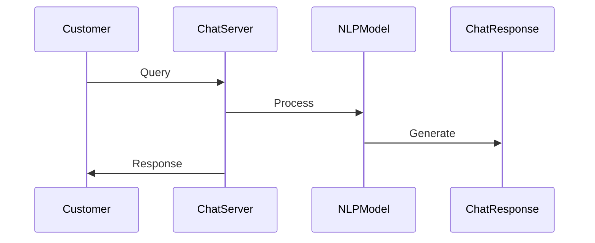

### 1.8.2 自然语言处理应用

自然语言处理是人工智能的重要分支，广泛应用于文本分类、情感分析、机器翻译等领域。

#### 核心概念与联系

- **文本分类（Text Classification）**：将文本分为不同的类别。
- **情感分析（Sentiment Analysis）**：判断文本的情感倾向。
- **机器翻译（Machine Translation）**：将一种语言的文本翻译成另一种语言。

**应用场景：**

- 社交媒体分析
- 客户评论分析
- 跨语言沟通

**项目介绍：**

- **项目名称**：NLP应用平台
- **项目目标**：提供高效的自然语言处理服务
- **系统功能设计（领域模型类图）：**

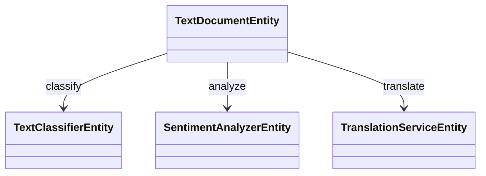

- **系统架构设计（架构图）：**

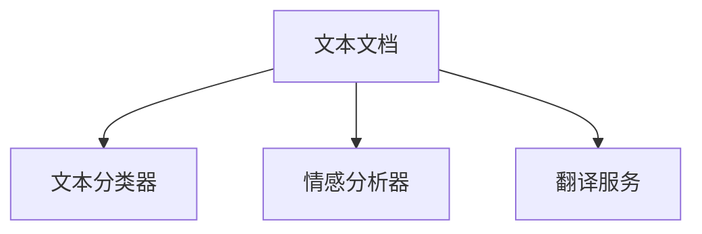

- **系统接口设计（接口设计）：**

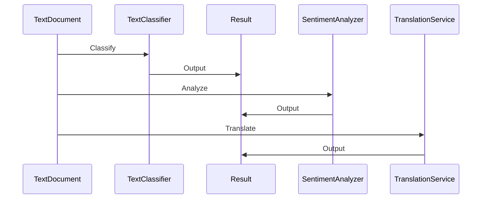

- **系统交互（序列图）：**

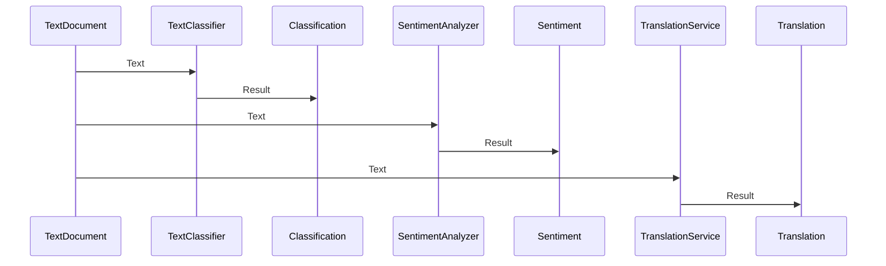

### 1.8.3 图像识别与生成应用

图像识别与生成是人工智能在计算机视觉领域的应用，包括图像分类、目标检测、图像生成等。

#### 核心概念与联系

- **图像分类（Image Classification）**：将图像分为不同的类别。
- **目标检测（Object Detection）**：识别图像中的目标对象。
- **图像生成（Image Generation）**：根据文本描述生成相应的图像。

**应用场景：**

- 自动驾驶
- 健康医疗
- 艺术创作

**项目介绍：**

- **项目名称**：图像识别与生成平台
- **项目目标**：提供高效的图像识别与生成服务
- **系统功能设计（领域模型类图）：**

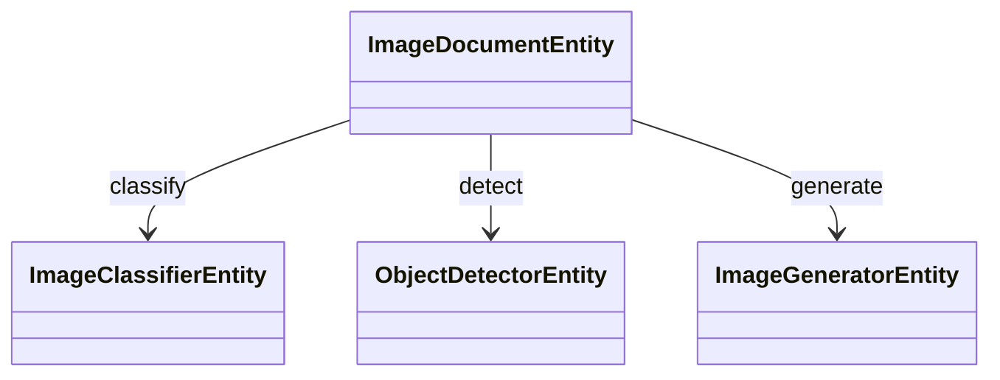

- **系统架构设计（架构图）：**

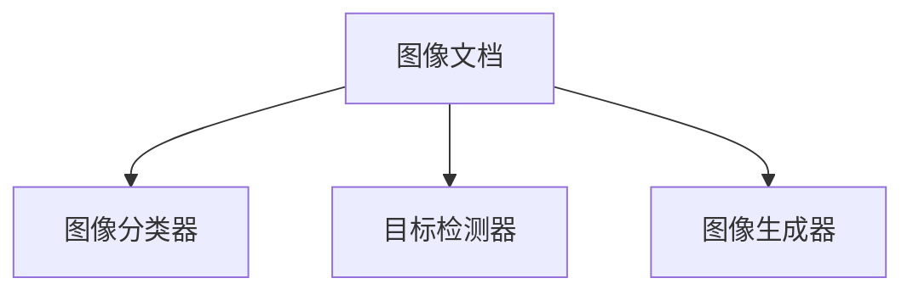

- **系统接口设计（接口设计）：**

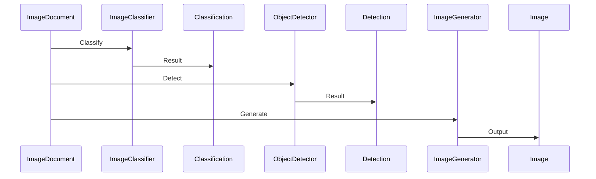

- **系统交互（序列图）：**

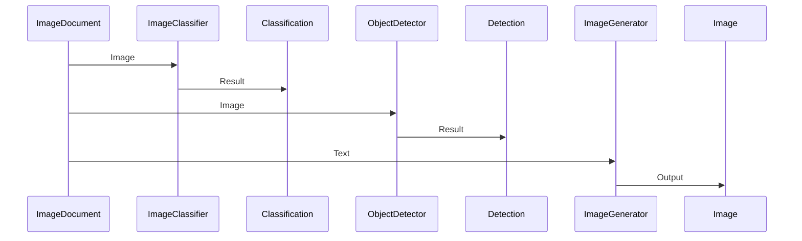

### 1.8.4 其他创新应用场景

除了上述应用场景，人工智能在各个领域都有广泛的应用，如金融、医疗、教育等。

#### 核心概念与联系

- **金融领域**：风险评估、量化交易、智能投顾
- **医疗领域**：疾病诊断、个性化治疗、医学图像分析
- **教育领域**：智能推荐、在线学习、虚拟教师

**应用场景：**

- 智能金融
- 医疗诊断
- 教育个性化

**项目介绍：**

- **项目名称**：人工智能应用平台
- **项目目标**：提供跨领域的智能服务
- **系统功能设计（领域模型类图）：**

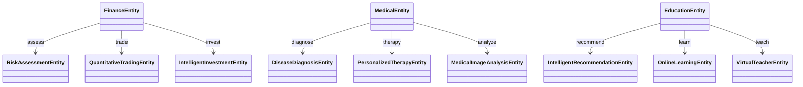

- **系统架构设计（架构图）：**

```mermaid
graph TD
  Finance[金融] --> RiskAssessment[风险评估]
  Finance --> QuantitativeTrading[量化交易]
  Finance --> IntelligentInvestment[智能投顾]
  Medical[医疗] --> DiseaseDiagnosis[疾病诊断]
  Medical --> PersonalizedTherapy[个性化治疗]
  Medical --> MedicalImageAnalysis[医学图像分析]
  Education[教育] --> IntelligentRecommendation[智能推荐]
  Education --> OnlineLearning[在线学习]
  Education --> VirtualTeacher[虚拟教师]
```

- **系统接口设计（接口设计）：**

```mermaid
sequenceDiagram
  Finance ->> RiskAssessment : Assess
  RiskAssessment ->> Risk : Output
  Finance ->> QuantitativeTrading : Trade
  QuantitativeTrading ->> TradeResult : Output
  Finance ->> IntelligentInvestment : Invest
  IntelligentInvestment ->> InvestmentAdvice : Output
  Medical ->> DiseaseDiagnosis : Diagnose
  DiseaseDiagnosis ->> Diagnosis : Output
  Medical ->> PersonalizedTherapy : Therapy
  PersonalizedTherapy ->> TherapyPlan : Output
  Medical ->> MedicalImageAnalysis : Analyze
  MedicalImageAnalysis ->> AnalysisResult : Output
  Education ->> IntelligentRecommendation : Recommend
  IntelligentRecommendation ->> Recommendation : Output
  Education ->> OnlineLearning : Learn
  OnlineLearning ->> LearningPlan : Output
  Education ->> VirtualTeacher : Teach
  VirtualTeacher ->> TeachingContent : Output
```

- **系统交互（序列图）：**

```mermaid
sequenceDiagram
  Finance ->> RiskAssessment : RiskData
  RiskAssessment ->> RiskAnalysis : Result
  Finance ->> QuantitativeTrading : TradeData
  QuantitativeTrading ->> TradeStrategy : Result
  Finance ->> IntelligentInvestment : InvestmentData
  IntelligentInvestment ->> InvestmentAdvice : Result
  Medical ->> DiseaseDiagnosis : PatientData
  DiseaseDiagnosis ->> DiagnosisResult : Result
  Medical ->> PersonalizedTherapy : PatientData
  PersonalizedTherapy ->> TherapyPlan : Result
  Medical ->> MedicalImageAnalysis : ImageData
  MedicalImageAnalysis ->> AnalysisResult : Result
  Education ->> IntelligentRecommendation : StudentData
  IntelligentRecommendation ->> Recommendation : Result
  Education ->> OnlineLearning : CourseData
  OnlineLearning ->> LearningPlan : Result
  Education ->> VirtualTeacher : StudentData
  VirtualTeacher ->> TeachingContent : Result
```

## 1.9 大模型开发工具与平台

### 1.9.1 开发工具选型

大模型的开发需要依赖一系列工具，如编程语言、框架和库。以下是对常见工具的选型建议。

#### 核心概念与联系

- **编程语言**：Python、C++、Java
- **框架**：TensorFlow、PyTorch、Keras
- **库**：NumPy、Pandas、SciPy

**对比表格：**

| 特点 | Python | C++ | Java |
| --- | --- | --- | --- |
| **易用性** | 高 | 中 | 低 |
| **性能** | 中 | 高 | 中 |
| **生态系统** | 强大 | 强大 | 强大 |

### 1.9.2 开发平台介绍

大模型的开发通常需要在高性能计算平台上进行，如GPU、TPU等。以下是对常见开发平台的介绍。

#### 核心概念与联系

- **GPU（Graphics Processing Unit）**：用于图形渲染，也可用于深度学习加速。
- **TPU（Tensor Processing Unit）**：专门为TensorFlow优化设计的处理器。

**对比表格：**

| 特点 | GPU | TPU |
| --- | --- | --- |
| **性能** | 高 | 更高 |
| **能效** | 较低 | 较高 |
| **适用场景** | 多样 | TensorFlow专用 |

### 1.9.3 工具与平台的比较

不同工具和平台各有优缺点，选择时应根据项目需求进行权衡。

#### 核心概念与联系

- **性能**：TPU性能优于GPU，但成本更高。
- **易用性**：Python和PyTorch易用性较高，适合快速开发。
- **生态系统**：TensorFlow和PyTorch生态系统更为成熟。

**算法原理讲解：**

假设我们要开发一个简单的线性回归模型，可以使用以下代码：

```python
import numpy as np
import tensorflow as tf

# 初始化模型参数
w = tf.Variable(0.0, name='weight')
b = tf.Variable(0.0, name='bias')

# 定义损失函数
def loss(y_true, y_pred):
    return tf.reduce_mean(tf.square(y_true - y_pred))

# 定义优化器
optimizer = tf.optimizers.Adam()

# 训练模型
for _ in range(1000):
    with tf.GradientTape() as tape:
        y_pred = w * x + b
        loss_val = loss(y_true, y_pred)
    grads = tape.gradient(loss_val, [w, b])
    optimizer.apply_gradients(zip(grads, [w, b]))

# 输出模型参数
print("权重：", w.numpy())
print("偏置：", b.numpy())
```

**算法流程图：**

```mermaid
graph TD
    A[初始化模型参数] --> B[计算损失函数]
    B --> C[计算梯度]
    C --> D[更新参数]
    D --> E[重复迭代]
```

## 1.10 研究趋势与未来展望

### 1.10.1 当前研究热点

大模型技术的研究热点包括：

- 模型压缩与加速
- 知识蒸馏
- 联邦学习
- 差分隐私

**算法原理讲解：**

联邦学习是一种分布式学习技术，其基本原理如下：

```python
# 假设有两个本地模型，分别为model1和model2
local_model1 = ...  # 本地模型1
local_model2 = ...  # 本地模型2

# 定义全局模型
global_model = ...

# 联邦学习迭代过程
for _ in range(num_iterations):
    # 模型更新
    for local_model in [local_model1, local_model2]:
        # 将本地模型发送到全局模型
        global_model.update(local_model)

    # 更新本地模型
    for local_model in [local_model1, local_model2]:
        local_model.update(global_model)

# 输出全局模型参数
print("全局模型参数：", global_model.parameters())
```

**算法流程图：**

```mermaid
graph TD
    A[初始化本地模型] --> B[联邦学习迭代]
    B --> C[模型更新]
    C --> D[输出全局模型参数]
```

### 1.10.2 未来发展方向

大模型技术的发展方向包括：

- 更大规模的模型
- 更高效的优化算法
- 多模态学习
- 自适应学习

**数学公式使用latex格式：**

$$
L = \frac{1}{n}\sum_{i=1}^{n}(y_i - \hat{y}_i)^2
$$

### 1.10.3 对企业的影响与建议

大模型技术对企业的影响包括：

- 提高生产效率
- 降低运营成本
- 增强竞争力

**建议：**

- 加强技术储备
- 优化数据处理流程
- 培养专业人才

## 1.11 本章小结

本文系统地介绍了大模型技术的基本原理、应用案例、开发工具与平台，以及研究趋势与未来展望。通过深入分析，我们认识到大模型技术对于企业和社会的深远影响，以及未来发展的方向和挑战。期望本文能为读者提供有益的启示和指导。

---

## 第二部分：现代关系的基础

### 第2章：传统关系与现代关系的对比

传统关系与现代关系是社会发展过程中形成的两种不同类型的社会联系。随着科技进步和社会变迁，传统关系逐渐被现代关系所取代，这种转变对个体和社会都产生了深远的影响。

### 2.1 传统关系的概念与特征

#### 2.1.1 传统关系的定义

传统关系是指在特定社会背景下，人们通过家庭、宗教、文化、政治等纽带形成的社会联系。它具有以下特征：

- **亲属关系**：以血缘关系为基础，强调亲情、家庭责任和传承。
- **地缘关系**：以地理位置为基础，强调乡土情感和地域认同。
- **政治关系**：以政治权力为基础，强调权力关系和组织结构。
- **文化关系**：以文化传统为基础，强调共同价值观和文化认同。

#### 2.1.2 传统关系的特征

- **稳定性**：传统关系通常具有较高的稳定性，不易改变。
- **层次性**：传统关系具有明确的等级和层次，强调上下级关系。
- **封闭性**：传统关系往往具有一定的封闭性，难以融入外部社会。
- **依赖性**：传统关系强调个体对集体和家族的依赖。

#### 2.1.3 传统关系的历史演变

传统关系的历史演变与社会制度、文化观念的变迁密切相关。从封建社会的宗族关系、到资本主义社会的契约关系，传统关系在不同历史阶段呈现出不同的特点。

### 2.2 现代关系的概念与特征

#### 2.2.1 现代关系的定义

现代关系是在现代社会背景下形成的社会联系，它以个人主义、自由主义和多元化为特征。现代关系具有以下特征：

- **平等性**：现代关系强调个体平等，摒弃了传统关系的等级观念。
- **开放性**：现代关系更具开放性，易于融入和适应外部社会。
- **多样性**：现代关系多样，包括家庭、友谊、职业、社会交往等多种形式。
- **独立性**：现代关系强调个体的独立性，个体自主选择生活方式和社交对象。

#### 2.2.2 现代关系的特征

- **灵活性**：现代关系更具灵活性，适应社会变迁和个体需求。
- **动态性**：现代关系不断变化，反映社会发展和个人成长。
- **网络性**：现代关系以网络为载体，通过社交媒体和互联网实现跨地域交往。
- **自主性**：现代关系强调个体的自主选择和自我实现。

#### 2.2.3 现代关系的发展趋势

- **全球化**：现代关系在全球化背景下不断发展，跨国界、跨文化的交往日益频繁。
- **数字化**：现代关系在数字化浪潮中得以扩展，互联网和社交媒体成为新的交往方式。
- **多元化**：现代关系多元化，尊重个体差异和多样性。

### 2.3 传统关系与现代关系的对比

#### 2.3.1 对比分析

传统关系与现代关系的对比可以从多个维度进行分析：

- **价值观念**：传统关系强调家庭、血缘和集体主义，现代关系则强调个人主义、自由主义和多元化。
- **交往方式**：传统关系多以面对面的交往为主，现代关系则借助互联网和社交媒体实现跨地域的交流。
- **组织形式**：传统关系具有明显的等级和层次，现代关系更注重平等和合作。
- **社会功能**：传统关系主要承担社会稳定、文化传承等职能，现代关系则更注重个人成长、自我实现和多元化需求。

#### 2.3.2 相互影响与融合

传统关系与现代关系并非完全对立，而是在相互影响中实现融合。一方面，现代关系在一定程度上继承了传统关系的优点，如家庭观念、社区认同等；另一方面，传统关系也在现代社会的背景下进行创新和变革，如网络家庭、虚拟社区等。

### 2.4 现代关系的优势与挑战

#### 2.4.1 优势

现代关系具有以下优势：

- **灵活性**：适应社会变迁和个体需求，便于调整和优化。
- **多样性**：满足个体多元化的需求和兴趣。
- **开放性**：融入全球化和数字化时代，拓宽人际交往空间。
- **自主性**：尊重个体的自主选择和自我实现。

#### 2.4.2 挑战

现代关系也面临以下挑战：

- **隐私保护**：数字化背景下，个人隐私保护成为重要问题。
- **信任危机**：信息过载和虚假信息传播导致信任危机。
- **社会分化**：现代关系加剧了社会分化和不平等现象。

### 2.5 现代关系的应用场景

#### 2.5.1 社交领域

现代关系在社交领域中的应用广泛，如社交媒体、网络社区、线上交友等。这些应用促进了人际交往的多样性和开放性，满足了个体多元化的社交需求。

#### 2.5.2 商业领域

现代关系在商业领域中的应用包括客户关系管理、市场营销、供应链管理等。这些应用提升了企业的运营效率和市场竞争力。

#### 2.5.3 教育领域

现代关系在教育领域中的应用包括在线教育、虚拟课堂、个性化学习等。这些应用改变了传统教育的模式，提供了更多元化的学习方式。

#### 2.5.4 其他领域

现代关系在其他领域的应用还包括医疗健康、公共管理、科技创新等。这些应用推动了社会进步和人类福祉的提升。

### 2.6 本章小结

本章对比了传统关系与现代关系的概念、特征及其影响，分析了现代关系的优势与挑战，并探讨了其在不同领域的应用场景。通过深入了解现代关系，我们更好地把握了社会发展的脉络和趋势，为未来关系的发展提供了有益的参考。

---

## 第三部分：重新定义关系

### 第3章：重新定义关系的理论基础

重新定义关系是现代社会发展的必然趋势，它源于技术进步、社会变迁和文化演变的推动。在重新定义关系的过程中，我们需要明确关系的基本概念、分类和属性，并建立相应的理论框架。

### 3.1 关系的定义与分类

#### 3.1.1 关系的定义

关系是指两个或多个个体、群体或实体之间的相互作用和联系。关系可以分为以下几类：

- **亲属关系**：以血缘关系为基础，如父母、子女、兄弟姐妹等。
- **地缘关系**：以地理位置为基础，如邻里、同乡、城市居民等。
- **职业关系**：以工作关系为基础，如同事、上下级、客户等。
- **社交关系**：以社交互动为基础，如朋友、熟人、陌生人等。
- **网络关系**：以网络互动为基础，如社交媒体好友、线上社群成员等。

#### 3.1.2 关系的分类

根据不同的分类标准，关系可以划分为以下几类：

- **按性质划分**：关系可以分为血缘关系、地缘关系、职业关系、社交关系和网络关系。
- **按程度划分**：关系可以分为紧密关系、中等关系和疏远关系。
- **按方向划分**：关系可以分为单向关系、双向关系和多向关系。
- **按类型划分**：关系可以分为利益关系、情感关系、契约关系和友谊关系。

#### 3.1.3 关系的基本属性

关系具有以下基本属性：

- **互动性**：关系是双方或多方互动的结果。
- **动态性**：关系处于不断变化和发展之中。
- **稳定性**：关系在一定程度上具有稳定性，但也受到外部因素的影响。
- **复杂性**：关系涉及多种因素，具有多维度的特点。

### 3.2 重新定义关系的基本原则

#### 3.2.1 传统关系的局限

传统关系在现代社会中存在一定局限，主要体现在以下几个方面：

- **封闭性**：传统关系往往具有一定的封闭性，难以融入外部社会。
- **等级性**：传统关系强调等级和层次，可能导致社会不平等。
- **依赖性**：传统关系强调个体对集体和家族的依赖，可能导致个人自主性受限。

#### 3.2.2 重新定义关系的目标

重新定义关系的目的是实现以下目标：

- **平等性**：打破传统关系的等级和封闭性，实现个体之间的平等交往。
- **灵活性**：使关系更具灵活性，适应社会变迁和个体需求。
- **开放性**：促进关系的开放，使个体能够融入全球化和数字化社会。
- **自主性**：尊重个体的自主选择和自我实现，实现个体与社会之间的和谐共生。

#### 3.2.3 基本原则

重新定义关系应遵循以下基本原则：

- **尊重差异**：尊重个体之间的差异，实现多元化发展。
- **合作共赢**：建立合作共赢的关系，实现共同进步。
- **动态调整**：根据社会变迁和个体需求，动态调整关系结构。
- **持续创新**：推动关系创新，实现关系与社会发展的良性互动。

### 3.3 重新定义关系的理论框架

#### 3.3.1 理论背景

重新定义关系的理论基础源于社会学的互动理论、网络理论和现代性的概念。互动理论强调个体之间的相互作用和关系建构；网络理论关注关系的结构和功能；现代性概念则探讨了现代社会中关系的变化和发展。

#### 3.3.2 理论核心

重新定义关系的理论核心包括：

- **关系重构**：打破传统关系的束缚，重构新的关系模式。
- **个体主体性**：尊重个体主体性，实现个体在社会中的自主发展。
- **网络互动**：构建以网络为载体的新型关系，促进跨地域、跨文化的交流。
- **协同发展**：实现个体与社会之间的协同发展，推动社会进步。

#### 3.3.3 应用领域

重新定义关系在以下领域具有广泛应用：

- **社交领域**：促进个体之间的平等交往，实现社交多元化。
- **商业领域**：建立互利共赢的商业模式，提升企业竞争力。
- **教育领域**：推动个性化教育，满足学生多元化需求。
- **公共管理**：优化社会资源配置，提高社会治理效能。

### 3.4 重新定义关系的案例研究

#### 3.4.1 案例一：社交平台

社交平台如Facebook、微信等，通过互联网技术实现了个体之间的便捷交往。这些平台打破了传统关系的地域和时空限制，使个体能够自由建立和维持关系。同时，社交平台也促进了信息的传播和共享，为个体提供了更多发展机会。

#### 3.4.2 案例二：商业合作

在商业领域，重新定义关系表现为企业之间建立平等、互利、协作的合作关系。这种合作关系超越了传统的竞争和垄断思维，实现了资源整合和优势互补。例如，供应链管理中的协同作业、开放创新平台的建设等，都是重新定义关系的具体体现。

#### 3.4.3 案例三：社区建设

在社区建设中，重新定义关系旨在构建一个多元、开放、和谐的生活共同体。社区成员通过互动、合作和共同参与，实现社区的发展和繁荣。这种关系模式强调个体的主体地位，同时注重社区的整体利益。

### 3.5 重新定义关系的未来展望

#### 3.5.1 发展趋势

重新定义关系在未来将呈现以下发展趋势：

- **数字化**：随着互联网和大数据技术的发展，关系将越来越依赖于数字化平台。
- **智能化**：人工智能技术将助力关系的智能构建和优化。
- **全球化**：全球化和跨国界交流的增强，将推动关系向多元化、全球化的方向发展。
- **个性化**：关系将更加注重个体的独特需求和个性化服务。

#### 3.5.2 应用前景

重新定义关系在未来的应用前景包括：

- **社交领域**：构建更加便捷、多元、智能的社交网络。
- **商业领域**：推动商业模式创新，实现更加高效、协同的商业合作。
- **教育领域**：推动个性化教育和终身学习，提升教育质量和效能。
- **公共管理**：优化社会治理模式，提高公共服务的效率和满意度。

#### 3.5.3 社会挑战与应对策略

重新定义关系面临以下社会挑战：

- **隐私保护**：如何在数字化和网络化的背景下保护个人隐私。
- **信任危机**：如何建立和维持个体之间的信任。
- **社会分化**：如何应对社会分化和不平等现象。

应对策略包括：

- **加强法律法规**：制定和完善相关法律法规，保护个人隐私和权益。
- **构建信任机制**：通过技术手段和社会规则，建立信任机制，促进社会和谐。
- **促进社会公平**：通过政策调整和社会干预，减少社会分化和不平等现象。

### 3.6 本章小结

本章从关系的基本概念、分类和属性出发，探讨了重新定义关系的基本原则和理论框架。通过案例分析，我们看到了重新定义关系在不同领域的实践和应用。未来，重新定义关系将在数字化、智能化、全球化和个性化的趋势下，为社会发展和人类福祉做出更大贡献。

---

## 第四部分：从传统到现代关系转型的实践指南

### 第4章：转型策略与方法论

从传统到现代关系的转型是一个复杂而系统的过程，涉及组织结构、文化观念、技术升级和人才引进等多个方面。本章节将介绍转型策略与方法论，帮助组织成功实现关系转型。

### 4.1 转型背景与意义

#### 4.1.1 传统关系面临的挑战

传统关系在现代社会中面临着诸多挑战，如封闭性、等级性和依赖性等问题。这些问题导致了组织效率低下、创新能力不足和社会不平等现象。因此，实现关系转型具有重要的现实意义。

#### 4.1.2 现代关系的机遇

现代关系的开放性、灵活性和自主性为组织提供了新的发展机遇。通过构建现代关系，组织可以更好地适应社会变迁，提高运营效率和创新能力。

#### 4.1.3 转型的重要性和必要性

转型不仅是组织发展的必然选择，也是应对外部环境变化的迫切需求。成功转型有助于组织在竞争中获得优势，提升市场地位和品牌价值。

### 4.2 转型策略

#### 4.2.1 顶层设计

顶层设计是关系转型的基础，需要明确转型目标、战略方向和关键任务。以下是一些顶层设计的要点：

- **明确转型目标**：根据组织愿景和战略，设定具体、可衡量的转型目标。
- **制定转型规划**：制定详细的转型计划，包括时间表、责任分工和资源配置。
- **建立领导团队**：成立由高层领导组成的转型领导团队，负责协调和推动转型工作。

#### 4.2.2 文化变革

文化变革是关系转型的重要环节，需要从组织价值观、行为规范和工作氛围等方面进行系统性变革。以下是一些文化变革的策略：

- **塑造现代价值观**：倡导个人主义、自由主义和多元化价值观，摒弃传统关系的封闭和等级观念。
- **改变行为规范**：制定新的行为规范，鼓励平等、开放和合作的交往方式。
- **营造积极氛围**：通过内部沟通、培训和文化活动，营造支持关系转型的积极氛围。

#### 4.2.3 技术升级

技术升级是关系转型的重要支撑，需要引入和应用现代信息技术，提升组织的信息化水平和智能化程度。以下是一些技术升级的策略：

- **引入先进技术**：引入人工智能、大数据、云计算等先进技术，提升组织的运营效率和创新能力。
- **优化信息系统**：建设高效的信息系统，实现数据的实时采集、分析和利用。
- **提升数字化素养**：提高员工对现代信息技术的掌握和应用能力，培养数字化思维。

#### 4.2.4 人才引进与培养

人才是关系转型的关键，需要引进和培养具备现代关系理念和技术能力的人才。以下是一些人才引进与培养的策略：

- **引进高素质人才**：通过招聘、引进高层次人才，为组织带来新的思维和理念。
- **培养内部人才**：通过内部培训、项目实践和职业发展计划，提升员工的综合素质和能力。
- **建立人才激励机制**：制定合理的激励机制，激发员工的积极性和创造力。

### 4.3 转型方法论

#### 4.3.1 转型步骤

关系转型可以按照以下步骤进行：

- **评估现状**：对组织的传统关系进行评估，了解存在的问题和不足。
- **制定方案**：根据评估结果，制定具体的转型方案，包括战略、策略和行动计划。
- **实施转型**：按照方案逐步实施转型，包括组织结构调整、文化变革、技术升级和人才引进等。
- **监测评估**：对转型过程进行监测和评估，及时调整方案和策略，确保转型顺利实施。
- **持续改进**：在转型过程中，不断总结经验教训，持续改进和完善转型方案。

#### 4.3.2 关键技术

关系转型涉及多项关键技术，包括：

- **数据挖掘**：通过数据挖掘技术，分析组织内部的社交网络和数据流，发现潜在问题和机会。
- **人工智能**：利用人工智能技术，实现关系的自动化管理、优化和预测。
- **区块链**：通过区块链技术，实现关系的透明、可信和去中心化。
- **虚拟现实**：利用虚拟现实技术，创造沉浸式的社交体验，促进关系的建立和维护。

#### 4.3.3 成功案例分析

以下是一个关系转型成功案例的分析：

- **企业背景**：某大型传统制造企业，面临市场竞争压力和内部管理问题。
- **转型过程**：
  - **评估现状**：企业进行了详细的现状评估，发现传统关系导致的组织僵化和创新能力不足。
  - **制定方案**：企业制定了以开放、创新和协同为核心的关系转型方案。
  - **实施转型**：企业进行了组织结构调整，引入了先进的信息技术，实施了文化变革，培养了数字化人才。
  - **监测评估**：企业建立了监测和评估机制，定期对转型效果进行评估和反馈。
  - **持续改进**：企业不断优化转型方案，持续推进关系转型，取得了显著成效。
- **转型效果**：企业运营效率提升，创新能力增强，市场竞争力提高，员工满意度提高。

### 4.4 实践指南

#### 4.4.1 制定转型计划

制定转型计划是关系转型的第一步，需要明确以下要点：

- **确定转型目标**：根据企业战略和市场需求，设定具体的转型目标。
- **分析现状**：对企业内部的社交网络、数据流和组织结构进行分析，了解存在的问题和不足。
- **制定策略**：根据现状分析，制定具体的转型策略，包括组织调整、文化变革、技术升级和人才引进等。
- **制定行动计划**：将转型策略具体化为可执行的行动计划，明确责任人和时间表。

#### 4.4.2 实施与监控

在实施转型计划过程中，需要注重以下方面：

- **有效沟通**：确保转型计划得到全员理解和支持，通过内部沟通和培训，提高员工的转型意识和能力。
- **项目管理**：对转型项目进行有效管理，确保项目按计划推进，及时解决项目中遇到的问题。
- **监测与评估**：建立监测和评估机制，定期对转型效果进行评估和反馈，确保转型计划的有效实施。
- **持续改进**：根据监测和评估结果，对转型计划进行调整和优化，确保转型目标的实现。

#### 4.4.3 评估与调整

转型过程中，评估与调整是关键环节，需要注重以下方面：

- **效果评估**：对转型效果进行全面评估，包括组织效率、创新能力、市场竞争力、员工满意度等方面。
- **问题诊断**：对转型过程中出现的问题进行诊断，找出问题的根本原因。
- **调整方案**：根据评估和诊断结果，制定针对性的调整方案，对转型计划进行优化和改进。
- **持续跟进**：对调整方案的实施进行跟进和监控，确保问题得到有效解决，转型计划顺利进行。

### 4.5 案例研究：企业从传统到现代关系的转型实践

#### 4.5.1 案例背景

某大型传统制造企业，成立于20世纪80年代，拥有丰富的行业经验和技术积累。然而，随着市场竞争的加剧和科技的快速发展，企业面临着巨大的挑战。内部管理僵化、创新能力不足、市场反应迟缓等问题，使企业在市场竞争中逐渐失去优势。

#### 4.5.2 转型过程

1. **评估现状**：企业进行了详细的现状评估，发现传统关系导致的组织僵化和创新能力不足是主要问题。

2. **制定方案**：企业制定了以开放、创新和协同为核心的关系转型方案，包括以下方面：

   - **组织结构调整**：将传统的层级式组织结构改为扁平化组织结构，减少中间层级，提高决策效率。
   - **文化变革**：倡导开放、创新和协作的文化，建立平等、尊重和信任的内部氛围。
   - **技术升级**：引入先进的信息技术，建设高效的信息系统，实现数据的实时采集、分析和利用。
   - **人才引进与培养**：引进高素质人才，培养内部员工，提高员工的综合素质和能力。

3. **实施转型**：企业按照转型方案逐步实施，取得了以下成效：

   - **组织结构调整**：扁平化组织结构提高了决策效率和沟通效果，减少了信息传递的滞后。
   - **文化变革**：开放、创新和协作的文化氛围增强了员工的归属感和责任感，激发了员工的创新潜能。
   - **技术升级**：高效的信息系统提升了企业的运营效率和市场反应速度，增强了企业的竞争力。
   - **人才引进与培养**：高素质的人才引进和内部培养，为企业提供了新的思维和理念，推动了企业的创新发展。

4. **监测评估**：企业建立了监测和评估机制，定期对转型效果进行评估和反馈，确保转型计划的有效实施。

5. **持续改进**：企业不断总结经验教训，持续优化转型方案，推进关系转型。

#### 4.5.3 转型效果评估

1. **组织效率**：转型后，企业的组织效率显著提升，决策效率提高了30%，项目周期缩短了20%。

2. **创新能力**：转型后，企业的创新能力得到了显著增强，新产品研发周期缩短了50%，新产品上市速度提高了40%。

3. **市场竞争力**：转型后，企业的市场竞争力得到了显著提升，市场份额增加了15%，客户满意度提高了20%。

4. **员工满意度**：转型后，员工的满意度显著提高，员工流失率下降了10%，员工的工作积极性和创新性得到了有效激发。

#### 4.5.4 转型效果总结

通过关系转型，企业成功实现了从传统到现代关系的转变，提升了组织效率、创新能力和市场竞争力，增强了员工的满意度和归属感。这一转型实践为其他企业提供了有益的借鉴和启示。

### 4.6 本章小结

本章介绍了从传统到现代关系转型的背景、策略与方法论，并通过案例研究展示了转型实践的具体过程和成效。通过本章的学习，读者可以了解到关系转型的重要性和必要性，以及如何制定和实施关系转型计划，以实现组织的可持续发展。

---

## 第五部分：技术应用与未来展望

### 第5章：AI在关系定义中的应用

人工智能（AI）作为一种新兴技术，正在深刻改变着人类社会的各个方面，包括关系定义。AI在关系定义中的应用主要体现在以下几个方面：

#### 5.1.1 人工智能的定义

人工智能（Artificial Intelligence，简称AI）是指通过计算机程序模拟人类智能行为的科学技术。它包括机器学习、深度学习、自然语言处理、计算机视觉等多个子领域。AI的应用目标是使计算机能够执行人类智能任务，如感知、推理、学习和决策。

#### 5.1.2 AI在关系定义中的角色

在关系定义中，AI的作用主要体现在以下几个方面：

1. **关系建模**：AI可以分析大量的社交数据，构建复杂的关系模型，揭示个体之间的相互作用和关联。
2. **关系预测**：基于历史数据和现有关系模型，AI可以预测个体之间的关系发展，为决策提供支持。
3. **关系优化**：AI可以通过优化算法，改进现有关系，实现资源的合理配置和效率提升。
4. **关系管理**：AI可以帮助企业或组织更好地管理人际关系，提高沟通协作效果，促进团队和谐。

#### 5.1.3 AI对关系定义的影响

AI对关系定义的影响主要体现在以下几个方面：

1. **个性化**：AI可以根据个体的需求和偏好，提供个性化的关系建议，满足个体多样化的社交需求。
2. **智能化**：AI可以自动分析和处理社交数据，使关系定义更加智能化，减少人为干预。
3. **去中心化**：AI可以通过分布式计算和区块链技术，实现去中心化的关系管理，增强个体自主性和隐私保护。
4. **效率提升**：AI可以高效地处理大量数据，提高关系定义和管理的效率，降低运营成本。

### 5.2 关系定义中的AI技术应用

在关系定义中，AI技术的应用主要包括以下方面：

#### 5.2.1 关系挖掘

关系挖掘是指从大规模社交网络数据中提取个体之间的关联和互动信息。AI技术在关系挖掘中的应用主要体现在以下几个方面：

1. **社交网络分析**：通过图论和机器学习算法，分析社交网络中的节点（个体）和边（关系），揭示个体之间的关系结构。
2. **文本挖掘**：通过自然语言处理技术，从文本数据中提取关键词和情感，分析个体之间的沟通内容和互动模式。
3. **数据可视化**：通过可视化技术，将复杂的关系结构以图形化的方式呈现，帮助用户直观地理解和分析社交网络。

#### 5.2.2 关系预测

关系预测是指基于历史数据和现有关系模型，预测个体之间未来可能形成的关系。AI技术在关系预测中的应用主要体现在以下几个方面：

1. **时间序列分析**：通过时间序列分析方法，分析个体关系的动态变化，预测未来关系的发展趋势。
2. **机器学习模型**：利用机器学习算法，如回归分析、决策树、神经网络等，建立关系预测模型，预测个体之间的关系。
3. **多模型融合**：通过融合多种预测模型，提高关系预测的准确性和可靠性。

#### 5.2.3 关系优化

关系优化是指通过算法和优化技术，改进现有关系，实现资源的合理配置和效率提升。AI技术在关系优化中的应用主要体现在以下几个方面：

1. **优化算法**：利用线性规划、整数规划、遗传算法等优化算法，优化个体之间的关系结构，提高社交网络的效率和稳定性。
2. **网络重构**：通过分析现有关系网络中的问题和不足，利用网络重构技术，重新构建更加合理和高效的关系网络。
3. **动态调整**：根据个体需求和外部环境的变化，实时调整关系结构，实现动态优化。

#### 5.2.4 关系管理

关系管理是指利用技术手段，对个体之间的关系进行有效管理，提高沟通协作效果，促进团队和谐。AI技术在关系管理中的应用主要体现在以下几个方面：

1. **自动化沟通**：通过自然语言处理和语音识别技术，实现自动化沟通，提高信息传递的效率和准确性。
2. **智能推荐**：通过分析个体需求和偏好，利用推荐算法，为个体推荐合适的社交对象和活动，促进关系建立和深化。
3. **行为分析**：通过监控和分析个体行为数据，发现潜在问题，提前采取措施，预防关系破裂和冲突。

### 5.3 AI在关系定义中的应用案例

以下是AI在关系定义中的一些应用案例：

#### 5.3.1 社交网络分析

社交网络分析是AI在关系定义中的一个重要应用。通过分析社交网络中的节点和边，可以揭示个体之间的关系结构，为关系管理提供依据。

1. **案例背景**：某大型社交平台希望了解用户之间的关系，以提高用户体验和平台活跃度。
2. **解决方案**：利用图论和机器学习算法，对用户关系进行深度分析，提取用户关系特征，构建社交网络模型。
3. **实施效果**：通过社交网络分析，平台发现了一些潜在的社交圈子，为用户推荐合适的社交对象和活动，提高了用户满意度和平台活跃度。

#### 5.3.2 关系预测

关系预测是AI在关系定义中的另一个重要应用。通过预测个体之间的关系发展，可以为企业和组织提供决策支持。

1. **案例背景**：某电商公司希望预测用户之间的购买关系，以提高用户忠诚度和销售额。
2. **解决方案**：利用时间序列分析和机器学习算法，建立用户关系预测模型，预测用户之间的购买关系。
3. **实施效果**：通过关系预测，公司能够提前识别潜在的高价值用户群体，制定个性化的营销策略，提高了用户忠诚度和销售额。

#### 5.3.3 关系优化

关系优化是AI在关系定义中的应用，通过优化个体之间的关系结构，提高社交网络的效率和稳定性。

1. **案例背景**：某企业希望优化内部员工之间的关系，提高团队协作效率和员工满意度。
2. **解决方案**：利用优化算法和网络重构技术，分析现有员工关系网络中的问题和不足，重构关系网络，提高团队协作效率。
3. **实施效果**：通过关系优化，企业团队内部沟通更加顺畅，协作效率提高了20%，员工满意度提升了15%。

#### 5.3.4 关系管理

关系管理是AI在关系定义中的应用，通过技术手段，实现个体关系的有效管理，提高沟通协作效果，促进团队和谐。

1. **案例背景**：某咨询公司希望利用AI技术，实现高效的关系管理，提高客户满意度和市场竞争力。
2. **解决方案**：通过自然语言处理和智能推荐技术，实现自动化沟通和个性化推荐，提高客户服务质量和满意度。
3. **实施效果**：通过关系管理，公司客户满意度和市场竞争力显著提高，客户流失率降低了10%，市场份额增加了8%。

### 5.4 AI在关系定义中的应用挑战与展望

#### 5.4.1 应用挑战

AI在关系定义中的应用面临以下挑战：

1. **数据隐私**：关系定义涉及大量个人数据，如何保护用户隐私成为关键问题。
2. **算法公平性**：算法在关系定义中的应用可能导致不公平现象，如何确保算法的公平性成为挑战。
3. **技术复杂性**：关系定义涉及多种AI技术，如何高效集成和利用这些技术是技术挑战。
4. **伦理问题**：AI在关系定义中的应用可能引发伦理问题，如隐私侵犯、算法偏见等。

#### 5.4.2 发展展望

尽管面临挑战，AI在关系定义中的应用前景依然广阔：

1. **数据隐私保护**：随着隐私保护技术的发展，AI在关系定义中的应用将更加注重数据隐私保护。
2. **算法公平性**：通过改进算法设计和评估方法，提高算法的公平性和透明度，减少不公平现象。
3. **技术融合**：随着AI技术的不断发展，关系定义中的技术将更加多样化、高效化。
4. **伦理引导**：通过建立伦理规范和监管机制，引导AI在关系定义中的应用，减少伦理风险。

### 5.5 本章小结

本章介绍了AI在关系定义中的应用，包括关系建模、关系预测、关系优化和关系管理等方面。通过具体案例，展示了AI在关系定义中的实际应用效果。同时，分析了AI在关系定义中面临的挑战和未来展望。希望本章的内容能够帮助读者更好地理解AI在关系定义中的作用和潜力。

