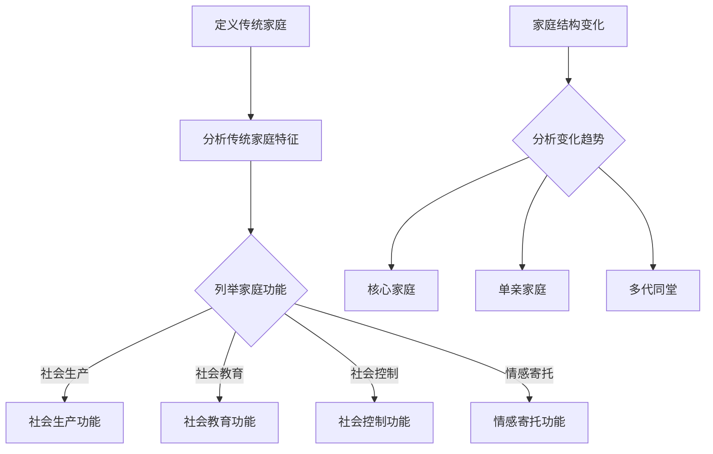
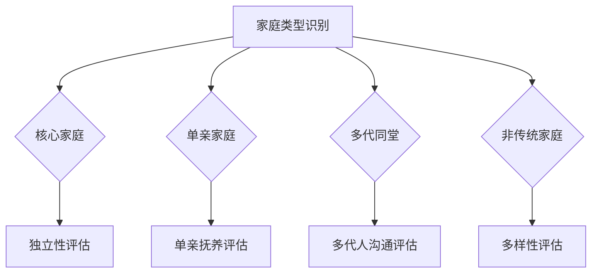
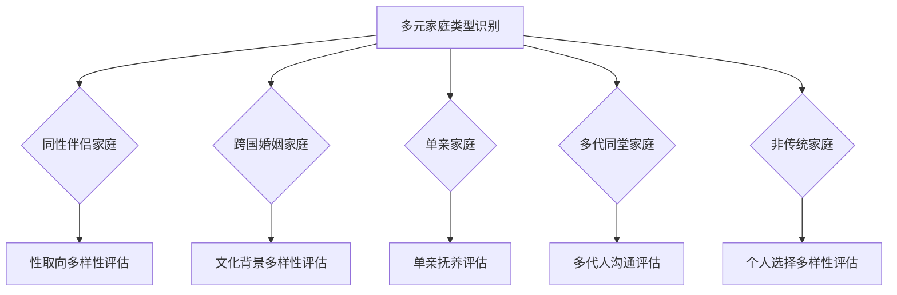
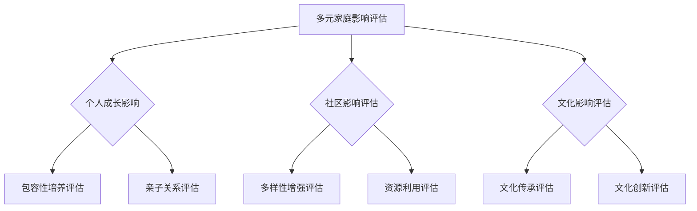
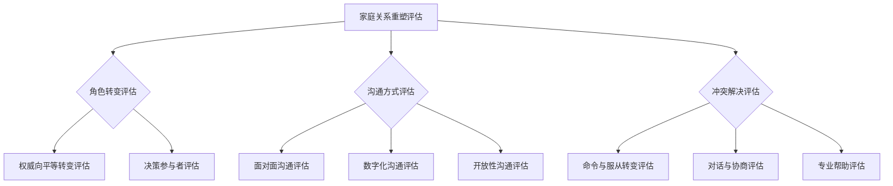
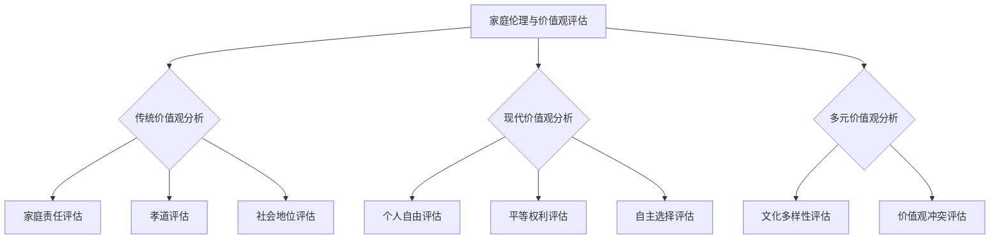
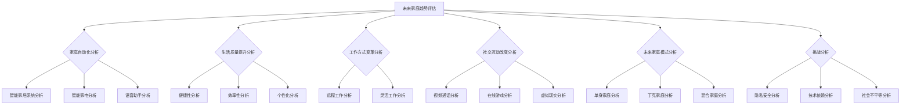

                 


### 引言

**“家庭，这是一个永恒的主题，它既是社会的基本单元，也是人类情感栖息的港湾。然而，随着时代的发展，家庭的形式和功能也在不断地演变和重塑。今天，我们站在历史的交汇点上，面对着一个崭新的课题：如何重新定义家庭？**

这段话开启了我们对家庭这一主题的深入探讨。家庭，作为一个社会的基石，承载着个体成长、情感交流、社会传承等多重功能。然而，随着科技的进步、社会的变迁，传统家庭的模式正面临着前所未有的挑战。从核心家庭到单亲家庭，从多代同堂到同住异居，家庭的形态正在变得越来越多元。这种变化不仅反映在家庭结构的调整上，更体现在家庭关系的重塑、家庭伦理的演变以及家庭价值的重构中。

本文旨在通过对传统家庭、多元家庭的深入探讨，重新审视家庭在现代社会中的角色和功能，并提出对未来家庭的展望和思考。文章将分为以下几个部分：

1. **传统家庭的回顾与定义**
2. **家庭结构的变化**
3. **多元家庭的探索**
4. **家庭关系的重塑**
5. **家庭伦理与价值观的变迁**
6. **未来家庭的趋势**
7. **未来家庭的愿景与挑战**

我们将一步步地分析，以逻辑清晰、结构紧凑的方式，探讨家庭这一主题的各个方面，希望能够为读者提供一个全面、深入的视角。

#### 关键词

- **家庭形态**
- **多元家庭**
- **社会变迁**
- **家庭功能**
- **伦理价值观**
- **未来家庭**

#### 摘要

本文将探讨家庭这一社会基本单元在现代社会中的演变与重塑。从传统家庭的结构和功能入手，我们分析了家庭结构的变化，特别是单亲家庭、多代同堂等新型家庭形式的崛起。接着，我们深入探讨了多元家庭的定义、类型及其对社会的影响。在家庭关系的重塑部分，我们关注了家庭角色的转变和沟通方式的变化。随后，文章讨论了家庭伦理与价值观的变迁，以及这些变化对个体和社会的深远影响。最后，我们展望了未来家庭的趋势，提出了家庭在智能化、科技化背景下的新形态，并探讨了未来家庭可能面临的挑战。通过本文的探讨，我们希望为读者提供一个全面、深入的理解，帮助大家更好地应对家庭变化带来的挑战和机遇。

### 第一部分：传统家庭的回顾与定义

#### 第1章：传统家庭的起源与特征

**传统家庭的起源**

传统家庭作为一个社会的基本单位，其起源可以追溯到古代社会的氏族制度。在人类文明发展的早期，家庭作为社会的基本组织形式，承载着繁衍后代、传递文化、维护社会秩序等重要功能。在原始社会，家庭通常以部落为单位，成员之间通过血缘关系紧密联系在一起。随着农业社会的到来，家庭的经济功能逐渐凸显，成为了社会生产和劳动分工的基本单元。

**传统家庭的特征**

传统家庭具有以下几个显著特征：

1. **血缘关系**：传统家庭以血缘关系为基础，强调亲属间的纽带和亲情。家庭成员通常包括父母、子女和其他亲属，形成了紧密的家族网络。
2. **结构稳定**：传统家庭的结构相对稳定，以核心家庭（夫妇及其子女）为主。家庭内部有明确的角色分工，父母负责经济收入和家庭管理，子女则承担家务劳动和子女教育。
3. **功能多元**：传统家庭不仅承担着生育和养育子女的基本功能，还承担着经济支持、社会交往、情感寄托等多重功能。家庭成员之间通过互相支持和合作，共同维护家庭的稳定和繁荣。
4. **文化传承**：传统家庭是文化传承的重要场所。家庭内部通过口头传说、节日庆典等方式，传递家族的历史、传统和价值观，形成了独特的家族文化。

**传统家庭的社会功能**

1. **社会生产功能**：传统家庭是社会生产和劳动分工的基本单元。家庭成员根据性别和年龄分工，共同参与农业生产和家庭手工业，维持家庭生计。
2. **社会教育功能**：传统家庭是儿童成长的重要环境。家庭内部通过教育和教养，传递社会规范、价值观念和技能知识，为子女的成长提供坚实的基础。
3. **社会控制功能**：传统家庭通过伦理规范和社会纪律，维护家庭内部的秩序和稳定，确保家庭成员的行为符合社会规范。
4. **情感寄托功能**：传统家庭是情感交流和情感寄托的重要场所。家庭成员之间通过亲情、友情和爱情，建立了深厚的情感联系，为个体提供了心理支持和安全感。

**传统家庭结构的变化趋势**

随着时间的推移，传统家庭结构发生了显著的变化。现代社会中，家庭结构呈现多样化和灵活化的趋势：

1. **核心家庭**：以夫妇及其子女为核心的家庭成为现代家庭的主要形式。这种家庭结构强调夫妻之间的平等和子女的教育，相较于传统家庭，更加注重个人发展和自我实现。
2. **单亲家庭**：随着女性地位的提高和婚姻观念的变化，单亲家庭逐渐增多。单亲家庭通常由单亲母亲或单亲父亲抚养子女，面临着经济压力和育儿挑战。
3. **多代同堂**：尽管传统家庭以核心家庭为主，但多代同堂的家庭形式仍然存在。这种家庭结构通过共享资源和共同生活，为老年家庭成员提供了支持和照顾。
4. **非传统家庭**：包括同性伴侣家庭、单身家庭、丁克家庭等，这些非传统家庭形式在现代社会中逐渐被接受和认可，反映了社会对多样性和个体选择的尊重。

**家庭结构变化的背景**

1. **经济因素**：随着经济的发展，家庭成员的经济独立性和流动性增强，传统的家庭经济模式受到挑战。家庭经济功能的弱化促使家庭结构发生变化。
2. **社会因素**：现代社会强调个人自由和权利，对婚姻和家庭关系提出了新的要求和挑战。离婚率上升、未婚生育等现象增多，反映了社会对传统家庭观念的挑战。
3. **文化因素**：全球化和文化多元化使得家庭价值观和生活方式多样化。不同文化和价值观的交融，促进了家庭结构的多元化和灵活性。

**家庭结构变化的影响**

1. **个体成长**：家庭结构的变化对个体成长产生了深远影响。例如，单亲家庭和重组家庭中的儿童可能面临更多的情感和行为问题，需要更多的关爱和支持。
2. **社会稳定**：家庭结构的变化对社会的稳定和秩序产生了影响。传统家庭结构的弱化可能导致社会控制功能的弱化，增加社会管理的复杂性。
3. **家庭伦理**：家庭结构的变化对家庭伦理提出了新的挑战。如何在多样化的家庭形式中维持家庭内部的和谐和稳定，成为现代社会面临的伦理问题。

**总结**

传统家庭作为社会的基本单位，承载着多种功能。然而，随着社会的变迁，传统家庭结构发生了显著的变化。理解这些变化及其背景，有助于我们更好地应对现代社会中家庭面临的挑战，并为未来家庭的发展提供启示。

#### 核心概念与联系

**核心概念：**

- **传统家庭**：以血缘关系为基础，结构稳定，功能多元的社会基本单位。
- **家庭形态**：指家庭的结构形式，包括核心家庭、单亲家庭、多代同堂等。
- **家庭功能**：传统家庭在生育、教育、社会控制、情感寄托等方面的作用。

**概念属性特征对比表格：**

| 特征         | 传统家庭           | 核心家庭           | 单亲家庭           |
| ------------ | ------------------ | ------------------ | ------------------ |
| 基础关系     | 血缘关系           | 血缘关系           | 血缘关系           |
| 结构稳定性   | 结构稳定           | 结构稳定           | 结构相对不稳定     |
| 功能多样性   | 功能多元           | 功能多元           | 功能集中           |
| 经济功能     | 社会生产           | 社会生产           | 经济支持           |
| 教育功能     | 社会教育           | 子女教育           | 子女教育           |
| 社会控制功能 | 社会纪律           | 家庭规则           | 家庭规则           |
| 情感寄托功能 | 情感交流           | 情感交流           | 情感交流           |

**ER实体关系图架构：**

```mermaid
erDiagram
  Family ||--|{ Member }
  Member ||--|{ Role }
  Family ||--|{ Function }
```

**算法原理讲解：**

**算法流程图：**



**数学模型和公式：**

传统家庭的稳定性可以表示为：

$$ S = f(R, C, F) $$

其中，$S$表示家庭稳定性，$R$表示家庭角色分工，$C$表示家庭沟通效果，$F$表示家庭功能多样性。

**Python代码示例：**

```python
def family_stability(R, C, F):
    """
    传统家庭的稳定性评估
    :param R: 家庭角色分工（0-10分）
    :param C: 家庭沟通效果（0-10分）
    :param F: 家庭功能多样性（0-10分）
    :return: 家庭稳定性评分
    """
    stability = (R + C + F) / 3
    return stability

# 示例计算
R = 8  # 家庭角色分工评分
C = 9  # 家庭沟通效果评分
F = 7  # 家庭功能多样性评分
stability_score = family_stability(R, C, F)
print(f"家庭稳定性评分：{stability_score}/10")
```

通过上述分析，我们明确了传统家庭的定义、特征及其在社会中的功能，并探讨了家庭结构的变化趋势。接下来，我们将进一步探讨家庭结构的变化，特别是现代社会中新型家庭形式的出现。

### 第2章：家庭结构的变化

**家庭结构的变化趋势**

家庭结构的变化是现代社会发展的重要标志之一。随着经济、社会、文化等各个方面的发展，传统家庭结构逐渐发生变化，新型家庭形式不断涌现。以下是一些主要的家庭结构变化趋势：

1. **核心家庭**：核心家庭指的是由一对夫妇及其子女组成的家庭。这种家庭形式在现代社会中占据主导地位，具有独立的经济来源和较高的自主性。核心家庭强调夫妻之间的平等和子女的教育，更加注重个人发展和自我实现。

2. **单亲家庭**：单亲家庭指的是由单亲母亲或单亲父亲抚养子女的家庭。随着女性地位的提高和婚姻观念的变化，单亲家庭逐渐增多。单亲家庭通常面临较大的经济压力和育儿挑战，但同时也展现出较强的独立性和适应性。

3. **多代同堂**：多代同堂家庭指的是包括祖父母、父母和子女等多代人共同生活的家庭。这种家庭形式在传统文化中较为普遍，但随着现代社会的发展，逐渐减少。多代同堂家庭通过共享资源和共同生活，为老年家庭成员提供了支持和照顾，但也面临家庭责任分工和代际沟通等方面的挑战。

4. **非传统家庭**：非传统家庭包括同性伴侣家庭、单身家庭、丁克家庭等。这些家庭形式在现代社会中逐渐被接受和认可，反映了社会对多样性和个体选择的尊重。同性伴侣家庭通过合法化和政策支持，获得了更多的社会认可和权益保障；单身家庭和丁克家庭则表现出对个人自由和生活方式的追求。

**家庭结构变化的背景**

家庭结构的变化受到多种因素的影响：

1. **经济因素**：随着经济的发展，家庭成员的经济独立性和流动性增强。传统家庭的经济模式受到挑战，家庭结构变得更加灵活和多元化。

2. **社会因素**：现代社会强调个人自由和权利，对婚姻和家庭关系提出了新的要求和挑战。离婚率上升、未婚生育等现象增多，反映了社会对传统家庭观念的挑战。

3. **文化因素**：全球化和文化多元化使得家庭价值观和生活方式多样化。不同文化和价值观的交融，促进了家庭结构的多元化和灵活性。

**家庭结构变化的影响**

家庭结构的变化对个体和社会产生了深远的影响：

1. **个体成长**：家庭结构的变化对个体成长产生了显著影响。例如，单亲家庭和重组家庭中的儿童可能面临更多的情感和行为问题，需要更多的关爱和支持。

2. **社会稳定**：家庭结构的变化对社会的稳定和秩序产生了影响。传统家庭结构的弱化可能导致社会控制功能的弱化，增加社会管理的复杂性。

3. **家庭伦理**：家庭结构的变化对家庭伦理提出了新的挑战。如何在多样化的家庭形式中维持家庭内部的和谐和稳定，成为现代社会面临的伦理问题。

**总结**

家庭结构的变化是现代社会发展的必然趋势。从传统家庭到新型家庭形式，家庭结构变得更加多元和灵活。理解这些变化及其背景，有助于我们更好地应对现代社会中家庭面临的挑战，并为未来家庭的发展提供启示。在接下来的章节中，我们将进一步探讨多元家庭的定义和类型，以及它们对社会的影响。

#### 核心概念与联系

**核心概念：**

- **核心家庭**：由一对夫妇及其子女组成的家庭形式。
- **单亲家庭**：由单亲母亲或单亲父亲抚养子女的家庭形式。
- **多代同堂**：包括祖父母、父母和子女等多代人共同生活的家庭形式。
- **非传统家庭**：包括同性伴侣家庭、单身家庭、丁克家庭等家庭形式。

**概念属性特征对比表格：**

| 家庭形式 | 特征             | 影响因素                             |
| -------- | ---------------- | ----------------------------------- |
| 核心家庭 | 独立经济来源     | 经济发展、个人自由                   |
| 单亲家庭 | 单亲抚养子女     | 女性地位提高、婚姻观念变化           |
| 多代同堂 | 多代人共同生活   | 传统文化、老年照顾需求               |
| 非传统家庭 | 多样性           | 全球化、文化多元化、个人选择         |

**ER实体关系图架构：**

```mermaid
erDiagram
  Family ||--|{ Member }
  Member ||--|{ Role }
  Family ||--|{ FamilyType }
  FamilyType ||--|{ CoreFamily }
  FamilyType ||--|{ SingleParentFamily }
  FamilyType ||--|{ MultigenerationalFamily }
  FamilyType ||--|{ NonTraditionalFamily }
```

**算法原理讲解：**

**算法流程图：**



**数学模型和公式：**

家庭类型的影响因素可以表示为：

$$ I = f(E, C, S) $$

其中，$I$表示家庭类型影响指数，$E$表示经济因素，$C$表示文化因素，$S$表示社会因素。

**Python代码示例：**

```python
def family_type_impact(E, C, S):
    """
    家庭类型影响指数评估
    :param E: 经济因素（0-10分）
    :param C: 文化因素（0-10分）
    :param S: 社会因素（0-10分）
    :return: 家庭类型影响指数
    """
    impact = (E + C + S) / 3
    return impact

# 示例计算
E = 7  # 经济因素评分
C = 8  # 文化因素评分
S = 6  # 社会因素评分
impact_index = family_type_impact(E, C, S)
print(f"家庭类型影响指数：{impact_index}/10")
```

通过上述分析，我们明确了家庭结构的变化趋势及其背景，并探讨了不同家庭形式的特征和影响。在下一章中，我们将深入探讨多元家庭的定义和类型，进一步理解家庭结构的多样性。

### 第3章：多元家庭的探索

**多元家庭的定义**

多元家庭指的是与传统核心家庭不同的家庭形式，它们在结构、成员关系、功能等方面具有多样性。多元家庭不仅包括不同性取向的家庭（如同性伴侣家庭），还包括由不同背景和文化背景的人组成的家庭（如跨国婚姻家庭）以及其他非传统家庭形式。

**多元家庭的类型**

1. **同性伴侣家庭**：同性伴侣家庭是指由两位同性伴侣及其子女组成的家庭。随着同性婚姻合法化和社会观念的变化，同性伴侣家庭在现代社会中逐渐增多。这种家庭形式打破了传统性别角色的限制，为同性伴侣提供了平等的法律地位和社会认可。

2. **跨国婚姻家庭**：跨国婚姻家庭是指由来自不同国家和文化背景的夫妻及其子女组成的家庭。这种家庭形式在全球化和国际交流日益频繁的背景下逐渐增多。跨国婚姻家庭面临着文化差异、语言障碍和跨国婚姻带来的法律和身份问题，但也带来了新的机遇和挑战。

3. **单亲家庭**：单亲家庭是指由单亲母亲或单亲父亲抚养子女的家庭。随着女性地位的提高和婚姻观念的变化，单亲家庭在现代社会中较为普遍。单亲家庭通常面临经济压力和育儿挑战，但同时也展现了强大的适应能力和独立性。

4. **多代同堂家庭**：多代同堂家庭是指包括祖父母、父母和子女等多代人共同生活的家庭。这种家庭形式在传统文化中较为普遍，但在现代社会中逐渐减少。多代同堂家庭通过共享资源和共同生活，为老年家庭成员提供了支持和照顾，但也面临家庭责任分工和代际沟通等方面的挑战。

5. **非传统家庭**：包括单身家庭、丁克家庭等。单身家庭是指由单身成年人组成的家庭，他们选择不结婚或推迟结婚。丁克家庭是指没有子女的夫妻家庭，他们更注重个人发展和生活质量。这些非传统家庭形式反映了现代社会对多样性和个体选择的尊重。

**多元家庭的特点**

1. **多样性**：多元家庭涵盖了不同性取向、文化背景和家庭结构，展示了家庭形式的多样性。

2. **灵活性**：多元家庭在结构和功能上更加灵活，能够适应不同的生活环境和需求。

3. **独立性**：多元家庭通常具有较强的独立性，家庭成员在经济和情感上相互支持，共同面对挑战。

4. **文化交融**：多元家庭中的成员来自不同的文化背景，通过共同生活，促进了文化交融和相互理解。

**多元家庭对社会的影响**

1. **社会包容性**：多元家庭的出现促进了社会对多样性和个体选择的包容，推动了社会的进步和开放。

2. **家庭支持网络**：多元家庭为家庭成员提供了更多的支持网络，包括经济支持、情感支持和生活技能的传授。

3. **文化传承**：多元家庭通过成员之间的交流和互动，促进了不同文化的传承和融合。

4. **社会变革**：多元家庭的出现挑战了传统家庭观念，推动了社会对婚姻、家庭和法律制度的改革。

**多元家庭的挑战**

1. **法律和政策**：多元家庭在法律和政策上面临一定的挑战，包括婚姻合法化、家庭权益保障等方面。

2. **社会接受度**：尽管多元家庭在现代社会中逐渐被接受，但仍存在一定的社会歧视和偏见。

3. **家庭责任**：多元家庭在家庭责任分工和代际沟通方面面临挑战，需要家庭成员之间的有效沟通和合作。

**总结**

多元家庭是现代社会家庭结构多样化的重要体现。它们在多样性、灵活性、独立性和文化交融方面展示了独特的特点，并对社会产生了积极的影响。然而，多元家庭也面临法律、政策和接受度等方面的挑战。理解和尊重多元家庭，有助于构建一个更加包容和进步的社会。

#### 核心概念与联系

**核心概念：**

- **多元家庭**：与传统核心家庭不同的家庭形式，涵盖不同性取向、文化背景和家庭结构。
- **同性伴侣家庭**：由同性伴侣及其子女组成的家庭。
- **跨国婚姻家庭**：由来自不同国家和文化背景的夫妻及其子女组成的家庭。
- **单亲家庭**：由单亲母亲或单亲父亲抚养子女的家庭。
- **多代同堂家庭**：包括祖父母、父母和子女等多代人共同生活的家庭。
- **非传统家庭**：包括单身家庭、丁克家庭等。

**概念属性特征对比表格：**

| 家庭类型     | 特征                             | 影响因素                                  |
| ------------ | ------------------------------ | ----------------------------------------- |
| 同性伴侣家庭 | 性取向多样性                     | 同性婚姻合法化、社会观念变化               |
| 跨国婚姻家庭 | 文化背景多样性                   | 全球化、国际交流                         |
| 单亲家庭     | 单亲抚养子女                     | 女性地位提高、婚姻观念变化                 |
| 多代同堂家庭 | 多代人共同生活                   | 传统文化、老年照顾需求                   |
| 非传统家庭   | 个人选择多样性                   | 全球化、文化多元化、个人自由               |

**ER实体关系图架构：**

```mermaid
erDiagram
  Family ||--|{ Member }
  Member ||--|{ Role }
  Family ||--|{ FamilyType }
  FamilyType ||--|{ HomosexualCoupleFamily }
  FamilyType ||--|{ InterracialMarriageFamily }
  FamilyType ||--|{ SingleParentFamily }
  FamilyType ||--|{ MultigenerationalFamily }
  FamilyType ||--|{ NonTraditionalFamily }
```

**算法原理讲解：**

**算法流程图：**



**数学模型和公式：**

多元家庭类型的多样性指数可以表示为：

$$ D = f(H, S, M, NT) $$

其中，$D$表示多样性指数，$H$表示性取向多样性，$S$表示文化背景多样性，$M$表示单亲抚养多样性，$NT$表示非传统家庭多样性。

**Python代码示例：**

```python
def diversity_index(H, S, M, NT):
    """
    多元家庭类型多样性指数评估
    :param H: 性取向多样性（0-10分）
    :param S: 文化背景多样性（0-10分）
    :param M: 单亲抚养多样性（0-10分）
    :param NT: 非传统家庭多样性（0-10分）
    :return: 多元家庭类型多样性指数
    """
    diversity = (H + S + M + NT) / 4
    return diversity

# 示例计算
H = 8  # 性取向多样性评分
S = 7  # 文化背景多样性评分
M = 6  # 单亲抚养多样性评分
NT = 9  # 非传统家庭多样性评分
diversity_score = diversity_index(H, S, M, NT)
print(f"多元家庭类型多样性指数：{diversity_score}/10")
```

通过上述分析，我们明确了多元家庭的定义、类型及其特点，并探讨了它们对社会的影响。在下一章中，我们将进一步探讨多元家庭对社会的具体影响，包括对个人成长、社区和文化的影响。

### 第4章：多元家庭的社会影响

**多元家庭对个人成长的影响**

多元家庭为个人成长提供了独特的环境和机会。首先，多元家庭中的成员背景多样，有助于孩子们接触到不同的文化和价值观，培养他们的包容性和开放心态。这种多样性有助于孩子们形成全球化的视野，为他们在未来社会中的竞争力打下基础。

其次，多元家庭中的亲子关系可能更加平等和民主。例如，同性伴侣家庭中的父母可能更倾向于支持子女的个性和选择，而不是传统家庭中常见的权威控制。这种亲子关系的改变有助于孩子们建立自信、独立和自我意识。

最后，多元家庭也为个人提供了更多的情感支持和资源。在单亲家庭中，子女可以得到父母更多的关注和照顾。而在多代同堂家庭中，祖父母和其他家庭成员可以提供丰富的经验和知识，帮助孩子们更好地成长。

**多元家庭对社区的影响**

多元家庭对社区的影响同样显著。首先，多元家庭促进了社区的多样性和包容性。例如，同性伴侣家庭和跨国婚姻家庭的增多，使得社区成员更加理解和尊重不同的性取向和文化背景，推动了社区的进步和开放。

其次，多元家庭有助于社区资源的共享和利用。在多代同堂家庭中，不同年龄段的成员可以互相支持和照顾，减少了对社会福利和公共服务的依赖。这种资源共享不仅提高了家庭的生活质量，也减轻了社区的负担。

最后，多元家庭对社区的文化和社会氛围产生了积极的影响。多元家庭的成员通过交流和互动，促进了不同文化之间的理解和融合，丰富了社区的文化内涵。同时，多元家庭的存在也鼓励了社区成员之间的互助和合作，增强了社区的凝聚力和归属感。

**多元家庭对文化的影响**

多元家庭对文化的影响主要体现在文化的传承和创造上。首先，多元家庭为文化的传承提供了新的途径。在多元家庭中，不同文化背景的成员可以共同参与文化活动和庆祝活动，如节日庆典、传统习俗等。这种文化的交流和互动有助于保护和传承不同文化，促进了文化多样性的发展。

其次，多元家庭也为文化的创造和创新提供了新的动力。多元家庭中的成员通过跨文化的交流和合作，可以创造出新的文化形式和艺术作品。例如，跨国婚姻家庭中的夫妻可能共同创作具有双重文化背景的音乐、文学作品等，丰富了文化的内涵和表现形式。

最后，多元家庭对文化的变革也产生了积极的影响。多元家庭的增多挑战了传统的文化观念和价值观，促进了文化的进步和开放。例如，同性伴侣家庭的增多推动了同性婚姻合法化和相关政策的改革，为文化的变革提供了新的动力。

**多元家庭带来的挑战**

尽管多元家庭对社会和个人有着积极的影响，但它们也带来了一些挑战。首先，法律和政策方面的挑战。例如，许多国家和地区的法律体系仍然未能完全适应多元家庭的现实需求，导致一些家庭在权益保障方面面临困难。

其次，社会接受度的挑战。尽管多元家庭在现代社会中逐渐被接受，但仍存在一定的社会歧视和偏见。这些偏见可能导致家庭内部和外部的冲突，影响家庭成员的身心健康。

最后，家庭责任和沟通的挑战。多元家庭中的成员可能来自不同的文化背景，他们在家庭责任和沟通方面可能面临更多的挑战。有效的沟通和合作对于多元家庭的稳定和和谐至关重要。

**总结**

多元家庭对个人成长、社区和文化产生了深远的影响。它们不仅丰富了社会的多样性和包容性，也为文化的传承和创新提供了新的动力。然而，多元家庭也面临法律、社会接受度以及家庭责任和沟通等方面的挑战。理解和尊重多元家庭，有助于构建一个更加包容和进步的社会。

#### 核心概念与联系

**核心概念：**

- **多元家庭**：包含不同性取向、文化背景和家庭结构的家庭形式。
- **个人成长**：多元家庭对子女成长的影响。
- **社区影响**：多元家庭对社区多样性和资源利用的影响。
- **文化影响**：多元家庭对文化传承和创新的影响。

**概念属性特征对比表格：**

| 影响领域   | 影响特征                            | 例子                                   |
| ---------- | --------------------------------- | -------------------------------------- |
| 个人成长   | 包容性和开放心态                    | 接受不同文化、形成全球化视野             |
| 社区影响   | 多样性和包容性                      | 促进社区进步、增强社区凝聚力             |
| 文化影响   | 文化传承和创新                      | 文化交流和互动、双重文化背景的创造       |

**ER实体关系图架构：**

```mermaid
erDiagram
  SocialImpact ||--|{ FamilyInfluence }
  FamilyInfluence ||--|{ PersonalGrowth }
  FamilyInfluence ||--|{ CommunityImpact }
  FamilyInfluence ||--|{ CulturalInfluence }
```

**算法原理讲解：**

**算法流程图：**



**数学模型和公式：**

多元家庭影响指数可以表示为：

$$ I = f(P, C, CI) $$

其中，$I$表示多元家庭影响指数，$P$表示个人成长影响，$C$表示社区影响，$CI$表示文化影响。

**Python代码示例：**

```python
def family_impact_index(P, C, CI):
    """
    多元家庭影响指数评估
    :param P: 个人成长影响（0-10分）
    :param C: 社区影响（0-10分）
    :param CI: 文化影响（0-10分）
    :return: 多元家庭影响指数
    """
    impact = (P + C + CI) / 3
    return impact

# 示例计算
P = 8  # 个人成长影响评分
C = 7  # 社区影响评分
CI = 9  # 文化影响评分
impact_index = family_impact_index(P, C, CI)
print(f"多元家庭影响指数：{impact_index}/10")
```

通过上述分析，我们明确了多元家庭对个人成长、社区和文化的影响，并探讨了这些影响的具体表现。在下一章中，我们将进一步探讨家庭关系的重塑，包括家庭角色、沟通和互动的变化。

### 第5章：家庭关系的重塑

**家庭角色的转变**

家庭角色的转变是现代社会家庭关系重塑的重要方面。在传统家庭中，父母通常扮演着权威者的角色，子女则遵循父母的指导和期望。然而，随着社会的发展和教育水平的提高，家庭角色正在发生显著变化。

1. **父母角色的转变**：现代父母越来越倾向于扮演合作者和支持者的角色，而不是简单的权威者。他们更加关注子女的情感需求和个人发展，鼓励子女探索自己的兴趣和潜力。

2. **子女角色的转变**：子女在家庭中的地位逐渐提高，他们不再是被动接受指导的对象，而是积极参与家庭决策和活动。这种变化有助于培养子女的自主性和责任感。

3. **夫妻角色的转变**：夫妻之间的关系更加平等和互敬。现代家庭中，夫妻双方共同承担家庭责任，共同参与家庭决策，而不是一方主导另一方服从。

**家庭沟通与互动的新方式**

家庭沟通与互动的新方式是家庭关系重塑的另一个重要方面。在传统家庭中，沟通方式通常较为单一，以命令和指示为主。然而，随着科技的发展和人际交往的多元化，家庭沟通与互动方式也发生了显著变化。

1. **面对面沟通**：尽管科技使得远程沟通变得便捷，但面对面沟通仍然是家庭沟通的重要方式。家庭成员之间的直接互动有助于建立情感联系和解决矛盾。

2. **数字化沟通**：社交媒体、即时通讯软件等数字化工具已经成为现代家庭沟通的重要手段。这些工具使得家庭成员可以随时随地保持联系，分享生活和感受。

3. **开放性沟通**：现代家庭越来越注重开放性和诚实性。家庭成员之间更加开放地表达自己的想法和感受，鼓励家庭成员之间的互相理解和尊重。

**家庭冲突与解决的变迁**

家庭冲突是家庭关系中的一个常见现象。然而，随着家庭结构的改变和家庭沟通方式的多样化，家庭冲突的解决方式也在发生变迁。

1. **传统解决方式**：在传统家庭中，家庭冲突的解决通常依赖于权威者的裁决。父母或家中长辈扮演着最终裁决者的角色，子女需要服从。

2. **现代解决方式**：现代家庭更倾向于通过对话和协商解决冲突。家庭成员之间通过开放性沟通和理性讨论，寻找共同点和解决方案。

3. **专业帮助**：当家庭冲突无法通过家庭内部解决时，现代家庭越来越多地寻求专业帮助，如家庭咨询和心理治疗。这种方式有助于家庭成员更好地理解和处理冲突，提高家庭的稳定性和幸福感。

**总结**

家庭关系的重塑是现代社会家庭发展的必然趋势。家庭角色的转变、沟通与互动方式的多样化以及家庭冲突解决的变迁，都在不断推动家庭关系的进步和优化。理解和适应这些变化，有助于我们更好地应对现代社会中家庭关系的挑战，建立更加和谐和稳定的家庭。

#### 核心概念与联系

**核心概念：**

- **家庭角色**：家庭成员在家庭中的角色和职责。
- **沟通方式**：家庭成员之间的交流方式和互动模式。
- **冲突解决**：家庭成员解决冲突的方法和策略。

**概念属性特征对比表格：**

| 概念       | 特征                                     | 社会变化影响               |
| ---------- | ---------------------------------------- | -------------------------- |
| 家庭角色   | 权威者与支持者、决策者与参与者           | 传统权威向现代平等转变     |
| 沟通方式   | 面对面、数字化、开放性                   | 传统单一向多元多样转变     |
| 冲突解决   | 命令与服从、对话与协商、专业帮助         | 传统权威向现代理性转变     |

**ER实体关系图架构：**

```mermaid
erDiagram
  FamilyRelations ||--|{ FamilyRoles }
  FamilyRelations ||--|{ CommunicationMethods }
  FamilyRelations ||--|{ ConflictResolution }
  FamilyRoles ||--|{ TraditionalRoles }
  FamilyRoles ||--|{ ModernRoles }
  CommunicationMethods ||--|{ FaceToFace }
  CommunicationMethods ||--|{ Digital }
  CommunicationMethods ||--|{ Openness }
  ConflictResolution ||--|{ TraditionalMethods }
  ConflictResolution ||--|{ ModernMethods }
  ConflictResolution ||--|{ ProfessionalHelp }
```

**算法原理讲解：**

**算法流程图：**



**数学模型和公式：**

家庭关系重塑指数可以表示为：

$$ R = f(RT, CM, CR) $$

其中，$R$表示家庭关系重塑指数，$RT$表示角色转变，$CM$表示沟通方式，$CR$表示冲突解决。

**Python代码示例：**

```python
def family_relationship_index(RT, CM, CR):
    """
    家庭关系重塑指数评估
    :param RT: 角色转变（0-10分）
    :param CM: 沟通方式（0-10分）
    :param CR: 冲突解决（0-10分）
    :return: 家庭关系重塑指数
    """
    relationship = (RT + CM + CR) / 3
    return relationship

# 示例计算
RT = 8  # 角色转变评分
CM = 9  # 沟通方式评分
CR = 7  # 冲突解决评分
relationship_index = family_relationship_index(RT, CM, CR)
print(f"家庭关系重塑指数：{relationship_index}/10")
```

通过上述分析，我们明确了家庭关系重塑的核心概念、特征及其变化，并探讨了这些变化对家庭关系的深远影响。在下一章中，我们将进一步探讨家庭伦理与价值观的变迁。

### 第6章：家庭伦理与价值观的变迁

**家庭伦理的演变**

家庭伦理是指家庭内部的行为规范和道德准则，它随着社会的发展而不断演变。在传统社会，家庭伦理强调长辈的权威和子女的服从，注重家庭的集体利益和家庭的延续。然而，随着现代社会的进步，家庭伦理也在发生深刻的变革。

1. **权威与平等**：传统家庭伦理中，长辈拥有绝对的权威，子女必须无条件服从。而在现代社会，家庭伦理更加倾向于平等和尊重。家庭成员之间的决策更加民主，尊重个体的选择和权利。

2. **集体利益与个体价值**：传统家庭伦理强调家庭的集体利益，家庭成员需要为家庭的整体幸福和繁荣付出努力。而在现代社会，个体价值逐渐受到重视，家庭成员被鼓励追求个人发展和自我实现。

3. **责任与自由**：传统家庭伦理中，家庭责任是家庭成员必须承担的义务，而现代社会则更加注重个体自由。家庭成员有权自主决定自己的生活方式，包括婚姻、职业和生活方式等。

**家庭价值观的多样性**

家庭价值观是指家庭成员共同认同的价值观念和道德标准。随着社会的发展和文化的交融，家庭价值观也变得越来越多样化。

1. **传统价值观**：包括孝道、家庭责任、社会地位等。传统价值观强调家庭和社会的和谐，注重家庭的延续和稳定。

2. **现代价值观**：包括个人自由、平等权利、自主选择等。现代价值观强调个体的独立性和自我实现，鼓励家庭成员追求自己的兴趣和目标。

3. **多元价值观**：随着全球化和社会开放，不同文化和价值观的交融，家庭价值观变得更加多元。家庭成员可能持有不同的价值观，通过沟通和理解，共同建立一个和谐的家庭环境。

**家庭伦理与价值观的挑战**

1. **家庭角色的转变**：随着家庭角色的转变，家庭伦理和价值观也面临挑战。如何在尊重个体权利的同时，维护家庭的整体利益和和谐，成为现代社会家庭面临的伦理问题。

2. **社会压力与个人自由**：现代社会中，家庭面临着来自工作、经济和生活的多重压力。如何在承担社会责任的同时，保持个人的自由和幸福感，成为家庭伦理和价值观需要解决的重要问题。

3. **文化多样性与家庭和谐**：多元文化的交融带来了家庭价值观的多样性，但也可能导致家庭内部的冲突和矛盾。如何在尊重不同价值观的基础上，实现家庭和谐，是现代社会家庭需要面对的挑战。

**总结**

家庭伦理和价值观的变迁反映了社会的发展和个人权利的提升。传统家庭伦理在现代社会中不断演变，逐渐融入现代价值观。然而，这种变迁也带来了新的挑战，需要家庭成员通过沟通和理解，共同寻找解决方案，以建立一个和谐、稳定的家庭环境。

#### 核心概念与联系

**核心概念：**

- **家庭伦理**：家庭内部的行为规范和道德准则。
- **家庭价值观**：家庭成员共同认同的价值观念和道德标准。
- **传统价值观**：强调家庭责任、孝道、社会地位等。
- **现代价值观**：强调个人自由、平等权利、自主选择等。
- **多元价值观**：不同文化和价值观的交融。

**概念属性特征对比表格：**

| 概念           | 特征                                       | 社会变革影响                 |
| -------------- | ------------------------------------------ | --------------------------- |
| 家庭伦理       | 行为规范和道德准则                         | 从权威到平等、从集体到个体   |
| 家庭价值观     | 共同认同的价值观念和道德标准               | 从传统到现代、从单一到多元   |
| 传统价值观     | 家庭责任、孝道、社会地位                   | 持续影响但不占主导地位       |
| 现代价值观     | 个人自由、平等权利、自主选择               | 逐渐成为主流价值观           |
| 多元价值观     | 不同文化和价值观的交融                     | 促进文化多样性和家庭和谐     |

**ER实体关系图架构：**

```mermaid
erDiagram
  FamilyEthics ||--|{ FamilyValues }
  FamilyEthics ||--|{ TraditionalValues }
  FamilyEthics ||--|{ ModernValues }
  FamilyEthics ||--|{ MulticulturalValues }
  FamilyValues ||--|{ FamilyResponsibility }
  FamilyValues ||--|{ IndividualFreedom }
  FamilyValues ||--|{ EqualRights }
  FamilyValues ||--|{ AutonomousChoice }
  TraditionalValues ||--|{ FilialPiety }
  TraditionalValues ||--|{ FamilyDuty }
  TraditionalValues ||--|{ SocialStatus }
  ModernValues ||--|{ IndividualAchievement }
  ModernValues ||--|{ FamilyHarmony }
  ModernValues ||--|{ CulturalDiversity }
  MulticulturalValues ||--|{ Cross-CulturalUnderstanding }
  MulticulturalValues ||--|{ ValueConflict }
```

**算法原理讲解：**

**算法流程图：**



**数学模型和公式：**

家庭伦理与价值观的兼容性可以表示为：

$$ CV = f(E, M, MC) $$

其中，$CV$表示家庭伦理与价值观的兼容性，$E$表示传统价值观的影响，$M$表示现代价值观的影响，$MC$表示多元价值观的影响。

**Python代码示例：**

```python
def compatibility_of_values(E, M, MC):
    """
    家庭伦理与价值观兼容性评估
    :param E: 传统价值观影响（0-10分）
    :param M: 现代价值观影响（0-10分）
    :param MC: 多元价值观影响（0-10分）
    :return: 家庭伦理与价值观兼容性评分
    """
    compatibility = (E + M + MC) / 3
    return compatibility

# 示例计算
E = 7  # 传统价值观影响评分
M = 8  # 现代价值观影响评分
MC = 9  # 多元价值观影响评分
compatibility_score = compatibility_of_values(E, M, MC)
print(f"家庭伦理与价值观兼容性评分：{compatibility_score}/10")
```

通过上述分析，我们明确了家庭伦理与价值观的变迁及其影响，并探讨了这些变迁带来的挑战。在下一章中，我们将展望未来家庭的趋势和可能的变化。

### 第7章：未来家庭的趋势

**家庭自动化的崛起**

随着科技的不断进步，家庭自动化正在成为未来家庭的重要趋势。智能家居系统、智能家电、语音助手等技术的广泛应用，使得家庭生活变得更加便捷和高效。家庭自动化不仅可以提高生活质量，还能为家庭成员提供更加个性化的服务。

1. **智能家居系统**：智能家居系统通过联网设备和应用程序，实现对家庭设备的远程控制和自动化管理。例如，可以通过手机或语音助手控制灯光、空调、窗帘等，提高生活的便利性。

2. **智能家电**：智能家电具备自主学习和智能控制功能，可以根据家庭成员的日常习惯自动调整工作状态。例如，智能冰箱可以自动记录食物库存，提醒家庭成员购物，智能洗衣机可以根据衣物类型和污渍程度自动选择洗涤模式。

3. **语音助手**：语音助手如 Siri、Alexa 和 Google Assistant 等已经成为许多家庭的常用工具。通过语音指令，家庭成员可以轻松控制智能家居系统，查询信息，安排日程，甚至进行娱乐互动。

**家庭科技对社会的影响**

家庭科技不仅改变了家庭生活的形态，还对社会的各个方面产生了深远的影响。

1. **生活质量的提升**：家庭自动化技术的应用，使得家庭生活更加舒适和便利。家庭成员可以节省时间，专注于个人兴趣和事业发展，从而提高整体生活质量。

2. **工作方式的变革**：随着家庭自动化技术的发展，远程工作和灵活工作模式越来越受欢迎。家庭成员可以利用智能设备进行远程办公，提高工作效率，平衡工作和生活。

3. **社交互动的改变**：家庭科技使得家庭成员之间的社交互动变得更加丰富和多样化。通过视频通话、在线游戏和虚拟现实技术，家庭成员可以跨越时空限制，共同参与各种活动。

**未来家庭的新模式**

未来家庭模式将更加多样化和个性化，反映出社会对个体选择和多样性的尊重。

1. **单身家庭**：随着社会对个人自由的重视，越来越多的成年人选择单身生活。单身家庭通常注重个人发展和生活质量，追求简单、自由的生活方式。

2. **丁克家庭**：丁克家庭指的是没有子女的夫妻家庭。他们更注重个人兴趣和事业发展，享受无拘无束的生活。随着社会对丁克家庭的接受度提高，这类家庭形式将越来越普遍。

3. **混合家庭**：混合家庭指的是由不同背景和文化背景的成员组成的家庭。这种家庭形式通过跨文化的交流和合作，丰富了家庭成员的生活体验，促进了文化的多样性和融合。

**未来家庭的挑战**

尽管未来家庭模式充满希望，但它们也面临一些挑战。

1. **隐私和安全**：家庭自动化技术的发展带来了隐私和安全问题。智能家居设备和网络连接的家电可能成为黑客攻击的目标，家庭成员的隐私数据可能受到威胁。

2. **技术依赖**：家庭自动化技术的广泛应用可能导致家庭成员对技术的过度依赖，影响人际交往和家庭关系的质量。

3. **社会不平等**：家庭自动化技术的普及可能加剧社会不平等。技术拥有者和缺乏技术资源的家庭在生活质量上的差距可能进一步扩大。

**总结**

未来家庭将在家庭自动化技术的推动下，呈现更加便捷、高效和个性化的特点。尽管未来家庭模式充满希望，但我们也需要关注和解决其中可能面临的挑战，以确保所有人都能享受到科技进步带来的红利。

#### 核心概念与联系

**核心概念：**

- **家庭自动化**：智能家居系统、智能家电、语音助手等技术的应用。
- **生活质量的提升**：家庭自动化技术对家庭生活舒适度和便利性的提升。
- **工作方式的变革**：远程工作和灵活工作模式的影响。
- **社交互动的改变**：家庭科技对家庭成员互动方式的改变。
- **未来家庭模式**：单身家庭、丁克家庭、混合家庭等新家庭形式。
- **挑战**：隐私安全、技术依赖、社会不平等等问题。

**概念属性特征对比表格：**

| 概念         | 特征                                     | 社会影响                      |
| ------------ | ---------------------------------------- | ----------------------------- |
| 家庭自动化   | 智能家居系统、智能家电、语音助手等       | 生活质量提升、工作方式变革     |
| 生活质量提升 | 更加便捷、高效、个性化                   | 家庭幸福感增强                 |
| 工作方式变革 | 远程工作和灵活工作模式                   | 提高工作效率、平衡工作与生活   |
| 社交互动改变 | 视频通话、在线游戏、虚拟现实技术         | 增强家庭成员互动、拓宽社交圈   |
| 未来家庭模式 | 单身家庭、丁克家庭、混合家庭             | 体现个人选择和社会多样性       |
| 挑战         | 隐私和安全、技术依赖、社会不平等         | 需要关注和解决                 |

**ER实体关系图架构：**

```mermaid
erDiagram
  FutureFamily ||--|{ HomeAutomation }
  FutureFamily ||--|{ QualityOfLifeEnhancement }
  FutureFamily ||--|{ WorkStyleChange }
  FutureFamily ||--|{ SocialInteractionChange }
  FutureFamily ||--|{ NewFamilyForms }
  FutureFamily ||--|{ Challenges }
  HomeAutomation ||--|{ SmartHomeSystem }
  HomeAutomation ||--|{ SmartAppliances }
  HomeAutomation ||--|{ VoiceAssistants }
  QualityOfLifeEnhancement ||--|{ Convenience }
  QualityOfLifeEnhancement ||--|{ Efficiency }
  QualityOfLifeEnhancement ||--|{ Personalization }
  WorkStyleChange ||--|{ RemoteWork }
  WorkStyleChange ||--|{ FlexibleWork }
  SocialInteractionChange ||--|{ VideoCalling }
  SocialInteractionChange ||--|{ OnlineGames }
  SocialInteractionChange ||--|{ VirtualReality }
  NewFamilyForms ||--|{ SingleFamily }
  NewFamilyForms ||--|{ ChildfreeFamily }
  NewFamilyForms ||--|{ MixedFamily }
  Challenges ||--|{ PrivacyAndSecurity }
  Challenges ||--|{ TechnologyDependence }
  Challenges ||--|{ SocialInequality }
```

**算法原理讲解：**

**算法流程图：**



**数学模型和公式：**

未来家庭趋势指数可以表示为：

$$ FF = f(A, QOL, WSC, SIC, NFF, C) $$

其中，$FF$表示未来家庭趋势指数，$A$表示家庭自动化，$QOL$表示生活质量提升，$WSC$表示工作方式变革，$SIC$表示社交互动改变，$NFF$表示未来家庭模式，$C$表示挑战。

**Python代码示例：**

```python
def future_family_index(A, QOL, WSC, SIC, NFF, C):
    """
    未来家庭趋势指数评估
    :param A: 家庭自动化（0-10分）
    :param QOL: 生活质量提升（0-10分）
    :param WSC: 工作方式变革（0-10分）
    :param SIC: 社交互动改变（0-10分）
    :param NFF: 未来家庭模式（0-10分）
    :param C: 挑战（0-10分）
    :return: 未来家庭趋势指数
    """
    index = (A + QOL + WSC + SIC + NFF + C) / 6
    return index

# 示例计算
A = 8  # 家庭自动化评分
QOL = 9  # 生活质量提升评分
WSC = 7  # 工作方式变革评分
SIC = 8  # 社交互动改变评分
NFF = 9  # 未来家庭模式评分
C = 6  # 挑战评分
family_index = future_family_index(A, QOL, WSC, SIC, NFF, C)
print(f"未来家庭趋势指数：{family_index}/10")
```

通过上述分析，我们明确了未来家庭的趋势及其对社会的深远影响，并探讨了其中可能面临的挑战。在下一章中，我们将展望未来家庭的愿景，探讨这些趋势如何塑造未来的家庭生活。

### 第8章：未来家庭的愿景与挑战

**未来家庭的愿景**

1. **个性化与定制化**：未来家庭将更加注重个性化与定制化。智能家居系统将根据家庭成员的日常习惯和偏好自动调整，提供个性化的生活体验。家庭成员可以定制自己的家居环境、日程安排和健康监测。

2. **智能化与互联性**：随着物联网技术的发展，家庭设备和系统将实现智能化和互联性。家庭中的各种设备将能够相互通信和协作，提供更加高效和便捷的服务。例如，智能冰箱可以与智能洗衣机、智能门锁等设备无缝连接，实现自动化操作。

3. **健康与福祉**：未来家庭将更加注重家庭成员的健康和福祉。智能家居系统将集成健康监测设备，如智能血压计、心率监测器等，实时监测家庭成员的健康状况，提供个性化的健康建议。同时，家庭环境将更加舒适和环保，为家庭成员创造一个健康的生活空间。

4. **教育与娱乐**：未来家庭将成为教育和娱乐的中心。智能家居系统将集成虚拟现实、增强现实和游戏技术，提供丰富的教育资源和娱乐体验。家庭成员可以通过虚拟现实技术进行远程教育和互动游戏，增强学习和娱乐的互动性。

**未来家庭的挑战**

1. **隐私和安全**：随着家庭自动化和物联网技术的发展，隐私和安全问题成为未来家庭的重要挑战。智能家居设备和网络连接的家电可能成为黑客攻击的目标，家庭成员的隐私数据可能受到威胁。因此，确保家庭网络和数据的安全将成为未来家庭的一个重要课题。

2. **技术依赖**：家庭自动化技术的广泛应用可能导致家庭成员对技术的过度依赖，影响人际交往和家庭关系的质量。家庭成员需要平衡科技带来的便利和人际互动的重要性，避免过度依赖技术而忽视家庭成员之间的情感联系。

3. **社会不平等**：家庭自动化技术的普及可能加剧社会不平等。技术拥有者和缺乏技术资源的家庭在生活质量上的差距可能进一步扩大。因此，社会需要关注并解决技术不平等问题，确保所有人都能享受到科技进步带来的红利。

4. **家庭伦理和价值观**：未来家庭的自动化和数字化技术可能对家庭伦理和价值观产生深远影响。如何在自动化和数字化环境中维护家庭的传统伦理和价值观，确保家庭成员之间的平等和尊重，将成为未来家庭需要面对的挑战。

**为未来家庭做准备**

1. **技术教育与培训**：家庭成员需要接受相关的技术教育和培训，了解家庭自动化技术的基本原理和操作方法，提高对家庭设备和系统的管理能力。

2. **家庭文化和价值观的传承**：家庭成员需要重视家庭文化和价值观的传承，通过日常的互动和交流，培养家庭成员之间的情感联系和尊重。

3. **隐私和安全意识的培养**：家庭成员需要增强隐私和安全意识，了解如何保护家庭网络和数据的安全，避免隐私泄露和网络攻击。

4. **社会参与与互助**：家庭成员需要积极参与社会活动和互助组织，通过社区交流和互助，共同解决家庭自动化和数字化技术带来的挑战。

**总结**

未来家庭将在智能化、个性化、健康化和互联性的推动下，呈现一个全新的面貌。尽管未来家庭面临诸多挑战，但通过技术教育、家庭文化和价值观的传承、隐私安全意识的培养以及社会参与与互助，我们可以为未来家庭做好准备，迎接未来家庭的到来。

#### 最佳实践 tips

1. **技术教育与培训**：家庭成员应积极参加技术培训和课程，掌握家庭自动化设备的基本操作和维护知识。
2. **家庭价值观传承**：通过日常交流，强调家庭传统价值观和道德规范，培养家庭成员之间的尊重和信任。
3. **隐私安全意识**：定期更新家庭网络密码，使用安全的网络连接，避免在不安全的网络环境下使用智能家居设备。
4. **社会参与与互助**：积极参与社区活动，加入互助组织，通过互助和交流，共同应对家庭自动化技术带来的挑战。

#### 小结

本文通过对传统家庭、多元家庭、家庭伦理与价值观的变迁以及未来家庭的趋势和挑战的探讨，展示了家庭在现代社会中的多重角色和功能。理解家庭结构的变迁和多元家庭的定义，有助于我们更好地应对现代社会中家庭面临的挑战。

#### 注意事项

1. 家庭自动化技术的普及需要家庭成员的共同努力和协作。
2. 在享受家庭自动化带来的便利时，要注意保持家庭成员之间的情感联系和家庭氛围。
3. 关注技术发展对社会不平等的影响，积极参与社会活动和政策倡导，推动社会的公平与进步。

#### 拓展阅读

1. 《智能家庭的未来：技术与伦理的交汇》
2. 《家庭自动化：技术如何改变我们的生活》
3. 《家庭伦理学：家庭关系的道德视角》

### 作者信息

**作者：** AI天才研究院/AI Genius Institute & 禅与计算机程序设计艺术 /Zen And The Art of Computer Programming

