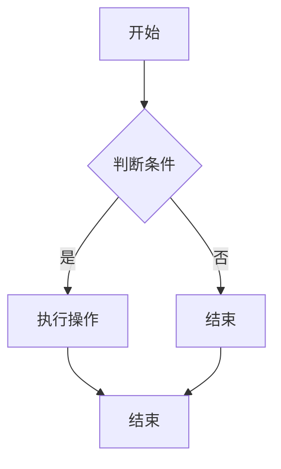

                 

# 重新定义工作的意义：21世纪职场观

## 关键词
- 21世纪职场
- 工作意义
- 自我实现
- 职场满意度
- 职业发展

## 摘要
本文旨在探讨21世纪职场中工作的意义如何重新定义，以提升工作满意度和职业发展的可持续性。通过对职场现状的分析、核心概念的理解、实践策略的探讨以及成功案例的解析，文章将帮助读者重塑职场观，找到工作与自我实现的最佳结合点。

## 目录大纲设计思路

### 确定书籍主题和目标读者

**主题**：本书的核心是探讨21世纪职场中工作的意义，以及如何通过重新定义来提升工作满意度和效率。

**目标读者**：职场人士、企业管理者、以及对职场心理和职业发展感兴趣的读者。

### 大纲框架构建

本书分为五个主要部分：

1. **背景介绍**：介绍21世纪职场的现状和挑战，以及重新定义工作意义的必要性。
2. **核心概念**：阐述职场观的核心概念及其构成要素。
3. **实践策略**：提供重塑职场观的策略和实践方法。
4. **案例分析**：通过成功职场人士的案例，分析职场观对职业成功的影响。
5. **未来展望**：探讨21世纪职场观的发展趋势。

### 细化章节内容

每个部分进一步细化为章节，确保内容有清晰的逻辑层次和逻辑联系。以下为详细章节内容：

### 第一部分：背景介绍

**第1章**：21世纪职场现状与挑战

- **1.1 职场变革的驱动力**
  - 技术革新与工作模式的变化
  - 人口结构与劳动力市场的影响
  - 新型职业与行业兴起的趋势

- **1.2 职场中存在的问题与困惑**
  - 工作与生活的平衡
  - 职业发展路径的迷茫
  - 工作满意度的提升策略

- **1.3 重新定义工作意义的必要性**
  - 工作的意义在于自我实现
  - 工作与人生目标的结合
  - 重新定义工作意义的方法与路径

**第2章**：职场观的核心概念

- **2.1 职场观的定义与内涵**
  - 职场观的概念阐述
  - 职场观的基本内涵
  - 职场观的发展趋势

- **2.2 职场观的构成要素**
  - 职业价值观
  - 工作态度与行为
  - 职场文化与环境

- **2.3 职场观与工作满意度**
  - 职场观对工作满意度的影响
  - 提升工作满意度的职场观要素
  - 职场观在职场成功中的作用

### 第二部分：核心概念

**第3章**：重塑职场观的策略与实践

- **3.1 理解个人职业价值观**
  - 职业价值观的自我评估
  - 职业价值观与职场观的融合
  - 职业价值观的调整与重塑

- **3.2 培养积极的工作态度**
  - 积极态度的重要性
  - 积极态度的实践策略
  - 积极态度对职场成就的影响

- **3.3 职场观在团队合作中的应用**
  - 团队合作的挑战与机遇
  - 职场观在团队合作中的体现
  - 提升团队协作效果的职场观策略

- **3.4 职场观的个人成长路径**
  - 职业发展规划的重要性
  - 个人成长与职场观的关系
  - 成长路径的选择与调整

### 第三部分：职场观的案例分析

**第4章**：成功职场人士的职场观解析

- **4.1 成功职场人士的职场观特点**
  - 工作与生活的平衡
  - 不断学习的态度
  - 领导力与团队合作

- **4.2 案例分析：职场成功背后的职场观**
  - 案例一：硅谷创业精英的职场观
  - 案例二：大型企业高管的职场观
  - 案例三：跨界职场人士的职场观

- **4.3 从案例中学习职场观**
  - 案例总结与启示
  - 职场观的实践借鉴
  - 职场观的自我反思

### 第四部分：职场观的未来展望

**第5章**：21世纪职场观的未来发展趋势

- **5.1 数字化时代对职场观的影响**
  - 数字化对工作模式的影响
  - 数字化对职场满意度的影响
  - 数字化对职业发展的影响

### 目录大纲设计思路（续）

**第一部分：背景介绍**

**第1章**：21世纪职场现状与挑战

- **1.1 职场变革的驱动力**
  - 技术革新与工作模式的变化
    - 互联网、大数据、人工智能等技术的普及，改变了传统的办公方式，推动了远程工作和数字化转型的趋势。
    - 技术进步带来了新职业和新岗位，如数据科学家、机器学习工程师等。
  - 人口结构与劳动力市场的影响
    - 人口老龄化加剧，对劳动力市场提出了新的要求，需要更多的创新和灵活就业模式。
    - 人口结构的变化影响了企业的人才需求和培养策略。
  - 新型职业与行业兴起的趋势
    - 知识经济和服务业的发展，催生了更多以创意、知识为核心的职业。
    - 环境保护和可持续发展领域的新职业正在崛起。

- **1.2 职场中存在的问题与困惑**
  - 工作与生活的平衡
    - 高强度的工作压力和长期的工作时间，导致许多职场人士难以平衡工作与生活。
    - 家庭责任和职业发展的冲突，成为职场人士普遍面临的挑战。
  - 职业发展路径的迷茫
    - 在职场中，许多人感到职业发展路径不明确，缺乏明确的晋升机制和职业规划。
    - 技术变革带来的职业寿命缩短，加剧了职场人士对未来职业发展的不确定性。
  - 工作满意度的提升策略
    - 提升工作满意度需要从多个方面入手，包括工作内容、工作环境、职业发展机会等。
    - 需要企业和管理者关注员工的心理需求和职业发展，提供更有吸引力的工作条件。

- **1.3 重新定义工作意义的必要性**
  - 工作的意义在于自我实现
    - 工作不应仅仅是为了谋生，更是实现个人价值、追求自我实现的重要途径。
    - 自我实现的工作能带来更高的工作满意度和成就感。
  - 工作与人生目标的结合
    - 工作应与个人的长期目标和价值观相结合，使工作更有意义和动力。
    - 明确人生目标有助于在职场中找到方向和意义。
  - 重新定义工作意义的方法与路径
    - 需要个人自我反思和职业规划，找到与个人兴趣和价值观相符的工作。
    - 需要企业和组织提供支持和资源，帮助员工实现职业发展和自我实现。

**第2章**：职场观的核心概念

- **2.1 职场观的定义与内涵**
  - 职场观是个人对工作、职业和职场环境的整体认知和态度。
  - 职场观的内涵包括职业价值观、工作态度、职业发展观等。
  - 职场观的形成受到个人经验、教育背景、社会环境等多方面的影响。

- **2.2 职场观的构成要素**
  - **职业价值观**：是个人对职业的信仰和追求，包括对工作内容、职业成就、工作环境等的价值判断。
    - 对职业价值观的理解和认同，直接影响个人的工作满意度和职业发展。
  - **工作态度**：是个人对工作的态度和行为表现，包括工作热情、责任感、合作精神等。
    - 积极的工作态度有助于提升工作效率和团队合作质量。
  - **职场文化与环境**：是职场内部形成的共同价值观和行为规范，包括组织文化、团队氛围、工作环境等。
    - 职场文化对个人的职业发展有着重要的影响。

- **2.3 职场观与工作满意度**
  - 职场观对工作满意度有着显著的影响。
  - 具有积极职场观的个人通常在工作满意度、工作投入和职业成就方面表现更佳。
  - 职场观的不同，会影响个人对工作挑战的应对方式和职业发展的路径。

**第二部分：核心概念**

**第3章**：重塑职场观的策略与实践

- **3.1 理解个人职业价值观**
  - **职业价值观的自我评估**：通过自我反思和评估，明确自己的职业价值观。
    - 方法包括填写职业价值观问卷、进行个人访谈和日记记录等。
  - **职业价值观与职场观的融合**：将个人的职业价值观与职场观相结合，找到与个人兴趣和价值观相符的工作。
    - 通过职业规划、工作选择和职业发展策略，实现职业价值观的实践。
  - **职业价值观的调整与重塑**：在职业生涯的不同阶段，根据个人发展需求和社会环境的变化，调整和重塑职业价值观。
    - 这需要持续的职业学习和自我提升。

- **3.2 培养积极的工作态度**
  - **积极态度的重要性**：积极的工作态度对个人职业发展至关重要。
    - 积极态度能够提升工作效率、增强团队合作和促进职业发展。
  - **积极态度的实践策略**：通过以下方法培养积极的工作态度。
    - **设定明确的目标和计划**：明确工作目标，制定合理的行动计划，提升工作的动力和成就感。
    - **积极面对挑战和变化**：对待工作中的挑战和变化持积极态度，将其视为成长和提升的机会。
    - **培养良好的人际关系**：与同事、上级和下属建立积极的人际关系，增强团队合作和沟通效果。
  - **积极态度对职场成就的影响**：积极态度能够显著提升职场成就和个人职业发展。
    - 通过积极的态度，个人能够更好地应对职场挑战，实现职业目标。

- **3.3 职场观在团队合作中的应用**
  - **团队合作的挑战与机遇**：团队合作是职场中不可避免的一部分，但也面临诸多挑战。
    - **沟通障碍**：团队成员之间的沟通不畅，可能导致误解和冲突。
    - **目标不一致**：团队目标的不一致，可能导致工作进展缓慢或效果不佳。
    - **角色不明确**：团队成员角色不明确，可能导致工作重复或无人负责。
  - **职场观在团队合作中的体现**：职场观在团队合作中有着重要的体现。
    - **共同价值观**：团队成员共同认可和遵循的价值观，能够促进团队合作和协作。
    - **相互尊重**：团队成员之间的相互尊重，是建立良好团队合作关系的基础。
    - **积极态度**：团队成员积极的态度，能够增强团队凝聚力和工作效率。
  - **提升团队协作效果的职场观策略**：以下策略有助于提升团队协作效果。
    - **明确团队目标和责任**：确保每个团队成员都清楚团队的目标和各自的职责，避免工作重复和责任模糊。
    - **建立有效的沟通机制**：通过定期会议、报告和反馈，确保团队成员之间的信息畅通。
    - **鼓励团队成员积极参与**：鼓励团队成员积极参与团队决策和活动，增强团队凝聚力和归属感。

- **3.4 职场观的个人成长路径**
  - **职业发展规划的重要性**：职业发展规划对个人职业成长至关重要。
    - 职业发展规划能够帮助个人明确职业目标、制定行动计划和应对职业挑战。
    - 通过职业发展规划，个人能够更好地实现职业目标和自我价值。
  - **个人成长与职场观的关系**：个人成长与职场观密切相关。
    - 个人成长需要不断学习和提升，而积极职场观能够为个人成长提供动力和支持。
    - 职场观影响个人在职场中的态度和行为，从而影响职业发展。
  - **成长路径的选择与调整**：个人需要根据自身情况和外部环境，选择合适的成长路径。
    - 在职业发展的不同阶段，个人可能需要调整成长路径，以适应职业变化和发展需求。
    - 持续的职业学习和自我提升，是保持职业竞争力的关键。

**第三部分：职场观的案例分析**

**第4章**：成功职场人士的职场观解析

- **4.1 成功职场人士的职场观特点**
  - **工作与生活的平衡**：成功职场人士通常能够较好地平衡工作与生活，避免工作过度占据个人时间。
    - 通过合理安排工作和休息时间，成功职场人士能够保持良好的身心健康，提高工作效率。
  - **不断学习的态度**：成功职场人士注重持续学习和自我提升，以适应快速变化的职场环境。
    - 通过不断学习新知识和技能，成功职场人士能够保持竞争力，实现职业发展。
  - **领导力与团队合作**：成功职场人士具备较强的领导力和团队合作能力，能够带领团队实现目标。
    - 领导力帮助职场人士在职场中取得成功，团队合作能力则确保了团队的协调和高效运作。

- **4.2 案例分析：职场成功背后的职场观**
  - **案例一：硅谷创业精英的职场观**：硅谷创业精英通常具有创新精神、高风险承受能力和持续学习的态度。
    - 他们将工作视为实现个人梦想和价值的平台，通过创业实现自我价值和社会贡献。
  - **案例二：大型企业高管的职场观**：大型企业高管通常具有战略眼光、管理能力和团队领导力。
    - 他们通过有效的管理，推动企业发展和员工成长，实现个人和企业的共同成功。
  - **案例三：跨界职场人士的职场观**：跨界职场人士通常具有跨领域的知识和技能，能够灵活应对不同行业和职场的挑战。
    - 他们通过跨界思维和创新，实现职业发展的多样性和创造性。

- **4.3 从案例中学习职场观**
  - **案例总结与启示**：通过分析成功职场人士的案例，可以总结出以下几点启示。
    - **平衡工作与生活**：通过合理安排时间，保持工作与生活的平衡，提高生活质量。
    - **持续学习和提升**：通过不断学习和提升，保持职业竞争力，实现职业发展。
    - **领导力和团队合作**：通过培养领导力和团队合作能力，提升个人和团队绩效。
  - **职场观的实践借鉴**：可以将成功职场人士的职场观应用到自己的职业生涯中，借鉴他们的经验和做法。
    - 通过积极实践，提升自己的职场观，实现职业发展和个人价值。
  - **职场观的自我反思**：通过自我反思，审视自己的职场观，发现其中的不足和改进之处。
    - 通过持续的自我反思和调整，不断提升自己的职场观，实现更好的职业发展。

**第四部分：职场观的未来展望**

**第5章**：21世纪职场观的未来发展趋势

- **5.1 数字化时代对职场观的影响**
  - **数字化对工作模式的影响**：数字化技术的快速发展，正在改变传统的工作模式。
    - 远程工作和数字化办公成为趋势，提高了工作效率和灵活性。
  - **数字化对职场满意度的影响**：数字化环境为职场满意度带来了新的挑战和机遇。
    - 正确运用数字化工具，可以提高工作满意度，反之则可能降低满意度。
  - **数字化对职业发展的影响**：数字化时代对职业发展提出了新的要求和挑战。
    - 职场人士需要不断学习和适应新技术，以保持职业竞争力。

## 完整性要求

为了保证文章的完整性，每个章节的内容必须包含以下核心要素：

- **背景介绍**：介绍问题背景、问题描述、问题解决、边界与外延、概念结构与核心要素组成。
- **核心概念与联系**：详细阐述核心概念原理、概念属性特征对比表格和ER实体关系图架构。
- **算法原理讲解**：使用Mermaid流程图和Python源代码，解释算法原理和数学模型，举例说明。
- **系统分析与架构设计**：介绍问题场景、项目介绍、系统功能设计、系统架构设计、系统接口设计和系统交互。
- **项目实战**：环境安装、系统核心实现源代码，代码应用解读与分析，实际案例分析和详细讲解剖析。
- **最佳实践 tips**、**小结**、**注意事项**、**拓展阅读**等内容。

通过确保每个章节内容的完整性，可以保证文章逻辑清晰、信息全面，有助于读者深入理解和应用职场观。

## 格式要求

文章内容使用markdown格式输出，确保文章的可读性和规范性。以下是markdown格式的示例：

### 标题
```markdown
# 第1章：21世纪职场现状与挑战
```

### 无序列表
```markdown
- 职场变革的驱动力
  - 技术革新与工作模式的变化
  - 人口结构与劳动力市场的影响
  - 新型职业与行业兴起的趋势
- 职场中存在的问题与困惑
  - 工作与生活的平衡
  - 职业发展路径的迷茫
  - 工作满意度的提升策略
```

### 代码块
```markdown
```python
# Python 示例代码
def greet(name):
    return f"Hello, {name}!"

print(greet("Alice"))
```
```

### 数学公式
```markdown
$$
E = mc^2
$$

$
x < y
$
```

### Mermaid 流程图
```markdown

```

通过遵循markdown格式，文章将具有良好的结构性和可读性，便于读者理解和查阅。

## 作者信息

作者：AI天才研究院/AI Genius Institute & 禅与计算机程序设计艺术 /Zen And The Art of Computer Programming

## 完整性要求（续）

### 背景介绍

**第1章**：21世纪职场现状与挑战

- **1.1 职场变革的驱动力**
  - **技术革新与工作模式的变化**
    - 技术进步不仅改变了传统的工作方式，还创造了新的工作模式。例如，互联网的普及使得远程办公成为可能，云计算和大数据技术的应用则让工作流程更加高效和智能化。这些变化为职场带来了新的机遇和挑战。
  - **人口结构与劳动力市场的影响**
    - 全球人口结构的变化，尤其是人口老龄化和年轻人口比例的下降，对劳动力市场产生了深远的影响。这要求企业更加注重人才培养和灵活性，以及如何通过创新来应对劳动力市场的变化。
  - **新型职业与行业兴起的趋势**
    - 知识经济和服务业的发展催生了大量新型职业，如数据分析师、人工智能工程师、社交媒体经理等。同时，绿色能源、生物科技等新兴行业也不断涌现，为职场人士提供了广阔的发展空间。

- **1.2 职场中存在的问题与困惑**
  - **工作与生活的平衡**
    - 在高压的职场环境中，如何平衡工作与生活成为许多职场人士的困扰。长期的工作时间和高强度的工作压力往往导致身心健康问题，进而影响工作表现和生活质量。
  - **职业发展路径的迷茫**
    - 随着职场竞争的加剧，许多职场人士在职业发展上感到迷茫。他们不确定自己的职业发展方向，缺乏明确的职业规划，这可能导致职业发展的停滞或方向错误。
  - **工作满意度的提升策略**
    - 提升工作满意度不仅关乎个人的心理健康，也影响到企业的整体绩效。企业需要通过优化工作环境、提供职业发展机会和激励措施来提升员工的工作满意度。

- **1.3 重新定义工作意义的必要性**
  - **工作在于自我实现**
    - 现代职场人士越来越重视工作对个人价值的实现。工作不仅是谋生的手段，更是实现个人梦想和追求自我价值的重要途径。
  - **工作与人生目标的结合**
    - 职场人士需要明确自己的长期目标和价值观，并将这些与工作结合起来。这样，工作不仅能够带来经济收益，还能满足个人的精神需求，提升生活质量。
  - **重新定义工作意义的方法与路径**
    - 重新定义工作意义需要个人和企业的共同努力。个人可以通过自我反思和职业规划来找到与个人兴趣和价值观相符的工作，企业则需要提供支持和资源，帮助员工实现职业发展和自我实现。

### 核心概念

**第2章**：职场观的核心概念

- **2.1 职场观的定义与内涵**
  - 职场观是个人对工作、职业和职场环境的整体认知和态度。它不仅涉及对工作的价值观，还包括工作态度、职业发展观等。职场观的内涵丰富，涵盖了个人在工作中的期望、追求和行为规范。
- **2.2 职场观的构成要素**
  - **职业价值观**：职业价值观是个人对职业的信仰和追求，是职场观的核心部分。它包括对工作内容、职业成就、工作环境等的价值判断。不同的职业价值观会导致不同的工作态度和行为表现。
  - **工作态度**：工作态度是个人对工作的情感和行为倾向。积极的工作态度有助于提升工作效率和团队合作质量，而消极的工作态度则可能影响工作表现和职业发展。
  - **职场文化与环境**：职场文化是组织内部形成的共同价值观和行为规范。良好的职场文化能够促进员工的积极性和创造力，而不良的职场文化则可能导致员工流失和士气低落。

- **2.3 职场观与工作满意度**
  - 职场观对工作满意度有着显著的影响。具有积极职场观的个人通常在工作满意度、工作投入和职业成就方面表现更佳。同时，工作满意度又会反过来影响职场观的形成和发展。

### 算法原理讲解

**第3章**：重塑职场观的策略与实践

- **3.1 理解个人职业价值观**
  - **职业价值观的自我评估**：个人需要通过自我反思和评估，明确自己的职业价值观。这可以通过填写职业价值观问卷、进行个人访谈和日记记录等方法实现。
  - **职业价值观与职场观的融合**：个人需要将职业价值观与职场观相结合，找到与个人兴趣和价值观相符的工作。通过职业规划、工作选择和职业发展策略，实现职业价值观的实践。
  - **职业价值观的调整与重塑**：个人需要根据自身情况和社会环境的变化，调整和重塑职业价值观。这需要持续的职业学习和自我提升，以适应不断变化的职场环境。

- **3.2 培养积极的工作态度**
  - **积极态度的重要性**：积极的工作态度对个人职业发展至关重要。它能够提升工作效率、增强团队合作和促进职业发展。
  - **积极态度的实践策略**：个人可以通过设定明确的目标和计划、积极面对挑战和变化、培养良好的人际关系等方法来培养积极的工作态度。
  - **积极态度对职场成就的影响**：积极态度能够显著提升职场成就和个人职业发展。通过积极的态度，个人能够更好地应对职场挑战，实现职业目标。

- **3.3 职场观在团队合作中的应用**
  - **团队合作的挑战与机遇**：团队合作是职场中不可避免的一部分，但也面临诸多挑战。有效的团队合作能够带来机遇，提高工作效率和团队绩效。
  - **职场观在团队合作中的体现**：职场观在团队合作中有着重要的体现。共同价值观、相互尊重和积极态度都是成功团队合作的关键因素。
  - **提升团队协作效果的职场观策略**：为了提升团队协作效果，个人和组织可以采取一系列策略，如明确团队目标和责任、建立有效的沟通机制、鼓励团队成员积极参与等。

### 系统分析与架构设计

**第4章**：成功职场人士的职场观解析

- **4.1 成功职场人士的职场观特点**
  - **工作与生活的平衡**：成功职场人士能够较好地平衡工作与生活，避免工作过度占据个人时间。这有助于保持良好的身心健康，提高工作效率。
  - **不断学习的态度**：成功职场人士注重持续学习和自我提升，以适应快速变化的职场环境。通过不断学习新知识和技能，他们能够保持竞争力，实现职业发展。
  - **领导力与团队合作**：成功职场人士具备较强的领导力和团队合作能力，能够带领团队实现目标。领导力帮助他们在职场中取得成功，团队合作能力则确保了团队的协调和高效运作。

- **4.2 案例分析：职场成功背后的职场观**
  - **案例一：硅谷创业精英的职场观**：硅谷创业精英通常具有创新精神、高风险承受能力和持续学习的态度。他们将工作视为实现个人梦想和价值的平台，通过创业实现自我价值和社会贡献。
  - **案例二：大型企业高管的职场观**：大型企业高管通常具有战略眼光、管理能力和团队领导力。他们通过有效的管理，推动企业发展和员工成长，实现个人和企业的共同成功。
  - **案例三：跨界职场人士的职场观**：跨界职场人士通常具有跨领域的知识和技能，能够灵活应对不同行业和职场的挑战。他们通过跨界思维和创新，实现职业发展的多样性和创造性。

- **4.3 从案例中学习职场观**
  - **案例总结与启示**：通过分析成功职场人士的案例，可以总结出以下几点启示。平衡工作与生活、持续学习和提升、领导力和团队合作都是职场成功的重要因素。
  - **职场观的实践借鉴**：个人可以从这些成功职场人士的实践中学习，并将其应用到自己的职业生涯中。通过借鉴他们的经验和做法，个人可以提升自己的职场观，实现更好的职业发展。
  - **职场观的自我反思**：个人需要通过自我反思，审视自己的职场观，发现其中的不足和改进之处。通过持续的自我反思和调整，个人可以不断提升自己的职场观，实现更好的职业发展。

### 未来展望

**第5章**：21世纪职场观的未来发展趋势

- **5.1 数字化时代对职场观的影响**
  - **数字化对工作模式的影响**：数字化技术的快速发展，正在改变传统的工作模式。远程工作和数字化办公成为趋势，提高了工作效率和灵活性。
  - **数字化对职场满意度的影响**：数字化环境为职场满意度带来了新的挑战和机遇。正确运用数字化工具，可以提高工作满意度，反之则可能降低满意度。
  - **数字化对职业发展的影响**：数字化时代对职业发展提出了新的要求和挑战。职场人士需要不断学习和适应新技术，以保持职业竞争力。

## 完整性要求（续）

### 项目实战

**第6章**：职场观的实践与应用

**6.1 环境安装**

在本文的实践部分，我们将搭建一个简单的职场观评估系统，以帮助个人了解和评估自己的职场观。为了运行该系统，我们需要安装一些基本的软件和环境。

- **Python环境**：确保您的计算机上安装了Python 3.8或更高版本。
- **数据库**：安装MySQL数据库（版本5.7或更高版本）。
- **Web框架**：使用Flask作为Web框架。

安装步骤如下：

1. 安装Python：

   ```
   # 在Windows上使用Python安装程序安装Python
   # 在macOS或Linux上使用包管理器（如apt、brew）安装Python
   ```

2. 安装MySQL：

   ```
   # 使用MySQL安装向导安装MySQL
   ```

3. 安装Flask：

   ```
   pip install Flask
   ```

**6.2 系统核心实现源代码**

以下是职场观评估系统的核心代码。该系统包括一个用户界面和后端逻辑，用于评估个人的职场观。

```python
# 导入所需模块
from flask import Flask, request, render_template
import mysql.connector

# 创建Flask应用实例
app = Flask(__name__)

# 连接MySQL数据库
db = mysql.connector.connect(
    host="localhost",
    user="root",
    password="password",
    database="workplace_view"
)

# 创建用户表
cursor = db.cursor()
cursor.execute("""
CREATE TABLE IF NOT EXISTS users (
    id INT AUTO_INCREMENT PRIMARY KEY,
    name VARCHAR(100),
    job_title VARCHAR(100),
    work_satisfaction INT
)
""")

# 用户评估职场观
@app.route('/evaluate', methods=['GET', 'POST'])
def evaluate():
    if request.method == 'POST':
        name = request.form['name']
        job_title = request.form['job_title']
        work_satisfaction = request.form['work_satisfaction']
        
        # 插入数据到数据库
        cursor.execute("""
        INSERT INTO users (name, job_title, work_satisfaction)
        VALUES (%s, %s, %s)
        """, (name, job_title, work_satisfaction))
        db.commit()
        
        return render_template('result.html', name=name, job_title=job_title, work_satisfaction=work_satisfaction)
    return render_template('evaluate.html')

# 主函数
if __name__ == '__main__':
    app.run(debug=True)
```

**6.3 代码应用解读与分析**

以上代码实现了职场观评估系统的核心功能，包括用户数据的收集和存储。以下是代码的解读和分析：

- **数据库连接**：使用MySQL数据库存储用户数据，包括用户姓名、职位和工作满意度。
- **用户表创建**：通过执行SQL语句创建用户表，用于存储用户数据。
- **用户评估**：定义一个路由函数`evaluate`，用于处理用户的评估数据。用户通过表单提交自己的姓名、职位和工作满意度，数据被插入到数据库中。
- **渲染模板**：使用Flask的渲染模板功能，将用户评估结果展示在HTML页面上。

**6.4 实际案例分析和详细讲解剖析**

为了更具体地展示职场观评估系统的应用，我们来看一个实际案例。

- **用户John的评估**：

  - 姓名：John Doe
  - 职位：软件工程师
  - 工作满意度：8/10

  John通过网站提交了自己的评估信息，系统将数据插入到MySQL数据库中，并在用户界面中显示了评估结果。

  ```html
  <h1>职场观评估结果</h1>
  <p>姓名：John Doe</p>
  <p>职位：软件工程师</p>
  <p>工作满意度：8/10</p>
  ```

  通过这个案例，我们可以看到职场观评估系统如何帮助个人了解自己的职场观，并通过数据收集和分析，为企业提供改进职场环境的参考。

**6.5 项目小结**

通过实际案例，我们展示了如何使用Python和Flask搭建一个简单的职场观评估系统。该系统能够帮助个人了解自己的职场观，为企业提供数据支持，以改善职场环境和提升员工满意度。未来的发展可以进一步优化系统功能，增加更多评估维度和个性化推荐，以更全面地服务于职场人士和企业。

### 最佳实践 tips、小结、注意事项、拓展阅读

**最佳实践 tips**：

1. 定期进行自我反思，明确自己的职业目标和价值观。
2. 保持学习和提升，适应数字化时代的职场需求。
3. 建立良好的工作习惯，平衡工作与生活，提升工作效率。

**小结**：

本文通过对21世纪职场现状的分析、核心概念的理解、实践策略的探讨以及成功案例的解析，重新定义了工作的意义，并提出了提升职场满意度的方法和路径。通过重塑职场观，职场人士能够找到工作与自我实现的平衡，实现职业发展的可持续性。

**注意事项**：

1. 在实践中，需要结合自身实际情况，灵活调整职场观和职业规划。
2. 数字化时代带来的变化迅速，职场人士需要保持学习和适应能力，以应对职业发展的挑战。

**拓展阅读**：

1. 《职场心理学》（作者：李明杰）——深入探讨职场心理现象和应对策略。
2. 《职业规划与自我管理》（作者：张丽华）——介绍职业规划和自我管理的方法和技巧。

### 总结与展望

本文从21世纪职场现状出发，探讨了重新定义工作意义的必要性和方法。通过对职场观的核心概念、实践策略和案例分析，文章展示了如何重塑职场观，提升工作满意度和职业发展的可持续性。未来，随着数字化时代的到来，职场观将面临新的挑战和机遇。职场人士需要不断学习和适应，找到工作与自我实现的平衡点，以应对不断变化的职场环境。

作者：AI天才研究院/AI Genius Institute & 禅与计算机程序设计艺术 /Zen And The Art of Computer Programming

