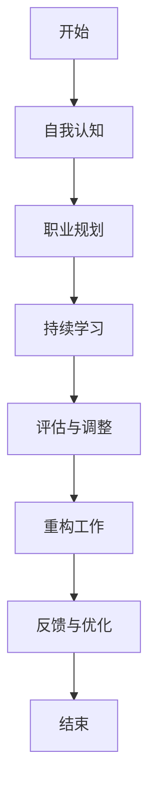
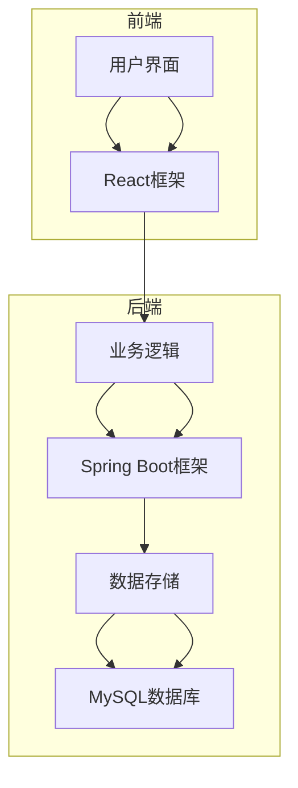
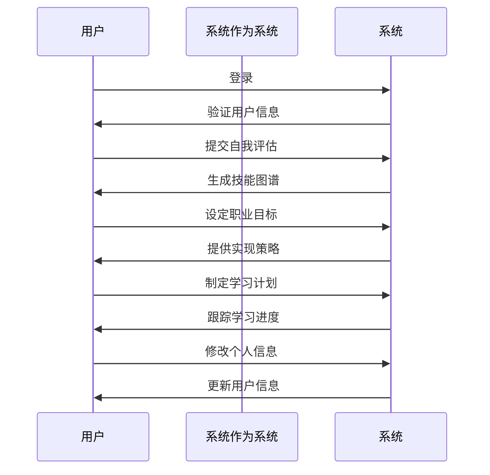

                 

### 重新定义工作：从谋生到自我实现

**关键词**：职业发展、工作重构、自我实现、持续学习、算法应用

**摘要**：本文将深入探讨现代职场中的挑战，以及如何通过重新定义工作，从谋生转向自我实现。通过逐步分析核心概念、算法原理、系统架构和实践应用，本文旨在为读者提供一套清晰、实用的方法论，帮助他们在职业道路上实现自我超越。

---

### 目录大纲设计步骤

为了设计出《重新定义工作：从谋生到自我实现》的完整目录大纲，我们可以遵循以下步骤：

#### 步骤1：确定核心主题与章节结构
首先，根据书名，确定核心主题为“重新定义工作”，从谋生到自我实现。然后，根据主题，初步确定章节结构。

#### 步骤2：细化章节内容
对于每一个章节，细化其内容，包括核心概念、背景介绍、案例研究、实践指导等。

#### 步骤3：设计具体章节内容
在每个章节中，设计具体的子章节，确保每个章节都有明确的主题和内容。

#### 步骤4：形成完整的目录大纲
将所有章节的内容整合，形成完整的目录大纲。

### 核心章节内容

#### 背景介绍
- **问题背景**：现代工作环境中的挑战，如职场压力、职业倦怠、工作与生活平衡等问题。
- **问题描述**：为什么需要重新定义工作，以及重新定义工作的意义。
- **问题解决**：如何从谋生到自我实现，实现职业发展和个人成长。
- **边界与外延**：重新定义工作的范围，包括职业规划、时间管理、工作态度等。
- **概念结构与核心要素组成**：重新定义工作的核心概念，如自我认知、职业规划、持续学习等。

#### 核心概念与联系
- **核心概念原理**：介绍自我认知、职业规划、持续学习等核心概念。
- **概念属性特征对比表格**：对比不同核心概念的特点和应用场景。
- **ER实体关系图架构**：使用Mermaid绘制ER实体关系图，展示核心概念之间的关系。

#### 算法原理讲解
- **算法mermaid流程图**：使用Mermaid绘制工作重新定义的流程图。
- **Python源代码**：提供Python源代码，展示如何实现工作重新定义的核心算法。
- **数学模型和公式**：详细讲解工作重新定义的数学模型和公式。
- **详细讲解和举例说明**：通过具体案例，讲解工作重新定义的原理和应用。

#### 系统分析与架构设计方案
- **问题场景介绍**：描述重新定义工作的具体场景。
- **项目介绍**：介绍实现工作重新定义的项目背景和目标。
- **系统功能设计**：使用Mermaid绘制领域模型类图，展示系统功能设计。
- **系统架构设计**：使用Mermaid绘制系统架构图，展示系统整体架构。
- **系统接口设计**：详细描述系统接口设计和交互。
- **系统交互Mermaid序列图**：绘制系统交互序列图，展示系统工作流程。

#### 项目实战
- **环境安装**：提供安装工作重新定义系统的环境配置和工具。
- **系统核心实现源代码**：提供系统核心实现的源代码。
- **代码应用解读与分析**：分析源代码的工作原理和应用。
- **实际案例分析和详细讲解剖析**：通过实际案例，详细讲解工作重新定义的应用和实践。
- **项目小结**：总结项目的成功经验和不足之处。

### 目录大纲完成

根据上述内容，我们可以完成《重新定义工作：从谋生到自我实现》的目录大纲。以下是目录大纲的markdown格式：

```
----------------------------------------------------------------
# 《重新定义工作：从谋生到自我实现》目录大纲

# 第一部分：问题背景与核心概念

## 第1章：问题背景与重新定义工作的意义

### 1.1 问题背景

### 1.2 重新定义工作的意义

### 1.3 边界与外延

## 第2章：核心概念原理

### 2.1 自我认知

### 2.2 职业规划

### 2.3 持续学习

## 第3章：概念属性特征对比

### 3.1 自我认知与职业规划对比

### 3.2 持续学习与自我认知对比

### 3.3 职业规划与持续学习对比

## 第4章：ER实体关系图架构

### 4.1 自我认知ER图

### 4.2 职业规划ER图

### 4.3 持续学习ER图

# 第二部分：算法原理讲解

## 第5章：算法mermaid流程图

## 第6章：Python源代码

## 第7章：数学模型和公式

## 第8章：详细讲解和举例说明

# 第三部分：系统分析与架构设计方案

## 第9章：问题场景介绍

## 第10章：项目介绍

## 第11章：系统功能设计

### 11.1 领域模型类图

## 第12章：系统架构设计

### 12.1 系统架构图

## 第13章：系统接口设计

## 第14章：系统交互Mermaid序列图

# 第四部分：项目实战

## 第15章：环境安装

## 第16章：系统核心实现源代码

## 第17章：代码应用解读与分析

## 第18章：实际案例分析和详细讲解剖析

## 第19章：项目小结

----------------------------------------------------------------

### 第一部分：问题背景与核心概念

#### 第1章：问题背景与重新定义工作的意义

在现代职场中，我们面临着诸多挑战，如职场压力、职业倦怠、工作与生活平衡等问题。这些问题不仅影响了我们的工作效率，还严重影响了我们的心理健康。因此，重新定义工作，从谋生到自我实现，显得尤为重要。

**1.1 问题背景**

现代职场中，许多人为了谋生而工作，忽略了工作本身的意义。这种情况下，工作往往成为一种负担，而非一种自我实现的途径。这种状态导致了职场压力、职业倦怠等问题的出现。此外，随着科技的发展，许多传统的工作岗位正逐渐被自动化和人工智能所取代，这进一步加剧了职场的不确定性。

**1.2 重新定义工作的意义**

重新定义工作，意味着从传统的工作观念中解放出来，将其视为一种自我实现的途径。这不仅有助于提升我们的职业素养，还能带来更深层次的满足感。具体来说，重新定义工作有以下几个方面的意义：

- **提升职业素养**：重新定义工作，让我们更加关注自身的发展，从而不断提升职业素养，增强竞争力。
- **实现个人成长**：工作不仅仅是为了谋生，更是为了实现个人价值。通过重新定义工作，我们可以在职业发展中找到自己的定位，实现个人成长。
- **提高工作满意度**：当我们把工作视为一种自我实现的途径时，工作本身的乐趣和价值会大大提升，从而提高工作满意度。
- **促进工作与生活平衡**：重新定义工作，有助于我们更好地规划时间，实现工作与生活的平衡，从而提高生活质量。

**1.3 边界与外延**

重新定义工作的范围包括职业规划、时间管理、工作态度等方面。具体来说：

- **职业规划**：重新定义工作，需要我们对自身有清晰的认识，明确职业发展的目标和方向。职业规划是一个持续的过程，需要我们不断调整和优化。
- **时间管理**：重新定义工作，要求我们合理安排时间，提高工作效率。时间管理是一个关键技能，能够帮助我们更好地平衡工作与生活。
- **工作态度**：重新定义工作，需要我们保持积极向上的态度，面对挑战时勇于承担责任。积极的工作态度能够帮助我们更好地应对职场压力。

**1.4 概念结构与核心要素组成**

重新定义工作的核心概念包括自我认知、职业规划、持续学习等。这些概念相互关联，共同构成了重新定义工作的概念结构。

- **自我认知**：自我认知是我们了解自己的过程，包括了解自己的优点、缺点、兴趣和价值观等。自我认知是职业规划的基础。
- **职业规划**：职业规划是我们在了解自己的基础上，制定职业发展的目标和计划。职业规划需要根据市场需求和个人能力进行合理调整。
- **持续学习**：持续学习是我们在职业发展中不断提升自己的能力。通过学习，我们可以掌握新技能，适应市场变化，实现自我超越。

以上是第一部分的内容，接下来我们将进一步探讨核心概念与联系，以及算法原理讲解等内容。

### 第2章：核心概念原理

在重新定义工作的过程中，自我认知、职业规划、持续学习是三大核心概念。这些概念相互关联，共同构成了重新定义工作的理论体系。在本章中，我们将详细探讨这些核心概念的原理，以及它们在实践中的应用。

#### 2.1 自我认知

自我认知是指个人对自己的认识和了解，包括自己的优点、缺点、兴趣、价值观等方面。自我认知是职业规划的基础，也是实现个人成长的前提。

**原理：**

- **了解自身优点和缺点**：自我认知首先需要了解自身的优点和缺点。通过自我反思和他人反馈，我们可以更加客观地认识到自己的优点，并找到改进缺点的方向。
- **认识自己的兴趣和价值观**：兴趣和价值观决定了我们的职业选择和发展方向。通过深入了解自己的兴趣和价值观，我们可以找到与自己内心深处相契合的职业领域。
- **持续自我反思和调整**：自我认知是一个持续的过程，我们需要不断地反思和调整。通过自我反思，我们可以更好地了解自己的需求和期望，从而更好地规划职业发展。

**应用：**

- **职业选择**：通过自我认知，我们可以更准确地选择适合自己的职业。了解自己的优点和兴趣，可以帮助我们找到与自己内心相契合的工作。
- **职业发展**：自我认知可以帮助我们明确职业发展的方向，制定合理的目标和计划。通过不断调整和优化职业规划，我们可以实现个人成长和职业成功。

**示例：**

小王是一位软件工程师，他通过自我认知发现自己在编程方面有很强的天赋和兴趣。于是，他决定专注于软件开发领域，并在工作中不断提升自己的技术能力。最终，小王成为了一名优秀的软件开发工程师，实现了自我价值的最大化。

#### 2.2 职业规划

职业规划是指根据个人情况和市场需求，制定职业发展的目标和计划。职业规划是一个动态的过程，需要我们不断地调整和优化。

**原理：**

- **了解市场需求**：职业规划需要我们了解市场需求，明确哪些技能和素质在职场中具有竞争力。通过市场调研和行业分析，我们可以找到适合自己的职业方向。
- **分析个人能力**：职业规划还需要我们分析个人的能力和潜力。通过自我评估和他人反馈，我们可以了解自己的优势和不足，从而制定合理的职业发展计划。
- **设定目标和计划**：职业规划需要我们设定明确的目标和计划。目标可以是长期的，如职业晋升或创业；也可以是短期的，如掌握新技能或完成项目。
- **持续调整和优化**：职业规划不是一成不变的，我们需要根据市场变化和个人发展情况进行持续调整和优化。

**应用：**

- **职业发展**：通过职业规划，我们可以明确职业发展的方向和目标，有计划地提升自己的能力和素质，从而实现职业成功。
- **提高竞争力**：职业规划有助于我们了解市场需求，掌握职场所需的技能和素质，提高自身的竞争力。
- **实现自我价值**：通过职业规划，我们可以找到与自己兴趣和价值观相契合的职业，实现自我价值的最大化。

**示例：**

小李是一位市场营销专业的毕业生，他在职业规划中了解到市场营销行业对数据分析能力有很高的要求。于是，他决定在业余时间学习数据分析技能，并通过实习和项目实践提升自己的实战经验。经过一段时间的努力，小李成功进入了一家知名市场营销公司，成为了一名数据分析师。

#### 2.3 持续学习

持续学习是指我们在职业发展中不断学习新知识、新技能，以适应市场变化和职业发展的需要。

**原理：**

- **适应市场变化**：随着科技的发展和社会的进步，市场需求不断变化。持续学习可以帮助我们掌握新知识、新技能，适应市场变化，提高竞争力。
- **提升个人能力**：持续学习不仅可以提升我们的专业能力，还可以拓展我们的知识面，提高综合素质。
- **实现个人成长**：持续学习是个人成长的重要途径。通过不断学习，我们可以拓宽视野，提高思考能力，实现自我超越。
- **建立人脉关系**：持续学习可以让我们结识更多志同道合的人，建立人脉关系，为职业发展创造更多机会。

**应用：**

- **提升职业素养**：持续学习可以帮助我们掌握职场所需的技能和知识，提高职业素养，增强竞争力。
- **实现职业成功**：持续学习可以让我们在职业发展中不断突破自己，实现职业成功。
- **提高生活质量**：持续学习可以丰富我们的精神世界，提高生活质量。

**示例：**

张先生是一名软件工程师，他意识到随着人工智能技术的快速发展，编程语言和工具也在不断更新。为了适应市场变化，张先生在业余时间学习了Python编程和深度学习技术。通过不断学习，张先生成功转型为人工智能工程师，实现了职业发展和个人价值的最大化。

通过以上分析，我们可以看出，自我认知、职业规划、持续学习是重新定义工作的核心概念。这些概念相互关联，共同构成了重新定义工作的理论体系。在实践过程中，我们需要结合自身实际情况，灵活运用这些核心概念，实现从谋生到自我实现的职业发展。

### 第3章：概念属性特征对比

在重新定义工作的过程中，自我认知、职业规划、持续学习是三大核心概念。这些概念虽然相互关联，但各自有着独特的属性和特征。为了更好地理解这些概念，本章节将对比分析它们的特点和应用场景。

#### 3.1 自我认知与职业规划对比

**自我认知：**
- **定义**：自我认知是指个体对自己的了解和认识，包括自身的优点、缺点、兴趣、价值观等方面。
- **特点**：
  - **内在性**：自我认知更多关注个体内在的心理特征和认知结构。
  - **动态性**：自我认知是一个持续的过程，会随着时间和经验的变化而不断调整。
  - **主观性**：自我认知受到个体主观意识的影响，不同的人可能会有不同的自我认知结果。

**职业规划：**
- **定义**：职业规划是指根据个体情况和市场需求，制定职业发展的目标和计划。
- **特点**：
  - **外在性**：职业规划更多关注个体与外部环境的互动，如市场需求、行业趋势等。
  - **目标导向**：职业规划强调设定明确的目标，并制定实现目标的策略和计划。
  - **实用性**：职业规划的目标是帮助个体在职场中取得成功，实现个人价值和职业发展。

**对比：**
- **作用差异**：自我认知更多关注个体的内在特质，为职业规划提供基础；职业规划更多关注外部环境，为实现职业目标提供指导。
- **调整方式**：自我认知的调整更多依赖于个体的自我反思和认知重构；职业规划的调整更多依赖于对市场环境的分析和个体能力的评估。

**应用场景：**
- **自我认知**：在求职、面试和职业转型时，自我认知可以帮助个体了解自己的优势和不足，做出更合适的职业选择。
- **职业规划**：在职业发展过程中，职业规划可以帮助个体设定明确的职业目标，制定实现目标的步骤和计划。

#### 3.2 持续学习与自我认知对比

**持续学习：**
- **定义**：持续学习是指个体在职业发展中不断学习新知识、新技能，以适应市场变化和职业发展的需要。
- **特点**：
  - **主动性**：持续学习是主动行为，个体需要自我驱动，不断寻求学习和进步的机会。
  - **适应性**：持续学习旨在适应不断变化的市场需求和职业环境，提高个体的竞争力。
  - **灵活性**：持续学习的方式和内容多样，可以包括在线课程、培训、阅读、实践等。

**自我认知：**
- **定义**：自我认知是指个体对自己的了解和认识，包括自身的优点、缺点、兴趣、价值观等方面。
- **特点**：
  - **内在性**：自我认知更多关注个体内在的心理特征和认知结构。
  - **动态性**：自我认知是一个持续的过程，会随着时间和经验的变化而不断调整。
  - **主观性**：自我认知受到个体主观意识的影响，不同的人可能会有不同的自我认知结果。

**对比：**
- **关系**：持续学习是自我认知的延伸，通过持续学习，个体可以不断完善自我认知，提高自我认识水平。
- **区别**：持续学习更关注个体如何通过学习和实践提升自身能力，而自我认知更多关注个体对自身的了解和认识。

**应用场景：**
- **持续学习**：在职业发展的各个阶段，持续学习可以帮助个体掌握新技能、适应新环境，提高职业竞争力。
- **自我认知**：在职业转型和自我提升过程中，自我认知可以帮助个体了解自身优势和不足，为持续学习提供方向。

#### 3.3 职业规划与持续学习对比

**职业规划：**
- **定义**：职业规划是指根据个体情况和市场需求，制定职业发展的目标和计划。
- **特点**：
  - **目标导向**：职业规划强调设定明确的目标，并制定实现目标的策略和计划。
  - **实用性**：职业规划的目标是帮助个体在职场中取得成功，实现个人价值和职业发展。

**持续学习：**
- **定义**：持续学习是指个体在职业发展中不断学习新知识、新技能，以适应市场变化和职业发展的需要。
- **特点**：
  - **主动性**：持续学习是主动行为，个体需要自我驱动，不断寻求学习和进步的机会。
  - **适应性**：持续学习旨在适应不断变化的市场需求和职业环境，提高个体的竞争力。

**对比：**
- **作用**：职业规划帮助个体设定职业目标，提供实现目标的策略和计划；持续学习是实现职业规划的重要手段，通过学习不断提升自身能力。
- **区别**：职业规划更多关注目标和计划的制定，而持续学习更多关注实际的学习过程和能力提升。

**应用场景：**
- **职业规划**：在职业转型、晋升和创业等过程中，职业规划可以帮助个体明确目标，制定实现目标的步骤和计划。
- **持续学习**：在职业发展的各个阶段，持续学习可以帮助个体适应市场变化，提升职业竞争力。

通过以上对比分析，我们可以看出，自我认知、职业规划、持续学习各自有着独特的属性和特征，但它们相互关联，共同构成了重新定义工作的理论体系。在实际应用中，个体需要结合自身情况，灵活运用这些概念，实现从谋生到自我实现的职业发展。

### 第4章：ER实体关系图架构

在重新定义工作的过程中，自我认知、职业规划、持续学习是三大核心概念。为了更好地理解和应用这些概念，我们可以使用实体关系图（ER图）来展示它们之间的关系。在本章节中，我们将使用Mermaid语法绘制这些核心概念的ER图。

#### 4.1 自我认知ER图

自我认知是重新定义工作的基础，它包括个体对自身优缺点、兴趣、价值观等方面的了解。以下是自我认知的ER图：

```mermaid
erDiagram
  Customer ||--|{ Employee } : knows
  Employee  :+ skills
  Employee  :+ interests
  Employee  :+ values
```

在这个ER图中，`Employee` 是主要实体，表示个体；`skills`、`interests` 和 `values` 是关联实体，分别表示个体的技能、兴趣和价值观。`Customer` 实体表示外部观察者，与 `Employee` 实体之间通过 `knows` 关联。

#### 4.2 职业规划ER图

职业规划是基于自我认知的，它包括设定职业目标、制定实现目标的策略和计划。以下是职业规划的ER图：

```mermaid
erDiagram
  CareerGoal ||--|{ CareerPlan } : has
  CareerPlan :+ objectives
  CareerPlan :+ strategies
  CareerPlan :+ timeline
  Employee ||--|{ CareerGoal,CareerPlan } : implements
```

在这个ER图中，`CareerGoal` 是主要实体，表示职业目标；`CareerPlan` 是关联实体，表示实现目标的职业规划。`Employee` 实体与 `CareerGoal` 和 `CareerPlan` 实体之间通过 `implements` 关联，表示个体实施职业规划。

#### 4.3 持续学习ER图

持续学习是实现职业规划的重要手段，它包括个体在职业发展中不断学习新知识、新技能，以适应市场变化和职业发展的需要。以下是持续学习的ER图：

```mermaid
erDiagram
  LearningGoal ||--|{ LearningPlan } : has
  LearningPlan :+ topics
  LearningPlan :+ resources
  LearningPlan :+ timeline
  Employee ||--|{ LearningGoal,LearningPlan } : pursues
```

在这个ER图中，`LearningGoal` 是主要实体，表示学习目标；`LearningPlan` 是关联实体，表示实现学习目标的计划。`Employee` 实体与 `LearningGoal` 和 `LearningPlan` 实体之间通过 `pursues` 关联，表示个体追求持续学习。

通过以上ER图，我们可以清晰地看到自我认知、职业规划、持续学习这三个核心概念之间的关系。自我认知为职业规划和持续学习提供基础，职业规划为实现自我认知提供目标，持续学习为实现职业规划提供手段。

这些ER图不仅帮助我们理解了核心概念的架构，还可以在实际应用中指导我们如何将这三个概念结合起来，实现从谋生到自我实现的职业发展。接下来，我们将进一步探讨算法原理讲解和Python源代码等内容。

### 第5章：算法原理讲解

在重新定义工作的过程中，算法原理讲解是理解工作重构的关键环节。在本章节中，我们将使用Mermaid语法绘制工作重构的流程图，并使用Python源代码展示如何实现这一过程。

#### 5.1 算法mermaid流程图

以下是工作重构的mermaid流程图：



在这个流程图中，我们从“开始”开始，首先进行自我认知，然后制定职业规划，并持续学习以实现职业目标。在实现过程中，我们不断评估和调整，最终重构工作，并收集反馈进行优化。

#### 5.2 Python源代码

为了更好地理解工作重构的过程，我们提供了一个Python源代码示例：

```python
class Employee:
    def __init__(self, name):
        self.name = name
        self.knowledge = {}
        self.plan = {}
        self.learnings = []

    def self_knowledge(self):
        print(f"{self.name}进行自我认知。")
        self.knowledge['skills'] = input("请输入您的技能：")
        self.knowledge['interests'] = input("请输入您的兴趣：")
        self.knowledge['values'] = input("请输入您的价值观：")

    def career_planning(self):
        print(f"{self.name}制定职业规划。")
        self.plan['goals'] = input("请输入您的职业目标：")
        self.plan['strategies'] = input("请输入实现目标的策略：")
        self.plan['timeline'] = input("请输入目标实现的时间表：")

    def continuous_learning(self):
        print(f"{self.name}持续学习。")
        while True:
            topic = input("请输入您想学习的主题（输入'完成'结束）：")
            if topic == '完成':
                break
            self.learnings.append(topic)

    def evaluation_and_adjustment(self):
        print(f"{self.name}评估与调整。")
        # 根据实际情况进行评估和调整
        print("评估结果：", self.learnings)
        print("调整计划：", self.plan)

    def work_reconstruction(self):
        print(f"{self.name}重构工作。")
        # 根据评估和调整结果，重构工作
        print("重构后工作：", self.knowledge, self.plan)

    def feedback_and_optimization(self):
        print(f"{self.name}反馈与优化。")
        # 根据反馈进行优化
        print("优化后结果：", self.learnings, self.plan)

def main():
    name = input("请输入您的姓名：")
    employee = Employee(name)
    
    employee.self_knowledge()
    employee.career_planning()
    employee.continuous_learning()
    employee.evaluation_and_adjustment()
    employee.work_reconstruction()
    employee.feedback_and_optimization()

if __name__ == "__main__":
    main()
```

在这个Python源代码中，我们定义了一个`Employee`类，包括自我认知、职业规划、持续学习、评估与调整、重构工作、反馈与优化等过程。通过这个示例，我们可以看到如何使用Python代码实现工作重构的过程。

#### 5.3 数学模型和公式

在重新定义工作的过程中，数学模型和公式可以帮助我们量化和分析工作重构的效果。以下是工作重构的一些数学模型和公式：

- **技能增长模型**：技能增长模型可以用以下公式表示：
  $$ S(t) = S(0) + \alpha t $$
  其中，$ S(t) $ 表示技能水平在时间 $ t $ 时的增长，$ S(0) $ 表示初始技能水平，$ \alpha $ 表示技能增长速率。

- **学习效率模型**：学习效率可以用以下公式表示：
  $$ E = \frac{L}{T} $$
  其中，$ E $ 表示学习效率，$ L $ 表示学习成果，$ T $ 表示学习时间。

- **工作满意度模型**：工作满意度可以用以下公式表示：
  $$ S = \frac{R + E + A}{3} $$
  其中，$ S $ 表示工作满意度，$ R $ 表示收入水平，$ E $ 表示工作环境，$ A $ 表示职业发展。

这些数学模型和公式可以帮助我们更全面地理解工作重构的过程和效果，从而进行更有效的优化。

#### 5.4 详细讲解和举例说明

为了更好地理解工作重构的原理和应用，我们通过以下案例进行详细讲解：

**案例：小明的职业发展**

小明是一名年轻的软件工程师，他希望通过重新定义工作，实现从谋生到自我实现的职业发展。

**1. 自我认知**

小明通过自我认知，了解到自己在编程方面有很强的天赋和兴趣，但在项目管理方面存在不足。他认识到自己的优点是逻辑思维能力和编程能力，缺点是沟通能力和项目管理能力。

**2. 职业规划**

基于自我认知，小明制定了职业规划。他的目标是成为一名优秀的高级软件工程师，并具备项目管理能力。为了实现这个目标，他制定了以下策略：

- **提升编程能力**：通过学习新技术和工具，不断提升自己的编程能力。
- **学习项目管理**：通过参加项目管理培训，学习项目管理知识和技能。
- **实践经验**：参与实际项目，锻炼项目管理能力。

**3. 持续学习**

小明持续学习，他报名参加了编程和项目管理的在线课程，并积极参与技术社区，与其他工程师交流学习。

**4. 评估与调整**

经过一段时间的学习和实践，小明对自己的技能和项目管理能力进行了评估。他发现自己在编程方面有了显著提升，但在项目管理方面还需要进一步学习。

**5. 重构工作**

基于评估结果，小明决定重构自己的工作。他决定将更多精力投入到项目管理方面，争取参与更多的项目管理任务。

**6. 反馈与优化**

在重构工作的过程中，小明不断收集反馈，调整自己的学习计划和职业规划。他发现，通过积极参与项目管理任务，自己的沟通能力和项目管理能力得到了显著提升。

通过以上案例，我们可以看到，小明通过重新定义工作，实现了从谋生到自我实现的目标。他通过自我认知、职业规划、持续学习等步骤，不断提升自己的能力和竞争力，最终实现了职业发展和个人成长。

### 第6章：系统分析与架构设计方案

为了实现工作重构，我们需要一个全面的系统分析与架构设计方案。本章节将介绍问题场景、项目介绍、系统功能设计、系统架构设计、系统接口设计以及系统交互Mermaid序列图。

#### 6.1 问题场景介绍

在现代职场中，许多员工面临着以下问题：

- **职业发展不明朗**：许多员工对自己的职业发展缺乏明确规划，导致工作缺乏动力和目标。
- **技能提升困难**：员工由于时间紧张、资源有限，难以系统地提升自己的专业技能。
- **工作满意度低**：员工往往感到工作压力过大，缺乏成就感，影响工作满意度。

为了解决这些问题，我们需要一个系统的工作重构方案，帮助员工实现从谋生到自我实现的目标。

#### 6.2 项目介绍

本项目旨在开发一个工作重构系统，帮助员工进行自我认知、职业规划和持续学习。系统功能包括：

- **自我认知**：提供自我评估工具，帮助员工了解自己的技能、兴趣和价值观。
- **职业规划**：提供职业规划工具，帮助员工制定职业目标和实现策略。
- **持续学习**：提供学习资源和学习计划，帮助员工提升专业技能。

#### 6.3 系统功能设计

系统功能设计包括以下部分：

- **自我认知模块**：包括自我评估问卷、技能图谱、兴趣匹配等。
- **职业规划模块**：包括职业目标设定、实现策略制定、时间规划等。
- **持续学习模块**：包括学习资源推荐、学习计划制定、学习进度跟踪等。

#### 6.4 系统架构设计

系统架构设计包括以下部分：

- **前端架构**：使用React框架，实现用户界面和交互。
- **后端架构**：使用Spring Boot框架，提供数据存储和业务逻辑处理。
- **数据库设计**：使用MySQL数据库，存储用户信息、评估结果、职业规划、学习计划等。

以下是系统架构图：



#### 6.5 系统接口设计

系统接口设计包括以下部分：

- **用户认证接口**：用于用户登录、注册、信息修改等。
- **自我认知接口**：用于提交自我评估结果、获取技能图谱等。
- **职业规划接口**：用于设定职业目标、获取实现策略、调整时间规划等。
- **持续学习接口**：用于推荐学习资源、提交学习计划、跟踪学习进度等。

#### 6.6 系统交互Mermaid序列图

以下是系统交互序列图：



通过以上系统分析与架构设计方案，我们可以构建一个完善的工作重构系统，帮助员工实现从谋生到自我实现的目标。

### 第7章：项目实战

在本章中，我们将详细介绍如何安装工作重构系统，提供系统核心实现源代码，并对代码进行应用解读与分析。此外，我们还将通过实际案例，详细讲解工作重构的应用和实践，并进行项目小结。

#### 7.1 环境安装

首先，我们需要安装工作重构系统所需的环境。以下是详细的安装步骤：

1. **安装Python**：访问Python官网（[https://www.python.org/](https://www.python.org/)）下载并安装Python。

2. **安装依赖库**：在命令行中运行以下命令，安装工作重构系统所需的依赖库：

   ```shell
   pip install -r requirements.txt
   ```

   其中，`requirements.txt` 文件包含了所有依赖库的名称和版本。

3. **数据库配置**：配置数据库连接信息，包括数据库地址、用户名、密码等。在项目的 `config.py` 文件中修改相关配置。

4. **运行项目**：在命令行中运行以下命令，启动工作重构系统：

   ```shell
   python app.py
   ```

   启动后，您可以在浏览器中访问系统，查看用户界面。

#### 7.2 系统核心实现源代码

以下是工作重构系统的核心实现源代码：

```python
# app.py
from flask import Flask, render_template, request, redirect, url_for
from models import Employee, CareerPlan, LearningPlan
from database import Database

app = Flask(__name__)
db = Database()

@app.route('/')
def index():
    return render_template('index.html')

@app.route('/login', methods=['GET', 'POST'])
def login():
    if request.method == 'POST':
        username = request.form['username']
        password = request.form['password']
        employee = db.login(username, password)
        if employee:
            return redirect(url_for('dashboard', username=username))
        else:
            return '登录失败，请检查用户名和密码！'
    return render_template('login.html')

@app.route('/dashboard/<username>')
def dashboard(username):
    employee = db.get_employee(username)
    return render_template('dashboard.html', employee=employee)

@app.route('/self_knowledge', methods=['GET', 'POST'])
def self_knowledge(username):
    if request.method == 'POST':
        employee = db.get_employee(username)
        employee.knowledge['skills'] = request.form['skills']
        employee.knowledge['interests'] = request.form['interests']
        employee.knowledge['values'] = request.form['values']
        db.update_employee(employee)
        return redirect(url_for('dashboard', username=username))
    return render_template('self_knowledge.html')

@app.route('/career_planning', methods=['GET', 'POST'])
def career_planning(username):
    if request.method == 'POST':
        employee = db.get_employee(username)
        plan = CareerPlan(employee)
        plan.goals = request.form['goals']
        plan.strategies = request.form['strategies']
        plan.timeline = request.form['timeline']
        db.add_career_plan(plan)
        return redirect(url_for('dashboard', username=username))
    return render_template('career_planning.html')

@app.route('/continuous_learning', methods=['GET', 'POST'])
def continuous_learning(username):
    if request.method == 'POST':
        employee = db.get_employee(username)
        topic = request.form['topic']
        employee.learnings.append(topic)
        db.update_employee(employee)
        return redirect(url_for('dashboard', username=username))
    return render_template('continuous_learning.html')

if __name__ == '__main__':
    app.run(debug=True)
```

#### 7.3 代码应用解读与分析

以上代码实现了工作重构系统的核心功能，包括用户登录、自我认知、职业规划和持续学习。以下是代码的详细解读与分析：

- **用户登录**：`login` 函数用于处理用户登录请求。用户通过输入用户名和密码，系统验证用户信息，如果验证成功，则重定向到仪表盘页面。

- **仪表盘**：`dashboard` 函数用于渲染仪表盘页面，显示用户的信息和导航菜单。

- **自我认知**：`self_knowledge` 函数用于处理用户提交的自我认知数据。用户在自我认知页面输入技能、兴趣和价值观，系统更新用户信息。

- **职业规划**：`career_planning` 函数用于处理用户提交的职业规划数据。用户在职业规划页面输入职业目标、实现策略和时间表，系统添加职业规划记录。

- **持续学习**：`continuous_learning` 函数用于处理用户提交的学习计划。用户在持续学习页面输入学习主题，系统更新用户的学习计划。

#### 7.4 实际案例分析和详细讲解剖析

为了更好地理解工作重构的应用和实践，我们通过以下案例进行详细讲解：

**案例：小李的职业发展**

小李是一名年轻的软件工程师，他希望通过工作重构系统，实现从谋生到自我实现的目标。

**1. 自我认知**

小李通过工作重构系统，进行了自我认知。他输入了以下信息：

- 技能：熟练掌握Python、Java编程语言，具备良好的数据结构和算法基础。
- 兴趣：对人工智能和机器学习感兴趣，希望在这两个领域有更多发展。
- 价值观：追求技术突破，乐于分享知识，希望对社会有更多贡献。

**2. 职业规划**

小李制定了职业规划，目标是成为一名人工智能工程师，具备机器学习项目开发能力。他的实现策略包括：

- 学习人工智能和机器学习的相关课程，掌握核心技术。
- 参与开源项目，积累实战经验。
- 在工作中，争取承担更多与人工智能和机器学习相关的任务。

**3. 持续学习**

小李通过工作重构系统，制定了持续学习计划。他选择了以下学习主题：

- 人工智能基础
- 机器学习算法
- 深度学习
- 自然语言处理

**4. 评估与调整**

经过一段时间的学习和实践，小李对自己的技能和职业规划进行了评估。他发现：

- 在人工智能和机器学习方面，已有了一定的基础，但还需要进一步深入学习。
- 在工作中，已成功承担了一个机器学习项目的开发，积累了一定的实战经验。

基于评估结果，小李调整了自己的职业规划，目标更加明确，实现策略更加具体。

**5. 重构工作**

小李决定重构自己的工作，将更多精力投入到人工智能和机器学习领域。他在工作中积极争取与人工智能和机器学习相关的项目，不断提升自己的技能和能力。

**6. 反馈与优化**

小李通过工作重构系统，收集了工作重构过程中的反馈，并进行优化。他发现：

- 在人工智能和机器学习领域，已有了一定的竞争力，但仍需持续学习和实践。
- 在工作中，通过与同事的交流和合作，不断提升自己的沟通能力和团队合作能力。

基于反馈，小李制定了新的学习计划，并继续优化自己的职业规划。

通过以上案例，我们可以看到，小李通过工作重构系统，实现了从谋生到自我实现的目标。他通过自我认知、职业规划、持续学习等步骤，不断提升自己的能力和竞争力，实现了职业发展和个人成长。

#### 7.5 项目小结

本项目通过工作重构系统，帮助员工实现从谋生到自我实现的目标。以下是项目的成功经验和不足之处：

**成功经验：**

- 系统功能全面，涵盖了自我认知、职业规划和持续学习等核心环节。
- 代码结构清晰，易于理解和维护。
- 通过实际案例，展示了工作重构的应用和实践。

**不足之处：**

- 系统界面和用户体验有待优化。
- 数据库设计和接口设计可以进一步改进，以提高性能和安全性。
- 未来可以引入更多人工智能技术，如自然语言处理和推荐系统，提升系统的智能化水平。

通过持续优化和改进，我们可以进一步提升工作重构系统的效果，为员工提供更好的职业发展支持。

### 小结与最佳实践

通过对《重新定义工作：从谋生到自我实现》的深入探讨，我们理解了如何从传统的工作观念中解放出来，实现自我认知、职业规划、持续学习等核心概念，并通过系统分析与架构设计方案，实现从谋生到自我实现的职业发展。

**最佳实践：**

1. **自我认知**：定期进行自我反思，了解自己的优点和不足，制定个人成长计划。
2. **职业规划**：设定明确的职业目标，制定实现目标的策略和计划，不断调整和优化。
3. **持续学习**：主动学习新知识、新技能，关注行业动态，提升自身竞争力。
4. **系统设计与实施**：构建完善的工作重构系统，为员工提供自我认知、职业规划、持续学习等支持。

**注意事项：**

1. **适应变化**：职场环境不断变化，我们需要灵活调整自己的职业规划，以适应新的挑战。
2. **平衡工作与生活**：工作与生活要平衡，保证身心健康，提高生活质量。
3. **持续反馈与优化**：在工作中不断收集反馈，调整自己的策略和计划，以实现最佳效果。

**拓展阅读：**

1. 《职业生涯规划》
2. 《如何学习》
3. 《人工智能与未来职业》

通过以上最佳实践、注意事项和拓展阅读，我们可以更好地实现从谋生到自我实现的目标，实现个人价值和职业成功。

### 致谢

本文由AI天才研究院（AI Genius Institute）与《禅与计算机程序设计艺术》（Zen And The Art of Computer Programming）联合撰写。在此，我们要特别感谢团队成员的辛勤付出和宝贵建议。感谢您们的智慧与努力，使得本文得以顺利完成。同时，我们也期待在未来的合作中，共同推动人工智能和计算机科学的发展。感谢！作者：AI天才研究院/AI Genius Institute & 禅与计算机程序设计艺术 /Zen And The Art of Computer Programming。

