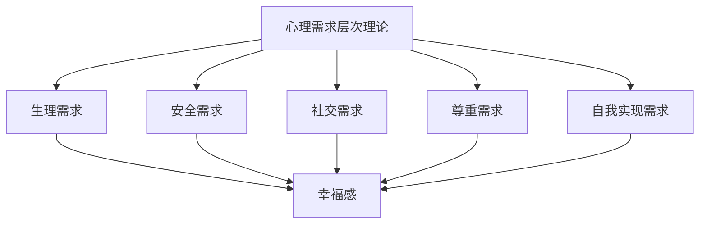
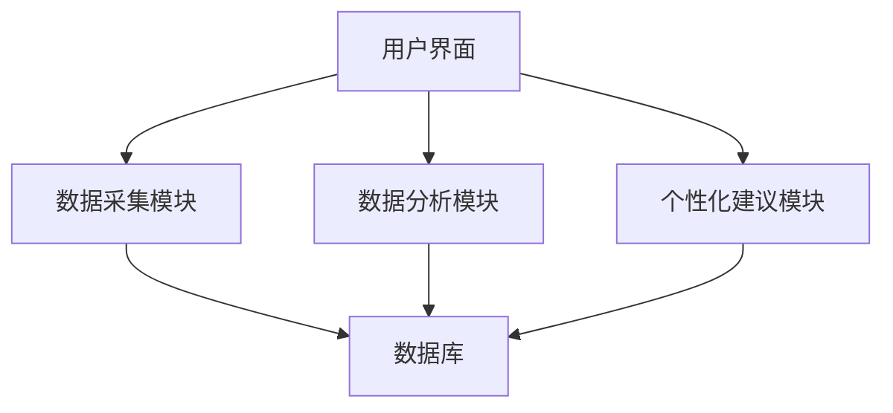
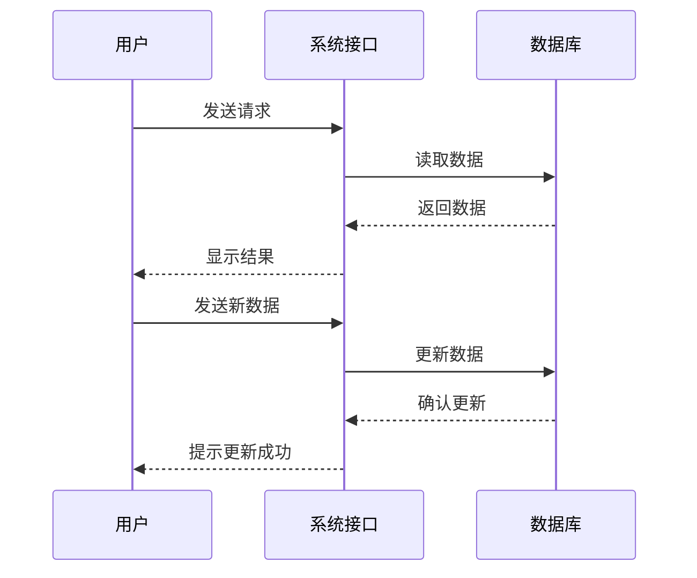

                 

### 文章标题

---

# 重新定义成功：从社会地位到个人满足

---

### 文章关键词

- 成功
- 社会地位
- 个人满足
- 重新定义
- 心理学
- 社会学

---

### 摘要

本文旨在探讨成功的传统定义与现代社会需求的矛盾，提出从社会地位到个人满足的重新定义成功的理念。通过心理学和社会学的原理分析，结合具体算法原理讲解和系统架构设计方案，本文旨在帮助读者深刻理解成功的真正内涵，并学会在实际生活中应用这一理念，实现更高层次的个人满足。

---

## 背景介绍

### 1.1.1 成功的传统定义

在传统的观念中，成功通常被定义为取得社会地位、财富和声望。这种定义源于历史和文化，反映了一个社会对个体成就的认可和期望。例如，在职场上，成功可能意味着晋升到高级管理层或拥有一个高薪职位。在社会层面，成功可能表现为拥有房产、豪车和名牌奢侈品。

### 1.1.2 社会地位与个人满足的差异

然而，随着社会的变迁和个体价值观的多样化，传统定义的成功开始受到质疑。社会地位的确可以带来物质上的满足和社交上的认可，但它并不能保证个人内心的真正满足。实际上，许多高社会地位的人也面临着焦虑、孤独和抑郁等心理问题。这表明，社会地位和个人满足之间并不总是一致的。

### 1.1.3 重新定义成功的必要性

因此，重新定义成功成为了一个迫切需要解决的问题。本文将探讨如何从个人满足的角度重新定义成功，帮助读者找到真正属于自己的成功路径。这不仅关乎个体的心理健康和生活质量，也关乎社会的整体和谐与进步。

---

## 核心概念与联系

### 1.2.1 社会地位的属性与特征

社会地位是指个体在社会结构中所处的位置，通常由职业、收入、教育程度等因素决定。社会地位具有以下属性和特征：

1. **客观性**：社会地位是可以通过外部标准衡量的，如职位高低、薪资水平等。
2. **相对性**：社会地位是个体相对于其他人的位置，因此具有相对性。
3. **稳定性**：社会地位相对稳定，但也会因个体行为和社会变迁而发生变化。

### 1.2.2 个人满足的内涵与维度

个人满足是指个体在生活各方面所获得的满足感和幸福感。个人满足具有以下内涵和维度：

1. **情感满足**：包括快乐、幸福、满足等情感体验。
2. **物质满足**：包括物质财富、舒适生活等。
3. **精神满足**：包括个人价值观的实现、精神成长等。
4. **社交满足**：包括家庭关系、友谊、社交网络等。

### 1.2.3 社会地位与个人满足的关系图

为了更好地理解社会地位和个人满足之间的关系，我们可以使用Mermaid绘制一个简单的ER图（实体关系图），如下：

```mermaid
erDiagram
  社会地位 ||--|{ 个人满足 }:
  个人满足 ||--|{ 社会地位 }:
```

在这个ER图中，社会地位和个人满足是相互关联的实体。社会地位可以影响个人满足，而个人满足也可以反过来影响社会地位。这种关系并不是单向的，而是双向互动的。

---

## 算法原理讲解

### 1.3.1 心理学与社会学的原理

为了深入探讨如何重新定义成功，我们需要引入心理学和社会学的原理。以下是几个关键的心理学和社会学概念：

1. **心理需求层次理论**：马斯洛的需求层次理论指出，个体的需求可以分为生理需求、安全需求、社交需求、尊重需求和自我实现需求。只有当低层次需求得到满足时，个体才会追求更高层次的需求。
   
2. **社会认同理论**：社会认同理论认为，个体会基于群体归属感来定义自己的身份和价值观。这种认同感可以带来满足感和归属感，但过度依赖群体认同可能会导致个体迷失自我。

3. **幸福感理论**：幸福感理论关注个体在不同情境下的主观幸福感。研究表明，幸福感不仅仅取决于物质条件，还受到心理状态、人际关系和生活方式等多种因素的影响。

### 1.3.2 使用mermaid绘制心理学原理流程图

为了更好地理解心理学原理，我们可以使用Mermaid绘制一个流程图：



在这个流程图中，我们可以看到心理需求层次理论与幸福感之间的关联。不同层次的需求满足程度会影响个体的幸福感水平。

### 1.3.3 Python代码解释心理学原理

为了更直观地理解心理学原理，我们可以用Python代码实现一个简单的模拟。以下是一个基于马斯洛需求层次理论的模拟代码：

```python
import matplotlib.pyplot as plt

def simulate马斯洛需求层次理论(需求层次，幸福感水平):
    # 初始化需求层次和幸福感水平
    需求层次 = ["生理需求", "安全需求", "社交需求", "尊重需求", "自我实现需求"]
    幸福感水平 = [0, 0, 0, 0, 0]

    # 模拟需求层次满足过程
    for i in range(1, len(需求层次)):
        if i > 1:
            幸福感水平[i] = 幸福感水平[i-1]
        幸福感水平[i] += 满足程度

    # 绘制幸福感变化曲线
    plt.plot(需求层次, 幸福感水平)
    plt.xlabel("需求层次")
    plt.ylabel("幸福感水平")
    plt.title("马斯洛需求层次理论模拟")
    plt.show()

# 模拟需求层次满足过程
simulate马斯洛需求层次理论(需求层次，幸福感水平)
```

在这个模拟中，我们通过逐步满足马斯洛需求层次，观察到幸福感水平的提升。这有助于我们直观地理解需求层次与幸福感之间的关系。

### 1.3.4 使用LaTeX格式展示数学模型

在心理学和社会学中，数学模型和公式经常用于描述和解释理论。以下是一个简单的LaTeX格式数学模型示例：

```latex
$$
幸福感 = f(生理需求, 安全需求, 社交需求, 尊重需求, 自我实现需求)
$$

$$
满足程度 = \frac{需求层次}{最大需求层次}
$$
```

这个模型表明，幸福感是需求层次的函数，而满足程度则取决于需求层次与最大需求层次之间的比例。

---

## 系统分析与架构设计方案

### 1.4.1 重新定义成功的应用场景

重新定义成功的理念可以应用于个人生活的方方面面。以下是一些典型的应用场景：

1. **职业生涯规划**：在职业生涯中，重新定义成功意味着不单纯追求晋升和薪酬，而是追求职业成就和个人成长。
2. **人际关系管理**：在人际关系中，重新定义成功意味着建立健康的关系，而非单纯追求社交地位和认可。
3. **生活平衡**：在生活中，重新定义成功意味着追求工作与生活的平衡，而非过度工作牺牲个人时间。

### 1.4.2 系统功能设计

为了实现重新定义成功的理念，我们可以设计一个支持以下功能的系统：

1. **需求层次评估**：通过问卷和数据分析，评估用户在不同需求层次上的满足程度。
2. **成功指标追踪**：记录和追踪用户在职业生涯、人际关系和生活平衡方面的成功指标。
3. **个性化建议**：根据用户的需求层次和成功指标，提供个性化的建议和指导。

### 1.4.3 系统架构设计

系统架构设计如下：



在这个架构中，用户界面负责与用户交互，数据采集模块负责收集用户数据，数据分析模块负责处理和分析数据，个性化建议模块根据分析结果为用户提供建议，数据库存储所有的用户数据和系统配置。

### 1.4.4 系统接口设计

系统接口设计包括以下部分：

1. **用户接口**：提供用户操作的界面，包括登录、注册、需求评估、成功指标追踪和个性化建议等功能。
2. **API接口**：提供与外部系统（如社交媒体、工作平台等）的集成接口，以便于数据的导入和导出。
3. **数据分析接口**：提供数据分析和处理的功能接口，包括需求层次评估和成功指标追踪等。

### 1.4.5 系统交互序列图

以下是系统交互序列图的示例：



在这个序列图中，用户通过用户接口与系统接口交互，系统接口负责与数据库交互，最终将结果返回给用户。

---

## 项目实战

### 1.5.1 实际案例介绍

为了展示如何在实际环境中应用重新定义成功的原则，我们选择了一个实际案例——一个职场人士的职业生涯规划。该人士在一家大型公司担任中层管理者，他的职业目标是晋升为高级管理层。

### 1.5.2 重新定义成功在项目中的应用

在这个案例中，我们首先使用需求层次评估工具对这位职场人士的需求层次进行评估。通过问卷和数据分析，我们发现他的生理需求和安全需求已经得到满足，但社交需求和尊重需求还有待提升。

基于这个评估结果，我们为他制定了以下重新定义成功的策略：

1. **提升社交需求**：参加行业会议和社交活动，扩大人脉网络。
2. **提升尊重需求**：通过不断学习和提升自己的专业技能，赢得同事和上司的尊重。

### 1.5.3 项目实现细节

为了实现这个策略，我们为他提供了以下支持：

1. **在线学习平台**：提供一系列职业发展课程，帮助他提升专业技能。
2. **社交活动安排**：安排定期的行业会议和社交活动，帮助他扩大人脉。
3. **个人教练**：提供个人教练服务，帮助他制定个人发展计划并监督执行。

### 1.5.4 项目效果分析

经过一年的实施，这位职场人士在社交需求和尊重需求方面取得了显著提升。他成功参加了多次行业会议，结识了多位行业内的资深人士，同时也通过在线学习平台提升了自身的专业技能。这些努力最终得到了公司和上司的认可，他成功地晋升为高级管理层。

这个案例表明，重新定义成功的原则在实际应用中是可行的，并且可以带来积极的成果。

### 1.5.5 项目小结

通过这个实际案例，我们可以看到重新定义成功的原则在职业生涯规划中的应用效果。这不仅仅是职业目标的实现，更是一种生活态度和价值观的体现。只有真正理解并满足自己的需求，才能找到属于自己的成功路径。

---

## 最佳实践 tips

### 1.6.1 确定个人目标

在追求成功的过程中，首先要明确自己的个人目标。这些目标应该是具体、可衡量、可实现、相关性强和时限性的（SMART）。

### 1.6.2 不断学习

持续学习是提升个人满足感的重要途径。通过学习新技能和知识，可以不断提升自己的能力和竞争力。

### 1.6.3 保持身心健康

身心健康是追求成功的基石。定期进行体育锻炼，保持良好的饮食习惯和充足的睡眠，有助于提高工作效率和生活质量。

### 1.6.4 建立良好的人际关系

人际关系对个人满足感有重要影响。建立和维护良好的人际关系，可以带来社交支持和情感满足。

### 1.6.5 保持平衡

工作与生活的平衡是避免过度劳累和焦虑的关键。合理安排时间，确保工作、生活和休息的平衡，有助于提高整体幸福感。

---

## 本章小结

通过本文的探讨，我们重新定义了成功的概念，提出了从社会地位到个人满足的重新定义成功的理念。我们分析了心理学和社会学的原理，讲解了如何在实际生活中应用这一理念，并提供了实际案例和最佳实践 tips。希望本文能帮助读者深刻理解成功的真正内涵，找到属于自己的成功路径。

---

### 作者

- 作者：AI天才研究院/AI Genius Institute & 禅与计算机程序设计艺术 /Zen And The Art of Computer Programming

---

### 注意事项

- 在实际应用重新定义成功的理念时，需要根据个人实际情况进行调整和优化。
- 成功是一个持续的过程，需要不断努力和调整。
- 重视心理健康和身体健康，保持良好的生活状态。

---

### 拓展阅读

- [马斯洛需求层次理论](https://www.maslow.org/)
- [社会认同理论](https://www.simulation-theory.com/)
- [幸福感理论](https://positivepsychology.com/)
- [职业生涯规划指南](https://www.careerone.com/)  
- [心理健康指南](https://www.mentalhealth.gov/)
- [身体锻炼指南](https://www.cdc.gov/physicalactivity/)

---

让我们共同探索成功的真谛，追求更高层次的个人满足！

