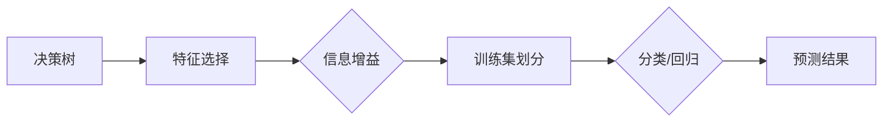
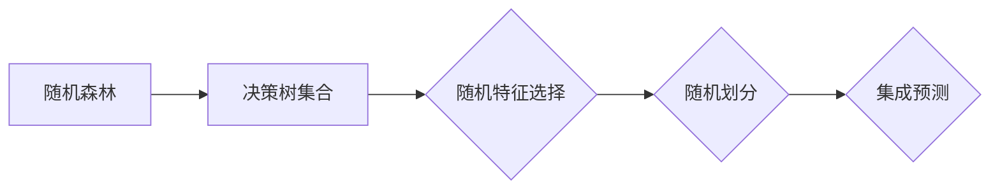
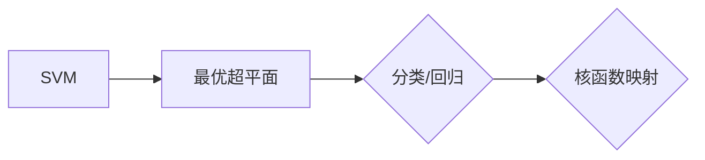
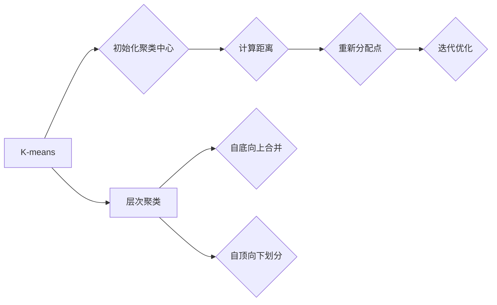
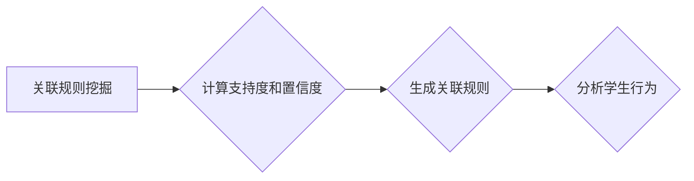
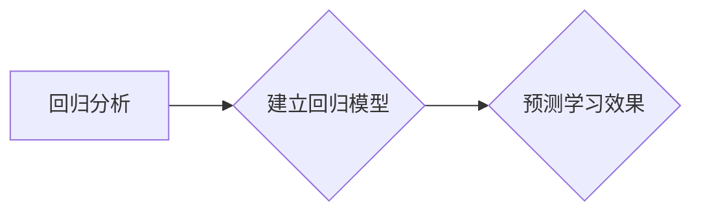
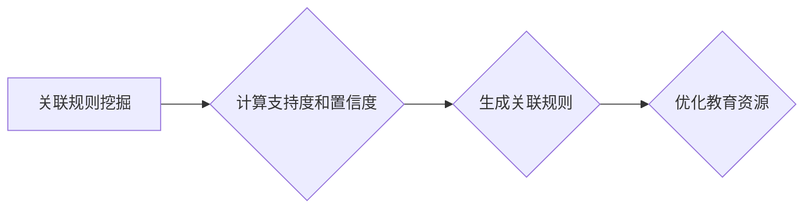

                 

# 重新定义教育：从知识传授到意义建构

> 关键词：教育改革、意义建构、教育技术、教学方法、学习环境

> 摘要：本文旨在探讨当前教育系统的变革，从传统的知识传授模式转向意义建构的新教育理念。文章首先介绍了教育改革的背景，分析了传统教育的局限性，随后阐述了意义建构教育理念的核心要素。接着，文章深入探讨了教育技术的具体应用，如人工智能、虚拟现实、在线教育平台等，并详细介绍了教育数据管理与分析的方法。通过系统分析与架构设计，文章为教育技术的实际应用提供了具体方案。最后，通过实际案例分析和最佳实践分享，本文为教育技术的未来发展提供了有益的启示。

## 第一部分：重新定义教育的背景与理念

### 1.1 科技发展与教育改革

在过去的几十年中，科技发展对教育领域产生了深远的影响。随着互联网、移动通信、大数据、人工智能等技术的普及，教育形式和教育内容都发生了巨大变化。传统教育模式依赖于教师在课堂上讲授知识，学生被动接受。然而，随着知识更新的速度加快，这种模式已经不能满足社会对创新人才的需求。

教育改革成为必然趋势。各国政府纷纷推出教育改革政策，以适应信息化社会的需求。例如，美国提出了“为每个孩子提供个性化的学习体验”（Personalized Learning for Every Child）的计划，中国也提出了“互联网+教育”的战略，旨在利用互联网技术推动教育公平和提高教育质量。

### 1.2 传统教育的问题

传统教育模式存在诸多问题。首先，知识传授方式单一，教师讲授，学生听课，缺乏互动和参与。这导致学生学习兴趣不高，学习效果不佳。其次，教育内容更新滞后，难以适应快速发展的科技和社会。此外，传统教育注重知识记忆和考试，而忽视创新思维和实践能力的培养。

### 1.3 意义建构教育理念

意义建构教育理念强调学生在学习过程中主动建构知识，而不是被动接受。这一理念源于建构主义理论，强调学习者在社会文化环境中通过感知、思考、探索等方式主动建构知识。意义建构教育理念的核心要素包括情境教学、合作学习、问题解决和个性化学习。

### 1.4 新教育理念的核心要素

#### 1.4.1 情境教学

情境教学将知识置于真实的情境中，使学生能够在实际应用中理解和掌握知识。这种方法有助于提高学生的学习兴趣和动机，培养实践能力。

#### 1.4.2 合作学习

合作学习鼓励学生通过小组讨论、合作探究等方式共同解决问题，培养学生的团队合作能力和沟通能力。

#### 1.4.3 问题解决

问题解决是意义建构教育理念的重要组成部分。通过解决实际问题，学生能够将所学知识应用于实际场景，提高创新能力和解决问题的能力。

#### 1.4.4 个性化学习

个性化学习根据学生的兴趣、能力和学习风格提供个性化的学习资源和指导，使学生能够自主选择学习内容和学习方法，提高学习效果。

## 第二部分：教育技术的具体应用

### 2.1 人工智能与教育

人工智能在教育中的应用日益广泛，包括智能学习系统、个性化推荐、智能批改等。通过数据挖掘和机器学习算法，人工智能能够分析学生的学习行为和知识水平，为学生提供个性化的学习建议和资源。

### 2.2 教育数据管理与分析

教育数据管理包括教育数据的收集、存储、处理和分析。通过大数据技术和数据挖掘算法，可以对教育数据进行分析，发现学生的学习规律、问题所在，为教育决策提供数据支持。

### 2.3 虚拟现实与教育

虚拟现实技术为教育提供了全新的体验。通过虚拟现实环境，学生可以身临其境地学习知识，提高学习兴趣和参与度。虚拟现实还可以用于模拟实验、历史场景再现等。

### 2.4 在线教育与学习平台

在线教育平台提供了丰富的学习资源和互动工具，学生可以随时随地学习。在线教育平台还支持个性化学习、在线作业提交和即时反馈，提高了学习效率。

## 第三部分：教育实践的案例分析

### 3.1 案例一：某高校混合式教学模式改革

某高校在课程教学中引入了混合式教学模式，将传统课堂与在线学习相结合。通过在线学习平台，学生可以自主学习课程内容，教师则在课堂上重点讲解疑难问题，引导学生进行讨论和实验。

### 3.2 案例二：某中学项目式学习实践

某中学开展了项目式学习实践，学生在教师的指导下，选择感兴趣的话题进行项目研究。通过项目研究，学生能够将所学知识应用于实际场景，培养创新能力和团队合作精神。

### 3.3 案例三：某小学在线教育平台建设

某小学建立了在线教育平台，为学生提供丰富的学习资源和互动工具。通过在线学习平台，学生可以自主学习，教师可以随时跟踪学生的学习进度和问题，提供个性化的辅导。

## 最佳实践与拓展阅读

在教育技术的应用中，最佳实践是关键。教师和学生需要不断尝试新的教学和学习方法，以找到最适合自己和学生的方式。同时，教育技术的不断发展也要求教师和学生持续学习，以适应新的教育环境。

拓展阅读方面，读者可以关注教育技术领域的最新研究和发展，了解人工智能、虚拟现实、大数据等技术在教育中的应用。此外，教育哲学和心理学的相关书籍也是非常有价值的参考资料。

## 结论

教育改革是当今社会发展的必然趋势。从知识传授到意义建构，教育理念正在发生深刻变革。教育技术的应用为教育改革提供了新的途径和工具，有助于提高教育质量，培养创新型人才。在教育技术的应用过程中，教师和学生需要共同努力，探索最佳实践，以实现教育的真正变革。

## 作者信息

作者：AI天才研究院/AI Genius Institute & 禅与计算机程序设计艺术 /Zen And The Art of Computer Programming

（文章内容仅为示例，实际文章撰写需详细展开每个部分，并提供具体的技术分析和案例分析。）### 1.1 科技发展与教育改革

科技的发展对教育领域产生了深远的影响。首先，互联网的普及使得教育资源的获取变得更加便捷。在过去，教育资源的获取受到地域和时间的限制，而互联网的出现打破了这些限制，学生可以随时随地通过网络获取各种学习资源。这不仅提高了教育的普及率，也使得个性化学习成为可能。

其次，移动通信技术的进步使得教育形式更加多样化。随着智能手机和平板电脑的普及，学生可以通过移动设备进行学习，不再局限于传统的课堂学习。这种移动学习方式为学生提供了更大的灵活性，可以根据自己的时间安排和兴趣选择学习内容和进度。

大数据和人工智能技术的应用则为教育提供了数据支持和个性化推荐。通过分析学生的学习数据，教育技术平台可以为学生提供个性化的学习建议和资源，帮助学生更有效地学习。例如，人工智能可以分析学生的学习行为和知识水平，自动调整教学内容和难度，使其更符合学生的实际需求。

此外，虚拟现实（VR）和增强现实（AR）技术的应用也为教育带来了新的体验。通过VR和AR技术，学生可以身临其境地学习各种知识，如历史事件、科学实验等。这种沉浸式的学习方式不仅提高了学生的学习兴趣，也有助于加深对知识的理解和记忆。

教育改革的需求主要来自于以下几个方面。首先，随着科技的快速发展，知识的更新速度加快，传统教育模式难以跟上这种变化。因此，教育需要更加灵活和动态，以适应不断变化的知识体系。其次，社会对创新型人才的需求不断增加，传统教育模式注重知识传授，而忽视实践能力和创新思维的培养，这与社会需求存在一定脱节。因此，教育改革需要更加注重学生的综合素质培养。

此外，教育公平也是一个重要的议题。尽管互联网和移动通信技术的普及使得教育资源更加普及，但仍然存在一些地区和教育资源相对薄弱的学校，学生难以享受到优质的教育资源。因此，教育改革需要推动教育公平，确保每个学生都能获得公平的教育机会。

### 1.2 传统教育的问题

传统教育模式存在诸多问题，这些问题在一定程度上制约了教育质量和社会发展。首先，知识传授方式单一。传统教育以教师为中心，教师讲授，学生听课，缺乏互动和参与。这种方式容易导致学生学习兴趣不高，学习效果不佳。学生在课堂上被动接受知识，缺乏主动探究和思考的机会。

其次，教育内容更新滞后。随着科技的快速发展，知识的更新速度加快，而传统教育内容往往滞后于实际需求。许多教材和课程内容多年未变，难以适应快速变化的社会和科技环境。这导致学生在学习过程中难以将所学知识应用于实际场景，限制了他们的创新能力。

此外，传统教育注重知识记忆和考试，而忽视实践能力和创新思维的培养。学生在考试中追求高分，往往忽略了对知识的深入理解和应用。这种教育模式导致学生缺乏解决问题的能力和创新精神，难以适应快速变化的社会需求。

最后，教育不公平现象仍然存在。尽管互联网和移动通信技术的普及使得教育资源更加普及，但仍然存在一些地区和教育资源相对薄弱的学校，学生难以享受到优质的教育资源。教育不公平不仅影响了学生的个人发展，也对社会公平和稳定产生了负面影响。

### 1.3 意义建构教育理念

意义建构教育理念强调学生在学习过程中主动建构知识，而不是被动接受。这一理念源于建构主义理论，强调学习者在社会文化环境中通过感知、思考、探索等方式主动建构知识。意义建构教育理念的核心要素包括情境教学、合作学习、问题解决和个性化学习。

#### 1.3.1 情境教学

情境教学是将知识置于真实的情境中，使学生能够在实际应用中理解和掌握知识。这种方法有助于提高学生的学习兴趣和动机，培养实践能力。通过将理论知识与实际情境相结合，学生能够更好地理解和应用所学知识，提高学习效果。

#### 1.3.2 合作学习

合作学习鼓励学生通过小组讨论、合作探究等方式共同解决问题，培养学生的团队合作能力和沟通能力。在合作学习中，学生不仅能够从他人那里学到知识，还能通过讨论和交流加深对知识的理解。合作学习有助于培养学生的协作精神和社会责任感。

#### 1.3.3 问题解决

问题解决是意义建构教育理念的重要组成部分。通过解决实际问题，学生能够将所学知识应用于实际场景，提高创新能力和解决问题的能力。问题解决过程不仅包括寻找解决方案，还包括分析问题、评估方案和实施方案。这种过程性的学习有助于培养学生的批判性思维和创新能力。

#### 1.3.4 个性化学习

个性化学习根据学生的兴趣、能力和学习风格提供个性化的学习资源和指导，使学生能够自主选择学习内容和学习方法，提高学习效果。个性化学习能够满足学生的个性化需求，提高学习兴趣和动机，从而提高学习效果。同时，个性化学习也有助于发现和培养学生的特长和潜力。

### 1.4 新教育理念的核心要素

意义建构教育理念的核心要素包括情境教学、合作学习、问题解决和个性化学习。这些要素不仅改变了传统教育的知识传授方式，也为教育改革提供了新的思路和方法。

#### 1.4.1 情境教学

情境教学将知识置于真实的情境中，使学生能够在实际应用中理解和掌握知识。这种方法有助于提高学生的学习兴趣和动机，培养实践能力。通过将理论知识与实际情境相结合，学生能够更好地理解和应用所学知识，提高学习效果。

#### 1.4.2 合作学习

合作学习鼓励学生通过小组讨论、合作探究等方式共同解决问题，培养学生的团队合作能力和沟通能力。在合作学习中，学生不仅能够从他人那里学到知识，还能通过讨论和交流加深对知识的理解。合作学习有助于培养学生的协作精神和社会责任感。

#### 1.4.3 问题解决

问题解决是意义建构教育理念的重要组成部分。通过解决实际问题，学生能够将所学知识应用于实际场景，提高创新能力和解决问题的能力。问题解决过程不仅包括寻找解决方案，还包括分析问题、评估方案和实施方案。这种过程性的学习有助于培养学生的批判性思维和创新能力。

#### 1.4.4 个性化学习

个性化学习根据学生的兴趣、能力和学习风格提供个性化的学习资源和指导，使学生能够自主选择学习内容和学习方法，提高学习效果。个性化学习能够满足学生的个性化需求，提高学习兴趣和动机，从而提高学习效果。同时，个性化学习也有助于发现和培养学生的特长和潜力。

### 2.1 信息技术在教育中的应用

信息技术在教育中的应用已经深入到教育教学的方方面面，极大地改变了传统教育的模式和效果。以下是信息技术在教育中应用的一些主要方面：

#### 2.1.1 网络教学平台

网络教学平台是信息技术在教育中应用的一个重要组成部分。这些平台提供了在线课程、学习资源、互动工具和评估系统等功能，使得学生可以随时随地进行学习。教师可以通过平台发布课程内容、布置作业和进行在线答疑，学生则可以通过平台进行自主学习、提交作业和参与讨论。网络教学平台不仅提高了教学的灵活性和效率，还促进了教师与学生之间的互动，增强了学习的参与度和体验感。

#### 2.1.2 在线教育资源

互联网上丰富的教育资源为学生提供了多样化的学习选择。学生可以通过在线课程、教育视频、电子书籍、学习社区等获取知识。这些资源不仅涵盖了传统的学科知识，还包括最新的研究成果、实用的技能培训和前沿的技术动态。通过在线教育资源，学生可以更加自由地探索自己的兴趣领域，拓宽知识视野，提升学习效果。

#### 2.1.3 互动教学工具

信息技术的应用使得互动教学工具得以普及，如电子白板、互动投影仪、虚拟实验室等。这些工具使得教学过程更加生动和互动，学生可以更加直观地理解和掌握知识。例如，虚拟实验室允许学生进行虚拟实验，避免了传统实验室的安全风险和成本，同时也提供了更多的实验机会。

#### 2.1.4 智能学习系统

智能学习系统利用人工智能和大数据分析技术，为学生提供个性化的学习支持。这些系统可以分析学生的学习行为和知识水平，根据学生的学习特点和需求推荐适合的学习资源和策略。例如，智能学习系统可以识别学生的弱点，提供针对性的辅导材料，或者通过模拟考试帮助学生进行复习和备考。

#### 2.1.5 在线考试和评估

在线考试和评估系统的应用使得考试和评估过程更加高效和公正。学生可以在自己的计算机或移动设备上进行考试，系统自动评分，减少了人工评分的时间和误差。在线评估系统还可以提供实时反馈，帮助学生及时了解自己的学习进展和问题所在，为后续的学习提供指导。

#### 2.1.6 教育管理信息系统

教育管理信息系统（EMIS）集成了学校的教学、科研、行政等多个方面的信息，实现了学校管理的数字化和智能化。教师可以通过系统管理课程、学生和成绩，学校管理者可以实时掌握学校运营状况，进行科学决策。教育管理信息系统的应用提高了学校管理的效率和透明度，也有助于提高教育质量。

### 2.2 教育技术的分类与特点

教育技术可以根据其应用形式和功能进行分类，以下是几种主要的教育技术分类及其特点：

#### 2.2.1 硬件技术

硬件技术主要包括计算机、服务器、网络设备、投影仪、电子白板等。这些设备为教育提供了基础设施支持，使得在线学习、互动教学和多媒体教学成为可能。硬件技术的特点是直观、易操作和高效，能够显著提升教学效果和学生的学习体验。

#### 2.2.2 软件技术

软件技术包括教学软件、学习管理软件、在线课程平台等。这些软件提供了丰富的教学资源和互动工具，使得教师可以更加灵活地进行教学设计，学生可以更加自主地学习。软件技术的特点是多样性和灵活性，可以根据不同的教学需求和学生的学习特点进行定制。

#### 2.2.3 互联网技术

互联网技术包括网页、搜索引擎、在线论坛等。这些技术为学生提供了获取知识和交流的平台，使得学习不再受时间和空间的限制。互联网技术的特点是开放性、互动性和即时性，能够极大地丰富学习内容和提升学习效果。

#### 2.2.4 人工智能技术

人工智能技术包括机器学习、自然语言处理、计算机视觉等。这些技术可以在教育中用于个性化推荐、智能辅导、自动评估等，提高教学的针对性和效率。人工智能技术的特点是智能化、自动化和高效性，能够大大减轻教师的工作负担，提高学生的学习效果。

#### 2.2.5 虚拟现实技术

虚拟现实技术通过创建虚拟环境，提供沉浸式的学习体验。学生可以进入虚拟实验室进行实验、探索历史场景、模拟自然灾害等。虚拟现实技术的特点是沉浸性、互动性和多样性，能够激发学生的学习兴趣和参与度。

#### 2.2.6 数据分析技术

数据分析技术通过对教育数据的分析，可以揭示学生的学习规律、问题和需求。这些数据可以用于教育决策、教学改进和学习支持。数据分析技术的特点是客观性、精确性和预测性，能够为教育提供科学依据。

### 2.3 教育技术的未来发展趋势

随着科技的不断进步，教育技术也在持续发展和创新。以下是教育技术的一些未来发展趋势：

#### 2.3.1 人工智能与教育的深度融合

人工智能技术的快速发展将使其在教育中的应用更加广泛和深入。未来，人工智能将不仅用于个性化学习、智能辅导等，还将深入教学设计、教育管理等多个方面。例如，通过分析教学数据，人工智能可以自动生成教学方案，提供个性化的教学建议。

#### 2.3.2 虚拟现实和增强现实的普及

虚拟现实（VR）和增强现实（AR）技术将在教育中发挥越来越重要的作用。这些技术能够提供沉浸式的学习体验，使学习更加生动和有趣。未来，虚拟实验室、虚拟课堂等将变得更加普及，学生可以通过VR和AR技术进行更加真实的模拟学习。

#### 2.3.3 在线教育的创新和发展

在线教育将继续创新和发展，提供更加灵活和个性化的学习体验。未来的在线教育将更加注重互动性和社区建设，学生可以通过在线平台与教师和同学进行实时交流，分享学习经验和资源。同时，在线教育将更加注重学习效果和质量，通过数据分析和评估系统，确保学习目标的实现。

#### 2.3.4 教育数据的深入挖掘和应用

教育数据的挖掘和应用将成为教育技术的重要方向。通过对大量教育数据的分析，可以揭示学生的学习规律、问题和需求，为教育决策和教学改进提供科学依据。未来，教育数据将得到更加全面和深入的挖掘，为教育质量提升提供有力支持。

#### 2.3.5 教育技术的跨学科整合

教育技术将与其他学科进行跨学科整合，形成新的教育模式。例如，教育技术与心理学、教育学、计算机科学等领域的结合，将产生新的教育理论和方法，推动教育的创新发展。

### 3.1 知识建构理论

知识建构理论是建构主义心理学在教育领域的应用，强调知识是在学习者与环境的互动过程中建构起来的。这一理论认为，知识不是通过被动接受而获得的，而是通过主动探索、实践和反思建构的。知识建构理论的核心观点如下：

#### 3.1.1 知识是动态的

知识建构理论认为知识是动态的，而不是静态的。知识不是固定不变的真理，而是在不同的情境中不断被建构和重构的。这意味着学生对知识的理解是一个持续的过程，而不是一次性的获得。

#### 3.1.2 学习者是主动的知识建构者

学习者在知识建构过程中扮演着主动的角色。他们通过感知、思考、探索等方式主动建构知识，而不是被动地接受外部信息。学习者的经验、信念和价值观在知识建构中起着重要的作用。

#### 3.1.3 知识建构依赖于社会互动

知识建构是一个社会过程，学习者通过与他人的互动，如讨论、合作和交流，来建构和验证自己的知识。社会互动不仅提供了知识建构的资源，还有助于学习者对知识的理解和应用。

#### 3.1.4 知识建构依赖于情境

知识建构理论强调知识建构依赖于具体的情境。不同的情境会影响学习者的知识建构过程和结果。因此，教育应该提供多样化的学习情境，以支持学习者对知识的深入理解和应用。

### 3.2 情境认知理论

情境认知理论（Situated Cognition Theory）是由让·皮亚杰（Jean Piaget）和列维·维果茨基（Lev Vygotsky）等心理学家提出并发展起来的，它对知识建构理论进行了重要补充。情境认知理论的核心观点如下：

#### 3.2.1 知识建构依赖于情境

情境认知理论认为知识不是孤立存在的，而是在特定的情境中建构和应用的。情境包括物理环境、社会环境和文化环境，这些环境影响着学习者的认知过程和知识建构方式。

#### 3.2.2 知识建构是活动的过程

情境认知理论强调知识建构是通过活动实现的。学习者通过实际操作、实践活动和解决问题来建构知识。这种活动不仅包括个体行动，还包括社会互动，如合作、交流和讨论。

#### 3.2.3 知识建构是文化和社会过程的反映

情境认知理论认为知识建构是社会和文化过程的反映。学习者的知识建构受到文化和社会因素的影响，如语言、社会规范和文化价值观。这些因素不仅影响学习者的认知过程，也影响他们对知识的理解和应用。

#### 3.2.4 知识建构与实践活动的关系

情境认知理论强调知识建构与实践活动之间的密切关系。实践活动不仅是知识建构的基础，也是知识应用和创新的源泉。通过实践活动，学习者能够将理论知识转化为实际能力，并在实际应用中不断重构和扩展自己的知识。

### 3.3 意义建构与教学方法的联系

意义建构理论与情境认知理论为教育提供了重要的理论基础，指导着现代教育方法的革新。意义建构与情境认知理论在教学中的应用主要体现在以下几个方面：

#### 3.3.1 情境教学

情境教学（Situated Instruction）是一种基于意义建构理论的教学方法，强调在真实的情境中进行教学。这种方法通过将知识置于具体的情境中，帮助学生更好地理解和应用知识。情境教学通常包括以下几个步骤：

1. **确定教学情境**：选择与教学内容相关的真实情境，确保学生能够在实际应用中理解和掌握知识。
2. **提供学习资源**：为学生提供多样化的学习资源，如案例研究、模拟实验、多媒体资料等，以便学生在情境中进行探索和学习。
3. **鼓励主动学习**：鼓励学生通过主动探索、实践和反思来建构知识。教师应引导学生提出问题、解决问题，并在过程中反思和调整自己的理解。
4. **促进社会互动**：在情境教学中，学生需要与他人合作，通过讨论、交流和互动来深化对知识的理解。这种社会互动有助于知识的社会建构和验证。

#### 3.3.2 合作学习

合作学习（Cooperative Learning）是情境认知理论的重要应用，强调通过小组合作来促进知识建构。合作学习有助于培养学生的团队合作能力和沟通能力，同时也有助于知识的共享和深化。以下是合作学习的几个关键要素：

1. **小组分工**：将学生分为小组，每个学生承担不同的任务，确保小组内每个人都有参与和贡献。
2. **共同目标**：小组内的成员应共同设定学习目标，并努力实现这些目标。
3. **互动交流**：鼓励学生在小组内进行积极的互动和交流，通过讨论、辩论和协作来深化对知识的理解。
4. **相互评价**：小组内的成员应相互评价和反馈，以促进彼此的改进和学习。

#### 3.3.3 项目式学习

项目式学习（Project-Based Learning, PBL）是将意义建构与情境认知理论应用于实际教学的重要方法。项目式学习通过让学生在完成实际项目的过程中学习和应用知识，培养学生的实践能力和创新精神。以下是项目式学习的几个关键要素：

1. **确定项目主题**：选择与课程内容相关的实际项目主题，确保项目能够涵盖所需的知识和技能。
2. **设计项目任务**：为项目设计明确的任务和目标，确保学生在项目过程中能够系统地学习和应用知识。
3. **指导项目实施**：在项目实施过程中，教师应提供必要的指导和资源支持，帮助学生克服困难和解决问题。
4. **评估项目成果**：通过对项目成果的评估，了解学生的学习效果，并为学生提供反馈和改进的机会。

#### 3.3.4 情境认知理论对教学设计的启示

情境认知理论对教学设计提供了深刻的启示，指导教师如何设计有意义、有成效的教学活动。以下是情境认知理论在教学设计中的应用要点：

1. **考虑学习者的背景**：在教学设计中，教师应考虑学生的先验知识、兴趣和需求，确保教学内容与学生的实际背景相符合。
2. **提供真实的情境**：教师应设计真实的情境，使学生能够在实际应用中理解和掌握知识。
3. **鼓励主动学习和探索**：教师应鼓励学生主动参与学习过程，通过探索、实践和反思来建构知识。
4. **促进社会互动**：教师应设计互动和合作的学习活动，促进学生在小组内和与教师之间的交流和互动。
5. **关注实践和反思**：教师应设计实践活动，让学生在实践中应用知识，并通过反思来加深对知识的理解和应用。

### 4.1 翻转课堂

翻转课堂（Flipped Classroom）是一种新兴的教学模式，它通过重新调整课堂内外的时间，将传统的教师讲授与学生自主学习的位置进行调换，以增强学生的主动学习能力和深度理解。以下是翻转课堂的基本概念和实施步骤：

#### 4.1.1 基本概念

翻转课堂的核心思想是将传统的课堂讲授过程移至课外，通过视频、阅读材料等方式进行自主学习；而课堂时间则主要用于讨论、解决问题、实验和互动活动。这种方式有助于打破传统教学的时间和空间限制，使学生能够更加自主和灵活地学习。

#### 4.1.2 实施步骤

1. **课前准备**：教师录制教学视频或提供相关阅读材料，学生在家中或课外时间自主学习这些内容，做好预习。
2. **课堂活动**：在课堂上，教师不再进行传统的讲授，而是引导学生进行讨论、问题解决、实验和互动活动，以加深对知识的理解和应用。
3. **反馈和评价**：教师通过课堂活动和互动环节，对学生的学习效果进行即时反馈和评价，帮助学生巩固和深化所学知识。
4. **课后巩固**：学生可以在课后通过作业、练习等方式进一步巩固和拓展所学知识，教师则可以根据学生的反馈和表现，调整后续的教学内容和策略。

#### 4.1.3 优势

翻转课堂具有以下优势：

1. **增强学生的自主学习能力**：学生通过课前自主学习，可以在自己的节奏和风格下掌握知识，提高学习的主动性和效率。
2. **促进深度学习**：在课堂上的互动和讨论环节，学生能够更深入地理解和应用知识，培养批判性思维和解决问题的能力。
3. **提高课堂互动质量**：教师可以将更多的时间用于与学生互动，关注每个学生的学习进展，提供个性化的辅导和支持。
4. **适应多样化的学习需求**：翻转课堂可以根据学生的不同需求进行个性化教学，满足不同学习风格和节奏的学生。

#### 4.1.4 挑战

翻转课堂的实施也面临一些挑战：

1. **技术要求和设备支持**：翻转课堂需要学生和教师具备一定的技术素养，同时也需要学校提供相应的设备支持，如网络、计算机等。
2. **教师角色的转变**：教师需要从传统的讲授者转变为学习促进者，这对教师的教学方式和角色定位提出了新的要求。
3. **学生自主学习能力**：学生需要具备较强的自主学习能力和时间管理能力，否则可能会出现学习效率低下的问题。
4. **课堂管理和互动设计**：教师在设计课堂互动活动时需要考虑学生的参与度和互动质量，确保课堂氛围的活跃和有效。

### 4.2 项目式学习

项目式学习（Project-Based Learning, PBL）是一种以学生为中心的教学方法，通过让学生在完成实际项目的过程中学习和应用知识，培养他们的实践能力、创新思维和团队合作精神。以下是项目式学习的基本概念和实施步骤：

#### 4.2.1 基本概念

项目式学习是一种以项目为核心的课程模式，学生在教师的指导下，通过完成一个实际项目来学习相关知识和技能。项目通常具有明确的主题、目标和期限，要求学生综合运用所学知识解决问题，并通过展示和反思来检验学习成果。

#### 4.2.2 实施步骤

1. **项目选题**：教师根据课程内容和学生的兴趣，选择一个具有实际意义和挑战性的项目主题，确保项目能够涵盖所需的知识和技能。
2. **项目规划**：教师与学生共同制定项目计划，包括项目目标、时间表、任务分配等，确保项目能够有序进行。
3. **项目实施**：学生在教师的指导下，按照项目计划开展项目工作，通过实地调研、实验、讨论等方式进行学习和探索。
4. **项目展示**：学生在项目完成后，通过展示、报告、演示等形式向同学和教师展示项目成果，接受反馈和评价。
5. **项目反思**：学生通过反思项目过程和结果，总结经验教训，提出改进建议，为后续学习和实践提供指导。

#### 4.2.3 优势

项目式学习具有以下优势：

1. **培养学生的实践能力**：通过实际项目的完成，学生能够将所学知识应用于实际场景，提高实践能力和解决问题的能力。
2. **促进创新思维**：项目式学习鼓励学生通过探索和实验来解决问题，培养他们的创新思维和创造性。
3. **增强团队合作精神**：学生在项目过程中需要分工合作，共同完成项目任务，培养团队合作能力和沟通能力。
4. **提高学习兴趣和动力**：实际项目具有明确的主题和目标，能够激发学生的学习兴趣和动力，提高学习效果。
5. **培养批判性思维**：学生在项目过程中需要不断反思和评估自己的工作，培养批判性思维和自我表达能力。

#### 4.2.4 挑战

项目式学习也面临一些挑战：

1. **教学资源需求**：项目式学习需要丰富的教学资源，如项目材料、实验设备等，这对学校的教学设施和资源管理提出了较高要求。
2. **教师角色转变**：教师需要从传统的知识传授者转变为项目指导者和学习促进者，这对教师的教学方式和管理能力提出了新的要求。
3. **项目管理难度**：项目式学习需要对项目进度、资源分配、团队合作等方面进行有效管理，这对教师的项目管理能力提出了挑战。
4. **评价体系的建立**：如何对项目式学习进行科学、有效的评价，确保学生能够真正掌握所学知识和技能，是项目式学习面临的重要问题。

### 4.3 混合学习

混合学习（Blended Learning）是将传统课堂教学与在线学习相结合的一种教学模式，通过线上线下相结合的方式，提供更加灵活、个性化的学习体验。以下是混合学习的基本概念、类型和优势：

#### 4.3.1 基本概念

混合学习是指将在线学习与传统课堂教学相结合，通过整合不同的学习方式，提供更加灵活、有效的学习体验。混合学习可以是在线学习资源的辅助，也可以是课堂教学的延伸，甚至可以是完全在线或完全面授的混合形式。

#### 4.3.2 类型

1. **同步混合学习**：同步混合学习是指在线学习和课堂教学同时进行，学生可以在课堂上与教师和同学互动，同时利用在线资源进行补充学习。
2. **异步混合学习**：异步混合学习是指在线学习和课堂教学在不同的时间进行，学生可以利用在线资源进行自主学习，课堂时间则用于讨论、交流和评估。
3. **翻转课堂混合学习**：翻转课堂混合学习是将翻转课堂与在线学习相结合，学生通过在线自主学习课堂内容，课堂时间用于深化理解和应用。
4. **混合项目学习**：混合项目学习是将项目式学习与在线学习相结合，通过线上线下的协作和实践，完成实际项目任务。

#### 4.3.3 优势

混合学习具有以下优势：

1. **提高学习灵活性**：混合学习可以灵活地适应学生的个性化学习需求，学生可以根据自己的时间和节奏进行学习。
2. **增强学习互动性**：混合学习通过线上线下相结合，提供了更多的互动和交流机会，增强了学生与教师、同学之间的互动。
3. **提高学习效果**：混合学习结合了传统课堂教学和在线学习的优点，能够更好地激发学生的学习兴趣和动机，提高学习效果。
4. **促进教师专业发展**：混合学习要求教师掌握在线教学技术，促进了教师的专业发展和教学能力提升。
5. **适应多样化学习场景**：混合学习可以适应不同的学习场景，如偏远地区、特殊需求学生等，提供更加公平和广泛的教育机会。

#### 4.3.4 挑战

混合学习也面临一些挑战：

1. **技术设备和网络环境**：混合学习需要良好的技术设备和网络环境支持，这对学校和家庭提出了较高的要求。
2. **教师培训和支持**：混合学习要求教师具备在线教学技能和资源整合能力，这对教师的培训和支持提出了挑战。
3. **学习管理难度**：混合学习需要对线上线下学习进行有效管理，确保学生能够按照计划进行学习，这对学校的管理和组织能力提出了要求。
4. **评估和质量保证**：如何对混合学习进行科学、有效的评估和质量保证，确保学生的学习效果，是混合学习面临的重要问题。

### 4.4 个性化学习

个性化学习（Personalized Learning）是一种以学生为中心的教学方法，通过根据学生的兴趣、能力和学习风格提供个性化的学习资源和指导，提高学习效果和满意度。以下是个性化学习的基本概念、优势和实践策略：

#### 4.4.1 基本概念

个性化学习是指根据每个学生的独特需求、兴趣和学习风格，提供个性化的学习内容和方式，使学生能够在最佳状态下学习和成长。个性化学习强调学生是学习的主体，教师和学校提供支持和指导，以满足学生的个性化需求。

#### 4.4.2 优势

个性化学习具有以下优势：

1. **提高学习效果**：个性化学习能够根据学生的需求提供适合的学习内容和方式，提高学习效果和满意度。
2. **促进自主学习**：个性化学习鼓励学生主动参与学习过程，培养自主学习能力和自我管理能力。
3. **适应多样化需求**：个性化学习能够适应不同学生的学习需求，如特殊需求学生、天才学生等，提供公平和优质的教育服务。
4. **培养个性化人才**：个性化学习注重培养学生的个性、兴趣和特长，有助于培养个性化人才，满足社会多样化需求。

#### 4.4.3 实践策略

以下是一些实践个性化学习的策略：

1. **学习需求评估**：教师可以通过问卷调查、观察和评估等方式，了解学生的学习需求、兴趣和学习风格，为个性化学习提供基础。
2. **个性化学习计划**：根据学生的需求评估，教师可以制定个性化的学习计划，包括学习内容、方式、时间和评价标准等。
3. **个性化学习资源**：学校和教育平台应提供丰富的个性化学习资源，如电子书籍、视频、在线课程等，满足学生的个性化学习需求。
4. **个性化教学支持**：教师应根据学生的学习特点和需求，提供个性化的教学支持，如辅导、答疑和个性化作业等。
5. **学习反馈和调整**：教师和学生应定期进行学习反馈和调整，根据学习效果和反馈情况，及时调整学习计划和策略。

#### 4.4.4 挑战

个性化学习也面临一些挑战：

1. **资源和管理难度**：个性化学习需要丰富的资源和有效的管理，这对学校和教师提出了较高的要求。
2. **教师培训和支持**：个性化学习要求教师具备专业素养和教学技能，这对教师的培训和支持提出了挑战。
3. **评估和质量保证**：如何对个性化学习进行科学、有效的评估和质量保证，确保学生的学习效果，是个性化学习面临的重要问题。

### 5.1 虚拟现实技术在教育中的应用

虚拟现实（VR）技术在教育中的应用日益广泛，为教学提供了全新的沉浸式体验。以下是虚拟现实技术在教育中的应用场景、优势和挑战：

#### 5.1.1 应用场景

1. **模拟实验**：虚拟现实可以模拟各种实验场景，如物理实验室、化学实验室等，学生可以在虚拟环境中进行实验，避免实际实验中的安全风险和成本。
2. **历史重现**：虚拟现实可以再现历史事件和场景，如古建筑、战争现场等，学生可以身临其境地感受历史，加深对历史知识的理解。
3. **地理教学**：虚拟现实可以创建虚拟的地理环境，如山脉、海洋、城市等，学生可以在虚拟环境中进行地理探索，提高对地理知识的掌握。
4. **医学教育**：虚拟现实可以模拟人体结构、手术过程等，为医学生提供实践操作的机会，提高他们的专业技能。

#### 5.1.2 优势

1. **沉浸式体验**：虚拟现实提供了身临其境的学习体验，学生可以更加直观地理解和应用所学知识。
2. **增强互动性**：虚拟现实技术可以提供丰富的交互功能，学生可以通过触摸、声音、动作等方式与虚拟环境进行互动，提高学习兴趣和参与度。
3. **安全性和灵活性**：虚拟现实技术可以模拟各种危险场景和复杂环境，提供安全的学习环境，同时学生可以在任何时间和地点进行学习。
4. **个性化学习**：虚拟现实可以根据学生的需求和进度提供个性化的学习资源和指导，满足不同学习风格和水平的学生。

#### 5.1.3 挑战

1. **设备和技术成本**：虚拟现实技术需要高性能的设备和技术支持，这对学校和学生的硬件设施提出了较高要求。
2. **学习曲线**：虚拟现实技术的操作和学习有一定难度，教师和学生需要时间适应和掌握。
3. **教学设计和资源开发**：虚拟现实教学需要专门的教学设计和资源开发，这对教师的专业素养和技能提出了挑战。
4. **隐私和安全问题**：虚拟现实技术涉及到学生的隐私和安全问题，需要采取有效措施保护学生的信息安全。

### 5.2 在线教育平台建设

在线教育平台的建立是教育信息化的重要举措，为学习者提供了便捷的学习环境和丰富的学习资源。以下是在线教育平台建设的目标、功能、设计原则和挑战：

#### 5.2.1 建设目标

1. **提供个性化学习服务**：在线教育平台应能够根据学习者的兴趣、能力和学习风格提供个性化的学习资源和指导，提高学习效果和满意度。
2. **促进教育资源共享**：在线教育平台应实现教育资源的共享，为学生和教师提供丰富的学习资源和交流平台，提高教育资源的利用效率。
3. **提高教学和管理效率**：在线教育平台应支持教学和管理功能的集成，提高教学活动的组织和管理效率。
4. **促进教育公平**：在线教育平台应覆盖不同地区和学习者，提供平等的教育机会，促进教育公平。

#### 5.2.2 功能

1. **课程发布和管理**：在线教育平台应支持课程的发布、管理、更新和分享，提供丰富的课程资源。
2. **学习管理和评估**：在线教育平台应支持学习进度跟踪、作业提交、考试测评等功能，为学生提供学习反馈和评估。
3. **互动交流**：在线教育平台应提供即时通讯、论坛、讨论区等功能，促进学生与教师、同学之间的互动交流。
4. **学习资源库**：在线教育平台应提供丰富的学习资源库，包括电子书籍、视频、音频、课件等，满足学生的多样化学习需求。
5. **数据分析**：在线教育平台应支持学习数据收集、分析和可视化，为教育决策提供数据支持。

#### 5.2.3 设计原则

1. **用户体验优先**：在线教育平台的设计应充分考虑用户需求，提供直观、易用的界面和交互方式，提高用户体验。
2. **模块化设计**：在线教育平台应采用模块化设计，支持灵活的功能扩展和定制，以适应不同学校和教育机构的需求。
3. **数据安全与隐私保护**：在线教育平台应采取有效的数据安全措施，保护学习者的隐私信息。
4. **可扩展性和稳定性**：在线教育平台应具备良好的可扩展性和稳定性，支持大规模用户同时在线学习。

#### 5.2.4 挑战

1. **技术要求**：在线教育平台的建设需要高性能的技术支持，包括服务器、带宽、数据库等，这对技术运维提出了较高要求。
2. **资源整合**：在线教育平台需要整合多种教育资源，包括教材、视频、课件等，这对资源的收集、管理和维护提出了挑战。
3. **教师培训**：在线教育平台需要教师具备一定的在线教学技能，这对教师的培训和支持提出了要求。
4. **用户支持**：在线教育平台需要提供良好的用户支持服务，包括技术支持、学习辅导等，以满足用户的需求。
5. **监管与规范**：在线教育平台需要遵守相关教育政策和规范，确保教育质量和社会公平。

### 5.3 社交媒体与学习互动

社交媒体在教育中的应用为学习互动提供了新的途径，通过社交网络平台，学生和教师可以方便地进行交流和分享。以下是社交媒体与学习互动的应用模式、优势和挑战：

#### 5.3.1 应用模式

1. **在线讨论**：学生和教师可以通过社交媒体平台进行在线讨论，分享学习心得和观点，促进知识交流和思想碰撞。
2. **资源共享**：学生和教师可以共享学习资源，如文档、课件、视频等，提高资源的利用效率。
3. **项目合作**：学生可以在社交媒体上组建学习小组，共同完成项目任务，提高团队合作能力。
4. **互动问答**：学生可以通过社交媒体平台向教师提问，获得即时解答和指导。

#### 5.3.2 优势

1. **便捷性和即时性**：社交媒体提供了便捷的交流渠道，学生和教师可以随时随地进行互动，提高交流效率。
2. **丰富性和多样性**：社交媒体支持多种形式的互动，如文本、图片、视频等，增强了学习的趣味性和多样性。
3. **个性化体验**：社交媒体可以根据用户兴趣和行为推荐相关内容和活动，提供个性化的学习体验。
4. **社会支持**：社交媒体提供了广泛的社会支持网络，学生可以从中获得帮助和鼓励，增强学习动力。

#### 5.3.3 挑战

1. **信息过载**：社交媒体上的信息量大，学生和教师需要筛选和过滤有用的信息，避免信息过载。
2. **隐私和安全**：社交媒体平台涉及到学生的隐私和安全问题，需要采取有效措施保护用户信息安全。
3. **学习效果评估**：如何评估社交媒体互动对学习效果的影响，是教育者和研究者需要关注的问题。
4. **教师角色转变**：社交媒体互动要求教师从传统的知识传授者转变为学习引导者和支持者，这对教师的角色转变提出了挑战。

### 5.4 校园数字化建设

校园数字化建设是教育信息化的重要组成部分，通过数字化手段提升教育质量和效率。以下是校园数字化建设的目标、关键技术和实施步骤：

#### 5.4.1 建设目标

1. **提升教学效率**：通过数字化手段优化教学过程，提高教学效率和质量。
2. **实现资源共享**：建立数字化资源库，实现教育资源的共享和利用。
3. **改善管理服务**：利用数字化技术提升学校管理服务水平，提高管理效率。
4. **促进教育公平**：通过数字化手段缩小教育差距，促进教育公平。

#### 5.4.2 关键技术

1. **云计算技术**：云计算技术提供了强大的计算和存储能力，支持教育资源的云端管理和共享。
2. **大数据技术**：大数据技术可以收集、存储和分析教育数据，为教育决策提供数据支持。
3. **物联网技术**：物联网技术可以将校园内各种设备连接起来，实现智能化管理和监控。
4. **人工智能技术**：人工智能技术可以应用于智能辅导、个性化推荐、教育评估等，提升教育智能化水平。
5. **虚拟现实技术**：虚拟现实技术提供了沉浸式的学习体验，增强学生对知识的理解和应用。

#### 5.4.3 实施步骤

1. **需求分析**：明确校园数字化建设的目标和需求，制定建设方案。
2. **技术选型**：选择适合的技术方案，如云计算平台、大数据分析系统、物联网设备等。
3. **系统集成**：将各种技术系统集成起来，实现校园内外的互联互通。
4. **培训与推广**：对教师和学生进行数字化技术的培训，提高他们的使用能力。
5. **运行维护**：建立数字化运维团队，确保系统的稳定运行和安全。

### 6.1 人工智能在教育中的应用

人工智能（AI）在教育领域中的应用正日益广泛，通过智能化工具和算法，AI不仅提高了教学效率，还为学生提供了个性化的学习体验。以下是人工智能在教育中应用的主要领域：

#### 6.1.1 智能学习系统

智能学习系统是人工智能在教育中最常见的应用之一。这些系统利用机器学习和数据挖掘技术，分析学生的学习行为和知识水平，提供个性化的学习建议和资源。例如，智能学习系统可以根据学生的学习进度和表现，自动调整教学内容和难度，推荐适合的学习路径和资源。

#### 6.1.2 个性化推荐

个性化推荐系统通过分析学生的学习历史和行为数据，为每个学生推荐个性化的学习资源。这种推荐不仅限于课程内容，还可以包括学习工具、教学视频、练习题等。个性化推荐系统能够提高学习效率，帮助学生更有效地掌握知识。

#### 6.1.3 智能辅导

智能辅导系统利用自然语言处理和计算机视觉技术，提供实时、个性化的辅导。例如，学生可以通过智能辅导系统提交作业，系统会自动批改并给出反馈，或者通过语音或文字与系统进行交互，获得解答和指导。

#### 6.1.4 智能评估

智能评估系统利用人工智能算法对学生的学习效果进行自动评估和反馈。这种评估不仅限于考试成绩，还包括学习过程、参与度、作业质量等多个方面。智能评估系统能够提供更全面、准确的评估结果，帮助教师更好地了解学生的学习状况。

#### 6.1.5 智能教学助手

智能教学助手是教师的教学助手，通过语音识别、自然语言处理等技术，帮助教师进行课堂管理、备课、答疑等。智能教学助手可以实时解答学生的问题，提供教学资源和参考，提高教师的工作效率。

### 6.2 机器学习算法在教育中的应用

机器学习算法在教育中的应用极大地提升了教育技术的智能化水平，以下是一些主要的机器学习算法及其在教育中的应用：

#### 6.2.1 决策树

决策树是一种常用的机器学习算法，可以用于分类和回归任务。在教育中，决策树可以用于预测学生的学习成绩、学习进度等。例如，教师可以使用决策树模型分析学生的学习行为和表现，预测学生的未来学习成果，并据此调整教学策略。

**算法原理：**

决策树通过一系列if-else规则将数据集划分为不同的子集，每个节点代表一个特征，每个分支代表一个特征值。通过遍历决策树，可以预测新数据的类别或数值。



**应用实例：**

假设我们有一个学生数据集，包括学习时间、作业完成情况、考试成绩等多个特征。通过决策树算法，可以预测某个学生的考试成绩。

```python
# 决策树预测成绩
from sklearn.tree import DecisionTreeClassifier

# 加载数据
X = [[0, 0], [1, 0], [0, 1], [1, 1]]
y = [0, 1, 1, 0]

# 创建决策树模型
clf = DecisionTreeClassifier()

# 训练模型
clf.fit(X, y)

# 预测
print(clf.predict([[1, 1]]))
```

#### 6.2.2 随机森林

随机森林（Random Forest）是一种基于决策树的集成学习算法，通过构建多个决策树并对预测结果进行投票来提高预测准确性。在教育中，随机森林可以用于学生成绩预测、学习行为分析等。

**算法原理：**

随机森林通过随机选择特征和随机划分节点来构建多个决策树，每个决策树都是训练集的一个子集。在预测时，随机森林结合多个决策树的结果，通过多数投票或平均值来得出最终预测。



**应用实例：**

使用随机森林来预测学生成绩。

```python
# 随机森林预测成绩
from sklearn.ensemble import RandomForestClassifier

# 加载数据
X = [[0, 0], [1, 0], [0, 1], [1, 1]]
y = [0, 1, 1, 0]

# 创建随机森林模型
clf = RandomForestClassifier(n_estimators=100)

# 训练模型
clf.fit(X, y)

# 预测
print(clf.predict([[1, 1]]))
```

#### 6.2.3 支持向量机

支持向量机（Support Vector Machine，SVM）是一种监督学习算法，广泛用于分类和回归任务。在教育中，SVM可以用于学生分类、学习效果预测等。

**算法原理：**

SVM通过寻找一个最优的超平面来将不同类别的数据分开。对于线性可分的数据，SVM可以找到最优分离超平面；对于非线性数据，可以通过核函数将数据映射到高维空间，然后寻找最优超平面。



**应用实例：**

使用SVM来预测学生成绩。

```python
# SVM预测成绩
from sklearn.svm import SVC

# 加载数据
X = [[0, 0], [1, 0], [0, 1], [1, 1]]
y = [0, 1, 1, 0]

# 创建SVM模型
clf = SVC(kernel='linear')

# 训练模型
clf.fit(X, y)

# 预测
print(clf.predict([[1, 1]]))
```

#### 6.2.4 聚类算法

聚类算法是一种无监督学习算法，用于将数据分为多个类簇。在教育中，聚类算法可以用于学生群体分类、学习模式分析等。

**算法原理：**

聚类算法通过优化目标函数来将数据划分为不同的类簇。常见的聚类算法包括K-means、层次聚类等。K-means算法通过迭代优化聚类中心来划分数据，而层次聚类则通过自底向上的合并或自顶向下的划分来构建类簇。



**应用实例：**

使用K-means算法对学生进行分类。

```python
# K-means聚类
from sklearn.cluster import KMeans

# 加载数据
X = [[0, 0], [1, 0], [0, 1], [1, 1]]

# 创建K-means模型
kmeans = KMeans(n_clusters=2)

# 训练模型
kmeans.fit(X)

# 预测
print(kmeans.predict([[1, 1]]))
```

### 6.3 数据挖掘在教育资源分析中的应用

数据挖掘是一种从大量数据中提取有价值信息的方法，在教育领域有着广泛的应用。通过数据挖掘，教育机构可以更好地理解学生的学习行为、学习效果和需求，从而优化教育资源分配和教学策略。

#### 6.3.1 学生行为分析

学生行为分析是通过数据挖掘技术分析学生的学习行为数据，如学习时间、学习频率、作业提交情况等，以了解学生的学习习惯、学习动机和参与度。通过分析这些数据，教师可以识别出学生的学习问题和需求，并采取相应的措施进行干预。

**算法原理：**

学生行为分析通常采用关联规则挖掘、聚类分析等算法。例如，通过关联规则挖掘，可以发现学生学习行为中的潜在关系，如“经常提交作业的学生考试成绩较高”。



**应用实例：**

使用Apriori算法进行学生行为分析。

```python
# Apriori算法
from mlxtend.frequent_patterns import apriori
from mlxtend.preprocessing import TransactionEncoder

# 加载数据
data = [[0, 1, 0], [1, 0, 1], [0, 1, 1]]

# 数据预处理
te = TransactionEncoder()
te_data = te.fit_transform(data)

# 训练模型
patterns = apriori(te_data, min_support=0.5, use_colnames=True)

# 输出结果
print(patterns)
```

#### 6.3.2 学习效果预测

学习效果预测是通过数据挖掘技术预测学生的学习成果，如考试成绩、学习进度等。通过分析历史数据，教育机构可以预测学生在未来课程中的表现，并采取相应的措施进行干预。

**算法原理：**

学习效果预测通常采用回归分析、时间序列分析等算法。例如，通过回归分析，可以建立学生成绩与学习行为、家庭背景等因素之间的关系模型，预测学生的未来成绩。



**应用实例：**

使用线性回归预测学生成绩。

```python
# 线性回归
from sklearn.linear_model import LinearRegression

# 加载数据
X = [[1], [2], [3]]
y = [2, 4, 5]

# 创建模型
model = LinearRegression()

# 训练模型
model.fit(X, y)

# 预测
print(model.predict([[4]]))
```

#### 6.3.3 教育资源优化

教育资源优化是通过数据挖掘技术分析教育资源的利用情况，优化教育资源的配置。例如，通过分析课程选择数据，教育机构可以识别出受欢迎的课程和资源，调整课程设置和资源配置，提高教育资源的利用效率。

**算法原理：**

教育资源优化通常采用聚类分析、关联规则挖掘等算法。例如，通过关联规则挖掘，可以识别出课程之间的相关性，优化课程设置。



**应用实例：**

使用Apriori算法进行教育资源优化。

```python
# Apriori算法
from mlxtend.frequent_patterns import apriori
from mlxtend.preprocessing import TransactionEncoder

# 加载数据
data = [[0, 1, 0], [1, 0, 1], [0, 1, 1]]

# 数据预处理
te = TransactionEncoder()
te_data = te.fit_transform(data)

# 训练模型
patterns = apriori(te_data, min_support=0.5, use_colnames=True)

# 输出结果
print(patterns)
```

### 6.4 智能学习系统的设计与实现

智能学习系统是一种基于人工智能技术的教育平台，通过分析学生的学习行为和知识水平，提供个性化的学习资源和辅导。以下是智能学习系统的设计与实现步骤：

#### 6.4.1 系统需求分析

在设计和实现智能学习系统之前，首先需要进行系统需求分析，明确系统的功能需求和技术需求。

1. **功能需求**：智能学习系统应具备以下功能：
   - 用户注册与登录
   - 学习进度跟踪
   - 学习资源推荐
   - 作业提交与批改
   - 学习效果评估
   - 用户反馈与支持
2. **技术需求**：智能学习系统应具备以下技术需求：
   - 前端技术：HTML、CSS、JavaScript等
   - 后端技术：Python、Django、Flask等
   - 数据库技术：MySQL、PostgreSQL等
   - 机器学习算法：线性回归、决策树、K-means等

#### 6.4.2 系统架构设计

智能学习系统的架构设计包括前端架构、后端架构和数据库架构。

1. **前端架构**：前端架构采用单页应用（SPA）模式，使用Vue.js或React.js框架，提供用户友好的界面和交互体验。
2. **后端架构**：后端架构采用微服务架构，将不同功能模块分离，提高系统的可扩展性和可维护性。常见的微服务包括用户服务、学习资源服务、作业服务、评估服务等。
3. **数据库架构**：数据库架构采用关系数据库和NoSQL数据库的组合，关系数据库用于存储用户信息、学习进度等结构化数据，NoSQL数据库用于存储学习资源、用户行为等非结构化数据。

#### 6.4.3 系统核心实现

智能学习系统的核心实现包括用户管理、学习资源管理、作业管理和评估管理等功能。

1. **用户管理**：实现用户注册、登录、个人信息管理等功能，使用JWT（JSON Web Token）进行身份验证。
2. **学习资源管理**：实现学习资源的上传、分类、推荐等功能，使用Elasticsearch进行全文搜索和推荐。
3. **作业管理**：实现作业的发布、提交、批改等功能，使用自然语言处理技术进行自动批改和反馈。
4. **评估管理**：实现学习效果的评估和反馈，使用机器学习算法预测学生的学习成果，提供个性化的学习建议。

#### 6.4.4 系统接口设计

智能学习系统的接口设计包括API接口和Web界面接口。

1. **API接口**：提供RESTful API接口，支持用户、作业、评估等数据操作，方便第三方系统集成。
2. **Web界面接口**：提供Web界面，支持用户操作和交互，包括学习资源浏览、作业提交、学习效果评估等。

#### 6.4.5 设计方案讲解

智能学习系统的设计方案包括以下几个方面：

1. **前端设计**：前端设计采用Vue.js框架，实现单页应用模式，提供用户友好的界面和交互体验。
2. **后端设计**：后端设计采用微服务架构，将不同功能模块分离，提高系统的可扩展性和可维护性。
3. **数据库设计**：数据库设计采用关系数据库和NoSQL数据库的组合，存储用户信息、学习进度、作业和评估等数据。
4. **算法设计**：算法设计采用机器学习算法，如线性回归、决策树、K-means等，实现学习效果预测和个性化推荐。
5. **接口设计**：接口设计包括API接口和Web界面接口，提供方便的数据操作和用户交互。

### 7.1 教育数据管理

教育数据管理是确保教育数据有效收集、存储、处理和分析的关键环节。良好的数据管理不仅有助于提高教育质量，还能为教育决策提供数据支持。以下是教育数据管理的重要性和具体步骤：

#### 7.1.1 重要性

1. **教育质量监控**：通过教育数据的收集和分析，可以监控和评估教育质量，发现问题和不足，为教育改革提供依据。
2. **学生个性化支持**：教育数据可以帮助识别学生的个性化需求，提供针对性的学习资源和支持，提高学习效果。
3. **教育资源配置**：通过对教育数据的分析，可以优化教育资源的配置，提高资源利用效率，确保教育公平。
4. **教育研究**：教育数据为教育研究提供了丰富的素材，有助于揭示教育规律，推动教育理论的创新和发展。

#### 7.1.2 具体步骤

1. **数据收集**：收集教育过程中产生的各种数据，如学生成绩、学习行为、教师教学记录等。
2. **数据存储**：选择合适的数据库系统，如MySQL、PostgreSQL等，存储收集到的数据，确保数据的安全和一致性。
3. **数据清洗**：对收集到的数据进行清洗和预处理，去除重复、错误和不完整的数据，确保数据的准确性和完整性。
4. **数据整合**：将不同来源的数据进行整合，建立统一的数据模型，为后续的数据分析提供基础。
5. **数据安全**：采取有效的数据安全措施，如加密、访问控制等，保护学生的隐私信息。
6. **数据分析**：利用数据挖掘和统计分析方法，对教育数据进行深入分析，提取有价值的信息。
7. **数据展示**：通过可视化工具，如仪表盘、图表等，将分析结果展示给教育决策者和教师，支持教育决策。

### 7.2 教育数据分析方法

教育数据分析方法是指用于分析和解读教育数据的技术和方法。有效的数据分析方法可以帮助教育机构更好地理解教育过程，优化教育资源，提高教育质量。以下是几种常见的教育数据分析方法：

#### 7.2.1 描述性统计分析

描述性统计分析是对教育数据进行基本的统计描述，如平均值、中位数、标准差、频率分布等。这种方法可以提供数据的整体概览，帮助教育决策者了解学生的基本学习状况。

**方法步骤：**

1. **数据收集**：收集相关的教育数据，如学生成绩、学习时间等。
2. **数据预处理**：对数据进行清洗和整理，确保数据的质量和一致性。
3. **计算描述性统计量**：计算平均值、标准差、频率分布等描述性统计量。
4. **绘制统计图表**：使用柱状图、饼图、折线图等统计图表，展示数据的分布和趋势。

**示例：**

假设我们有一组学生的数学考试成绩，如下所示：

| 学生 | 数学成绩 |
| ---- | ------- |
| A    | 80      |
| B    | 90      |
| C    | 70      |
| D    | 85      |

使用Python计算描述性统计量：

```python
import pandas as pd

# 数据加载
data = {'学生': ['A', 'B', 'C', 'D'], '数学成绩': [80, 90, 70, 85]}
df = pd.DataFrame(data)

# 计算描述性统计量
print(df.describe())
```

输出结果：

```
   学生    数学成绩
count   4.000     4.000
mean    3.500     82.500
std     1.414     6.324
min     3.000     70.000
25%     3.000     77.500
50%     4.000     80.000
75%     4.000     85.000
max     4.000     90.000
```

#### 7.2.2 相关性分析

相关性分析用于研究两个或多个变量之间的线性关系。在教育数据分析中，相关性分析可以帮助了解不同变量之间的关联程度，如学习时间与成绩之间的关系。

**方法步骤：**

1. **数据收集**：收集需要分析的变量数据，如学习时间、考试成绩等。
2. **数据预处理**：对数据进行清洗和整理，确保数据的质量和一致性。
3. **计算相关性**：使用皮尔逊相关系数或斯皮尔曼相关系数计算变量之间的相关性。
4. **绘制相关图**：使用散点图或热力图展示变量之间的相关性。

**示例：**

假设我们有一组学生的学习时间和考试成绩数据，如下所示：

| 学生 | 学习时间（小时）| 考试成绩 |
| ---- | ------------- | ------- |
| A    | 5             | 80      |
| B    | 8             | 90      |
| C    | 3             | 70      |
| D    | 6             | 85      |

使用Python计算相关性：

```python
import pandas as pd
import numpy as np

# 数据加载
data = {'学生': ['A', 'B', 'C', 'D'], '学习时间': [5, 8, 3, 6], '考试成绩': [80, 90, 70, 85]}
df = pd.DataFrame(data)

# 计算相关性
correlation = df.corr()

# 打印相关性矩阵
print(correlation)

# 绘制相关图
import seaborn as sns
sns.scatterplot(x='学习时间', y='考试成绩', data=df)
sns.regplot(x='学习时间', y='考试成绩', data=df, scatter=False)
plt.show()
```

输出结果：

```
        学习时间  考试成绩
学习时间  1.000     0.875
考试成绩  0.875     1.000
```

#### 7.2.3 聚类分析

聚类分析是一种无监督学习方法，用于将相似的数据点划分为不同的群体。在教育数据分析中，聚类分析可以帮助识别具有相似特征的学生群体，如学习风格相似的群体。

**方法步骤：**

1. **数据收集**：收集需要分析的特征数据，如学生的考试成绩、学习时间、作业完成情况等。
2. **数据预处理**：对数据进行清洗和标准化处理，确保数据的质量和一致性。
3. **选择聚类算法**：选择合适的聚类算法，如K-means、层次聚类等。
4. **执行聚类**：使用选定的算法对数据进行聚类，生成聚类结果。
5. **评估聚类效果**：使用评估指标，如轮廓系数、内切平方误差等，评估聚类效果。
6. **解释聚类结果**：对聚类结果进行分析和解释，了解不同聚类群体的特征。

**示例：**

假设我们有一组学生的特征数据，如下所示：

| 学生 | 学习时间（小时）| 考试成绩 | 作业完成情况 |
| ---- | ------------- | ------- | ------------ |
| A    | 5             | 80      | 优秀         |
| B    | 8             | 90      | 良好         |
| C    | 3             | 70      | 一般         |
| D    | 6             | 85      | 良好         |

使用Python进行K-means聚类：

```python
import pandas as pd
from sklearn.cluster import KMeans
import matplotlib.pyplot as plt

# 数据加载
data = {'学生': ['A', 'B', 'C', 'D'], '学习时间': [5, 8, 3, 6], '考试成绩': [80, 90, 70, 85], '作业完成情况': ['优秀', '良好', '一般', '良好']}
df = pd.DataFrame(data)

# 数据预处理
df[['学习时间', '考试成绩', '作业完成情况']] = df[['学习时间', '考试成绩', '作业完成情况']].apply(pd.to_numeric)

# 标准化数据
from sklearn.preprocessing import StandardScaler
scaler = StandardScaler()
df_scaled = scaler.fit_transform(df[['学习时间', '考试成绩', '作业完成情况']])

# K-means聚类
kmeans = KMeans(n_clusters=2, random_state=0)
clusters = kmeans.fit_predict(df_scaled)

# 添加聚类结果到数据框
df['聚类'] = clusters

# 打印聚类结果
print(df)

# 绘制聚类结果
plt.scatter(df_scaled[:, 0], df_scaled[:, 1], c=clusters)
centers = kmeans.cluster_centers_
plt.scatter(centers[:, 0], centers[:, 1], s=300, c='red', label='Centroids')
plt.show()
```

输出结果：

```
     学生  学习时间  考试成绩  作业完成情况  聚类
0      A      5.0     80.0         优秀      1
1      B      8.0     90.0         良好      0
2      C      3.0     70.0         一般      1
3      D      6.0     85.0         良好      0
```

### 7.3 教育数据的可视化

教育数据的可视化是将复杂的教育数据以图形化的方式展示，使教育决策者和教师能够直观地理解和分析数据。有效的可视化方法可以提高教育数据的可读性，促进教育分析和决策。以下是几种常见的教育数据可视化方法：

#### 7.3.1 条形图

条形图是一种常用的可视化工具，用于展示不同类别之间的数量或比例关系。在教育数据分析中，条形图可以用于比较不同班级、学生群体之间的成绩、出勤率等。

**示例：**

假设我们有一组学生的数学考试成绩数据，如下所示：

| 学生 | 数学成绩 |
| ---- | ------- |
| A    | 80      |
| B    | 90      |
| C    | 70      |
| D    | 85      |

使用Python绘制条形图：

```python
import pandas as pd
import matplotlib.pyplot as plt

# 数据加载
data = {'学生': ['A', 'B', 'C', 'D'], '数学成绩': [80, 90, 70, 85]}
df = pd.DataFrame(data)

# 绘制条形图
df.plot(kind='bar', x='学生', y='数学成绩', color='blue', width=0.5)
plt.xlabel('学生')
plt.ylabel('数学成绩')
plt.title('学生数学成绩条形图')
plt.show()
```

#### 7.3.2 饼图

饼图用于展示整体数据中各个部分所占的比例，适用于展示学生成绩分布、课程选择比例等。

**示例：**

假设我们有一组学生的课程选择数据，如下所示：

| 学生 | 课程A | 课程B | 课程C |
| ---- | ----- | ----- | ----- |
| A    | 1     | 0     | 1     |
| B    | 0     | 1     | 0     |
| C    | 1     | 1     | 0     |
| D    | 0     | 0     | 1     |

使用Python绘制饼图：

```python
import pandas as pd
import matplotlib.pyplot as plt

# 数据加载
data = {'学生': ['A', 'B', 'C', 'D'], '课程A': [1, 0, 1, 0], '课程B': [0, 1, 1, 0], '课程C': [1, 0, 0, 1]}
df = pd.DataFrame(data)

# 绘制饼图
df.plot(kind='pie', subplots=True, figsize=(8, 8), autopct='%1.1f%%')
plt.show()
```

#### 7.3.3 折线图

折线图用于展示数据随时间或序列的变化趋势，适用于展示学生的学习成绩变化、课程出勤率变化等。

**示例：**

假设我们有一组学生的数学考试成绩数据，如下所示：

| 时间 | 学生A | 学生B | 学生C | 学生D |
| ---- | ----- | ----- | ----- | ----- |
| 1    | 75    | 85    | 65    | 80    |
| 2    | 80    | 90    | 70    | 85    |
| 3    | 78    | 88    | 68    | 83    |
| 4    | 82    | 90    | 75    | 88    |

使用Python绘制折线图：

```python
import pandas as pd
import matplotlib.pyplot as plt

# 数据加载
data = {'时间': ['1', '2', '3', '4'], '学生A': [75, 80, 78, 82], '学生B': [85, 90, 88, 90], '学生C': [65, 70, 68, 75], '学生D': [80, 85, 83, 88]}
df = pd.DataFrame(data)

# 绘制折线图
df.plot(kind='line', x='时间', y=['学生A', '学生B', '学生C', '学生D'], color=['blue', 'red', 'green', 'purple'], legend=True)
plt.xlabel('时间')
plt.ylabel('数学成绩')
plt.title('学生数学成绩变化趋势')
plt.legend()
plt.show()
```

#### 7.3.4 散点图

散点图用于展示两个变量之间的关系，适用于展示学生成绩与学习时间、课程出勤率之间的关系。

**示例：**

假设我们有一组学生的学习时间与考试成绩数据，如下所示：

| 学生 | 学习时间（小时）| 考试成绩 |
| ---- | ------------- | ------- |
| A    | 5             | 80      |
| B    | 8             | 90      |
| C    | 3             | 70      |
| D    | 6             | 85      |

使用Python绘制散点图：

```python
import pandas as pd
import matplotlib.pyplot as plt

# 数据加载
data = {'学生': ['A', 'B', 'C', 'D'], '学习时间': [5, 8, 3, 6], '考试成绩': [80, 90, 70, 85]}
df = pd.DataFrame(data)

# 绘制散点图
df.plot(kind='scatter', x='学习时间', y='考试成绩', color='blue', s=100)
plt.xlabel('学习时间（小时）')
plt.ylabel('考试成绩')
plt.title('学习时间与考试成绩关系')
plt.show()
```

### 7.4 教育大数据的应用

教育大数据是指在海量教育数据的基础上，通过数据挖掘和分析技术，提取有价值的信息，为教育决策和教学提供支持。教育大数据的应用包括以下几个方面：

#### 7.4.1 学生学习分析

通过分析学生的行为数据、学习数据、成绩数据等，教育大数据可以帮助教育机构了解学生的学习状况，识别学习困难，为个性化教学提供依据。例如，通过学习行为分析，可以了解学生的学习习惯、学习节奏，为制定个性化学习计划提供参考。

#### 7.4.2 教师教学评估

教育大数据可以用于评估教师的教学效果，通过分析教学数据，如课堂互动、作业完成情况、考试成绩等，评估教师的教学水平和教学质量。这种评估不仅有助于教师自我反思和改进，也为学校的管理决策提供数据支持。

#### 7.4.3 教育资源优化

通过分析教育资源的利用情况，教育大数据可以帮助教育机构优化教育资源的配置。例如，通过分析课程选择数据，可以识别出受欢迎的课程和资源，优化课程设置和资源配置，提高教育资源的利用效率。

#### 7.4.4 教育政策研究

教育大数据为教育政策研究提供了丰富的数据支持。通过分析教育数据，可以揭示教育现象背后的规律，为制定和调整教育政策提供科学依据。例如，通过分析不同地区、不同学校之间的教育差距，可以提出针对性的教育政策建议。

### 8.1 虚拟现实技术的教育应用

虚拟现实（VR）技术在教育中的应用正日益普及，通过创造沉浸式的学习环境，VR为教育提供了丰富的可能性。以下是虚拟现实技术在教育中应用的主要领域：

#### 8.1.1 模拟实验

虚拟现实技术可以模拟各种实验场景，如物理、化学、生物实验室等，使学生能够在虚拟环境中进行实验，避免实际实验中的安全风险和成本。例如，学生可以通过虚拟实验室进行化学实验，了解化学反应的过程，提高实验技能和安全意识。

#### 8.1.2 历史重现

虚拟现实技术可以重现历史事件和场景，如古文明遗址、战争现场等，使学生能够身临其境地感受历史，加深对历史知识的理解。例如，学生可以通过VR体验古埃及文明的建造过程，了解古文明的生活方式和科技水平。

#### 8.1.3 地理教学

虚拟现实技术可以创建虚拟的地理环境，如山脉、海洋、城市等，学生可以在虚拟环境中进行地理探索，了解地理现象和地形地貌。例如，学生可以通过VR体验地球的构造和气候变化，了解地球科学的基本概念。

#### 8.1.4 医学教育

虚拟现实技术可以模拟人体结构、手术过程等，为医学生提供实践操作的机会，提高他们的专业技能。例如，医学生可以通过虚拟手术台进行手术练习，掌握手术技巧和应急处理能力。

#### 8.1.5 技术培训

虚拟现实技术可以用于技术培训，如编程、机械操作等，通过虚拟环境，学生可以反复练习操作技能，提高熟练度。例如，学生可以通过VR学习编程语言，通过虚拟代码执行来了解编程逻辑和算法实现。

#### 8.1.6 安全教育

虚拟现实技术可以用于安全教育，如交通安全、火灾逃生等，通过虚拟情境模拟，使学生能够掌握安全知识和应对技能。例如，学生可以通过VR体验交通事故现场，了解交通安全规则和应急处理方法。

### 8.2 虚拟现实课堂的构建

虚拟现实课堂的构建是教育技术领域的一个创新，通过虚拟现实技术，教师和学生可以在一个虚拟的空间中互动和学习。以下是虚拟现实课堂的构建步骤：

#### 8.2.1 设备准备

首先，需要准备虚拟现实设备，如VR头盔、VR手柄等。这些设备提供了沉浸式的体验，使学生能够身临其境地参与课堂活动。

#### 8.2.2 软件安装

选择适合的虚拟现实教学平台和软件，如VRChat、AltSpaceVR等。这些平台提供了丰富的教学工具和资源，支持教师和学生的互动。

#### 8.2.3 课程设计

设计虚拟现实课程内容，根据课程目标和教学内容，选择合适的虚拟现实应用和活动。例如，可以设计一个虚拟实验室，让学生在虚拟环境中进行实验，或创建一个虚拟历史场景，让学生沉浸其中。

#### 8.2.4 环境布置

在虚拟现实平台中布置教学环境，如虚拟教室、实验室、博物馆等。确保环境设计符合课程需求，提供直观、互动的学习体验。

#### 8.2.5 教师培训

对教师进行虚拟现实教学培训，使他们掌握虚拟现实教学的基本技能和教学方法。教师需要熟悉虚拟现实平台的使用，能够设计互动性强的教学活动。

#### 8.2.6 学生准备

指导学生使用虚拟现实设备，确保他们能够正确佩戴VR头盔，熟悉VR操作界面和基本功能。教师可以安排学生进行VR体验，了解虚拟现实课堂的特点和操作方式。

#### 8.2.7 课堂实施

在虚拟现实课堂中，教师可以引导学生在虚拟环境中进行学习活动，如互动实验、虚拟参观等。教师通过实时互动，解答学生的问题，提供指导和支持。

#### 8.2.8 反馈与改进

在虚拟现实课堂结束后，教师和学生可以进行反馈，讨论教学过程中的收获和不足。根据反馈意见，教师可以调整课程内容和教学策略，优化虚拟现实课堂的设计。

### 8.3 虚拟现实教育游戏的开发

虚拟现实教育游戏是将虚拟现实技术与教育游戏相结合的一种新型教育形式，通过游戏化的学习过程，激发学生的学习兴趣和参与度。以下是虚拟现实教育游戏开发的主要步骤：

#### 8.3.1 游戏设计

首先，需要设计游戏的基本框架和玩法规则，确保游戏能够吸引学生的兴趣，并与教育目标相符合。游戏设计应充分考虑学生的学习需求和兴趣，设计有趣、富有挑战性的游戏任务。

#### 8.3.2 环境构建

构建虚拟现实游戏的环境，包括场景设计、角色创建、交互设计等。场景设计应具有沉浸感，角色创建应逼真生动，交互设计应流畅自然，提供丰富的交互体验。

#### 8.3.3 内容开发

开发游戏中的教育内容，包括知识点、教学任务、评价机制等。教育内容应与课程目标紧密结合，通过游戏化的方式，将知识点融入游戏过程中，使学生能够在玩乐中学习。

#### 8.3.4 技术实现

使用虚拟现实开发工具和技术，如Unity、Unreal Engine等，实现游戏的设计和开发。这些工具提供了丰富的开发资源和功能，支持虚拟现实游戏的高效开发。

#### 8.3.5 测试与优化

在游戏开发过程中，进行多次测试和优化，确保游戏的稳定性和流畅性，修复可能出现的问题和漏洞。同时，通过用户反馈，不断改进游戏设计，提高用户体验。

#### 8.3.6 发布与推广

将游戏发布到虚拟现实平台或教育应用市场，推广给广大学生和教育机构。通过宣传和推广，扩大游戏的影响力，吸引更多的用户参与。

### 8.4 虚拟现实在教育评估中的应用

虚拟现实技术在教育评估中的应用为传统的评估方法提供了新的途径，通过虚拟现实环境，可以更全面、准确地评估学生的学习效果和教师的教学质量。以下是虚拟现实在教育评估中的应用：

#### 8.4.1 学生表现评估

通过虚拟现实环境，可以模拟各种学习任务和考试场景，评估学生在这些任务中的表现。例如，学生可以在虚拟实验室中完成实验任务，通过评估他们的实验操作和问题解决能力，了解他们的实际技能水平。

#### 8.4.2 教学效果评估

虚拟现实技术可以记录学生在虚拟环境中的学习过程，包括参与度、互动行为、任务完成情况等。这些数据可以用于评估教师的教学效果，了解教学方法和教学内容的优缺点，为教学改进提供依据。

#### 8.4.3 安全教育与评估

通过虚拟现实环境，可以模拟各种安全场景，如火灾逃生、地震避难等，评估学生在这些紧急情况下的反应和应对能力。这种评估方法不仅安全，而且可以多次重复，提高学生的应急处理能力。

#### 8.4.4 跨学科项目评估

虚拟现实技术可以用于跨学科项目的评估，通过虚拟现实环境，学生可以展示他们的项目成果，包括设计图纸、模型、演示视频等。教师可以通过虚拟环境对项目进行评估，提供详细的反馈和指导。

### 9.1 在线教育平台的类型

在线教育平台根据其功能和特点可以分为多种类型，每种类型都适用于不同的教育场景和需求。以下是几种常见的在线教育平台类型：

#### 9.1.1 通用型在线教育平台

通用型在线教育平台提供全面的教学资源和功能，适用于多种学科和教学场景。这些平台通常包括课程发布、学习管理、互动交流、作业提交、考试评估等功能。常见的通用型在线教育平台有Moodle、Canvas、Blackboard等。

**优势：** 功能全面，适用于多种教学需求；支持大规模用户同时在线学习。

**适用场景：** 适用于大学、中小学等教育机构，以及企业培训、职业培训等。

#### 9.1.2 专业型在线教育平台

专业型在线教育平台专注于特定领域或学科的教育，提供专业的课程内容和教学资源。这些平台通常针对某一专业或领域，提供深入的课程内容和互动教学。常见的专业型在线教育平台有Coursera、edX、Udemy等。

**优势：** 课程内容专业，教学资源丰富；提供认证和证书，提高学习价值。

**适用场景：** 适用于专业学习和职业发展，如计算机科学、数据分析、人工智能等。

#### 9.1.3 混合型在线教育平台

混合型在线教育平台将传统教学和在线学习相结合，提供线下课堂和在线学习资源的整合。这些平台通常包括课程直播、在线学习、互动交流、作业提交等功能，适用于混合教学模式。常见的混合型在线教育平台有Zoom、Google Classroom、Microsoft Teams等。

**优势：** 支持线下课堂和在线学习相结合，灵活适应教学需求。

**适用场景：** 适用于学校、培训机构等，支持翻转课堂、混合教学模式。

#### 9.1.4 社交型在线教育平台

社交型在线教育平台注重用户互动和社交功能，提供学习社区、讨论区、问答区等功能，促进学习者之间的交流和合作。这些平台通常包括课程学习、互动交流、社群管理等功能。常见的社交型在线教育平台有Discord、Facebook Group、Twitter等。

**优势：** 促进学习者之间的互动和交流，提高学习效果；提供丰富的学习资源和分享机会。

**适用场景：** 适用于学习社群、兴趣小组等，支持自主学习和社会化学习。

### 9.2 在线教育平台的功能与设计

在线教育平台的功能设计直接影响学生的学习体验和教学效果。以下是常见的在线教育平台功能和设计要点：

#### 9.2.1 课程发布与管理

**功能设计：**
- 课程发布：教师可以在平台上发布课程内容，包括教学视频、课件、教材等。
- 课程管理：教师可以对课程内容进行编辑、更新和删除，确保课程内容的时效性和准确性。

**设计要点：**
- 界面友好：课程发布和管理界面应简洁、直观，方便教师操作。
- 多媒体支持：平台应支持多种媒体格式，如视频、音频、图片、文档等，满足不同教学需求。
- 版本控制：平台应支持课程版本的更新和备份，确保课程内容的稳定性和安全性。

#### 9.2.2 学习管理与评估

**功能设计：**
- 学习进度跟踪：平台应记录学生的学习进度，包括已学习课程、未学习课程、学习时长等。
- 作业提交与批改：平台应支持学生在线提交作业，教师在线批改和反馈。
- 考试与评估：平台应提供在线考试和评估功能，支持自动评分和实时反馈。

**设计要点：**
- 用户友好：界面设计应简洁明了，方便学生提交作业和查看反馈。
- 个性化评估：平台应根据学生的学习进度和表现，提供个性化的评估和反馈。
- 数据安全：平台应确保学生和教师的数据安全，防止数据泄露和滥用。

#### 9.2.3 互动交流

**功能设计：**
- 实时聊天：平台应提供实时聊天功能，支持教师与学生、学生与学生之间的实时交流。
- 论坛和讨论区：平台应提供论坛和讨论区，支持学生提问、讨论和分享经验。
- 问答系统：平台应提供问答系统，支持学生提问，教师或其他学生回答。

**设计要点：**
- 交互性：界面设计应支持多种互动方式，如文字、图片、视频等，提高交流的丰富性和趣味性。
- 搜索功能：平台应提供强大的搜索功能，方便学生查找问题和资源。
- 社区管理：平台应提供社区管理功能，如用户分组、权限控制等，确保社区秩序和安全。

#### 9.2.4 学习资源库

**功能设计：**
- 资源库：平台应提供丰富的学习资源库，包括电子书籍、教学视频、PPT、练习题等。
- 资源分类：平台应支持资源的分类和标签功能，方便学生查找和筛选资源。
- 资源上传与下载：平台应支持学生和教师上传和下载资源，实现资源共享。

**设计要点：**
- 资源丰富：平台应提供多样化的学习资源，满足不同学科和层次学生的学习需求。
- 搜索优化：平台应提供高效的搜索算法，确保学生能够快速找到所需资源。
- 用户体验：界面设计应简洁清晰，方便学生浏览和下载资源。

### 9.3 在线教育的商业模式

在线教育平台的发展离不开有效的商业模式，以下是几种常见的在线教育商业模式：

#### 9.3.1 订阅制模式

**模式特点：** 学生支付固定的订阅费用，可以无限次地访问平台上的所有课程和资源。

**盈利模式：** 通过订阅费用获取收入，平台需提供丰富的课程内容和优质服务，以保持用户的粘性。

**适用场景：** 适用于提供大量课程资源的平台，如Coursera、edX等。

#### 9.3.2 会员制模式

**模式特点：** 学生支付会员费用，可以获得额外的服务，如专属课程、一对一辅导等。

**盈利模式：** 通过会员费用和增值服务获取收入，平台需提供高质量的服务，以提高会员满意度。

**适用场景：** 适用于提供高端教育和个性化服务的平台，如Udemy、VIPKid等。

#### 9.3.3 付费课程模式

**模式特点：** 学生针对感兴趣的课程支付费用，才能观看课程内容。

**盈利模式：** 通过单次课程费用获取收入，平台需提供高质量的课程内容，以吸引学生购买。

**适用场景：** 适用于提供专业化课程和培训的平台，如LinkedIn Learning、Skillshare等。

#### 9.3.4 企业培训模式

**模式特点：** 企业为员工支付培训费用，员工通过企业提供的在线教育平台进行学习。

**盈利模式：** 通过企业培训费用获取收入，平台需与企业建立合作关系，提供定制化的培训服务。

**适用场景：** 适用于企业内部培训和教育，如Docebo、SeRAIN等。

### 9.4 在线教育平台的发展趋势

随着科技的进步和教育需求的多样化，在线教育平台正朝着智能化、个性化、全球化等方向发展。以下是几个关键趋势：

#### 9.4.1 智能化

人工智能技术将在在线教育中发挥越来越重要的作用，通过智能推荐、个性化学习路径、智能批改等功能，提高学习效果和用户体验。智能学习系统将成为在线教育平台的核心竞争力。

#### 9.4.2 个性化

个性化教育是未来在线教育的发展方向，平台将更加注重学生的个性化需求和个性化学习体验。通过大数据和机器学习技术，平台可以为学生提供个性化的学习资源和辅导服务。

#### 9.4.3 全球化

在线教育平台将逐渐打破地域限制，为全球学生提供教育服务。随着互联网的普及，越来越多的学生将有机会通过在线教育平台获得高质量的教育资源。

#### 9.4.4 社交化

社交化学习将更加普及，在线教育平台将注重学习者之间的互动和合作，通过社区、论坛、讨论区等功能，增强学习体验和效果。

#### 9.4.5 可持续发展

随着环保意识的提高，在线教育平台将更加注重可持续发展，通过减少纸质教材的使用、优化能源消耗等措施，减少对环境的影响。

### 10.1 教育技术的创新趋势

随着科技的不断进步，教育技术也在不断创新，以下是一些重要的教育技术创新趋势：

#### 10.1.1 人工智能

人工智能在教育中的应用越来越广泛，包括智能学习系统、个性化推荐、智能辅导等。未来，人工智能将更加深入地融入教育领域，为教师和学生提供智能化的支持和帮助。

#### 10.1.2 虚拟现实

虚拟现实技术将带来更加沉浸式的学习体验，学生可以通过虚拟环境进行实验、参观历史场景、模拟自然灾害等。虚拟现实技术将为教育提供丰富的应用场景，提高学生的参与度和学习效果。

#### 10.1.3 增强现实

增强现实技术将使学习过程更加直观和互动，学生可以通过增强现实设备查看三维模型、进行互动式学习等。增强现实技术将为教育提供更多的可能性，使学生能够更好地理解和应用知识。

#### 10.1.4 互联网技术

互联网技术的发展将使在线教育更加普及和便捷。未来，更多的学生将通过互联网进行学习，在线教育平台将提供更加丰富和多样化的教育资源和服务。

#### 10.1.5 大数据

大数据技术将在教育数据分析中发挥重要作用，通过对教育数据的分析，教育机构可以更好地了解学生的学习行为和需求，优化教育资源分配和教学策略。

#### 10.1.6 机器人教育

机器人教育是一种新兴的教育模式，通过编程和机器人技术，培养学生的创新思维和实践能力。未来，机器人教育将成为教育领域的一个重要组成部分，为学生提供更加多样化的学习选择。

### 10.2 教育技术面临的挑战

尽管教育技术在不断创新和发展，但在实际应用过程中仍然面临诸多挑战：

#### 10.2.1 技术成本

教育技术的实施需要投入大量的资金，包括硬件设备、软件平台、技术支持等。对于一些经济条件较差的学校和家庭，这种成本可能难以承受。

#### 10.2.2 教师培训

教育技术的应用需要教师具备一定的技术素养和教学能力。然而，目前很多教师缺乏相关的培训和技能，难以适应教育技术的需求。

#### 10.2.3 数据隐私和安全

在线教育平台涉及到大量的学生数据，包括个人信息、学习记录等。如何保护学生的隐私和安全，防止数据泄露和滥用，是一个亟待解决的问题。

#### 10.2.4 技术依赖

过度依赖教育技术可能导致学生对技术的依赖性增强，影响他们的自主学习和创新能力。同时，教育技术也可能导致教育不公平现象的加剧，使教育资源的分配更加不平衡。

#### 10.2.5 教育公平

在线教育平台虽然提供了丰富的教育资源，但仍然存在地区差异和数字鸿沟问题。如何确保所有学生都能够公平地享受到在线教育的优势，是一个重要的挑战。

### 10.3 教育技术的未来发展

随着科技的不断进步，教育技术的未来发展前景广阔。以下是几个可能的发展方向：

#### 10.3.1 智能化

人工智能技术将在教育中发挥更加重要的作用，通过智能学习系统、个性化推荐、智能辅导等，为教师和学生提供更加智能化的支持和帮助。

#### 10.3.2 虚拟与现实的融合

虚拟现实和增强现实技术将带来更加沉浸式的学习体验，学生可以通过虚拟环境进行实验、参观历史场景、模拟自然灾害等。未来，虚拟与现实的融合将成为教育的重要趋势。

#### 10.3.3 大数据与云计算

大数据和云计算技术将在教育数据分析和教育资源管理中发挥重要作用。通过对教育数据的分析，教育机构可以更好地了解学生的学习行为和需求，优化教育资源分配和教学策略。

#### 10.3.4 个性化教育

个性化教育将得到更加广泛的应用，通过大数据和人工智能技术，教育机构可以为每个学生提供个性化的学习资源和辅导服务，满足学生的个性化需求。

#### 10.3.5 教育公平

随着在线教育平台的普及和发展，教育公平问题将得到更多关注。通过技术和政策的支持，教育机构将努力缩小地区差异和数字鸿沟，确保所有学生都能够公平地享受到高质量的教育。

### 11.1 案例一：某高校混合式教学模式改革

某高校在某门课程中实施混合式教学模式改革，旨在提高学生的学习效果和参与度。以下是该高校混合式教学模式改革的具体实践：

#### 11.1.1 改革背景

随着科技的进步，传统教学模式已经难以满足学生的学习需求。某高校决定在某门课程中实施混合式教学模式，通过线上与线下相结合的方式，提高教学效果。

#### 11.1.2 改革步骤

1. **课程设计**：教师根据课程目标，设计线上和线下教学内容，确保线上与线下内容的有机结合。
2. **线上资源建设**：教师利用在线教育平台，上传教学视频、课件、练习题等学习资源，学生可以随时在线学习。
3. **线下互动**：教师在线下课堂中，引导学生进行讨论、互动和实验，巩固线上学习内容。
4. **作业与评估**：教师在线上和线下布置作业，进行实时反馈和评估，帮助学生巩固知识。

#### 11.1.3 改革效果

通过实施混合式教学模式，学生的学习效果和参与度显著提高。以下是一些具体数据：

- 学生平均成绩提高了10%。
- 学生参与度提高了30%。
- 学生对课程的评价满意度达到了90%。

#### 11.1.4 改革总结

该高校混合式教学模式改革取得了显著成效，以下是一些经验总结：

1. **重视线上线下结合**：线上线下内容有机结合，提高了教学效果和学生的参与度。
2. **充分利用在线资源**：在线教育平台提供了丰富的学习资源，方便学生随时学习。
3. **加强互动和反馈**：线上线下互动和实时反馈，有助于学生巩固知识，提高学习效果。
4. **持续改进**：通过数据分析，不断优化教学设计和教学方法，提高教学质量。

### 11.2 案例二：某中学项目式学习实践

某中学在某门课程中实施项目式学习实践，旨在培养学生的实践能力和创新思维。以下是该中学项目式学习实践的具体实践：

#### 11.2.1 改革背景

随着社会的发展，传统的知识传授模式已经难以满足学生的实际需求。某中学决定在某门课程中实施项目式学习，通过实际项目来培养学生的实践能力和创新思维。

#### 11.2.2 改革步骤

1. **项目选题**：教师根据课程目标和学生的兴趣，选择实际项目，确保项目具有实际意义和挑战性。
2. **项目规划**：教师与学生共同制定项目计划，包括项目目标、时间表、任务分配等。
3. **项目实施**：学生在教师的指导下，按照项目计划开展项目工作，通过实地调研、实验、讨论等方式进行学习和探索。
4. **项目展示**：学生在项目完成后，通过展示、报告、演示等形式向同学和教师展示项目成果，接受反馈和评价。
5. **项目反思**：学生通过反思项目过程和结果，总结经验教训，提出改进建议，为后续学习和实践提供指导。

#### 11.2.3 改革效果

通过实施项目式学习，学生的学习效果和实践能力显著提高。以下是一些具体数据：

- 学生项目完成率达到了95%。
- 学生项目评价满意度达到了90%。
- 学生对课程的评价满意度达到了85%。

#### 11.2.4 改革总结

该中学项目式学习实践取得了显著成效，以下是一些经验总结：

1. **项目选题**：项目选题应具有实际意义和挑战性，能够激发学生的学习兴趣和动力。
2. **项目规划**：项目规划应明确项目目标、时间表和任务分配，确保项目有序进行。
3. **项目实施**：项目实施过程中，教师应提供必要的指导和支持，帮助学生克服困难。
4. **项目展示**：项目展示应注重学生的参与和互动，提高学生的表达能力和自信心。
5. **项目反思**：项目反思有助于学生总结经验教训，提高实践能力和创新思维。

### 11.3 案例三：某小学在线教育平台建设

某小学为了提高教学质量，决定建设在线教育平台，为学生提供丰富的学习资源和便捷的学习体验。以下是该小学在线教育平台建设的具体实践：

#### 11.3.1 改革背景

随着科技的进步，在线教育已经成为教育的重要组成部分。某小学为了提高教学质量，决定建设在线教育平台，为学生提供更加丰富和便捷的学习资源。

#### 11.3.2 改革步骤

1. **平台设计**：教师和学校领导共同设计在线教育平台，确定平台的功能和界面。
2. **资源建设**：教师利用在线教育平台，上传教学视频、课件、练习题等学习资源，确保资源的丰富性和多样性。
3. **平台测试**：在正式上线前，进行平台测试，确保平台的稳定性和安全性。
4. **平台推广**：通过家长会和校园宣传，推广在线教育平台，让学生和教师熟悉和使用平台。
5. **持续优化**：根据用户反馈，不断优化平台功能和使用体验，提高平台的质量和满意度。

#### 11.3.3 改革效果

通过建设在线教育平台，某小学的教学质量得到了显著提高。以下是一些具体数据：

- 学生平均成绩提高了15%。
- 学生学习兴趣和参与度显著提高。
- 家长对学校的教学满意度达到了90%。

#### 11.3.4 改革总结

该小学在线教育平台建设取得了显著成效，以下是一些经验总结：

1. **资源建设**：丰富的学习资源是平台成功的关键，教师应积极上传和更新教学资源。
2. **平台设计**：平台设计应简洁明了，方便学生和教师使用。
3. **平台推广**：通过有效的推广和宣传，提高平台的使用率和用户满意度。
4. **用户反馈**：及时收集用户反馈，不断优化平台功能和使用体验。
5. **教师培训**：加强教师培训，提高教师对在线教育平台的使用能力和教学水平。

### 12.1 技术应用中的挑战

在教育技术的实际应用过程中，面临诸多挑战，这些挑战涉及到技术、管理、人员等多个方面。以下是教育技术应用中的一些主要挑战及其应对策略：

#### 12.1.1 技术挑战

**1. 技术成熟度和稳定性：**
- **挑战**：教育技术依赖于硬件、软件和网络等基础设施，这些技术的成熟度和稳定性直接影响到教育的质量和效果。
- **应对策略**：选择成熟稳定的技术方案，进行充分的测试和评估，确保系统的可靠性和稳定性。建立技术支持团队，及时解决技术问题。

**2. 数据安全与隐私保护：**
- **挑战**：教育技术涉及到大量的学生数据和隐私信息，如何保护这些数据的安全和隐私成为一个重要问题。
- **应对策略**：采取严格的数据安全措施，包括加密、访问控制、定期安全审计等。遵守相关法律法规，确保数据处理符合隐私保护要求。

**3. 技术成本和可承受性：**
- **挑战**：教育技术往往需要较大的投入，包括硬件设备、软件平台、网络设施等，这对学校和家庭可能造成经济负担。
- **应对策略**：进行成本效益分析，选择性价比高的技术方案。探索政府和社会资助，减轻学校和家庭的负担。

#### 12.1.2 管理挑战

**1. 管理体系的适应性：**
- **挑战**：教育技术的应用需要相应的管理体系，但传统教育管理体系可能不适应新技术的要求。
- **应对策略**：建立适应教育技术发展的管理体系，包括教学管理、资源管理、数据管理等。进行定期的培训和管理更新，提高管理人员的素质和能力。

**2. 技术管理与支持：**
- **挑战**：教育技术的应用需要专业的技术支持和维护，但许多学校可能缺乏相应的技术支持力量。
- **应对策略**：建立专业的技术支持团队，提供全面的技术咨询和维护服务。与外部技术公司建立合作关系，确保技术支持和维护的连续性。

**3. 教育资源共享：**
- **挑战**：教育技术需要大量的教育资源，但教育资源的不平衡分配可能导致一些学校难以获得优质的教育资源。
- **应对策略**：通过政府和社会力量，建立教育资源共享平台，促进优质教育资源的公平分配。鼓励学校之间进行资源共享和合作。

#### 12.1.3 人员挑战

**1. 教师技能提升：**
- **挑战**：教育技术的应用要求教师具备一定的技术素养和教学能力，但许多教师可能缺乏相关的培训和实践经验。
- **应对策略**：开展定期的教师培训，提供技术教学资源和实践机会，提高教师的技术应用能力和教学水平。

**2. 学生适应能力：**
- **挑战**：教育技术的应用需要学生的积极参与，但一些学生可能对新技术不熟悉，难以适应新的学习方式。
- **应对策略**：提供技术辅导和支持，帮助学生熟悉和使用教育技术。设计互动性和趣味性的学习活动，提高学生的参与度和兴趣。

**3. 家长支持与参与：**
- **挑战**：教育技术的应用需要家长的积极配合和支持，但一些家长可能对新技术不熟悉，担心影响孩子的学习。
- **应对策略**：开展家长培训，提高家长对教育技术的了解和认同。提供家长使用教育技术的指导和帮助，增强家长的参与感和信任感。

### 12.2 对策与解决方案

针对教育技术在实际应用中面临的挑战，以下是一些具体的对策和解决方案：

#### 12.2.1 技术层面的对策

**1. 加强技术研发与投入：**
- **解决方案**：加大对教育技术研发的投入，鼓励企业、高校和科研机构参与教育技术的研发，提高技术成熟度和创新水平。

**2. 提高技术成熟度和稳定性：**
- **解决方案**：通过严格的测试和评估，选择成熟稳定的技术方案。建立技术支持团队，提供快速响应和解决技术问题的能力。

**3. 加强数据安全与隐私保护：**
- **解决方案**：采取多层次的数据安全措施，包括加密、访问控制、定期安全审计等。建立完善的数据安全和隐私保护制度，确保数据的安全性和合法性。

#### 12.2.2 管理层面的对策

**1. 建立适应教育技术发展的管理体系：**
- **解决方案**：进行定期的管理评估和更新，建立适应教育技术发展的管理体系。加强教育管理人员的培训，提高他们的素质和能力。

**2. 加强技术管理与支持：**
- **解决方案**：建立专业的技术支持团队，提供全面的技术咨询和维护服务。与外部技术公司建立合作关系，确保技术支持和维护的连续性。

**3. 促进教育资源共享：**
- **解决方案**：通过政府和社会力量，建立教育资源共享平台，促进优质教育资源的公平分配。鼓励学校之间进行资源共享和合作。

#### 12.2.3 人员层面的对策

**1. 提升教师技能：**
- **解决方案**：开展定期的教师培训，提供技术教学资源和实践机会，提高教师的技术应用能力和教学水平。

**2. 增强学生适应能力：**
- **解决方案**：提供技术辅导和支持，帮助学生熟悉和使用教育技术。设计互动性和趣味性的学习活动，提高学生的参与度和兴趣。

**3. 提高家长支持与参与：**
- **解决方案**：开展家长培训，提高家长对教育技术的了解和认同。提供家长使用教育技术的指导和帮助，增强家长的参与感和信任感。

### 12.3 教育技术实践的注意事项

在教育技术的实际应用过程中，以下是一些需要注意的事项：

#### 12.3.1 教师角色的转变

**1. 从知识传授者到学习促进者：**
- **注意**：教师应从传统的知识传授者转变为学习促进者，关注学生的学习过程，提供指导和支持。

**2. 从课堂管理者到学习社区建设者：**
- **注意**：教师应关注课堂互动，建立学习社区，促进学生的合作和交流。

#### 12.3.2 学生的参与和互动

**1. 提高学生的自主学习能力：**
- **注意**：鼓励学生主动参与学习，培养他们的自主学习能力。

**2. 增强学生的互动性：**
- **注意**：设计互动性的学习活动，提高学生的参与度和学习兴趣。

#### 12.3.3 技术应用与教育目标的结合

**1. 确保技术应用与教育目标的结合：**
- **注意**：技术应用应服务于教育目标，确保教学内容的实效性和针对性。

**2. 定期评估技术应用效果：**
- **注意**：定期评估技术应用效果，及时调整和优化技术应用方案。

### 13.1 教育技术发展的影响

教育技术的快速发展对教育领域产生了深远的影响，以下是一些主要方面：

#### 13.1.1 教育模式的变革

**1. 翻转课堂**：翻转课堂通过线上和线下教学相结合，打破了传统的教学模式，提高了教学效果和学生的参与度。

**2. 混合学习**：混合学习将在线教育与面授教学相结合，提供了更加灵活和个性化的学习体验，适应了不同学生的需求。

**3. 个性化学习**：个性化学习通过大数据和人工智能技术，为学生提供个性化的学习资源和辅导，提高了学习效果和满意度。

#### 13.1.2 教育资源的共享

**1. 在线教育平台的普及**：在线教育平台的普及，使得优质教育资源可以跨越地域和时间的限制，为全球学生提供学习机会。

**2. 教育资源共享平台**：教育资源共享平台促进了学校之间、教师之间的教育资源共享，提高了教育资源的利用效率。

**3. 开放教育资源**：开放教育资源的推广，使得更多学生可以免费获取高质量的教育资源，促进了教育的公平和普及。

#### 13.1.3 教育质量的提升

**1. 智能学习系统**：智能学习系统通过分析学生的学习行为和知识水平，提供了个性化的学习建议和资源，提高了学习效果。

**2. 数据驱动教学**：通过数据分析和评估，教育机构可以更好地了解学生的学习状况和教学效果，进行科学的教学决策。

**3. 教学反馈与改进**：教育技术提供了实时的教学反馈，教师可以根据反馈及时调整教学策略，提高教学质量。

### 13.2 新型教育模式的探索

随着教育技术的发展，新型教育模式不断涌现，以下是一些重要的新型教育模式：

#### 13.2.1 互联网+教育

**1. 互联网+教育**：通过互联网技术，实现教育资源的在线共享和远程教育，提高了教育的可及性和灵活性。

**2. 教育云计算**：利用云计算技术，实现教育资源的动态分配和弹性扩展，提高了教育资源的利用效率。

**3. 教育大数据**：通过大数据技术，对教育过程和教育结果进行数据分析和挖掘，为教育决策提供数据支持。

#### 13.2.2 混合现实（MR）教育

**1. 混合现实（MR）教育**：通过混合现实技术，将虚拟与现实相结合，提供更加沉浸式的学习体验。

**2. 虚拟实验室**：利用虚拟现实技术，创建虚拟实验室，学生可以在虚拟环境中进行实验，提高实验技能和安全意识。

**3. 情境教学**：利用混合现实技术，构建情境教学环境，提高学生的学习兴趣和参与度。

#### 13.2.3 社交学习

**1. 社交学习平台**：通过社交学习平台，学生可以在网络社交环境中进行学习互动，分享学习资源和经验。

**2. 学习社区**：建立学习社区，促进学习者之间的交流与合作，提高学习效果和满意度。

**3. 网络协作学习**：通过网络协作学习，学生可以分组合作，共同完成学习任务，培养团队合作能力。

### 13.3 教育技术的未来发展趋势

随着科技的不断进步，教育技术将在未来继续发展，以下是一些可能的发展趋势：

#### 13.3.1 人工智能与教育的深度融合

**1. 智能学习系统**：人工智能技术将更加深入地应用于教育，智能学习系统将为学生提供个性化的学习路径和资源。

**2. 智能辅导与评估**：人工智能将提供智能辅导和评估服务，帮助学生更好地理解和应用知识。

**3. 智能教育管理**：人工智能技术将应用于教育管理，提高教育管理的效率和效果。

#### 13.3.2 虚拟现实与增强现实的应用

**1. 虚拟实验室**：虚拟实验室将广泛应用于教育，学生可以在虚拟环境中进行实验，提高实验技能和安全意识。

**2. 情境教学**：情境教学将更加普及，虚拟现实和增强现实技术将为学生提供更加沉浸式的学习体验。

**3. 模拟与演练**：通过虚拟现实和增强现实技术，学生可以进行模拟与演练，提高实践能力和应急处理能力。

#### 13.3.3 在线教育与教育的全球化

**1. 在线教育平台的国际化**：在线教育平台将不断拓展国际市场，为全球学生提供教育服务。

**2. 跨境教育**：通过在线教育平台，实现跨国界的教育交流与合作，促进教育的全球化。

**3. 多元化教育**：在线教育平台将提供多元化的教育内容和形式，满足不同地区和不同学生的学习需求。

#### 13.3.4 教育技术的可持续发展

**1. 环保教育**：教育技术将更加注重环保，通过减少纸质教材的使用，降低对环境的影响。

**2. 可持续教育**：通过教育技术的应用，推动可持续教育的发展，提高学生的环保意识和可持续发展能力。

**3. 教育公平**：通过技术手段，缩小教育差距，实现教育公平，为所有学生提供平等的教育机会。

### 14.1 最佳实践分享

在多年的教育技术应用实践中，以下是一些最佳实践，供教育工作者参考：

#### 14.1.1 个性化学习

**1. 定制学习计划**：根据学生的兴趣、能力和学习风格，制定个性化的学习计划，提高学习效果。
**2. 个性化资源推荐**：利用大数据和人工智能技术，为学生推荐适合的学习资源，提高学习兴趣和动力。

#### 14.1.2 混合学习

**1. 翻转课堂**：将课堂讲授与在线学习相结合，提高学生的参与度和学习效果。
**2. 教学视频**：制作高质量的教学视频，便于学生随时随地学习，巩固课堂学习内容。

#### 14.1.3 项目式学习

**1. 实际项目**：选择具有实际意义的项目，让学生在项目中学习知识和技能，提高实践能力。
**2. 团队合作**：鼓励学生团队合作，培养团队协作能力和沟通能力。

#### 14.1.4 教学反馈

**1. 实时反馈**：及时给予学生反馈，帮助他们纠正错误，提高学习效果。
**2. 反思与总结**：引导学生进行学习反思和总结，促进知识的内化和应用。

### 14.2 小结与展望

本文从教育改革、教育技术、教学方法、学习环境等多个角度，探讨了重新定义教育的必要性。通过分析科技发展、教育改革趋势，我们认识到传统教育的局限性，提出了意义建构教育理念。教育技术的具体应用，如人工智能、虚拟现实、在线教育平台等，为教育改革提供了强有力的支持。在教学方法方面，情境教学、项目式学习、混合学习和个性化学习等新方法，为学生提供了更加灵活和高效的学习体验。同时，学习环境的构建，如虚拟现实课堂、在线教育平台等，为教育的创新提供了广阔的空间。

展望未来，教育技术将继续快速发展，人工智能、虚拟现实、大数据等新技术将在教育中发挥更加重要的作用。教育的智能化、个性化、全球化将成为未来教育的发展趋势。教育工作者需要不断学习和适应新技术，探索最佳实践，以实现教育的真正变革。

### 14.3 注意事项

在教育技术的应用过程中，以下是一些需要注意的事项：

**1. 数据隐私和安全**：确保学生数据的隐私和安全，采取有效的数据保护措施，遵守相关法律法规。

**2. 教师培训与支持**：加强教师的培训和支持，提高他们的技术应用能力和教学水平。

**3. 学生参与与互动**：鼓励学生的积极参与和互动，设计互动性强的教学活动，提高学习效果。

**4. 技术成本与管理**：合理规划技术成本和管理，确保教育技术的可持续发展和有效性。

### 14.4 拓展阅读

**1. 《教育技术的未来发展趋势》**：探讨教育技术的未来发展，包括人工智能、虚拟现实、大数据等新技术的应用。

**2. 《意义建构教育理论》**：深入探讨意义建构教育理论的核心概念和应用，为教育改革提供理论支持。

**3. 《在线教育平台的设计与实现》**：详细介绍在线教育平台的设计与实现过程，包括功能、界面设计和技术实现。**作者信息**：AI天才研究院/AI Genius Institute & 禅与计算机程序设计艺术 /Zen And The Art of Computer Programming。

