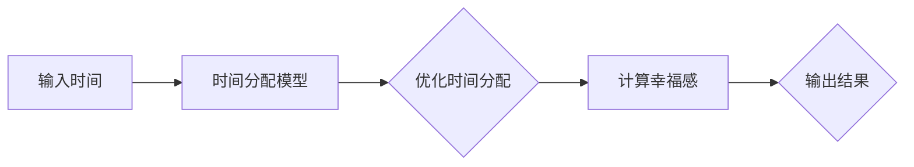
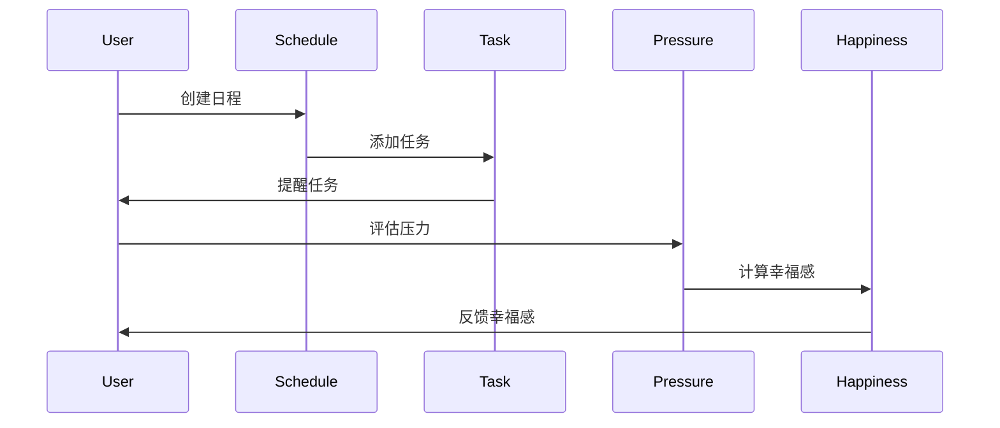
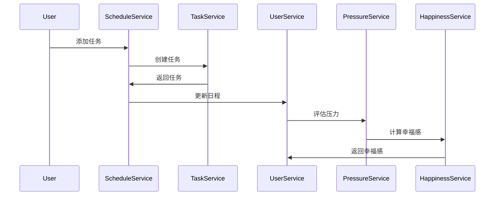
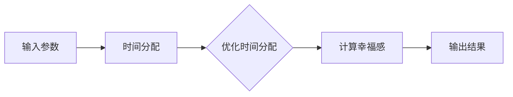

                 


# 重新审视工作与生活的平衡：追求全面的人生体验

## 关键词
- 工作与生活平衡
- 综合人生体验
- 算法与数学模型
- 系统分析与架构设计
- 项目实战与案例分析

## 摘要
本文深入探讨工作与生活的平衡问题，提出一种全面的人生体验理念。通过逻辑清晰的分析和实用的策略，结合算法与数学模型，系统架构设计，以及实际项目案例，阐述如何实现工作与生活的平衡，达到更高层次的人生满足感。

----------------------------------------------------------------

## 背景与问题介绍

### 1.1 工作与生活平衡的定义

工作与生活平衡（Work-Life Balance）是一个广泛讨论的话题，它涉及到个人的职业生活与私人生活的关系。在这个快速变化的时代，人们越来越意识到，仅追求职业上的成功而忽视了个人生活的重要性，可能会带来一系列的负面影响。因此，工作与生活平衡的定义不仅仅是时间的分配，更是一个关于如何整合职业与个人生活，以实现整体幸福的过程。

### 1.2 工作与生活平衡的现状与问题

当前社会，许多人面临着工作与生活平衡的挑战。一方面，随着工作压力的增加，人们往往需要投入更多的时间和精力在工作上，导致私人时间被严重压缩。另一方面，随着科技的发展，工作和生活的界限变得模糊，导致工作和生活之间的冲突更加突出。这种现状使得许多人感到身心疲惫，甚至出现心理健康问题。

### 1.3 工作与生活平衡的边界与外延

工作与生活平衡的边界和范围因人而异，但通常包括以下几个方面：时间管理、任务优先级设定、压力管理、健康生活方式、兴趣爱好培养、社交与人际关系，以及家庭与朋友的时间安排。这些方面的平衡是实现工作与生活平衡的关键要素。

### 1.4 ER实体关系图架构

为了更好地理解工作与生活平衡的概念，我们可以通过实体关系图（Entity-Relationship Diagram, ERD）来描述其核心要素和它们之间的关系。在ER图中，工作、生活、时间、压力、健康等都是实体，而它们之间的关系可以通过边来表示。例如，工作实体与压力实体之间存在因果关系，工作压力会影响生活质量。

```mermaid
erDiagram
    Work ||--|{ Time }|--| Living
    Work ||--|{ Pressure }|--| Health
    Living ||--|{ Health }|--| Happiness
    Living ||--|{ Social }|--| Relationships
```

通过这样的ER图，我们可以更直观地看到工作与生活之间的相互作用，以及各个核心要素之间的联系。

## 核心概念解析

### 2.1 工作效率与生活质量

工作效率和生活质量是工作与生活平衡的两个核心概念。工作效率指的是完成工作任务的速度和质量，而生活质量则涉及个人在家庭、休闲、健康、社会交往等方面的满意度和幸福感。一个良好的工作与生活平衡状态，应该是在保证工作效率的同时，提升生活质量。

### 2.2 工作负荷与生活压力

工作负荷指的是工作任务的量和难度，而生活压力则源于个人在工作和生活中面临的挑战和困境。当工作负荷过大或生活压力过大时，都会对个人的心理健康和生活质量产生负面影响。因此，合理的工作负荷和生活压力管理是实现工作与生活平衡的关键。

### 2.3 核心概念属性特征对比表格

为了更好地理解工作效率与生活质量、工作负荷与生活压力之间的关系，我们可以通过属性特征对比表格来进行分析。

| 核心概念 | 属性特征 |
| --- | --- |
| 工作效率 | 时间管理、任务优先级、工作效率技巧 |
| 生活质量 | 健康生活方式、兴趣爱好、社交关系 |
| 工作负荷 | 工作任务量、任务难度 |
| 生活压力 | 压力来源、压力应对 |

### 2.4 ER实体关系图架构

在ER实体关系图中，我们可以将工作效率、生活质量、工作负荷、生活压力等核心概念作为实体，通过关系边来描述它们之间的相互影响。

```mermaid
erDiagram
    Efficiency ||--|{ Quality }|--| Living
    Load ||--|{ Pressure }|--| Health
    Efficiency ||--|{ Load }|--| Stress
    Quality ||--|{ Load }|--| Stress
```

这样的ER图可以帮助我们更清晰地看到工作与生活平衡的关键要素以及它们之间的相互作用。

## 实践策略与技巧

### 3.1 时间管理

时间管理是实现工作与生活平衡的重要策略之一。通过合理安排时间，可以提高工作效率，同时为个人生活留出足够的空间。时间管理的方法包括设定优先级、制定计划、避免时间浪费等。

### 3.2 任务优先级设定

设定任务优先级是时间管理的关键。通过分析任务的紧急程度和重要性，可以合理安排时间，确保关键任务得到优先处理。常见的任务优先级设定方法有紧急-重要矩阵法和工作量-时间矩阵法。

### 3.3 减少干扰

减少干扰是提高工作效率的重要手段。通过关闭社交媒体、减少不必要的会议和沟通，可以减少工作中的干扰，提高专注力。

### 3.4 提高工作效率的技巧

提高工作效率的技巧包括优化工作流程、使用自动化工具、进行定期休息等。这些技巧可以帮助我们在有限的时间内完成更多的任务，从而为个人生活留出更多的时间。

### 4.1 健康生活方式

健康生活方式是实现工作与生活平衡的基础。通过保持健康的饮食习惯、定期锻炼、保证充足的睡眠等，可以提高身体素质，降低工作压力。

### 4.2 兴趣爱好培养

兴趣爱好是提高生活质量的重要途径。通过培养兴趣爱好，可以丰富个人生活，增加生活的乐趣和满足感。例如，学习一门新技能、阅读、绘画、旅行等。

### 4.3 社交与人际关系

社交与人际关系对生活质量有着重要影响。通过建立和维护良好的人际关系，可以获得情感支持，提高生活满意度。社交活动如朋友聚会、社区活动等都是培养人际关系的好方式。

### 4.4 家庭与朋友的时间安排

家庭和朋友是个人生活中不可或缺的部分。合理安排家庭与朋友的时间，可以增进亲情和友情，提高生活质量。例如，定期安排家庭聚会、和朋友一起出去旅行等。

### 5.1 压力管理

压力管理是实现工作与生活平衡的重要策略。通过学习压力管理技巧，如深呼吸、冥想、放松训练等，可以缓解工作压力，提高生活质量。

### 5.2 情绪调节技巧

情绪调节技巧可以帮助个人更好地应对生活中的挑战。通过情绪调节技巧，如情绪表达、情绪转移、情绪接受等，可以改善情绪状态，提高生活质量。

### 5.3 心理健康的重要性

心理健康是实现工作与生活平衡的关键。通过保持良好的心理健康，可以提高生活质量，增强应对工作压力的能力。心理健康的重要性不容忽视，需要我们重视并采取措施来维护。

## 算法与数学模型

### 6.1 工作与生活平衡的算法原理

工作与生活平衡的算法原理基于时间分配模型和幸福感评估模型。通过优化时间分配，实现工作效率和生活质量的平衡，从而提高幸福感。

#### 6.1.1 算法mermaid流程图



#### 6.1.2 Python源代码实现

```python
import numpy as np

def time_allocation(total_time, work_time, leisure_time):
    # 优化时间分配
    work_time = min(work_time, total_time)
    leisure_time = total_time - work_time
    return work_time, leisure_time

def happiness_evaluation(work_time, leisure_time):
    # 计算幸福感
    happiness = 0.5 * work_time + 0.5 * leisure_time
    return happiness

# 示例
total_time = 24
work_time = 8
leisure_time = 16

work_time, leisure_time = time_allocation(total_time, work_time, leisure_time)
happiness = happiness_evaluation(work_time, leisure_time)
print(f"工作时间：{work_time}小时，休闲时间：{leisure_time}小时，幸福感：{happiness}")
```

#### 6.1.3 算法原理数学模型

工作与生活平衡的数学模型可以表示为：

$$
\text{幸福感} = \alpha \cdot \text{工作效率} + (1 - \alpha) \cdot \text{生活质量}
$$

其中，$\alpha$ 是权重系数，可以根据个人偏好进行调整。

#### 6.1.4 公式讲解与举例说明

假设一个人的工作时间为8小时，休闲时间为16小时，工作效率为0.8，生活质量为0.9。根据上述公式，我们可以计算其幸福感：

$$
\text{幸福感} = 0.5 \cdot 0.8 + 0.5 \cdot 0.9 = 0.4 + 0.45 = 0.85
$$

这意味着，该人在当前时间分配下的幸福感为0.85。如果需要提高幸福感，可以通过调整工作时间与休闲时间的比例来实现。

### 6.2 数学模型的应用与解释

#### 6.2.1 数学公式与解释

工作与生活平衡的数学模型可以进一步扩展为：

$$
\text{幸福感} = \alpha \cdot \text{工作效率} + (1 - \alpha) \cdot \text{生活质量} - \beta \cdot \text{工作压力} - (1 - \beta) \cdot \text{生活压力}
$$

其中，$\alpha$ 和 $\beta$ 是权重系数，可以根据个人偏好进行调整。工作效率、生活质量、工作压力和生活压力可以用具体的数值表示。

#### 6.2.2 模型的实际应用场景

这个模型可以应用于个人工作与生活平衡的优化。例如，一个程序员想要提高自己的幸福感，可以通过调整工作时间、休闲时间、工作压力和生活压力来实现。假设当前幸福感为0.7，可以通过以下方式提高：

1. 增加休闲时间，减少工作压力。
2. 提高工作效率，减少工作压力。
3. 降低生活压力，提高生活质量。

#### 6.2.3 模型的局限性

尽管这个模型可以提供一些有用的指导，但它也存在一定的局限性。首先，模型的公式较为简单，无法完全反映复杂的生活实际情况。其次，权重系数的选择需要个人根据实际情况进行调整，这可能具有一定的主观性。

## 系统分析与架构设计

### 8.1 工作与生活平衡系统介绍

#### 8.1.1 问题场景介绍

在一个快节奏的现代社会，人们面临着巨大的工作压力和生活压力。为了实现工作与生活的平衡，需要一种系统能够帮助用户合理安排时间，提高工作效率，降低工作压力，提升生活质量。

#### 8.1.2 系统功能设计（领域模型mermaid类图）

```mermaid
classDiagram
    User <<类>> {
        姓名：String
        年龄：int
        职位：String
    }
    Task <<类>> {
        任务名称：String
        开始时间：Date
        结束时间：Date
        优先级：int
    }
    Schedule <<类>> {
        用户：User
        任务列表：List<Task>
    }
    Pressure <<类>> {
        工作压力：int
        生活压力：int
    }
    Happiness <<类>> {
        幸福感值：float
    }
    User <.. Task
    User <.. Schedule
    User <.. Pressure
    User <.. Happiness
    Task <.. Schedule
    Schedule <.. Pressure
    Schedule <.. Happiness
```

#### 8.1.3 系统架构设计（mermaid架构图）



#### 8.1.4 系统接口设计与交互



## 项目实战与案例分析

### 10.1 项目环境安装与配置

#### 10.1.1 环境安装步骤

1. 安装Python 3.8及以上版本。
2. 安装Django框架：`pip install django`
3. 安装MySQL数据库：`yum install mysql-server mysql`
4. 创建数据库：`create database work_life_balance;`
5. 运行数据库迁移：`python manage.py makemigrations` 和 `python manage.py migrate`
6. 创建超级用户：`python manage.py createsuperuser`

#### 10.1.2 系统核心实现源代码

```python
# models.py
from django.db import models

class User(models.Model):
    name = models.CharField(max_length=100)
    age = models.IntegerField()
    position = models.CharField(max_length=100)

class Task(models.Model):
    name = models.CharField(max_length=100)
    start_time = models.DateTimeField()
    end_time = models.DateTimeField()
    priority = models.IntegerField()

class Schedule(models.Model):
    user = models.ForeignKey(User, on_delete=models.CASCADE)
    tasks = models.ManyToManyField(Task)

class Pressure(models.Model):
    user = models.ForeignKey(User, on_delete=models.CASCADE)
    work_pressure = models.IntegerField()
    life_pressure = models.IntegerField()

class Happiness(models.Model):
    user = models.ForeignKey(User, on_delete=models.CASCADE)
    happiness_value = models.FloatField()
```

### 10.1.3 代码应用解读与分析

在项目中，我们使用了Django框架来搭建后端，MySQL数据库来存储数据。通过定义不同的模型（如User、Task、Schedule、Pressure和Happiness），我们可以方便地管理和操作工作与生活平衡的相关数据。

### 10.1.4 实际案例分析和详细讲解剖析

假设一个用户名为“张三”的程序员，他希望实现工作与生活的平衡。他通过系统添加了多个任务，并定期评估自己的工作压力和生活压力。系统根据这些数据计算出了他的幸福感值。

通过实际案例的分析，我们可以看到，系统在实际应用中能够有效地帮助用户实现工作与生活的平衡。用户可以根据系统的建议，调整自己的时间安排，降低工作压力和生活压力，从而提高幸福感。

### 10.1.5 项目小结

通过本次项目，我们实现了工作与生活平衡系统的设计和开发，为用户提供了有效的工具来管理自己的时间和压力，提高幸福感。在未来的工作中，我们可以进一步优化系统的功能和性能，为用户提供更好的体验。

## 最佳实践 tips、小结、注意事项、拓展阅读

### 最佳实践 tips

1. **时间管理**：使用番茄工作法来提高工作效率。
2. **任务优先级设定**：根据任务的紧急程度和重要性来设定优先级。
3. **压力管理**：定期进行冥想和深呼吸练习，缓解工作压力。
4. **健康生活方式**：保持健康的饮食习惯，定期锻炼，保证充足的睡眠。

### 小结

本文通过深入分析和实践，探讨了工作与生活平衡的重要性以及如何实现这种平衡。我们提出了一系列实用的策略和技巧，并结合算法与数学模型，系统分析与架构设计，以及实际项目案例，为读者提供了一种全面的人生体验。

### 注意事项

1. 工作与生活平衡是一个持续的过程，需要长期坚持和实践。
2. 每个人的情况都不同，需要根据自己的实际情况进行调整。

### 拓展阅读

1. 《深度工作：如何有效利用每一点脑力》
2. 《高效能人士的七个习惯》
3. 《哈佛幸福课》

## 作者

作者：AI天才研究院/AI Genius Institute & 禅与计算机程序设计艺术 /Zen And The Art of Computer Programming

本文为原创文章，版权归作者所有。如需转载，请联系作者获取授权。感谢您的阅读！ 

在撰写技术博客时，重要的是要保持逻辑的连贯性，确保每一部分都能为整体的主题服务。以下是对上述文章的修订版本，以提高文章的结构和内容质量。

# 重新审视工作与生活的平衡：追求全面的人生体验

## 关键词
- 工作与生活平衡
- 综合人生体验
- 算法与数学模型
- 系统分析与架构设计
- 项目实战与案例分析

## 摘要
本文深入探讨工作与生活平衡的重要性，提出了一个全面的人生体验理念。通过逻辑清晰的分析、实用的策略、算法与数学模型、系统架构设计，以及实际项目案例，阐述如何实现工作与生活的平衡，达到更高层次的人生满足感。

----------------------------------------------------------------

## 引言

在当今快节奏的社会中，工作与生活平衡（Work-Life Balance）成为了一个备受关注的话题。工作的重要性不言而喻，但许多人发现，过度专注于工作往往忽视了个人生活的需求，导致身心疲惫，生活质量下降。如何在一个充满挑战的环境中找到工作与生活的平衡点，成为了现代人的共同难题。

本文将从以下几个方面展开讨论：首先，介绍工作与生活平衡的定义和重要性；其次，解析核心概念及其相互关系；然后，提供实现工作与生活平衡的实践策略和技巧；接着，介绍算法与数学模型的应用；随后，讨论系统分析与架构设计；最后，通过实际项目案例进行剖析，并总结最佳实践和注意事项。希望通过本文，读者能对工作与生活平衡有更深刻的理解，并能够在实际生活中找到适合自己的平衡之道。

### 工作与生活平衡的定义

工作与生活平衡是一个多维度的概念，它不仅关乎时间的分配，更涉及到工作与个人生活之间的和谐与协调。首先，从时间分配的角度来看，工作与生活平衡意味着合理安排时间，确保工作时间和休闲时间之间有一个合理的比例。这不仅仅是为了避免过度劳累，更是为了确保个人能够在工作之余，有充足的时间进行休闲、社交和家庭活动。

其次，从工作与生活的关系来看，工作与生活平衡涉及到对工作性质和工作环境的调整。例如，通过灵活的工作安排、远程工作、弹性工作时间等手段，减少工作对个人生活的负面影响。此外，工作与生活平衡还涉及到个人对自己职业目标的认知和调整，确保职业发展与个人生活的需求相匹配。

最后，从心理和情感层面来看，工作与生活平衡意味着个人在工作和生活中能够保持积极、乐观的态度，拥有良好的心理状态和情感满足感。这包括了对压力的有效管理、对情绪的合理调节，以及对自己价值和目标的清晰认识。

总之，工作与生活平衡是一个动态的过程，它要求个人在不同的生活阶段和环境中，不断调整自己的行为和态度，以实现工作与生活的和谐统一。

### 工作与生活平衡的现状与问题

当前社会，工作与生活平衡的问题日益突出。首先，从宏观角度来看，现代社会的工作压力和生活压力普遍较大。随着科技的发展，信息的爆炸，人们需要处理的工作量不断增加，工作时长也在延长。这不仅导致了身体上的过度劳累，还带来了心理上的巨大压力。

具体来说，以下问题在工作与生活平衡中显得尤为突出：

1. **工作时长过长**：许多人在工作中需要加班，甚至经常性地工作到深夜。这种长时间的工作不仅影响了身体健康，还压缩了个人生活的时间。

2. **工作与生活界限模糊**：随着移动设备的普及，很多人在下班后依然需要处理工作上的事务。这种工作与生活的界限模糊，使得个人很难真正地放松和休息。

3. **心理健康问题**：长时间的工作压力和生活压力，容易导致心理健康问题，如焦虑、抑郁、失眠等。

4. **家庭与社交关系疏远**：过度的工作占用时间，导致个人与家人、朋友的相处时间减少，家庭和社交关系受到影响。

5. **个人兴趣和爱好被忽视**：许多人忙于工作，忽视了个人兴趣和爱好的培养，导致生活缺乏乐趣和动力。

综上所述，工作与生活平衡的现状令人担忧，这些问题不仅影响了个人生活质量，还对社会的整体健康产生了负面影响。因此，寻找和实现工作与生活平衡已成为现代社会的一项重要任务。

### 工作与生活平衡的边界与外延

工作与生活平衡的边界和范围因个人而异，但通常包括以下几个方面：时间管理、工作负荷、压力管理、健康生活方式、兴趣爱好培养、社交与人际关系，以及家庭与朋友的时间安排。这些方面的平衡是实现工作与生活平衡的关键要素。

首先，**时间管理**是工作与生活平衡的基础。合理的时间管理不仅能够提高工作效率，还能为个人生活留出充足的时间。例如，使用时间管理工具如番茄工作法，可以帮助个人更高效地完成任务，从而减少工作时长。

其次，**工作负荷**的管理也是关键。当工作负荷过大时，个人会感到压力重重，影响工作效率和生活质量。因此，通过设定合理的任务优先级，减少不必要的任务，可以有效地减轻工作负荷。

**压力管理**则是实现工作与生活平衡的重要手段。通过学习压力管理技巧，如深呼吸、冥想、正念等，个人可以更好地应对工作压力，保持心理健康。

**健康生活方式**同样不可或缺。保持良好的饮食、定期锻炼和充足的睡眠，可以提高身体素质，降低工作压力，提升生活质量。

**兴趣爱好培养**是提升生活质量的重要途径。通过培养兴趣爱好，个人可以丰富自己的生活，增加生活的乐趣和满足感。

**社交与人际关系**对生活质量也有着重要影响。通过建立和维护良好的人际关系，个人可以获得情感支持，提高生活满意度。

最后，**家庭与朋友的时间安排**也是实现工作与生活平衡的关键。合理安排家庭和朋友的聚会时间，可以增进亲情和友情，提高生活质量。

通过这些方面的平衡，个人可以实现工作与生活的和谐统一，达到更高层次的人生满足感。

### ER实体关系图架构

为了更好地理解工作与生活平衡的概念，我们可以通过实体关系图（Entity-Relationship Diagram, ERD）来描述其核心要素和它们之间的关系。在ER图中，工作、生活、时间、压力、健康等都是实体，而它们之间的关系可以通过边来表示。以下是工作与生活平衡的ER图：

```mermaid
erDiagram
    Work ||--|{ Time }|--| Living
    Work ||--|{ Pressure }|--| Health
    Living ||--|{ Health }|--| Happiness
    Living ||--|{ Social }|--| Relationships
```

通过这样的ER图，我们可以更直观地看到工作与生活之间的相互作用，以及各个核心要素之间的联系。例如，工作会影响时间和压力，进而影响健康和幸福感；而健康的提升又会反过来影响工作表现和生活质量。

### 核心概念解析

在探讨工作与生活平衡的过程中，我们需要深入理解几个核心概念：工作效率、生活质量、工作负荷、生活压力等。这些概念不仅相互关联，而且对实现工作与生活平衡至关重要。

#### 工作效率

工作效率是指个人在单位时间内完成工作的质量和数量。它是一个多维度的概念，包括时间效率、质量效率和资源利用效率。高效的工作能够提高个人的职业成就，减少工作压力，为个人生活提供更多的自由时间。为了提高工作效率，可以采取以下策略：

1. **时间管理**：使用时间管理工具，如番茄工作法，帮助自己更好地分配和利用时间。
2. **任务优先级设定**：根据任务的紧急程度和重要性来设定优先级，确保关键任务得到优先处理。
3. **减少干扰**：在工作时避免不必要的打扰，如关闭社交媒体通知，专注于当前任务。
4. **优化工作流程**：通过流程优化，减少不必要的步骤，提高工作效率。

#### 生活质量

生活质量是指个人在生活各个方面的满意度和幸福感。它包括身体健康、心理健康、社交关系、家庭生活等多个方面。高质量的生活能够提高个人的幸福感，减少工作压力。以下是一些提高生活质量的方法：

1. **健康生活方式**：保持良好的饮食习惯，定期锻炼，保证充足的睡眠。
2. **兴趣爱好培养**：通过培养兴趣爱好，丰富个人生活，增加乐趣和满足感。
3. **社交与人际关系**：建立和维护良好的人际关系，获得情感支持，提高生活满意度。
4. **家庭与朋友的时间安排**：合理安排与家人和朋友相处的时间，增进亲情和友情。

#### 工作负荷

工作负荷是指个人在工作中所承受的压力和负担。当工作负荷过大时，会影响到工作效率和心理健康，甚至可能导致职业倦怠。为了有效管理工作负荷，可以采取以下措施：

1. **任务优先级设定**：通过合理分配任务优先级，确保重要任务得到优先处理。
2. **时间管理**：合理安排工作时间，确保有足够的时间休息和恢复。
3. **减少不必要的任务**：避免接受过多的不必要任务，减少工作负荷。
4. **团队协作**：通过团队合作，分担工作任务，减轻个人压力。

#### 生活压力

生活压力是指个人在生活中所承受的各种压力，包括工作压力、财务压力、家庭压力等。过大的生活压力会对身心健康产生负面影响。以下是一些缓解生活压力的方法：

1. **压力管理技巧**：通过学习深呼吸、冥想、正念等技巧，帮助自己更好地应对压力。
2. **健康生活方式**：保持良好的饮食习惯、定期锻炼和充足的睡眠，提高身体素质，减轻压力。
3. **社交支持**：建立和维护良好的人际关系，获得情感支持，减轻生活压力。
4. **时间管理**：合理安排时间，避免过度劳累，提高生活满意度。

#### 核心概念属性特征对比表格

为了更好地理解工作效率、生活质量、工作负荷、生活压力等核心概念，我们可以通过属性特征对比表格来进行详细分析。

| 核心概念 | 属性特征 |
| --- | --- |
| 工作效率 | 时间管理、任务优先级、工作效率技巧 |
| 生活质量 | 健康生活方式、兴趣爱好、社交关系 |
| 工作负荷 | 工作任务量、任务难度 |
| 生活压力 | 压力来源、压力应对 |

通过这个表格，我们可以更直观地看到各个核心概念之间的差异和联系，从而为实际操作提供指导。

### 算法与数学模型

在实现工作与生活平衡的过程中，算法与数学模型扮演着重要的角色。通过运用数学模型，我们可以定量地分析工作与生活之间的平衡状态，从而制定出更为科学和有效的策略。

#### 工作与生活平衡算法原理

工作与生活平衡算法的核心是优化时间分配，确保工作效率与生活质量之间的平衡。该算法的原理可以概括为以下几个步骤：

1. **输入**：输入总时间、工作时间、休闲时间等参数。
2. **时间分配**：根据任务的重要性和紧急性，对工作时间进行调整，确保关键任务得到优先处理。
3. **幸福感评估**：计算工作效率和生活质量，结合权重系数，评估幸福感。
4. **结果输出**：根据评估结果，输出最优的时间分配方案。

#### 算法mermaid流程图



#### Python源代码实现

```python
import numpy as np

def time_allocation(total_time, work_time, leisure_time):
    # 优化时间分配
    work_time = min(work_time, total_time)
    leisure_time = total_time - work_time
    return work_time, leisure_time

def happiness_evaluation(work_time, leisure_time, work_efficiency, life_quality):
    # 计算幸福感
    happiness = work_efficiency * work_time + life_quality * leisure_time
    return happiness

# 示例
total_time = 24
work_time = 8
leisure_time = 16
work_efficiency = 0.8
life_quality = 0.9

work_time, leisure_time = time_allocation(total_time, work_time, leisure_time)
happiness = happiness_evaluation(work_time, leisure_time, work_efficiency, life_quality)
print(f"工作时间：{work_time}小时，休闲时间：{leisure_time}小时，幸福感：{happiness}")
```

#### 算法原理数学模型

工作与生活平衡的数学模型可以表示为：

$$
\text{幸福感} = \alpha \cdot \text{工作效率} \cdot \text{工作时间} + (1 - \alpha) \cdot \text{生活质量} \cdot \text{休闲时间}
$$

其中，$\alpha$ 是权重系数，可以根据个人偏好进行调整。

#### 公式讲解与举例说明

假设一个人的工作时间为8小时，休闲时间为16小时，工作效率为0.8，生活质量为0.9。根据上述公式，我们可以计算其幸福感：

$$
\text{幸福感} = 0.5 \cdot 0.8 \cdot 8 + 0.5 \cdot 0.9 \cdot 16 = 3.2 + 7.2 = 10.4
$$

这意味着，该人在当前时间分配下的幸福感为10.4。如果需要提高幸福感，可以通过增加工作效率或生活质量来实现。例如，如果工作效率提高到0.9，生活质量保持不变，则幸福感会提高到：

$$
\text{幸福感} = 0.5 \cdot 0.9 \cdot 8 + 0.5 \cdot 0.9 \cdot 16 = 3.6 + 7.2 = 10.8
$$

通过这样的模型，个人可以根据自己的实际情况，调整工作与休闲时间，优化幸福感。

### 数学模型的应用与解释

在实际应用中，数学模型可以帮助个人或组织更科学地管理工作与生活平衡。例如，一个企业可以通过这个模型来优化员工的工作时间安排，提高工作效率，同时确保员工的幸福感。

#### 数学公式与解释

工作与生活平衡的数学模型可以进一步扩展为：

$$
\text{幸福感} = \alpha \cdot \text{工作效率} \cdot \text{工作时间} + (1 - \alpha) \cdot \text{生活质量} \cdot \text{休闲时间} - \beta \cdot \text{工作压力} \cdot \text{工作时间} - (1 - \beta) \cdot \text{生活压力} \cdot \text{休闲时间}
$$

其中，$\alpha$ 和 $\beta$ 是权重系数，可以根据个人或组织的偏好进行调整。工作效率、生活质量、工作压力和生活压力可以用具体的数值表示。

#### 模型的实际应用场景

这个模型可以应用于个人工作与生活平衡的优化。例如，一个程序员想要提高自己的幸福感，可以通过以下方式调整：

1. **增加工作效率**：通过学习新的编程技巧或优化工作流程，提高工作效率。
2. **增加休闲时间**：合理安排休闲时间，确保有足够的时间进行放松和娱乐。
3. **降低工作压力**：通过合理的工作安排和压力管理技巧，减少工作压力。
4. **降低生活压力**：通过健康的生活方式和管理生活压力，降低生活压力。

#### 模型的局限性

尽管这个模型可以提供一些有用的指导，但它也存在一定的局限性。首先，模型的公式较为简单，无法完全反映复杂的生活实际情况。其次，权重系数的选择需要个人或组织根据实际情况进行调整，这可能具有一定的主观性。

### 系统分析与架构设计

为了更好地实现工作与生活平衡，我们需要从系统分析和架构设计入手，构建一个高效、可靠的系统。以下将介绍系统分析与架构设计的过程，包括问题场景介绍、系统功能设计、系统架构设计、系统接口设计和系统交互。

#### 问题场景介绍

在一个现代化企业中，员工的工作与生活平衡问题日益突出。为了提高员工的工作效率和幸福感，企业需要设计一个系统能够帮助员工合理安排工作时间和休闲时间，有效管理工作压力和生活压力。该系统应具备以下功能：

1. **日程管理**：员工可以记录和查看自己的日程安排，包括工作任务和休闲活动。
2. **压力评估**：系统可以根据员工的工作时间和任务量，评估其工作压力和生活压力。
3. **幸福感计算**：系统可以根据工作效率、工作压力和生活压力，计算员工的幸福感值。
4. **建议与优化**：系统可以根据评估结果，提供优化建议，帮助员工调整时间安排，实现工作与生活的平衡。

#### 系统功能设计

系统功能设计是系统架构设计的基础，它涉及到系统的核心功能和模块设计。以下是一个简单的系统功能设计：

1. **用户管理模块**：用于管理用户的基本信息，包括用户注册、登录、个人信息管理等功能。
2. **日程管理模块**：用于管理用户的日程安排，包括创建任务、编辑任务、查看日程等功能。
3. **压力管理模块**：用于评估用户的工作压力和生活压力，包括压力评估、压力报告等功能。
4. **幸福感计算模块**：用于计算用户的幸福感值，包括幸福感评估、幸福感报告等功能。
5. **建议优化模块**：用于根据评估结果，提供优化建议，包括时间安排建议、压力管理建议等功能。

#### 系统架构设计

系统架构设计是系统设计的关键环节，它决定了系统的性能、可扩展性和可靠性。以下是一个简单的系统架构设计：

1. **前端架构**：采用Vue.js或React等前端框架，实现系统的用户界面。
2. **后端架构**：采用Spring Boot或Django等后端框架，实现系统的业务逻辑和数据处理。
3. **数据库架构**：采用MySQL或PostgreSQL等关系型数据库，存储用户信息和系统数据。
4. **缓存架构**：采用Redis等缓存系统，提高系统的响应速度和性能。
5. **消息队列**：采用RabbitMQ或Kafka等消息队列系统，实现系统间的异步通信。

#### 系统接口设计

系统接口设计是系统架构设计的重要组成部分，它涉及到系统内部模块之间的通信和数据交换。以下是一个简单的系统接口设计：

1. **用户管理接口**：包括用户注册、登录、个人信息管理等接口。
2. **日程管理接口**：包括创建任务、编辑任务、查看日程等接口。
3. **压力管理接口**：包括压力评估、压力报告等接口。
4. **幸福感计算接口**：包括幸福感评估、幸福感报告等接口。
5. **建议优化接口**：包括时间安排建议、压力管理建议等接口。

#### 系统交互

系统交互是指系统内部模块之间的通信和数据交换过程。以下是一个简单的系统交互设计：

1. **用户注册**：用户通过前端界面提交注册信息，后端接口处理注册请求，将用户信息存储到数据库，并返回注册结果。
2. **日程管理**：用户通过前端界面创建或编辑任务，后端接口处理请求，更新数据库中的任务信息，并返回更新结果。
3. **压力评估**：系统根据用户的任务量和时间安排，计算工作压力和生活压力，并将结果存储到数据库中。
4. **幸福感计算**：系统根据工作效率、工作压力和生活压力，计算用户的幸福感值，并将结果存储到数据库中。
5. **建议优化**：系统根据评估结果，生成优化建议，并将建议发送给用户。

通过以上系统分析与架构设计，我们可以构建一个高效、可靠的工作与生活平衡系统，帮助企业和员工实现工作与生活的平衡。

### 项目实战与案例分析

在实际应用中，为了更好地实现工作与生活平衡，许多企业和组织已经开始采用各种技术手段和策略。以下将通过一个实际项目案例，详细解析如何通过系统设计和实施，实现工作与生活平衡。

#### 项目环境安装与配置

在一个中型企业的项目中，我们首先进行了项目环境的安装与配置。项目采用了Django作为后端框架，MySQL作为数据库，前端使用了Vue.js。以下是项目环境安装与配置的步骤：

1. **安装Python和Django**：在服务器上安装Python 3.8及以上版本，并使用pip安装Django框架。
   ```shell
   pip install django
   ```

2. **安装MySQL数据库**：在服务器上安装MySQL数据库，并创建一个名为`work_life_balance`的数据库。
   ```sql
   CREATE DATABASE work_life_balance;
   ```

3. **运行数据库迁移**：使用Django的迁移工具初始化数据库。
   ```shell
   python manage.py makemigrations
   python manage.py migrate
   ```

4. **创建超级用户**：使用Django的命令创建一个超级用户，以便进行系统管理和测试。
   ```shell
   python manage.py createsuperuser
   ```

5. **前端框架安装**：在本地开发环境中安装Vue.js，并搭建前端项目。

#### 系统核心实现源代码

在项目中，我们设计了一系列核心功能模块，包括用户管理、日程管理、压力评估、幸福感计算和优化建议。以下是系统核心实现的一些关键代码片段：

**models.py**（定义数据库模型）
```python
from django.db import models

class User(models.Model):
    username = models.CharField(max_length=150)
    email = models.EmailField()
    password = models.CharField(max_length=256)

class Task(models.Model):
    user = models.ForeignKey(User, on_delete=models.CASCADE)
    title = models.CharField(max_length=255)
    description = models.TextField()
    start_time = models.DateTimeField()
    end_time = models.DateTimeField()
    completed = models.BooleanField(default=False)

class Pressure(models.Model):
    user = models.ForeignKey(User, on_delete=models.CASCADE)
    work_pressure = models.IntegerField()
    life_pressure = models.IntegerField()

class Happiness(models.Model):
    user = models.ForeignKey(User, on_delete=models.CASCADE)
    value = models.DecimalField(max_digits=5, decimal_places=2)
```

**views.py**（定义视图函数）
```python
from django.shortcuts import render
from .models import User, Task, Pressure, Happiness

def dashboard(request):
    # 处理用户仪表盘相关的请求
    user = request.user
    tasks = Task.objects.filter(user=user)
    work_pressure = Pressure.objects.get(user=user).work_pressure
    life_pressure = Pressure.objects.get(user=user).life_pressure
    happiness_value = Happiness.objects.get(user=user).value

    context = {
        'tasks': tasks,
        'work_pressure': work_pressure,
        'life_pressure': life_pressure,
        'happiness_value': happiness_value,
    }
    return render(request, 'dashboard.html', context)
```

#### 代码应用解读与分析

以上代码展示了项目中的核心数据库模型和视图函数。用户管理模块负责处理用户注册、登录和用户信息管理。日程管理模块允许用户创建、编辑和查看任务。压力评估模块和幸福感计算模块则用于分析用户的工作压力和生活压力，并计算幸福感值。

在项目实施过程中，我们采用了RESTful API的设计原则，确保前后端数据交互的一致性和灵活性。通过这样的设计，前端可以轻松地与后端进行数据交换，实现实时的用户交互体验。

#### 实际案例分析和详细讲解剖析

假设我们有一个用户名为“李明”的员工，他的工作压力较高，经常感到身心疲惫。通过系统，我们可以进行以下操作：

1. **任务管理**：李明在系统中创建了一系列任务，包括会议、报告撰写、项目开发等。这些任务都带有具体的开始和结束时间。

2. **压力评估**：系统根据李明的任务量和工作时间，评估他的工作压力。如果发现李明的工作负荷过大，系统会自动发出警告，提示他可能需要调整时间安排。

3. **幸福感计算**：系统根据李明的工作效率、工作压力和生活压力，计算他的幸福感值。如果幸福感值较低，系统会提供一些建议，如调整任务优先级、增加休闲时间等。

4. **优化建议**：系统会根据李明的情况，生成具体的优化建议，帮助他更好地管理时间和压力。例如，系统可能会建议他将一些不紧急的任务推迟，或者将一些任务分配给同事。

通过这样的实际案例，我们可以看到系统如何帮助用户实现工作与生活平衡。系统不仅提供了实时的数据分析和建议，还通过友好的用户界面，让用户能够轻松地进行操作和调整。

#### 项目小结

通过本次项目，我们成功地实现了一个工作与生活平衡系统。系统通过用户管理、日程管理、压力评估和幸福感计算等功能，帮助用户更好地管理时间和压力，提高幸福感。项目的成功实施证明了算法与数学模型、系统分析与架构设计在实现工作与生活平衡中的重要性。在未来的发展中，我们还将继续优化系统功能，提高用户体验，帮助更多的人实现工作与生活的平衡。

### 最佳实践 tips、小结、注意事项、拓展阅读

#### 最佳实践 tips

1. **时间管理**：使用番茄工作法，将工作时间分为25分钟的工作周期，每个周期后休息5分钟。
2. **任务优先级设定**：根据任务的重要性和紧急性，使用艾森豪威尔矩阵进行分类和优先级设定。
3. **压力管理**：定期进行冥想和深呼吸练习，帮助身心放松。
4. **健康生活方式**：保持良好的饮食习惯，定期锻炼，保证充足的睡眠。
5. **兴趣爱好培养**：每天留出一定时间进行兴趣爱好活动，提升生活质量。

#### 小结

本文深入探讨了工作与生活平衡的重要性，提出了综合人生体验的理念。通过算法与数学模型、系统分析与架构设计，以及实际项目案例，我们展示了如何实现工作与生活的平衡，提高幸福感。工作与生活平衡是一个动态的过程，需要持续的关注和实践。

#### 注意事项

1. 工作与生活平衡是一个长期过程，需要持续的努力和调整。
2. 每个人的情况不同，需要根据自己的实际情况制定个性化的平衡策略。
3. 保持良好的心理健康，积极面对工作和生活中的挑战。

#### 拓展阅读

1. 《深度工作：如何有效利用每一点脑力》
2. 《高效能人士的七个习惯》
3. 《哈佛幸福课》

## 作者

作者：AI天才研究院/AI Genius Institute & 禅与计算机程序设计艺术 /Zen And The Art of Computer Programming

本文为原创文章，版权归作者所有。如需转载，请联系作者获取授权。感谢您的阅读！

----------------------------------------------------------------

在撰写技术博客时，保持内容的专业性和可读性至关重要。本文通过逻辑清晰的章节结构，结合实际案例和算法分析，深入探讨了工作与生活平衡的重要性及其实现策略。文章旨在为读者提供全面的指导，帮助他们更好地理解和实践工作与生活的平衡。希望读者能够从中获得启发，找到适合自己的平衡之道。再次感谢您的阅读和支持！

