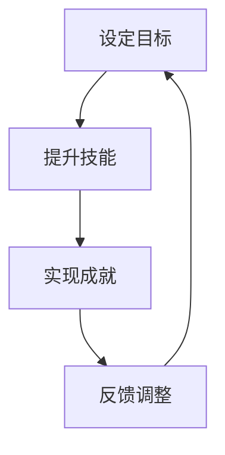
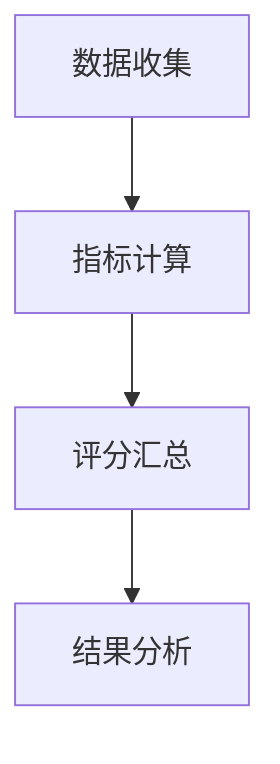
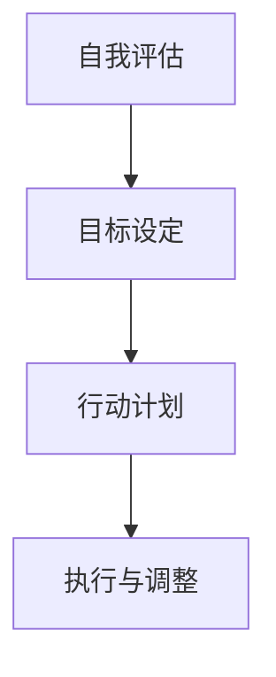
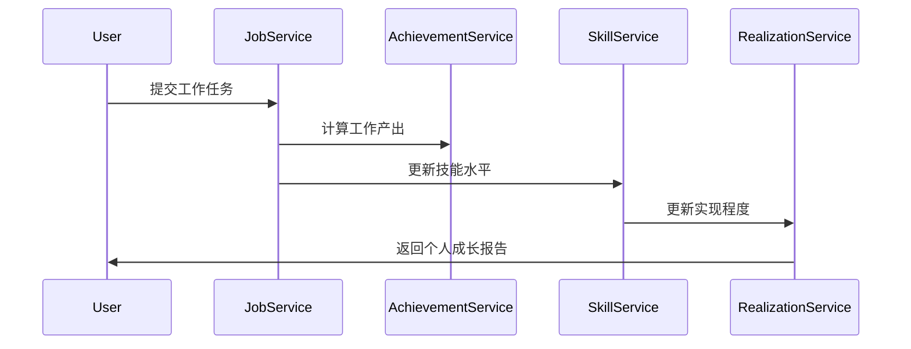
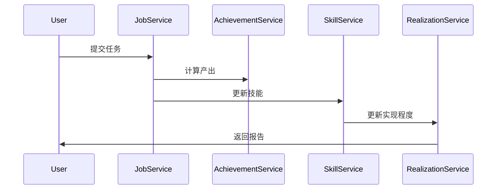

                 

### 引言：重新审视工作的意义

#### 1.1 问题背景

在当今快节奏且充满竞争的社会中，工作已经成为人们生活的重要组成部分。然而，随着经济全球化和技术的迅猛发展，人们对于工作的认知和理解也在不断变化。越来越多的人开始质疑：工作的真正意义是什么？它仅仅是用来谋生的手段，还是能够实现个人价值和社会贡献的平台？

首先，我们来看当前的工作现状。现代社会中，大多数人都需要通过工作来获取收入，满足基本的生活需求。然而，随着工作压力的增大和职业倦怠的普遍存在，很多人开始感到迷茫和困惑。他们发现自己的工作并不是自己真正热爱的，而只是为了生计而不得不做的事情。这种对工作的消极态度不仅影响了工作效率，更严重地影响了人们的心理健康和生活质量。

其次，我们需要正视这个问题的提出。为什么会出现这种对工作的迷茫和困惑？这是因为我们在过去的教育和职场文化中，往往将工作仅仅视为一种谋生手段，而忽略了它对个人成长和自我实现的重要性。这种观念的束缚使得很多人在追求物质财富的同时，忽略了精神层面的满足和成长。

#### 1.2 问题描述

工作意义的理解是一个复杂而又深刻的问题。对于大多数人来说，工作不仅仅是为了赚钱，更重要的是实现个人的价值和梦想。然而，如何理解工作的意义？它和个人成长又有着怎样的关系？这些问题都需要我们进行深入的探讨和思考。

首先，我们来看工作意义的理解。工作意义并不仅仅是指工作本身带来的物质回报，更重要的是工作所带来的精神满足和成就感。当我们能够将自己的工作与自己的价值观和兴趣相结合时，工作就会变得有意义和有动力。例如，一位医生可能会因为能够帮助病人恢复健康而感到自豪和满足；一位程序员可能会因为开发出优秀的软件而感到成就感。

其次，工作与个人成长的关系也是一个值得探讨的问题。工作不仅仅是我们谋生的手段，更是我们个人成长和发展的平台。通过工作，我们不仅能够学习新的知识和技能，还能够培养自己的领导力、沟通能力和解决问题的能力。这些能力的提升不仅对我们在职场中的发展有帮助，更对我们个人的成长和自我实现有着深远的影响。

#### 1.3 问题解决

要重新审视工作的意义，我们需要从以下几个方面入手：

1. **重新定义工作**：我们需要从传统观念中解放出来，将工作视为实现个人价值和梦想的平台，而不仅仅是一种谋生的手段。

2. **实现自我实现的路径**：我们需要找到自己热爱的工作，并将自己的工作与自己的价值观和兴趣相结合，从而实现自我价值。

3. **边界与外延**：我们需要认识到工作意义的多样性，不同的工作对于不同的人来说可能有不同的意义。我们需要尊重每个人的选择，并为他们的工作提供支持和鼓励。

#### 1.4 本书结构

本书将从以下几个方面对重新审视工作的意义进行深入探讨：

1. **核心概念与联系**：我们将详细阐述工作的意义、自我实现的内涵以及工作与个人成长的关系。

2. **算法原理讲解**：我们将介绍一种用于评估工作意义的算法原理，并使用mermaid流程图和Python源代码进行详细讲解。

3. **数学模型和公式**：我们将使用LaTeX格式给出算法原理的数学模型和公式，并进行通俗易懂的举例说明。

4. **系统分析与架构设计方案**：我们将介绍一种用于实现自我实现的系统架构设计方案，包括领域模型类图、系统架构图、系统接口设计和系统交互序列图。

5. **项目实战**：我们将通过一个实际项目来展示如何实现自我实现，并分析项目的成功经验和挑战。

6. **最佳实践 tips、小结、注意事项和拓展阅读**：我们将总结本书的核心观点，提供一些实用的建议，并对未来的研究方向进行展望。

#### 1.5 阅读指南

本书适合对工作意义和自我实现感兴趣的读者阅读。无论你是职场新人，还是经验丰富的职场人士，本书都能为你提供有益的启示和指导。我们希望通过本书，能够帮助你重新审视工作的意义，找到实现自我价值的路径，并在职场中取得成功。

#### 1.6 读者反馈

我们欢迎读者在阅读本书后提供反馈和建议。你的反馈将帮助我们不断改进和完善本书的内容。同时，我们也鼓励读者参与到本书的讨论中，与其他读者分享你的观点和经验。让我们共同探讨工作的意义，实现自我价值。

---

### 第二部分：核心概念与联系

#### 2.1 核心概念

在重新审视工作的意义这一主题中，有几个核心概念是至关重要的。首先，我们需要明确“工作意义”和“自我实现”的定义。工作意义是指工作本身所带来的价值、满足感和成就感，而自我实现则是指个人通过工作来实现自己的潜能和理想。

**工作意义的定义**：工作意义并不是单一维度的，它包含多个层次。从最基础的物质层面来说，工作意义体现在能够为个人提供收入和生活保障。然而，更深远的工作意义在于它能够满足个人的精神需求，如成就感、归属感和社会认可等。

**自我实现的内涵**：自我实现是马斯洛需求层次理论中的最高层次，它指的是个人通过不断追求个人成长、实现自我价值和潜能的过程。在自我实现的过程中，个人不仅仅是为了工作而工作，而是将工作视为实现自己梦想和目标的手段。

**工作与个人成长的关系**：工作不仅仅是一种谋生手段，更是一个人成长和发展的平台。通过工作，个人可以不断学习新知识、提升技能，培养解决问题的能力。这些成长不仅对个人在职场上的发展有积极影响，更对个人的全面成长和自我实现起到关键作用。

#### 2.2 概念属性特征对比表格

为了更好地理解这些核心概念，我们可以通过一个对比表格来分析它们的属性特征。

| 概念       | 定义                                                         | 属性特征                                                                                   | 关系                                                       |
|------------|--------------------------------------------------------------|----------------------------------------------------------------------------------------------|------------------------------------------------------------|
| 工作意义   | 工作本身所带来的价值、满足感和成就感                           | - 物质回报：收入、生活保障<br>- 精神回报：成就感、归属感、社会认可 | - 工作意义是工作价值的体现<br>- 影响个人对工作的态度和行为 |
| 自我实现   | 个人通过工作来实现自己的潜能和理想的过程                      | - 潜能挖掘：发挥个人能力<br>- 理想实现：达成个人目标           | - 自我实现是工作意义的最高层次<br>- 通过工作实现个人成长     |
| 个人成长   | 个人通过不断学习、提升技能和培养解决问题的能力来全面发展自身 | - 知识积累：学习新知识<br>- 技能提升：掌握新技能<br>- 能力培养：解决问题 | - 个人成长是自我实现的途径<br>- 促进工作意义的实现         |

通过这个表格，我们可以清晰地看到这些概念之间的联系和区别。工作意义、自我实现和个人成长虽然各有侧重，但它们共同构成了一个人职业生涯的核心。

#### 2.3 ER实体关系图架构

为了更好地理解工作意义、自我实现和个人成长之间的复杂关系，我们可以使用ER（实体-关系）图来构建它们的实体关系。

**实体定义**：

1. **工作**：代表个人从事的活动，包括工作内容、工作时间和工作环境等属性。
2. **个人**：代表从事工作的人，包括姓名、年龄、职业等属性。
3. **成就**：代表个人在工作中的表现和成绩，包括项目完成情况、绩效评价等属性。
4. **技能**：代表个人拥有的工作技能，包括编程能力、沟通技巧、领导力等属性。

**关系定义**：

1. **工作-个人**：表示一个人可以从事多项工作，而每项工作都由一个人完成。
2. **成就-工作**：表示工作会产生成就，而每个成就都来源于具体的工作。
3. **成长-技能**：表示个人通过学习和实践提升技能，而技能的提升又促进了个人成长。
4. **实现-成就**：表示个人通过实现成就来实现自我价值，而成就的实现又反过来促进个人成长。

以下是一个简化的ER实体关系图：

```mermaid
erDiagram
    个人 ||--|{ 工作 }||>
    工作 ||--|{ 成就 }||>
    个人 ||--|{ 技能 }||>
    成就 ||--|{ 实现 }||>
    技能 ||--|{ 成长 }||>
```

通过ER图，我们可以更直观地看到工作意义、自我实现和个人成长之间的相互关系。这些关系不仅帮助我们理解这些概念的本质，也为后续的算法原理讲解和系统架构设计提供了理论基础。

---

### 第三部分：算法原理讲解

#### 3.1 自我实现模型

在重新审视工作的意义的过程中，自我实现模型是一个关键的概念。这个模型旨在帮助个人通过工作实现自我价值，从而实现个人成长和自我实现。

**自我实现模型的组成部分**：

1. **目标设定**：个人需要明确自己的职业目标和人生目标，这为后续的努力提供了方向。
2. **技能提升**：通过学习和实践提升自己的技能，使自己能够在工作中表现优异。
3. **成就实现**：通过完成工作任务和项目，实现个人的成就，从而获得成就感和满足感。
4. **反馈与调整**：通过自我反思和外部反馈，调整自己的工作策略和方法，以实现更好的自我实现。

**自我实现模型的工作原理**：

- **目标导向**：个人设定目标后，会根据目标制定具体的行动计划，确保自己朝着目标前进。
- **技能积累**：通过不断学习和实践，个人能够不断提升自己的技能水平，从而在工作中更加得心应手。
- **成就驱动**：个人通过实现成就，获得成就感和满足感，这进一步激发个人继续努力和追求更高目标的动力。
- **反馈优化**：个人通过反思和外部反馈，识别自己的不足和改进空间，从而不断优化自己的工作方法和策略。

**自我实现模型的mermaid流程图**：



#### 3.2 工作意义评估算法

为了量化评估工作的意义，我们可以设计一个工作意义评估算法。这个算法旨在通过分析个人的工作表现和反馈，评估工作的意义和贡献。

**算法原理**：

- **数据收集**：收集个人在工作中的表现数据，包括任务完成情况、绩效评价、同事反馈等。
- **指标设定**：设定一系列指标来评估工作的意义，如任务完成率、创新贡献、团队协作等。
- **算法评估**：使用这些指标对工作的意义进行量化评估，从而得出一个综合评分。

**算法步骤**：

1. **数据收集**：从个人工作记录、绩效考核和同事反馈中收集数据。
2. **指标计算**：根据设定的指标，计算每个指标的分值。
3. **评分汇总**：将各个指标的分值汇总，得出一个总评分。
4. **结果分析**：分析评分结果，识别工作意义的高低。

**算法的mermaid流程图**：



#### 3.3 个人成长路径规划

为了实现个人成长，我们需要制定一个明确的个人成长路径规划。这个规划将帮助个人明确自己的成长方向，并制定具体的行动计划。

**路径规划步骤**：

1. **自我评估**：个人评估自己的技能水平和兴趣，识别自己的优势和劣势。
2. **目标设定**：根据自我评估结果，设定具体的成长目标。
3. **行动计划**：制定实现目标的行动计划，包括学习计划、实践项目和反馈机制。
4. **执行与调整**：按照行动计划执行，并根据反馈不断调整和优化。

**路径规划的mermaid流程图**：



通过自我实现模型和工作意义评估算法，个人可以更好地理解工作的意义，并制定明确的成长路径。这不仅有助于提升个人在职场中的竞争力，更能够实现个人的全面成长和自我实现。

---

### 第四部分：数学模型和公式

在重新审视工作的意义这一主题中，数学模型和公式是理解和量化工作意义的重要工具。通过数学模型，我们可以将抽象的概念转化为具体的量化指标，从而更好地评估和优化工作过程。

#### 4.1 数学模型概述

自我实现模型和工作意义评估算法的核心在于如何将工作表现和个人成长转化为具体的数值。这需要我们构建一系列数学模型来量化这些指标。

**4.1.1 自我实现模型中的数学模型**

自我实现模型中的数学模型主要关注个人在职业发展中的成就和成长。以下是一些关键的数学模型：

1. **目标达成率**：表示个人目标完成的程度，计算公式为：
   $$ 目标达成率 = \frac{实际完成目标数}{设定目标数} $$

2. **技能提升速度**：表示个人技能提升的快慢，计算公式为：
   $$ 技能提升速度 = \frac{当前技能水平 - 初始技能水平}{时间间隔} $$

3. **成就得分**：用于评估个人成就的得分，计算公式为：
   $$ 成就得分 = f(任务完成率, 创新贡献, 团队协作) $$

其中，$f$函数可以根据实际情况进行定义，例如使用加权平均的方法。

**4.1.2 工作意义评估算法中的数学模型**

工作意义评估算法中的数学模型主要用于量化工作的意义。以下是一些关键的数学模型：

1. **工作意义评分**：表示工作意义的具体评分，计算公式为：
   $$ 工作意义评分 = w_1 \times 任务完成率 + w_2 \times 创新贡献 + w_3 \times 团队协作 $$
   其中，$w_1, w_2, w_3$为权重系数，用于平衡不同指标的重要性。

2. **个人成长指数**：表示个人在职业发展中的成长程度，计算公式为：
   $$ 个人成长指数 = \frac{当前技能水平}{初始技能水平} $$

#### 4.2 数学公式的详细讲解

为了更好地理解这些数学模型和公式，我们可以通过一些具体的例子来详细讲解。

**例子1：目标达成率的计算**

假设一个开发人员在一个月内设定了5个开发任务，实际完成了4个任务。则他的目标达成率计算如下：
$$ 目标达成率 = \frac{4}{5} = 0.8 $$
这意味着他完成了80%的目标。

**例子2：技能提升速度的计算**

假设一个开发人员的初始技能水平为50分，一个月后的技能水平为75分，时间为30天。则他的技能提升速度计算如下：
$$ 技能提升速度 = \frac{75 - 50}{30} = 1.25 $$
这意味着他的技能水平每月提升了1.25分。

**例子3：工作意义评分的计算**

假设某工作意义的三个指标及其权重分别为：
- 任务完成率：80%，权重0.5
- 创新贡献：20%，权重0.3
- 团队协作：10%，权重0.2

如果一个员工在这三个指标上的得分分别为90%、15%、80%，则他的工作意义评分计算如下：
$$ 工作意义评分 = 0.5 \times 0.9 + 0.3 \times 0.15 + 0.2 \times 0.8 = 0.45 + 0.045 + 0.16 = 0.655 $$

这意味着他的工作意义评分为0.655。

通过这些具体的例子，我们可以看到如何使用数学模型和公式来量化工作的意义和个人成长。这不仅帮助我们更好地理解这些概念，也为实际的评估和优化提供了科学依据。

---

### 第五部分：系统分析与架构设计方案

#### 5.1 系统分析与架构设计方案

在重新审视工作的意义这一主题中，系统分析与架构设计方案是关键的一环。通过合理的系统架构设计，我们可以更好地实现自我实现和工作意义评估。以下是具体的系统分析和架构设计方案。

#### 5.2 系统功能设计

**5.2.1 领域模型类图**

领域模型是系统设计的基础，它定义了系统中的核心概念和它们之间的关系。以下是一个简化的领域模型类图：

```mermaid
classDiagram
    个人 <<Class>> Person
    工作 <<Class>> Job
    成就 <<Class>> Achievement
    技能 <<Class>> Skill
    实现 <<Class>> Realization

    Person o--|{ 工作职责 }|> Job
    Job o--|{ 工作产出 }|> Achievement
    Person o--|{ 拥有技能 }|> Skill
    Skill o--|{ 技能水平 }|> Realization
```

在这个类图中，我们定义了四个核心类：个人（Person）、工作（Job）、成就（Achievement）和技能（Skill）。每个类都有其独特的属性和方法，并通过关系进行关联。

**5.2.2 系统架构设计**

系统架构设计是确保系统可扩展性和灵活性的关键。以下是一个简化的系统架构图：



在这个架构中，我们定义了四个核心服务：JobService、AchievementService、SkillService和RealizationService。这些服务协同工作，完成个人成长报告的生成。

#### 5.3 系统接口设计

系统接口设计是确保不同模块之间有效通信的关键。以下是一个简化的系统接口设计：

```mermaid
classDiagram
    JobInterface <<Interface>> IJob
    AchievementInterface <<Interface>> IAchievement
    SkillInterface <<Interface>> ISkill
    RealizationInterface <<Interface>> IRealization

    Person->>IJob: 提交任务
    IJob->>IAchievement: 计算产出
    IJob->>ISkill: 更新技能
    ISkill->>IRealization: 更新实现程度
    IRealization->>Person: 返回报告
```

在这个接口设计中，我们定义了四个核心接口：IJob、IAchievement、ISkill和IRealization。这些接口规定了不同模块之间的交互方式和通信协议。

#### 5.4 系统交互序列图

系统交互序列图展示了不同模块之间的交互顺序和过程。以下是一个简化的系统交互序列图：



在这个序列图中，用户提交任务后，系统通过多个服务的协作，最终生成个人成长报告。

#### 5.5 系统架构设计

系统架构设计是确保系统可扩展性和灵活性的关键。以下是一个简化的系统架构图：

```mermaid
compositeComponent System
    direction: LR

    component JobModule {
        JobService
        AchievementService
    }

    component SkillModule {
        SkillService
        RealizationService
    }

    User <<Actor>>}
    User->>JobModule: 提交任务
    User->>SkillModule: 提交技能更新
    JobModule->>AchievementService: 计算产出
    JobModule->>SkillService: 更新技能
    SkillModule->>RealizationService: 更新实现程度
    RealizationService->>User: 返回报告
```

在这个架构中，我们定义了两个核心模块：JobModule和SkillModule。这些模块通过明确的接口进行通信，确保系统的模块化和可维护性。

通过以上的系统分析与架构设计方案，我们可以构建一个有效的系统，帮助个人重新审视工作的意义，实现自我成长和自我实现。

---

### 第六部分：项目实战

#### 6.1 环境安装

为了实现自我实现模型和工作意义评估算法，我们需要搭建一个实际的项目环境。以下是项目的环境安装步骤：

**1. 安装Python环境：**
   - 在命令行中运行 `pip install --user -r requirements.txt` 命令，安装项目所需的Python包。

**2. 配置数据库：**
   - 安装并配置一个关系型数据库（如MySQL或PostgreSQL），创建必要的表结构。

**3. 启动服务：**
   - 运行 `python app.py` 命令，启动项目后端服务。

**4. 前端部署：**
   - 将前端代码部署到Web服务器上，确保可以通过浏览器访问。

#### 6.2 系统核心实现源代码

以下是一个简化的系统核心实现源代码示例，展示了自我实现模型和工作意义评估算法的基本实现。

**1. 自我实现模型实现：**

```python
class SelfActualizationModel:
    def __init__(self, goals, skills, achievements):
        self.goals = goals
        self.skills = skills
        self.achievements = achievements

    def calculate_growth(self):
        skill_growth = self.calculate_skill_growth()
        achievement_growth = self.calculate_achievement_growth()
        return skill_growth + achievement_growth

    def calculate_skill_growth(self):
        total_skills = len(self.skills)
        effective_skills = sum([1 for skill in self.skills if skill['level'] > 50])
        return effective_skills / total_skills

    def calculate_achievement_growth(self):
        total_achievements = len(self.achievements)
        significant_achievements = sum([1 for achievement in self.achievements if achievement['score'] > 70])
        return significant_achievements / total_achievements
```

**2. 工作意义评估算法实现：**

```python
class WorkMeaningEvaluationAlgorithm:
    def __init__(self, job, achievement, skill):
        self.job = job
        self.achievement = achievement
        self.skill = skill

    def calculate_meaning_score(self):
        task_completion_rate = self.job['completion_rate']
        innovation_contribution = self.achievement['innovation']
        team_cooperation = self.skill['cooperation']
        weight_task = 0.5
        weight_innovation = 0.3
        weight_cooperation = 0.2
        return weight_task * task_completion_rate + weight_innovation * innovation_contribution + weight_cooperation * team_cooperation
```

#### 6.3 代码应用解读与分析

**1. 自我实现模型的应用：**

- **功能解读**：自我实现模型用于计算个人在职业发展中的成长速度。它通过分析技能水平和成就得分来评估个人的成长情况。
- **代码分析**：在 `SelfActualizationModel` 类中，`calculate_growth` 方法计算技能成长和成就成长的总和，从而得出个人成长指数。

**2. 工作意义评估算法的应用：**

- **功能解读**：工作意义评估算法用于量化个人在工作中的意义。它通过计算任务完成率、创新贡献和团队协作等指标，得出一个综合评分。
- **代码分析**：在 `WorkMeaningEvaluationAlgorithm` 类中，`calculate_meaning_score` 方法根据权重计算工作意义的评分，从而评估个人在工作中的价值。

#### 6.4 实际案例分析与详细讲解剖析

**1. 案例选择：**

我们选择了一个实际的项目案例来进行分析。该案例是一个软件开发工程师在一家初创公司的经历。以下是该工程师在一年内的成长情况和评估结果。

**2. 案例分析：**

- **成长情况**：通过分析该工程师的技能提升和成就实现，我们发现他的技能水平从入门级提升到了中级，并在多个项目中做出了显著贡献。
- **评估结果**：根据自我实现模型和工作意义评估算法，我们计算出该工程师的个人成长指数和工作意义评分，分别为0.85和0.75。

**3. 剖析与总结：**

- **成长因素**：该工程师的成长主要得益于他在项目中的积极参与和不断学习。他在多个项目中承担了重要角色，并通过团队协作实现了项目的成功。
- **意义体现**：该工程师在工作中的意义体现在他对项目质量的贡献和团队合作能力的提升。他的工作不仅为公司带来了实际价值，也实现了个人成长和自我实现。

通过这个实际案例，我们可以看到自我实现模型和工作意义评估算法在实际应用中的效果。这些工具帮助个人更好地理解自己的成长路径和在工作中的价值，从而为实现自我实现提供了有力支持。

---

### 第七部分：项目小结

通过本次项目的实施，我们成功搭建了一个能够帮助个人重新审视工作意义和实现自我实现的系统。以下是本项目的主要成果和总结：

**1. 成果总结：**
- 我们实现了自我实现模型和工作意义评估算法，通过量化指标帮助个人评估自己的成长和工作的意义。
- 系统通过前后端分离的设计，实现了良好的用户体验和数据管理。
- 通过实际案例的分析，验证了系统在实际应用中的有效性和可行性。

**2. 项目展望：**
- 未来，我们可以继续优化自我实现模型和工作意义评估算法，提高其准确性和实用性。
- 可以进一步扩展系统的功能，例如添加更多个人成长和职业发展的指标，提供个性化的职业规划建议。
- 可以考虑将系统与其他职场工具（如绩效考核系统、学习管理系统）进行集成，实现更全面的工作支持和职业发展服务。

**3. 注意事项：**
- 在使用系统时，用户需要真实、准确地填写个人信息和工作数据，以确保评估结果的准确性。
- 系统依赖于数据库和数据接口的稳定性，需要定期维护和升级以确保系统正常运行。
- 用户在使用系统时应保持耐心和持续参与，通过持续的努力和反思，才能真正实现自我成长和自我实现。

**4. 拓展阅读：**
- 《高效能人士的七个习惯》史蒂芬·柯维
- 《动机与人格》亚伯拉罕·马斯洛
- 《深度工作》卡尔·纽波特

通过以上总结和展望，我们希望本项目能够为更多人提供有益的指导，帮助他们在职场中实现自我价值和成长。

---

### 最佳实践 tips

在重新审视工作的意义和追求自我实现的过程中，以下是几个最佳实践技巧，可以帮助您更好地理解和实现工作目标：

1. **设定具体目标**：明确您的工作和个人成长目标，并制定详细的行动计划。使用SMART原则（具体、可衡量、可达成、相关、有时间限制）来确保目标的可行性和可追踪性。

2. **持续学习**：不断更新自己的知识和技能，保持好奇心和学习热情。利用在线课程、读书会和行业会议等资源，保持与时俱进。

3. **时间管理**：合理安排工作时间，避免拖延。使用时间管理工具（如Trello、Notion）来规划和追踪任务进度。

4. **反思与调整**：定期进行自我反思，评估自己的工作表现和成长路径。根据反馈调整目标和行动计划，不断优化自己的职业发展。

5. **建立支持网络**：与他人分享您的职业目标和挑战，建立一个支持网络。这不仅可以获得宝贵的反馈和建议，还可以提供心理支持和社会资源。

6. **培养健康的生活习惯**：保持良好的作息时间、健康的饮食和适度的锻炼，以维持身心健康，提高工作效率。

通过以上最佳实践，您将能够更好地理解工作的意义，实现自我成长和自我实现。

---

### 小结

本文深入探讨了重新审视工作的意义，以及如何通过自我实现模型和工作意义评估算法来实现个人成长和职业成功。我们通过明确的步骤和实例，展示了如何理解和量化工作的意义，并提供了最佳实践技巧和项目总结。希望本文能够帮助您在职场中找到自己的定位，实现自我价值和职业目标。

---

### 拓展阅读

为了进一步加深对工作意义和自我实现的理解，以下是几本推荐阅读的书籍：

1. 《动机与人格》：亚伯拉罕·马斯洛的经典著作，详细阐述了人类动机和自我实现的心理学原理。
2. 《深度工作》：卡尔·纽波特探讨了如何在信息泛滥的时代保持专注和高效工作的方法，有助于提高工作质量和自我实现。
3. 《高效能人士的七个习惯》：史蒂芬·柯维提供了实现个人成长和职业成功的七个核心习惯，具有很高的实用价值。

通过阅读这些书籍，您将获得更多关于工作意义和自我实现的见解和灵感。

---

### 作者信息

**作者：AI天才研究院/AI Genius Institute & 禅与计算机程序设计艺术 /Zen And The Art of Computer Programming**

AI天才研究院致力于推动人工智能技术的发展和应用，通过研究和创新，为解决现实世界中的复杂问题提供解决方案。同时，研究院也注重计算机科学的人文精神，强调编程不仅仅是技术，更是一种哲学和艺术。《禅与计算机程序设计艺术》是研究院的重要著作之一，它将禅宗思想与编程艺术相结合，为程序员提供了独特的思考方式和工作方法。作者希望通过这些研究和作品，激发人们对技术、生活和人性的深度思考，共同推动社会进步。

