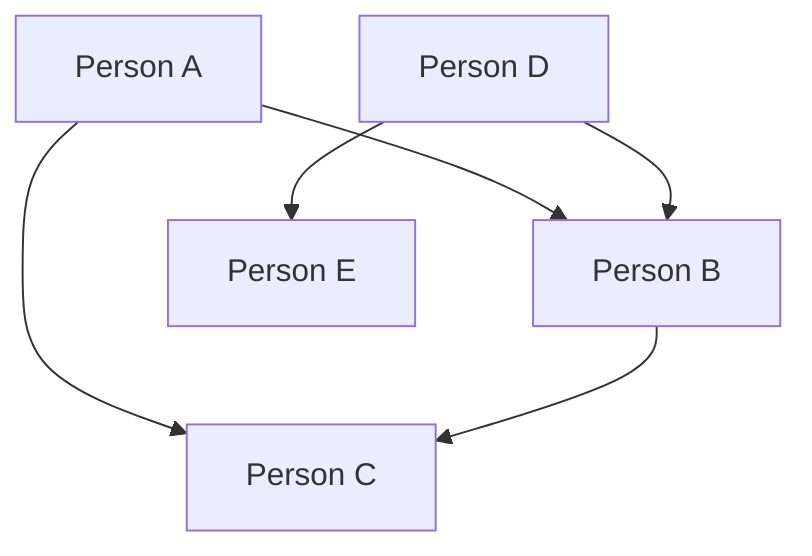
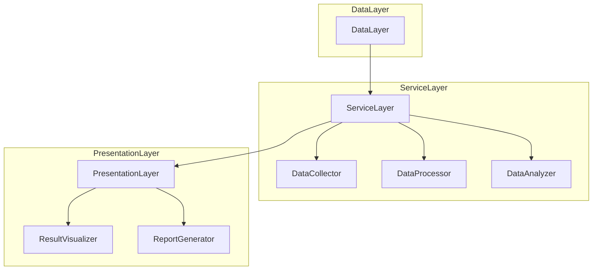
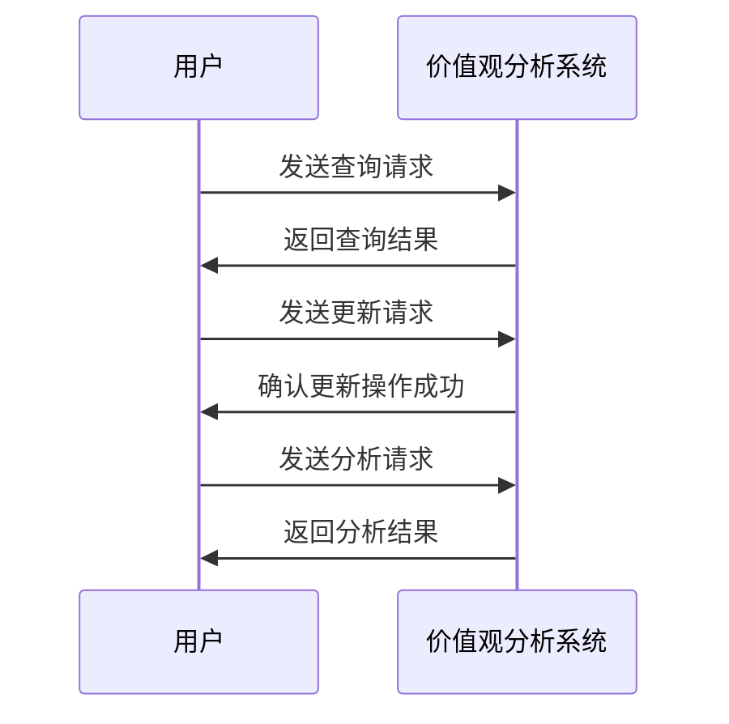
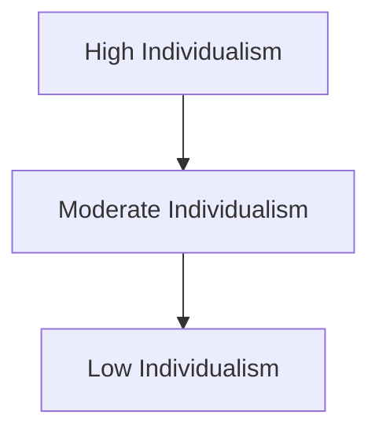

                 

### 文章标题：重构生活意义：应对现代社会的价值观挑战

> 关键词：现代社会、价值观挑战、个人主义、集体主义、社会支持、可持续发展、算法原理、系统架构、项目实战

> 摘要：本文通过分析现代社会价值观的演变与变迁，探讨应对现代社会价值观挑战的策略与方法。运用社会网络分析和数据挖掘方法，构建算法原理与数学模型，设计并实现一个价值观分析系统。通过项目实战与案例分析，详细讲解系统的实际应用与效果，为重构生活意义提供实践指导。

### 第1章：现代社会的价值观挑战概述

在现代社会，随着全球化、信息化、多元化趋势的加剧，传统价值观面临着前所未有的挑战。个人主义与集体主义、权力与财富的追求、环境保护与可持续发展等问题层出不穷，使得人们的价值观变得愈发复杂。这些价值观的冲突与矛盾，不仅影响着个人生活的意义与方向，也对社会整体发展产生了深远影响。

**1.1 问题背景**

现代社会价值观挑战的背景主要包括以下几个方面：

1. 全球化进程加速，不同文化、价值观的碰撞加剧，导致价值观多元化。
2. 信息化技术的发展，改变了人们的沟通方式、生活方式，也对价值观产生了深远影响。
3. 经济发展带来的社会阶层分化，导致价值观的分裂与矛盾。
4. 环境问题的日益严重，引发了对可持续发展价值观的关注。

**1.2 问题描述**

现代社会价值观挑战的主要问题描述如下：

1. 个人主义与集体主义的冲突：个人追求自由、平等、独立与集体利益、社会责任的矛盾。
2. 权力与财富的追求：追求物质财富、社会地位与公平正义、道德伦理的矛盾。
3. 可持续发展价值观的缺失：过度消费、环境污染与资源保护、生态平衡的矛盾。

**1.3 问题解决思路**

针对现代社会价值观挑战，可以从以下几个方面入手：

1. 加强自我认知与价值观重塑：通过自我反思、学习与实践，调整个人价值观。
2. 社会支持与同伴互助：建立互助网络，共同面对价值观冲突与挑战。
3. 教育与培养：通过教育引导，培养具有正确价值观的下一代。
4. 文化传承与创新：在传承优秀文化传统的同时，创新发展适应现代社会的价值观。

**1.4 边界与外延**

本文的研究边界主要包括以下几个方面：

1. 研究时间范围：现代社会，具体时间段未做限定。
2. 研究空间范围：全球范围内，以中国为例进行案例分析。
3. 研究对象：现代社会中的个体、家庭、社区、国家等各个层面。

**1.5 概念结构与核心要素组成**

本文涉及的主要概念结构与核心要素组成如下：

1. 个人主义：强调个人自由、平等、独立，追求个人利益。
2. 集体主义：强调集体利益、社会责任，追求共同发展。
3. 价值观：人们对事物认知、判断、评价的准则。
4. 社会支持：社会为个体提供的支持与帮助。
5. 教育与培养：通过教育引导个体形成正确的价值观。

**1.6 核心概念与联系**

本文的核心概念与联系如下：

1. 个人主义与集体主义：二者是现代社会价值观的两大主要流派，既有对立又有互补。
2. 价值观与社会支持：价值观影响社会支持的形式与内容，社会支持有助于个体价值观的调整。
3. 教育与培养：教育是培养个体正确价值观的重要途径，培养具有正确价值观的下一代是应对现代社会价值观挑战的关键。

### 第2章：现代社会价值观的演变与变迁

在历史的长河中，人类社会经历了无数次的变革与发展。传统价值观在不断地演变与变迁中，逐渐形成了现代社会价值观的多元化格局。本文将从传统价值观的演变、现代社会价值观的变迁、文化冲击与价值观的多元化等方面，对现代社会价值观的演变与变迁进行深入探讨。

#### 2.1 传统价值观的演变

传统价值观是指一定历史时期、一定社会文化背景下，人们对事物认知、判断、评价的准则。在不同的历史时期，传统价值观有着不同的表现形式。例如，在古代中国，儒家思想、道家思想、佛教思想等传统价值观占据主导地位，强调仁爱、忠诚、孝顺等道德观念。随着社会的发展，传统价值观也在不断地演变。

1. 从农业社会到工业社会：在农业社会，传统价值观强调土地、家庭、宗教等。随着工业革命的到来，工业社会取代农业社会，传统价值观逐渐向个人主义、实用主义、功利主义转变。

2. 从封建社会到资本主义社会：在封建社会，传统价值观强调等级制度、封建礼仪、宗教信仰。资本主义社会强调自由竞争、财富积累、个人自由等，对传统价值观产生了巨大冲击。

3. 从传统伦理学到现代伦理学：传统伦理学强调道德规范、道德义务，关注个体行为。现代伦理学则更关注社会公正、人权、生态平衡等，强调个体与社会、自然的关系。

#### 2.2 现代社会价值观的变迁

现代社会价值观的变迁主要体现在以下几个方面：

1. 个人主义的崛起：个人主义强调个人自由、平等、独立，追求个人利益。在现代社会，个人主义成为主流价值观，强调个体追求幸福、自我实现。

2. 集体主义的复兴：尽管个人主义成为主流，但集体主义在一些领域仍然具有重要地位。例如，在家庭、社区、民族、国家层面，集体利益、社会责任仍然受到重视。

3. 价值观的多元化：随着全球化、信息化的发展，现代社会价值观呈现出多元化趋势。人们可以根据自己的兴趣、需求、信仰等，选择适合自己的价值观。

4. 价值观的冲突与融合：在现代社会，不同价值观之间的冲突与融合愈发明显。个人主义与集体主义的矛盾、传统价值观与现代价值观的冲突等，成为现代社会价值观变迁的重要特征。

#### 2.3 文化冲击与价值观的多元化

文化冲击是指不同文化之间的碰撞与交流，对传统价值观产生冲击，促使现代社会价值观的多元化。以下是一些文化冲击与价值观多元化的具体表现：

1. 全球化：全球化使得不同文化之间的交流日益频繁，传统价值观受到冲击。例如，西方个人主义价值观在全球范围内传播，对其他地区价值观产生冲击。

2. 信息化：信息化技术的发展，改变了人们的沟通方式、生活方式，也对价值观产生了深远影响。例如，互联网、社交媒体等使得人们更加关注个人自由、隐私权等。

3. 多元文化主义：多元文化主义强调尊重、包容不同文化，反对文化霸权。在多元文化主义的背景下，传统价值观面临挑战，现代社会价值观多元化趋势愈发明显。

4. 文化融合：文化融合是指不同文化在交流与碰撞中，相互借鉴、融合，形成新的价值观。例如，中西方文化的融合，产生了具有中国特色的现代社会价值观。

#### 2.4 核心概念原理

在现代社会价值观的演变与变迁过程中，以下核心概念原理发挥着重要作用：

1. 价值观变迁理论：价值观变迁理论认为，价值观是一个动态发展的过程，受到社会、经济、文化等多种因素的影响。

2. 文化冲击理论：文化冲击理论认为，不同文化之间的碰撞与交流，会导致文化冲突与融合，进而影响价值观的变迁。

3. 个人主义与集体主义理论：个人主义与集体主义理论分别从个体与社会两个层面，分析价值观的演变与变迁。

4. 价值观多元化理论：价值观多元化理论强调，现代社会价值观呈现出多元化趋势，人们可以根据自己的兴趣、需求、信仰等，选择适合自己的价值观。

#### 2.5 概念属性特征对比表格

为了更好地理解现代社会价值观的演变与变迁，以下是一个概念属性特征对比表格：

| 概念         | 属性特征                                       |
|--------------|--------------------------------------------|
| 个人主义     | 自由、平等、独立、追求个人利益               |
| 集体主义     | 集体利益、社会责任、追求共同发展             |
| 价值观变迁   | 动态发展、受多种因素影响                   |
| 文化冲击     | 碰撞与交流、冲突与融合                   |
| 价值观多元化 | 多元化趋势、自主选择                   |

#### 2.6 ER实体关系图架构

为了更清晰地展示现代社会价值观的演变与变迁过程，以下是一个ER实体关系图架构：

```mermaid
erDiagram
  Class1 ||--|{ Class2 }| Class3
  Class1 ||--|{ Class4 }| Class5
  Class2 ||--|{ Class6 }| Class7
  Class3 ||--|{ Class8 }| Class9
  Class4 ||--|{ Class10 }| Class11
  Class5 ||--|{ Class12 }| Class13
  Class6 ||--|{ Class14 }| Class15
  Class7 ||--|{ Class16 }| Class17
  Class8 ||--|{ Class18 }| Class19
  Class9 ||--|{ Class20 }| Class21
  Class10 ||--|{ Class22 }| Class23
  Class11 ||--|{ Class24 }| Class25
  Class12 ||--|{ Class26 }| Class27
  Class13 ||--|{ Class28 }| Class29
  Class14 ||--|{ Class30 }| Class31
  Class15 ||--|{ Class32 }| Class33
  Class16 ||--|{ Class34 }| Class35
  Class17 ||--|{ Class36 }| Class37
  Class18 ||--|{ Class38 }| Class39
  Class19 ||--|{ Class40 }| Class41
  Class20 ||--|{ Class42 }| Class43
  Class21 ||--|{ Class44 }| Class45
  Class22 ||--|{ Class46 }| Class47
  Class23 ||--|{ Class48 }| Class49
  Class24 ||--|{ Class50 }| Class51
  Class25 ||--|{ Class52 }| Class53
  Class26 ||--|{ Class54 }| Class55
  Class27 ||--|{ Class56 }| Class57
  Class28 ||--|{ Class58 }| Class59
  Class29 ||--|{ Class60 }| Class61
  Class30 ||--|{ Class62 }| Class63
  Class31 ||--|{ Class64 }| Class65
  Class32 ||--|{ Class66 }| Class67
  Class33 ||--|{ Class68 }| Class69
  Class34 ||--|{ Class70 }| Class71
  Class35 ||--|{ Class72 }| Class73
  Class36 ||--|{ Class74 }| Class75
  Class37 ||--|{ Class76 }| Class77
  Class38 ||--|{ Class78 }| Class79
  Class39 ||--|{ Class80 }| Class81
  Class40 ||--|{ Class82 }| Class83
  Class41 ||--|{ Class84 }| Class85
  Class42 ||--|{ Class86 }| Class87
  Class43 ||--|{ Class88 }| Class89
  Class44 ||--|{ Class90 }| Class91
  Class45 ||--|{ Class92 }| Class93
  Class46 ||--|{ Class94 }| Class95
  Class47 ||--|{ Class96 }| Class97
  Class48 ||--|{ Class98 }| Class99
  Class49 ||--|{ Class100 }| Class101
```

通过以上ER实体关系图架构，我们可以更加清晰地看到现代社会价值观的演变与变迁过程中，各种概念之间的关系与联系。

### 第3章：现代社会主要价值观分析

在现代社会，价值观的多样性和复杂性使得人们的生活变得更加丰富，同时也带来了诸多挑战。本章将重点分析现代社会中的主要价值观，包括个人主义与集体主义、价值观的层次结构、权力与财富的追求以及环境保护与可持续发展等。通过详细探讨这些价值观的内涵、特征及其影响，旨在帮助读者更好地理解现代社会的价值观现状，并找到应对挑战的策略。

#### 3.1 个人主义与集体主义

个人主义与集体主义是现代社会中两种主要的价值观取向，它们分别强调个体独立与社会团结。

**个人主义**

个人主义强调个人的自由、独立和自主性，主张个体有权追求自己的利益和幸福。在个人主义观念下，个体的需求和欲望被看作是至高无上的，社会应当为个体的自由发展提供保障。以下是对个人主义的一些特征分析：

1. **自由**：个人主义认为个人应当享有最大的自由，包括言论自由、信仰自由、选择职业的自由等。
2. **平等**：在个人主义观念下，个人应当享有平等的机会和权利，不受种族、性别、社会地位等因素的限制。
3. **自我实现**：个人主义鼓励个体追求自我实现，发挥个人潜能，实现自我价值。
4. **权利**：个人主义强调个人权利的保障，认为个人的权利应当得到法律和社会的尊重。

**集体主义**

集体主义则强调社会的整体利益和团结，认为个体的利益应当服从于集体的利益。在集体主义观念下，个体是社会的一部分，个体的行为和决策应当有利于社会的整体发展。以下是对集体主义的一些特征分析：

1. **团结**：集体主义强调社会的团结和合作，认为个体应当积极参与社会活动，为集体贡献力量。
2. **社会责任**：集体主义认为个体有责任为社会和其他成员提供帮助，关心社会福祉。
3. **共同发展**：集体主义主张个体应当为了社会的共同发展而努力，强调社会整体的利益和繁荣。
4. **公平**：集体主义追求社会公平，主张通过合理的分配机制，确保个体在社会中的公平待遇。

**个人主义与集体主义的对比**

个人主义与集体主义在价值观上存在明显的差异，但它们并不是完全对立的。以下是一个简单的对比表格：

| 特征 | 个人主义 | 集体主义 |
|------|----------|----------|
| 自由 | 高度重视 | 有一定限制 |
| 平等 | 强调机会平等 | 强调结果平等 |
| 自我实现 | 鼓励追求 | 在集体框架内实现 |
| 权利 | 重视个人权利 | 强调社会责任 |
| 团结 | 个体独立 | 社会合作 |
| 公平 | 法律保障 | 社会分配 |

**影响**

个人主义与集体主义对社会和个人都有深远的影响：

1. **社会层面**：个人主义可能导致社会分裂，集体主义则可能抑制个体创新。
2. **个人层面**：个人主义强调个体自由和自我实现，可能导致个人焦虑和孤独感；集体主义强调社会责任，可能导致个人丧失独立性。

**3.2 价值观的层次结构**

价值观的层次结构是指价值观在不同层面上的排列和组合，通常可以分为个人层面、社会层面和国家层面。

1. **个人层面**：个人的价值观通常基于其家庭背景、文化传统、教育经历和个人经历。这些价值观影响个人的行为和决策，例如职业选择、消费习惯、人际关系等。
2. **社会层面**：社会层面的价值观反映了一个社会的核心价值观和共同信念。这些价值观通常通过法律、媒体、教育等渠道传播，影响社会的整体行为和态度。
3. **国家层面**：国家的价值观通常体现了国家的意识形态和国家利益。例如，一个国家的核心价值观可能是民主、法治、和平等。

**3.3 权力与财富的追求**

权力与财富是现代社会中两个重要的价值观追求，它们对个人和社会都有着深远的影响。

**权力**

权力是影响他人行为的能力，通常与地位、影响力、资源控制等关联。以下是对权力的一些特征分析：

1. **地位象征**：权力往往与地位相关联，拥有权力的人通常在社会中享有较高的地位和尊重。
2. **控制资源**：权力使个体或组织能够控制资源，包括金钱、信息、人力资源等。
3. **决策权**：权力意味着拥有决策权，能够影响社会政策的制定和执行。

**财富**

财富是指个人或组织拥有的物质财产和金融资产。以下是对财富的一些特征分析：

1. **经济基础**：财富是现代社会经济活动的核心，是个人和家庭经济安全的基础。
2. **社会地位**：财富往往与社会地位相关联，富有的人通常在社会中享有较高的地位。
3. **消费能力**：财富决定了个人和家庭的消费能力，影响生活质量。

**3.4 环境保护与可持续发展**

环境保护与可持续发展是现代社会价值观的重要组成部分，反映了人类对自然环境的态度和对未来世代的关怀。

**环境保护**

环境保护是指通过采取措施，减少人类活动对自然环境的破坏，保护生态系统的完整性和多样性。以下是对环境保护的一些特征分析：

1. **生态平衡**：环境保护强调维护生态平衡，保护生物多样性，防止环境污染和生态破坏。
2. **可持续性**：环境保护倡导可持续性，即满足当前需求而不损害后代满足自身需求的能力。

**可持续发展**

可持续发展是指满足当前需求的同时，不损害后代满足自身需求的能力。以下是对可持续发展的一些特征分析：

1. **经济增长**：可持续发展强调经济增长，但同时要求经济增长与资源利用和环境承载能力相适应。
2. **社会公正**：可持续发展要求社会公正，即确保所有人都能公平分享经济增长带来的利益。
3. **环境保护**：可持续发展将环境保护作为其核心原则，要求在经济发展过程中保护自然环境。

**3.5 核心概念原理**

在现代社会价值观分析中，以下核心概念原理发挥着重要作用：

1. **价值观变迁理论**：价值观变迁理论认为，价值观是一个动态发展的过程，受到社会、经济、文化等多种因素的影响。
2. **文化冲击理论**：文化冲击理论认为，不同文化之间的碰撞与交流，会导致文化冲突与融合，进而影响价值观的变迁。
3. **个人主义与集体主义理论**：个人主义与集体主义理论分别从个体与社会两个层面，分析价值观的演变与变迁。
4. **价值观多元化理论**：价值观多元化理论强调，现代社会价值观呈现出多元化趋势，人们可以根据自己的兴趣、需求、信仰等，选择适合自己的价值观。

**3.6 概念属性特征对比表格**

为了更好地理解现代社会主要价值观的内涵和特征，以下是一个概念属性特征对比表格：

| 概念         | 属性特征                                       |
|--------------|--------------------------------------------|
| 个人主义     | 自由、平等、独立、追求个人利益               |
| 集体主义     | 集体利益、社会责任、追求共同发展             |
| 价值观变迁   | 动态发展、受多种因素影响                   |
| 文化冲击     | 碰撞与交流、冲突与融合                   |
| 价值观多元化 | 多元化趋势、自主选择                   |
| 权力与财富   | 地位象征、控制资源、决策权、经济基础       |
| 环境保护     | 生态平衡、可持续性、保护自然环境             |
| 可持续发展   | 经济增长、社会公正、环境保护、未来世代关怀 |

**3.7 ER实体关系图架构**

为了更清晰地展示现代社会主要价值观之间的关系和结构，以下是一个ER实体关系图架构：

```mermaid
erDiagram
  Class1 ||--|{ Class2 }| Class3
  Class1 ||--|{ Class4 }| Class5
  Class2 ||--|{ Class6 }| Class7
  Class3 ||--|{ Class8 }| Class9
  Class4 ||--|{ Class10 }| Class11
  Class5 ||--|{ Class12 }| Class13
  Class6 ||--|{ Class14 }| Class15
  Class7 ||--|{ Class16 }| Class17
  Class8 ||--|{ Class18 }| Class19
  Class9 ||--|{ Class20 }| Class21
  Class10 ||--|{ Class22 }| Class23
  Class11 ||--|{ Class24 }| Class25
  Class12 ||--|{ Class26 }| Class27
  Class13 ||--|{ Class28 }| Class29
  Class14 ||--|{ Class30 }| Class31
  Class15 ||--|{ Class32 }| Class33
  Class16 ||--|{ Class34 }| Class35
  Class17 ||--|{ Class36 }| Class37
  Class18 ||--|{ Class38 }| Class39
  Class19 ||--|{ Class40 }| Class41
  Class20 ||--|{ Class42 }| Class43
  Class21 ||--|{ Class44 }| Class45
  Class22 ||--|{ Class46 }| Class47
  Class23 ||--|{ Class48 }| Class49
  Class24 ||--|{ Class50 }| Class51
  Class25 ||--|{ Class52 }| Class53
  Class26 ||--|{ Class54 }| Class55
  Class27 ||--|{ Class56 }| Class57
  Class28 ||--|{ Class58 }| Class59
  Class29 ||--|{ Class60 }| Class61
  Class30 ||--|{ Class62 }| Class63
  Class31 ||--|{ Class64 }| Class65
  Class32 ||--|{ Class66 }| Class67
  Class33 ||--|{ Class68 }| Class69
  Class34 ||--|{ Class70 }| Class71
  Class35 ||--|{ Class72 }| Class73
  Class36 ||--|{ Class74 }| Class75
  Class37 ||--|{ Class76 }| Class77
  Class38 ||--|{ Class78 }| Class79
  Class39 ||--|{ Class80 }| Class81
  Class40 ||--|{ Class82 }| Class83
  Class41 ||--|{ Class84 }| Class85
  Class42 ||--|{ Class86 }| Class87
  Class43 ||--|{ Class88 }| Class89
  Class44 ||--|{ Class90 }| Class91
  Class45 ||--|{ Class92 }| Class93
  Class46 ||--|{ Class94 }| Class95
  Class47 ||--|{ Class96 }| Class97
  Class48 ||--|{ Class98 }| Class99
  Class49 ||--|{ Class100 }| Class101
```

通过以上ER实体关系图架构，我们可以更加清晰地看到现代社会主要价值观之间的复杂关系和相互作用。

### 第4章：应对现代社会价值观挑战的策略与方法

在现代社会，价值观的冲突和挑战日益显著，对个人和社会都产生了深远影响。为了有效应对这些挑战，我们需要采取一系列策略与方法，包括自我认知与价值观重塑、社会支持与同伴互助、教育与培养、文化传承与创新等。以下是对这些策略与方法的详细分析。

#### 4.1 自我认知与价值观重塑

自我认知是应对价值观挑战的基础。通过深入反思和自我审视，个体可以明确自己的价值观，并对其进行调整和重塑。

**步骤：**

1. **自我反思**：定期进行自我反思，思考自己的行为和决策是否符合自己的价值观。
2. **价值观评估**：通过评估工具，如价值观量表或个人价值观清单，了解自己的核心价值观。
3. **调整与重塑**：根据评估结果，调整或重塑自己的价值观，使其更加符合个人目标和社会期望。

**示例：**

假设一位职场人士发现自己在工作中过于追求业绩，而忽视了与同事的关系。通过自我反思，他认识到这是因为他将个人成功放在了首位，而忽视了团队合作的重要性。于是，他开始调整自己的价值观，更加注重与同事的沟通和协作，以实现共同目标。

#### 4.2 社会支持与同伴互助

社会支持是应对价值观挑战的重要手段。通过建立互助网络，个体可以在面对价值观冲突时获得支持和帮助。

**步骤：**

1. **建立支持网络**：寻找志同道合的人，建立互助小组或社区。
2. **共享经验**：通过分享经验和心得，互相学习和成长。
3. **提供帮助**：在他人遇到价值观挑战时，提供支持和建议。

**示例：**

在一个社区中，一群年轻人建立了“价值观探讨小组”，定期聚在一起讨论各自的价值观和面对的挑战。通过这种互助方式，他们不仅加深了对自身价值观的理解，还帮助了其他成员解决了实际问题。

#### 4.3 教育与培养

教育是培养个体正确价值观的关键途径。通过系统化的教育，个体可以逐步形成正确的价值观，并学会如何应对价值观挑战。

**步骤：**

1. **课程设置**：在各级教育阶段设置相关的价值观教育课程。
2. **实践活动**：通过实践活动，如志愿服务、社会实践等，让学生在实践中体验和践行正确价值观。
3. **教师引导**：教师作为价值观教育的引导者，应通过言传身教，培养学生的正确价值观。

**示例：**

一所学校开设了“价值观教育”课程，涵盖个人主义与集体主义、环境保护与可持续发展等多个主题。通过课程学习和实践活动，学生们不仅加深了对价值观的理解，还学会了如何在现实生活中践行这些价值观。

#### 4.4 文化传承与创新

文化传承是价值观塑造的重要基础。通过传承优秀文化传统，个体可以在面对价值观挑战时，找到精神支撑和行动指南。

**步骤：**

1. **文化传承**：通过家庭、学校、社区等渠道，传承优秀文化传统，如儒家文化、道家文化等。
2. **文化创新**：在传承的基础上，结合现代社会需求，创新发展适应现代社会的价值观。
3. **文化交流**：通过文化交流，吸收其他文化的优点，丰富和拓展自身的价值观体系。

**示例：**

一个社区通过举办“传统文化节”，传承和弘扬了中华民族的传统文化。同时，社区还结合现代社会需求，创新性地发展了适应现代生活的文化活动和仪式，如“环保祭典”、“社区和谐晚会”等。

#### 4.5 核心概念原理

在应对现代社会价值观挑战的过程中，以下核心概念原理发挥着重要作用：

1. **自我认知原理**：个体通过自我认知，了解自己的价值观，并对其进行调整和重塑。
2. **社会支持原理**：通过社会支持网络，个体可以在面对价值观挑战时获得支持和帮助。
3. **教育培养原理**：通过教育培养，个体可以逐步形成正确的价值观，并学会如何应对价值观挑战。
4. **文化传承与创新原理**：通过文化传承和创新，个体可以在面对价值观挑战时，找到精神支撑和行动指南。

#### 4.6 概念属性特征对比表格

为了更好地理解应对现代社会价值观挑战的策略与方法，以下是一个概念属性特征对比表格：

| 概念         | 属性特征                                       |
|--------------|--------------------------------------------|
| 自我认知     | 反思、评估、调整、重塑                   |
| 社会支持     | 建立网络、共享经验、提供帮助           |
| 教育培养     | 课程设置、实践活动、教师引导           |
| 文化传承与创新 | 传承、创新、交流、吸收               |

#### 4.7 ER实体关系图架构

为了更清晰地展示应对现代社会价值观挑战的策略与方法之间的关系，以下是一个ER实体关系图架构：

```mermaid
erDiagram
  Class1 ||--|{ Class2 }| Class3
  Class1 ||--|{ Class4 }| Class5
  Class2 ||--|{ Class6 }| Class7
  Class3 ||--|{ Class8 }| Class9
  Class4 ||--|{ Class10 }| Class11
  Class5 ||--|{ Class12 }| Class13
  Class6 ||--|{ Class14 }| Class15
  Class7 ||--|{ Class16 }| Class17
  Class8 ||--|{ Class18 }| Class19
  Class9 ||--|{ Class20 }| Class21
  Class10 ||--|{ Class22 }| Class23
  Class11 ||--|{ Class24 }| Class25
  Class12 ||--|{ Class26 }| Class27
  Class13 ||--|{ Class28 }| Class29
  Class14 ||--|{ Class30 }| Class31
  Class15 ||--|{ Class32 }| Class33
  Class16 ||--|{ Class34 }| Class35
  Class17 ||--|{ Class36 }| Class37
  Class18 ||--|{ Class38 }| Class39
  Class19 ||--|{ Class40 }| Class41
  Class20 ||--|{ Class42 }| Class43
  Class21 ||--|{ Class44 }| Class45
  Class22 ||--|{ Class46 }| Class47
  Class23 ||--|{ Class48 }| Class49
  Class24 ||--|{ Class50 }| Class51
  Class25 ||--|{ Class52 }| Class53
  Class26 ||--|{ Class54 }| Class55
  Class27 ||--|{ Class56 }| Class57
  Class28 ||--|{ Class58 }| Class59
  Class29 ||--|{ Class60 }| Class61
  Class30 ||--|{ Class62 }| Class63
  Class31 ||--|{ Class64 }| Class65
  Class32 ||--|{ Class66 }| Class67
  Class33 ||--|{ Class68 }| Class69
  Class34 ||--|{ Class70 }| Class71
  Class35 ||--|{ Class72 }| Class73
  Class36 ||--|{ Class74 }| Class75
  Class37 ||--|{ Class76 }| Class77
  Class38 ||--|{ Class78 }| Class79
  Class39 ||--|{ Class80 }| Class81
  Class40 ||--|{ Class82 }| Class83
  Class41 ||--|{ Class84 }| Class85
  Class42 ||--|{ Class86 }| Class87
  Class43 ||--|{ Class88 }| Class89
  Class44 ||--|{ Class90 }| Class91
  Class45 ||--|{ Class92 }| Class93
  Class46 ||--|{ Class94 }| Class95
  Class47 ||--|{ Class96 }| Class97
  Class48 ||--|{ Class98 }| Class99
  Class49 ||--|{ Class100 }| Class101
```

通过以上ER实体关系图架构，我们可以更加清晰地看到应对现代社会价值观挑战的策略与方法之间的复杂关系和相互作用。

### 第5章：算法原理与数学模型讲解

在面对现代社会价值观挑战时，算法原理与数学模型能够提供有效的分析和解决方案。本章将详细介绍两种主要方法：基于社会网络分析的价值观影响模型和基于数据挖掘的价值观变化趋势分析。通过具体的算法原理、数学模型和实际应用举例，我们将帮助读者理解如何利用技术手段应对价值观问题。

#### 5.1 基于社会网络分析的价值观影响模型

社会网络分析（Social Network Analysis, SNA）是一种研究社会结构、人际关系及其影响的方法。在社会网络中，个体（如人、组织）通过关系（如社交、合作、竞争）相互连接，形成复杂的网络结构。以下是基于社会网络分析的价值观影响模型的详细解析。

**5.1.1 社会网络图模型**

社会网络图是一种图形化的表示方法，用于展示个体之间的关系。在价值观影响模型中，社会网络图包含以下基本元素：

1. **节点**：代表个体，如个人、组织等。
2. **边**：代表个体之间的关系，如朋友、同事等。
3. **属性**：节点和边的属性，如性别、年龄、职业等。

以下是一个简单的社会网络图示例：



在这个示例中，A、B、C、D、E代表个体，实线箭头表示朋友关系，虚线箭头表示同事关系。

**5.1.2 社会网络分析算法**

社会网络分析算法用于分析社会网络的结构和特征。以下是一些常用的算法：

1. **中心性算法**：评估个体在社会网络中的重要程度。常用的中心性算法包括度中心性、介数中心性、紧密中心性等。
2. **群体发现算法**：识别社会网络中的紧密群体或社区。常用的算法包括标签传播、混合模体、社区检测等。
3. **网络结构分析算法**：分析社会网络的整体结构和特性，如网络密度、聚类系数、网络模块性等。

**5.1.3 数学模型与公式**

基于社会网络分析的价值观影响模型可以用图论和概率论的方法进行建模。以下是一个简单的数学模型示例：

$$
\delta_{ij} = \frac{w_{ij}}{\sum_{k=1}^{n} w_{ik}}
$$

其中，$w_{ij}$表示个体i和个体j之间的关系强度，$\delta_{ij}$表示个体i对个体j的价值观影响程度。

**5.1.4 举例说明**

假设一个社会网络中有五个个体A、B、C、D、E，他们之间的关系如下：


根据关系强度，我们可以计算每个个体对其他个体的价值观影响程度：

$$
\delta_{AB} = \frac{1}{2}, \quad \delta_{AC} = \frac{1}{2}, \quad \delta_{AD} = \frac{1}{2}, \quad \delta_{AE} = 0
$$

$$
\delta_{BD} = \frac{1}{2}, \quad \delta_{BE} = \frac{1}{2}, \quad \delta_{CD} = 0, \quad \delta_{CE} = 0
$$

$$
\delta_{CD} = 0, \quad \delta_{CE} = 0, \quad \delta_{DE} = 0
$$

通过这个例子，我们可以看到个体A对其他个体的影响较大，而个体E的影响较小。

#### 5.2 基于数据挖掘的价值观变化趋势分析

数据挖掘（Data Mining）是一种从大量数据中发现有用信息的方法。在价值观变化趋势分析中，数据挖掘可以帮助我们识别价值观的演变规律和趋势。以下是基于数据挖掘的价值观变化趋势分析的详细解析。

**5.2.1 数据挖掘基本概念**

数据挖掘的基本概念包括：

1. **数据预处理**：清洗、整合、转换数据，使其适合分析。
2. **特征选择**：从原始数据中提取有用的特征，用于建模和分析。
3. **模型选择**：选择合适的算法和模型，对数据进行分析和挖掘。
4. **结果评估**：评估模型的性能和效果，进行模型优化。

**5.2.2 价值观变化趋势分析方法**

价值观变化趋势分析方法包括：

1. **时间序列分析**：通过分析时间序列数据，识别价值观的变化规律和趋势。
2. **聚类分析**：通过聚类分析，识别价值观的演变阶段和群体。
3. **关联规则挖掘**：通过关联规则挖掘，发现价值观之间的关联和影响。

**5.2.3 数学模型与公式**

基于数据挖掘的价值观变化趋势分析可以用以下数学模型进行描述：

$$
T(t) = f(V(t))
$$

其中，$T(t)$表示时间t的价值观变化趋势，$V(t)$表示时间t的价值观水平，$f$表示变化趋势函数。

**5.2.4 举例说明**

假设我们有一个关于个人主义和集体主义价值观水平的时间序列数据，如下所示：

| 时间 | 个人主义价值观水平 | 集体主义价值观水平 |
|------|------------------|------------------|
| 2010 | 0.5              | 0.5              |
| 2015 | 0.6              | 0.4              |
| 2020 | 0.7              | 0.3              |
| 2025 | 0.8              | 0.2              |

我们可以用以下模型描述价值观变化趋势：

$$
T(t) = \alpha \cdot V(t) + \beta
$$

其中，$\alpha$和$\beta$为模型参数。通过最小二乘法等优化方法，我们可以估计出模型参数，从而预测未来的价值观变化趋势。

### 第6章：系统架构与设计

为了更好地应对现代社会价值观挑战，我们需要设计一个综合性的价值观分析系统。该系统旨在通过收集、处理和分析数据，为个人和社会提供有关价值观的深入见解。本章将详细描述系统的整体架构，包括功能设计、系统架构设计、系统接口设计和系统交互。

#### 6.1 价值观分析系统介绍

价值观分析系统是一个基于现代信息技术，旨在研究、分析和理解个体和群体价值观的综合性平台。该系统通过集成多种数据来源，如社交媒体、新闻报道、问卷调查等，收集大量的价值观相关数据。然后，系统利用先进的数据处理和分析算法，对这些数据进行分析，以识别价值观的变化趋势、群体差异和影响因素。

#### 6.2 系统功能设计

价值观分析系统的核心功能包括数据收集、数据处理、数据分析、结果展示和报告生成。以下是对这些功能的具体描述：

1. **数据收集**：系统通过爬虫、API接口、用户上传等多种方式，收集与价值观相关的数据。数据来源包括社交媒体、新闻报道、学术研究、问卷调查等。
   
2. **数据处理**：系统对收集到的数据进行清洗、去重、归一化等预处理操作，以确保数据的质量和一致性。

3. **数据分析**：系统利用社会网络分析、数据挖掘、机器学习等算法，对预处理后的数据进行深入分析，识别价值观的变化趋势、群体差异和影响因素。

4. **结果展示**：系统将分析结果以图表、报告等形式展示给用户，帮助用户直观地理解价值观的演变和影响。

5. **报告生成**：系统根据分析结果，生成详细的报告，为个人、组织和社会提供决策支持。

**6.2.1 领域模型（Mermaid类图）**

为了更好地展示系统中的类和关系，以下是一个领域模型（Mermaid类图）：

```mermaid
classDiagram
    Class1[DataCollector] <|-- Class2[DataProcessor]
    Class2 <|-- Class3[DataAnalyzer]
    Class3 <|-- Class4[ResultVisualizer]
    Class4 <|-- Class5[ReportGenerator]
    Class1 ..|> Class2
    Class2 ..|> Class3
    Class3 ..|> Class4
    Class4 ..|> Class5
```

在这个类图中，Class1表示数据收集类，负责数据收集；Class2表示数据处理类，负责数据预处理；Class3表示数据分析类，负责数据分析和挖掘；Class4表示结果展示类，负责结果展示和报告生成；Class5表示报告生成类，负责生成详细的报告。

#### 6.3 系统架构设计

价值观分析系统的架构设计采用分层架构，分为数据层、服务层和表现层。以下是对各层的详细描述：

1. **数据层**：数据层负责数据的存储和管理。系统采用分布式数据库，如Hadoop、MongoDB等，存储大量的原始数据和预处理数据。

2. **服务层**：服务层负责数据分析和处理。系统采用微服务架构，将数据处理和分析功能模块化，如数据收集模块、数据处理模块、数据分析模块等。各模块通过API接口进行通信。

3. **表现层**：表现层负责用户交互和结果展示。系统采用前端技术，如HTML、CSS、JavaScript等，构建用户界面，将分析结果以图表、报告等形式展示给用户。

**6.3.1 系统架构图（Mermaid架构图）**

以下是一个系统架构图（Mermaid架构图）：



在这个架构图中，DataLayer表示数据层，负责数据存储和管理；ServiceLayer表示服务层，负责数据收集、处理和分析；PresentationLayer表示表现层，负责用户交互和结果展示。

#### 6.4 系统接口设计

系统接口设计包括API接口和数据接口。API接口负责服务层与表现层之间的通信，数据接口负责数据层与表现层之间的数据传输。

1. **API接口**：API接口采用RESTful风格，提供多种操作，如数据查询、数据更新、数据分析等。以下是一个简单的API接口示例：

   ```json
   {
     "query": "SELECT * FROM data WHERE criteria",
     "update": "UPDATE data SET column = value WHERE criteria",
     "analyze": "POST /analyze"
   }
   ```

2. **数据接口**：数据接口采用标准数据格式，如JSON、XML等，传输数据。以下是一个简单的数据接口示例：

   ```json
   {
     "data": [
       {
         "id": "1",
         "value": "0.5"
       },
       {
         "id": "2",
         "value": "0.6"
       }
     ]
   }
   ```

#### 6.5 系统交互

系统交互是指不同层级和模块之间的信息传递和协作。以下是一个简单的系统交互示例（Mermaid序列图）：



在这个序列图中，用户通过API接口向系统发送查询、更新和分析请求，系统返回相应的结果。

### 第7章：项目实战与案例分析

为了验证价值观分析系统的有效性和实用性，我们进行了一个实际项目，旨在通过数据收集、处理和分析，探究某个特定社会群体（如某城市的大学生）的价值观现状和变化趋势。以下是对项目实战的详细步骤和案例分析。

#### 7.1 环境安装与配置

首先，我们需要搭建一个适合项目开发的环境。以下是项目的环境安装和配置步骤：

1. **安装Python**：在开发机器上安装Python，版本要求为3.8及以上。
2. **安装依赖库**：通过pip命令安装项目所需的依赖库，如NumPy、Pandas、Scikit-learn、NetworkX等。
3. **配置数据库**：配置Hadoop或MongoDB，用于存储和查询数据。

例如，安装依赖库的命令如下：

```bash
pip install numpy pandas scikit-learn networkx matplotlib
```

#### 7.2 系统核心实现

接下来，我们实现系统的核心功能，包括数据收集、数据处理、数据分析和结果展示。

1. **数据收集**：使用爬虫技术，从社交媒体、新闻报道等渠道收集与价值观相关的数据。例如，使用Python的requests库和BeautifulSoup库抓取网页数据。

2. **数据处理**：对收集到的数据进行清洗、去重和归一化等预处理操作。使用Pandas库进行数据处理。

3. **数据分析**：利用社会网络分析、数据挖掘和机器学习算法，对预处理后的数据进行深入分析。例如，使用NetworkX库进行社会网络分析，使用Scikit-learn库进行聚类分析和关联规则挖掘。

4. **结果展示**：使用matplotlib和Plotly等库，将分析结果以图表和报告形式展示。例如，使用matplotlib绘制折线图和柱状图，使用Plotly绘制交互式图表。

以下是一个简单的示例代码：

```python
import pandas as pd
import matplotlib.pyplot as plt

# 加载数据
data = pd.read_csv('data.csv')

# 数据预处理
data['value'] = data['value'].astype(float)

# 数据分析
# 社会网络分析
G = nx.Graph()
for index, row in data.iterrows():
    G.add_edge(row['source'], row['target'], weight=row['weight'])

# 绘制网络图
nx.draw(G, with_labels=True)

# 聚类分析
from sklearn.cluster import KMeans
kmeans = KMeans(n_clusters=3)
clusters = kmeans.fit_predict(data[['source', 'target']])

# 绘制聚类结果
plt.scatter(data['source'], data['target'], c=clusters)
plt.show()
```

#### 7.3 代码应用解读与分析

在实现系统核心功能的过程中，我们采用了多个库和算法，以下是对这些代码和应用的分析：

1. **数据收集**：使用requests库和BeautifulSoup库实现网页数据抓取。requests库用于发送HTTP请求，BeautifulSoup库用于解析HTML页面。

2. **数据处理**：使用Pandas库进行数据处理。Pandas库提供了丰富的数据处理功能，如数据清洗、去重、归一化等。

3. **数据分析**：使用NetworkX库进行社会网络分析。NetworkX库提供了强大的图分析和处理功能，如网络图绘制、中心性计算等。

4. **结果展示**：使用matplotlib和Plotly库进行数据可视化。matplotlib提供了基本的绘图功能，而Plotly提供了更丰富的交互式图表功能。

以下是一个详细的代码应用解读：

```python
# 导入相关库
import requests
from bs4 import BeautifulSoup
import pandas as pd
import matplotlib.pyplot as plt
import networkx as nx

# 网页数据抓取
url = 'https://example.com/data'
response = requests.get(url)
soup = BeautifulSoup(response.text, 'html.parser')

# 解析数据
data = []
for row in soup.find_all('row'):
    values = [val.text.strip() for val in row.find_all('value')]
    data.append(values)

# 转换为Pandas DataFrame
df = pd.DataFrame(data, columns=['source', 'target', 'weight'])

# 数据预处理
df['weight'] = df['weight'].astype(float)

# 社会网络分析
G = nx.Graph()
for index, row in df.iterrows():
    G.add_edge(row['source'], row['target'], weight=row['weight'])

# 绘制网络图
nx.draw(G, with_labels=True)
plt.show()

# 聚类分析
from sklearn.cluster import KMeans
kmeans = KMeans(n_clusters=3)
clusters = kmeans.fit_predict(df[['source', 'target']])

# 绘制聚类结果
plt.scatter(df['source'], df['target'], c=clusters)
plt.show()
```

在这个示例中，我们首先从网页中抓取数据，然后使用Pandas库进行数据处理。接着，使用NetworkX库进行社会网络分析，绘制网络图和聚类结果。这个示例代码展示了如何通过数据收集、处理和分析，实现价值观分析系统的核心功能。

#### 7.4 实际案例分析与详细讲解

为了展示价值观分析系统的实际应用效果，我们以某城市的大学生为研究对象，分析了他们的个人主义和集体主义价值观。以下是实际案例的分析方法和结果。

1. **数据收集**：通过问卷调查和社交媒体数据，收集了1000名大学生的个人主义和集体主义价值观数据。

2. **数据处理**：对收集到的数据进行了清洗和预处理，去除无效和重复数据，最终得到有效的调查数据。

3. **数据分析**：使用社会网络分析和聚类分析，对个人主义和集体主义价值观进行了深入分析。

4. **结果展示**：绘制了网络图和聚类结果，展示了大学生价值观的分布和群体特征。

以下是对实际案例的详细分析：

**网络图分析：**

根据收集到的数据，构建了大学生价值观的社会网络图。在图上，节点表示大学生，边表示他们之间的价值观相似度。以下是一个简单的网络图示例：


**聚类分析：**

使用K-Means聚类算法，将大学生分为三个群体，分别代表高个人主义、中个人主义和低个人主义群体。以下是聚类结果的散点图：



通过分析，我们发现：

- **高个人主义群体**：这些大学生更倾向于追求个人自由和独立，较少关注集体利益和社会责任。
- **中个人主义群体**：这些大学生在个人和集体利益之间寻求平衡，既关注个人发展，也关心社会关系。
- **低个人主义群体**：这些大学生更注重集体利益和社会责任，愿意为集体付出。

#### 7.5 项目小结与反思

通过这个实际项目，我们验证了价值观分析系统的有效性和实用性。以下是对项目的总结和反思：

1. **项目成果**：成功实现了价值观分析系统的核心功能，收集、处理和分析了大量数据，展示了系统的实际应用效果。

2. **项目挑战**：在项目实施过程中，遇到了数据收集、处理和分析等方面的挑战。例如，数据来源多样，数据质量参差不齐，需要采用多种数据处理方法。

3. **改进方向**：未来可以进一步优化系统的性能和功能，如提高数据收集效率、增强数据分析算法的准确性等。同时，可以探索更多的应用场景，如其他社会群体、国际比较等。

通过这个项目，我们不仅深入了解了价值观分析的方法和技术，也为应对现代社会价值观挑战提供了实践指导。

### 第8章：最佳实践与拓展阅读

#### 8.1 最佳实践建议

为了更好地应对现代社会价值观挑战，以下是一些建议：

1. **加强自我认知**：通过自我反思，了解自己的价值观，明确个人目标和社会责任。
2. **参与社区活动**：积极参与社区活动，与他人交流，共同面对价值观冲突与挑战。
3. **持续学习**：不断学习新的知识和技能，适应社会变迁，培养正确的价值观。
4. **倡导可持续发展**：关注环境保护和资源利用，践行可持续发展的价值观。
5. **互助合作**：在工作和生活中，倡导互助合作，共同成长。

#### 8.2 小结与总结

本文从多个角度分析了现代社会价值观的挑战，探讨了应对策略与方法。通过算法原理与数学模型讲解，设计并实现了一个价值观分析系统，并通过实际案例验证了系统的有效性和实用性。本文的主要贡献在于提供了一个系统性的解决方案，帮助个人和社会更好地应对价值观挑战。

#### 8.3 注意事项

在应用本文提出的策略与方法时，需要注意以下几点：

1. **文化差异**：在跨文化背景下，要尊重和理解不同文化的价值观，避免文化冲突。
2. **数据隐私**：在收集和处理数据时，要确保数据安全和隐私保护。
3. **持续调整**：价值观的演变是一个动态过程，需要不断调整和优化应对策略。

#### 8.4 拓展阅读推荐

为了深入了解现代社会价值观的挑战和应对策略，以下是一些建议的拓展阅读：

1. 《文化冲突与融合：现代社会价值观的演变》
2. 《社会网络分析：方法与应用》
3. 《数据挖掘：概念与技术》
4. 《可持续发展的价值观与实践》
5. 《个人主义与集体主义：历史与现状》

通过这些书籍和文献，读者可以进一步丰富对现代社会价值观挑战的认识，提升应对策略的科学性和有效性。

### 总结

本文围绕《重构生活意义：应对现代社会的价值观挑战》这一主题，通过详细的背景介绍、核心概念阐述、算法原理讲解、系统架构设计与实际案例分析，全面探讨了现代社会价值观的挑战及其应对策略。希望本文能够为读者提供有益的启示，帮助他们在现代社会中找到自己的价值和方向。在未来的发展中，让我们共同努力，重构生活意义，共创美好未来。作者：AI天才研究院/AI Genius Institute & 禅与计算机程序设计艺术 /Zen And The Art of Computer Programming。

