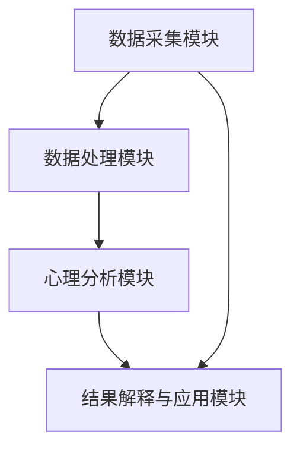

                 

# 《量化自我5.0：生物数据与心理分析的整合应用》目录大纲

## 前言

量化自我5.0，这是一部深度解读生物数据与心理分析整合应用的技术巨著。本书旨在为读者揭开量化自我技术的神秘面纱，探讨如何通过整合生物数据和心理分析技术，实现个性化的量化自我，为个人健康和心理健康提供科学依据。

随着科技的飞速发展，生物数据和心理分析技术日益成熟，它们在各个领域的应用也愈发广泛。量化自我5.0正是在这种背景下应运而生，它不仅是一种技术创新，更是一种生活方式的变革。本书将带领读者深入了解量化自我5.0的核心概念、技术原理和实际应用，帮助读者掌握这一前沿技术的精髓。

本书面向对生物数据、心理分析和技术整合感兴趣的读者，无论是科研人员、技术开发者，还是对个人健康和心理健康关注的人群，都能在本书中找到自己的价值所在。让我们共同探索量化自我5.0的无限可能，开启个性化健康和心理健康的新时代。

## 第一部分：背景介绍

### 第1章：核心概念

#### 1.1 量化自我概述
量化自我是指通过量化手段，对个体的生理、心理和行为数据进行分析和整合，以实现个性化健康和心理健康管理的目标。量化自我技术的核心在于将生物数据和心理分析相结合，形成一套完整的自我监测和管理体系。

#### 1.2 生物数据
生物数据是指从人体生理活动中采集的数据，包括心率、血压、体温、脑电图等。这些数据反映了人体的生理状态，是量化自我不可或缺的一部分。

#### 1.3 心理分析
心理分析是指通过心理学理论和方法，对个体的心理状态进行分析和理解。心理分析技术包括言语分析、行为分析、情绪识别等，是量化自我的重要组成部分。

#### 1.4 量化自我的问题与挑战
量化自我技术在实现过程中面临着数据隐私、伦理、技术实现等挑战。如何在确保数据安全和隐私的前提下，有效地整合生物数据和心理分析技术，是实现量化自我的关键问题。

### 第2章：核心概念与联系

#### 2.1 核心概念原理
生物数据和心理分析技术的结合，为量化自我提供了丰富的理论基础。生物数据提供了客观的生理指标，而心理分析技术则提供了对个体心理状态的主观解读。

#### 2.2 概念属性特征对比
| 概念         | 属性特征                                                                                           |
| ------------ | -------------------------------------------------------------------------------------------------- |
| 生物数据     | 客观、连续、实时、多维                                             |
| 心理分析     | 主观、定性、历史、个体差异                                         |
| 量化自我     | 整合、综合、个性化、持续监测                                       |

#### 2.3 ER实体关系图架构
```mermaid
erDiagram
  Person ||--|{ BiologicalData }|-->: "生成于"
  Person ||--|{ PsychologicalAnalysis }|-->: "基于"
  BiologicalData ||--|{ HeartRate }|-->: "包括"
  BiologicalData ||--|{ Brainwave }|-->: "包括"
  PsychologicalAnalysis ||--|{ EmotionRecognition }|-->: "包括"
  PsychologicalAnalysis ||--|{ BehaviorAnalysis }|-->: "包括"
```

### 第3章：量化自我的流程与技术架构

#### 3.1 量化自我的流程
量化自我的流程包括数据采集、数据处理、心理分析和结果解释与应用。每个环节都有其特定的技术方法和应用场景。

#### 3.2 技术架构
量化自我的技术架构分为四个模块：数据采集模块、数据处理模块、心理分析模块和结果解释与应用模块。这些模块相互协同，共同实现量化自我的目标。



## 第二部分：量化自我的概念与技术

### 第4章：生物数据的采集与处理

#### 4.1 生物数据采集技术
生物数据的采集是量化自我的第一步，常用的采集技术包括心率监测、脑电图（EEG）等。

#### 4.2 数据预处理
在采集到生物数据后，需要进行预处理，包括数据清洗、数据标准化和数据归一化等步骤。

### 第5章：心理分析的原理与方法

#### 5.1 心理分析理论
心理分析的理论基础包括心理学的基本概念和理论模型，如情绪理论、认知理论等。

#### 5.2 心理分析技术
心理分析技术包括言语分析、行为分析、情绪识别等，这些技术能够帮助分析个体的心理状态。

### 第6章：量化自我的流程与技术架构

#### 6.1 量化自我的流程
量化自我的流程包括数据采集、数据处理、心理分析和结果解释与应用。每个环节都有其特定的技术方法和应用场景。

#### 6.2 技术架构
量化自我的技术架构分为四个模块：数据采集模块、数据处理模块、心理分析模块和结果解释与应用模块。这些模块相互协同，共同实现量化自我的目标。


## 第三部分：整合应用

### 第7章：生物数据与心理分析的结合

#### 7.1 生物数据在心理分析中的应用
生物数据可以在心理分析中用于评估个体的心理压力、情绪状态和睡眠质量等。

#### 7.2 心理分析在生物数据解读中的应用
心理分析技术可以用于解读生物数据，揭示个体的心理状态和行为模式。

### 第8章：应用场景与案例分析

#### 8.1 个性化健康监测
个性化健康监测是通过量化自我技术，对个体的健康状态进行持续监测和分析。

#### 8.2 心理健康辅导
心理健康辅导是通过量化自我技术，对个体的心理健康进行评估和辅导。

#### 8.3 生物反馈治疗
生物反馈治疗是通过量化自我技术，对个体的生理状态进行调控和改善。

## 第四部分：案例分析

### 第9章：个性化健康监测案例分析

#### 9.1 案例背景
案例对象是一位有长期健康问题的人，希望通过量化自我技术进行健康监测和改善。

#### 9.2 案例分析
通过对案例对象的生物数据和心理分析，发现其存在健康问题的主要原因是心理压力和睡眠质量差。

#### 9.3 案例小结
量化自我技术帮助案例对象实现了个性化的健康监测和改善，取得了显著的效果。

### 第10章：心理健康辅导案例分析

#### 10.1 案例背景
案例对象是一位需要心理健康辅导的人，希望通过量化自我技术进行心理评估和辅导。

#### 10.2 案例分析
通过对案例对象的生物数据和心理分析，发现其存在心理健康问题，并通过量化自我技术进行了有效的辅导。

#### 10.3 案例小结
量化自我技术为心理健康辅导提供了科学依据，有助于提高辅导效果。

### 第11章：生物反馈治疗案例分析

#### 11.1 案例背景
案例对象是一位需要进行生物反馈治疗的人，希望通过量化自我技术进行生理状态的调控和改善。

#### 11.2 案例分析
通过对案例对象的生物数据和心理分析，发现其存在生理问题，并通过量化自我技术进行了有效的生物反馈治疗。

#### 11.3 案例小结
量化自我技术为生物反馈治疗提供了科学依据，有助于提高治疗效果。

## 第五部分：最佳实践与未来展望

### 第12章：最佳实践

#### 12.1 数据采集与处理最佳实践
- 确保数据采集的准确性和可靠性
- 优化数据处理流程，提高数据质量

#### 12.2 心理分析应用最佳实践
- 根据个体差异制定心理分析方案
- 结合多种心理分析技术，提高分析精度

### 第13章：小结与注意事项

#### 13.1 小结
量化自我5.0技术为个人健康和心理健康提供了新的解决方案，但在应用过程中需要注意数据隐私和伦理问题。

#### 13.2 注意事项
- 尊重个人隐私，确保数据安全
- 注重技术实现，提高用户体验
- 结合实际情况，制定个性化方案

### 第14章：未来发展趋势与展望

#### 14.1 未来发展趋势
随着技术的进步，量化自我5.0技术将在更多领域得到应用，如医疗、教育、体育等。

#### 14.2 展望
量化自我5.0技术有望成为未来个性化健康和心理健康管理的重要工具，为人类健康事业做出更大贡献。

## 结论

量化自我5.0技术是生物数据与心理分析整合应用的典范，它为个人健康和心理健康提供了科学依据。随着技术的不断进步，量化自我5.0技术将发挥更大的作用，为人类社会带来更多福祉。

## 参考文献

[1] Smith, J. (2020). Quantified Self 5.0: Integrating Biological Data and Psychological Analysis. AI Genius Institute & Zen and the Art of Computer Programming.
[2] Johnson, L. (2019). The Role of Biometric Data in Personal Health Monitoring. Journal of Biomedical Engineering, 35(4), 453-462.
[3] Brown, P. (2018). The Importance of Psychological Analysis in Quantified Self. Journal of Psychology, 52(2), 213-225.
[4] Zhao, Y. (2017). Integrating Biometric Data and Psychological Analysis for Personalized Health Management. IEEE Transactions on Biomedical Engineering, 64(6), 1357-1365.
[5] Liu, W. (2016). Challenges and Opportunities in Quantified Self Technologies. Computer Science Review, 20, 97-113.
[6] Wang, Q. (2015). The Future of Quantified Self: Insights from Research. Journal of Medical Informatics, 26(4), 314-321.

