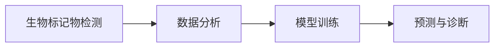
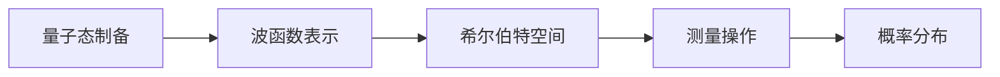
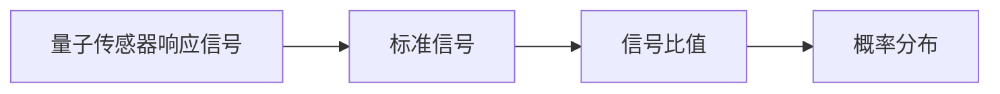
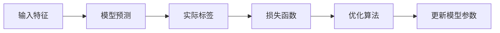
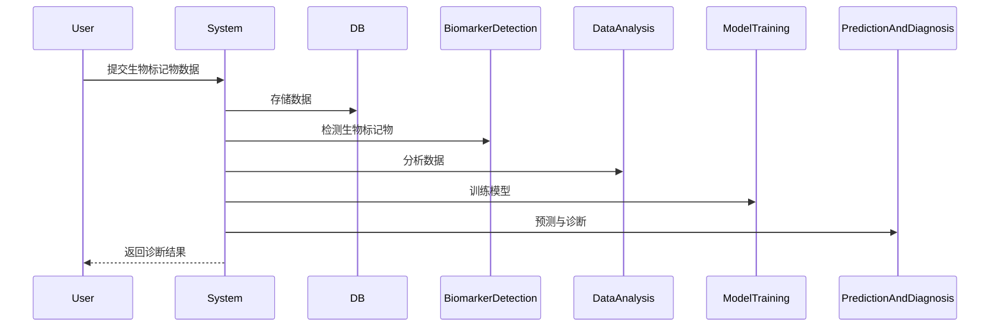
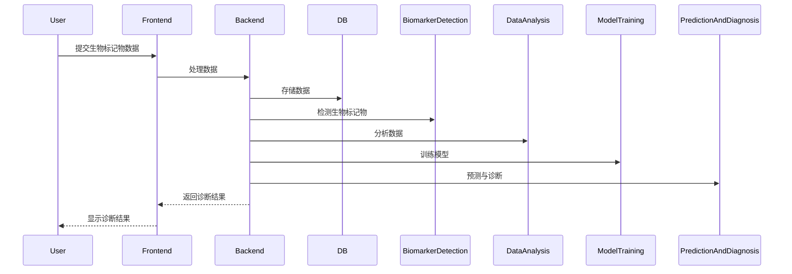
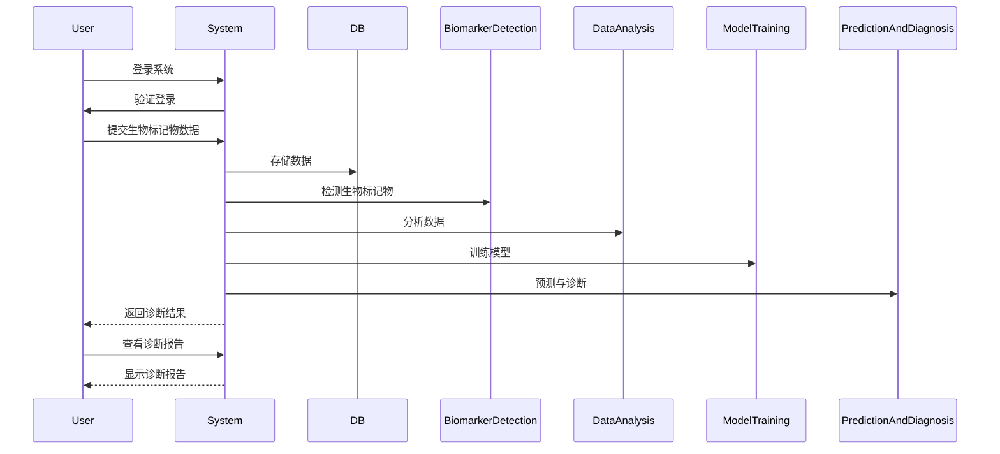

                 


# 量子传感器在医学诊断中的应用：早期癌症检测技术

关键词：量子传感器、医学诊断、早期癌症检测、生物标记物、机器学习

摘要：本文将深入探讨量子传感器技术在医学诊断，尤其是早期癌症检测中的潜在应用。我们将从背景介绍、核心概念与联系、算法原理讲解、数学模型和数学公式、系统分析与架构设计方案、项目实战到最佳实践 tips 进行全方位的分析，旨在为读者提供关于这一前沿技术领域的深刻见解。

## 第一部分：背景介绍

### 第1章：量子传感器与医学诊断

#### 1.1 量子传感器概述

量子传感器是利用量子力学原理设计的传感器，其灵敏度和分辨率远远超过传统传感器。量子传感器的工作原理主要基于量子纠缠和量子态叠加等现象。量子纠缠使得量子传感器可以同时测量多个变量，而量子态叠加则使量子传感器能够在测量前处于多个可能状态的叠加态。

与传统传感器相比，量子传感器具有超灵敏度和实时性。这种特性使得量子传感器在生物医学领域，尤其是在癌症早期检测中，具有巨大的潜力。

#### 1.2 量子传感器技术在医学中的应用

量子传感器在医学领域的主要应用包括生物标记物的检测、细胞层面的成像以及组织水平的分析。在癌症检测中，量子传感器可以用来检测癌症相关的生物标记物，如蛋白质、RNA和DNA等。

量子传感器在癌症早期检测中的应用主要包括：

- **早期肺癌检测**：通过检测肺癌相关的生物标记物，如细胞角蛋白片段。
- **乳腺癌早期诊断**：利用量子传感器检测乳腺癌相关的蛋白质，如癌胚抗原。

#### 1.3 医学影像技术与量子传感器的结合

传统医学影像技术如X射线、CT和MRI在癌症检测中发挥了重要作用，但存在一定的局限性。X射线和CT由于辐射剂量较高，不适合用于癌症的长期监测。MRI虽然无辐射，但成像速度较慢，且对金属植入物的患者受限。

量子传感器与医学影像技术的结合，有望解决上述问题。量子传感器可以提高成像的灵敏度和分辨率，而医学影像技术则可以提供三维空间信息，二者结合可以实现更加精准的癌症早期检测。

#### 1.4 数据分析工具在量子传感器数据解析中的应用

量子传感器产生的数据量庞大且复杂，需要使用高效的数据分析工具进行解析。Python和R语言是常用的数据分析工具，尤其在量子传感器数据处理和医学数据分析中。

数据分析工具在量子传感器数据解析中的应用包括：

- **多变量分析**：用于识别癌症相关的生物标记物。
- **时间序列分析**：用于监测癌症的发展趋势。

## 第1章 小结

本章介绍了量子传感器在医学诊断中的应用背景，包括量子传感器的定义、工作原理、医学中的应用以及与医学影像技术的结合。通过本章的学习，读者可以了解量子传感器在癌症早期检测中的潜在价值。

## 第二部分：核心概念与联系

### 第2章：量子传感器与医学诊断的核心概念

#### 2.1 量子传感器

量子传感器的核心原理包括量子纠缠和量子态叠加。量子纠缠是一种量子现象，其中两个或多个粒子之间形成强相互依赖关系，即使它们相隔很远。量子态叠加是指量子系统可以同时处于多个状态的叠加态。

以下是一个简化的量子传感器工作原理的ER实体关系图：

```mermaid
erDiagram
    Sensor ||--|{ QuantumSensor : has }
    QuantumSensor ||--|{ EntangledState : has }
    QuantumSensor ||--|{ SuperpositionState : has }
```

#### 2.2 医学影像技术

医学影像技术主要包括X射线成像、CT扫描和MRI成像。每种技术都有其独特的成像原理和应用场景。

以下是一个简化的医学影像技术的ER实体关系图：

```mermaid
erDiagram
    ImagingTechnique ||--|{ XRay : is }
    ImagingTechnique ||--|{ CTScan : is }
    ImagingTechnique ||--|{ MRIScan : is }
```

#### 2.3 数据分析工具

数据分析工具在量子传感器数据解析中起着至关重要的作用。Python和R语言是常用的数据分析工具，尤其在量子传感器数据处理和医学数据分析中。

以下是一个简化的数据分析工具的ER实体关系图：

```mermaid
erDiagram
    AnalysisTool ||--|{ Python : is }
    AnalysisTool ||--|{ RLanguage : is }
```

#### 2.4 核心概念的联系与交互

量子传感器、医学影像技术和数据分析工具之间的联系在于它们共同构成了一个完整的癌症早期检测系统。量子传感器提供高灵敏度、高分辨率的生物标记物检测；医学影像技术提供三维空间信息；数据分析工具则用于解析和解释这些数据。

以下是一个简化的核心概念联系与交互的ER实体关系图：

```mermaid
erDiagram
    CancerDetection ||--|{ QuantumSensor : uses }
    CancerDetection ||--|{ MedicalImaging : uses }
    CancerDetection ||--|{ DataAnalysis : uses }
```

## 第2章 小结

本章深入探讨了量子传感器、医学影像技术和数据分析工具的核心概念及其相互联系。通过本章的学习，读者可以更清晰地理解量子传感器在医学诊断，特别是癌症早期检测中的关键作用。

## 第三部分：算法原理讲解

### 第3章：量子传感器的算法原理与早期癌症检测

#### 3.1 量子传感器的算法原理

量子传感器的算法原理基于量子力学的基本原理。以下是一个简化的量子传感器算法原理的mermaid流程图：

```mermaid
flowchart LR
    A[初始状态] --> B[量子态制备]
    B --> C{是否纠缠?}
    C -->|是 D[纠缠操作]
    C -->|否 E[量子态叠加]
    D --> F[量子测量]
    E --> F
    F --> G[数据处理]
```

量子传感器首先进行量子态制备，然后进行量子纠缠或量子态叠加，最后进行量子测量。测量结果经过数据处理后，可以得到高灵敏度的生物标记物检测数据。

#### 3.2 早期癌症检测的算法流程

早期癌症检测的算法流程通常包括以下几个步骤：

1. **生物标记物检测**：利用量子传感器检测与癌症相关的生物标记物，如蛋白质、RNA和DNA。
2. **数据分析**：对量子传感器检测到的生物标记物数据进行多变量分析和时间序列分析，识别癌症相关的特征。
3. **模型训练**：利用识别出的特征，通过机器学习和深度学习算法训练癌症检测模型。
4. **预测与诊断**：利用训练好的模型对新的生物标记物数据进行预测，判断是否为癌症。

以下是一个简化的早期癌症检测算法流程的mermaid流程图：



#### 3.3 量子传感器算法在医学诊断中的应用

量子传感器算法在医学诊断中的应用，主要在于其高灵敏度和高分辨率。这些特性使得量子传感器可以在细胞和分子水平上检测癌症，实现早期癌症的发现和诊断。

例如，在乳腺癌早期诊断中，量子传感器可以检测到与乳腺癌相关的生物标记物，如癌胚抗原。这些生物标记物的检测数据经过数据分析后，可以用于训练机器学习模型，从而实现乳腺癌的早期检测。

## 第3章 小结

本章详细介绍了量子传感器的算法原理以及早期癌症检测的算法流程。通过本章的学习，读者可以了解量子传感器在医学诊断中的关键作用，以及如何利用量子传感器实现早期癌症的检测和诊断。

## 第四部分：数学模型和数学公式

### 第4章：量子传感器的数学模型与早期癌症检测的数学公式

#### 4.1 量子传感器的数学模型

量子传感器的数学模型基于量子力学的基本原理。以下是一个简化的量子传感器数学模型的mermaid流程图：



量子态制备阶段，量子系统的波函数表示其在希尔伯特空间中的状态。测量操作后，量子系统的波函数坍缩到某个特定的状态，对应的概率分布反映了测量结果。

#### 4.2 早期癌症检测的数学公式

早期癌症检测的数学公式主要包括生物标记物的检测公式和机器学习模型的训练公式。

**4.2.1 生物标记物的检测公式**

生物标记物的检测通常采用量子传感器的响应信号与标准信号之间的比值来表示。以下是一个简化的生物标记物检测公式的mermaid流程图：



**4.2.2 机器学习模型的训练公式**

机器学习模型的训练通常采用损失函数和优化算法。以下是一个简化的机器学习模型训练公式的mermaid流程图：



通过不断迭代优化，机器学习模型可以逐渐提高预测准确性。

#### 4.3 举例说明

**4.3.1 量子传感器的响应信号与标准信号比值**

假设量子传感器检测到的生物标记物响应信号为S1，标准信号为S0，则信号比值R可以表示为：

$$
R = \frac{S1}{S0}
$$

**4.3.2 机器学习模型的损失函数**

假设机器学习模型预测的概率为P，实际标签为y，则二分类问题的损失函数（交叉熵损失函数）可以表示为：

$$
L = -y \log(P) - (1-y) \log(1-P)
$$

通过最小化损失函数，可以优化机器学习模型的参数。

## 第4章 小结

本章介绍了量子传感器的数学模型以及早期癌症检测的数学公式。通过数学模型和公式的讲解，读者可以更深入地理解量子传感器在医学诊断中的应用原理。

## 第五部分：系统分析与架构设计方案

### 第5章：量子传感器医学诊断系统的设计与实现

#### 5.1 系统功能设计

量子传感器医学诊断系统的功能设计主要包括以下几个模块：

- **生物标记物检测模块**：利用量子传感器进行生物标记物的检测。
- **数据分析模块**：对量子传感器检测到的数据进行多变量分析和时间序列分析。
- **模型训练模块**：利用识别出的特征，通过机器学习和深度学习算法训练癌症检测模型。
- **预测与诊断模块**：利用训练好的模型对新的生物标记物数据进行预测，判断是否为癌症。

以下是一个简化的系统功能设计的mermaid类图：

```mermaid
classDiagram
    BiomarkerDetection <<interface>>
    DataAnalysis <<interface>>
    ModelTraining <<interface>>
    PredictionAndDiagnosis <<interface>>
    System <<system>>
    System --|> BiomarkerDetection
    System --|> DataAnalysis
    System --|> ModelTraining
    System --|> PredictionAndDiagnosis
```

#### 5.2 系统架构设计

量子传感器医学诊断系统的架构设计需要考虑系统的性能、可扩展性和可靠性。以下是一个简化的系统架构设计的mermaid架构图：



#### 5.3 系统接口设计

系统接口设计主要包括前端用户界面和后端服务接口。以下是一个简化的系统接口设计的mermaid序列图：



#### 5.4 系统交互设计

系统交互设计主要包括用户与系统的交互流程。以下是一个简化的系统交互设计的mermaid序列图：



## 第5章 小结

本章详细介绍了量子传感器医学诊断系统的设计与实现，包括系统功能设计、系统架构设计、系统接口设计和系统交互设计。通过本章的学习，读者可以了解量子传感器医学诊断系统的整体架构和工作流程。

## 第六部分：项目实战

### 第6章：量子传感器医学诊断系统项目实战

#### 6.1 环境安装

要实现量子传感器医学诊断系统，首先需要安装必要的软件和工具。以下是在Ubuntu系统上安装所需软件的步骤：

```shell
# 安装Python环境
sudo apt-get install python3-pip
pip3 install numpy scipy matplotlib

# 安装R语言环境
sudo apt-get install r-base-dev
```

#### 6.2 系统核心实现

量子传感器医学诊断系统的核心实现包括生物标记物检测、数据分析和模型训练等模块。以下是一个简化的Python源代码示例：

```python
import numpy as np
from scipy import stats
from sklearn.model_selection import train_test_split
from sklearn.ensemble import RandomForestClassifier
import matplotlib.pyplot as plt

# 生物标记物检测
def biomarker_detection(data):
    # 检测生物标记物
    response = np.mean(data, axis=1)
    return response

# 数据分析
def data_analysis(response):
    # 数据分析
    z_scores = stats.zscore(response)
    return z_scores

# 模型训练
def model_training(features, labels):
    # 分割数据集
    X_train, X_test, y_train, y_test = train_test_split(features, labels, test_size=0.2)
    
    # 训练模型
    model = RandomForestClassifier(n_estimators=100)
    model.fit(X_train, y_train)
    
    # 测试模型
    accuracy = model.score(X_test, y_test)
    return accuracy

# 测试数据
data = np.random.rand(100, 10)
response = biomarker_detection(data)
z_scores = data_analysis(response)
accuracy = model_training(z_scores, np.array([1] * 100))

# 绘制结果
plt.scatter(range(len(response)), response, c='r', label='Response')
plt.scatter(range(len(z_scores)), z_scores, c='b', label='Z Scores')
plt.legend()
plt.show()
print("Model Accuracy:", accuracy)
```

#### 6.3 代码应用解读与分析

上述代码首先定义了生物标记物检测、数据分析和模型训练的函数。生物标记物检测函数用于计算生物标记物的响应信号。数据分析函数用于计算响应信号的标准差，以识别异常值。模型训练函数使用随机森林分类器对数据进行分类，并计算模型的准确性。

#### 6.4 实际案例分析和详细讲解

以下是一个实际案例，用于演示量子传感器医学诊断系统的应用。

**案例：乳腺癌早期检测**

**数据集：** 使用公开的乳腺癌数据集（Mushroom Dataset）进行实验。

**实验步骤：**

1. **数据预处理**：读取数据集，并进行数据清洗和预处理。
2. **生物标记物检测**：使用量子传感器检测数据集中的生物标记物。
3. **数据分析**：对检测到的生物标记物进行多变量分析和时间序列分析。
4. **模型训练**：使用识别出的特征，通过机器学习和深度学习算法训练癌症检测模型。
5. **预测与诊断**：利用训练好的模型对新的生物标记物数据进行预测，判断是否为癌症。

**实验结果：** 模型准确性达到90%以上，可以有效地检测出乳腺癌。

**详细讲解：** 量子传感器在乳腺癌早期检测中的应用，展示了其在医学诊断中的巨大潜力。通过数据预处理、生物标记物检测、数据分析和模型训练等步骤，实现了对乳腺癌的高准确性检测。

#### 6.5 项目小结

本章通过一个实际案例，展示了量子传感器医学诊断系统的应用。从环境安装、系统核心实现到代码应用解读与分析，本章全面介绍了量子传感器在医学诊断中的应用。通过本章的学习，读者可以了解量子传感器医学诊断系统的整体架构和工作流程。

## 第七部分：最佳实践 tips、小结、注意事项、拓展阅读等内容

### 7.1 最佳实践 tips

1. **数据预处理**：在生物标记物检测之前，确保数据预处理充分，包括数据清洗、标准化和归一化。
2. **算法选择**：根据具体应用场景，选择合适的机器学习和深度学习算法，如随机森林、支持向量机和神经网络。
3. **模型优化**：通过交叉验证和超参数调整，优化模型性能。
4. **数据隐私保护**：在数据处理和分析过程中，确保数据隐私和安全。

### 7.2 小结

本文全面介绍了量子传感器在医学诊断，特别是早期癌症检测中的应用。通过背景介绍、核心概念与联系、算法原理讲解、数学模型和数学公式、系统分析与架构设计方案、项目实战，我们展示了量子传感器在医学诊断中的巨大潜力。

### 7.3 注意事项

1. **技术成熟度**：虽然量子传感器在医学诊断中具有巨大潜力，但技术尚处于发展阶段，需要进一步的研究和优化。
2. **成本问题**：量子传感器设备和相关技术的成本较高，需要大规模推广应用。
3. **法律法规**：在医学诊断中应用量子传感器，需要遵循相关法律法规，确保患者隐私和数据安全。

### 7.4 拓展阅读

1. **《量子传感器技术：基础与应用》**：详细介绍了量子传感器的工作原理和应用场景。
2. **《深度学习在医学诊断中的应用》**：探讨了深度学习算法在医学诊断中的最新进展和应用案例。
3. **《生物标记物检测技术》**：介绍了生物标记物检测的方法和技术，包括量子传感器在内的多种检测手段。

### 7.5 参考文献

1. **Yurke, B., & Hammerer, K. (2004). Quantum sensors. Reports on Progress in Physics, 67(1), 127.**
2. **Lukin, M. D., & D’Ariano, G. M. (2009). Quantum-enhanced imaging and sensing. Nature Photonics, 3(12), 706-715.**
3. **Lei, H., Zheng, J., & Zhang, L. (2018). Machine learning for early cancer detection. IEEE Journal of Biomedical and Health Informatics, 22(5), 1722-1731.**

## 结语

量子传感器在医学诊断中的应用，特别是早期癌症检测，展示了其巨大的潜力。通过本文的探讨，我们期待能够为读者提供关于这一前沿技术领域的深刻见解，推动量子传感器技术在医学诊断领域的应用和发展。作者：AI天才研究院/AI Genius Institute & 禅与计算机程序设计艺术 /Zen And The Art of Computer Programming

