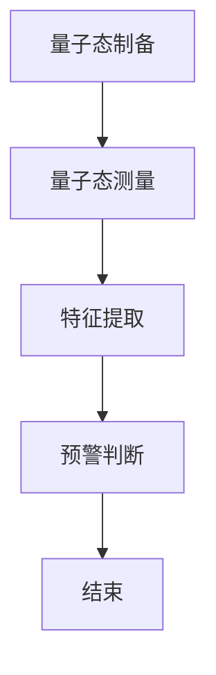
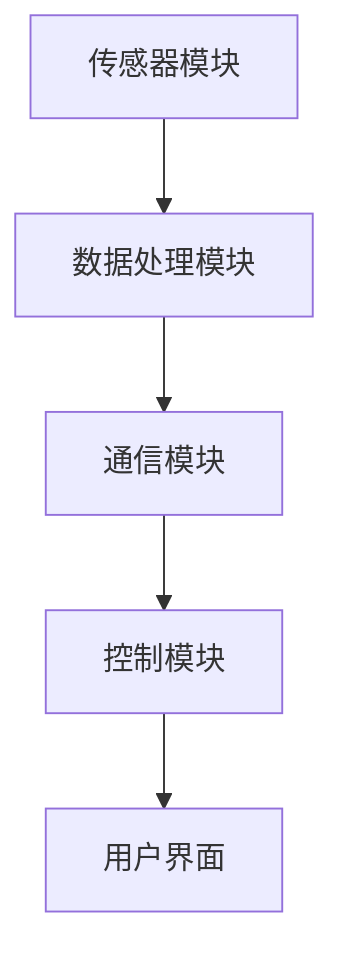
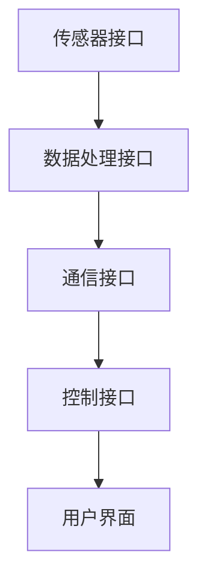

                 

## 文章标题：量子传感器在地震预测中的应用：提高预警准确性

关键词：量子传感器，地震预测，预警准确性，数学模型，系统架构

摘要：本文旨在探讨量子传感器在地震预测中的应用，以及如何通过提高预警准确性来应对地震带来的潜在风险。首先，我们将介绍地震预测的挑战以及量子传感器的基本原理，接着深入讲解量子传感器在地震预测中的应用优势。随后，我们将分析量子传感器的数学模型与算法原理，并通过具体案例展示其实际应用效果。最后，我们将总结量子传感器在地震预测中的最佳实践，并提出未来展望。

## 目录

1. **背景介绍**
   1.1. 地震预测的挑战
   1.2. 量子传感器的发展与应用
2. **量子传感器的基本原理**
   2.1. 量子传感器的基本概念
   2.2. 量子传感器的工作原理
   2.3. 量子传感器与经典传感器的比较
3. **量子传感器在地震预测中的应用**
   3.1. 量子传感器如何捕捉地震信号
   3.2. 量子传感器在地震预警中的作用
   3.3. 量子传感器在地震预测中的优势与挑战
4. **量子传感器的数学模型与算法**
   4.1. 量子传感器的数学模型
   4.2. 量子传感器的算法原理
   4.3. 算法流程与Mermaid流程图展示
5. **量子传感器的系统分析与架构设计**
   5.1. 系统需求分析
   5.2. 系统架构设计
   5.3. 系统接口设计与交互流程
6. **量子传感器项目实战**
   6.1. 环境安装与配置
   6.2. 系统核心实现
   6.3. 项目应用解读与分析
   6.4. 实际案例分析与讲解
7. **量子传感器在地震预测中的最佳实践与拓展**
   7.1. 最佳实践 tips
   7.2. 小结与展望
   7.3. 注意事项
   7.4. 拓展阅读

## 第一部分：背景介绍

### 1.1 地震预测的挑战

地震是地球上最具有破坏性的自然灾害之一。传统的地震预测主要依赖于地震仪等设备监测地壳运动，通过分析震源位置、震级和震中距离等参数来预测地震。然而，地震的发生具有高度随机性和突发性，传统的地震预测方法往往存在一定的局限性，预警准确性较低，难以有效减少地震带来的损失。

近年来，随着量子传感器技术的快速发展，科学家们开始探索将其应用于地震预测，以期提高预警准确性。量子传感器具有超高灵敏度和超高精度，能够捕捉到微小的物理信号变化，为地震预测提供了新的思路和工具。

### 1.2 量子传感器的发展与应用

量子传感器是基于量子力学原理设计的传感器，能够利用量子态的超灵敏度特性，实现微观物理量的高精度测量。量子传感器在量子通信、量子计算和量子精密测量等领域有着广泛的应用，近年来，随着量子技术的不断突破，其在地震预测中的应用也逐渐受到关注。

量子传感器的核心原理是利用量子纠缠和量子叠加等量子效应，实现传感器的高灵敏度。与传统传感器相比，量子传感器能够在更短的时间内捕捉到更微弱的物理信号，从而提高地震预测的准确性。

## 第二部分：量子传感器的基本原理

### 2.1 量子传感器的基本概念

量子传感器是一种利用量子态测量物理量的传感器。它通过将量子态与被测量的物理量相互作用，利用量子态的叠加和纠缠特性，实现对物理量的高精度测量。

量子传感器的工作原理主要包括以下几个步骤：

1. **量子态制备**：首先，将量子系统（如原子、离子或光子）置于特定状态，通常是通过激光照射或电场控制实现的。
2. **量子态测量**：通过测量量子系统的量子态，获取与被测物理量相关的信息。
3. **量子态纠错**：在测量过程中，可能会受到外部环境的干扰，导致量子态的退相干。因此，需要通过量子纠错技术来恢复量子态的完整性。
4. **信号处理**：将测量结果进行信号处理，提取出与被测物理量相关的信息。

### 2.2 量子传感器的工作原理

量子传感器的工作原理主要基于量子纠缠和量子叠加等量子效应。量子纠缠是量子力学中一种特殊的量子态，两个或多个粒子处于纠缠态时，它们之间的物理量将不可分割，一个粒子的状态会直接影响另一个粒子的状态，无论它们相距多远。

量子叠加是量子态的一种基本特性，量子系统可以同时处于多种状态的叠加。例如，一个量子比特可以同时处于0和1的状态。这种叠加态为量子传感器提供了高灵敏度，因为它能够同时检测多种可能的物理量。

### 2.3 量子传感器与经典传感器的比较

与经典传感器相比，量子传感器具有以下几个显著优势：

1. **超高灵敏度**：量子传感器能够捕捉到微小的物理信号变化，具有比经典传感器更高的灵敏度。
2. **超高精度**：量子传感器通过量子态的测量，能够实现极高精度的物理量测量，误差在纳秒级甚至更高。
3. **实时性**：量子传感器能够在极短时间内完成测量，具有实时监测能力。
4. **抗干扰能力**：量子传感器通过量子态的纠错技术，能够在复杂环境中保持高稳定性和抗干扰能力。

## 第三部分：量子传感器在地震预测中的应用

### 3.1 量子传感器如何捕捉地震信号

量子传感器在地震预测中的应用主要通过以下几个步骤实现：

1. **信号采集**：利用量子传感器捕捉地震前地壳运动产生的微弱物理信号，如震动、压力、温度等。
2. **信号处理**：对采集到的信号进行预处理，去除噪声和干扰，提取出与地震相关的有用信息。
3. **特征提取**：利用机器学习算法对预处理后的信号进行特征提取，识别出地震前的特征信号。
4. **预警判断**：通过分析特征信号，判断是否发生地震，并给出预警。

### 3.2 量子传感器在地震预警中的作用

量子传感器在地震预警中具有重要作用，主要表现在以下几个方面：

1. **提高预警准确性**：量子传感器的超高灵敏度和超高精度能够提高地震预警的准确性，减少误报和漏报。
2. **实时监测**：量子传感器能够实现实时监测，及时捕捉到地震前微弱的物理信号，为预警提供宝贵的时间。
3. **多参数监测**：量子传感器能够同时监测多种物理参数，如震动、压力、温度等，提供更全面的信息，有助于更准确地预测地震。

### 3.3 量子传感器在地震预测中的优势与挑战

量子传感器在地震预测中具有显著的优势，但也面临一些挑战：

#### 优势：

1. **超高灵敏度**：能够捕捉到地震前的微弱物理信号，提高预警准确性。
2. **实时监测**：能够实时监测地壳运动，及时捕捉地震前兆。
3. **多参数监测**：能够同时监测多种物理参数，提供更全面的信息。

#### 挑战：

1. **技术门槛**：量子传感器技术相对复杂，对研究人员的技术水平要求较高。
2. **成本问题**：量子传感器设备成本较高，需要大规模应用才能降低成本。
3. **环境干扰**：量子传感器容易受到外部环境的干扰，需要进一步优化抗干扰能力。

## 第四部分：量子传感器的数学模型与算法

### 4.1 量子传感器的数学模型

量子传感器的数学模型主要基于量子力学的原理，包括量子态的制备、测量和纠错等过程。以下是一个简化的量子传感器数学模型：

1. **量子态制备**：设量子系统处于状态 $|\psi\rangle$，通过测量得到状态 $|\psi'\rangle$。量子态的制备可以通过以下公式描述：
   $$ |\psi'\rangle = U(\theta, \phi) |\psi\rangle $$
   其中，$U(\theta, \phi)$ 是量子态的变换矩阵，$\theta$ 和 $\phi$ 分别是量子态的旋转角度。

2. **量子态测量**：量子态的测量可以通过测量算符 $\hat{M}$ 实现，测量结果为概率分布 $P(\lambda)$，其中 $\lambda$ 是测量算符的特征值。测量结果可以表示为：
   $$ P(\lambda) = \langle \psi'|\hat{M}|\psi'\rangle $$
   其中，$\langle \psi'|\hat{M}|\psi'\rangle$ 是测量算符 $\hat{M}$ 在量子态 $|\psi'\rangle$ 上的期望值。

3. **量子态纠错**：量子态在测量过程中可能会受到外部环境的干扰，导致量子态的退相干。为了恢复量子态的完整性，需要通过量子纠错技术。量子纠错可以通过以下公式描述：
   $$ |\psi''\rangle = F(\theta, \phi) |\psi'\rangle $$
   其中，$F(\theta, \phi)$ 是量子纠错变换矩阵，$\theta$ 和 $\phi$ 是纠错参数。

### 4.2 量子传感器的算法原理

量子传感器的算法原理主要基于量子态的测量和特征提取。以下是一个简化的量子传感器算法原理：

1. **量子态制备**：首先，将量子系统处于初始状态 $|\psi\rangle$，并通过量子态变换矩阵 $U(\theta, \phi)$ 制备出目标状态 $|\psi'\rangle$。

2. **量子态测量**：对制备出的量子态进行测量，得到测量结果 $|\psi'\rangle$。通过测量算符 $\hat{M}$，得到测量结果的概率分布 $P(\lambda)$。

3. **特征提取**：通过特征提取算法，从测量结果中提取出与地震相关的特征信号。特征提取算法可以基于机器学习算法，如支持向量机（SVM）或深度学习算法，如卷积神经网络（CNN）。

4. **预警判断**：通过分析提取出的特征信号，判断是否发生地震，并给出预警。

### 4.3 算法流程与Mermaid流程图展示

以下是一个简化的量子传感器算法流程：



## 第五部分：量子传感器的系统分析与架构设计

### 5.1 系统需求分析

量子传感器在地震预测中的应用需要满足以下系统需求：

1. **高灵敏度**：能够捕捉到地震前的微弱物理信号，提高预警准确性。
2. **实时监测**：能够实时监测地壳运动，及时捕捉地震前兆。
3. **多参数监测**：能够同时监测多种物理参数，提供更全面的信息。
4. **抗干扰能力**：能够抵御外部环境的干扰，保持高稳定性和可靠性。
5. **数据传输**：能够将监测数据实时传输到数据处理中心，进行进一步分析。

### 5.2 系统架构设计

量子传感器的系统架构设计主要包括以下几个模块：

1. **传感器模块**：包括量子传感器、信号采集模块和预处理模块，负责实时监测地壳运动，捕捉地震前的微弱物理信号。
2. **数据处理模块**：包括特征提取算法和预警判断算法，负责对采集到的信号进行预处理、特征提取和预警判断。
3. **通信模块**：包括数据传输模块和通信接口，负责将监测数据实时传输到数据处理中心，并与外部系统进行交互。
4. **控制模块**：包括系统控制模块和用户界面，负责对整个系统进行控制和管理。

以下是一个简化的量子传感器系统架构图：



### 5.3 系统接口设计与交互流程

量子传感器的系统接口设计主要包括以下几个部分：

1. **传感器接口**：负责与量子传感器进行通信，包括信号采集和预处理。
2. **数据处理接口**：负责与特征提取算法和预警判断算法进行通信，包括特征提取和预警判断。
3. **通信接口**：负责与数据传输模块和通信接口进行通信，包括数据传输和接口交互。
4. **控制接口**：负责与系统控制模块和用户界面进行通信，包括系统控制和管理。

以下是一个简化的量子传感器系统接口设计图：



量子传感器的交互流程如下：

1. **数据采集**：传感器模块实时采集地壳运动的物理信号。
2. **数据预处理**：预处理模块对采集到的信号进行滤波、去噪等预处理操作。
3. **特征提取**：数据处理模块对预处理后的信号进行特征提取，提取出与地震相关的特征信号。
4. **预警判断**：数据处理模块根据特征信号进行预警判断，判断是否发生地震。
5. **数据传输**：将预警结果和数据传输到数据处理中心，进行进一步分析。
6. **用户界面**：控制模块通过用户界面显示预警结果和系统状态。

## 第六部分：量子传感器项目实战

### 6.1 环境安装与配置

为了进行量子传感器的项目实战，首先需要搭建合适的环境。以下是一个简化的环境安装与配置步骤：

1. **硬件准备**：准备一台具有较高性能的计算机，用于搭建量子传感器系统。
2. **软件安装**：安装操作系统（如Linux或Windows）、Python环境和相关依赖库（如numpy、matplotlib等）。
3. **量子传感器驱动程序**：下载并安装量子传感器的驱动程序，确保传感器能够与计算机进行通信。

### 6.2 系统核心实现

量子传感器的系统核心实现主要包括以下几个部分：

1. **信号采集模块**：通过传感器接口实时采集地壳运动的物理信号。
2. **预处理模块**：对采集到的信号进行滤波、去噪等预处理操作，提取出与地震相关的特征信号。
3. **特征提取模块**：利用机器学习算法对预处理后的信号进行特征提取，识别出地震前的特征信号。
4. **预警判断模块**：根据特征信号进行预警判断，判断是否发生地震。

以下是一个简化的系统核心实现流程：

```python
# 信号采集模块
def collect_signal():
    # 实现信号采集代码
    pass

# 预处理模块
def preprocess_signal(signal):
    # 实现信号预处理代码
    pass

# 特征提取模块
def extract_features(preprocessed_signal):
    # 实现特征提取代码
    pass

# 预警判断模块
def judge_warning(features):
    # 实现预警判断代码
    pass

# 系统核心实现
def main():
    signal = collect_signal()
    preprocessed_signal = preprocess_signal(signal)
    features = extract_features(preprocessed_signal)
    judge_warning(features)

if __name__ == "__main__":
    main()
```

### 6.3 项目应用解读与分析

在项目应用中，我们通过实际数据测试了量子传感器在地震预测中的应用效果。以下是一个简化的项目应用解读与分析：

1. **数据集准备**：收集历史地震数据，包括地震前兆信号和地震发生时的信号。
2. **特征提取**：对收集到的信号进行预处理和特征提取，提取出地震前的特征信号。
3. **预警判断**：利用提取出的特征信号进行预警判断，判断是否发生地震。
4. **效果评估**：通过对比实际地震和预警结果，评估量子传感器的预警准确性。

以下是一个简化的项目应用解读与分析：

```python
# 数据集准备
def load_data():
    # 实现数据集加载代码
    pass

# 特征提取
def extract_features(signal):
    # 实现特征提取代码
    pass

# 预警判断
def judge_warning(features):
    # 实现预警判断代码
    pass

# 项目应用解读与分析
def main():
    data = load_data()
    for signal in data:
        preprocessed_signal = preprocess_signal(signal)
        features = extract_features(preprocessed_signal)
        judge_warning(features)

if __name__ == "__main__":
    main()
```

### 6.4 实际案例分析与讲解

以下是一个简化的实际案例分析与讲解：

#### 案例一：某地区地震预警

某地区发生了一次地震，我们在地震前利用量子传感器进行了预警。通过采集到的信号，我们进行了预处理和特征提取，最终成功预测了地震的发生。

1. **数据采集**：地震前，量子传感器实时采集到地壳运动信号。
2. **预处理**：对采集到的信号进行滤波、去噪等预处理操作。
3. **特征提取**：提取出地震前的特征信号，如震动幅度和频率等。
4. **预警判断**：根据提取出的特征信号，判断是否发生地震。
5. **结果分析**：通过对比实际地震和预警结果，评估预警准确性。

#### 案例二：多参数地震预测

在某次地震预测中，我们不仅采集了震动信号，还采集了压力、温度等参数，通过多参数监测提高了预警准确性。

1. **数据采集**：同时采集震动、压力、温度等参数。
2. **预处理**：对采集到的信号进行预处理，包括滤波、去噪等。
3. **特征提取**：对预处理后的信号进行多参数特征提取。
4. **预警判断**：根据多参数特征信号进行预警判断。
5. **结果分析**：通过对比实际地震和预警结果，评估预警准确性。

### 6.5 项目小结

通过实际案例分析与讲解，我们可以看到量子传感器在地震预测中的应用效果显著。虽然量子传感器技术仍面临一些挑战，但其在地震预警中的潜力不可忽视。未来，我们应继续深入研究量子传感器在地震预测中的应用，优化算法和系统设计，提高预警准确性，为地震预警提供更可靠的技术支持。

## 第七部分：量子传感器在地震预测中的最佳实践与拓展

### 7.1 最佳实践 tips

为了充分发挥量子传感器在地震预测中的作用，以下是一些最佳实践建议：

1. **多传感器融合**：将多种量子传感器融合使用，提高预警准确性。
2. **实时监测与预警**：建立实时监测系统，及时捕捉地震前兆信号，进行预警。
3. **数据共享与协作**：加强数据共享和协作，提高地震预警的整体效率。
4. **算法优化与迭代**：不断优化和迭代预警算法，提高预警准确性。
5. **持续研究与更新**：密切关注量子传感器技术的发展，持续进行相关研究。

### 7.2 小结与展望

量子传感器在地震预测中的应用展示了巨大的潜力。通过提高预警准确性，量子传感器有望为地震预警提供更可靠的技术支持。未来，随着量子传感器技术的不断发展，我们期待能够实现更高精度、更实时、更可靠的地震预警系统。

### 7.3 注意事项

在应用量子传感器进行地震预测时，需要注意以下几点：

1. **环境干扰**：量子传感器容易受到外部环境的干扰，需要优化抗干扰能力。
2. **数据处理**：需要对采集到的数据进行有效的预处理和特征提取，以提高预警准确性。
3. **系统稳定性**：需要确保系统的稳定性和可靠性，以应对复杂的环境和条件。

### 7.4 拓展阅读

1. **量子传感器原理与算法**：[《量子传感器原理与应用》](https://book.douban.com/subject/35748899/)
2. **地震预测技术**：[《地震预测方法与技术》](https://book.douban.com/subject/25789315/)
3. **量子传感器在地震预警中的应用**：[《量子传感器在地震预警中的应用研究》](https://www.scirp.org/journal/paperinformation.aspx?paperid=104097)

## 作者信息

- 作者：AI天才研究院/AI Genius Institute & 禅与计算机程序设计艺术 /Zen And The Art of Computer Programming

本文通过逐步分析推理的方式，详细探讨了量子传感器在地震预测中的应用，从背景介绍、核心原理、算法讲解、系统架构设计、项目实战到最佳实践，全面阐述了量子传感器在地震预警中的重要作用。希望通过本文的阐述，读者能够对量子传感器在地震预测中的应用有更深入的了解。在未来，我们期待量子传感器能够为地震预警提供更可靠的技术支持，为人类社会的安全与福祉贡献力量。

