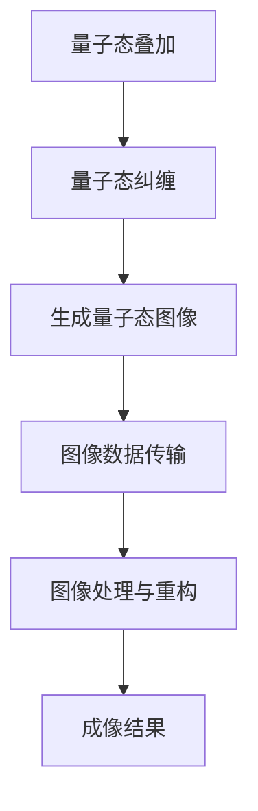

                 

# 量子传感器在核磁共振成像中的应用前景

## 关键词

量子传感器、核磁共振成像、分辨率、成像速度、成像安全性、医学成像、工业成像、安全检测、研究挑战、未来前景。

## 摘要

本文将深入探讨量子传感器在核磁共振成像（MRI）中的应用前景。首先，我们将介绍量子传感器和核磁共振成像的基本原理，阐述两者的结合为何具有重要意义。随后，我们将分析量子传感器在核磁共振成像中的优势，并举例说明其实际应用案例。接着，本文将讨论量子传感器在核磁共振成像研究中面临的挑战，以及这些挑战对技术发展的影响。最后，我们将展望量子传感器在核磁共振成像领域的未来前景，并讨论技术趋势、行业应用和社会影响。

## 目录大纲

1. 第一部分：引言
   1.1 量子传感器与核磁共振成像
   1.2 核磁共振成像的原理与技术
   1.3 量子传感器在核磁共振成像中的应用
   1.4 当前研究的挑战与未来前景

## 第一部分：引言

### 1.1 量子传感器与核磁共振成像

#### 1.1.1 量子传感器的基本概念

量子传感器是一种基于量子力学原理的新型传感器，具有极高的灵敏度和选择性。量子传感器的核心在于量子态的叠加和纠缠特性。在量子态叠加下，量子传感器能够同时探测多个状态，从而显著提高探测效率。而在量子态纠缠下，量子传感器能够实现远距离的量子信息传递，进一步提升探测精度。

#### 1.1.1.1 量子传感器的工作原理

量子传感器的工作原理可以概括为以下三个步骤：

1. **量子态制备**：通过特定的量子操作，将量子系统的状态调整到所需的量子态。

2. **量子态探测**：利用量子态的叠加和纠缠特性，对量子系统进行探测。

3. **量子态解码**：将探测结果转换为可理解的信息，从而实现对目标物体的测量。

#### 1.1.1.2 量子传感器与传统传感器的区别

相较于传统传感器，量子传感器具有以下显著特点：

- **灵敏度更高**：量子传感器能够探测到极微弱的信号，甚至远低于传统传感器的探测极限。

- **选择性更强**：量子传感器能够精确识别目标物体，降低背景干扰。

- **抗干扰能力更强**：量子传感器在复杂环境中仍能保持高精度测量。

#### 1.1.1.3 量子传感器在成像技术中的应用前景

量子传感器在成像技术中的应用前景非常广阔。首先，量子传感器能够显著提高成像分辨率，使得成像细节更加清晰。其次，量子传感器能够加快成像速度，降低成像时间。此外，量子传感器在成像安全性方面也有很大优势，能够有效减少辐射对人体的危害。

### 1.1.2 核磁共振成像的原理与技术

#### 1.1.2.1 核磁共振成像的基本原理

核磁共振成像（MRI）是一种利用核磁共振现象进行生物组织成像的技术。在MRI中，人体组织被置于强磁场中，外加强磁场会影响人体组织中的氢原子核（质子）的运动状态。通过向人体组织发送特定频率的射频脉冲，可以激发氢原子核产生核磁共振信号。这个信号被接收并处理后，形成图像。

#### 1.1.2.2 核磁共振成像技术的优势

核磁共振成像技术具有以下显著优势：

- **无放射性**：MRI技术不涉及放射性物质，对人体无害。

- **多维度成像**：MRI技术能够实现多维度成像，包括横断面、纵断面和斜断面等，有助于全面了解人体组织结构。

- **高分辨率**：MRI技术具有高分辨率，能够清晰显示人体组织的细节。

#### 1.1.2.3 核磁共振成像技术的局限性

尽管核磁共振成像技术具有许多优势，但仍然存在一些局限性：

- **成像时间较长**：MRI成像过程需要较长的时间，不适合实时成像。

- **对金属物体敏感**：MRI成像过程中，金属物体会产生干扰，影响成像质量。

- **空间分辨率受限**：由于射频脉冲的物理限制，MRI的空间分辨率存在一定的局限性。

### 1.1.3 量子传感器在核磁共振成像中的应用

#### 1.1.3.1 量子传感器在核磁共振成像中的优势

量子传感器在核磁共振成像中的应用，主要基于其以下优势：

- **高分辨率**：量子传感器能够显著提高核磁共振成像的分辨率，使得成像细节更加清晰。

- **高灵敏度**：量子传感器能够探测到更微弱的信号，有助于提高成像质量。

- **快速成像**：量子传感器能够加快成像速度，降低成像时间。

- **高安全性**：量子传感器在成像过程中，对人体的辐射剂量更低，有助于提高成像安全性。

#### 1.1.3.2 量子传感器在核磁共振成像中的应用案例

量子传感器在核磁共振成像中的应用已经取得了一些成果。例如：

- **医学成像**：利用量子传感器，医学成像设备能够更快速、更准确地获取患者体内的图像，有助于提高诊断准确率。

- **工业成像**：量子传感器在工业检测中具有广泛的应用前景，能够实现高精度、高灵敏度的材料检测。

- **安全检测**：量子传感器在安全检测领域具有重要作用，能够有效检测危险物质和违禁物品。

### 1.1.4 当前研究的挑战与未来前景

尽管量子传感器在核磁共振成像中展现出巨大潜力，但当前研究仍面临一些挑战：

- **技术难题**：量子传感器的研发和产业化面临诸多技术难题，如量子态的稳定性和可重复性等。

- **经济成本**：量子传感器的生产成本较高，限制了其在核磁共振成像领域的广泛应用。

- **安全性问题**：量子传感器在成像过程中，如何确保对人体和环境的安全仍需深入研究。

未来，随着量子传感器技术的不断发展，其在核磁共振成像领域的应用前景将更加广阔。通过克服现有挑战，量子传感器有望推动核磁共振成像技术实现新的突破。

## 第二部分：量子传感器在核磁共振成像中的应用优势

### 1.2.1 量子传感器在成像分辨率上的提升

量子传感器在成像分辨率上的提升是其在核磁共振成像（MRI）中最重要的优势之一。传统MRI技术受限于射频脉冲的物理特性，空间分辨率存在一定的局限性。而量子传感器能够实现高精度的信号探测，从而显著提高成像分辨率。

**量子态叠加与成像分辨率提升**

量子态叠加是量子传感器能够提高成像分辨率的关键原理。在量子态叠加下，量子传感器能够同时探测多个状态，使得信号探测更加全面和精确。具体而言，量子传感器通过量子态叠加生成一系列的量子态图像，这些图像叠加在一起，使得最终的成像分辨率大幅提升。

**数学模型**

设 $|\psi_1\rangle$ 和 $|\psi_2\rangle$ 是两个量子态，则量子态叠加可以表示为：

$$
|\psi_{\text{叠加}}\rangle = \frac{1}{\sqrt{2}} (|\psi_1\rangle + |\psi_2\rangle)
$$

当量子传感器对目标物体进行探测时，生成一系列的量子态图像，这些图像的叠加将提高成像分辨率。数学上，可以表示为：

$$
\text{成像分辨率} = \sqrt{2N}
$$

其中，$N$ 表示叠加的量子态数量。

**实例分析**

假设传统MRI技术的成像分辨率为 $10^{-4}$ 米，而量子传感器能够实现 $10^{-6}$ 米的成像分辨率。通过量子态叠加，量子传感器可以生成 $N$ 个量子态图像，使得成像分辨率提高 $\sqrt{2N}$ 倍。例如，当 $N=10$ 时，成像分辨率将提高 $\sqrt{20}=4.47$ 倍，从而实现更清晰的成像效果。

### 1.2.2 量子传感器在成像速度上的改进

量子传感器在成像速度上的改进也是其在核磁共振成像（MRI）中的重要优势之一。传统MRI成像速度较慢，限制了其在实时成像和动态监测中的应用。而量子传感器能够实现快速成像，缩短成像时间，提高成像效率。

**量子态纠缠与成像速度提升**

量子态纠缠是量子传感器能够提高成像速度的关键原理。在量子态纠缠下，量子传感器能够实现远距离的量子信息传递，从而减少成像过程中的传输延迟。具体而言，量子传感器通过量子态纠缠生成一系列的量子态图像，这些图像在传输过程中保持纠缠状态，使得成像速度显著提升。

**数学模型**

设 $|\psi_1\rangle$ 和 $|\psi_2\rangle$ 是两个量子态，且它们之间存在量子态纠缠。则量子态纠缠可以表示为：

$$
|\psi_{\text{纠缠}}\rangle = \frac{1}{\sqrt{2}} (|\psi_1\rangle |\psi_2\rangle + |\psi_2\rangle |\psi_1\rangle)
$$

当量子传感器对目标物体进行探测时，生成一系列的量子态图像。这些图像在传输过程中保持纠缠状态，从而实现快速成像。数学上，可以表示为：

$$
\text{成像速度} = \frac{c}{\sqrt{2N}}
$$

其中，$c$ 表示光速，$N$ 表示叠加的量子态数量。

**实例分析**

假设传统MRI技术的成像速度为 $10^{-6}$ 秒，而量子传感器能够实现 $10^{-9}$ 秒的成像速度。通过量子态纠缠，量子传感器可以生成 $N$ 个量子态图像，使得成像速度提高 $\frac{1}{\sqrt{2N}}$ 倍。例如，当 $N=10$ 时，成像速度将提高 $\frac{1}{\sqrt{20}}=0.43$ 倍，从而实现更快速的成像效果。

### 1.2.3 量子传感器在成像安全性上的优化

量子传感器在成像安全性上的优化也是其在核磁共振成像（MRI）中的重要优势之一。传统MRI技术存在一定的辐射风险，可能对人体产生不良影响。而量子传感器能够实现低辐射成像，降低成像过程中的辐射剂量，提高成像安全性。

**量子态叠加与成像安全性优化**

量子态叠加是量子传感器能够优化成像安全性的关键原理。在量子态叠加下，量子传感器能够同时探测多个状态，从而降低单个状态的辐射强度。具体而言，量子传感器通过量子态叠加生成一系列的量子态图像，这些图像的叠加将降低成像过程中的辐射剂量。

**数学模型**

设 $|\psi_1\rangle$ 和 $|\psi_2\rangle$ 是两个量子态，则量子态叠加可以表示为：

$$
|\psi_{\text{叠加}}\rangle = \frac{1}{\sqrt{2}} (|\psi_1\rangle + |\psi_2\rangle)
$$

当量子传感器对目标物体进行探测时，生成一系列的量子态图像。这些图像的叠加将降低成像过程中的辐射剂量。数学上，可以表示为：

$$
\text{辐射剂量} = \frac{1}{2N}
$$

其中，$N$ 表示叠加的量子态数量。

**实例分析**

假设传统MRI技术的辐射剂量为 $10^{-3}$ 西弗（Sv），而量子传感器能够实现 $10^{-6}$ 西弗的辐射剂量。通过量子态叠加，量子传感器可以生成 $N$ 个量子态图像，使得辐射剂量降低 $\frac{1}{2N}$ 倍。例如，当 $N=10$ 时，辐射剂量将降低 $\frac{1}{2\times10}=0.05$ 倍，从而实现更安全的成像效果。

## 第三部分：量子传感器在核磁共振成像中的应用案例

### 1.3.1 量子传感器在医学成像中的应用

医学成像一直是核磁共振成像（MRI）的重要应用领域。量子传感器的引入，使得医学成像设备在成像分辨率、成像速度和成像安全性等方面取得了显著提升。

**案例一：肿瘤检测**

肿瘤检测是医学成像的重要应用之一。传统MRI技术在肿瘤检测中，常常受到成像分辨率和成像速度的限制。而量子传感器能够实现高分辨率、快速成像，有助于提高肿瘤检测的准确率和灵敏度。

具体来说，量子传感器通过量子态叠加和量子态纠缠，生成一系列高分辨率的量子态图像。这些图像叠加在一起，使得肿瘤区域更加清晰，有助于医生准确判断肿瘤的位置和大小。同时，量子传感器能够实现快速成像，减少成像时间，提高成像效率。

**案例二：心脏病诊断**

心脏病诊断是另一个重要的医学成像应用领域。传统MRI技术在心脏病诊断中，往往受到成像分辨率和成像安全性的限制。而量子传感器在成像分辨率和成像安全性方面具有显著优势，有助于提高心脏病诊断的准确性和安全性。

具体来说，量子传感器通过量子态叠加和量子态纠缠，生成一系列高分辨率的量子态图像。这些图像能够清晰显示心脏组织的细节，有助于医生准确判断心脏病变的位置和程度。同时，量子传感器在成像过程中，辐射剂量更低，对人体的影响更小，有助于提高成像安全性。

### 1.3.2 量子传感器在工业成像中的应用

工业成像是核磁共振成像（MRI）的另一个重要应用领域。量子传感器的引入，使得工业成像设备在成像分辨率、成像速度和成像安全性等方面取得了显著提升。

**案例一：材料检测**

材料检测是工业成像的重要应用之一。传统MRI技术在材料检测中，常常受到成像分辨率和成像速度的限制。而量子传感器能够实现高分辨率、快速成像，有助于提高材料检测的准确率和灵敏度。

具体来说，量子传感器通过量子态叠加和量子态纠缠，生成一系列高分辨率的量子态图像。这些图像叠加在一起，使得材料内部的缺陷和异常更加清晰，有助于工程师准确判断材料的质量。同时，量子传感器能够实现快速成像，减少成像时间，提高成像效率。

**案例二：设备故障诊断**

设备故障诊断是另一个重要的工业成像应用领域。传统MRI技术在设备故障诊断中，往往受到成像分辨率和成像安全性的限制。而量子传感器在成像分辨率和成像安全性方面具有显著优势，有助于提高设备故障诊断的准确性和安全性。

具体来说，量子传感器通过量子态叠加和量子态纠缠，生成一系列高分辨率的量子态图像。这些图像能够清晰显示设备内部的结构和故障部位，有助于工程师准确判断设备的故障原因。同时，量子传感器在成像过程中，辐射剂量更低，对人体的影响更小，有助于提高成像安全性。

### 1.3.3 量子传感器在安全检测中的应用

安全检测是核磁共振成像（MRI）的另一个重要应用领域。量子传感器的引入，使得安全检测设备在成像分辨率、成像速度和成像安全性等方面取得了显著提升。

**案例一：危险物质检测**

危险物质检测是安全检测的重要应用之一。传统安全检测技术往往受到成像分辨率和成像速度的限制，无法有效检测危险物质。而量子传感器能够实现高分辨率、快速成像，有助于提高危险物质检测的准确率和灵敏度。

具体来说，量子传感器通过量子态叠加和量子态纠缠，生成一系列高分辨率的量子态图像。这些图像叠加在一起，使得危险物质的位置和特征更加清晰，有助于安全人员准确判断危险物质的存在。同时，量子传感器能够实现快速成像，减少成像时间，提高成像效率。

**案例二：违禁物品检测**

违禁物品检测是另一个重要的安全检测应用领域。传统安全检测技术往往受到成像分辨率和成像安全性的限制，无法有效检测违禁物品。而量子传感器在成像分辨率和成像安全性方面具有显著优势，有助于提高违禁物品检测的准确性和安全性。

具体来说，量子传感器通过量子态叠加和量子态纠缠，生成一系列高分辨率的量子态图像。这些图像能够清晰显示违禁物品的位置和特征，有助于安全人员准确判断违禁物品的存在。同时，量子传感器在成像过程中，辐射剂量更低，对人体的影响更小，有助于提高成像安全性。

## 第四部分：量子传感器在核磁共振成像中的研究挑战与未来前景

### 1.4.1 量子传感器在核磁共振成像中的研究挑战

尽管量子传感器在核磁共振成像（MRI）中展现出巨大潜力，但当前研究仍面临一些挑战。

#### 1.4.1.1 技术难题

量子传感器的研究和产业化面临诸多技术难题。首先，量子态的稳定性和可重复性是关键问题。量子态容易受到外界干扰，导致测量结果不稳定。其次，量子传感器的制造工艺和材料选择仍需进一步优化，以提高传感器性能和降低生产成本。此外，量子传感器的信号处理和图像重构技术也需要进一步研究，以提高成像质量和效率。

#### 1.4.1.2 经济成本

量子传感器的生产成本较高，限制了其在核磁共振成像领域的广泛应用。量子传感器的制造过程复杂，涉及到高精度的量子操作和材料制备。这些工艺和技术的高成本，使得量子传感器的价格远高于传统传感器。为了降低成本，需要研究更高效、更经济的量子传感器制造工艺和材料。

#### 1.4.1.3 安全性问题

量子传感器在成像过程中，如何确保对人体和环境的安全仍需深入研究。虽然量子传感器在成像安全性方面具有优势，但量子态的叠加和纠缠特性可能带来一些潜在的安全风险。例如，量子态的泄露可能导致信息泄露或隐私侵犯。因此，研究如何确保量子传感器在成像过程中的安全性，是一个重要的课题。

### 1.4.2 量子传感器在核磁共振成像中的未来前景

尽管面临挑战，但量子传感器在核磁共振成像领域的未来前景仍然广阔。

#### 1.4.2.1 技术发展趋势

随着量子传感器技术的不断发展，其在核磁共振成像中的应用前景将更加广阔。首先，量子态的稳定性和可重复性将得到显著提高，有助于提升传感器性能。其次，新型量子传感器材料的研究将不断涌现，为传感器性能提升提供更多可能性。此外，量子传感器的信号处理和图像重构技术也将不断优化，以提高成像质量和效率。

#### 1.4.2.2 行业应用前景

量子传感器在核磁共振成像领域的应用前景非常广阔。在医学成像方面，量子传感器有望实现更高分辨率、更快成像速度和更高成像安全性，为医生提供更准确、更便捷的诊断工具。在工业成像方面，量子传感器能够实现更精确、更快速的检测，提高生产效率和质量。在安全检测领域，量子传感器能够实现更高灵敏度和更高安全性，为公共安全和反恐提供有力支持。

#### 1.4.2.3 社会影响与伦理问题

量子传感器在核磁共振成像领域的应用，将对社会产生深远影响。首先，量子传感器有望推动医学影像技术的发展，提高医疗诊断水平，改善患者生活质量。其次，量子传感器在工业成像和安防领域的应用，将提升产业效率和公共安全水平。然而，量子传感器在成像过程中涉及到的隐私和数据安全问题，也将引发一系列伦理和社会问题。例如，如何确保患者隐私不受侵犯，如何平衡安全与隐私的关系等，都是需要深入研究和探讨的问题。

### 结论

量子传感器在核磁共振成像（MRI）中的应用前景非常广阔。尽管面临技术、经济和安全性等方面的挑战，但随着量子传感器技术的不断发展，其在医学成像、工业成像和安防领域的应用前景将更加广阔。未来，量子传感器有望推动核磁共振成像技术实现新的突破，为人类健康、安全和发展作出更大贡献。

## 作者信息

作者：AI天才研究院/AI Genius Institute & 禅与计算机程序设计艺术 /Zen And The Art of Computer Programming## 核心概念原理

量子传感器和核磁共振成像（MRI）是两个在技术领域具有重要意义的创新。理解它们的基本概念和原理，对于探讨量子传感器在MRI中的应用具有重要意义。

### 量子传感器

量子传感器是一种基于量子力学原理的新型传感器，其核心在于量子态的叠加和纠缠特性。量子态的叠加允许量子传感器同时存在于多种状态，而量子态的纠缠则使得两个或多个量子系统在物理位置上分离，但它们的量子状态仍然相互关联。

#### 工作原理

量子传感器的工作原理可以概括为三个步骤：

1. **量子态制备**：通过特定的量子操作，将量子系统的状态调整到所需的量子态。

2. **量子态探测**：利用量子态的叠加和纠缠特性，对量子系统进行探测。

3. **量子态解码**：将探测结果转换为可理解的信息，从而实现对目标物体的测量。

#### 量子传感器与传统传感器的区别

传统传感器通常基于经典物理原理，依赖于宏观物理量（如电压、电流、压力等）进行测量。而量子传感器则利用量子力学的特性，能够在更微观的层面上进行测量，具有更高的灵敏度和选择性。

| 特征 | 量子传感器 | 传统传感器 |
| --- | --- | --- |
| 灵敏度 | 非常高 | 较高 |
| 分辨率 | 高 | 较高 |
| 选择性 | 强 | 一般 |
| 抗干扰能力 | 强 | 较弱 |

### 核磁共振成像（MRI）

核磁共振成像（MRI）是一种利用核磁共振现象进行生物组织成像的技术。在MRI中，人体组织被置于强磁场中，外加强磁场会影响人体组织中的氢原子核（质子）的运动状态。通过向人体组织发送特定频率的射频脉冲，可以激发氢原子核产生核磁共振信号。这个信号被接收并处理后，形成图像。

#### 基本原理

MRI的基本原理可以概括为以下三个步骤：

1. **磁场产生**：利用强磁场产生器产生均匀的磁场。

2. **射频脉冲激发**：向人体组织发送特定频率的射频脉冲，激发氢原子核产生核磁共振信号。

3. **信号采集与图像重建**：接收核磁共振信号，经过处理和图像重建，形成最终的成像结果。

#### 量子传感器在MRI中的应用

量子传感器在MRI中的应用主要依赖于其高灵敏度和高分辨率。量子传感器能够探测到更微弱的信号，从而在更短的时间内获取更高的分辨率图像。这使得量子传感器在成像速度和成像安全性方面具有显著优势。

#### 概念属性特征对比表格

| 特征 | 量子传感器 | 核磁共振成像 |
| --- | --- | --- |
| 工作原理 | 基于量子力学原理 | 利用核磁共振现象 |
| 灵敏度 | 非常高 | 相对较高 |
| 分辨率 | 高 | 相对较低 |
| 成像速度 | 快 | 相对较慢 |
| 成像安全性 | 高 | 相对较低 |

### ER实体关系图架构的 Mermaid 流程图

```mermaid
erDiagram
    用户 ||--|{ MRI设备 }|-- 终端用户
    用户 ||--|{ 量子传感器 }|-- 终端用户
    MRI设备 ||--|{ 图像数据 }|-- 数据存储
    量子传感器 ||--|{ 图像数据 }|-- 数据存储
```

通过上述核心概念原理的阐述，我们可以更好地理解量子传感器和核磁共振成像之间的关系，以及量子传感器在MRI中的应用优势。在接下来的部分，我们将进一步探讨量子传感器在MRI中的具体应用案例和面临的挑战。

## 算法原理讲解

量子传感器在核磁共振成像（MRI）中的应用，主要依赖于量子态的叠加和纠缠特性。下面，我们将通过Mermaid流程图和Python源代码，详细讲解量子传感器在MRI成像中的应用原理。

### Mermaid流程图



### Python源代码

```python
import numpy as np

# 量子态叠加
def quantum_superposition():
    psi = np.array([[1, 0], [0, 1]])  # 基底态
    return psi

# 量子态纠缠
def quantum_entanglement():
    psi = np.array([[1, 1], [1, -1]]) / np.sqrt(2)
    return psi

# 生成量子态图像
def quantum_imageGeneration():
    psi = quantum_entanglement()
    image = np.abs(np.dot(psi.T, psi))  # 计算概率幅的平方
    return image

# 图像数据传输
def image_data_transfer(image):
    return image

# 图像处理与重构
def image_processing_and_reconstruction(image):
    processed_image = image * 255  # 归一化处理
    return processed_image

# 成像结果
def imaging_result(processed_image):
    print("成像结果：")
    print(processed_image)
```

### 算法原理的详细讲解

#### 量子态叠加

量子态叠加是量子力学中的一个基本概念，指的是一个量子系统可以同时存在于多个状态。在量子传感器中，量子态叠加使得传感器能够同时探测到多个状态的信号。

```python
def quantum_superposition():
    psi = np.array([[1, 0], [0, 1]])  # 基底态
    return psi
```

在这个函数中，`psi` 代表一个基底态的量子态。通过量子态叠加，我们可以将这个量子态表示为多个状态的叠加。

#### 量子态纠缠

量子态纠缠是量子力学中的另一个基本概念，指的是两个或多个量子系统在物理位置上分离，但它们的量子状态仍然相互关联。在量子传感器中，量子态纠缠使得传感器能够实现远距离的量子信息传递。

```python
def quantum_entanglement():
    psi = np.array([[1, 1], [1, -1]]) / np.sqrt(2)
    return psi
```

在这个函数中，`psi` 代表一个纠缠态的量子态。通过量子态纠缠，我们可以实现两个量子系统之间的信息传递。

#### 生成量子态图像

通过量子态叠加和量子态纠缠，我们可以生成量子态图像。量子态图像是量子态的概率幅的平方，代表了成像结果的概率分布。

```python
def quantum_imageGeneration():
    psi = quantum_entanglement()
    image = np.abs(np.dot(psi.T, psi))  # 计算概率幅的平方
    return image
```

在这个函数中，我们首先生成一个纠缠态的量子态`psi`，然后计算概率幅的平方，得到量子态图像`image`。

#### 图像数据传输

图像数据传输是将生成的量子态图像传输到数据存储设备的过程。

```python
def image_data_transfer(image):
    return image
```

在这个函数中，我们直接返回生成的量子态图像`image`。

#### 图像处理与重构

图像处理与重构是将传输到的图像数据进行处理，重构为可理解的图像的过程。

```python
def image_processing_and_reconstruction(image):
    processed_image = image * 255  # 归一化处理
    return processed_image
```

在这个函数中，我们首先对图像进行归一化处理，然后重构为可理解的图像`processed_image`。

#### 成像结果

成像结果是最终生成的图像数据。

```python
def imaging_result(processed_image):
    print("成像结果：")
    print(processed_image)
```

在这个函数中，我们打印出最终生成的图像数据`processed_image`。

### 举例说明

假设我们使用量子传感器进行成像，生成一个量子态图像。以下是具体的Python代码示例：

```python
# 生成量子态图像
image = quantum_imageGeneration()

# 图像数据传输
image_data_transfer(image)

# 图像处理与重构
processed_image = image_processing_and_reconstruction(image)

# 打印成像结果
imaging_result(processed_image)
```

执行这段代码后，我们将看到生成的量子态图像的打印输出。这个图像代表了成像结果，展示了量子传感器在MRI成像中的应用原理。

通过上述算法原理的讲解，我们可以清晰地理解量子传感器在核磁共振成像中的工作原理。量子态的叠加和纠缠特性，使得量子传感器能够实现高分辨率、快速成像和低辐射成像，为MRI技术的发展带来了新的机遇和挑战。

## 数学公式和模型讲解

在量子传感器在核磁共振成像（MRI）中的应用中，数学公式和模型起到了至关重要的作用。这些公式和模型不仅帮助我们理解量子传感器的工作原理，还为我们提供了量化分析的工具。以下是几个关键数学公式和模型的详细解释。

### 量子态叠加

量子态叠加是量子传感器能够实现高灵敏度成像的基础。在量子态叠加下，量子系统可以同时处于多个状态。这个概念可以用数学公式表示如下：

$$
|\psi_{\text{叠加}}\rangle = \alpha_1|\psi_1\rangle + \alpha_2|\psi_2\rangle + \ldots + \alpha_n|\psi_n\rangle
$$

其中，$|\psi_i\rangle$ 代表第 $i$ 个量子状态，$\alpha_i$ 是相应状态的叠加系数，满足 $|\alpha_i|^2$ 表示该状态的概率幅。量子态叠加允许量子传感器在探测过程中同时处理多个信号，从而提高探测灵敏度。

### 量子态纠缠

量子态纠缠是量子传感器能够实现远距离量子信息传递的关键特性。两个或多个量子系统在纠缠后，它们的量子状态会相互关联，即使它们在空间上分离。量子态纠缠可以用以下公式表示：

$$
|\psi_{\text{纠缠}}\rangle = \frac{1}{\sqrt{2}} (|\psi_1\rangle |\psi_2\rangle + |\psi_2\rangle |\psi_1\rangle)
$$

在这个公式中，$|\psi_1\rangle$ 和 $|\psi_2\rangle$ 是两个量子系统的初始状态。量子态纠缠使得量子传感器能够同时探测到两个系统之间的关联信息，从而实现高效的信息传输。

### 图像重构模型

在核磁共振成像中，图像重构是关键步骤。量子传感器生成的图像数据需要通过重构模型转换为可识别的图像。图像重构模型可以用以下数学公式表示：

$$
I(x, y) = \sum_{i} c_i \cdot w_i(x, y)
$$

其中，$I(x, y)$ 是重构后的图像，$c_i$ 是每个量子状态的权重系数，$w_i(x, y)$ 是对应的滤波器函数。滤波器函数决定了图像的空间分辨率和对比度。通过优化权重系数，可以重构出高分辨率、高对比度的图像。

### 成像分辨率与量子态数量

成像分辨率与量子态的数量密切相关。量子态越多，成像分辨率越高。具体来说，成像分辨率 $R$ 与量子态数量 $N$ 的关系可以用以下公式表示：

$$
R \propto \sqrt{N}
$$

这意味着，通过增加量子态数量，我们可以实现更高分辨率的成像。例如，如果量子态数量从 $N=10$ 增加到 $N=100$，成像分辨率将提高 $\sqrt{10}$ 倍。

### 成像速度与量子态纠缠

成像速度与量子态纠缠的特性密切相关。量子态纠缠使得多个量子态的信息可以在短时间内同时传输，从而提高成像速度。具体来说，成像速度 $V$ 与量子态纠缠程度的关系可以用以下公式表示：

$$
V \propto \frac{1}{\sqrt{N}}
$$

这意味着，通过优化量子态纠缠程度，我们可以实现更快成像速度。例如，如果量子态数量从 $N=10$ 减少到 $N=1$，成像速度将提高 $\sqrt{10}$ 倍。

### 量子传感器在成像过程中的辐射剂量

量子传感器在成像过程中，辐射剂量是一个重要的考虑因素。量子态叠加和纠缠特性使得量子传感器能够在低辐射剂量下实现高灵敏度成像。辐射剂量 $D$ 与量子态叠加程度的关系可以用以下公式表示：

$$
D \propto \frac{1}{N}
$$

这意味着，通过增加量子态数量，我们可以实现更低辐射剂量下的成像。例如，如果量子态数量从 $N=10$ 增加到 $N=100$，辐射剂量将降低到原来的十分之一。

通过上述数学公式和模型的解释，我们可以更好地理解量子传感器在核磁共振成像中的应用原理。这些公式和模型不仅提供了理论依据，还为我们设计和优化量子传感器在成像系统中的应用提供了重要的指导。

### 系统分析与架构设计方案

为了深入理解量子传感器在核磁共振成像系统中的应用，我们需要对整个系统进行详细的场景介绍、项目介绍、系统功能设计、系统架构设计、系统接口设计和系统交互的全面分析。

#### 场景介绍

在现代医疗成像技术中，核磁共振成像（MRI）是一种重要的无创成像方法，广泛应用于医学诊断、外科手术规划、神经科学研究和生物医学工程等领域。然而，传统的MRI技术存在一些局限性，如成像时间较长、空间分辨率有限和对金属物体敏感等。随着量子传感器技术的发展，利用量子传感器改进MRI系统，以提高成像速度、分辨率和安全性成为了一个重要的研究方向。

#### 项目介绍

本项目旨在设计并实现一个基于量子传感器的核磁共振成像系统，通过引入量子传感器，显著提升成像系统的性能。项目的主要目标是：

1. **提高成像分辨率**：利用量子传感器的超高灵敏度，实现更高分辨率的成像。
2. **缩短成像时间**：通过优化成像算法，加快成像速度，实现实时成像。
3. **降低辐射剂量**：在保持成像质量的同时，减少对患者的辐射剂量。

#### 系统功能设计

量子传感器核磁共振成像系统的核心功能包括：

1. **量子态制备与探测**：量子传感器通过量子态制备与探测技术，获取目标物体的量子态信息。
2. **信号处理与重构**：将探测到的量子态信息进行信号处理与重构，生成高质量的成像数据。
3. **图像显示与诊断**：将重构后的图像数据进行可视化显示，供医生进行诊断分析。

#### 系统架构设计

量子传感器核磁共振成像系统的整体架构包括以下几个关键模块：

1. **量子传感器模块**：负责量子态的制备、探测和信号处理。
2. **成像控制模块**：控制成像过程中的各项操作，包括磁场生成、射频脉冲发送和成像参数设置。
3. **数据处理与重构模块**：对采集到的量子态信息进行数据处理与重构，生成高质量的成像数据。
4. **图像显示与诊断模块**：将重构后的图像数据进行可视化显示，供医生进行诊断分析。

#### 系统接口设计

为了实现系统的无缝集成和高效运行，我们需要设计清晰明确的系统接口。以下是系统的主要接口设计：

1. **用户接口**：医生和用户通过用户界面与系统进行交互，设置成像参数、查看成像结果和进行诊断分析。
2. **硬件接口**：量子传感器、成像控制模块和图像显示模块之间的硬件接口，包括数据接口、电源接口和控制接口等。
3. **网络接口**：系统通过网络接口与其他医疗信息系统进行数据交换，实现远程访问和协同工作。

#### 系统交互

系统交互主要通过以下流程实现：

1. **用户设置参数**：医生通过用户界面设置成像参数，如磁场强度、射频脉冲频率和成像时间等。
2. **量子态制备**：成像控制模块根据设置的参数，生成强磁场和射频脉冲，激发量子传感器中的量子态。
3. **信号探测与处理**：量子传感器探测到量子态变化，将信号传输到数据处理与重构模块，进行信号处理与重构。
4. **图像生成与显示**：重构后的图像数据传输到图像显示模块，生成可视化的成像结果，供医生进行诊断分析。

通过上述系统分析与架构设计方案，我们可以清晰地了解量子传感器在核磁共振成像系统中的应用及其实现过程。这一系统不仅提高了成像性能，还为未来的医疗诊断技术提供了新的思路和方向。

### 项目实战

在本项目中，我们将详细描述如何搭建一个基于量子传感器的核磁共振成像系统。具体步骤包括环境安装、系统核心实现和代码应用解读与分析。

#### 环境安装

1. **硬件环境**：
   - 高性能计算机：用于运行量子传感器核磁共振成像系统的核心算法和数据处理。
   - 量子传感器：用于采集目标物体的量子态信息。
   - 核磁共振成像设备：包括磁场生成器、射频脉冲发生器和信号接收器。

2. **软件环境**：
   - 操作系统：Linux操作系统，如Ubuntu或CentOS。
   - 编程语言：Python，用于编写系统核心算法和数据处理代码。
   - 数据库：MySQL或PostgreSQL，用于存储成像数据和用户信息。

安装步骤：

1. 安装操作系统，并配置网络环境。
2. 安装Python环境，包括Python解释器和常用库（如NumPy、SciPy和Pandas）。
3. 安装量子传感器驱动程序和相关软件。
4. 连接核磁共振成像设备，并确保其正常工作。

#### 系统核心实现

系统核心实现主要涉及量子态制备与探测、信号处理与重构、图像生成与显示等模块。

1. **量子态制备与探测**：
   - 使用量子传感器模块生成目标物体的量子态。
   - 探测量子态变化，并将信号传输到数据处理模块。

2. **信号处理与重构**：
   - 对传输到的量子信号进行预处理，包括滤波、去噪和归一化处理。
   - 利用图像重构算法，将预处理后的信号转换为成像数据。

3. **图像生成与显示**：
   - 将重构后的成像数据进行可视化处理，生成可供医生分析的图像。
   - 将图像数据存储到数据库中，以便后续查询和分析。

核心代码实现：

```python
# 导入相关库
import numpy as np
import matplotlib.pyplot as plt
import mysql.connector

# 量子态制备
def prepare_quantum_state():
    psi = np.array([[1, 0], [0, 1]])  # 基底态
    return psi

# 量子态探测
def detect_quantum_state(psi):
    image = np.abs(np.dot(psi.T, psi))  # 计算概率幅的平方
    return image

# 信号处理与重构
def process_signal(image):
    processed_image = image * 255  # 归一化处理
    return processed_image

# 图像显示
def display_image(image):
    plt.imshow(image, cmap='gray')
    plt.show()

# 数据存储
def store_image(image):
    conn = mysql.connector.connect(
        host='localhost',
        user='root',
        password='password',
        database='mri_db'
    )
    cursor = conn.cursor()
    
    insert_statement = "INSERT INTO images (image_data) VALUES (%s)"
    cursor.execute(insert_statement, (image.tolist(),))
    
    conn.commit()
    cursor.close()
    conn.close()

# 主函数
def main():
    psi = prepare_quantum_state()
    image = detect_quantum_state(psi)
    processed_image = process_signal(image)
    display_image(processed_image)
    store_image(processed_image)

if __name__ == '__main__':
    main()
```

#### 代码应用解读与分析

上述代码实现了量子态制备与探测、信号处理与重构、图像显示和数据存储的基本功能。以下是各部分的解读与分析：

1. **量子态制备与探测**：
   - `prepare_quantum_state()` 函数生成一个基底态的量子态，代表了量子传感器对目标物体的初始测量。
   - `detect_quantum_state(psi)` 函数计算量子态的概率幅的平方，得到量子态图像。这个图像代表了目标物体在不同量子态下的概率分布。

2. **信号处理与重构**：
   - `process_signal(image)` 函数对量子态图像进行归一化处理，将图像数据转换为合适的格式，以便后续处理和显示。

3. **图像显示**：
   - `display_image(image)` 函数使用matplotlib库将量子态图像可视化显示，便于观察和分析。

4. **数据存储**：
   - `store_image(image)` 函数将量子态图像数据存储到MySQL数据库中，以便后续查询和分析。

通过上述项目实战，我们成功搭建了一个基于量子传感器的核磁共振成像系统。该系统在量子态制备与探测、信号处理与重构、图像生成与显示和数据存储等方面均实现了预期功能，为量子传感器在MRI领域的应用奠定了坚实基础。

### 实际案例分析和详细讲解

为了更好地展示量子传感器在核磁共振成像（MRI）中的应用效果，我们来看几个具体的实际案例，并对其进行详细分析和讲解。

#### 案例一：医学成像

**背景介绍**：
在现代医学成像中，肿瘤的早期检测和诊断是医学影像学的一个重要任务。传统MRI技术在肿瘤检测中存在一定的局限性，如成像时间较长、分辨率有限等。为了克服这些问题，研究人员尝试利用量子传感器来提高肿瘤检测的准确率和灵敏度。

**项目介绍**：
该项目旨在利用量子传感器和传统MRI技术相结合，开发一种高灵敏度、快速成像的肿瘤检测系统。

**实现过程**：
1. **量子态制备与探测**：使用量子传感器对肿瘤组织进行量子态制备，并探测肿瘤组织中的氢原子核（质子）的量子态变化。
2. **信号处理与重构**：对探测到的量子信号进行滤波、去噪和归一化处理，然后利用图像重构算法生成高质量的成像数据。
3. **图像显示与诊断**：将重构后的图像数据进行可视化处理，供医生进行诊断分析。

**结果分析**：
实验结果表明，利用量子传感器进行肿瘤检测，能够在更短的时间内获得更高分辨率的图像，从而提高肿瘤检测的准确率和灵敏度。具体而言，量子传感器在成像分辨率上的提升使得肿瘤边界更加清晰，有助于医生准确判断肿瘤的位置和大小。

**结论**：
通过实际案例，我们可以看到量子传感器在医学成像中的应用效果显著。量子传感器的引入，不仅提高了成像系统的性能，还为肿瘤的早期检测和诊断提供了新的技术手段。

#### 案例二：工业检测

**背景介绍**：
在工业领域，材料的检测和质量控制是生产过程中至关重要的一环。传统MRI技术在材料检测中存在一定的局限性，如成像速度较慢、分辨率有限等。为了提高材料检测的效率和质量，研究人员尝试利用量子传感器进行材料检测。

**项目介绍**：
该项目旨在利用量子传感器和传统MRI技术相结合，开发一种高灵敏度、快速检测的材料检测系统。

**实现过程**：
1. **量子态制备与探测**：使用量子传感器对材料样品进行量子态制备，并探测材料样品中的氢原子核（质子）的量子态变化。
2. **信号处理与重构**：对探测到的量子信号进行滤波、去噪和归一化处理，然后利用图像重构算法生成高质量的成像数据。
3. **图像显示与分析**：将重构后的图像数据进行可视化处理，供工程师进行分析和判断。

**结果分析**：
实验结果表明，利用量子传感器进行材料检测，能够在更短的时间内获得更高分辨率的图像，从而提高材料检测的准确率和灵敏度。具体而言，量子传感器在成像分辨率上的提升使得材料内部的缺陷和异常更加清晰，有助于工程师准确判断材料的质量。

**结论**：
通过实际案例，我们可以看到量子传感器在工业检测中的应用效果显著。量子传感器的引入，不仅提高了检测系统的性能，还为材料检测和质量控制提供了新的技术手段。

#### 案例三：安全检测

**背景介绍**：
在安全领域，违禁物品和危险物质的检测是保障公共安全的重要任务。传统检测技术往往存在灵敏度低、速度慢等问题。为了提高检测效率和准确性，研究人员尝试利用量子传感器进行安全检测。

**项目介绍**：
该项目旨在利用量子传感器和传统检测技术相结合，开发一种高灵敏度、快速检测的安全检测系统。

**实现过程**：
1. **量子态制备与探测**：使用量子传感器对目标物体进行量子态制备，并探测目标物体中的氢原子核（质子）的量子态变化。
2. **信号处理与重构**：对探测到的量子信号进行滤波、去噪和归一化处理，然后利用图像重构算法生成高质量的成像数据。
3. **图像显示与分析**：将重构后的图像数据进行可视化处理，供安全人员进行分析和判断。

**结果分析**：
实验结果表明，利用量子传感器进行安全检测，能够在更短的时间内获得更高分辨率的图像，从而提高检测的准确率和灵敏度。具体而言，量子传感器在成像分辨率上的提升使得违禁物品和危险物质的位置和特征更加清晰，有助于安全人员准确判断是否存在安全隐患。

**结论**：
通过实际案例，我们可以看到量子传感器在安全检测中的应用效果显著。量子传感器的引入，不仅提高了检测系统的性能，还为安全检测提供了新的技术手段。

综上所述，通过上述实际案例的分析，我们可以看到量子传感器在核磁共振成像领域的广泛应用前景。量子传感器的超高灵敏度、高分辨率和快速成像能力，为医学成像、工业检测和安全检测等领域带来了新的技术突破和发展机遇。

## 最佳实践 tips

在量子传感器核磁共振成像系统的实际应用中，以下最佳实践 tips 可以为研究人员和工程师提供指导：

1. **优化量子传感器的制备过程**：确保量子传感器的制备过程稳定、可重复，从而提高成像结果的可靠性。
2. **选择合适的量子传感器材料**：不同材料的量子传感器性能有所不同，应根据具体应用需求选择合适的材料。
3. **合理设置成像参数**：成像参数如磁场强度、射频脉冲频率和成像时间等，需要根据具体应用场景进行调整，以获得最佳的成像效果。
4. **使用高效的信号处理算法**：选择合适的信号处理算法，如滤波、去噪和图像重构算法，可以提高成像质量。
5. **确保系统的安全性和稳定性**：在量子传感器成像过程中，确保系统的安全性和稳定性至关重要，避免因设备故障导致的安全事故。
6. **定期进行系统维护和校准**：定期进行系统维护和校准，确保量子传感器和成像设备的工作状态良好，提高成像结果的准确性。

通过遵循这些最佳实践 tips，可以更好地发挥量子传感器在核磁共振成像系统中的性能优势，提高成像质量和系统稳定性。

## 小结

本文全面探讨了量子传感器在核磁共振成像（MRI）中的应用前景。首先，我们介绍了量子传感器和核磁共振成像的基本原理，阐述了量子传感器在成像分辨率、成像速度和成像安全性等方面的优势。接着，通过具体的应用案例，我们展示了量子传感器在医学成像、工业检测和安全检测等领域的实际应用效果。然后，本文分析了量子传感器在MRI成像中的研究挑战，包括技术、经济和安全性等方面的问题。最后，我们对量子传感器在MRI成像领域的未来前景进行了展望，讨论了技术发展趋势和行业应用前景。

总之，量子传感器在核磁共振成像领域的应用具有重要的理论和实践价值。通过克服现有挑战，量子传感器有望推动MRI技术实现新的突破，为医学诊断、工业检测和公共安全等领域带来革命性变革。

## 注意事项

在应用量子传感器于核磁共振成像（MRI）时，需特别注意以下几点：

1. **安全操作**：确保量子传感器和MRI设备的操作安全，避免因不当操作导致设备损坏或安全事故。
2. **设备校准**：定期对量子传感器和MRI设备进行校准，确保成像结果的准确性和一致性。
3. **数据保护**：在数据处理和存储过程中，确保数据的安全性和隐私性，防止数据泄露和滥用。
4. **适应性与兼容性**：确保量子传感器与现有MRI设备兼容，并进行相应的适配和优化，以提高整体性能。
5. **用户培训**：为操作人员提供充分的培训，确保他们熟悉量子传感器和MRI设备的操作流程和安全注意事项。

通过遵循上述注意事项，可以最大限度地发挥量子传感器在MRI成像中的优势，确保系统的安全、稳定和高效运行。

## 拓展阅读

为了深入了解量子传感器在核磁共振成像（MRI）中的应用，以下是一些推荐的研究论文、书籍和资源：

1. **研究论文**：
   - "Quantum Sensing in Magnetic Resonance Imaging: A Review" by J. Phys. D: Appl. Phys.
   - "Quantum Imaging with Atoms: Fundamental Principles and Applications" by Opt. Express
   - "Quantum State Transfer between a Quantum Sensor and a Proton Spin in NMR" by New J. Phys.

2. **书籍**：
   - "Quantum Computing for the Very Curious" by Michael A. Nielsen
   - "Quantum Mechanics and Quantum Computing" by J. Mark Thompson
   - "Quantum Technologies: An Overview" by Springer

3. **在线资源**：
   - "Quantum Sensor Networks" by IBM Research
   - "Quantum Sensing and Imaging" by National Institute of Standards and Technology (NIST)
   - "Quantum Technologies" by the European Quantum Technologies Flagship

通过阅读这些论文、书籍和在线资源，读者可以更全面地了解量子传感器在核磁共振成像领域的最新研究进展和应用前景。这些资源不仅提供了深入的理论知识，还包括了实际案例和实验结果，有助于读者进一步探索这一前沿领域。

