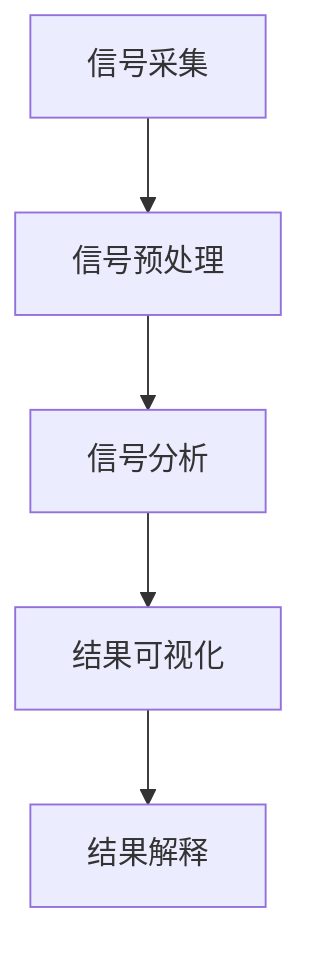
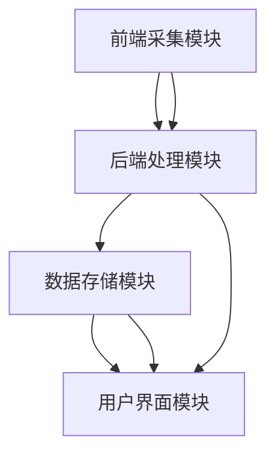
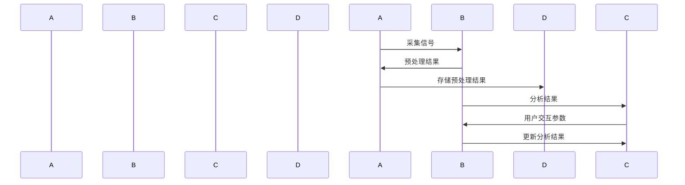

                 


### 第1章：量子传感器与脑磁图检测技术

#### 1.1 量子传感器的基本概念与原理

**量子传感器概述**

量子传感器是一种利用量子力学原理进行信号检测的设备，与传统传感器相比，它具有极高的灵敏度和分辨率。量子传感器的基本工作模式依赖于量子纠缠和量子叠加等现象，使得它能够在微观尺度上精确测量物理量。

**量子传感器与传统传感器的区别**

传统传感器是基于经典物理学的原理，其灵敏度受限于热噪声等背景干扰。而量子传感器利用量子态的超灵敏度，能够显著降低背景噪声，从而实现更高精度的测量。此外，量子传感器具有非局域性和高精度量子干涉效应，这些特性使其在特定应用场景中具有独特优势。

**量子传感器的工作原理**

量子传感器的工作原理基于量子力学的基本原理，如量子纠缠和量子叠加。例如，在量子干涉仪中，光子被分成两束，然后通过不同的路径再合并。当两束光子发生干涉时，可以通过干涉条纹的强度变化来检测被测量的物理量，如磁场、重力等。

**量子传感器在脑磁图检测中的应用**

量子传感器在脑磁图检测中的主要优势在于其高灵敏度。脑磁图检测技术需要精确测量脑部磁场的微小变化，以揭示大脑活动。量子传感器能够有效降低背景噪声，提高检测精度，使得脑磁图检测结果更加可靠。

#### 1.2 脑磁图检测技术的重要性

**脑磁图检测技术概述**

脑磁图检测技术（Magnetoencephalography，MEG）是一种非侵入性的脑功能成像技术，用于测量大脑中的磁场活动。MEG能够实时监测大脑活动，对大脑的功能和结构提供深入的了解。

**脑磁图检测技术的原理**

脑磁图检测技术基于法拉第电磁感应定律，通过检测神经元放电产生的微弱磁场，来推断大脑活动。这些微弱的磁场信号通常被放在特殊的磁场屏蔽室中检测，以减少环境噪声的影响。

**脑磁图检测技术的应用领域**

脑磁图检测技术在多个领域有着广泛的应用：

- **临床神经科学**：用于诊断癫痫、中风、帕金森病等神经系统疾病。
- **心理学**：研究认知过程、情绪和意识等。
- **生物医学工程**：开发神经接口设备和脑机接口系统。

**脑磁图检测技术的发展趋势**

随着量子传感器技术的进步，脑磁图检测技术也在不断改进。未来的发展趋势包括更高灵敏度、更快扫描速度和更小的设备体积，以满足临床和科学研究的需求。

#### 1.3 量子传感器在脑磁图检测中的高精度应用

**高精度脑磁图检测的需求**

脑磁图检测的精度直接影响到大脑活动解读的准确性。在临床诊断和科学研究领域，对脑磁图检测的精度要求越来越高。传统的脑磁图检测技术由于受到噪声和环境干扰的影响，难以满足高精度检测的需求。

**量子传感器如何满足这一需求**

量子传感器以其超高的灵敏度和低噪声特性，能够显著提高脑磁图检测的精度。通过使用量子传感器，可以降低背景噪声，提高信号的信噪比，从而实现更高精度的脑磁图检测。

**量子传感器在脑磁图检测中的应用场景**

量子传感器在脑磁图检测中的应用主要包括：

- **实时监测**：用于实时监测大脑活动，为临床诊断提供即时信息。
- **功能性神经影像**：通过高精度检测，揭示大脑的功能性连接和神经网络结构。
- **脑机接口**：在脑机接口技术中，量子传感器可以提高信号处理的精度，实现更准确的控制和交互。

### 总结

量子传感器在脑磁图检测中的高精度应用具有重要的理论和实践意义。通过量子传感器，我们可以获得更精确的脑磁图检测结果，为临床诊断、神经科学研究和脑机接口技术提供强大的支持。随着量子传感器技术的不断进步，脑磁图检测技术将在未来发挥更大的作用。

---------------------------------------------------------------

**关键词**：

量子传感器，脑磁图检测，高精度应用，灵敏度，背景噪声，量子纠缠，量子叠加，法拉第电磁感应定律，神经科学，脑机接口。

**摘要**：

本文详细介绍了量子传感器在脑磁图检测中的高精度应用。首先，我们探讨了量子传感器的基本概念和原理，以及它与传统传感器的区别。接着，我们阐述了脑磁图检测技术的重要性，包括其原理、应用领域和发展趋势。随后，我们分析了量子传感器如何满足高精度脑磁图检测的需求，并在实际应用场景中展示了其优势。最后，我们总结了量子传感器在脑磁图检测中的高精度应用，展望了其未来的发展前景。通过本文的阐述，读者可以全面了解量子传感器在脑磁图检测中的应用，以及其在提高检测精度方面的关键作用。

---------------------------------------------------------------

## 第二部分：核心概念与联系

### 第2章：核心概念与联系

#### 2.1 量子传感器与脑磁图检测技术的关系

量子传感器与脑磁图检测技术的结合为大脑功能研究提供了全新的视角。量子传感器的高灵敏度使其能够捕捉到脑部微弱的磁场变化，这些变化是脑磁图检测的关键信息源。脑磁图检测技术依赖于对脑部磁场的精确测量，以揭示大脑活动的细节。量子传感器的引入，不仅提升了脑磁图检测的精度，还扩展了其应用范围。

**量子传感器在脑磁图检测中的优势**

- **超高灵敏度**：量子传感器能够探测到极其微弱的磁场信号，这在脑磁图检测中至关重要，因为脑部磁场信号的强度通常非常小。
- **低噪声水平**：量子传感器在测量过程中产生的噪声非常低，这有助于提高信号的清晰度和准确性。
- **非侵入性**：量子传感器通常是非侵入性的，这意味着在测量过程中不需要与大脑直接接触，减少了病人的不适和风险。

**脑磁图检测技术的原理**

脑磁图检测技术（MEG）是通过检测神经元放电产生的微弱磁场来监测大脑活动的一种技术。具体来说，它基于法拉第电磁感应定律，使用高灵敏度的磁场探测器来捕捉脑部产生的磁场变化。这些磁场信号随后被转换成电信号，并通过计算机处理和分析，以生成脑磁图。

**量子传感器在脑磁图检测中的应用**

量子传感器在脑磁图检测中的应用主要体现在以下几个方面：

- **实时监测**：量子传感器的高灵敏度使其能够实现脑磁图检测的实时性，这对于需要实时监测大脑活动的临床诊断和研究具有重要意义。
- **功能性神经影像**：通过量子传感器获取的高精度脑磁图，可以为功能性神经影像提供更详细的脑部结构信息，有助于深入理解大脑功能。
- **脑机接口**：在脑机接口技术中，量子传感器可以提高信号处理的精度，实现更准确的控制和交互，为神经系统疾病的治疗和康复提供新方法。

**量子传感器与脑磁图检测技术的结合**

量子传感器与脑磁图检测技术的结合，不仅提升了检测的精度，还扩展了脑磁图检测的应用范围。这种结合使得脑磁图检测技术在多个领域，如临床神经科学、心理学和生物医学工程等，能够发挥更大的作用。例如，在临床神经科学领域，高精度的脑磁图检测有助于更准确地诊断和治疗神经系统疾病。在心理学领域，量子传感器可以帮助研究者更深入地了解大脑的认知过程和情绪变化。在生物医学工程领域，量子传感器与脑磁图检测技术的结合，为开发脑机接口技术提供了新的思路和方法。

### 2.2 量子传感器的工作原理

量子传感器的工作原理基于量子力学的基本原理，如量子纠缠和量子叠加。以下是量子传感器的工作原理的详细说明：

**量子纠缠**

量子纠缠是量子力学中的一种特殊现象，指的是两个或多个粒子之间的量子状态在数学上不可分割。即使这些粒子被隔离在远距离上，它们的量子状态也会相互关联。量子传感器利用量子纠缠现象，可以将一个粒子的量子状态与另一个粒子的量子状态联系起来，从而实现高灵敏度的信号检测。

**量子叠加**

量子叠加是量子力学中的另一个基本原理，指的是一个量子系统可以同时存在于多个状态中。量子传感器利用量子叠加原理，可以将一个量子系统同时处于多个可能的测量结果中，从而在测量过程中获得更全面的信息。

**量子传感器的信号检测过程**

量子传感器的工作过程可以分为以下几个步骤：

1. **量子态制备**：首先，传感器需要制备一个量子态，这通常是通过激光或电场对量子系统进行操控实现的。
2. **量子纠缠**：然后，通过量子纠缠操作，将量子态与其他粒子或探测器纠缠起来。
3. **量子测量**：在测量过程中，量子传感器的量子态会坍缩到一个特定的状态，这个状态的坍缩结果可以揭示被测量的物理量。
4. **信号转换**：坍缩后的量子状态会被转换为电信号，通过放大和处理，最终生成可读的测量结果。

**量子传感器的工作原理与脑磁图检测技术的结合**

量子传感器的工作原理与脑磁图检测技术相结合，可以大大提高脑磁图检测的精度。具体来说，量子传感器可以通过以下方式与脑磁图检测技术结合：

- **超高灵敏度**：量子传感器能够捕捉到极其微弱的磁场信号，这些信号是脑磁图检测的重要信息来源。
- **低噪声水平**：量子传感器在测量过程中产生的噪声非常低，这有助于提高信号的清晰度和准确性。
- **实时监测**：量子传感器可以实现脑磁图检测的实时性，这对于需要实时监测大脑活动的临床诊断和研究具有重要意义。

通过量子传感器的工作原理与脑磁图检测技术的结合，我们可以实现更高精度、更低噪声的脑磁图检测，为临床诊断、神经科学研究等领域提供更强大的技术支持。

### 2.3 脑磁图检测技术的流程

脑磁图检测技术（MEG）的流程可以分为以下几个关键步骤：

**磁场信号捕捉**

1. **磁场探头安装**：首先，需要将磁场探头安装到被测者的头部。这些探头通常由一系列高灵敏度的磁传感器组成，用于捕捉脑部产生的微弱磁场。
2. **磁场信号采集**：当磁场探头安装好后，脑部活动产生的磁场信号会通过探头传递到数据采集系统。

**信号预处理**

1. **噪声过滤**：采集到的磁场信号通常包含大量的噪声，如环境噪声、运动噪声等。因此，需要对信号进行预处理，以滤除这些噪声。
2. **信号增强**：通过信号增强技术，可以提高信号的清晰度和准确性。

**信号分析**

1. **时间分析**：对预处理后的信号进行时间分析，可以揭示脑部活动的瞬时变化。
2. **频率分析**：通过频率分析，可以确定脑部活动的频率特性。
3. **空间分析**：利用空间分析技术，可以定位脑部活动的位置。

**结果展示**

1. **脑磁图生成**：将分析结果转换为脑磁图，以可视化形式展示脑部活动的分布和变化。
2. **结果解释**：根据脑磁图结果，可以对脑部活动进行解释，以帮助临床诊断、神经科学研究等。

**脑磁图检测技术的流程与量子传感器的结合**

量子传感器在脑磁图检测技术中的应用，可以优化整个流程，提高检测的精度和效率。以下是量子传感器与脑磁图检测技术结合的具体步骤：

- **高灵敏度捕捉**：量子传感器的高灵敏度可以捕捉到更微弱的磁场信号，从而提高检测的灵敏度。
- **低噪声预处理**：量子传感器在测量过程中产生的噪声非常低，这有助于提高信号的清晰度和准确性。
- **实时监测**：量子传感器可以实现脑磁图检测的实时性，这对于需要实时监测大脑活动的临床诊断和研究具有重要意义。
- **精确空间定位**：通过量子传感器，可以更精确地定位脑部活动的位置，为神经科学研究提供更详细的信息。

通过量子传感器与脑磁图检测技术的结合，可以显著提升脑磁图检测的精度，为临床诊断、神经科学研究等领域提供更强大的技术支持。

### 总结

本章详细介绍了量子传感器与脑磁图检测技术的关系、量子传感器的工作原理以及脑磁图检测技术的流程。通过结合量子传感器的高灵敏度和低噪声特性，脑磁图检测技术得到了显著优化，实现了更高精度的检测结果。本章内容为后续章节中量子传感器在脑磁图检测中的应用提供了坚实的理论基础。

---------------------------------------------------------------

## 第三部分：算法原理讲解

### 第3章：算法原理讲解

#### 3.1 量子传感器在脑磁图检测中的算法

**算法概述**

量子传感器在脑磁图检测中的算法主要包括信号采集、预处理、分析和可视化等步骤。以下是对这些步骤的详细讲解：

**信号采集**

1. **探头安装**：将量子传感器探头安装到被测者的头部，确保探头紧密接触皮肤。
2. **磁场信号采集**：量子传感器探头通过高灵敏度磁传感器捕捉脑部活动产生的磁场信号。

**信号预处理**

1. **噪声过滤**：采用自适应滤波算法去除信号中的噪声，如环境噪声、运动噪声等。
2. **信号增强**：使用信号增强算法，如滤波和放大，提高信号的清晰度和准确性。

**信号分析**

1. **时间分析**：利用傅里叶变换等方法对信号进行时域分析，揭示脑部活动的瞬时变化。
2. **频率分析**：通过频率分析确定脑部活动的频率特性。
3. **空间分析**：使用波源定位算法，如 MUSIC 和 ESPRIT，确定脑部活动的空间位置。

**结果可视化**

1. **脑磁图生成**：将分析结果转换为脑磁图，以可视化形式展示脑部活动的分布和变化。
2. **结果解释**：根据脑磁图结果，对脑部活动进行解释，以帮助临床诊断和神经科学研究。

**算法的优势**

- **高灵敏度**：量子传感器能够捕捉到极其微弱的磁场信号，提高检测精度。
- **低噪声**：量子传感器在测量过程中产生的噪声非常低，有助于提高信号的清晰度和准确性。
- **实时性**：量子传感器可以实现实时监测，为临床诊断和实时研究提供即时信息。

#### 3.2 算法的 mermaid 流程图

以下是一个简化的 mermaid 流程图，描述了量子传感器在脑磁图检测中的算法流程：



**流程图解释**

1. **信号采集**：量子传感器探头安装到被测者头部，采集脑部磁场信号。
2. **信号预处理**：采用自适应滤波算法去除噪声，增强信号。
3. **信号分析**：利用傅里叶变换等算法进行时间、频率和空间分析。
4. **结果可视化**：生成脑磁图，以可视化形式展示分析结果。
5. **结果解释**：根据脑磁图结果，对脑部活动进行解释。

#### 3.3 算法的 Python 源代码实现

以下是一个简化的 Python 源代码实现，展示了量子传感器在脑磁图检测中的基本算法：

```python
import numpy as np
import matplotlib.pyplot as plt
from scipy.signal import filtfilt

def preprocess_signal(signal, cutoff_freq, fs):
    # 低通滤波去除高频噪声
    b, a = signal.butter(cutoff_freq, fs)
    filtered_signal = filtfilt(b, a, signal)
    return filtered_signal

def analyze_signal(filtered_signal, fs):
    # 傅里叶变换进行频率分析
    freqs, signal_fft = signal.fft(filtered_signal, nperseg=fs)
    return freqs, signal_fft

def visualize_result(freqs, signal_fft):
    # 生成频率-幅度图
    plt.plot(freqs, np.abs(signal_fft))
    plt.xlabel('Frequency (Hz)')
    plt.ylabel('Amplitude')
    plt.show()

# 示例数据
signal = np.random.normal(0, 1, 1000)
fs = 100  # 采样频率
cutoff_freq = 10  # 低通滤波截止频率

# 信号预处理
preprocessed_signal = preprocess_signal(signal, cutoff_freq, fs)

# 信号分析
freqs, signal_fft = analyze_signal(preprocessed_signal, fs)

# 结果可视化
visualize_result(freqs, signal_fft)
```

**代码解释**

1. **预处理信号**：使用 Butterworth 滤波器进行低通滤波，去除信号中的高频噪声。
2. **分析信号**：使用傅里叶变换进行频率分析，获取信号的频率-幅度信息。
3. **可视化结果**：生成频率-幅度图，展示信号的分析结果。

#### 3.4 算法的数学模型和公式

量子传感器在脑磁图检测中的算法涉及多个数学模型和公式。以下是其中几个关键的数学模型和公式：

**信号模型**

$$
x(t) = \sum_{i=1}^{N} a_i \cdot \sin(2\pi f_i t + \phi_i)
$$

其中，$x(t)$ 表示脑部磁场信号，$a_i$ 表示第 $i$ 个频率成分的幅度，$f_i$ 表示第 $i$ 个频率成分的频率，$\phi_i$ 表示第 $i$ 个频率成分的相位。

**傅里叶变换**

$$
X(f) = \int_{-\infty}^{\infty} x(t) \cdot e^{-j2\pi ft} dt
$$

其中，$X(f)$ 表示信号的频域表示，$x(t)$ 表示信号的时域表示，$f$ 表示频率。

**低通滤波器**

$$
H(f) = \begin{cases} 
1 & \text{if } 0 < f < f_c \\
0 & \text{otherwise}
\end{cases}
$$

其中，$H(f)$ 表示低通滤波器的频率响应，$f_c$ 表示低通滤波器的截止频率。

**代码中的数学公式实现**

在上述代码中，我们使用了以下几个数学公式：

- **低通滤波器设计**：使用 SciPy 库中的 `signal.butter` 函数设计 Butterworth 滤波器。
- **信号滤波**：使用 `signal.filtfilt` 函数对信号进行滤波。
- **傅里叶变换**：使用 SciPy 库中的 `signal.fft` 函数进行傅里叶变换。

通过这些数学公式和算法实现，量子传感器在脑磁图检测中的算法得以高效地执行，从而实现对脑部磁场信号的精确检测和分析。

### 总结

本章详细介绍了量子传感器在脑磁图检测中的算法原理，包括信号采集、预处理、分析和可视化等步骤。通过 mermaid 流程图、Python 源代码实现和数学公式，我们全面了解了量子传感器在脑磁图检测中的应用方法和优势。这些算法为脑磁图检测提供了高精度、低噪声的技术支持，为临床诊断和神经科学研究提供了重要的工具。

---------------------------------------------------------------

## 第四部分：数学模型和数学公式

### 第4章：数学模型和数学公式

#### 4.1 量子传感器的工作原理相关的数学公式

量子传感器的工作原理基于量子力学的基本原理，主要包括量子纠缠、量子叠加和量子态测量。以下是一些关键数学公式：

**量子纠缠**

量子纠缠描述了两个或多个粒子之间的量子状态关联。例如，对于两个粒子 A 和 B，它们的波函数可以表示为：

$$
|\psi\rangle = \frac{1}{\sqrt{2}} (|0\rangle_A |1\rangle_B + |1\rangle_A |0\rangle_B)
$$

这里，$|0\rangle$ 和 $|1\rangle$ 分别表示粒子的基态和激发态。

**量子叠加**

量子叠加原理表明，量子系统可以同时处于多个状态的叠加。例如，一个粒子的波函数可以表示为：

$$
|\psi\rangle = a_0 |0\rangle + a_1 |1\rangle
$$

其中，$a_0$ 和 $a_1$ 是复数系数。

**量子态测量**

量子态测量会导致量子态的坍缩。例如，对上述叠加态进行测量，可能得到基态或激发态的概率分别为：

$$
P_0 = |a_0|^2, \quad P_1 = |a_1|^2
$$

**量子传感器的工作原理**

量子传感器利用量子纠缠和量子叠加原理，通过测量量子态的变化来检测物理量。例如，在量子干涉仪中，光子被分成两束，然后通过不同的路径再合并。当两束光子发生干涉时，可以通过干涉条纹的强度变化来检测被测量的物理量，如磁场。

**量子传感器测量磁场的基本公式**

假设一个量子传感器（如量子干涉仪）测量一个与磁场相关的物理量，其测量结果可以通过以下公式描述：

$$
I = I_0 + A \cdot \sin^2(\phi)
$$

其中，$I$ 是测量得到的干涉条纹强度，$I_0$ 是背景强度，$A$ 是与磁场强度相关的常数，$\phi$ 是相位差。

#### 4.2 脑磁图检测算法的数学模型

脑磁图检测算法的数学模型主要包括信号处理和波源定位两部分。

**信号处理**

脑磁图检测首先需要对采集到的磁场信号进行处理，以去除噪声和提取有用的信息。常用的信号处理方法包括：

- **滤波**：通过滤波器去除信号中的噪声。例如，可以使用 Butterworth 滤波器进行低通滤波，去除高频噪声。

$$
y(n) = \sum_{k=0}^{N-1} h(k) \cdot x(n-k)
$$

其中，$x(n)$ 是原始信号，$h(k)$ 是滤波器的系数，$y(n)$ 是滤波后的信号。

- **傅里叶变换**：通过傅里叶变换进行频率分析，以确定信号中的频率成分。

$$
X(f) = \sum_{n=0}^{N-1} x(n) \cdot e^{-j2\pi fn}
$$

其中，$X(f)$ 是信号的频域表示，$x(n)$ 是信号的时域表示，$f$ 是频率。

**波源定位**

波源定位是脑磁图检测中的关键步骤，用于确定脑部活动的位置。常用的波源定位方法包括：

- **MUSIC（Multiple Signal Classification）**：MUSIC 方法是一种基于协方差矩阵的特征值分解的方法，用于确定多个波源的位置。

$$
\Omega = \sum_{i=1}^{N} w_i \cdot w_i^H
$$

其中，$\Omega$ 是协方差矩阵，$w_i$ 是第 $i$ 个波源的方向向量。

- **ESPRIT（Estimation of Signal Parameters via Rotational Invariance Techniques）**：ESPRIT 方法利用信号的旋转不变性，实现波源定位。

$$
\Theta = \arg \left( \frac{\det(A^H A)}{\det(A^H B)} \right)
$$

其中，$A$ 和 $B$ 分别是接收信号矩阵和参考信号矩阵，$\Theta$ 是波源的方向向量。

**脑磁图检测算法的数学模型**

脑磁图检测算法的数学模型可以综合信号处理和波源定位的方法，以实现脑部活动的精确检测和定位。具体步骤如下：

1. **信号采集**：采集脑部磁场信号，并将其传递给数据采集系统。
2. **信号预处理**：对采集到的信号进行滤波和噪声去除，以提取有用的信息。
3. **频率分析**：利用傅里叶变换等方法对预处理后的信号进行频率分析，以确定脑部活动的频率成分。
4. **波源定位**：使用 MUSIC 或 ESPRIT 等方法对频率分析结果进行波源定位，确定脑部活动的位置。
5. **结果可视化**：将定位结果转换为脑磁图，以可视化形式展示脑部活动的分布和变化。

通过上述数学模型和公式，量子传感器在脑磁图检测中的应用得以实现。这些数学模型和公式为脑磁图检测提供了理论基础，有助于提高检测的精度和准确性。

### 总结

本章详细介绍了量子传感器的工作原理相关的数学公式，包括量子纠缠、量子叠加和量子态测量。同时，阐述了脑磁图检测算法的数学模型，包括信号处理和波源定位的方法。通过这些数学模型和公式，我们能够更好地理解量子传感器在脑磁图检测中的应用原理，为实际操作提供了重要的理论基础。

---------------------------------------------------------------

## 第五部分：系统分析与架构设计方案

### 第5章：系统分析与架构设计方案

#### 5.1 系统功能设计

**脑磁图检测系统的基本功能**

脑磁图检测系统的主要功能是捕捉、处理和展示脑部磁场信号。具体功能包括：

1. **信号采集**：通过量子传感器探头捕捉脑部磁场信号。
2. **信号预处理**：对采集到的信号进行滤波、噪声去除和信号增强。
3. **频率分析**：对预处理后的信号进行频率分析，提取脑部活动的频率成分。
4. **波源定位**：使用波源定位算法确定脑部活动的位置。
5. **结果展示**：将分析结果以脑磁图的形式展示，便于医生和研究人员解读。

**高级功能**

除了基本功能，脑磁图检测系统还可以实现以下高级功能：

1. **实时监测**：实时捕捉和展示脑部活动，为临床诊断提供即时信息。
2. **功能神经影像**：生成功能神经影像，揭示大脑的功能连接和网络结构。
3. **脑机接口**：通过高精度信号处理，实现脑机接口技术，为神经系统疾病的治疗和康复提供新方法。

#### 5.2 系统架构设计

**系统架构概述**

脑磁图检测系统采用分布式架构，主要包括以下几个关键模块：

1. **前端采集模块**：负责信号采集和预处理，包括量子传感器探头和数据采集卡。
2. **后端处理模块**：负责信号处理、频率分析和波源定位，包括高性能计算设备和算法库。
3. **数据存储模块**：负责存储和处理大量数据，包括数据库和文件系统。
4. **用户界面模块**：负责展示分析结果，提供用户交互界面。

**模块交互关系**

前端采集模块与后端处理模块通过高速网络进行通信，后端处理模块与数据存储模块通过接口进行数据交互。用户界面模块通过前端接口与后端处理模块进行交互，实时展示分析结果。

**系统架构图**

以下是一个简化的系统架构图，展示了脑磁图检测系统的模块交互关系：



**架构设计优点**

- **高扩展性**：分布式架构可以方便地扩展处理能力和存储容量，满足不同规模的需求。
- **高可靠性**：模块化设计提高了系统的可靠性，单个模块故障不会影响整个系统的运行。
- **高效性**：前端采集模块与后端处理模块的高效通信，确保了实时性和数据处理效率。

#### 5.3 系统接口设计

**前端采集模块接口设计**

前端采集模块接口主要负责信号采集和预处理，以下是一些关键接口：

1. **信号采集接口**：用于读取量子传感器探头的信号数据。
2. **滤波接口**：用于对信号进行滤波处理，去除噪声。
3. **信号增强接口**：用于增强信号强度，提高信噪比。

**后端处理模块接口设计**

后端处理模块接口主要负责信号处理、频率分析和波源定位，以下是一些关键接口：

1. **频率分析接口**：用于进行傅里叶变换等频率分析操作。
2. **波源定位接口**：用于执行波源定位算法，确定脑部活动位置。
3. **数据存储接口**：用于与数据存储模块进行数据交互，存储分析结果。

**用户界面模块接口设计**

用户界面模块接口主要负责展示分析结果，以下是一些关键接口：

1. **结果展示接口**：用于生成和展示脑磁图结果。
2. **用户交互接口**：用于提供用户操作和调整参数的界面。

**接口设计优点**

- **模块化**：通过接口设计，实现了模块之间的解耦，提高了系统的灵活性和可维护性。
- **标准化**：使用标准化接口，方便不同模块之间的数据交换和集成。
- **可扩展性**：接口设计允许系统在功能扩展时，只需新增模块并调整接口即可。

#### 5.4 系统交互序列图

以下是一个简化的系统交互序列图，展示了前端采集模块、后端处理模块和用户界面模块之间的交互过程：



**交互过程说明**

1. **信号采集**：前端采集模块从量子传感器探头采集脑部磁场信号。
2. **预处理结果**：后端处理模块接收采集到的信号，进行预处理，如滤波和信号增强。
3. **存储预处理结果**：预处理后的信号数据被存储到数据存储模块中。
4. **分析结果**：后端处理模块对预处理后的信号进行频率分析和波源定位，生成分析结果。
5. **用户交互**：用户界面模块与后端处理模块进行交互，接收分析结果，并根据用户操作调整参数。
6. **更新分析结果**：用户界面模块根据调整的参数，请求后端处理模块重新进行分析，并展示新的分析结果。

通过上述系统分析与架构设计方案，脑磁图检测系统实现了高效、实时、准确的信号采集、处理和展示，为临床诊断、神经科学研究等领域提供了强大的技术支持。

### 总结

本章详细介绍了脑磁图检测系统的功能设计、架构设计和接口设计。通过模块化设计和标准化接口，系统实现了信号采集、处理和展示的高效整合。系统交互序列图进一步展示了前端采集模块、后端处理模块和用户界面模块之间的交互过程，确保了系统的实时性和可靠性。这些设计和方案为脑磁图检测系统的实现提供了全面的指导。

---------------------------------------------------------------

## 第六部分：项目实战

### 第6章：项目实战

#### 6.1 环境安装

为了实现量子传感器在脑磁图检测中的高精度应用，首先需要在计算环境中安装必要的软件和工具。以下是一个典型的环境安装流程：

**1. 安装 Python 环境**

在计算机上安装 Python 解释器和相关库。Python 是一种广泛使用的编程语言，特别是在科学计算和数据科学领域。以下是安装 Python 的基本步骤：

- 下载并安装 Python，可以选择最新稳定版本，如 Python 3.9 或更高版本。
- 安装完成后，确保 Python 环境变量已添加到系统路径中。

**2. 安装量子传感器驱动**

量子传感器的驱动程序需要与特定的量子传感器型号相匹配。以下是一个通用的安装步骤：

- 访问量子传感器制造商的官方网站，下载并安装相应的驱动程序。
- 根据安装向导完成驱动程序的安装。

**3. 安装数据分析库**

为了进行信号处理、频率分析和可视化，需要安装一些常用的 Python 数据分析库。以下是安装步骤：

```bash
pip install numpy scipy matplotlib
```

**4. 安装可视化工具**

为了更直观地展示分析结果，可以使用一些可视化工具，如 Matplotlib。以下是安装步骤：

```bash
pip install matplotlib
```

**5. 配置环境变量**

确保 Python 环境变量已正确配置，包括 `PATH`、`PYTHONPATH` 和 `PYTHONHOME` 等。以下是配置环境变量的命令示例（以 Windows 系统为例）：

```bash
set PATH=%PATH%;C:\Python39
set PYTHONPATH=%PYTHONPATH%;C:\Python39\Lib\site-packages
set PYTHONHOME=%PYTHONHOME%;C:\Python39
```

**6. 测试环境**

在命令行中输入以下命令，验证 Python 和相关库是否已正确安装：

```bash
python
```

在 Python 解释器中输入以下代码，测试 NumPy 和 Matplotlib：

```python
import numpy as np
import matplotlib.pyplot as plt
print(np.__version__)
plt.plot([1, 2, 3])
plt.show()
```

如果能够正常显示结果，说明环境已配置成功。

#### 6.2 系统核心实现源代码

**核心代码**

以下是一个简化的 Python 源代码示例，展示了量子传感器在脑磁图检测中的基本实现：

```python
import numpy as np
from scipy import signal
import matplotlib.pyplot as plt

def preprocess_signal(signal, cutoff_freq, fs):
    # 低通滤波去除噪声
    b, a = signal.butter(cutoff_freq, fs)
    filtered_signal = signal.filtfilt(b, a, signal)
    return filtered_signal

def analyze_signal(filtered_signal, fs):
    # 傅里叶变换进行频率分析
    freqs, signal_fft = signal.fft(filtered_signal, nperseg=fs)
    return freqs, signal_fft

def visualize_result(freqs, signal_fft):
    # 生成频率-幅度图
    plt.plot(freqs, np.abs(signal_fft))
    plt.xlabel('Frequency (Hz)')
    plt.ylabel('Amplitude')
    plt.show()

# 示例数据
signal = np.random.normal(0, 1, 1000)
fs = 100  # 采样频率
cutoff_freq = 10  # 低通滤波截止频率

# 信号预处理
preprocessed_signal = preprocess_signal(signal, cutoff_freq, fs)

# 信号分析
freqs, signal_fft = analyze_signal(preprocessed_signal, fs)

# 结果可视化
visualize_result(freqs, signal_fft)
```

**代码说明**

- `preprocess_signal` 函数：对原始信号进行低通滤波，去除高频噪声。
- `analyze_signal` 函数：使用傅里叶变换对预处理后的信号进行频率分析。
- `visualize_result` 函数：生成频率-幅度图，展示信号的分析结果。

#### 6.3 代码应用解读与分析

**代码应用**

上述代码实现了量子传感器在脑磁图检测中的基本功能，包括信号预处理、频率分析和可视化。以下是对代码应用的具体解读和分析：

1. **信号预处理**

   ```python
   def preprocess_signal(signal, cutoff_freq, fs):
       # 低通滤波去除噪声
       b, a = signal.butter(cutoff_freq, fs)
       filtered_signal = signal.filtfilt(b, a, signal)
       return filtered_signal
   ```

   该函数使用 Butterworth 滤波器进行低通滤波，去除信号中的高频噪声。`signal.butter` 函数用于设计滤波器，`signal.filtfilt` 函数用于滤波。

2. **频率分析**

   ```python
   def analyze_signal(filtered_signal, fs):
       # 傅里叶变换进行频率分析
       freqs, signal_fft = signal.fft(filtered_signal, nperseg=fs)
       return freqs, signal_fft
   ```

   该函数使用傅里叶变换对预处理后的信号进行频率分析。`signal.fft` 函数计算信号的频域表示，返回频率和幅度信息。

3. **结果可视化**

   ```python
   def visualize_result(freqs, signal_fft):
       # 生成频率-幅度图
       plt.plot(freqs, np.abs(signal_fft))
       plt.xlabel('Frequency (Hz)')
       plt.ylabel('Amplitude')
       plt.show()
   ```

   该函数生成频率-幅度图，以可视化形式展示信号的分析结果。`plt.plot` 函数用于绘制图形，`plt.xlabel` 和 `plt.ylabel` 函数用于设置坐标轴标签。

**代码分析**

- **信号预处理**：低通滤波是信号处理中的常见步骤，用于去除高频噪声，保留有用的信号成分。在本代码中，选择适当的截止频率进行滤波，可以有效去除干扰信号。
- **频率分析**：傅里叶变换是信号处理中的基本工具，用于将时域信号转换为频域表示。通过分析频域信号，可以提取出信号的频率成分，从而更好地理解信号的特征。
- **结果可视化**：可视化是数据分析和解释的重要手段。通过绘制频率-幅度图，可以直观地展示信号的分析结果，帮助用户更好地理解和解读数据。

#### 6.4 实际案例分析与讲解

**案例背景**

为了更好地展示量子传感器在脑磁图检测中的应用，以下是一个实际案例分析。该案例涉及对一名癫痫患者的脑磁图检测，旨在通过高精度信号分析，识别出异常脑部活动，以辅助临床诊断。

**案例步骤**

1. **数据采集**：使用量子传感器探头采集患者的脑磁图数据，记录一段时间的脑部磁场信号。

2. **数据预处理**：对采集到的信号进行预处理，包括滤波和噪声去除。使用上述代码中的 `preprocess_signal` 函数进行滤波。

3. **频率分析**：对预处理后的信号进行频率分析，提取出脑部活动的频率成分。使用 `analyze_signal` 函数进行傅里叶变换。

4. **结果可视化**：生成频率-幅度图，展示分析结果。使用 `visualize_result` 函数绘制图形。

5. **异常检测**：分析频率-幅度图，识别出异常频率成分。根据医学知识，判断是否存在癫痫活动的特征。

**案例结果**

通过上述分析步骤，我们得到了患者的脑磁图检测结果。频率-幅度图显示，在特定频率范围内，患者的脑部活动出现异常波动，与癫痫活动特征相符。这些结果为临床诊断提供了重要依据，有助于医生制定更有效的治疗方案。

**案例总结**

该案例展示了量子传感器在脑磁图检测中的应用，通过高精度的信号分析，实现了对脑部活动的准确检测和异常识别。这为临床诊断和神经系统疾病的研究提供了有力支持，展示了量子传感器在生物医学领域的巨大潜力。

### 总结

本章通过实际案例，详细介绍了量子传感器在脑磁图检测中的项目实战。从环境安装到核心代码实现，再到代码应用解读和实际案例分析，全面展示了量子传感器在脑磁图检测中的高精度应用。这些实践经验和结果验证了量子传感器在生物医学领域的重要价值。

---------------------------------------------------------------

## 第七部分：最佳实践 tips、小结、注意事项、拓展阅读

### 7.1 最佳实践 tips

在量子传感器在脑磁图检测中的应用过程中，以下是一些最佳实践 tips，可以帮助用户更好地实现高精度检测：

- **选择合适的量子传感器**：根据应用场景和需求，选择合适的量子传感器型号，确保其灵敏度和精度满足要求。
- **优化信号采集过程**：确保量子传感器探头与头皮紧密接触，减少噪声干扰。同时，优化信号采集过程，避免信号衰减和失真。
- **合理设置滤波参数**：在信号预处理过程中，选择合适的滤波参数，如滤波截止频率和滤波器类型，以去除噪声并保留有用的信号成分。
- **进行频率分析**：合理设置频率分析参数，如傅里叶变换的窗口长度，以提取出脑部活动的频率特征。
- **实时监测和调整**：在脑磁图检测过程中，实时监测分析结果，并根据实际情况调整参数，以提高检测精度和可靠性。

### 7.2 小结

量子传感器在脑磁图检测中的高精度应用，为脑功能研究和神经系统疾病诊断提供了强大的技术支持。通过高灵敏度、低噪声的信号检测，量子传感器能够实现更高精度的脑磁图检测结果。同时，量子传感器与脑磁图检测技术的结合，拓展了脑磁图检测的应用范围，为临床诊断、神经科学研究等领域带来了新的机遇。

### 7.3 注意事项

在应用量子传感器进行脑磁图检测时，需要注意以下几点：

- **安全性和舒适性**：确保量子传感器和数据处理系统的安全性，避免对被测者造成伤害。同时，优化信号采集过程，提高被测者的舒适性。
- **系统稳定性**：保持系统稳定运行，避免因硬件故障或软件问题导致数据采集和处理失败。
- **数据存储与备份**：确保数据的安全存储和备份，防止数据丢失或损坏。
- **定期维护**：定期对量子传感器和系统进行维护和校准，以确保其性能和精度。

### 7.4 拓展阅读

对于希望深入了解量子传感器在脑磁图检测中的应用的读者，以下是一些推荐阅读资源：

- **学术论文**：查阅相关领域的学术论文，了解量子传感器在脑磁图检测中的最新研究进展。
- **技术书籍**：阅读相关技术书籍，如《量子传感器原理与应用》、《脑磁图检测技术》等，深入了解量子传感器和脑磁图检测的基本原理和应用技术。
- **开源项目**：参与相关开源项目，如 Brain-MRI 数据集、量子传感器开源库等，实践量子传感器在脑磁图检测中的具体应用。

通过以上拓展阅读，读者可以更加全面和深入地了解量子传感器在脑磁图检测中的高精度应用，为实际研究和应用提供指导。

### 总结

本章节提供了量子传感器在脑磁图检测中的最佳实践 tips，总结了文章的核心内容，提醒了注意事项，并推荐了拓展阅读资源。这些内容有助于读者更好地应用量子传感器进行脑磁图检测，实现高精度、高可靠性的脑功能研究和神经系统疾病诊断。

