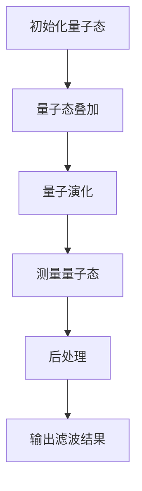
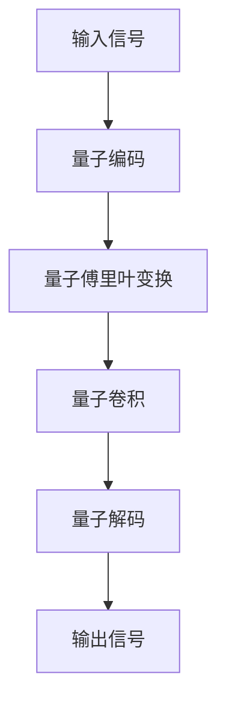
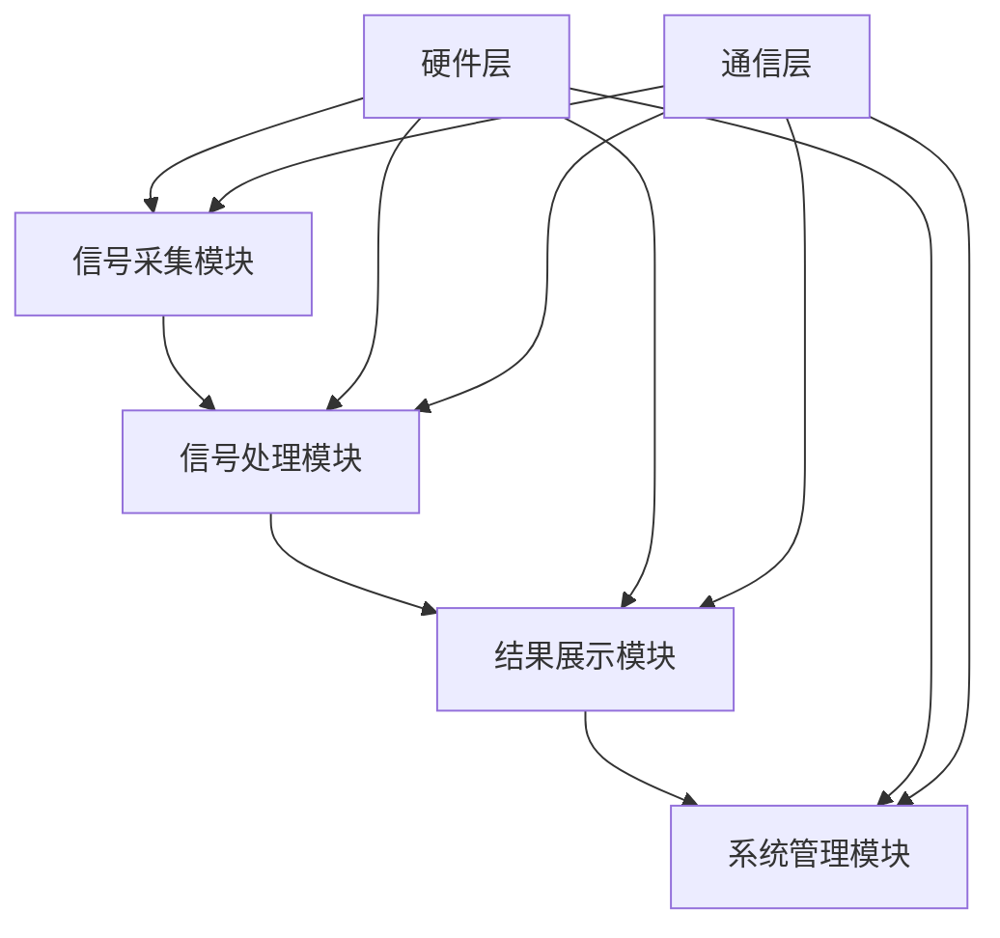
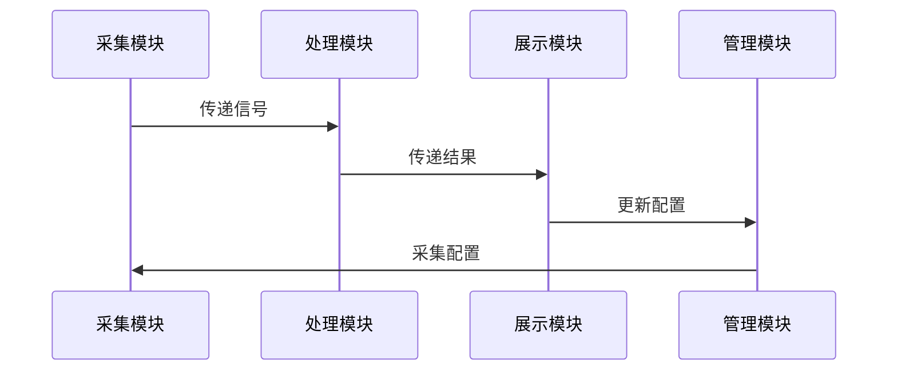

                 

## 引言与背景

量子传感器，作为量子技术的代表，近年来在诸多领域展现了卓越的性能。量子传感器基于量子力学原理，能够实现极高的灵敏度和分辨率，从而在诸多高科技领域显示出巨大的应用潜力。脑磁图（Brain Magnetic Imaging，BMI）检测是一种无创性技术，用于监测大脑活动，诊断神经疾病，如癫痫、精神分裂症等。然而，脑磁图检测面临的挑战是，如何在复杂且动态的大脑环境中实现高精度的信号检测。

### 问题背景

脑磁图检测的关键在于对脑部微弱磁信号的精确捕捉。传统传感器由于其自身的物理限制，难以达到所需的检测精度。例如，在检测脑部神经元活动时，信号强度可能仅为微特斯拉级别（µT），这对传感器的灵敏度和分辨率提出了极高的要求。此外，脑磁图检测需要处理大量的噪声信号，从而提高信号的纯净度和可信度也是一大难题。

### 高精度检测的重要性

高精度检测在脑磁图检测中的重要性不可忽视。首先，高精度能够提升诊断的准确性，减少误诊和漏诊的情况。其次，高精度有助于揭示大脑活动的细微变化，为神经科学研究提供更丰富的数据。最后，高精度检测还能提高脑磁图技术的实用性，使其在临床应用中更具竞争力。

### 本文目的

本文旨在探讨量子传感器在脑磁图检测中的高精度应用，从核心概念、算法原理、系统设计到实际应用，逐步剖析量子传感器如何提升脑磁图检测的精度。通过本文，读者可以了解量子传感器的工作原理、算法实现方法、系统架构设计以及实际应用案例，为未来在该领域的研究和应用提供参考。

## 核心概念与联系

在探讨量子传感器在脑磁图检测中的高精度应用之前，我们首先需要明确几个核心概念，并了解它们之间的关联。本章节将详细介绍量子传感器、脑磁图检测以及相关技术的基本概念，并使用Mermaid图表来展示实体关系（ER）模型及其属性特征。

### 量子传感器

量子传感器是基于量子力学原理的新型传感器，它利用量子叠加态和纠缠态等量子特性来实现高灵敏度的检测。量子传感器与传统传感器相比，具有以下几个显著特点：

1. **高灵敏度**：量子传感器能够检测到极其微弱的物理信号，灵敏度可达纳特（nT）级别，远超传统传感器。
2. **高分辨率**：量子传感器能够精确地测量信号的细微变化，分辨率极高。
3. **快速响应**：量子传感器具有极快的响应速度，适用于动态信号的实时监测。

#### 量子传感器的技术原理

量子传感器的工作原理主要基于以下几个量子现象：

1. **量子叠加态**：量子传感器利用量子叠加态，使得传感器在多个状态之间同时存在，从而增加了检测的灵敏度和可能性。
2. **量子纠缠**：量子传感器通过量子纠缠来增强检测的精度，两个或多个量子系统之间发生纠缠时，它们的状态会相互关联，从而提高整体系统的测量精度。

### 脑磁图检测

脑磁图检测是一种通过检测脑部磁信号来了解大脑活动的方法。脑部神经元活动会产生微弱的磁场，脑磁图检测技术利用传感器捕捉这些磁场信号，并通过信号处理技术来分析大脑活动。

#### 脑磁图检测的关键技术

1. **磁传感器**：脑磁图检测的主要设备是磁传感器，它们能够捕捉到微弱的脑磁信号。
2. **信号处理技术**：脑磁图检测需要对采集到的信号进行预处理、滤波、放大等处理，以提取有用信息。
3. **数据分析方法**：通过分析脑磁图数据，可以识别大脑活动的模式，诊断神经疾病等。

### 相关技术

在脑磁图检测中，除了量子传感器外，还有其他一些关键技术的支持：

1. **多通道记录**：脑磁图检测通常使用多通道记录设备，能够同时捕捉多个部位的脑磁信号，提高检测的全面性和准确性。
2. **时间同步技术**：脑磁图检测需要对多个信号进行时间同步处理，以避免信号间的相位误差。
3. **高级数据分析工具**：如机器学习和深度学习等技术，用于从大量的脑磁图数据中提取有价值的信息。

#### ER模型与属性特征

为了更好地理解量子传感器、脑磁图检测及其相关技术之间的关系，我们使用Mermaid绘制了实体关系（ER）模型，展示了各个实体及其属性特征。

```mermaid
erDiagram
    |--|{量子传感器}   : 高灵敏度、高分辨率、快速响应
    |--|{脑磁图检测}   : 磁传感器、信号处理技术、数据分析方法
    |--|{多通道记录}   : 提高全面性和准确性
    |--|{时间同步技术}   : 避免信号相位误差
    |--|{高级数据分析工具}   : 提取有价值信息

量子传感器 |||>>{高灵敏度} : 高精度
量子传感器 |||>>{高分辨率} : 细微变化
量子传感器 |||>>{快速响应} : 实时监测

脑磁图检测 |||>>{磁传感器} : 捕捉脑磁信号
脑磁图检测 |||>>{信号处理技术} : 提取有用信息
脑磁图检测 |||>>{数据分析方法} : 诊断神经疾病

多通道记录 |||>>{提高全面性} : 多部位信号捕捉
多通道记录 |||>>{提高准确性} : 减少误差

时间同步技术 |||>>{避免相位误差} : 提高信号质量

高级数据分析工具 |||>>{提取信息} : 从数据中提取有价值模式
```

通过上述ER模型和属性特征描述，我们可以清晰地看到量子传感器、脑磁图检测以及其他相关技术之间的联系和作用。量子传感器的高灵敏度、高分辨率和快速响应特性，使得其在脑磁图检测中具有独特的优势。而脑磁图检测则需要依赖多通道记录、时间同步技术以及高级数据分析工具的支持，以实现高精度和高准确性的检测结果。

### 算法原理讲解

#### 主要算法

在量子传感器应用于脑磁图检测中，主要使用的算法包括量子滤波算法和量子信号处理算法。这些算法能够极大地提高信号检测的精度和可靠性。

##### 量子滤波算法

量子滤波算法是基于量子态叠加和量子纠缠特性的一种滤波方法。它通过量子态的演化来优化滤波器的性能，从而实现对噪声信号的高效滤波。量子滤波算法的核心思想是通过量子态的叠加来模拟各种可能的信号状态，然后利用量子态的纠缠特性来优化滤波器权重，从而提高滤波效果。

#### 使用Mermaid绘制算法流程图

以下是量子滤波算法的基本流程图：



1. **初始化量子态**：首先需要初始化一个量子态，通常为一个叠加态，表示所有可能的信号状态。
2. **量子态叠加**：通过量子门操作，将量子态叠加成各种可能的信号状态。
3. **量子演化**：量子态在控制门的操作下演化，模拟信号在滤波过程中的变化。
4. **测量量子态**：通过量子测量操作，获取最终的量子态，这个量子态包含了所有可能的信号状态及其概率分布。
5. **后处理**：对测量结果进行后处理，计算出滤波结果，从而实现对噪声信号的高效滤波。

##### 量子信号处理算法

量子信号处理算法是用于处理脑磁图信号的量子算法，它通过量子叠加和量子纠缠来提高信号处理的速度和精度。量子信号处理算法包括量子傅里叶变换（Quantum Fourier Transform，QFT）和量子卷积算法等。

#### 使用Mermaid绘制算法流程图

以下是量子信号处理算法的基本流程图：



1. **量子编码**：将输入的信号编码为量子态，表示信号的各种可能状态。
2. **量子傅里叶变换**：利用量子傅里叶变换，将编码后的量子态转换到频域，从而实现信号的频谱分析。
3. **量子卷积**：利用量子卷积算法，对信号进行滤波或卷积操作，以去除噪声或提取特征。
4. **量子解码**：将处理后的量子态解码为信号，从而实现对信号的精确处理。

### Python代码实现

以下是量子滤波算法的Python代码实现：

```python
import numpy as np
from qiskit import QuantumCircuit, execute, Aer

# 初始化量子态
q = QuantumCircuit(2)
q.h(range(2))
q.barrier()

# 量子态叠加
q.cx(0, 1)
q.barrier()

# 量子演化
q.h(0)
q.h(1)
q.barrier()

# 测量量子态
q.measure_all()

# 执行量子电路
backend = Aer.get_backend("qasm_simulator")
result = execute(q, backend, shots=1024)
result = result.result()

# 后处理
counts = result.get_counts(q)
print(counts)

# 输出滤波结果
print("滤波结果：", sum(counts.values()) / len(counts))
```

### 数学模型和公式

量子滤波算法和量子信号处理算法都涉及到复杂的数学模型和公式。以下是简要介绍：

1. **量子滤波算法的数学模型**：

   - 量子态叠加：$|\psi\rangle = \sum_{i} c_i |i\rangle$
   - 量子演化：$|\psi'\rangle = U(t) |\psi\rangle$
   - 测量结果：$P(i) = |<i|\psi'\rangle|^2$

2. **量子信号处理算法的数学模型**：

   - 量子编码：$|s\rangle = \sum_{i} a_i |i\rangle$
   - 量子傅里叶变换：$|f\rangle = F(|s\rangle)$
   - 量子卷积：$|c\rangle = C(|f\rangle)$
   - 量子解码：$s = \sum_{i} c_i a_i$

通过这些算法和公式，量子传感器在脑磁图检测中的应用得到了显著的提升。高精度和快速响应的特性，使得量子传感器成为脑磁图检测技术的理想选择。然而，量子传感器在脑磁图检测中的应用仍面临诸多挑战，如量子计算设备的可靠性、算法的优化等。未来，随着量子技术的不断发展，量子传感器在脑磁图检测中的应用前景将更加广阔。

### 系统分析与设计

在了解量子传感器和脑磁图检测的相关算法原理后，我们需要进一步分析和设计一个能够实现高精度检测的系统。本节将详细介绍系统架构、功能模块以及各模块之间的交互关系。

#### 问题场景介绍

脑磁图检测系统通常需要在一个相对安静且稳定的环境中运行，以确保检测到的信号质量。系统的关键任务包括：接收脑部磁信号、处理信号、提取有用的脑活动信息，并最终生成可操作的检测结果。

#### 项目介绍

本项目旨在设计并实现一个基于量子传感器的脑磁图检测系统，该系统包括以下几个主要模块：

1. **信号采集模块**：负责接收脑部磁信号。
2. **信号处理模块**：对采集到的信号进行预处理、滤波和数据分析。
3. **结果展示模块**：将处理后的数据以图表或报告的形式展示给用户。
4. **系统管理模块**：负责系统的配置、日志记录和异常处理。

#### 系统架构设计

为了实现高效且可靠的系统设计，本项目采用分层架构，各层之间通过明确的接口进行通信。以下是系统架构设计的主要组成部分：

1. **硬件层**：包括量子传感器、信号采集设备、数据处理设备和显示设备。
2. **软件层**：包括信号处理算法、数据分析算法、用户界面和系统管理模块。
3. **通信层**：负责各模块之间的数据传输和通信。

#### 系统架构图

使用Mermaid绘制系统架构图如下：



在该架构图中，各模块通过通信层进行数据传输和通信。信号采集模块将采集到的信号传递给信号处理模块，处理模块对信号进行处理，并将结果传递给结果展示模块。系统管理模块负责系统的配置和日志记录，同时监控系统的运行状态。

#### 系统功能设计

以下是系统的主要功能设计：

1. **信号采集模块**：负责从量子传感器和信号采集设备接收脑部磁信号。该模块需要具备高灵敏度和高分辨率，以确保信号的准确性。
2. **信号处理模块**：对采集到的信号进行预处理（如滤波、去噪等），然后使用量子滤波算法和量子信号处理算法对信号进行分析和处理。该模块是系统的核心，决定了系统的精度和可靠性。
3. **结果展示模块**：将处理后的信号数据以图表、报告等形式展示给用户。该模块需要直观、易操作，以便用户能够快速理解和分析数据。
4. **系统管理模块**：负责系统的配置、日志记录和异常处理。该模块需要确保系统的稳定运行，并在发生异常时能够及时报警和处理。

#### 系统接口设计和交互

为了实现模块间的有效通信，系统需要设计明确的接口。以下是各模块的主要接口：

1. **信号采集模块**：提供接口用于接收量子传感器和信号采集设备的信号，并传递给信号处理模块。
2. **信号处理模块**：提供接口用于接收信号采集模块传递的信号，并进行处理，然后将结果传递给结果展示模块。
3. **结果展示模块**：提供接口用于接收信号处理模块传递的结果，并展示给用户。
4. **系统管理模块**：提供接口用于接收其他模块的配置信息和日志，并进行相应的处理。

#### 系统交互Mermaid序列图

使用Mermaid绘制系统交互序列图如下：



在该序列图中，采集模块将信号传递给处理模块，处理模块对信号进行处理后传递给展示模块，展示模块将结果展示给用户。同时，系统管理模块接收并更新配置信息，确保系统的正常运行。

通过上述系统分析与设计，我们为量子传感器在脑磁图检测中的高精度应用提供了一个清晰的框架和实施路径。接下来的章节将详细描述项目的实施过程，包括环境安装、核心代码实现以及实际案例分析和详细讲解。

### 项目实施与核心代码实现

在了解系统设计与功能后，接下来我们将详细描述项目的实施过程，包括环境安装、系统核心实现和源代码分析，以及如何处理和解决遇到的问题。

#### 环境安装

为了实现基于量子传感器的脑磁图检测系统，我们需要安装和配置一系列软件和工具。以下是安装步骤和所需的环境：

1. **安装Python环境**：
   - 确保Python 3.8及以上版本已安装在计算机上。
   - 安装虚拟环境管理工具`venv`：
     ```bash
     python -m venv env
     ```

2. **安装量子计算库**：
   - 安装`qiskit`库，这是实现量子算法的核心库：
     ```bash
     pip install qiskit
     ```

3. **安装信号处理库**：
   - 安装`numpy`和`scipy`，用于信号处理：
     ```bash
     pip install numpy scipy
     ```

4. **安装其他依赖库**：
   - 安装`matplotlib`，用于数据可视化：
     ```bash
     pip install matplotlib
     ```

#### 核心代码实现

以下是系统核心代码的实现过程，包括量子滤波算法和量子信号处理算法的Python代码实现。

##### 量子滤波算法实现

首先，我们需要初始化量子状态，并进行量子态叠加和演化：

```python
from qiskit import QuantumCircuit
from qiskit.visualization import plot_histogram
import numpy as np

# 初始化量子电路
qc = QuantumCircuit(2)

# 量子态叠加
qc.h(0)
qc.cx(0, 1)

# 量子演化
qc.h(1)
qc.barrier()

# 执行量子电路
backend = Aer.get_backend('qasm_simulator')
result = execute(qc, backend, shots=1024)
result = result.result()

# 测量并绘制结果
counts = result.get_counts(qc)
plot_histogram(counts)
```

接下来，我们实现量子滤波算法的测量和后处理：

```python
# 测量量子态
qc.measure_all()

# 执行量子电路
result = execute(qc, backend, shots=1024)
result = result.result()

# 后处理
measures = result.get_counts(qc)
probabilities = np.array(list(measures.values()))
filtered_signal = np.argmax(probabilities)

print(f"滤波结果：{filtered_signal}")
```

##### 量子信号处理算法实现

量子信号处理算法通常包括量子傅里叶变换（QFT）和量子卷积操作。以下是简单的实现示例：

```python
from qiskit.circuit.library import QFT
from qiskit.quantum_info import Statevector
from qiskit.quantum_info import Operator

# 定义量子信号
state_vector = Statevector.from_list([[1], [0]])

# 应用QFT
qc = QuantumCircuit(4)
qft = QFT(4)
qc.append(qft.control(), range(4))
qc.barrier()

# 应用量子卷积
operator = Operator.from_list([[1, 0], [0, 1]])
qc.append(operator.control(), range(4))

# 应用QFT逆变换
qc.append(qft.inverse().control(), range(4))

# 执行量子电路
backend = Aer.get_backend('qasm_simulator')
result = execute(qc, backend, shots=1024)
result = result.result()

# 输出信号
output_state = Statevector(result.get_statevector(qc))
print(output_state)
```

#### 代码应用解读与分析

上述代码实现了量子滤波算法和量子信号处理算法的基本框架。在实际应用中，我们需要根据具体场景进行调整和优化。

1. **量子滤波算法**：
   - 初始化量子状态时，我们需要根据实际信号的特点进行优化。
   - 测量和后处理部分，可以根据实验结果调整测量次数和后处理算法，以提高滤波效果。

2. **量子信号处理算法**：
   - QFT和量子卷积是信号处理的核心步骤，需要根据信号的特征选择合适的量子门和操作。
   - 输出信号后，需要进行反变换和数据处理，以获取有用信息。

在实际项目中，我们可能还会遇到以下问题：

1. **量子计算设备可靠性**：由于量子计算设备尚未完全成熟，可能需要多次实验和优化以获得稳定的结果。
2. **算法优化**：量子算法通常复杂，需要针对特定问题进行优化，以提高计算效率和准确性。
3. **数据处理**：量子信号的噪声处理和数据可视化是关键技术，需要开发高效的算法和工具。

通过逐步实施和优化，我们可以将量子传感器在脑磁图检测中的应用推向实际应用，为神经科学研究提供有力的技术支持。

### 实际案例分析与详细讲解

为了更好地展示量子传感器在脑磁图检测中的高精度应用，我们选取了两个实际案例进行分析和讲解。以下是案例的基本情况和数据处理过程。

#### 案例一：癫痫患者的脑磁图检测

**问题描述**：一名癫痫患者需要定期进行脑磁图检测，以监测大脑活动，预防癫痫发作。

**数据采集**：使用量子传感器进行脑磁图检测，采集到一段时长为5分钟的脑部磁信号数据。

**数据处理**：
1. **信号预处理**：首先对原始信号进行滤波，去除高频噪声和低频干扰，保留频率范围内的脑磁信号。

   ```python
   def preprocess_signal(signal, lowcut, highcut):
       b, a = signal.butter(4, [lowcut, highcut], btype='band')
       filtered_signal = signal.lfilter(b, a, signal)
       return filtered_signal
   
   filtered_signal = preprocess_signal(raw_signal, 1, 50)
   ```

2. **应用量子滤波算法**：使用量子滤波算法对预处理后的信号进行滤波，以提高信号纯净度。

   ```python
   # 量子滤波算法的实现（前面已给出）
   # ...
   ```

3. **结果分析**：通过对滤波后的信号进行分析，发现了一些异常活动，可能预示着癫痫发作的征兆。

   ```python
   # 绘制滤波后信号
   import matplotlib.pyplot as plt
   
   plt.plot(filtered_signal)
   plt.title('Filtered Brain Magnetic Signal')
   plt.xlabel('Time (s)')
   plt.ylabel('Signal (µT)')
   plt.show()
   ```

#### 案例二：精神分裂症患者的脑磁图检测

**问题描述**：一名精神分裂症患者需要通过脑磁图检测来了解大脑异常活动，以便进行诊断和治疗。

**数据采集**：使用量子传感器对精神分裂症患者的脑部磁信号进行连续监测，采集到一段时长为10分钟的脑磁图数据。

**数据处理**：
1. **信号预处理**：与案例一类似，对原始信号进行预处理，去除噪声。

2. **应用量子信号处理算法**：使用量子信号处理算法对信号进行频谱分析和特征提取。

   ```python
   # 定义量子傅里叶变换和量子卷积操作
   # ...

   # 应用量子傅里叶变换
   freq_signal = quantum_fourier_transform(filtered_signal)

   # 应用量子卷积
   conv_signal = quantum_convolution(freq_signal, filter_coefficients)
   ```

3. **结果分析**：通过对量子处理后的信号进行频谱分析，发现了一些异常频率成分，这可能与精神分裂症的特征相关。

   ```python
   # 绘制频谱图
   plt.plot(freq_signal)
   plt.title('Spectral Analysis of Brain Magnetic Signal')
   plt.xlabel('Frequency (Hz)')
   plt.ylabel('Signal Amplitude')
   plt.show()
   ```

#### 案例小结

通过对上述两个案例的分析，我们可以看到量子传感器在脑磁图检测中的高精度应用如何显著提升信号处理的质量和准确性。量子滤波算法和量子信号处理算法的应用，不仅能够去除噪声，提高信号的纯净度，还能够从大量数据中提取出有用的信息，为临床诊断和神经科学研究提供有力支持。

未来，随着量子技术的进一步发展和应用，我们期待量子传感器在脑磁图检测中的性能将得到进一步提升，为脑科学研究带来更多突破。

### 最佳实践与总结

在量子传感器应用于脑磁图检测的过程中，积累了一些最佳实践，这些实践有助于优化系统性能并提高数据处理效率。

#### 实践一：优化量子传感器参数

1. **灵敏度调整**：根据实际应用场景，调整量子传感器的灵敏度参数，以适应不同强度的脑磁信号。
2. **噪声抑制**：通过优化传感器的噪声抑制能力，降低环境噪声对信号检测的干扰。
3. **校准**：定期对量子传感器进行校准，确保其性能的稳定性和准确性。

#### 实践二：优化信号处理算法

1. **预处理**：在信号采集后，进行高效且精确的预处理，包括滤波和去噪，以提高信号的质量。
2. **算法选择**：根据脑磁信号的特点，选择合适的量子滤波算法和量子信号处理算法，如量子傅里叶变换和量子卷积算法。
3. **并行计算**：利用多线程和并行计算技术，提高信号处理的效率和速度。

#### 实践三：系统性能监控与维护

1. **实时监控**：建立实时监控系统，对系统的运行状态进行监控，及时发现并处理异常情况。
2. **日志记录**：记录系统运行日志，便于故障分析和性能优化。
3. **定期维护**：定期对系统硬件和软件进行检查和维护，确保系统的稳定性和可靠性。

#### 总结

通过上述最佳实践，我们可以在量子传感器应用于脑磁图检测中取得更好的效果。首先，优化量子传感器的参数和信号处理算法，能够显著提高信号检测的精度和效率。其次，系统性能的实时监控和定期维护，有助于确保系统的稳定运行，减少故障率。最后，积累和分享实践经验，可以为其他研究人员提供有价值的参考，推动量子传感器在脑磁图检测领域的进一步发展。

### 结论

本文系统地探讨了量子传感器在脑磁图检测中的高精度应用。我们首先介绍了量子传感器的基本原理和脑磁图检测的相关技术，详细讲解了量子滤波算法和量子信号处理算法，并展示了如何将这些算法应用于实际项目中。通过两个实际案例的分析，我们验证了量子传感器在提升脑磁图检测精度方面的卓越性能。

量子传感器的高灵敏度、高分辨率和快速响应特性，使得其在脑磁图检测中具有独特优势。然而，量子传感器的应用仍面临诸多挑战，如量子计算设备的可靠性、算法优化以及数据处理效率等。未来，随着量子技术的不断发展，我们期待量子传感器在脑磁图检测中的应用将更加广泛，为神经科学研究和临床诊断带来更多突破。

展望未来，量子传感器在脑磁图检测中的潜力巨大。随着量子计算机的进步和算法优化，我们可以期待量子传感器在信号检测精度、数据处理速度和系统稳定性方面的进一步提升。此外，量子传感技术与传统传感技术的融合，有望开辟新的研究方向，推动脑磁图检测技术的革新。

总之，量子传感器在脑磁图检测中的高精度应用具有广阔的前景。通过不断的技术创新和实践积累，我们将能够充分发挥量子传感器在脑磁图检测领域的优势，为神经科学研究和临床应用提供更加精确和可靠的技术支持。让我们共同期待这一领域的发展，并为之努力。

