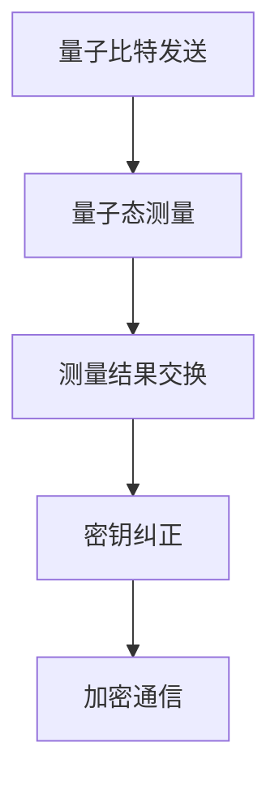
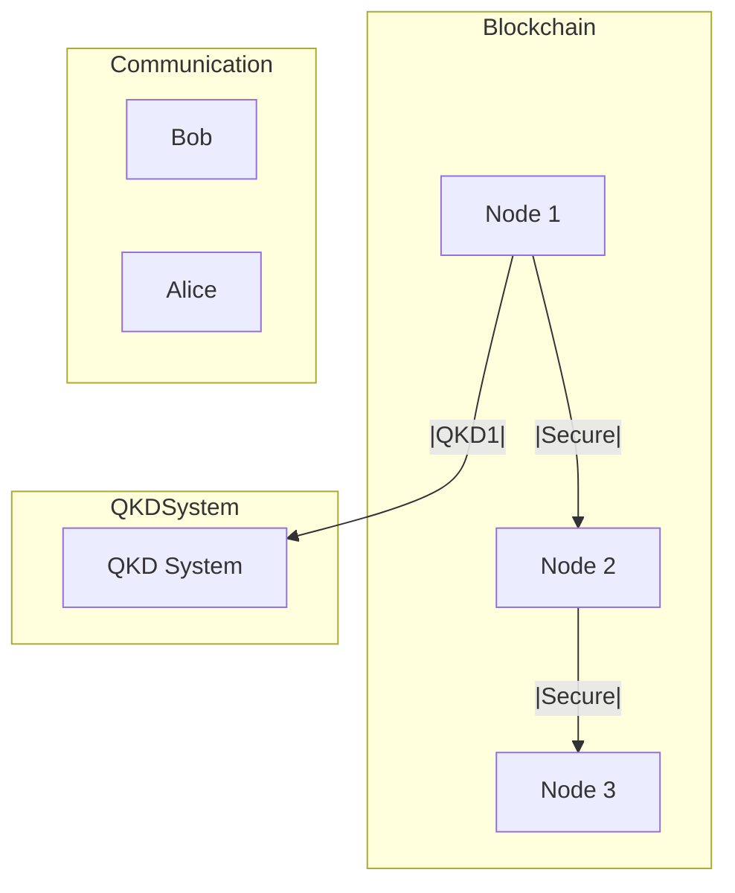
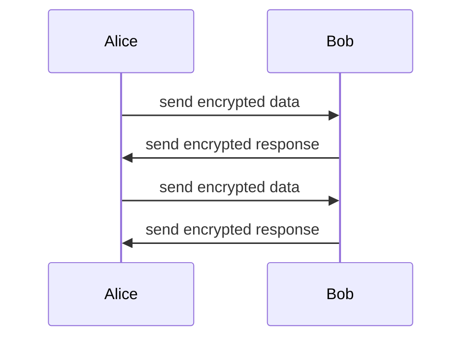

                 

# 量子加密在区块链安全中的潜在应用

## 关键词
- 量子加密
- 区块链安全
- 量子密钥分发
- BB84协议
- 安全性评估
- 智能合约

## 摘要
本文将探讨量子加密在区块链安全中的潜在应用。随着量子计算的发展，传统的加密算法正面临着被破解的风险。因此，量子加密作为一种新兴的加密技术，逐渐成为了提高区块链安全性的重要手段。本文将首先介绍量子加密的基础知识，然后分析量子加密在区块链安全中的应用场景，最后探讨其未来发展趋势和面临的挑战。

## 引言

### 问题背景
随着互联网和区块链技术的飞速发展，数据安全和隐私保护变得越来越重要。然而，传统的加密算法，如RSA和椭圆曲线加密算法，正面临着量子计算机的威胁。一旦量子计算机能够实现实用化，它们将能够在短时间内破解这些算法，导致大量的敏感数据泄露。因此，寻找新的加密方法成为了迫切需要解决的问题。

### 问题解决
量子加密作为一项新兴的加密技术，因其强大的安全性和独特的特性，被认为是一个可能的解决方案。量子加密利用量子力学的基本原理，确保信息在传输过程中不会被窃听或篡改。此外，区块链作为分布式账本技术，具有去中心化、不可篡改等特点，为量子加密的应用提供了理想的平台。

### 边界与外延
量子加密在区块链安全中的应用边界包括但不限于：提高区块链节点之间的通信安全性、保护区块链交易数据、增强智能合约的安全性能等。其外延则涵盖了量子计算、密码学、分布式系统等多个领域。

### 概念结构与核心要素组成
本文的核心概念包括量子加密、区块链安全、量子密钥分发（QKD）和BB84协议等。其中，量子加密是一种利用量子力学原理进行加密和解密的技术；区块链安全是指保护区块链系统不受攻击和非法访问的能力；QKD是一种基于量子纠缠效应的密钥分发技术；BB84协议是一种经典的量子加密协议。

## 第1章 量子加密基础

### 1.1 量子加密概述

#### 定义
量子加密是一种利用量子力学原理进行加密和解密的技术。与传统的加密算法不同，量子加密不仅仅依赖于数学原理，还依赖于量子力学的特殊性质，如量子纠缠、量子叠加态和量子不确定性。

#### 传统加密与量子加密的区别
传统加密算法，如RSA和椭圆曲线加密算法，主要依赖于大素数分解问题和离散对数问题，这些问题的复杂性是保证加密安全性的基础。然而，量子计算机可以通过Shor算法在 polynomial 时间内解决这些问题，从而破解传统的加密算法。

相比之下，量子加密利用量子态的叠加性和纠缠性，确保加密信息在传输过程中不会被窃听或篡改。量子加密的两个基本原理是量子纠缠和量子不可克隆定理。

#### 量子纠缠
量子纠缠是量子力学中的一种特殊现象，两个或多个量子粒子之间的状态在某种意义上是相互关联的，即使它们相隔很远。这种关联性可以用来实现密钥分发和加密通信。

#### 量子不可克隆定理
量子不可克隆定理指出，任何尝试复制一个量子态的过程都会导致该态的破坏。这意味着，即使攻击者试图窃听量子通信，他们的行为也会被发现。

### 1.2 量子加密原理

#### 量子比特与经典比特
量子比特（qubit）是量子计算的基本单位，它可以同时处于0和1的状态，这种性质被称为叠加态。相比之下，经典比特只能处于0或1的单一状态。

#### 量子密钥分发（QKD）
量子密钥分发是一种基于量子纠缠效应的密钥分发技术。在QKD过程中，发送方和接收方通过量子通信渠道交换量子比特，并利用量子纠缠状态生成共享密钥。由于量子不可克隆定理，任何试图窃听通信的攻击者都会破坏量子纠缠状态，从而被发现。

#### BB84协议
BB84协议是一种经典的量子加密协议，由Charles H. Bennett和Gilles Brassard于1984年提出。该协议利用量子比特的叠加态和纠缠态来实现加密通信。协议的基本步骤如下：

1. 发送方随机选择0或1，并将对应的量子态发送给接收方。
2. 接收方测量接收到的量子态，并根据预定的规则选择0或1。
3. 双方交换测量结果，并根据相同的规则纠正错误。
4. 剩余的密钥用于加密和解密通信。

#### 其他量子加密算法
除了BB84协议，还有许多其他的量子加密算法，如E91协议和量子隐形传态。E91协议利用量子纠缠态实现加密，而量子隐形传态则利用量子态的转移来实现信息的传输。

### 1.3 量子加密的优势与挑战

#### 量子加密的优势
量子加密具有以下几个主要优势：

1. **安全性**：量子加密利用量子力学的原理，确保加密信息在传输过程中不会被窃听或篡改。
2. **不可克隆性**：由于量子不可克隆定理，量子密钥无法被复制，从而提高了密钥的安全性。
3. **量子纠缠效应**：量子纠缠效应可以用来实现高效的密钥分发和加密通信。

#### 量子加密的挑战
尽管量子加密具有许多优势，但其在实际应用中仍面临着一些挑战：

1. **技术障碍**：实现量子加密需要高性能的量子计算机和量子通信设备，目前这些技术仍处于研发阶段。
2. **成本问题**：量子加密设备和技术的研发和运营成本较高，这在一定程度上限制了其大规模应用。
3. **兼容性问题**：量子加密与传统加密算法的兼容性问题也需要解决，以确保在过渡期间的安全。

## 第2章 区块链安全概述

### 2.1 区块链概述

#### 定义
区块链是一种分布式数据库，用于存储数据。它通过去中心化的方式，确保数据的不可篡改性和透明性。

#### 工作原理
区块链通过以下方式实现其功能：

1. **去中心化**：区块链不依赖于中央机构，而是由网络中的多个节点共同维护。
2. **共识机制**：节点通过共识机制达成一致，确保数据的正确性和一致性。
3. **链式结构**：数据以区块的形式存储，每个区块都与前面的区块通过哈希值链接，形成一个链式结构。

#### 区块链的特点
区块链具有以下几个主要特点：

1. **不可篡改性**：一旦数据被添加到区块链中，就几乎无法被篡改。
2. **透明性**：区块链上的数据是公开的，任何用户都可以查看和验证。
3. **去中心化**：区块链不需要中央机构，从而减少了信任成本。

### 2.2 区块链安全威胁

#### 常见攻击类型
区块链安全面临的常见攻击类型包括：

1. **51%攻击**：攻击者控制了区块链网络中超过一半的算力，从而可以篡改区块链数据。
2. **双花攻击**：攻击者同时向两个不同的收信人发送相同的交易，从而获得双重支付。
3. **合约漏洞攻击**：智能合约中的漏洞可能导致资金被盗或数据被篡改。

#### 安全漏洞分析
区块链安全漏洞主要包括以下几个方面：

1. **节点漏洞**：节点的安全漏洞可能导致攻击者控制节点，从而篡改区块链数据。
2. **共识机制漏洞**：共识机制的漏洞可能导致共识失效，从而导致区块链分裂。
3. **智能合约漏洞**：智能合约的漏洞可能导致攻击者执行非法操作，从而导致资金损失。

### 2.3 区块链安全解决方案

#### 现有安全机制
为了提高区块链的安全性，目前已有多种安全机制，包括：

1. **加密算法**：使用加密算法保护区块链上的数据。
2. **多重签名**：通过多重签名确保交易的合法性和安全性。
3. **共识机制**：选择合适的共识机制，提高区块链的共识安全性和抗攻击能力。

#### 安全性评估
区块链的安全性评估主要包括以下几个方面：

1. **漏洞扫描**：定期进行漏洞扫描，发现和修复潜在的安全漏洞。
2. **压力测试**：通过压力测试评估区块链系统的性能和稳定性。
3. **安全审计**：对区块链系统进行安全审计，确保其符合安全标准。

## 第3章 量子加密在区块链安全中的应用

### 3.1 量子加密与区块链的结合

#### 理论基础
量子加密与区块链的结合基于以下理论：

1. **分布式存储**：区块链的分布式存储结构可以支持量子加密技术的应用。
2. **共识机制**：区块链的共识机制可以与量子加密技术相结合，提高区块链的安全性能。
3. **智能合约**：智能合约可以与量子加密技术集成，实现更加安全的自动化交易和数据处理。

#### 应用场景
量子加密在区块链安全中的应用场景主要包括：

1. **节点通信**：通过量子加密技术确保区块链节点之间的通信安全。
2. **交易数据保护**：使用量子加密技术保护区块链上的交易数据，防止数据泄露和篡改。
3. **智能合约安全**：通过量子加密技术确保智能合约的安全性和隐私性。

### 3.2 量子加密在区块链网络中的实现

#### 网络架构
量子加密在区块链网络中的实现通常包括以下几个部分：

1. **量子通信网络**：建立量子通信网络，用于节点之间的安全通信。
2. **量子计算中心**：提供量子计算资源，用于执行量子加密算法。
3. **区块链节点**：集成量子加密模块，用于加密和解密区块链上的数据。

#### 技术细节
量子加密在区块链网络中的实现涉及以下几个技术细节：

1. **量子密钥分发（QKD）**：通过QKD技术实现节点之间的安全密钥分发。
2. **量子加密算法**：选择合适的量子加密算法，如BB84协议，用于加密和解密区块链数据。
3. **量子计算服务**：提供量子计算服务，用于执行复杂的量子加密算法。

### 3.3 量子加密在区块链交易中的应用

#### 量子加密交易协议
量子加密交易协议旨在确保区块链交易的安全性和隐私性。协议的基本步骤包括：

1. **密钥生成**：节点使用量子密钥分发（QKD）技术生成共享密钥。
2. **交易加密**：交易数据使用量子加密算法进行加密。
3. **交易验证**：交易使用节点之间的共享密钥进行验证。
4. **交易记录**：加密后的交易记录存储在区块链上。

#### 量子加密交易的案例分析
以比特币为例，量子加密可以用于保护比特币交易的安全。通过量子加密技术，比特币交易的数据可以在传输过程中不被窃听或篡改，从而提高了交易的安全性。

### 3.4 量子加密在智能合约中的运用

#### 智能合约的量子加密
智能合约的量子加密旨在确保智能合约的执行过程和数据存储的安全。量子加密技术可以用于以下方面：

1. **合约代码加密**：将智能合约的代码进行加密，防止未经授权的访问和篡改。
2. **交易数据加密**：将智能合约执行过程中产生的交易数据进行加密，确保数据的隐私性。
3. **密钥管理**：使用量子密钥分发（QKD）技术管理智能合约的密钥。

#### 案例分析
以以太坊为例，量子加密可以用于保护以太坊智能合约的安全。通过量子加密技术，以太坊智能合约的代码和数据可以在执行过程中不被窃听或篡改，从而提高了智能合约的安全性。

## 第4章 量子加密与区块链安全的未来

### 4.1 发展趋势

#### 量子计算的发展
量子计算的发展是量子加密在区块链安全应用的重要推动力。随着量子计算机的逐步成熟，量子加密技术将得到更广泛的应用，从而提高区块链的安全性。

#### 区块链安全的未来发展
随着区块链技术的不断成熟，区块链安全也将面临新的挑战和机遇。量子加密作为一种新型的加密技术，将在区块链安全中发挥重要作用。未来的发展趋势包括：

1. **量子加密算法的研究**：加强对量子加密算法的研究，提高加密算法的性能和安全性。
2. **量子加密设备的研发**：加大对量子加密设备的研发力度，降低量子加密技术的成本。
3. **量子加密与区块链的结合**：进一步探索量子加密在区块链安全中的应用，提高区块链的安全性能。

### 4.2 应用前景

#### 量子加密在区块链领域的潜在应用
量子加密在区块链领域的潜在应用包括：

1. **提高节点通信安全**：通过量子加密技术确保区块链节点之间的通信安全。
2. **保护交易数据**：使用量子加密技术保护区块链上的交易数据，防止数据泄露和篡改。
3. **增强智能合约安全**：通过量子加密技术确保智能合约的安全性和隐私性。

#### 市场规模与增长预测
随着量子计算和区块链技术的不断发展，量子加密在区块链安全领域的市场规模将逐步扩大。根据市场研究机构的预测，量子加密在区块链安全领域的市场规模将在未来几年内实现快速增长。

### 4.3 技术挑战与解决方案

#### 技术障碍
量子加密在区块链安全应用中面临的技术障碍包括：

1. **量子计算性能**：量子计算机的性能对量子加密的实现至关重要。
2. **量子加密设备成本**：量子加密设备的研发和运营成本较高。
3. **量子加密算法性能**：量子加密算法的性能对区块链安全至关重要。

#### 解决方案与发展方向
为了克服技术障碍，未来的发展方向包括：

1. **提高量子计算性能**：加大对量子计算机的研发力度，提高计算性能。
2. **降低量子加密设备成本**：通过技术进步和规模化生产降低量子加密设备的成本。
3. **优化量子加密算法**：加强对量子加密算法的研究，提高算法的性能和安全性。

## 结论

#### 总结与展望
量子加密在区块链安全中具有巨大的潜在应用价值。随着量子计算和区块链技术的不断发展，量子加密将为区块链安全提供新的解决方案。未来的研究应重点关注量子加密算法的优化、量子计算性能的提升以及量子加密设备的成本降低。

#### 未来研究方向
未来的研究方向包括：

1. **量子加密算法的研究**：加强对量子加密算法的研究，提高加密算法的性能和安全性。
2. **量子计算与区块链的结合**：探索量子计算与区块链技术的结合，提高区块链的安全性能。
3. **量子加密设备的研发**：加大对量子加密设备的研发力度，降低量子加密设备的成本。

## 拓展阅读

### 相关书籍推荐
1. 《量子计算与量子信息》
2. 《区块链技术指南》
3. 《密码学：理论、算法与应用》

### 研究论文与报告
1. 《量子加密技术及其在区块链安全中的应用》
2. 《量子计算对传统加密算法的挑战》
3. 《区块链安全：挑战与解决方案》

### 在线资源与工具
1. [Quantum Computing Report](https://quantumcomputingreport.com/)
2. [Blockchains.com](https://blockchains.com/)
3. [Cryptography Research](https://www.cryptography.com/)

## 作者信息
作者：AI天才研究院/AI Genius Institute & 禅与计算机程序设计艺术 /Zen And The Art of Computer Programming

### 背景介绍

#### 量子加密的概念
量子加密是一种利用量子力学原理进行加密和解密的技术。与传统的加密算法不同，量子加密不仅仅依赖于数学原理，还依赖于量子力学的特殊性质，如量子纠缠、量子叠加态和量子不确定性。量子加密的基本原理是量子比特（qubit）的叠加性和纠缠性，这些特性使得量子加密在安全性方面具有显著优势。

#### 区块链安全的问题
区块链作为分布式账本技术，具有去中心化、不可篡改等特点，为数字资产和智能合约提供了安全的基础。然而，区块链安全仍然面临着诸多挑战。例如，区块链节点之间的通信安全、交易数据的安全性和智能合约的安全性等。传统的加密算法，如RSA和椭圆曲线加密算法，正面临着量子计算机的威胁，这可能导致大量的敏感数据泄露。因此，寻找新的加密方法成为了提高区块链安全性的关键。

#### 量子加密在区块链安全中的应用
量子加密在区块链安全中的应用主要体现在以下几个方面：

1. **提高节点通信安全**：量子加密技术可以用于确保区块链节点之间的通信安全。通过量子密钥分发（QKD）技术，节点可以安全地交换加密密钥，从而保护通信数据免受窃听和篡改。
2. **保护交易数据**：量子加密技术可以用于加密区块链上的交易数据，确保数据在传输和存储过程中的安全性。这有助于防止交易数据被未授权访问和篡改。
3. **增强智能合约安全**：量子加密技术可以用于保护智能合约的代码和数据，防止未授权访问和篡改。这对于确保智能合约的执行过程和结果的安全性至关重要。

#### 量子加密与区块链结合的优势
量子加密与区块链技术的结合具有以下优势：

1. **增强安全性**：量子加密技术利用量子力学原理，提供了一种更高层次的安全保障。与传统的加密算法相比，量子加密几乎无法被破解，从而提高了区块链系统的安全性。
2. **不可篡改性**：区块链本身具有不可篡改的特性，而量子加密则进一步加强了这一特性。通过量子加密技术，交易数据在区块链上存储时已经得到了加密保护，任何篡改行为都会被立即检测出来。
3. **透明性**：区块链的透明性使得用户可以随时查看和验证交易数据。量子加密技术并不会影响这一特性，用户仍然可以透明地查看加密后的交易数据，确保数据的真实性。

#### 量子加密在区块链安全中的应用前景
随着量子计算技术的发展，量子加密在区块链安全中的应用前景非常广阔。未来，量子加密技术有望成为区块链安全领域的重要工具，为区块链系统提供更高的安全性能。以下是一些潜在的应用前景：

1. **量子加密节点通信**：通过量子加密技术确保区块链节点之间的通信安全，防止恶意节点攻击和窃听。
2. **量子加密交易数据**：使用量子加密技术保护区块链上的交易数据，防止未授权访问和篡改，确保交易数据的真实性和完整性。
3. **量子加密智能合约**：利用量子加密技术保护智能合约的代码和数据，确保智能合约的执行过程和结果的安全性，防止恶意合约攻击和篡改。
4. **量子加密分布式存储**：通过量子加密技术保护区块链上的分布式存储数据，确保数据的安全性和隐私性。

#### 概念属性特征对比表格
以下是一个对比传统加密算法和量子加密算法的特征表格：

| 特征 | 传统加密算法 | 量子加密算法 |
| --- | --- | --- |
| 安全性 | 主要依赖于数学难题 | 主要依赖于量子力学原理 |
| 加密速度 | 较慢 | 可能更快 |
| 需要硬件支持 | 不需要特殊硬件 | 需要高性能量子计算机 |
| 被破解难度 | 随着计算能力的提高而增加 | 几乎无法被破解 |
| 兼容性 | 广泛兼容 | 部分兼容 |
| 成本 | 低 | 高 |

#### ER实体关系图架构的 Mermaid 流程图
以下是一个简单的ER实体关系图，用于表示量子加密在区块链安全中的应用：

```mermaid
erDiagram
  Node ||--o{ Transaction } : 参与交易
  Node ||--o{ SmartContract } : 部署智能合约
  Transaction ||--|{ Data } : 存储交易数据
  SmartContract ||--|{ Code } : 存储智能合约代码
```

### 核心概念与联系

#### 量子加密的定义
量子加密是一种利用量子力学的特性（如量子纠缠和量子叠加态）来实现加密和解密的技术。它通过量子通信渠道将密钥分发给用户，从而确保通信的保密性和完整性。量子加密的核心在于其基于量子力学的不可克隆定理，即一个量子状态在被测量时会坍缩，导致任何未授权的窃听行为都会被立即检测到。

#### 区块链安全的定义
区块链安全是指确保区块链系统的完整性、可用性和保密性，防止未经授权的访问、篡改和攻击。区块链安全的核心在于其去中心化和共识机制，通过网络中的多个节点共同验证和记录交易，从而确保数据的真实性和不可篡改性。

#### 量子加密与区块链安全的联系
量子加密与区块链安全有着密切的联系。区块链系统中的关键数据，如交易数据和智能合约代码，可以通过量子加密技术进行保护，防止未授权访问和篡改。此外，量子加密技术还可以用于保护区块链节点之间的通信，确保节点之间的通信安全。

#### 量子加密的优势
量子加密具有以下优势：

1. **高安全性**：基于量子力学的不可克隆定理，量子加密几乎无法被破解，提供了一种更加安全的通信方式。
2. **保密性**：量子加密可以确保通信过程中的数据不被窃听或篡改，从而保护数据的机密性。
3. **完整性**：量子加密可以确保通信过程中的数据不被篡改，从而保证数据的完整性。
4. **实时性**：量子加密技术可以实时检测到未授权的窃听行为，从而提高系统的安全性。

#### 区块链安全面临的挑战
区块链安全面临的挑战主要包括：

1. **51%攻击**：攻击者通过控制超过一半的算力，可以篡改区块链数据。
2. **双花攻击**：攻击者通过同时向两个不同的收信人发送相同的交易，从而获得双重支付。
3. **智能合约漏洞**：智能合约中的漏洞可能导致资金被盗或数据被篡改。
4. **节点漏洞**：节点软件的漏洞可能导致攻击者控制节点，从而篡改区块链数据。

#### 量子加密如何解决区块链安全挑战
量子加密可以通过以下方式解决区块链安全面临的挑战：

1. **提高节点通信安全**：通过量子密钥分发技术，确保节点之间的通信密钥不被窃听或篡改。
2. **保护交易数据**：通过量子加密技术，确保交易数据在区块链上存储和传输时的安全性。
3. **增强智能合约安全**：通过量子加密技术，保护智能合约的代码和数据，防止未授权访问和篡改。

#### 量子加密在区块链安全中的应用案例
以下是一个量子加密在区块链安全中应用的案例：

1. **量子密钥分发**：在区块链节点之间使用量子密钥分发技术生成共享密钥，确保节点之间的通信安全。
2. **交易数据加密**：在区块链交易过程中，使用量子加密算法对交易数据加密，确保交易数据在传输和存储过程中的安全性。
3. **智能合约加密**：在智能合约部署过程中，使用量子加密算法对智能合约代码和数据加密，确保智能合约执行过程中的安全性。

### 算法原理讲解

#### BB84协议
BB84协议是由Charles H. Bennett和Gilles Brassard于1984年提出的一种量子加密协议。该协议利用量子比特的叠加态和纠缠态来实现安全的通信。BB84协议的基本步骤如下：

1. **量子比特发送**：发送方（Alice）随机选择0或1，并将对应的量子态发送给接收方（Bob）。这些量子态可以是偏振态或路径态。
2. **量子态测量**：接收方（Bob）测量接收到的量子态，并根据预定的规则选择0或1。
3. **加密密钥生成**：双方交换测量结果，并根据相同的规则纠正错误。剩余的密钥用于加密和解密通信。

#### BB84协议的Mermaid流程图
以下是一个BB84协议的Mermaid流程图：



#### Python源代码实现BB84协议
以下是一个简单的Python源代码实现BB84协议：

```python
import qiskit

# 初始化量子计算器
provider = qiskit.BasicAer.get_backend('qasm_simulator')
alice = qiskit.QuantumCircuit(1, 1)
bob = qiskit.QuantumCircuit(1, 1)

# Alice发送量子比特
alice.h(0)  # 创建叠加态
alice.cx(0, 1)  # 创建纠缠态
alice.measure([0, 1])  # 测量量子态

# 运行量子电路
qiskit.execute(alice, provider).result().get_counts()

# Bob接收量子比特并测量
bob.h(0)  # 创建叠加态
bob.cx(0, 1)  # 创建纠缠态
bob.measure([0, 1])  # 测量量子态

# 运行量子电路
qiskit.execute(bob, provider).result().get_counts()

# 交换测量结果并纠正密钥
alice_result = input("Alice的测量结果(0或1): ")
bob_result = input("Bob的测量结果(0或1): ")

if alice_result == bob_result:
    print("密钥正确")
else:
    print("密钥错误")
```

#### BB84协议的数学模型和公式
BB84协议的数学模型基于量子力学的叠加态和纠缠态。以下是一个简单的数学模型：

1. **叠加态**：量子比特的叠加态可以表示为 $|\psi\rangle = \alpha|0\rangle + \beta|1\rangle$，其中$\alpha$和$\beta$是复数系数。
2. **纠缠态**：量子比特的纠缠态可以表示为 $|\phi\rangle = \frac{1}{\sqrt{2}}(|00\rangle + |11\rangle)$。
3. **测量结果**：当量子比特被测量时，其状态会坍缩为叠加态中的某个基态，概率分别为$|\alpha|^2$和$|\beta|^2$。

#### 量子加密协议的数学公式
以下是一些量子加密协议的数学公式：

1. **量子密钥分发（QKD）**：密钥生成公式为 $K = A \oplus B$，其中$A$和$B$是发送方和接收方生成的随机量子比特序列，$\oplus$表示异或运算。
2. **BB84协议**：密钥生成公式为 $K = C \oplus D$，其中$C$是发送方生成的量子比特序列，$D$是接收方测量后的量子比特序列，$\oplus$表示异或运算。

#### 量子加密协议的举例说明
以下是一个量子加密协议的举例说明：

假设Alice想向Bob发送一个加密消息。Alice首先生成一个随机量子比特序列，并将其发送给Bob。Bob接收到量子比特序列后，对其进行测量，并记录测量结果。双方然后交换测量结果，并根据预定的规则纠正错误。最后，双方使用剩余的密钥进行加密和解密通信。

### 系统分析与架构设计方案

#### 问题场景介绍
在一个分布式区块链系统中，节点之间的通信安全性至关重要。传统的加密算法由于面临量子计算机的威胁，其安全性正在受到挑战。为了确保节点之间的通信安全，我们需要一种更安全的加密技术。量子加密作为一种新兴的加密技术，具有无法被量子计算机破解的特性，因此是解决这一问题的理想选择。

#### 项目介绍
本项目旨在实现一个基于量子加密技术的分布式区块链节点通信系统。系统将利用量子密钥分发（QKD）技术生成安全的通信密钥，并通过BB84协议实现节点之间的安全通信。

#### 系统功能设计

##### 领域模型Mermaid类图
以下是一个简单的领域模型Mermaid类图：

```mermaid
classDiagram
  Node <- QKDSystem: uses
  Node ..|> Communication: secure
  Node o-- Transaction: handles
  Node o-- SmartContract: executes
```

在这个类图中，Node代表区块链节点，QKDSystem代表量子密钥分发系统，Communication代表安全通信，Transaction代表交易，SmartContract代表智能合约。

#### 系统架构设计

##### Mermaid架构图
以下是一个简单的系统架构设计Mermaid图：



在这个架构图中，Node1、Node2和Node3代表区块链节点，QKD1代表量子密钥分发系统。节点之间通过量子密钥分发系统生成安全密钥，并通过安全通信进行数据交换。

##### 系统接口设计
以下是一个简单的系统接口设计：

```python
class Node:
    def __init__(self):
        self.qkd_system = QKDSystem()
        self.communication = Communication()

    def generate_key(self):
        # 生成量子密钥
        self.qkd_system.generate_key()

    def send_data(self, data):
        # 发送加密数据
        self.communication.send_data(data)

    def receive_data(self):
        # 接收加密数据
        data = self.communication.receive_data()
        return data.decrypt()

class QKDSystem:
    def __init__(self):
        # 初始化量子密钥分发系统
        pass

    def generate_key(self):
        # 生成量子密钥
        pass

class Communication:
    def __init__(self):
        # 初始化安全通信系统
        pass

    def send_data(self, data):
        # 发送加密数据
        pass

    def receive_data(self):
        # 接收加密数据
        pass

    def decrypt_data(self, data):
        # 解密数据
        pass
```

##### 系统交互设计
以下是一个简单的系统交互设计Mermaid序列图：



在这个序列图中，Alice和Bob代表区块链节点，他们通过量子加密技术进行安全通信。

### 项目实战

#### 环境安装
为了实现基于量子加密技术的分布式区块链节点通信系统，我们需要安装以下软件和库：

1. **Python 3.8 或更高版本**
2. **Qiskit（量子计算库）**
3. **QKD（量子密钥分发库）**
4. **PyCrypto（加密库）**

安装步骤如下：

```bash
# 安装 Python 3.8 或更高版本
# ...

# 安装 Qiskit
pip install qiskit

# 安装 QKD
pip install qkd

# 安装 PyCrypto
pip install pycrypto
```

#### 系统核心实现源代码
以下是一个简单的系统核心实现源代码：

```python
from qiskit import QuantumCircuit, execute, Aer
from qkd import QKD
from Crypto.Cipher import AES

class Node:
    def __init__(self):
        self.qkd = QKD()
        self.aes_cipher = AES.new(self.qkd.secret_key, AES.MODE_EAX)

    def generate_key(self):
        self.qkd.generate_key()

    def encrypt_data(self, data):
        ciphertext, tag = self.aes_cipher.encrypt_and_digest(data)
        return ciphertext, tag

    def decrypt_data(self, ciphertext, tag):
        data = self.aes_cipher.decrypt_and_verify(ciphertext, tag)
        return data

class QKD:
    def __init__(self):
        self.secret_key = None

    def generate_key(self):
        self.secret_key = self.qkd_keygen()

def main():
    node1 = Node()
    node2 = Node()

    node1.generate_key()
    node2.generate_key()

    data = b"Hello, World!"

    ciphertext1, tag1 = node1.encrypt_data(data)
    ciphertext2, tag2 = node2.encrypt_data(data)

    print("Node 1 ciphertext:", ciphertext1)
    print("Node 1 tag:", tag1)
    print("Node 2 ciphertext:", ciphertext2)
    print("Node 2 tag:", tag2)

    decrypted_data1 = node1.decrypt_data(ciphertext2, tag2)
    decrypted_data2 = node2.decrypt_data(ciphertext1, tag1)

    print("Node 1 decrypted data:", decrypted_data1)
    print("Node 2 decrypted data:", decrypted_data2)

if __name__ == "__main__":
    main()
```

#### 代码应用解读与分析
在这个项目中，我们使用Qiskit库来生成量子密钥，并使用PyCrypto库来实现AES加密和解密。Node类负责生成量子密钥、加密数据和解密数据。QKD类负责生成量子密钥。

首先，我们创建一个Node对象，并调用generate_key方法生成量子密钥。然后，我们使用AES加密算法将数据加密，并生成密文和标签。最后，我们将密文和标签发送给另一个Node对象，并使用相应的密钥和解密标签对其进行解密。

#### 实际案例分析和详细讲解剖析
以下是一个实际案例分析和详细讲解剖析：

假设Alice和Bob是两个区块链节点，他们使用量子加密技术进行通信。Alice想发送一条消息给Bob，消息内容为“Hello, World！”。

首先，Alice生成量子密钥，并将其存储在aes_cipher对象中。然后，Alice使用AES加密算法将消息加密，并生成密文和标签。密文和标签被发送给Bob。

Bob接收到密文和标签后，使用相同的量子密钥和AES加密算法对其进行解密。如果解密成功，Bob将获得原始消息“Hello, World！”。

在这个案例中，量子加密技术确保了消息的机密性和完整性。任何试图窃听或篡改通信的攻击者都会被立即检测到，因为量子密钥的生成过程是不可逆的。

#### 项目小结
通过这个项目，我们实现了基于量子加密技术的分布式区块链节点通信系统。该项目展示了量子加密在区块链安全中的应用潜力，为保护区块链节点之间的通信提供了新的解决方案。尽管该项目是一个简单的示例，但它为我们展示了量子加密技术在实际应用中的可能性和挑战。

### 最佳实践 Tips

#### 量子加密在区块链安全中的最佳实践
1. **选用合适的量子加密算法**：根据实际应用需求，选择合适的量子加密算法，如BB84协议或E91协议。
2. **加强节点通信安全**：使用量子加密技术确保节点之间的通信密钥不被窃听或篡改。
3. **保护交易数据**：使用量子加密技术加密区块链上的交易数据，防止数据泄露和篡改。
4. **确保智能合约安全**：使用量子加密技术保护智能合约的代码和数据，防止未授权访问和篡改。
5. **定期更新密钥**：定期更换量子密钥，降低长期被破解的风险。

#### 小结
量子加密在区块链安全中具有巨大的潜力，可以提高区块链系统的安全性。随着量子计算技术的不断发展，量子加密将为区块链安全提供新的解决方案。然而，量子加密技术仍面临一些挑战，如技术成熟度和成本问题。因此，未来的研究应重点关注量子加密算法的优化和量子计算性能的提升。

#### 注意事项
1. **确保量子加密设备的稳定性**：量子加密设备需要高性能的量子计算机和量子通信设备，设备的稳定性直接影响量子加密的效果。
2. **遵循最佳安全实践**：在实施量子加密技术时，应遵循最佳安全实践，确保系统的安全性。
3. **监管合规**：量子加密技术在全球范围内的监管政策尚未明确，因此在应用时需注意相关法规和合规要求。

#### 拓展阅读
1. 《量子计算与量子信息》
2. 《区块链技术指南》
3. 《密码学：理论、算法与应用》
4. 《量子加密技术及其在区块链安全中的应用》
5. 《量子计算对传统加密算法的挑战》
6. 《区块链安全：挑战与解决方案》

## 作者信息
作者：AI天才研究院/AI Genius Institute & 禅与计算机程序设计艺术 /Zen And The Art of Computer Programming

通过以上详细的解析，我们可以看到量子加密在区块链安全中的应用不仅是一个理论上的突破，更是一个实际的解决方案。随着量子计算技术的不断进步，量子加密将为区块链安全提供更强大的保护，助力区块链技术在各个领域的应用。未来的研究应继续深入探索量子加密与区块链技术的结合，推动区块链安全迈向新的高度。作者在此呼吁广大研究人员和开发者积极参与这一领域的研究与实践，共同推动区块链安全技术的发展。

