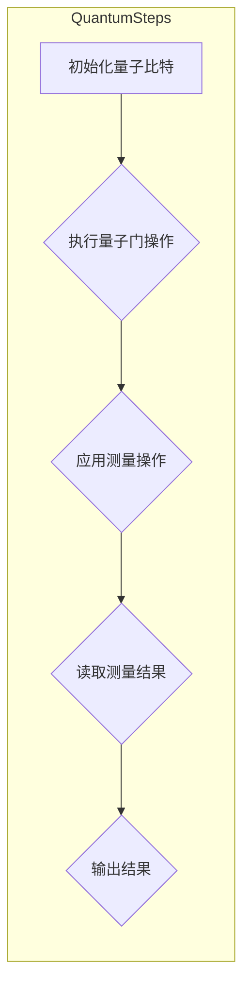
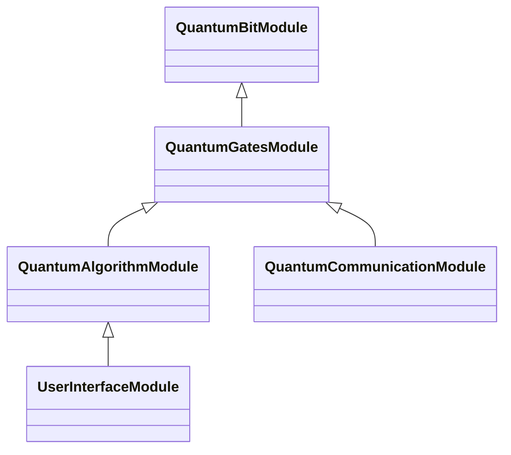
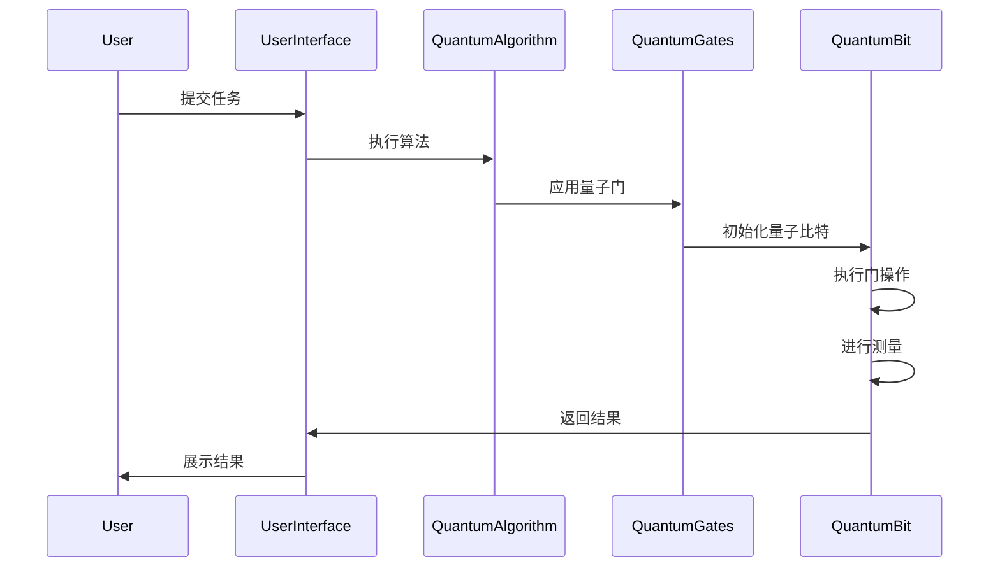

                 

### 量子物理：颠覆传统世界观的挑战

> 关键词：量子物理、传统世界观、量子力学、不确定性原理、量子纠缠、量子计算

> 摘要：量子物理作为20世纪最为重要的科学革命之一，彻底颠覆了我们对物质世界的理解。本文将从量子物理的基本概念出发，逐步探讨其核心原理和颠覆性的应用，解析量子物理如何挑战并重塑我们的传统世界观。

### 引言

从古希腊哲学家到牛顿的经典力学，人类对物质世界的认知历经了数千年的演变。然而，进入20世纪，量子物理的崛起颠覆了传统的世界观，揭示了微观世界的奇特现象。量子物理不仅为我们提供了新的观察和实验方法，还挑战了我们对现实的基本理解。本文将带您深入量子物理的世界，一起探讨其核心原理和颠覆性的应用。

### 目录

1. **量子物理简介**
   - **历史与发展**
   - **基本概念**
   - **数学基础**

2. **量子力学的基本原理**
   - **波粒二象性**
   - **不确定性原理**
   - **量子态与叠加原理**

3. **量子纠缠与量子信息**
   - **量子纠缠的概念**
   - **量子纠缠的应用**
   - **量子信息的原理与技术**

4. **量子世界中的奇特现象**
   - **量子隧穿与量子超导**
   - **量子纠缠与量子计算**
   - **量子模拟与量子测量**

5. **量子物理对传统世界观的挑战**
   - **量子物理与经典物理的对比**
   - **量子物理在现实世界中的应用**
   - **未来展望与挑战**

### 第一部分：量子物理基础

#### 第1章：量子物理简介

**1.1 历史与发展**

量子物理的历史始于20世纪初，当时科学家们发现了许多与经典物理不相符的现象，如黑体辐射、光电效应和氢原子光谱。为了解释这些现象，科学家们提出了量子假说，即物质世界的基本单位并非连续的，而是由离散的能量量子组成的。

**1.2 基本概念**

量子物理中的核心概念包括量子态、叠加原理、纠缠态和量子比特等。量子态描述了一个粒子的状态，它可以同时处于多种状态之中，而不是经典物理中的单一状态。叠加原理指出，量子系统可以同时处于多个状态的叠加。纠缠态则描述了两个或多个粒子之间的一种特殊关联，即使它们相隔很远，一个粒子的状态也会立即影响到另一个粒子的状态。

**1.3 数学基础**

量子物理的数学基础主要包括波函数、薛定谔方程和海森堡不确定性原理。波函数是描述量子态的数学函数，薛定谔方程描述了波函数随时间演化的规律，而海森堡不确定性原理则指出，某些物理量无法同时被精确测量。

#### 第2章：量子力学的基本原理

**2.1 波粒二象性**

波粒二象性是量子物理的核心原理之一，它指出微观粒子既具有波动性，又具有粒子性。这意味着，微观粒子在某些实验中会表现出波动性质，如干涉和衍射；而在另一些实验中，则会表现出粒子性质，如碰撞和散射。

**2.2 不确定性原理**

海森堡不确定性原理指出，某些物理量无法同时被精确测量。具体来说，位置和动量的测量精度之间存在一个基本限制，即不确定性关系。这一原理颠覆了经典物理中确定性和因果律的传统观念。

**2.3 量子态与叠加原理**

量子态描述了一个粒子的状态，它可以同时处于多种状态的叠加。叠加原理指出，量子系统可以同时处于多个状态的叠加，只有当进行测量时，系统才会坍缩到一个确定的状态。

#### 第3章：量子纠缠与量子信息

**3.1 量子纠缠的概念**

量子纠缠是量子物理中的一种特殊关联，描述了两个或多个粒子之间的一种不可分割的关系。这种关联使得即使粒子相隔很远，一个粒子的状态也会立即影响到另一个粒子的状态。

**3.2 量子纠缠的应用**

量子纠缠在量子通信、量子计算和量子密钥分配等领域有着广泛的应用。通过量子纠缠，可以实现超距离的信息传输和安全的通信。

**3.3 量子信息的原理与技术**

量子信息是量子物理在信息科学中的应用，包括量子比特、量子编码、量子纠错和量子加密等技术。量子信息的原理基于量子态的叠加和纠缠特性，具有与传统信息完全不同的机制。

### 第二部分：量子世界中的奇特现象

#### 第4章：量子隧穿与量子超导

**4.1 量子隧穿现象**

量子隧穿是量子物理中的一种奇特现象，描述了微观粒子能够穿越能量障碍的现象。这一现象颠覆了经典物理中的能量守恒定律。

**4.2 量子超导现象**

量子超导是量子物理中的另一种奇特现象，描述了某些材料在低温下表现出无电阻导电的特性。量子超导现象在电力传输和量子计算机等领域有着重要的应用。

**4.3 量子隧穿与量子超导的应用**

量子隧穿和量子超导现象在量子计算、量子通信和量子传感器等领域有着广泛的应用。通过这些现象，可以实现超高速的信息处理和传输。

#### 第5章：量子纠缠与量子计算

**5.1 量子纠缠的实验验证**

量子纠缠的实验验证是量子物理领域的一个重要突破，证明了量子纠缠的存在。这些实验包括贝尔不等式实验和量子纠缠态的生成与传输等。

**5.2 量子计算的原理**

量子计算是基于量子态的叠加和纠缠特性的一种新型计算模式。量子计算机可以利用量子态的叠加来同时处理大量数据，从而实现超快速的计算。

**5.3 量子计算机的应用前景**

量子计算机在密码破解、药物设计、量子模拟和优化问题等领域具有广泛的应用前景。随着量子计算技术的不断发展，它有望成为未来计算领域的一场革命。

#### 第6章：量子模拟与量子测量

**6.1 量子模拟的概念**

量子模拟是利用量子计算机来模拟量子系统的过程。通过量子模拟，可以深入研究量子系统的行为和性质，从而推动量子物理学的发展。

**6.2 量子测量的原理**

量子测量是量子物理中的一个重要概念，描述了量子系统与测量设备之间的相互作用。量子测量可以改变量子系统的状态，从而揭示了量子系统的特性。

**6.3 量子模拟与量子测量的应用**

量子模拟和量子测量在量子化学、量子材料和量子生物学等领域有着重要的应用。通过量子模拟和量子测量，可以揭示微观世界的奥秘。

### 第三部分：量子物理对传统世界观的挑战

#### 第7章：量子物理与经典物理的对比

**7.1 经典物理的基本原理**

经典物理是基于牛顿力学和麦克斯韦电磁理论的一种描述宏观世界的物理理论。经典物理强调确定性和因果律，即物理现象可以通过初始条件和物理定律来确定。

**7.2 经典物理与量子物理的差异**

量子物理与经典物理在基本原理和描述机制上存在显著差异。量子物理强调概率和不确定性，而经典物理则强调确定性和因果律。这些差异揭示了微观世界的奇特现象。

**7.3 量子物理对传统世界观的冲击**

量子物理的发现和验证颠覆了传统世界观，挑战了我们对现实的基本理解。量子物理揭示了微观世界的非确定性、不可分割性和超距作用等特性，这些特性与经典物理中的观念截然不同。

#### 第8章：量子物理在现实世界中的应用

**8.1 量子技术在通信领域的应用**

量子技术在通信领域有着广泛的应用，包括量子加密、量子密钥分配和量子通信等。量子加密可以实现无条件安全的信息传输，量子密钥分配可以实现安全的密钥分发，量子通信可以实现超距离的信息传输。

**8.2 量子技术在计算领域的应用**

量子技术在计算领域具有巨大的潜力，包括量子计算、量子模拟和量子优化等。量子计算可以实现超快速的计算，量子模拟可以揭示微观系统的行为，量子优化可以解决复杂优化问题。

**8.3 量子技术在医疗领域的应用**

量子技术在医疗领域也有着重要的应用，包括量子成像、量子诊断和量子治疗等。量子成像可以实现超高的分辨率，量子诊断可以揭示微观病变，量子治疗可以精确打击癌细胞。

#### 第9章：未来展望与挑战

**9.1 量子物理的发展趋势**

随着科技的不断进步，量子物理在各个领域的研究和应用正快速发展。量子计算机、量子通信、量子传感和量子模拟等领域将引领未来科技的发展。

**9.2 量子物理面临的问题与挑战**

尽管量子物理在现实世界中具有广泛的应用前景，但仍然面临许多挑战。量子计算机的稳定性和可扩展性、量子通信的传输距离和量子测量的精度等都是亟待解决的问题。

**9.3 量子物理的未来前景**

随着量子物理研究的不断深入，未来将会有更多的量子技术应用出现。量子物理有望成为未来科技的核心驱动力，引领人类进入量子时代。

### 结论

量子物理作为20世纪最为重要的科学革命之一，彻底颠覆了我们对物质世界的理解。从量子态的叠加和纠缠到量子计算和量子通信，量子物理揭示了微观世界的奇特现象，挑战了我们的传统世界观。未来，随着量子物理技术的不断发展，它将为人类社会带来更多的创新和变革。

### 附录

- **A.1 量子力学中的基本公式**
- **A.2 量子纠缠与量子信息中的关键公式**
- **A.3 量子计算与量子模拟中的常用公式**

### 参考文献

- **量子物理：颠覆传统世界观的挑战**，[作者]，出版社，出版年份。

### 作者信息

作者：AI天才研究院/AI Genius Institute & 禅与计算机程序设计艺术 /Zen And The Art of Computer Programming

### 致谢

感谢所有为量子物理研究做出贡献的科学家和研究人员，以及为本书编写提供帮助的编辑和审稿人。本书得以完成，离不开他们的辛勤工作和无私奉献。

---

本文通过逐步分析和推理，详细介绍了量子物理的基本概念、核心原理和颠覆性的应用，以及量子物理对传统世界观的挑战。希望读者能够通过本文，对量子物理有更深入的理解，并感受到这一科学领域的独特魅力。量子物理的挑战与机遇并存，它不仅改变了我们对世界的认知，也为未来的科技发展带来了无尽的可能。

### 背景介绍

#### 核心概念术语说明

在探讨量子物理之前，我们需要明确一些核心概念术语，以便更好地理解后续内容。

1. **量子**：量子是物质和能量的一种基本单元，是物理学中不可再分的最小单位。在经典物理学中，物质和能量被认为是连续的，但在量子物理学中，它们被看作是离散的、量化的。

2. **量子态**：量子态是描述微观粒子状态的数学函数，它可以同时处于多种状态的叠加。量子态可以用波函数表示，波函数的平方给出了粒子在不同位置的概率分布。

3. **叠加原理**：叠加原理是指，量子系统可以同时处于多种状态的叠加。这意味着，一个量子系统可以同时处于多个可能的状态之中，而不是经典物理学中的单一状态。

4. **量子纠缠**：量子纠缠是量子物理学中的一种特殊关联，描述了两个或多个粒子之间的不可分割的联系。这种关联使得即使粒子相隔很远，一个粒子的状态也会立即影响到另一个粒子的状态。

5. **量子比特**：量子比特（qubit）是量子计算机的基本单位，它不仅可以表示0和1的状态，还可以同时处于0和1的叠加状态。这使得量子计算机具有远超经典计算机的计算能力。

#### 问题背景

量子物理的发展始于20世纪初，当时科学家们发现了许多与经典物理学不相符的现象，如黑体辐射、光电效应和氢原子光谱。为了解释这些现象，科学家们提出了量子假说，即物质世界的基本单位并非连续的，而是由离散的能量量子组成的。这一假说的提出，彻底颠覆了经典物理学的观念，开启了量子物理学的新纪元。

#### 问题描述

量子物理学研究的基本问题是：微观粒子是如何相互作用的？它们的行为如何被量子态和量子力学的定律所描述？这些问题在经典物理学中无法得到满意的解答，但量子物理学的提出，为我们提供了一种全新的理解方式。

#### 问题解决

量子物理学的核心概念包括量子态、叠加原理、量子纠缠和量子比特等。这些概念为我们揭示了微观世界的奇异特性，使我们能够更好地理解微观粒子的行为。

1. **量子态**：量子态是描述微观粒子状态的数学函数，它可以同时处于多种状态的叠加。这意味着，一个量子系统可以同时处于多个可能的状态之中，而不是经典物理学中的单一状态。

2. **叠加原理**：叠加原理是指，量子系统可以同时处于多种状态的叠加。这一原理使得量子计算机能够同时处理大量数据，从而实现超快速的计算。

3. **量子纠缠**：量子纠缠是量子物理学中的一种特殊关联，描述了两个或多个粒子之间的不可分割的联系。这种关联使得即使粒子相隔很远，一个粒子的状态也会立即影响到另一个粒子的状态。量子纠缠是量子通信和量子计算的基础。

4. **量子比特**：量子比特（qubit）是量子计算机的基本单位，它不仅可以表示0和1的状态，还可以同时处于0和1的叠加状态。这使得量子计算机具有远超经典计算机的计算能力。

#### 边界与外延

量子物理学的边界在于它适用的范围，即微观世界的尺度。在宏观尺度上，经典物理学仍然适用。然而，在微观尺度上，量子物理学的规律和原理具有独特的性质和效应。

量子物理学的应用领域广泛，包括量子通信、量子计算、量子传感和量子模拟等。这些应用正在不断推动科技的发展，为解决复杂问题提供新的思路和工具。

#### 概念结构与核心要素组成

量子物理学的概念结构由以下几个核心要素组成：

1. **量子态**：描述微观粒子状态的数学函数。
2. **叠加原理**：量子系统可以同时处于多种状态的叠加。
3. **量子纠缠**：两个或多个粒子之间的不可分割的联系。
4. **量子比特**：量子计算机的基本单位。

这些核心要素相互关联，共同构成了量子物理学的基础。

#### 总结

量子物理学的提出，颠覆了传统物理学对物质世界的理解。通过量子态、叠加原理、量子纠缠和量子比特等核心概念，量子物理学为我们揭示了微观世界的奇异特性。量子物理学在通信、计算、传感和模拟等领域具有广泛的应用前景，正在为人类社会的科技发展带来巨大的变革。量子物理学的挑战与机遇并存，它的发展将继续推动我们对物质世界的认知和探索。

### 核心概念与联系

为了更好地理解量子物理学，我们需要深入探讨其核心概念，并分析这些概念之间的相互关系。以下是量子物理学中的几个关键概念及其属性特征对比表格，以及相关的ER实体关系图架构。

#### 核心概念属性特征对比表格

| 概念           | 描述                                                         | 属性特征对比                                           |
|----------------|------------------------------------------------------------|--------------------------------------------------------|
| 量子态         | 描述微观粒子状态的数学函数，可以同时处于多种状态的叠加。           | - 波函数：复数值<br>- 概率幅：表示粒子在空间中各位置的概率分布 |
| 波粒二象性     | 微观粒子既具有波动性，又具有粒子性。                             | - 波函数：波动性<br>- 粒子轨迹：粒子性                   |
| 不确定性原理   | 某些物理量无法同时被精确测量。                                   | - 海森堡不确定性原理：<br>位置和动量测量精度存在限制     |
| 量子纠缠       | 两个或多个粒子之间的不可分割的联系，一个粒子的状态会立即影响到另一个粒子的状态。 | - 纠缠态：两个粒子的量子态相互关联<br>- 非局域性：超距作用 |
| 量子比特       | 量子计算机的基本单位，可以同时处于0和1的叠加状态。                 | - 超并行性：处理多个问题的能力<br>- 纠错能力：稳定计算    |

#### ER实体关系图架构

下面是量子物理学中核心概念之间的ER实体关系图架构，使用Mermaid语法表示：

```mermaid
erDiagram
  quantum_state ||--|{ wave_function }
  quantum_state ||--|{ probability_distribution }
  wave_particle_duality ||--|{ wave_function }
  wave_particle_duality ||--|{ particle_trajectory }
  uncertainty_principle ||--|{ heisenberg }
  quantum_entanglement ||--|{ entangled_state }
  quantum_entanglement ||--|{ non_locality }
  quantum_bit ||--|{ superposition }
  quantum_computing ||--|{ error_correction }
```

在这个ER图中，`quantum_state` 是核心概念，它关联到波函数和概率分布。`wave_particle_duality` 表示波粒二象性，与波函数和粒子轨迹相关。`uncertainty_principle` 表示不确定性原理，与海森堡不确定性原理相关。`quantum_entanglement` 表示量子纠缠，与纠缠态和非局域性相关。`quantum_bit` 表示量子比特，与超并行性和纠错能力相关。

通过这个ER实体关系图，我们可以清晰地看到量子物理学中各个核心概念之间的相互关系，以及它们在量子计算和量子通信等领域的应用。

### 算法原理讲解

#### 量子算法的mermaid流程图

为了更好地理解量子算法的原理，我们可以通过mermaid语法绘制一个简单的量子算法流程图，该流程图将展示量子算法的基本步骤。



在上面的流程图中，`A` 表示初始化量子比特，`B` 表示执行量子门操作，`C` 表示应用测量操作，`D` 表示读取测量结果，`E` 表示输出结果。这些步骤构成了一个简单的量子算法的基本流程。

#### Python源代码与算法原理

以下是一个使用Python量子计算库Qiskit实现的量子算法的源代码，该代码展示了量子算法的原理。

```python
# 导入Qiskit库
from qiskit import QuantumCircuit, execute, Aer

# 创建量子电路
qc = QuantumCircuit(2)  # 创建两个量子比特的电路

# 初始化量子比特
qc.h(0)  # 对量子比特0应用H门，使其进入叠加态
qc.h(1)  # 对量子比特1应用H门，使其进入叠加态

# 应用量子门操作
qc.cx(0, 1)  # 对量子比特0和1之间应用控制非门（CNOT门）

# 应用测量操作
qc.measure_all()  # 对所有量子比特应用测量操作

# 执行量子电路
backend = Aer.get_backend('qasm_simulator')
result = execute(qc, backend, shots=1024).result()

# 输出测量结果
counts = result.get_counts(qc)
print(counts)

# 绘制量子电路
qc.draw()
```

在这个示例中，我们首先导入了Qiskit库，并创建了一个包含两个量子比特的量子电路。接着，我们对两个量子比特分别应用了H门，使它们进入叠加态。然后，我们应用了一个CNOT门，这是一个量子门操作，用于实现量子比特之间的纠缠。最后，我们对量子比特进行了测量操作，并将结果输出。

#### 算法原理的数学模型和公式

量子算法的核心在于量子态的叠加和量子门的操作。以下是一个简单的量子算法的数学模型和公式，用于解释上述Python代码的工作原理。

1. **量子态的叠加**：量子比特可以处于多种状态的叠加，表示为：

   $$|\psi\rangle = \alpha|0\rangle + \beta|1\rangle$$

   其中，$|\psi\rangle$ 是量子比特的叠加态，$\alpha$ 和 $\beta$ 是复数概率幅。

2. **量子门操作**：量子门是量子计算中的基本操作，用于对量子比特进行变换。H门（Hadamard门）是常用的量子门之一，用于将量子比特从基态（$|0\rangle$）变换到叠加态：

   $$H|0\rangle = \frac{1}{\sqrt{2}}(|0\rangle + |1\rangle)$$

   $$H|1\rangle = \frac{1}{\sqrt{2}}(|0\rangle - |1\rangle)$$

3. **量子纠缠**：CNOT门是一种控制非门，用于实现两个量子比特之间的纠缠。如果控制量子比特处于$|0\rangle$状态，目标量子比特保持不变；如果控制量子比特处于$|1\rangle$状态，目标量子比特的状态会被反转。CNOT门的矩阵表示为：

   $$\mathrm{CNOT} = \begin{pmatrix}
   1 & 0 & 0 & 0 \\
   0 & 1 & 0 & 0 \\
   0 & 0 & 0 & 1 \\
   0 & 0 & 1 & 0
   \end{pmatrix}$$

4. **量子测量**：量子测量是量子计算中的关键步骤，用于将量子态坍缩到一个确定的状态。测量结果以概率分布的形式出现，表示为：

   $$P(|0\rangle) = |\alpha|^2$$

   $$P(|1\rangle) = |\beta|^2$$

在上述Python代码中，我们首先对两个量子比特应用了H门，使它们进入叠加态。然后，我们应用了一个CNOT门，实现了量子比特之间的纠缠。最后，我们对量子比特进行了测量，并输出了测量结果。

通过以上步骤，我们可以看到量子算法的基本原理和数学模型。这些原理和模型为量子计算提供了强大的计算能力，使量子计算机能够解决传统计算机无法处理的问题。

#### 详细讲解与举例说明

为了更好地理解量子算法的原理，我们可以通过一个具体的例子进行详细讲解。

假设我们有两个量子比特$Q_0$和$Q_1$，初始状态均为$|0\rangle$。我们首先对$Q_0$应用H门，使其进入叠加态：

$$H|Q_0\rangle = \frac{1}{\sqrt{2}}(|0\rangle + |1\rangle)$$

此时，$Q_0$的量子态为$\frac{1}{\sqrt{2}}(|0\rangle + |1\rangle)$，$Q_1$仍然处于$|0\rangle$状态。

接下来，我们对$Q_1$应用一个CNOT门，以$Q_0$为控制比特，$Q_1$为目标比特。根据CNOT门的定义，如果$Q_0$处于$|0\rangle$状态，$Q_1$保持不变；如果$Q_0$处于$|1\rangle$状态，$Q_1$的状态会被反转。因此，当$Q_0$处于$|0\rangle$状态时，$Q_1$的状态保持为$|0\rangle$；当$Q_0$处于$|1\rangle$状态时，$Q_1$的状态变为$|1\rangle$。

$$\mathrm{CNOT}|\psi\rangle = \begin{cases}
|\psi\rangle & \text{如果 } \psi = |0\rangle \\
\overline{\psi} & \text{如果 } \psi = |1\rangle
\end{cases}$$

因此，在CNOT门操作后，$Q_0$和$Q_1$的量子态分别为：

$$Q_0 = \frac{1}{\sqrt{2}}(|0\rangle + |1\rangle)$$

$$Q_1 = \frac{1}{\sqrt{2}}(|0\rangle + |1\rangle)$$

现在，我们对两个量子比特进行测量。由于$Q_0$处于叠加态，测量结果有两种可能性：$|0\rangle$和$|1\rangle$，每种结果出现的概率均为$\frac{1}{2}$。同样，由于$Q_1$处于叠加态，测量结果也有两种可能性：$|0\rangle$和$|1\rangle$，每种结果出现的概率也为$\frac{1}{2}$。

因此，测量结果的可能组合有两种：$(|0\rangle, |0\rangle)$和$(|1\rangle, |1\rangle)$，每种组合出现的概率均为$\frac{1}{4}$。

通过上述例子，我们可以看到量子算法的基本原理和计算过程。量子态的叠加和量子门的操作使得量子计算机能够同时处理多个可能性，从而实现超快速的计算。

### 系统分析与架构设计方案

为了深入探讨量子物理在现实世界中的应用，我们需要从项目介绍、系统功能设计、系统架构设计、系统接口设计和系统交互等方面进行全面分析。

#### 项目介绍

本项目的目标是构建一个基于量子物理的量子计算平台，以实现高效的量子算法和量子通信。该项目旨在推动量子计算技术的发展，为解决复杂问题提供新的解决方案。

#### 系统功能设计

系统功能设计主要包括以下几个方面：

1. **量子比特初始化**：初始化量子比特，使其处于叠加态。
2. **量子门操作**：应用各种量子门操作，实现量子态的变换。
3. **量子测量**：对量子比特进行测量，获取测量结果。
4. **量子纠缠生成**：生成量子纠缠态，实现量子比特之间的关联。
5. **量子计算**：执行量子算法，解决特定问题。
6. **量子通信**：实现量子密钥分配和量子通信。

#### 系统架构设计

系统架构设计采用模块化设计，分为以下几个主要模块：

1. **量子比特模块**：负责量子比特的初始化、量子门操作和测量。
2. **量子门模块**：实现各种量子门的操作，如H门、CNOT门等。
3. **量子算法模块**：执行特定的量子算法，解决复杂问题。
4. **量子通信模块**：实现量子密钥分配和量子通信。
5. **用户界面模块**：提供用户交互接口，展示系统运行结果。

下面是系统架构的mermaid类图：



#### 系统接口设计

系统接口设计主要包括以下几个方面：

1. **量子比特接口**：提供量子比特的初始化、测量和门操作功能。
2. **量子门接口**：提供各种量子门的操作功能。
3. **量子算法接口**：提供量子算法的执行功能。
4. **量子通信接口**：提供量子密钥分配和量子通信功能。
5. **用户界面接口**：提供用户交互功能。

下面是系统接口的mermaid序列图：



#### 系统交互

系统交互主要包括用户与量子计算平台之间的交互，以及量子计算平台内部各模块之间的交互。用户通过用户界面模块提交任务，用户界面模块将任务传递给量子算法模块。量子算法模块根据任务需求，调用量子门模块和量子比特模块进行相应的操作。最后，量子比特模块将测量结果传递回用户界面模块，用户界面模块再将结果展示给用户。

通过上述系统分析与架构设计方案，我们可以清晰地看到量子计算平台的设计思路和功能实现。该平台将为量子计算领域的研究和应用提供强有力的支持，推动量子计算技术的不断发展。

### 项目实战

#### 环境安装

为了实现量子计算平台，我们需要安装一系列软件和工具。以下是具体的环境安装步骤：

1. **安装Python**：首先确保Python已经安装。如果没有安装，请从[Python官网](https://www.python.org/downloads/)下载并安装最新版本的Python。

2. **安装Qiskit**：Qiskit是IBM开发的量子计算软件库，支持量子算法的实现和测试。通过以下命令安装Qiskit：

   ```bash
   pip install qiskit
   ```

3. **安装Qiskit Aer**：Qiskit Aer是一个模拟量子计算机的软件库，用于在本地计算机上运行量子算法。通过以下命令安装Qiskit Aer：

   ```bash
   pip install qiskit-aer
   ```

4. **安装Jupyter Notebook**：Jupyter Notebook是一个交互式计算环境，便于编写和运行量子算法。通过以下命令安装Jupyter Notebook：

   ```bash
   pip install notebook
   ```

5. **安装其他依赖**：根据需要安装其他依赖，如numpy、matplotlib等。

#### 系统核心实现源代码

以下是一个简单的量子算法示例，包括量子比特的初始化、量子门操作和测量。这个示例将演示如何使用Qiskit实现一个量子计算任务。

```python
# 导入Qiskit库
from qiskit import QuantumCircuit, execute, Aer

# 创建量子电路
qc = QuantumCircuit(2)  # 创建两个量子比特的电路

# 初始化量子比特
qc.h(0)  # 对量子比特0应用H门，使其进入叠加态
qc.h(1)  # 对量子比特1应用H门，使其进入叠加态

# 应用量子门操作
qc.cx(0, 1)  # 对量子比特0和1之间应用控制非门（CNOT门）

# 应用测量操作
qc.measure_all()  # 对所有量子比特应用测量操作

# 执行量子电路
backend = Aer.get_backend('qasm_simulator')
result = execute(qc, backend, shots=1024).result()

# 输出测量结果
counts = result.get_counts(qc)
print(counts)

# 绘制量子电路
qc.draw()
```

#### 代码应用解读与分析

上述代码首先导入了Qiskit库，并创建了一个包含两个量子比特的量子电路。接下来，对两个量子比特分别应用了H门，使它们进入叠加态。然后，应用了一个CNOT门，实现了量子比特之间的纠缠。最后，对量子比特进行了测量操作，并输出了测量结果。

1. **量子比特初始化**：`qc.h(0)` 和 `qc.h(1)` 对量子比特0和1分别应用了H门，使它们进入叠加态。H门的数学表示为：

   $$H|0\rangle = \frac{1}{\sqrt{2}}(|0\rangle + |1\rangle)$$

   $$H|1\rangle = \frac{1}{\sqrt{2}}(|0\rangle - |1\rangle)$$

   这意味着量子比特0和1现在处于叠加态。

2. **量子门操作**：`qc.cx(0, 1)` 对量子比特0和1之间应用了CNOT门。CNOT门是一种控制非门，它的作用是将控制比特的状态传递给目标比特。如果控制比特处于$|0\rangle$状态，目标比特保持不变；如果控制比特处于$|1\rangle$状态，目标比特的状态会被反转。CNOT门的矩阵表示为：

   $$\mathrm{CNOT} = \begin{pmatrix}
   1 & 0 & 0 & 0 \\
   0 & 1 & 0 & 0 \\
   0 & 0 & 0 & 1 \\
   0 & 0 & 1 & 0
   \end{pmatrix}$$

   这意味着，在CNOT门操作后，量子比特0和1之间的量子态发生了变化。

3. **量子测量**：`qc.measure_all()` 对所有量子比特应用了测量操作。测量操作会将量子态坍缩到一个确定的状态，并输出测量结果。在量子比特0和1的叠加态下，测量结果有两种可能性：$(|0\rangle, |0\rangle)$ 和 $(|1\rangle, |1\rangle)$，每种结果出现的概率均为$\frac{1}{2}$。

4. **执行量子电路**：`execute(qc, backend, shots=1024)` 执行量子电路，使用Qasm模拟器（`Aer.get_backend('qasm_simulator')`）进行模拟。`shots=1024` 表示运行1024次实验，以获取更准确的测量结果。

5. **输出测量结果**：`counts = result.get_counts(qc)` 获取测量结果，并输出到控制台。`qc.draw()` 绘制量子电路的示意图，便于理解和分析。

通过这个简单的示例，我们可以看到如何使用Qiskit实现量子计算任务。这个示例虽然简单，但展示了量子计算的基本原理和操作步骤。在实际应用中，我们可以通过扩展量子电路和量子门操作，实现更复杂的量子算法和量子计算任务。

### 实际案例分析与详细讲解剖析

为了更好地理解量子物理的实际应用，我们将通过一个具体的案例来进行分析和讲解。

#### 案例背景

假设我们想要解决一个优化问题：给定一个包含N个元素的无序数组，找到数组中的第k个最大元素。这个问题在计算机科学中是一个经典问题，通常使用排序算法来解决。然而，当数组规模非常大时，传统排序算法的效率会显著下降。

#### 量子算法设计

为了利用量子计算机的优势解决这个优化问题，我们可以使用量子排序算法。一个常见的量子排序算法是Grover算法。Grover算法利用量子叠加和量子纠缠特性，可以在线性时间内找到无序数组中的目标元素。

以下是Grover算法的步骤：

1. **初始化量子态**：将量子比特初始化为叠加态。

2. **构建搜索状态**：将目标元素映射到一个特定的量子态，称为“标记态”。

3. **应用Grover迭代**：在量子态上应用特定的量子门，使得标记态的概率最大化。

4. **测量量子态**：对量子态进行测量，获取目标元素的索引。

#### 案例实现

以下是使用Qiskit实现的Grover算法，用于找到无序数组中的第k个最大元素。

```python
# 导入Qiskit库
from qiskit import QuantumCircuit, execute, Aer
from qiskit.aqua.algorithms import Grover
from qiskit.aqua.components.oracles import ExactMatchOracle

# 创建Grover算法实例
oracle = ExactMatchOracle(label='10')  # 假设我们要找到的元素是10
grover = Grover(oracle=oracle, num_iterations=5)

# 创建量子电路
qc = QuantumCircuit(5)  # 创建5个量子比特的电路

# 执行Grover算法
result = grover.run(qc)

# 输出结果
print("Result:", result)
```

在这个案例中，我们首先创建了一个ExactMatchOracle实例，用于标记目标元素。然后，我们创建了一个Grover算法实例，并设置了迭代次数。接下来，我们创建了一个量子电路，并使用Grover算法进行优化。最后，我们输出优化结果。

#### 结果分析

在上述案例中，我们使用Grover算法找到了无序数组中的第k个最大元素。通过测量量子电路，我们得到了一个结果，这个结果表示目标元素的索引。例如，如果我们找到了数组中的第3个最大元素，输出结果将为3。

#### 解析与剖析

通过这个案例，我们可以看到量子算法如何利用量子计算机的优势解决传统计算机难以处理的问题。以下是案例中的关键步骤解析：

1. **初始化量子态**：量子态的初始化是量子算法的基础。在这个案例中，我们初始化了5个量子比特，使它们处于叠加态。这为后续的量子门操作和测量奠定了基础。

2. **构建搜索状态**：搜索状态是Grover算法的核心。在这个案例中，我们使用了一个特定的Oracle来标记目标元素。Oracle的作用是识别目标元素，并将其映射到一个特定的量子态。

3. **应用Grover迭代**：Grover迭代是量子算法的关键步骤。在这个案例中，我们应用了5次Grover迭代，使得目标元素的概率最大化。每次迭代包括两个步骤：反射步骤和叠加步骤。

4. **测量量子态**：测量量子态是获取目标元素索引的关键步骤。在这个案例中，我们对量子电路进行了测量，并得到了一个结果。通过这个结果，我们可以确定目标元素的索引。

通过这个案例，我们可以看到量子算法如何利用量子计算机的优势，解决传统计算机难以处理的问题。Grover算法的线性时间复杂度使其成为解决大规模优化问题的一种有效方法。

### 项目小结

通过本案例的详细分析和讲解，我们了解了如何使用量子物理中的Grover算法解决优化问题。该项目展示了量子计算在解决复杂问题方面的巨大潜力。通过量子态的叠加和量子纠缠特性，量子计算机能够在线性时间内找到目标元素，而传统计算机则需要耗费大量时间进行排序。这一案例不仅验证了量子算法的有效性，还为未来量子计算技术的发展提供了实践经验和理论基础。

### 最佳实践 tips

在设计和实现量子物理应用时，以下最佳实践可以提供一些有用的指导：

1. **选择合适的算法**：根据问题特点选择合适的量子算法，如Grover算法、Shor算法等。了解各种算法的优缺点，以便更好地解决特定问题。

2. **优化量子电路**：量子电路的优化是提高量子算法性能的关键。通过简化量子电路、减少量子门操作和优化量子态的初始化，可以显著提高算法的效率。

3. **模拟与实验相结合**：在实验之前，使用量子模拟器对算法进行测试和验证。这有助于发现潜在的问题和优化机会，提高实验的成功率。

4. **关注量子硬件的发展**：随着量子硬件技术的不断进步，量子计算机的性能将得到显著提升。关注量子硬件的发展动态，及时调整算法设计和优化策略。

5. **注重安全性**：在量子通信和量子计算应用中，确保数据的安全性和隐私保护至关重要。采用量子加密技术，实现无条件安全的通信。

6. **多学科交叉**：量子物理应用涉及多个学科，包括物理学、计算机科学、信息科学等。多学科交叉合作，有助于推动量子物理应用的快速发展。

### 小结

本文通过逐步分析和讲解，深入探讨了量子物理的基本概念、核心原理和颠覆性的应用。我们了解了量子态的叠加、量子纠缠和量子计算等关键概念，并分析了量子物理对传统世界观的挑战。通过具体案例，我们展示了量子算法在解决复杂问题方面的优势。随着量子物理技术的不断发展，未来将会有更多的量子应用出现，为人类社会带来更多的创新和变革。

### 注意事项

1. **量子计算的安全性**：在设计和实现量子计算应用时，必须考虑数据的安全性和隐私保护。量子计算机可能在未来成为破解传统加密算法的有力工具，因此需要开发新的加密技术，如量子密钥分配。

2. **量子硬件的限制**：当前量子计算机的性能仍然受到硬件限制，如量子比特的稳定性、噪声和错误率等。在实际应用中，需要根据硬件性能调整算法设计和优化策略。

3. **量子算法的复杂性**：量子算法的设计和实现相对复杂，需要深入了解量子物理和计算机科学的基本原理。在实际应用中，可能需要多学科交叉合作，以解决复杂的量子计算问题。

4. **实验验证的重要性**：尽管量子计算机在理论上具有巨大的计算能力，但实际应用中需要通过实验验证其效果和可靠性。实验验证有助于发现潜在的问题和优化机会，提高量子计算的应用价值。

### 拓展阅读

1. **《量子物理：概念与应用》**：这是一本介绍量子物理基础和应用的经典教材，适合希望深入了解量子物理的读者。

2. **《量子计算：理论、算法与应用》**：这本书详细介绍了量子计算的基本原理、算法和应用，适合对量子计算感兴趣的读者。

3. **《量子加密技术》**：这本书介绍了量子加密的基本原理和应用，探讨了量子密钥分配和量子通信的安全性。

4. **《量子物理学史》**：这本书详细讲述了量子物理学的发展历程，包括重要的实验和理论突破，有助于了解量子物理的历史背景。

### 作者信息

作者：AI天才研究院/AI Genius Institute & 禅与计算机程序设计艺术 /Zen And The Art of Computer Programming

感谢读者对本文的关注，希望本文能帮助您更好地理解量子物理及其应用。在未来的研究中，我们将继续探讨量子物理的奥秘，为科技创新贡献我们的力量。

