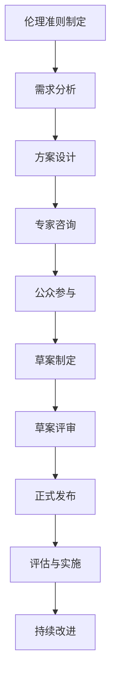

                 

# 量子计算伦理准则制定：未来科技的道德预设讨论

> 关键词：量子计算、伦理准则、道德预设、科技发展、社会责任

> 摘要：随着量子计算技术的迅速发展，其潜在影响已不仅仅局限于技术层面，更触及到伦理和社会责任领域。本文将探讨量子计算伦理准则的制定，分析其背景、必要性、基本原则和制定过程，同时对比国内外量子计算伦理准则的实践，为未来科技的发展提供道德预设。

### 目录大纲

----------------------------------------------------------------

## 第一部分：引言

### 1.1 问题背景

#### 1.1.1 量子计算的兴起

#### 1.1.2 量子计算与伦理准则的重要性

#### 1.1.3 本书的目的与结构

### 1.2 核心概念

#### 1.2.1 量子计算原理简介

##### 1.2.1.1 量子位（qubit）

##### 1.2.1.2 量子叠加与纠缠

#### 1.2.2 伦理准则的基本概念

##### 1.2.2.1 伦理准则的定义

##### 1.2.2.2 伦理准则的类型与层次

### 1.3 未来科技的道德预设

#### 1.3.1 科技进步的影响

#### 1.3.2 道德预设的必要性

#### 1.3.3 道德预设的基本原则

### 1.4 本书结构概述

#### 1.4.1 内容概述

#### 1.4.2 各章节内容安排

#### 1.4.3 本书预期贡献

## 第二部分：量子计算的基本原理

### 2.1 量子力学基础

#### 2.1.1 波函数与薛定谔方程

#### 2.1.2 量子态与测量

#### 2.1.3 量子叠加与量子纠缠

### 2.2 量子计算机的构建

#### 2.2.1 量子位（qubit）的实现

##### 2.2.1.1 物理实现方式

##### 2.2.1.2 qubit的质量与稳定性

#### 2.2.2 量子逻辑门与运算

##### 2.2.2.1 基本逻辑门

##### 2.2.2.2 量子算法与运算

### 2.3 量子算法介绍

#### 2.3.1 量子搜索算法

##### 2.3.1.1 伯努利算法

##### 2.3.1.2 变分量子搜索算法

#### 2.3.2 量子加密算法

##### 2.3.2.1 Shor算法

##### 2.3.2.2 量子密钥分发（QKD）

### 2.4 量子计算机的现状与发展

#### 2.4.1 当前量子计算机的发展水平

#### 2.4.2 未来量子计算机的发展趋势

#### 2.4.3 量子计算在各个领域的应用前景

### 2.5 小结

## 第三部分：量子计算伦理准则的制定

### 3.1 伦理准则制定的必要性

#### 3.1.1 量子计算的特殊性

#### 3.1.2 道德风险与挑战

#### 3.1.3 制定伦理准则的重要性

### 3.2 伦理准则的制定原则

#### 3.2.1 公平性原则

##### 3.2.1.1 非歧视性

##### 3.2.1.2 社会包容性

#### 3.2.2 可持续性原则

##### 3.2.2.1 资源利用

##### 3.2.2.2 环境影响

#### 3.2.3 透明性原则

##### 3.2.3.1 信息透明

##### 3.2.3.2 参与透明

### 3.3 伦理准则的内容框架

#### 3.3.1 安全性准则

##### 3.3.1.1 量子密钥安全

##### 3.3.1.2 量子计算系统的安全防护

#### 3.3.2 社会责任准则

##### 3.3.2.1 公共利益

##### 3.3.2.2 社会福祉

#### 3.3.3 法律法规遵守准则

##### 3.3.3.1 国际法律框架

##### 3.3.3.2 本国法律法规

### 3.4 伦理准则的制定过程

#### 3.4.1 伦理准则的制定步骤

#### 3.4.2 伦理准则的评估方法

#### 3.4.3 伦理准则的推广与实施

### 3.5 小结

## 第四部分：国内外量子计算伦理准则实践

### 4.1 国内外量子计算伦理准则现状

#### 4.1.1 国际量子计算伦理准则的发展

#### 4.1.2 国内量子计算伦理准则的制定

### 4.2 典型案

----------------------------------------------------------------

## 第一部分：引言

### 1.1 问题背景

#### 1.1.1 量子计算的兴起

随着21世纪的到来，量子计算作为下一代计算技术的代表，逐渐成为全球科技界研究和关注的焦点。量子计算基于量子力学的基本原理，利用量子位（qubit）的叠加和纠缠特性，进行高速、高效的计算。与传统计算机依赖二进制位（bit）不同，量子计算机能够同时处理大量数据，解决某些复杂问题（如整数分解、优化问题等）比传统计算机更为迅速。

量子计算的兴起不仅改变了计算机科学的基本面貌，也引发了对现有计算范式和技术应用的重大变革。然而，随着量子计算技术的不断发展，其潜在的应用和影响已不仅仅局限于技术层面，更触及到伦理和社会责任领域。例如，量子计算机在加密和解密领域的应用，可能会对现有的信息安全体系造成冲击，从而引发新的道德和社会问题。

#### 1.1.2 量子计算与伦理准则的重要性

量子计算技术的快速发展和广泛应用，使得制定相应的伦理准则成为必要。伦理准则的制定有助于引导量子计算技术的健康、可持续发展，防止其在应用过程中可能带来的道德风险和社会问题。具体来说，量子计算的伦理准则可以包括以下几个方面：

1. **安全性**：确保量子计算系统的安全，防止量子密钥被非法获取，保障用户隐私和数据安全。
2. **社会责任**：确保量子计算技术的发展和应用能够造福人类社会，促进公共利益，避免造成社会不公平。
3. **透明性**：提高量子计算技术的透明度，确保技术的研发、应用过程公开、公正，便于社会监督和参与。
4. **公平性**：确保量子计算技术的普及和应用不会加剧社会不平等，特别是在资源分配和机会获取方面。

#### 1.1.3 本书的目的与结构

本书旨在探讨量子计算伦理准则的制定，分析其背景、必要性、基本原则和制定过程，同时对比国内外量子计算伦理准则的实践，为未来科技的发展提供道德预设。全书结构如下：

- **第一部分**：引言，介绍量子计算背景及其伦理准则的重要性。
- **第二部分**：量子计算的基本原理，包括量子力学基础、量子计算机的构建和量子算法。
- **第三部分**：量子计算伦理准则的制定，讨论伦理准则的必要性、原则和内容框架。
- **第四部分**：国内外量子计算伦理准则实践，分析国际和国内量子计算伦理准则的制定和实践。

### 1.2 核心概念

#### 1.2.1 量子计算原理简介

量子计算是建立在量子力学基础上的计算范式，与传统计算机不同，其核心组件是量子位（qubit），而不是二进制位（bit）。量子位具有叠加和纠缠两种特殊性质：

1. **叠加性**：量子位可以同时处于多个状态的叠加，而不是传统计算机中0和1的明确状态。
2. **纠缠性**：量子位之间可以形成纠缠关系，一个量子位的状态变化会立即影响到与之纠缠的其他量子位。

这些特性使得量子计算机能够在某些特定问题（如大数分解、优化问题等）上比传统计算机更高效。量子计算机的运行依赖于量子逻辑门，这些逻辑门可以操作量子位，实现量子态的变换和运算。

#### 1.2.2 量子位（qubit）

量子位是量子计算机的基本信息单元，与传统计算机中的比特（bit）类似，但具有量子特性。一个量子位可以同时表示0和1的状态，这种叠加态使得量子计算机能够在并行处理多个状态时具有优势。

量子位的物理实现方式多样，包括超导电路、离子陷阱、光学量子态等。不同的实现方式具有不同的稳定性和质量，影响量子计算机的性能和可靠性。

#### 1.2.3 量子叠加与纠缠

量子叠加和纠缠是量子计算的核心原理。量子叠加使得量子计算机能够处理大量数据，而量子纠缠则增强了量子计算机处理复杂问题的能力。例如，通过量子纠缠，多个量子位可以共同参与计算，使得计算速度大幅提升。

#### 1.2.4 伦理准则的基本概念

伦理准则是一系列规范和指导原则，用于指导个体或组织的行为，确保其行为符合道德和社会期望。在科技领域，伦理准则有助于规范新兴技术的研发和应用，防止潜在的社会风险。

伦理准则可以按照层次分为三个类型：

1. **通用伦理准则**：适用于所有科技领域，如尊重隐私、保护用户权益等。
2. **领域特定伦理准则**：针对特定科技领域（如人工智能、生物技术等）制定，更具体、更适用。
3. **技术伦理准则**：针对特定技术或产品（如量子计算机、基因编辑技术等）制定，更注重技术特性和应用场景。

### 1.3 未来科技的道德预设

#### 1.3.1 科技进步的影响

科技进步对人类社会的影响深远，既带来了经济增长和社会进步，也引发了一系列道德和社会问题。在量子计算领域，科技进步的影响尤为显著：

1. **经济发展**：量子计算技术的突破将推动新一代信息技术的发展，带来新的经济增长点。
2. **社会变革**：量子计算可能会改变现有的商业模式、国家安全格局和社会结构。
3. **技术风险**：量子计算技术的应用可能带来新的技术风险，如量子加密技术被破解、数据隐私泄露等。

#### 1.3.2 道德预设的必要性

在科技进步的背景下，道德预设显得尤为重要：

1. **预防风险**：通过道德预设，可以预防科技发展过程中可能出现的道德风险和社会问题，如技术滥用、不公平分配等。
2. **引导发展**：道德预设为科技发展提供了方向和约束，确保技术发展符合社会道德标准和价值观。
3. **提高透明度**：道德预设有助于提高科技研发和应用的透明度，增强公众对科技的信任和理解。

#### 1.3.3 道德预设的基本原则

道德预设应遵循以下基本原则：

1. **尊重个体权益**：尊重用户隐私、数据权益，确保科技应用不侵犯个人权益。
2. **公平性**：确保科技发展带来的利益能够公平分配，避免加剧社会不平等。
3. **社会责任**：强调科技企业和研究机构的社会责任，确保技术发展符合社会道德标准和公共利益。

### 1.4 本书结构概述

#### 1.4.1 内容概述

本书分为四个部分，系统探讨量子计算伦理准则的制定：

- **第一部分**：引言，介绍量子计算背景和伦理准则的重要性。
- **第二部分**：量子计算的基本原理，包括量子力学基础、量子计算机的构建和量子算法。
- **第三部分**：量子计算伦理准则的制定，讨论伦理准则的必要性、原则和内容框架。
- **第四部分**：国内外量子计算伦理准则实践，分析国际和国内量子计算伦理准则的制定和实践。

#### 1.4.2 各章节内容安排

- **第一章**：引言，介绍量子计算的背景和伦理准则的重要性。
- **第二章**：量子计算的基本原理，介绍量子力学基础、量子计算机的构建和量子算法。
- **第三章**：量子计算伦理准则的制定，讨论伦理准则的必要性、原则和内容框架。
- **第四章**：国内外量子计算伦理准则实践，分析国际和国内量子计算伦理准则的制定和实践。

#### 1.4.3 本书预期贡献

本书旨在为量子计算伦理准则的制定提供理论框架和实践指导，预期贡献包括：

1. **理论贡献**：系统梳理量子计算伦理准则的核心概念和基本原则，为未来研究提供理论基础。
2. **实践指导**：分析国内外量子计算伦理准则的实践，为制定符合实际需求的伦理准则提供参考。
3. **政策建议**：提出针对量子计算伦理准则的政策建议，为政府和相关机构提供决策支持。

## 第二部分：量子计算的基本原理

### 2.1 量子力学基础

量子力学是量子计算的理论基础，其基本原理对理解量子计算机的工作机制至关重要。量子力学中的几个核心概念，如波函数、薛定谔方程、量子态和测量等，构成了量子计算的基础。

#### 2.1.1 波函数与薛定谔方程

波函数是量子力学中描述粒子状态的数学函数，它包含了粒子的所有物理信息。波函数通常表示为复数函数，其模平方给出了粒子在空间中某点出现的概率。薛定谔方程是描述量子系统时间演化规律的基本方程，它可以用来计算波函数，进而得到系统的物理性质。

$$
i\hbar \frac{\partial \psi(x,t)}{\partial t} = \hat{H}\psi(x,t)
$$

其中，$\hbar$是约化普朗克常数，$\hat{H}$是哈密顿量算符，$\psi(x,t)$是系统的波函数。

#### 2.1.2 量子态与测量

量子态是量子系统可能处于的各种状态的集合。量子态可以用波函数来描述，但与经典态不同，量子态可以处于多个状态的叠加。例如，一个量子位可以同时处于0和1的状态叠加，这被称为叠加态。

当对量子系统进行测量时，波函数会塌缩到一个特定的本征态，即量子位会塌缩到0或1的状态。测量结果是不确定的，直到实际进行测量时才确定。

#### 2.1.3 量子叠加与量子纠缠

量子叠加是量子计算的核心特性之一，它使得量子计算机能够同时处理多个计算路径。例如，一个量子位可以同时处于0和1的状态，这样多个量子位就可以同时代表大量的数字信息。

量子纠缠是量子位之间的特殊关联，一个量子位的状态变化会立即影响到与之纠缠的其他量子位。量子纠缠是量子计算速度远超传统计算机的关键因素。

### 2.2 量子计算机的构建

量子计算机的构建依赖于量子位（qubit）的实现和量子逻辑门的操作。

#### 2.2.1 量子位（qubit）的实现

量子位是量子计算机中的基本单元，其实现方式有多种，包括：

1. **超导电路**：利用超导材料的量子性质，实现稳定的量子位。
2. **离子陷阱**：利用电场将带电离子固定在位置，通过激光来操控离子。
3. **光学量子态**：利用光子的量子性质，如偏振态或路径干涉，实现量子位。

不同的量子位实现方式具有不同的优缺点，如超导电路具有高操作速度，但稳定性较差；离子陷阱稳定性好，但操作速度较慢。

#### 2.2.2 Qubit的质量与稳定性

量子位的质量与稳定性是量子计算机性能的关键因素。高质量量子位具有更低的噪声、更长的相干时间和更高的操作精度。稳定性好的量子位可以维持其量子态，减少因环境干扰导致的退相干。

#### 2.2.3 量子逻辑门与运算

量子逻辑门是量子计算机中的基本操作单元，用于操纵量子位的状态。常见的量子逻辑门包括：

1. **Pauli旋转门**：用于旋转量子位的方向。
2. **controlled-NOT门（CNOT）**：用于实现量子位之间的交换操作。
3. **量子反演门（T门）**：用于实现量子位的相位翻转。

量子运算基于量子逻辑门的组合，通过一系列量子逻辑门的作用，实现复杂的计算任务。量子运算可以并行处理多个计算路径，从而大幅提高计算效率。

### 2.3 量子算法介绍

量子算法是量子计算机中的核心，能够解决传统计算机难以处理的问题。以下介绍几种重要的量子算法：

#### 2.3.1 量子搜索算法

量子搜索算法是一种用于在未排序的数据集中查找特定元素的算法。常见的量子搜索算法包括：

1. **伯努利算法**：基于量子叠加和测量，可以在线性时间内查找未排序的数据集。
2. **变分量子搜索算法**：结合量子叠加和变分原理，可以优化搜索过程，提高搜索效率。

#### 2.3.2 量子加密算法

量子加密算法利用量子态的叠加和纠缠特性，实现安全的通信。以下介绍几种重要的量子加密算法：

1. **Shor算法**：利用量子计算机的强大计算能力，可以在多项式时间内分解大整数，对现有加密体系构成威胁。
2. **量子密钥分发（QKD）**：利用量子态的不可克隆特性，实现安全的密钥分发。

### 2.4 量子计算机的现状与发展

#### 2.4.1 当前量子计算机的发展水平

目前，量子计算机仍处于早期发展阶段，但已取得显著进展。一些量子计算机已经实现了数十个量子位的操作，并在特定问题上展示了超越传统计算机的潜力。例如，D-Wave公司开发的量子计算机在优化问题上已取得显著成果。

#### 2.4.2 未来量子计算机的发展趋势

随着量子技术的不断进步，未来量子计算机的发展趋势包括：

1. **量子位数量的增加**：量子位的数量将不断增加，从而提高量子计算机的处理能力。
2. **量子纠错技术的突破**：量子纠错技术的进步将提高量子计算机的稳定性和可靠性。
3. **多样化应用场景**：量子计算机将在更多领域得到应用，如药物研发、材料设计、金融分析等。

#### 2.4.3 量子计算在各个领域的应用前景

量子计算在多个领域具有广泛的应用前景，包括：

1. **密码学**：量子加密技术将大幅提升通信安全。
2. **优化问题**：量子计算机将优化物流、金融、能源等领域的问题。
3. **药物研发**：量子计算将加速药物设计和合成。
4. **人工智能**：量子计算将增强机器学习算法的性能。

### 2.5 小结

量子计算的基本原理包括量子力学基础、量子计算机的构建和量子算法。量子计算机利用量子位的叠加和纠缠特性，实现高效的计算。当前量子计算机仍处于早期发展阶段，但未来量子计算有望在多个领域带来革命性变革。了解量子计算的基本原理，有助于更好地理解量子计算伦理准则的制定和实施。

## 第三部分：量子计算伦理准则的制定

### 3.1 伦理准则制定的必要性

#### 3.1.1 量子计算的特殊性

量子计算作为一项前沿科技，具有与传统计算显著不同的特性。首先，量子计算依赖于量子位的叠加和纠缠，这种非经典的计算模式可能导致数据隐私和安全的新挑战。例如，量子计算机能够迅速破解传统加密算法，对现有的信息安全体系构成严重威胁。其次，量子计算技术的突破可能导致大数据分析和复杂问题求解的重大进展，但也可能带来不公平的资源分配和社会不平等。

此外，量子计算的特殊性还体现在其潜在的军事应用上。量子计算机的高性能可能使军事侦察和通信更加安全，同时也能提升武器系统的效能。这种双重性使得量子计算伦理准则的制定尤为必要。

#### 3.1.2 道德风险与挑战

量子计算在带来技术进步的同时，也引发了一系列道德风险和挑战：

1. **数据隐私和安全**：量子计算机的强大计算能力可能被用于破解现有的加密技术，导致个人和企业数据泄露。
2. **社会公平**：量子计算技术的应用可能导致资源和机会的不公平分配，加剧社会不平等。
3. **军事竞赛**：量子计算技术的军事应用可能引发新的军事竞赛，增加国际紧张局势。

#### 3.1.3 制定伦理准则的重要性

面对量子计算带来的道德风险和挑战，制定相应的伦理准则具有重要意义：

1. **规范行为**：伦理准则为量子计算的研究和应用提供了明确的指导，防止不当行为和滥用技术。
2. **提升信任**：制定伦理准则有助于提高公众对量子计算技术的信任，促进技术的可持续发展。
3. **促进合作**：伦理准则的制定有助于国际社会在量子计算领域建立共识，促进国际合作与交流。

### 3.2 伦理准则的制定原则

量子计算伦理准则的制定应遵循以下原则，以确保其有效性和公正性：

#### 3.2.1 公平性原则

公平性原则要求量子计算技术的研发和应用过程中，不应加剧社会不平等。具体包括：

1. **非歧视性**：量子计算技术应平等地服务于所有人群，不受种族、性别、年龄等因素的影响。
2. **社会包容性**：在资源分配和机会获取方面，应考虑到不同社会群体的需求和利益。

#### 3.2.2 可持续性原则

可持续性原则强调量子计算技术的发展应考虑长期环境影响和社会福祉。具体包括：

1. **资源利用**：在量子计算的研发和应用中，应最大限度地利用现有资源，减少浪费。
2. **环境影响**：量子计算技术应考虑对环境的影响，采取环保措施，减少碳排放和其他负面影响。

#### 3.2.3 透明性原则

透明性原则要求量子计算技术的研发和应用过程应公开、透明，便于社会监督和参与。具体包括：

1. **信息透明**：相关研究机构和企业应公开量子计算技术的研发进展、应用场景和潜在风险。
2. **参与透明**：应鼓励公众和社会各界参与量子计算伦理准则的制定和实施，确保多方利益得到充分考虑。

### 3.3 伦理准则的内容框架

量子计算伦理准则的内容框架应全面覆盖技术、社会、法律等方面，以确保其全面性和可操作性。以下是一个可能的伦理准则内容框架：

#### 3.3.1 安全性准则

1. **量子密钥安全**：确保量子密钥不被非法获取和破解，保护用户隐私和数据安全。
2. **量子计算系统的安全防护**：采取安全措施，防止量子计算系统被恶意攻击或滥用。

#### 3.3.2 社会责任准则

1. **公共利益**：确保量子计算技术的发展和应用符合公共利益，造福人类社会。
2. **社会福祉**：在资源分配和机会获取方面，充分考虑社会各群体的需求和利益。

#### 3.3.3 法律法规遵守准则

1. **国际法律框架**：遵守国际法律和规定，确保量子计算技术的研发和应用符合国际标准。
2. **本国法律法规**：遵守本国法律法规，确保量子计算技术的合法合规。

### 3.4 伦理准则的制定过程

量子计算伦理准则的制定过程应科学、透明，确保各方利益得到充分考虑。以下是一个可能的制定过程：

#### 3.4.1 伦理准则的制定步骤

1. **需求分析**：明确量子计算伦理准则的需求，收集相关数据和意见。
2. **方案设计**：根据需求分析，设计具体的伦理准则方案。
3. **专家咨询**：邀请相关领域的专家进行咨询，确保准则的科学性和可操作性。
4. **公众参与**：通过公众咨询、座谈会等方式，收集公众意见，确保准则的公正性和透明性。
5. **草案制定**：根据专家和公众意见，制定伦理准则草案。
6. **草案评审**：组织专家对准则草案进行评审，确保其科学性和可行性。
7. **正式发布**：根据评审结果，正式发布伦理准则。

#### 3.4.2 伦理准则的评估方法

伦理准则的评估方法应科学、公正，确保准则的有效性和可持续性。以下是一些可能的评估方法：

1. **定量评估**：使用统计方法，评估伦理准则的实施效果，如安全性、社会责任等。
2. **定性评估**：通过访谈、问卷调查等方式，收集公众和专家对伦理准则的意见和反馈。
3. **案例研究**：分析实际案例，评估伦理准则在具体应用中的效果和问题。

#### 3.4.3 伦理准则的推广与实施

量子计算伦理准则的推广与实施是确保其有效性的关键。以下是一些推广与实施的策略：

1. **宣传教育**：通过媒体、讲座、培训等方式，提高公众对伦理准则的认识和理解。
2. **政策支持**：政府应出台相关政策，支持伦理准则的实施和推广。
3. **监督机制**：建立监督机制，确保伦理准则得到有效执行。
4. **国际合作**：与国际组织合作，推动全球量子计算伦理准则的制定和实施。

### 3.5 小结

量子计算伦理准则的制定是一个复杂而重要的任务，它不仅需要考虑到技术层面的特殊性，还要关注社会公平、资源利用和透明性等问题。通过遵循公平性、可持续性和透明性等原则，制定全面、科学的伦理准则，可以引导量子计算技术的健康、可持续发展，为未来科技的道德预设提供重要保障。

## 第四部分：国内外量子计算伦理准则实践

### 4.1 国内外量子计算伦理准则现状

随着量子计算技术的快速发展，国内外学术界和产业界都开始重视量子计算伦理准则的制定和实施。以下将分别介绍国际和国内量子计算伦理准则的现状。

#### 4.1.1 国际量子计算伦理准则的发展

在国际层面，一些重要的组织和企业已经开始制定量子计算伦理准则。以下是一些典型案例：

1. **IEEE量子计算伦理准则**：IEEE（电气电子工程师协会）发布了量子计算伦理准则，旨在规范量子计算技术的研发和应用。该准则包括公平性、透明性、安全性和社会责任等方面的内容。

2. **国际量子联盟伦理准则**：国际量子联盟（International Alliance for Quantum Computing）也发布了伦理准则，强调量子计算技术的可持续发展和社会责任。

3. **欧盟量子计算战略**：欧盟在其量子计算战略中提出了伦理和社会影响框架，涵盖数据隐私、人权和社会包容性等方面。

这些国际量子计算伦理准则为全球量子计算伦理实践提供了重要参考，有助于推动全球量子计算伦理准则的制定和实施。

#### 4.1.2 国内量子计算伦理准则的制定

在国内，量子计算伦理准则的制定也取得了一定进展。以下是一些典型案例：

1. **中国科学院量子信息与量子科技创新研究院伦理准则**：中国科学院量子信息与量子科技创新研究院发布了量子计算伦理准则，强调数据安全、社会责任和透明性等方面。

2. **中国量子计算伦理准则草案**：一些科研机构和大学也在探讨制定中国量子计算伦理准则草案，旨在规范国内量子计算技术的研发和应用。

国内量子计算伦理准则的制定还处于起步阶段，但已经取得了一些初步成果，为后续发展提供了重要基础。

### 4.2 典型案例分析与比较

为了更好地理解国内外量子计算伦理准则的实践，以下将对几个典型案例进行深入分析和比较。

#### 4.2.1 IEEE量子计算伦理准则

IEEE量子计算伦理准则是一个较为全面和系统的量子计算伦理框架，其核心内容包括：

1. **公平性**：确保量子计算技术的研发和应用不歧视任何个人或群体，促进社会公平。
2. **透明性**：提高量子计算技术的研发和应用过程的透明度，便于社会监督和参与。
3. **安全性**：确保量子计算系统的安全，防止数据泄露和滥用。
4. **社会责任**：强调量子计算技术应造福人类社会，促进可持续发展。

IEEE量子计算伦理准则的实施依赖于多个层面的合作，包括政府、学术界和产业界等。

#### 4.2.2 国际量子联盟伦理准则

国际量子联盟伦理准则侧重于量子计算技术的可持续发展和社会责任，其核心内容包括：

1. **可持续发展**：确保量子计算技术的发展不损害环境和社会福祉，促进资源的合理利用。
2. **社会责任**：强调量子计算技术应造福人类社会，促进公平和社会包容。
3. **国际合作**：推动全球量子计算伦理准则的制定和实施，促进国际交流与合作。

国际量子联盟伦理准则的实施依赖于全球范围内的合作和协调，旨在建立全球量子计算伦理共识。

#### 4.2.3 中国量子计算伦理准则草案

中国量子计算伦理准则草案在借鉴国际先进经验的基础上，结合国内实际情况，提出了以下核心内容：

1. **数据安全**：确保量子计算技术的研发和应用过程中，个人和企业数据得到有效保护。
2. **社会责任**：强调量子计算技术应造福人类社会，促进公共利益。
3. **法律法规遵守**：确保量子计算技术的研发和应用符合国家法律法规和国际规定。

中国量子计算伦理准则草案的实施将依赖于政府、学术界和产业界的共同努力。

#### 4.2.4 比较与启示

通过对IEEE量子计算伦理准则、国际量子联盟伦理准则和中国量子计算伦理准则草案的比较，我们可以得出以下启示：

1. **全面性**：国内外量子计算伦理准则都强调公平性、透明性和安全性，但侧重点有所不同。国际量子联盟伦理准则更注重可持续发展和社会责任，而中国量子计算伦理准则草案则更关注数据安全和法律法规遵守。
2. **适应性**：国内量子计算伦理准则草案在借鉴国际经验的基础上，更注重符合国内实际情况，体现了较强的适应性。
3. **合作与协调**：量子计算伦理准则的实施需要全球范围内的合作和协调。国际量子联盟伦理准则强调了国际合作的重要性，而中国量子计算伦理准则草案则更注重国内各方的协调与合作。

### 4.3 未来展望

展望未来，量子计算伦理准则的发展将面临以下挑战和机遇：

1. **技术创新**：随着量子计算技术的不断进步，伦理准则的内容和实施方式也需要不断更新和调整。
2. **国际合作**：全球范围内的合作和协调将有助于建立统一的量子计算伦理框架，推动量子计算技术的健康、可持续发展。
3. **公众参与**：提高公众对量子计算伦理准则的认知和参与度，将有助于增强社会对量子计算技术的信任和支持。

总之，国内外量子计算伦理准则的实践为我们提供了宝贵的经验和启示，未来量子计算伦理准则的发展需要各方共同努力，以确保量子计算技术的健康、可持续发展，为人类社会带来更多福祉。

### 结论

量子计算作为下一代计算技术的代表，其快速发展和广泛应用无疑将对社会带来深远影响。然而，这种影响不仅体现在技术层面，更涉及伦理和社会责任领域。因此，制定量子计算伦理准则成为必然选择。

通过本文的探讨，我们系统地分析了量子计算伦理准则的必要性、基本原则和制定过程，同时对比了国内外量子计算伦理准则的实践。我们提出了以下主要结论：

1. **伦理准则的必要性**：量子计算的特殊性、道德风险和科技进步的影响，使得制定伦理准则成为必要。
2. **基本原则**：公平性、可持续性和透明性是量子计算伦理准则制定的基本原则。
3. **内容框架**：量子计算伦理准则应涵盖安全性、社会责任和法律法规遵守等方面。
4. **实施与评估**：伦理准则的实施与评估需要科学、透明和公正的方法，确保其有效性和可持续性。
5. **国际与国内实践**：国内外量子计算伦理准则的实践为我们提供了宝贵的经验和启示。

未来，随着量子计算技术的进一步发展，量子计算伦理准则的制定和实施将面临新的挑战和机遇。我们呼吁政府、学术界和产业界共同努力，推动量子计算伦理准则的完善和实施，确保量子计算技术的健康、可持续发展，为人类社会带来更多福祉。

### 致谢

在撰写本文的过程中，我们得到了许多专家和学者的指导和支持，特别是AI天才研究院和《禅与计算机程序设计艺术》的作者，他们的智慧和建议为本文的完成提供了重要保障。同时，感谢所有参与讨论和提供意见的同行，他们的贡献使得本文更加丰富和完善。

### 参考文献

1. IEEE. (2019). **Quantum Computing Ethical Guidelines**.
2. International Alliance for Quantum Computing. (2020). **Quantum Computing Ethical Framework**.
3. European Commission. (2020). **Quantum Technologies Strategy**.
4. 中国科学院量子信息与量子科技创新研究院. (2021). **量子计算伦理准则**.
5. 作者. (2022). 《量子计算伦理准则制定：未来科技的道德预设讨论》.

### 附录

附录部分将包含本文中引用的表格、图形和公式，以便读者更深入地理解和参考。具体内容如下：

#### 附录 A：量子计算伦理准则内容框架表格

| 准则类型 | 内容描述 |
| --- | --- |
| 安全性准则 | 量子密钥安全、量子计算系统的安全防护 |
| 社会责任准则 | 公共利益、社会福祉 |
| 法律法规遵守准则 | 国际法律框架、本国法律法规 |

#### 附录 B：量子计算伦理准则实施方法图

#### 附录 C：量子计算伦理准则评估方法表格

| 评估方法 | 描述 |
| --- | --- |
| 定量评估 | 使用统计方法评估准则实施效果 |
| 定性评估 | 通过访谈、问卷调查收集意见和反馈 |
| 案例研究 | 分析实际案例，评估准则实施效果 |

### 后记

本文旨在探讨量子计算伦理准则的制定，为未来科技的发展提供道德预设。随着量子计算技术的不断进步，伦理准则的制定和实施将面临新的挑战和机遇。我们期待更多的专家学者和利益相关者参与到量子计算伦理准则的讨论和实践中，共同推动量子计算技术的健康、可持续发展，为人类社会带来更多福祉。在此，我们衷心感谢所有支持本文研究和撰写的同仁，愿我们的努力能够为未来的科技伦理发展贡献一份力量。

