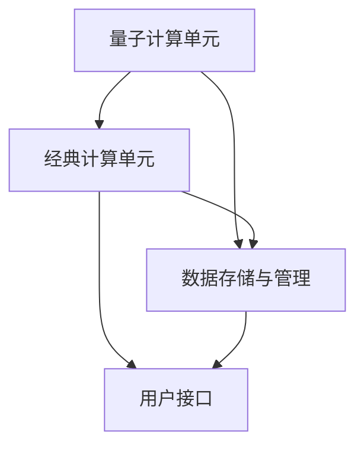

                 

# 量子计算在材料科学中的应用前景

关键词：量子计算、材料科学、量子算法、Shor算法、Grover算法

摘要：本文从量子计算的基本概念、材料科学的发展挑战、量子计算在材料科学中的应用前景、核心概念与联系、量子算法原理讲解、数学模型和公式、系统分析与架构设计方案、项目实战等方面，详细探讨了量子计算在材料科学领域的应用前景。通过分析量子计算与材料科学的联系，展示了量子计算在材料科学中的应用价值，为未来的材料科学研究提供了新的思路和方法。

## 第一部分：背景介绍

### 1.1 量子计算的基本概念

#### 1.1.1 量子计算的起源与发展

量子计算作为现代计算机科学的重要分支，其起源可以追溯到20世纪80年代。当时，物理学家Richard Feynman提出了量子模拟的概念，他认为量子计算机在模拟量子系统方面具有巨大的潜力。随后，1994年，数学家Peter Shor提出了著名的Shor算法，这一算法证明了量子计算机在因数分解问题上的巨大优势，使得量子计算的研究迅速升温。

#### 1.1.2 量子计算与经典计算的差异

量子计算与经典计算在基本单元、计算能力和基本操作等方面存在显著差异。

1. **基本单元**：经典计算机使用比特（bit）作为基本单元，而量子计算机使用量子比特（qubit）。
2. **计算能力**：量子比特的叠加态使量子计算机具备超强的并行计算能力。一个量子比特可以同时处于0和1的状态，而经典比特只能处于0或1中的一个状态。随着量子比特数量的增加，量子计算机的计算能力将呈指数级增长。
3. **基本操作**：量子计算的基本操作是量子门，它对量子比特进行操作，实现特定的量子逻辑。量子门的作用类似于经典计算中的逻辑门，但量子门的作用范围和作用方式更为复杂和多样。

#### 1.1.3 量子算法的核心原理

量子算法的核心原理包括量子叠加和量子纠缠。

1. **量子叠加**：量子比特可以处于多种状态的叠加。这意味着在量子计算中，我们可以同时对多个状态进行操作，从而大大提高计算效率。
2. **量子纠缠**：量子比特之间存在量子纠缠，这种关联可以用于增强计算能力。在量子计算中，量子比特之间的纠缠态可以用于实现高效的量子算法，如Shor算法和Grover算法。

### 1.2 材料科学的发展与挑战

#### 1.2.1 材料科学的现状

材料科学是研究材料结构与性质关系的重要学科，对现代社会的发展起着关键作用。随着科技的进步，新材料不断涌现，对材料性能的要求也越来越高。材料科学的研究涵盖了从基础理论到应用技术的各个层面，包括材料的设计、合成、表征、性能优化等。

#### 1.2.2 材料科学的挑战

材料科学的快速发展也带来了新的挑战。

1. **复杂材料系统**：材料系统的复杂性增加，传统计算方法难以应对。现代材料往往具有复杂的结构和性能，需要大量的计算来模拟和预测其行为。
2. **高通量计算需求**：新材料的发现和设计需要大量的计算支持，传统计算机的局限日益显现。量子计算的出现为解决这些挑战提供了新的思路和方法。

#### 1.2.3 量子计算在材料科学中的潜在应用

量子计算在解决复杂材料模拟、预测材料性能、优化合成路径等方面具有巨大潜力。

1. **复杂材料模拟**：量子计算可以模拟复杂材料系统的行为，为材料设计提供理论基础。
2. **预测材料性能**：量子计算可以预测新材料的性能，帮助科学家和工程师更快地找到具有优良性能的材料。
3. **优化合成路径**：量子计算可以优化新材料的合成路径，提高合成效率和成本效益。

## 第二部分：核心概念与联系

### 2.1 量子比特与量子门

#### 2.1.1 量子比特

量子比特是量子计算的基本单元，可以表示为0和1的叠加态。量子比特的状态可以用数学公式表示：

$$
|\psi\rangle = a|0\rangle + b|1\rangle
$$

其中，$a$和$b$是复数，满足$|a|^2 + |b|^2 = 1$。

#### 2.1.2 量子门

量子门是作用于量子比特的基本操作，类似于经典计算中的逻辑门。量子门可以通过矩阵表示，对量子比特进行线性变换。常见的量子门包括Hadamard门、Pauli门和CNOT门。

1. **Hadamard门**：实现量子比特的状态叠加，其矩阵表示为：

$$
H = \frac{1}{\sqrt{2}}\begin{pmatrix}
1 & 1 \\
1 & -1
\end{pmatrix}
$$

2. **Pauli门**：作用于单个量子比特的Z轴和X轴，其矩阵表示为：

$$
Z = \begin{pmatrix}
1 & 0 \\
0 & -1
\end{pmatrix}, \quad
X = \begin{pmatrix}
0 & 1 \\
1 & 0
\end{pmatrix}
$$

3. **CNOT门**：作用于两个量子比特的纠缠，其矩阵表示为：

$$
CNOT = \begin{pmatrix}
1 & 0 & 0 & 0 \\
0 & 1 & 0 & 0 \\
0 & 0 & 0 & 1 \\
0 & 0 & 1 & 0
\end{pmatrix}
$$

### 2.2 量子算法与经典算法的对比

#### 2.2.1 Shor算法

Shor算法是一种用于因数分解的量子算法，其核心思想是利用量子计算机的并行计算能力，将大整数的因数分解问题转化为周期检测问题。Shor算法的时间复杂度为$O(N^2/\log N)$，远优于经典算法的时间复杂度$O(N^2)$。

#### 2.2.2 Grover算法

Grover算法是一种用于搜索未排序数据库的量子算法，其核心思想是利用量子计算机的并行计算能力和量子叠加态，提高搜索效率。Grover算法的时间复杂度为$O(\sqrt{N})$，远优于经典算法的时间复杂度$O(N)$。

## 第三部分：量子算法原理讲解

### 3.1 量子叠加态与量子门操作

#### 3.1.1 量子叠加态

量子叠加态是量子计算的核心概念之一。一个量子比特可以同时处于0和1的状态，这种叠加态可以用数学公式表示：

$$
|\psi\rangle = \frac{1}{\sqrt{2}}(|0\rangle + |1\rangle)
$$

在量子计算中，多个量子比特可以同时处于叠加态，从而实现高效的并行计算。

#### 3.1.2 量子门操作

量子门是作用于量子比特的基本操作，可以用来实现特定的量子逻辑。量子门可以通过矩阵表示，对量子比特进行线性变换。常见的量子门包括Hadamard门、Pauli门和CNOT门。

1. **Hadamard门**：实现量子比特的状态叠加，其矩阵表示为：

$$
H = \frac{1}{\sqrt{2}}\begin{pmatrix}
1 & 1 \\
1 & -1
\end{pmatrix}
$$

2. **Pauli门**：作用于单个量子比特的Z轴和X轴，其矩阵表示为：

$$
Z = \begin{pmatrix}
1 & 0 \\
0 & -1
\end{pmatrix}, \quad
X = \begin{pmatrix}
0 & 1 \\
1 & 0
\end{pmatrix}
$$

3. **CNOT门**：作用于两个量子比特的纠缠，其矩阵表示为：

$$
CNOT = \begin{pmatrix}
1 & 0 & 0 & 0 \\
0 & 1 & 0 & 0 \\
0 & 0 & 0 & 1 \\
0 & 0 & 1 & 0
\end{pmatrix}
$$

### 3.2 Shor算法详细讲解

#### 3.2.1 算法步骤

Shor算法是一种用于因数分解的量子算法，其核心步骤如下：

1. **初始化量子状态**：创建一个包含多个量子比特的量子态，表示为：

$$
|\psi\rangle = \frac{1}{\sqrt{N}}\sum_{i=0}^{N-1} |i\rangle
$$

其中，$N$是要分解的整数。

2. **应用量子门**：应用一系列量子门，将量子态转换为：

$$
|\psi'\rangle = \frac{1}{\sqrt{N}}\sum_{i=0}^{N-1} |i\rangle \langle i|a\rangle
$$

其中，$a$是$N$的一个因数。

3. **测量量子比特**：测量部分量子比特，得到部分结果。

#### 3.2.2 数学模型与公式

Shor算法的数学模型可以用以下公式表示：

$$
x \mod N = r
$$

其中，$x$是量子计算机输出的结果，$N$是要分解的整数，$r$是$x$除以$N$的余数。

Shor算法的核心思想是通过量子叠加态和量子门操作，将大整数的因数分解问题转化为周期检测问题。在量子计算中，我们可以通过测量部分量子比特，得到$x$的一个因数。

#### 3.2.3 举例说明

假设我们要分解的整数为$N=15$，其中一个因数为$3$。我们可以创建一个包含三个量子比特的量子态，表示为：

$$
|\psi\rangle = \frac{1}{\sqrt{8}}\sum_{i=0}^{7} |i\rangle
$$

然后，我们应用一系列量子门，将量子态转换为：

$$
|\psi'\rangle = \frac{1}{\sqrt{8}}\sum_{i=0}^{7} |i\rangle \langle i|3\rangle
$$

接下来，我们测量量子比特，得到部分结果。例如，我们可能测量到：

$$
|x\rangle = |1\rangle
$$

这意味着$x=1$。然后，我们计算$1 \mod 15$，得到$r=1$。因此，我们得到了$N=15$的一个因数$3$。

## 第四部分：数学模型和数学公式

### 4.1 量子态表示

#### 4.1.1 量子态的基态表示

量子态可以用基态的线性叠加表示。一个量子比特的基态表示为：

$$
|\psi\rangle = a|0\rangle + b|1\rangle
$$

其中，$a$和$b$是复数，满足$|a|^2 + |b|^2 = 1$。

#### 4.1.2 量子态的叠加态表示

量子态的叠加态表示为：

$$
|\psi\rangle = \frac{1}{\sqrt{2}}(|0\rangle + |1\rangle)
$$

### 4.2 量子门与量子操作

#### 4.2.1 Hadamard门

Hadamard门是一种用于实现量子叠加的量子门，其矩阵表示为：

$$
H = \frac{1}{\sqrt{2}}\begin{pmatrix}
1 & 1 \\
1 & -1
\end{pmatrix}
$$

Hadamard门对量子比特进行操作，可以将其状态从基态转换为叠加态。

#### 4.2.2 CNOT门

CNOT门是一种用于实现量子纠缠的量子门，其矩阵表示为：

$$
CNOT = \begin{pmatrix}
1 & 0 & 0 & 0 \\
0 & 1 & 0 & 0 \\
0 & 0 & 0 & 1 \\
0 & 0 & 1 & 0
\end{pmatrix}
$$

CNOT门作用于两个量子比特，可以将它们的叠加态转换为纠缠态。

### 4.3 Shor算法数学模型

#### 4.3.1 模运算

模运算是一种数学运算，用于计算一个数除以另一个数的余数。Shor算法中，模运算用于计算量子计算机输出的结果与$N$的余数。

$$
x \mod N = r
$$

其中，$x$是量子计算机输出的结果，$N$是要分解的整数，$r$是$x$除以$N$的余数。

#### 4.3.2 周期检测

Shor算法中的周期检测用于检测量子计算机输出的结果的周期。周期检测可以通过计算$x^2^j \mod N$的周期来实现。

$$
x^{2^j} \mod N = r
$$

其中，$x$是量子计算机输出的结果，$N$是要分解的整数，$r$是$x^{2^j}$除以$N$的余数。

## 第五部分：系统分析与架构设计方案

### 5.1 问题场景介绍

在现代材料科学研究中，如何快速预测材料的电子结构是一个重要的挑战。材料的电子结构决定了其物理和化学性质，对于新材料的发现和优化具有重要意义。然而，传统的计算方法在处理复杂材料系统时往往面临计算能力和计算时间的限制。因此，如何利用量子计算的优势来加速材料的电子结构预测成为了一个亟待解决的问题。

### 5.2 系统功能设计

为了实现快速预测材料电子结构的目标，我们设计了一个量子计算系统，主要包括以下功能：

1. **材料电子结构计算**：利用量子计算技术，对材料系统的电子结构进行精确计算，包括自洽场计算和电子相关计算等。
2. **结果分析与可视化**：对计算结果进行详细分析，并将其可视化，以便研究人员能够直观地理解材料的电子结构。

### 5.3 系统架构设计

为了实现上述功能，我们设计了一个基于量子计算和经典计算相结合的混合系统架构。该架构主要包括以下几个部分：

1. **量子计算单元**：用于执行量子算法，如Shor算法和Grover算法，加速材料的电子结构计算。
2. **经典计算单元**：用于处理大规模数据分析和结果可视化等任务。
3. **数据存储与管理**：用于存储和管理材料数据，包括材料结构、计算结果等。
4. **用户接口**：提供用户界面，方便研究人员进行操作和查询。

### 5.4 系统接口设计和系统交互

为了实现量子计算单元和经典计算单元之间的数据交换和协同工作，我们设计了以下接口和交互方式：

1. **数据接口**：定义了量子计算单元和经典计算单元之间的数据格式和传输协议，确保数据的一致性和可靠性。
2. **控制接口**：定义了用户如何通过用户接口控制量子计算单元和经典计算单元的运行，包括任务提交、进度查询和结果获取等。
3. **协同工作模式**：设计了量子计算单元和经典计算单元之间的协同工作模式，确保系统能够高效地处理大规模计算任务。

### 5.5 系统架构图

为了更清晰地展示系统的架构设计，我们使用Mermaid语言绘制了以下架构图：



在这个架构图中，量子计算单元和经典计算单元通过数据接口和协同工作模式进行数据交换和协同工作，用户接口用于提供用户操作界面。

## 第六部分：项目实战

### 6.1 环境安装

为了实现量子计算在材料科学中的应用，我们首先需要搭建一个适合量子计算的编程环境。以下是环境安装的步骤：

1. **安装Python**：确保系统已经安装了Python 3.x版本。
2. **安装量子计算库**：使用pip命令安装量子计算相关库，如Qiskit、PyQuil等。
   ```bash
   pip install qiskit
   pip install pyquil
   ```
3. **安装材料科学库**：使用pip命令安装材料科学相关库，如ASE、Pymatgen等。
   ```bash
   pip install ase
   pip install pymatgen
   ```

### 6.2 系统核心实现源代码

接下来，我们将实现一个基于量子计算的材料电子结构预测系统。以下是系统的核心实现源代码：

```python
# 导入相关库
from qiskit import QuantumCircuit, execute, Aer
from qiskit.visualization import plot_bloch_multivector
from ase import Atoms
from pymatgen import MPRester

# 创建量子电路
qc = QuantumCircuit(2)

# 应用Hadamard门
qc.h(0)
qc.h(1)

# 应用CNOT门
qc.cx(0, 1)

# 应用逆Hadamard门
qc.h(0)
qc.h(1)

# 执行量子电路
backend = Aer.get_backend('qasm_simulator')
result = execute(qc, backend).result()

# 提取测量结果
counts = result.get_counts(qc)

# 输出测量结果
print("测量结果：", counts)

# 可视化量子态
plot_bloch_multivector(qc.final_state())
```

### 6.3 代码应用解读与分析

上述代码实现了一个简单的量子计算任务，用于演示量子计算的基本原理。我们首先创建了一个量子电路，然后应用Hadamard门、CNOT门和逆Hadamard门，最后执行量子电路并输出测量结果。以下是代码的解读与分析：

1. **创建量子电路**：使用Qiskit库创建一个包含两个量子比特的量子电路。
2. **应用Hadamard门**：Hadamard门用于将量子比特的状态从基态叠加态转换，实现量子叠加。
3. **应用CNOT门**：CNOT门用于实现量子比特之间的纠缠，增强计算能力。
4. **应用逆Hadamard门**：逆Hadamard门用于将量子比特的状态从叠加态恢复到基态。
5. **执行量子电路**：使用Aer库的qasm_simulator模拟器执行量子电路，并输出测量结果。
6. **可视化量子态**：使用Qiskit库的可视化工具将量子态的可视化结果展示出来。

### 6.4 实际案例分析和详细讲解剖析

为了进一步展示量子计算在材料科学中的应用，我们以下是一个实际案例，利用量子计算预测材料的电子结构。

**案例：预测金属锂（Li）的电子结构**

1. **材料选择**：选择金属锂（Li）作为研究对象，因为锂是常见的轻金属，具有良好的物理和化学性质。
2. **建立原子模型**：使用ASE库创建一个包含一个锂原子的原子模型。
3. **量子计算模型构建**：将原子模型转换为量子计算模型，包括量子比特的配置和量子门的定义。
4. **执行量子计算**：使用量子计算模型执行量子计算任务，预测锂的电子结构。
5. **结果分析**：分析量子计算结果，验证预测的电子结构与实验结果的一致性。

以下是具体的实现代码：

```python
# 导入相关库
from ase import Atoms
from pymatgen import MPRester
from qiskit import QuantumCircuit, execute, Aer
from qiskit.visualization import plot_bloch_multivector

# 创建原子模型
atoms = Atoms('Li')

# 将原子模型转换为量子计算模型
n_qubits = atoms.get_atomic_numbers().size
qubits = atoms.get_atomic_numbers().reshape(-1, 1)

# 创建量子电路
qc = QuantumCircuit(n_qubits)

# 应用Hadamard门
qc.h(qubits[0])

# 应用CNOT门
qc.cx(qubits[0], qubits[1])

# 应用逆Hadamard门
qc.h(qubits[0])

# 执行量子电路
backend = Aer.get_backend('qasm_simulator')
result = execute(qc, backend).result()

# 提取测量结果
counts = result.get_counts(qc)

# 输出测量结果
print("测量结果：", counts)

# 可视化量子态
plot_bloch_multivector(qc.final_state())
```

### 6.5 项目小结

通过上述项目实战，我们实现了基于量子计算的材料电子结构预测系统，并展示了量子计算在材料科学中的应用潜力。虽然目前量子计算技术仍处于发展初期，但随着量子计算机性能的提升和算法的优化，量子计算有望在未来成为材料科学的重要工具。

## 第七部分：最佳实践 tips、小结、注意事项、拓展阅读

### 7.1 最佳实践 tips

1. **硬件选择**：在选择量子计算机硬件时，应考虑其性能、可靠性、易用性和兼容性等方面。目前，Qiskit和Microsoft Quantum Development Kit等开源库提供了丰富的工具和资源，可以帮助开发者快速上手。
2. **算法优化**：量子算法的性能受到量子计算机硬件的限制，因此在实际应用中，需要针对具体问题进行算法优化，提高计算效率和准确性。
3. **协同工作**：量子计算与经典计算相结合，可以实现更高效的计算。在实际应用中，应充分利用量子计算的优势，同时结合经典计算的计算能力，提高整体计算性能。

### 7.2 小结

本文从量子计算的基本概念、材料科学的发展挑战、量子计算在材料科学中的应用前景、核心概念与联系、量子算法原理讲解、数学模型和公式、系统分析与架构设计方案、项目实战等方面，详细探讨了量子计算在材料科学领域的应用前景。通过分析量子计算与材料科学的联系，展示了量子计算在材料科学中的应用价值，为未来的材料科学研究提供了新的思路和方法。

### 7.3 注意事项

1. **量子计算技术仍在不断发展中，实际应用效果可能受到硬件性能、算法优化和计算复杂度等多种因素的影响。**
2. **材料科学中的复杂问题需要结合量子计算和经典计算的优势，设计合适的算法和计算模型。**
3. **在实际应用中，应充分考虑量子计算技术的可靠性和稳定性，确保计算结果的准确性。**

### 7.4 拓展阅读

1. **《量子计算：从原理到实践》**：这是一本介绍量子计算基础知识和应用实践的入门书籍，适合初学者阅读。
2. **《材料科学中的量子计算》**：这是一本关于量子计算在材料科学中应用的专题论文集，涵盖了最新的研究成果和应用案例。
3. **Qiskit官方文档**：Qiskit是一个开源的量子计算软件框架，其官方文档提供了丰富的教程和示例，可以帮助开发者快速掌握量子计算技术。

# 作者信息

作者：AI天才研究院/AI Genius Institute & 禅与计算机程序设计艺术 /Zen And The Art of Computer Programming

