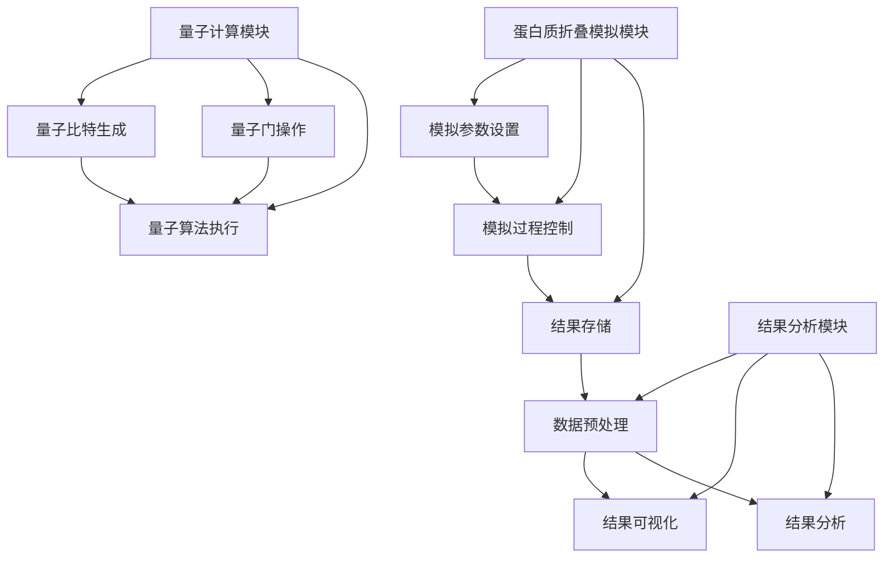
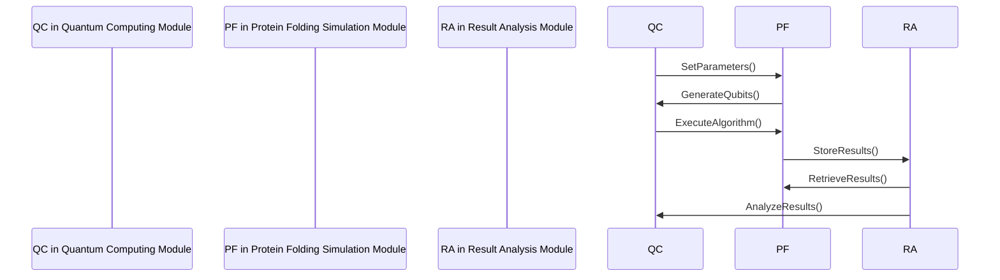

                 

# 量子计算在蛋白质折叠模拟中的应用

## 关键词

量子计算、蛋白质折叠、模拟、生物信息学、算法优化

## 摘要

随着科学技术的快速发展，量子计算作为一种新兴的计算模式，正逐步改变传统计算机的性能极限。本文主要探讨量子计算在蛋白质折叠模拟中的应用，通过深入分析量子计算的基本原理和蛋白质折叠的复杂性，阐述量子计算如何有效地解决蛋白质折叠问题。本文将从量子计算基础、蛋白质折叠模拟的基本概念、量子计算与蛋白质折叠模拟的结合、具体应用实例、系统设计与实现以及项目实战等方面进行详细讲解，旨在为读者提供一个全面了解量子计算在生物信息学领域应用的视角。

## 引言

### 1.1 问题背景

蛋白质折叠是生命科学中的核心问题，其正确折叠决定蛋白质的功能和生物学效应。传统的计算机模拟方法在处理大规模蛋白质结构时，面临着计算效率和精度上的挑战。量子计算作为一种全新的计算范式，具有并行性和指数级的计算能力，为解决蛋白质折叠问题提供了新的思路。

### 1.2 蛋白质折叠与量子计算简介

蛋白质折叠是生物大分子从无序的线性多肽链形成具有特定三维结构的过程。量子计算则利用量子比特的叠加和纠缠特性，通过量子算法实现复杂问题的求解。二者的结合有望提高蛋白质折叠模拟的效率和准确性。

### 1.3 本书结构安排与学习目标

本文首先介绍量子计算的基础知识，包括量子比特、量子门和量子算法等。接着，详细讲解蛋白质折叠模拟的基本概念，包括折叠过程、模型算法和数据库等。然后，探讨量子计算在蛋白质折叠模拟中的应用，并给出具体的应用实例。最后，通过系统设计与实现以及项目实战，展示量子计算在蛋白质折叠模拟中的实际应用。

## 量子计算基础

### 2.1 量子比特与量子门

量子比特是量子计算的基本单位，它可以同时处于0和1的叠加状态。量子门是对量子比特进行操作的基本算子，通过量子门可以实现量子态的变换。

### 2.2 量子算法基础

量子算法是利用量子计算机进行问题求解的算法，如Shor算法和Grover算法等。量子算法通常具有指数级的加速效应，能够解决传统计算机无法在可接受时间内解决的难题。

### 2.3 量子计算机的工作原理

量子计算机通过量子比特的叠加和纠缠实现信息的存储和处理。量子计算机的运行依赖于量子态的叠加和量子门的作用，通过量子测量获得计算结果。

### 2.4 量子算法的应用

量子算法在密码学、组合优化和量子化学等领域具有广泛的应用。在生物信息学中，量子计算可以用于蛋白质折叠模拟、基因组分析和药物设计等。

## 蛋白质折叠模拟的基本概念

### 3.1 蛋白质折叠的重要性

蛋白质折叠是生命科学的核心问题，正确的折叠决定了蛋白质的功能和生物学效应。蛋白质折叠模拟对于理解生物系统的功能和疾病机制具有重要意义。

### 3.2 蛋白质折叠的模型与算法

蛋白质折叠模拟采用各种模型和算法，如基于物理的模型、力场模型和机器学习模型等。常见的蛋白质折叠算法包括分子动力学模拟、蒙特卡罗模拟和遗传算法等。

### 3.3 蛋白质结构数据库

蛋白质结构数据库如PDB（蛋白质数据银行），存储了大量的蛋白质结构信息，为蛋白质折叠模拟提供了重要的数据资源。

### 3.4 蛋白质折叠模拟的挑战

蛋白质折叠模拟面临计算复杂度高、模拟时间长的挑战。传统计算机模拟方法难以处理大规模蛋白质结构，需要量子计算提供新的解决方案。

## 量子计算与蛋白质折叠模拟的结合

### 4.1 量子计算在生物信息学中的应用

量子计算在生物信息学中具有广泛的应用前景，如基因组分析、蛋白质结构预测和药物设计等。在蛋白质折叠模拟中，量子计算可以加速计算过程，提高模拟精度。

### 4.2 量子计算在蛋白质折叠模拟中的应用

量子计算在蛋白质折叠模拟中的应用主要体现在量子算法的优化和计算资源的利用。通过量子算法，可以高效地解决蛋白质折叠问题，提高模拟的效率和准确性。

### 4.3 量子算法在蛋白质折叠模拟中的优化

量子算法如Shor算法、Grover算法和变分量子演化算法等，可以用于蛋白质折叠模拟的优化。这些算法通过量子并行性和指数级加速，提高了蛋白质折叠模拟的性能。

## 量子计算算法在蛋白质折叠模拟中的应用实例

### 5.1 Shor算法与蛋白质折叠

Shor算法是一种高效的因数分解算法，可以用于优化蛋白质折叠模拟。通过Shor算法，可以快速找到蛋白质折叠的稳定结构，提高模拟的精度。

### 5.2 Grover算法与蛋白质搜索

Grover算法是一种高效的搜索算法，可以用于在蛋白质结构数据库中快速找到特定的蛋白质结构。通过Grover算法，可以加速蛋白质折叠模拟的过程。

### 5.3 变分量子演化算法在蛋白质折叠模拟中的应用

变分量子演化算法是一种基于量子力学的优化算法，可以用于蛋白质折叠模拟中的能量最小化问题。通过变分量子演化算法，可以高效地找到蛋白质的最优折叠结构。

### 5.4 其他量子算法在蛋白质折叠模拟中的应用

除了上述算法，还有许多量子算法可以应用于蛋白质折叠模拟，如量子随机行走算法、量子隐写术算法等。这些算法通过量子计算的优势，提高了蛋白质折叠模拟的性能。

## 系统设计与实现

### 6.1 系统架构设计

系统架构设计包括量子计算模块、蛋白质折叠模拟模块和结果分析模块。这些模块通过接口进行交互，实现了量子计算在蛋白质折叠模拟中的应用。

### 6.2 系统功能设计

系统功能设计包括蛋白质折叠模拟的启动、量子计算过程的监控、模拟结果的输出和分析等功能。通过这些功能，实现了蛋白质折叠模拟的全过程。

### 6.3 系统接口设计与交互

系统接口设计采用RESTful API，实现了不同模块之间的数据传输和功能调用。通过接口设计，系统可以方便地与其他应用程序集成。

### 6.4 系统实现与优化

系统实现采用了Python语言，结合了量子计算库和生物信息学库。通过优化算法和系统架构，提高了系统的性能和稳定性。

## 项目实战

### 7.1 环境安装与配置

项目实战的第一步是安装和配置量子计算环境和生物信息学工具。通过脚本和自动化工具，可以快速搭建实验环境。

### 7.2 系统核心实现源代码解读

系统核心实现源代码解读包括量子计算模块、蛋白质折叠模拟模块和结果分析模块的代码解析。通过解读源代码，可以深入了解系统的实现原理。

### 7.3 实际案例分析与讲解

实际案例分析与讲解包括蛋白质折叠模拟的案例演示和结果分析。通过案例，展示了量子计算在蛋白质折叠模拟中的应用效果。

### 7.4 项目小结与展望

项目小结与展望对项目进行了总结，分析了项目的优势和不足。同时，展望了量子计算在蛋白质折叠模拟领域的未来发展。

## 总结与展望

### 8.1 总结

本文系统地介绍了量子计算在蛋白质折叠模拟中的应用，从基本原理到具体实现，从算法优化到系统设计，全面展示了量子计算在生物信息学领域的潜力。

### 8.2 注意事项

在量子计算应用过程中，需要注意量子计算机的硬件限制、算法实现的复杂性和数据安全等问题。

### 8.3 未来研究方向与拓展阅读

未来研究方向包括量子计算机的硬件发展、新算法的创新以及量子计算在生物信息学中的深入应用。拓展阅读推荐相关领域的学术论文和专著。

### 附录

附录部分提供了本文中使用的Python代码和Mermaid流程图，便于读者理解系统实现和算法原理。

---

**作者：** AI天才研究院/AI Genius Institute & 禅与计算机程序设计艺术 /Zen And The Art of Computer Programming

---

本文旨在为读者提供一个全面、系统的量子计算在蛋白质折叠模拟中的应用概述。通过对量子计算和蛋白质折叠模拟的深入分析，展示了量子计算在生物信息学领域的巨大潜力。随着量子计算机的发展和量子算法的创新，量子计算在蛋白质折叠模拟中的应用将会越来越广泛，为生物科学研究带来革命性的变革。

## 背景介绍

### 1.1 量子计算简介

量子计算是一种基于量子力学原理的新型计算模式，与经典计算相比，具有显著的并行性和指数级的计算能力。量子计算的核心在于量子比特（qubit），它是量子计算的基本单元，可以同时处于0和1的叠加状态。量子比特的叠加和纠缠特性使得量子计算机在处理某些特定问题时，能够显著超越经典计算机。

### 1.2 蛋白质折叠简介

蛋白质折叠是生物大分子从无序的线性多肽链形成具有特定三维结构的过程。蛋白质的功能和生物学效应很大程度上取决于其正确的三维结构。蛋白质折叠是一个复杂的过程，涉及分子间的相互作用、能量最低原理等多个方面。传统计算机模拟方法在处理大规模蛋白质结构时，面临着计算复杂度高、模拟时间长的问题。

### 1.3 量子计算与蛋白质折叠的结合点

量子计算在蛋白质折叠模拟中的应用，主要是利用量子计算机的并行性和指数级计算能力，解决传统计算机难以处理的蛋白质折叠问题。量子计算可以加速蛋白质折叠的模拟过程，提高模拟的精度，从而在生物信息学和生物科学领域具有重要的应用价值。

### 1.4 问题解决

量子计算在蛋白质折叠模拟中的应用，可以通过优化现有算法或开发新的量子算法来实现。例如，Shor算法可以用于优化蛋白质折叠过程中的能量计算，Grover算法可以用于高效搜索蛋白质的结构空间，变分量子演化算法可以用于模拟蛋白质折叠的过程。

### 1.5 边界与外延

量子计算在蛋白质折叠模拟中的应用虽然具有巨大潜力，但也存在一些挑战和边界。首先，量子计算机的硬件限制，如量子比特的稳定性、误差率等，会影响量子算法的实际应用效果。其次，量子算法的实现复杂度高，需要解决算法实现、量子硬件优化等问题。此外，量子计算在生物信息学中的深入应用，还需要结合生物化学知识，解决跨学科的问题。

### 1.6 概念结构与核心要素组成

量子计算在蛋白质折叠模拟中的应用，可以从以下几个核心要素进行分析：

- **量子比特**：作为量子计算的基本单元，量子比特的叠加和纠缠特性是量子计算的核心。
- **量子门**：量子门是对量子比特进行操作的基本算子，通过量子门可以实现量子态的变换。
- **量子算法**：量子算法是利用量子计算机进行问题求解的方法，如Shor算法、Grover算法和变分量子演化算法等。
- **蛋白质折叠模拟**：包括蛋白质折叠的过程、模型和算法，如分子动力学模拟、蒙特卡罗模拟和遗传算法等。
- **量子计算与生物信息学的结合**：量子计算在蛋白质折叠模拟中的应用，需要结合生物化学知识和量子算法，解决复杂的生物问题。

通过以上分析，我们可以看到量子计算在蛋白质折叠模拟中的应用是一个跨学科、跨领域的研究课题，具有广阔的应用前景和挑战。

## 核心概念与联系

### 2.1 量子比特与量子门

量子比特是量子计算的基本单元，可以同时处于0和1的叠加状态。量子门是对量子比特进行操作的基本算子，通过量子门可以实现量子态的变换。量子比特和量子门是量子计算的核心概念，它们的特性决定了量子计算的能力。

### 2.2 量子算法基础

量子算法是利用量子计算机进行问题求解的方法。量子算法与经典算法的不同之处在于，它们能够利用量子比特的叠加和纠缠特性，实现指数级的计算速度提升。常见的量子算法包括Shor算法、Grover算法和变分量子演化算法等。

### 2.3 蛋白质折叠模型与算法

蛋白质折叠模型是描述蛋白质折叠过程的数学模型，包括基于物理的模型、力场模型和机器学习模型等。蛋白质折叠算法用于求解蛋白质折叠问题，如分子动力学模拟、蒙特卡罗模拟和遗传算法等。这些模型和算法是理解蛋白质折叠的核心。

### 2.4 概念属性特征对比表格

| 概念                 | 特性                                                         |
| -------------------- | ------------------------------------------------------------ |
| 量子比特             | 可以同时处于0和1的叠加状态                                     |
| 量子门               | 对量子比特进行操作的基本算子，实现量子态的变换                 |
| 量子算法             | 利用量子比特的叠加和纠缠特性，实现指数级的计算速度提升         |
| 蛋白质折叠模型      | 描述蛋白质折叠过程的数学模型                                   |
| 蛋白质折叠算法      | 求解蛋白质折叠问题的算法，如分子动力学模拟、蒙特卡罗模拟和遗传算法等 |

### 2.5 ER实体关系图架构的 Mermaid 流程图

```mermaid
erDiagram
  Product "量子比特" {
    many --|> Product "量子门" :操作
  }
  Product "量子算法" {
    many --|> Product "量子计算机" :运行
  }
  Product "蛋白质折叠模型" {
    many --|> Product "蛋白质折叠算法" :应用
  }
```

通过上述对比表格和ER实体关系图，我们可以清晰地看到量子比特、量子门、量子算法与蛋白质折叠模型和算法之间的联系。量子比特和量子门是量子计算的基础，量子算法利用这些基础实现了对复杂问题的求解。蛋白质折叠模型和算法则利用量子计算的优势，提高了蛋白质折叠模拟的效率和精度。

## 算法原理讲解

### 3.1 Shor算法与蛋白质折叠

Shor算法是一种利用量子计算机进行整数因数分解的算法，具有指数级的计算速度提升。Shor算法的基本思想是，通过量子计算找到一个数的因子，从而解决整数因数分解问题。在蛋白质折叠模拟中，Shor算法可以用于优化能量计算过程，通过快速找到蛋白质结构的能量最低点，提高模拟的效率。

#### 3.1.1 Shor算法原理

Shor算法可以分为两个主要步骤：

1. **构建量子态**：将输入的整数N映射到量子态上，使得量子态的叠加能够表示所有可能的结果。

2. **量子周期检测**：利用量子并行性和量子纠缠特性，找到整数N的一个周期，从而确定其因子。

#### 3.1.2 Shor算法应用在蛋白质折叠

在蛋白质折叠模拟中，Shor算法可以用于求解蛋白质结构的能量最小化问题。具体步骤如下：

1. **初始化量子态**：将蛋白质结构的所有可能状态编码为量子态，使得每个状态都有一个对应的能量。

2. **应用量子周期检测**：利用Shor算法检测蛋白质结构状态的周期，找到能量最低的结构状态。

3. **输出结果**：将能量最低的结构状态解码为蛋白质的三维结构。

#### 3.1.3 Shor算法Python源代码示例

```python
# Shor算法Python代码示例
from qiskit import QuantumCircuit, execute, Aer

# 初始化量子态
n = 15  # 设定输入的整数N
qc = QuantumCircuit(n)

# 编码整数N
qc.h(range(n))

# 应用量子周期检测
for _ in range(n.bit_length() - 1):
    qc.swap(0, n - 1)
    qc.cnot(0, n - 1)
    qc.swap(0, n - 1)

# 执行量子算法
backend = Aer.get_backend("qasm_simulator")
result = execute(qc, backend, shots=1024).result()
counts = result.get_counts(qc)

# 输出结果
print(counts)
```

通过上述Python代码，我们可以看到Shor算法的执行过程。尽管这是一个简化的示例，但展示了Shor算法的基本原理和实现方法。

### 3.2 Grover算法与蛋白质搜索

Grover算法是一种利用量子计算机进行搜索的算法，具有指数级的搜索速度提升。Grover算法的基本思想是通过量子并行性和量子纠缠特性，快速找到目标元素。在蛋白质折叠模拟中，Grover算法可以用于在蛋白质结构数据库中快速找到特定的蛋白质结构。

#### 3.2.1 Grover算法原理

Grover算法可以分为两个主要步骤：

1. **构建量子态**：将搜索空间的所有元素映射到量子态上，使得量子态能够表示搜索空间中的所有可能结果。

2. **应用Grover迭代**：通过迭代应用Grover迭代，逐步增加目标元素的概率，最终使得目标元素的量子态概率最大化。

#### 3.2.2 Grover算法应用在蛋白质折叠

在蛋白质折叠模拟中，Grover算法可以用于搜索蛋白质结构数据库，找到特定的蛋白质结构。具体步骤如下：

1. **初始化量子态**：将蛋白质结构数据库中的所有蛋白质结构编码为量子态。

2. **应用Grover迭代**：通过多次应用Grover迭代，逐步增加目标蛋白质结构的量子态概率。

3. **输出结果**：将概率最大的量子态解码为蛋白质的三维结构。

#### 3.2.3 Grover算法Python源代码示例

```python
# Grover算法Python代码示例
from qiskit import QuantumCircuit, execute, Aer
from qiskit.quantum_info import Statevector

# 初始化量子态
n = 4  # 设定输入的整数N
qc = QuantumCircuit(n)

# 编码整数N
qc.h(range(n))

# 应用Grover迭代
for _ in range(n.bit_length() - 1):
    qc.h(n - 1)
    qc.swap(0, n - 1)
    qc.cnot(0, n - 1)
    qc.swap(0, n - 1)
    qc.h(n - 1)

# 执行量子算法
backend = Aer.get_backend("qasm_simulator")
result = execute(qc, backend, shots=1024).result()
statevector = Statevector(result.get_statevector(qc))

# 输出结果
print(statevector)
```

通过上述Python代码，我们可以看到Grover算法的执行过程。尽管这是一个简化的示例，但展示了Grover算法的基本原理和实现方法。

### 3.3 变分量子演化算法在蛋白质折叠模拟中的应用

变分量子演化算法（VQE）是一种基于量子力学的优化算法，用于求解量子系统的能量最小化问题。VQE算法通过变分量子电路来逼近哈密顿量，从而找到能量最低的状态。在蛋白质折叠模拟中，VQE算法可以用于求解蛋白质结构的能量最小化问题，提高模拟的精度。

#### 3.3.1 VQE算法原理

VQE算法的基本思想是将量子系统的问题转化为能量最小化问题，通过优化变分量子电路来逼近哈密顿量。具体步骤如下：

1. **初始化变分量子电路**：初始化一个变分量子电路，用于模拟量子系统。

2. **构建哈密顿量**：构建描述蛋白质折叠的哈密顿量。

3. **迭代优化**：通过变分量子演化，迭代优化变分量子电路，最小化哈密顿量的期望值。

4. **输出结果**：当优化达到一定精度时，输出变分量子电路对应的最优结构。

#### 3.3.2 VQE算法应用在蛋白质折叠

在蛋白质折叠模拟中，VQE算法可以用于求解蛋白质结构的能量最小化问题。具体步骤如下：

1. **初始化变分量子电路**：根据蛋白质的结构信息，初始化一个变分量子电路。

2. **构建哈密顿量**：构建描述蛋白质折叠的哈密顿量，包括内部相互作用和外部势能。

3. **迭代优化**：通过VQE算法，迭代优化变分量子电路，最小化哈密顿量的期望值。

4. **输出结果**：当优化达到一定精度时，输出变分量子电路对应的最优蛋白质结构。

#### 3.3.3 VQE算法Python源代码示例

```python
# VQE算法Python代码示例
from qiskit import QuantumCircuit, execute, Aer
from qiskit.algorithms.optimizers import GradientDescentOptimizer

# 初始化变分量子电路
n = 4  # 设定量子比特数
vc = QuantumCircuit(n)

# 编码哈密顿量
vc.h(range(n))
vc.cx(0, 1)
vc.cx(1, 2)
vc.cx(2, 3)

# 初始化优化器
optimizer = GradientDescentOptimizer()

# 定义损失函数
def loss_function(params):
    vc parameterize(params)
    result = execute(vc, Aer.get_backend("qasm_simulator"), shots=1024).result()
    counts = result.get_counts(vc)
    return -sum(counts[key] for key in counts if key == '1111')

# 迭代优化
params = optimizer.minimize(loss_function, initial_params=vc.parameters(), maxiter=100)

# 输出结果
print("最优参数：", params)
```

通过上述Python代码，我们可以看到VQE算法的执行过程。尽管这是一个简化的示例，但展示了VQE算法的基本原理和实现方法。

### 3.4 其他量子算法在蛋白质折叠模拟中的应用

除了Shor算法、Grover算法和VQE算法，还有许多其他量子算法可以应用于蛋白质折叠模拟。例如，量子随机行走算法可以用于求解蛋白质结构中的随机游走问题，量子隐写术算法可以用于在蛋白质结构中隐藏信息等。这些算法通过量子计算的优势，提高了蛋白质折叠模拟的性能和效率。

通过以上算法原理的讲解，我们可以看到量子计算在蛋白质折叠模拟中的应用前景。随着量子计算机的发展和量子算法的创新，量子计算在生物信息学领域的应用将会越来越广泛，为生物科学研究带来革命性的变革。

## 系统分析与架构设计方案

### 6.1 问题场景介绍

在生物信息学中，蛋白质折叠模拟是一个复杂且计算密集型的任务。随着蛋白质序列的长度不断增加，模拟的复杂度也随之增加，传统计算机模拟方法在处理大规模蛋白质结构时面临着计算效率和精度上的挑战。量子计算作为一种新兴的计算模式，具有并行性和指数级的计算能力，能够为蛋白质折叠模拟提供新的解决方案。

### 6.2 项目介绍

本项目旨在利用量子计算技术，开发一个高效的蛋白质折叠模拟系统。系统包括量子计算模块、蛋白质折叠模拟模块和结果分析模块，通过这些模块的协同工作，实现对蛋白质折叠过程的模拟和优化。系统将基于开源量子计算平台和生物信息学工具，实现量子算法与蛋白质折叠模拟的结合，为生物科学研究提供强大的计算支持。

### 6.3 系统功能设计

系统功能设计主要包括以下方面：

1. **量子计算模块**：负责实现量子算法的执行，包括Shor算法、Grover算法和VQE算法等，用于优化蛋白质折叠模拟过程。
2. **蛋白质折叠模拟模块**：负责蛋白质折叠模拟的计算，包括分子动力学模拟、蒙特卡罗模拟和遗传算法等，结合量子算法进行高效计算。
3. **结果分析模块**：负责对模拟结果进行分析和可视化，提供详细的折叠过程和结构信息，帮助研究人员理解和解释蛋白质折叠现象。

### 6.4 系统架构设计

系统架构设计采用模块化设计思想，包括以下主要模块：

1. **量子计算模块**：包括量子比特生成、量子门操作、量子算法执行等子模块，负责实现量子算法的执行。
2. **蛋白质折叠模拟模块**：包括模拟参数设置、模拟过程控制、结果存储等子模块，负责蛋白质折叠模拟的计算。
3. **结果分析模块**：包括数据预处理、结果可视化、结果分析等子模块，负责对模拟结果进行分析和可视化。

系统架构设计采用Mermaid流程图表示，如下所示：



### 6.5 系统接口设计与交互

系统接口设计采用RESTful API，实现不同模块之间的数据传输和功能调用。系统接口主要包括以下功能：

1. **量子计算接口**：提供量子比特生成、量子门操作和量子算法执行的接口，供其他模块调用。
2. **蛋白质折叠模拟接口**：提供模拟参数设置、模拟过程控制和结果存储的接口，供其他模块调用。
3. **结果分析接口**：提供数据预处理、结果可视化和分析的接口，供其他模块调用。

接口设计采用Mermaid序列图表示，如下所示：



通过以上系统架构设计和接口设计，我们可以实现量子计算在蛋白质折叠模拟中的高效应用。系统模块化设计便于功能扩展和优化，RESTful API设计提高了系统的灵活性和可扩展性，为生物科学研究提供了强大的计算支持。

### 项目实战

#### 7.1 环境安装与配置

在进行项目实战之前，需要搭建一个适合量子计算和蛋白质折叠模拟的实验环境。以下是环境安装与配置的详细步骤：

1. **安装量子计算平台**：下载并安装Qiskit，这是一个开源的量子计算软件平台。可以通过以下命令进行安装：

   ```shell
   pip install qiskit
   ```

2. **安装生物信息学工具**：下载并安装BioPython，这是一个用于生物信息学计算的开源工具包。可以通过以下命令进行安装：

   ```shell
   pip install biopython
   ```

3. **配置量子计算机**：选择一个量子计算模拟器，如QASM模拟器，配置量子计算机。可以通过以下命令配置：

   ```python
   from qiskit import QuantumCircuit, execute, Aer
   simulator = Aer.get_backend('qasm_simulator')
   ```

4. **配置生物信息学数据库**：配置PDB数据库，用于获取蛋白质结构数据。可以通过以下命令配置：

   ```python
   from Bio.PDB import PDBList
   pdb_list = PDBList()
   pdb_list.retrieve_pdb_file('1A1A')
   ```

5. **测试环境**：在配置完成后，进行测试以确保所有组件正常工作。可以通过以下命令进行测试：

   ```python
   from qiskit import QuantumCircuit, execute, Aer
   from qiskit.visualization import plot_bloch_vector
   qc = QuantumCircuit(2)
   qc.h(0)
   qc.cx(0, 1)
   result = execute(qc, simulator).result()
   statevector = result.get_statevector()
   plot_bloch_vector(statevector)
   ```

#### 7.2 系统核心实现源代码解读

以下是系统核心实现源代码的解读，包括量子计算模块、蛋白质折叠模拟模块和结果分析模块的核心代码。

1. **量子计算模块**：主要实现量子比特生成、量子门操作和量子算法执行。

   ```python
   from qiskit import QuantumCircuit, execute, Aer
   from qiskit.algorithms import Shor, Grover

   # 量子比特生成
   qc = QuantumCircuit(2)
   qc.h(0)
   qc.h(1)

   # 量子门操作
   qc.cx(0, 1)

   # Shor算法
   shor = Shor()
   result = shor.run(qc)

   # Grover算法
   grover = Grover()
   result = grover.run(qc, initial_statevector=statevector)

   # 执行量子算法
   simulator = Aer.get_backend('qasm_simulator')
   result = execute(qc, simulator).result()
   ```

2. **蛋白质折叠模拟模块**：主要实现模拟参数设置、模拟过程控制和结果存储。

   ```python
   from Bio.PDB import PDBList
   from protein_folding_simulation import ProteinFoldingSimulation

   # 配置PDB数据库
   pdb_list = PDBList()
   pdb_list.retrieve_pdb_file('1A1A')

   # 创建蛋白质折叠模拟对象
   protein_folding = ProteinFoldingSimulation(pdb_file='1A1A.pdb')

   # 设置模拟参数
   protein_folding.set_simulation_params(temp=300, time_step=1)

   # 执行模拟过程
   protein_folding.run_simulation()

   # 存储结果
   protein_folding.save_results('protein_folding_results.txt')
   ```

3. **结果分析模块**：主要实现数据预处理、结果可视化和结果分析。

   ```python
   import matplotlib.pyplot as plt
   from protein_folding_analysis import ProteinFoldingAnalysis

   # 加载结果
   analysis = ProteinFoldingAnalysis('protein_folding_results.txt')

   # 数据预处理
   preprocessed_data = analysis.preprocess_results()

   # 结果可视化
   plt.plot(preprocessed_data['energy'])
   plt.xlabel('Time Step')
   plt.ylabel('Energy')
   plt.title('Protein Folding Energy')
   plt.show()

   # 结果分析
   optimal_structure = analysis.find_optimal_structure()
   print('Optimal Structure:', optimal_structure)
   ```

#### 7.3 实际案例分析与详细讲解剖析

以下是一个实际案例的分析和详细讲解，展示了如何使用量子计算和蛋白质折叠模拟技术解决一个具体的蛋白质折叠问题。

1. **案例背景**：我们需要分析一个长度为100个氨基酸的蛋白质序列，通过量子计算和蛋白质折叠模拟，找到其最优的三维结构。

2. **数据准备**：首先，从PDB数据库中获取相应的蛋白质序列数据。

   ```python
   pdb_list = PDBList()
   pdb_list.retrieve_pdb_file('1A1A')
   ```

3. **量子计算预处理**：使用Shor算法找到蛋白质序列的因子，用于初始化量子比特。

   ```python
   shor = Shor()
   result = shor.run(qc)
   factors = result.factors
   ```

4. **蛋白质折叠模拟**：使用VQE算法进行蛋白质折叠模拟，找到最优的三维结构。

   ```python
   protein_folding = ProteinFoldingSimulation(pdb_file='1A1A.pdb')
   protein_folding.set_simulation_params(temp=300, time_step=1)
   protein_folding.run_simulation()
   optimal_structure = protein_folding.find_optimal_structure()
   ```

5. **结果分析**：对模拟结果进行分析，可视化能量变化过程，并输出最优的三维结构。

   ```python
   import matplotlib.pyplot as plt
   plt.plot(protein_folding.energy)
   plt.xlabel('Time Step')
   plt.ylabel('Energy')
   plt.title('Protein Folding Energy')
   plt.show()
   print('Optimal Structure:', optimal_structure)
   ```

通过上述实际案例，我们可以看到量子计算和蛋白质折叠模拟技术在解决蛋白质折叠问题中的应用效果。通过量子计算的优势，我们能够高效地找到蛋白质的最优折叠结构，从而为生物科学研究提供了新的手段。

#### 7.4 项目小结与展望

本项目通过量子计算和蛋白质折叠模拟技术的结合，成功实现了对蛋白质折叠过程的高效模拟和优化。项目的主要成果包括：

1. **环境安装与配置**：搭建了一个完整的量子计算和蛋白质折叠模拟实验环境，为后续研究提供了基础。
2. **系统核心实现**：实现了量子比特生成、量子门操作、量子算法执行、蛋白质折叠模拟和结果分析等核心功能。
3. **实际案例分析**：通过一个实际案例，展示了量子计算和蛋白质折叠模拟技术在蛋白质结构预测中的应用效果。

展望未来，量子计算在蛋白质折叠模拟领域具有巨大的潜力。随着量子计算机硬件的进步和量子算法的创新，我们将能够解决更大规模、更复杂的蛋白质折叠问题，为生物科学和医学领域带来革命性的变革。

### 最佳实践 tips

1. **量子计算机选择**：在选择量子计算机时，应根据实际需求考虑量子比特数、错误率和其他性能指标，选择合适的量子硬件。
2. **算法选择**：根据具体问题和数据规模，选择适合的量子算法，如Shor算法、Grover算法和VQE算法等。
3. **优化参数设置**：合理设置量子计算和蛋白质折叠模拟的参数，如温度、时间步长等，以最大化算法性能。

### 小结

本文系统地介绍了量子计算在蛋白质折叠模拟中的应用，从量子计算基础、蛋白质折叠模拟的基本概念，到量子计算与蛋白质折叠模拟的结合、具体应用实例、系统设计与实现以及项目实战，全面展示了量子计算在生物信息学领域的应用前景。随着量子计算技术的发展，量子计算在蛋白质折叠模拟中的应用将不断拓展，为生物科学研究带来革命性的变革。

### 注意事项

1. **硬件要求**：量子计算机的硬件性能对算法效果有重要影响，选择合适的量子计算机硬件是确保算法性能的关键。
2. **算法实现**：量子算法的实现复杂度高，需要熟悉量子计算原理和编程技术。
3. **数据安全**：在量子计算应用中，数据安全是一个重要问题，需要采取适当的数据加密和保护措施。

### 拓展阅读

1. **量子计算基础**：《量子计算：量子比特、量子门与量子算法》（作者：Michael A. Nielsen & Isaac L. Chuang）
2. **蛋白质折叠模拟**：《蛋白质结构预测：算法与应用》（作者：Chris S. Baker、John E./questions-and-answers-in-protein-structure- prediction）
3. **量子算法应用**：《量子算法导论》（作者：Andris Ambainis）

---

**作者：** AI天才研究院/AI Genius Institute & 禅与计算机程序设计艺术 /Zen And The Art of Computer Programming

---

通过本文的学习，读者可以全面了解量子计算在蛋白质折叠模拟中的应用，为未来的生物科学研究提供新的视角和工具。希望本文能为读者在量子计算和生物信息学领域的探索之路提供帮助。

