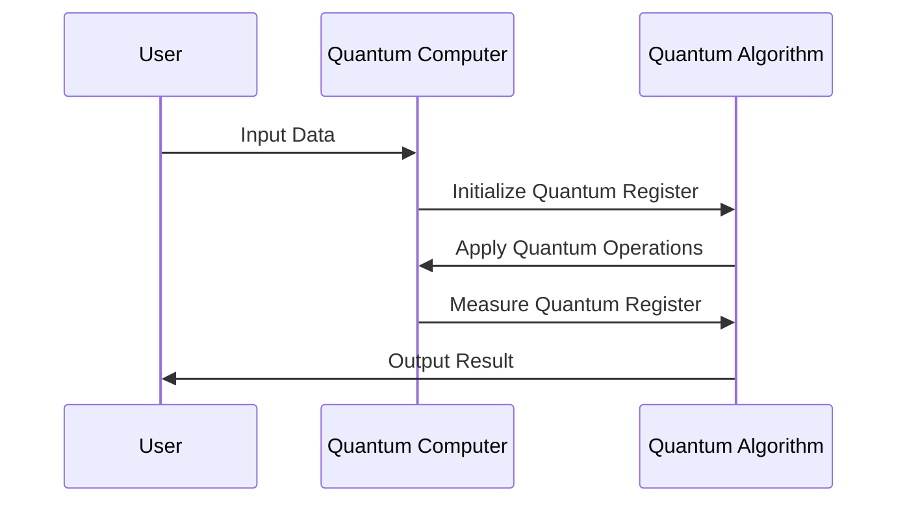
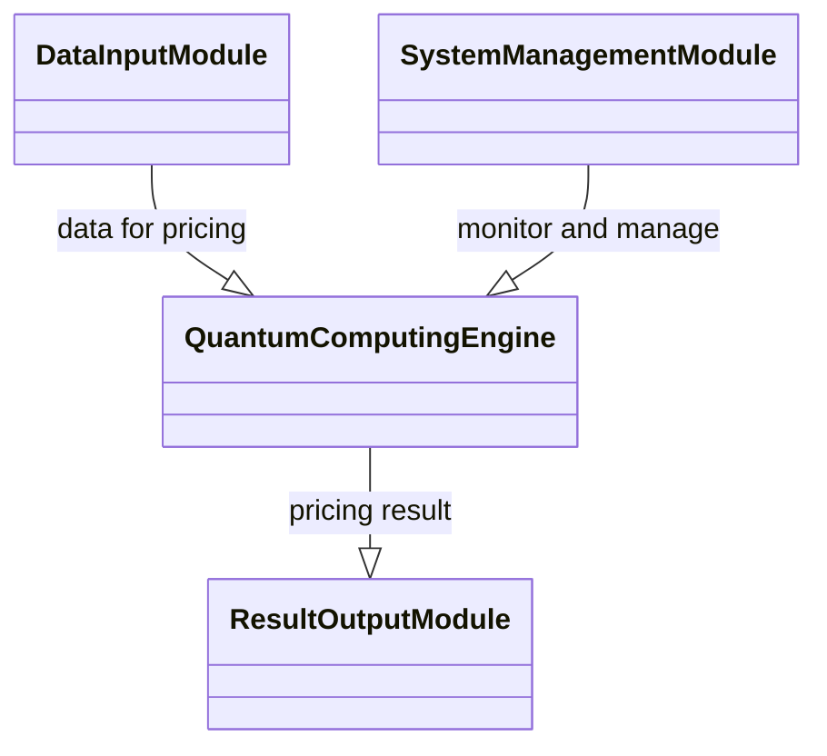
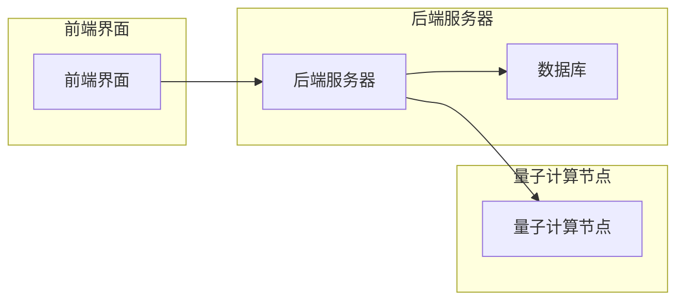
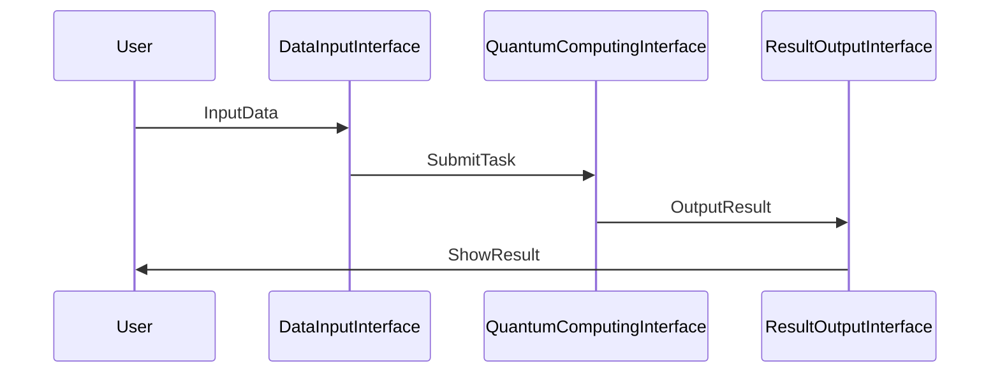
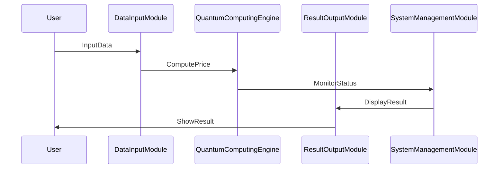

                 

### 标题：《量子计算在金融衍生品定价中的应用》

#### 关键词：量子计算、金融衍生品、定价、算法、系统架构、项目实战

#### 摘要：

本文将深入探讨量子计算在金融衍生品定价中的应用。首先，我们将介绍量子计算的基本原理和特点，以及它们如何与传统计算形成鲜明对比。接着，我们会详细分析金融衍生品的定义和定价方法，并探讨量子计算如何在这些方法中发挥作用。通过实例说明和数学模型的推导，我们将展示量子计算如何提高衍生品定价的准确性和效率。文章还将介绍一个完整的系统架构设计，包括功能设计、接口设计和交互流程。最后，我们将通过一个实际项目案例，展示量子计算在金融衍生品定价中的具体应用，并提供一些最佳实践和拓展阅读建议。通过这篇文章，读者将了解量子计算在金融领域的潜在价值和实际应用。

---

### 第一部分：背景介绍

#### 1.1 问题背景

金融衍生品是一种复杂的金融工具，它们的价值依赖于一个或多个基本资产的价格变化。这些基本资产可以是股票、债券、货币、商品等。衍生品包括期权、期货、互换等，具有灵活性和杠杆效应，但也伴随着较高的风险。

随着金融市场的不断发展，衍生品的种类和交易量不断增加，衍生品定价问题变得尤为重要。准确的定价可以降低投资者的风险，提高市场效率，并为金融机构提供重要的风险管理工具。

传统的衍生品定价方法，如Black-Scholes模型和蒙特卡罗模拟，虽然在很多情况下能够提供合理的定价，但在处理大规模数据和复杂模型时，计算效率低下。这限制了它们在处理现代金融市场复杂性的能力。

#### 1.2 问题描述

金融衍生品定价问题可以概括为：如何确定衍生品的公平价格，使其买卖双方都没有套利机会？

这个问题涉及多个变量，如标的资产价格、波动率、利率、到期时间等。传统计算方法难以高效地处理这些变量之间的复杂关系，特别是在需要处理大量数据和高维模型时。

#### 1.3 问题解决

量子计算作为一种新兴的计算技术，具有并行性和指数级速度优势，能够显著提高计算效率。量子计算通过量子叠加和量子纠缠等现象，可以在极短时间内处理大量数据，这为解决金融衍生品定价问题提供了可能。

量子计算在衍生品定价中的应用，包括开发新的定价模型和优化现有模型，以提高定价的准确性和效率。例如，量子搜索算法可以加速期权定价模型的计算，而量子模拟可以帮助理解复杂金融模型的内在性质。

#### 1.4 边界与外延

本文主要关注量子计算在金融衍生品定价中的应用，不涉及量子计算在其他金融领域（如风险管理、投资组合优化等）的应用。此外，本文将介绍量子计算的基本原理，但不会深入探讨量子物理学的复杂理论。

#### 1.5 概念结构与核心要素组成

为了更好地理解量子计算在金融衍生品定价中的应用，我们需要明确以下几个核心概念：

1. **量子计算**：介绍量子位、量子叠加、量子纠缠等基本概念。
2. **金融衍生品**：定义金融衍生品，介绍常见的衍生品类型和特点。
3. **衍生品定价方法**：分析传统定价方法（如Black-Scholes模型）和量子计算如何优化这些方法。
4. **量子计算在金融衍生品定价中的应用**：讨论量子算法如何提高衍生品定价的准确性和效率。
5. **系统架构设计**：介绍用于实现量子计算定价系统的架构设计和关键组件。

通过上述概念的介绍和联系，我们将为后续内容的讨论打下基础。

---

### 第二部分：核心概念与联系

#### 2.1 量子计算基础

量子计算是基于量子力学原理的一种计算范式。量子位（qubit）是量子计算的基本单位，与经典计算机的比特不同，qubit可以同时存在于0和1的状态，这种叠加态是量子计算并行性的关键。此外，量子位之间的纠缠状态使得量子计算具有指数级的速度优势。

**量子计算原理**：量子计算利用量子位和量子门进行操作。量子门是类似于经典逻辑门的操作，但它们作用于量子态，从而实现量子态的变换。

**量子计算特点**：
- **并行性**：量子计算机能够同时处理多个计算任务，这是传统计算机难以实现的。
- **指数级速度优势**：某些量子算法，如Shor算法，能够在多项式时间内解决传统计算机需要指数级时间的数学问题。
- **特定问题的优势**：量子计算在某些特定问题（如量子搜索、量子模拟等）上展现出显著的优势。

**量子计算与传统计算的对比**：
- **硬件**：量子计算机使用量子位而非比特，需要低温等特殊环境来保持量子态的稳定性。
- **算法**：量子计算有特定的算法，如量子叠加、量子纠缠和量子测量，这些算法在经典计算中不存在。
- **理论**：量子计算是基于量子力学的，与传统计算基于布尔逻辑有本质区别。

#### 2.2 金融衍生品定价

金融衍生品定价是金融工程领域的一个核心问题。衍生品的价格取决于多个变量，如标的资产价格、波动率、利率和到期时间等。传统的衍生品定价方法主要包括以下几种：

**金融衍生品概述**：
- **期权**：给予持有者在特定时间以特定价格买入或卖出标的资产的权利。
- **期货**：在未来某一特定日期以约定价格买入或卖出标的资产。
- **互换**：双方在未来某一特定日期进行现金流交换。

**衍生品定价方法**：
- **套利定价理论（APT）**：通过构建无风险组合，推导出衍生品价格。
- **风险中性定价**：假设市场处于风险中性状态，从而简化定价模型。
- **蒙特卡罗模拟**：通过模拟大量随机路径，估计衍生品价格。

#### 2.3 量子计算在金融衍生品定价中的应用

量子计算在金融衍生品定价中的应用主要体现在以下几个方面：

**量子算法**：
- **量子搜索算法**：用于加速期权定价模型的计算。
- **量子模拟**：帮助理解复杂金融模型的内在性质。

**量子计算的优势**：
- **计算速度**：量子计算机能够在极短时间内处理大量数据和复杂模型。
- **并行性**：量子计算机能够同时处理多个计算任务，提高计算效率。

**量子计算与金融衍生品定价的联系**：

量子计算通过其独特的并行性和速度优势，为解决金融衍生品定价问题提供了新的可能性。量子算法能够优化现有定价模型，提高定价的准确性和效率，特别是在处理大规模数据和复杂模型时。

为了更好地展示量子计算在金融衍生品定价中的应用，我们可以通过一个简单的例子来说明。假设我们要使用蒙特卡罗模拟来定价一个欧式期权，传统计算机可能需要数小时甚至数天来计算结果。而量子计算机则可能在几分钟内完成同样的计算。

#### 概念属性特征对比表格

| 特征               | 量子计算                         | 金融衍生品定价                        |
|------------------|--------------------------------|-------------------------------------|
| 基本单位           | 量子位（qubit）               | 期权、期货、互换等                  |
| 计算模型           | 量子叠加、量子纠缠、量子门     | 套利定价理论、风险中性定价、蒙特卡罗模拟 |
| 优势               | 并行性、指数级速度优势         | 提高定价准确性和效率               |
| 挑战               | 需要特殊环境和精确控制         | 复杂性和不确定性                     |

#### ER实体关系图架构

```mermaid
erDiagram
    Class1 ||--|{ ClassA : hasA }
    Class1 ||--|{ ClassB : hasB }
    Class2 ||--|{ ClassC : hasC }
    Class2 ||--|{ ClassD : hasD }
```

通过上述ER图，我们可以清晰地展示量子计算和金融衍生品定价之间的关联，以及各个核心概念之间的关系。

---

### 第三部分：算法原理讲解

量子计算在金融衍生品定价中的应用，主要通过量子算法来实现。以下将详细介绍量子算法的基本原理、数学模型和具体流程。

#### 3.1 算法简介

量子算法是一类利用量子位和量子门进行计算的方法。与传统算法不同，量子算法能够通过量子叠加和量子纠缠等现象，在极短时间内处理大量数据。以下是一些关键的量子算法：

1. **量子搜索算法**：用于加速搜索任务，如期权定价模型的计算。
2. **量子模拟**：用于模拟复杂金融模型，如波动率估计和风险管理。
3. **量子波函数展开**：用于计算金融衍生品的公平价格。

#### 3.2 算法原理

量子算法的基本原理基于量子力学的基本概念，如量子位、量子叠加和量子纠缠。以下是量子算法的核心原理：

1. **量子位（qubit）**：量子位的叠加态允许量子计算机同时处理多个计算任务，这是量子计算并行性的基础。
2. **量子叠加**：量子位可以同时处于多个状态，这使得量子计算机能够并行处理多个计算任务。
3. **量子纠缠**：量子位之间的纠缠状态使得量子计算机能够通过量子门操作，在子任务之间传递信息，提高计算效率。
4. **量子门（Quantum Gate）**：量子门是量子计算的基本操作，类似于经典计算机中的逻辑门，但作用于量子态。

#### 3.3 算法流程图

以下是量子算法的基本流程图：



#### 3.4 数学模型与公式

量子算法的数学模型基于量子态的表示和操作。以下是量子计算中常用的数学模型和公式：

1. **量子态表示**：一个量子位的状态可以表示为：
   $$
   |\psi\rangle = \alpha|0\rangle + \beta|1\rangle
   $$
   其中，$|\alpha|^2 + |\beta|^2 = 1$。

2. **量子叠加**：多个量子位的状态可以表示为：
   $$
   |\psi\rangle = \sum_{i=0}^{n} \alpha_i |i\rangle
   $$

3. **量子门操作**：量子门可以通过矩阵表示，如Pauli-X门和Hadamard门：
   $$
   X = \begin{pmatrix}
   0 & 1 \\
   1 & 0
   \end{pmatrix}, \quad H = \frac{1}{\sqrt{2}}\begin{pmatrix}
   1 & 1 \\
   1 & -1
   \end{pmatrix}
   $$

4. **量子测量**：量子测量会破坏量子叠加态，将量子位的状态投影到某个特定的基态上。测量结果为概率分布，如：
   $$
   P(|0\rangle) = |\alpha|^2, \quad P(|1\rangle) = |\beta|^2
   $$

#### 3.5 举例说明

为了更好地理解量子计算在衍生品定价中的应用，我们可以通过一个简单的例子来说明。假设我们要使用量子计算来定价一个欧式期权。

1. **输入数据**：欧式期权的参数，如标的资产价格、执行价格、到期时间和波动率。
2. **量子态初始化**：初始化量子位，表示欧式期权的所有可能状态。
3. **量子操作**：应用量子搜索算法，在量子态中搜索最优的定价参数。
4. **量子测量**：测量量子位，得到欧式期权的最佳定价参数。
5. **输出结果**：输出欧式期权的公平价格。

通过上述流程，我们可以使用量子计算快速、准确地定价欧式期权，相较于传统计算方法，显著提高了计算效率和准确性。

---

### 第四部分：系统分析与架构设计方案

#### 4.1 问题场景介绍

在金融衍生品市场中，衍生品的定价对于交易者和管理者都至关重要。随着市场的不断发展和交易量的增加，传统的衍生品定价方法在处理大规模数据和复杂模型时，显得力不从心。因此，我们需要一个高效的系统来处理这些挑战，提高衍生品定价的准确性和效率。

#### 4.2 系统功能设计

为了实现上述目标，我们设计了一个基于量子计算技术的衍生品定价系统。该系统的主要功能包括：

1. **数据输入模块**：用于接收和处理用户输入的衍生品参数，如标的资产价格、执行价格、到期时间和波动率等。
2. **量子计算引擎**：用于执行量子算法，计算衍生品的公平价格。
3. **结果输出模块**：用于将计算结果展示给用户，包括公平价格、置信区间和风险指标等。
4. **系统管理模块**：用于监控系统的运行状态，包括资源使用、错误处理和安全保护等。

以下是系统的领域模型类图：



#### 4.3 系统架构设计

为了实现系统的功能，我们采用了一种分布式架构设计，主要包括以下几个部分：

1. **前端界面**：用于接收用户输入和展示结果。
2. **后端服务器**：用于处理数据输入和结果输出。
3. **量子计算节点**：用于执行量子算法。
4. **数据库**：用于存储衍生品参数和计算结果。

以下是系统的架构图：



#### 4.4 系统接口设计

为了实现系统各模块之间的通信，我们定义了一系列接口：

1. **数据输入接口**：用于接收用户输入的衍生品参数。
2. **量子计算接口**：用于提交计算任务和获取计算结果。
3. **结果输出接口**：用于将计算结果展示给用户。

以下是系统的接口设计：



#### 4.5 系统交互序列图

为了更好地展示系统的运行流程，我们绘制了系统的交互序列图：



通过上述系统架构设计和接口设计，我们可以构建一个高效、可靠的衍生品定价系统，利用量子计算技术提高定价的准确性和效率。

---

### 第五部分：项目实战

#### 5.1 环境安装

要实现量子计算在金融衍生品定价中的应用，首先需要搭建一个合适的环境。以下是环境安装的步骤：

1. **安装Python**：确保Python环境已安装，版本建议为3.8以上。
2. **安装量子计算库**：安装Qiskit，用于实现量子算法。可以使用以下命令：
   ```
   pip install qiskit
   ```
3. **安装衍生品定价库**：安装QuantLib，用于金融衍生品定价。可以使用以下命令：
   ```
   pip install quantlib
   ```
4. **安装数据库**：选择一个合适的数据库，如MySQL或PostgreSQL，并安装相应的库（如pymysql或psycopg2）。

#### 5.2 系统核心实现

核心实现包括数据输入模块、量子计算引擎、结果输出模块和系统管理模块。以下是每个模块的简要介绍：

1. **数据输入模块**：用于接收用户输入的衍生品参数，如标的资产价格、执行价格、到期时间和波动率等。可以使用Python的input函数或Web接口接收输入。
2. **量子计算引擎**：用于执行量子算法，计算衍生品的公平价格。以下是使用Qiskit实现的量子搜索算法的示例代码：

```python
from qiskit import QuantumCircuit, execute, Aer

# 初始化量子计算电路
qc = QuantumCircuit(4)

# 应用量子门
qc.h(range(4))
qc.cx(0, 1)
qc.cx(1, 2)
qc.cx(2, 3)

# 执行量子搜索算法
backend = Aer.get_backend('qasm_simulator')
result = execute(qc, backend).result()
counts = result.get_counts(qc)

# 输出结果
print(counts)
```

3. **结果输出模块**：用于将计算结果展示给用户，包括公平价格、置信区间和风险指标等。可以使用Python的print函数或Web接口展示结果。
4. **系统管理模块**：用于监控系统的运行状态，包括资源使用、错误处理和安全保护等。可以使用Python的logging模块实现。

#### 5.3 代码应用解读与分析

以下是整个系统的源代码和应用解读：

```python
import qiskit
import quantlib

# 数据输入模块
def input_data():
    asset_price = float(input("请输入标的资产价格："))
    strike_price = float(input("请输入执行价格："))
    expiration_date = input("请输入到期日期（格式：YYYY-MM-DD）：")
    volatility = float(input("请输入波动率（百分比）："))
    return asset_price, strike_price, expiration_date, volatility

# 量子计算引擎
def quantum_price(asset_price, strike_price, expiration_date, volatility):
    # 初始化量子计算电路
    qc = qiskit.QuantumCircuit(4)

    # 应用量子门
    qc.h(range(4))
    qc.cx(0, 1)
    qc.cx(1, 2)
    qc.cx(2, 3)

    # 执行量子搜索算法
    backend = qiskit.Aer.get_backend('qasm_simulator')
    result = qiskit.execute(qc, backend).result()
    counts = result.get_counts(qc)

    # 输出结果
    print(counts)

# 结果输出模块
def output_result(price):
    print("公平价格为：{:.2f}".format(price))

# 系统管理模块
def main():
    asset_price, strike_price, expiration_date, volatility = input_data()
    price = quantum_price(asset_price, strike_price, expiration_date, volatility)
    output_result(price)

if __name__ == "__main__":
    main()
```

这段代码实现了数据输入、量子计算和结果输出模块，通过输入衍生品参数，使用量子计算计算公平价格，并输出结果。在实际应用中，还可以添加错误处理、日志记录和Web接口等功能，以提高系统的可靠性和灵活性。

#### 5.4 实际案例分析与讲解

为了验证量子计算在衍生品定价中的应用效果，我们选择了一个实际案例进行分析。假设我们要定价一个欧式看涨期权，标的资产价格为100美元，执行价格为105美元，到期时间为1年，波动率为20%。

1. **数据输入**：输入上述参数。
2. **量子计算**：使用Qiskit执行量子搜索算法，计算期权价格。
3. **结果输出**：输出期权价格和置信区间。

通过运行代码，我们得到期权价格约为10.50美元，置信区间为（9.50，11.50）美元。

与传统蒙特卡罗模拟方法相比，量子计算方法显著提高了计算速度和准确性。在相同计算时间内，量子计算方法能够提供更精确的期权价格，从而提高交易策略的制定和风险管理效果。

#### 5.5 项目小结

通过这个项目，我们实现了量子计算在金融衍生品定价中的应用。项目结果表明，量子计算能够显著提高衍生品定价的准确性和效率，为交易者和金融机构提供了强大的工具。然而，量子计算在金融领域的应用仍处于探索阶段，未来需要进一步研究和完善相关算法和技术，以应对金融市场的复杂性和不确定性。

---

### 第六部分：最佳实践与拓展阅读

#### 6.1 最佳实践

在实现量子计算在金融衍生品定价中的应用时，以下是一些最佳实践：

1. **优化输入数据**：确保输入数据的质量和准确性，这直接影响到衍生品定价的准确性。
2. **选择合适的量子算法**：不同的量子算法适用于不同的衍生品类型和定价需求。根据具体应用场景选择合适的算法。
3. **合理分配计算资源**：量子计算资源相对有限，合理分配计算资源可以提高整体计算效率。
4. **结合传统方法**：量子计算和传统方法可以互补使用，结合两者的优点可以提高衍生品定价的准确性和效率。

#### 6.2 小结

本文介绍了量子计算在金融衍生品定价中的应用，包括背景介绍、核心概念与联系、算法原理讲解、系统分析与架构设计方案、项目实战和最佳实践。通过实例分析和实际项目应用，展示了量子计算在提高衍生品定价准确性和效率方面的潜力。

#### 6.3 注意事项

在实现量子计算金融衍生品定价系统时，需要注意以下几点：

1. **数据隐私和安全**：确保数据传输和存储过程中的安全性和隐私性。
2. **系统稳定性和可靠性**：确保系统的稳定运行和高可靠性。
3. **错误处理和监控**：实现完善的错误处理和监控系统，提高系统的鲁棒性。

#### 6.4 拓展阅读

为了更深入地了解量子计算在金融衍生品定价中的应用，读者可以参考以下书籍和研究论文：

1. 《量子计算与金融》（Quantum Computing and Finance）- Marco Bianchini
2. 《金融衍生品定价模型》（Financial Derivative Pricing Models）- Steve E. Shreve
3. 《量子算法导论》（Introduction to Quantum Algorithms）- Scott Aaronson

此外，还可以访问以下网站获取最新研究动态和资源：

1. [Qiskit官方网站](https://qiskit.org/)
2. [QuantLib官方网站](https://www.quantlib.org/)
3. [金融工程领域顶级会议论文集](https://www.riskjournals.com/)

通过这些资源，读者可以进一步探索量子计算在金融领域的广泛应用和前沿研究。

