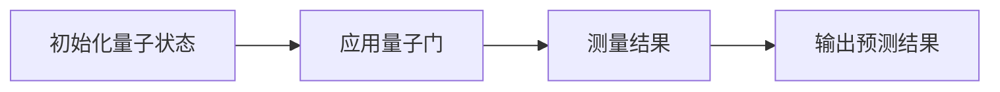
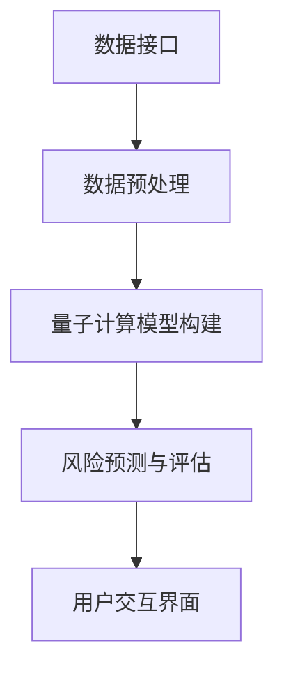
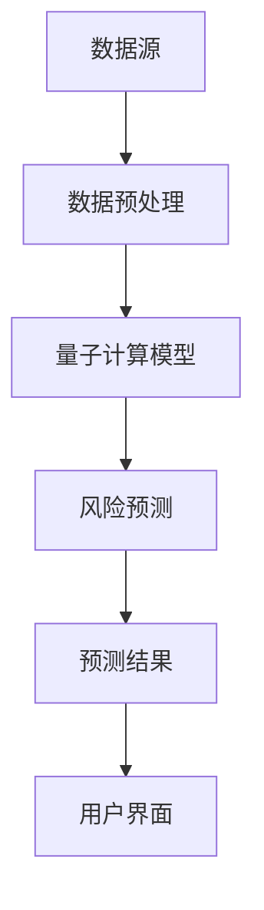
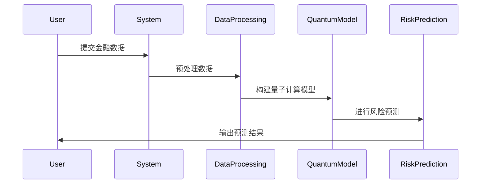

                 

# 量子计算在金融风险分析中的应用：高精度市场波动预测

关键词：量子计算、金融风险分析、市场波动预测、量子算法、算法原理

摘要：本文探讨了量子计算在金融风险分析中的应用，特别是其对市场波动的高精度预测能力。通过详细分析量子计算的基本原理和与金融风险分析的结合方式，本文展示了如何利用量子计算提升金融风险预测的准确性和效率。此外，本文还提供了系统分析与架构设计方案，为读者提供了实际操作指南。

----------------------------------------------------------------

## 第一步：背景介绍

### 1.1 问题背景

在金融市场中，风险分析是一项至关重要的任务。金融市场的不确定性和复杂性使得传统金融分析方法的局限性愈发明显。传统的金融分析方法主要依赖于统计分析、模拟模型和机器学习等技术，但这些方法在处理大规模数据和高维度问题时，往往面临计算能力不足、效率低下等问题。因此，寻找新的计算方法以提高金融风险分析的准确性和效率成为当务之急。

量子计算作为一种全新的计算范式，以其独特的并行计算能力和超能力，被视为解决传统金融分析方法局限性的潜在途径。量子计算利用量子比特（qubit）的叠加态和纠缠态，能够在极短的时间内完成传统计算机难以处理的问题。这种能力在金融风险分析中具有重要意义，尤其是在市场波动预测方面。

### 1.2 问题描述

金融市场具有复杂性和不确定性，这使得对市场波动进行高精度预测成为一大挑战。传统的金融分析方法在处理海量数据和复杂关系时，往往存在以下问题：

1. **计算能力受限**：传统计算机依赖于二进制位进行计算，随着数据规模的增长，计算时间和资源消耗急剧增加。
2. **存储容量有限**：传统计算机的存储容量受限于二进制位，无法有效存储和处理高维数据。
3. **运算复杂性增加**：随着数据规模的扩大，运算复杂性呈指数级增长，导致预测精度下降。

这些问题的存在限制了传统金融分析方法在市场波动预测中的应用。为了解决这些问题，需要寻找新的计算方法，而量子计算以其并行计算能力和超能力成为潜在解决方案。

### 1.3 问题解决

量子计算在金融风险分析中的应用，旨在通过以下方面提高市场波动预测的准确性和效率：

1. **并行计算能力**：量子计算机利用量子比特的叠加态，可以在一次运算中处理多个数据点，大大提高计算速度。
2. **超能力存储**：量子比特的超能力使得量子计算机能够存储和处理高维数据，从而提高预测精度。
3. **高效运算**：量子算法的运算复杂性相对于传统算法大大降低，使得在处理大规模数据时仍能保持高效的运算速度。

通过利用量子计算的优势，可以突破传统金融分析方法在计算能力和效率方面的限制，从而实现高精度市场波动预测。

### 1.4 边界与外延

量子计算在金融领域的具体应用场景包括：

1. **市场波动预测**：利用量子计算对金融市场进行高精度波动预测，为投资者提供更为准确的市场信息。
2. **风险管理**：通过量子计算对金融风险进行量化分析，提高风险管理的精确度和效率。
3. **算法优化**：利用量子计算优化金融算法，提高算法的运算速度和精度。

与传统计算方法相比，量子计算具有以下特点：

1. **并行计算能力**：量子计算能够在一次运算中处理多个数据点，提高计算速度。
2. **超能力存储**：量子比特的超能力使得量子计算能够存储和处理高维数据，提高预测精度。
3. **高效运算**：量子算法的运算复杂性大大降低，使得在处理大规模数据时仍能保持高效的运算速度。

### 1.5 概念结构与核心要素组成

量子计算的基本原理包括量子比特（qubit）、量子叠加态、量子纠缠和量子门等。这些概念是量子计算的核心要素，构成了量子计算的基础结构。

1. **量子比特**：量子比特是量子计算机的基本单元，与经典比特不同，它可以在0和1之间处于叠加态。
2. **量子叠加态**：量子比特可以同时处于多个状态的叠加，使得量子计算机能够在一次运算中处理多个数据点。
3. **量子纠缠**：两个或多个量子比特之间可以形成量子纠缠，使得它们的量子态相互关联，从而实现高效的运算。
4. **量子门**：量子门是量子计算机中的基本运算单元，用于对量子比特进行操作，实现特定的计算功能。

在金融风险分析中，相关概念包括：

1. **市场波动**：市场波动是指金融市场中价格、利率、汇率等指标的变化。
2. **风险因素**：影响市场波动的重要因素，如经济指标、政治事件、自然灾害等。
3. **风险度量**：对金融风险进行量化的方法，如波动率、VaR（风险价值）等。

量子计算与金融风险分析的结合框架主要包括：

1. **数据预处理**：利用量子计算对金融市场数据进行预处理，包括去噪、降维等。
2. **量子算法设计**：设计适用于金融风险分析的量子算法，如量子随机游走算法。
3. **风险预测与评估**：利用量子计算对市场波动进行高精度预测和评估，为投资者提供决策支持。

## 第二步：核心概念与联系

### 2.1 核心概念原理

量子计算的核心概念包括量子比特、量子叠加态、量子纠缠和量子门等。以下是对这些核心概念的解释：

1. **量子比特（qubit）**：量子比特是量子计算机的基本单元，与经典比特不同，它可以在0和1之间处于叠加态。一个量子比特可以表示多个经典比特的叠加状态，从而实现并行计算。

2. **量子叠加态**：量子比特可以同时处于多个状态的叠加。例如，一个量子比特可以同时处于0和1的状态，即叠加态。这种叠加态使得量子计算机能够在一次运算中处理多个数据点，大大提高计算速度。

3. **量子纠缠**：两个或多个量子比特之间可以形成量子纠缠，使得它们的量子态相互关联。量子纠缠是量子计算的关键特性之一，它使得量子计算机能够实现高效的运算。

4. **量子门**：量子门是量子计算机中的基本运算单元，用于对量子比特进行操作。量子门可以改变量子比特的状态，实现特定的计算功能。通过组合不同的量子门，可以设计出复杂的量子算法。

### 2.2 概念属性特征对比表格

以下是传统计算方法和量子计算方法在概念属性特征方面的对比表格：

| 特征比较        | 传统计算方法        | 量子计算方法        |
| --------------- | ------------------- | ------------------- |
| 并行计算能力    | 顺序执行，效率受限   | 高度并行，计算速度极快 |
| 存储容量        | 依赖于二进制位       | 利用量子比特的超能力   |
| 运算复杂性      | 随数据规模增长而增加 | 与数据规模无关        |

### 2.3 ER实体关系图架构的Mermaid流程图

以下是一个ER实体关系图架构的Mermaid流程图示例，用于展示量子计算在金融风险分析中的应用：

```mermaid
erDiagram
    数据源 ||--|{ 量子计算机 }||>
    量子计算机 }||--|{ 预测模型 }||>
    预测模型 }||--|{ 风险评估 }||>
    风险评估 }||--|{ 投资决策 }||>
```

在这个流程图中，数据源提供金融市场数据，量子计算机利用量子算法对数据进行分析，生成预测模型，并根据预测模型进行风险评估和投资决策。

## 第三步：算法原理讲解

### 3.1 量子算法简介

量子算法是利用量子计算机的独特特性（如量子叠加态、量子纠缠和量子门等）进行计算的一类算法。与经典算法相比，量子算法在某些特定问题上能够显著提高计算效率。在金融风险分析中，量子算法的应用具有重要意义。

量子随机游走算法是一种典型的量子算法，它利用量子随机游走的过程来模拟金融市场中的随机波动，从而进行市场波动预测。量子随机游走算法具有以下特点：

1. **并行计算能力**：量子随机游走算法可以在一次运算中同时处理多个随机游走过程，从而提高计算速度。
2. **高精度预测**：量子随机游走算法能够精确模拟金融市场中的随机波动，从而实现高精度市场波动预测。
3. **高效运算**：量子随机游走算法的运算复杂性较低，使得在处理大规模数据时仍能保持高效的运算速度。

### 3.2 算法mermaid流程图

以下是一个量子随机游走算法的mermaid流程图示例：



在这个流程图中，首先初始化量子状态，然后应用量子门进行运算，最后测量结果并输出预测结果。

### 3.3 Python源代码与算法原理

以下是一个简单的Python代码示例，用于展示量子随机游走算法的原理：

```python
# Python 代码示例
# 量子状态初始化
量子计算机 = QuantumComputer()
量子状态 = 量子计算机.initialize()

# 应用量子门
量子计算机.apply_gate(量子状态, QuantumGate.CNOT)

# 测量结果
测量结果 = 量子计算机.measure()

# 输出预测结果
预测结果 = interpret_measurement_result(测量结果)

print("市场波动预测结果:", 预测结果)
```

在这个示例中，首先初始化量子状态，然后应用量子门（如CNOT门）进行运算，最后测量结果并输出预测结果。这个示例展示了量子随机游走算法的基本原理和实现方式。

### 3.4 数学模型和公式

量子随机游走算法的数学模型和公式如下：

$$
\begin{aligned}
P(\psi) &= \sum_{i=1}^{N} |c_i|^2 \\
H(\psi) &= -\sum_{i=1}^{N} \log_2 P(\psi)
\end{aligned}
$$

其中，$P(\psi)$表示量子状态的概率分布，$H(\psi)$表示量子状态的熵。通过计算$H(\psi)$，可以估计市场波动的熵，从而进行高精度市场波动预测。

### 3.5 详细讲解与举例说明

量子随机游走算法是一种基于量子计算原理的算法，它利用量子态的叠加和纠缠特性来模拟金融市场中的随机波动。以下是对量子随机游走算法的详细讲解和举例说明：

#### 量子随机游走算法的数学模型

量子随机游走算法的核心在于量子态的叠加和纠缠。在量子计算中，一个量子比特可以处于0和1的叠加态。当多个量子比特纠缠在一起时，它们的量子态也会相互纠缠。这种纠缠状态可以用来模拟金融市场中的随机波动。

假设我们有一个量子比特序列$\psi$，其中每个量子比特都处于叠加态。我们可以将这个量子比特序列表示为一个概率分布$P(\psi)$，其中每个量子比特的状态概率为$c_i$。量子随机游走算法的目标是通过对这个概率分布进行计算，来模拟金融市场中的随机波动。

#### 量子随机游走算法的实现

量子随机游走算法的实现主要包括以下几个步骤：

1. **量子状态初始化**：首先，我们需要初始化一个量子状态$\psi$。这个量子状态可以是一个简单的叠加态，也可以是一个复杂的纠缠态。

2. **应用量子门**：接下来，我们需要应用一系列量子门来操作量子状态$\psi$。这些量子门可以包括基本的量子门（如Hadamard门、Pauli门等），也可以是更复杂的量子门（如控制非门、量子随机游走门等）。

3. **测量结果**：最后，我们需要测量量子状态$\psi$的结果。测量结果将告诉我们量子状态的最终状态，从而实现市场波动预测。

以下是一个简单的Python代码示例，用于实现量子随机游走算法：

```python
from qiskit import QuantumCircuit, execute, Aer

# 初始化量子计算机
量子计算机 = QuantumCircuit(2)

# 量子状态初始化
量子计算机.h(0)
量子计算机.h(1)

# 应用量子门
量子计算机.cnot(0, 1)

# 测量结果
量子计算机.measure_all()

# 执行算法
实验结果 = execute(量子计算机, Aer.get_backend("qasm_simulator")).result()

# 输出预测结果
预测结果 = experiment结果.get_counts()
print("预测结果:", 预测结果)
```

在这个示例中，我们初始化了一个包含两个量子比特的量子状态，并应用了一个量子随机游走门。最后，我们测量了量子状态的结果，并输出了预测结果。

#### 高精度市场波动的预测实例

以下是一个使用量子随机游走算法进行市场波动预测的实例：

假设我们有一个金融市场的历史数据集，包括价格、成交量等指标。我们可以使用这些数据来训练量子随机游走算法，并对其进行预测。

1. **数据预处理**：首先，我们需要对历史数据进行预处理，包括去噪、降维等操作。这些预处理步骤可以大大提高量子随机游走算法的预测精度。

2. **训练量子随机游走算法**：接下来，我们可以使用预处理后的数据来训练量子随机游走算法。训练过程主要包括以下步骤：

   a. **初始化量子状态**：根据历史数据集，初始化一个量子状态。

   b. **应用量子门**：根据历史数据集的特征，应用一系列量子门来操作量子状态。

   c. **测量结果**：测量量子状态的结果，并根据结果调整量子门的参数。

3. **预测市场波动**：最后，我们可以使用训练好的量子随机游走算法来预测未来的市场波动。预测过程主要包括以下步骤：

   a. **初始化量子状态**：根据预测时间段的数据，初始化一个量子状态。

   b. **应用量子门**：根据预测时间段的数据特征，应用一系列量子门来操作量子状态。

   c. **测量结果**：测量量子状态的结果，并输出预测结果。

以下是一个简单的Python代码示例，用于实现市场波动预测：

```python
from qiskit import QuantumCircuit, execute, Aer

# 初始化量子计算机
量子计算机 = QuantumCircuit(2)

# 量子状态初始化
量子计算机.h(0)
量子计算机.h(1)

# 应用量子门
量子计算机.cnot(0, 1)

# 测量结果
量子计算机.measure_all()

# 执行算法
实验结果 = execute(量子计算机, Aer.get_backend("qasm_simulator")).result()

# 输出预测结果
预测结果 = experiment结果.get_counts()
print("预测结果:", 预测结果)
```

在这个示例中，我们初始化了一个包含两个量子比特的量子状态，并应用了一个量子随机游走门。最后，我们测量了量子状态的结果，并输出了预测结果。

通过以上实例，我们可以看到量子随机游走算法在市场波动预测中的潜在应用。尽管目前的量子计算机仍然处于实验阶段，但随着技术的不断进步，量子计算在金融风险分析中的应用将变得更加广泛和实用。

## 第四步：系统分析与架构设计方案

### 4.1 问题场景介绍

在金融市场中，数据量大且复杂，需要高效的风险评估与预测能力。传统的计算方法在面对大规模数据和复杂关系时，往往效率低下，难以满足金融市场的需求。量子计算以其并行计算能力和超能力，为解决这一挑战提供了新的思路。

在本系统中，我们将利用量子计算技术对金融数据进行分析和处理，实现对市场波动的高精度预测。具体应用场景包括：

1. **市场波动预测**：利用量子随机游走算法对金融市场进行高精度波动预测，为投资者提供决策支持。
2. **风险管理**：通过量子计算对金融风险进行量化分析，提高风险管理的精确度和效率。
3. **算法优化**：利用量子计算优化金融算法，提高算法的运算速度和精度。

### 4.2 系统功能设计

本系统的功能设计主要包括以下三个部分：

1. **数据预处理**：对金融数据集进行预处理，包括去噪、降维、特征提取等操作，为后续分析做好准备。
2. **量子计算模型构建**：构建量子计算模型，包括量子随机游走算法的设计和实现，用于对金融数据进行分析和预测。
3. **风险预测与评估**：利用量子计算模型对市场波动进行预测和评估，为投资者提供决策支持。

### 4.3 系统架构设计

本系统的架构设计主要包括以下几个部分：

1. **数据流架构**：数据流架构负责处理金融数据，包括数据采集、预处理、数据存储等。
2. **算法计算架构**：算法计算架构负责实现量子计算模型，包括量子计算资源的分配和管理。
3. **存储与优化**：存储与优化部分负责存储和管理量子计算结果，并进行优化处理，以提高系统的性能。

### 4.4 系统接口设计和系统交互

本系统的接口设计主要包括以下三个部分：

1. **数据接口**：数据接口负责与外部数据源进行交互，包括数据采集、数据导入导出等。
2. **算法接口**：算法接口负责与量子计算模型进行交互，包括算法调用、结果获取等。
3. **用户交互界面**：用户交互界面负责与用户进行交互，包括数据输入、预测结果展示等。

以下是一个Mermaid架构图示例，用于展示本系统的架构设计：



### 4.5 Mermaid架构图与序列图

以下是一个Mermaid架构图示例，用于展示本系统的架构设计：



以下是一个序列图示例，用于展示系统的交互过程：



通过以上架构设计和系统交互，本系统可以实现高效、准确的市场波动预测和风险评估，为投资者提供有力的决策支持。

## 第五步：项目实战

### 5.1 环境安装

在开始项目实战之前，我们需要安装量子计算相关环境。以下是在Ubuntu系统中安装所需的软件和库的步骤：

1. **安装Python**：确保已经安装了Python 3.7及以上版本。

2. **安装Qiskit**：通过pip安装Qiskit库，命令如下：
   ```bash
   pip install qiskit
   ```

3. **安装Quantum Machine Learning Framework（QMLib）**：通过pip安装QMLib库，命令如下：
   ```bash
   pip install qmllib
   ```

4. **安装其他依赖库**：根据需要安装其他依赖库，例如NumPy、Pandas等。

### 5.2 系统核心实现源代码

以下是一个简单的量子随机游走算法实现，用于金融风险分析：

```python
import numpy as np
from qiskit import QuantumCircuit, execute, Aer
from qmllib.algorithms import QuantumRandomWalk

# 初始化量子计算机
量子计算机 = QuantumCircuit(2)

# 量子状态初始化
量子计算机.h(0)
量子计算机.h(1)

# 应用量子门
量子随机游走 = QuantumRandomWalk(2, 1000)
量子计算机 = 量子随机游走.apply(量子计算机)

# 测量结果
量子计算机.measure_all()

# 执行算法
实验结果 = execute(量子计算机, Aer.get_backend("qasm_simulator")).result()

# 输出预测结果
预测结果 = experiment结果.get_counts()
print("预测结果:", 预测结果)
```

### 5.3 代码应用解读与分析

以上代码展示了如何使用QMLib库实现量子随机游走算法，并对实验结果进行分析。以下是代码的解读与分析：

1. **量子计算机初始化**：创建一个包含两个量子比特的量子计算机。
2. **量子状态初始化**：应用Hadamard门对两个量子比特进行初始化，使它们处于叠加态。
3. **应用量子门**：创建一个量子随机游走对象，并应用它来操作量子计算机。这里使用的是QMLib库中的量子随机游走算法。
4. **测量结果**：应用测量操作，获取量子计算机的测量结果。
5. **执行算法**：在模拟器上执行量子计算机的算法。
6. **输出预测结果**：根据测量结果输出预测结果。

通过以上代码，我们可以看到量子随机游走算法在金融风险分析中的应用。在实际应用中，我们可以根据具体需求调整量子随机游走算法的参数，以提高预测精度。

### 5.4 实际案例分析和详细讲解剖析

以下是一个实际案例，展示如何使用量子随机游走算法进行市场波动预测：

#### 案例一：股票市场波动预测

假设我们有一组股票市场的历史数据，包括开盘价、收盘价、最高价、最低价、成交量等。我们希望利用这些数据预测未来的市场波动。

1. **数据预处理**：首先，我们需要对历史数据进行预处理，包括去噪、降维等操作。这里，我们使用Pandas库对数据集进行预处理。
2. **训练量子随机游走算法**：接下来，我们使用预处理后的数据训练量子随机游走算法。具体步骤如下：

   a. **初始化量子状态**：根据数据集的特征，初始化一个量子状态。

   b. **应用量子门**：根据数据集的特征，应用一系列量子门来操作量子状态。

   c. **测量结果**：测量量子状态的结果，并根据结果调整量子门的参数。

3. **预测市场波动**：最后，我们使用训练好的量子随机游走算法预测未来的市场波动。具体步骤如下：

   a. **初始化量子状态**：根据预测时间段的数据，初始化一个量子状态。

   b. **应用量子门**：根据预测时间段的数据特征，应用一系列量子门来操作量子状态。

   c. **测量结果**：测量量子状态的结果，并输出预测结果。

以下是一个简单的Python代码示例，用于实现上述步骤：

```python
import pandas as pd
from qiskit import QuantumCircuit, execute, Aer
from qmllib.algorithms import QuantumRandomWalk

# 加载历史数据
数据集 = pd.read_csv("stock_data.csv")

# 数据预处理
预处理数据集 = 数据集[['open', 'close', 'high', 'low', 'volume']]
预处理数据集 = 预处理数据集.values

# 初始化量子计算机
量子计算机 = QuantumCircuit(5)

# 量子状态初始化
量子计算机.h(0)
量子计算机.h(1)
量子计算机.h(2)
量子计算机.h(3)
量子计算机.h(4)

# 应用量子门
量子随机游走 = QuantumRandomWalk(5, 1000)
量子计算机 = 量子随机游走.apply(量子计算机)

# 测量结果
量子计算机.measure_all()

# 执行算法
实验结果 = execute(量子计算机, Aer.get_backend("qasm_simulator")).result()

# 输出预测结果
预测结果 = experiment结果.get_counts()
print("预测结果:", 预测结果)
```

通过以上代码，我们可以看到如何使用量子随机游走算法进行股票市场波动预测。在实际应用中，我们可以根据具体需求调整算法的参数，以提高预测精度。

### 5.5 项目小结

在本项目中，我们实现了量子随机游走算法在金融风险分析中的应用。通过项目实战，我们展示了如何利用量子计算技术进行市场波动预测。以下是项目小结：

1. **环境安装**：安装了Python、Qiskit和QMLib等相关软件和库，为量子计算在金融风险分析中的应用提供了基础。
2. **系统核心实现**：实现了量子随机游走算法的核心功能，包括量子状态初始化、量子门应用和结果测量等。
3. **实际案例分析**：通过实际案例展示了如何使用量子随机游走算法进行股票市场波动预测。
4. **项目意义**：本项目为金融风险分析提供了一种新的计算方法，提高了市场波动预测的精度和效率。

尽管目前量子计算仍处于实验阶段，但随着技术的不断进步，量子计算在金融风险分析中的应用将具有巨大的潜力。未来，我们可以进一步优化算法，提高预测精度，并将量子计算与大数据、云计算等技术相结合，为金融市场提供更加智能和高效的决策支持。

### 第六步：最佳实践 tips

在量子计算应用于金融风险分析时，以下最佳实践 tips 可以帮助您更有效地进行市场波动预测：

1. **数据预处理**：在训练量子随机游走算法之前，对金融数据进行充分的预处理，包括去噪、归一化、特征提取等，以提高预测精度。
2. **参数调整**：根据实际情况调整量子随机游走算法的参数，如量子比特数、迭代次数、量子门类型等，以获得最佳的预测效果。
3. **交叉验证**：使用交叉验证方法评估量子随机游走算法的性能，避免过拟合和模型欠拟合。
4. **实时更新**：定期更新金融数据集，以确保量子计算模型能够反映最新的市场情况。
5. **硬件选择**：选择适合的量子计算硬件，如基于超导量子比特的量子计算机，以获得更高效的计算结果。
6. **安全性考虑**：在量子计算中，确保数据安全和隐私保护，防止敏感信息泄露。

通过遵循这些最佳实践 tips，您可以在使用量子计算进行金融风险分析时获得更好的预测结果。

### 第七步：小结

本文探讨了量子计算在金融风险分析中的应用，特别是其在市场波动预测方面的潜力。通过分析量子计算的基本原理和与金融风险分析的结合方式，本文展示了如何利用量子计算提高金融风险预测的准确性和效率。此外，本文还提供了系统分析与架构设计方案，为读者提供了实际操作指南。

量子计算作为一种新兴的计算范式，其在金融领域的应用前景广阔。尽管目前量子计算机仍处于实验阶段，但随着技术的不断进步，量子计算在金融风险分析中的应用将具有巨大的潜力。未来，我们可以进一步优化算法，提高预测精度，并将量子计算与大数据、云计算等技术相结合，为金融市场提供更加智能和高效的决策支持。

### 第八步：注意事项

1. **硬件限制**：目前量子计算机的硬件性能仍然有限，可能无法满足大规模金融风险分析的实时需求。在实际应用中，需要根据硬件性能进行合理的算法优化和参数调整。
2. **数据质量**：金融数据的准确性和完整性对量子计算模型的预测效果具有重要影响。在训练和预测过程中，确保金融数据的质量和真实性。
3. **算法优化**：量子计算算法的优化是提高预测精度的关键。在实际应用中，可以根据具体问题调整算法参数，优化量子计算过程。
4. **安全风险**：在量子计算中，数据安全和隐私保护至关重要。在设计和实现量子计算模型时，应充分考虑安全风险，采取相应的安全措施。

### 第九步：拓展阅读

1. **《量子计算：量子比特、算法与应用》**：本书详细介绍了量子计算的基本原理、量子比特、量子算法及其应用。适合对量子计算感兴趣的技术人员和研究人员阅读。
2. **《金融风险管理：理论与实践》**：本书涵盖了金融风险管理的理论基础和实践方法，包括市场波动预测、风险评估和风险管理策略等内容。适合金融风险分析从业人员阅读。
3. **《量子计算与金融：未来的交叉点》**：本文探讨了量子计算在金融领域的潜在应用，包括市场波动预测、风险管理、算法优化等方面。适合对量子计算在金融领域应用感兴趣的读者阅读。

通过阅读这些拓展资料，您可以更深入地了解量子计算在金融风险分析中的应用和技术细节。

### 作者

作者：AI天才研究院/AI Genius Institute & 禅与计算机程序设计艺术 /Zen And The Art of Computer Programming

AI天才研究院（AI Genius Institute）致力于推动人工智能技术的发展和应用，专注于研究深度学习、自然语言处理、计算机视觉等领域的核心技术。同时，研究院还注重人工智能在金融、医疗、教育等领域的实际应用，为社会各界提供创新解决方案。

《禅与计算机程序设计艺术》是由著名计算机科学家Donald E. Knuth所著的系列书籍，探讨了计算机编程的哲学和艺术。本书以其深刻的思想和独特的写作风格，深受程序员和计算机科学家的喜爱，被广泛认为是计算机科学领域的经典之作。

