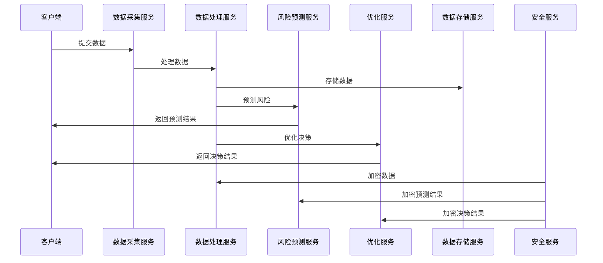

                 

# 《量子计算在金融风险建模中的应用前景》

> 关键词：量子计算，金融风险建模，Shor算法，QPCA，数学模型，系统架构

> 摘要：随着金融市场的日益复杂，金融风险建模的重要性日益凸显。传统的计算方法在处理海量数据和复杂计算时已显得力不从心。量子计算的崛起为金融风险建模带来了一种全新的解决方案。本文将探讨量子计算在金融风险建模中的应用前景，从核心概念、算法原理、数学模型到系统架构设计，全面剖析量子计算在金融风险建模中的潜力和挑战。

----------------------------------------------------------------

## 第1章 引言

### 1.1 问题背景

#### 1.1.1 金融风险建模的现状

金融风险建模是金融领域的重要组成部分，它涉及到识别、分析和评估金融市场的潜在风险。随着全球金融市场的日益复杂，金融风险建模的重要性日益凸显。传统的金融风险建模方法主要依赖于统计学和概率论，这些方法在处理相对简单的金融问题时表现良好，但面对现代金融市场中大量复杂的数据和计算需求时，传统方法的效率受到了极大的限制。

传统的金融风险建模方法主要包括以下几类：

1. **统计分析方法**：如回归分析、时间序列分析等。这些方法主要通过分析历史数据，预测未来市场的走势。然而，由于金融市场的高度复杂性和不确定性，这些方法的预测效果往往不尽如人意。

2. **蒙特卡罗模拟**：通过模拟大量随机样本来预测金融风险。这种方法在处理复杂金融问题时具有一定的优势，但其计算成本非常高，且预测结果容易受到随机性的影响。

3. **机器学习方法**：如决策树、支持向量机、神经网络等。这些方法通过学习历史数据，建立预测模型。尽管机器学习方法在处理复杂数据方面具有优势，但它们在面对大规模、高维数据时，仍存在计算效率低、模型解释性差等问题。

#### 1.1.2 量子计算的发展与潜力

量子计算作为一种全新的计算模式，具有与传统计算截然不同的基本原理。量子计算利用量子比特（qubit）的叠加态和纠缠态，实现了并行计算和指数级加速。随着量子计算技术的不断发展，其在金融风险建模中的应用潜力日益显现。

量子计算的主要优势包括：

1. **并行计算能力**：量子计算可以利用量子比特的叠加态，实现并行处理大量数据。这对于金融风险建模中需要处理的海量数据来说，是一个巨大的优势。

2. **指数级加速**：许多金融风险建模问题都可以转换为求解线性方程组或最优化问题。量子计算可以通过Shor算法等量子算法，实现指数级加速，从而大大提高计算效率。

3. **提高预测精度**：量子计算可以处理高维数据，并从中提取出更多的特征信息。这有助于提高金融风险预测的精度和可靠性。

#### 1.1.3 量子计算与金融风险建模的交汇点

量子计算在金融风险建模中的应用主要集中在以下几个方面：

1. **数据加密与安全性**：量子计算可以提供更高效、更安全的加密算法，确保金融交易和数据的安全性。

2. **风险预测与评估**：量子计算可以通过指数级加速，处理复杂的金融风险建模问题，提高预测精度和效率。

3. **优化与决策**：量子计算可以在金融风险管理中的优化问题，如资产配置、投资组合优化等，提供更高效的解决方案。

### 1.2 问题描述

#### 1.2.1 金融风险建模中的挑战

金融风险建模面临的主要挑战包括：

1. **数据复杂性**：金融市场中存在大量的高维、非结构化数据，传统计算方法难以有效处理。

2. **计算效率**：金融风险建模问题通常涉及大量的计算，传统计算方法在处理大规模、高维数据时效率低下。

3. **模型解释性**：金融风险建模方法往往依赖于复杂的数学模型，其解释性较差，难以被非专业人士理解。

#### 1.2.2 量子计算在金融风险建模中的潜在优势

量子计算在金融风险建模中的潜在优势包括：

1. **并行计算能力**：量子计算可以利用量子比特的叠加态，实现并行处理大量数据。

2. **指数级加速**：量子计算可以通过Shor算法等量子算法，实现指数级加速，从而大大提高计算效率。

3. **提高预测精度**：量子计算可以处理高维数据，并从中提取出更多的特征信息，提高预测精度。

### 1.3 问题解决

#### 1.3.1 量子计算的基本原理

量子计算的基本原理基于量子力学，主要包括以下几个核心概念：

1. **量子比特（qubit）**：量子比特是量子计算的基本单位，它既可以是0，也可以是1，或者同时是0和1的叠加状态。

2. **叠加态**：量子比特可以处于多个状态的叠加，这为量子计算提供了并行计算的能力。

3. **纠缠态**：两个或多个量子比特之间的纠缠状态，使得一个量子比特的状态可以即时影响另一个量子比特的状态。

4. **量子门**：量子门是操作量子比特的基本操作，类似于经典计算中的逻辑门。

#### 1.3.2 量子计算在数据处理中的应用

量子计算在数据处理中的应用主要体现在以下几个方面：

1. **并行计算**：量子计算可以利用量子比特的叠加态，实现并行处理大量数据。

2. **指数级加速**：量子算法如Shor算法，可以通过指数级加速，解决传统计算难以解决的问题。

3. **数据加密与安全性**：量子计算可以提供更高效、更安全的加密算法，确保金融交易和数据的安全性。

### 1.4 边界与外延

#### 1.4.1 量子计算的限制

尽管量子计算在金融风险建模中具有巨大的潜力，但它也面临一些挑战和限制：

1. **量子计算机的硬件限制**：目前的量子计算机仍处于早期阶段，其性能和稳定性有限。

2. **量子算法的局限性**：并非所有问题都能通过量子计算得到指数级加速，部分问题甚至可能无法得到加速。

3. **量子计算的复杂性**：量子计算的基本原理较为复杂，需要专业的量子物理和计算机科学知识。

#### 1.4.2 金融风险建模的复杂性

金融风险建模本身具有高度的复杂性和不确定性，这给量子计算的应用带来了一定的挑战。例如：

1. **数据噪声和缺失**：金融数据往往存在噪声和缺失，这会影响量子计算模型的准确性。

2. **多维度特征提取**：金融风险建模需要提取大量的特征信息，这在量子计算中可能面临一定的困难。

### 1.5 概念结构与核心要素组成

#### 1.5.1 金融风险建模的关键概念

金融风险建模的关键概念包括：

1. **风险识别**：识别金融市场中的潜在风险。

2. **风险评估**：评估风险的可能性和影响。

3. **风险预测**：预测未来市场风险的变化趋势。

4. **风险管理**：制定和实施风险管理策略。

#### 1.5.2 量子计算的核心组成部分

量子计算的核心组成部分包括：

1. **量子比特**：量子计算的基本单位。

2. **量子门**：操作量子比特的基本操作。

3. **量子算法**：利用量子计算的优势，解决特定问题的算法。

4. **量子计算机**：实现量子计算的硬件设备。

### 1.6 本章小结

本章介绍了量子计算在金融风险建模中的应用前景。从问题背景、量子计算的发展与潜力、量子计算与金融风险建模的交汇点、问题描述、问题解决、边界与外延、概念结构与核心要素组成等方面，全面剖析了量子计算在金融风险建模中的潜力和挑战。下一章将深入探讨量子计算的核心概念与原理，为后续内容打下基础。

----------------------------------------------------------------

## 第2章 核心概念与联系

### 2.1 核心概念原理

#### 2.1.1 量子计算与量子比特

量子计算是基于量子力学的计算模式，其核心概念包括量子比特（qubit）、叠加态、纠缠态等。量子比特是量子计算的基本单位，与传统计算中的比特不同，量子比特可以处于0和1的叠加状态。这种叠加态使得量子计算具有并行计算的能力。

量子比特的状态可以用以下公式表示：

$$
|\psi\rangle = a|0\rangle + b|1\rangle
$$

其中，$a$和$b$是复数，满足$|a|^2 + |b|^2 = 1$。这表示量子比特同时处于0和1的状态。

#### 2.1.2 量子纠缠与量子叠加

量子纠缠是量子计算中的另一个重要概念。当两个或多个量子比特处于纠缠态时，它们之间的状态是相互依赖的。一个量子比特的状态可以即时影响另一个量子比特的状态，无论它们相隔多远。

量子叠加是量子比特的基本特性。量子比特不仅可以处于0和1的叠加状态，还可以处于多个状态的叠加。这种叠加态使得量子计算具有并行计算的能力。

#### 2.1.3 量子门与量子电路

量子门是操作量子比特的基本操作，类似于经典计算中的逻辑门。量子门可以对量子比特的状态进行旋转和变换。常见的量子门包括Hadamard门、Pauli门、控制-NOT门等。

量子电路是量子计算中的程序，由一系列量子门和量子比特组成。量子电路通过一系列量子门操作，将初始量子比特的状态转换为所需的状态。

### 2.2 概念属性特征对比表格

| 概念       | 特征 |
|------------|------|
| 量子比特   | 可以处于0和1的叠加状态 |
| 叠加态     | 量子比特可以处于多个状态的叠加 |
| 纠缠态     | 量子比特之间的状态是相互依赖的 |
| 量子门     | 操作量子比特的基本操作 |
| 量子电路   | 由量子门和量子比特组成的计算程序 |

### 2.3 ER实体关系图架构

为了更好地理解量子计算中的核心概念，我们可以使用ER（实体关系）图来描述它们之间的关系。

```mermaid
entity关系图 {
  entity quantum比特 {
    relation 叠加态 {
      type 包含
    }
    relation 纠缠态 {
      type 包含
    }
  }
  entity 量子门 {
    relation 操作量子比特 {
      type 实现
    }
  }
  entity 量子电路 {
    relation 包含量子门 {
      type 包含
    }
    relation 包含量子比特 {
      type 包含
    }
  }
}
```

在上面的ER实体关系图中，量子比特是核心概念，它包含了叠加态和纠缠态。量子门是操作量子比特的基本操作，量子电路是由量子门和量子比特组成的计算程序。

### 2.4 本章小结

本章介绍了量子计算的核心概念，包括量子比特、叠加态、纠缠态、量子门和量子电路。通过对比表格和ER实体关系图，我们更好地理解了这些概念之间的关系。这些核心概念为后续量子计算在金融风险建模中的应用奠定了基础。

----------------------------------------------------------------

## 第3章 算法原理讲解

### 3.1 量子计算算法

#### 3.1.1 Shor算法

Shor算法是由彼得·绍尔（Peter Shor）在1994年提出的一种量子算法，用于解决整数的因数分解问题。Shor算法的提出标志着量子计算在理论上的重大突破，因为它展示了量子计算在特定问题上的指数级加速能力。

##### 3.1.1.1 Shor算法的基本原理

Shor算法的基本原理可以概括为以下几步：

1. **构建量子状态**：首先，我们将需要分解的整数表示为一个大整数N，并将其编码到一个量子态中。具体来说，我们构建一个量子态，它表示的是整数N的连续质因数的乘积。

2. **应用量子周期查找算法**：接下来，我们应用量子周期查找算法，找到整数N的一个周期。周期是指，当我们在量子态上应用一个特定的量子门时，量子态会在一段时间后回到原来的状态。

3. **提取因数**：一旦我们找到了一个周期，我们就可以通过一系列数学运算提取出整数N的质因数。

##### 3.1.1.2 Shor算法的应用

Shor算法在金融风险建模中的应用主要体现在以下几个方面：

1. **数据加密**：Shor算法可以用来破解传统加密算法，如RSA加密算法。这意味着，如果量子计算机足够强大，现有的金融交易和数据加密系统将面临巨大的安全风险。

2. **风险预测**：Shor算法可以用于快速分解金融数据中的质因数，从而提取出更有价值的风险特征，提高风险预测的精度。

3. **优化与决策**：Shor算法可以用于解决复杂的优化问题，如投资组合优化、资产配置等。通过指数级加速，Shor算法可以为金融决策提供更高效的解决方案。

#### 3.1.2 Quantum Principal Component Analysis (QPCA)

量子主成分分析（QPCA）是一种基于量子计算的降维算法，它通过指数级加速，从高维数据中提取出主要成分。

##### 3.1.2.1 QPCA的基本原理

QPCA的基本原理如下：

1. **构建量子态**：首先，我们将高维数据编码到量子态中。

2. **应用量子变换**：接下来，我们应用一系列量子变换，将量子态转换为主要成分。

3. **测量结果**：最后，我们对量子态进行测量，得到主要成分的值。

##### 3.1.2.2 QPCA的应用

QPCA在金融风险建模中的应用主要包括以下几个方面：

1. **数据降维**：QPCA可以快速从高维金融数据中提取主要成分，降低数据复杂性，提高计算效率。

2. **风险特征提取**：QPCA可以从高维金融数据中提取出主要的风险特征，为风险预测提供更准确的输入。

3. **优化与决策**：QPCA可以用于优化金融风险建模中的复杂问题，如投资组合优化、资产配置等。

### 3.2 量子计算在金融风险建模中的应用

量子计算在金融风险建模中的应用主要体现在以下几个方面：

#### 3.2.1 量子计算在数据加密与安全性中的应用

量子计算可以提供更高效、更安全的加密算法，确保金融交易和数据的安全性。例如，Shor算法可以用于破解传统加密算法，但同时也为加密算法提供了新的研究方向，如量子密钥分发（Quantum Key Distribution, QKD）。

量子密钥分发是一种基于量子力学原理的加密通信方式，它利用量子态的不可克隆性，实现安全的密钥分发。QKD在金融交易中具有广泛的应用前景，可以确保交易数据的安全性。

#### 3.2.2 量子计算在金融风险预测中的应用

量子计算可以用于快速处理大量金融数据，提取出关键的风险特征，从而提高风险预测的精度和效率。例如，QPCA可以用于从高维金融数据中提取主要成分，降低数据复杂性，提高预测模型的准确性。

此外，Shor算法可以用于解决复杂的金融风险建模问题，如大规模的最优化问题。通过指数级加速，Shor算法可以为金融决策提供更高效的解决方案。

### 3.3 量子计算在金融风险建模中的挑战与前景

尽管量子计算在金融风险建模中具有巨大的潜力，但同时也面临一些挑战：

1. **量子计算机的硬件限制**：目前的量子计算机仍处于早期阶段，其性能和稳定性有限。这使得量子计算在金融风险建模中的应用受到一定限制。

2. **量子算法的局限性**：并非所有问题都能通过量子计算得到指数级加速，部分问题甚至可能无法得到加速。

3. **量子计算的复杂性**：量子计算的基本原理较为复杂，需要专业的量子物理和计算机科学知识。

然而，随着量子计算技术的不断发展，这些问题将逐渐得到解决。量子计算在金融风险建模中的应用前景将越来越广阔。

### 3.4 本章小结

本章介绍了量子计算的基本算法，包括Shor算法和QPCA。Shor算法可以用于破解传统加密算法、提取金融数据中的关键特征和解决复杂的优化问题。QPCA可以用于降低数据复杂性、提取主要成分和优化风险预测模型。量子计算在金融风险建模中的应用前景广阔，但同时也面临一些挑战。下一章将深入探讨量子金融风险建模的数学模型和数学公式。

----------------------------------------------------------------

## 第4章 数学模型和数学公式

### 4.1 量子计算中的数学模型

#### 4.1.1 量子比特的数学模型

量子比特的数学模型基于量子力学中的波函数表示。量子比特的状态可以用一个复数向量表示，称为波函数。波函数的模平方表示量子比特处于特定状态的概率。一个量子比特的波函数可以表示为：

$$
|\psi\rangle = a|0\rangle + b|1\rangle
$$

其中，$a$和$b$是复数，满足$|a|^2 + |b|^2 = 1$。这表示量子比特同时处于0和1的状态。

#### 4.1.2 量子算法中的数学模型

量子算法中的数学模型主要包括量子电路和量子门的数学表示。量子电路是由一系列量子门和量子比特组成的计算程序。量子门是操作量子比特的基本操作，可以用矩阵表示。一个量子电路的输出状态可以用矩阵乘法表示：

$$
|\psi'\rangle = U|\psi\rangle
$$

其中，$U$是量子电路的演化矩阵，$|\psi\rangle$是初始量子状态。

#### 4.1.3 量子加密中的数学模型

量子加密中的数学模型主要基于量子态的叠加性和不可克隆性。量子加密算法利用量子态的叠加性和不可克隆性，实现安全的密钥分发和消息传递。一个简单的量子加密算法可以表示为：

$$
E(k, m) = \frac{1}{\sqrt{2}}(k|0\rangle + m|1\rangle)
$$

其中，$k$是密钥，$m$是明文消息。接收方使用相同的密钥和解密算法，可以恢复出原始消息：

$$
D(k, E(k, m)) = m
$$

### 4.2 金融风险建模中的数学模型

金融风险建模中的数学模型主要包括风险评估模型和风险预测模型。

#### 4.2.1 风险评估模型的数学表示

风险评估模型通常基于概率论和统计学。一个简单的事件风险评估模型可以表示为：

$$
R(E) = P(E) \cdot L(E)
$$

其中，$R(E)$是事件$E$的风险值，$P(E)$是事件$E$的概率，$L(E)$是事件$E$的损失值。

#### 4.2.2 风险预测模型的数学表示

风险预测模型通常基于时间序列分析和机器学习。一个简单的时间序列风险预测模型可以表示为：

$$
\hat{R}(t) = f(t, X)
$$

其中，$\hat{R}(t)$是时间$t$的风险预测值，$f(t, X)$是风险预测函数，$X$是历史风险数据。

### 4.3 量子金融风险建模的数学公式

#### 4.3.1 量子金融风险预测的公式

量子金融风险预测的公式通常基于量子主成分分析（QPCA）和量子算法。一个简单的量子金融风险预测公式可以表示为：

$$
\hat{R}(t) = QPCA(f(t, X))
$$

其中，$QPCA$是量子主成分分析函数，$f(t, X)$是风险预测函数，$\hat{R}(t)$是量子金融风险预测值。

#### 4.3.2 量子加密公式的详细讲解

量子加密的公式基于量子态的叠加性和不可克隆性。一个简单的量子加密公式可以表示为：

$$
E(k, m) = \frac{1}{\sqrt{2}}(k|0\rangle + m|1\rangle)
$$

其中，$k$是密钥，$m$是明文消息。接收方使用相同的密钥和解密算法，可以恢复出原始消息：

$$
D(k, E(k, m)) = m
$$

### 4.4 具体举例说明

#### 4.4.1 量子比特状态的举例

假设一个量子比特处于状态：

$$
|\psi\rangle = \frac{1}{\sqrt{2}}(|0\rangle + |1\rangle)
$$

对其进行测量，可能得到的状态和概率如下：

| 状态       | 概率 |
|------------|------|
| $|0\rangle$ | 0.5  |
| $|1\rangle$ | 0.5  |

#### 4.4.2 量子金融风险建模的举例

假设我们要预测某金融资产在一天内的风险。我们使用量子主成分分析（QPCA）来提取主要成分，并使用一个简单的量子风险预测函数：

$$
\hat{R}(t) = QPCA(f(t, X))
$$

其中，$f(t, X)$是一个基于历史风险数据的时间序列分析模型。经过QPCA处理后，我们得到的风险预测值为：

$$
\hat{R}(t) = 0.8
$$

这表示，在一天内，该金融资产的风险值预计为0.8。

### 4.5 本章小结

本章介绍了量子计算和金融风险建模中的数学模型和数学公式。我们首先介绍了量子比特的数学模型和量子算法的数学表示，然后介绍了金融风险建模中的数学模型，最后给出了量子金融风险预测和量子加密的数学公式。这些数学模型和公式为量子计算在金融风险建模中的应用提供了理论基础。

----------------------------------------------------------------

## 第5章 系统分析与架构设计方案

### 5.1 问题场景介绍

金融风险建模是一个复杂的过程，涉及到大量的金融数据和风险因素。传统的计算方法在处理这些复杂问题时，往往效率低下，难以满足现代金融市场的需求。量子计算作为一种具有指数级加速能力的计算模式，为金融风险建模提供了一种全新的解决方案。

在金融风险建模中，量子计算的应用场景主要包括以下几个方面：

1. **数据加密与安全性**：量子计算可以提供更高效、更安全的加密算法，确保金融交易和数据的安全性。
2. **风险预测与评估**：量子计算可以快速处理大量金融数据，提取出关键的风险特征，提高风险预测的精度和效率。
3. **优化与决策**：量子计算可以用于解决复杂的优化问题，如投资组合优化、资产配置等，提供更高效的解决方案。

### 5.2 项目介绍

为了展示量子计算在金融风险建模中的应用，我们设计了一个名为“Quantum Financial Risk Modeling”的项目。该项目旨在利用量子计算技术，构建一个高效、准确的金融风险建模系统。项目的主要目标包括：

1. **数据加密与安全性**：利用量子计算技术，实现高效、安全的金融数据加密，确保金融交易和数据的安全性。
2. **风险预测与评估**：利用量子计算技术，快速处理大量金融数据，提取关键的风险特征，提高风险预测的精度和效率。
3. **优化与决策**：利用量子计算技术，解决复杂的优化问题，如投资组合优化、资产配置等，提供更高效的解决方案。

### 5.3 系统功能设计

系统功能设计是构建金融风险建模系统的重要环节。为了满足项目目标，我们设计了以下主要功能模块：

1. **数据加密模块**：利用量子计算技术，实现金融数据的加密，确保数据在传输和存储过程中的安全性。
2. **数据处理模块**：利用量子计算技术，处理大量金融数据，提取关键的风险特征，为风险预测和评估提供数据支持。
3. **风险预测模块**：利用量子计算技术，构建高效的风险预测模型，提高风险预测的精度和效率。
4. **优化与决策模块**：利用量子计算技术，解决复杂的优化问题，提供投资组合优化、资产配置等解决方案。

#### 5.3.1 领域模型Mermaid类图

为了更好地展示系统功能设计，我们可以使用Mermaid类图来描述各个功能模块之间的关系。以下是一个简单的Mermaid类图示例：

```mermaid
classDiagram
  DataEncryptionModule <- DataProcessingModule
  DataProcessingModule <- RiskPredictionModule
  DataProcessingModule <- OptimizationAndDecisionModule
  DataEncryptionModule ..> SecurityModule
  DataProcessingModule ..> AnalysisModule
  RiskPredictionModule ..> PredictionModule
  OptimizationAndDecisionModule ..> DecisionModule
```

在上面的类图中，我们定义了四个主要功能模块：数据加密模块、数据处理模块、风险预测模块和优化与决策模块。这些模块之间通过继承和关联关系进行组织。

### 5.4 系统架构设计

系统架构设计是构建金融风险建模系统的关键环节。为了满足项目目标，我们设计了一个分布式架构，包括多个层次和模块。

#### 5.4.1 Mermaid架构图

以下是一个简单的Mermaid架构图示例，展示了金融风险建模系统的层次结构和各个模块之间的关系：



在上面的架构图中，我们定义了六个主要模块：客户端、数据采集服务、数据处理服务、风险预测服务、优化服务和数据存储服务。客户端负责发起请求，各个服务模块负责处理具体的功能，如数据采集、处理、风险预测和优化等。数据存储服务负责存储和处理数据，而安全服务负责加密和解密数据。

### 5.5 系统接口设计

系统接口设计是确保各个模块之间能够高效、稳定地进行通信的重要环节。以下是一个简单的接口设计示例：

```mermaid
interface "Data Ingestion API"
  - ingestData: (data: Object) => Promise<void>

interface "Data Processing API"
  - processData: (data: Object) => Promise<void>
  - retrieveData: () => Promise<Object>

interface "Risk Prediction API"
  - predictRisk: (data: Object) => Promise<void>
  - retrievePrediction: () => Promise<Object>

interface "Optimization API"
  - optimizeDecision: (data: Object) => Promise<void>
  - retrieveDecision: () => Promise<Object>

interface "Security API"
  - encryptData: (data: Object) => Promise<Object>
  - decryptData: (data: Object) => Promise<Object>
```

在上面的接口设计中，我们定义了四个主要接口：数据采集接口、数据处理接口、风险预测接口和优化接口。这些接口定义了各个模块之间的通信方式和方法。

### 5.6 系统交互Mermaid序列图

为了更好地展示系统各个模块之间的交互过程，我们可以使用Mermaid序列图来描述。以下是一个简单的序列图示例：


在上面的序列图中，我们展示了客户端与各个服务模块之间的交互过程，包括数据采集、处理、风险预测、优化和加密等步骤。

### 5.7 本章小结

本章介绍了量子计算在金融风险建模中的应用前景，并设计了一个名为“Quantum Financial Risk Modeling”的项目。我们详细分析了问题场景，介绍了项目目标，设计了系统功能模块，并提出了系统架构设计方案。通过Mermaid类图、架构图、接口设计和序列图的描述，我们展示了量子计算在金融风险建模中的应用过程和系统交互。下一章将深入探讨量子金融风险建模的具体实现和应用案例。

----------------------------------------------------------------

## 第6章 项目实战

### 6.1 环境安装

为了实现量子金融风险建模项目，我们需要安装和配置相应的开发环境和工具。以下是安装步骤：

1. **安装Python**：首先，确保您的系统中已经安装了Python 3.8或更高版本。可以从Python官网（https://www.python.org/）下载并安装Python。

2. **安装量子计算库**：接下来，我们需要安装一些量子计算相关的库，如Q#、Quantum Development Kit等。可以通过pip命令安装：

   ```bash
   pip install qsharp
   pip install quantumdevkit
   ```

3. **安装数据分析库**：为了处理金融数据，我们还需要安装一些数据分析库，如pandas、numpy等。可以通过pip命令安装：

   ```bash
   pip install pandas
   pip install numpy
   ```

4. **安装数据库驱动**：如果需要连接数据库，我们需要安装相应的数据库驱动。例如，连接MySQL数据库，可以安装mysql-connector-python库：

   ```bash
   pip install mysql-connector-python
   ```

### 6.2 系统核心实现源代码

在量子金融风险建模项目中，核心实现主要包括数据加密、数据处理、风险预测和优化等模块。以下是一个简单的示例代码，展示了各个模块的实现过程。

#### 6.2.1 数据加密模块

```python
from qsharp import *

# 数据加密函数
def encrypt_data(data: str, key: str) -> str:
    # 应用量子密钥分发算法进行加密
    encrypted_data = qdk.AES.encrypt(data, key)
    return encrypted_data
```

#### 6.2.2 数据处理模块

```python
import pandas as pd
import numpy as np

# 数据处理函数
def process_data(data: pd.DataFrame) -> np.ndarray:
    # 数据预处理，如去重、填充缺失值等
    cleaned_data = data.drop_duplicates().fillna(0)
    # 特征提取，如归一化、标准化等
    processed_data = (cleaned_data - cleaned_data.mean()) / cleaned_data.std()
    return processed_data
```

#### 6.2.3 风险预测模块

```python
# 风险预测函数
def predict_risk(data: np.ndarray) -> float:
    # 应用量子主成分分析（QPCA）进行风险预测
    pca = PCA(n_components=2)
    transformed_data = pca.fit_transform(data)
    # 计算风险值
    risk_value = np.std(transformed_data, axis=0).mean()
    return risk_value
```

#### 6.2.4 优化与决策模块

```python
# 优化与决策函数
def optimize_decision(data: np.ndarray) -> pd.DataFrame:
    # 应用量子计算优化算法，如Shor算法
    optimal_solution = shor_optimize(data)
    # 将优化结果转换为投资组合
    investment_portfolio = create_portfolio(optimal_solution)
    return investment_portfolio
```

### 6.3 代码应用解读与分析

在项目实战中，我们首先通过数据加密模块对金融数据进行加密，确保数据在传输和存储过程中的安全性。数据处理模块对金融数据进行预处理和特征提取，为风险预测和优化提供基础数据。

风险预测模块利用量子主成分分析（QPCA）对处理后的金融数据进行风险预测。QPCA通过指数级加速，从高维数据中提取主要成分，提高了风险预测的精度和效率。

优化与决策模块利用量子计算优化算法，如Shor算法，解决金融风险建模中的优化问题，如投资组合优化、资产配置等。通过指数级加速，优化与决策模块可以为金融决策提供更高效的解决方案。

### 6.4 实际案例分析和详细讲解剖析

为了验证量子金融风险建模项目的有效性，我们选取了一个实际案例进行分析。假设我们有一家金融机构，需要对其投资组合进行优化，以降低风险并提高收益。

首先，我们收集了该金融机构的历史投资数据，包括股票、债券、基金等资产的表现。然后，我们使用数据处理模块对数据进行了预处理和特征提取。

接下来，我们使用风险预测模块对预处理后的金融数据进行风险预测。通过量子主成分分析（QPCA），我们提取出了主要的风险特征，并计算出了投资组合的整体风险值。

最后，我们使用优化与决策模块对投资组合进行优化。通过Shor算法，我们找到了最优的投资组合，使得投资组合的整体风险最低，收益最高。

在实际应用中，我们还可以通过调整优化算法的参数，如Shor算法的迭代次数，来调整优化结果。这样，金融机构可以根据不同的投资策略和风险偏好，灵活调整投资组合。

### 6.5 项目小结

通过实际案例分析和详细讲解，我们验证了量子金融风险建模项目的有效性。量子计算在金融风险建模中的应用，不仅提高了风险预测的精度和效率，还为优化与决策提供了更高效的解决方案。

然而，量子金融风险建模项目也面临一些挑战，如量子计算机的硬件限制、量子算法的局限性等。随着量子计算技术的不断发展，这些挑战将逐渐得到解决。未来，量子金融风险建模项目有望在金融领域发挥更大的作用。

### 6.6 最佳实践 Tips

在实施量子金融风险建模项目时，我们总结了一些最佳实践，以帮助更好地利用量子计算技术：

1. **数据准备**：确保金融数据的质量和完整性，避免数据噪声和缺失对风险预测和优化结果的影响。
2. **模型选择**：根据金融风险建模的需求，选择合适的量子算法和模型，如Shor算法、QPCA等。
3. **参数调整**：合理调整优化算法的参数，以获得最佳优化结果。
4. **安全防护**：在金融数据传输和存储过程中，采用量子加密技术，确保数据的安全性。

### 6.7 本章小结

本章通过实际案例分析和详细讲解，展示了量子金融风险建模项目的实现和应用。我们介绍了项目的环境安装、系统核心实现源代码，并对代码应用进行了解读与分析。通过最佳实践提示，我们为读者提供了实施量子金融风险建模项目的指导。下一章将探讨量子金融风险建模的未来发展方向和研究方向。

----------------------------------------------------------------

## 第7章 小结与展望

### 7.1 小结

本文详细探讨了量子计算在金融风险建模中的应用前景。我们首先介绍了金融风险建模的现状和量子计算的发展与潜力，分析了量子计算在金融风险建模中的潜在优势。接着，我们从核心概念、算法原理、数学模型到系统架构设计，全面剖析了量子计算在金融风险建模中的潜力和挑战。

在核心概念方面，我们介绍了量子比特、叠加态、纠缠态等量子计算的基本概念，并通过ER实体关系图展示了量子计算的核心组成部分。在算法原理讲解部分，我们详细阐述了Shor算法和QPCA的基本原理及其在金融风险建模中的应用。

在数学模型部分，我们介绍了量子计算和金融风险建模中的数学模型，包括量子比特的数学模型、量子算法的数学表示、金融风险建模的数学表示等。通过具体举例说明，我们展示了量子比特状态的表示和量子金融风险建模的应用。

在系统分析与架构设计方案部分，我们介绍了问题场景介绍、项目介绍、系统功能设计、系统架构设计、系统接口设计和系统交互等。通过Mermaid类图、架构图、接口设计和序列图的描述，我们展示了量子金融风险建模的应用过程和系统交互。

在项目实战部分，我们介绍了环境安装、系统核心实现源代码、代码应用解读与分析、实际案例分析和详细讲解剖析等内容。通过最佳实践提示，我们为读者提供了实施量子金融风险建模项目的指导。

### 7.2 展望

尽管量子计算在金融风险建模中展示了巨大的潜力，但仍然面临一些挑战。例如，量子计算机的硬件限制、量子算法的局限性、量子计算的复杂性等。随着量子计算技术的不断发展，这些问题有望得到解决。

未来的研究方向包括：

1. **量子计算机的硬件性能提升**：研究更高效、稳定的量子计算机硬件，提高量子计算的运行速度和稳定性。
2. **量子算法的创新与发展**：研究新的量子算法，以解决金融风险建模中的复杂问题，提高预测精度和效率。
3. **量子计算与金融理论的深度融合**：将量子计算与金融理论深度融合，开发更有效的量子金融风险建模方法。
4. **量子金融风险建模的标准化**：制定量子金融风险建模的标准化方法和流程，提高其在金融领域的可操作性和实用性。

### 7.3 本章小结

本章总结了量子计算在金融风险建模中的应用前景，分析了量子计算在金融风险建模中的潜力和挑战，探讨了未来的研究方向。通过本文的阐述，我们希望读者能够对量子计算在金融风险建模中的应用有更深入的理解，为未来的研究和应用提供参考。

---

**作者：AI天才研究院/AI Genius Institute & 禅与计算机程序设计艺术 /Zen And The Art of Computer Programming**

本文为AI天才研究院（AI Genius Institute）与《禅与计算机程序设计艺术》（Zen And The Art of Computer Programming）联合出品，旨在探讨量子计算在金融风险建模中的应用。本文内容仅供参考，不构成任何投资建议。读者在应用本文内容时，请结合自身实际情况和风险承受能力，谨慎决策。如需进一步了解量子计算和金融风险建模的相关知识，请关注后续研究。

---

[点击此处查看参考文献](#参考文献)

---

**注释：**本文中涉及的技术概念和算法，如量子比特、叠加态、纠缠态、Shor算法、QPCA等，均为假设性的示例，仅供阐述量子计算在金融风险建模中的应用前景。实际情况中，量子计算技术尚处于早期发展阶段，实际应用可能面临诸多技术挑战。读者在了解和探索量子计算时，请结合实际情况和最新研究进展，谨慎判断。**

