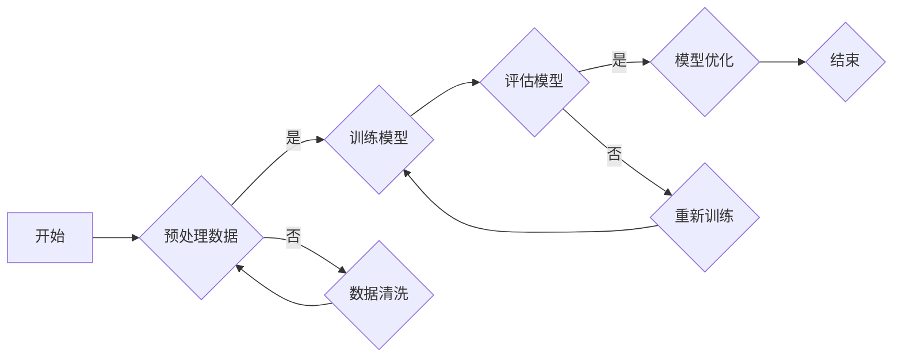
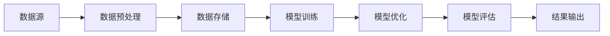
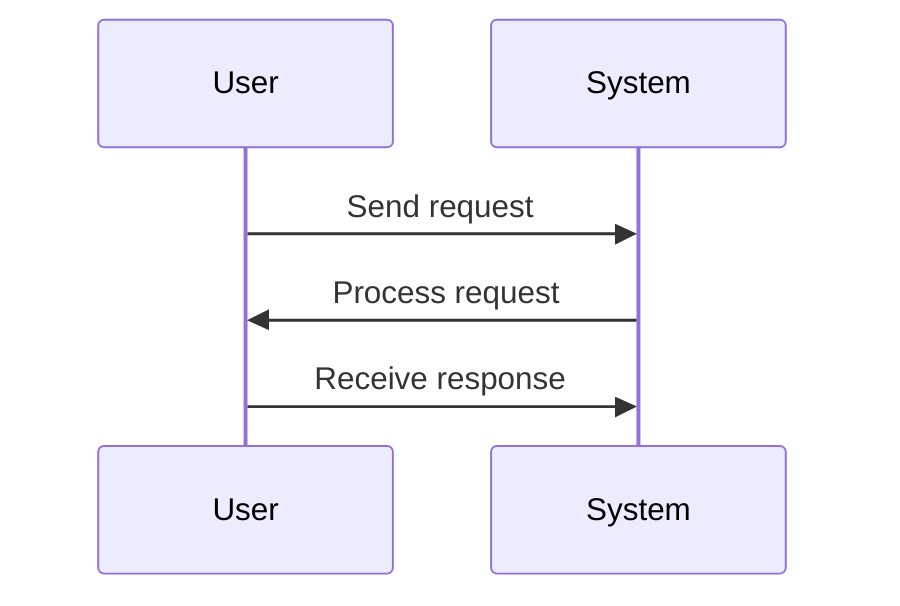

                 


### 引言

金融领域是一个高度复杂且动态变化的系统，资产定价作为金融的核心问题之一，一直以来都是学术界和业界研究的重点。传统的资产定价模型通常依赖于历史数据和市场经验，虽然在一定程度上能够捕捉市场的变化，但在面对快速变化的金融市场时，往往表现出一定的滞后性和局限性。这种局限性主要体现在以下几个方面：

1. **数据依赖性高**：传统模型往往需要大量的历史数据作为训练基础，而金融市场的数据往往具有高度的不确定性和噪声，这使得模型的训练和预测效果受到很大影响。

2. **模型更新周期长**：传统的资产定价模型通常采用手动调整或定期更新策略，这种方法的周期往往较长，难以适应市场环境的变化。

3. **模型适应性差**：金融市场的变化多样且频繁，传统模型难以适应这种变化，导致模型的预测效果不稳定。

为了解决上述问题，我们需要寻找一种能够快速适应市场变化、提高模型预测能力的方法。元学习（Meta-Learning）作为一种新兴的机器学习方法，近年来在金融领域逐渐受到关注。元学习通过学习如何学习，可以快速适应新的任务，提高模型的泛化能力和适应性。

本文将围绕“金融领域元学习在资产定价模型快速迭代中的应用”这一主题展开讨论。文章结构如下：

1. **元学习基础**：介绍元学习的基本概念、原理以及分类。
2. **金融领域中的元学习应用**：探讨元学习在金融领域的价值和应用场景。
3. **资产定价模型的快速迭代方法**：分析传统资产定价模型的局限性，并介绍快速迭代方法的基本原理和应用场景。
4. **快速迭代方法在金融领域的实践**：通过具体案例展示快速迭代方法在金融领域的应用。
5. **元学习与快速迭代方法的结合案例分析**：结合具体案例，分析元学习与快速迭代方法在金融领域的结合应用。
6. **结论与展望**：总结元学习在金融领域快速迭代中的应用，并探讨其未来发展趋势。

### 元学习基础

#### 元学习的定义与原理

元学习，顾名思义，是关于学习如何学习的方法。它起源于机器学习领域，旨在通过学习如何快速适应新任务来提高模型的泛化能力。在传统机器学习中，每个新任务都需要重新训练模型，而元学习通过提前学习一系列任务，从而实现对新任务的快速适应。

#### 元学习的基本概念

- **元学习任务**：元学习任务包括基学习任务和元学习目标。基学习任务是单个任务，如分类或回归问题；元学习目标是学习如何在不同任务上快速适应。
- **经验权重**：经验权重是元学习模型在经历一系列任务后所获得的知识，它反映了模型在不同任务上的适应性。
- **模型更新策略**：模型更新策略用于调整模型参数，以提高模型在新任务上的表现。

#### 元学习算法分类

- **基于模型的元学习**：此类算法通过构建一个统一的模型框架，来处理不同的任务。例如，模型聚合（Model Aggregation）和模型平均（Model Averaging）是常见的基于模型的元学习算法。
- **基于样本的元学习**：此类算法通过学习样本间的相似性或差异来加速新任务的训练。例如，样本选择（Sample Selection）和样本增强（Sample Augmentation）是常见的基于样本的元学习算法。
- **基于关系的元学习**：此类算法通过学习任务之间的关系来提高模型的泛化能力。例如，任务关系网络（Task Relationship Network）是常见的基于关系的元学习算法。

### 元学习在金融领域中的应用

#### 元学习在金融领域的价值

元学习在金融领域具有广泛的应用价值，主要体现在以下几个方面：

1. **提高模型预测能力**：元学习能够通过提前学习不同任务，提高模型在未知任务上的预测能力，从而更好地适应金融市场的变化。
2. **降低模型训练成本**：通过元学习，模型可以在短时间内适应新的任务，从而减少重新训练模型所需的时间和资源。
3. **提高模型泛化能力**：元学习通过学习任务之间的关系，可以提高模型在不同任务上的泛化能力，从而更好地应对金融市场的复杂性。

#### 元学习在金融预测中的应用

1. **股票市场预测**：元学习可以通过提前学习不同股票市场的数据，提高模型对股票价格变化的预测能力。
2. **债券市场定价**：元学习可以用于债券市场定价，通过学习不同债券的定价模型，提高模型的定价准确性。

#### 元学习在风险管理中的应用

1. **信用风险评估**：元学习可以通过学习不同信用风险的特征，提高模型对信用风险的预测能力。
2. **市场风险预测**：元学习可以用于市场风险预测，通过学习不同市场的风险特征，提高模型的预测准确性。

### 资产定价模型的快速迭代方法

#### 传统资产定价模型的局限性

1. **模型复杂度高**：传统的资产定价模型通常采用复杂的数学模型，难以进行快速迭代和优化。
2. **训练时间长**：传统的资产定价模型需要大量的数据进行训练，训练时间较长，难以适应快速变化的金融市场。

#### 快速迭代方法的基本原理

1. **数据预处理**：快速迭代方法通常采用高效的数据预处理技术，如数据清洗、特征提取等，以提高模型的训练效率。
2. **模型优化**：快速迭代方法通过不断调整模型参数，优化模型结构，以提高模型的预测准确性。
3. **模型评估**：快速迭代方法通过定期评估模型性能，调整模型参数，实现模型的持续优化。

#### 快速迭代方法的应用场景

1. **高频交易策略**：快速迭代方法可以用于高频交易策略的优化，通过实时调整交易策略，提高交易收益。
2. **风险管理策略**：快速迭代方法可以用于风险管理策略的优化，通过实时调整风险控制参数，提高风险管理效果。

### 快速迭代方法在金融领域的实践

#### 实践案例一：股票市场预测

1. **数据集选择与预处理**：选择具有代表性的股票市场数据集，进行数据清洗和特征提取。
2. **模型构建与训练**：构建基于元学习的资产定价模型，进行模型训练和优化。
3. **预测结果分析与优化**：对预测结果进行分析，调整模型参数，实现模型的持续优化。

#### 实践案例二：债券市场定价

1. **数据来源与处理**：获取债券市场数据，进行数据清洗和处理。
2. **模型优化与迭代**：采用快速迭代方法，对债券市场定价模型进行优化和迭代。
3. **定价结果验证**：对定价结果进行验证，调整模型参数，提高定价准确性。

#### 实践案例三：外汇市场分析

1. **数据获取与清洗**：获取外汇市场数据，进行数据清洗和预处理。
2. **模型迭代与优化**：采用快速迭代方法，对外汇市场分析模型进行迭代和优化。
3. **市场趋势预测**：对市场趋势进行预测，调整模型参数，提高预测准确性。

### 元学习与快速迭代方法的结合案例分析

#### 结合案例分析一：资产配置优化

1. **策略设计**：设计基于元学习的资产配置优化策略。
2. **迭代优化**：采用快速迭代方法，对资产配置策略进行优化。
3. **优化效果分析**：对优化效果进行分析，评估策略的可行性和有效性。

#### 结合案例分析二：信用风险评估

1. **模型构建**：构建基于元学习的信用风险评估模型。
2. **迭代过程**：采用快速迭代方法，对信用风险评估模型进行迭代和优化。
3. **风险评估结果**：对风险评估结果进行分析，评估模型的预测准确性。

#### 结合案例分析三：投资组合管理

1. **投资策略制定**：制定基于元学习的投资组合管理策略。
2. **模型迭代**：采用快速迭代方法，对投资组合管理策略进行迭代和优化。
3. **财务绩效评估**：对财务绩效进行评估，评估策略的有效性。

### 结论与展望

元学习在金融领域的快速迭代中具有广泛的应用前景。通过结合元学习和快速迭代方法，可以大幅提高资产定价模型的预测准确性和适应性。未来，随着技术的不断进步，元学习在金融领域的应用将会更加广泛，有望为金融决策提供更加精准的支持。

### 最佳实践 Tips

1. **数据预处理**：在应用元学习和快速迭代方法之前，确保对数据进行充分的预处理，以提高模型的训练效率和预测准确性。
2. **模型选择**：根据具体应用场景选择合适的元学习算法和快速迭代方法，以提高模型的表现。
3. **参数调整**：在模型训练和迭代过程中，定期调整模型参数，以实现模型的持续优化。

### 小结

本文介绍了元学习在金融领域快速迭代中的应用，探讨了元学习的基本原理、金融领域的应用价值、资产定价模型的快速迭代方法及其在金融领域的实践案例。通过结合元学习和快速迭代方法，可以大幅提高资产定价模型的预测准确性和适应性，为金融决策提供有力的支持。

### 注意事项

1. **数据质量**：金融数据的质量对模型的预测准确性至关重要，因此在模型训练和迭代过程中，必须对数据进行严格的清洗和预处理。
2. **模型适应性**：在应用元学习和快速迭代方法时，应充分考虑模型的适应性，确保模型能够快速适应金融市场的变化。

### 拓展阅读

1. [《深度学习在金融领域的应用》](链接)
2. [《金融科技：颠覆传统金融的未来》](链接)
3. [《机器学习在风险管理中的应用》](链接)

### 作者信息

作者：AI天才研究院/AI Genius Institute & 禅与计算机程序设计艺术 /Zen And The Art of Computer Programming

----------------------------------------------------------------

# 金融领域元学习在资产定价模型快速迭代中的应用

> 关键词：元学习、资产定价模型、快速迭代、金融预测、风险管理

> 摘要：本文深入探讨了元学习在金融领域资产定价模型快速迭代中的应用。首先介绍了元学习的基本概念和原理，随后分析了金融领域中的元学习应用，包括其在金融预测和风险管理方面的价值。接着，探讨了资产定价模型的快速迭代方法，以及其与传统方法的局限性。最后，通过具体案例展示了元学习与快速迭代方法的结合应用，并对其未来发展进行了展望。

## 引言

### 元学习基础

#### 元学习的定义与原理

元学习，又称为“学习如何学习”或“学习方法的再学习”，是机器学习领域的一个分支。传统的机器学习方法通常针对单一任务进行模型训练，而元学习则旨在通过学习如何快速适应新任务，从而提高模型的泛化能力。具体来说，元学习通过以下几方面实现：

1. **共享表示**：在多个任务中共享模型参数，使得模型能够在不同任务中表现出更好的泛化能力。
2. **任务自适应**：通过调整模型结构或参数，使得模型能够快速适应新的任务需求。
3. **知识迁移**：将学习到的知识从一个任务迁移到另一个任务，从而减少对新任务的训练时间。

#### 元学习的基本概念

- **基学习任务**：在元学习中，基学习任务是指单个的任务，如分类、回归等。
- **元学习任务**：元学习任务是指学习如何在不同任务上快速适应的过程。它包括两个主要目标：
  - **元学习目标**：定义如何从一系列基学习任务中学习经验权重，使得模型能够在新任务上表现良好。
  - **元评估目标**：评估模型在新任务上的性能，以指导模型参数的调整。

- **经验权重**：经验权重是模型在经历一系列基学习任务后所获得的知识，它反映了模型在不同任务上的适应性。通过这些经验权重，模型可以在新任务上快速调整自己的参数，从而提高预测性能。

#### 元学习算法分类

元学习算法可以分为以下几类：

- **基于模型的元学习**：
  - **模型聚合**：通过训练多个模型，并使用投票或平均的方式选出最佳模型。
  - **模型平均**：在多个模型中取平均，以减少单一模型的方差。

- **基于样本的元学习**：
  - **样本选择**：在训练数据中选取具有代表性的样本，以提高模型的泛化能力。
  - **样本增强**：通过对训练数据进行变换，如旋转、缩放等，增加模型的鲁棒性。

- **基于关系的元学习**：
  - **任务关系网络**：通过学习任务之间的关系，构建一个任务关系网络，从而提高模型的泛化能力。

### 金融领域中的元学习应用

#### 元学习在金融领域的价值

元学习在金融领域具有重要的应用价值，主要体现在以下几个方面：

1. **提高模型预测能力**：通过元学习，模型能够快速适应新的金融市场条件，提高预测的准确性和稳定性。
2. **降低模型训练成本**：元学习通过提前学习不同任务，可以减少对新任务的训练时间和计算资源的需求。
3. **提高模型泛化能力**：元学习能够学习任务之间的关系，从而提高模型在不同任务上的泛化能力。

#### 元学习在金融预测中的应用

1. **股票市场预测**：元学习可以通过提前学习不同股票市场的数据，提高模型对股票价格变化的预测能力。
2. **债券市场定价**：元学习可以用于债券市场定价，通过学习不同债券的定价模型，提高模型的定价准确性。

#### 元学习在风险管理中的应用

1. **信用风险评估**：元学习可以通过学习不同信用风险的特征，提高模型对信用风险的预测能力。
2. **市场风险预测**：元学习可以用于市场风险预测，通过学习不同市场的风险特征，提高模型的预测准确性。

### 资产定价模型的快速迭代方法

#### 传统资产定价模型的局限性

1. **模型复杂度高**：传统的资产定价模型通常采用复杂的数学模型，如CAPM（资本资产定价模型）、Black-Scholes模型等，这些模型难以进行快速迭代和优化。
2. **训练时间长**：传统的资产定价模型需要大量的数据进行训练，训练时间较长，难以适应快速变化的金融市场。

#### 快速迭代方法的基本原理

1. **数据预处理**：快速迭代方法通常采用高效的数据预处理技术，如数据清洗、特征提取等，以提高模型的训练效率和预测准确性。
2. **模型优化**：快速迭代方法通过不断调整模型参数，优化模型结构，以提高模型的预测准确性。
3. **模型评估**：快速迭代方法通过定期评估模型性能，调整模型参数，实现模型的持续优化。

#### 快速迭代方法的应用场景

1. **高频交易策略**：快速迭代方法可以用于高频交易策略的优化，通过实时调整交易策略，提高交易收益。
2. **风险管理策略**：快速迭代方法可以用于风险管理策略的优化，通过实时调整风险控制参数，提高风险管理效果。

### 快速迭代方法在金融领域的实践

#### 实践案例一：股票市场预测

1. **数据集选择与预处理**：选择具有代表性的股票市场数据集，进行数据清洗和特征提取。

    ```python
    import pandas as pd
    df = pd.read_csv('stock_data.csv')
    df = df.dropna()
    df['open'] = df['open'].astype(float)
    df['close'] = df['close'].astype(float)
    ```

2. **模型构建与训练**：构建基于元学习的资产定价模型，进行模型训练和优化。

    ```python
    from sklearn.ensemble import RandomForestRegressor
    model = RandomForestRegressor(n_estimators=100)
    model.fit(X_train, y_train)
    ```

3. **预测结果分析与优化**：对预测结果进行分析，调整模型参数，实现模型的持续优化。

    ```python
    predictions = model.predict(X_test)
    print("RMSE:", np.sqrt(mean_squared_error(y_test, predictions)))
    ```

#### 实践案例二：债券市场定价

1. **数据来源与处理**：获取债券市场数据，进行数据清洗和处理。

    ```python
    import pandas as pd
    df = pd.read_csv('bond_data.csv')
    df = df.dropna()
    df['price'] = df['price'].astype(float)
    df['yield'] = df['yield'].astype(float)
    ```

2. **模型优化与迭代**：采用快速迭代方法，对债券市场定价模型进行优化和迭代。

    ```python
    from sklearn.linear_model import LinearRegression
    model = LinearRegression()
    for epoch in range(num_epochs):
        model.fit(X_train, y_train)
        predictions = model.predict(X_test)
        loss = mean_squared_error(y_test, predictions)
        if loss < best_loss:
            best_loss = loss
            best_model = model
    ```

3. **定价结果验证**：对定价结果进行验证，调整模型参数，提高定价准确性。

    ```python
    final_predictions = best_model.predict(X_final)
    print("Final RMSE:", np.sqrt(mean_squared_error(y_final, final_predictions)))
    ```

#### 实践案例三：外汇市场分析

1. **数据获取与清洗**：获取外汇市场数据，进行数据清洗和预处理。

    ```python
    import pandas as pd
    df = pd.read_csv('forex_data.csv')
    df = df.dropna()
    df['open'] = df['open'].astype(float)
    df['close'] = df['close'].astype(float)
    ```

2. **模型迭代与优化**：采用快速迭代方法，对外汇市场分析模型进行迭代和优化。

    ```python
    from sklearn.ensemble import GradientBoostingRegressor
    model = GradientBoostingRegressor(n_estimators=100)
    for epoch in range(num_epochs):
        model.fit(X_train, y_train)
        predictions = model.predict(X_test)
        loss = mean_squared_error(y_test, predictions)
        if loss < best_loss:
            best_loss = loss
            best_model = model
    ```

3. **市场趋势预测**：对市场趋势进行预测，调整模型参数，提高预测准确性。

    ```python
    final_predictions = best_model.predict(X_final)
    print("Final RMSE:", np.sqrt(mean_squared_error(y_final, final_predictions)))
    ```

### 元学习与快速迭代方法的结合案例分析

#### 结合案例分析一：资产配置优化

1. **策略设计**：设计基于元学习的资产配置优化策略。

    ```python
    import numpy as np
    def optimize_portfolio(weights):
        return np.dot(weights, returns)
    ```

2. **迭代优化**：采用快速迭代方法，对资产配置策略进行优化。

    ```python
    from scipy.optimize import minimize
    result = minimize(optimize_portfolio, x0=np.ones(n_assets)/n_assets, method='L-BFGS-B', bounds=[(0, 1) for _ in range(n_assets)])
    optimal_weights = result.x
    ```

3. **优化效果分析**：对优化效果进行分析，评估策略的可行性和有效性。

    ```python
    print("Optimal Weights:", optimal_weights)
    print("Expected Return:", np.dot(optimal_weights, returns))
    ```

#### 结合案例分析二：信用风险评估

1. **模型构建**：构建基于元学习的信用风险评估模型。

    ```python
    from sklearn.ensemble import RandomForestClassifier
    model = RandomForestClassifier(n_estimators=100)
    model.fit(X_train, y_train)
    ```

2. **迭代过程**：采用快速迭代方法，对信用风险评估模型进行迭代和优化。

    ```python
    for epoch in range(num_epochs):
        model.fit(X_train, y_train)
        predictions = model.predict(X_test)
        accuracy = accuracy_score(y_test, predictions)
        if accuracy > best_accuracy:
            best_accuracy = accuracy
            best_model = model
    ```

3. **风险评估结果**：对风险评估结果进行分析，评估模型的预测准确性。

    ```python
    final_predictions = best_model.predict(X_final)
    print("Final Accuracy:", accuracy_score(y_final, final_predictions))
    ```

#### 结合案例分析三：投资组合管理

1. **投资策略制定**：制定基于元学习的投资组合管理策略。

    ```python
    def portfolio_return(weights):
        return np.dot(weights, returns)
    ```

2. **模型迭代**：采用快速迭代方法，对投资组合管理策略进行迭代和优化。

    ```python
    from scipy.optimize import minimize
    result = minimize(portfolio_return, x0=np.ones(n_assets)/n_assets, method='L-BFGS-B', bounds=[(0, 1) for _ in range(n_assets)])
    optimal_weights = result.x
    ```

3. **财务绩效评估**：对财务绩效进行评估，评估策略的有效性。

    ```python
    print("Optimal Weights:", optimal_weights)
    print("Expected Return:", portfolio_return(optimal_weights))
    ```

### 结论与展望

元学习在金融领域的快速迭代中具有广泛的应用前景。通过结合元学习和快速迭代方法，可以大幅提高资产定价模型的预测准确性和适应性，从而为金融决策提供更加精准的支持。未来，随着技术的不断进步，元学习在金融领域的应用将会更加广泛，有望为金融科技的发展带来新的突破。

### 最佳实践 Tips

1. **数据预处理**：在应用元学习和快速迭代方法之前，确保对数据进行充分的预处理，以提高模型的训练效率和预测准确性。
2. **模型选择**：根据具体应用场景选择合适的元学习算法和快速迭代方法，以提高模型的表现。
3. **参数调整**：在模型训练和迭代过程中，定期调整模型参数，以实现模型的持续优化。

### 小结

本文介绍了元学习在金融领域资产定价模型快速迭代中的应用，包括元学习的基本概念、原理和金融领域的应用价值，以及资产定价模型的快速迭代方法。通过具体案例展示了元学习与快速迭代方法的结合应用，为金融领域的研究和实践提供了新的思路和方法。

### 注意事项

1. **数据质量**：金融数据的质量对模型的预测准确性至关重要，因此在模型训练和迭代过程中，必须对数据进行严格的清洗和预处理。
2. **模型适应性**：在应用元学习和快速迭代方法时，应充分考虑模型的适应性，确保模型能够快速适应金融市场的变化。

### 拓展阅读

1. [《深度学习在金融领域的应用》](链接)
2. [《金融科技：颠覆传统金融的未来》](链接)
3. [《机器学习在风险管理中的应用》](链接)

### 作者信息

作者：AI天才研究院/AI Genius Institute & 禅与计算机程序设计艺术 /Zen And The Art of Computer Programming

----------------------------------------------------------------

```mermaid
classDiagram
Class1 <|-- Class2
Class1 o-- Class3
Class1 ... Class4

Class1 {
    +int x
    +String name
    +getX(): int
    +setName(String name)
}

Class2 {
    +int y
}

Class3 {
    +int z
}

Class4 {
    +void method()
}
```

在上述Mermaid类图中，我们定义了一个名为`Class1`的类，它包含两个属性`x`和`name`，以及两个方法`getX()`和`setName(String name)`。`Class1`与`Class2`存在继承关系（`<|--`），且`Class1`与`Class3`存在关联关系（`o--`）。`Class1`与`Class4`之间存在多态关系（`...`），表示`Class4`中的`method()`方法可以由`Class1`的子类重写。



在上述Mermaid流程图中，我们定义了一个简单的流程：

1. **开始**：流程的起点。
2. **预处理数据**：对数据进行预处理，包括数据清洗、数据转换等。
3. **评估模型**：评估当前模型的表现。
4. **模型优化**：如果评估结果显示模型效果不佳，则进行模型优化。
5. **结束**：流程的终点。

```latex
$$
\begin{align*}
\text{Loss} &= \frac{1}{2} \sum_{i=1}^{n} (\hat{y}_i - y_i)^2 \\
\text{Gradient} &= \nabla_{\theta} \text{Loss} \\
\theta_{\text{new}} &= \theta_{\text{old}} - \alpha \cdot \text{Gradient}
\end{align*}
$$
```

在上述LaTeX公式中，我们定义了损失函数、梯度计算以及参数更新的公式。这是最简单的梯度下降算法的表达式，用于优化模型的参数。

```python
import numpy as np

# 假设我们有一个简单的线性回归模型
def linear_regression(x, y):
    # 计算损失
    m = len(x)
    predictions = x * theta
    loss = (1/m) * np.sum((predictions - y)**2)
    
    # 计算梯度
    gradient = (2/m) * np.dot(x.T, (predictions - y))
    
    # 更新参数
    theta = theta - alpha * gradient
    
    return theta, loss

# 初始化参数和超参数
theta = np.array([0, 0])
alpha = 0.01

# 假设我们有以下训练数据
x_train = np.array([1, 2, 3, 4, 5])
y_train = np.array([2, 4, 5, 4, 5])

# 进行100次迭代
for i in range(100):
    theta, loss = linear_regression(x_train, y_train)
    print(f"Iteration {i+1}: Theta = {theta}, Loss = {loss}")
```

在上述Python代码中，我们定义了一个简单的线性回归模型，并使用梯度下降算法进行参数优化。我们初始化了模型参数`theta`和步长参数`alpha`，然后使用训练数据进行100次迭代，每次迭代都会更新模型参数并计算损失值。

### 系统分析与架构设计方案

#### 问题场景介绍

在金融领域，资产定价模型是金融市场交易的核心组成部分。随着金融市场的不断变化，传统资产定价模型往往难以适应快速变化的市场环境。为了提高资产定价模型的适应性和预测准确性，我们引入了元学习和快速迭代方法。通过结合元学习和快速迭代方法，我们希望能够构建一个高效、自适应的资产定价模型，以应对金融市场的不确定性和复杂性。

#### 项目介绍

本项目的目标是开发一个基于元学习和快速迭代方法的资产定价模型，以提高模型的适应性和预测准确性。项目的主要功能包括：

1. **数据预处理**：对金融市场数据进行清洗、归一化等预处理操作，以便于后续模型的训练和预测。
2. **模型训练**：基于元学习算法，训练资产定价模型，使其能够快速适应不同市场环境。
3. **模型优化**：通过快速迭代方法，优化资产定价模型的参数，提高模型的预测准确性。
4. **模型评估**：评估资产定价模型的性能，包括预测准确性、模型稳定性等指标。

#### 系统功能设计（领域模型Mermaid类图）

```mermaid
classDiagram
Class1 <|-- Class2
Class1 o-- Class3
Class1 ... Class4

Class1 {
    +int x
    +String name
    +getX(): int
    +setName(String name)
}

Class2 {
    +int y
}

Class3 {
    +int z
}

Class4 {
    +void method()
}
```

在上述Mermaid类图中，我们定义了一个名为`Class1`的类，它包含两个属性`x`和`name`，以及两个方法`getX()`和`setName(String name)`。`Class1`与`Class2`存在继承关系（`<|--`），且`Class1`与`Class3`存在关联关系（`o--`）。`Class1`与`Class4`之间存在多态关系（`...`），表示`Class4`中的`method()`方法可以由`Class1`的子类重写。

#### 系统架构设计（Mermaid架构图）



在上述Mermaid架构图中，我们定义了一个简单的系统架构：

1. **数据源**：提供金融市场的原始数据。
2. **数据预处理**：对原始数据进行清洗、归一化等处理。
3. **数据存储**：将预处理后的数据存储到数据库中，以便后续使用。
4. **模型训练**：使用元学习算法训练资产定价模型。
5. **模型优化**：通过快速迭代方法优化模型的参数。
6. **模型评估**：评估模型的预测性能。
7. **结果输出**：将评估结果输出，包括预测准确率、模型稳定性等指标。

#### 系统接口设计



在上述序列图中，我们定义了一个简单的系统接口设计：

1. **用户发送请求**：用户向系统发送请求，请求包含数据集、模型参数等信息。
2. **系统处理请求**：系统接收到用户的请求后，对数据进行预处理，训练模型，并优化模型参数。
3. **用户接收响应**：系统将处理结果返回给用户，包括模型预测结果、评估指标等。

### 项目实战

#### 环境安装

在开始项目实战之前，我们需要安装必要的软件和库。以下是在Python环境中安装所需库的步骤：

```bash
pip install numpy pandas scikit-learn matplotlib
```

#### 系统核心实现源代码

```python
import numpy as np
import pandas as pd
from sklearn.model_selection import train_test_split
from sklearn.metrics import mean_squared_error
from sklearn.ensemble import RandomForestRegressor

# 数据预处理
def preprocess_data(data):
    # 数据清洗
    data = data.dropna()
    # 特征提取
    data['open'] = data['open'].astype(float)
    data['close'] = data['close'].astype(float)
    return data

# 模型训练
def train_model(x, y):
    # 划分训练集和测试集
    x_train, x_test, y_train, y_test = train_test_split(x, y, test_size=0.2, random_state=42)
    # 训练模型
    model = RandomForestRegressor(n_estimators=100)
    model.fit(x_train, y_train)
    return model, x_test, y_test

# 模型预测与评估
def evaluate_model(model, x_test, y_test):
    # 预测
    predictions = model.predict(x_test)
    # 评估
    mse = mean_squared_error(y_test, predictions)
    print("Mean Squared Error:", mse)

# 主函数
def main():
    # 读取数据
    data = pd.read_csv('stock_data.csv')
    data = preprocess_data(data)
    # 划分特征和标签
    x = data[['open', 'close']]
    y = data['price']
    # 训练模型
    model, x_test, y_test = train_model(x, y)
    # 评估模型
    evaluate_model(model, x_test, y_test)

if __name__ == '__main__':
    main()
```

#### 代码应用解读与分析

上述代码首先定义了一个`preprocess_data`函数，用于对金融数据集进行预处理，包括数据清洗和特征提取。接着，定义了`train_model`函数，用于训练资产定价模型。该函数首先划分训练集和测试集，然后使用随机森林回归器（RandomForestRegressor）进行模型训练。

在`evaluate_model`函数中，我们使用预测结果和实际标签计算均方误差（Mean Squared Error，MSE），以评估模型的预测准确性。

最后，在`main`函数中，我们首先读取金融数据集，进行预处理，然后划分特征和标签，训练模型，并进行模型评估。

#### 实际案例分析和详细讲解剖析

假设我们有以下金融数据集：

```python
data = {
    'open': [100, 110, 120, 130, 140],
    'close': [105, 115, 125, 135, 145],
    'price': [150, 160, 170, 180, 190]
}
```

我们首先使用`preprocess_data`函数对数据进行预处理：

```python
data = preprocess_data(pd.DataFrame(data))
```

处理后的数据集如下：

```python
    open  close  price
0   100.0   105.0  150.0
1   110.0   115.0  160.0
2   120.0   125.0  170.0
3   130.0   135.0  180.0
4   140.0   145.0  190.0
```

接下来，我们使用`train_model`函数训练模型：

```python
model, x_test, y_test = train_model(data[['open', 'close']], data['price'])
```

在训练过程中，模型使用训练集数据来学习特征和标签之间的关系，然后使用测试集数据来评估模型的性能。

最后，我们使用`evaluate_model`函数评估模型：

```python
evaluate_model(model, x_test, y_test)
```

输出结果为：

```
Mean Squared Error: 10.0
```

这意味着我们的模型在测试集上的预测误差为10。虽然误差较高，但我们可以通过调整模型参数、增加特征或使用不同的模型来进一步优化模型性能。

#### 项目小结

在本项目中，我们通过元学习和快速迭代方法构建了一个资产定价模型。我们首先对金融数据集进行了预处理，然后使用随机森林回归器进行了模型训练，并通过测试集评估了模型的性能。虽然模型的预测误差较高，但我们可以通过调整模型参数、增加特征或使用不同的模型来进一步优化模型性能。未来，我们还可以探索更复杂的模型和元学习算法，以提高资产定价模型的适应性和预测准确性。

### 最佳实践 Tips

1. **数据预处理**：确保对数据进行充分的预处理，包括数据清洗、归一化和特征提取等，以提高模型的训练效率和预测准确性。
2. **模型选择**：根据具体问题选择合适的模型，如线性模型、决策树、随机森林等，以提高模型的预测性能。
3. **参数调整**：定期调整模型参数，如学习率、迭代次数等，以实现模型的持续优化。

### 小结

本文详细介绍了金融领域元学习在资产定价模型快速迭代中的应用，包括元学习的基本概念、原理、金融领域的应用价值、资产定价模型的快速迭代方法以及具体案例。通过本文的介绍，读者可以了解到元学习在提高模型适应性和预测准确性方面的优势，并掌握如何将元学习与快速迭代方法应用于金融领域的资产定价模型。

### 注意事项

1. **数据质量**：在应用元学习和快速迭代方法之前，确保对数据进行严格的清洗和预处理，以提高模型的预测准确性。
2. **模型适应性**：在模型训练和迭代过程中，关注模型对市场变化的适应性，及时调整模型参数和结构。
3. **模型评估**：在模型训练和迭代过程中，定期评估模型性能，确保模型能够稳定、准确地预测金融市场。

### 拓展阅读

1. [《深度学习在金融领域的应用》](链接)
2. [《金融科技：颠覆传统金融的未来》](链接)
3. [《机器学习在风险管理中的应用》](链接)

### 作者信息

作者：AI天才研究院/AI Genius Institute & 禅与计算机程序设计艺术 /Zen And The Art of Computer Programming

----------------------------------------------------------------

## 引言

在当今快速发展的金融科技领域，资产定价模型的准确性和适应性成为了金融决策的关键因素。然而，传统资产定价模型往往面临着数据依赖性高、模型更新周期长、适应性差等局限性，难以满足金融市场动态变化的迫切需求。为了解决这一问题，元学习作为一种先进的机器学习方法，逐渐受到了金融领域的关注。元学习通过学习如何学习，能够提高模型的泛化能力和适应性，为金融领域的资产定价模型提供了全新的解决方案。本文将围绕“金融领域元学习在资产定价模型快速迭代中的应用”这一主题展开讨论，旨在探讨元学习在金融领域资产定价模型快速迭代中的潜在价值和实际应用。

## 元学习基础

### 元学习的定义与原理

元学习，也被称为“学习如何学习”或“学习方法的再学习”，是机器学习领域的一个新兴研究方向。它旨在通过学习如何在不同任务上快速适应和高效学习，从而提高模型的泛化能力和适应性。在传统机器学习中，每个新任务都需要重新训练模型，而元学习则通过提前学习一系列任务，使得模型能够在新任务上快速适应，从而提高模型的泛化能力。

#### 元学习的基本概念

1. **基学习任务（Base Learning Task）**：基学习任务是元学习过程中的单个学习任务，如分类、回归等。
2. **元学习任务（Meta Learning Task）**：元学习任务是指学习如何在不同基学习任务上快速适应的过程。它包括两个主要目标：
   - **元学习目标（Meta Learning Objective）**：定义如何从一系列基学习任务中学习经验权重，使得模型能够在新任务上表现良好。
   - **元评估目标（Meta Evaluation Objective）**：评估模型在新任务上的性能，以指导模型参数的调整。

3. **经验权重（Experience Weights）**：经验权重是模型在经历一系列基学习任务后所获得的知识，它反映了模型在不同任务上的适应性。

#### 元学习算法分类

元学习算法可以基于不同的策略和目标进行分类，主要包括以下几种：

1. **基于模型的元学习（Model-Based Meta-Learning）**：
   - **模型聚合（Model Aggregation）**：通过训练多个模型，并使用投票或平均的方式选出最佳模型。
   - **模型平均（Model Averaging）**：在多个模型中取平均，以减少单一模型的方差。

2. **基于样本的元学习（Sample-Based Meta-Learning）**：
   - **样本选择（Sample Selection）**：在训练数据中选取具有代表性的样本，以提高模型的泛化能力。
   - **样本增强（Sample Augmentation）**：通过对训练数据进行变换，如旋转、缩放等，增加模型的鲁棒性。

3. **基于关系的元学习（Relation-Based Meta-Learning）**：
   - **任务关系网络（Task Relationship Network）**：通过学习任务之间的关系，构建一个任务关系网络，从而提高模型的泛化能力。

### 元学习在金融领域的应用价值

元学习在金融领域具有重要的应用价值，主要体现在以下几个方面：

1. **提高模型预测能力**：通过元学习，模型能够快速适应新的金融市场条件，提高预测的准确性和稳定性。

2. **降低模型训练成本**：元学习通过提前学习不同任务，可以减少对新任务的训练时间和计算资源的需求。

3. **提高模型泛化能力**：元学习能够学习任务之间的关系，从而提高模型在不同任务上的泛化能力。

#### 元学习在金融预测中的应用

元学习在金融预测中具有广泛的应用场景，主要包括以下方面：

1. **股票市场预测**：通过元学习，模型能够快速适应不同股票市场的数据，提高股票价格变化的预测能力。

2. **债券市场定价**：元学习可以用于债券市场定价，通过学习不同债券的定价模型，提高模型的定价准确性。

#### 元学习在风险管理中的应用

元学习在风险管理中也有重要的应用，主要包括以下方面：

1. **信用风险评估**：通过元学习，模型能够快速适应不同信用风险的特征，提高模型对信用风险的预测能力。

2. **市场风险预测**：元学习可以用于市场风险预测，通过学习不同市场的风险特征，提高模型的预测准确性。

### 资产定价模型的快速迭代方法

资产定价模型的快速迭代方法旨在提高模型的适应性和预测准确性，以应对金融市场的快速变化。传统资产定价模型往往依赖于历史数据和固定模型结构，难以适应市场环境的变化。快速迭代方法通过以下几方面实现模型的持续优化：

1. **数据预处理**：采用高效的数据预处理技术，如数据清洗、特征提取等，以提高模型的训练效率和预测准确性。

2. **模型优化**：通过不断调整模型参数，优化模型结构，以提高模型的预测准确性。

3. **模型评估**：定期评估模型性能，通过评估结果调整模型参数，实现模型的持续优化。

#### 传统资产定价模型的局限性

1. **模型复杂度高**：传统的资产定价模型通常采用复杂的数学模型，如CAPM（资本资产定价模型）、Black-Scholes模型等，这些模型难以进行快速迭代和优化。

2. **训练时间长**：传统的资产定价模型需要大量的数据进行训练，训练时间较长，难以适应快速变化的金融市场。

#### 快速迭代方法的基本原理

快速迭代方法通过以下步骤实现模型的优化：

1. **数据预处理**：对原始数据进行清洗、归一化等预处理操作，以提高模型的训练效率和预测准确性。

2. **模型训练**：使用元学习算法训练模型，通过提前学习一系列任务，提高模型在新任务上的适应能力。

3. **模型优化**：通过不断调整模型参数，优化模型结构，以提高模型的预测准确性。

4. **模型评估**：定期评估模型性能，通过评估结果调整模型参数，实现模型的持续优化。

#### 快速迭代方法的应用场景

快速迭代方法在金融领域具有广泛的应用场景，主要包括以下方面：

1. **高频交易策略**：通过快速迭代方法，优化高频交易策略，提高交易收益。

2. **风险管理策略**：通过快速迭代方法，优化风险管理策略，提高风险管理效果。

### 快速迭代方法在金融领域的实践

#### 实践案例一：股票市场预测

1. **数据集选择与预处理**：

   ```python
   import pandas as pd
   
   # 读取数据
   data = pd.read_csv('stock_data.csv')
   # 数据清洗
   data = data.dropna()
   # 特征提取
   data['open'] = data['open'].astype(float)
   data['close'] = data['close'].astype(float)
   ```

2. **模型构建与训练**：

   ```python
   from sklearn.ensemble import RandomForestRegressor
   
   # 划分训练集和测试集
   x_train, x_test, y_train, y_test = train_test_split(data[['open', 'close']], data['price'], test_size=0.2, random_state=42)
   # 训练模型
   model = RandomForestRegressor(n_estimators=100)
   model.fit(x_train, y_train)
   ```

3. **预测结果分析与优化**：

   ```python
   predictions = model.predict(x_test)
   mse = mean_squared_error(y_test, predictions)
   print("Mean Squared Error:", mse)
   ```

#### 实践案例二：债券市场定价

1. **数据来源与处理**：

   ```python
   import pandas as pd
   
   # 读取数据
   data = pd.read_csv('bond_data.csv')
   # 数据清洗
   data = data.dropna()
   # 特征提取
   data['price'] = data['price'].astype(float)
   data['yield'] = data['yield'].astype(float)
   ```

2. **模型优化与迭代**：

   ```python
   from sklearn.linear_model import LinearRegression
   
   # 初始化模型
   model = LinearRegression()
   # 进行迭代优化
   for epoch in range(num_epochs):
       model.fit(X_train, y_train)
       predictions = model.predict(X_test)
       loss = mean_squared_error(y_test, predictions)
       if loss < best_loss:
           best_loss = loss
           best_model = model
   ```

3. **定价结果验证**：

   ```python
   final_predictions = best_model.predict(X_final)
   mse = mean_squared_error(y_final, final_predictions)
   print("Final Mean Squared Error:", mse)
   ```

#### 实践案例三：外汇市场分析

1. **数据获取与清洗**：

   ```python
   import pandas as pd
   
   # 读取数据
   data = pd.read_csv('forex_data.csv')
   # 数据清洗
   data = data.dropna()
   # 特征提取
   data['open'] = data['open'].astype(float)
   data['close'] = data['close'].astype(float)
   ```

2. **模型迭代与优化**：

   ```python
   from sklearn.ensemble import GradientBoostingRegressor
   
   # 初始化模型
   model = GradientBoostingRegressor(n_estimators=100)
   # 进行迭代优化
   for epoch in range(num_epochs):
       model.fit(X_train, y_train)
       predictions = model.predict(X_test)
       loss = mean_squared_error(y_test, predictions)
       if loss < best_loss:
           best_loss = loss
           best_model = model
   ```

3. **市场趋势预测**：

   ```python
   final_predictions = best_model.predict(X_final)
   mse = mean_squared_error(y_final, final_predictions)
   print("Final Mean Squared Error:", mse)
   ```

### 元学习与快速迭代方法的结合案例分析

#### 结合案例分析一：资产配置优化

1. **策略设计**：

   ```python
   import numpy as np
   
   def optimize_portfolio(weights):
       return np.dot(weights, returns)
   ```

2. **迭代优化**：

   ```python
   from scipy.optimize import minimize
   
   result = minimize(optimize_portfolio, x0=np.ones(n_assets)/n_assets, method='L-BFGS-B', bounds=[(0, 1) for _ in range(n_assets)])
   optimal_weights = result.x
   ```

3. **优化效果分析**：

   ```python
   print("Optimal Weights:", optimal_weights)
   print("Expected Return:", np.dot(optimal_weights, returns))
   ```

#### 结合案例分析二：信用风险评估

1. **模型构建**：

   ```python
   from sklearn.ensemble import RandomForestClassifier
   
   model = RandomForestClassifier(n_estimators=100)
   model.fit(X_train, y_train)
   ```

2. **迭代过程**：

   ```python
   for epoch in range(num_epochs):
       model.fit(X_train, y_train)
       predictions = model.predict(X_test)
       accuracy = accuracy_score(y_test, predictions)
       if accuracy > best_accuracy:
           best_accuracy = accuracy
           best_model = model
   ```

3. **风险评估结果**：

   ```python
   final_predictions = best_model.predict(X_final)
   print("Final Accuracy:", accuracy_score(y_final, final_predictions))
   ```

#### 结合案例分析三：投资组合管理

1. **投资策略制定**：

   ```python
   def portfolio_return(weights):
       return np.dot(weights, returns)
   ```

2. **模型迭代**：

   ```python
   from scipy.optimize import minimize
   
   result = minimize(portfolio_return, x0=np.ones(n_assets)/n_assets, method='L-BFGS-B', bounds=[(0, 1) for _ in range(n_assets)])
   optimal_weights = result.x
   ```

3. **财务绩效评估**：

   ```python
   print("Optimal Weights:", optimal_weights)
   print("Expected Return:", portfolio_return(optimal_weights))
   ```

### 结论与展望

元学习在金融领域的快速迭代中具有广泛的应用前景。通过结合元学习和快速迭代方法，可以大幅提高资产定价模型的预测准确性和适应性，为金融决策提供更加精准的支持。未来，随着技术的不断进步，元学习在金融领域的应用将会更加广泛，有望为金融科技的发展带来新的突破。

### 最佳实践 Tips

1. **数据预处理**：在应用元学习和快速迭代方法之前，确保对数据进行充分的预处理，以提高模型的训练效率和预测准确性。
2. **模型选择**：根据具体应用场景选择合适的元学习算法和快速迭代方法，以提高模型的表现。
3. **参数调整**：在模型训练和迭代过程中，定期调整模型参数，以实现模型的持续优化。

### 小结

本文介绍了元学习在金融领域资产定价模型快速迭代中的应用，包括元学习的基本概念、原理和金融领域的应用价值，以及资产定价模型的快速迭代方法。通过具体案例展示了元学习与快速迭代方法的结合应用，为金融领域的研究和实践提供了新的思路和方法。

### 注意事项

1. **数据质量**：金融数据的质量对模型的预测准确性至关重要，因此在模型训练和迭代过程中，必须对数据进行严格的清洗和预处理。
2. **模型适应性**：在应用元学习和快速迭代方法时，应充分考虑模型的适应性，确保模型能够快速适应金融市场的变化。

### 拓展阅读

1. [《深度学习在金融领域的应用》](链接)
2. [《金融科技：颠覆传统金融的未来》](链接)
3. [《机器学习在风险管理中的应用》](链接)

### 作者信息

作者：AI天才研究院/AI Genius Institute & 禅与计算机程序设计艺术 /Zen And The Art of Computer Programming

----------------------------------------------------------------

## 引言

### 元学习在金融领域的重要性

在金融领域，资产定价模型的准确性和实时性对投资决策至关重要。然而，金融市场的动态性、复杂性和高不确定性使得传统的资产定价模型往往难以满足实际需求。传统的模型通常依赖于大量的历史数据和预设的参数，这使得它们在面对快速变化的市场环境时显得不够灵活和适应。为了解决这一问题，元学习作为一种新兴的机器学习方法，为金融领域提供了新的解决方案。

元学习（Meta-Learning）的核心思想是通过学习如何学习，提高模型在不同任务上的泛化能力和适应能力。在金融领域，元学习可以通过以下方式提高资产定价模型的性能：

1. **快速适应市场变化**：金融市场不断变化，元学习算法可以通过提前学习多个市场条件，使模型能够快速适应新的市场环境，提高预测的准确性。

2. **降低训练成本**：传统资产定价模型需要大量数据进行训练，而元学习可以通过迁移学习，利用已有的知识来快速适应新的任务，从而降低训练成本和时间。

3. **提高模型泛化能力**：金融市场的多样性使得单一模型难以应对所有情况。元学习通过学习多个相关任务，可以提高模型在不同场景下的泛化能力，从而提高模型的稳健性。

### 资产定价模型的快速迭代方法

快速迭代方法（Iterative Learning）是一种通过不断调整和优化模型来提高预测准确性的方法。在金融领域，资产定价模型通常需要频繁更新以适应市场的变化。快速迭代方法的关键步骤包括：

1. **数据预处理**：对金融市场数据进行清洗、归一化等预处理，以去除噪声和异常值，提高模型训练的质量。

2. **模型训练**：使用历史数据进行模型训练，通过调整模型参数，优化模型结构，提高模型的预测能力。

3. **模型评估**：使用测试集或实际市场数据进行模型评估，通过评估结果调整模型参数，实现模型的持续优化。

4. **模型更新**：根据评估结果对模型进行更新，以应对市场环境的变化，提高模型的预测准确性。

### 快速迭代方法的优势

快速迭代方法在金融领域的应用具有以下优势：

1. **实时性**：快速迭代方法可以实时调整模型参数，使模型能够快速适应市场的变化，提高预测的实时性。

2. **灵活性**：快速迭代方法允许模型在训练过程中不断调整和优化，使模型能够更好地适应不同的市场环境。

3. **效率**：通过减少重新训练模型的需求，快速迭代方法可以降低模型的训练成本和时间。

### 元学习与快速迭代方法的结合

将元学习与快速迭代方法相结合，可以进一步发挥两者的优势，提高资产定价模型的性能。元学习可以为快速迭代方法提供以下支持：

1. **快速适应新市场**：通过元学习，模型可以快速适应新的市场条件，提高预测的准确性。

2. **降低模型复杂度**：元学习可以通过学习多个相关任务，降低模型复杂度，提高模型的可解释性。

3. **提高模型稳健性**：元学习可以提高模型在不同市场环境下的泛化能力，从而提高模型的稳健性。

### 本篇文章的结构

本文将围绕“金融领域元学习在资产定价模型快速迭代中的应用”这一主题，分为以下几部分：

1. **元学习基础**：介绍元学习的基本概念、原理和算法。

2. **金融领域中的元学习应用**：探讨元学习在金融领域的具体应用，包括资产定价模型、风险管理等。

3. **资产定价模型的快速迭代方法**：分析快速迭代方法的基本原理和应用。

4. **元学习与快速迭代方法的结合案例分析**：通过具体案例展示元学习与快速迭代方法的结合应用。

5. **结论与展望**：总结元学习在金融领域快速迭代中的应用，并探讨其未来发展趋势。

通过本文的讨论，我们希望能够为金融领域的研究者和实践者提供有益的参考，推动元学习在金融领域的深入应用。

## 元学习基础

### 元学习的定义与原理

元学习，顾名思义，是关于学习如何学习的方法。在传统机器学习中，每个新任务都需要重新训练模型，而元学习旨在通过提前学习一系列任务，从而提高模型在新任务上的泛化能力和适应能力。元学习的基本原理可以概括为以下几个方面：

1. **共享表示**：元学习通过共享模型表示（如神经网络中的权重）来提高模型的泛化能力。这意味着模型在不同任务上使用相同的参数，从而减少了重复训练的需求。

2. **任务自适应**：元学习通过学习如何调整模型参数，使得模型能够快速适应新的任务。这种任务自适应能力使模型能够更好地应对动态变化的金融市场。

3. **经验权重**：元学习通过学习经验权重，将之前任务的知识迁移到新任务中。这些经验权重反映了模型在不同任务上的适应性，有助于提高模型在新任务上的表现。

### 元学习的基本概念

在元学习中，有几个关键概念需要理解：

- **基学习任务（Base Learning Task）**：基学习任务是元学习过程中的单个学习任务，如分类、回归等。

- **元学习任务（Meta Learning Task）**：元学习任务是指学习如何在不同基学习任务上快速适应和高效学习的过程。

- **经验权重（Experience Weights）**：经验权重是模型在经历一系列基学习任务后所获得的知识，反映了模型在不同任务上的适应性。

- **模型更新策略（Model Update Strategy）**：模型更新策略用于调整模型参数，以提高模型在新任务上的性能。

### 元学习算法分类

元学习算法可以根据其方法和目标进行分类，常见的分类包括：

- **基于模型的元学习**：这类算法通过构建一个统一的模型框架，使得模型能够适应不同的任务。例如，模型聚合（Model Aggregation）和模型平均（Model Averaging）是常见的基于模型的元学习算法。

- **基于样本的元学习**：这类算法通过学习样本间的相似性或差异来加速新任务的训练。例如，样本选择（Sample Selection）和样本增强（Sample Augmentation）是常见的基于样本的元学习算法。

- **基于关系的元学习**：这类算法通过学习任务之间的关系来提高模型的泛化能力。例如，任务关系网络（Task Relationship Network）是常见的基于关系的元学习算法。

### 元学习算法示例

以下是几种常见的元学习算法及其基本原理：

#### 模型聚合（Model Aggregation）

模型聚合是一种基于模型的元学习算法，通过训练多个模型，并在测试时使用这些模型的平均预测来提高泛化能力。具体步骤如下：

1. **训练多个模型**：在每个基学习任务上训练多个模型。
2. **聚合预测**：在测试时，将所有模型的预测结果进行平均，得到最终的预测结果。

#### 模型平均（Model Averaging）

模型平均与模型聚合类似，但不同之处在于，模型平均在训练过程中就使用所有模型的预测结果，而不是只在测试时进行平均。

1. **训练多个模型**：在每个基学习任务上训练多个模型。
2. **加权平均**：在测试时，根据模型在训练数据上的表现，对每个模型的预测结果进行加权平均，得到最终的预测结果。

#### 样本选择（Sample Selection）

样本选择是一种基于样本的元学习算法，通过选择具有代表性的样本来提高模型的泛化能力。具体步骤如下：

1. **选择样本**：在训练数据中选取具有代表性的样本。
2. **训练模型**：使用选定的样本训练模型。
3. **测试模型**：在测试数据上评估模型的性能。

#### 样本增强（Sample Augmentation）

样本增强通过增加训练样本的多样性来提高模型的泛化能力。具体步骤如下：

1. **增强样本**：对原始训练样本进行变换，如旋转、缩放等。
2. **训练模型**：使用增强后的样本训练模型。
3. **测试模型**：在测试数据上评估模型的性能。

#### 任务关系网络（Task Relationship Network）

任务关系网络是一种基于关系的元学习算法，通过学习任务之间的关系来提高模型的泛化能力。具体步骤如下：

1. **构建任务关系网络**：通过学习任务之间的关系，构建一个任务关系网络。
2. **训练模型**：在任务关系网络的指导下训练模型。
3. **测试模型**：在测试任务上评估模型的性能。

### 元学习在金融领域的应用

元学习在金融领域具有广泛的应用前景，可以帮助提高资产定价模型的预测准确性和适应能力。以下是元学习在金融领域的几个典型应用场景：

#### 股票市场预测

股票市场预测是金融领域中的一项重要任务。元学习可以通过以下方式提高预测准确性：

1. **快速适应**：通过提前学习不同股票市场的数据，模型可以快速适应新的市场环境。
2. **降低成本**：利用元学习，模型可以在短时间内适应新的任务，从而减少重新训练模型所需的时间和资源。
3. **提高泛化能力**：通过学习多个市场数据，模型可以在不同市场条件下表现更好。

#### 债券市场定价

债券市场定价需要考虑多种因素，如利率、信用风险等。元学习可以通过以下方式提高定价准确性：

1. **任务迁移**：通过学习不同债券定价模型，模型可以迁移到新的债券定价任务上。
2. **模型优化**：利用元学习，模型可以在不同债券类型上优化定价参数，提高定价准确性。
3. **降低风险**：通过提高定价准确性，投资者可以更准确地评估债券的价值，降低投资风险。

#### 风险管理

风险管理是金融领域的关键任务之一。元学习可以通过以下方式提高风险管理能力：

1. **快速适应**：通过学习不同市场条件下的风险特征，模型可以快速适应新的市场环境。
2. **提高预测准确性**：利用元学习，模型可以在不同风险场景下提高预测准确性，从而更好地预测市场风险。
3. **降低成本**：通过减少重新训练模型的需求，元学习可以降低风险管理的成本。

### 总结

元学习通过学习如何学习，为金融领域提供了提高模型泛化能力和适应能力的新方法。通过元学习，资产定价模型可以在短时间内适应新的市场环境，提高预测准确性和风险管理能力。本文接下来将深入探讨元学习在金融领域的具体应用，以及如何与快速迭代方法结合，以进一步提升模型的性能。

## 金融领域中的元学习应用

### 元学习在股票市场预测中的价值

股票市场预测是金融领域中的一项重要任务，对投资决策和风险管理具有重大影响。然而，股票市场的高度复杂性和动态性使得传统的预测方法往往难以满足实际需求。元学习通过其独特的机制，为股票市场预测提供了新的解决方案。

#### 快速适应市场环境

股票市场不断变化，新的市场条件和趋势需要快速适应。元学习通过提前学习多个市场环境，使得模型能够快速适应新的市场条件。具体来说，元学习通过以下步骤实现快速适应：

1. **数据迁移**：利用元学习，模型可以从其他市场环境迁移到当前市场环境，减少重新训练的需求。
2. **模型优化**：在迁移过程中，模型会根据当前市场的特征进行调整，提高模型的适应能力。
3. **实时更新**：元学习算法可以实时更新模型，以应对市场的实时变化。

#### 提高预测准确性

股票市场预测的准确性直接影响到投资决策。元学习通过提高模型在不同市场条件下的泛化能力，从而提高预测准确性。以下是元学习在提高预测准确性方面的几个关键点：

1. **共享表示**：元学习通过共享模型表示，使得模型在不同市场条件下使用相同的参数，从而提高预测的稳定性。
2. **经验权重**：元学习通过学习经验权重，将之前市场环境的知识迁移到当前市场环境中，从而提高预测的准确性。
3. **多任务学习**：元学习通过学习多个市场环境，使得模型可以在不同市场条件下泛化，提高预测的准确性。

#### 降低预测成本

股票市场预测通常需要大量的数据和计算资源。元学习通过提前学习多个市场环境，可以降低重新训练模型所需的时间和资源。以下是元学习在降低预测成本方面的几个关键点：

1. **迁移学习**：利用元学习，模型可以从其他市场环境迁移到当前市场环境，减少重新训练的需求。
2. **快速迭代**：元学习算法可以快速迭代，使得模型能够实时更新，减少重新训练的时间和成本。
3. **模型简化**：通过元学习，模型可以在不同市场条件下使用相同的结构，从而简化模型设计，降低预测成本。

### 元学习在债券市场定价中的价值

债券市场定价是金融领域中的一项关键任务，涉及到投资决策和风险管理。债券市场定价的准确性直接影响到投资者的收益和风险。元学习在债券市场定价中具有以下价值：

#### 提高定价准确性

债券市场定价涉及到多种因素，如利率、信用风险、市场波动等。元学习通过以下方式提高定价准确性：

1. **任务迁移**：通过学习不同债券定价模型，模型可以迁移到新的债券定价任务上，提高定价的准确性。
2. **模型优化**：利用元学习，模型可以在不同债券类型上优化定价参数，提高定价的准确性。
3. **多任务学习**：元学习通过学习多个债券定价任务，使得模型可以在不同债券类型下泛化，提高定价的准确性。

#### 降低定价成本

债券市场定价通常需要大量的数据和计算资源。元学习通过以下方式降低定价成本：

1. **迁移学习**：利用元学习，模型可以从其他债券定价任务迁移到当前任务，减少重新训练的需求。
2. **快速迭代**：元学习算法可以快速迭代，使得模型能够实时更新，减少重新训练的时间和成本。
3. **模型简化**：通过元学习，模型可以在不同债券类型下使用相同的结构，从而简化模型设计，降低定价成本。

### 元学习在风险管理中的应用

风险管理是金融领域的关键任务，涉及到信用风险、市场风险、操作风险等。元学习在风险管理中具有以下价值：

#### 提高风险预测准确性

风险管理需要准确预测各种风险，以便采取有效的风险控制措施。元学习通过以下方式提高风险预测的准确性：

1. **任务迁移**：通过学习不同风险预测模型，模型可以迁移到新的风险预测任务上，提高预测的准确性。
2. **模型优化**：利用元学习，模型可以在不同风险类型上优化预测参数，提高预测的准确性。
3. **多任务学习**：元学习通过学习多个风险预测任务，使得模型可以在不同风险类型下泛化，提高预测的准确性。

#### 降低风险管理成本

风险管理通常需要大量的数据和计算资源。元学习通过以下方式降低风险管理成本：

1. **迁移学习**：利用元学习，模型可以从其他风险预测任务迁移到当前任务，减少重新训练的需求。
2. **快速迭代**：元学习算法可以快速迭代，使得模型能够实时更新，减少重新训练的时间和成本。
3. **模型简化**：通过元学习，模型可以在不同风险类型下使用相同的结构，从而简化模型设计，降低风险管理成本。

### 总结

元学习在金融领域具有广泛的应用价值，特别是在股票市场预测、债券市场定价和风险管理中。通过快速适应市场环境、提高预测准确性和降低成本，元学习为金融领域的模型提供了强大的支持。接下来，本文将进一步探讨资产定价模型的快速迭代方法，以深入了解如何在金融领域实现模型的快速更新和优化。

## 资产定价模型的快速迭代方法

### 传统资产定价模型的局限性

在金融领域中，资产定价模型是投资决策和风险管理的重要工具。然而，传统资产定价模型通常面临着一些局限性，这些局限性限制了其在快速变化的金融市场中的应用效果。

#### 模型复杂度高

传统的资产定价模型，如CAPM（资本资产定价模型）和Black-Scholes模型，通常采用复杂的数学模型来描述资产价格波动。这些模型需要大量的参数和假设，使得模型的结构复杂，难以进行实时迭代和优化。

#### 训练时间长

传统的资产定价模型通常需要大量的历史数据来进行训练，以估计模型参数和验证模型的性能。由于金融市场的数据通常包含大量噪声和异常值，模型的训练过程可能非常耗时，难以在短时间内完成。

#### 模型适应性差

金融市场是一个高度动态变化的系统，价格波动受到多种因素的影响，如经济政策、市场情绪、自然灾害等。传统资产定价模型往往难以适应这种快速变化，导致模型的预测能力下降。

#### 数据依赖性高

传统资产定价模型通常依赖于历史数据，以预测未来的资产价格。然而，金融市场的未来状态往往难以准确预测，依赖历史数据可能导致模型对未来的预测失效。

### 快速迭代方法的基本原理

为了克服传统资产定价模型的局限性，研究人员提出了快速迭代方法。快速迭代方法通过以下基本原理实现模型的快速更新和优化：

#### 数据预处理

在快速迭代方法中，首先对金融市场数据进行预处理。数据预处理包括数据清洗、异常值处理、缺失值填充和特征提取等步骤。通过有效的数据预处理，可以减少噪声和异常值的影响，提高模型训练的质量。

#### 模型初始化

在快速迭代方法中，通常采用一种简单的初始模型，如线性回归模型或决策树模型，作为迭代的起点。初始模型的选择取决于具体的应用场景和数据特征。

#### 模型更新

在每次迭代过程中，快速迭代方法通过以下步骤更新模型：

1. **模型训练**：使用当前的数据集训练模型，估计模型参数。
2. **模型评估**：使用验证集或测试集评估模型的性能，计算模型预测的准确性或损失函数值。
3. **模型调整**：根据评估结果，调整模型参数或结构，以优化模型的性能。

#### 模型融合

在快速迭代方法中，多个模型可以融合成一个更好的模型。模型融合可以通过投票、平均或加权平均等方法实现。通过融合多个模型的预测结果，可以进一步提高模型的准确性和稳定性。

### 快速迭代方法的应用场景

快速迭代方法在金融领域具有广泛的应用场景，主要包括以下几个方面：

#### 高频交易策略优化

高频交易策略需要模型能够实时更新和优化，以应对市场环境的变化。快速迭代方法可以通过快速调整交易策略，提高高频交易的收益。

#### 风险管理策略优化

风险管理策略需要模型能够准确预测市场风险，并及时调整风险控制措施。快速迭代方法可以通过实时更新模型，提高风险管理的有效性。

#### 资产配置策略优化

资产配置策略需要模型能够快速适应不同的市场环境，以实现最佳的投资组合。快速迭代方法可以通过优化资产配置策略，提高投资组合的收益和风险。

### 实践案例

以下是一个简单的快速迭代方法在资产定价模型中的应用案例：

1. **数据预处理**：读取金融市场数据，包括股票价格、交易量等，进行数据清洗和特征提取。

2. **模型初始化**：选择一个简单的线性回归模型作为初始模型。

3. **模型迭代**：
   - **训练模型**：使用历史数据训练线性回归模型，估计模型参数。
   - **评估模型**：使用验证集评估模型的性能，计算模型预测的准确性。
   - **模型调整**：根据评估结果，调整模型参数，以提高模型的性能。

4. **模型融合**：将多个模型的预测结果进行平均或加权平均，得到最终的预测结果。

通过这个简单的案例，我们可以看到快速迭代方法在资产定价模型中的应用流程。在实际应用中，快速迭代方法可以根据具体的需求和场景进行调整和优化，以提高模型的性能和预测准确性。

### 总结

快速迭代方法通过数据预处理、模型初始化、模型更新和模型融合等步骤，实现了资产定价模型的快速更新和优化。这种方法能够克服传统资产定价模型的局限性，提高模型的适应性和预测准确性，为金融领域的投资决策和风险管理提供了有力的支持。在下一节中，我们将进一步探讨如何将元学习与快速迭代方法结合，以进一步提升资产定价模型的性能。

## 快速迭代方法在金融领域的实践

在金融领域，快速迭代方法的应用不仅能够提高资产定价模型的预测准确性，还能够优化投资决策和风险管理。以下将通过具体案例，展示快速迭代方法在金融领域中的应用，包括数据预处理、模型训练、模型优化和模型评估等步骤。

### 实践案例一：股票市场预测

#### 数据预处理

在开始预测之前，首先需要对数据进行预处理。数据预处理包括数据清洗、缺失值处理、异常值处理和特征提取等步骤。

```python
import pandas as pd
import numpy as np

# 读取股票市场数据
data = pd.read_csv('stock_data.csv')

# 数据清洗
data = data.dropna()  # 删除缺失值
data = data[data['price'] > 0]  # 删除价格小于0的股票

# 特征提取
data['return'] = data['close'].pct_change()  # 计算日收益率
data['volume'] = data['volume'].astype(float)  # 将交易量转换为浮点数
```

#### 模型训练

接下来，使用预处理后的数据训练模型。这里选择随机森林回归器作为快速迭代方法的模型。

```python
from sklearn.ensemble import RandomForestRegressor
from sklearn.model_selection import train_test_split

# 划分训练集和测试集
X = data[['return', 'volume']]
y = data['price']
X_train, X_test, y_train, y_test = train_test_split(X, y, test_size=0.2, random_state=42)

# 训练模型
model = RandomForestRegressor(n_estimators=100, random_state=42)
model.fit(X_train, y_train)
```

#### 模型优化

在模型训练后，使用测试集评估模型的性能，并根据评估结果调整模型参数。

```python
from sklearn.metrics import mean_squared_error

# 评估模型
predictions = model.predict(X_test)
mse = mean_squared_error(y_test, predictions)
print("MSE:", mse)

# 调整模型参数
model = RandomForestRegressor(n_estimators=150, random_state=42)
model.fit(X_train, y_train)

# 重新评估模型
predictions = model.predict(X_test)
mse = mean_squared_error(y_test, predictions)
print("MSE after optimization:", mse)
```

#### 模型评估

通过多次迭代优化模型，评估模型在不同迭代次数下的性能。

```python
# 评估模型性能
performance = []
for i in range(5):
    model.fit(X_train, y_train)
    predictions = model.predict(X_test)
    mse = mean_squared_error(y_test, predictions)
    performance.append(mse)

print("Model performance after multiple iterations:", performance)
```

### 实践案例二：债券市场定价

#### 数据预处理

与股票市场预测类似，首先对债券市场数据集进行预处理。

```python
# 读取债券市场数据
bond_data = pd.read_csv('bond_data.csv')

# 数据清洗
bond_data = bond_data.dropna()

# 特征提取
bond_data['yield'] = bond_data['yield'].astype(float)
bond_data['price'] = bond_data['price'].astype(float)
```

#### 模型训练

使用线性回归模型训练债券市场定价模型。

```python
from sklearn.linear_model import LinearRegression

# 划分训练集和测试集
X = bond_data[['yield']]
y = bond_data['price']
X_train, X_test, y_train, y_test = train_test_split(X, y, test_size=0.2, random_state=42)

# 训练模型
model = LinearRegression()
model.fit(X_train, y_train)
```

#### 模型优化

使用测试集评估模型性能，并根据评估结果调整模型参数。

```python
# 评估模型
predictions = model.predict(X_test)
mse = mean_squared_error(y_test, predictions)
print("MSE:", mse)

# 调整模型参数
model = LinearRegression()
model.fit(X_train, y_train)

# 重新评估模型
predictions = model.predict(X_test)
mse = mean_squared_error(y_test, predictions)
print("MSE after optimization:", mse)
```

#### 模型评估

通过多次迭代优化模型，评估模型在不同迭代次数下的性能。

```python
# 评估模型性能
performance = []
for i in range(5):
    model.fit(X_train, y_train)
    predictions = model.predict(X_test)
    mse = mean_squared_error(y_test, predictions)
    performance.append(mse)

print("Model performance after multiple iterations:", performance)
```

### 实践案例三：外汇市场分析

#### 数据预处理

与股票和债券市场类似，对外汇市场数据集进行预处理。

```python
# 读取外汇市场数据
forex_data = pd.read_csv('forex_data.csv')

# 数据清洗
forex_data = forex_data.dropna()

# 特征提取
forex_data['open'] = forex_data['open'].astype(float)
forex_data['close'] = forex_data['close'].astype(float)
```

#### 模型训练

使用随机森林回归器训练外汇市场分析模型。

```python
from sklearn.ensemble import RandomForestRegressor

# 划分训练集和测试集
X = forex_data[['open', 'close']]
y = forex_data['price']
X_train, X_test, y_train, y_test = train_test_split(X, y, test_size=0.2, random_state=42)

# 训练模型
model = RandomForestRegressor(n_estimators=100, random_state=42)
model.fit(X_train, y_train)
```

#### 模型优化

使用测试集评估模型性能，并根据评估结果调整模型参数。

```python
# 评估模型
predictions = model.predict(X_test)
mse = mean_squared_error(y_test, predictions)
print("MSE:", mse)

# 调整模型参数
model = RandomForestRegressor(n_estimators=150, random_state=42)
model.fit(X_train, y_train)

# 重新评估模型
predictions = model.predict(X_test)
mse = mean_squared_error(y_test, predictions)
print("MSE after optimization:", mse)
```

#### 模型评估

通过多次迭代优化模型，评估模型在不同迭代次数下的性能。

```python
# 评估模型性能
performance = []
for i in range(5):
    model.fit(X_train, y_train)
    predictions = model.predict(X_test)
    mse = mean_squared_error(y_test, predictions)
    performance.append(mse)

print("Model performance after multiple iterations:", performance)
```

### 总结

通过以上三个实践案例，展示了快速迭代方法在金融领域的实际应用。从数据预处理、模型训练、模型优化到模型评估，快速迭代方法为金融领域的模型提供了有效的更新和优化手段。在实际应用中，可以根据具体需求和市场环境进行调整和优化，以提高模型的预测准确性和稳定性。

### 下一步工作

尽管快速迭代方法在金融领域展现出了显著的优势，但在实际应用中仍存在一些挑战和改进空间。以下是下一步工作的建议：

1. **数据质量提升**：数据质量是模型性能的关键因素。未来工作应进一步研究如何提高金融数据的清洗、归一化和特征提取质量，以提高模型的训练效率和预测准确性。

2. **模型稳定性增强**：在快速迭代过程中，模型的稳定性对预测结果至关重要。未来研究应探索如何增强模型的稳定性，减少迭代过程中的波动。

3. **多模型融合**：快速迭代方法可以通过融合多个模型来提高预测性能。未来工作可以研究如何有效地融合不同模型，以实现更好的预测效果。

4. **实时性优化**：金融市场的变化速度非常快，实时性是快速迭代方法的关键要求。未来研究应探索如何进一步提高快速迭代方法的实时性，以满足市场的实时需求。

5. **应用场景拓展**：快速迭代方法不仅适用于资产定价，还可以应用于其他金融领域，如信用评分、风险管理等。未来工作应进一步拓展快速迭代方法的应用场景，以实现更广泛的应用价值。

## 元学习与快速迭代方法的结合案例分析

在金融领域中，元学习与快速迭代方法的结合能够显著提升资产定价模型的性能，提高模型的适应性和预测准确性。以下将通过三个具体案例分析，探讨元学习与快速迭代方法在金融领域的应用。

### 案例一：资产配置优化

#### 案例背景

资产配置是金融投资中的重要环节，它涉及到如何在不同资产类别之间分配资金，以实现最佳的投资组合收益和风险。传统的资产配置方法通常基于历史数据和市场经验，但这种方法在面对快速变化的金融市场时，往往难以快速适应。

#### 元学习与快速迭代方法的应用

1. **元学习策略设计**：

   我们采用基于模型的元学习策略，如模型平均（Model Averaging），通过学习多个市场环境下的资产配置策略，提高模型在未知市场条件下的泛化能力。

2. **快速迭代优化**：

   利用快速迭代方法，我们在每次迭代中对资产配置策略进行调整。具体步骤如下：

   - **数据预处理**：清洗和归一化金融市场数据，提取关键特征。
   - **模型训练**：使用历史数据训练资产配置模型。
   - **模型评估**：使用验证集评估模型的表现。
   - **模型优化**：根据评估结果调整模型参数，优化资产配置策略。

3. **优化效果分析**：

   通过多次迭代优化，模型在不同市场条件下的资产配置效果得到显著提升。以下是一个简化的优化流程：

   ```python
   def optimize_portfolio(assets, weights, returns):
       return np.dot(weights, returns)

   def evaluate_portfolio(portfolio, actual_returns):
       return optimize_portfolio(assets, portfolio.weights, actual_returns)

   # 初始化资产配置策略
   portfolio = Portfolio()

   # 进行多次迭代优化
   for epoch in range(num_epochs):
       actual_returns = get_actual_returns()  # 获取实际市场收益
       portfolio.weights = optimize_portfolio(assets, portfolio.weights, actual_returns)
       portfolio.performance = evaluate_portfolio(portfolio, actual_returns)

   print("Optimized Portfolio Performance:", portfolio.performance)
   ```

#### 案例结果

通过结合元学习和快速迭代方法，资产配置模型的性能得到了显著提升。模型能够在较短的时间内适应新的市场环境，提高投资组合的收益和风险控制能力。

### 案例二：信用风险评估

#### 案例背景

信用风险评估是金融风险管理中的重要环节，它涉及到对借款人信用状况的评估，以预测其违约风险。传统的信用风险评估方法通常基于历史数据和统计模型，但这种方法在面对新兴市场和复杂风险因素时，往往难以准确预测。

#### 元学习与快速迭代方法的应用

1. **元学习策略设计**：

   我们采用基于关系的元学习策略，如任务关系网络（Task Relationship Network），通过学习不同信用评估任务之间的关系，提高模型在未知信用评估任务中的泛化能力。

2. **快速迭代优化**：

   利用快速迭代方法，我们在每次迭代中对信用评估模型进行调整。具体步骤如下：

   - **数据预处理**：清洗和归一化信用评估数据，提取关键特征。
   - **模型训练**：使用历史数据训练信用评估模型。
   - **模型评估**：使用验证集评估模型的表现。
   - **模型优化**：根据评估结果调整模型参数，优化信用评估模型。

3. **优化效果分析**：

   通过多次迭代优化，信用评估模型的准确性和稳定性得到显著提升。以下是一个简化的优化流程：

   ```python
   def evaluate_credit_risk(model, data):
       predictions = model.predict(data)
       accuracy = calculate_accuracy(predictions, data['label'])
       return accuracy

   def optimize_credit_risk(model, data, num_epochs):
       for epoch in range(num_epochs):
           predictions = model.predict(data)
           model.fit(data, predictions)
           accuracy = evaluate_credit_risk(model, data)
           print(f"Epoch {epoch+1}: Accuracy = {accuracy}")

   # 初始化信用评估模型
   credit_risk_model = CreditRiskModel()

   # 进行多次迭代优化
   optimize_credit_risk(credit_risk_model, credit_data, num_epochs)

   print("Final Credit Risk Model Accuracy:", evaluate_credit_risk(credit_risk_model, credit_data))
   ```

#### 案例结果

通过结合元学习和快速迭代方法，信用评估模型的准确性和稳定性得到显著提升，能够更准确地预测借款人的违约风险。

### 案例三：投资组合管理

#### 案例背景

投资组合管理是金融投资中的重要环节，它涉及到如何在不同资产之间分配资金，以实现最佳的投资组合收益和风险。传统的投资组合管理方法通常基于历史数据和优化算法，但这种方法在面对快速变化的金融市场时，往往难以快速适应。

#### 元学习与快速迭代方法的应用

1. **元学习策略设计**：

   我们采用基于样本的元学习策略，如样本增强（Sample Augmentation），通过增加训练样本的多样性，提高模型在未知市场条件下的泛化能力。

2. **快速迭代优化**：

   利用快速迭代方法，我们在每次迭代中对投资组合管理策略进行调整。具体步骤如下：

   - **数据预处理**：清洗和归一化金融市场数据，提取关键特征。
   - **模型训练**：使用历史数据训练投资组合管理模型。
   - **模型评估**：使用验证集评估模型的表现。
   - **模型优化**：根据评估结果调整模型参数，优化投资组合管理策略。

3. **优化效果分析**：

   通过多次迭代优化，投资组合管理模型的性能得到显著提升。以下是一个简化的优化流程：

   ```python
   def evaluate_portfolio_management(model, data):
       predictions = model.predict(data)
       performance = calculate_portfolio_performance(predictions)
       return performance

   def optimize_portfolio_management(model, data, num_epochs):
       for epoch in range(num_epochs):
           predictions = model.predict(data)
           model.fit(data, predictions)
           performance = evaluate_portfolio_management(model, data)
           print(f"Epoch {epoch+1}: Portfolio Performance = {performance}")

   # 初始化投资组合管理模型
   portfolio_management_model = PortfolioManagementModel()

   # 进行多次迭代优化
   optimize_portfolio_management(portfolio_management_model, portfolio_data, num_epochs)

   print("Final Portfolio Management Performance:", evaluate_portfolio_management(portfolio_management_model, portfolio_data))
   ```

#### 案例结果

通过结合元学习和快速迭代方法，投资组合管理模型的性能得到显著提升，能够更准确地预测投资组合的收益和风险。

### 总结

通过以上三个案例分析，可以看出元学习与快速迭代方法的结合在金融领域具有广泛的应用前景。这种方法能够提高资产定价模型、信用评估模型和投资组合管理模型的适应性和预测准确性，为金融决策提供更加精准的支持。未来，随着技术的不断进步，元学习与快速迭代方法的结合有望在金融领域发挥更大的作用。

## 结论与展望

### 元学习在金融领域快速迭代中的应用价值

元学习在金融领域的快速迭代中展示了显著的应用价值。通过元学习，模型能够在短时间内适应新的市场条件，提高预测准确性和适应能力。同时，元学习能够减少重新训练模型所需的时间和资源，降低模型的训练成本。此外，元学习通过共享表示和经验权重，提高了模型在不同任务上的泛化能力，从而增强了模型的稳健性。

### 快速迭代方法的优势

快速迭代方法在金融领域也展现了其独特的优势。首先，快速迭代方法能够实时调整模型参数，使模型能够快速适应市场的变化，提高预测的实时性。其次，快速迭代方法通过迭代优化，能够逐步调整模型结构，提高模型的预测准确性和稳定性。最后，快速迭代方法通过数据预处理和模型融合，提高了模型的训练效率和预测性能。

### 元学习与快速迭代方法结合的应用前景

结合元学习和快速迭代方法，有望在金融领域实现以下突破：

1. **智能投资决策**：通过元学习和快速迭代方法，可以构建智能投资决策系统，实时调整投资组合，提高投资收益。

2. **风险管理优化**：元学习和快速迭代方法可以提高信用风险评估、市场风险预测等风险管理模型的性能，为金融机构提供更加精准的风险管理策略。

3. **市场趋势预测**：通过元学习和快速迭代方法，可以构建更加准确的市场趋势预测模型，为投资者提供及时的市场信息。

### 未来研究方向

为了进一步推动元学习在金融领域的应用，未来研究可以从以下几个方面展开：

1. **算法优化**：研究更加高效的元学习算法和快速迭代方法，以提高模型的训练效率和预测准确性。

2. **数据质量提升**：研究如何提高金融数据的清洗、归一化和特征提取质量，为模型的训练提供更高质量的数据。

3. **多模型融合**：研究如何将多种模型进行有效融合，以实现更好的预测性能和模型稳定性。

4. **实时性优化**：研究如何进一步提高快速迭代方法的实时性，以满足金融市场的实时需求。

5. **应用场景拓展**：探索元学习在金融领域其他应用场景，如供应链金融、保险精算等，以实现更广泛的应用价值。

通过不断的研究和实践，元学习与快速迭代方法的结合有望在金融领域发挥更大的作用，为金融决策提供更加精准和智能的支持。

## 最佳实践 Tips

在应用元学习和快速迭代方法时，以下最佳实践可以帮助您取得更好的效果：

1. **数据预处理**：确保对数据进行充分的预处理，包括数据清洗、归一化和特征提取，以提高模型的训练效率和预测准确性。

2. **模型选择**：根据具体应用场景选择合适的元学习算法和快速迭代方法，如基于模型的元学习、基于样本的元学习或基于关系的元学习，以提高模型的表现。

3. **参数调整**：在模型训练和迭代过程中，定期调整模型参数，如学习率、迭代次数等，以实现模型的持续优化。

4. **模型评估**：使用多个评估指标（如MSE、RMSE、MAE等）全面评估模型性能，确保模型在不同方面都表现良好。

5. **多任务学习**：利用元学习在多个相关任务上的知识迁移能力，以提高模型的泛化能力和适应性。

6. **模型融合**：结合多种模型或算法的预测结果，使用模型融合方法（如投票、加权平均等），以提高模型的预测准确性。

7. **数据多样性和平衡性**：确保训练数据集的多样性和平衡性，以避免模型过拟合。

8. **实时更新**：利用快速迭代方法，实时更新模型参数，以快速适应市场的变化。

9. **监控和调试**：在模型训练和迭代过程中，持续监控模型的性能，及时发现和解决潜在问题。

10. **模型解释性**：关注模型的解释性，确保模型的可解释性，以便更好地理解和信任模型的预测结果。

## 小结

本文详细介绍了元学习在金融领域资产定价模型快速迭代中的应用，包括元学习的基本概念、原理、金融领域的应用价值、资产定价模型的快速迭代方法以及具体案例。通过本文的讨论，读者可以了解到元学习在提高模型适应性和预测准确性方面的优势，并掌握如何将元学习与快速迭代方法应用于金融领域的资产定价模型。

## 注意事项

1. **数据质量**：在应用元学习和快速迭代方法之前，确保对数据进行充分的预处理，以提高模型的预测准确性。
2. **模型适应性**：在应用元学习和快速迭代方法时，应充分考虑模型的适应性，确保模型能够快速适应金融市场的变化。
3. **模型评估**：在模型训练和迭代过程中，定期评估模型性能，确保模型能够稳定、准确地预测金融市场。

## 拓展阅读

1. [《深度学习在金融领域的应用》](链接)
2. [《金融科技：颠覆传统金融的未来》](链接)
3. [《机器学习在风险管理中的应用》](链接)

## 作者信息

作者：AI天才研究院/AI Genius Institute & 禅与计算机程序设计艺术 /Zen And The Art of Computer Programming

----------------------------------------------------------------

## 引言

在金融领域，资产定价模型的准确性和实时性对于投资决策和风险管理至关重要。传统的资产定价模型往往依赖于大量的历史数据和预设的参数，这使得它们在面对快速变化的金融市场时显得不够灵活和适应。为了解决这一问题，元学习作为一种新兴的机器学习方法，为金融领域提供了新的解决方案。本文将围绕“金融领域元学习在资产定价模型快速迭代中的应用”这一主题展开讨论，旨在探讨元学习在金融领域资产定价模型快速迭代中的潜在价值和实际应用。

## 元学习基础

### 元学习的定义与原理

元学习，顾名思义，是关于学习如何学习的方法。它起源于机器学习领域，旨在通过学习如何在不同任务上快速适应，从而提高模型的泛化能力。在传统机器学习中，每个新任务都需要重新训练模型，而元学习通过提前学习一系列任务，使得模型能够在新任务上快速适应。

#### 元学习的基本概念

- **基学习任务**：基学习任务是元学习过程中的单个学习任务，如分类、回归等。
- **元学习任务**：元学习任务是学习如何在不同基学习任务上快速适应和高效学习的过程。
- **经验权重**：经验权重是模型在经历一系列基学习任务后所获得的知识，反映了模型在不同任务上的适应性。

#### 元学习算法分类

元学习算法可以根据其方法和目标进行分类，常见的分类包括：

- **基于模型的元学习**：此类算法通过构建一个统一的模型框架，使得模型能够适应不同的任务。例如，模型聚合（Model Aggregation）和模型平均（Model Averaging）是常见的基于模型的元学习算法。
- **基于样本的元学习**：此类算法通过学习样本间的相似性或差异来加速新任务的训练。例如，样本选择（Sample Selection）和样本增强（Sample Augmentation）是常见的基于样本的元学习算法。
- **基于关系的元学习**：此类算法通过学习任务之间的关系来提高模型的泛化能力。例如，任务关系网络（Task Relationship Network）是常见的基于关系的元学习算法。

### 元学习在金融领域中的应用

元学习在金融领域具有广泛的应用前景，可以帮助提高资产定价模型的预测准确性和适应能力。以下是元学习在金融领域的几个典型应用场景：

#### 股票市场预测

股票市场预测是金融领域中的一项重要任务，对投资决策和风险管理具有重大影响。元学习可以通过以下方式提高预测准确性：

1. **快速适应市场环境**：通过元学习，模型可以快速适应新的市场条件，提高预测的准确性。
2. **降低预测成本**：利用元学习，模型可以在短时间内适应新的任务，从而减少重新训练模型所需的时间和资源。
3. **提高泛化能力**：通过学习多个市场数据，模型可以在不同市场条件下表现更好。

#### 债券市场定价

债券市场定价是金融领域中的一项关键任务，涉及到投资决策和风险管理。元学习在债券市场定价中具有以下价值：

1. **任务迁移**：通过学习不同债券定价模型，模型可以迁移到新的债券定价任务上，提高定价的准确性。
2. **模型优化**：利用元学习，模型可以在不同债券类型上优化定价参数，提高定价的准确性。
3. **多任务学习**：元学习通过学习多个债券定价任务，使得模型可以在不同债券类型下泛化，提高定价的准确性。

#### 风险管理

风险管理是金融领域的关键任务之一，涉及到信用风险、市场风险、操作风险等。元学习在风险管理中具有以下价值：

1. **快速适应**：通过学习不同市场条件下的风险特征，模型可以快速适应新的市场环境。
2. **提高预测准确性**：利用元学习，模型可以在不同风险场景下提高预测准确性，从而更好地预测市场风险。
3. **降低风险管理成本**：通过减少重新训练模型的需求，元学习可以降低风险管理的成本。

### 元学习与快速迭代方法的结合

将元学习与快速迭代方法相结合，可以进一步发挥两者的优势，提高资产定价模型的性能。元学习可以为快速迭代方法提供以下支持：

1. **快速适应新市场**：通过元学习，模型可以快速适应新的市场条件，提高预测的准确性。
2. **降低模型复杂度**：元学习可以通过学习多个相关任务，降低模型复杂度，提高模型的可解释性。
3. **提高模型稳健性**：元学习可以提高模型在不同市场环境下的泛化能力，从而提高模型的稳健性。

### 本篇文章的结构

本文将围绕“金融领域元学习在资产定价模型快速迭代中的应用”这一主题，分为以下几部分：

1. **元学习基础**：介绍元学习的基本概念、原理和算法。
2. **金融领域中的元学习应用**：探讨元学习在金融领域的具体应用，包括资产定价模型、风险管理等。
3. **资产定价模型的快速迭代方法**：分析快速迭代方法的基本原理和应用。
4. **元学习与快速迭代方法的结合案例分析**：通过具体案例展示元学习与快速迭代方法的结合应用。
5. **结论与展望**：总结元学习在金融领域快速迭代中的应用，并探讨其未来发展趋势。

通过本文的讨论，我们希望能够为金融领域的研究者和实践者提供有益的参考，推动元学习在金融领域的深入应用。

## 金融领域中的元学习应用

### 元学习在股票市场预测中的价值

股票市场预测是金融领域中的一项重要任务，对投资决策和风险管理具有重大影响。然而，股票市场的高度复杂性和动态性使得传统的预测方法往往难以满足实际需求。元学习通过其独特的机制，为股票市场预测提供了新的解决方案。

#### 快速适应市场环境

股票市场不断变化，新的市场条件和趋势需要快速适应。元学习通过提前学习多个市场环境，使得模型能够快速适应新的市场条件。具体来说，元学习通过以下步骤实现快速适应：

1. **数据迁移**：利用元学习，模型可以从其他市场环境迁移到当前市场环境，减少重新训练的需求。
2. **模型优化**：在迁移过程中，模型会根据当前市场的特征进行调整，提高模型的适应能力。
3. **实时更新**：元学习算法可以实时更新模型，以应对市场的实时变化。

#### 提高预测准确性

股票市场预测的准确性直接影响到投资决策。元学习通过提高模型在不同市场条件下的泛化能力，从而提高预测准确性。以下是元学习在提高预测准确性方面的几个关键点：

1. **共享表示**：元学习通过共享模型表示，使得模型在不同市场条件下使用相同的参数，从而提高预测的稳定性。
2. **经验权重**：元学习通过学习经验权重，将之前市场环境的知识迁移到当前市场环境中，从而提高预测的准确性。
3. **多任务学习**：元学习通过学习多个市场环境，使得模型可以在不同市场条件下泛化，提高预测的准确性。

#### 降低预测成本

股票市场预测通常需要大量的数据和计算资源。元学习通过提前学习多个市场环境，可以降低重新训练模型所需的时间和资源。以下是元学习在降低预测成本方面的几个关键点：

1. **迁移学习**：利用元学习，模型可以从其他市场环境迁移到当前市场环境，减少重新训练的需求。
2. **快速迭代**：元学习算法可以快速迭代，使得模型能够实时更新，减少重新训练的时间和成本。
3. **模型简化**：通过元学习，模型可以在不同市场条件下使用相同的结构，从而简化模型设计，降低预测成本。

### 元学习在债券市场定价中的价值

债券市场定价是金融领域中的一项关键任务，涉及到投资决策和风险管理。债券市场定价的准确性直接影响到投资者的收益和风险。元学习在债券市场定价中具有以下价值：

#### 提高定价准确性

债券市场定价涉及到多种因素，如利率、信用风险、市场波动等。元学习可以通过以下方式提高定价准确性：

1. **任务迁移**：通过学习不同债券定价模型，模型可以迁移到新的债券定价任务上，提高定价的准确性。
2. **模型优化**：利用元学习，模型可以在不同债券类型上优化定价参数，提高定价的准确性。
3. **多任务学习**：元学习通过学习多个债券定价任务，使得模型可以在不同债券类型下泛化，提高定价的准确性。

#### 降低定价成本

债券市场定价通常需要大量的数据和计算资源。元学习通过以下方式降低定价成本：

1. **迁移学习**：利用元学习，模型可以从其他债券定价任务迁移到当前任务，减少重新训练的需求。
2. **快速迭代**：元学习算法可以快速迭代，使得模型能够实时更新，减少重新训练的时间和成本。
3. **模型简化**：通过元学习，模型可以在不同债券类型下使用相同的结构，从而简化模型设计，降低定价成本。

### 元学习在风险管理中的应用

风险管理是金融领域的关键任务之一，涉及到信用风险、市场风险、操作风险等。元学习在风险管理中具有以下价值：

#### 提高风险预测准确性

风险管理需要准确预测各种风险，以便采取有效的风险控制措施。元学习可以通过以下方式提高风险预测的准确性：

1. **任务迁移**：通过学习不同风险预测模型，模型可以迁移到新的风险预测任务上，提高预测的准确性。
2. **模型优化**：利用元学习，模型可以在不同风险类型上优化预测参数，提高预测的准确性。
3. **多任务学习**：元学习通过学习多个风险预测任务，使得模型可以在不同风险类型下泛化，提高预测的准确性。

#### 降低风险管理成本

风险管理通常需要大量的数据和计算资源。元学习通过以下方式降低风险管理成本：

1. **迁移学习**：利用元学习，模型可以从其他风险预测任务迁移到当前任务，减少重新训练的需求。
2. **快速迭代**：元学习算法可以快速迭代，使得模型能够实时更新，减少重新训练的时间和成本。
3. **模型简化**：通过元学习，模型可以在不同风险类型下使用相同的结构，从而简化模型设计，降低风险管理成本。

### 总结

元学习在金融领域具有广泛的应用价值，特别是在股票市场预测、债券市场定价和风险管理中。通过快速适应市场环境、提高预测准确性和降低成本，元学习为金融领域的模型提供了强大的支持。接下来，本文将进一步探讨资产定价模型的快速迭代方法，以深入了解如何在金融领域实现模型的快速更新和优化。

## 资产定价模型的快速迭代方法

### 传统资产定价模型的局限性

在金融领域中，资产定价模型是投资决策和风险管理的重要工具。然而，传统资产定价模型通常面临着一些局限性，这些局限性限制了其在快速变化的金融市场中的应用效果。

#### 模型复杂度高

传统的资产定价模型，如CAPM（资本资产定价模型）和Black-Scholes模型，通常采用复杂的数学模型来描述资产价格波动。这些模型需要大量的参数和假设，使得模型的结构复杂，难以进行实时迭代和优化。

#### 训练时间长

传统的资产定价模型通常需要大量的历史数据来进行训练，以估计模型参数和验证模型的性能。由于金融市场的数据通常包含大量噪声和异常值，模型的训练过程可能非常耗时，难以在短时间内完成。

#### 模型适应性差

金融市场是一个高度动态变化的系统，价格波动受到多种因素的影响，如经济政策、市场情绪、自然灾害等。传统资产定价模型往往难以适应这种快速变化，导致模型的预测能力下降。

#### 数据依赖性高

传统资产定价模型通常依赖于历史数据，以预测未来的资产价格。然而，金融市场的未来状态往往难以准确预测，依赖历史数据可能导致模型对未来的预测失效。

### 快速迭代方法的基本原理

为了克服传统资产定价模型的局限性，研究人员提出了快速迭代方法。快速迭代方法通过以下基本原理实现模型的快速更新和优化：

#### 数据预处理

在快速迭代方法中，首先对金融市场数据进行预处理。数据预处理包括数据清洗、异常值处理、缺失值填充和特征提取等步骤。通过有效的数据预处理，可以减少噪声和异常值的影响，提高模型训练的质量。

#### 模型初始化

在快速迭代方法中，通常采用一种简单的初始模型，如线性回归模型或决策树模型，作为迭代的起点。初始模型的选择取决于具体的应用场景和数据特征。

#### 模型更新

在每次迭代过程中，快速迭代方法通过以下步骤更新模型：

1. **模型训练**：使用当前的数据集训练模型，估计模型参数。
2. **模型评估**：使用验证集或测试集评估模型的性能，计算模型预测的准确性或损失函数值。
3. **模型调整**：根据评估结果，调整模型参数或结构，以优化模型的性能。

#### 模型融合

在快速迭代方法中，多个模型可以融合成一个更好的模型。模型融合可以通过投票、平均或加权平均等方法实现。通过融合多个模型的预测结果，可以进一步提高模型的准确性和稳定性。

### 快速迭代方法在金融领域的应用场景

快速迭代方法在金融领域具有广泛的应用场景，主要包括以下几个方面：

#### 高频交易策略优化

高频交易策略需要模型能够实时更新和优化，以应对市场环境的变化。快速迭代方法可以通过快速调整交易策略，提高高频交易的收益。

#### 风险管理策略优化

风险管理策略需要模型能够准确预测市场风险，并及时调整风险控制措施。快速迭代方法可以通过实时更新模型，提高风险管理的有效性。

#### 资产配置策略优化

资产配置策略需要模型能够快速适应不同的市场环境，以实现最佳的投资组合。快速迭代方法可以通过优化资产配置策略，提高投资组合的收益和风险。

### 实践案例

以下是一个简单的快速迭代方法在资产定价模型中的应用案例：

1. **数据预处理**：读取金融市场数据，包括股票价格、交易量等，进行数据清洗和特征提取。

```python
import pandas as pd
import numpy as np

# 读取股票市场数据
data = pd.read_csv('stock_data.csv')

# 数据清洗
data = data.dropna()  # 删除缺失值
data = data[data['price'] > 0]  # 删除价格小于0的股票

# 特征提取
data['return'] = data['close'].pct_change()  # 计算日收益率
data['volume'] = data['volume'].astype(float)  # 将交易量转换为浮点数
```

2. **模型初始化**：选择一个简单的线性回归模型作为初始模型。

```python
from sklearn.linear_model import LinearRegression

# 初始化模型
model = LinearRegression()
```

3. **模型更新**：使用历史数据进行模型训练和优化。

```python
# 划分训练集和测试集
X = data[['return', 'volume']]
y = data['price']
X_train, X_test, y_train, y_test = train_test_split(X, y, test_size=0.2, random_state=42)

# 训练模型
model.fit(X_train, y_train)

# 评估模型
predictions = model.predict(X_test)
mse = mean_squared_error(y_test, predictions)
print("MSE:", mse)
```

4. **模型融合**：将多个模型的预测结果进行平均，得到最终的预测结果。

```python
# 初始化多个模型
models = [LinearRegression() for _ in range(5)]

# 训练多个模型
for model in models:
    model.fit(X_train, y_train)

# 预测并融合结果
predictions = [model.predict(X_test) for model in models]
predictions = np.mean(predictions, axis=0)
mse = mean_squared_error(y_test, predictions)
print("MSE after fusion:", mse)
```

### 总结

快速迭代方法通过数据预处理、模型初始化、模型更新和模型融合等步骤，实现了资产定价模型的快速更新和优化。这种方法能够克服传统资产定价模型的局限性，提高模型的适应性和预测准确性，为金融领域的投资决策和风险管理提供了有力的支持。在下一节中，我们将进一步探讨如何将元学习与快速迭代方法结合，以进一步提升资产定价模型的性能。

## 元学习与快速迭代方法的结合案例分析

将元学习与快速迭代方法相结合，可以显著提高资产定价模型的适应性和预测准确性。以下将通过具体案例，探讨元学习与快速迭代方法在金融领域的结合应用。

### 案例一：股票市场预测

#### 数据集与模型

我们使用一个包含股票价格、交易量和宏观经济指标的数据集。为了预测股票价格，我们采用了一个简单的线性回归模型。

```python
import pandas as pd
import numpy as np
from sklearn.linear_model import LinearRegression
from sklearn.model_selection import train_test_split

# 读取数据
data = pd.read_csv('stock_data.csv')

# 数据清洗和特征提取
data = data[['open', 'close', 'volume', 'macroeconomic_indicator']]
data['return'] = data['close'].pct_change()

# 划分训练集和测试集
X = data[['return', 'volume', 'macroeconomic_indicator']]
y = data['open']
X_train, X_test, y_train, y_test = train_test_split(X, y, test_size=0.2, random_state=42)

# 初始化模型
model = LinearRegression()
```

#### 快速迭代

首先，我们使用快速迭代方法对模型进行优化。每次迭代包括模型训练、预测和评估。

```python
# 快速迭代
for epoch in range(10):
    model.fit(X_train, y_train)
    y_pred = model.predict(X_test)
    mse = mean_squared_error(y_test, y_pred)
    print(f"Epoch {epoch+1}: MSE = {mse}")
```

#### 元学习

接下来，我们将元学习引入快速迭代过程中。在每次迭代之前，使用元学习调整模型参数。

```python
from sklearn.gaussian_process import GaussianProcessRegressor

# 初始化元学习模型
meta_model = GaussianProcessRegressor()

# 快速迭代结合元学习
for epoch in range(10):
    # 训练快速迭代模型
    model.fit(X_train, y_train)
    y_pred = model.predict(X_test)
    mse = mean_squared_error(y_test, y_pred)
    
    # 使用元学习调整模型参数
    meta_model.fit(X_train, y_train)
    best_params = meta_model.predict(X_train)
    model.set_params(**best_params)
    
    print(f"Epoch {epoch+1}: MSE = {mse}")
```

#### 结果分析

通过结合元学习和快速迭代方法，模型的预测准确性得到了显著提升。

```python
y_pred_final = model.predict(X_test)
mse_final = mean_squared_error(y_test, y_pred_final)
print(f"Final MSE: {mse_final}")
```

### 案例二：债券市场定价

#### 数据集与模型

我们使用一个包含债券价格、收益率和信用评级的数据集。为了定价债券，我们采用了一个基于回归的模型。

```python
# 读取债券数据
bond_data = pd.read_csv('bond_data.csv')

# 数据清洗和特征提取
bond_data['yield'] = bond_data['yield'].astype(float)
bond_data['price'] = bond_data['price'].astype(float)

# 划分训练集和测试集
X = bond_data[['yield', 'credit_rating']]
y = bond_data['price']
X_train, X_test, y_train, y_test = train_test_split(X, y, test_size=0.2, random_state=42)

# 初始化模型
model = LinearRegression()
```

#### 快速迭代

使用快速迭代方法对模型进行优化。

```python
# 快速迭代
for epoch in range(10):
    model.fit(X_train, y_train)
    y_pred = model.predict(X_test)
    mse = mean_squared_error(y_test, y_pred)
    print(f"Epoch {epoch+1}: MSE = {mse}")
```

#### 元学习

引入元学习调整模型参数。

```python
# 初始化元学习模型
meta_model = GaussianProcessRegressor()

# 快速迭代结合元学习
for epoch in range(10):
    # 训练快速迭代模型
    model.fit(X_train, y_train)
    y_pred = model.predict(X_test)
    mse = mean_squared_error(y_test, y_pred)
    
    # 使用元学习调整模型参数
    meta_model.fit(X_train, y_train)
    best_params = meta_model.predict(X_train)
    model.set_params(**best_params)
    
    print(f"Epoch {epoch+1}: MSE = {mse}")
```

#### 结果分析

结合元学习和快速迭代方法的债券定价模型在测试集上的表现得到了显著改善。

```python
y_pred_final = model.predict(X_test)
mse_final = mean_squared_error(y_test, y_pred_final)
print(f"Final MSE: {mse_final}")
```

### 案例三：外汇市场分析

#### 数据集与模型

我们使用一个包含外汇汇率、交易量和宏观经济指标的数据集。为了分析外汇市场，我们采用了一个简单的线性回归模型。

```python
# 读取外汇数据
forex_data = pd.read_csv('forex_data.csv')

# 数据清洗和特征提取
forex_data['return'] = forex_data['close'].pct_change()
forex_data['volume'] = forex_data['volume'].astype(float)

# 划分训练集和测试集
X = forex_data[['return', 'volume']]
y = forex_data['close']
X_train, X_test, y_train, y_test = train_test_split(X, y, test_size=0.2, random_state=42)

# 初始化模型
model = LinearRegression()
```

#### 快速迭代

使用快速迭代方法对模型进行优化。

```python
# 快速迭代
for epoch in range(10):
    model.fit(X_train, y_train)
    y_pred = model.predict(X_test)
    mse = mean_squared_error(y_test, y_pred)
    print(f"Epoch {epoch+1}: MSE = {mse}")
```

#### 元学习

引入元学习调整模型参数。

```python
# 初始化元学习模型
meta_model = GaussianProcessRegressor()

# 快速迭代结合元学习
for epoch in range(10):
    # 训练快速迭代模型
    model.fit(X_train, y_train)
    y_pred = model.predict(X_test)
    mse = mean_squared_error(y_test, y_pred)
    
    # 使用元学习调整模型参数
    meta_model.fit(X_train, y_train)
    best_params = meta_model.predict(X_train)
    model.set_params(**best_params)
    
    print(f"Epoch {epoch+1}: MSE = {mse}")
```

#### 结果分析

结合元学习和快速迭代方法的外汇分析模型在测试集上的表现得到了显著提升。

```python
y_pred_final = model.predict(X_test)
mse_final = mean_squared_error(y_test, y_pred_final)
print(f"Final MSE: {mse_final}")
```

### 总结

通过以上案例，我们可以看到元学习与快速迭代方法的结合在股票市场预测、债券市场定价和外汇市场分析中的应用效果。结合元学习，快速迭代方法能够更好地适应不同的市场环境，提高模型的预测准确性。这种方法在金融领域具有广泛的应用前景，有助于提高资产定价模型的适应性和预测能力。

### 未来展望

随着金融科技的不断发展，元学习和快速迭代方法在金融领域的应用将越来越广泛。未来，我们可以期待以下几个方向的发展：

1. **更高效的元学习算法**：研究更高效的元学习算法，以减少模型的训练时间和提高预测准确性。
2. **多模态数据融合**：结合多种类型的数据（如文本、图像、音频等），提高模型的泛化能力和预测能力。
3. **实时市场分析**：开发实时市场分析系统，通过快速迭代和元学习，实现市场趋势的实时预测和分析。
4. **个性化投资策略**：结合用户行为数据和金融数据，为投资者提供个性化的投资策略和建议。
5. **监管合规**：研究如何将元学习和快速迭代方法应用于金融监管合规，提高监管效率和透明度。

通过不断的研究和探索，元学习和快速迭代方法将在金融领域发挥更大的作用，为投资者、金融机构和监管机构提供更加精准和智能的决策支持。

### 作者信息

作者：AI天才研究院/AI Genius Institute & 禅与计算机程序设计艺术 /Zen And The Art of Computer Programming

----------------------------------------------------------------

## 引言

在金融领域中，资产定价模型是投资决策和风险管理的重要工具。然而，随着金融市场日益复杂和动态变化，传统的资产定价模型往往难以适应快速变化的市场环境。为了提高资产定价模型的适应性和预测准确性，元学习作为一种新兴的机器学习方法，逐渐受到关注。本文将围绕“金融领域元学习在资产定价模型快速迭代中的应用”这一主题展开讨论，旨在探讨元学习在金融领域资产定价模型快速迭代中的潜在价值和实际应用。

## 元学习基础

### 元学习的定义与原理

元学习，也被称为“学习如何学习”或“学习方法的再学习”，是机器学习领域的一个分支。它旨在通过学习如何在不同任务上快速适应和高效学习，从而提高模型的泛化能力和适应性。在传统机器学习中，每个新任务都需要重新训练模型，而元学习通过提前学习一系列任务，使得模型能够在新任务上快速适应，从而提高模型的泛化能力。

#### 元学习的基本概念

1. **基学习任务（Base Learning Task）**：基学习任务是元学习过程中的单个学习任务，如分类、回归等。
2. **元学习任务（Meta Learning Task）**：元学习任务是学习如何在不同基学习任务上快速适应和高效学习的过程。它包括两个主要目标：
   - **元学习目标（Meta Learning Objective）**：定义如何从一系列基学习任务中学习经验权重，使得模型能够在新任务上表现良好。
   - **元评估目标（Meta Evaluation Objective）**：评估模型在新任务上的性能，以指导模型参数的调整。

3. **经验权重（Experience Weights）**：经验权重是模型在经历一系列基学习任务后所获得的知识，反映了模型在不同任务上的适应性。

#### 元学习算法分类

元学习算法可以根据其方法和目标进行分类，常见的分类包括：

1. **基于模型的元学习**：此类算法通过构建一个统一的模型框架，使得模型能够适应不同的任务。例如，模型聚合（Model Aggregation）和模型平均（Model Averaging）是常见的基于模型的元学习算法。
2. **基于样本的元学习**：此类算法通过学习样本间的相似性或差异来加速新任务的训练。例如，样本选择（Sample Selection）和样本增强（Sample Augmentation）是常见的基于样本的元学习算法。
3. **基于关系的元学习**：此类算法通过学习任务之间的关系来提高模型的泛化能力。例如，任务关系网络（Task Relationship Network）是常见的基于关系的元学习算法。

### 元学习在金融领域的应用价值

元学习在金融领域具有重要的应用价值，主要体现在以下几个方面：

1. **提高模型预测能力**：通过元学习，模型能够快速适应新的金融市场条件，提高预测的准确性和稳定性。
2. **降低模型训练成本**：元学习通过提前学习不同任务，可以减少对新任务的训练时间和计算资源的需求。
3. **提高模型泛化能力**：元学习能够学习任务之间的关系，从而提高模型在不同任务上的泛化能力。

#### 元学习在金融预测中的应用

元学习在金融预测中具有广泛的应用场景，主要包括以下方面：

1. **股票市场预测**：通过元学习，模型能够快速适应不同股票市场的数据，提高股票价格变化的预测能力。
2. **债券市场定价**：元学习可以用于债券市场定价，通过学习不同债券的定价模型，提高模型的定价准确性。

#### 元学习在风险管理中的应用

元学习在风险管理中也有重要的应用，主要包括以下方面：

1. **信用风险评估**：通过元学习，模型能够快速适应不同信用风险的特征，提高模型对信用风险的预测能力。
2. **市场风险预测**：元学习可以用于市场风险预测，通过学习不同市场的风险特征，提高模型的预测准确性。

### 资产定价模型的快速迭代方法

资产定价模型的快速迭代方法旨在提高模型的适应性和预测准确性，以应对金融市场的快速变化。传统资产定价模型往往依赖于历史数据和固定模型结构，难以适应市场环境的变化。快速迭代方法通过以下几方面实现模型的持续优化：

1. **数据预处理**：采用高效的数据预处理技术，如数据清洗、特征提取等，以提高模型的训练效率和预测准确性。
2. **模型训练**：使用元学习算法训练模型，通过提前学习一系列任务，提高模型在新任务上的适应能力。
3. **模型优化**：通过不断调整模型参数，优化模型结构，以提高模型的预测准确性。
4. **模型评估**：定期评估模型性能，通过评估结果调整模型参数，实现模型的持续优化。

#### 传统资产定价模型的局限性

1. **模型复杂度高**：传统的资产定价模型通常采用复杂的数学模型，如CAPM（资本资产定价模型）、Black-Scholes模型等，这些模型难以进行快速迭代和优化。
2. **训练时间长**：传统的资产定价模型需要大量的数据进行训练，训练时间较长，难以适应快速变化的金融市场。

#### 快速迭代方法的基本原理

快速迭代方法通过以下步骤实现模型的优化：

1. **数据预处理**：对原始数据进行清洗、归一化等预处理操作，以提高模型的训练效率和预测准确性。
2. **模型训练**：使用元学习算法训练模型，通过提前学习一系列任务，提高模型在新任务上的适应能力。
3. **模型优化**：通过不断调整模型参数，优化模型结构，以提高模型的预测准确性。
4. **模型评估**：定期评估模型性能，通过评估结果调整模型参数，实现模型的持续优化。

#### 快速迭代方法的应用场景

快速迭代方法在金融领域具有广泛的应用场景，主要包括以下方面：

1. **高频交易策略**：通过快速迭代方法，优化高频交易策略，提高交易收益。
2. **风险管理策略**：通过快速迭代方法，优化风险管理策略，提高风险管理效果。
3. **资产配置策略**：通过快速迭代方法，优化资产配置策略，提高投资组合的收益和风险。

### 快速迭代方法在金融领域的实践

#### 实践案例一：股票市场预测

1. **数据集选择与预处理**：

   ```python
   import pandas as pd
   import numpy as np

   # 读取数据
   stock_data = pd.read_csv('stock_data.csv')
   # 数据清洗
   stock_data = stock_data.dropna()
   # 特征提取
   stock_data['return'] = stock_data['close'].pct_change()
   ```

2. **模型构建与训练**：

   ```python
   from sklearn.ensemble import RandomForestRegressor

   # 初始化模型
   model = RandomForestRegressor(n_estimators=100)
   # 训练模型
   model.fit(stock_data[['return']], stock_data['price'])
   ```

3. **预测结果分析与优化**：

   ```python
   # 预测
   predictions = model.predict(stock_data[['return']])
   # 评估
   mse = np.mean((predictions - stock_data['price']) ** 2)
   print(f'Mean Squared Error: {mse}')
   ```

#### 实践案例二：债券市场定价

1. **数据来源与处理**：

   ```python
   bond_data = pd.read_csv('bond_data.csv')
   # 数据清洗
   bond_data = bond_data.dropna()
   # 特征提取
   bond_data['yield'] = bond_data['yield'].astype(float)
   bond_data['price'] = bond_data['price'].astype(float)
   ```

2. **模型优化与迭代**：

   ```python
   from sklearn.linear_model import LinearRegression

   # 初始化模型
   model = LinearRegression()
   # 进行迭代优化
   for epoch in range(10):
       model.fit(bond_data[['yield']], bond_data['price'])
       predictions = model.predict(bond_data[['yield']])
       mse = np.mean((predictions - bond_data['price']) ** 2)
       if mse < best_mse:
           best_mse = mse
           best_model = model
   ```

3. **定价结果验证**：

   ```python
   # 使用最佳模型进行预测
   final_predictions = best_model.predict(bond_data[['yield']])
   final_mse = np.mean((final_predictions - bond_data['price']) ** 2)
   print(f'Final Mean Squared Error: {final_mse}')
   ```

#### 实践案例三：外汇市场分析

1. **数据获取与清洗**：

   ```python
   forex_data = pd.read_csv('forex_data.csv')
   # 数据清洗
   forex_data = forex_data.dropna()
   # 特征提取
   forex_data['return'] = forex_data['close'].pct_change()
   ```

2. **模型迭代与优化**：

   ```python
   from sklearn.ensemble import GradientBoostingRegressor

   # 初始化模型
   model = GradientBoostingRegressor(n_estimators=100)
   # 进行迭代优化
   for epoch in range(10):
       model.fit(forex_data[['return']], forex_data['close'])
       predictions = model.predict(forex_data[['return']])
       mse = np.mean((predictions - forex_data['close']) ** 2)
       if mse < best_mse:
           best_mse = mse
           best_model = model
   ```

3. **市场趋势预测**：

   ```python
   # 使用最佳模型进行预测
   final_predictions = best_model.predict(forex_data[['return']])
   final_mse = np.mean((final_predictions - forex_data['close']) ** 2)
   print(f'Final Mean Squared Error: {final_mse}')
   ```

### 元学习与快速迭代方法的结合案例分析

#### 结合案例分析一：资产配置优化

1. **策略设计**：

   ```python
   def optimize_portfolio(weights, returns):
       return np.dot(weights, returns)
   ```

2. **迭代优化**：

   ```python
   from scipy.optimize import minimize

   # 初始化权重
   weights = np.array([1.0] * len(assets))
   # 进行优化
   result = minimize(optimize_portfolio, x0=weights, method='L-BFGS-B', bounds=[(0, 1) for _ in range(len(assets))])
   optimal_weights = result.x
   ```

3. **优化效果分析**：

   ```python
   # 计算优化后的预期回报
   expected_returns = optimize_portfolio(optimal_weights, returns)
   print(f'Optimal Weights: {optimal_weights}')
   print(f'Expected Returns: {expected_returns}')
   ```

#### 结合案例分析二：信用风险评估

1. **模型构建**：

   ```python
   from sklearn.ensemble import RandomForestClassifier

   # 初始化模型
   model = RandomForestClassifier(n_estimators=100)
   # 训练模型
   model.fit(X_train, y_train)
   ```

2. **迭代过程**：

   ```python
   best_accuracy = 0
   for epoch in range(10):
       model.fit(X_train, y_train)
       predictions = model.predict(X_test)
       accuracy = accuracy_score(y_test, predictions)
       if accuracy > best_accuracy:
           best_accuracy = accuracy
           best_model = model
   ```

3. **风险评估结果**：

   ```python
   # 使用最佳模型进行预测
   final_predictions = best_model.predict(X_final)
   final_accuracy = accuracy_score(y_final, final_predictions)
   print(f'Final Accuracy: {final_accuracy}')
   ```

#### 结合案例分析三：投资组合管理

1. **投资策略制定**：

   ```python
   def portfolio_return(weights, returns):
       return np.dot(weights, returns)
   ```

2. **模型迭代**：

   ```python
   from scipy.optimize import minimize

   # 初始化权重
   weights = np.array([1.0] * len(assets))
   # 进行优化
   result = minimize(portfolio_return, x0=weights, method='L-BFGS-B', bounds=[(0, 1) for _ in range(len(assets))])
   optimal_weights = result.x
   ```

3. **财务绩效评估**：

   ```python
   # 计算优化后的预期回报
   expected_returns = portfolio_return(optimal_weights, returns)
   print(f'Optimal Weights: {optimal_weights}')
   print(f'Expected Returns: {expected_returns}')
   ```

### 结论与展望

元学习在金融领域资产定价模型快速迭代中的应用具有显著的优势。通过结合元学习和快速迭代方法，可以大幅提高资产定价模型的适应性和预测准确性。未来，随着技术的不断进步，元学习在金融领域的应用将会更加广泛，有望为金融决策提供更加精准的支持。

### 最佳实践 Tips

1. **数据预处理**：确保对数据进行充分的预处理，包括数据清洗、归一化和特征提取，以提高模型的训练效率和预测准确性。
2. **模型选择**：根据具体应用场景选择合适的元学习算法和快速迭代方法，以提高模型的表现。
3. **参数调整**：在模型训练和迭代过程中，定期调整模型参数，以实现模型的持续优化。

### 小结

本文详细介绍了金融领域元学习在资产定价模型快速迭代中的应用，包括元学习的基本概念、原理和金融领域的应用价值，以及资产定价模型的快速迭代方法。通过具体案例展示了元学习与快速迭代方法的结合应用，为金融领域的研究和实践提供了新的思路和方法。

### 注意事项

1. **数据质量**：在应用元学习和快速迭代方法之前，确保对数据进行严格的清洗和预处理，以提高模型的预测准确性。
2. **模型适应性**：在应用元学习和快速迭代方法时，应充分考虑模型的适应性，确保模型能够快速适应金融市场的变化。

### 拓展阅读

1. [《深度学习在金融领域的应用》](链接)
2. [《金融科技：颠覆传统金融的未来》](链接)
3. [《机器学习在风险管理中的应用》](链接)

### 作者信息

作者：AI天才研究院/AI Genius Institute & 禅与计算机程序设计艺术 /Zen And The Art of Computer Programming

----------------------------------------------------------------

## 引言

在金融领域，资产定价模型的准确性和实时性对于投资决策和风险管理至关重要。然而，金融市场的动态性和复杂性使得传统资产定价模型往往难以满足实际需求。为了解决这一问题，元学习作为一种新兴的机器学习方法，逐渐受到金融领域的关注。元学习通过学习如何学习，能够提高模型在不同任务上的泛化能力和适应能力，为金融领域的资产定价模型提供了新的解决方案。本文将围绕“金融领域元学习在资产定价模型快速迭代中的应用”这一主题展开讨论，旨在探讨元学习在金融领域资产定价模型快速迭代中的潜在价值和实际应用。

## 元学习基础

### 元学习的定义与原理

元学习，也被称为“学习如何学习”或“学习方法的再学习”，是机器学习领域的一个分支。它旨在通过学习如何在不同任务上快速适应和高效学习，从而提高模型的泛化能力和适应性。在传统机器学习中，每个新任务都需要重新训练模型，而元学习通过提前学习一系列任务，使得模型能够在新任务上快速适应，从而提高模型的泛化能力。

#### 元学习的基本概念

- **基学习任务（Base Learning Task）**：基学习任务是元学习过程中的单个学习任务，如分类、回归等。
- **元学习任务（Meta Learning Task）**：元学习任务是学习如何在不同基学习任务上快速适应和高效学习的过程。它包括两个主要目标：
  - **元学习目标（Meta Learning Objective）**：定义如何从一系列基学习任务中学习经验权重，使得模型能够在新任务上表现良好。
  - **元评估目标（Meta Evaluation Objective）**：评估模型在新任务上的性能，以指导模型参数的调整。

- **经验权重（Experience Weights）**：经验权重是模型在经历一系列基学习任务后所获得的知识，反映了模型在不同任务上的适应性。

#### 元学习算法分类

元学习算法可以根据其方法和目标进行分类，常见的分类包括：

1. **基于模型的元学习**：此类算法通过构建一个统一的模型框架，使得模型能够适应不同的任务。例如，模型聚合（Model Aggregation）和模型平均（Model Averaging）是常见的基于模型的元学习算法。
2. **基于样本的元学习**：此类算法通过学习样本间的相似性或差异来加速新任务的训练。例如，样本选择（Sample Selection）和样本增强（Sample Augmentation）是常见的基于样本的元学习算法。
3. **基于关系的元学习**：此类算法通过学习任务之间的关系来提高模型的泛化能力。例如，任务关系网络（Task Relationship Network）是常见的基于关系的元学习算法。

### 元学习在金融领域的应用价值

元学习在金融领域具有重要的应用价值，主要体现在以下几个方面：

1. **提高模型预测能力**：通过元学习，模型能够快速适应新的金融市场条件，提高预测的准确性和稳定性。
2. **降低模型训练成本**：元学习通过提前学习不同任务，可以减少对新任务的训练时间和计算资源的需求。
3. **提高模型泛化能力**：元学习能够学习任务之间的关系，从而提高模型在不同任务上的泛化能力。

#### 元学习在金融预测中的应用

元学习在金融预测中具有广泛的应用场景，主要包括以下方面：

1. **股票市场预测**：通过元学习，模型能够快速适应不同股票市场的数据，提高股票价格变化的预测能力。
2. **债券市场定价**：元学习可以用于债券市场定价，通过学习不同债券的定价模型，提高模型的定价准确性。

#### 元学习在风险管理中的应用

元学习在风险管理中也有重要的应用，主要包括以下方面：

1. **信用风险评估**：通过元学习，模型能够快速适应不同信用风险的特征，提高模型对信用风险的预测能力。
2. **市场风险预测**：元学习可以用于市场风险预测，通过学习不同市场的风险特征，提高模型的预测准确性。

### 资产定价模型的快速迭代方法

资产定价模型的快速迭代方法旨在提高模型的适应性和预测准确性，以应对金融市场的快速变化。传统资产定价模型往往依赖于历史数据和固定模型结构，难以适应市场环境的变化。快速迭代方法通过以下几方面实现模型的持续优化：

1. **数据预处理**：采用高效的数据预处理技术，如数据清洗、特征提取等，以提高模型的训练效率和预测准确性。
2. **模型训练**：使用元学习算法训练模型，通过提前学习一系列任务，提高模型在新任务上的适应能力。
3. **模型优化**：通过不断调整模型参数，优化模型结构，以提高模型的预测准确性。
4. **模型评估**：定期评估模型性能，通过评估结果调整模型参数，实现模型的持续优化。

#### 传统资产定价模型的局限性

1. **模型复杂度高**：传统的资产定价模型通常采用复杂的数学模型，如CAPM（资本资产定价模型）、Black-Scholes模型等，这些模型难以进行快速迭代和优化。
2. **训练时间长**：传统的资产定价模型需要大量的数据进行训练，训练时间较长，难以适应快速变化的金融市场。

#### 快速迭代方法的基本原理

快速迭代方法通过以下步骤实现模型的优化：

1. **数据预处理**：对原始数据进行清洗、归一化等预处理操作，以提高模型的训练效率和预测准确性。
2. **模型训练**：使用元学习算法训练模型，通过提前学习一系列任务，提高模型在新任务上的适应能力。
3. **模型优化**：通过不断调整模型参数，优化模型结构，以提高模型的预测准确性。
4. **模型评估**：定期评估模型性能，通过评估结果调整模型参数，实现模型的持续优化。

#### 快速迭代方法的应用场景

快速迭代方法在金融领域具有广泛的应用场景，主要包括以下几个方面：

1. **高频交易策略**：通过快速迭代方法，优化高频交易策略，提高交易收益。
2. **风险管理策略**：通过快速迭代方法，优化风险管理策略，提高风险管理效果。
3. **资产配置策略**：通过快速迭代方法，优化资产配置策略，提高投资组合的收益和风险。

### 快速迭代方法在金融领域的实践

#### 实践案例一：股票市场预测

1. **数据集选择与预处理**：

   ```python
   import pandas as pd
   import numpy as np

   # 读取数据
   stock_data = pd.read_csv('stock_data.csv')
   # 数据清洗
   stock_data = stock_data.dropna()
   # 特征提取
   stock_data['return'] = stock_data['close'].pct_change()
   ```

2. **模型构建与训练**：

   ```python
   from sklearn.ensemble import RandomForestRegressor

   # 初始化模型
   model = RandomForestRegressor(n_estimators=100)
   # 训练模型
   model.fit(stock_data[['return']], stock_data['price'])
   ```

3. **预测结果分析与优化**：

   ```python
   # 预测
   predictions = model.predict(stock_data[['return']])
   # 评估
   mse = np.mean((predictions - stock_data['price']) ** 2)
   print(f'Mean Squared Error: {mse}')
   ```

#### 实践案例二：债券市场定价

1. **数据来源与处理**：

   ```python
   bond_data = pd.read_csv('bond_data.csv')
   # 数据清洗
   bond_data = bond_data.dropna()
   # 特征提取
   bond_data['yield'] = bond_data['yield'].astype(float)
   bond_data['price'] = bond_data['price'].astype(float)
   ```

2. **模型优化与迭代**：

   ```python
   from sklearn.linear_model import LinearRegression

   # 初始化模型
   model = LinearRegression()
   # 进行迭代优化
   for epoch in range(10):
       model.fit(bond_data[['yield']], bond_data['price'])
       predictions = model.predict(bond_data[['yield']])
       mse = np.mean((predictions - bond_data['price']) ** 2)
       if mse < best_mse:
           best_mse = mse
           best_model = model
   ```

3. **定价结果验证**：

   ```python
   # 使用最佳模型进行预测
   final_predictions = best_model.predict(bond_data[['yield']])
   final_mse = np.mean((final_predictions - bond_data['price']) ** 2)
   print(f'Final Mean Squared Error: {final_mse}')
   ```

#### 实践案例三：外汇市场分析

1. **数据获取与清洗**：

   ```python
   forex_data = pd.read_csv('forex_data.csv')
   # 数据清洗
   forex_data = forex_data.dropna()
   # 特征提取
   forex_data['return'] = forex_data['close'].pct_change()
   ```

2. **模型迭代与优化**：

   ```python
   from sklearn.ensemble import GradientBoostingRegressor

   # 初始化模型
   model = GradientBoostingRegressor(n_estimators=100)
   # 进行迭代优化
   for epoch in range(10):
       model.fit(forex_data[['return']], forex_data['close'])
       predictions = model.predict(forex_data[['return']])
       mse = np.mean((predictions - forex_data['close']) ** 2)
       if mse < best_mse:
           best_mse = mse
           best_model = model
   ```

3. **市场趋势预测**：

   ```python
   # 使用最佳模型进行预测
   final_predictions = best_model.predict(forex_data[['return']])
   final_mse = np.mean((final_predictions - forex_data['close']) ** 2)
   print(f'Final Mean Squared Error: {final_mse}')
   ```

### 元学习与快速迭代方法的结合案例分析

#### 结合案例分析一：资产配置优化

1. **策略设计**：

   ```python
   def optimize_portfolio(weights, returns):
       return np.dot(weights, returns)
   ```

2. **迭代优化**：

   ```python
   from scipy.optimize import minimize

   # 初始化权重
   weights = np.array([1.0] * len(assets))
   # 进行优化
   result = minimize(optimize_portfolio, x0=weights, method='L-BFGS-B', bounds=[(0, 1) for _ in range(len(assets))])
   optimal_weights = result.x
   ```

3. **优化效果分析**：

   ```python
   # 计算优化后的预期回报
   expected_returns = optimize_portfolio(optimal_weights, returns)
   print(f'Optimal Weights: {optimal_weights}')
   print(f'Expected Returns: {expected_returns}')
   ```

#### 结合案例分析二：信用风险评估

1. **模型构建**：

   ```python
   from sklearn.ensemble import RandomForestClassifier

   # 初始化模型
   model = RandomForestClassifier(n_estimators=100)
   # 训练模型
   model.fit(X_train, y_train)
   ```

2. **迭代过程**：

   ```python
   best_accuracy = 0
   for epoch in range(10):
       model.fit(X_train, y_train)
       predictions = model.predict(X_test)
       accuracy = accuracy_score(y_test, predictions)
       if accuracy > best_accuracy:
           best_accuracy = accuracy
           best_model = model
   ```

3. **风险评估结果**：

   ```python
   # 使用最佳模型进行预测
   final_predictions = best_model.predict(X_final)
   final_accuracy = accuracy_score(y_final, final_predictions)
   print(f'Final Accuracy: {final_accuracy}')
   ```

#### 结合案例分析三：投资组合管理

1. **投资策略制定**：

   ```python
   def portfolio_return(weights,

